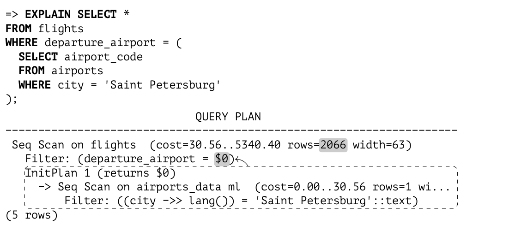
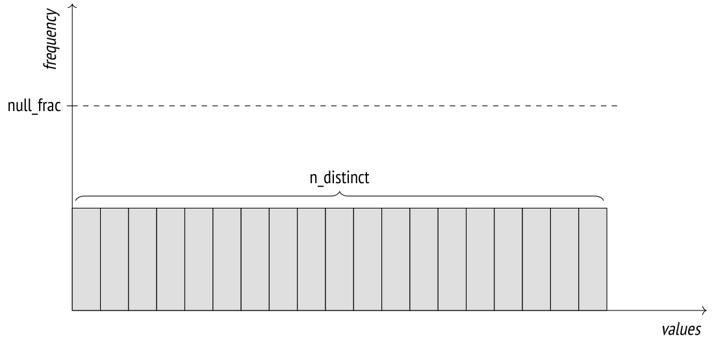
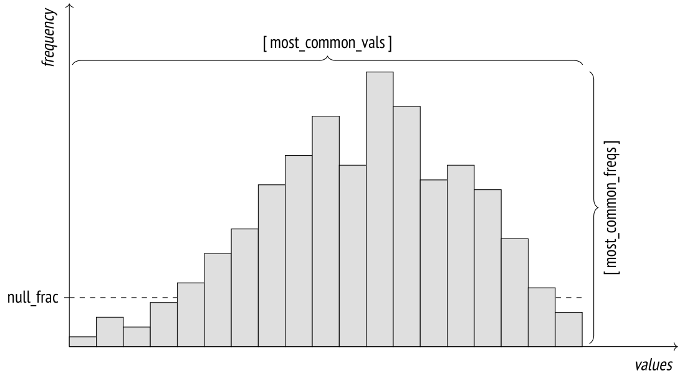
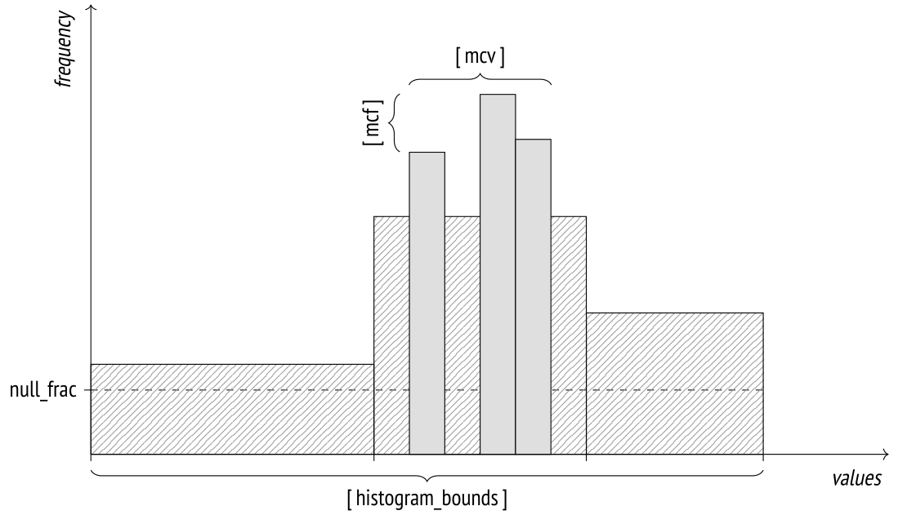
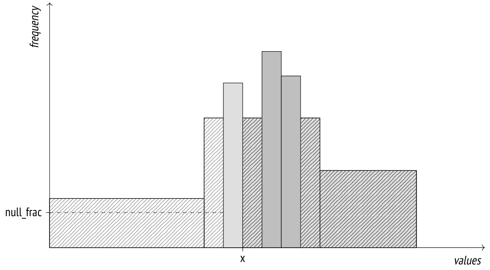

# Chương 17. Statistics (Thống kê)

## 17.1 Thống kê cơ bản (Basic Statistics)

Statistics cơ bản ở mức relation[^1] được lưu trong bảng `pg_class` của system catalog và bao gồm các dữ liệu sau:

- số tuple trong relation (`reltuples`)

- kích thước relation, tính bằng page (`relpages`)

- số page được đánh dấu trong visibility map (`relallvisible`) *[→ tr. 27](01-introduction.md)*

Dưới đây là các giá trị này cho bảng `flights`:

```
=> SELECT reltuples, relpages, relallvisible
FROM pg_class WHERE relname = 'flights';
 reltuples | relpages | relallvisible
-----------+----------+---------------
    214867 |     2624 |         2624
(1 row)
```

Nếu truy vấn không áp đặt điều kiện lọc nào, giá trị `reltuples` được dùng làm ước lượng cardinality (số dòng kết quả):

```
=> EXPLAIN SELECT * FROM flights;
                          QUERY PLAN
----------------------------------------------------------------
 Seq Scan on flights  (cost=0.00..4772.67 rows=214867 width=63)
(1 row)
```

Statistics được thu thập trong quá trình phân tích bảng (analyze), cả thủ công lẫn tự động.[^2] Hơn nữa, vì statistics cơ bản có tầm quan trọng hàng đầu, dữ liệu này cũng được tính toán trong một số thao tác khác (`VACUUM FULL` và `CLUSTER`,[^3] `CREATE INDEX` và `REINDEX`[^4]) và được tinh chỉnh trong quá trình vacuum.[^5] *[→ tr. 109](06-vacuum-and-autovacuum.md)*

Để phân tích, 300×*default_statistics_target* dòng ngẫu nhiên được lấy mẫu *(mặc định: 100)*. Kích thước mẫu cần thiết để xây dựng statistics với một độ chính xác nhất định ít phụ thuộc vào khối lượng dữ liệu được phân tích, nên kích thước của bảng không được tính đến.[^6]

Các dòng mẫu được chọn từ cùng số lượng (300 × *default_statistics_target*) page ngẫu nhiên.[^7] Hiển nhiên, nếu bản thân bảng nhỏ hơn, số page được đọc có thể ít hơn, và số dòng được chọn để phân tích cũng ít hơn.

Với các bảng lớn, việc thu thập statistics không bao gồm tất cả các dòng, nên các ước lượng có thể lệch khỏi giá trị thực tế. Điều này hoàn toàn bình thường: nếu dữ liệu đang thay đổi, statistics dù sao cũng không thể lúc nào cũng chính xác. Độ chính xác trong phạm vi một bậc độ lớn thường là đủ để chọn được một plan phù hợp.

Hãy tạo một bản sao của bảng `flights` với autovacuum bị tắt, để chúng ta có thể kiểm soát thời điểm bắt đầu autoanalyze:

```
=> CREATE TABLE flights_copy(LIKE flights)
WITH (autovacuum_enabled = false);
```

Bảng mới chưa có statistics nào:

```
=> SELECT reltuples, relpages, relallvisible
FROM pg_class WHERE relname = 'flights_copy';
 reltuples | relpages | relallvisible
-----------+----------+---------------
        -1 |        0 |            0
(1 row)
```

Giá trị `reltuples` = -1 được dùng để phân biệt giữa một bảng chưa được phân tích và một bảng thực sự rỗng, không có dòng nào *(v. 14)*.

Rất có khả năng một số dòng sẽ được chèn vào bảng ngay sau khi nó được tạo. Vì vậy, khi không biết tình trạng hiện tại, planner giả định rằng bảng chứa 10 page:

```
=> EXPLAIN SELECT * FROM flights_copy;
```

```
                          QUERY PLAN
-----------------------------------------------------------------
 Seq Scan on flights_copy (cost=0.00..14.10 rows=410 width=170)
(1 row)
```

Số dòng được ước lượng dựa trên kích thước của một dòng đơn lẻ, được hiển thị trong plan dưới dạng `width`. Độ rộng dòng thường là một giá trị trung bình được tính trong quá trình phân tích, nhưng vì chưa có statistics nào được thu thập, ở đây nó chỉ là một giá trị xấp xỉ dựa trên kiểu dữ liệu của các cột.[^8]

Bây giờ hãy sao chép dữ liệu từ bảng `flights` và thực hiện phân tích:

```
=> INSERT INTO flights_copy SELECT * FROM flights;
INSERT 0 214867
=> ANALYZE flights_copy;
```

Statistics thu thập được phản ánh đúng số dòng thực tế (kích thước bảng đủ nhỏ để bộ phân tích thu thập statistics trên toàn bộ dữ liệu):

```
=> SELECT reltuples, relpages, relallvisible
FROM pg_class WHERE relname = 'flights_copy';
 reltuples | relpages | relallvisible
-----------+----------+---------------
    214867 |     2624 |            0
(1 row)
```

Giá trị `relallvisible` được dùng để ước lượng cost của index-only scan. Giá trị này được cập nhật bởi `VACUUM` *[→ tr. 337](20-index-scans.md)*:

```
=> VACUUM flights_copy;
=> SELECT relallvisible FROM pg_class WHERE relname = 'flights_copy';
 relallvisible
---------------
          2624
(1 row)
```

Bây giờ hãy tăng gấp đôi số dòng mà không cập nhật statistics và kiểm tra ước lượng cardinality trong query plan:

```
=> INSERT INTO flights_copy SELECT * FROM flights;
=> SELECT count(*) FROM flights_copy;
 count
--------
 429734
(1 row)
```

```
=> EXPLAIN SELECT * FROM flights_copy;
                            QUERY PLAN
---------------------------------------------------------------------
 Seq Scan on flights_copy (cost=0.00..9545.34 rows=429734 width=63)
(1 row)
```

Mặc dù dữ liệu trong `pg_class` đã lỗi thời, ước lượng hóa ra vẫn chính xác:

```
=> SELECT reltuples, relpages
FROM pg_class WHERE relname = 'flights_copy';
 reltuples | relpages
-----------+----------
    214867 |     2624
(1 row)
```

Vấn đề là nếu planner thấy có chênh lệch giữa `relpages` và kích thước file thực tế, nó có thể co giãn giá trị `reltuples` để cải thiện độ chính xác của ước lượng.[^9] Vì kích thước file đã tăng gấp đôi so với `relpages`, planner điều chỉnh số dòng ước lượng, với giả định rằng mật độ dữ liệu vẫn giữ nguyên:

```
=> SELECT reltuples *
  (pg_relation_size('flights_copy') / 8192) / relpages AS tuples
FROM pg_class WHERE relname = 'flights_copy';
 tuples
--------
 429734
(1 row)
```

Đương nhiên, sự điều chỉnh như vậy không phải lúc nào cũng hiệu quả (ví dụ, nếu chúng ta xóa một số dòng, ước lượng sẽ vẫn giữ nguyên), nhưng trong một số trường hợp nó cho phép planner cầm cự cho đến khi những thay đổi đáng kể kích hoạt lần phân tích tiếp theo.

## 17.2 Giá trị NULL (NULL Values)

Dù bị các nhà lý thuyết chê bai,[^10] giá trị NULL vẫn đóng vai trò quan trọng trong các cơ sở dữ liệu quan hệ: chúng cung cấp một cách tiện lợi để phản ánh việc một giá trị hoặc là chưa biết, hoặc là không tồn tại.

Tuy nhiên, một giá trị đặc biệt đòi hỏi cách xử lý đặc biệt. Ngoài những điểm bất nhất về mặt lý thuyết, còn có nhiều thách thức thực tế cần được tính đến. Logic Boolean thông thường được thay thế bằng logic ba giá trị, nên `NOT IN` hoạt động *một cách bất ngờ*.

Không rõ liệu giá trị NULL nên được coi là lớn hơn hay nhỏ hơn các giá trị thông thường (do đó mới có các mệnh đề `NULLS FIRST` và `NULLS LAST` cho việc sắp xếp). Cũng không hoàn toàn hiển nhiên liệu các hàm tổng hợp (aggregate function) có phải tính đến giá trị NULL hay không. Nói một cách chặt chẽ, giá trị NULL hoàn toàn không phải là giá trị, nên planner cần thêm thông tin để xử lý chúng.

Ngoài statistics cơ bản đơn giản nhất được thu thập ở mức relation, bộ phân tích còn thu thập statistics cho từng cột của relation. Dữ liệu này được lưu trong bảng `pg_statistic` của system catalog,[^11] nhưng bạn cũng có thể truy cập nó qua view `pg_stats`, view này cung cấp thông tin ở định dạng thuận tiện hơn.

*Tỷ lệ giá trị NULL* thuộc về statistics ở mức cột; nó được tính trong quá trình phân tích và được hiển thị dưới dạng thuộc tính `null_frac`.

Ví dụ, khi tìm các chuyến bay chưa cất cánh, chúng ta có thể dựa vào việc thời gian khởi hành của chúng chưa được xác định:

```
=> EXPLAIN SELECT * FROM flights WHERE actual_departure IS NULL;
                         QUERY PLAN
---------------------------------------------------------------
 Seq Scan on flights  (cost=0.00..4772.67 rows=16702 width=63)
   Filter: (actual_departure IS NULL)
(2 rows)
```

Để ước lượng kết quả, planner nhân tổng số dòng với tỷ lệ giá trị NULL:

```
=> SELECT round(reltuples * s.null_frac) AS rows
FROM pg_class
  JOIN pg_stats s ON s.tablename = relname
WHERE s.tablename = 'flights'
  AND s.attname = 'actual_departure';
 rows
-------
 16702
(1 row)
```

Và đây là số dòng thực tế:

```
=> SELECT count(*) FROM flights WHERE actual_departure IS NULL;
 count
-------
 16348
(1 row)
```

## 17.3 Giá trị phân biệt (Distinct Values)

Trường `n_distinct` của view `pg_stats` cho biết số giá trị phân biệt (distinct) trong một cột.

Nếu `n_distinct` âm, giá trị tuyệt đối của nó biểu thị tỷ lệ giá trị phân biệt trong cột chứ không phải số lượng thực tế của chúng. Ví dụ, -1 cho biết tất cả giá trị của cột là duy nhất, còn -3 nghĩa là trung bình mỗi giá trị xuất hiện trong ba dòng. Bộ phân tích dùng tỷ lệ nếu số giá trị phân biệt ước lượng vượt quá 10% tổng số dòng; trong trường hợp này, các cập nhật dữ liệu sau đó khó có khả năng làm thay đổi tỷ lệ này.[^12]

Nếu dữ liệu được kỳ vọng phân bố đều, số giá trị phân biệt sẽ được sử dụng. Ví dụ, khi ước lượng cardinality của điều kiện “*column* = *expression*”, planner giả định rằng *expression* có thể nhận bất kỳ giá trị nào của cột với xác suất như nhau nếu giá trị chính xác của nó chưa biết ở giai đoạn lập plan:[^13]

```
=> EXPLAIN SELECT *
FROM flights
WHERE departure_airport = (
  SELECT airport_code
  FROM airports
  WHERE city = 'Saint Petersburg'
);
                            QUERY PLAN
---------------------------------------------------------------------
 Seq Scan on flights  (cost=30.56..5340.40 rows=2066 width=63)
   Filter: (departure_airport = $0)
   InitPlan 1 (returns $0)
     -> Seq Scan on airports_data ml (cost=0.00..30.56 rows=1 wi...
         Filter: ((city ->> lang()) = 'Saint Petersburg'::text)
(5 rows)
```



Ở đây node `InitPlan` chỉ được thực thi một lần, và giá trị tính được sẽ được dùng trong plan chính.

```
=> SELECT round(reltuples / s.n_distinct) AS rows
FROM pg_class
  JOIN pg_stats s ON s.tablename = relname
WHERE s.tablename = 'flights'
  AND s.attname = 'departure_airport';
 rows
------
 2066
(1 row)
```



Nếu số giá trị phân biệt ước lượng không chính xác (do chỉ một số lượng dòng hạn chế được phân tích), nó có thể được ghi đè ở mức cột:

```
ALTER TABLE ...
  ALTER COLUMN ...
  SET (n_distinct = ...);
```

Nếu mọi dữ liệu luôn có phân bố đều, thông tin này (cùng với giá trị nhỏ nhất và lớn nhất) sẽ là đủ. Tuy nhiên, với phân bố không đều (điều phổ biến hơn nhiều trong thực tế), ước lượng như vậy là không chính xác:

```
=> SELECT min(cnt), round(avg(cnt)) avg, max(cnt)
FROM (
  SELECT departure_airport, count(*) cnt
  FROM flights
  GROUP BY departure_airport
) t;
 min | avg  |  max
-----+------+-------
 113 | 2066 | 20875
(1 row)
```

## 17.4 Giá trị phổ biến nhất (Most Common Values)

Nếu phân bố dữ liệu không đều, ước lượng được tinh chỉnh dựa trên statistics về các giá trị phổ biến nhất (MCV — most common values) và tần suất của chúng. View `pg_stats` hiển thị các mảng này lần lượt trong các trường `most_common_vals` và `most_common_freqs`.



Dưới đây là một ví dụ về statistics như vậy đối với các loại máy bay khác nhau:

```
=> SELECT most_common_vals AS mcv,
  left(most_common_freqs::text,60) || '...' AS mcf
FROM pg_stats
WHERE tablename = 'flights' AND attname = 'aircraft_code' \gx
-[ RECORD 1 ]--------------------------------------------------------
mcv | {CN1,CR2,SU9,321,733,763,319,773}
mcf | {0.27886668,0.27266666,0.26176667,0.057166666,0.037666667,0....
```

Để ước lượng selectivity của điều kiện “*column* = *value*”, chỉ cần tìm giá trị này trong mảng `most_common_vals` và lấy tần suất của nó từ phần tử của mảng `most_common_freqs` có cùng chỉ số:[^14]

```
=> EXPLAIN SELECT * FROM flights WHERE aircraft_code = '733';
                         QUERY PLAN
--------------------------------------------------------------
 Seq Scan on flights  (cost=0.00..5309.84 rows=8093 width=63)
   Filter: (aircraft_code = '733'::bpchar)
(2 rows)
```

```
=> SELECT round(reltuples * s.most_common_freqs[
  array_position((s.most_common_vals::text::text[]),'733')
])
FROM pg_class
  JOIN pg_stats s ON s.tablename = relname
WHERE s.tablename = 'flights'
  AND s.attname = 'aircraft_code';
```

```
 round
-------
  8093
(1 row)
```

Hiển nhiên là ước lượng như vậy sẽ gần với giá trị thực tế:

```
=> SELECT count(*) FROM flights WHERE aircraft_code = '733';
 count
-------
  8263
(1 row)
```

Danh sách MCV cũng được dùng để ước lượng selectivity của các điều kiện bất đẳng thức. Ví dụ, một điều kiện như “*column* < *value*” yêu cầu bộ phân tích tìm trong `most_common_vals` tất cả các giá trị nhỏ hơn giá trị đích và cộng dồn các tần suất tương ứng được liệt kê trong `most_common_freqs`.[^15]

Statistics MCV hoạt động tốt nhất khi số giá trị phân biệt không quá nhiều. Kích thước tối đa của các mảng được xác định bởi tham số *default_statistics_target* *(mặc định: 100)*, tham số này cũng giới hạn số dòng được lấy mẫu ngẫu nhiên cho mục đích phân tích.

Trong một số trường hợp, việc tăng giá trị mặc định của tham số là hợp lý, nhờ đó mở rộng danh sách MCV và cải thiện độ chính xác của ước lượng. Bạn có thể làm điều này ở mức cột:

```
ALTER TABLE ...
  ALTER COLUMN ...
  SET STATISTICS ...;
```

Kích thước mẫu cũng sẽ tăng, nhưng chỉ cho bảng được chỉ định.

Vì mảng MCV lưu các giá trị thực tế, nó có thể chiếm khá nhiều không gian. Để giữ kích thước `pg_statistic` trong tầm kiểm soát và tránh bắt planner làm những việc vô ích, các giá trị lớn hơn 1 kB bị loại khỏi quá trình phân tích và statistics. Nhưng vì những giá trị lớn như vậy nhiều khả năng là duy nhất, dù sao chúng có lẽ cũng không lọt được vào `most_common_vals`.

## 17.5 Histogram

Nếu số giá trị phân biệt quá nhiều để có thể lưu trong một mảng, PostgreSQL sử dụng histogram. Trong trường hợp này, các giá trị được phân bố vào một số *bucket* (ngăn) của histogram. Số bucket cũng bị giới hạn bởi tham số *default_statistics_target*.



Độ rộng bucket được chọn sao cho mỗi bucket nhận được xấp xỉ cùng số lượng giá trị (tính chất này được thể hiện trong sơ đồ bằng việc các hình chữ nhật lớn được tô gạch có diện tích bằng nhau). Các giá trị nằm trong danh sách MCV không được tính đến. Kết quả là, tần suất tích lũy của các giá trị trong mỗi bucket bằng 1 / (số bucket).

Histogram được lưu trong trường `histogram_bounds` của view `pg_stats` dưới dạng một mảng các giá trị biên của các bucket:

```
=> SELECT left(histogram_bounds::text,60) || '...' AS hist_bounds
FROM pg_stats s
WHERE s.tablename = 'boarding_passes'
  AND s.attname = 'seat_no';
                          hist_bounds
-----------------------------------------------------------------
 {10B,10E,10F,10F,11H,12B,13B,14B,14H,15G,16B,17B,17H,19B,19B...
(1 row)
```

Kết hợp với danh sách MCV, histogram được dùng cho các thao tác như ước lượng selectivity của các điều kiện *lớn hơn* và *nhỏ hơn*.[^16]

Ví dụ, hãy xem số lượng thẻ lên máy bay (boarding pass) được cấp cho các hàng ghế phía sau:



```
=> EXPLAIN SELECT *
FROM boarding_passes
WHERE seat_no > '30B';
                            QUERY PLAN
---------------------------------------------------------------------
 Seq Scan on boarding_passes (cost=0.00..157350.10 rows=2983242 ...
   Filter: ((seat_no)::text > '30B'::text)
(2 rows)
```

Tôi cố ý chọn số ghế nằm đúng trên ranh giới giữa hai bucket của histogram.

Selectivity của điều kiện này sẽ được ước lượng bằng 𝑁 / (số bucket), trong đó 𝑁 là số bucket chứa các giá trị thỏa mãn điều kiện (tức là những bucket nằm bên phải giá trị được chỉ định). Cũng phải tính đến việc các MCV không được đưa vào histogram.

Nhân tiện, giá trị NULL cũng không xuất hiện trong histogram, nhưng dù sao cột `seat_no` cũng không chứa giá trị nào như vậy:

```
=> SELECT s.null_frac FROM pg_stats s
WHERE s.tablename = 'boarding_passes'
  AND s.attname = 'seat_no';
 null_frac
-----------
         0
(1 row)
```

Trước tiên, hãy tìm tỷ lệ các MCV thỏa mãn điều kiện:

```
=> SELECT sum(s.most_common_freqs[
  array_position((s.most_common_vals::text::text[]),v)
])
FROM pg_stats s, unnest(s.most_common_vals::text::text[]) v
WHERE s.tablename = 'boarding_passes' AND s.attname = 'seat_no'
  AND v > '30B';
    sum
------------
 0.21226665
(1 row)
```

Tổng tỷ phần MCV (phần bị histogram bỏ qua) là:

```
=> SELECT sum(s.most_common_freqs[
  array_position((s.most_common_vals::text::text[]),v)
])
FROM pg_stats s, unnest(s.most_common_vals::text::text[]) v
WHERE s.tablename = 'boarding_passes' AND s.attname = 'seat_no';
    sum
------------
 0.67816657
(1 row)
```

Vì các giá trị thỏa mãn điều kiện đã chỉ định chiếm đúng 𝑁 bucket (trong tổng số 100 bucket có thể có), chúng ta nhận được ước lượng sau:

```
=> SELECT round( reltuples * (
    0.21226665 -- MCV share
  + (1 - 0.67816657 - 0) * (51 / 100.0) -- histogram share
))
FROM pg_class
WHERE relname = 'boarding_passes';
  round
---------
 2983242
(1 row)
```

Trong trường hợp tổng quát với các giá trị không nằm trên biên, planner áp dụng nội suy tuyến tính để tính đến phần bucket chứa giá trị đích.

Đây là số ghế phía sau thực tế:

```
=> SELECT count(*) FROM boarding_passes WHERE seat_no > '30B';
  count
---------
 2993735
(1 row)
```

Khi bạn tăng giá trị *default_statistics_target*, độ chính xác của ước lượng có thể được cải thiện, nhưng như ví dụ của chúng ta cho thấy, histogram kết hợp với danh sách MCV thường cho kết quả tốt ngay cả khi cột chứa nhiều giá trị duy nhất:

```
=> SELECT n_distinct FROM pg_stats
WHERE tablename = 'boarding_passes' AND attname = 'seat_no';
 n_distinct
------------
        461
(1 row)
```

Chỉ nên cải thiện độ chính xác của ước lượng nếu điều đó dẫn đến việc lập plan tốt hơn. Tăng giá trị *default_statistics_target* mà không cân nhắc kỹ có thể làm chậm việc lập plan và phân tích mà không mang lại lợi ích gì. Mặt khác, giảm giá trị tham số này (xuống tới 0) có thể dẫn đến việc chọn một plan tồi, dù nó thực sự làm tăng tốc việc lập plan và phân tích. Sự tiết kiệm như vậy thường không đáng.

## 17.6 Statistics cho kiểu dữ liệu không vô hướng (Statistics for Non-Scalar Data Types)

Với các kiểu dữ liệu không vô hướng (non-scalar), PostgreSQL có thể thu thập statistics không chỉ về phân bố của các giá trị, mà còn về phân bố của các phần tử dùng để cấu thành những giá trị này. Điều này cải thiện độ chính xác của việc lập plan khi bạn truy vấn các cột không tuân theo dạng chuẩn thứ nhất (first normal form).

- Các mảng `most_common_elems` và `most_common_elem_freqs` cho biết danh sách các *phần tử phổ biến nhất* và tần suất sử dụng của chúng.

- Các statistics này được thu thập và dùng để ước lượng selectivity của các thao tác trên mảng[^17] và kiểu dữ liệu `tsvector`[^18].

- Mảng `elem_count_histogram` cho biết histogram của *số phần tử phân biệt* trong một giá trị.

- Dữ liệu này được thu thập và dùng để ước lượng selectivity chỉ cho các thao tác trên mảng.

- Với các kiểu range, PostgreSQL xây dựng các histogram phân bố cho độ dài range cũng như biên dưới và biên trên của range. Các histogram này được dùng để ước lượng selectivity của nhiều thao tác khác nhau trên các kiểu này,[^19] nhưng view `pg_stats` không hiển thị chúng.

- Statistics tương tự cũng được thu thập cho các kiểu dữ liệu multirange.[^20] *(v. 14)*

## 17.7 Độ rộng trung bình của trường (Average Field Width)

Trường `avg_width` của view `pg_stats` cho biết kích thước trung bình của các giá trị được lưu trong một cột. Đương nhiên, với các kiểu như `integer` hay `char(3)` kích thước này luôn giống nhau, nhưng với các kiểu dữ liệu có độ dài thay đổi, như `text`, nó có thể khác nhau rất nhiều giữa các cột:

```
=> SELECT attname, avg_width FROM pg_stats
WHERE (tablename, attname) IN ( VALUES
  ('tickets', 'passenger_name'), ('ticket_flights','fare_conditions')
);
     attname     | avg_width
-----------------+-----------
 fare_conditions |        8
 passenger_name  |       16
(2 rows)
```

Statistic này được dùng để ước lượng lượng bộ nhớ cần thiết cho các thao tác như sort hay hashing.

## 17.8 Correlation (Tương quan)

Trường `correlation` của view `pg_stats` cho biết mức tương quan giữa thứ tự vật lý của dữ liệu và thứ tự logic được xác định bởi các phép so sánh. Nếu các giá trị được lưu theo thứ tự tăng dần nghiêm ngặt, correlation của chúng sẽ gần bằng 1; nếu chúng được sắp xếp theo thứ tự giảm dần, correlation sẽ gần bằng -1. Dữ liệu phân bố trên đĩa càng hỗn loạn, correlation càng gần 0.

```
=> SELECT attname, correlation
FROM pg_stats WHERE tablename = 'airports_data'
ORDER BY abs(correlation) DESC;
```

```
   attname    | correlation
--------------+-------------
 coordinates  |
 airport_code | -0.21120238
 city         |  -0.1970127
 airport_name | -0.18223621
 timezone     |  0.17961165
(5 rows)
```

Lưu ý rằng statistic này không được thu thập cho cột `coordinates`: các toán tử *nhỏ hơn* và *lớn hơn* không được định nghĩa cho kiểu `point`.

Correlation được dùng để ước lượng cost của index scan. *[→ tr. 331](20-index-scans.md)*

## 17.9 Statistics cho biểu thức (Expression Statistics)

Statistics ở mức cột chỉ có thể được sử dụng nếu vế trái hoặc vế phải của phép so sánh tham chiếu đến chính cột đó và không chứa biểu thức nào. Ví dụ, planner không thể dự đoán việc tính một hàm trên một cột sẽ ảnh hưởng thế nào đến statistics, nên với các điều kiện như “*function-call* = *constant*” selectivity luôn được ước lượng là 0.5%:[^21]

```
=> EXPLAIN SELECT * FROM flights
WHERE extract(
  month FROM scheduled_departure AT TIME ZONE 'Europe/Moscow'
) = 1;
                            QUERY PLAN
---------------------------------------------------------------------
 Seq Scan on flights  (cost=0.00..6384.17 rows=1074 width=63)
   Filter: (EXTRACT(month FROM (scheduled_departure AT TIME ZONE ...
(2 rows)
=> SELECT round(reltuples * 0.005)
FROM pg_class WHERE relname = 'flights';
 round
-------
  1074
(1 row)
```

Planner không biết gì về ngữ nghĩa của các hàm, kể cả các hàm chuẩn. Hiểu biết chung của chúng ta cho thấy các chuyến bay thực hiện trong tháng Một sẽ chiếm khoảng 1/12 tổng số chuyến bay, vượt giá trị dự đoán một bậc độ lớn.

Để cải thiện ước lượng, chúng ta phải thu thập statistics cho biểu thức thay vì dựa vào statistics ở mức cột. Có hai cách để làm việc này.

### Extended statistics cho biểu thức (Extended Expression Statistics) *(v. 14)*

Lựa chọn đầu tiên là sử dụng *extended expression statistics* (statistics mở rộng cho biểu thức).[^22] Các statistics này không được thu thập mặc định; bạn phải tự tạo đối tượng cơ sở dữ liệu tương ứng bằng cách chạy lệnh `CREATE STATISTICS`:

```
=> CREATE STATISTICS flights_expr ON (extract(
    month FROM scheduled_departure AT TIME ZONE 'Europe/Moscow'
))
FROM flights;
```

Khi dữ liệu đã được thu thập, độ chính xác của ước lượng được cải thiện:

```
=> ANALYZE flights;
=> EXPLAIN SELECT * FROM flights
WHERE extract(
  month FROM scheduled_departure AT TIME ZONE 'Europe/Moscow'
) = 1;
                            QUERY PLAN
---------------------------------------------------------------------
 Seq Scan on flights  (cost=0.00..6384.17 rows=16667 width=63)
   Filter: (EXTRACT(month FROM (scheduled_departure AT TIME ZONE ...
(2 rows)
```

Để statistics đã thu thập được áp dụng, truy vấn phải chỉ định biểu thức ở đúng dạng đã được dùng trong lệnh `CREATE STATISTICS`.

Giới hạn kích thước cho extended statistics có thể được điều chỉnh riêng, bằng cách chạy lệnh `ALTER STATISTICS` *(v. 13)*. Ví dụ:

```
=> ALTER STATISTICS flights_expr SET STATISTICS 42;
```

Toàn bộ metadata liên quan đến extended statistics được lưu trong bảng `pg_statistic_ext` của system catalog, còn bản thân dữ liệu thu thập được nằm trong một bảng riêng tên là `pg_statistic_ext_data`. Sự tách biệt này được dùng để hiện thực kiểm soát truy cập đối với thông tin nhạy cảm. *(v. 12)*

Extended expression statistics mà một người dùng cụ thể có quyền truy cập có thể được hiển thị ở định dạng thuận tiện hơn trong một view riêng:

```
=> SELECT left(expr,50) || '...' AS expr,
  null_frac, avg_width, n_distinct,
  most_common_vals AS mcv,
  left(most_common_freqs::text,50) || '...' AS mcf,
  correlation
FROM pg_stats_ext_exprs
WHERE statistics_name = 'flights_expr' \gx
-[ RECORD 1 ]------------------------------------------------------
expr        | EXTRACT(month FROM (scheduled_departure AT TIME ZO...
null_frac   | 0
avg_width   | 8
n_distinct  | 12
mcv         | {8,9,12,3,1,5,6,7,11,10,4,2}
mcf         | {0.12053333,0.11326667,0.0802,0.07976667,0.0775666...
correlation | 0.08355749
```

### Statistics cho expression index (Statistics for Expression Indexes)

Một cách khác để cải thiện ước lượng cardinality là sử dụng statistics đặc biệt được thu thập cho expression index (index trên biểu thức); các statistics này được thu thập tự động khi một index như vậy được tạo, giống hệt như đối với bảng *[→ tr. 319](19-index-access-methods.md)*. Nếu index thực sự cần thiết, cách tiếp cận này hóa ra rất tiện lợi.

```
=> DROP STATISTICS flights_expr;
```

```
=> CREATE INDEX ON flights(extract(
  month FROM scheduled_departure AT TIME ZONE 'Europe/Moscow'
));
```

```
=> ANALYZE flights;
```

```
=> EXPLAIN SELECT * FROM flights
WHERE extract(
  month FROM scheduled_departure AT TIME ZONE 'Europe/Moscow'
) = 1;
                            QUERY PLAN
---------------------------------------------------------------------
 Bitmap Heap Scan on flights (cost=324.86..3247.92 rows=17089 wi...
   Recheck Cond: (EXTRACT(month FROM (scheduled_departure AT TIME...
   -> Bitmap Index Scan on flights_extract_idx (cost=0.00..320.5...
       Index Cond: (EXTRACT(month FROM (scheduled_departure AT TI...
(4 rows)
```

Statistics cho expression index được lưu theo cùng cách như statistics cho bảng. Ví dụ, bạn có thể lấy số giá trị phân biệt bằng cách chỉ định tên index làm `tablename` khi truy vấn `pg_stats`:

```
=> SELECT n_distinct FROM pg_stats
WHERE tablename = 'flights_extract_idx';
 n_distinct
------------
         12
(1 row)
```

Bạn có thể điều chỉnh độ chính xác của statistics liên quan đến index bằng lệnh `ALTER INDEX` *(v. 11)*. Nếu không biết tên cột tương ứng với biểu thức được đánh index, trước tiên bạn phải tìm ra nó.

Ví dụ:

```
=> SELECT attname FROM pg_attribute
WHERE attrelid = 'flights_extract_idx'::regclass;
 attname
---------
 extract
(1 row)
=> ALTER INDEX flights_extract_idx
  ALTER COLUMN extract SET STATISTICS 42;
```

## 17.10 Statistics đa biến (Multivariate Statistics)

Cũng có thể thu thập *multivariate statistics* (statistics đa biến), loại statistics trải trên nhiều cột của bảng. Điều kiện tiên quyết là bạn phải tự tạo extended statistics tương ứng bằng lệnh `CREATE STATISTICS`.

PostgreSQL hiện thực ba loại multivariate statistics.

### Phụ thuộc hàm giữa các cột (Functional Dependencies Between Columns) *(v. 10)*

Nếu giá trị trong một cột phụ thuộc (hoàn toàn hoặc một phần) vào giá trị trong một cột khác và các điều kiện lọc bao gồm cả hai cột này, cardinality sẽ bị ước lượng thấp.

Hãy xem xét một truy vấn với hai điều kiện lọc:

```
=> SELECT count(*) FROM flights
WHERE flight_no = 'PG0007' AND departure_airport = 'VKO';
 count
-------
   396
(1 row)
```

Giá trị này bị ước lượng thấp hơn rất nhiều:

```
=> EXPLAIN SELECT * FROM flights
WHERE flight_no = 'PG0007' AND departure_airport = 'VKO';
                            QUERY PLAN
---------------------------------------------------------------------
 Bitmap Heap Scan on flights (cost=10.49..816.84 rows=15 width=63)
   Recheck Cond: (flight_no = 'PG0007'::bpchar)
   Filter: (departure_airport = 'VKO'::bpchar)
   -> Bitmap Index Scan on flights_flight_no_scheduled_departure_key
       (cost=0.00..10.49 rows=276 width=0)
       Index Cond: (flight_no = 'PG0007'::bpchar)
(6 rows)
```

Đây là một *vấn đề về các vị từ tương quan* (problem of correlated predicates) nổi tiếng. Planner giả định rằng các vị từ không phụ thuộc vào nhau, nên selectivity tổng thể được ước lượng bằng tích các selectivity của những điều kiện lọc được kết hợp bởi phép AND logic. Plan ở trên minh họa rõ vấn đề này *[→ tr. 263](16-query-execution-stages.md)*: giá trị được node `Bitmap Index Scan` ước lượng cho điều kiện trên cột `flight_no` bị giảm đáng kể khi node `Bitmap Heap Scan` lọc kết quả theo điều kiện trên cột `departure_airport`.

Tuy nhiên, chúng ta hiểu rằng sân bay được xác định một cách đơn nghĩa bởi số hiệu chuyến bay: điều kiện thứ hai thực tế là dư thừa (tất nhiên, trừ khi có sai sót trong tên sân bay). Trong những trường hợp như vậy, chúng ta có thể cải thiện ước lượng bằng cách áp dụng extended statistics về phụ thuộc hàm (functional dependency).

Hãy tạo một extended statistic về phụ thuộc hàm giữa hai cột:

```
=> CREATE STATISTICS flights_dep(dependencies)
ON flight_no, departure_airport FROM flights;
```

Lần phân tích tiếp theo sẽ thu thập statistic này, và ước lượng được cải thiện:

```
=> ANALYZE flights;
=> EXPLAIN SELECT * FROM flights
WHERE flight_no = 'PG0007'
  AND departure_airport = 'VKO';
                            QUERY PLAN
---------------------------------------------------------------------
 Bitmap Heap Scan on flights (cost=10.57..819.51 rows=277 width=63)
   Recheck Cond: (flight_no = 'PG0007'::bpchar)
   Filter: (departure_airport = 'VKO'::bpchar)
   -> Bitmap Index Scan on flights_flight_no_scheduled_departure_key
       (cost=0.00..10.50 rows=277 width=0)
       Index Cond: (flight_no = 'PG0007'::bpchar)
(6 rows)
```

Statistics đã thu thập được lưu trong system catalog và có thể được truy cập như sau:

```
=> SELECT dependencies
FROM pg_stats_ext
WHERE statistics_name = 'flights_dep';
               dependencies
------------------------------------------
 {"2 => 5": 1.000000, "5 => 2": 0.010200}
(1 row)
```

Ở đây 2 và 5 là số thứ tự cột được lưu trong bảng `pg_attribute`, còn các giá trị tương ứng xác định mức độ phụ thuộc hàm: từ 0 (không phụ thuộc) đến 1 (giá trị trong cột thứ hai phụ thuộc hoàn toàn vào giá trị trong cột thứ nhất).

### Số giá trị phân biệt đa biến (Multivariate Number of Distinct Values) *(v. 10)*

Statistics về số tổ hợp duy nhất của các giá trị được lưu trong các cột khác nhau giúp cải thiện ước lượng cardinality của thao tác `GROUP BY` được thực hiện trên nhiều cột.

Ví dụ, ở đây số cặp sân bay đi và sân bay đến có thể có được ước lượng bằng bình phương tổng số sân bay; tuy nhiên, giá trị thực tế nhỏ hơn nhiều, vì không phải cặp nào cũng được nối bởi các chuyến bay thẳng:

```
=> SELECT count(*)
FROM (
  SELECT DISTINCT departure_airport, arrival_airport FROM flights
) t;
 count
-------
   618
(1 row)
=> EXPLAIN SELECT DISTINCT departure_airport, arrival_airport
FROM flights;
                            QUERY PLAN
--------------------------------------------------------------------
 HashAggregate  (cost=5847.01..5955.16 rows=10816 width=8)
   Group Key: departure_airport, arrival_airport
   -> Seq Scan on flights (cost=0.00..4772.67 rows=214867 width=8)
(3 rows)
```

Hãy định nghĩa và thu thập một extended statistic về các giá trị phân biệt:

```
=> CREATE STATISTICS flights_nd(ndistinct)
ON departure_airport, arrival_airport FROM flights;
=> ANALYZE flights;
```

Ước lượng cardinality đã được cải thiện:

```
=> EXPLAIN SELECT DISTINCT departure_airport, arrival_airport
FROM flights;
                            QUERY PLAN
--------------------------------------------------------------------
 HashAggregate  (cost=5847.01..5853.19 rows=618 width=8)
   Group Key: departure_airport, arrival_airport
   -> Seq Scan on flights (cost=0.00..4772.67 rows=214867 width=8)
(3 rows)
```

Bạn có thể xem statistic đã thu thập trong system catalog:

```
=> SELECT n_distinct
FROM pg_stats_ext
WHERE statistics_name = 'flights_nd';
  n_distinct
---------------
 {"5, 6": 618}
(1 row)
```

### Danh sách MCV đa biến (Multivariate MCV Lists) *(v. 12)*

Nếu phân bố của các giá trị không đều, chỉ dựa vào phụ thuộc hàm có thể là không đủ, vì độ chính xác của ước lượng sẽ phụ thuộc nhiều vào từng cặp giá trị cụ thể. Ví dụ, planner ước lượng thấp số chuyến bay do Boeing 737 thực hiện từ sân bay Sheremetyevo:

```
=> SELECT count(*)
FROM flights
WHERE departure_airport = 'SVO' AND aircraft_code = '733';
 count
-------
  2037
(1 row)
=> EXPLAIN SELECT *
FROM flights
WHERE departure_airport = 'SVO' AND aircraft_code = '733';
                            QUERY PLAN
---------------------------------------------------------------------
 Seq Scan on flights  (cost=0.00..5847.00 rows=736 width=63)
   Filter: ((departure_airport = 'SVO'::bpchar) AND (aircraft_cod...
(2 rows)
```

Trong trường hợp này, bạn có thể cải thiện ước lượng bằng cách thu thập statistics về danh sách MCV đa biến:[^23]

```
=> CREATE STATISTICS flights_mcv(mcv)
ON departure_airport, aircraft_code FROM flights;
=> ANALYZE flights;
```

Ước lượng cardinality mới chính xác hơn nhiều:

```
=> EXPLAIN SELECT *
FROM flights
WHERE departure_airport = 'SVO' AND aircraft_code = '733';
                            QUERY PLAN
---------------------------------------------------------------------
 Seq Scan on flights  (cost=0.00..5847.00 rows=1927 width=63)
   Filter: ((departure_airport = 'SVO'::bpchar) AND (aircraft_cod...
(2 rows)
```

Để có ước lượng này, planner dựa vào các giá trị tần suất được lưu trong system catalog:

```
=> SELECT values, frequency
FROM pg_statistic_ext stx
  JOIN pg_statistic_ext_data stxd ON stx.oid = stxd.stxoid,
  pg_mcv_list_items(stxdmcv) m
WHERE stxname = 'flights_mcv'
AND values = '{SVO,773}';
  values   |      frequency
-----------+----------------------
 {SVO,773} | 0.005266666666666667
(1 row)
```

Giống như một danh sách MCV thông thường, một danh sách đa biến chứa *default_statistics_target* giá trị *(mặc định: 100)* (nếu tham số này cũng được đặt ở mức cột, giá trị lớn nhất trong số đó sẽ được sử dụng).

Nếu cần, bạn cũng có thể thay đổi kích thước của danh sách, giống như cách làm với extended expression statistics *(v. 13)*:

```
ALTER STATISTICS ... SET STATISTICS ...;
```

Trong tất cả các ví dụ này, tôi chỉ dùng hai cột, nhưng bạn cũng có thể thu thập multivariate statistics trên nhiều cột hơn.

Để kết hợp statistics của nhiều loại trong một đối tượng, bạn có thể cung cấp danh sách các loại này, phân tách bằng dấu phẩy, trong định nghĩa của đối tượng. Nếu không chỉ định loại nào, PostgreSQL sẽ thu thập statistics của tất cả các loại có thể cho các cột được chỉ định.

Ngoài tên cột thực tế, multivariate statistics cũng có thể dùng các biểu thức tùy ý *(v. 14)*, giống như expression statistics.

[^1]: postgresql.org/docs/14/planner-stats.html
[^2]: backend/commands/analyze.c, hàm do_analyze_rel
[^3]: backend/commands/cluster.c, hàm copy_table_data
[^4]: backend/catalog/heap.c, hàm index_update_stats
[^5]: backend/access/heap/vacuumlazy.c, hàm heap_vacuum_rel
[^6]: backend/commands/analyze.c, hàm std_typanalyze
[^7]: backend/commands/analyze.c, hàm acquire_sample_rows  
backend/utils/misc/sampling.c
[^8]: backend/access/table/tableam.c, hàm table_block_relation_estimate_size
[^9]: backend/access/table/tableam.c, hàm table_block_relation_estimate_size
[^10]: sigmodrecord.org/publications/sigmodRecord/0809/p20.date.pdf
[^11]: include/catalog/pg_statistic.h
[^12]: backend/commands/analyze.c, hàm compute_distinct_stats
[^13]: backend/utils/adt/selfuncs.c, hàm var_eq_non_const
[^14]: backend/utils/adt/selfuncs.c, hàm var_eq_const
[^15]: backend/utils/adt/selfuncs.c, hàm scalarineqsel
[^16]: backend/utils/adt/selfuncs.c, hàm ineq_histogram_selectivity
[^17]: postgresql.org/docs/14/arrays.html  
backend/utils/adt/array_typanalyze.c  
backend/utils/adt/array_selfuncs.c
[^18]: postgresql.org/docs/14/datatype-textsearch.html  
backend/tsearch/ts_typanalyze.c  
backend/tsearch/ts_selfuncs.c
[^19]: postgresql.org/docs/14/rangetypes.html  
backend/utils/adt/rangetypes_typanalyze.c  
backend/utils/adt/rangetypes_selfuncs.c
[^20]: backend/utils/adt/multirangetypes_selfuncs.c
[^21]: backend/utils/adt/selfuncs.c, hàm eqsel
[^22]: postgresql.org/docs/14/planner-stats#PLANNER-STATS-EXTENDED.html  
backend/statistics/README
[^23]: backend/statistics/README.mcv  
backend/statistics/mcv.c
