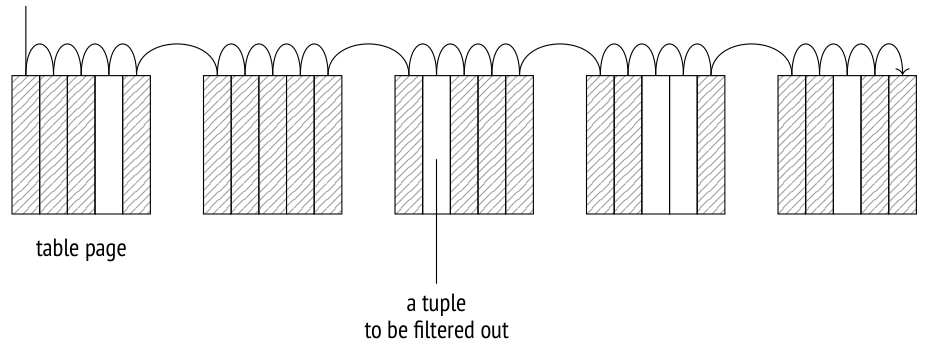
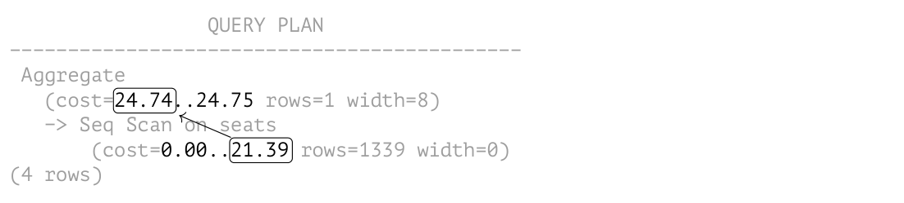
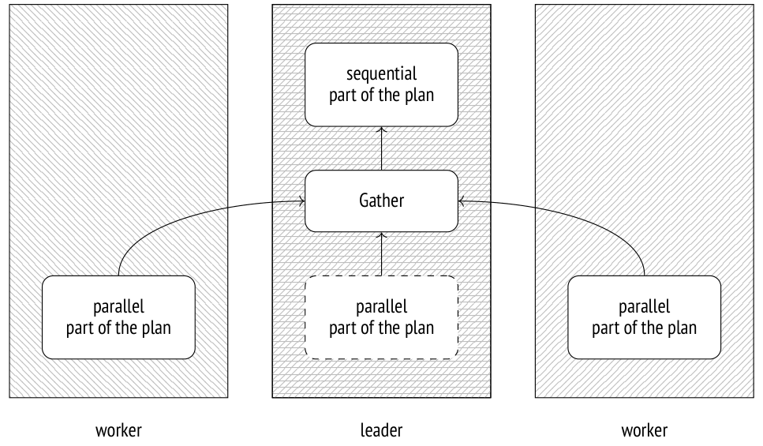
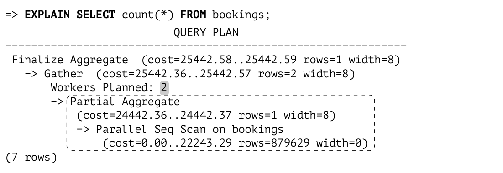
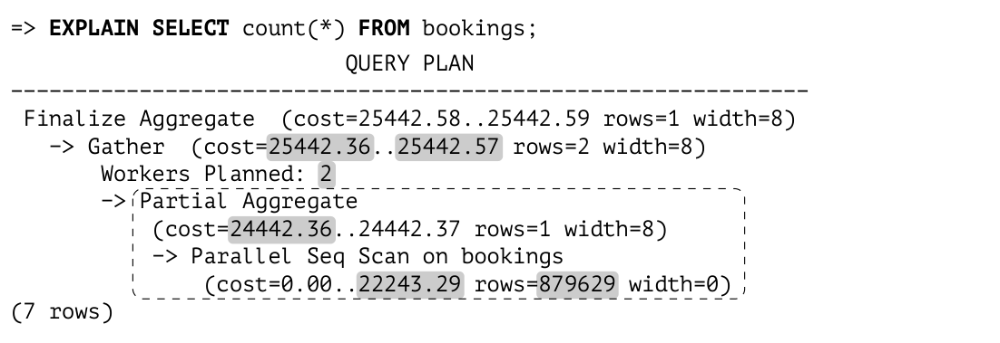
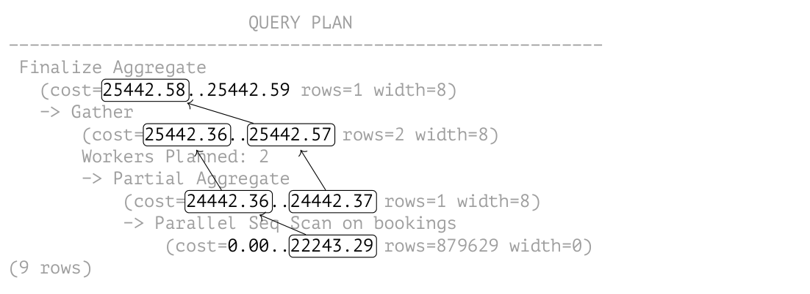
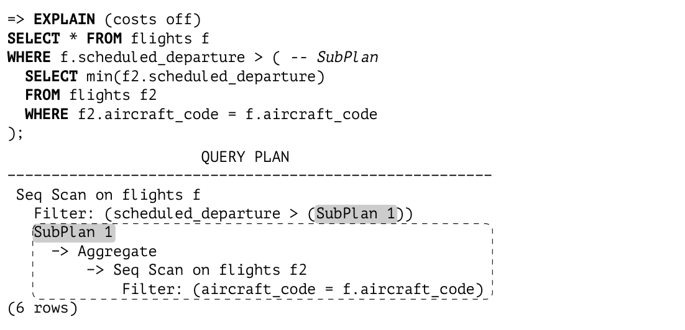
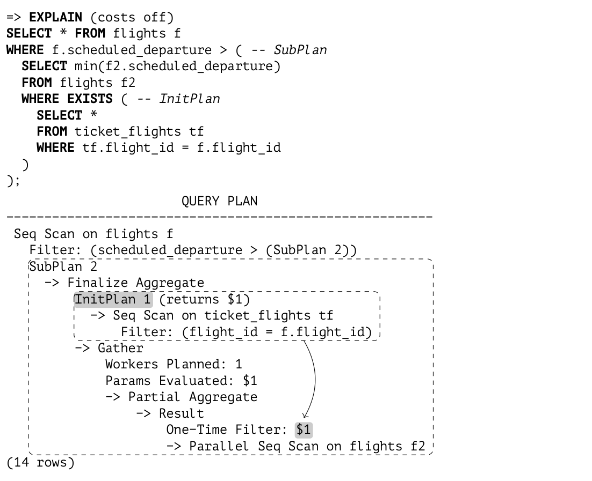

# Chương 18. Table Access Methods (Các phương thức truy cập bảng)

## 18.1 Storage engine dạng cắm được (Pluggable Storage Engines)

Cách bố trí dữ liệu mà PostgreSQL sử dụng không phải là cách duy nhất có thể, cũng không phải là cách tốt nhất cho mọi loại tải. Theo tinh thần khả năng mở rộng, PostgreSQL cho phép bạn tạo và cắm vào *(v. 12)* nhiều *table access method* (phương thức truy cập bảng — tức pluggable storage engine) khác nhau, nhưng hiện tại chỉ có một phương thức được cung cấp sẵn:

```
=> SELECT amname, amhandler FROM pg_am WHERE amtype = 't';
 amname |      amhandler
--------+----------------------
 heap   | heap_tableam_handler
(1 row)
```

Bạn có thể chỉ định engine sẽ dùng khi tạo bảng (`CREATE TABLE ... USING`); nếu không, engine mặc định được liệt kê trong tham số *default_table_access_method* sẽ được áp dụng. *(mặc định: heap)*

Để lõi PostgreSQL có thể làm việc với các engine khác nhau theo cùng một cách, các table access method phải hiện thực một giao diện đặc biệt.[^1] Hàm được chỉ định trong cột `amhandler` trả về cấu trúc giao diện[^2] chứa toàn bộ thông tin mà lõi cần.

Các thành phần lõi sau đây có thể được sử dụng bởi mọi table access method:

- trình quản lý transaction, bao gồm hỗ trợ ACID và snapshot isolation

- trình quản lý buffer (buffer manager)

- hệ thống con I/O

- TOAST

- optimizer và executor

- hỗ trợ index

Các thành phần này luôn sẵn sàng phục vụ engine, ngay cả khi engine không dùng đến tất cả chúng.

Về phần mình, các engine định nghĩa:

- định dạng tuple và cấu trúc dữ liệu

- cách hiện thực việc quét bảng và ước lượng cost

- cách hiện thực các thao tác insert, delete, update và lock

- các quy tắc visibility (khả kiến)

- các thủ tục vacuum và analyze

Về mặt lịch sử, PostgreSQL dùng một kho lưu trữ dữ liệu dựng sẵn duy nhất mà không có giao diện lập trình đúng nghĩa nào, nên giờ đây rất khó đưa ra một thiết kế tốt vừa tính đến mọi đặc thù của engine chuẩn, vừa không cản trở các phương thức khác.

> Ví dụ, hiện vẫn chưa rõ nên xử lý WAL như thế nào. Các access method mới có thể cần ghi log các thao tác riêng của chúng mà lõi không biết đến. Cơ chế generic WAL hiện có[^3] thường là một lựa chọn tồi, vì nó gây ra quá nhiều chi phí phụ trội. Bạn có thể thêm một giao diện nữa để xử lý các loại bản ghi WAL mới, nhưng khi đó việc khôi phục sau sự cố (crash recovery) sẽ phụ thuộc vào code bên ngoài, điều rất không mong muốn. Giải pháp khả dĩ duy nhất cho đến nay là vá lõi cho từng engine cụ thể.

Vì lý do này, tôi đã không cố gắng phân định rạch ròi giữa table access method và lõi. Nhiều tính năng được mô tả trong các phần trước của cuốn sách, về hình thức, thuộc về access method `heap` chứ không phải thuộc về bản thân lõi. Phương thức này nhiều khả năng sẽ luôn là engine chuẩn tối thượng của PostgreSQL, trong khi các phương thức khác sẽ lấp đầy những ngách riêng để giải quyết thách thức của các loại tải cụ thể.

Trong số tất cả các engine mới đang được phát triển hiện nay, tôi muốn nhắc đến những engine sau:

**Zheap** nhắm tới việc chống lại tình trạng phình bảng (table bloating).[^4] Nó hiện thực việc cập nhật dòng tại chỗ (in-place) và chuyển dữ liệu lịch sử liên quan đến MVCC sang một kho undo riêng. Một engine như vậy sẽ hữu ích cho các loại tải có việc cập nhật dữ liệu thường xuyên.

Kiến trúc Zheap sẽ có vẻ quen thuộc với người dùng Oracle, dù nó có một vài điểm tinh tế (ví dụ, giao diện của index access method không cho phép tạo các index có cơ chế quản lý phiên bản riêng của chúng). *[→ tr. 313](19-index-access-methods.md)*

**Zedstore** hiện thực việc lưu trữ theo cột (columnar storage),[^5] vốn có thể hiệu quả nhất với các truy vấn OLAP.

Dữ liệu được lưu được tổ chức thành một B-tree các ID của tuple; mỗi cột được lưu trong B-tree riêng của nó, gắn với B-tree chính. Trong tương lai, có thể sẽ lưu được nhiều cột trong một B-tree, nhờ đó có được một kiểu lưu trữ lai (hybrid).

## 18.2 Sequential scan (Sequential Scans)

Storage engine định nghĩa cách bố trí vật lý của dữ liệu bảng và cung cấp một phương thức truy cập đến dữ liệu đó. Phương thức duy nhất được hỗ trợ là sequential scan (quét tuần tự), đọc toàn bộ file (hoặc các file) của main fork của bảng. Trong mỗi page được đọc, visibility của từng tuple được kiểm tra; những tuple không thỏa mãn truy vấn sẽ bị lọc bỏ. *[→ tr. 80](04-snapshots.md)*



Một tiến trình quét đi qua buffer cache; để đảm bảo các bảng lớn không đẩy dữ liệu hữu ích ra ngoài, một buffer ring kích thước nhỏ được sử dụng. *[→ tr. 156](09-buffer-cache.md)* Các tiến trình khác đang quét cùng bảng đó sẽ tham gia vào buffer ring này, nhờ vậy tránh được các lần đọc đĩa thừa; những lần quét như vậy được gọi là *synchronized* (đồng bộ). Do đó, việc quét không phải lúc nào cũng phải bắt đầu từ đầu file.

Sequential scan là cách hiệu quả nhất để đọc toàn bộ bảng hoặc phần lớn bảng. Nói cách khác, sequential scan mang lại giá trị cao nhất khi selectivity thấp. (Nếu selectivity cao, nghĩa là truy vấn chỉ phải chọn một vài dòng, thì nên dùng index.) *[→ tr. 313](19-index-access-methods.md)*

### Ước lượng cost (Cost Estimation)

Trong plan thực thi truy vấn, sequential scan được biểu diễn bằng node `Seq Scan`:

```
=> EXPLAIN SELECT *
FROM flights;
                          QUERY PLAN
----------------------------------------------------------------
 Seq Scan on flights  (cost=0.00..4772.67 rows=214867 width=63)
(1 row)
```

Số dòng ước lượng (`rows`) được cung cấp như một phần của statistics cơ bản:

```
=> SELECT reltuples FROM pg_class WHERE relname = 'flights';
 reltuples
-----------
    214867
(1 row)
```

Khi ước lượng cost, optimizer tính đến hai thành phần sau: I/O đĩa và tài nguyên CPU.[^6]

**I/O cost** được tính bằng cách nhân số page trong bảng với cost đọc một page *với giả định rằng các page được đọc tuần tự*. Khi buffer manager yêu cầu một page, hệ điều hành thực tế đọc nhiều dữ liệu hơn từ đĩa, nên nhiều khả năng vài page kế tiếp sẽ được tìm thấy trong cache của hệ điều hành. Vì lý do này, cost đọc một page bằng sequential scan (mà planner ước lượng bằng *seq_page_cost*) thấp hơn cost truy cập ngẫu nhiên (được định nghĩa bởi giá trị *random_page_cost*). *(mặc định: 1 4)*

Các thiết lập mặc định phù hợp với HDD; nếu bạn dùng SSD, nên giảm đáng kể giá trị *random_page_cost* (tham số *seq_page_cost* thường được giữ nguyên, đóng vai trò giá trị tham chiếu). Vì tỷ lệ tối ưu giữa các tham số này phụ thuộc vào phần cứng, chúng thường được thiết lập ở cấp tablespace (`ALTER TABLESPACE ... SET`).

```
=> SELECT relpages,
  current_setting('seq_page_cost') AS seq_page_cost,
  relpages * current_setting('seq_page_cost')::real AS total
FROM pg_class WHERE relname = 'flights';
 relpages | seq_page_cost | total
----------+---------------+-------
     2624 | 1            |  2624
(1 row)
```

Các phép tính này cho thấy rõ hậu quả của việc phình bảng do vacuum không kịp thời: main fork của bảng càng lớn thì càng phải quét nhiều page, bất kể số tuple còn sống (live tuple) mà chúng chứa. *[→ tr. 135](08-rebuilding-tables-and-indexes.md)*

**CPU resource estimation** (ước lượng tài nguyên CPU) bao gồm cost xử lý từng tuple (mà planner ước lượng bằng *cpu_tuple_cost*): *(mặc định: 0.01)*

```
=> SELECT reltuples,
  current_setting('cpu_tuple_cost') AS cpu_tuple_cost,
  reltuples * current_setting('cpu_tuple_cost')::real AS total
FROM pg_class WHERE relname = 'flights';
 reltuples | cpu_tuple_cost | total
-----------+----------------+---------
    214867 | 0.01          | 2148.67
(1 row)
```

Tổng của hai ước lượng này là tổng cost (total cost) của plan. Startup cost (cost khởi động) bằng không vì sequential scan không có điều kiện tiên quyết nào.

Nếu bảng được quét cần được lọc, các điều kiện lọc được áp dụng sẽ xuất hiện trong plan dưới mục `Filter` của node `Seq Scan`. Số dòng ước lượng phụ thuộc vào selectivity của các điều kiện này, còn ước lượng cost thì bao gồm các chi phí tính toán liên quan. *[→ tr. 271](17-statistics.md)*

Lệnh `EXPLAIN ANALYZE` hiển thị cả số dòng thực tế được trả về lẫn số dòng đã bị lọc bỏ:

```
=> EXPLAIN (analyze, timing off, summary off)
SELECT * FROM flights
WHERE status = 'Scheduled';
                   QUERY PLAN
------------------------------------------------
 Seq Scan on flights
   (cost=0.00..5309.84 rows=15383 width=63)
   (actual rows=15383 loops=1)
   Filter: ((status)::text = 'Scheduled'::text)
   Rows Removed by Filter: 199484
(5 rows)
```

Hãy xem một plan thực thi phức tạp hơn có dùng aggregation (gộp nhóm):

```
=> EXPLAIN SELECT count(*) FROM seats;
                         QUERY PLAN
--------------------------------------------------------------
 Aggregate  (cost=24.74..24.75 rows=1 width=8)
   -> Seq Scan on seats (cost=0.00..21.39 rows=1339 width=0)
(2 rows)
```

Plan gồm hai node: node phía trên (`Aggregate`), tính hàm `count`, kéo dữ liệu từ node phía dưới (`Seq Scan`), node quét bảng.

Startup cost của node `Aggregate` bao gồm bản thân việc aggregation: không thể trả về dòng đầu tiên (cũng là dòng duy nhất trong trường hợp này) nếu chưa lấy hết mọi dòng từ node phía dưới. Cost của aggregation được ước lượng dựa trên cost thực thi một phép toán điều kiện (được ước lượng bằng *cpu_operator_cost*) cho mỗi dòng đầu vào:[^7] *(mặc định: 0.0025)*

```
=> SELECT reltuples,
  current_setting('cpu_operator_cost') AS cpu_operator_cost,
  round((
    reltuples * current_setting('cpu_operator_cost')::real
  )::numeric, 2) AS cpu_cost
FROM pg_class WHERE relname = 'seats';
 reltuples | cpu_operator_cost | cpu_cost
-----------+-------------------+----------
      1339 | 0.0025           |     3.35
(1 row)
```

Ước lượng thu được được cộng vào tổng cost của node `Seq Scan`.

Tổng cost của node `Aggregate` còn bao gồm cost xử lý một dòng sẽ được trả về, được ước lượng bằng *cpu_tuple_cost*: *(mặc định: 0.01)*

```
=> WITH t(cpu_cost) AS (
  SELECT round((
    reltuples * current_setting('cpu_operator_cost')::real
  )::numeric, 2)
  FROM pg_class WHERE relname = 'seats'
)
SELECT 21.39 + t.cpu_cost AS startup_cost,
  round((
    21.39 + t.cpu_cost +
    1 * current_setting('cpu_tuple_cost')::real
  )::numeric, 2) AS total_cost
FROM t;
 startup_cost | total_cost
--------------+------------
        24.74 |      24.75
(1 row)
```

Như vậy, các phụ thuộc trong ước lượng cost có thể được minh họa như sau:

```
                 QUERY PLAN
--------------------------------------------
 Aggregate
   (cost=24.74..24.75 rows=1 width=8)
   -> Seq Scan on seats
       (cost=0.00..21.39 rows=1339 width=0)
(4 rows)
```



## 18.3 Parallel plan (Parallel Plans)

PostgreSQL hỗ trợ thực thi truy vấn song song.[^8] *(v. 9.6)* Tiến trình dẫn dắt (leader) thực hiện truy vấn sẽ sinh ra (thông qua `postmaster`) một số tiến trình worker cùng lúc thực thi cùng một phần song song của plan. Kết quả được chuyển cho leader, và leader gom chúng lại trong node `Gather`[^9]. Khi không bận nhận dữ liệu, leader cũng có thể tham gia thực thi phần song song của plan.

Nếu cần, bạn có thể cấm leader đóng góp vào việc thực thi parallel plan bằng cách tắt tham số *parallel_leader_participation*. *(v. 11)* *(mặc định: on)*



Dĩ nhiên, việc khởi động các tiến trình này và gửi dữ liệu qua lại giữa chúng không miễn phí, nên còn lâu mới là mọi truy vấn đều nên được song song hóa.

Ngoài ra, không phải mọi phần của plan đều có thể được xử lý đồng thời, ngay cả khi thực thi song song được cho phép. Một số thao tác được thực hiện bởi riêng leader, ở chế độ tuần tự.

> PostgreSQL không hỗ trợ cách tiếp cận khác đối với việc thực thi parallel plan, theo đó việc xử lý dữ liệu được thực hiện bởi nhiều worker, về cơ bản tạo thành một dây chuyền lắp ráp (nói nôm na, mỗi node của plan được thực hiện bởi một tiến trình riêng); cơ chế này bị các nhà phát triển PostgreSQL đánh giá là kém hiệu quả.

## 18.4 Parallel sequential scan (Parallel Sequential Scans)

Một trong những node được thiết kế cho xử lý song song là node `Parallel Seq Scan`, thực hiện *parallel sequential scan* (quét tuần tự song song).

Cái tên nghe có vẻ hơi mâu thuẫn (rốt cuộc việc quét là tuần tự hay song song?), nhưng dù sao nó cũng phản ánh bản chất của thao tác. Nếu xét việc truy cập file, các page của bảng được đọc tuần tự, theo đúng thứ tự mà chúng sẽ được đọc bởi một sequential scan đơn giản. Tuy nhiên, thao tác này được thực hiện bởi nhiều tiến trình đồng thời. Để tránh quét cùng một page hai lần, executor đồng bộ các tiến trình này thông qua shared memory.

Một khía cạnh tinh tế ở đây là hệ điều hành không nhìn thấy bức tranh tổng thể đặc trưng của sequential scan; thay vào đó, nó thấy nhiều tiến trình thực hiện đọc ngẫu nhiên. *(v. 14)* Do đó, việc đọc trước dữ liệu (prefetching) vốn thường giúp tăng tốc sequential scan gần như trở nên vô dụng. Để giảm thiểu tác động khó chịu này, PostgreSQL giao cho mỗi tiến trình không chỉ một mà là vài page liên tiếp để đọc.[^10]

Như vậy, bản thân việc quét song song không có nhiều ý nghĩa, vì cost đọc thông thường còn bị tăng thêm bởi chi phí phụ trội phát sinh từ việc truyền dữ liệu giữa các tiến trình. Tuy nhiên, nếu các worker thực hiện xử lý hậu kỳ nào đó trên các dòng đã lấy ra (chẳng hạn như aggregation), tổng thời gian thực thi có thể ngắn hơn nhiều.

### Ước lượng cost (Cost Estimation)

Hãy xem một truy vấn đơn giản thực hiện aggregation trên một bảng lớn. Plan thực thi được song song hóa:

```
=> EXPLAIN SELECT count(*) FROM bookings;
                         QUERY PLAN
--------------------------------------------------------------
 Finalize Aggregate  (cost=25442.58..25442.59 rows=1 width=8)
   -> Gather  (cost=25442.36..25442.57 rows=2 width=8)
       Workers Planned: 2
       -> Partial Aggregate
           (cost=24442.36..24442.37 rows=1 width=8)
           -> Parallel Seq Scan on bookings
               (cost=0.00..22243.29 rows=879629 width=0)
(7 rows)
```



Tất cả các node nằm dưới `Gather` thuộc phần song song của plan. Chúng được thực thi bởi từng worker (ở đây có hai worker được lên kế hoạch) và có thể cả bởi tiến trình leader (trừ khi chức năng này bị tắt bởi tham số *parallel_leader_participation*). Bản thân node `Gather` và mọi node phía trên nó tạo thành phần tuần tự của plan và chỉ được thực thi bởi riêng tiến trình leader.

Hãy xem lại plan truy vấn này một lần nữa:

```
=> EXPLAIN SELECT count(*) FROM bookings;
                         QUERY PLAN
--------------------------------------------------------------
 Finalize Aggregate  (cost=25442.58..25442.59 rows=1 width=8)
   -> Gather  (cost=25442.36..25442.57 rows=2 width=8)
       Workers Planned: 2
       -> Partial Aggregate
           (cost=24442.36..24442.37 rows=1 width=8)
           -> Parallel Seq Scan on bookings
               (cost=0.00..22243.29 rows=879629 width=0)
(7 rows)
```



Node `Parallel Seq Scan` biểu diễn một lần quét heap song song. Trường `rows` cho biết số dòng *trung bình* ước lượng sẽ được xử lý bởi *một* tiến trình. Tổng cộng, việc thực thi phải được thực hiện bởi ba tiến trình (một leader và hai worker), nhưng tiến trình leader sẽ xử lý ít dòng hơn: phần của nó càng nhỏ đi khi số worker tăng lên.[^11] Trong trường hợp cụ thể này, hệ số là 2.4.

```
=> SELECT reltuples::numeric, round(reltuples / 2.4) AS per_process
FROM pg_class WHERE relname = 'bookings';
 reltuples | per_process
-----------+-------------
   2111110 |      879629
(1 row)
```

Cost của `Parallel Seq Scan` được tính tương tự như cost của một sequential scan. Giá trị nhận được nhỏ hơn, vì mỗi tiến trình xử lý ít dòng hơn; phần I/O được tính đầy đủ vì toàn bộ bảng vẫn phải được đọc, từng page một:

```
=> SELECT round((
  relpages        * current_setting('seq_page_cost')::real +
  reltuples / 2.4 * current_setting('cpu_tuple_cost')::real
)::numeric, 2)
FROM pg_class WHERE relname = 'bookings';
  round
----------
 22243.29
(1 row)
```

Tiếp theo, node `Partial Aggregate` thực hiện aggregation trên dữ liệu đã lấy ra; trong trường hợp cụ thể này, nó đếm số dòng.

Cost của aggregation được ước lượng theo cách thông thường và được cộng vào ước lượng cost của việc quét bảng:

```
=> WITH t(startup_cost)
AS (
  SELECT 22243.29 + round((
    reltuples / 2.4 * current_setting('cpu_operator_cost')::real
  )::numeric, 2)
  FROM pg_class
  WHERE relname = 'bookings'
)
SELECT startup_cost,
  startup_cost + round((
    1 * current_setting('cpu_tuple_cost')::real
  )::numeric, 2) AS total_cost
FROM t;
 startup_cost | total_cost
--------------+------------
     24442.36 |   24442.37
(1 row)
```

Node tiếp theo (`Gather`) được thực thi bởi tiến trình leader. Node này chịu trách nhiệm khởi chạy các worker và thu thập dữ liệu mà chúng trả về.

Cho mục đích lập plan, ước lượng cost của việc khởi động các tiến trình (bất kể số lượng) được định nghĩa bởi tham số *parallel_setup_cost*, còn cost của mỗi lần truyền một dòng giữa các tiến trình được ước lượng bằng *parallel_tuple_cost*. *(mặc định: 1000 0.1)*

Trong ví dụ này, startup cost (dành cho việc khởi động các tiến trình) chiếm ưu thế; giá trị này được cộng vào startup cost của node `Partial Aggregate`. Tổng cost còn bao gồm cost truyền hai dòng; giá trị này được cộng vào tổng cost của node `Partial Aggregate`:[^12]

```
=> SELECT
  24442.36 + round(
    current_setting('parallel_setup_cost')::numeric,
  2) AS setup_cost,
  24442.37 + round(
    current_setting('parallel_setup_cost')::numeric +
    2 * current_setting('parallel_tuple_cost')::numeric,
  2) AS total_cost;
 setup_cost | total_cost
------------+------------
   25442.36 |   25442.57
(1 row)
```

Cuối cùng nhưng không kém phần quan trọng, node `Finalize Aggregate` gộp tất cả các kết quả từng phần mà node `Gather` nhận được từ các tiến trình song song.

Aggregation cuối cùng được ước lượng giống như bất kỳ aggregation nào khác. Startup cost của nó dựa trên cost gộp ba dòng; giá trị này được cộng vào tổng cost của `Gather` (vì cần đến tất cả các dòng để tính kết quả). Tổng cost của `Finalize Aggregate` còn bao gồm cost trả về một dòng.

```
=> WITH t(startup_cost) AS (
  SELECT 25442.57 + round((
    3 * current_setting('cpu_operator_cost')::real
  )::numeric, 2)
  FROM pg_class WHERE relname = 'bookings'
)
SELECT startup_cost,
  startup_cost + round((
    1 * current_setting('cpu_tuple_cost')::real
  )::numeric, 2) AS total_cost
FROM t;
 startup_cost | total_cost
--------------+------------
     25442.58 |   25442.59
(1 row)
```

Các phụ thuộc giữa các ước lượng cost được quyết định bởi việc node có phải tích lũy dữ liệu trước khi chuyển kết quả cho node cha hay không. Aggregation không thể trả về kết quả cho đến khi nhận được tất cả các dòng đầu vào, nên startup cost của nó dựa trên *tổng* cost của node phía dưới. Ngược lại, node `Gather` bắt đầu gửi các dòng lên trên ngay khi chúng được lấy ra. Vì vậy, startup cost của thao tác này phụ thuộc vào startup cost của node phía dưới, còn tổng cost của nó dựa trên tổng cost của node phía dưới.

Đây là đồ thị phụ thuộc:

```
                       QUERY PLAN
---------------------------------------------------------
 Finalize Aggregate
   (cost=25442.58..25442.59 rows=1 width=8)
   -> Gather
       (cost=25442.36..25442.57 rows=2 width=8)
       Workers Planned: 2
       -> Partial Aggregate
           (cost=24442.36..24442.37 rows=1 width=8)
           -> Parallel Seq Scan on bookings
               (cost=0.00..22243.29 rows=879629 width=0)
(9 rows)
```



## 18.5 Các giới hạn của thực thi song song (Parallel Execution Limitations)

### Số lượng background worker (Number of Background Workers)

Số lượng tiến trình được kiểm soát bởi một hệ thống phân cấp gồm ba tham số. Số background worker tối đa chạy đồng thời được định nghĩa bởi giá trị *max_worker_processes*. *(mặc định: 8)*

Tuy nhiên, thực thi truy vấn song song không phải là thao tác duy nhất cần đến background worker. Ví dụ, chúng còn tham gia vào logical replication và có thể được các extension sử dụng. Số tiến trình được cấp phát riêng cho việc thực thi parallel plan bị giới hạn bởi giá trị *max_parallel_workers*. *(mặc định: 8)*

Trong số đó, tối đa *max_parallel_workers_per_gather* tiến trình có thể phục vụ một leader. *(mặc định: 2)*

Việc lựa chọn giá trị cho các tham số này phụ thuộc vào các yếu tố sau:

- Khả năng phần cứng: hệ thống phải có các core rảnh dành cho thực thi song song.

- Kích thước bảng: cơ sở dữ liệu phải chứa các bảng lớn.

- Tải điển hình: phải có những truy vấn có khả năng được hưởng lợi từ thực thi song song.

Các tiêu chí này thường được đáp ứng bởi các hệ thống OLAP hơn là các hệ thống OLTP.

Planner hoàn toàn không xem xét thực thi song song nếu khối lượng dữ liệu heap ước lượng cần đọc không vượt quá giá trị *min_parallel_table_scan_size*. *(mặc định: 8MB)*

Trừ khi tham số lưu trữ (storage parameter) *parallel_workers* được thiết lập để chỉ định tường minh số tiến trình cho một bảng cụ thể, giá trị này sẽ được tính theo công thức sau:

1 + ⌊log<sub>3</sub>(`table size` / *min_parallel_table_scan_size*)⌋

Điều đó có nghĩa là mỗi khi bảng tăng kích thước gấp ba lần, PostgreSQL gán thêm một parallel worker để xử lý nó. Các thiết lập mặc định cho chúng ta các số liệu sau:

| bảng, MB | số tiến trình |
|---:|---:|
| 8 | 1 |
| 24 | 2 |
| 72 | 3 |
| 216 | 4 |
| 648 | 5 |
| 1944 | 6 |

Trong mọi trường hợp, số parallel worker không thể vượt quá giới hạn được định nghĩa bởi tham số *max_parallel_workers_per_gather*.

Nếu truy vấn một bảng nhỏ có kích thước 19 MB, chỉ một worker sẽ được lên kế hoạch và khởi chạy:

```
=> EXPLAIN (analyze, costs off, timing off, summary off)
SELECT count(*) FROM flights;
                            QUERY PLAN
---------------------------------------------------------------------
 Finalize Aggregate (actual rows=1 loops=1)
   -> Gather (actual rows=2 loops=1)
       Workers Planned: 1
       Workers Launched: 1
       -> Partial Aggregate (actual rows=1 loops=2)
           -> Parallel Seq Scan on flights (actual rows=107434 lo...
(6 rows)
```

Một truy vấn trên bảng 105 MB chỉ nhận được hai tiến trình vì nó chạm đến giới hạn *max_parallel_workers_per_gather* worker: *(mặc định: 2)*

```
=> EXPLAIN (analyze, costs off, timing off, summary off)
SELECT count(*) FROM bookings;
                            QUERY PLAN
---------------------------------------------------------------------
 Finalize Aggregate (actual rows=1 loops=1)
   -> Gather (actual rows=3 loops=1)
       Workers Planned: 2
       Workers Launched: 2
       -> Partial Aggregate (actual rows=1 loops=3)
           -> Parallel Seq Scan on bookings (actual rows=703703 l...
(6 rows)
```

Nếu gỡ bỏ giới hạn này, chúng ta sẽ nhận được ba tiến trình như ước lượng:

```
=> ALTER SYSTEM SET max_parallel_workers_per_gather = 4;
=> SELECT pg_reload_conf();
```

```
=> EXPLAIN (analyze, costs off, timing off, summary off)
SELECT count(*) FROM bookings;
                            QUERY PLAN
---------------------------------------------------------------------
 Finalize Aggregate (actual rows=1 loops=1)
   -> Gather (actual rows=4 loops=1)
       Workers Planned: 3
       Workers Launched: 3
       -> Partial Aggregate (actual rows=1 loops=4)
           -> Parallel Seq Scan on bookings (actual rows=527778 l...
(6 rows)
```

Nếu số slot còn trống trong lúc thực thi truy vấn hóa ra nhỏ hơn giá trị đã lên kế hoạch, chỉ số worker khả dụng mới được khởi chạy.

Hãy giới hạn tổng số tiến trình song song xuống còn năm và chạy đồng thời hai truy vấn:

```
=> ALTER SYSTEM SET max_parallel_workers = 5;
=> SELECT pg_reload_conf();
=> EXPLAIN (analyze, costs off, timing off, summary off)
SELECT count(*) FROM bookings;
```

> ```
> => EXPLAIN (analyze, costs off, timing off, summary off)
> SELECT count(*) FROM bookings;
>                           QUERY PLAN
> -----------------------------------------------------------------
>  Finalize Aggregate (actual rows=1 loops=1)
>    -> Gather (actual rows=3 loops=1)
>        Workers Planned: 3
>        Workers Launched: 2
>        -> Partial Aggregate (actual rows=1 loops=3)
>            -> Parallel Seq Scan on bookings (actual rows=7037...
> (6 rows)
> ```

```
                            QUERY PLAN
---------------------------------------------------------------------
 Finalize Aggregate (actual rows=1 loops=1)
   -> Gather (actual rows=4 loops=1)
       Workers Planned: 3
       Workers Launched: 3
       -> Partial Aggregate (actual rows=1 loops=4)
           -> Parallel Seq Scan on bookings (actual rows=527778 l...
(6 rows)
```

Mặc dù cả hai trường hợp đều dự kiến ba tiến trình, một trong hai truy vấn chỉ giành được hai slot.

Hãy khôi phục các thiết lập mặc định:

```
=> ALTER SYSTEM RESET ALL;
=> SELECT pg_reload_conf();
```

### Các truy vấn không thể song song hóa (Non-Parallelizable Queries)

Không phải mọi truy vấn đều có thể được song song hóa.[^13] Cụ thể, parallel plan không thể được dùng cho các loại truy vấn sau:

- Các truy vấn sửa đổi hoặc khóa dữ liệu (`UPDATE`, `DELETE`, `SELECT FOR UPDATE` và tương tự).

- Hạn chế này không áp dụng cho các truy vấn con (subquery) bên trong các lệnh sau:

- **–** `CREATE TABLE AS`, `SELECT INTO`, `CREATE MATERIALIZED VIEW` *(v. 11)*

- **–** `REFRESH MATERIALIZED VIEW` *(v. 14)*

- Tuy nhiên, việc chèn dòng vẫn được thực hiện tuần tự trong tất cả các trường hợp này.

- Các truy vấn có thể bị tạm dừng. Điều này áp dụng cho các truy vấn chạy bên trong cursor, bao gồm cả vòng lặp `FOR` trong PL/pgSQL.

- Các truy vấn gọi hàm `PARALLEL UNSAFE`. Theo mặc định, đó là tất cả các hàm do người dùng định nghĩa và một số hàm chuẩn. Bạn có thể lấy danh sách đầy đủ các hàm unsafe bằng cách truy vấn system catalog:

```
SELECT * FROM pg_proc WHERE proparallel = 'u';
```

- Các truy vấn bên trong hàm, nếu các hàm này được gọi từ một truy vấn đã được song song hóa (để tránh số worker tăng lên theo kiểu đệ quy).

Một số hạn chế này có thể được gỡ bỏ trong các phiên bản PostgreSQL tương lai. Ví dụ, khả năng song song hóa truy vấn ở isolation level `Serializable` đã có sẵn. *(v. 12)*

> Việc chèn dòng song song bằng các lệnh như INSERT và COPY hiện đang được phát triển.[^14]

Một truy vấn có thể không được song song hóa vì một số lý do:

- Loại truy vấn này hoàn toàn không hỗ trợ song song hóa.

- Việc dùng parallel plan bị cấm bởi cấu hình server (ví dụ, do giới hạn kích thước bảng được áp đặt).

- Parallel plan đắt hơn plan tuần tự.

Để kiểm tra xem một truy vấn rốt cuộc có thể được song song hóa hay không, bạn có thể tạm thời bật tham số *force_parallel_mode*. Khi đó planner sẽ xây dựng parallel plan bất cứ khi nào có thể: *(mặc định: off)*

```
=> EXPLAIN SELECT * FROM flights;
                          QUERY PLAN
----------------------------------------------------------------
 Seq Scan on flights  (cost=0.00..4772.67 rows=214867 width=63)
(1 row)
=> SET force_parallel_mode = on;
=> EXPLAIN SELECT * FROM flights;
                            QUERY PLAN
---------------------------------------------------------------------
 Gather  (cost=1000.00..27259.37 rows=214867 width=63)
   Workers Planned: 1
   Single Copy: true
   -> Seq Scan on flights (cost=0.00..4772.67 rows=214867 width=63)
(4 rows)
```

### Các truy vấn bị hạn chế song song (Parallel Restricted Queries)

Phần song song của plan càng lớn thì tiềm năng cải thiện hiệu năng càng cao. Tuy nhiên, một số thao tác được thực thi nghiêm ngặt theo kiểu tuần tự bởi riêng tiến trình leader,[^15] dù bản thân chúng không cản trở việc song song hóa. Nói cách khác, chúng không thể xuất hiện trong cây plan bên dưới node `Gather`.

**Non-expandable subqueries.** (Các truy vấn con không thể mở rộng.) Ví dụ rõ ràng nhất của một truy vấn con không thể mở rộng[^16] là việc quét kết quả của một CTE (được biểu diễn trong plan bằng node `CTE Scan`):

```
=> EXPLAIN (costs off)
WITH t AS MATERIALIZED (
  SELECT * FROM flights
)
SELECT count(*) FROM t;
         QUERY PLAN
----------------------------
 Aggregate
   CTE t
     -> Seq Scan on flights
   -> CTE Scan on t
(4 rows)
```

Nếu một CTE không được materialize, plan sẽ không chứa node `CTE Scan`, nên hạn chế này không áp dụng. *(v. 12)*

Tuy nhiên, lưu ý rằng bản thân một CTE vẫn có thể được tính ở chế độ song song nếu điều đó hóa ra ít tốn kém hơn:

```
=> EXPLAIN (costs off)
WITH t AS MATERIALIZED (
  SELECT count(*) FROM flights
)
SELECT * FROM t;
                   QUERY PLAN
-------------------------------------------------
 CTE Scan on t
   CTE t
     -> Finalize Aggregate
         -> Gather
             Workers Planned: 1
             -> Partial Aggregate
                 -> Parallel Seq Scan on flights
(7 rows)
```

Một ví dụ khác về truy vấn con không thể mở rộng được thể hiện bởi node `SubPlan` trong plan dưới đây:

```
=> EXPLAIN (costs off)
SELECT * FROM flights f
WHERE f.scheduled_departure > ( -- SubPlan
  SELECT min(f2.scheduled_departure)
  FROM flights f2
  WHERE f2.aircraft_code = f.aircraft_code
);
                      QUERY PLAN
-------------------------------------------------------
 Seq Scan on flights f
   Filter: (scheduled_departure > (SubPlan 1))
   SubPlan 1
     -> Aggregate
         -> Seq Scan on flights f2
             Filter: (aircraft_code = f.aircraft_code)
(6 rows)
```



Hai dòng đầu tiên biểu diễn plan của truy vấn chính: bảng `flights` được quét tuần tự, và từng dòng của nó được kiểm tra theo bộ lọc đã cho. Điều kiện lọc có chứa một truy vấn con; plan của truy vấn con này bắt đầu từ dòng thứ ba. Vì vậy node `SubPlan` được thực thi nhiều lần, trong trường hợp này là một lần cho mỗi dòng được lấy ra bởi sequential scan.

Node `Seq Scan` phía trên của plan này không thể tham gia thực thi song song vì nó phụ thuộc vào dữ liệu do node `SubPlan` trả về.

Cuối cùng, đây là thêm một truy vấn con không thể mở rộng nữa, được biểu diễn bởi node `InitPlan`:

```
=> EXPLAIN (costs off)
SELECT * FROM flights f
WHERE f.scheduled_departure > ( -- SubPlan
  SELECT min(f2.scheduled_departure)
  FROM flights f2
  WHERE EXISTS ( -- InitPlan
    SELECT *
    FROM ticket_flights tf
    WHERE tf.flight_id = f.flight_id
  )
);
                       QUERY PLAN
--------------------------------------------------------
 Seq Scan on flights f
   Filter: (scheduled_departure > (SubPlan 2))
   SubPlan 2
     -> Finalize Aggregate
         InitPlan 1 (returns $1)
           -> Seq Scan on ticket_flights tf
               Filter: (flight_id = f.flight_id)
         -> Gather
             Workers Planned: 1
             Params Evaluated: $1
             -> Partial Aggregate
                 -> Result
                     One-Time Filter: $1
                     -> Parallel Seq Scan on flights f2
(14 rows)
```



Khác với node `SubPlan`, `InitPlan` chỉ được tính một lần (trong ví dụ cụ thể này là một lần cho mỗi lần thực thi node `SubPlan 2`).

Node cha của `InitPlan` không thể tham gia thực thi song song (nhưng những node nhận kết quả tính toán của `InitPlan` thì có thể, như trong ví dụ này).

**Temporary tables.** (Bảng tạm.) Bảng tạm không hỗ trợ quét song song, vì chúng chỉ có thể được truy cập bởi chính tiến trình đã tạo ra chúng. Các page của chúng được xử lý trong buffer cache cục bộ. *[→ tr. 163](09-buffer-cache.md)* Việc cho phép nhiều tiến trình truy cập cache cục bộ sẽ đòi hỏi một cơ chế khóa giống như trong cache dùng chung, khiến các lợi ích khác của nó trở nên kém nổi bật hơn. *[→ tr. 240](15-locks-on-memory-structures.md)*

```
=> CREATE TEMPORARY TABLE flights_tmp AS SELECT * FROM flights;
=> EXPLAIN (costs off)
SELECT count(*) FROM flights_tmp;
```

```
          QUERY PLAN
------------------------------
 Aggregate
   -> Seq Scan on flights_tmp
(2 rows)
```

**Parallel restricted functions.** (Các hàm bị hạn chế song song.) Các hàm được định nghĩa là `PARALLEL RESTRICTED` chỉ được phép xuất hiện trong phần tuần tự của plan. Bạn có thể lấy danh sách các hàm như vậy từ system catalog bằng cách chạy truy vấn sau:

```
SELECT * FROM pg_proc WHERE proparallel = 'r';
```

Chỉ gắn nhãn `PARALLEL RESTRICTED` cho các hàm của bạn (chưa nói đến `PARALLEL SAFE`) nếu bạn hoàn toàn nắm rõ mọi hệ quả và đã nghiên cứu kỹ mọi hạn chế được áp đặt.[^17]

[^1]: postgresql.org/docs/14/tableam.html
[^2]: include/access/tableam.h
[^3]: postgresql.org/docs/14/generic-wal.html
[^4]: github.com/EnterpriseDB/zheap
[^5]: github.com/greenplum-db/postgres/tree/zedstore
[^6]: backend/optimizer/path/costsize.c, hàm cost_seqscan
[^7]: backend/optimizer/path/costsize.c, hàm cost_agg
[^8]: postgresql.org/docs/14/parallel-query.html  
backend/access/transam/README.parallel
[^9]: backend/executor/nodeGather.c
[^10]: backend/access/heap/heapam.c, các hàm table_block_parallelscan_startblock_init & table_block_parallelscan_nextpage
[^11]: backend/optimizer/path/costsize.c, hàm get_parallel_divisor
[^12]: backend/optimizer/path/costsize.c, hàm cost_gather
[^13]: postgresql.org/docs/14/when-can-parallel-query-be-used.html
[^14]: commitfest.postgresql.org/32/2844  
commitfest.postgresql.org/32/2841  
commitfest.postgresql.org/32/2610
[^15]: postgresql.org/docs/14/parallel-safety.html
[^16]: backend/optimizer/plan/subselect.c
[^17]: postgresql.org/docs/14/parallel-safety.html#PARALLEL-LABELING
