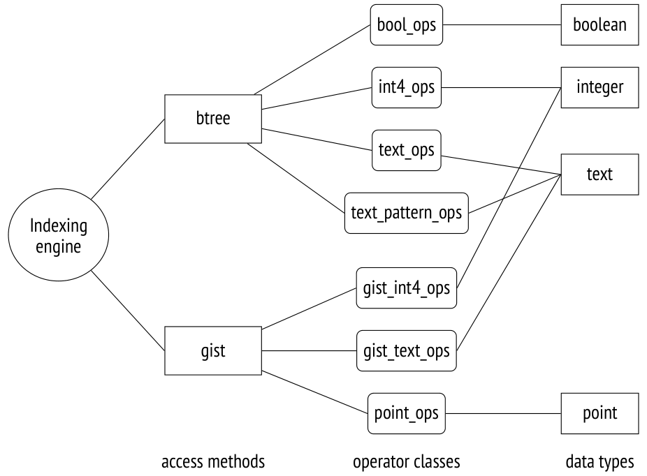

# Chương 19. Index Access Methods (Các phương thức truy cập chỉ mục)

## 19.1 Index và khả năng mở rộng (Indexes and Extensibility)

Index (chỉ mục) là các đối tượng cơ sở dữ liệu có mục đích chủ yếu là tăng tốc truy cập dữ liệu. Đây là các cấu trúc phụ trợ: bất kỳ index nào cũng có thể bị xoá và tạo lại dựa trên dữ liệu trong heap. Ngoài việc tăng tốc truy cập dữ liệu, index còn được dùng để đảm bảo một số ràng buộc toàn vẹn.

Lõi PostgreSQL cung cấp sáu index access method (phương thức truy cập chỉ mục, hay kiểu index) được tích hợp sẵn:

```
=> SELECT amname FROM pg_am WHERE amtype = 'i';
 amname
--------
 btree
 hash
 gist
 gin
 spgist
 brin
(6 rows)
```

Khả năng mở rộng của PostgreSQL cho phép bổ sung các access method mới mà không cần sửa đổi lõi *(v. 9.6)*. Một extension như vậy (phương thức `bloom`) được đưa vào bộ module chuẩn.

Bất chấp mọi khác biệt giữa các kiểu index, cuối cùng tất cả chúng đều đối chiếu một khoá (chẳng hạn giá trị của một cột được đánh index) với các heap tuple chứa khoá này. Các tuple được tham chiếu bằng *tuple ID* dài sáu byte, hay TID *[→ tr. 342](20-index-scans.md)*. Khi biết khoá hoặc một số thông tin về khoá, ta có thể nhanh chóng đọc các tuple có khả năng chứa dữ liệu cần thiết mà không phải quét toàn bộ bảng.

Để đảm bảo một access method mới có thể được thêm vào dưới dạng extension, PostgreSQL hiện thực một *indexing engine* (bộ máy đánh chỉ mục) chung. Mục tiêu chính của nó là lấy và xử lý các TID do một access method cụ thể trả về:

- đọc dữ liệu từ các heap tuple tương ứng

- kiểm tra tính khả kiến (visibility) của tuple theo một snapshot cụ thể *[→ tr. 80](04-snapshots.md)*

- kiểm tra lại các điều kiện nếu việc đánh giá của phương thức chưa đưa ra được kết luận chắc chắn

Indexing engine cũng tham gia vào việc thực thi các plan được xây dựng ở giai đoạn tối ưu hoá. Khi đánh giá các đường thực thi khác nhau, optimizer cần biết các thuộc tính của mọi access method có khả năng áp dụng: phương thức có thể trả về dữ liệu theo thứ tự yêu cầu không, hay ta cần một giai đoạn sắp xếp riêng? có thể trả về ngay vài giá trị đầu tiên không, hay phải đợi lấy xong toàn bộ tập kết quả? và cứ thế.

Không chỉ optimizer mới cần biết các đặc thù của access method. Việc tạo index cũng đặt ra thêm những câu hỏi cần trả lời: access method có hỗ trợ index nhiều cột không? index này có thể đảm bảo tính duy nhất không?

Indexing engine cho phép sử dụng nhiều access method khác nhau; để được hỗ trợ, một access method phải hiện thực một giao diện nhất định để khai báo các tính năng và thuộc tính của mình.

Access method được dùng để giải quyết các nhiệm vụ sau:

- hiện thực các thuật toán xây dựng index, cũng như chèn và xoá các index entry (mục chỉ mục)

- phân bổ các index entry giữa các page (để sau đó được bộ quản lý buffer cache xử lý) *[→ tr. 147](09-buffer-cache.md)*

- hiện thực thuật toán vacuum *[→ tr. 102](06-vacuum-and-autovacuum.md)*

- lấy các lock để đảm bảo hoạt động đồng thời chính xác *[→ tr. 240](15-locks-on-memory-structures.md)*

- sinh các WAL entry *[→ tr. 164](10-write-ahead-log.md)*

- tìm kiếm dữ liệu đã được đánh index theo khoá

- ước lượng cost của index scan

Khả năng mở rộng còn thể hiện ở khả năng thêm các kiểu dữ liệu mới mà access method không hề biết trước. Vì vậy, các access method phải định nghĩa giao diện riêng của mình để cắm thêm các kiểu dữ liệu tuỳ ý.

Để cho phép dùng một kiểu dữ liệu mới với một access method cụ thể, bạn phải hiện thực giao diện tương ứng — tức là cung cấp các toán tử có thể dùng với index, và có thể cả một số *support function* (hàm hỗ trợ) phụ trợ. Một tập các toán tử và hàm như vậy được gọi là *operator class*.

Logic đánh index được hiện thực một phần bởi chính access method, nhưng một phần được giao cho các operator class. Sự phân chia này khá tuỳ ý: trong khi B-tree có toàn bộ logic gắn cứng vào access method, một số phương thức khác có thể chỉ cung cấp khung chính, phó mặc mọi chi tiết hiện thực cho các operator class cụ thể. Cùng một kiểu dữ liệu thường được hỗ trợ bởi vài operator class, và người dùng có thể chọn class có hành vi phù hợp nhất.

Đây là một phần nhỏ của bức tranh tổng thể:



## 19.2 Operator class và operator family (Operator Classes and Families)

### Operator Classes

Giao diện của access method[^1] được hiện thực bởi một *operator class*,[^2] là một tập các toán tử và support function mà access method áp dụng cho một kiểu dữ liệu cụ thể.

Các lớp toán tử được lưu trong bảng `pg_opclass` của system catalog. Truy vấn sau trả về dữ liệu đầy đủ cho hình minh hoạ ở trên:

```
=> SELECT amname, opcname, opcintype::regtype
FROM pg_am am
  JOIN pg_opclass opc ON opcmethod = am.oid;
 amname |           opcname           |          opcintype
--------+------------------------------+-----------------------------
 btree  | array_ops                   | anyarray
 hash   | array_ops                   | anyarray
 btree  | bit_ops                     | bit
 btree  | bool_ops                    | boolean
 ...
 brin   | pg_lsn_minmax_multi_ops     | pg_lsn
 brin   | pg_lsn_bloom_ops            | pg_lsn
 brin   | box_inclusion_ops           | box
(177 rows)
```

Trong hầu hết các trường hợp, ta không cần biết gì về operator class. Ta chỉ đơn giản tạo một index sử dụng một operator class mặc định nào đó.

Ví dụ, đây là các operator class của B-tree hỗ trợ kiểu `text`. Một trong các class luôn được đánh dấu là mặc định:

```
=> SELECT opcname, opcdefault
FROM pg_am am
  JOIN pg_opclass opc ON opcmethod = am.oid
WHERE amname = 'btree'
  AND opcintype = 'text'::regtype;
       opcname       | opcdefault
---------------------+------------
 text_ops            | t
 varchar_ops         | f
 text_pattern_ops    | f
 varchar_pattern_ops | f
(4 rows)
```

Một lệnh tạo index điển hình trông như sau:

```
CREATE INDEX ON aircrafts(model, range);
```

Nhưng đó chỉ là cách viết tắt, được triển khai thành cú pháp sau:

```
CREATE INDEX ON aircrafts
USING btree -- the default access method
(
  model text_ops, -- the default operator class for text
  range int4_ops  -- the default operator class for integer
);
```

Nếu bạn muốn dùng một index thuộc kiểu khác hoặc đạt được một hành vi tuỳ biến nào đó, bạn phải chỉ định rõ access method hoặc operator class mong muốn.

Mỗi operator class được định nghĩa cho một access method và kiểu dữ liệu cụ thể phải chứa một tập các toán tử nhận tham số thuộc kiểu này và hiện thực ngữ nghĩa của access method đó.

Ví dụ, access method `btree` định nghĩa năm toán tử so sánh bắt buộc. Mọi operator class của `btree` đều phải chứa đủ cả năm:

```
=> SELECT opcname, amopstrategy, amopopr::regoperator
FROM pg_am am
  JOIN pg_opfamily opf ON opfmethod = am.oid
  JOIN pg_opclass opc ON opcfamily = opf.oid
  JOIN pg_amop amop ON amopfamily = opcfamily
WHERE amname = 'btree'
  AND opcname IN ('text_ops', 'text_pattern_ops')
  AND amoplefttype = 'text'::regtype
  AND amoprighttype = 'text'::regtype
ORDER BY opcname, amopstrategy;
     opcname      | amopstrategy |    amopopr
------------------+--------------+-----------------
 text_ops         |           1 | <(text,text)
 text_ops         |           2 | <=(text,text)
 text_ops         |           3 | =(text,text)
 text_ops         |           4 | >=(text,text)
 text_ops         |           5 | >(text,text)
 text_pattern_ops |           1 | ~<~(text,text)
 text_pattern_ops |           2 | ~<=~(text,text)
 text_pattern_ops |           3 | =(text,text)
 text_pattern_ops |           4 | ~>=~(text,text)
 text_pattern_ops |           5 | ~>~(text,text)
(10 rows)
```

Ngữ nghĩa của một toán tử mà access method ngầm định được phản ánh qua strategy number (số chiến lược), hiển thị ở cột `amopstrategy`.[^3] Ví dụ, strategy 1 của `btree` nghĩa là *nhỏ hơn*, 2 biểu thị *nhỏ hơn hoặc bằng*, và cứ thế. Bản thân các toán tử có thể mang tên tuỳ ý.

Ví dụ trên cho thấy hai loại toán tử. Sự khác biệt giữa các toán tử thông thường và các toán tử có dấu ngã là loại sau không tính đến *collation*[^4] (quy tắc đối chiếu) và thực hiện so sánh chuỗi theo từng bit. Tuy vậy, cả hai loại đều hiện thực cùng các phép so sánh logic.

Operator class `text_pattern_ops` được thiết kế để khắc phục hạn chế trong việc hỗ trợ toán tử `~~` (tương ứng với toán tử `LIKE`). Trong một cơ sở dữ liệu dùng bất kỳ collation nào khác C, toán tử này không thể dùng index thông thường trên một trường văn bản:

```
=> SHOW lc_collate;
 lc_collate
-------------
 en_US.UTF-8
(1 row)
=> CREATE INDEX ON tickets(passenger_name);
=> EXPLAIN (costs off)
SELECT * FROM tickets WHERE passenger_name LIKE 'ELENA%';
                  QUERY PLAN
----------------------------------------------
 Seq Scan on tickets
   Filter: (passenger_name ~~ 'ELENA%'::text)
(2 rows)
```

Một index với operator class `text_pattern_ops` hoạt động khác đi:

```
=> CREATE INDEX tickets_passenger_name_pattern_idx
ON tickets(passenger_name text_pattern_ops);
=> EXPLAIN (costs off)
SELECT * FROM tickets WHERE passenger_name LIKE 'ELENA%';
                         QUERY PLAN
--------------------------------------------------------------
 Bitmap Heap Scan on tickets
   Filter: (passenger_name ~~ 'ELENA%'::text)
   -> Bitmap Index Scan on tickets_passenger_name_pattern_idx
       Index Cond: ((passenger_name ~>=~ 'ELENA'::text) AND
       (passenger_name ~<~ 'ELENB'::text))
(5 rows)
```

Hãy để ý cách biểu thức lọc đã thay đổi trong điều kiện `Index Cond`. Việc tìm kiếm giờ chỉ dùng phần tiền tố của mẫu đứng trước `%`, còn các kết quả dương tính giả được lọc bỏ trong bước kiểm tra lại dựa trên điều kiện `Filter`. Operator class của access method `btree` không cung cấp toán tử nào để so sánh mẫu, và cách duy nhất để áp dụng B-tree ở đây là viết lại điều kiện này bằng các toán tử so sánh. Các toán tử của class `text_pattern_ops` không tính đến collation, điều này cho ta cơ hội dùng một điều kiện tương đương thay thế.[^5]

Một index có thể được dùng để tăng tốc truy cập theo một điều kiện lọc nếu thoả mãn hai điều kiện tiên quyết sau:

1. điều kiện được viết dưới dạng “*indexed-column operator expression*” (cột-được-đánh-index toán-tử biểu-thức) (nếu toán tử có một toán tử giao hoán tương ứng được chỉ định,[^6] điều kiện cũng có thể có dạng “*expression operator indexed-column*”)[^7]
2. và *operator* thuộc operator class được chỉ định cho *indexed-column* trong khai báo index.

Ví dụ, truy vấn sau có thể dùng index:

```
=> EXPLAIN (costs off)
SELECT * FROM tickets WHERE 'ELENA BELOVA' = passenger_name;
                       QUERY PLAN
--------------------------------------------------------
 Index Scan using tickets_passenger_name_idx on tickets
   Index Cond: (passenger_name = 'ELENA BELOVA'::text)
(2 rows)
```

Hãy chú ý vị trí các đối số trong điều kiện `Index Cond`: ở giai đoạn thực thi, trường được đánh index phải nằm bên trái. Khi các đối số bị hoán vị, toán tử được thay bằng toán tử giao hoán của nó; trong trường hợp cụ thể này, đó vẫn là cùng một toán tử vì quan hệ bằng có tính giao hoán.

Trong truy vấn tiếp theo, về mặt kỹ thuật không thể dùng index thông thường vì tên cột trong điều kiện đã được thay bằng một lời gọi hàm:

```
=> EXPLAIN (costs off)
SELECT * FROM tickets WHERE initcap(passenger_name) = 'Elena Belova';
                        QUERY PLAN
------------------------------------------------------------
 Seq Scan on tickets
   Filter: (initcap(passenger_name) = 'Elena Belova'::text)
(2 rows)
```

Ở đây bạn có thể dùng một *expression index* (index trên biểu thức),[^8] trong đó khai báo index chỉ định một biểu thức tuỳ ý thay vì một cột:

```
=> CREATE INDEX ON tickets( (initcap(passenger_name)) );
=> EXPLAIN (costs off)
SELECT * FROM tickets WHERE initcap(passenger_name) = 'Elena Belova';
                            QUERY PLAN
--------------------------------------------------------------------
 Bitmap Heap Scan on tickets
   Recheck Cond: (initcap(passenger_name) = 'Elena Belova'::text)
   -> Bitmap Index Scan on tickets_initcap_idx
       Index Cond: (initcap(passenger_name) = 'Elena Belova'::text)
(4 rows)
```

Một biểu thức index chỉ được phụ thuộc vào giá trị của heap tuple và không được chịu ảnh hưởng bởi dữ liệu khác lưu trong cơ sở dữ liệu cũng như bởi các tham số cấu hình (chẳng hạn thiết lập locale).

Nói cách khác, nếu biểu thức chứa bất kỳ lời gọi hàm nào, các hàm này phải là `IMMUTABLE`,[^9] và chúng phải thực sự *tuân thủ* hạng mục volatility (tính biến động) này. Nếu không, index scan và heap scan có thể trả về các kết quả khác nhau cho cùng một truy vấn.

Ngoài các toán tử thông thường, một operator class có thể cung cấp các *support function*[^10] mà access method yêu cầu. Ví dụ, access method `btree` định nghĩa năm support function;[^11] hàm đầu tiên (so sánh hai giá trị) là bắt buộc, còn tất cả các hàm còn lại có thể vắng mặt:

```
=> SELECT amprocnum, amproc::regproc
FROM pg_am am
  JOIN pg_opfamily opf ON opfmethod = am.oid
  JOIN pg_opclass opc ON opcfamily = opf.oid
  JOIN pg_amproc amproc ON amprocfamily = opcfamily
WHERE amname = 'btree'
  AND opcname = 'text_ops'
  AND amproclefttype = 'text'::regtype
  AND amprocrighttype = 'text'::regtype
ORDER BY amprocnum;
 amprocnum |       amproc
-----------+--------------------
         1 | bttextcmp
         2 | bttextsortsupport
         4 | btvarstrequalimage
(3 rows)
```

### Operator Families

Mỗi operator class luôn thuộc về một *operator family*[^12] nào đó (được liệt kê trong system catalog ở bảng `pg_opfamily`). Một family có thể gồm nhiều class xử lý các kiểu dữ liệu tương tự nhau theo cùng một cách.

Ví dụ, family `integer_ops` bao gồm vài class cho các kiểu dữ liệu số nguyên có cùng ngữ nghĩa nhưng khác nhau về kích thước:

```
=> SELECT opcname, opcintype::regtype
FROM pg_am am
  JOIN pg_opfamily opf ON opfmethod = am.oid
  JOIN pg_opclass opc ON opcfamily = opf.oid
WHERE amname = 'btree'
  AND opfname = 'integer_ops';
```

```
 opcname  | opcintype
----------+-----------
 int2_ops | smallint
 int4_ops | integer
 int8_ops | bigint
(3 rows)
```

Family `datetime_ops` gồm các operator class xử lý ngày tháng:

```
=> SELECT opcname, opcintype::regtype
FROM pg_am am
  JOIN pg_opfamily opf ON opfmethod = am.oid
  JOIN pg_opclass opc ON opcfamily = opf.oid
WHERE amname = 'btree'
  AND opfname = 'datetime_ops';
     opcname     |         opcintype
-----------------+-----------------------------
 date_ops        | date
 timestamptz_ops | timestamp with time zone
 timestamp_ops   | timestamp without time zone
(3 rows)
```

Trong khi mỗi operator class chỉ hỗ trợ một kiểu dữ liệu duy nhất, một family có thể bao gồm các operator class cho những kiểu dữ liệu khác nhau:

```
=> SELECT opcname, amopopr::regoperator
FROM pg_am am
  JOIN pg_opfamily opf ON opfmethod = am.oid
  JOIN pg_opclass opc ON opcfamily = opf.oid
  JOIN pg_amop amop ON amopfamily = opcfamily
WHERE amname = 'btree'
  AND opfname = 'integer_ops'
  AND amoplefttype = 'integer'::regtype
  AND amopstrategy = 1
ORDER BY opcname;
 opcname  |       amopopr
----------+---------------------
 int2_ops | <(integer,bigint)
 int2_ops | <(integer,smallint)
 int2_ops | <(integer,integer)
 int4_ops | <(integer,bigint)
 int4_ops | <(integer,smallint)
 int4_ops | <(integer,integer)
 int8_ops | <(integer,bigint)
 int8_ops | <(integer,smallint)
 int8_ops | <(integer,integer)
(9 rows)
```

Nhờ việc gom nhiều toán tử khác nhau vào một family duy nhất như vậy, planner có thể không cần ép kiểu khi index được dùng cho các điều kiện liên quan đến giá trị thuộc các kiểu khác nhau.

## 19.3 Giao diện của indexing engine (Indexing Engine Interface)

Cũng giống như với table access method, cột `amhandler` của bảng `pg_am` chứa tên của hàm hiện thực giao diện *(v. 9.6)*:[^13]

```
=> SELECT amname, amhandler
FROM pg_am
WHERE amtype = 'i';
 amname |  amhandler
--------+-------------
 btree  | bthandler
 hash   | hashhandler
 gist   | gisthandler
 gin    | ginhandler
 spgist | spghandler
 brin   | brinhandler
(6 rows)
```

Hàm này điền các giá trị thực tế vào các chỗ trống trong cấu trúc giao diện.[^14] Một số trong đó là các hàm chịu trách nhiệm cho những nhiệm vụ riêng liên quan đến truy cập index (ví dụ, chúng có thể thực hiện index scan và trả về ID của các heap tuple), trong khi số khác là các thuộc tính của phương thức index mà indexing engine phải biết.

Tất cả các thuộc tính được nhóm thành ba loại:[^15]

- thuộc tính của access method

- thuộc tính của một index cụ thể

- thuộc tính mức cột của một index

Việc phân biệt giữa thuộc tính mức access method và mức index được đưa ra với tầm nhìn cho tương lai: hiện tại, mọi index dựa trên một access method cụ thể luôn có cùng các thuộc tính ở hai mức này.

### Thuộc tính của access method (Access Method Properties)

Năm thuộc tính sau được định nghĩa ở mức access method (ở đây hiển thị cho phương thức B-tree *(v. 11)*):

```
=> SELECT a.amname, p.name, pg_indexam_has_property(a.oid, p.name)
FROM pg_am a, unnest(array[
  'can_order', 'can_unique', 'can_multi_col',
  'can_exclude', 'can_include'
]) p(name)
WHERE a.amname = 'btree';
 amname |     name     | pg_indexam_has_property
--------+---------------+-------------------------
 btree  | can_order    | t
 btree  | can_unique   | t
 btree  | can_multi_col | t
 btree  | can_exclude  | t
 btree  | can_include  | t
(5 rows)
```

**CAN ORDER** Khả năng nhận dữ liệu đã được sắp xếp.[^16] Thuộc tính này hiện chỉ được B-tree hỗ trợ.

Để có kết quả theo thứ tự yêu cầu, bạn luôn có thể quét bảng rồi sắp xếp dữ liệu lấy được:

```
=> EXPLAIN (costs off)
SELECT * FROM seats ORDER BY seat_no;
       QUERY PLAN
------------------------
 Sort
   Sort Key: seat_no
   -> Seq Scan on seats
(3 rows)
```

Nhưng nếu có một index hỗ trợ thuộc tính này, dữ liệu có thể được trả về ngay theo thứ tự mong muốn:

```
=> EXPLAIN (costs off)
SELECT * FROM seats ORDER BY aircraft_code;
              QUERY PLAN
--------------------------------------
 Index Scan using seats_pkey on seats
(1 row)
```

**CAN UNIQUE** Hỗ trợ các ràng buộc unique và primary key.[^17] Thuộc tính này chỉ áp dụng cho B-tree.

Mỗi khi một ràng buộc unique hoặc primary key được khai báo, PostgreSQL tự động tạo một unique index để hỗ trợ ràng buộc này.

```
=> INSERT INTO bookings(book_ref, book_date, total_amount)
VALUES ('000004', now(), 100.00);
ERROR:  duplicate key value violates unique constraint
"bookings_pkey"
DETAIL:  Key (book_ref)=(000004) already exists.
```

Dẫu vậy, nếu bạn chỉ đơn giản tạo một unique index mà không khai báo tường minh ràng buộc toàn vẹn, hiệu quả trông có vẻ hoàn toàn như nhau: cột được đánh index sẽ không cho phép giá trị trùng lặp. Vậy khác biệt là gì?

Ràng buộc toàn vẹn định nghĩa một thuộc tính không bao giờ được phép vi phạm, trong khi index chỉ là một cơ chế để đảm bảo thuộc tính đó. Về lý thuyết, một ràng buộc có thể được áp đặt bằng các phương tiện khác.

Ví dụ, PostgreSQL không hỗ trợ global index (index toàn cục) cho bảng phân vùng, nhưng dù vậy bạn vẫn có thể tạo ràng buộc unique trên các bảng như vậy (nếu nó bao gồm khoá phân vùng). Trong trường hợp này, tính duy nhất toàn cục được đảm bảo bởi các unique index cục bộ của từng phân vùng, vì các phân vùng khác nhau không thể có cùng khoá phân vùng.

**CAN MULTI COL** Khả năng xây dựng *multicolumn index* (index nhiều cột).[^18]

Một index nhiều cột có thể tăng tốc tìm kiếm theo nhiều điều kiện áp lên các cột khác nhau của bảng. Ví dụ, bảng `ticket_flights` có primary key phức hợp, vì vậy index tương ứng được xây dựng trên nhiều hơn một cột:

```
=> \d ticket_flights_pkey
     Index "bookings.ticket_flights_pkey"
  Column   |     Type     | Key? | Definition
-----------+---------------+------+------------
 ticket_no | character(13) | yes | ticket_no
 flight_id | integer      | yes  | flight_id
primary key, btree, for table "bookings.ticket_flights"
```

Việc tìm kiếm chuyến bay theo số vé và ID chuyến bay được thực hiện bằng index:

```
=> EXPLAIN (costs off)
SELECT * FROM ticket_flights
WHERE ticket_no = '0005432001355'
  AND flight_id = 51618;
                       QUERY PLAN
----------------------------------------------------------
 Index Scan using ticket_flights_pkey on ticket_flights
   Index Cond: ((ticket_no = '0005432001355'::bpchar) AND
   (flight_id = 51618))
(3 rows)
```

Theo quy tắc chung, index nhiều cột có thể tăng tốc tìm kiếm ngay cả khi điều kiện lọc chỉ liên quan đến một số cột của nó. Với B-tree, việc tìm kiếm sẽ hiệu quả nếu điều kiện lọc bao phủ một dãy các cột xuất hiện đầu tiên trong khai báo index:

```
=> EXPLAIN (costs off)
SELECT *
FROM ticket_flights
WHERE ticket_no = '0005432001355';
                       QUERY PLAN
--------------------------------------------------------
 Index Scan using ticket_flights_pkey on ticket_flights
   Index Cond: (ticket_no = '0005432001355'::bpchar)
(2 rows)
```

Trong mọi trường hợp khác (ví dụ, nếu điều kiện chỉ bao gồm `flights_id`), việc tìm kiếm trên thực tế sẽ bị giới hạn ở các cột đầu (nếu truy vấn có chứa các điều kiện tương ứng), còn các điều kiện khác sẽ chỉ được dùng để lọc bỏ kết quả trả về. Tuy nhiên, index thuộc các kiểu khác có thể hoạt động khác đi.

**CAN EXCLUDE** Hỗ trợ ràng buộc `EXCLUDE`.[^19]

Ràng buộc `EXCLUDE` đảm bảo rằng một điều kiện được định nghĩa bởi một toán tử sẽ không được thoả mãn với bất kỳ cặp dòng nào của bảng. Để áp đặt ràng buộc này, PostgreSQL tự động tạo một index; phải có một operator class chứa toán tử được dùng trong điều kiện của ràng buộc.

Thường thì toán tử giao `&&` đảm nhận vai trò này. Chẳng hạn, bạn có thể dùng nó để khai báo tường minh rằng một phòng hội nghị không thể được đặt hai lần cho cùng một khoảng thời gian, hoặc rằng các toà nhà trên bản đồ không thể chồng lấn nhau.

Với toán tử bằng, ràng buộc loại trừ mang ý nghĩa của tính duy nhất: bảng bị cấm có hai dòng với cùng giá trị khoá. Tuy vậy, nó không giống ràng buộc `UNIQUE`: cụ thể, khoá của ràng buộc loại trừ không thể được tham chiếu từ foreign key, và cũng không thể được dùng trong mệnh đề `ON CONFLICT`.

**CAN INCLUDE** Khả năng thêm các cột không phải khoá vào index, khiến index này trở thành covering index (index bao phủ). *(v. 11)* *[→ tr. 339](20-index-scans.md)*

Nhờ thuộc tính này, bạn có thể mở rộng một unique index với các cột bổ sung. Index như vậy vẫn đảm bảo mọi giá trị của cột khoá là duy nhất, trong khi việc lấy dữ liệu từ các cột được include không phải truy cập heap:

```
=> CREATE UNIQUE INDEX ON flights(flight_id) INCLUDE (status);
=> EXPLAIN (costs off)
SELECT status FROM flights
WHERE flight_id = 51618;
                         QUERY PLAN
---------------------------------------------------------------
 Index Only Scan using flights_flight_id_status_idx on flights
   Index Cond: (flight_id = 51618)
(2 rows)
```

### Thuộc tính mức index (Index-Level Properties)

Dưới đây là các thuộc tính liên quan đến một index (hiển thị cho một index hiện có):

```
=>  SELECT p.name, pg_index_has_property('seats_pkey', p.name)
FROM unnest(array[
  'clusterable', 'index_scan', 'bitmap_scan', 'backward_scan'
]) p(name);
     name      | pg_index_has_property
---------------+-----------------------
 clusterable   | t
 index_scan    | t
 bitmap_scan   | t
 backward_scan | t
(4 rows)
```

**CLUSTERABLE** Khả năng di chuyển vật lý các heap tuple theo thứ tự mà ID của chúng được index scan trả về. *[→ tr. 284](17-statistics.md)*

Thuộc tính này cho biết lệnh `CLUSTER` có được hỗ trợ hay không.

**INDEX SCAN** Hỗ trợ *index scan*. *[→ tr. 330](20-index-scans.md)*

Thuộc tính này ngụ ý rằng access method có thể trả về từng TID một. Nghe có vẻ lạ, nhưng một số index không cung cấp chức năng này.

**BITMAP SCAN** Hỗ trợ *bitmap scan*. *[→ tr. 340](20-index-scans.md)*

Thuộc tính này xác định liệu access method có thể xây dựng và trả về một bitmap chứa mọi TID cùng một lúc hay không.

**BACKWARD SCAN** Khả năng trả về kết quả theo thứ tự ngược so với thứ tự được chỉ định khi tạo index.

Thuộc tính này chỉ có ý nghĩa nếu access method hỗ trợ index scan.

### Thuộc tính mức cột (Column-Level Properties)

Và cuối cùng, hãy xem các thuộc tính của cột:

```
=> SELECT p.name,
  pg_index_column_has_property('seats_pkey', 1, p.name)
FROM unnest(array[
  'asc', 'desc', 'nulls_first', 'nulls_last', 'orderable',
  'distance_orderable', 'returnable', 'search_array', 'search_nulls'
]) p(name);
        name        | pg_index_column_has_property
--------------------+------------------------------
 asc                | t
 desc               | f
 nulls_first        | f
 nulls_last         | t
 orderable          | t
 distance_orderable | f
 returnable         | t
 search_array       | t
 search_nulls       | t
(9 rows)
```

**ASC, DESC, NULLS FIRST, NULLS LAST** Sắp thứ tự các giá trị của cột.

Các thuộc tính này xác định giá trị của cột nên được lưu theo thứ tự tăng dần hay giảm dần, và các giá trị NULL nên xuất hiện trước hay sau các giá trị thông thường. *[→ tr. 274](17-statistics.md)* Tất cả các thuộc tính này chỉ áp dụng được cho B-tree.

**ORDERABLE** Khả năng sắp xếp giá trị của cột bằng mệnh đề `ORDER BY`.

Thuộc tính này chỉ áp dụng được cho B-tree.

**DISTANCE ORDERABLE** Hỗ trợ *ordering operator* (toán tử sắp thứ tự).[^20] *[→ tr. 327](19-index-access-methods.md)*

Khác với các toán tử đánh index thông thường trả về giá trị logic, ordering operator trả về một số thực biểu thị “khoảng cách” từ đối số này đến đối số kia. Index hỗ trợ các toán tử như vậy khi chúng được chỉ định trong mệnh đề `ORDER BY` của truy vấn.

Ví dụ, ordering operator `<->` có thể tìm các sân bay nằm ở khoảng cách ngắn nhất tới điểm được chỉ định:

```
=> CREATE INDEX ON airports_data USING gist(coordinates);
```

```
=> EXPLAIN (costs off)
SELECT * FROM airports
ORDER BY coordinates <-> point (43.578,57.593)
LIMIT 3;
                          QUERY PLAN
-----------------------------------------------------------------
 Limit
   -> Index Scan using airports_data_coordinates_idx on airpo...
       Order By: (coordinates <-> '(43.578,57.593)'::point)
(3 rows)
```

**RETURNABLE** Khả năng trả về dữ liệu mà không cần truy cập bảng (hỗ trợ *index-only scan* *[→ tr. 337](20-index-scans.md)*).

Thuộc tính này xác định liệu cấu trúc index có cho phép lấy ra các giá trị đã được đánh index hay không. Điều này không phải lúc nào cũng khả thi: ví dụ, một số index có thể lưu mã băm thay vì giá trị thực. Trong trường hợp này, thuộc tính `CAN INCLUDE` cũng sẽ không khả dụng.

**SEARCH ARRAY** Hỗ trợ tìm kiếm nhiều phần tử trong một mảng.

Việc dùng mảng một cách tường minh không phải là trường hợp duy nhất cần đến điều này. Ví dụ, planner chuyển biểu thức `IN (list)` thành một phép quét mảng:

```
=> EXPLAIN (costs off)
SELECT * FROM bookings
WHERE book_ref IN ('C7C821', 'A5D060', 'DDE1BB');
                 QUERY PLAN
--------------------------------------------
 Index Scan using bookings_pkey on bookings
   Index Cond: (book_ref = ANY
   ('{C7C821,A5D060,DDE1BB}'::bpchar[]))
(3 rows)
```

Nếu phương thức index không hỗ trợ các toán tử như vậy, executor có thể phải thực hiện nhiều lượt lặp để tìm các giá trị cụ thể (điều này có thể khiến index scan kém hiệu quả hơn).

**SEARCH NULLS** Tìm kiếm theo các điều kiện `IS NULL` và `IS NOT NULL`.

Có nên đánh index các giá trị `NULL` không? Một mặt, việc này cho phép ta thực hiện index scan cho các điều kiện như `IS [NOT] NULL`, cũng như dùng index như một covering index nếu không có điều kiện lọc nào (trong trường hợp này, index phải trả về dữ liệu của mọi heap tuple, kể cả những tuple chứa giá trị `NULL`). Nhưng mặt khác, bỏ qua các giá trị `NULL` có thể giảm kích thước index.

Quyết định này thuộc về những người phát triển access method, nhưng thường thì các giá trị NULL vẫn được đánh index.

Nếu bạn không cần giá trị NULL trong index, bạn có thể loại chúng ra bằng cách xây dựng một *partial index* (index một phần)[^21] chỉ bao phủ những dòng cần thiết. Ví dụ:

```
=> CREATE INDEX ON flights(actual_arrival)
WHERE actual_arrival IS NOT NULL;
=> EXPLAIN (costs off)
SELECT * FROM flights
WHERE actual_arrival = '2017-06-13 10:33:00+03';
                          QUERY PLAN
-----------------------------------------------------------------
 Index Scan using flights_actual_arrival_idx on flights
   Index Cond: (actual_arrival = '2017-06-13 10:33:00+03'::ti...
(2 rows)
```

Partial index nhỏ hơn index đầy đủ, và nó chỉ được cập nhật nếu dòng bị sửa đổi có được đánh index, điều này đôi khi có thể mang lại cải thiện hiệu năng đáng kể. Hiển nhiên, ngoài việc kiểm tra NULL, mệnh đề `WHERE` có thể chứa bất kỳ điều kiện nào (có thể dùng được với các hàm immutable).

Khả năng xây dựng partial index được cung cấp bởi indexing engine, vì vậy nó không phụ thuộc vào access method.

Đương nhiên, giao diện chỉ bao gồm những thuộc tính của phương thức index cần được biết trước để đưa ra quyết định đúng. Ví dụ, nó không liệt kê bất kỳ thuộc tính nào cho phép các tính năng như hỗ trợ predicate lock hay tạo index không gây chặn (`CONCURRENTLY`). Các thuộc tính như vậy được định nghĩa trong mã của các hàm hiện thực giao diện.

[^1]: postgresql.org/docs/14/xindex.html
[^2]: postgresql.org/docs/14/indexes-opclass.html
[^3]: postgresql.org/docs/14/xindex.html#XINDEX-STRATEGIES
[^4]: postgresql.org/docs/14/collation.html  
postgresql.org/docs/14/indexes-collations.html
[^5]: backend/utils/adt/like_support.c
[^6]: postgresql.org/docs/14/xoper-optimization.html#id-1.8.3.18.6
[^7]: backend/optimizer/path/indxpath.c, hàm match_clause_to_indexcol
[^8]: postgresql.org/docs/14/indexes-expressional.html
[^9]: postgresql.org/docs/14/xfunc-volatility.html
[^10]: postgresql.org/docs/14/xindex.html#XINDEX-SUPPORT
[^11]: postgresql.org/docs/14/btree-support-funcs.html
[^12]: postgresql.org/docs/14/xindex.html#XINDEX-OPFAMILY
[^13]: postgresql.org/docs/14/indexam.html
[^14]: include/access/amapi.h
[^15]: backend/utils/adt/amutils.c, hàm indexam_property
[^16]: postgresql.org/docs/14/indexes-ordering.html
[^17]: postgresql.org/docs/14/indexes-unique.html
[^18]: postgresql.org/docs/14/indexes-multicolumn.html
[^19]: postgresql.org/docs/14/ddl-constraints.html#DDL-CONSTRAINTS-EXCLUSION
[^20]: postgresql.org/docs/14/xindex.html#XINDEX-ORDERING-OPS
[^21]: postgresql.org/docs/14/indexes-partial.html
