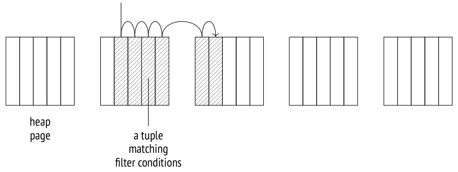
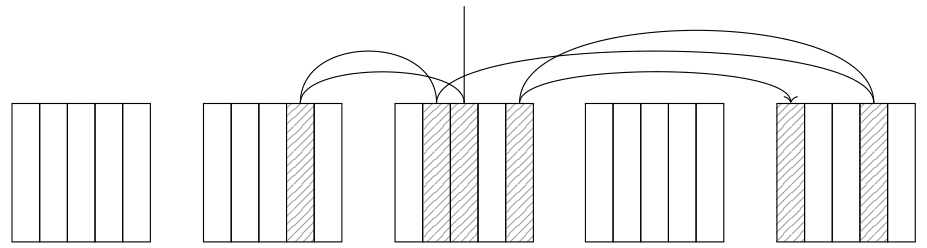
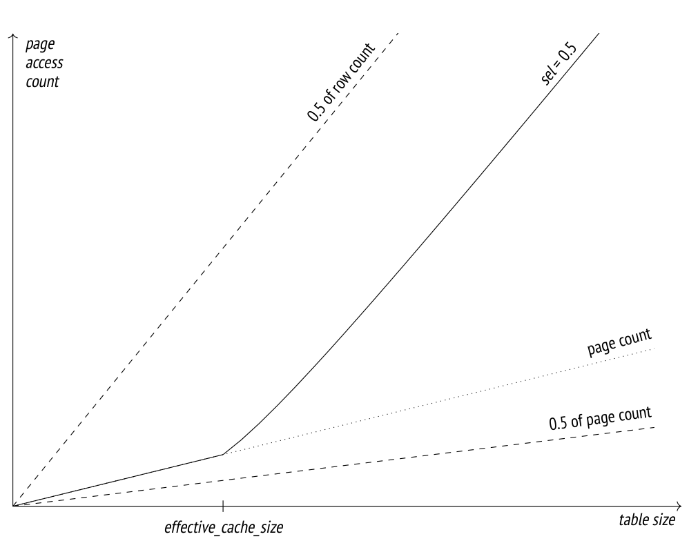
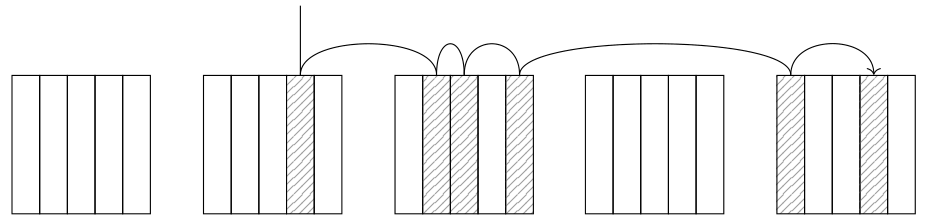
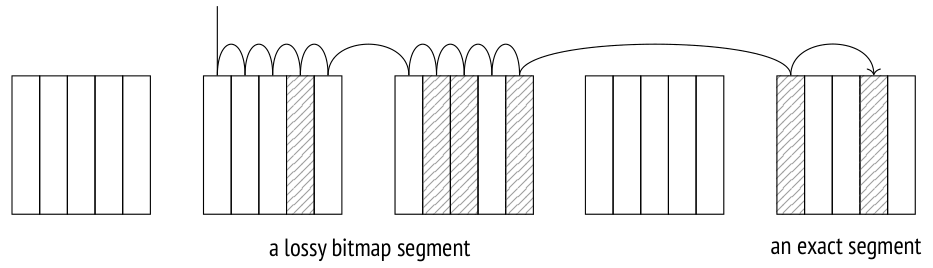
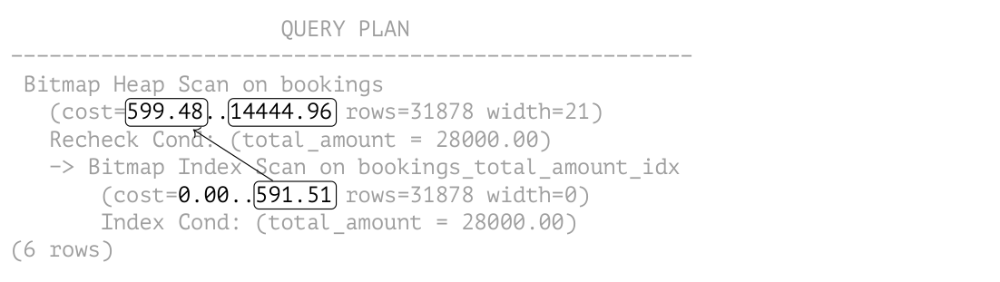
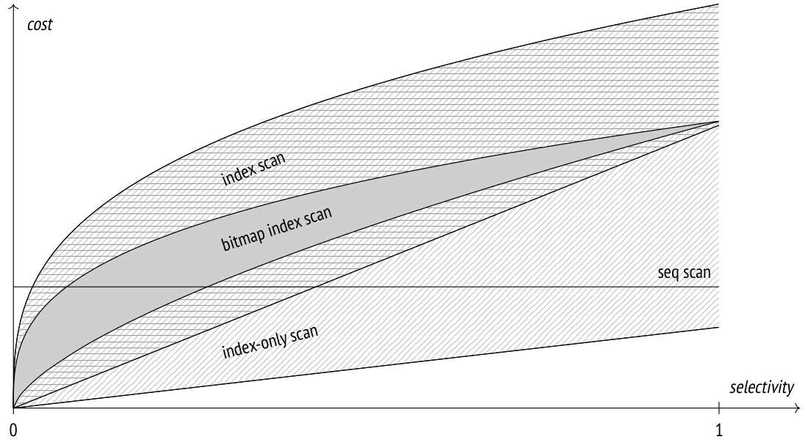

# Chương 20. Index Scans (Quét chỉ mục)

## 20.1 Index scan thông thường (Regular Index Scans)

Có hai cách cơ bản để truy cập các TID do index cung cấp. Cách thứ nhất là thực hiện *index scan* (quét chỉ mục). Phần lớn các index access method (nhưng không phải tất cả) có thuộc tính `INDEX SCAN` để hỗ trợ thao tác này *[→ tr. 326](19-index-access-methods.md)*.

Index scan được biểu diễn trong plan bằng node `Index Scan`[^1]:

```
=> EXPLAIN SELECT * FROM bookings
WHERE book_ref = '9AC0C6' AND total_amount = 48500.00;
                 QUERY PLAN
---------------------------------------------
 Index Scan using bookings_pkey on bookings
   (cost=0.43..8.45 rows=1 width=21)
   Index Cond: (book_ref = '9AC0C6'::bpchar)
   Filter: (total_amount = 48500.00)
(4 rows)
```

Trong quá trình index scan, access method trả về từng TID một.[^2] Khi nhận được một TID, cơ chế đánh chỉ mục (indexing engine) truy cập vào heap page mà TID này trỏ tới, lấy tuple tương ứng, và nếu các quy tắc visibility (khả năng nhìn thấy) được thoả mãn thì trả về tập các trường được yêu cầu của tuple này. Quá trình này tiếp diễn cho đến khi access method hết các TID khớp với truy vấn.

Dòng `Index Cond` chỉ bao gồm những điều kiện lọc có thể kiểm tra bằng index. Các điều kiện khác phải được kiểm tra lại trên heap được liệt kê riêng trong dòng `Filter`.

Như ví dụ này cho thấy, cả thao tác truy cập index lẫn truy cập heap đều được xử lý bởi một node `Index Scan` chung chứ không phải bởi hai node khác nhau. Nhưng cũng có một node `Tid Scan` riêng,[^3] dùng để lấy tuple từ heap nếu ID của chúng đã được biết trước:

```
=> EXPLAIN SELECT * FROM bookings WHERE ctid = '(0,1)'::tid;
                       QUERY PLAN
---------------------------------------------------------
 Tid Scan on bookings  (cost=0.00..4.01 rows=1 width=21)
   TID Cond: (ctid = '(0,1)'::tid)
(2 rows)
```

### Ước lượng cost (Cost Estimation)

Việc ước lượng cost của một index scan bao gồm cost ước lượng của các thao tác truy cập index và của việc đọc heap page.

Hiển nhiên, phần ước lượng liên quan đến index phụ thuộc hoàn toàn vào access method cụ thể. Với B-tree, cost chủ yếu phát sinh từ việc lấy các index page và xử lý các entry của chúng. Số page và số dòng cần đọc có thể được xác định dựa trên tổng khối lượng dữ liệu và selectivity (độ chọn lọc) của các bộ lọc được áp dụng. Các index page được truy cập ngẫu nhiên *[→ tr. 262](16-query-execution-stages.md)* (các page nối tiếp nhau trong cấu trúc logic lại nằm rải rác về mặt vật lý trên đĩa). Ước lượng còn được tăng thêm bởi tài nguyên CPU dùng để đi từ node gốc (root) xuống node lá (leaf) và tính toán tất cả các biểu thức cần thiết.[^4]

Phần ước lượng liên quan đến heap bao gồm cost truy cập heap page và thời gian CPU cần để xử lý tất cả các tuple đã lấy. Điều quan trọng cần lưu ý là ước lượng I/O phụ thuộc vào cả selectivity của index scan lẫn *correlation* (độ tương quan) giữa thứ tự vật lý của các tuple trên đĩa và thứ tự mà access method trả về ID của chúng.

### Kịch bản tốt: correlation cao (Good Scenario: High Correlation)

Nếu thứ tự vật lý của các tuple trên đĩa có correlation hoàn hảo với thứ tự logic của các TID trong index, mỗi page sẽ chỉ được truy cập *đúng một lần*: node `Index Scan` sẽ đi *tuần tự* từ page này sang page khác, đọc lần lượt từng tuple.



PostgreSQL thu thập statistics về correlation: *[→ tr. 284](17-statistics.md)*

```
=> SELECT attname, correlation
FROM pg_stats WHERE tablename = 'bookings'
ORDER BY abs(correlation) DESC;
   attname    | correlation
--------------+--------------
 book_ref     |           1
 total_amount | 0.0026738467
 book_date    |  8.02188e-05
(3 rows)
```

Correlation là cao nếu giá trị tuyệt đối tương ứng gần với một (như trường hợp của `book_ref`); các giá trị gần với không là dấu hiệu của sự phân bố dữ liệu hỗn loạn.

> Trong trường hợp cụ thể này, correlation cao ở cột book_ref đương nhiên là do dữ liệu đã được nạp vào bảng theo thứ tự tăng dần của cột này, và chưa có cập nhật nào. Chúng ta sẽ thấy bức tranh tương tự nếu thực thi lệnh CLUSTER cho index được tạo trên cột này.

> Tuy nhiên, correlation hoàn hảo không đảm bảo rằng mọi truy vấn đều trả về kết quả theo thứ tự tăng dần của các giá trị book_ref. Trước hết, bất kỳ lần cập nhật dòng nào cũng sẽ chuyển tuple kết quả xuống cuối bảng. Thứ hai, plan dựa trên index scan theo một cột khác sẽ trả về kết quả theo thứ tự khác. Và ngay cả sequential scan cũng có thể không bắt đầu từ đầu bảng *[→ tr. 156](09-buffer-cache.md)*. Vì vậy, nếu bạn cần một thứ tự cụ thể, bạn nên định nghĩa nó một cách tường minh trong mệnh đề ORDER BY.

Dưới đây là ví dụ về một index scan xử lý một số lượng lớn dòng:

```
=> EXPLAIN SELECT * FROM bookings WHERE book_ref < '100000';
                 QUERY PLAN
---------------------------------------------
 Index Scan using bookings_pkey on bookings
   (cost=0.43..4638.91 rows=132999 width=21)
   Index Cond: (book_ref < '100000'::bpchar)
(3 rows)
```

Selectivity của điều kiện được ước lượng như sau:

```
=> SELECT round(132999::numeric/reltuples::numeric, 4)
FROM pg_class WHERE relname = 'bookings';
 round
--------
 0.0630
(1 row)
```

Giá trị này gần với 1/16 *[→ tr. 280](17-statistics.md)*, điều mà ta có thể đoán trước khi biết rằng các giá trị `book_ref` nằm trong khoảng từ 000000 đến `FFFFFF`.

Với B-tree, phần ước lượng cost I/O liên quan đến index bao gồm cost đọc tất cả các page cần thiết. Các index entry thoả mãn bất kỳ điều kiện nào được B-tree hỗ trợ đều được lưu trong các page liên kết thành một danh sách có thứ tự, vì vậy số index page cần đọc được ước lượng bằng kích thước index nhân với selectivity. Nhưng vì các page này không được sắp xếp theo thứ tự vật lý, việc đọc diễn ra theo kiểu *ngẫu nhiên*.

Tài nguyên CPU được dùng để xử lý tất cả các index entry được đọc (cost xử lý một entry được ước lượng bằng giá trị *cpu_index_tuple_cost* *(mặc định: 0.005)*) và tính toán điều kiện cho mỗi entry này (trong trường hợp này, điều kiện chứa một toán tử duy nhất; cost của nó được ước lượng bằng giá trị *cpu_operator_cost*). *(mặc định: 0.0025)*

Việc truy cập bảng được xem như đọc *tuần tự* số page cần thiết. Trong trường hợp correlation hoàn hảo, các heap tuple sẽ nối tiếp nhau trên đĩa, vì vậy số page được ước lượng bằng kích thước bảng nhân với selectivity.

Cost I/O còn được cộng thêm chi phí xử lý tuple; chúng được ước lượng bằng giá trị *cpu_tuple_cost* cho mỗi tuple. *(mặc định: 0.01)*

```
=> WITH costs(idx_cost, tbl_cost) AS (
  SELECT
    (
      SELECT round(
        current_setting('random_page_cost')::real * pages +
        current_setting('cpu_index_tuple_cost')::real * tuples +
        current_setting('cpu_operator_cost')::real * tuples
      )
      FROM (
        SELECT relpages * 0.0630 AS pages, reltuples * 0.0630 AS tuples
        FROM pg_class WHERE relname = 'bookings_pkey'
      ) c
    ),
    (
      SELECT round(
        current_setting('seq_page_cost')::real * pages +
        current_setting('cpu_tuple_cost')::real * tuples
      )
      FROM (
        SELECT relpages * 0.0630 AS pages, reltuples * 0.0630 AS tuples
        FROM pg_class WHERE relname = 'bookings'
      ) c
    )
)
SELECT idx_cost, tbl_cost, idx_cost + tbl_cost AS total
FROM costs;
 idx_cost | tbl_cost | total
----------+----------+-------
     2457 |     2177 | 4634
(1 row)
```

Các phép tính này minh hoạ logic đằng sau việc ước lượng cost, vì vậy kết quả khớp với ước lượng do planner đưa ra, dù chỉ là xấp xỉ. Để có được giá trị chính xác cần tính đến những chi tiết khác mà chúng ta sẽ không bàn ở đây.

### Kịch bản xấu: correlation thấp (Bad Scenario: Low Correlation)

Mọi thứ thay đổi nếu correlation thấp. Hãy tạo một index trên cột `book_date`, cột có correlation gần như bằng không với index này, rồi xem xét truy vấn chọn ra gần như cùng một tỉ lệ dòng như trong ví dụ trước. Truy cập qua index hoá ra tốn kém đến mức planner chỉ chọn nó nếu tất cả các phương án khác bị cấm một cách tường minh:

```
=> CREATE INDEX ON bookings(book_date);
=> SET enable_seqscan = off;
=> SET enable_bitmapscan = off;
=> EXPLAIN SELECT * FROM bookings
WHERE book_date < '2016-08-23 12:00:00+03';
                            QUERY PLAN
---------------------------------------------------------------------
 Index Scan using bookings_book_date_idx on bookings
   (cost=0.43..56957.48 rows=132403 width=21)
   Index Cond: (book_date < '2016-08-23 12:00:00+03'::timestamp w...
(3 rows)
```

Vấn đề là correlation thấp làm tăng khả năng tuple tiếp theo do access method trả về nằm ở một page khác. Do đó, node `Index Scan` phải nhảy qua lại giữa các page thay vì đọc chúng tuần tự; trong trường hợp xấu nhất, số lần truy cập page có thể bằng số tuple được lấy ra.



Tuy nhiên, chúng ta không thể đơn giản thay *seq_page_cost* bằng *random_page_cost* và `relpages` bằng `reltuples` trong các phép tính của kịch bản tốt. Cost mà chúng ta thấy trong plan thấp hơn nhiều so với giá trị mà ta sẽ ước lượng theo cách này:

```
=> WITH costs(idx_cost, tbl_cost) AS (
  SELECT
    ( SELECT round(
        current_setting('random_page_cost')::real * pages +
        current_setting('cpu_index_tuple_cost')::real * tuples +
        current_setting('cpu_operator_cost')::real * tuples
      )
      FROM (
        SELECT relpages * 0.0630 AS pages, reltuples * 0.0630 AS tuples
        FROM pg_class WHERE relname = 'bookings_pkey'
      ) c
    ),
    ( SELECT round(
        current_setting('random_page_cost')::real * tuples +
        current_setting('cpu_tuple_cost')::real * tuples
      )
      FROM (
        SELECT relpages * 0.0630 AS pages, reltuples * 0.0630 AS tuples
        FROM pg_class WHERE relname = 'bookings'
      ) c
    )
)
SELECT idx_cost, tbl_cost, idx_cost + tbl_cost AS total FROM costs;
 idx_cost | tbl_cost | total
----------+----------+--------
     2457 |   533330 | 535787
(1 row)
```

Lý do là mô hình có tính đến việc cache. Các page được dùng thường xuyên được giữ trong buffer cache (và trong cache của hệ điều hành), vì vậy kích thước cache càng lớn thì càng có nhiều khả năng tìm thấy page cần thiết trong đó, nhờ vậy tránh được một thao tác truy cập đĩa bổ sung. Cho mục đích lập plan, kích thước cache được xác định bởi tham số *effective_cache_size* *(mặc định: 4GB)*. Giá trị của nó càng nhỏ thì càng nhiều page được dự kiến sẽ phải đọc.

Đồ thị dưới đây cho thấy sự phụ thuộc giữa ước lượng số page cần đọc và kích thước bảng (với selectivity bằng 1/2 và mỗi page chứa 10 dòng).[^5] Các đường nét đứt thể hiện số lần truy cập trong kịch bản tốt nhất có thể (bằng một nửa số page nếu correlation hoàn hảo) và trong kịch bản xấu nhất (bằng một nửa số dòng nếu correlation bằng không và không có cache).

Người ta giả định rằng giá trị *effective_cache_size* biểu thị tổng dung lượng bộ nhớ có thể được dùng để cache (bao gồm cả buffer cache của PostgreSQL và cache của hệ điều hành). Nhưng vì tham số này chỉ được dùng cho mục đích ước lượng và không ảnh hưởng đến việc cấp phát bộ nhớ, bạn không cần phải tính đến số liệu thực tế khi thay đổi thiết lập này.



Nếu bạn giảm *effective_cache_size* xuống mức tối thiểu, ước lượng của plan sẽ gần với giá trị ở cận dưới đã nêu ở trên cho trường hợp không có cache:

```
=> SET effective_cache_size = '8kB';
=> EXPLAIN SELECT * FROM bookings
WHERE book_date < '2016-08-23 12:00:00+03';
                            QUERY PLAN
---------------------------------------------------------------------
 Index Scan using bookings_book_date_idx on bookings
   (cost=0.43..532745.48 rows=132403 width=21)
   Index Cond: (book_date < '2016-08-23 12:00:00+03'::timestamp w...
(3 rows)
=> RESET effective_cache_size;
=> RESET enable_seqscan;
=> RESET enable_bitmapscan;
```

Planner tính cost I/O của bảng cho cả kịch bản xấu nhất và tốt nhất, rồi lấy một giá trị trung gian dựa trên correlation thực tế.[^6]

Như vậy, index scan có thể là một lựa chọn tốt nếu chỉ cần đọc một phần nhỏ các dòng. Nếu các heap tuple tương quan với thứ tự mà access method trả về ID của chúng, phần này có thể khá lớn. Tuy nhiên, nếu correlation thấp, index scan trở nên kém hấp dẫn hơn nhiều đối với các truy vấn có selectivity thấp.

## 20.2 Index-Only Scans

Nếu một index chứa toàn bộ dữ liệu heap mà truy vấn cần, nó được gọi là *covering index* (index bao phủ) đối với truy vấn cụ thể này. Nếu có sẵn một index như vậy, có thể tránh được việc truy cập bảng thêm: thay vì trả về TID, access method có thể trả về trực tiếp dữ liệu thực. Kiểu index scan này được gọi là *index-only scan*.[^7] Nó có thể được dùng bởi những access method hỗ trợ thuộc tính `RETURNABLE` *[→ tr. 328](19-index-access-methods.md)*.

Trong plan, thao tác này được biểu diễn bằng node `Index Only Scan`[^8]:

```
=> EXPLAIN SELECT book_ref FROM bookings
WHERE book_ref < '100000';
                   QUERY PLAN
-------------------------------------------------
 Index Only Scan using bookings_pkey on bookings
   (cost=0.43..3791.91 rows=132999 width=7)
   Index Cond: (book_ref < '100000'::bpchar)
(3 rows)
```

Cái tên gợi ý rằng node này không bao giờ phải truy cập heap, nhưng thực tế không phải vậy. Trong PostgreSQL, index không chứa thông tin về visibility của tuple *[→ tr. 74](03-pages-and-tuples.md)*, vì vậy access method trả về dữ liệu của *tất cả* các heap tuple thoả mãn điều kiện lọc, kể cả khi transaction hiện tại không thể nhìn thấy chúng. Visibility của chúng sau đó được kiểm tra bởi cơ chế đánh chỉ mục.

Tuy nhiên, nếu phương thức này phải truy cập bảng để kiểm tra visibility của từng tuple, nó sẽ chẳng khác gì một index scan thông thường. Thay vào đó, nó sử dụng *visibility map* được cung cấp cho các bảng *[→ tr. 27](01-introduction.md)*, trong đó tiến trình vacuum đánh dấu những page chỉ chứa các tuple all-visible (tức là những tuple mà mọi transaction đều truy cập được, bất kể snapshot được sử dụng). Nếu TID do index access method trả về thuộc một page như vậy, không cần kiểm tra visibility của nó.

Việc ước lượng cost của index-only scan phụ thuộc vào tỉ lệ page all-visible trong heap. PostgreSQL thu thập statistics này:

```
=> SELECT relpages, relallvisible
FROM pg_class WHERE relname = 'bookings';
 relpages | relallvisible
----------+---------------
    13447 |         13446
(1 row)
```

Việc ước lượng cost của index-only scan khác với index scan thông thường: cost I/O liên quan đến truy cập bảng được tính tỉ lệ với phần page không xuất hiện trong visibility map. (Ước lượng cost xử lý tuple thì vẫn như cũ.)

Vì trong ví dụ cụ thể này tất cả các page chỉ chứa tuple all-visible, cost I/O của heap thực chất bị loại khỏi ước lượng cost:

```
=> WITH costs(idx_cost, tbl_cost) AS (
  SELECT
    (
      SELECT round(
        current_setting('random_page_cost')::real * pages +
        current_setting('cpu_index_tuple_cost')::real * tuples +
        current_setting('cpu_operator_cost')::real * tuples
      )
      FROM (
        SELECT relpages * 0.0630 AS pages,
              reltuples * 0.0630 AS tuples
        FROM pg_class WHERE relname = 'bookings_pkey'
      ) c
    ) AS idx_cost,
    (
      SELECT round(
        (1 - frac_visible) * -- fraction of non-all-visible pages
        current_setting('seq_page_cost')::real * pages +
        current_setting('cpu_tuple_cost')::real * tuples
      )
      FROM (
        SELECT relpages * 0.0630 AS pages,
              reltuples * 0.0630 AS tuples,
          relallvisible::real/relpages::real AS frac_visible
        FROM pg_class WHERE relname = 'bookings'
      ) c
    ) AS tbl_cost
)
SELECT idx_cost, tbl_cost, idx_cost + tbl_cost AS total
FROM costs;
 idx_cost | tbl_cost | total
----------+----------+-------
     2457 |     1330 | 3787
(1 row)
```

Bất kỳ thay đổi nào chưa được vacuum và chưa biến mất sau database horizon đều làm tăng cost ước lượng của plan *[→ tr. 88](04-snapshots.md)* (và do đó khiến plan này kém hấp dẫn hơn đối với optimizer). Lệnh `EXPLAIN ANALYZE` có thể cho thấy số lần truy cập heap thực tế.

Trong một bảng mới được tạo, PostgreSQL phải kiểm tra visibility của tất cả các tuple:

```
=> CREATE TEMP TABLE bookings_tmp WITH (autovacuum_enabled = off) AS
  SELECT * FROM bookings
  ORDER BY book_ref;
```

```
=> ALTER TABLE bookings_tmp ADD PRIMARY KEY(book_ref);
=> ANALYZE bookings_tmp;
=> EXPLAIN (analyze, timing off, summary off)
SELECT book_ref FROM bookings_tmp WHERE book_ref < '100000';
                            QUERY PLAN
---------------------------------------------------------------------
 Index Only Scan using bookings_tmp_pkey on bookings_tmp
   (cost=0.43..4638.91 rows=132999 width=7) (actual rows=132109 l...
   Index Cond: (book_ref < '100000'::bpchar)
   Heap Fetches: 132109
(4 rows)
```

Nhưng một khi bảng đã được vacuum, việc kiểm tra như vậy trở nên thừa và sẽ không được thực hiện chừng nào tất cả các page vẫn còn all-visible.

```
=> VACUUM bookings_tmp;
=> EXPLAIN (analyze, timing off, summary off)
SELECT book_ref FROM bookings_tmp WHERE book_ref < '100000';
                            QUERY PLAN
---------------------------------------------------------------------
 Index Only Scan using bookings_tmp_pkey on bookings_tmp
   (cost=0.43..3787.91 rows=132999 width=7) (actual rows=132109 l...
   Index Cond: (book_ref < '100000'::bpchar)
   Heap Fetches: 0
(4 rows)
```

### Index với mệnh đề Include (Indexes with the Include Clause)

Không phải lúc nào cũng có thể mở rộng một index với tất cả các cột mà truy vấn cần:

- Với một unique index, việc thêm một cột mới sẽ phá vỡ tính duy nhất của các cột khoá ban đầu.

- Index access method có thể không cung cấp operator class cho kiểu dữ liệu của cột cần thêm.

Trong trường hợp này, bạn vẫn có thể đưa các cột vào index mà không biến chúng thành một phần của khoá index *(v. 11)*. Tất nhiên sẽ không thể thực hiện index scan dựa trên các cột được include, nhưng nếu một truy vấn tham chiếu đến các cột này, index sẽ đóng vai trò như một covering index.

Ví dụ sau đây cho thấy cách thay thế index primary key được tạo tự động bằng một index khác có một cột được include:

```
=> CREATE UNIQUE INDEX ON bookings(book_ref) INCLUDE (book_date);
=> BEGIN;
=> ALTER TABLE bookings
  DROP CONSTRAINT bookings_pkey CASCADE;
NOTICE:  drop cascades to constraint tickets_book_ref_fkey on table
tickets
ALTER TABLE
=> ALTER TABLE bookings ADD CONSTRAINT bookings_pkey PRIMARY KEY
  USING INDEX bookings_book_ref_book_date_idx; -- a new index
NOTICE:  ALTER TABLE / ADD CONSTRAINT USING INDEX will rename index
"bookings_book_ref_book_date_idx" to "bookings_pkey"
ALTER TABLE
=> ALTER TABLE tickets
  ADD FOREIGN KEY (book_ref) REFERENCES bookings(book_ref);
=> COMMIT;
```

```
=> EXPLAIN SELECT book_ref, book_date
FROM bookings WHERE book_ref < '100000';
                            QUERY PLAN
---------------------------------------------------------------------
 Index Only Scan using bookings_pkey on bookings (cost=0.43..437...
   Index Cond: (book_ref < '100000'::bpchar)
(2 rows)
```

> Những index như vậy thường được gọi là *covering*, nhưng điều đó không hoàn toàn chính xác. Một index được coi là covering nếu tập các cột của nó *bao phủ* (covers) tất cả các cột mà một truy vấn cụ thể cần. Không quan trọng là nó có liên quan đến các cột được thêm bằng mệnh đề INCLUDE hay chỉ các cột khoá được sử dụng. Hơn nữa, một index có thể là covering đối với truy vấn này nhưng không phải đối với truy vấn khác.

## 20.3 Bitmap Scans

Hiệu quả của index scan là có giới hạn: khi correlation giảm, số lần truy cập heap page tăng lên, và việc quét trở nên ngẫu nhiên thay vì tuần tự. Để vượt qua giới hạn này, PostgreSQL có thể lấy *tất cả* các TID trước khi truy cập bảng và sắp xếp chúng theo thứ tự tăng dần dựa trên số hiệu page của chúng.[^9] Đây chính xác là cách *bitmap scan* hoạt động, một cách tiếp cận phổ biến khác để xử lý TID. Nó có thể được dùng bởi những access method hỗ trợ thuộc tính `BITMAP SCAN` *[→ tr. 326](19-index-access-methods.md)*.

Không giống như index scan thông thường, thao tác này được biểu diễn trong query plan bằng hai node:

```
=> CREATE INDEX ON bookings(total_amount);
```

```
=> EXPLAIN SELECT *
FROM bookings WHERE total_amount = 48500.00;
                            QUERY PLAN
---------------------------------------------------------------------
 Bitmap Heap Scan on bookings (cost=54.63..7040.42 rows=2865 wid...
   Recheck Cond: (total_amount = 48500.00)
   -> Bitmap Index Scan on bookings_total_amount_idx
       (cost=0.00..53.92 rows=2865 width=0)
       Index Cond: (total_amount = 48500.00)
(5 rows)
```

Node `Bitmap Index Scan`[^10] lấy *bitmap* của tất cả các TID[^11] từ access method.

Bitmap gồm các segment (phân đoạn) riêng biệt, mỗi segment tương ứng với một heap page. Tất cả các segment này có cùng kích thước, đủ cho tất cả các tuple của page, bất kể có bao nhiêu tuple. Con số này bị giới hạn vì tuple header khá lớn; một page kích thước chuẩn có thể chứa tối đa 256 tuple, vừa với 32 byte.[^12]

Sau đó `Bitmap Heap Scan`[^13] duyệt bitmap theo từng segment, đọc các page tương ứng và kiểm tra tất cả các tuple của chúng được đánh dấu all-visible. Như vậy, các page được đọc theo thứ tự tăng dần của số hiệu, và mỗi page được đọc đúng một lần.

Dù vậy, quá trình này không giống với sequential scan vì các page được truy cập hiếm khi nối tiếp nhau. Cơ chế đọc trước (prefetching) thông thường do hệ điều hành thực hiện không giúp ích trong trường hợp này, vì vậy node `Bitmap Heap Scan` tự triển khai cơ chế prefetching riêng bằng cách đọc bất đồng bộ *effective_io_concurrency* page *(mặc định: 1)* — và nó là node duy nhất làm điều này. Cơ chế này dựa vào hàm `posix_fadvise` được một số hệ điều hành triển khai. Nếu hệ thống của bạn hỗ trợ hàm này, nên cấu hình tham số *effective_io_concurrency* ở mức tablespace phù hợp với khả năng của phần cứng.

> Prefetching bất đồng bộ cũng được một số tiến trình nội bộ khác sử dụng:

- cho các index page khi các heap row đang bị xoá[^14] *(v. 13)*

- cho các heap page trong quá trình phân tích (ANALYZE)[^15] *(v. 14)*

> Độ sâu prefetch được xác định bởi *maintenance_io_concurrency*. *(mặc định: 10)*

### Độ chính xác của bitmap (Bitmap Accuracy)

Càng nhiều page chứa các tuple thoả mãn điều kiện lọc của truy vấn thì bitmap càng lớn. Nó được xây dựng trong bộ nhớ cục bộ của backend, và kích thước của nó bị giới hạn bởi tham số *work_mem* *(mặc định: 4MB)*. Khi đạt đến kích thước tối đa cho phép, một số segment của bitmap trở thành lossy (mất độ chính xác): mỗi bit của một segment lossy tương ứng với cả một page, trong khi bản thân segment bao phủ một dải các page.[^16] Kết quả là kích thước của bitmap nhỏ đi với cái giá là độ chính xác của nó.

Lệnh `EXPLAIN ANALYZE` cho thấy độ chính xác của bitmap đã xây dựng:

```
=> EXPLAIN (analyze, costs off, timing off, summary off)
SELECT * FROM bookings WHERE total_amount > 150000.00;
                            QUERY PLAN
---------------------------------------------------------------------
 Bitmap Heap Scan on bookings (actual rows=242691 loops=1)
   Recheck Cond: (total_amount > 150000.00)
   Heap Blocks: exact=13447
   -> Bitmap Index Scan on bookings_total_amount_idx (actual rows...
       Index Cond: (total_amount > 150000.00)
(5 rows)
```

Ở đây chúng ta có đủ bộ nhớ cho một bitmap `exact` (chính xác).

Nếu chúng ta giảm giá trị *work_mem*, một số segment của bitmap trở thành `lossy`:

```
=> SET work_mem = '512kB';
=> EXPLAIN (analyze, costs off, timing off, summary off)
SELECT * FROM bookings WHERE total_amount > 150000.00;
                            QUERY PLAN
---------------------------------------------------------------------
 Bitmap Heap Scan on bookings (actual rows=242691 loops=1)
   Recheck Cond: (total_amount > 150000.00)
   Rows Removed by Index Recheck: 1145721
   Heap Blocks: exact=5178 lossy=8269
   -> Bitmap Index Scan on bookings_total_amount_idx (actual rows...
       Index Cond: (total_amount > 150000.00)
(6 rows)
=> RESET work_mem;
```

Khi đọc một heap page tương ứng với một segment bitmap lossy, PostgreSQL phải kiểm tra lại điều kiện lọc cho từng tuple trong page. Điều kiện cần kiểm tra lại luôn được hiển thị trong plan dưới dạng `Recheck Cond`, ngay cả khi việc kiểm tra lại này không được thực hiện. Số tuple bị lọc bỏ trong quá trình kiểm tra lại được hiển thị riêng (dưới dạng `Rows Removed by Index Recheck`).

> Nếu kích thước tập kết quả quá lớn, bitmap có thể không vừa với vùng bộ nhớ *work_mem*, ngay cả khi tất cả các segment của nó đều lossy. Khi đó giới hạn này bị bỏ qua, và bitmap chiếm bao nhiêu không gian tuỳ theo nhu cầu. PostgreSQL không giảm thêm độ chính xác của bitmap cũng như không ghi bất kỳ segment nào của nó ra đĩa.

### Các phép toán trên bitmap (Operations on Bitmaps)

Nếu truy vấn áp dụng điều kiện lên nhiều cột của bảng mà mỗi cột có index riêng, bitmap scan có thể dùng nhiều index cùng lúc.[^17] Mỗi index này đều có bitmap riêng được xây dựng ngay khi cần (on the fly); sau đó các bitmap được kết hợp với nhau từng bit, sử dụng phép hội logic (nếu các biểu thức được nối bằng `AND`) hoặc phép tuyển logic (nếu các biểu thức được nối bằng `OR`). Ví dụ:

```
=> EXPLAIN (costs off)
SELECT * FROM bookings
WHERE book_date < '2016-08-28'
  AND total_amount > 250000;
                            QUERY PLAN
---------------------------------------------------------------------
 Bitmap Heap Scan on bookings
   Recheck Cond: ((total_amount > '250000'::numeric) AND (book_da...
   -> BitmapAnd
       -> Bitmap Index Scan on bookings_total_amount_idx
           Index Cond: (total_amount > '250000'::numeric)
       -> Bitmap Index Scan on bookings_book_date_idx
           Index Cond: (book_date < '2016-08-28 00:00:00+03'::tim...
(7 rows)
```

Ở đây node `BitmapAnd` kết hợp hai bitmap bằng phép AND theo bit.

Khi hai bitmap được hợp nhất thành một,[^18] các segment exact vẫn giữ nguyên là exact sau khi hợp nhất (nếu bitmap mới vừa với vùng bộ nhớ *work_mem*), nhưng nếu bất kỳ segment nào trong một cặp là lossy thì segment kết quả cũng sẽ là lossy.

### Ước lượng cost (Cost Estimation)

Hãy xem xét truy vấn sử dụng bitmap scan:

```
=> EXPLAIN
SELECT * FROM bookings
WHERE total_amount = 28000.00;
```

```
                            QUERY PLAN
---------------------------------------------------------------------
 Bitmap Heap Scan on bookings (cost=599.48..14444.96 rows=31878 ...
   Recheck Cond: (total_amount = 28000.00)
   -> Bitmap Index Scan on bookings_total_amount_idx
       (cost=0.00..591.51 rows=31878 width=0)
       Index Cond: (total_amount = 28000.00)
(5 rows)
```

Selectivity xấp xỉ của điều kiện mà planner sử dụng bằng

```
=> SELECT round(31878::numeric/reltuples::numeric, 4)
FROM pg_class WHERE relname = 'bookings';
 round
--------
 0.0151
(1 row)
```

Tổng cost của node `Bitmap Index Scan` được ước lượng theo cùng cách với cost của một index scan thông thường không tính đến truy cập heap:

```
=> SELECT round(
  current_setting('random_page_cost')::real * pages +
  current_setting('cpu_index_tuple_cost')::real * tuples +
  current_setting('cpu_operator_cost')::real * tuples
)
FROM (
  SELECT relpages * 0.0151 AS pages, reltuples * 0.0151 AS tuples
  FROM pg_class WHERE relname = 'bookings_total_amount_idx'
) c;
 round
-------
   589
(1 row)
```

Ước lượng cost I/O cho node `Bitmap Heap Scan` khác với trường hợp correlation hoàn hảo của index scan thông thường. Bitmap cho phép đọc các heap page theo thứ tự tăng dần của số hiệu mà không phải quay lại cùng một page, nhưng các tuple thoả mãn điều kiện lọc không còn nối tiếp nhau nữa. Thay vì đọc một dải page tuần tự nghiêm ngặt và khá gọn, PostgreSQL nhiều khả năng sẽ phải truy cập nhiều page hơn hẳn.



Số page cần đọc được ước lượng theo công thức sau:[^19]

min( (2 ⋅ `relpages` ⋅ `reltuples` ⋅ *sel*) / (2 ⋅ `relpages` + `reltuples` ⋅ *sel*), `relpages` )

Cost ước lượng để đọc một page nằm giữa *seq_page_cost* và *random_page_cost*, tuỳ thuộc vào tỉ lệ giữa phần page được lấy so với tổng số page trong bảng:

```
=> WITH t AS (
  SELECT relpages,
    least(
      (2 * relpages * reltuples * 0.0151) /
      (2 * relpages + reltuples * 0.0151),
      relpages
    ) AS pages_fetched,
    round(reltuples * 0.0151) AS tuples_fetched,
    current_setting('random_page_cost')::real AS rnd_cost,
    current_setting('seq_page_cost')::real AS seq_cost
  FROM pg_class WHERE relname = 'bookings'
)
SELECT pages_fetched,
  rnd_cost - (rnd_cost - seq_cost) *
  sqrt(pages_fetched / relpages) AS cost_per_page,
  tuples_fetched
FROM t;
 pages_fetched | cost_per_page | tuples_fetched
---------------+---------------+----------------
         13447 |            1 |          31878
(1 row)
```

Như thường lệ, ước lượng I/O được cộng thêm cost xử lý mỗi tuple được lấy. Nếu dùng bitmap exact, số tuple được ước lượng bằng tổng số tuple trong bảng nhân với selectivity của các điều kiện lọc. Nhưng nếu có bất kỳ segment bitmap nào là lossy, PostgreSQL phải truy cập các page tương ứng để kiểm tra lại tất cả các tuple của chúng.



Do đó, ước lượng có tính đến tỉ lệ dự kiến của các segment bitmap lossy *(v. 11)* (có thể được tính dựa trên tổng số dòng được chọn và giới hạn kích thước bitmap do *work_mem* xác định).[^20]

Tổng cost của việc kiểm tra lại điều kiện cũng làm tăng ước lượng (bất kể độ chính xác của bitmap).

Ước lượng startup cost (cost khởi động) của node `Bitmap Heap Scan` dựa trên tổng cost của node `Bitmap Index Scan`, được cộng thêm cost xử lý bitmap:

```
                     QUERY PLAN
-----------------------------------------------------
 Bitmap Heap Scan on bookings
   (cost=599.48..14444.96 rows=31878 width=21)
   Recheck Cond: (total_amount = 28000.00)
   -> Bitmap Index Scan on bookings_total_amount_idx
       (cost=0.00..591.51 rows=31878 width=0)
       Index Cond: (total_amount = 28000.00)
(6 rows)
```



Ở đây bitmap là exact, và cost được ước lượng đại khái như sau:[^21]

```
=> WITH t AS (
  SELECT 1 AS cost_per_page,
         13447 AS pages_fetched,
         31878 AS tuples_fetched
),
costs(startup_cost, run_cost) AS (
  SELECT
    ( SELECT round(
        589 /* cost estimation for the child node */ +
        0.1 * current_setting('cpu_operator_cost')::real *
        reltuples * 0.0151
      )
      FROM pg_class WHERE relname = 'bookings_total_amount_idx'
    ),
    ( SELECT round(
        cost_per_page * pages_fetched +
        current_setting('cpu_tuple_cost')::real * tuples_fetched +
        current_setting('cpu_operator_cost')::real * tuples_fetched
      )
      FROM t
    )
)
SELECT startup_cost, run_cost,
  startup_cost + run_cost AS total_cost
FROM costs;
 startup_cost | run_cost | total_cost
--------------+----------+------------
          597 |    13845 |     14442
(1 row)
```

Nếu query plan kết hợp nhiều bitmap, tổng cost của các index scan riêng lẻ được cộng thêm một cost (nhỏ) để hợp nhất chúng lại với nhau.[^22]

## 20.4 Parallel Index Scans (Index scan song song)

Tất cả các chế độ quét index — index scan thông thường, index-only scan và bitmap scan — đều có phiên bản riêng cho parallel plan *(v. 9.6)* *[→ tr. 300](18-table-access-methods.md)*.

Cost của thực thi song song được ước lượng theo cùng cách như thực thi tuần tự, nhưng (giống như trường hợp parallel sequential scan) tài nguyên CPU được phân bổ giữa tất cả các tiến trình song song, nhờ đó giảm tổng cost. Thành phần I/O của cost không được phân bổ vì các tiến trình được đồng bộ hoá để thực hiện truy cập page một cách tuần tự.

Bây giờ tôi sẽ cho bạn xem một vài ví dụ về parallel plan mà không phân tích chi tiết ước lượng cost của chúng.

Một parallel index scan:

```
=> EXPLAIN SELECT sum(total_amount)
FROM bookings WHERE book_ref < '400000';
                            QUERY PLAN
---------------------------------------------------------------------
 Finalize Aggregate  (cost=19192.81..19192.82 rows=1 width=32)
   -> Gather  (cost=19192.59..19192.80 rows=2 width=32)
       Workers Planned: 2
       -> Partial Aggregate (cost=18192.59..18192.60 rows=1 widt...
           -> Parallel Index Scan using bookings_pkey on bookings
               (cost=0.43..17642.82 rows=219907 width=6)
               Index Cond: (book_ref < '400000'::bpchar)
(7 rows)
```

Trong khi parallel scan trên B-tree đang diễn ra, ID của index page hiện tại được giữ trong shared memory của server. Giá trị ban đầu được thiết lập bởi tiến trình bắt đầu việc quét: nó duyệt cây từ gốc xuống leaf page phù hợp đầu tiên và lưu ID của page đó. Các worker truy cập các index page tiếp theo khi cần, thay thế ID đã lưu. Sau khi lấy được một page, worker duyệt qua tất cả các entry phù hợp của page đó và đọc các heap tuple tương ứng. Việc quét kết thúc khi worker đã đọc toàn bộ dải giá trị thoả mãn bộ lọc của truy vấn.

Một parallel index-only scan:

```
=> EXPLAIN SELECT sum(total_amount)
FROM bookings WHERE total_amount < 50000.00;
                            QUERY PLAN
---------------------------------------------------------------------
 Finalize Aggregate  (cost=23370.60..23370.61 rows=1 width=32)
   -> Gather  (cost=23370.38..23370.59 rows=2 width=32)
       Workers Planned: 2
       -> Partial Aggregate (cost=22370.38..22370.39 rows=1 widt...
           -> Parallel Index Only Scan using bookings_total_amoun...
               (cost=0.43..21387.27 rows=393244 width=6)
               Index Cond: (total_amount < 50000.00)
(7 rows)
```

Parallel index-only scan bỏ qua việc truy cập heap đối với các page all-visible; đó là điểm khác biệt duy nhất của nó so với parallel index scan.

Một parallel bitmap scan:

```
=> EXPLAIN SELECT sum(total_amount)
FROM bookings WHERE book_date < '2016-10-01';
                            QUERY PLAN
---------------------------------------------------------------------
 Finalize Aggregate  (cost=21492.21..21492.22 rows=1 width=32)
   -> Gather  (cost=21491.99..21492.20 rows=2 width=32)
       Workers Planned: 2
       -> Partial Aggregate (cost=20491.99..20492.00 rows=1 widt...
           -> Parallel Bitmap Heap Scan on bookings
               (cost=4891.17..20133.01 rows=143588 width=6)
               Recheck Cond: (book_date < '2016-10-01 00:00:00+03...
               -> Bitmap Index Scan on bookings_book_date_idx
                   (cost=0.00..4805.01 rows=344611 width=0)
                   Index Cond: (book_date < '2016-10-01 00:00:00+...
(10 rows)
```

Bitmap scan hàm ý rằng bitmap luôn được xây dựng tuần tự, bởi một tiến trình leader duy nhất; vì lý do này, tên của node `Bitmap Index Scan` không chứa từ Parallel. Khi bitmap đã sẵn sàng, node `Parallel Bitmap Heap Scan` bắt đầu một parallel heap scan. Các worker truy cập các heap page tiếp theo và xử lý chúng đồng thời.

## 20.5 So sánh các phương thức truy cập (Comparison of Various Access Methods)

Hình minh hoạ sau đây cho thấy cost của các phương thức truy cập khác nhau phụ thuộc thế nào vào selectivity của các điều kiện lọc:



Đây là một biểu đồ định tính; các con số thực tế tất nhiên phụ thuộc vào bảng cụ thể và cấu hình server.

Sequential scan không phụ thuộc vào selectivity, và kể từ một tỉ lệ dòng được chọn nhất định trở đi, nó thường hiệu quả hơn các phương thức khác.

Cost của index scan chịu ảnh hưởng bởi correlation giữa thứ tự vật lý của các tuple và thứ tự mà access method trả về ID của chúng. Nếu correlation hoàn hảo, index scan có thể khá hiệu quả ngay cả khi tỉ lệ dòng được chọn khá cao. Tuy nhiên, với correlation thấp (trường hợp phổ biến hơn nhiều), nó có thể nhanh chóng trở nên còn tốn kém hơn cả sequential scan. Dù vậy, index scan vẫn là kẻ dẫn đầu tuyệt đối khi cần chọn một dòng duy nhất bằng index (thường là unique index).

Nếu áp dụng được, index-only scan có thể cho hiệu năng rất tốt và vượt qua sequential scan ngay cả khi tất cả các dòng đều được chọn. Tuy nhiên, hiệu năng của nó phụ thuộc rất nhiều vào visibility map, và trong trường hợp xấu nhất, index-only scan có thể suy biến thành index scan thông thường.

Cost của bitmap scan chịu ảnh hưởng bởi dung lượng bộ nhớ khả dụng, nhưng ở mức độ ít hơn nhiều so với mức độ cost của index scan phụ thuộc vào correlation. Nếu correlation thấp, bitmap scan hoá ra rẻ hơn nhiều.

Mỗi phương thức truy cập đều có những kịch bản sử dụng lý tưởng riêng; không có phương thức nào luôn vượt trội hơn các phương thức khác. Planner phải thực hiện những tính toán phức tạp để ước lượng hiệu quả của từng phương thức trong từng trường hợp cụ thể. Rõ ràng, độ chính xác của những ước lượng này phụ thuộc rất nhiều vào độ chính xác của statistics đã thu thập.

[^1]: backend/executor/nodeIndexscan.c
[^2]: backend/access/index/indexam.c, hàm index_getnext_tid
[^3]: backend/executor/nodeTidscan.c
[^4]: backend/utils/adt/selfuncs.c, hàm btcostestimate  
postgresql.org/docs/14/index-cost-estimation.html
[^5]: backend/optimizer/path/costsize.c, hàm index_pages_fetched
[^6]: backend/optimizer/path/costsize.c, hàm cost_index
[^7]: postgresql.org/docs/14/indexes-index-only-scans.html
[^8]: backend/executor/nodeIndexonlyscan.c
[^9]: backend/access/index/indexam.c, hàm index_getbitmap
[^10]: backend/executor/nodeBitmapIndexscan.c
[^11]: backend/access/index/indexam.c, hàm index_getbitmap
[^12]: backend/nodes/tidbitmap.c
[^13]: backend/executor/nodeBitmapHeapscan.c
[^14]: backend/access/heap/heapam.c, hàm index_delete_prefetch_buffer
[^15]: backend/commands/analyze.c, hàm acquire_sample_rows
[^16]: backend/nodes/tidbitmap.c, hàm tbm_lossify
[^17]: postgresql.org/docs/14/indexes-ordering.html
[^18]: backend/nodes/tidbitmap.c, các hàm tbm_union & tbm_intersect
[^19]: backend/optimizer/path/costsize.c, hàm compute_bitmap_pages
[^20]: backend/optimizer/path/costsize.c, hàm compute_bitmap_pages
[^21]: backend/optimizer/path/costsize.c, hàm cost_bitmap_heap_scan
[^22]: backend/optimizer/path/costsize.c, các hàm cost_bitmap_and_node & cost_bitmap_or_node
