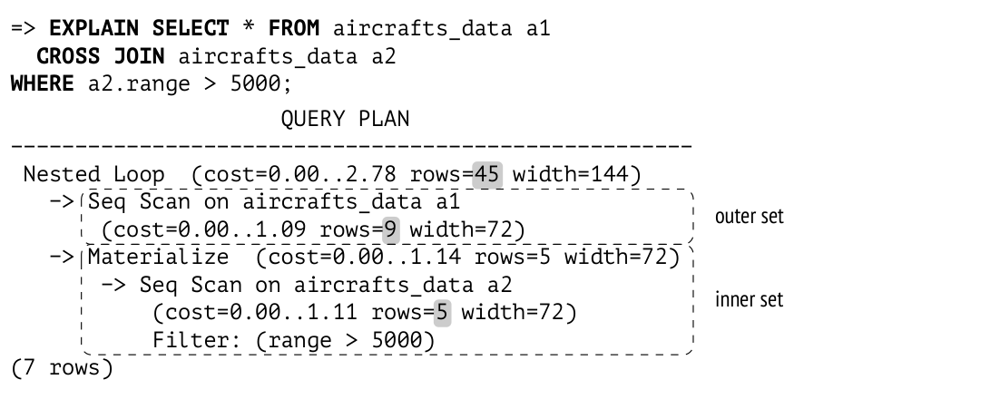
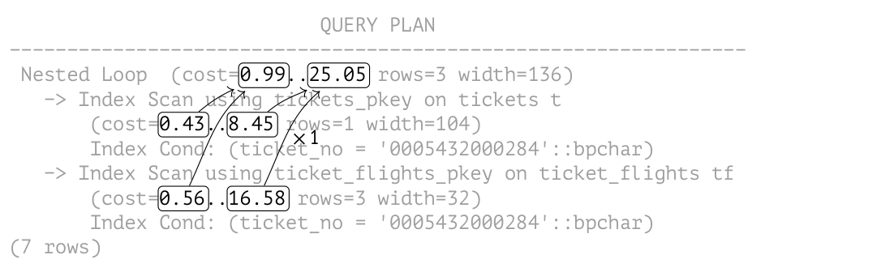
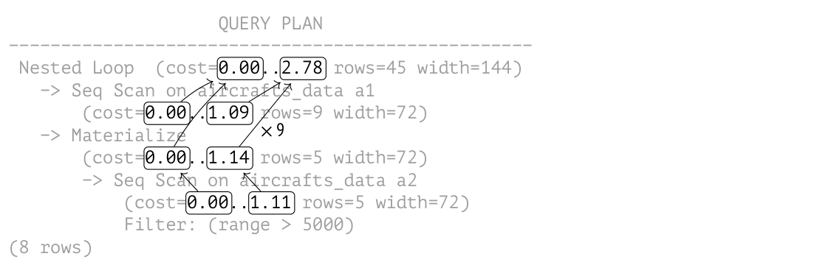

# Chương 21. Nested Loop (Vòng lặp lồng nhau)

## 21.1 Các kiểu join và phương thức join (Join Types and Methods)

*Join* (phép kết nối) là một tính năng then chốt của ngôn ngữ SQL; chúng là nền tảng cho sức mạnh và sự linh hoạt của ngôn ngữ này. Các tập dòng (hoặc được lấy trực tiếp từ bảng, hoặc nhận được như kết quả của một thao tác nào đó khác) luôn được join theo từng cặp.

Có một số *kiểu* join:

**Inner joins.** Một *inner join* (được viết là `INNER JOIN`, hoặc đơn giản là `JOIN`) gồm những cặp dòng của hai tập thỏa mãn một *điều kiện join* (join condition) cụ thể. Điều kiện join kết hợp một số cột của tập dòng này với một số cột của tập dòng kia; tất cả các cột tham gia tạo thành *khóa join* (join key).

Nếu điều kiện join đòi hỏi khóa join của hai tập phải bằng nhau, phép join như vậy được gọi là *equi-join*; đây là kiểu join phổ biến nhất.

*Tích Descartes* (Cartesian product, `CROSS JOIN`) của hai tập gồm tất cả các cặp dòng có thể có của hai tập này — đó là một trường hợp đặc biệt của inner join với điều kiện luôn đúng.

**Outer joins.** Một *left outer join* (được viết là `LEFT OUTER JOIN`, hoặc đơn giản là `LEFT JOIN`) mở rộng kết quả của inner join bằng những dòng của tập bên trái không có dòng tương ứng trong tập bên phải (các cột tương ứng phía bên phải được điền giá trị `NULL`).

Điều tương tự cũng đúng với *right outer join* (`RIGHT JOIN`), chỉ khác ở chỗ hoán đổi vai trò của hai tập.

Một *full outer join* (được viết là `FULL JOIN`) bao gồm cả left outer join và right outer join, bổ sung cả những dòng phía bên phải lẫn phía bên trái không tìm được dòng tương ứng.

**Anti-Joins and Semi-Joins.** Một *semi-join* trông rất giống inner join, nhưng nó chỉ bao gồm những dòng của tập bên trái có dòng tương ứng trong tập bên phải (một dòng chỉ được đưa vào một lần duy nhất, kể cả khi có nhiều dòng tương ứng).

Một *anti-join* bao gồm những dòng của một tập không có dòng tương ứng trong tập kia.

Ngôn ngữ SQL không có semi-join và anti-join tường minh, nhưng có thể đạt được kết quả tương tự bằng các vị từ như `EXISTS` và `NOT EXISTS`.

Tất cả các phép join này đều là các thao tác logic. Ví dụ, inner join thường được mô tả như một tích Descartes đã được loại bỏ những dòng không thỏa mãn điều kiện join. Nhưng ở mức vật lý, inner join thường được thực hiện bằng những cách ít tốn kém hơn.

PostgreSQL cung cấp một số *phương thức* join:

- nested loop join

- hash join

- merge join

Các phương thức join là những thuật toán hiện thực các thao tác logic của phép join trong SQL. Các thuật toán cơ bản này thường có những biến thể đặc biệt được thiết kế riêng cho từng kiểu join cụ thể, mặc dù chúng có thể chỉ hỗ trợ một số kiểu. Ví dụ, nested loop hỗ trợ inner join (được biểu diễn trong plan bằng node `Nested Loop`) và left outer join (được biểu diễn bằng node `Nested Loop Left Join`), nhưng không thể dùng cho full join.

Một số biến thể của cùng các thuật toán này cũng có thể được sử dụng bởi các thao tác khác, chẳng hạn như aggregation (tổng hợp).

Các phương thức join khác nhau cho hiệu năng tốt nhất trong những điều kiện khác nhau; nhiệm vụ của planner là chọn ra phương thức hiệu quả nhất về chi phí.

## 21.2 Nested Loop Join (Nested Loop Joins)

Thuật toán cơ bản của nested loop join hoạt động như sau. Vòng lặp ngoài duyệt qua tất cả các dòng của tập thứ nhất (gọi là tập *ngoài* — *outer* set). Với mỗi dòng này, vòng lặp lồng bên trong duyệt qua các dòng của tập thứ hai (gọi là tập *trong* — *inner* set) để tìm những dòng thỏa mãn điều kiện join. Mỗi cặp tìm được sẽ được trả về ngay lập tức như một phần của kết quả truy vấn.[^1]

Thuật toán truy cập tập trong nhiều lần bằng đúng số dòng của tập ngoài. Do đó, hiệu quả của nested loop join phụ thuộc vào một số yếu tố:

- cardinality của tập dòng ngoài

- sự sẵn có của một access method có thể lấy các dòng của tập trong một cách hiệu quả

- việc truy cập lặp lại vào cùng những dòng của tập trong

### Tích Descartes (Cartesian Product)

Nested loop join là cách hiệu quả nhất để tính tích Descartes, bất kể số dòng trong các tập là bao nhiêu:

```
=> EXPLAIN SELECT * FROM aircrafts_data a1
  CROSS JOIN aircrafts_data a2
WHERE a2.range > 5000;
                     QUERY PLAN
-----------------------------------------------------
 Nested Loop  (cost=0.00..2.78 rows=45 width=144)
   -> Seq Scan on aircrafts_data a1
       (cost=0.00..1.09 rows=9 width=72)
   -> Materialize  (cost=0.00..1.14 rows=5 width=72)
       -> Seq Scan on aircrafts_data a2
           (cost=0.00..1.11 rows=5 width=72)
           Filter: (range > 5000)
(7 rows)
```



Node `Nested Loop` thực hiện phép join bằng thuật toán mô tả ở trên. Nó luôn có hai node con: node được hiển thị phía trên trong plan tương ứng với tập dòng ngoài, còn node phía dưới biểu diễn tập trong.

Trong ví dụ này, tập trong được biểu diễn bởi node `Materialize`.[^2] Node này trả về các dòng nhận được từ node con của nó, đồng thời lưu chúng lại để dùng về sau (các dòng được tích lũy trong bộ nhớ cho đến khi tổng kích thước của chúng đạt tới *work_mem* *(mặc định: 4MB)*; sau đó PostgreSQL bắt đầu ghi tràn chúng ra một file tạm trên đĩa). Nếu được truy cập lại, node này đọc các dòng đã tích lũy mà không cần gọi node con. Nhờ vậy, executor có thể tránh việc quét lại toàn bộ bảng và chỉ đọc những dòng thỏa mãn điều kiện.

Một plan tương tự cũng có thể được xây dựng cho truy vấn sử dụng equi-join thông thường:

```
=> EXPLAIN SELECT * FROM tickets t
  JOIN ticket_flights tf ON tf.ticket_no = t.ticket_no
WHERE t.ticket_no = '0005432000284';
                          QUERY PLAN
----------------------------------------------------------------
 Nested Loop  (cost=0.99..25.05 rows=3 width=136)
   -> Index Scan using tickets_pkey on tickets t
       (cost=0.43..8.45 rows=1 width=104)
       Index Cond: (ticket_no = '0005432000284'::bpchar)
   -> Index Scan using ticket_flights_pkey on ticket_flights tf
       (cost=0.56..16.58 rows=3 width=32)
       Index Cond: (ticket_no = '0005432000284'::bpchar)
(7 rows)
```

Khi nhận ra hai giá trị bằng nhau, planner thay điều kiện join `tf.ticket_no = t.ticket_no` bằng điều kiện `tf.ticket_no =` *hằng số*, về thực chất là rút gọn một equi-join thành một tích Descartes.[^3]

**Ước lượng cardinality.** Cardinality của một tích Descartes được ước lượng bằng tích các cardinality của các tập dữ liệu được join: 3 = 1 × 3.

**Ước lượng cost.** Startup cost của thao tác join là tổng startup cost của tất cả các node con.

Full cost của phép join bao gồm các thành phần sau:

- cost để lấy tất cả các dòng của tập ngoài

- cost của một lần lấy tất cả các dòng của tập trong (vì cardinality ước lượng của tập ngoài bằng một)

- cost để xử lý mỗi dòng được trả về

Dưới đây là đồ thị phụ thuộc cho việc ước lượng cost:

```
                          QUERY PLAN
----------------------------------------------------------------
 Nested Loop  (cost=0.99..25.05 rows=3 width=136)
   -> Index Scan using tickets_pkey on tickets t
       (cost=0.43..8.45 rows=1 width=104)
       Index Cond: (ticket_no = '0005432000284'::bpchar)
   -> Index Scan using ticket_flights_pkey on ticket_flights tf
       (cost=0.56..16.58 rows=3 width=32)
       Index Cond: (ticket_no = '0005432000284'::bpchar)
(7 rows)
```



Cost của phép join được tính như sau:

```
=> SELECT 0.43 + 0.56 AS startup_cost,
  round((
    8.45 + 16.57 +
    3 * current_setting('cpu_tuple_cost')::real
  )::numeric, 2) AS total_cost;
 startup_cost | total_cost
--------------+------------
         0.99 |      25.05
(1 row)
```

Bây giờ hãy quay lại ví dụ trước:

```
=> EXPLAIN SELECT *
FROM aircrafts_data a1
  CROSS JOIN aircrafts_data a2
WHERE a2.range > 5000;
                     QUERY PLAN
-----------------------------------------------------
 Nested Loop  (cost=0.00..2.78 rows=45 width=144)
   -> Seq Scan on aircrafts_data a1
       (cost=0.00..1.09 rows=9 width=72)
   -> Materialize  (cost=0.00..1.14 rows=5 width=72)
       -> Seq Scan on aircrafts_data a2
           (cost=0.00..1.11 rows=5 width=72)
           Filter: (range > 5000)
(7 rows)
```

Plan lần này chứa node `Materialize`; sau khi đã tích lũy một lần các dòng nhận từ node con, `Materialize` trả về chúng nhanh hơn nhiều trong tất cả các lần gọi tiếp theo.

Nói chung, tổng cost của một phép join bao gồm các khoản chi phí sau:[^4]

- cost để lấy tất cả các dòng của tập ngoài

- cost của lần lấy đầu tiên tất cả các dòng của tập trong (trong lần này việc materialization được thực hiện)

- (*N* - 1) lần cost của các lần lấy lặp lại các dòng của tập trong (ở đây *N* là số dòng trong tập ngoài)

- cost để xử lý mỗi dòng được trả về

Đồ thị phụ thuộc ở đây như sau:

```
                    QUERY PLAN
--------------------------------------------------
 Nested Loop  (cost=0.00..2.78 rows=45 width=144)
   -> Seq Scan on aircrafts_data a1
       (cost=0.00..1.09 rows=9 width=72)
   -> Materialize
       (cost=0.00..1.14 rows=5 width=72)
       -> Seq Scan on aircrafts_data a2
           (cost=0.00..1.11 rows=5 width=72)
           Filter: (range > 5000)
(8 rows)
```



Trong ví dụ này, materialization làm giảm cost của các lần lấy dữ liệu lặp lại. Cost của lần gọi `Materialize` đầu tiên được hiển thị trong plan, còn tất cả các lần gọi tiếp theo thì không được liệt kê. Tôi sẽ không trình bày các phép tính ở đây,[^5] nhưng trong trường hợp cụ thể này giá trị ước lượng là 0.0125.

Như vậy, cost của phép join thực hiện trong ví dụ này được tính như sau:

```
=> SELECT 0.00 + 0.00 AS startup_cost,
  round((
    1.09 + (1.14 + 8 * 0.0125) +
    45 * current_setting('cpu_tuple_cost')::real
  )::numeric, 2) AS total_cost;
 startup_cost | total_cost
--------------+------------
         0.00 |       2.78
(1 row)
```

### Join có tham số (Parameterized Joins)

Bây giờ hãy xem xét một ví dụ phổ biến hơn, không quy về tích Descartes:

```
=> CREATE INDEX ON tickets(book_ref);
=> EXPLAIN SELECT *
FROM tickets t
  JOIN ticket_flights tf ON tf.ticket_no = t.ticket_no
WHERE t.book_ref = '03A76D';
                          QUERY PLAN
----------------------------------------------------------------
 Nested Loop  (cost=0.99..45.68 rows=6 width=136)
   -> Index Scan using tickets_book_ref_idx on tickets t
       (cost=0.43..12.46 rows=2 width=104)
       Index Cond: (book_ref = '03A76D'::bpchar)
   -> Index Scan using ticket_flights_pkey on ticket_flights tf
       (cost=0.56..16.58 rows=3 width=32)
       Index Cond: (ticket_no = t.ticket_no)
(7 rows)
```

Ở đây node `Nested Loop` duyệt qua các dòng của tập ngoài (tickets), và với mỗi dòng này nó tìm các dòng tương ứng của tập trong (flights), truyền số vé (`t.ticket_no`) vào điều kiện *dưới dạng tham số*. Khi node bên trong (`Index Scan`) được gọi, nó phải xử lý điều kiện `ticket_no =` *hằng số*.

**Ước lượng cardinality.** Planner ước lượng rằng điều kiện lọc theo mã đặt chỗ được thỏa mãn bởi hai dòng của tập ngoài (`rows=2`), và mỗi dòng này khớp trung bình với ba dòng của tập trong (`rows=3`).

*Join selectivity* (độ chọn lọc của phép join) là phần của tích Descartes của hai tập còn lại sau phép join. Hiển nhiên là ta phải loại bỏ những dòng của cả hai tập chứa giá trị NULL trong khóa join, vì điều kiện bằng sẽ không bao giờ được thỏa mãn với chúng.

Cardinality ước lượng bằng cardinality của tích Descartes (tức là tích các cardinality của hai tập) nhân với selectivity.[^6]

Ở đây cardinality ước lượng của tập thứ nhất (tập ngoài) là hai dòng. Vì không có điều kiện nào được áp dụng cho tập thứ hai (tập trong) ngoại trừ chính điều kiện join, cardinality của tập thứ hai được lấy bằng cardinality của bảng `ticket_flights`.

Vì các bảng được join liên kết với nhau bằng foreign key (khóa ngoại), việc ước lượng selectivity dựa trên thực tế là mỗi dòng của bảng con có đúng một dòng tương ứng trong bảng cha. Vì vậy selectivity được lấy bằng nghịch đảo kích thước của bảng được foreign key tham chiếu tới.[^7]

Như vậy, với trường hợp các cột `ticket_no` không chứa giá trị `NULL`, ước lượng như sau:

```
=> SELECT round(2 * tf.reltuples * (1.0 / t.reltuples)) AS rows
FROM pg_class t, pg_class tf
WHERE t.relname = 'tickets'
  AND tf.relname = 'ticket_flights';
 rows
------
    6
(1 row)
```

Rõ ràng là các bảng cũng có thể được join mà không dùng foreign key. Khi đó selectivity sẽ được lấy bằng các selectivity ước lượng của từng điều kiện join cụ thể.[^8]

Với equi-join trong ví dụ này, công thức tổng quát để ước lượng selectivity, giả định rằng các giá trị phân bố đều, có dạng: min(1/nd<sub>1</sub>, 1/nd<sub>2</sub>), trong đó nd<sub>1</sub> và nd<sub>2</sub> là số giá trị phân biệt của khóa join trong tập thứ nhất và tập thứ hai tương ứng. *[→ tr. 276](17-statistics.md)*[^9]

Thống kê về các giá trị phân biệt cho thấy số vé trong bảng `tickets` là duy nhất (điều hoàn toàn dễ hiểu, vì cột `ticket_no` là primary key), còn `ticket_flights` có khoảng ba dòng tương ứng cho mỗi vé:

```
=> SELECT t.n_distinct, tf.n_distinct
FROM pg_stats t, pg_stats tf
WHERE t.tablename = 'tickets' AND t.attname = 'ticket_no'
  AND tf.tablename = 'ticket_flights' AND tf.attname = 'ticket_no';
 n_distinct | n_distinct
------------+-------------
         -1 | -0.30362356
(1 row)
```

Kết quả sẽ khớp với ước lượng cho phép join có foreign key:

```
=> SELECT round(2 * tf.reltuples *
  least(1.0/t.reltuples, 1.0/tf.reltuples/0.30362356)
) AS rows
FROM pg_class t, pg_class tf
WHERE t.relname = 'tickets' AND tf.relname = 'ticket_flights';
 rows
------
    6
(1 row)
```

Planner cố gắng tinh chỉnh ước lượng cơ sở này bất cứ khi nào có thể. Hiện tại nó chưa thể sử dụng histogram, nhưng nó có tính đến danh sách MCV nếu loại thống kê này đã được thu thập trên khóa join cho cả hai bảng.[^10] *[→ tr. 277](17-statistics.md)* Selectivity của những dòng xuất hiện trong danh sách có thể được ước lượng chính xác hơn, và chỉ những dòng còn lại mới phải dựa vào các phép tính giả định phân bố đều.

Nói chung, việc ước lượng join selectivity có nhiều khả năng chính xác hơn nếu foreign key được định nghĩa. Điều này đặc biệt đúng với khóa join phức hợp (composite), vì trong trường hợp này selectivity thường bị ước lượng thấp đi rất nhiều.

Dùng lệnh `EXPLAIN ANALYZE`, bạn có thể xem không chỉ số dòng thực tế mà còn cả số lần vòng lặp trong đã được thực thi:

```
=> EXPLAIN (analyze, timing off, summary off) SELECT *
FROM tickets t
  JOIN ticket_flights tf ON tf.ticket_no = t.ticket_no
WHERE t.book_ref = '03A76D';
```

```
                           QUERY PLAN
-------------------------------------------------------------------
 Nested Loop  (cost=0.99..45.68 rows=6 width=136)
   (actual rows=8 loops=1)
   -> Index Scan using tickets_book_ref_idx on tickets t
       (cost=0.43..12.46 rows=2 width=104) (actual rows=2 loops=1)
       Index Cond: (book_ref = '03A76D'::bpchar)
   -> Index Scan using ticket_flights_pkey on ticket_flights tf
       (cost=0.56..16.58 rows=3 width=32) (actual rows=4 loops=2)
       Index Cond: (ticket_no = t.ticket_no)
(8 rows)
```

Tập ngoài chứa hai dòng (`actual rows=2`); ước lượng đã chính xác. Vì vậy node `Index Scan` được thực thi hai lần (`loops=2`), và mỗi lần nó chọn trung bình bốn dòng (`actual rows=4`). Do đó tổng số dòng tìm được là: `actual rows=8`.

> Tôi không hiển thị thời gian thực thi của từng giai đoạn trong plan (TIMING OFF) để kết quả vừa với độ rộng hạn chế của trang sách; ngoài ra, trên một số nền tảng, việc xuất kết quả có bật đo thời gian có thể làm chậm đáng kể việc thực thi truy vấn. Nhưng nếu có hiển thị, PostgreSQL sẽ đưa ra giá trị trung bình, giống như với số dòng. Để có tổng thời gian thực thi, bạn cần nhân giá trị này với số lần lặp (loops).

**Ước lượng cost.** Công thức ước lượng cost ở đây giống như trong các ví dụ trước.

Hãy nhớ lại query plan của chúng ta:

```
=> EXPLAIN SELECT *
FROM tickets t
  JOIN ticket_flights tf ON tf.ticket_no = t.ticket_no
WHERE t.book_ref = '03A76D';
                          QUERY PLAN
----------------------------------------------------------------
 Nested Loop  (cost=0.99..45.68 rows=6 width=136)
   -> Index Scan using tickets_book_ref_idx on tickets t
       (cost=0.43..12.46 rows=2 width=104)
       Index Cond: (book_ref = '03A76D'::bpchar)
   -> Index Scan using ticket_flights_pkey on ticket_flights tf
       (cost=0.56..16.58 rows=3 width=32)
       Index Cond: (ticket_no = t.ticket_no)
(7 rows)
```

Trong trường hợp này, cost của mỗi lần quét tiếp theo trên tập trong bằng cost của lần quét đầu tiên. Vì vậy cuối cùng ta có các con số sau:

```
=> SELECT 0.43 + 0.56 AS startup_cost,
  round((
    12.46 + 2 * 16.57 +
    6 * current_setting('cpu_tuple_cost')::real
  )::numeric, 2) AS total_cost;
 startup_cost | total_cost
--------------+------------
         0.99 |      45.66
(1 row)
```

### Cache các dòng (Memoization) (Caching Rows (Memoization)) *(v. 14)*

Nếu tập trong được quét lặp đi lặp lại với cùng các giá trị tham số (và do đó cho ra cùng kết quả), việc cache các dòng của tập này có thể mang lại lợi ích.

Việc cache như vậy được thực hiện bởi node `Memoize`.[^11] Tương tự node `Materialize`, nhưng nó được thiết kế để xử lý các join có tham số và có cách hiện thực phức tạp hơn nhiều:

- Node `Materialize` chỉ đơn giản materialize tất cả các dòng mà node con trả về, trong khi `Memoize` đảm bảo rằng các dòng được trả về cho các giá trị tham số khác nhau được lưu giữ riêng biệt.

- Khi bị tràn, vùng lưu trữ của `Materialize` bắt đầu ghi tràn các dòng ra đĩa, trong khi `Memoize` giữ tất cả các dòng trong bộ nhớ (nếu không thì việc cache sẽ chẳng còn ý nghĩa gì).

Dưới đây là ví dụ một truy vấn sử dụng `Memoize`:

```
=> EXPLAIN SELECT * FROM flights f
  JOIN aircrafts_data a ON f.aircraft_code = a.aircraft_code
WHERE f.flight_no = 'PG0003';
                            QUERY PLAN
---------------------------------------------------------------------
 Nested Loop  (cost=5.44..387.10 rows=113 width=135)
   -> Bitmap Heap Scan on flights f
       (cost=5.30..382.22 rows=113 width=63)
       Recheck Cond: (flight_no = 'PG0003'::bpchar)
       -> Bitmap Index Scan on flights_flight_no_scheduled_depart...
           (cost=0.00..5.27 rows=113 width=0)
           Index Cond: (flight_no = 'PG0003'::bpchar)
   -> Memoize  (cost=0.15..0.27 rows=1 width=72)
       Cache Key: f.aircraft_code
       Cache Mode: logical
       -> Index Scan using aircrafts_pkey on aircrafts_data a
           (cost=0.14..0.26 rows=1 width=72)
           Index Cond: (aircraft_code = f.aircraft_code)
(13 rows)
```

Kích thước vùng bộ nhớ dùng để lưu các dòng được cache bằng *work_mem* × *hash_mem_multiplier* *(mặc định: 4MB 1.0)*. Như tên của tham số thứ hai gợi ý, các dòng được cache được lưu trong một bảng băm (hash table, với open addressing — địa chỉ mở).[^12] Khóa băm (hiển thị là `Cache Key` trong plan) là giá trị tham số (hoặc nhiều giá trị nếu có nhiều hơn một tham số).

Tất cả các khóa băm được liên kết thành một danh sách; một đầu của danh sách được coi là lạnh (cold, vì nó chứa những khóa đã lâu không được dùng), còn đầu kia là nóng (hot, nó lưu các khóa được dùng gần đây).

Nếu một lần gọi node `Memoize` cho thấy các giá trị tham số được truyền vào tương ứng với những dòng đã được cache, các dòng này sẽ được chuyển lên node cha (`Nested Loop`) mà không cần kiểm tra node con. Khóa băm được dùng khi đó sẽ được chuyển về đầu nóng của danh sách.

Nếu cache không chứa các dòng cần thiết, node `Memoize` lấy chúng từ node con, cache chúng lại và chuyển chúng lên node phía trên. Khóa băm tương ứng cũng trở thành nóng.

Khi dữ liệu mới liên tục được cache, nó có thể chiếm hết toàn bộ bộ nhớ khả dụng. Để giải phóng bớt chỗ, các dòng tương ứng với các khóa lạnh sẽ bị eviction (loại bỏ khỏi cache). Thuật toán eviction này khác với thuật toán dùng trong buffer cache nhưng phục vụ cùng một mục đích. *[→ tr. 154](09-buffer-cache.md)*

Một số giá trị tham số có thể có nhiều dòng tương ứng đến mức chúng không vừa với vùng bộ nhớ được cấp phát, ngay cả khi tất cả các dòng khác đã bị loại bỏ. Những tham số như vậy sẽ bị bỏ qua — chẳng có ý nghĩa gì khi chỉ cache một phần các dòng, vì lần gọi tiếp theo vẫn sẽ phải lấy tất cả các dòng từ node con.

**Ước lượng cost và cardinality.** Các phép tính này khá giống với những gì chúng ta đã thấy ở trên. Chỉ cần lưu ý rằng cost của node `Memoize` hiển thị trong plan không liên quan gì đến cost thực tế của nó: đó đơn giản là cost của node con cộng thêm giá trị *cpu_tuple_cost* *(mặc định: 0.01)*.[^13]

Chúng ta đã gặp một tình huống tương tự với node `Materialize`: cost của nó chỉ được tính cho *các lần quét tiếp theo*[^14] và không được phản ánh trong plan.

Rõ ràng, việc dùng `Memoize` chỉ có ý nghĩa nếu nó rẻ hơn node con của nó. Cost của mỗi lần quét `Memoize` tiếp theo phụ thuộc vào mô hình truy cập cache dự kiến và kích thước vùng bộ nhớ có thể dùng để cache. Giá trị tính được phụ thuộc nhiều vào việc ước lượng chính xác số giá trị tham số phân biệt sẽ được dùng trong các lần quét tập dòng trong.[^15] Dựa trên con số này, có thể cân nhắc xác suất các dòng được cache và bị loại khỏi cache. Các lần hit (trúng cache) dự kiến làm giảm cost ước lượng, còn các lần eviction tiềm năng làm tăng nó. Chúng ta sẽ bỏ qua chi tiết của các phép tính này ở đây.

Để biết điều gì thực sự diễn ra trong quá trình thực thi truy vấn, chúng ta sẽ dùng lệnh `EXPLAIN ANALYZE` như thường lệ:

```
=> EXPLAIN (analyze, costs off, timing off, summary off)
SELECT * FROM flights f
  JOIN aircrafts_data a ON f.aircraft_code = a.aircraft_code
WHERE f.flight_no = 'PG0003';
                            QUERY PLAN
---------------------------------------------------------------------
 Nested Loop (actual rows=113 loops=1)
   -> Bitmap Heap Scan on flights f
       (actual rows=113 loops=1)
       Recheck Cond: (flight_no = 'PG0003'::bpchar)
       Heap Blocks: exact=2
       -> Bitmap Index Scan on flights_flight_no_scheduled_depart...
           (actual rows=113 loops=1)
           Index Cond: (flight_no = 'PG0003'::bpchar)
   -> Memoize (actual rows=1 loops=113)
       Cache Key: f.aircraft_code
       Cache Mode: logical
       Hits: 112  Misses: 1 Evictions: 0  Overflows: 0  Memory
       Usage: 1kB
       -> Index Scan using aircrafts_pkey on aircrafts_data a
           (actual rows=1 loops=1)
           Index Cond: (aircraft_code = f.aircraft_code)
(16 rows)
```

Truy vấn này chọn các chuyến bay đi theo cùng một tuyến và được thực hiện bằng máy bay thuộc một loại cụ thể, vì vậy tất cả các lần gọi node `Memoize` đều dùng cùng một khóa băm. Dòng đầu tiên phải được lấy từ bảng (`Misses: 1`), nhưng tất cả các dòng tiếp theo đều được tìm thấy trong cache (`Hits: 112`). Toàn bộ thao tác chỉ tốn 1 kB bộ nhớ.

Hai giá trị còn lại được hiển thị đều bằng không: chúng biểu thị số lần eviction và số lần tràn cache khi không thể cache tất cả các dòng liên quan đến một bộ tham số cụ thể. Các con số lớn sẽ cho thấy cache được cấp phát quá nhỏ, điều có thể do ước lượng không chính xác số giá trị tham số phân biệt. Khi đó việc dùng node `Memoize` có thể trở nên khá tốn kém. Trong trường hợp cực đoan, bạn có thể cấm planner sử dụng cache bằng cách tắt tham số *enable_memoize* *(mặc định: on)*.

### Outer Joins

Nested loop join có thể được dùng để thực hiện *left outer join*:

```
=> EXPLAIN SELECT *
FROM ticket_flights tf
  LEFT JOIN boarding_passes bp ON bp.ticket_no = tf.ticket_no
                             AND bp.flight_id = tf.flight_id
WHERE tf.ticket_no = '0005434026720';
                            QUERY PLAN
---------------------------------------------------------------------
 Nested Loop Left Join (cost=1.12..33.35 rows=3 width=57)
   Join Filter: ((bp.ticket_no = tf.ticket_no) AND (bp.flight_id =
   tf.flight_id))
   -> Index Scan using ticket_flights_pkey on ticket_flights tf
       (cost=0.56..16.58 rows=3 width=32)
       Index Cond: (ticket_no = '0005434026720'::bpchar)
   -> Materialize  (cost=0.56..16.62 rows=3 width=25)
       -> Index Scan using boarding_passes_pkey on boarding_passe...
           (cost=0.56..16.61 rows=3 width=25)
           Index Cond: (ticket_no = '0005434026720'::bpchar)
(10 rows)
```

Ở đây thao tác join được biểu diễn bởi node `Nested Loop Left Join`. Planner đã chọn một phép join không có tham số với bộ lọc: nó thực hiện các lần quét giống hệt nhau trên tập dòng trong (vì vậy tập này được đặt sau node `Materialize`) và trả về những dòng thỏa mãn điều kiện lọc (`Join Filter`).

Cardinality của outer join được ước lượng giống như của inner join, ngoại trừ việc giá trị ước lượng tính được sẽ được so sánh với cardinality của tập dòng ngoài, và giá trị lớn hơn được lấy làm kết quả cuối cùng.[^16] Nói cách khác, outer join không bao giờ làm giảm số dòng (nhưng có thể làm tăng).

Việc ước lượng cost tương tự như với inner join.

Chúng ta cũng cần nhớ rằng planner có thể chọn các plan khác nhau cho inner join và outer join. Ngay cả ví dụ đơn giản này cũng sẽ có `Join Filter` khác nếu planner bị buộc phải dùng nested loop join:

```
=> SET enable_mergejoin = off;
=> EXPLAIN SELECT *
FROM ticket_flights tf
  JOIN boarding_passes bp ON bp.ticket_no = tf.ticket_no
                        AND bp.flight_id = tf.flight_id
WHERE tf.ticket_no = '0005434026720';
```

```
                            QUERY PLAN
---------------------------------------------------------------------
 Nested Loop  (cost=1.12..33.33 rows=3 width=57)
   Join Filter: (tf.flight_id = bp.flight_id)
   -> Index Scan using ticket_flights_pkey on ticket_flights tf
       (cost=0.56..16.58 rows=3 width=32)
       Index Cond: (ticket_no = '0005434026720'::bpchar)
   -> Materialize  (cost=0.56..16.62 rows=3 width=25)
       -> Index Scan using boarding_passes_pkey on boarding_passe...
           (cost=0.56..16.61 rows=3 width=25)
           Index Cond: (ticket_no = '0005434026720'::bpchar)
(9 rows)
=> RESET enable_mergejoin;
```

Sự khác biệt nhỏ về tổng cost là do outer join còn phải kiểm tra số vé để có được kết quả đúng nếu không có dòng tương ứng trong tập dòng ngoài.

*Right join* không được hỗ trợ,[^17] vì thuật toán nested loop đối xử với tập trong và tập ngoài khác nhau. Tập ngoài được quét toàn bộ; còn với tập trong, việc truy cập qua index cho phép chỉ đọc những dòng thỏa mãn điều kiện join, nên một số dòng của nó có thể bị bỏ qua hoàn toàn.

*Full join* cũng không được hỗ trợ vì cùng lý do đó.

### Anti-join và semi-join (Anti- and Semi-joins)

Anti-join và semi-join giống nhau ở chỗ với mỗi dòng của tập thứ nhất (tập ngoài), chỉ cần tìm *một* dòng tương ứng trong tập thứ hai (tập trong) là đủ.

Một *anti-join* chỉ trả về các dòng của tập thứ nhất nếu chúng không có dòng tương ứng trong tập thứ hai: ngay khi executor tìm thấy dòng tương ứng đầu tiên trong tập thứ hai, nó có thể thoát khỏi vòng lặp hiện tại: dòng tương ứng của tập thứ nhất phải bị loại khỏi kết quả.

Anti-join có thể được dùng để tính vị từ `NOT EXISTS`.

Ví dụ, hãy tìm các mẫu máy bay chưa được định nghĩa cấu hình khoang. Plan tương ứng chứa node `Nested Loop Anti Join`:

```
=> EXPLAIN SELECT *
FROM aircrafts a
WHERE NOT EXISTS (
  SELECT * FROM seats s WHERE s.aircraft_code = a.aircraft_code
);
```

```
                            QUERY PLAN
---------------------------------------------------------------------
 Nested Loop Anti Join (cost=0.28..4.65 rows=1 width=40)
   -> Seq Scan on aircrafts_data ml (cost=0.00..1.09 rows=9 widt...
   -> Index Only Scan using seats_pkey on seats s
       (cost=0.28..5.55 rows=149 width=4)
       Index Cond: (aircraft_code = ml.aircraft_code)
(5 rows)
```

Một truy vấn thay thế không dùng vị từ `NOT EXISTS` sẽ có cùng plan:

```
=> EXPLAIN SELECT a.*
FROM aircrafts a
  LEFT JOIN seats s ON a.aircraft_code = s.aircraft_code
WHERE s.aircraft_code IS NULL;
                            QUERY PLAN
---------------------------------------------------------------------
 Nested Loop Anti Join (cost=0.28..4.65 rows=1 width=40)
   -> Seq Scan on aircrafts_data ml (cost=0.00..1.09 rows=9 widt...
   -> Index Only Scan using seats_pkey on seats s
       (cost=0.28..5.55 rows=149 width=4)
       Index Cond: (aircraft_code = ml.aircraft_code)
(5 rows)
```

Một *semi-join* trả về những dòng của tập thứ nhất có ít nhất một dòng tương ứng trong tập thứ hai (một lần nữa, không cần kiểm tra tập này để tìm các dòng tương ứng khác — kết quả đã được biết).

Semi-join có thể được dùng để tính vị từ `EXISTS`. Hãy tìm các mẫu máy bay có lắp đặt ghế trong khoang:

```
=> EXPLAIN SELECT *
FROM aircrafts a
WHERE EXISTS (
  SELECT * FROM seats s
  WHERE s.aircraft_code = a.aircraft_code
);
                            QUERY PLAN
---------------------------------------------------------------------
 Nested Loop Semi Join (cost=0.28..6.67 rows=9 width=40)
   -> Seq Scan on aircrafts_data ml (cost=0.00..1.09 rows=9 widt...
   -> Index Only Scan using seats_pkey on seats s
       (cost=0.28..5.55 rows=149 width=4)
       Index Cond: (aircraft_code = ml.aircraft_code)
(5 rows)
```

Node `Nested Loop Semi Join` biểu diễn phương thức join cùng tên. Plan này (cũng giống như các plan anti-join ở trên) đưa ra ước lượng cơ bản về số dòng trong bảng `seats` (`rows=149`), mặc dù chỉ cần lấy một dòng trong số đó là đủ. Tất nhiên, việc thực thi truy vấn thực tế sẽ dừng lại sau khi lấy được dòng đầu tiên:

```
=> EXPLAIN (analyze, costs off, timing off, summary off)
SELECT * FROM aircrafts a
WHERE EXISTS (
  SELECT * FROM seats s
  WHERE s.aircraft_code = a.aircraft_code
);
                        QUERY PLAN
------------------------------------------------------------
 Nested Loop Semi Join (actual rows=9 loops=1)
   -> Seq Scan on aircrafts_data ml (actual rows=9 loops=1)
   -> Index Only Scan using seats_pkey on seats s
       (actual rows=1 loops=9)
       Index Cond: (aircraft_code = ml.aircraft_code)
       Heap Fetches: 0
(6 rows)
```

**Ước lượng cardinality.** Selectivity của semi-join được ước lượng theo cách thông thường, ngoại trừ việc cardinality của tập trong được lấy bằng một. Với anti-join, selectivity ước lượng được lấy một trừ đi, giống như với phép phủ định.[^18]

**Ước lượng cost.** Với anti-join và semi-join, việc ước lượng cost phản ánh thực tế là việc quét tập thứ hai sẽ dừng ngay khi tìm thấy dòng tương ứng đầu tiên.[^19]

### Non-equi-join (Non-Equi-joins)

Thuật toán nested loop cho phép join các tập dòng dựa trên bất kỳ điều kiện join nào.

Hiển nhiên, nếu tập trong là một bảng cơ sở có index được tạo trên nó, và điều kiện join sử dụng một toán tử thuộc về một operator class của index này, thì việc truy cập tập trong có thể khá hiệu quả. *[→ tr. 315](19-index-access-methods.md)* Nhưng luôn luôn có thể thực hiện phép join bằng cách tính tích Descartes của các dòng được lọc theo một điều kiện nào đó — điều kiện này trong trường hợp này có thể hoàn toàn tùy ý. Như trong truy vấn sau, chọn ra các cặp sân bay nằm gần nhau:

```
=> CREATE EXTENSION earthdistance CASCADE;
=> EXPLAIN (costs off) SELECT *
FROM airports a1
  JOIN airports a2 ON a1.airport_code != a2.airport_code
                  AND a1.coordinates <@> a2.coordinates < 100;
```

```
                            QUERY PLAN
---------------------------------------------------------------------
 Nested Loop
   Join Filter: ((ml.airport_code <> ml_1.airport_code) AND
   ((ml.coordinates <@> ml_1.coordinates) < '100'::double precisi...
   -> Seq Scan on airports_data ml
   -> Materialize
       -> Seq Scan on airports_data ml_1
(6 rows)
```

### Chế độ song song (Parallel Mode) *(v. 9.6)*

Nested loop join có thể tham gia vào việc thực thi parallel plan.[^20] *[→ tr. 300](18-table-access-methods.md)*

Chỉ có tập ngoài là có thể được xử lý song song, vì nó có thể được nhiều worker quét đồng thời. Sau khi lấy được một dòng ngoài, mỗi worker phải tìm các dòng tương ứng trong tập trong, việc này được thực hiện tuần tự.

Truy vấn dưới đây bao gồm nhiều phép join; nó tìm các hành khách có vé cho một chuyến bay cụ thể:

```
=> EXPLAIN (costs off) SELECT t.passenger_name
FROM tickets t
  JOIN ticket_flights tf ON tf.ticket_no = t.ticket_no
  JOIN flights f ON f.flight_id = tf.flight_id
WHERE f.flight_id = 12345;
                            QUERY PLAN
---------------------------------------------------------------------
 Nested Loop
   -> Index Only Scan using flights_flight_id_status_idx on fligh...
       Index Cond: (flight_id = 12345)
   -> Gather
       Workers Planned: 2
       -> Nested Loop
           -> Parallel Seq Scan on ticket_flights tf
               Filter: (flight_id = 12345)
           -> Index Scan using tickets_pkey on tickets t
               Index Cond: (ticket_no = tf.ticket_no)
(10 rows)
```

Ở mức trên, nested loop join được thực hiện tuần tự. Tập ngoài chỉ gồm một dòng của bảng `flights` được lấy theo một khóa duy nhất, vì vậy việc dùng nested loop là hợp lý ngay cả khi số dòng trong tập trong lớn.

Tập trong được lấy bằng một parallel plan. Mỗi worker quét phần dòng của riêng mình trong bảng `ticket_flights` và join chúng với `tickets` bằng thuật toán nested loop. *[→ tr. 301](18-table-access-methods.md)*

[^1]: backend/executor/nodeNestloop.c
[^2]: backend/executor/nodeMaterial.c
[^3]: backend/optimizer/path/equivclass.c
[^4]: backend/optimizer/path/costsize.c, các hàm initial_cost_nestloop và final_cost_nestloop
[^5]: backend/optimizer/path/costsize.c, hàm cost_rescan
[^6]: backend/optimizer/path/costsize.c, hàm calc_joinrel_size_estimate
[^7]: backend/optimizer/path/costsize.c, hàm get_foreign_key_join_selectivity
[^8]: backend/optimizer/path/clausesel.c, hàm clauselist_selectivity
[^9]: backend/utils/adt/selfuncs.c, hàm eqjoinsel
[^10]: backend/utils/adt/selfuncs.c, hàm eqjoinsel
[^11]: backend/executor/nodeMemoize.c
[^12]: include/lib/simplehash.h
[^13]: backend/optimizer/util/pathnode.c, hàm create_memoize_path
[^14]: backend/optimizer/path/costsize.c, hàm cost_memoize_rescan
[^15]: backend/utils/adt/selfuncs.c, hàm estimate_num_groups
[^16]: backend/optimizer/path/costsize.c, hàm calc_joinrel_size_estimate
[^17]: backend/optimizer/path/joinpath.c, hàm match_unsorted_outer
[^18]: backend/optimizer/path/costsize.c, hàm calc_joinrel_size_estimate
[^19]: backend/optimizer/path/costsize.c, hàm final_cost_nestloop
[^20]: backend/optimizer/path/joinpath.c, hàm consider_parallel_nestloop
