# Chương 22. Hashing (Băm)

## 22.1 Hash join (Hash Joins)

### Hash join một lượt (One-Pass Hash Joins)

Hash join tìm kiếm các dòng khớp nhau bằng cách sử dụng một hash table (bảng băm) được xây dựng từ trước. Dưới đây là ví dụ về một plan có phép join như vậy:

```
=> EXPLAIN (costs off) SELECT *
FROM tickets t
  JOIN ticket_flights tf ON tf.ticket_no = t.ticket_no;
                QUERY PLAN
-------------------------------------------
 Hash Join
   Hash Cond: (tf.ticket_no = t.ticket_no)
   -> Seq Scan on ticket_flights tf
   -> Hash
       -> Seq Scan on tickets t
(5 rows)
```

Ở **giai đoạn thứ nhất**, node `Hash Join`[^1] gọi node `Hash`,[^2] node này kéo toàn bộ tập dòng bên trong (inner set) từ node con của nó và đặt vào một *hash table*.

Lưu trữ các cặp *hash key* (khóa băm) và *value* (giá trị), hash table cho phép truy cập nhanh tới một giá trị theo khóa của nó; thời gian tìm kiếm không phụ thuộc vào kích thước của hash table, vì các hash key được phân bố tương đối đồng đều giữa một số lượng hữu hạn các *bucket* (ngăn). Bucket mà một khóa nhất định rơi vào được xác định bởi *hash function* (hàm băm) của hash key; vì số lượng bucket luôn là lũy thừa của hai, chỉ cần lấy số bit cần thiết của giá trị đã tính là đủ.

Cũng giống như buffer cache, cài đặt này sử dụng một hash table có thể mở rộng động *[→ tr. 149](09-buffer-cache.md)*, giải quyết xung đột băm (hash collision) bằng phương pháp chaining (nối chuỗi).[^3]

Ở **giai đoạn thứ nhất** của thao tác join, tập bên trong được quét, và hash function được tính cho từng dòng của nó. Các cột được tham chiếu trong điều kiện join (`Hash Cond`) đóng vai trò hash key, còn bản thân hash table lưu tất cả các trường được truy vấn của tập bên trong.

Hash join hiệu quả nhất khi toàn bộ hash table có thể nằm gọn trong RAM, vì trong trường hợp này executor xử lý được dữ liệu chỉ trong một batch (lô) *(v. 13)*. Kích thước của vùng bộ nhớ được cấp phát cho mục đích này bị giới hạn bởi giá trị *work_mem* × *hash_mem_multiplier* *(mặc định: 4MB 1.0)*.

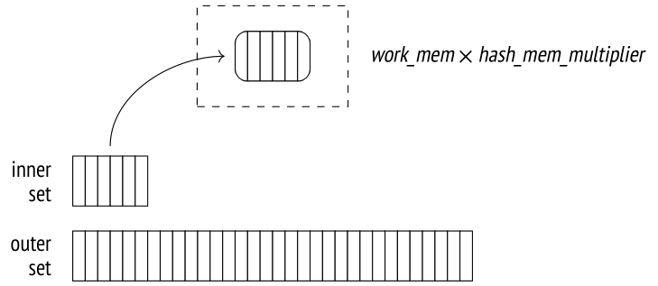

Hãy chạy `EXPLAIN ANALYZE` để xem thống kê về mức sử dụng bộ nhớ của một truy vấn:

```
=> SET work_mem = '256MB';
=> EXPLAIN (analyze, costs off, timing off, summary off)
SELECT * FROM bookings b
  JOIN tickets t ON b.book_ref = t.book_ref;
                         QUERY PLAN
---------------------------------------------------------------
 Hash Join (actual rows=2949857 loops=1)
   Hash Cond: (t.book_ref = b.book_ref)
   -> Seq Scan on tickets t (actual rows=2949857 loops=1)
   -> Hash (actual rows=2111110 loops=1)
       Buckets: 4194304 Batches: 1  Memory Usage: 145986kB
       -> Seq Scan on bookings b (actual rows=2111110 loops=1)
(6 rows)
```

Không giống nested loop join vốn đối xử khác nhau với tập bên trong và tập bên ngoài, hash join có thể hoán đổi chúng cho nhau. Tập nhỏ hơn thường được dùng làm tập bên trong, vì nó tạo ra hash table nhỏ hơn.

Trong ví dụ này, toàn bộ bảng vừa trong vùng cache được cấp phát: nó chiếm khoảng 143 MB (`Memory Usage`) và chứa 4 M = 2<sup>22</sup> bucket. Vì vậy phép join được thực hiện trong một lượt (`Batches`).

Nhưng nếu truy vấn chỉ tham chiếu tới một cột, hash table sẽ chỉ chiếm 111 MB:

```
=> EXPLAIN (analyze, costs off, timing off, summary off)
SELECT b.book_ref
FROM bookings b
  JOIN tickets t ON b.book_ref = t.book_ref;
                         QUERY PLAN
---------------------------------------------------------------
 Hash Join (actual rows=2949857 loops=1)
   Hash Cond: (t.book_ref = b.book_ref)
   -> Index Only Scan using tickets_book_ref_idx on tickets t
       (actual rows=2949857 loops=1)
       Heap Fetches: 0
   -> Hash (actual rows=2111110 loops=1)
       Buckets: 4194304 Batches: 1  Memory Usage: 113172kB
       -> Seq Scan on bookings b (actual rows=2111110 loops=1)
(8 rows)
=> RESET work_mem;
```

Đây là thêm một lý do nữa để tránh tham chiếu tới các trường thừa trong truy vấn (điều có thể xảy ra, chẳng hạn, nếu bạn dùng dấu sao).

Số lượng bucket được chọn phải đảm bảo rằng trung bình mỗi bucket chỉ chứa một dòng khi hash table được lấp đầy hoàn toàn bằng dữ liệu. Mật độ cao hơn sẽ làm tăng tỷ lệ xung đột băm, khiến việc tìm kiếm kém hiệu quả hơn, còn một hash table kém chặt chẽ hơn sẽ chiếm quá nhiều bộ nhớ. Số bucket ước lượng được làm tròn lên tới lũy thừa của hai gần nhất.[^4]

(Nếu kích thước hash table ước lượng, dựa trên độ rộng trung bình của một dòng, vượt quá giới hạn bộ nhớ, thì băm hai lượt sẽ được áp dụng.)

Hash join không thể bắt đầu trả về kết quả cho tới khi hash table được xây dựng xong hoàn toàn.

Ở **giai đoạn thứ hai** (lúc này hash table đã được xây dựng), node `Hash Join` gọi node con thứ hai của nó để lấy tập dòng bên ngoài (outer set). Với mỗi dòng được quét, hash table được tìm kiếm để tìm dòng khớp. Việc này đòi hỏi tính hash key cho các cột của tập bên ngoài có mặt trong điều kiện join.

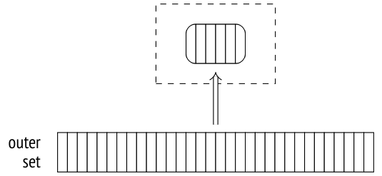

Các dòng khớp tìm được sẽ được trả về cho node cha.

**Ước lượng cost (Cost estimation).** Chúng ta đã đề cập tới việc ước lượng cardinality; vì nó không phụ thuộc vào phương pháp join *[→ tr. 356](21-nested-loop.md)*, bây giờ tôi sẽ tập trung vào ước lượng cost.

Cost của node `Hash` được biểu diễn bằng tổng cost của node con của nó. Đó là một con số giả, chỉ đơn giản lấp chỗ trống trong plan.[^5] Mọi ước lượng thực sự đều được tính vào cost của node `Hash Join`.[^6]

Dưới đây là một ví dụ:

```
=> EXPLAIN (analyze, timing off, summary off)
SELECT * FROM flights f
  JOIN seats s ON s.aircraft_code = f.aircraft_code;
                            QUERY PLAN
---------------------------------------------------------------------
 Hash Join  (cost=38.13..278507.28 rows=16518865 width=78)
   (actual rows=16518865 loops=1)
   Hash Cond: (f.aircraft_code = s.aircraft_code)
   -> Seq Scan on flights f (cost=0.00..4772.67 rows=214867 widt...
       (actual rows=214867 loops=1)
   -> Hash  (cost=21.39..21.39 rows=1339 width=15)
       (actual rows=1339 loops=1)
       Buckets: 2048  Batches: 1 Memory Usage: 79kB
       -> Seq Scan on seats s (cost=0.00..21.39 rows=1339 width=15)
           (actual rows=1339 loops=1)
(10 rows)
```

Startup cost (cost khởi động) của phép join chủ yếu phản ánh cost tạo hash table và bao gồm các thành phần sau:

- tổng cost lấy tập bên trong, vốn cần thiết để xây dựng hash table

- cost tính hash function của tất cả các cột có trong khóa join, cho mỗi dòng của tập bên trong (ước lượng bằng *cpu_operator_cost* cho mỗi phép toán) *(mặc định: 0.0025)*

- cost chèn tất cả các dòng bên trong vào hash table (ước lượng bằng *cpu_tuple_cost* cho mỗi dòng được chèn) *(mặc định: 0.01)*

- startup cost của việc lấy tập dòng bên ngoài, vốn cần thiết để bắt đầu thao tác join

Total cost (tổng cost) bao gồm startup cost và cost của chính phép join, cụ thể là:

- cost tính hash function của tất cả các cột có trong khóa join, cho mỗi dòng của tập bên ngoài (*cpu_operator_cost*)

- cost kiểm tra lại điều kiện join, cần thiết để xử lý các xung đột băm có thể xảy ra (ước lượng bằng *cpu_operator_cost* cho mỗi toán tử được kiểm tra)

- cost xử lý cho mỗi dòng kết quả (*cpu_tuple_cost*)

Số lần kiểm tra lại cần thiết là thứ khó ước lượng nhất. Nó được tính bằng cách nhân số dòng của tập bên ngoài với một tỷ lệ nào đó của tập bên trong (được lưu trong hash table). Để ước lượng tỷ lệ này, planner phải tính đến việc phân bố dữ liệu có thể không đồng đều. Tôi sẽ không đi sâu vào chi tiết của các phép tính này;[^7] trong trường hợp cụ thể này, tỷ lệ được ước lượng là 0.150112.

Như vậy, cost của truy vấn của chúng ta được ước lượng như sau:

```
=> WITH cost(startup) AS (
  SELECT round((
    21.39 +
    current_setting('cpu_operator_cost')::real * 1339 +
    current_setting('cpu_tuple_cost')::real * 1339 +
    0.00
  )::numeric, 2)
)
SELECT startup,
  startup + round((
    4772.67 +
    current_setting('cpu_operator_cost')::real * 214867 +
    current_setting('cpu_operator_cost')::real * 214867 * 1339 *
      0.150112 +
    current_setting('cpu_tuple_cost')::real * 16518865
  )::numeric, 2) AS total
FROM cost;
 startup |   total
---------+-----------
   38.13 | 278507.26
(1 row)
```

Và đây là đồ thị phụ thuộc:

```
                    QUERY PLAN
--------------------------------------------------
 Hash Join
   (cost=38.13..278507.28 rows=16518865 width=78)
   Hash Cond: (f.aircraft_code = s.aircraft_code)
   -> Seq Scan on flights f
       (cost=0.00..4772.67 rows=214867 width=63)
   -> Hash
       (cost=21.39..21.39 rows=1339 width=15)
       -> Seq Scan on seats s
           (cost=0.00..21.39 rows=1339 width=15)
(9 rows)
```

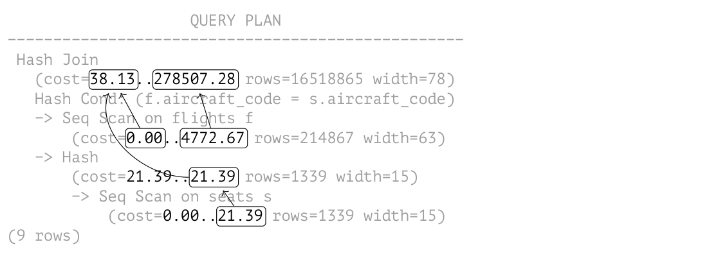

### Hash join hai lượt (Two-Pass Hash Joins)

Nếu ước lượng của planner cho thấy hash table sẽ không vừa với bộ nhớ được cấp phát, tập dòng bên trong sẽ được chia thành các *batch* để xử lý riêng rẽ. Số lượng batch (cũng như số lượng bucket) luôn là lũy thừa của hai; batch được dùng được xác định bởi số bit tương ứng của hash key.[^8]

Hai dòng khớp nhau bất kỳ luôn thuộc cùng một batch: các dòng được đặt vào các batch khác nhau không thể có cùng hash code (mã băm).

Tất cả các batch chứa số lượng hash key bằng nhau. Nếu dữ liệu phân bố đồng đều, kích thước các batch cũng sẽ xấp xỉ nhau. Planner có thể kiểm soát mức tiêu thụ bộ nhớ bằng cách chọn số lượng batch phù hợp.[^9]

Ở **giai đoạn thứ nhất**, executor quét tập dòng bên trong để xây dựng hash table. Nếu dòng được quét thuộc batch đầu tiên, nó được thêm vào hash table và giữ trong RAM. Nếu không, nó được ghi vào một *file tạm* (temporary file) (mỗi batch có một file riêng).[^10]

> Tổng dung lượng các file tạm mà một session có thể lưu trên đĩa bị giới hạn bởi tham số *temp_file_limit* *(mặc định: -1)* (các bảng tạm không được tính vào giới hạn này). Ngay khi session đạt tới giá trị này, truy vấn sẽ bị hủy.

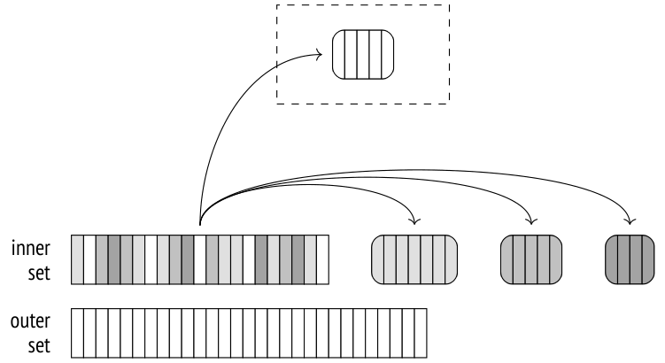

Ở **giai đoạn thứ hai**, tập bên ngoài được quét. Nếu dòng thuộc batch đầu tiên, nó được đối chiếu với hash table, vốn chứa batch đầu tiên của các dòng thuộc tập bên trong (dù sao thì cũng không thể có dòng khớp ở các batch khác).

Nếu dòng thuộc một batch khác, nó được lưu vào một file tạm, cũng được tạo riêng cho từng batch. Như vậy, *N* batch có thể dùng 2(*N* - 1) file (hoặc ít hơn nếu một số batch hóa ra rỗng).

Khi giai đoạn thứ hai hoàn tất, bộ nhớ được cấp phát cho hash table được giải phóng. Tại thời điểm này, chúng ta đã có kết quả join cho một trong các batch.

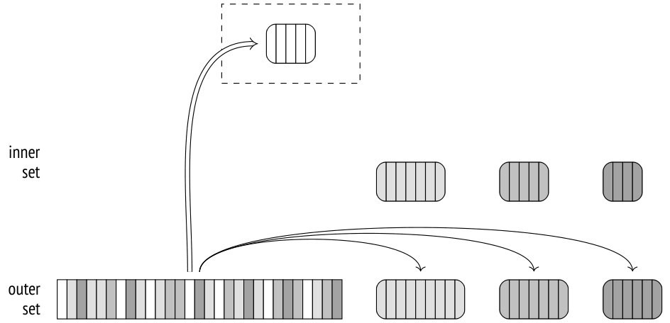

Cả hai giai đoạn được lặp lại cho từng batch đã lưu trên đĩa: các dòng của tập bên trong được chuyển từ file tạm vào hash table; sau đó các dòng của tập bên ngoài liên quan tới cùng batch đó được đọc từ một file tạm khác và đối chiếu với hash table này. Sau khi xử lý xong, các file tạm sẽ bị xóa.

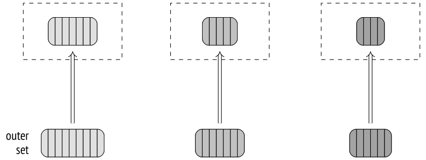

Khác với output tương tự của join một lượt, output của lệnh `EXPLAIN` cho join hai lượt chứa nhiều hơn một batch. Nếu chạy với tùy chọn `BUFFERS`, lệnh này cũng hiển thị thống kê về truy cập đĩa:

```
=> EXPLAIN (analyze, buffers, costs off, timing off, summary off)
SELECT *
FROM bookings b
  JOIN tickets t ON b.book_ref = t.book_ref;
```

```
                         QUERY PLAN
---------------------------------------------------------------
 Hash Join (actual rows=2949857 loops=1)
   Hash Cond: (t.book_ref = b.book_ref)
   Buffers: shared hit=7236 read=55626, temp read=55126
   written=55126
   -> Seq Scan on tickets t (actual rows=2949857 loops=1)
       Buffers: shared read=49415
   -> Hash (actual rows=2111110 loops=1)
       Buckets: 65536  Batches: 64 Memory Usage: 2277kB
       Buffers: shared hit=7236 read=6211, temp written=10858
       -> Seq Scan on bookings b (actual rows=2111110 loops=1)
           Buffers: shared hit=7236 read=6211
(11 rows)
```

Tôi đã trình bày truy vấn này ở trên với thiết lập *work_mem* được tăng lên. Giá trị mặc định 4 MB quá nhỏ để toàn bộ hash table vừa trong RAM; trong ví dụ này, dữ liệu được chia thành 64 batch, và hash table dùng 64 K = 2<sup>16</sup> bucket. Trong khi hash table đang được xây dựng (node `Hash`), dữ liệu được ghi vào các file tạm (`temp written`); ở giai đoạn join (node `Hash Join`), các file tạm vừa được đọc vừa được ghi (`temp read, written`).

Để thu thập thêm thống kê về file tạm, bạn có thể đặt tham số *log_temp_files* bằng không *(mặc định: -1)*. Khi đó log của server sẽ liệt kê tất cả các file tạm cùng kích thước của chúng (tại thời điểm bị xóa).

### Điều chỉnh động (Dynamic Adjustments)

Diễn biến theo kế hoạch có thể bị phá vỡ bởi hai vấn đề: statistics không chính xác và phân bố dữ liệu không đồng đều.

Nếu phân bố giá trị trong các cột khóa join không đồng đều, các batch khác nhau sẽ có kích thước khác nhau.

Nếu một batch nào đó (trừ batch đầu tiên) hóa ra quá lớn, tất cả các dòng của nó sẽ phải được ghi xuống đĩa rồi đọc lại từ đĩa. Chính tập bên ngoài gây ra phần lớn rắc rối, vì nó thường lớn hơn. Vì vậy, nếu có statistics thông thường (không phải multivariate) về MCV *[→ tr. 291](17-statistics.md)* của tập bên ngoài (tức là tập bên ngoài được biểu diễn bởi một bảng, và phép join được thực hiện theo một cột duy nhất), các dòng có hash code tương ứng với MCV được coi là một phần của batch đầu tiên.[^11] Kỹ thuật này (gọi là skew optimization — tối ưu hóa độ lệch) có thể giảm chi phí phụ trội I/O của join hai lượt ở một mức độ nào đó.

Do hai yếu tố này, kích thước của một số (hoặc tất cả) batch có thể vượt quá ước lượng. Khi đó hash table tương ứng sẽ không vừa với vùng bộ nhớ được cấp phát và sẽ vượt quá các giới hạn đã định.

Vì vậy, nếu hash table đang được xây dựng hóa ra quá lớn, số lượng batch sẽ được tăng lên (gấp đôi) ngay trong lúc chạy. Mỗi batch được chia ảo thành hai batch mới: khoảng một nửa số dòng (giả sử phân bố đồng đều) được giữ lại trong hash table, còn nửa kia được lưu vào một file tạm mới.[^12]

Việc chia như vậy có thể xảy ra ngay cả khi ban đầu đã lên kế hoạch join một lượt. Thực ra, join một lượt và hai lượt dùng cùng một thuật toán được cài đặt bởi cùng một đoạn code; tôi tách riêng chúng ở đây chỉ để trình bày được mạch lạc hơn.

Số lượng batch không thể giảm. Nếu hóa ra planner đã ước lượng quá cao kích thước dữ liệu, các batch sẽ không được gộp lại với nhau.

Trong trường hợp phân bố không đồng đều, việc tăng số lượng batch có thể không giúp ích. Ví dụ, nếu cột khóa chứa *cùng một* giá trị ở *tất cả* các dòng, chúng sẽ được đặt vào cùng một batch vì hash function sẽ trả về cùng một giá trị hết lần này tới lần khác. Đáng tiếc là trong trường hợp này hash table sẽ tiếp tục phình ra, bất chấp các giới hạn đã đặt.

> Về lý thuyết, vấn đề này có thể được giải quyết bằng join nhiều lượt (multi-pass join), thực hiện quét từng phần của batch, nhưng điều này không được hỗ trợ.

Để minh họa việc tăng động số lượng batch, trước tiên chúng ta phải thực hiện một vài thao tác: *[→ tr. 274](17-statistics.md)*

```
=> CREATE TABLE bookings_copy (LIKE bookings INCLUDING INDEXES)
WITH (autovacuum_enabled = off);
=> INSERT INTO bookings_copy SELECT * FROM bookings;
INSERT 0 2111110
=> DELETE FROM bookings_copy WHERE random() < 0.9;
DELETE 1899232
=> ANALYZE bookings_copy;
=> INSERT INTO bookings_copy SELECT * FROM bookings
ON CONFLICT DO NOTHING;
INSERT 0 1899232
=> SELECT reltuples FROM pg_class WHERE relname = 'bookings_copy';
 reltuples
-----------
    211878
(1 row)
```

Kết quả là chúng ta có một bảng mới tên `bookings_copy`. Nó là bản sao chính xác của bảng `bookings`, nhưng planner ước lượng thấp số dòng trong đó tới mười lần. Tình huống tương tự có thể xảy ra nếu hash table được tạo cho một tập dòng do một thao tác join khác sinh ra, khi đó không có statistics đáng tin cậy nào.

Sự tính toán sai này khiến planner nghĩ rằng 8 bucket là đủ, nhưng trong khi phép join được thực hiện, con số này tăng lên 32:

```
=> EXPLAIN (analyze, costs off, timing off, summary off)
SELECT *
FROM bookings_copy b
  JOIN tickets t ON b.book_ref = t.book_ref;
                            QUERY PLAN
---------------------------------------------------------------------
 Hash Join (actual rows=2949857 loops=1)
   Hash Cond: (t.book_ref = b.book_ref)
   -> Seq Scan on tickets t (actual rows=2949857 loops=1)
   -> Hash (actual rows=2111110 loops=1)
       Buckets: 65536 (originally 65536) Batches: 32 (originally 8)
        Memory Usage: 4040kB
       -> Seq Scan on bookings_copy b (actual rows=2111110 loops=1)
(7 rows)
```

**Ước lượng cost (Cost estimation).** Tôi đã dùng ví dụ này để minh họa ước lượng cost cho join một lượt, nhưng bây giờ tôi sẽ giảm kích thước bộ nhớ khả dụng xuống mức tối thiểu, để planner buộc phải dùng hai batch. Điều này làm tăng cost của phép join:

```
=> SET work_mem = '64kB';
=> EXPLAIN (analyze, timing off, summary off)
SELECT * FROM flights f
  JOIN seats s ON s.aircraft_code = f.aircraft_code;
                            QUERY PLAN
---------------------------------------------------------------------
 Hash Join  (cost=45.13..283139.28 rows=16518865 width=78)
   (actual rows=16518865 loops=1)
   Hash Cond: (f.aircraft_code = s.aircraft_code)
   -> Seq Scan on flights f (cost=0.00..4772.67 rows=214867 widt...
       (actual rows=214867 loops=1)
   -> Hash  (cost=21.39..21.39 rows=1339 width=15)
       (actual rows=1339 loops=1)
       Buckets: 2048  Batches: 2 Memory Usage: 55kB
       -> Seq Scan on seats s (cost=0.00..21.39 rows=1339 width=15)
           (actual rows=1339 loops=1)
(10 rows)
=> RESET work_mem;
```

Cost của lượt thứ hai phát sinh do việc đẩy (spill) các dòng ra file tạm và đọc chúng từ các file này.

Startup cost của join hai lượt dựa trên startup cost của join một lượt, được cộng thêm cost ước lượng của việc ghi số page cần thiết để lưu tất cả các trường cần thiết của *tất cả* các dòng thuộc tập bên trong.[^13] Mặc dù batch đầu tiên không được ghi xuống đĩa khi hash table đang được xây dựng, ước lượng không tính đến điều đó và do đó không phụ thuộc vào số lượng batch.

Đến lượt mình, total cost bao gồm total cost của join một lượt cùng với cost ước lượng của việc đọc các dòng của tập bên trong đã lưu trước đó trên đĩa, cũng như việc đọc và ghi các dòng của tập bên ngoài.

Cả việc ghi và đọc đều được ước lượng bằng *seq_page_cost* cho mỗi page, vì các thao tác I/O được giả định là tuần tự.

Trong trường hợp cụ thể này, số page cần cho tập bên trong được ước lượng là 7, còn dữ liệu của tập bên ngoài được dự kiến chiếm 2309 page. Cộng các ước lượng này vào cost của join một lượt đã tính ở trên, chúng ta nhận được đúng các con số hiển thị trong plan của truy vấn:

```
=> SELECT 38.13 + -- startup cost of a one-pass join
  current_setting('seq_page_cost')::real * 7
  AS startup,
278507.28 + -- total cost of a one-pass join
  current_setting('seq_page_cost')::real * 2 * (7 + 2309)
  AS total;
 startup |   total
---------+-----------
   45.13 | 283139.28
(1 row)
```

Như vậy, nếu không đủ bộ nhớ, phép join sẽ được thực hiện trong hai lượt và trở nên kém hiệu quả hơn. Do đó, cần lưu ý các điểm sau:

- Truy vấn phải được viết sao cho loại bỏ các trường thừa khỏi hash table.

- Planner phải chọn tập nhỏ hơn trong hai tập dòng khi xây dựng hash table.

### Sử dụng hash join trong parallel plan (Using Hash Joins in Parallel Plans) *(v. 9.6)*

Thuật toán hash join được mô tả ở trên cũng có thể được dùng trong parallel plan. Đầu tiên, một số tiến trình song song xây dựng các hash table riêng (hoàn toàn giống hệt nhau) của chúng cho tập bên trong, độc lập với nhau; sau đó chúng bắt đầu xử lý đồng thời tập bên ngoài. Lợi ích về hiệu năng ở đây có được là nhờ mỗi tiến trình chỉ quét phần dòng bên ngoài của riêng nó.

Plan sau đây dùng một hash join một lượt thông thường:

```
=> SET work_mem = '128MB';
=> SET enable_parallel_hash = off;
=> EXPLAIN (analyze, costs off, timing off, summary off)
SELECT count(*)
FROM bookings b
  JOIN tickets t ON t.book_ref = b.book_ref;
                            QUERY PLAN
---------------------------------------------------------------------
 Finalize Aggregate (actual rows=1 loops=1)
   -> Gather (actual rows=3 loops=1)
       Workers Planned: 2
       Workers Launched: 2
       -> Partial Aggregate (actual rows=1 loops=3)
           -> Hash Join (actual rows=983286 loops=3)
               Hash Cond: (t.book_ref = b.book_ref)
               -> Parallel Index Only Scan using tickets_book_ref...
                   Heap Fetches: 0
               -> Hash (actual rows=2111110 loops=3)
                   Buckets: 4194304 Batches: 1  Memory Usage:
                   113172kB
                   -> Seq Scan on bookings b (actual rows=2111110...
(13 rows)
=> RESET enable_parallel_hash;
```

Ở đây mỗi tiến trình băm bảng `bookings`, sau đó lấy phần dòng bên ngoài của riêng nó thông qua node `Parallel Index Only Scan`, và đối chiếu các dòng này với hash table thu được.

Giới hạn bộ nhớ của hash table được áp dụng riêng cho từng tiến trình song song, vì vậy tổng dung lượng bộ nhớ được cấp phát cho mục đích này sẽ lớn gấp ba lần so với con số hiển thị trong plan (`Memory Usage`).

### Hash join một lượt song song (Parallel One-Pass Hash Joins) *(v. 11)*

Mặc dù hash join thông thường có thể khá hiệu quả trong parallel plan (đặc biệt với các tập bên trong nhỏ, mà việc xử lý song song cho chúng không mấy ý nghĩa), các tập dữ liệu lớn hơn được xử lý tốt hơn bằng một thuật toán parallel hash join đặc biệt.

Một điểm khác biệt quan trọng của phiên bản song song của thuật toán là hash table được tạo trong shared memory (bộ nhớ *dùng chung*), được cấp phát động và có thể được truy cập bởi tất cả các tiến trình song song tham gia vào thao tác join. Thay vì nhiều hash table riêng rẽ, một hash table chung duy nhất được xây dựng, sử dụng tổng lượng bộ nhớ dành cho tất cả các tiến trình tham gia. Điều này làm tăng khả năng hoàn thành phép join trong một lượt.

Ở **giai đoạn thứ nhất** (được biểu diễn trong plan bởi node `Parallel Hash`), tất cả các tiến trình song song xây dựng một hash table chung, tận dụng việc truy cập song song vào tập dòng bên trong.[^14]

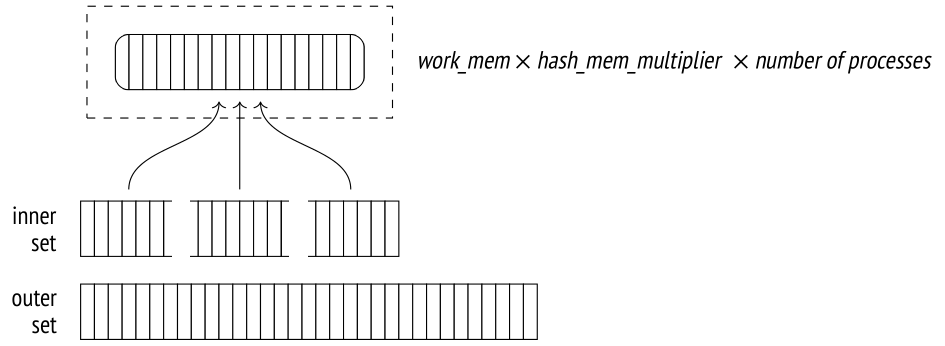

Để đi tiếp từ đây, mỗi tiến trình song song phải hoàn thành phần xử lý giai đoạn thứ nhất của mình.[^15]

Ở **giai đoạn thứ hai** (node `Parallel Hash Join`), các tiến trình lại được chạy song song để đối chiếu phần dòng của tập bên ngoài mà mỗi tiến trình đảm nhận với hash table, lúc này đã được xây dựng xong.[^16]

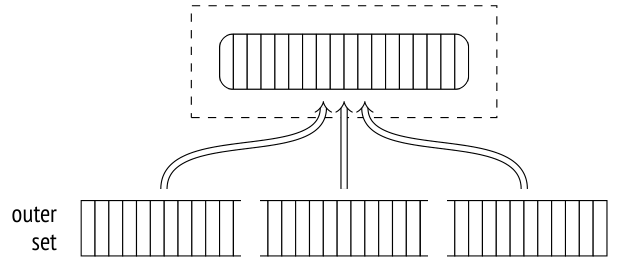

Dưới đây là một ví dụ về plan như vậy:

```
=> SET work_mem = '64MB';
=> EXPLAIN (analyze, costs off, timing off, summary off)
SELECT count(*)
FROM bookings b
  JOIN tickets t ON t.book_ref = b.book_ref;
```

```
                            QUERY PLAN
---------------------------------------------------------------------
 Finalize Aggregate (actual rows=1 loops=1)
   -> Gather (actual rows=3 loops=1)
       Workers Planned: 2
       Workers Launched: 2
       -> Partial Aggregate (actual rows=1 loops=3)
           -> Parallel Hash Join (actual rows=983286 loops=3)
               Hash Cond: (t.book_ref = b.book_ref)
               -> Parallel Index Only Scan using tickets_book_ref...
                   Heap Fetches: 0
               -> Parallel Hash (actual rows=703703 loops=3)
                   Buckets: 4194304 Batches: 1  Memory Usage:
                   115392kB
                   -> Parallel Seq Scan on bookings b (actual row...
(13 rows)
=> RESET work_mem;
```

Đây chính là truy vấn tôi đã trình bày ở mục trước, nhưng khi đó parallel hash join đã bị tắt bởi tham số *enable_parallel_hash* *(mặc định: on)*.

Mặc dù bộ nhớ khả dụng giảm đi một nửa so với hash join thông thường được minh họa trước đó, thao tác vẫn hoàn thành trong một lượt vì nó dùng bộ nhớ được cấp phát cho tất cả các tiến trình song song (`Memory Usage`). Hash table lớn hơn một chút, nhưng vì bây giờ chỉ có một hash table duy nhất, tổng mức sử dụng bộ nhớ đã giảm.

### Hash join hai lượt song song (Parallel Two-Pass Hash Joins) *(v. 11)*

Bộ nhớ gộp lại của tất cả các tiến trình song song vẫn có thể không đủ để chứa toàn bộ hash table. Điều này có thể trở nên rõ ràng ngay ở giai đoạn lập plan hoặc muộn hơn, trong khi thực thi truy vấn. Thuật toán hai lượt được áp dụng trong trường hợp này khá khác so với những gì chúng ta đã thấy cho tới giờ.

Điểm khác biệt then chốt của thuật toán này là nó tạo ra nhiều hash table nhỏ hơn thay vì một hash table lớn duy nhất. Mỗi tiến trình có bảng riêng của mình và xử lý các batch của riêng nó một cách độc lập. (Nhưng vì các hash table riêng rẽ vẫn nằm trong shared memory, bất kỳ tiến trình nào cũng có thể truy cập bất kỳ bảng nào trong số đó.) Nếu việc lập plan cho thấy sẽ cần nhiều hơn một batch,[^17] một hash table riêng được xây dựng cho mỗi tiến trình ngay từ đầu. Nếu quyết định được đưa ra ở giai đoạn thực thi, hash table sẽ được xây dựng lại.[^18]

Như vậy, ở **giai đoạn thứ nhất** các tiến trình quét song song tập bên trong, chia nó thành các batch và ghi chúng vào các file tạm.[^19] Vì mỗi tiến trình chỉ đọc phần tập bên trong của riêng nó, không tiến trình nào xây dựng được một hash table đầy đủ cho bất kỳ batch nào (kể cả batch đầu tiên). Tập đầy đủ các dòng của một batch bất kỳ chỉ được tích lũy trong file do tất cả các tiến trình song song cùng ghi một cách đồng bộ.[^20] Vì vậy, không giống các phiên bản không song song và song song một lượt của thuật toán, hash join hai lượt song song ghi tất cả các batch xuống đĩa, kể cả batch đầu tiên.

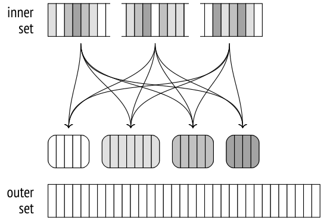

Khi tất cả các tiến trình đã hoàn thành việc băm tập bên trong, **giai đoạn thứ hai** bắt đầu.[^21]

Nếu dùng phiên bản không song song của thuật toán, các dòng của tập bên ngoài thuộc batch đầu tiên sẽ được đối chiếu ngay với hash table. Nhưng trong trường hợp phiên bản song song, bộ nhớ chưa chứa hash table, vì vậy các worker xử lý các batch một cách độc lập. Do đó, giai đoạn thứ hai bắt đầu bằng việc quét song song tập bên ngoài để phân phối các dòng của nó vào các batch, và mỗi batch được ghi vào một file tạm riêng.[^22] Các dòng được quét không được chèn vào hash table (như ở giai đoạn thứ nhất), vì vậy số lượng batch không bao giờ tăng.

Khi tất cả các tiến trình đã hoàn thành việc quét tập bên ngoài, chúng ta có 2*N* file tạm trên đĩa; chúng chứa các batch của tập bên trong và tập bên ngoài.

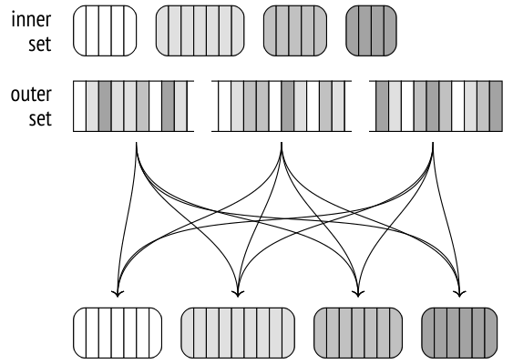

Sau đó mỗi tiến trình chọn một trong các batch và thực hiện join: nó nạp tập dòng bên trong vào một hash table trong bộ nhớ, quét các dòng của tập bên ngoài, và đối chiếu chúng với hash table. Khi join xong batch đó, tiến trình chọn batch tiếp theo chưa được xử lý.[^23]

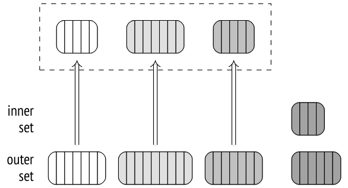

Nếu không còn batch nào chưa được xử lý, tiến trình đã hoàn thành batch của mình sẽ bắt đầu xử lý một trong các batch hiện đang được một tiến trình khác xử lý; việc xử lý đồng thời như vậy là khả thi vì tất cả các hash table đều nằm trong shared memory.

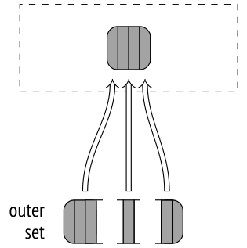

Cách tiếp cận này hiệu quả hơn so với việc dùng một hash table lớn duy nhất cho tất cả các tiến trình: việc thiết lập xử lý song song dễ dàng hơn, và việc đồng bộ hóa rẻ hơn.

### Các biến thể (Modifications)

Thuật toán hash join hỗ trợ mọi loại join: ngoài inner join, nó còn có thể xử lý left, right và full outer join, cũng như semi-join và anti-join. Nhưng như tôi đã đề cập, điều kiện join bị giới hạn ở toán tử so sánh bằng.

Chúng ta đã quan sát một số thao tác này khi tìm hiểu nested loop join *[→ tr. 362](21-nested-loop.md)*. Dưới đây là ví dụ về *right outer join*:

```
=> EXPLAIN (costs off)
SELECT *
FROM bookings b
  LEFT OUTER JOIN tickets t ON t.book_ref = b.book_ref;
               QUERY PLAN
----------------------------------------
 Hash Right Join
   Hash Cond: (t.book_ref = b.book_ref)
   -> Seq Scan on tickets t
   -> Hash
       -> Seq Scan on bookings b
(5 rows)
```

Lưu ý rằng left join ở mức logic được chỉ định trong truy vấn SQL đã được biến đổi thành thao tác vật lý right join trong execution plan.

Ở mức logic, `bookings` là bảng bên ngoài (tạo thành vế trái của thao tác join), còn bảng `tickets` là bảng bên trong. Do đó, các booking không có vé nào cũng phải được đưa vào kết quả join.

Ở mức vật lý, tập bên trong và tập bên ngoài được xác định dựa trên cost của phép join chứ không phải vị trí của chúng trong văn bản truy vấn. Điều này thường có nghĩa là tập có hash table nhỏ hơn sẽ được dùng làm tập bên trong. Đây chính xác là những gì đang xảy ra ở đây: bảng `bookings` được dùng làm tập bên trong, và left join được đổi thành right join.

Và ngược lại, nếu truy vấn chỉ định right outer join (để hiển thị các vé không liên quan tới booking nào), execution plan sẽ dùng left join:

```
=> EXPLAIN (costs off)
SELECT *
FROM bookings b
  RIGHT OUTER JOIN tickets t ON t.book_ref = b.book_ref;
               QUERY PLAN
----------------------------------------
 Hash Left Join
   Hash Cond: (t.book_ref = b.book_ref)
   -> Seq Scan on tickets t
   -> Hash
       -> Seq Scan on bookings b
(5 rows)
```

Để hoàn chỉnh bức tranh, tôi sẽ đưa ra một ví dụ về plan của truy vấn với full outer join:

```
=> EXPLAIN (costs off)
SELECT *
FROM bookings b
  FULL OUTER JOIN tickets t ON t.book_ref = b.book_ref;
```

```
               QUERY PLAN
----------------------------------------
 Hash Full Join
   Hash Cond: (t.book_ref = b.book_ref)
   -> Seq Scan on tickets t
   -> Hash
       -> Seq Scan on bookings b
(5 rows)
```

Parallel hash join hiện chưa được hỗ trợ cho right join và full join.[^24]

Lưu ý rằng ví dụ tiếp theo dùng bảng `bookings` làm tập bên ngoài, nhưng planner lẽ ra đã ưu tiên right join nếu nó được hỗ trợ:

```
=> EXPLAIN (costs off)
SELECT sum(b.total_amount)
FROM bookings b
  LEFT OUTER JOIN tickets t ON t.book_ref = b.book_ref;
                            QUERY PLAN
---------------------------------------------------------------------
 Finalize Aggregate
   -> Gather
       Workers Planned: 2
       -> Partial Aggregate
           -> Parallel Hash Left Join
               Hash Cond: (b.book_ref = t.book_ref)
               -> Parallel Seq Scan on bookings b
               -> Parallel Hash
                   -> Parallel Index Only Scan using tickets_book...
(9 rows)
```

## 22.2 Giá trị phân biệt và gom nhóm (Distinct Values and Grouping)

Các thuật toán gom nhóm giá trị để tính tổng hợp (aggregation) và loại bỏ trùng lặp rất giống với các thuật toán join. Một trong những cách tiếp cận mà chúng có thể dùng là xây dựng một hash table trên các cột cần thiết. Các giá trị chỉ được đưa vào hash table nếu nó chưa chứa giá trị như vậy. Kết quả là hash table tích lũy tất cả các giá trị phân biệt.

Node thực hiện hash aggregation được gọi là `HashAggregate`.[^25]

Hãy xem xét một số tình huống có thể cần tới node này.

Số ghế trong mỗi hạng vé (`GROUP BY`):

```
=> EXPLAIN (costs off) SELECT fare_conditions, count(*)
FROM seats
GROUP BY fare_conditions;
          QUERY PLAN
------------------------------
 HashAggregate
   Group Key: fare_conditions
   -> Seq Scan on seats
(3 rows)
```

Danh sách các hạng vé (`DISTINCT`):

```
=> EXPLAIN (costs off) SELECT DISTINCT fare_conditions
FROM seats;
          QUERY PLAN
------------------------------
 HashAggregate
   Group Key: fare_conditions
   -> Seq Scan on seats
(3 rows)
```

Các hạng vé kết hợp với một giá trị nữa (`UNION`):

```
=> EXPLAIN (costs off) SELECT fare_conditions
FROM seats
UNION
SELECT NULL;
             QUERY PLAN
------------------------------------
 HashAggregate
   Group Key: seats.fare_conditions
   -> Append
       -> Seq Scan on seats
       -> Result
(5 rows)
```

Node `Append` kết hợp cả hai tập nhưng không loại bỏ bất kỳ bản trùng lặp nào, trong khi chúng không được phép xuất hiện trong kết quả `UNION`. Chúng phải được loại bỏ riêng bởi node `HashAggregate`.

Vùng bộ nhớ được cấp phát cho hash table bị giới hạn bởi giá trị *work_mem* × *hash_mem_multiplier* *(mặc định: 4MB 1.0)*, giống như trong trường hợp hash join.

Nếu hash table vừa với bộ nhớ được cấp phát, việc tính tổng hợp dùng một batch duy nhất:

```
=> EXPLAIN (analyze, costs off, timing off, summary off)
SELECT DISTINCT amount FROM ticket_flights;
```

```
                         QUERY PLAN
---------------------------------------------------------------
 HashAggregate (actual rows=338 loops=1)
   Group Key: amount
   Batches: 1  Memory Usage: 61kB
   -> Seq Scan on ticket_flights (actual rows=8391852 loops=1)
(4 rows)
```

Không có nhiều giá trị phân biệt trong trường `amounts`, vì vậy hash table chỉ chiếm 61 kB (`Memory Usage`).

Ngay khi hash table lấp đầy bộ nhớ được cấp phát, tất cả các giá trị tiếp theo sẽ được đẩy ra các file tạm *(v. 13)* và được gom thành các partition (phân vùng) dựa trên một vài bit của giá trị băm của chúng. Số lượng partition là lũy thừa của hai và được chọn sao cho hash table của mỗi partition vừa với bộ nhớ được cấp phát. Độ chính xác của ước lượng dĩ nhiên phụ thuộc vào chất lượng của statistics thu thập được, vì vậy con số nhận được được nhân với 1.5 để giảm thêm kích thước partition và tăng khả năng xử lý mỗi partition trong một lượt.[^26]

Khi toàn bộ tập đã được quét, node trả về kết quả tổng hợp cho những giá trị đã lọt được vào hash table.

Sau đó hash table được làm rỗng, và mỗi partition đã lưu vào file tạm ở giai đoạn trước được quét và xử lý giống như bất kỳ tập dòng nào khác. Nếu hash table vẫn vượt quá bộ nhớ được cấp phát, các dòng bị tràn sẽ lại được phân vùng và ghi xuống đĩa để xử lý tiếp.

Để tránh I/O quá mức, thuật toán hash join hai lượt chuyển các MCV vào batch đầu tiên. Tuy nhiên, việc tính tổng hợp không cần tới tối ưu hóa này: những dòng vừa với bộ nhớ được cấp phát sẽ không bị chia vào các partition, và các MCV có khả năng xuất hiện đủ sớm để vào được RAM.

```
=> EXPLAIN (analyze, costs off, timing off, summary off)
SELECT DISTINCT flight_id FROM ticket_flights;
                         QUERY PLAN
---------------------------------------------------------------
 HashAggregate (actual rows=150588 loops=1)
   Group Key: flight_id
   Batches: 5  Memory Usage: 4145kB Disk Usage: 98184kB
   -> Seq Scan on ticket_flights (actual rows=8391852 loops=1)
(4 rows)
```

Trong ví dụ này, số lượng ID phân biệt tương đối lớn, vì vậy hash table không vừa với bộ nhớ được cấp phát. Cần năm batch để thực hiện truy vấn: một cho tập dữ liệu ban đầu và bốn cho các partition đã ghi xuống đĩa.

[^1]: backend/executor/nodeHashjoin.c
[^2]: backend/executor/nodeHash.c
[^3]: backend/utils/hash/dynahash.c
[^4]: backend/executor/nodeHash.c, hàm ExecChooseHashTableSize
[^5]: backend/optimizer/plan/createplan.c, hàm create_hashjoin_plan
[^6]: backend/optimizer/path/costsize.c, các hàm initial_cost_hashjoin & final_cost_hashjoin
[^7]: backend/utils/adt/selfuncs.c, hàm estimate_hash_bucket_stats
[^8]: backend/executor/nodeHash.c, hàm ExecHashGetBucketAndBatch
[^9]: backend/executor/nodeHash.c, hàm ExecChooseHashTableSize
[^10]: backend/executor/nodeHash.c, hàm ExecHashTableInsert
[^11]: backend/executor/nodeHash.c, hàm ExecHashBuildSkewHash
[^12]: backend/executor/nodeHash.c, hàm ExecHashIncreaseNumBatches
[^13]: backend/optimizer/path/costsize.c, hàm page_size
[^14]: backend/executor/nodeHash.c, hàm MultiExecParallelHash
[^15]: backend/storage/ipc/barrier.c
[^16]: backend/executor/nodeHashjoin.c, hàm ExecParallelHashJoin
[^17]: backend/executor/nodeHash.c, hàm ExecChooseHashTableSize
[^18]: backend/executor/nodeHash.c, hàm ExecParallelHashIncreaseNumBatches
[^19]: backend/executor/nodeHash.c, hàm MultiExecParallelHash
[^20]: backend/utils/sort/sharedtuplestore.c
[^21]: backend/executor/nodeHashjoin.c, hàm ExecParallelHashJoin
[^22]: backend/executor/nodeHashjoin.c, hàm ExecParallelHashJoinPartitionOuter
[^23]: backend/executor/nodeHashjoin.c, hàm ExecParallelHashJoinNewBatch
[^24]: commitfest.postgresql.org/33/2903
[^25]: backend/executor/nodeAgg.c
[^26]: backend/executor/nodeAgg.c, hàm hash_choose_num_partitions
