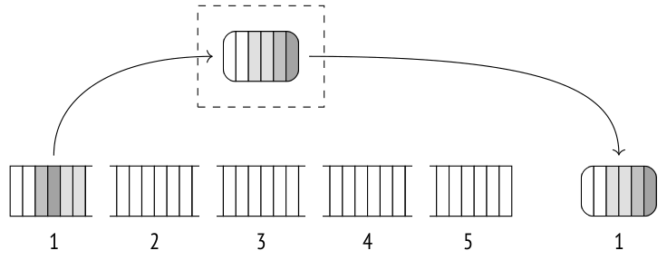
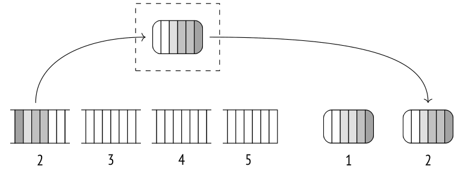
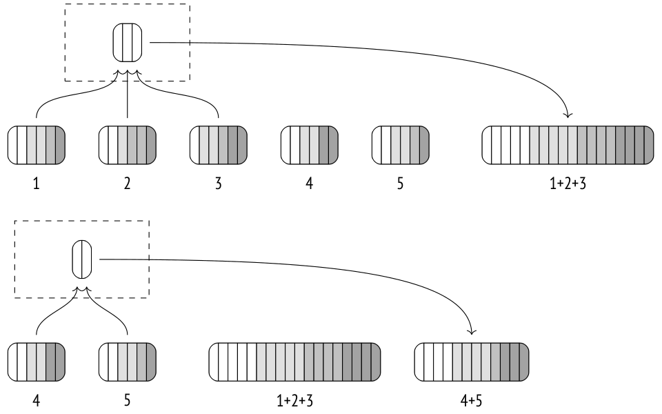
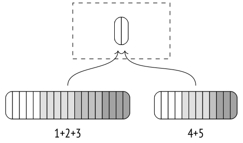
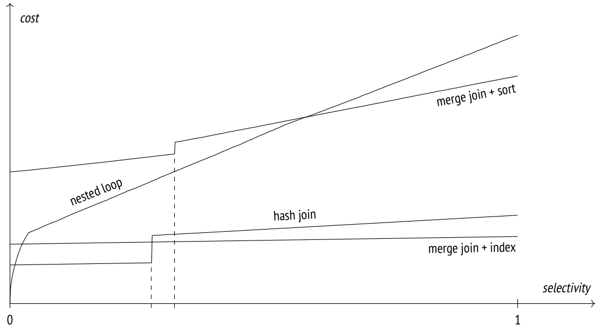

# Chương 23. Sorting and Merging (Sắp xếp và trộn)

## 23.1 Merge Joins

Merge join xử lý các tập dữ liệu đã được sắp xếp theo khoá join (join key) và trả về kết quả cũng được sắp xếp theo cách tương tự. Các tập đầu vào có thể đã được sắp xếp sẵn nhờ một index scan; nếu không, executor phải sắp xếp chúng trước khi việc trộn (merge) thực sự bắt đầu.[^1]

### Trộn các tập đã sắp xếp (Merging Sorted Sets)

Hãy xem một ví dụ về merge join; trong execution plan, nó được biểu diễn bằng node `Merge Join`:[^2]

```
=> EXPLAIN (costs off) SELECT *
FROM tickets t
  JOIN ticket_flights tf ON tf.ticket_no = t.ticket_no
ORDER BY t.ticket_no;
                          QUERY PLAN
----------------------------------------------------------------
 Merge Join
   Merge Cond: (t.ticket_no = tf.ticket_no)
   -> Index Scan using tickets_pkey on tickets t
   -> Index Scan using ticket_flights_pkey on ticket_flights tf
(4 rows)
```

Optimizer ưu tiên phương pháp join này vì nó trả về kết quả đã được sắp xếp, đúng như mệnh đề `ORDER BY` yêu cầu. Khi chọn plan, optimizer ghi nhận thứ tự sắp xếp của các tập dữ liệu và không thực hiện bất kỳ thao tác sắp xếp nào trừ khi thực sự cần. Ví dụ, nếu tập dữ liệu do một merge join tạo ra đã có thứ tự sắp xếp phù hợp, nó có thể được dùng nguyên trạng trong merge join tiếp theo:

```
=> EXPLAIN (costs off) SELECT *
FROM tickets t
  JOIN ticket_flights tf ON t.ticket_no = tf.ticket_no
  JOIN boarding_passes bp ON bp.ticket_no = tf.ticket_no
                        AND bp.flight_id = tf.flight_id
ORDER BY t.ticket_no;
                            QUERY PLAN
---------------------------------------------------------------------
 Merge Join
   Merge Cond: (tf.ticket_no = t.ticket_no)
   -> Merge Join
       Merge Cond: ((tf.ticket_no = bp.ticket_no) AND (tf.flight_...
       -> Index Scan using ticket_flights_pkey on ticket_flights tf
       -> Index Scan using boarding_passes_pkey on boarding_passe...
   -> Index Scan using tickets_pkey on tickets t
(7 rows)
```

Các bảng được join đầu tiên là `ticket_flights` và `boarding_passes`; cả hai đều có khoá chính phức hợp `(ticket_no, flight_id)`, và kết quả được sắp xếp theo hai cột này. Tập dòng thu được sau đó được join với bảng `tickets`, vốn được sắp xếp theo cột `ticket_no`.

Phép join chỉ cần một lượt duyệt qua cả hai tập dữ liệu và không tốn thêm bộ nhớ nào. Nó sử dụng hai con trỏ trỏ tới các dòng hiện tại (ban đầu là các dòng đầu tiên) của tập inner và tập outer.

Nếu khoá của các dòng hiện tại không khớp nhau, một trong hai con trỏ (con trỏ tham chiếu tới dòng có khoá nhỏ hơn) sẽ được dịch tới dòng kế tiếp cho đến khi tìm được dòng khớp. Các dòng đã join được trả về cho node phía trên, và con trỏ của tập inner được dịch lên một vị trí. Thao tác tiếp tục cho đến khi một trong hai tập được duyệt hết.

Thuật toán này xử lý được các giá trị trùng lặp trong tập inner, nhưng tập outer cũng có thể chứa giá trị trùng lặp. Để giải quyết vấn đề này, thuật toán phải được cải tiến: nếu khoá vẫn giữ nguyên sau khi con trỏ outer được dịch đi, con trỏ inner sẽ quay trở lại dòng khớp đầu tiên. Như vậy, mỗi dòng của tập outer sẽ được đối chiếu với tất cả các dòng của tập inner có cùng khoá.[^3]

Với outer join, thuật toán được tinh chỉnh thêm đôi chút, nhưng vẫn dựa trên cùng một nguyên tắc.

Điều kiện merge join chỉ có thể dùng toán tử bằng, nghĩa là chỉ equi-join được hỗ trợ (mặc dù việc hỗ trợ các loại điều kiện khác hiện cũng đang được triển khai).[^4]

**Ước lượng cost.** Hãy xem xét kỹ hơn ví dụ trước:

```
=> EXPLAIN SELECT *
FROM tickets t
  JOIN ticket_flights tf ON tf.ticket_no = t.ticket_no
ORDER BY t.ticket_no;
                          QUERY PLAN
----------------------------------------------------------------
 Merge Join  (cost=0.99..822355.54 rows=8391852 width=136)
   Merge Cond: (t.ticket_no = tf.ticket_no)
   -> Index Scan using tickets_pkey on tickets t
       (cost=0.43..139110.29 rows=2949857 width=104)
   -> Index Scan using ticket_flights_pkey on ticket_flights tf
       (cost=0.56..570972.46 rows=8391852 width=32)
(6 rows)
```

Startup cost của phép join ít nhất bao gồm startup cost của tất cả các node con.

Nói chung, có thể cần phải quét một phần của tập outer hoặc inner trước khi tìm thấy dòng khớp đầu tiên. Có thể ước lượng phần này bằng cách so sánh (dựa trên histogram) các khoá join nhỏ nhất trong hai tập.[^5] Nhưng trong trường hợp cụ thể này, phạm vi số vé là như nhau ở cả hai bảng. *[→ tr. 279](17-statistics.md)*

Total cost bao gồm cost lấy dữ liệu từ các node con và cost tính toán.

Vì thuật toán join dừng ngay khi một trong hai tập được duyệt hết (tất nhiên là trừ khi thực hiện outer join), tập còn lại có thể chỉ được quét một phần. Để ước lượng kích thước phần được quét, ta có thể so sánh giá trị khoá lớn nhất trong hai tập. Trong ví dụ này, cả hai tập sẽ được đọc toàn bộ, nên total cost của phép join bao gồm tổng total cost của cả hai node con.

Hơn nữa, nếu có bất kỳ giá trị trùng lặp nào, một số dòng của tập inner có thể bị quét nhiều lần. Số lần quét lặp lại ước tính bằng hiệu giữa cardinality của kết quả join và cardinality của tập inner.[^6] Trong truy vấn này, các cardinality này bằng nhau, nghĩa là các tập không chứa giá trị trùng lặp.

Thuật toán so sánh khoá join của hai tập. Cost của một phép so sánh được ước lượng bằng giá trị *cpu_operator_cost* *(mặc định: 0.0025)*, còn số phép so sánh ước tính có thể lấy bằng tổng số dòng của cả hai tập (cộng thêm số lần đọc lặp lại do giá trị trùng lặp gây ra). Cost xử lý mỗi dòng đưa vào kết quả được ước lượng bằng giá trị *cpu_tuple_cost*, như thường lệ. *(mặc định: 0.01)*

Như vậy, trong ví dụ này cost của phép join được ước lượng như sau:[^7]

```
=> SELECT 0.43 + 0.56 AS startup,
  round((
    139110.29 + 570972.46 +
    current_setting('cpu_tuple_cost')::real * 8391852 +
    current_setting('cpu_operator_cost')::real * (2949857 + 8391852)
  )::numeric, 2) AS total;
 startup |   total
---------+-----------
    0.99 | 822355.54
(1 row)
```

### Chế độ song song (Parallel Mode) *(v. 9.6)*

Mặc dù merge join không có phiên bản song song, nó vẫn có thể được dùng trong parallel plan.[^8]

Tập outer có thể được nhiều worker quét song song, nhưng tập inner luôn được mỗi worker quét toàn bộ.

Vì parallel hash join hầu như luôn rẻ hơn, tôi sẽ tạm thời tắt nó đi: *[→ tr. 378](22-hashing.md)*

```
=> SET enable_hashjoin = off;
```

Đây là một ví dụ về parallel plan sử dụng merge join:

```
=> EXPLAIN (costs off)
SELECT count(*), sum(tf.amount)
FROM tickets t
  JOIN ticket_flights tf ON tf.ticket_no = t.ticket_no;
                            QUERY PLAN
---------------------------------------------------------------------
 Finalize Aggregate
   -> Gather
       Workers Planned: 2
       -> Partial Aggregate
           -> Merge Join
               Merge Cond: (tf.ticket_no = t.ticket_no)
               -> Parallel Index Scan using ticket_flights_pkey o...
               -> Index Only Scan using tickets_pkey on tickets t
(8 rows)
```

Full outer merge join và right outer merge join không được phép trong parallel plan.

### Các biến thể (Modifications)

Thuật toán merge join có thể được dùng với mọi loại join. Hạn chế duy nhất là điều kiện join của full outer join và right outer join phải chứa các biểu thức tương thích với merge (“*outer-column equals inner-column*” hoặc “*column equals constant*”).[^9] Inner join và left outer join đơn giản là lọc kết quả join theo các điều kiện không liên quan, nhưng với full join và right join thì việc lọc như vậy không áp dụng được.

Đây là một ví dụ về full join sử dụng thuật toán merge:

```
=> EXPLAIN (costs off) SELECT *
FROM tickets t
  FULL JOIN ticket_flights tf ON tf.ticket_no = t.ticket_no
ORDER BY t.ticket_no;
                            QUERY PLAN
--------------------------------------------------------------------
 Sort
   Sort Key: t.ticket_no
   -> Merge Full Join
       Merge Cond: (t.ticket_no = tf.ticket_no)
       -> Index Scan using tickets_pkey on tickets t
       -> Index Scan using ticket_flights_pkey on ticket_flights tf
(6 rows)
```

Inner merge join và left merge join bảo toàn thứ tự sắp xếp. Tuy nhiên, full outer join và right outer join không thể đảm bảo điều đó, vì các giá trị NULL có thể chen vào giữa các giá trị đã sắp xếp của tập outer, làm phá vỡ thứ tự sắp xếp.[^10] Để khôi phục thứ tự cần thiết, planner đưa node `Sort` vào đây. Đương nhiên, điều này làm tăng cost của plan, khiến hash join trở nên hấp dẫn hơn, nên planner chọn plan này chỉ vì hash join hiện đang bị tắt.

Nhưng ví dụ tiếp theo không thể thiếu hash join: nested loop hoàn toàn không cho phép full join, còn merge thì không dùng được vì điều kiện join không được hỗ trợ. Vì vậy hash join được dùng bất kể giá trị của tham số *enable_hashjoin*:

```
=> EXPLAIN (costs off) SELECT *
FROM tickets t
  FULL JOIN ticket_flights tf ON tf.ticket_no = t.ticket_no
                            AND tf.amount > 0
ORDER BY t.ticket_no;
```

```
                  QUERY PLAN
-----------------------------------------------
 Sort
   Sort Key: t.ticket_no
   -> Hash Full Join
       Hash Cond: (tf.ticket_no = t.ticket_no)
       Join Filter: (tf.amount > '0'::numeric)
       -> Seq Scan on ticket_flights tf
       -> Hash
           -> Seq Scan on tickets t
(8 rows)
```

Hãy khôi phục khả năng sử dụng hash join mà ta đã tắt trước đó:

```
=> RESET enable_hashjoin;
```

## 23.2 Sắp xếp (Sorting)

Nếu một trong hai tập (hoặc có thể cả hai) chưa được sắp xếp theo khoá join, nó phải được sắp xếp lại trước khi phép join bắt đầu. Thao tác sắp xếp này được biểu diễn trong plan bằng node `Sort`:[^11]

```
=> EXPLAIN (costs off)
SELECT * FROM flights f
  JOIN airports_data dep ON f.departure_airport = dep.airport_code
ORDER BY dep.airport_code;
                       QUERY PLAN
--------------------------------------------------------
 Merge Join
   Merge Cond: (f.departure_airport = dep.airport_code)
   -> Sort
       Sort Key: f.departure_airport
       -> Seq Scan on flights f
   -> Sort
       Sort Key: dep.airport_code
       -> Seq Scan on airports_data dep
(8 rows)
```

Việc sắp xếp như vậy cũng có thể được áp dụng ngoài ngữ cảnh join nếu có mệnh đề `ORDER BY`, cả trong truy vấn thông thường lẫn bên trong window function:

```
=> EXPLAIN (costs off)
SELECT flight_id,
  row_number() OVER (PARTITION BY flight_no ORDER BY flight_id)
FROM flights f;
```

```
              QUERY PLAN
--------------------------------------
 WindowAgg
   -> Sort
       Sort Key: flight_no, flight_id
       -> Seq Scan on flights f
(4 rows)
```

Ở đây node `WindowAgg`[^12] tính window function trên tập dữ liệu đã được node `Sort` sắp xếp trước.

Planner có sẵn nhiều phương pháp sắp xếp. Ví dụ tôi đã đưa ra ở trên sử dụng hai trong số đó (`Sort Method`). Các chi tiết này có thể được hiển thị bằng lệnh `EXPLAIN ANALYZE`, như thường lệ:

```
=> EXPLAIN (analyze,costs off,timing off,summary off)
SELECT * FROM flights f
  JOIN airports_data dep ON f.departure_airport = dep.airport_code
ORDER BY dep.airport_code;
                           QUERY PLAN
------------------------------------------------------------------
 Merge Join (actual rows=214867 loops=1)
   Merge Cond: (f.departure_airport = dep.airport_code)
   -> Sort (actual rows=214867 loops=1)
       Sort Key: f.departure_airport
       Sort Method: external merge Disk: 17136kB
       -> Seq Scan on flights f (actual rows=214867 loops=1)
   -> Sort (actual rows=104 loops=1)
       Sort Key: dep.airport_code
       Sort Method: quicksort Memory: 52kB
       -> Seq Scan on airports_data dep (actual rows=104 loops=1)
(10 rows)
```

### Quicksort

Nếu tập dữ liệu cần sắp xếp vừa với vùng nhớ *work_mem*, phương pháp *quicksort* kinh điển sẽ được áp dụng. *(mặc định: 4MB)* Thuật toán này được mô tả trong mọi giáo trình, nên tôi sẽ không giải thích nó ở đây.

Về mặt cài đặt, việc sắp xếp được thực hiện bởi một thành phần chuyên dụng[^13] có nhiệm vụ chọn thuật toán phù hợp nhất tuỳ theo lượng bộ nhớ khả dụng và một số yếu tố khác.

**Ước lượng cost.** Hãy xem cách một bảng nhỏ được sắp xếp. Trong trường hợp này, việc sắp xếp được thực hiện trong bộ nhớ bằng thuật toán quicksort:

```
=> EXPLAIN SELECT *
FROM airports_data
ORDER BY airport_code;
                            QUERY PLAN
---------------------------------------------------------------------
 Sort  (cost=7.52..7.78 rows=104 width=145)
   Sort Key: airport_code
   -> Seq Scan on airports_data (cost=0.00..4.04 rows=104 width=...
(3 rows)
```

Như đã biết, độ phức tạp tính toán của việc sắp xếp *n* giá trị là *O*(*n* log<sub>2</sub> *n*). Một phép so sánh đơn lẻ được ước lượng bằng hai lần giá trị *cpu_operator_cost* *(mặc định: 0.0025)*. Vì *toàn bộ* tập dữ liệu phải được quét và sắp xếp trước khi có thể lấy được kết quả, startup cost của việc sắp xếp bao gồm total cost của node con và toàn bộ chi phí phát sinh từ các phép so sánh.

Total cost của việc sắp xếp còn bao gồm cost xử lý mỗi dòng được trả về, được ước lượng bằng *cpu_operator_cost* (chứ không phải bằng giá trị *cpu_tuple_cost* thông thường, vì chi phí phụ trội mà node `Sort` gây ra là không đáng kể).[^14]

Với ví dụ này, các cost được tính như sau:

```
=> WITH costs(startup) AS (
  SELECT 4.04 + round((
    current_setting('cpu_operator_cost')::real * 2 *
      104 * log(2, 104)
  )::numeric, 2)
)
SELECT startup,
  startup + round((
    current_setting('cpu_operator_cost')::real * 104
  )::numeric, 2) AS total
FROM costs;
 startup | total
---------+-------
    7.52 |  7.78
(1 row)
```

### Top-N Heapsort

Nếu tập dữ liệu chỉ cần được sắp xếp một phần (theo mệnh đề `LIMIT`), phương pháp *heapsort* có thể được áp dụng (trong plan nó được biểu diễn là `top-N heapsort`). Chính xác hơn, thuật toán này được dùng nếu việc sắp xếp làm giảm số dòng đi ít nhất một nửa, hoặc nếu bộ nhớ được cấp không thể chứa toàn bộ tập đầu vào (trong khi tập đầu ra thì vừa).

```
=> EXPLAIN (analyze, timing off, summary off)
SELECT * FROM seats
ORDER BY seat_no
LIMIT 100;
                           QUERY PLAN
-------------------------------------------------------------------
 Limit  (cost=72.57..72.82 rows=100 width=15)
   (actual rows=100 loops=1)
   -> Sort  (cost=72.57..75.91 rows=1339 width=15)
       (actual rows=100 loops=1)
       Sort Key: seat_no
       Sort Method: top-N heapsort Memory: 33kB
       -> Seq Scan on seats (cost=0.00..21.39 rows=1339 width=15)
           (actual rows=1339 loops=1)
(8 rows)
```

Để tìm *k* giá trị lớn nhất (hoặc nhỏ nhất) trong số *n* giá trị, executor đưa *k* dòng đầu tiên vào một cấu trúc dữ liệu gọi là heap. Sau đó các dòng còn lại lần lượt được thêm vào từng dòng một, và giá trị nhỏ nhất (hoặc lớn nhất) bị loại khỏi heap sau mỗi lần lặp. Khi tất cả các dòng đã được xử lý, heap chứa *k* giá trị cần tìm.

> Thuật ngữ heap ở đây chỉ một cấu trúc dữ liệu quen thuộc và không liên quan gì đến các bảng cơ sở dữ liệu, vốn cũng thường được gọi bằng cùng cái tên này.

**Ước lượng cost.** Độ phức tạp tính toán của thuật toán được ước lượng là *O*(*n* log<sub>2</sub> *k*), nhưng mỗi thao tác cụ thể lại tốn kém hơn so với thuật toán quicksort. Vì vậy, công thức sử dụng *n* log<sub>2</sub> 2*k*.[^15]

```
=> WITH costs(startup)
AS (
  SELECT 21.39 + round((
    current_setting('cpu_operator_cost')::real * 2 *
      1339 * log(2, 2 * 100)
  )::numeric, 2)
)
SELECT startup,
  startup + round((
    current_setting('cpu_operator_cost')::real * 100
  )::numeric, 2) AS total
FROM costs;
 startup | total
---------+-------
   72.57 | 72.82
(1 row)
```

### Sắp xếp ngoài (External Sorting)

Nếu quá trình quét cho thấy tập dữ liệu quá lớn để sắp xếp trong bộ nhớ, node sắp xếp chuyển sang *external merge sorting* (sắp xếp trộn ngoài; được ghi là `external merge` trong plan).

Các dòng đã được quét sẽ được sắp xếp trong bộ nhớ bằng thuật toán quicksort và ghi vào một file tạm.



Các dòng tiếp theo sau đó được đọc vào vùng nhớ vừa được giải phóng, và quy trình này được lặp lại cho đến khi toàn bộ dữ liệu được ghi vào nhiều file đã sắp xếp sẵn.



Tiếp theo, các file này được trộn thành một. Thao tác này được thực hiện bằng thuật toán gần giống với thuật toán dùng cho merge join; điểm khác biệt chính là nó có thể xử lý nhiều hơn hai file cùng lúc.

Một thao tác trộn không cần quá nhiều bộ nhớ. Thực tế, chỉ cần đủ chỗ cho một dòng mỗi file là đủ. Dòng đầu tiên được đọc từ mỗi file, dòng có giá trị nhỏ nhất (hoặc lớn nhất, tuỳ thứ tự sắp xếp) được trả về như một phần kết quả, và vùng nhớ được giải phóng sẽ được lấp bằng dòng kế tiếp lấy từ chính file đó.

Trong thực tế, các dòng được đọc theo lô 32 page thay vì từng dòng một, giúp giảm số thao tác I/O. Số file được trộn trong một lần lặp phụ thuộc vào bộ nhớ khả dụng, nhưng không bao giờ nhỏ hơn sáu. Giới hạn trên cũng bị chặn (ở mức 500) vì hiệu quả sẽ giảm khi có quá nhiều file.[^16]

> Các thuật toán sắp xếp có hệ thống thuật ngữ đã được xác lập từ lâu. External sorting ban đầu được thực hiện bằng băng từ, và PostgreSQL giữ một cái tên tương tự cho thành phần điều khiển các file tạm.[^17] Các tập dữ liệu được sắp xếp một phần được gọi là “runs.”[^18] Số runs tham gia vào việc trộn được gọi là “merge order.” Tôi không dùng các thuật ngữ này, nhưng chúng đáng để biết nếu bạn muốn hiểu mã nguồn và các comment của PostgreSQL.

Nếu các file tạm đã sắp xếp không thể được trộn cùng một lúc, chúng phải được xử lý qua nhiều lượt, với các kết quả trung gian được ghi vào các file tạm mới. Mỗi lần lặp làm tăng khối lượng dữ liệu cần đọc và ghi, vì vậy càng có nhiều RAM khả dụng thì external sorting càng hoàn tất nhanh.



Lần lặp tiếp theo trộn các file tạm vừa được tạo.



Lần trộn cuối cùng thường được hoãn lại và thực hiện ngay khi node phía trên kéo dữ liệu.

Hãy chạy lệnh `EXPLAIN ANALYZE` để xem external sorting đã dùng bao nhiêu dung lượng đĩa. Tuỳ chọn `BUFFERS` hiển thị thống kê sử dụng buffer cho các file tạm (`temp read` và `written`). Số buffer được ghi sẽ (xấp xỉ) bằng số buffer được đọc; khi quy đổi ra kilobyte, giá trị này được hiển thị là `Disk` trong plan:

```
=> EXPLAIN (analyze, buffers, costs off, timing off, summary off)
SELECT * FROM flights
ORDER BY scheduled_departure;
                       QUERY PLAN
---------------------------------------------------------
 Sort (actual rows=214867 loops=1)
   Sort Key: scheduled_departure
   Sort Method: external merge Disk: 17136kB
   Buffers: shared hit=2627, temp read=2142 written=2150
   -> Seq Scan on flights (actual rows=214867 loops=1)
       Buffers: shared hit=2624
(6 rows)
```

Để in thêm chi tiết về việc sử dụng file tạm vào log của server, bạn có thể bật tham số *log_temp_files*.

**Ước lượng cost.** Hãy lấy lại chính plan có external sorting đó làm ví dụ:

```
=> EXPLAIN SELECT *
FROM flights
ORDER BY scheduled_departure;
                            QUERY PLAN
---------------------------------------------------------------------
 Sort  (cost=31883.96..32421.12 rows=214867 width=63)
   Sort Key: scheduled_departure
   -> Seq Scan on flights (cost=0.00..4772.67 rows=214867 width=63)
(3 rows)
```

Ở đây cost thông thường của các phép so sánh (số lượng của chúng bằng với trường hợp quicksort trong bộ nhớ) được cộng thêm cost I/O.[^19] Toàn bộ dữ liệu đầu vào trước tiên phải được ghi vào các file tạm trên đĩa rồi sau đó được đọc từ đĩa trong quá trình trộn (có thể nhiều hơn một lần nếu không thể trộn tất cả các file đã tạo trong một lần lặp).

Giả định rằng ba phần tư số thao tác đĩa (cả đọc lẫn ghi) là tuần tự, còn một phần tư là ngẫu nhiên.

Khối lượng dữ liệu ghi xuống đĩa phụ thuộc vào số dòng cần sắp xếp và số cột được dùng trong truy vấn.[^20] Trong ví dụ này, truy vấn hiển thị tất cả các cột của bảng `flights`, nên kích thước dữ liệu tràn xuống đĩa gần bằng kích thước của cả bảng nếu không tính đến metadata của tuple và page (2309 page thay vì 2624).

Ở đây việc sắp xếp hoàn tất trong một lần lặp.

Do đó, cost sắp xếp trong plan này được ước lượng như sau:

```
=> WITH costs(startup) AS (
  SELECT 4772.67 + round((
    current_setting('cpu_operator_cost')::real * 2 *
      214867 * log(2, 214867) +
    (current_setting('seq_page_cost')::real * 0.75 +
     current_setting('random_page_cost')::real * 0.25) *
    2 * 2309 * 1 -- one iteration
  )::numeric, 2)
)
SELECT startup,
  startup + round((
    current_setting('cpu_operator_cost')::real * 214867
  )::numeric, 2) AS total
FROM costs;
 startup  |  total
----------+----------
 31883.96 | 32421.13
(1 row)
```

### Sắp xếp tăng dần (Incremental Sorting) *(v. 13)*

Nếu một tập dữ liệu cần được sắp xếp theo các khoá K<sub>1</sub> … K<sub>m</sub> … K<sub>n</sub>, và đã biết tập dữ liệu này được sắp xếp sẵn theo *m* khoá đầu tiên, bạn không cần phải sắp xếp lại từ đầu. Thay vào đó, bạn có thể chia tập này thành các nhóm có cùng các khoá đầu tiên K<sub>1</sub> … K<sub>m</sub> (các giá trị trong những nhóm này đã tuân theo thứ tự xác định), rồi sắp xếp riêng từng nhóm theo các khoá còn lại K<sub>m+1</sub> … K<sub>n</sub>. Phương pháp này được gọi là incremental sort (sắp xếp tăng dần).

Incremental sorting ít tốn bộ nhớ hơn các thuật toán sắp xếp khác, vì nó chia tập dữ liệu thành nhiều nhóm nhỏ hơn; ngoài ra, nó cho phép executor bắt đầu trả về kết quả sau khi nhóm đầu tiên được xử lý, mà không cần chờ toàn bộ tập được sắp xếp xong.

Trong PostgreSQL, cách cài đặt tinh tế hơn một chút:[^21] trong khi các nhóm dòng tương đối lớn được xử lý riêng rẽ, các nhóm nhỏ hơn được gộp lại với nhau và được sắp xếp toàn bộ. Điều này làm giảm chi phí phụ trội do việc gọi thủ tục sắp xếp gây ra.[^22]

Execution plan biểu diễn incremental sorting bằng node `Incremental Sort`:

```
=> EXPLAIN (analyze, costs off, timing off, summary off)
SELECT * FROM bookings
ORDER BY total_amount, book_date;
                            QUERY PLAN
--------------------------------------------------------------------
 Incremental Sort (actual rows=2111110 loops=1)
   Sort Key: total_amount, book_date
   Presorted Key: total_amount
   Full-sort Groups: 2823 Sort Method: quicksort  Average
   Memory: 30kB  Peak Memory: 30kB
   Pre-sorted Groups: 2624 Sort Method: quicksort  Average
   Memory: 3152kB  Peak Memory: 3259kB
   -> Index Scan using bookings_total_amount_idx on bookings (ac...
(8 rows)
```

Như plan cho thấy, tập dữ liệu được sắp xếp sẵn theo trường `total_amount`, vì nó là kết quả của một index scan chạy trên cột này (`Presorted Key`). Lệnh `EXPLAIN ANALYZE` cũng hiển thị thống kê lúc chạy. Dòng `Full-sort Groups` liên quan đến các nhóm nhỏ đã được gộp lại để sắp xếp toàn bộ, còn dòng `Presorted Groups` hiển thị dữ liệu về các nhóm lớn có dữ liệu đã được sắp xếp một phần, chỉ cần sắp xếp tăng dần theo cột `book_date`. Trong cả hai trường hợp, phương pháp quicksort trong bộ nhớ đã được áp dụng. Sự khác biệt về kích thước nhóm là do sự phân bố không đồng đều của giá trị đặt chỗ.

Incremental sorting cũng có thể được dùng để tính window function: *(v. 14)*

```
=> EXPLAIN (costs off)
SELECT row_number() OVER (ORDER BY total_amount, book_date)
FROM bookings;
                          QUERY PLAN
-----------------------------------------------------------------
 WindowAgg
   -> Incremental Sort
       Sort Key: total_amount, book_date
       Presorted Key: total_amount
       -> Index Scan using bookings_total_amount_idx on bookings
(5 rows)
```

**Ước lượng cost.** Việc tính cost cho incremental sorting[^23] dựa trên số nhóm dự kiến[^24] và cost sắp xếp ước tính của một nhóm có kích thước trung bình (mà ta đã xem xét).

Startup cost phản ánh cost ước tính để sắp xếp nhóm đầu tiên, cho phép node bắt đầu trả về các dòng đã sắp xếp; total cost bao gồm cost sắp xếp tất cả các nhóm.

Chúng ta sẽ không đi sâu hơn vào các phép tính này ở đây.

### Chế độ song song (Parallel Mode) *(v. 10)*

Việc sắp xếp cũng có thể được thực hiện đồng thời. Nhưng mặc dù các parallel worker có sắp xếp trước phần dữ liệu của mình, node `Gather` không biết gì về thứ tự sắp xếp của chúng và chỉ có thể gom chúng theo kiểu đến trước phục vụ trước. Để bảo toàn thứ tự sắp xếp, executor phải dùng node `Gather Merge`.[^25]

```
=> EXPLAIN (analyze, costs off, timing off, summary off)
SELECT *
FROM flights
ORDER BY scheduled_departure
LIMIT 10;
                            QUERY PLAN
---------------------------------------------------------------------
 Limit (actual rows=10 loops=1)
   -> Gather Merge (actual rows=10 loops=1)
       Workers Planned: 1
       Workers Launched: 1
       -> Sort (actual rows=7 loops=2)
           Sort Key: scheduled_departure
           Sort Method: top-N heapsort Memory: 27kB
           Worker 0:  Sort Method: top-N heapsort Memory: 27kB
           -> Parallel Seq Scan on flights (actual rows=107434 lo...
(9 rows)
```

Node `Gather Merge` sử dụng một binary heap[^26] để sắp xếp lại thứ tự các dòng lấy từ nhiều worker. Về bản chất, nó trộn nhiều tập dòng đã sắp xếp, giống như external sorting, nhưng được thiết kế cho một trường hợp sử dụng khác: `Gather Merge` thường xử lý một số ít nguồn dữ liệu cố định và lấy từng dòng một thay vì từng khối.

**Ước lượng cost.** Startup cost của node `Gather Merge` dựa trên startup cost của node con. Cũng như với node `Gather`, giá trị này được cộng thêm cost khởi chạy các tiến trình song song (ước lượng bằng *parallel_setup_cost*). *[→ tr. 303](18-table-access-methods.md)* *(mặc định: 1000)*

Giá trị nhận được sau đó được cộng thêm cost xây dựng binary heap, việc này đòi hỏi sắp xếp *n* giá trị, trong đó *n* là số parallel worker (tức là *n* log<sub>2</sub> *n*).

Một phép so sánh đơn lẻ được ước lượng bằng hai lần *cpu_operator_cost* *(mặc định: 0.0025)*, và tổng phần cost của các phép toán này thường không đáng kể vì *n* khá nhỏ.

Total cost bao gồm chi phí để nhiều tiến trình thực hiện phần song song của plan lấy toàn bộ dữ liệu, và cost truyền dữ liệu này về leader. Việc truyền một dòng được ước lượng bằng *parallel_tuple_cost* *(mặc định: 0.1)* cộng thêm 5%, để bù cho khả năng phải chờ khi lấy các giá trị tiếp theo.

Chi phí cập nhật binary heap cũng phải được tính đến trong total cost: mỗi dòng đầu vào đòi hỏi log<sub>2</sub> *n* phép so sánh và một số thao tác bổ sung nhất định (chúng được ước lượng bằng *cpu_operator_cost*).[^27]

Hãy xem thêm một plan khác sử dụng node `Gather Merge`. Lưu ý rằng ở đây các worker trước tiên thực hiện aggregation một phần bằng hashing, rồi node `Sort` sắp xếp các kết quả nhận được *[→ tr. 384](22-hashing.md)* (việc này rẻ vì chỉ còn ít dòng sau aggregation) để chuyển tiếp cho tiến trình leader, nơi thu gom toàn bộ kết quả trong node `Gather Merge`. Còn aggregation cuối cùng thì được thực hiện trên danh sách giá trị đã sắp xếp:

```
=> EXPLAIN SELECT amount, count(*)
FROM ticket_flights
GROUP BY amount;
                            QUERY PLAN
---------------------------------------------------------------------
 Finalize GroupAggregate (cost=123399.62..123485.00 rows=337 wid...
   Group Key: amount
   -> Gather Merge  (cost=123399.62..123478.26 rows=674 width=14)
       Workers Planned: 2
       -> Sort  (cost=122399.59..122400.44 rows=337 width=14)
           Sort Key: amount
           -> Partial HashAggregate (cost=122382.07..122385.44 r...
               Group Key: amount
               -> Parallel Seq Scan on ticket_flights (cost=0.00...
(9 rows)
```

Ở đây ta có ba tiến trình song song (bao gồm cả leader), và cost của node `Gather Merge` được tính như sau:

```
=> WITH costs(startup, run) AS (
  SELECT round((
    -- launching processes
    current_setting('parallel_setup_cost')::real +
    -- building the heap
    current_setting('cpu_operator_cost')::real * 2 * 3 * log(2, 3)
  )::numeric, 2),
```

```
  round((
    -- passing rows
    current_setting('parallel_tuple_cost')::real * 1.05 * 674 +
    -- updating the heap
    current_setting('cpu_operator_cost')::real * 2 * 674 * log(2, 3) +
    current_setting('cpu_operator_cost')::real * 674
  )::numeric, 2)
)
SELECT 122399.59 + startup AS startup,
  122400.44 + startup + run AS total
FROM costs;
  startup  |   total
-----------+-----------
 123399.61 | 123478.26
(1 row)
```

## 23.3 Giá trị phân biệt và gom nhóm (Distinct Values and Grouping)

Như ta vừa thấy, việc gom nhóm các giá trị để thực hiện aggregation (và để loại bỏ giá trị trùng lặp) có thể được thực hiện không chỉ bằng hashing mà còn bằng sắp xếp. Trong một danh sách đã sắp xếp, các nhóm giá trị trùng lặp có thể được tách ra chỉ trong một lượt duyệt.

Việc lấy các giá trị phân biệt từ một danh sách đã sắp xếp được biểu diễn trong plan bằng một node rất đơn giản tên là `Unique`[^28]:

```
=> EXPLAIN (costs off)
SELECT DISTINCT book_ref
FROM bookings
ORDER BY book_ref;
                       QUERY PLAN
----------------------------------------------------------
 Result
   -> Unique
       -> Index Only Scan using bookings_pkey on bookings
(3 rows)
```

Aggregation được thực hiện trong node `GroupAggregate`:[^29]

```
=> EXPLAIN (costs off) SELECT book_ref, count(*)
FROM bookings
GROUP BY book_ref
ORDER BY book_ref;
```

```
                      QUERY PLAN
------------------------------------------------------
 GroupAggregate
   Group Key: book_ref
   -> Index Only Scan using bookings_pkey on bookings
(3 rows)
```

Trong parallel plan, node này được gọi là `Partial GroupAggregate`, còn node hoàn tất aggregation được gọi là `Finalize GroupAggregate`.

Cả hai chiến lược hashing và sắp xếp có thể được kết hợp trong một node duy nhất nếu việc gom nhóm được thực hiện theo nhiều tập cột (được chỉ định trong các mệnh đề `GROUPING SETS`, `CUBE` hoặc `ROLLUP`). *(v. 10)* Không đi vào các chi tiết khá phức tạp của thuật toán này, tôi chỉ đơn giản đưa ra một ví dụ thực hiện gom nhóm theo ba cột khác nhau trong điều kiện bộ nhớ hạn hẹp:

```
=> SET work_mem = '64kB';
=> EXPLAIN (costs off) SELECT count(*)
FROM flights
GROUP BY GROUPING SETS (aircraft_code, flight_no, departure_airport);
          QUERY PLAN
-------------------------------
 MixedAggregate
   Hash Key: departure_airport
   Group Key: aircraft_code
   Sort Key: flight_no
     Group Key: flight_no
   -> Sort
       Sort Key: aircraft_code
       -> Seq Scan on flights
(8 rows)
=> RESET work_mem;
```

Đây là những gì xảy ra khi truy vấn này được thực thi. Node aggregation, được hiển thị trong plan là `MixedAggregate`, nhận tập dữ liệu đã được sắp xếp theo cột `aircraft_code`.

Đầu tiên, tập này được quét, và các giá trị được gom nhóm theo cột `aircraft_code` (`Group Key`). Trong quá trình quét, các dòng được sắp xếp lại theo cột `flight_no` (giống như cách node `Sort` thông thường làm: hoặc bằng phương pháp quicksort nếu đủ bộ nhớ, hoặc bằng external sorting trên đĩa); đồng thời, executor đặt các dòng này vào một hash table dùng `departure_airport` làm khoá (giống như cách hash aggregation làm: hoặc trong bộ nhớ, hoặc dùng các file tạm).

Ở giai đoạn thứ hai, executor quét tập dữ liệu vừa được sắp xếp theo cột `flight_no` và gom nhóm các giá trị theo chính cột này (`Sort Key` và node `Group Key` lồng bên trong). Nếu các dòng còn phải được gom nhóm theo thêm một cột nữa, chúng sẽ lại được sắp xếp lại theo yêu cầu.

Cuối cùng, hash table được chuẩn bị ở giai đoạn đầu được quét, và các giá trị được gom nhóm theo cột `departure_airport` (`Hash Key`).

## 23.4 So sánh các phương pháp join (Comparison of Join Methods)

Như ta đã thấy, hai tập dữ liệu có thể được join bằng ba phương pháp khác nhau, và mỗi phương pháp có ưu và nhược điểm riêng.

*Nested loop join* không có bất kỳ điều kiện tiên quyết nào và có thể bắt đầu trả về các dòng đầu tiên của tập kết quả ngay lập tức. Đây là phương pháp join duy nhất không phải quét toàn bộ tập inner (miễn là có thể truy cập nó qua index). Những đặc tính này khiến thuật toán nested loop (kết hợp với index) trở thành lựa chọn lý tưởng cho các truy vấn OLTP ngắn, vốn làm việc với các tập dòng khá nhỏ.

Điểm yếu của nested loop lộ rõ khi khối lượng dữ liệu tăng lên. Với tích Descartes, thuật toán này có độ phức tạp bậc hai — cost tỷ lệ với tích kích thước của các tập dữ liệu được join. Tuy nhiên, tích Descartes không quá phổ biến trong thực tế; với mỗi dòng của tập outer, executor thường truy cập một số dòng nhất định của tập inner bằng index, và con số trung bình này không phụ thuộc vào tổng kích thước của tập dữ liệu (ví dụ, số vé trung bình trong một lần đặt chỗ không thay đổi khi số lần đặt chỗ và số vé đã mua tăng lên). Như vậy, độ phức tạp của thuật toán nested loop thường tăng tuyến tính chứ không phải bậc hai, dù có thể với hệ số tuyến tính cao.

Một điểm khác biệt quan trọng của thuật toán nested loop là khả năng áp dụng phổ quát: nó hỗ trợ mọi điều kiện join, trong khi các phương pháp khác chỉ xử lý được equi-join. Điều này cho phép chạy các truy vấn với mọi loại điều kiện (ngoại trừ full join, vốn không thể dùng với nested loop), nhưng bạn cần nhớ rằng một non-equi-join trên tập dữ liệu lớn rất có khả năng sẽ chạy chậm hơn mong muốn.

*Hash join* hoạt động tốt nhất trên các tập dữ liệu lớn. Nếu đủ RAM, nó chỉ cần một lượt duyệt qua hai tập dữ liệu, nên độ phức tạp của nó là tuyến tính. Kết hợp với sequential scan trên bảng, thuật toán này thường được dùng cho các truy vấn OLAP, vốn tính toán kết quả dựa trên khối lượng dữ liệu lớn.

Tuy nhiên, nếu thời gian phản hồi quan trọng hơn thông lượng, hash join không phải là lựa chọn tốt nhất: nó sẽ không bắt đầu trả về các dòng kết quả cho đến khi toàn bộ hash table được xây dựng xong.

Thuật toán hash join chỉ áp dụng được cho equi-join. Một hạn chế khác là kiểu dữ liệu của khoá join phải hỗ trợ hashing (nhưng hầu như tất cả các kiểu đều hỗ trợ).

Nested loop join đôi khi có thể đánh bại hash join nhờ tận dụng việc cache các dòng của tập inner trong node `Memoize` (vốn cũng dựa trên hash table). *(v. 14)* Trong khi hash join luôn quét toàn bộ tập inner, thuật toán nested loop thì không cần như vậy, điều này có thể giúp giảm cost phần nào.

*Merge join* có thể xử lý tốt cả các truy vấn OLTP ngắn lẫn các truy vấn OLAP dài. Nó có độ phức tạp tuyến tính (các tập cần join chỉ phải được quét một lần), không đòi hỏi nhiều bộ nhớ, và trả về kết quả mà không cần bất kỳ tiền xử lý nào; tuy nhiên, các tập dữ liệu phải có sẵn thứ tự sắp xếp cần thiết. Cách hiệu quả nhất về cost để đạt được điều đó là lấy dữ liệu qua index scan. Đây là lựa chọn tự nhiên nếu số dòng ít; với các tập dữ liệu lớn hơn, index scan vẫn có thể hiệu quả, nhưng chỉ khi việc truy cập heap là tối thiểu hoặc hoàn toàn không xảy ra.

Nếu không có index phù hợp, các tập phải được sắp xếp, nhưng thao tác này tốn nhiều bộ nhớ và độ phức tạp của nó cao hơn tuyến tính: *O*(*n* log<sub>2</sub> *n*). Trong trường hợp này, hash join hầu như luôn rẻ hơn merge join — trừ khi kết quả cần được sắp xếp.

Một lợi thế bổ sung của merge join là sự tương đương giữa tập inner và tập outer. Hiệu quả của cả nested loop join lẫn hash join phụ thuộc rất nhiều vào việc planner có thể chỉ định đúng tập inner và tập outer hay không.

Merge join bị giới hạn ở equi-join. Ngoài ra, kiểu dữ liệu phải có một operator class B-tree.

Đồ thị sau minh hoạ sự phụ thuộc gần đúng giữa cost của các phương pháp join khác nhau và tỷ lệ dòng cần join.

Nếu selectivity cao, nested loop join dùng truy cập qua index cho cả hai bảng; sau đó planner chuyển sang quét toàn bộ bảng outer, điều này được phản ánh ở phần tuyến tính của đồ thị.

Ở đây hash join sử dụng full scan cho cả hai bảng. “Bậc thang” trên đồ thị tương ứng với thời điểm hash table lấp đầy toàn bộ bộ nhớ và các batch bắt đầu bị tràn xuống đĩa.

Nếu dùng index scan, cost của merge join tăng tuyến tính nhẹ. Nếu kích thước *work_mem* đủ lớn, hash join thường hiệu quả hơn, nhưng merge join lại vượt trội khi phải dùng đến file tạm.



Đồ thị phía trên của sort-merge join cho thấy cost tăng lên khi không có index và dữ liệu phải được sắp xếp. Cũng như trường hợp hash join, “bậc thang” trên đồ thị là do thiếu bộ nhớ, dẫn đến việc phải dùng file tạm để sắp xếp.

Đây chỉ là một ví dụ; tỷ lệ giữa các cost sẽ khác nhau trong từng trường hợp cụ thể.

[^1]: backend/optimizer/path/joinpath.c, hàm generate_mergejoin_paths
[^2]: backend/executor/nodeMergejoin.c
[^3]: backend/executor/nodeMergejoin.c, hàm ExecMergeJoin
[^4]: Ví dụ, xem commitfest.postgresql.org/33/3160
[^5]: backend/utils/adt/selfuncs.c, hàm mergejoinscansel
[^6]: backend/optimizer/path/costsize.c, hàm final_cost_mergejoin
[^7]: backend/optimizer/path/costsize.c, các hàm initial_cost_mergejoin & final_cost_mergejoin
[^8]: backend/optimizer/path/joinpath.c, hàm consider_parallel_mergejoin
[^9]: backend/optimizer/path/joinpath.c, hàm select_mergejoin_clauses
[^10]: backend/optimizer/path/pathkeys.c, hàm build_join_pathkeys
[^11]: backend/executor/nodeSort.c
[^12]: backend/executor/nodeWindowAgg.c
[^13]: backend/utils/sort/tuplesort.c
[^14]: backend/optimizer/path/costsize.c, hàm cost_sort
[^15]: backend/optimizer/path/costsize.c, hàm cost_sort
[^16]: backend/utils/sort/tuplesort.c, hàm tuplesort_merge_order
[^17]: backend/utils/sort/logtape.c
[^18]: Donald E. Knuth. The Art of Computer Programming. Volume III. Sorting and Searching
[^19]: backend/optimizer/path/costsize.c, hàm cost_sort
[^20]: backend/optimizer/path/costsize.c, hàm relation_byte_size
[^21]: backend/executor/nodeIncrementalSort.c
[^22]: backend/utils/sort/tuplesort.c
[^23]: backend/optimizer/path/costsize.c, hàm cost_incremental_sort
[^24]: backend/utils/adt/selfuncs.c, hàm estimate_num_groups
[^25]: backend/executor/nodeGatherMerge.c
[^26]: backend/lib/binaryheap.c
[^27]: backend/optimizer/path/costsize.c, hàm cost_gather_merge
[^28]: backend/executor/nodeUnique.c
[^29]: backend/executor/nodeAgg.c, hàm agg_retrieve_direct
