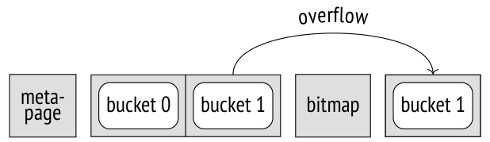
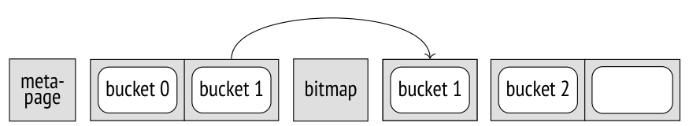
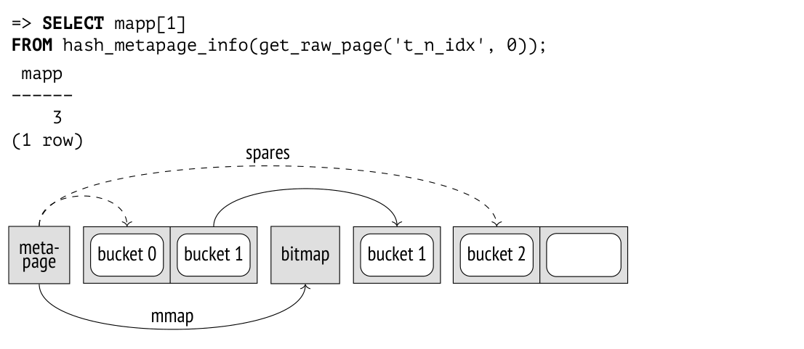

# Chương 24. Hash

## 24.1 Tổng quan (Overview)

Một hash index[^1] cho phép nhanh chóng tìm được tuple ID (TID) theo một khoá index cụ thể. Nói một cách đơn giản, nó chỉ là một bảng băm (hash table) được lưu trên đĩa. Thao tác duy nhất mà hash index hỗ trợ là tìm kiếm theo điều kiện bằng.

Khi một giá trị được chèn vào index,[^2] hàm băm (hash function) của khoá index sẽ được tính. Trong PostgreSQL, các hàm băm trả về số nguyên 32 bit hoặc 64 bit; một vài bit thấp nhất của các giá trị này được dùng làm số hiệu của bucket (thùng băm) tương ứng. TID và mã băm (hash code) của khoá được thêm vào bucket đã chọn. Bản thân khoá không được lưu trong index vì làm việc với các giá trị nhỏ, có độ dài cố định thì thuận tiện hơn.

Bảng băm của index được mở rộng một cách động.[^3] Số bucket tối thiểu là hai. Khi số tuple được đánh index tăng lên, một trong các bucket sẽ bị tách (split) thành hai. Thao tác này sử dụng thêm một bit của mã băm, vì vậy các phần tử chỉ được phân phối lại giữa hai bucket sinh ra từ việc tách; thành phần của các bucket khác trong bảng băm vẫn giữ nguyên.[^4]

Thao tác tìm kiếm trên index[^5] tính hàm băm của khoá index và số hiệu bucket tương ứng. Trong toàn bộ nội dung của bucket, việc tìm kiếm sẽ chỉ trả về những TID tương ứng với mã băm của khoá. Vì các phần tử của bucket được sắp xếp theo mã băm của khoá, tìm kiếm nhị phân có thể trả về các TID khớp khá hiệu quả.

Vì khoá không được lưu trong bảng băm, access method của index có thể trả về các TID thừa do xung đột băm (hash collision). Do đó, cơ chế đánh index phải kiểm tra lại (recheck) tất cả các kết quả mà access method lấy về. *[→ tr. 328](19-index-access-methods.md)* Index-only scan không được hỗ trợ cũng vì lý do này.

## 24.2 Bố cục trang (Page Layout)

Khác với một bảng băm thông thường, hash index được lưu trên đĩa. Vì vậy, toàn bộ dữ liệu phải được sắp xếp vào các page, tốt nhất là theo cách sao cho các thao tác trên index (tìm kiếm, chèn, xoá) cần truy cập càng ít page càng tốt.

Hash index sử dụng bốn loại page:

- metapage—page số không, cung cấp "mục lục" của index

- bucket page—các page chính của index, mỗi bucket một page

- overflow page—các page bổ sung được dùng khi page chính của bucket không thể chứa hết các phần tử

- bitmap page—các page chứa mảng bit dùng để theo dõi các overflow page đã được giải phóng và có thể tái sử dụng

Chúng ta có thể xem bên trong các page của index bằng extension `pageinspect`. *(v. 10)*

Hãy bắt đầu với một bảng rỗng:

```
=> CREATE EXTENSION pageinspect;
=> CREATE TABLE t(n integer);
=> ANALYZE t;
=> CREATE INDEX ON t USING hash(n);
```

Tôi đã phân tích (analyze) bảng, nên index được tạo sẽ có kích thước nhỏ nhất có thể; nếu không, *(v. 14)* số bucket sẽ được chọn dựa trên giả định rằng bảng chứa mười page.[^6]

Index chứa bốn page: metapage, hai bucket page và một bitmap page (được tạo ngay để dùng về sau):

```
=> SELECT page, hash_page_type(get_raw_page('t_n_idx', page))
FROM generate_series(0,3) page;
 page | hash_page_type
------+----------------
    0 | metapage
    1 | bucket
    2 | bucket
    3 | bitmap
(4 rows)
```


Metapage chứa toàn bộ thông tin điều khiển về index. Hiện tại chúng ta chỉ quan tâm đến một vài giá trị:

```
=> SELECT ntuples, ffactor, maxbucket
FROM hash_metapage_info(get_raw_page('t_n_idx', 0));
 ntuples | ffactor | maxbucket
---------+---------+-----------
       0 |     307 |        1
(1 row)
```

Số dòng ước tính trên mỗi bucket được hiển thị trong trường `ffactor`. Giá trị này được tính dựa trên kích thước block và giá trị của tham số lưu trữ *fillfactor*. *(mặc định: 75)* Với phân phối dữ liệu hoàn toàn đồng đều và không có xung đột băm, bạn có thể dùng giá trị *fillfactor* cao hơn, nhưng trong các cơ sở dữ liệu thực tế điều đó làm tăng nguy cơ tràn page.

Kịch bản tồi tệ nhất đối với hash index là phân phối dữ liệu bị lệch (skew) lớn, khi một khoá lặp lại nhiều lần. Vì hàm băm sẽ trả về cùng một giá trị, toàn bộ dữ liệu sẽ được đặt vào cùng một bucket, và việc tăng số bucket sẽ không giúp ích gì.

Hiện giờ index đang rỗng, như trường `ntuples` cho thấy. Hãy gây tràn một bucket page bằng cách chèn nhiều dòng có cùng giá trị khoá index. Một overflow page xuất hiện trong index: *(v. 10)*

```
=> INSERT INTO t(n)
  SELECT 0 FROM generate_series(1,500); -- the same value
=> SELECT page, hash_page_type(get_raw_page('t_n_idx', page))
FROM generate_series(0,4) page;
 page | hash_page_type
------+----------------
    0 | metapage
    1 | bucket
    2 | bucket
    3 | bitmap
    4 | overflow
(5 rows)
```



Thống kê tổng hợp trên tất cả các page cho thấy bucket 0 rỗng, trong khi mọi giá trị đều đã được đặt vào bucket 1: một số nằm trong page chính, còn những giá trị không vừa có thể tìm thấy trong overflow page.

```
=> SELECT page, live_items, free_size, hasho_bucket
FROM (VALUES (1), (2), (4)) p(page),
  hash_page_stats(get_raw_page('t_n_idx', page));
 page | live_items | free_size | hasho_bucket
------+------------+-----------+--------------
    1 |          0 |     8148 |            0
    2 |        407 |        8 |            1
    4 |         93 |     6288 |            1
(3 rows)
```

Rõ ràng là nếu các phần tử của bucket nằm rải rác trên nhiều page, hiệu năng sẽ bị ảnh hưởng. Hash index cho kết quả tốt nhất khi dữ liệu phân phối đồng đều.

Bây giờ hãy xem một bucket được tách như thế nào. Việc này xảy ra khi số dòng trong index vượt quá giá trị `ffactor` ước tính cho các bucket hiện có. Ở đây chúng ta có hai bucket và `ffactor` là 307, nên việc tách sẽ xảy ra khi dòng thứ 615 được chèn vào index:

```
=> SELECT ntuples, ffactor, maxbucket, ovflpoint
FROM hash_metapage_info(get_raw_page('t_n_idx', 0));
 ntuples | ffactor | maxbucket | ovflpoint
---------+---------+-----------+-----------
     500 |     307 |        1 |         1
(1 row)
=> INSERT INTO t(n)
  SELECT n FROM generate_series(1,115) n; -- now values are different
=> SELECT ntuples, ffactor, maxbucket, ovflpoint
FROM hash_metapage_info(get_raw_page('t_n_idx', 0));
 ntuples | ffactor | maxbucket | ovflpoint
---------+---------+-----------+-----------
     615 |     307 |        2 |         2
(1 row)
```

Giá trị `maxbucket` đã tăng lên hai: giờ chúng ta có ba bucket, đánh số từ 0 đến 2. Nhưng dù chúng ta chỉ thêm một bucket, số page đã tăng gấp đôi:



```
=> SELECT page, hash_page_type(get_raw_page('t_n_idx', page))
FROM generate_series(0,6) page;
 page | hash_page_type
------+----------------
    0 | metapage
    1 | bucket
    2 | bucket
    3 | bitmap
    4 | overflow
    5 | bucket
    6 | unused
(7 rows)
```

Một trong các page mới được bucket 2 sử dụng, còn page kia vẫn trống và sẽ được bucket 3 sử dụng ngay khi bucket này xuất hiện.

```
=> SELECT page, live_items, free_size, hasho_bucket
FROM (
    VALUES (1), (2), (4), (5)
  ) p(page),
  hash_page_stats(get_raw_page('t_n_idx', page));
 page | live_items | free_size | hasho_bucket
------+------------+-----------+--------------
    1 |         27 |     7608 |            0
    2 |        407 |        8 |            1
    4 |        158 |     4988 |            1
    5 |         23 |     7688 |            2
(4 rows)
```

Như vậy, xét từ góc độ hệ điều hành, hash index tăng trưởng theo từng đợt nhảy vọt, mặc dù về mặt logic, bảng băm cho thấy sự tăng trưởng dần dần.

Để san bằng phần nào sự tăng trưởng này và tránh cấp phát quá nhiều page cùng lúc, bắt đầu từ lần tăng thứ mười, các page được cấp phát thành bốn đợt bằng nhau thay vì tất cả cùng một lúc. *(v. 10)*

Hai trường nữa của metapage, thực chất là các bit mask, cung cấp chi tiết về địa chỉ của bucket:

```
=> SELECT maxbucket, highmask::bit(4), lowmask::bit(4)
FROM hash_metapage_info(get_raw_page('t_n_idx', 0));
 maxbucket | highmask | lowmask
-----------+----------+---------
         2 | 0011     | 0001
(1 row)
```

Số hiệu bucket được xác định bởi các bit của mã băm tương ứng với `highmask`. Nhưng nếu số hiệu bucket nhận được không tồn tại (vượt quá `maxbucket`), các bit của `lowmask` sẽ được lấy.[^7] Trong trường hợp cụ thể này, chúng ta lấy hai bit thấp nhất, cho ra các giá trị từ 0 đến 3; nhưng nếu nhận được 3, chúng ta sẽ chỉ lấy một bit thấp nhất, tức là dùng bucket 1 thay cho bucket 3.

Mỗi lần kích thước tăng gấp đôi, các bucket page mới được cấp phát thành một khối liên tục duy nhất, còn các overflow page và bitmap page được chèn vào giữa các mảnh này khi cần. Metapage lưu số page được chèn vào mỗi khối trong mảng `spares`, nhờ đó có thể tính số hiệu page chính của bucket dựa trên số hiệu bucket bằng phép tính số học đơn giản.[^8]

Trong trường hợp cụ thể này, sau lần tăng đầu tiên có hai page được chèn vào (một bitmap page và một overflow page), nhưng sau lần tăng thứ hai thì chưa có thêm page nào:

```
=> SELECT spares[2], spares[3]
FROM hash_metapage_info(get_raw_page('t_n_idx', 0));
 spares | spares
--------+--------
      2 |      2
(1 row)
```

Metapage cũng lưu một mảng các con trỏ tới bitmap page:

```
=> SELECT mapp[1]
FROM hash_metapage_info(get_raw_page('t_n_idx', 0));
 mapp
------
    3
(1 row)
```



Không gian bên trong các page của index được giải phóng khi các con trỏ tới dead tuple (tuple chết) bị loại bỏ. Việc này diễn ra trong quá trình page pruning (được kích hoạt khi có nỗ lực chèn một phần tử vào một page đã đầy hoàn toàn)[^9] hoặc khi vacuum định kỳ được thực hiện.

Tuy nhiên, hash index không thể co lại: một khi đã được cấp phát, các page của index sẽ không được trả lại cho hệ điều hành. Các page chính được gán vĩnh viễn cho bucket của chúng, kể cả khi chúng không chứa phần tử nào; các overflow page đã được dọn sạch được theo dõi trong bitmap và có thể được tái sử dụng (có thể bởi một bucket khác). Cách duy nhất để giảm kích thước vật lý của index là xây dựng lại nó bằng lệnh `REINDEX` hoặc `VACUUM FULL`. *[→ tr. 135](08-rebuilding-tables-and-indexes.md)*

Plan truy vấn không cho biết loại index:

```
=> CREATE INDEX ON flights USING hash(flight_no);
=> EXPLAIN (costs off)
SELECT *
FROM flights
WHERE flight_no = 'PG0001';
                    QUERY PLAN
--------------------------------------------------
 Bitmap Heap Scan on flights
   Recheck Cond: (flight_no = 'PG0001'::bpchar)
   -> Bitmap Index Scan on flights_flight_no_idx
       Index Cond: (flight_no = 'PG0001'::bpchar)
(4 rows)
```

## 24.3 Operator Class

Trước PostgreSQL 10, hash index không được ghi log, tức là chúng không được bảo vệ trước sự cố cũng như không được sao chép (replicate), và do đó không được khuyến khích sử dụng. Nhưng ngay cả khi đó chúng vẫn có giá trị riêng. Vấn đề là thuật toán băm được sử dụng rộng rãi (đặc biệt là để thực hiện hash join và gom nhóm), và hệ thống phải biết hàm băm nào có thể dùng cho một kiểu dữ liệu nhất định. *[→ tr. 367](22-hashing.md)* Tuy nhiên, sự tương ứng này không cố định: nó không thể được định nghĩa một lần cho mãi mãi vì PostgreSQL cho phép thêm kiểu dữ liệu mới một cách linh hoạt. Do đó, nó được duy trì bởi operator class của hash index và một kiểu dữ liệu cụ thể. *[→ tr. 315](19-index-access-methods.md)* Bản thân hàm băm được biểu diễn bởi support function (hàm hỗ trợ) của class:

```
=> SELECT opfname AS opfamily_name,
  amproc::regproc AS opfamily_procedure
FROM pg_am am
  JOIN pg_opfamily opf ON opfmethod = am.oid
  JOIN pg_amproc amproc ON amprocfamily = opf.oid
WHERE amname = 'hash'
AND amprocnum = 1
ORDER BY opfamily_name, opfamily_procedure;
```

```
   opfamily_name    | opfamily_procedure
--------------------+--------------------
 aclitem_ops        | hash_aclitem
 array_ops          | hash_array
 bool_ops           | hashchar
 bpchar_ops         | hashbpchar
 ...
 timetz_ops         | timetz_hash
 uuid_ops           | uuid_hash
 xid8_ops           | hashint8
 xid_ops            | hashint4
(38 rows)
```

Các hàm này trả về số nguyên 32 bit. Mặc dù không được mô tả trong tài liệu, chúng có thể được dùng để tính mã băm cho một giá trị thuộc kiểu tương ứng.

Ví dụ, họ `text_ops` sử dụng hàm `hashtext`:

```
=> SELECT hashtext('one'), hashtext('two');
  hashtext  |  hashtext
------------+------------
 1793019229 | 1590507854
(1 row)
```

Operator class của hash index chỉ cung cấp toán tử *bằng* (*equal to*):

```
=> SELECT opfname AS opfamily_name,
  left(amopopr::regoperator::text, 20) AS opfamily_operator
FROM pg_am am
  JOIN pg_opfamily opf ON opfmethod = am.oid
  JOIN pg_amop amop ON amopfamily = opf.oid
WHERE amname = 'hash'
ORDER BY opfamily_name, opfamily_operator;
   opfamily_name    |  opfamily_operator
--------------------+------------------------
 aclitem_ops        | =(aclitem,aclitem)
 array_ops          | =(anyarray,anyarray)
 bool_ops           | =(boolean,boolean)
 bpchar_ops         | =(character,character)
 ...
 uuid_ops           | =(uuid,uuid)
 xid8_ops           | =(xid8,xid8)
 xid_ops            | =(xid,xid)
(48 rows)
```

## 24.4 Thuộc tính (Properties)

Hãy xem các thuộc tính ở mức index mà hash access method cung cấp cho hệ thống. *[→ tr. 322](19-index-access-methods.md)*

### Thuộc tính của access method (Access Method Properties)

```
=> SELECT a.amname, p.name, pg_indexam_has_property(a.oid, p.name)
FROM pg_am a, unnest(array[
  'can_order', 'can_unique', 'can_multi_col',
  'can_exclude', 'can_include'
]) p(name)
WHERE a.amname = 'hash';
 amname |     name     | pg_indexam_has_property
--------+---------------+-------------------------
 hash   | can_order    | f
 hash   | can_unique   | f
 hash   | can_multi_col | f
 hash   | can_exclude  | t
 hash   | can_include  | f
(5 rows)
```

Rõ ràng là hash index không thể dùng để sắp xếp thứ tự dòng: hàm băm xáo trộn dữ liệu một cách gần như ngẫu nhiên.

Ràng buộc unique cũng không được hỗ trợ. Tuy nhiên, hash index có thể thực thi ràng buộc exclusion, *[→ tr. 325](19-index-access-methods.md)* và vì hàm duy nhất được hỗ trợ là *bằng* (*equal to*), ràng buộc exclusion này mang ý nghĩa của tính duy nhất:

```
=> ALTER TABLE aircrafts_data
  ADD CONSTRAINT unique_range EXCLUDE USING hash(range WITH =);
=> INSERT INTO aircrafts_data
  VALUES ('744','{"ru": "Boeing 747-400"}',11100);
ERROR:  conflicting key value violates exclusion constraint
"unique_range"
DETAIL:  Key (range)=(11100) conflicts with existing key
(range)=(11100).
```

Index nhiều cột và các cột `INCLUDE` bổ sung cũng không được hỗ trợ.

### Thuộc tính mức index (Index-Level Properties)

```
=>  SELECT p.name, pg_index_has_property('flights_flight_no_idx', p.name)
FROM unnest(array[
  'clusterable', 'index_scan', 'bitmap_scan', 'backward_scan'
]) p(name);
     name      | pg_index_has_property
---------------+-----------------------
 clusterable   | f
 index_scan    | t
 bitmap_scan   | t
 backward_scan | t
(4 rows)
```

Hash index hỗ trợ cả index scan thông thường lẫn bitmap scan.

Việc cluster hoá bảng theo hash index không được hỗ trợ. Điều này khá hợp lý, vì khó mà hình dung được tại sao lại cần sắp xếp vật lý dữ liệu heap theo giá trị của hàm băm.

### Thuộc tính mức cột (Column-Level Properties)

Các thuộc tính mức cột thực chất được quyết định bởi access method của index và luôn nhận cùng các giá trị.

```
=> SELECT p.name,
  pg_index_column_has_property('flights_flight_no_idx', 1, p.name)
FROM unnest(array[
  'asc', 'desc', 'nulls_first', 'nulls_last', 'orderable',
  'distance_orderable', 'returnable', 'search_array', 'search_nulls'
]) p(name);
        name        | pg_index_column_has_property
--------------------+------------------------------
 asc                | f
 desc               | f
 nulls_first        | f
 nulls_last         | f
 orderable          | f
 distance_orderable | f
 returnable         | f
 search_array       | f
 search_nulls       | f
(9 rows)
```

Vì hàm băm không bảo toàn thứ tự của các giá trị, mọi thuộc tính liên quan đến sắp xếp thứ tự đều không áp dụng được cho hash index.

Hash index không thể tham gia vào index-only scan, vì nó không lưu khoá index và cần truy cập heap.

Hash index không hỗ trợ giá trị NULL, vì phép toán *bằng* (*equal to*) không áp dụng được cho chúng.

Tìm kiếm phần tử trong mảng cũng không được hiện thực.

[^1]: postgresql.org/docs/14/hash-index.html  
backend/access/hash/README
[^2]: backend/access/hash/hashinsert.c
[^3]: backend/access/hash/hashpage.c, hàm _hash_expandtable
[^4]: backend/access/hash/hashpage.c, hàm _hash_getbucketbuf_from_hashkey
[^5]: backend/access/hash/hashsearch.c
[^6]: backend/access/table/tableam.c, hàm table_block_relation_estimate_size
[^7]: backend/access/hash/hashutil.c, hàm _hash_hashkey2bucket
[^8]: include/access/hash.h, macro BUCKET_TO_BLKNO
[^9]: backend/access/hash/hashinsert.c, hàm _hash_vacuum_one_page
