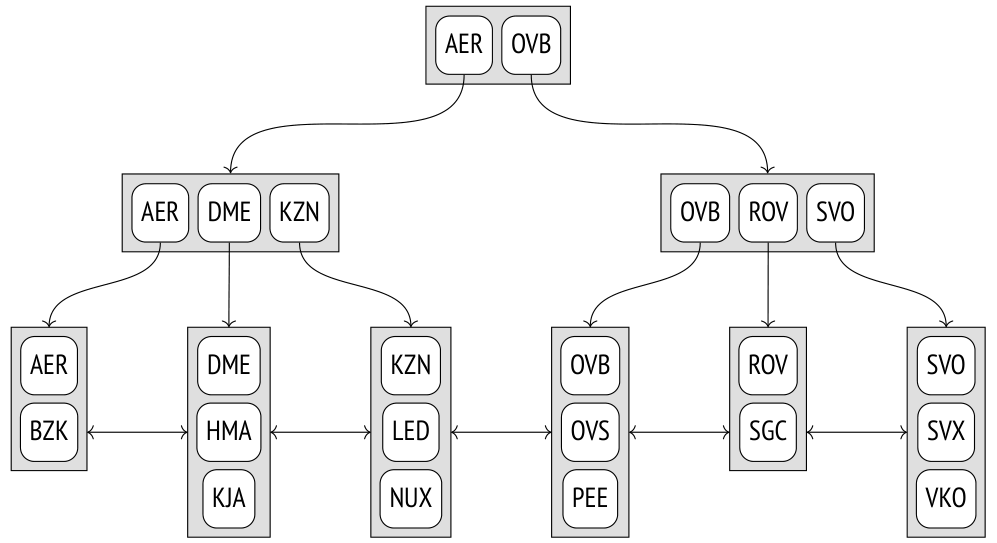
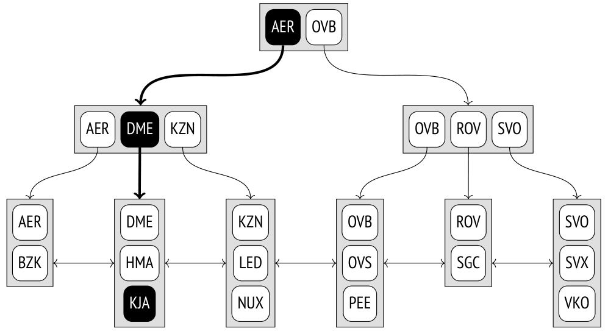
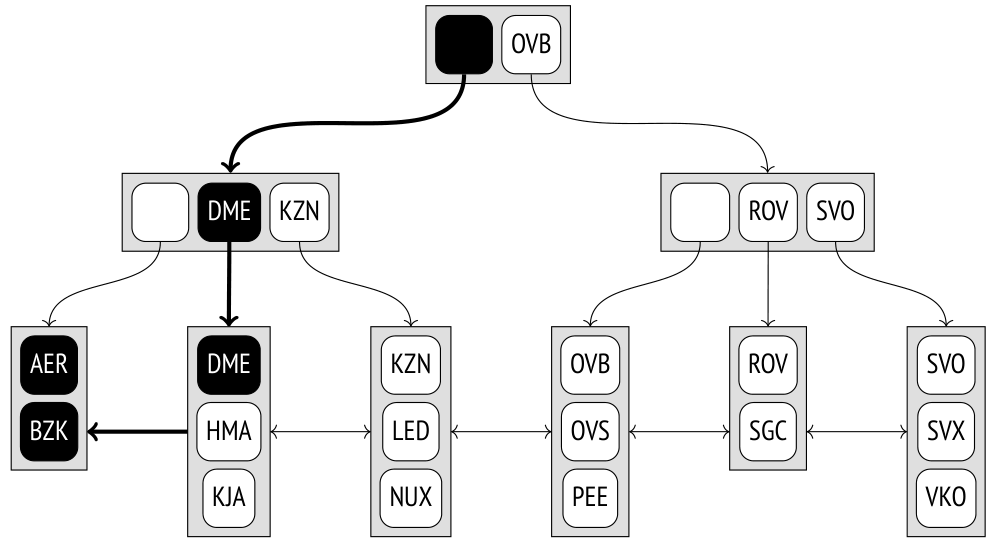
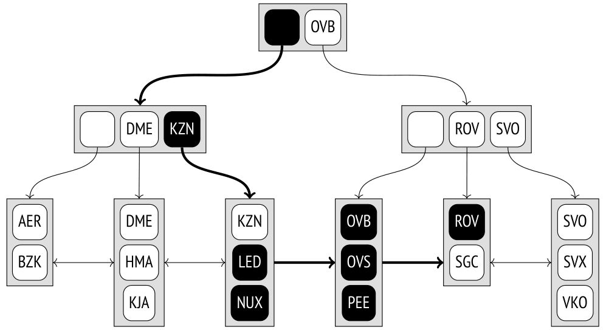
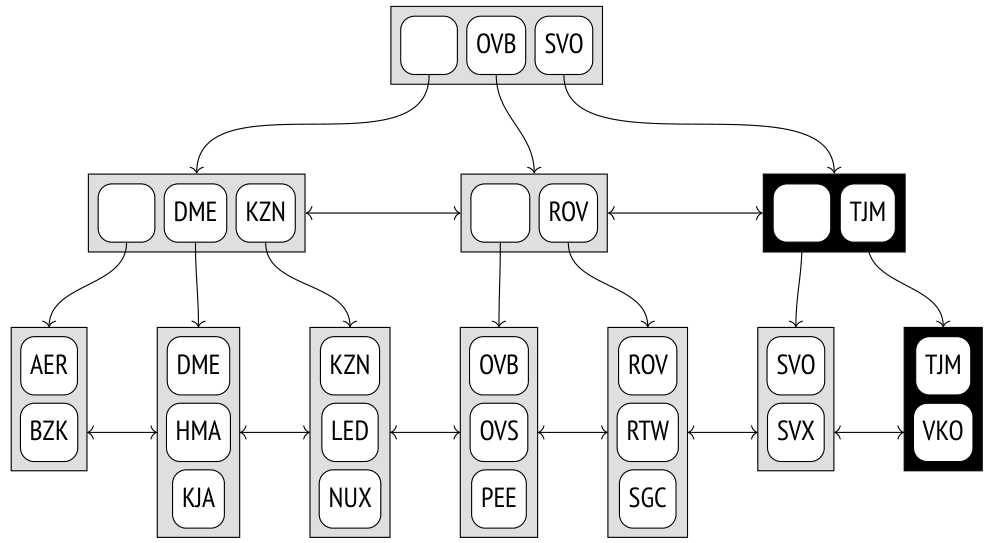
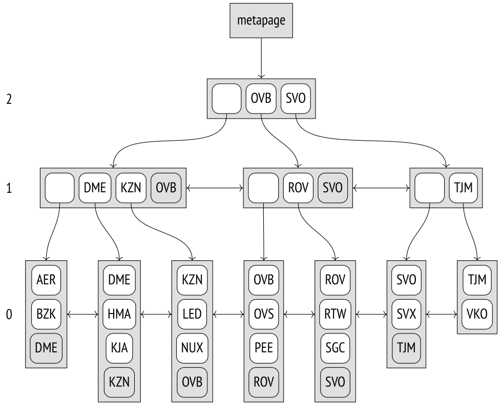
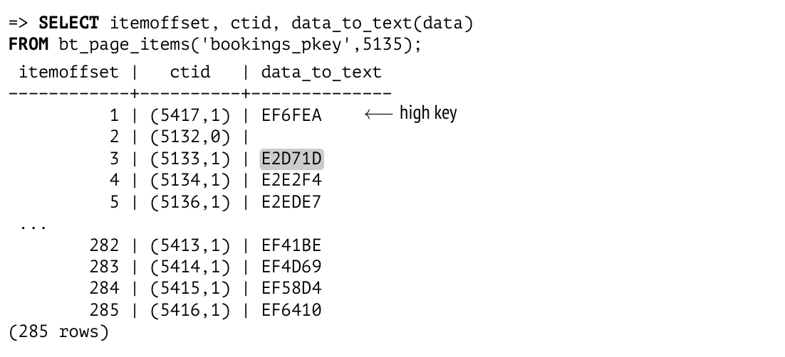

# Chương 25. B-tree (Cây B)

## 25.1 Tổng quan (Overview)

B-tree (được hiện thực dưới dạng access method `btree`) là một cấu trúc dữ liệu cho phép bạn nhanh chóng tìm thấy phần tử cần thiết trong các nút lá (leaf node) của cây bằng cách đi xuống từ gốc (root) của nó.[^1] Để đường tìm kiếm được xác định một cách duy nhất, mọi phần tử của cây phải được sắp thứ tự. B-tree được thiết kế cho các kiểu dữ liệu có thứ tự (ordinal), tức là những kiểu mà giá trị có thể được so sánh và sắp xếp.

Sơ đồ minh họa sau đây của một index được xây dựng trên mã sân bay thể hiện các nút trong (inner node) dưới dạng những hình chữ nhật nằm ngang; các nút lá được xếp theo chiều dọc.



Mỗi nút của cây chứa một số phần tử, mỗi phần tử gồm một khóa index (index key) và một con trỏ. Các phần tử của nút trong tham chiếu tới các nút ở mức kế tiếp; các phần tử của nút lá tham chiếu tới các heap tuple (hình minh họa không thể hiện các tham chiếu này).

B-tree có những thuộc tính quan trọng sau:

- Chúng cân bằng (balanced), nghĩa là mọi nút lá của cây đều nằm ở cùng một độ sâu. Do đó, chúng bảo đảm thời gian tìm kiếm như nhau cho mọi giá trị.

- Chúng có rất nhiều nhánh, tức là mỗi nút chứa nhiều phần tử, thường là hàng trăm phần tử (hình minh họa chỉ thể hiện các nút ba phần tử cho dễ hiểu). Nhờ vậy, độ sâu của B-tree luôn nhỏ, ngay cả với những bảng rất lớn.

> Chúng ta không thể nói chắc chắn tuyệt đối chữ B trong tên của cấu trúc này là viết tắt của từ gì. Cả *balanced* (cân bằng) lẫn *bushy* (rậm rạp) đều phù hợp như nhau. Điều đáng ngạc nhiên là bạn thường thấy nó được hiểu là *binary* (nhị phân), điều này chắc chắn là sai.

- Dữ liệu trong index được sắp xếp theo thứ tự tăng dần hoặc giảm dần, cả bên trong mỗi nút lẫn trên toàn bộ các nút cùng một mức. Các nút ngang hàng được liên kết thành một danh sách hai chiều (bidirectional list), vì vậy có thể lấy được một tập dữ liệu có thứ tự chỉ bằng cách quét danh sách theo chiều này hay chiều kia, mà không phải bắt đầu lại từ gốc mỗi lần.

## 25.2 Tìm kiếm và chèn (Search and Insertions)

### Tìm kiếm theo đẳng thức (Search by Equality)

Hãy xem cách chúng ta có thể tìm một giá trị trong cây theo điều kiện “*indexed-column* `=` *expression*”.[^2] Chúng ta sẽ thử tìm sân bay KJA (Krasnoyarsk).

Việc tìm kiếm bắt đầu tại nút gốc, và access method phải xác định cần đi xuống nút con nào. Nó chọn khóa K<sub>i</sub> thỏa mãn K<sub>i</sub> ⩽ *expression* < K<sub>i+1</sub>.

Nút gốc chứa các khóa AER và OVB. Điều kiện AER ⩽ KJA < OVB đúng, vì vậy chúng ta cần đi xuống nút con được tham chiếu bởi phần tử có khóa AER.

Quá trình này được lặp lại một cách đệ quy cho đến khi chúng ta tới được nút lá chứa tuple ID cần tìm. Trong trường hợp này, nút con thỏa mãn điều kiện DME ⩽ KJA < KZN, vì vậy chúng ta phải đi xuống nút lá được tham chiếu bởi phần tử có khóa DME.

Như bạn có thể nhận thấy, các khóa ngoài cùng bên trái trong các nút trong của cây là thừa: để chọn nút con của gốc, chỉ cần điều kiện KJA < OVB được thỏa mãn là đủ. B-tree không lưu những khóa như vậy, nên trong các hình minh họa tiếp theo tôi sẽ để trống các phần tử tương ứng.



Phần tử cần tìm trong nút lá có thể được tìm thấy nhanh chóng bằng tìm kiếm nhị phân (binary search).

Tuy nhiên, thủ tục tìm kiếm không đơn giản như vẻ ngoài của nó. Cần phải tính đến việc thứ tự sắp xếp của dữ liệu trong index có thể là tăng dần, như minh họa ở trên, hoặc giảm dần. Ngay cả một unique index cũng có thể có nhiều giá trị khớp, và tất cả chúng đều phải được trả về *[→ tr. 429](25-b-tree.md)*. Hơn nữa, có thể có nhiều bản trùng lặp đến mức chúng không vừa trong một nút duy nhất, nên nút lá lân cận cũng sẽ phải được xử lý.

> Vì index có thể chứa các giá trị không duy nhất, sẽ chính xác hơn nếu gọi thứ tự của nó là không giảm (non-descending) thay vì tăng dần (và không tăng (non-ascending) thay vì giảm dần). Nhưng tôi sẽ dùng thuật ngữ đơn giản hơn. Bên cạnh đó, tuple ID là một phần của khóa index, điều này cho phép chúng ta coi các index entry là duy nhất ngay cả khi các giá trị thực ra giống nhau *(v. 12)*.

Thêm vào đó, trong khi việc tìm kiếm đang diễn ra, các tiến trình khác có thể sửa đổi dữ liệu, các page có thể bị tách (split) làm hai, và cấu trúc cây có thể thay đổi. Mọi thuật toán đều được thiết kế để giảm thiểu tranh chấp giữa các thao tác đồng thời này bất cứ khi nào có thể và tránh các lock quá mức, nhưng chúng ta sẽ không đi sâu vào những chi tiết kỹ thuật đó ở đây.

### Tìm kiếm theo bất đẳng thức (Search by Inequality)

Nếu việc tìm kiếm được thực hiện theo điều kiện “*indexed-column* ⩽ *expression*” (hoặc “*indexed-column* ⩾ *expression*”), trước tiên chúng ta phải tìm trong index giá trị thỏa mãn điều kiện đẳng thức, rồi duyệt các nút lá của nó theo hướng cần thiết cho đến khi tới cuối cây.

Sơ đồ này minh họa việc tìm kiếm các mã sân bay nhỏ hơn hoặc bằng DME (Domodedovo).



Với các toán tử *nhỏ hơn* và *lớn hơn*, thủ tục cũng như vậy, ngoại trừ việc giá trị tìm thấy đầu tiên phải bị loại ra.

### Tìm kiếm theo khoảng (Search by Range)

Khi tìm kiếm theo khoảng “*expression*<sub>1</sub> ⩽ *indexed-column* ⩽ *expression*<sub>2</sub>”, trước tiên chúng ta phải tìm *expression*<sub>1</sub>, rồi duyệt các nút lá theo đúng hướng cho đến khi tới *expression*<sub>2</sub>. Sơ đồ này minh họa quá trình tìm kiếm các mã sân bay trong khoảng từ LED (Saint Petersburg) đến ROV (Rostov-on-Don), bao gồm cả hai đầu.



### Chèn (Insertions)

Vị trí chèn của một phần tử mới được xác định một cách duy nhất bởi thứ tự của các khóa. Ví dụ, nếu bạn chèn mã sân bay RTW (Saratov) vào bảng, phần tử mới sẽ xuất hiện ở nút lá áp chót, giữa ROV và SGC.

Nhưng điều gì xảy ra nếu nút lá không có đủ chỗ cho phần tử mới? Ví dụ (giả sử một nút chỉ chứa được tối đa ba phần tử), nếu chúng ta chèn mã sân bay TJM (Tyumen), nút lá cuối cùng sẽ bị tràn. Trong trường hợp này, nút bị *tách* (split) làm hai, một số phần tử của nút cũ được chuyển sang nút mới, và một con trỏ tới nút con mới được thêm vào nút cha. Hiển nhiên, nút cha cũng có thể bị tràn. Khi đó nó cũng bị tách thành hai nút, và cứ thế tiếp tục. Nếu đến mức phải tách nút gốc, một nút nữa sẽ được tạo ra phía trên các nút kết quả để trở thành gốc mới của cây. Trong trường hợp này, độ sâu của cây tăng thêm một mức.

Trong ví dụ này, việc chèn sân bay TJM dẫn đến hai lần tách nút; các nút mới tạo ra được làm nổi bật trong sơ đồ bên dưới. Để bảo đảm rằng bất kỳ nút nào cũng có thể được tách, một danh sách hai chiều liên kết các nút ở mọi mức, chứ không chỉ các nút ở mức thấp nhất.



Thủ tục chèn và tách được mô tả ở trên bảo đảm rằng cây luôn cân bằng, và vì số phần tử mà một nút có thể chứa thường khá lớn, độ sâu của cây hiếm khi tăng.

Vấn đề là một khi đã bị tách, các nút không bao giờ có thể được gộp lại với nhau, ngay cả khi chúng chỉ còn rất ít phần tử sau khi vacuum. Hạn chế này không thuộc về bản thân cấu trúc dữ liệu B-tree, mà là của cách hiện thực nó trong PostgreSQL. Vì vậy, nếu nút hóa ra đã đầy khi thực hiện chèn, access method trước tiên sẽ cố gắng dọn bỏ (prune) dữ liệu thừa để giải phóng một ít không gian và tránh một lần tách thêm *[→ tr. 101](05-page-pruning-and-hot-updates.md)*.

## 25.3 Bố cục page (Page Layout)

Mỗi nút của B-tree chiếm một page. Kích thước của page xác định sức chứa của nút.

Do việc tách page, gốc của cây có thể được biểu diễn bởi những page khác nhau vào những thời điểm khác nhau. Nhưng thuật toán tìm kiếm luôn phải bắt đầu quét từ gốc. Nó tìm ID của page gốc hiện tại trong page số không của index (được gọi là metapage). Metapage cũng chứa một số metadata khác.



Bố cục dữ liệu trong các page của index hơi khác so với những gì chúng ta đã thấy cho đến giờ. Mọi page, ngoại trừ các page ngoài cùng bên phải ở mỗi mức, đều chứa thêm một “high key” (khóa cao), được bảo đảm là không nhỏ hơn bất kỳ khóa nào trong page này. Trong sơ đồ trên, các high key được làm nổi bật.

Hãy dùng extension `pageinspect` để xem một page của một index thực tế được xây dựng trên các mã đặt chỗ (booking reference) gồm sáu ký tự. Metapage liệt kê ID của page gốc và độ sâu của cây (việc đánh số mức bắt đầu từ các nút lá và bắt đầu từ số không):

```
=> SELECT root, level
FROM bt_metap('bookings_pkey');
 root | level
------+-------
  290 |     2
(1 row)
```

Các khóa được lưu trong index entry được hiển thị dưới dạng chuỗi byte, điều này không thật sự tiện lợi:

```
=> SELECT data
FROM bt_page_items('bookings_pkey',290)
WHERE itemoffset = 2;
          data
-------------------------
 0f 30 43 39 41 42 31 00
(1 row)
```

Để giải mã các giá trị này, chúng ta sẽ phải viết một hàm ad hoc. Hàm này sẽ không hỗ trợ mọi nền tảng và có thể không hoạt động trong một số tình huống cụ thể, nhưng nó đủ dùng cho các ví dụ trong chương này:

```
=> CREATE FUNCTION data_to_text(data text)
RETURNS text
AS $$
DECLARE
  raw bytea := ('\x'||replace(data,' ',''))::bytea;
  pos integer := 0;
  len integer;
  res text := '';
BEGIN
  WHILE (octet_length(raw) > pos)
  LOOP
    len := (get_byte(raw,pos) - 3) / 2;
    EXIT WHEN len <= 0;
    IF pos > 0 THEN
      res := res || ', ';
    END IF;
    res := res || (
      SELECT string_agg( chr(get_byte(raw, i)),'')
      FROM generate_series(pos+1,pos+len) i
    );
    pos := pos + len + 1;
  END LOOP;
  RETURN res;
END;
$$ LANGUAGE plpgsql;
```

Bây giờ chúng ta có thể xem nội dung của page gốc:

```
=> SELECT itemoffset, ctid, data_to_text(data)
FROM bt_page_items('bookings_pkey',290);
 itemoffset |   ctid   | data_to_text
------------+----------+--------------
          1 | (3,0)    |
          2 | (289,1)  | 0C9AB1
          3 | (575,1)  | 192F03
          4 | (860,1)  | 25D715
          5 | (1145,1) | 32785C
 ...
         17 | (4565,1) | C993F6
         18 | (4850,1) | D63931
         19 | (5135,1) | E2CB14
         20 | (5420,1) | EF6FEA
         21 | (5705,1) | FC147D
(21 rows)
```

Như tôi đã nói, entry đầu tiên không chứa khóa. Cột `ctid` cung cấp liên kết tới các page con.

Giả sử chúng ta đang tìm booking E2D725. Trong trường hợp này, chúng ta phải chọn entry 19 (vì E2CB14 ⩽ E2D725 < EF6FEA) và đi xuống page 5135.

```
=> SELECT itemoffset, ctid, data_to_text(data)
FROM bt_page_items('bookings_pkey',5135);
 itemoffset |   ctid   | data_to_text
------------+----------+--------------
          1 | (5417,1) | EF6FEA
          2 | (5132,0) |
          3 | (5133,1) | E2D71D
          4 | (5134,1) | E2E2F4
          5 | (5136,1) | E2EDE7
 ...
        282 | (5413,1) | EF41BE
        283 | (5414,1) | EF4D69
        284 | (5415,1) | EF58D4
        285 | (5416,1) | EF6410
(285 rows)
```



Entry đầu tiên trong page này chứa high key, điều này có vẻ hơi bất ngờ. Về mặt logic, lẽ ra nó phải được đặt ở cuối page, nhưng xét từ góc độ hiện thực thì đặt nó ở đầu sẽ thuận tiện hơn, để tránh phải di chuyển nó mỗi khi nội dung page thay đổi.

Ở đây chúng ta chọn entry 3 (vì E2D71D ⩽ E2D725 < E2E2F4) và đi xuống page 11919.

```
=> SELECT itemoffset, ctid, data_to_text(data)
FROM bt_page_items('bookings_pkey',5133);
 itemoffset |    ctid    | data_to_text
------------+-------------+--------------
          1 | (11921,1)  | E2E2F4
          2 | (11919,76) | E2D71D
          3 | (11919,77) | E2D725
          4 | (11919,78) | E2D72D
          5 | (11919,79) | E2D733
 ...
        363 | (11921,123) | E2E2C9
        364 | (11921,124) | E2E2DB
        365 | (11921,125) | E2E2DF
        366 | (11921,126) | E2E2E5
        367 | (11921,127) | E2E2ED
(367 rows)
```

Đây là một page lá của index. Entry đầu tiên là high key; tất cả các entry còn lại trỏ tới các heap tuple.

Và đây là booking của chúng ta:

```
=> SELECT * FROM bookings
WHERE ctid = '(11919,77)';
 book_ref |       book_date       | total_amount
----------+------------------------+--------------
 E2D725   | 2017-01-25 04:10:00+03 |    28000.00
(1 row)
```

Đó đại khái là những gì xảy ra ở mức thấp khi chúng ta tìm một booking theo mã của nó:

```
=> EXPLAIN (costs off)
SELECT * FROM bookings
WHERE book_ref = 'E2D725';
                 QUERY PLAN
---------------------------------------------
 Index Scan using bookings_pkey on bookings
   Index Cond: (book_ref = 'E2D725'::bpchar)
(2 rows)
```

### Khử trùng lặp (Deduplication) *(v. 13)*

Các index không duy nhất (non-unique) có thể chứa rất nhiều khóa trùng lặp trỏ tới các heap tuple khác nhau. Vì các khóa không duy nhất xuất hiện nhiều hơn một lần và do đó chiếm nhiều không gian, các bản trùng lặp được gộp lại thành một index entry duy nhất, chứa khóa và danh sách các tuple ID tương ứng.[^3] Trong một số trường hợp, thủ tục này (được gọi là *deduplication* — khử trùng lặp) có thể giảm đáng kể kích thước index.

Tuy nhiên, các unique index cũng có thể chứa các bản trùng lặp do MVCC: một index giữ tham chiếu tới mọi phiên bản của các dòng trong bảng. Cơ chế HOT update có thể giúp bạn chống lại hiện tượng phình to (bloat) index gây ra bởi việc tham chiếu tới các row version đã lỗi thời và thường tồn tại ngắn *[→ tr. 92](05-page-pruning-and-hot-updates.md)*, nhưng đôi khi nó có thể không áp dụng được. Trong trường hợp đó, deduplication có thể giúp kéo dài thời gian cần thiết để vacuum các heap tuple thừa và tránh những lần tách page không cần thiết.

Để tránh lãng phí tài nguyên cho deduplication khi nó không mang lại lợi ích tức thời, việc gộp chỉ được thực hiện nếu page lá không còn đủ chỗ để chứa thêm một tuple nữa.[^4] Khi đó, page pruning và deduplication[^5] có thể giải phóng một ít không gian và ngăn một lần tách page không mong muốn. Tuy nhiên, nếu các bản trùng lặp hiếm khi xuất hiện, bạn có thể vô hiệu hóa tính năng deduplication bằng cách tắt tham số lưu trữ (storage parameter) *deduplicate_items*.

Một số index không hỗ trợ deduplication. Hạn chế chính là sự bằng nhau của các khóa phải được kiểm tra bằng phép so sánh nhị phân đơn giản trên biểu diễn bên trong của chúng. Còn lâu mới phải mọi kiểu dữ liệu đều có thể so sánh theo cách này. Chẳng hạn, các số dấu phẩy động (`float` và `double precision`) có hai biểu diễn khác nhau cho số không. Các số có độ chính xác tùy ý (`numeric`) có thể biểu diễn cùng một số với các scale khác nhau, trong khi kiểu `jsonb` có thể dùng những số như vậy. Deduplication cũng không thể thực hiện với các kiểu văn bản nếu bạn dùng các collation không tất định (nondeterministic),[^6] vốn cho phép cùng những ký tự được biểu diễn bởi các chuỗi byte khác nhau (các collation chuẩn là tất định).

Bên cạnh đó, deduplication hiện chưa được hỗ trợ cho các kiểu composite, range và mảng, cũng như cho các index được khai báo với mệnh đề `INCLUDE`.

Để kiểm tra xem một index cụ thể có thể dùng deduplication hay không, bạn có thể xem trường `allequalimage` trong metapage của nó:

```
=> CREATE INDEX ON tickets(book_ref);
=> SELECT allequalimage FROM bt_metap('tickets_book_ref_idx');
 allequalimage
---------------
 t
(1 row)
```

Trong trường hợp này, deduplication được hỗ trợ. Và quả thực, chúng ta có thể thấy một trong các page lá chứa cả những index entry với một tuple ID duy nhất (`htid`) lẫn những entry với danh sách các ID (`tids`):

```
=> SELECT itemoffset, htid, left(tids::text,27) tids,
  data_to_text(data) AS data
FROM bt_page_items('tickets_book_ref_idx',1)
WHERE itemoffset > 1;
 itemoffset |    htid   |            tids             |  data
------------+------------+-----------------------------+--------
          2 | (32965,40) |                            | 000004
          3 | (47429,51) |                            | 00000F
          4 | (3648,56) | {"(3648,56)","(3648,57)"}   | 000010
          5 | (6498,47) |                             | 000012
 ...
        271 | (21492,46) |                            | 000890
        272 | (26601,57) | {"(26601,57)","(26601,58)"} | 0008AC
        273 | (25669,37) |                            | 0008B6
(272 rows)
```

### Lưu trữ gọn các index entry bên trong (Compact Storage of Inner Index Entries) *(v. 12)*

Deduplication cho phép chứa được nhiều entry hơn trong các page lá của index. Nhưng mặc dù các page lá chiếm phần lớn một index, việc nén gọn dữ liệu trong các page trong (inner page) để ngăn các lần tách thêm cũng quan trọng không kém, vì hiệu quả tìm kiếm phụ thuộc trực tiếp vào độ sâu của cây.

Các index entry bên trong chứa các khóa index, nhưng giá trị của chúng chỉ được dùng để xác định cây con cần đi xuống trong quá trình tìm kiếm. Trong các index nhiều cột, thường chỉ cần lấy thuộc tính khóa đầu tiên (hoặc vài thuộc tính đầu tiên) là đủ. Các thuộc tính khác có thể bị cắt bỏ để tiết kiệm không gian trong page.

Việc *suffix truncation* (cắt bỏ hậu tố) như vậy xảy ra khi một page lá đang được tách và page trong phải chứa thêm một con trỏ mới.[^7]

> Về lý thuyết, chúng ta thậm chí có thể tiến thêm một bước và chỉ giữ lại *phần* có ý nghĩa của thuộc tính, chẳng hạn vài ký tự đầu tiên của một chuỗi đủ để phân biệt giữa các cây con. Nhưng điều này chưa được hiện thực: một index entry hoặc chứa toàn bộ thuộc tính, hoặc loại bỏ hẳn thuộc tính đó.

Ví dụ, đây là một vài entry của page gốc của một index được xây dựng trên bảng `tickets`, trên các cột chứa mã đặt chỗ và tên hành khách:

```
=> CREATE INDEX tickets_bref_name_idx
ON tickets(book_ref, passenger_name);
=> SELECT itemoffset, ctid, data_to_text(data)
FROM bt_page_items('tickets_bref_name_idx',229)
WHERE itemoffset BETWEEN 8 AND 13;
```

```
 itemoffset |   ctid   |       data_to_text
------------+----------+----------------------------
          8 | (1607,1) | 1A98A0
          9 | (1833,2) | 1E57D1, SVETLANA MAKSIMOVA
         10 | (2054,1) | 220797
         11 | (2282,1) | 25DB06
         12 | (2509,2) | 299FE4, YURIY AFANASEV
         13 | (2736,1) | 2D62C9
(6 rows)
```

Chúng ta có thể thấy một số index entry không có thuộc tính thứ hai.

Đương nhiên, các page lá phải giữ tất cả các thuộc tính khóa và giá trị của các cột `INCLUDE`, nếu có. Nếu không, sẽ không thể thực hiện index-only scan. Ngoại lệ duy nhất là các high key; chúng có thể được giữ một phần.

## 25.4 Operator class (Operator Class)

### Ngữ nghĩa so sánh (Comparison Semantics)

Ngoài việc băm giá trị, hệ thống còn phải biết cách sắp thứ tự các giá trị thuộc nhiều kiểu khác nhau, kể cả các kiểu do người dùng tự định nghĩa. Điều này không thể thiếu cho việc sắp xếp, gom nhóm, merge join và một số thao tác khác. Và cũng giống như trường hợp băm, các toán tử so sánh cho một kiểu dữ liệu cụ thể được định nghĩa bởi một operator class.[^8]

Operator class cho phép chúng ta trừu tượng hóa khỏi tên gọi (chẳng hạn `>`, `<`, `=`) và thậm chí có thể cung cấp nhiều cách sắp thứ tự các giá trị của cùng một kiểu.

Dưới đây là các toán tử so sánh bắt buộc phải được định nghĩa trong mọi operator class của phương thức `btree` (minh họa cho họ `bool_ops`):

```
=> SELECT amopopr::regoperator AS opfamily_operator,
  amopstrategy
FROM pg_am am
  JOIN pg_opfamily opf ON opfmethod = am.oid
  JOIN pg_amop amop ON amopfamily = opf.oid
WHERE amname = 'btree'
AND opfname = 'bool_ops'
ORDER BY amopstrategy;
  opfamily_operator  | amopstrategy
---------------------+--------------
 <(boolean,boolean)  |           1
 <=(boolean,boolean) |           2
 =(boolean,boolean)  |           3
```

```
 >=(boolean,boolean) |           4
 >(boolean,boolean)  |           5
(5 rows)
```

Mỗi toán tử trong năm toán tử so sánh này tương ứng với một trong các *strategy* (chiến lược),[^9] vốn định nghĩa ngữ nghĩa của chúng:

1 nhỏ hơn

2 nhỏ hơn hoặc bằng

3 bằng

4 lớn hơn hoặc bằng

5 lớn hơn

Một operator class của B-tree cũng bao gồm một số hàm hỗ trợ (support function).[^10] Hàm đầu tiên phải trả về 1 nếu đối số thứ nhất lớn hơn đối số thứ hai, -1 nếu nó nhỏ hơn đối số thứ hai, và 0 nếu hai đối số bằng nhau.

Các hàm hỗ trợ khác là tùy chọn, nhưng chúng cải thiện hiệu năng của access method.

Để hiểu rõ hơn cơ chế này, chúng ta có thể định nghĩa một kiểu dữ liệu mới với một thứ tự sắp xếp không mặc định. Tài liệu có đưa ra một ví dụ cho số phức,[^11] nhưng nó được viết bằng C. May mắn là operator class của B-tree cũng có thể được hiện thực bằng các ngôn ngữ thông dịch, vì vậy tôi sẽ tận dụng điều đó và tạo một ví dụ đơn giản nhất có thể (dù biết rõ là kém hiệu quả).

Hãy định nghĩa một kiểu composite mới cho các đơn vị thông tin:

```
=> CREATE TYPE capacity_units AS ENUM (
  'B', 'kB', 'MB', 'GB', 'TB', 'PB'
);
=> CREATE TYPE capacity AS (
  amount integer,
  unit capacity_units
);
```

Bây giờ tạo một bảng với một cột thuộc kiểu mới và điền vào đó các giá trị ngẫu nhiên:

```
=> CREATE TABLE test AS
  SELECT ( (random()*1023)::integer, u.unit )::capacity AS cap
  FROM generate_series(1,100),
    unnest(enum_range(NULL::capacity_units)) AS u(unit);
```

Theo mặc định, các giá trị của kiểu composite được sắp xếp theo thứ tự từ điển (lexicographical), vốn không giống với thứ tự tự nhiên trong trường hợp cụ thể này:

```
=> SELECT * FROM test ORDER BY cap;
    cap
-----------
 (1,B)
 (3,GB)
 (4,MB)
 (9,kB)
 ...
 (1017,kB)
 (1017,GB)
 (1018,PB)
 (1020,MB)
(600 rows)
```

Bây giờ hãy bắt tay vào tạo operator class của chúng ta. Chúng ta sẽ bắt đầu bằng việc định nghĩa một hàm chuyển đổi dung lượng sang byte:

```
=> CREATE FUNCTION capacity_to_bytes(a capacity) RETURNS numeric
AS $$
SELECT a.amount::numeric *
  1024::numeric ^ ( array_position(enum_range(a.unit), a.unit) - 1 );
$$ LANGUAGE sql STRICT IMMUTABLE;
=> SELECT capacity_to_bytes('(1,kB)'::capacity);
   capacity_to_bytes
-----------------------
 1024.0000000000000000
(1 row)
```

Tạo một hàm hỗ trợ cho operator class sắp tạo:

```
=> CREATE FUNCTION capacity_cmp(a capacity, b capacity)
RETURNS integer
AS $$
SELECT sign(capacity_to_bytes(a) - capacity_to_bytes(b));
$$ LANGUAGE sql STRICT IMMUTABLE;
```

Giờ đây có thể dễ dàng định nghĩa các toán tử so sánh bằng cách dùng hàm hỗ trợ này. Tôi cố ý dùng những cái tên kỳ quặc để minh họa rằng chúng có thể tùy ý:

```
=> CREATE FUNCTION capacity_lt(a capacity, b capacity) RETURNS boolean
AS $$
BEGIN
  RETURN capacity_cmp(a,b) < 0;
END;
$$ LANGUAGE plpgsql IMMUTABLE STRICT;
```

```
=> CREATE OPERATOR #<# (
  LEFTARG = capacity,
  RIGHTARG = capacity,
  FUNCTION = capacity_lt
);
```

Bốn toán tử còn lại được định nghĩa theo cách tương tự.

```
=> CREATE FUNCTION capacity_le(a capacity, b capacity) RETURNS boolean
AS $$
BEGIN
  RETURN capacity_cmp(a,b) <= 0;
END;
$$ LANGUAGE plpgsql IMMUTABLE STRICT;
=> CREATE OPERATOR #<=# (
  LEFTARG = capacity,
  RIGHTARG = capacity,
  FUNCTION = capacity_le
);
=> CREATE FUNCTION capacity_eq(a capacity, b capacity) RETURNS boolean
AS $$
BEGIN
  RETURN capacity_cmp(a,b) = 0;
END;
$$ LANGUAGE plpgsql IMMUTABLE STRICT;
=> CREATE OPERATOR #=# (
  LEFTARG = capacity,
  RIGHTARG = capacity,
  FUNCTION = capacity_eq,
  MERGES -- can be used in merge joins
);
=> CREATE FUNCTION capacity_ge(a capacity, b capacity) RETURNS boolean
AS $$
BEGIN
  RETURN capacity_cmp(a,b) >= 0;
END;
$$ LANGUAGE plpgsql IMMUTABLE STRICT;
=> CREATE OPERATOR #>=# (
  LEFTARG = capacity,
  RIGHTARG = capacity,
  FUNCTION = capacity_ge
);
=> CREATE FUNCTION capacity_gt(a capacity, b capacity) RETURNS boolean
AS $$
BEGIN
  RETURN capacity_cmp(a,b) > 0;
END;
$$ LANGUAGE plpgsql IMMUTABLE STRICT;
```

```
=> CREATE OPERATOR #># (
  LEFTARG = capacity,
  RIGHTARG = capacity,
  FUNCTION = capacity_gt
);
```

Ở giai đoạn này, chúng ta đã có thể so sánh các dung lượng:

```
=> SELECT (1,'MB')::capacity #># (512, 'kB')::capacity;
 ?column?
----------
 t
(1 row)
```

Khi operator class được tạo, việc sắp xếp cũng sẽ bắt đầu hoạt động như mong đợi:

```
=> CREATE OPERATOR CLASS capacity_ops
DEFAULT FOR TYPE capacity -- to be used by default
USING btree AS
  OPERATOR 1 #<#,
  OPERATOR 2 #<=#,
  OPERATOR 3 #=#,
  OPERATOR 4 #>=#,
  OPERATOR 5 #>#,
  FUNCTION 1 capacity_cmp(capacity,capacity);
=> SELECT * FROM test ORDER BY cap;
    cap
-----------
 (1,B)
 (21,B)
 (27,B)
 (35,B)
 (46,B)
 (57,B)
 (68,B)
 (70,B)
 ...
 (1002,PB)
 (1013,PB)
 (1014,PB)
 (1014,PB)
 (1018,PB)
(600 rows)
```

Operator class của chúng ta được dùng theo mặc định khi một index mới được tạo, và index này trả về kết quả theo đúng thứ tự:

```
=> CREATE INDEX ON test(cap);
=> SELECT * FROM test WHERE cap #<# (100,'B')::capacity ORDER BY cap;
```

```
  cap
--------
 (1,B)
 (21,B)
 (27,B)
 (35,B)
 (46,B)
 (57,B)
 (68,B)
 (70,B)
 (72,B)
 (76,B)
 (78,B)
 (94,B)
(12 rows)
=> EXPLAIN (costs off) SELECT *
FROM test
WHERE cap #<# (100,'B')::capacity
ORDER BY cap;
                 QUERY PLAN
---------------------------------------------
 Index Only Scan using test_cap_idx on test
   Index Cond: (cap #<# '(100,B)'::capacity)
(2 rows)
```

Mệnh đề `MERGES` được chỉ định trong khai báo toán tử bằng cho phép thực hiện merge join với kiểu dữ liệu này *[→ tr. 387](23-sorting-and-merging.md)*.

### Index nhiều cột và sắp xếp (Multicolumn Indexes and Sorting)

Hãy xem xét kỹ hơn việc sắp xếp trong các index nhiều cột.

Trước hết và quan trọng nhất, việc chọn thứ tự tối ưu của các cột khi khai báo index là rất quan trọng: việc sắp xếp dữ liệu trong các page sẽ bắt đầu từ cột thứ nhất, sau đó chuyển sang cột thứ hai, và cứ thế tiếp tục. Index nhiều cột chỉ có thể bảo đảm tìm kiếm hiệu quả nếu điều kiện lọc được cung cấp bao phủ một dãy cột liên tục bắt đầu từ chính cột đầu tiên: cột thứ nhất, hai cột đầu tiên, khoảng từ cột thứ nhất đến cột thứ ba, v.v. Các loại điều kiện khác chỉ có thể được dùng để lọc bỏ những giá trị thừa đã được lấy ra dựa trên các tiêu chí khác.

Dưới đây là thứ tự các index entry trong page lá đầu tiên của index đã được tạo trên bảng `tickets`, bao gồm mã đặt chỗ và tên hành khách:

```
=> SELECT itemoffset, data_to_text(data)
FROM bt_page_items('tickets_bref_name_idx',1)
WHERE itemoffset > 1;
```

```
 itemoffset |        data_to_text
------------+-----------------------------
          2 | 000004, PETR MAKAROV
          3 | 00000F, ANNA ANTONOVA
          4 | 000010, ALEKSANDR SOKOLOV
          5 | 000010, LYUDMILA BOGDANOVA
          6 | 000012, TAMARA ZAYCEVA
          7 | 000026, IRINA PETROVA
          8 | 00002D, ALEKSANDR SMIRNOV
 ...
        188 | 00040C, ANTONINA KOROLEVA
        189 | 00040C, DMITRIY FEDOROV
        190 | 00041E, EGOR FEDOROV
        191 | 00041E, ILYA STEPANOV
        192 | 000447, VIKTOR VASILEV
        193 | 00044D, NADEZHDA KULIKOVA
(192 rows)
```

Trong trường hợp này, việc tìm vé hiệu quả chỉ khả thi hoặc theo cả mã đặt chỗ lẫn tên hành khách, hoặc chỉ theo riêng mã đặt chỗ.

```
=> EXPLAIN (costs off) SELECT *
FROM tickets
WHERE book_ref = '000010';
                    QUERY PLAN
--------------------------------------------------
 Index Scan using tickets_book_ref_idx on tickets
   Index Cond: (book_ref = '000010'::bpchar)
(2 rows)
=> EXPLAIN (costs off) SELECT *
FROM tickets
WHERE book_ref = '000010' AND passenger_name = 'LYUDMILA BOGDANOVA';
                            QUERY PLAN
---------------------------------------------------------------------
 Index Scan using tickets_bref_name_idx on tickets
   Index Cond: ((book_ref = '000010'::bpchar) AND (passenger_name...
(2 rows)
```

Nhưng nếu chúng ta quyết định tìm theo tên hành khách, chúng ta phải quét tất cả các dòng:

```
=> EXPLAIN (costs off) SELECT *
FROM tickets
WHERE passenger_name = 'LYUDMILA BOGDANOVA';
                        QUERY PLAN
-------------------------------------------------------------
 Gather
   Workers Planned: 2
   -> Parallel Seq Scan on tickets
       Filter: (passenger_name = 'LYUDMILA BOGDANOVA'::text)
(4 rows)
```

Ngay cả khi planner chọn thực hiện index scan, *tất cả* các index entry vẫn sẽ phải được duyệt qua.[^12] Đáng tiếc là plan sẽ không cho thấy điều kiện thực ra chỉ được dùng để lọc kết quả.

> Nếu cột đầu tiên không có quá nhiều giá trị phân biệt *v*<sub>1</sub>, *v*<sub>2</sub>, … , *v*<sub>n</sub>, việc thực hiện nhiều lượt duyệt trên các cây con tương ứng có thể có lợi, về cơ bản là thay thế một lần tìm kiếm duy nhất theo điều kiện “col2 = *value*” bằng một loạt các lần tìm kiếm theo những điều kiện sau:

> col1 = *v*<sub>1</sub> AND col2 = *value*  
> col1 = *v*<sub>2</sub> AND col2 = *value*  
> ⋯  
> col1 = *v*<sub>n</sub> AND col2 = *value*

> Kiểu truy cập index này được gọi là Skip Scan, nhưng nó chưa được hiện thực.[^13]

Ngược lại, nếu một index được tạo trên tên hành khách và mã đặt chỗ, nó sẽ phù hợp hơn cho các truy vấn hoặc chỉ theo tên hành khách, hoặc theo cả tên hành khách lẫn mã đặt chỗ:

```
=> CREATE INDEX tickets_name_bref_idx
ON tickets(passenger_name, book_ref);
=> SELECT itemoffset, data_to_text(data)
FROM bt_page_items('tickets_name_bref_idx',1)
WHERE itemoffset > 1;
 itemoffset |         data_to_text
------------+------------------------------
          2 | ADELINA ABRAMOVA, E37EDB
          3 | ADELINA AFANASEVA, 1133B7
          4 | ADELINA AFANASEVA, 4F3370
          5 | ADELINA AKIMOVA, 7D2881
          6 | ADELINA ALEKSANDROVA, 3C3ADD
          7 | ADELINA ALEKSANDROVA, 52801E
 ...
        185 | ADELINA LEBEDEVA, 0A00E3
        186 | ADELINA LEBEDEVA, DAEADE
        187 | ADELINA LEBEDEVA, DFD7E5
        188 | ADELINA LOGINOVA, 8022F3
        189 | ADELINA LOGINOVA, EE67B9
        190 | ADELINA LUKYANOVA, 292786
        191 | ADELINA LUKYANOVA, 54D3F9
(190 rows)
=> EXPLAIN (costs off) SELECT *
FROM tickets
WHERE passenger_name = 'LYUDMILA BOGDANOVA';
```

```
                          QUERY PLAN
-----------------------------------------------------------------
 Bitmap Heap Scan on tickets
   Recheck Cond: (passenger_name = 'LYUDMILA BOGDANOVA'::text)
   -> Bitmap Index Scan on tickets_name_bref_idx
       Index Cond: (passenger_name = 'LYUDMILA BOGDANOVA'::text)
(4 rows)
```

Ngoài thứ tự cột, bạn cũng nên chú ý đến thứ tự sắp xếp khi tạo một index mới. Theo mặc định, các giá trị được sắp xếp theo thứ tự tăng dần (`ASC`), nhưng bạn có thể đảo ngược nó (`DESC`) nếu cần. Điều này không quan trọng lắm nếu index được xây dựng trên một cột duy nhất, vì nó có thể được quét theo bất kỳ hướng nào. Nhưng trong index nhiều cột, thứ tự trở nên quan trọng.

Index mới tạo của chúng ta có thể được dùng để lấy dữ liệu được sắp xếp theo cả hai cột, hoặc theo thứ tự tăng dần, hoặc theo thứ tự giảm dần:

```
=> EXPLAIN (costs off) SELECT *
FROM tickets
ORDER BY passenger_name, book_ref;
                    QUERY PLAN
---------------------------------------------------
 Index Scan using tickets_name_bref_idx on tickets
(1 row)
=> EXPLAIN (costs off) SELECT *
FROM tickets
ORDER BY passenger_name DESC, book_ref DESC;
                        QUERY PLAN
------------------------------------------------------------
 Index Scan Backward using tickets_name_bref_idx on tickets
(1 row)
```

Nhưng index này không thể trả về dữ liệu ngay lập tức nếu dữ liệu cần được sắp xếp tăng dần theo một cột và đồng thời giảm dần theo cột kia. Trong trường hợp này, index cung cấp dữ liệu được sắp thứ tự một phần, và dữ liệu đó phải được sắp xếp tiếp theo thuộc tính thứ hai *[→ tr. 399](23-sorting-and-merging.md)*:

```
=> EXPLAIN (costs off) SELECT *
FROM tickets
ORDER BY passenger_name ASC, book_ref DESC;
                       QUERY PLAN
--------------------------------------------------------
 Incremental Sort
   Sort Key: passenger_name, book_ref DESC
   Presorted Key: passenger_name
   -> Index Scan using tickets_name_bref_idx on tickets
(4 rows)
```

Vị trí của các giá trị NULL cũng ảnh hưởng đến khả năng dùng index để sắp xếp. Theo mặc định, các giá trị NULL được coi là “lớn hơn” các giá trị thông thường cho mục đích sắp xếp, tức là chúng nằm ở phía bên phải của cây nếu thứ tự sắp xếp là tăng dần và ở phía bên trái nếu thứ tự sắp xếp là giảm dần. Vị trí của các giá trị NULL có thể được thay đổi bằng các mệnh đề `NULLS LAST` và `NULLS FIRST`.

Trong ví dụ tiếp theo, index không thỏa mãn mệnh đề `ORDER BY`, vì vậy kết quả phải được sắp xếp:

```
=> EXPLAIN (costs off) SELECT *
FROM tickets
ORDER BY passenger_name NULLS FIRST, book_ref DESC;
                       QUERY PLAN
-----------------------------------------------------------
 Gather Merge
   Workers Planned: 2
   -> Sort
       Sort Key: passenger_name NULLS FIRST, book_ref DESC
       -> Parallel Seq Scan on tickets
(5 rows)
```

Nhưng nếu chúng ta tạo một index theo đúng thứ tự mong muốn, nó sẽ được sử dụng:

```
=> CREATE INDEX tickets_name_bref_idx2
ON tickets(passenger_name NULLS FIRST, book_ref DESC);
=> EXPLAIN (costs off) SELECT *
FROM tickets
ORDER BY passenger_name NULLS FIRST, book_ref DESC;
                     QUERY PLAN
----------------------------------------------------
 Index Scan using tickets_name_bref_idx2 on tickets
(1 row)
```

## 25.5 Thuộc tính (Properties)

Hãy xem các thuộc tính giao diện (interface property) của B-tree. *[→ tr. 322](19-index-access-methods.md)*

### Thuộc tính của access method (Access Method Properties)

```
=> SELECT a.amname, p.name, pg_indexam_has_property(a.oid, p.name)
FROM pg_am a, unnest(array[
  'can_order', 'can_unique', 'can_multi_col',
  'can_exclude', 'can_include'
]) p(name)
WHERE a.amname = 'btree';
```

```
 amname |     name     | pg_indexam_has_property
--------+---------------+-------------------------
 btree  | can_order    | t
 btree  | can_unique   | t
 btree  | can_multi_col | t
 btree  | can_exclude  | t
 btree  | can_include  | t
(5 rows)
```

B-tree có thể sắp thứ tự dữ liệu và bảo đảm tính duy nhất của nó. Đây là access method duy nhất có những thuộc tính như vậy.

Nhiều access method hỗ trợ index nhiều cột, nhưng vì các giá trị trong B-tree được sắp thứ tự, bạn phải hết sức chú ý đến thứ tự các cột trong index.

Về hình thức, exclusion constraint được hỗ trợ, nhưng chúng bị giới hạn ở các điều kiện đẳng thức, điều này khiến chúng tương tự như unique constraint. Tốt hơn nhiều là dùng một unique constraint đầy đủ thay thế.

Index B-tree cũng có thể được mở rộng với các cột `INCLUDE` bổ sung không tham gia vào việc tìm kiếm.

### Thuộc tính mức index (Index-Level Properties)

```
=>  SELECT p.name, pg_index_has_property('flights_pkey', p.name)
FROM unnest(array[
  'clusterable', 'index_scan', 'bitmap_scan', 'backward_scan'
]) p(name);
     name      | pg_index_has_property
---------------+-----------------------
 clusterable   | t
 index_scan    | t
 bitmap_scan   | t
 backward_scan | t
(4 rows)
```

Index B-tree có thể được dùng để cluster hóa (clusterization).

Cả index scan lẫn bitmap scan đều được hỗ trợ. Vì các page lá được liên kết thành một danh sách hai chiều, index cũng có thể được duyệt ngược, cho ra thứ tự sắp xếp đảo ngược:

```
=> EXPLAIN (costs off) SELECT *
FROM bookings ORDER BY book_ref DESC;
                     QUERY PLAN
-----------------------------------------------------
 Index Scan Backward using bookings_pkey on bookings
(1 row)
```

### Thuộc tính mức cột (Column-Level Properties)

```
=> SELECT p.name,
  pg_index_column_has_property('flights_pkey', 1, p.name)
FROM unnest(array[
  'asc', 'desc', 'nulls_first', 'nulls_last', 'orderable',
  'distance_orderable', 'returnable', 'search_array', 'search_nulls'
]) p(name);
        name        | pg_index_column_has_property
--------------------+------------------------------
 asc                | t
 desc               | f
 nulls_first        | f
 nulls_last         | t
 orderable          | t
 distance_orderable | f
 returnable         | t
 search_array       | t
 search_nulls       | t
(9 rows)
```

Thuộc tính `ORDERABLE` cho biết dữ liệu được lưu trong B-tree có thứ tự, trong khi bốn thuộc tính đầu tiên (`ASC` và `DESC`, `NULLS FIRST` và `NULLS LAST`) xác định thứ tự thực tế trong một cột cụ thể. Trong ví dụ này, các giá trị của cột được sắp xếp theo thứ tự tăng dần, với các giá trị NULL được xếp cuối cùng.

Thuộc tính `SEARCH NULLS` cho biết liệu có thể tìm kiếm các giá trị NULL hay không.

B-tree không hỗ trợ các ordering operator (`DISTANCE ORDERABLE`), mặc dù đã có những nỗ lực hiện thực chúng.[^14]

B-tree hỗ trợ tìm kiếm nhiều phần tử trong một mảng (thuộc tính `SEARCH ARRAY`) và có thể trả về dữ liệu kết quả mà không cần truy cập heap (`RETURNABLE`).

[^1]: postgresql.org/docs/14/btree.html  
backend/access/nbtree/README
[^2]: backend/access/nbtree/nbtsearch.c, hàm _bt_search
[^3]: postgresql.org/docs/14/btree-implementation.html#BTREE-DEDUPLICATION
[^4]: backend/access/nbtree/nbtinsert.c, hàm _bt_delete_or_dedup_one_page
[^5]: backend/access/nbtree/nbtdedup.c, hàm _bt_dedup_pass
[^6]: postgresql.org/docs/14/collation.html
[^7]: backend/access/nbtree/nbtinsert.c, hàm _bt_split
[^8]: postgresql.org/docs/14/btree-behavior.html
[^9]: postgresql.org/docs/14/xindex.html#XINDEX-STRATEGIES
[^10]: postgresql.org/docs/14/btree-support-funcs.html
[^11]: postgresql.org/docs/14/xindex.html#XINDEX-EXAMPLE
[^12]: backend/access/nbtree/nbtsearch.c, hàm _bt_first
[^13]: commitfest.postgresql.org/34/1741
[^14]: commitfest.postgresql.org/27/1804
