# Chương 26. GiST

## 26.1 Tổng quan (Overview)

GiST (Generalized Search Tree — cây tìm kiếm tổng quát)[^1] là một access method về thực chất là sự tổng quát hoá của cây tìm kiếm cân bằng cho những kiểu dữ liệu hỗ trợ việc xác định vị trí tương đối giữa các giá trị. Khả năng áp dụng của B-tree bị giới hạn ở các kiểu có thứ tự, cho phép các phép so sánh (nhưng sự hỗ trợ dành cho những kiểu này thì cực kỳ hiệu quả). Còn với GiST, operator class của nó cho phép định nghĩa các tiêu chí tuỳ ý để phân bố dữ liệu trong cây. Một index GiST có thể chứa một R-tree cho dữ liệu không gian, một RD-tree cho các tập hợp, và một signature tree (cây chữ ký) cho bất kỳ kiểu dữ liệu nào (kể cả văn bản và hình ảnh).

Nhờ khả năng mở rộng, bạn có thể tạo một access method mới trong PostgreSQL từ đầu bằng cách hiện thực giao diện của indexing engine (bộ máy đánh chỉ mục). Tuy nhiên, ngoài việc thiết kế logic đánh chỉ mục, bạn còn phải định nghĩa bố cục page, một chiến lược khoá hiệu quả, và hỗ trợ WAL. Tất cả những điều đó đòi hỏi kỹ năng lập trình vững vàng và rất nhiều công sức hiện thực. GiST đơn giản hoá nhiệm vụ này, đảm nhận mọi chi tiết kỹ thuật cấp thấp và cung cấp nền tảng cho thuật toán tìm kiếm. Để dùng phương thức GiST với một kiểu dữ liệu mới, bạn chỉ cần thêm một operator class mới gồm khoảng một chục support function (hàm hỗ trợ). Khác với operator class đơn giản dành cho B-tree, một class như vậy chứa phần lớn logic đánh chỉ mục. Xét theo khía cạnh này, GiST có thể được xem như một framework để xây dựng các access method mới.

Nói theo cách tổng quát nhất, mỗi entry thuộc về một leaf node (nút lá) — gọi là leaf entry — chứa một *predicate* (vị từ, tức một điều kiện logic) và một ID của heap tuple. Khoá index phải thoả mãn predicate; việc bản thân khoá có là một phần của entry này hay không thì không quan trọng.

Mỗi entry trong một nút trong (inner entry) cũng chứa một predicate và một tham chiếu đến một nút con; mọi dữ liệu được đánh chỉ mục của cây con phải thoả mãn predicate này. Nói cách khác, predicate của một inner entry là hợp của tất cả các predicate của các entry con của nó. Tính chất quan trọng này của GiST đóng vai trò thay thế cho việc sắp thứ tự đơn giản được B-tree sử dụng.

Việc tìm kiếm trên cây GiST dựa vào *consistency function* (hàm nhất quán), là một trong các support function được operator class định nghĩa.

Consistency function được gọi trên một index entry để xác định xem predicate của entry này có "nhất quán" với điều kiện tìm kiếm ("*indexed-column operator expression*") hay không. Với một inner entry, nó cho biết ta có phải đi xuống cây con tương ứng hay không; với một leaf entry, nó kiểm tra xem khoá index của entry có thoả mãn điều kiện hay không.

Việc tìm kiếm bắt đầu từ nút gốc,[^2] như điển hình của tìm kiếm trên cây. Consistency function xác định những nút con nào phải được duyệt và những nút nào có thể bỏ qua. Sau đó thủ tục này được lặp lại cho mỗi nút con tìm được; khác với B-tree, một index GiST có thể có nhiều nút như vậy. Các entry ở leaf node được consistency function chọn ra sẽ được trả về làm kết quả.

Việc tìm kiếm luôn là tìm kiếm theo chiều sâu (depth-first): thuật toán cố gắng đi đến một leaf page càng sớm càng tốt. Nhờ đó, nó có thể bắt đầu trả về kết quả ngay lập tức, điều này rất có ý nghĩa nếu người dùng chỉ cần lấy vài dòng đầu tiên.

Để chèn một giá trị mới vào cây GiST, không thể dùng consistency function, vì ta cần chọn đúng một nút để đi xuống.[^3] Nút này phải có chi phí chèn nhỏ nhất; nó được xác định bởi *penalty function* (hàm phạt) của operator class.

Cũng giống như trường hợp B-tree, nút được chọn có thể hoá ra không còn chỗ trống, dẫn đến việc tách (split).[^4] Thao tác này cần thêm hai hàm nữa. Một hàm phân bố các entry giữa nút cũ và nút mới; hàm còn lại tạo hợp của hai predicate để cập nhật predicate của nút cha.

Khi các giá trị mới được thêm vào, các predicate hiện có mở rộng ra, và thường chúng chỉ bị thu hẹp lại nếu page bị tách hoặc toàn bộ index được xây dựng lại. Do đó, việc cập nhật thường xuyên một index GiST có thể dẫn đến suy giảm hiệu năng của nó.

Vì tất cả những bàn luận lý thuyết này có thể có vẻ quá mơ hồ, và dù sao thì logic cụ thể chủ yếu phụ thuộc vào từng operator class, tôi sẽ đưa ra một vài ví dụ cụ thể.

## 26.2 R-Tree cho điểm (R-Trees for Points)

Ví dụ đầu tiên liên quan đến việc đánh chỉ mục các điểm (hoặc các đối tượng hình học khác) trên mặt phẳng. Không thể dùng một B-tree thông thường cho kiểu dữ liệu này, vì không có toán tử so sánh nào được định nghĩa cho điểm. Rõ ràng là ta có thể tự hiện thực những toán tử như vậy, nhưng các đối tượng hình học cần sự hỗ trợ của index cho những phép toán hoàn toàn khác. Tôi sẽ chỉ điểm qua hai trong số đó: tìm các đối tượng nằm trong một vùng cụ thể và tìm láng giềng gần nhất (nearest neighbor search).

Một R-tree vẽ các hình chữ nhật trên mặt phẳng; gộp lại, chúng phải bao phủ tất cả các điểm được đánh chỉ mục. Một index entry lưu bounding box (hình chữ nhật bao), và predicate có thể được định nghĩa như sau: *điểm nằm bên trong bounding box này*.

Gốc của một R-tree chứa vài hình chữ nhật lớn (có thể chồng lấn nhau). Các nút con chứa những hình chữ nhật nhỏ hơn nằm gọn trong nút cha của chúng; gộp lại, chúng bao phủ tất cả các điểm bên dưới.

Các leaf node lẽ ra phải chứa chính các điểm được đánh chỉ mục, nhưng GiST đòi hỏi tất cả các entry có cùng kiểu dữ liệu; vì vậy, leaf entry cũng được biểu diễn bằng hình chữ nhật, chỉ đơn giản là thu nhỏ lại thành điểm.

Để hình dung cấu trúc này rõ hơn, hãy xem ba tầng của một R-tree được xây dựng trên toạ độ các sân bay. Cho ví dụ này, tôi đã mở rộng bảng `airports` của cơ sở dữ liệu demo lên đến năm nghìn dòng.[^5] Tôi cũng đã giảm giá trị *fillfactor* để cây sâu hơn; với giá trị mặc định, ta sẽ nhận được một cây chỉ có một tầng *(mặc định: 90)*.

```
=> CREATE TABLE airports_big AS
  SELECT * FROM airports_data;
=> COPY airports_big FROM
  '/home/student/internals/airports/extra_airports.copy';
=> CREATE INDEX airports_gist_idx ON airports_big
  USING gist(coordinates) WITH (fillfactor=10);
```

Ở tầng trên cùng, tất cả các điểm được bao trong vài bounding box (chồng lấn một phần):

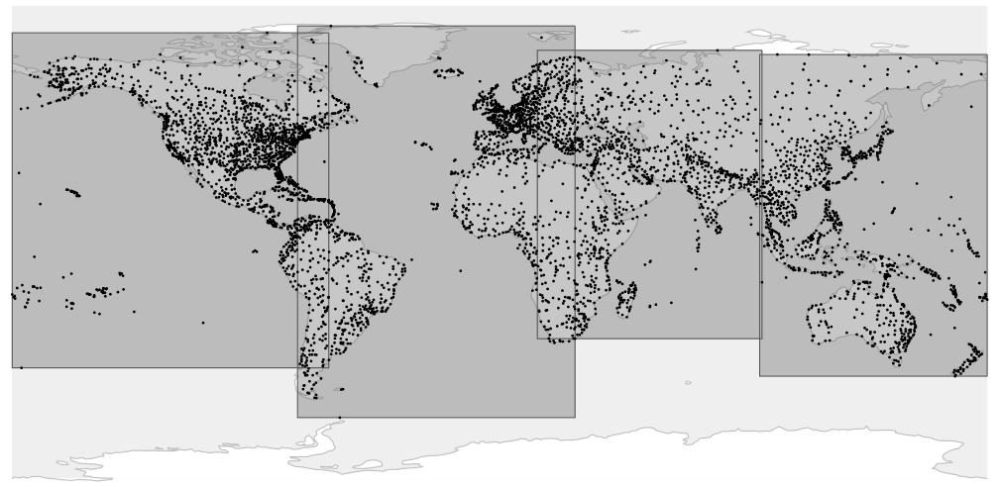

Ở tầng tiếp theo, các hình chữ nhật lớn được tách thành những hình nhỏ hơn:

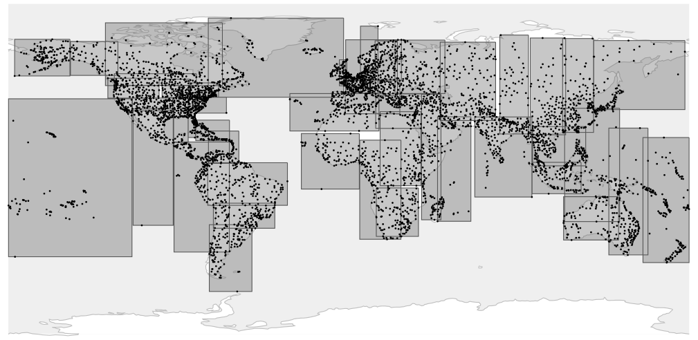

Cuối cùng, ở tầng trong của cây, mỗi bounding box chứa số điểm nhiều nhất mà một page có thể chứa được:

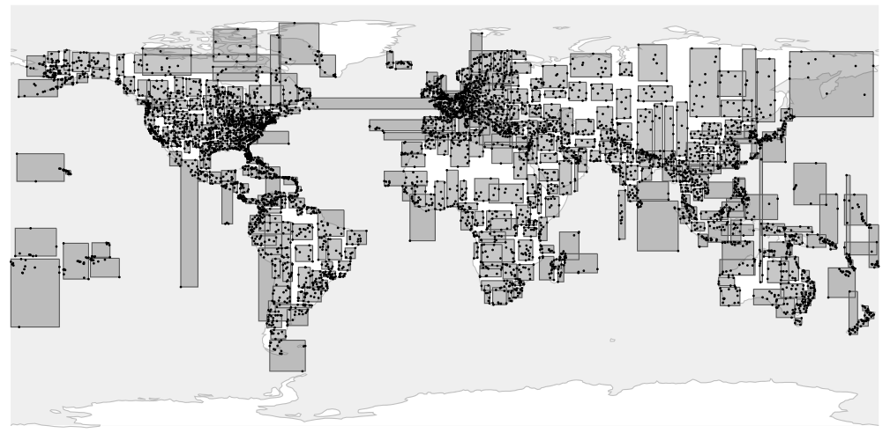

Index này dùng operator class `point_ops`, là operator class duy nhất có sẵn cho điểm.

Hình chữ nhật và mọi đối tượng hình học khác có thể được đánh chỉ mục theo cùng cách, nhưng thay vì chính đối tượng, index phải lưu bounding box của nó.

### Bố cục page (Page Layout)

Bạn có thể nghiên cứu các page GiST bằng extension `pageinspect`. *(v. 14)*

Khác với index B-tree, GiST không có metapage, và page số 0 luôn là gốc của cây. Nếu page gốc bị tách, gốc cũ được chuyển sang một page riêng, và gốc mới chiếm chỗ của nó.

Đây là nội dung của page gốc:

```
=> SELECT ctid, keys
FROM gist_page_items(
  get_raw_page('airports_gist_idx', 0), 'airports_gist_idx'
);
    ctid     |                         keys
-------------+---------------------------------------------------------
 (207,65535) | (coordinates)=((50.84510040283203,78.246101379395))
 (400,65535) | (coordinates)=((179.951004028,73.51780700683594))
 (206,65535) | (coordinates)=((-1.5908199548721313,40.63980103))
 (466,65535) | (coordinates)=((-1.0334999561309814,82.51779937740001))
(4 rows)
```

Bốn dòng này tương ứng với bốn hình chữ nhật ở tầng trên cùng trong hình đầu tiên. Đáng tiếc là ở đây các khoá được hiển thị dưới dạng điểm (điều này hợp lý với leaf page), chứ không phải hình chữ nhật (điều sẽ hợp lý hơn với các inner page). Nhưng ta luôn có thể lấy dữ liệu thô và tự diễn giải.

> Để trích xuất thông tin chi tiết hơn, bạn có thể dùng extension gevel,[^6] vốn không có trong bản phân phối PostgreSQL chuẩn.

### Operator class (Operator Class)

Truy vấn sau trả về danh sách các support function hiện thực logic của các thao tác tìm kiếm và chèn cho cây:[^7]

```
=> SELECT amprocnum, amproc::regproc
FROM pg_am am
  JOIN pg_opclass opc ON opcmethod = am.oid
  JOIN pg_amproc amop ON amprocfamily = opcfamily
WHERE amname = 'gist'
AND opcname = 'point_ops'
ORDER BY amprocnum;
 amprocnum |         amproc
-----------+------------------------
         1 | gist_point_consistent
         2 | gist_box_union
         3 | gist_point_compress
         5 | gist_box_penalty
```

```
         6 | gist_box_picksplit
         7 | gist_box_same
         8 | gist_point_distance
         9 | gist_point_fetch
        11 | gist_point_sortsupport
(9 rows)
```

Tôi đã liệt kê các hàm bắt buộc ở trên:

- **1** — consistency function, dùng để duyệt cây trong quá trình tìm kiếm

- **2** — hàm `union`, gộp các hình chữ nhật

- **5** — hàm `penalty`, dùng để chọn cây con cần đi xuống khi chèn một entry

- **6** — hàm `picksplit`, phân bố các entry giữa các page mới sau khi tách page

- **7** — hàm `same`, kiểm tra hai khoá có bằng nhau hay không

Operator class `point_ops` bao gồm các toán tử sau:

```
=> SELECT amopopr::regoperator, amopstrategy AS st, oprcode::regproc,
  left(obj_description(opr.oid, 'pg_operator'), 19) description
FROM pg_am am
  JOIN pg_opclass opc ON opcmethod = am.oid
  JOIN pg_amop amop ON amopfamily = opcfamily
  JOIN pg_operator opr ON opr.oid = amopopr
WHERE amname = 'gist'
AND opcname = 'point_ops'
ORDER BY amopstrategy;
      amopopr      | st |      oprcode       |     description
-------------------+----+---------------------+---------------------
 <<(point,point)   |  1 | point_left         | is left of
 >>(point,point)   |  5 | point_right        | is right of
 ~=(point,point)   |  6 | point_eq           | same as
 <<|(point,point)  | 10 | point_below        | is below
 |>>(point,point)  | 11 | point_above        | is above
 <->(point,point)  | 15 | point_distance     | distance between
 <@(point,box)     | 28 | on_pb              | point inside box
 <^(point,point)   | 29 | point_below        | deprecated, use <<|
 >^(point,point)   | 30 | point_above        | deprecated, use |>>
 <@(point,polygon) | 48 | pt_contained_poly  | is contained by
 <@(point,circle)  | 68 | pt_contained_circle | is contained by
(11 rows)
```

Tên toán tử thường không cho ta biết nhiều về ngữ nghĩa của toán tử, nên truy vấn này cũng hiển thị tên các hàm bên dưới và phần mô tả của chúng. Bằng cách này hay cách khác, tất cả các toán tử đều liên quan đến vị trí tương đối giữa các đối tượng hình học (*left of* — bên trái, *right of* — bên phải, *above* — bên trên, *below* — bên dưới, *contains* — chứa, *is contained* — được chứa) và khoảng cách giữa chúng.

So với B-tree, GiST cung cấp nhiều strategy hơn. Một số số hiệu strategy là chung cho nhiều loại index,[^8] trong khi những số khác được tính theo công thức (ví dụ, 28, 48 và 68 thực chất biểu diễn cùng một strategy: *is contained* cho hình chữ nhật, đa giác và hình tròn). Ngoài ra, GiST hỗ trợ một số tên toán tử đã lỗi thời (`<<|` và `|>>`).

Các operator class có thể chỉ hiện thực một phần các strategy có sẵn. Ví dụ, strategy *contains* không được operator class cho điểm hỗ trợ, nhưng nó có trong các class được định nghĩa cho những đối tượng hình học có diện tích đo được (`box_ops`, `poly_ops` và `circle_ops`).

### Tìm các phần tử được chứa (Search for Contained Elements)

Một truy vấn điển hình có thể được tăng tốc bằng index là truy vấn trả về tất cả các điểm thuộc một vùng xác định.

Ví dụ, hãy tìm tất cả các sân bay nằm trong phạm vi một độ tính từ trung tâm Moscow:

```
=> SELECT airport_code, airport_name->>'en'
FROM airports_big
WHERE coordinates <@ '<(37.622513,55.753220),1.0>'::circle;
 airport_code |             ?column?
--------------+------------------------------------
 SVO          | Sheremetyevo International Airport
 VKO          | Vnukovo International Airport
 DME          | Domodedovo International Airport
 BKA          | Bykovo Airport
 ZIA          | Zhukovsky International Airport
 CKL          | Chkalovskiy Air Base
 OSF          | Ostafyevo International Airport
(7 rows)
=> EXPLAIN (costs off) SELECT airport_code
FROM airports_big
WHERE coordinates <@ '<(37.622513,55.753220),1.0>'::circle;
                            QUERY PLAN
---------------------------------------------------------------------
 Bitmap Heap Scan on airports_big
   Recheck Cond: (coordinates <@ '<(37.622513,55.75322),1>'::circle)
   -> Bitmap Index Scan on airports_gist_idx
       Index Cond: (coordinates <@ '<(37.622513,55.75322),1>'::ci...
(4 rows)
```

Ta có thể xem xét kỹ hơn toán tử này qua một ví dụ đơn giản được minh hoạ trong hình dưới đây:

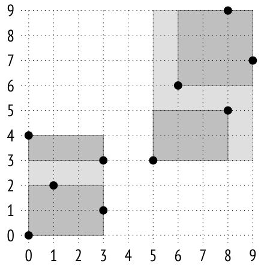

Nếu các bounding box được chọn theo cách này, cấu trúc index sẽ như sau:

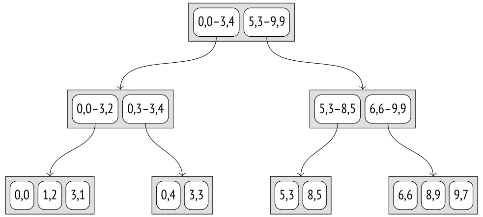

Toán tử *contains* `<@` xác định xem một điểm cụ thể có nằm bên trong hình chữ nhật đã cho hay không. Consistency function của toán tử này[^9] trả về "có" nếu hình chữ nhật của index entry có bất kỳ điểm chung nào với hình chữ nhật này. Điều đó có nghĩa là với các entry ở leaf node, vốn lưu các hình chữ nhật đã thu nhỏ thành điểm, hàm này xác định xem điểm có nằm bên trong hình chữ nhật đã cho hay không.

Ví dụ, hãy tìm các điểm nằm bên trong hình chữ nhật `(1,2)–(4,7)`, được tô gạch trong hình dưới đây:

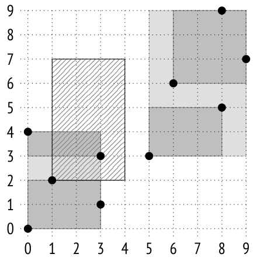

Việc tìm kiếm bắt đầu từ nút gốc. Bounding box chồng lấn với `(0,0)–(3,4)`, nhưng không chồng lấn với `(5,3)–(9,9)`. Điều đó có nghĩa là ta không phải đi xuống cây con thứ hai.

Ở tầng tiếp theo, bounding box chồng lấn với `(0,3)–(3,4)` và chạm vào `(0,0)–(3,2)`, nên ta phải kiểm tra cả hai cây con.

Khi đã đến các leaf node, ta chỉ cần duyệt qua tất cả các điểm mà chúng chứa và trả về những điểm thoả mãn consistency function.

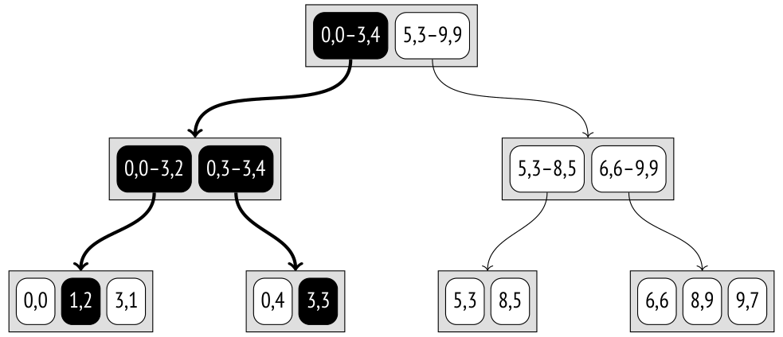

Việc tìm kiếm trên B-tree luôn chọn đúng một nút con. Tuy nhiên, việc tìm kiếm trên GiST có thể phải quét nhiều cây con, đặc biệt nếu các bounding box của chúng chồng lấn nhau.

### Tìm láng giềng gần nhất (Nearest Neighbor Search)

Phần lớn các toán tử được index hỗ trợ (chẳng hạn `=` hoặc `<@` trong ví dụ trước) thường được gọi là toán tử *search* (tìm kiếm), vì chúng định nghĩa các điều kiện tìm kiếm trong truy vấn.

Những toán tử như vậy là các predicate, tức là chúng trả về một giá trị logic.

Nhưng cũng có một nhóm toán tử *ordering* (sắp thứ tự), trả về khoảng cách giữa các đối số. Những toán tử này được dùng trong mệnh đề `ORDER BY` và thường được hỗ trợ bởi các index có thuộc tính `DISTANCE ORDERABLE`, cho phép bạn nhanh chóng tìm ra một số lượng xác định các láng giềng gần nhất *[→ tr. 327](19-index-access-methods.md)*. Kiểu tìm kiếm này được gọi là *k*-NN, hay tìm *k* láng giềng gần nhất (*k*-nearest neighbor search).

Ví dụ, ta có thể tìm 10 sân bay gần Kostroma nhất:

```
=> SELECT airport_code, airport_name->>'en'
FROM airports_big
ORDER BY coordinates <-> '(40.926780,57.767943)'::point
LIMIT 10;
 airport_code |                   ?column?
--------------+------------------------------------------------
 KMW          | Kostroma Sokerkino Airport
 IAR          | Tunoshna Airport
 IWA          | Ivanovo South Airport
 VGD          | Vologda Airport
 RYB          | Staroselye Airport
 GOJ          | Nizhny Novgorod Strigino International Airport
 CEE          | Cherepovets Airport
 CKL          | Chkalovskiy Air Base
 ZIA          | Zhukovsky International Airport
 BKA          | Bykovo Airport
(10 rows)
```

```
=> EXPLAIN (costs off) SELECT airport_code
FROM airports_big
ORDER BY coordinates <-> '(40.926780,57.767943)'::point
LIMIT 5;
                          QUERY PLAN
-----------------------------------------------------------------
 Limit
   -> Index Scan using airports_gist_idx on airports_big
       Order By: (coordinates <-> '(40.92678,57.767943)'::point)
(3 rows)
```

Vì index scan trả về từng kết quả một và có thể dừng lại bất cứ lúc nào, vài giá trị đầu tiên có thể được tìm ra rất nhanh.

> Sẽ rất khó để đạt được việc tìm kiếm hiệu quả mà không có sự hỗ trợ của index. Ta sẽ phải tìm tất cả các điểm xuất hiện trong một vùng cụ thể rồi mở rộng dần vùng này cho đến khi trả về đủ số lượng kết quả được yêu cầu. Việc đó sẽ đòi hỏi nhiều lần index scan, chưa kể đến bài toán chọn kích thước của vùng ban đầu và các bước tăng của nó.

Bạn có thể xem loại toán tử trong system catalog ("s" là viết tắt của search, "o" biểu thị toán tử ordering):

```
=> SELECT amopopr::regoperator, amoppurpose, amopstrategy
FROM pg_am am
  JOIN pg_opclass opc ON opcmethod = am.oid
  JOIN pg_amop amop ON amopfamily = opcfamily
WHERE amname = 'gist'
AND opcname = 'point_ops'
ORDER BY amopstrategy;
      amopopr      | amoppurpose | amopstrategy
-------------------+-------------+--------------
 <<(point,point)   | s          |            1
 >>(point,point)   | s          |            5
 ~=(point,point)   | s          |            6
 <<|(point,point)  | s          |           10
 |>>(point,point)  | s          |           11
 <->(point,point)  | o          |           15
 <@(point,box)     | s          |           28
 <^(point,point)   | s          |           29
 >^(point,point)   | s          |           30
 <@(point,polygon) | s          |           48
 <@(point,circle)  | s          |           68
(11 rows)
```

Để hỗ trợ những truy vấn như vậy, operator class phải định nghĩa thêm một support function: đó là *distance function* (hàm khoảng cách), được gọi trên index entry để tính khoảng cách từ giá trị lưu trong entry này đến một giá trị khác.

Với một phần tử lá biểu diễn một giá trị được đánh chỉ mục, hàm này phải trả về khoảng cách đến giá trị đó. Trong trường hợp điểm,[^10] đó là khoảng cách Euclid thông thường, bằng √(*x*<sub>2</sub> − *x*<sub>1</sub>)<sup>2</sup> + (*y*<sub>2</sub> − *y*<sub>1</sub>)<sup>2</sup>.

Với một phần tử trong, hàm phải trả về giá trị *nhỏ nhất* trong tất cả các khoảng cách có thể có từ các phần tử lá con của nó. Vì việc quét tất cả các entry con khá tốn kém, hàm có thể đánh giá thấp khoảng cách một cách lạc quan (hy sinh hiệu quả), nhưng nó không bao giờ được trả về giá trị lớn hơn — điều đó sẽ làm hỏng tính đúng đắn của việc tìm kiếm.

Vì vậy, với một phần tử trong được biểu diễn bằng một bounding box, khoảng cách đến điểm được hiểu theo nghĩa toán học thông thường: nó hoặc là khoảng cách nhỏ nhất giữa điểm và hình chữ nhật, hoặc bằng không nếu điểm nằm bên trong hình chữ nhật.[^11] Giá trị này có thể được tính dễ dàng mà không cần duyệt tất cả các điểm con của hình chữ nhật, và nó được đảm bảo không lớn hơn khoảng cách đến bất kỳ điểm nào trong số đó.

Hãy xem xét thuật toán tìm ba láng giềng gần nhất của điểm `(6,8)`:


Việc tìm kiếm bắt đầu từ nút gốc, chứa hai bounding box. Khoảng cách từ điểm đã cho đến hình chữ nhật `(0,0)–(3,4)` được lấy là khoảng cách đến góc `(3,4)` của hình chữ nhật, bằng 5.0. Khoảng cách đến `(5,3)–(9,9)` là 0.0. (Ở đây tôi sẽ làm tròn mọi giá trị đến chữ số thập phân thứ nhất; độ chính xác như vậy là đủ cho ví dụ này.)

Các nút con được duyệt theo thứ tự khoảng cách tăng dần. Vì thế, trước tiên ta đi xuống nút con bên phải, chứa hai hình chữ nhật: `(5,3)–(8,5)` và `(6,6)–(9,9)`. Khoảng cách đến hình thứ nhất là 3.0; khoảng cách đến hình thứ hai là 0.0.

Một lần nữa, ta chọn cây con bên phải và đi vào leaf node chứa ba điểm: `(6,6)` ở khoảng cách 2.0, `(8,9)` ở khoảng cách 2.2, và `(9,7)` ở khoảng cách 3.2.

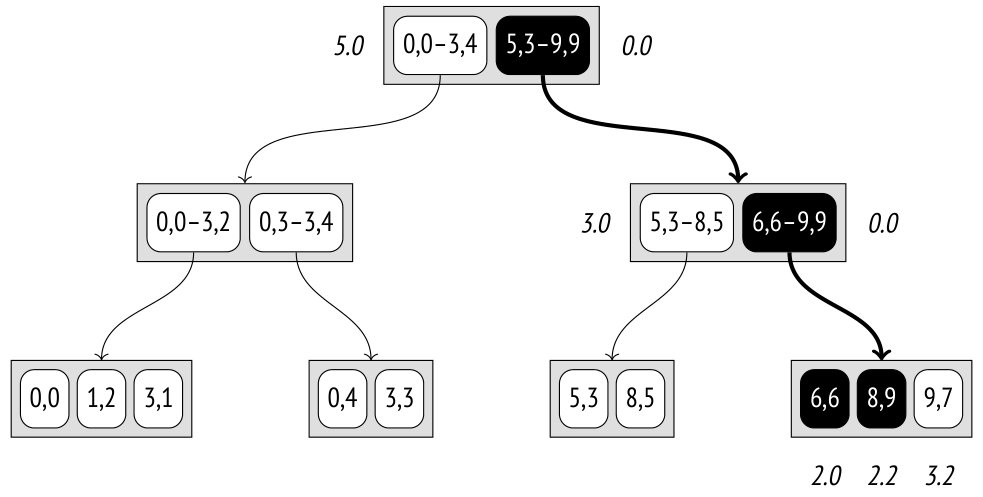

Như vậy, ta đã nhận được hai điểm đầu tiên: `(6,6)` và `(8,9)`. Nhưng khoảng cách đến điểm thứ ba của nút này lớn hơn khoảng cách đến hình chữ nhật `(5,3)–(8,5)`.

Vì thế giờ ta phải đi xuống nút con bên trái, chứa hai điểm. Khoảng cách đến điểm `(8,5)` là 3.6, còn khoảng cách đến `(5,3)` là 5.1. Hoá ra điểm `(9,7)` trong nút con trước đó gần điểm `(6,8)` hơn bất kỳ nút nào của cây con bên trái, nên ta có thể trả nó về làm kết quả thứ ba.

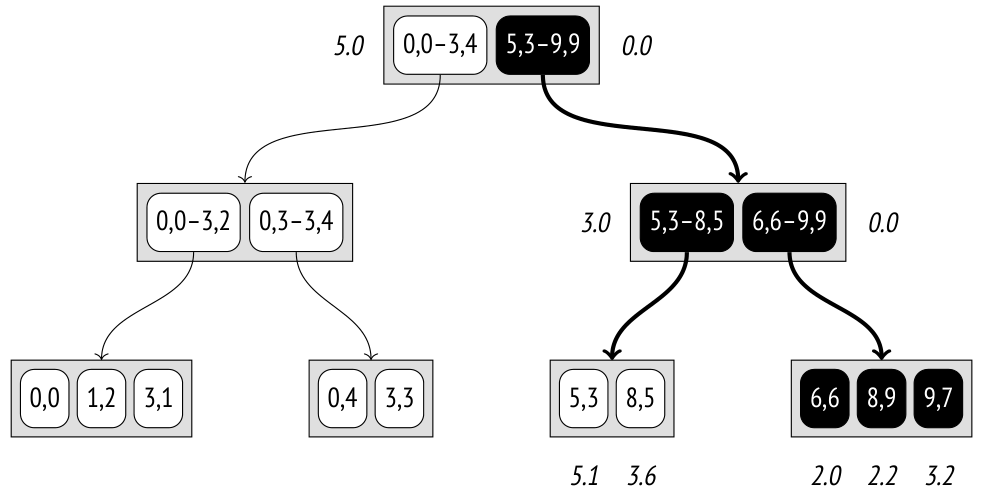

Ví dụ này minh hoạ những yêu cầu mà distance function phải thoả mãn đối với các inner entry. Do khoảng cách bị giảm (3.0 thay vì 3.6) đến hình chữ nhật `(5,3)–(8,5)`, một nút thừa đã phải được quét, nên hiệu quả tìm kiếm giảm đi; tuy nhiên, bản thân thuật toán vẫn đúng.

### Chèn (Insertion)

Khi một khoá mới được chèn vào R-tree, nút được dùng cho khoá này được xác định bởi penalty function: kích thước của bounding box phải tăng ít nhất có thể.[^12]

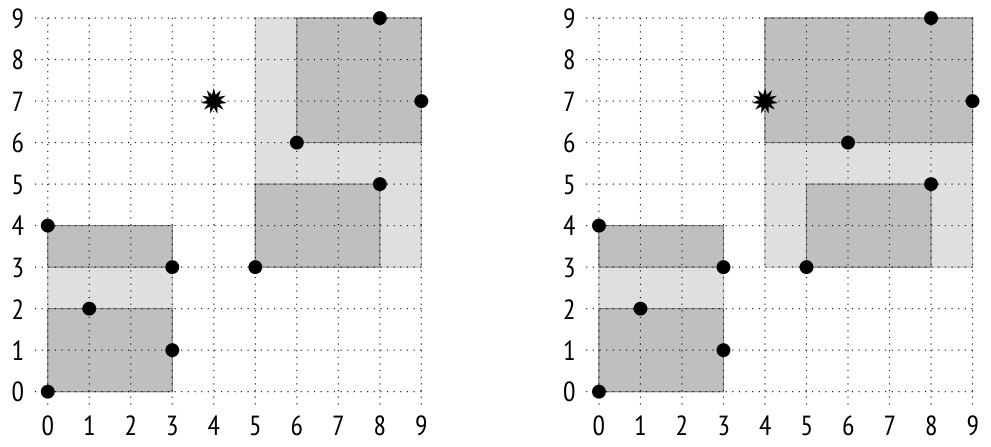

Ví dụ, điểm `(4,7)` sẽ được thêm vào hình chữ nhật `(5,3)–(9,9)` vì diện tích của nó chỉ tăng thêm 6 đơn vị, trong khi hình chữ nhật `(0,0)–(3,4)` sẽ phải tăng thêm 12 đơn vị. Ở tầng tiếp theo (tầng lá), điểm sẽ được thêm vào hình chữ nhật `(6,6)–(9,9)`, theo cùng logic đó.

Giả sử một page chứa tối đa ba phần tử, nó phải được tách làm hai, và các phần tử phải được phân bố giữa các page mới. Trong ví dụ này, kết quả có vẻ hiển nhiên, nhưng trong trường hợp tổng quát, bài toán phân bố dữ liệu không đơn giản như vậy. Trước hết, hàm `picksplit` cố gắng giảm thiểu sự chồng lấn giữa các bounding box, nhắm đến việc thu được các hình chữ nhật nhỏ hơn và sự phân bố đồng đều các điểm giữa các page.[^13]

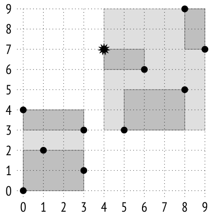

### Exclusion constraint (Exclusion Constraints)

Index GiST cũng có thể được dùng trong exclusion constraint (ràng buộc loại trừ).

Một exclusion constraint đảm bảo rằng các trường được chỉ định của hai heap tuple bất kỳ không khớp với nhau theo nghĩa của một *toán tử* nào đó. Các điều kiện sau phải được thoả mãn:

- Exclusion constraint phải được phương thức đánh chỉ mục hỗ trợ (thuộc tính `CAN EXCLUDE`).

- Toán tử phải thuộc operator class của phương thức đánh chỉ mục này.

- Toán tử phải có tính giao hoán: điều kiện "*a operator b* = *b operator a*" phải đúng.

Với các access method `hash` và `btree` đã xem xét ở trên, toán tử phù hợp duy nhất là *equal to* (bằng). Điều này thực chất biến exclusion constraint thành một ràng buộc unique, vốn không mấy hữu ích *[→ tr. 419](24-hash.md)*.

Phương thức `gist` có thêm hai strategy áp dụng được:

- chồng lấn (overlapping): toán tử `&&`

- kề nhau (adjacency): toán tử `-|-` (được định nghĩa cho các khoảng)

Để thử nghiệm, hãy tạo một ràng buộc cấm đặt các sân bay quá gần nhau. Điều kiện này có thể được phát biểu như sau: các hình tròn có bán kính xác định với tâm nằm tại toạ độ của các sân bay không được chồng lấn nhau:

```
=> ALTER TABLE airports_data ADD EXCLUDE
USING gist (circle(coordinates,0.2) WITH &&);
=> INSERT INTO airports_data(
  airport_code, airport_name, city, coordinates, timezone
) VALUES (
  'ZIA', '{}', '{"en": "Moscow"}', point(38.1517, 55.5533),
  'Europe/Moscow'
);
ERROR:  conflicting key value violates exclusion constraint
"airports_data_circle_excl"
DETAIL:  Key (circle(coordinates, 0.2::double
precision))=(<(38.1517,55.5533),0.2>) conflicts with existing key
(circle(coordinates, 0.2::double
precision))=(<(37.90629959106445,55.40879821777344),0.2>).
```

Khi một exclusion constraint được định nghĩa, một index để thực thi nó được tự động thêm vào. Ở đây đó là một index GiST được xây dựng trên một biểu thức.

Hãy xem một ví dụ phức tạp hơn. Giả sử ta cần cho phép các sân bay ở gần nhau, nhưng chỉ khi chúng thuộc cùng một thành phố. Một giải pháp khả dĩ là định nghĩa một ràng buộc toàn vẹn mới có thể được phát biểu như sau: cấm có các cặp dòng mà các hình tròn *giao nhau* (`&&`) nếu tâm của chúng nằm tại toạ độ các sân bay và các thành phố tương ứng có tên *khác nhau* (`!=`).

Việc cố gắng tạo một ràng buộc như vậy dẫn đến lỗi vì không có operator class nào cho kiểu dữ liệu text:

```
=> ALTER TABLE airports_data
DROP CONSTRAINT airports_data_circle_excl; -- delete old data
=> ALTER TABLE airports_data ADD EXCLUDE USING gist (
  circle(coordinates,0.2) WITH &&,
            (city->>'en') WITH !=
);
ERROR:  data type text has no default operator class for access
method "gist"
HINT:  You must specify an operator class for the index or define a
default operator class for the data type.
```

Tuy nhiên, GiST có cung cấp các strategy như *strictly left of* (hoàn toàn bên trái), *strictly right of* (hoàn toàn bên phải) và *same* (trùng nhau), vốn cũng có thể áp dụng cho các kiểu dữ liệu có thứ tự thông thường, chẳng hạn số hoặc chuỗi văn bản. Extension `btree_gist` được thiết kế riêng để hiện thực sự hỗ trợ GiST cho các phép toán thường được dùng với B-tree:

```
=> CREATE EXTENSION btree_gist;
=> ALTER TABLE airports_data ADD EXCLUDE USING gist (
  circle(coordinates,0.2) WITH &&,
            (city->>'en') WITH !=
);
ALTER TABLE
```

Ràng buộc đã được tạo. Giờ đây ta không thể thêm sân bay Zhukovsky thuộc thị trấn cùng tên vì các sân bay của Moscow ở quá gần:

```
=> INSERT INTO airports_data(
  airport_code, airport_name, city, coordinates, timezone
) VALUES (
  'ZIA', '{}', '{"en": "Zhukovsky"}', point(38.1517, 55.5533),
  'Europe/Moscow'
);
ERROR:  conflicting key value violates exclusion constraint
"airports_data_circle_expr_excl"
DETAIL:  Key (circle(coordinates, 0.2::double precision), (city ->>
'en'::text))=(<(38.1517,55.5533),0.2>, Zhukovsky) conflicts with
existing key (circle(coordinates, 0.2::double precision), (city ->>
'en'::text))=(<(37.90629959106445,55.40879821777344),0.2>, Moscow).
```

Nhưng ta có thể làm được nếu chỉ định Moscow là thành phố của sân bay này:

```
=> INSERT INTO airports_data(
  airport_code, airport_name, city, coordinates, timezone
) VALUES (
  'ZIA', '{}', '{"en": "Moscow"}', point(38.1517, 55.5533),
  'Europe/Moscow'
);
INSERT 0 1
```

Điều quan trọng cần nhớ là mặc dù GiST hỗ trợ các phép toán *greater than* (lớn hơn), *less than* (nhỏ hơn) và *equal to* (bằng), B-tree hiệu quả hơn nhiều về mặt này, đặc biệt khi truy cập một khoảng giá trị. Vì vậy, chỉ nên dùng thủ thuật với extension `btree_gist` như trên nếu index GiST thực sự cần thiết vì những lý do chính đáng khác.

### Các thuộc tính (Properties)

**Access method properties.** Đây là các thuộc tính của phương thức `gist`:

```
=> SELECT a.amname, p.name, pg_indexam_has_property(a.oid, p.name)
FROM pg_am a, unnest(array[
  'can_order', 'can_unique', 'can_multi_col',
  'can_exclude', 'can_include'
]) p(name)
WHERE a.amname = 'gist';
 amname |     name     | pg_indexam_has_property
--------+---------------+-------------------------
 gist   | can_order    | f
 gist   | can_unique   | f
 gist   | can_multi_col | t
 gist   | can_exclude  | t
 gist   | can_include  | t
(5 rows)
```

Ràng buộc unique và sắp xếp không được hỗ trợ.

Một index GiST có thể được tạo với các cột `INCLUDE` bổ sung. *(v. 12)*

Như ta đã biết, ta có thể xây dựng index trên nhiều cột, cũng như dùng nó trong các ràng buộc toàn vẹn.

**Index-level properties.** Các thuộc tính này được định nghĩa ở cấp index:

```
=>  SELECT p.name, pg_index_has_property('airports_gist_idx', p.name)
FROM unnest(array[
  'clusterable', 'index_scan', 'bitmap_scan', 'backward_scan'
]) p(name);
     name      | pg_index_has_property
---------------+-----------------------
 clusterable   | t
 index_scan    | t
 bitmap_scan   | t
 backward_scan | f
(4 rows)
```

Index GiST có thể được dùng để cluster hoá (clusterization).

Về các phương thức truy xuất dữ liệu, cả index scan thông thường (từng dòng một) lẫn bitmap scan đều được hỗ trợ. Tuy nhiên, không được phép quét ngược index GiST.

**Column-level properties.** Phần lớn các thuộc tính cột được định nghĩa ở cấp access method, và chúng không thay đổi:

```
=> SELECT p.name,
  pg_index_column_has_property('airports_gist_idx', 1, p.name)
FROM unnest(array[
  'orderable', 'search_array', 'search_nulls'
]) p(name);
```

```
     name     | pg_index_column_has_property
--------------+------------------------------
 orderable    | f
 search_array | f
 search_nulls | t
(3 rows)
```

Tất cả các thuộc tính liên quan đến sắp xếp đều bị tắt.

Giá trị NULL được cho phép, nhưng GiST xử lý chúng không thực sự hiệu quả. Người ta giả định rằng giá trị NULL không làm tăng bounding box; những giá trị này được chèn vào các cây con ngẫu nhiên, nên phải tìm chúng trên toàn bộ cây.

Tuy nhiên, có một vài thuộc tính cấp cột phụ thuộc vào operator class cụ thể:

```
=> SELECT p.name,
  pg_index_column_has_property('airports_gist_idx', 1, p.name)
FROM unnest(array[
   'returnable', 'distance_orderable'
]) p(name);
        name        | pg_index_column_has_property
--------------------+------------------------------
 returnable         | t
 distance_orderable | t
(2 rows)
```

Index-only scan được cho phép, vì các leaf node giữ đầy đủ khoá index.

Như ta đã thấy ở trên, operator class này cung cấp toán tử khoảng cách cho việc tìm láng giềng gần nhất. Khoảng cách đến một giá trị NULL được coi là NULL; những giá trị như vậy được trả về sau cùng (tương tự mệnh đề `NULLS LAST` trong B-tree).

Tuy nhiên, không có toán tử khoảng cách cho các range type (kiểu khoảng — vốn biểu diễn các đoạn, tức là các đối tượng hình học tuyến tính chứ không phải có diện tích), nên thuộc tính này khác đi đối với index được xây dựng cho những kiểu như vậy:

```
=> CREATE TABLE reservations(during tsrange);
=> CREATE INDEX ON reservations USING gist(during);
=> SELECT p.name,
  pg_index_column_has_property('reservations_during_idx', 1, p.name)
FROM unnest(array[
   'returnable', 'distance_orderable'
]) p(name);
```

```
        name        | pg_index_column_has_property
--------------------+------------------------------
 returnable         | t
 distance_orderable | f
(2 rows)
```

## 26.3 RD-Tree cho tìm kiếm toàn văn (RD-Trees for Full-Text Search)

### Về tìm kiếm toàn văn (About Full-Text Search)

Mục tiêu của tìm kiếm toàn văn (full-text search)[^14] là chọn ra từ tập hợp đã cho những *văn bản* (document) khớp với *truy vấn tìm kiếm* (search query).

Để có thể được tìm kiếm, văn bản được chuyển sang kiểu `tsvector`, chứa các *lexeme* (từ vị) và vị trí của chúng trong văn bản. Lexeme là các từ đã được chuyển sang một định dạng phù hợp cho tìm kiếm. Theo mặc định, mọi từ đều được chuẩn hoá thành chữ thường, và phần đuôi của chúng bị cắt bỏ:

```
=> SET default_text_search_config = english;
=> SELECT to_tsvector(
  'No one can tell me, nobody knows, ' ||
  'Where the wind comes from, where the wind goes.'
);
                            to_tsvector
----------------------------------------------------------------------
 'come':11 'goe':16 'know':7 'nobodi':6 'one':2 'tell':4 'wind':10,15
(1 row)
```

Các stop word (từ dừng, như "the" hay "from") bị lọc bỏ: người ta giả định rằng chúng xuất hiện quá thường xuyên để việc tìm kiếm có thể trả về kết quả nào có ý nghĩa cho chúng. Đương nhiên, tất cả các phép biến đổi này đều có thể cấu hình được.

Truy vấn tìm kiếm được biểu diễn bằng một kiểu khác: `tsquery`. Bất kỳ truy vấn nào cũng bao gồm một hoặc nhiều lexeme được nối bởi các liên từ logic: `&` (AND), `|` (OR), `!` (NOT). Bạn cũng có thể dùng dấu ngoặc đơn để xác định độ ưu tiên của toán tử.

```
=> SELECT to_tsquery('wind & (comes | goes)');
         to_tsquery
-----------------------------
 'wind' & ( 'come' | 'goe' )
(1 row)
```

Toán tử duy nhất được dùng cho tìm kiếm toàn văn là *match operator* (toán tử khớp) `@@`:

```
=> SELECT amopopr::regoperator, oprcode::regproc, amopstrategy
FROM pg_am am
  JOIN pg_opclass opc ON opcmethod = am.oid
  JOIN pg_amop amop ON amopfamily = opcfamily
  JOIN pg_operator opr ON opr.oid = amopopr
WHERE amname = 'gist'
AND opcname = 'tsvector_ops'
ORDER BY amopstrategy;
       amopopr        |  oprcode   | amopstrategy
----------------------+-------------+--------------
 @@(tsvector,tsquery) | ts_match_vq |           1
(1 row)
```

Toán tử này xác định xem văn bản có thoả mãn truy vấn hay không. Đây là một ví dụ:

```
=> SELECT to_tsvector('Where the wind comes from, where the wind goes')
  @@ to_tsquery('wind & coming');
 ?column?
----------
 t
(1 row)
```

Đây hoàn toàn không phải là một mô tả đầy đủ về tìm kiếm toàn văn, nhưng thông tin này đủ để hiểu những nguyên lý cơ bản của việc đánh chỉ mục *[→ tr. 493](28-gin.md)*.

### Đánh chỉ mục dữ liệu tsvector (Indexing tsvector Data)

Để hoạt động nhanh, tìm kiếm toàn văn phải được hỗ trợ bởi index.[^15] Vì thứ được đánh chỉ mục không phải bản thân các văn bản mà là các giá trị `tsvector` *[→ tr. 493](28-gin.md)*, ở đây bạn có hai lựa chọn: hoặc xây dựng index trên một biểu thức và thực hiện chuyển kiểu, hoặc thêm một cột riêng kiểu `tsvector` và đánh chỉ mục cột này. Lợi ích của cách thứ nhất là nó không tốn chỗ để lưu các giá trị `tsvector`, vốn thực ra không cần đến. Nhưng nó chậm hơn cách thứ hai, vì indexing engine phải kiểm tra lại (recheck) tất cả các heap tuple do access method trả về. Điều đó có nghĩa là giá trị `tsvector` phải được tính lại cho mỗi dòng được kiểm tra lại, và như ta sẽ sớm thấy, GiST kiểm tra lại tất cả các dòng.

Hãy dựng một ví dụ đơn giản. Ta sẽ tạo một bảng hai cột: cột thứ nhất lưu văn bản, còn cột thứ hai chứa giá trị `tsvector`. Ta có thể dùng trigger để cập nhật cột thứ hai,[^16] nhưng tiện hơn là đơn giản khai báo[^17] cột này là cột generated (được sinh tự động): *(v. 12)*

```
=> CREATE TABLE ts(
  doc text,
  doc_tsv tsvector GENERATED ALWAYS AS (
    to_tsvector('pg_catalog.english', doc)
  ) STORED
);
=> CREATE INDEX ts_gist_idx ON ts
USING gist(doc_tsv);
```

> Trong các ví dụ trên, tôi đã dùng hàm to_tsvector với một đối số duy nhất, sau khi đặt tham số *default_text_search_config* để xác định *cấu hình* tìm kiếm toàn văn *(mặc định: english)*. Nhóm volatility (tính biến động) của biến thể hàm này là STABLE, vì nó ngầm phụ thuộc vào giá trị tham số. Nhưng ở đây tôi áp dụng một biến thể khác, định nghĩa cấu hình một cách tường minh; biến thể này là IMMUTABLE và có thể được dùng trong các biểu thức sinh (generation expression).

Hãy chèn vài dòng:

```
=> INSERT INTO ts(doc) VALUES
  ('Old MacDonald had a farm'),   ('And on his farm he had some cows'),
  ('Here a moo, there a moo'),    ('Everywhere a moo moo'),
  ('Old MacDonald had a farm'),   ('And on his farm he had some chicks'),
  ('Here a cluck, there a cluck'), ('Everywhere a cluck cluck'),
  ('Old MacDonald had a farm'),   ('And on his farm he had some pigs'),
  ('Here an oink, there an oink'), ('Everywhere an oink oink')
RETURNING doc_tsv;
            doc_tsv
--------------------------------
 'farm':5 'macdonald':2 'old':1
 'cow':8 'farm':4
 'moo':3,6
 'everywher':1 'moo':3,4
 'farm':5 'macdonald':2 'old':1
 'chick':8 'farm':4
 'cluck':3,6
 'cluck':3,4 'everywher':1
 'farm':5 'macdonald':2 'old':1
 'farm':4 'pig':8
 'oink':3,6
 'everywher':1 'oink':3,4
(12 rows)
INSERT 0 12
```

Như vậy, R-tree không phù hợp để đánh chỉ mục văn bản, vì khái niệm bounding box chẳng có ý nghĩa gì với chúng. Do đó, người ta dùng biến thể RD-tree (Russian Doll — búp bê Nga) của nó. Thay vì bounding box, cây như vậy dùng một *bounding set* (tập bao), tức là một tập hợp chứa tất cả các phần tử của các tập con của nó. Với tìm kiếm toàn văn, tập như vậy chứa các lexeme của văn bản, nhưng trong trường hợp tổng quát, bounding set có thể là tuỳ ý.

Có vài cách để biểu diễn bounding set trong index entry. Cách đơn giản nhất là liệt kê tất cả các phần tử của tập hợp.

Đây là hình dạng có thể của nó:

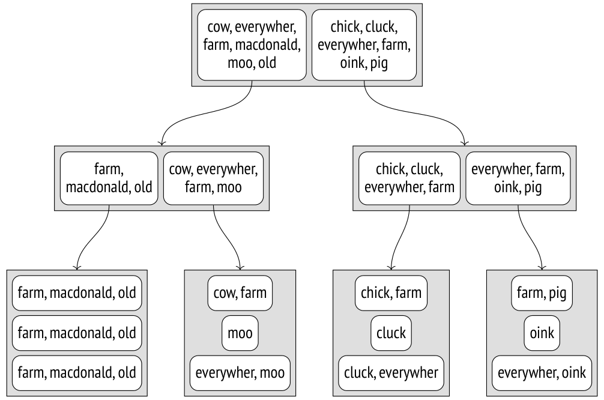

Để tìm các văn bản thoả mãn điều kiện `DOC_TSV @@ TO_TSQUERY(’COW’)`, ta cần đi xuống những nút mà các entry con của chúng được biết là chứa lexeme "cow".

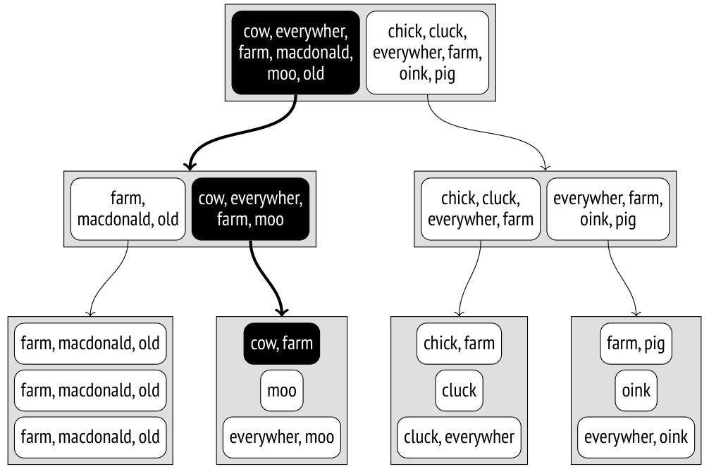

Những vấn đề của cách biểu diễn này là hiển nhiên. Số lượng lexeme trong một văn bản có thể rất lớn, trong khi kích thước page có giới hạn. Ngay cả khi mỗi văn bản riêng lẻ không có quá nhiều lexeme khác nhau, hợp của chúng ở các tầng trên của cây vẫn có thể trở nên quá lớn.

Tìm kiếm toàn văn dùng một giải pháp khác, cụ thể là một *signature tree* (cây chữ ký) gọn hơn. Nó hẳn rất quen thuộc với bất kỳ ai từng làm việc với Bloom filter. *[→ tr. 536](29-brin.md)*

Mỗi lexeme có thể được biểu diễn bằng *signature* (chữ ký) của nó: một chuỗi bit có độ dài xác định, trong đó chỉ một bit được đặt bằng 1. Bit cần được đặt được xác định bởi hàm băm của lexeme.

Signature của một văn bản là kết quả của phép `OR` theo bit trên signature của tất cả các lexeme trong văn bản này.

Giả sử ta đã gán các signature sau cho các lexeme của mình:

| lexeme | signature |
|---|---|
| chick | 1000000 |
| cluck | 0001000 |
| cow | 0000010 |
| everywher | 0010000 |
| farm | 0000100 |
| macdonald | 0100000 |
| moo | 0000100 |
| oink | 0000010 |
| old | 0000001 |
| pig | 0010000 |

Khi đó signature của các văn bản sẽ như sau:

| văn bản | signature |
|---|---|
| Old MacDonald had a farm | 0100101 |
| And on his farm he had some cows | 0000110 |
| Here a moo, there a moo | 0000100 |
| Everywhere a moo moo | 0010100 |
| And on his farm he had some chicks | 1000100 |
| Here a cluck, there a cluck | 0001000 |
| Everywhere a cluck cluck | 0011000 |
| And on his farm he had some pigs | 0010100 |
| Here an oink, there an oink | 0000010 |
| Everywhere an oink oink | 0010010 |

Ưu điểm của cách tiếp cận này là hiển nhiên: các index entry có cùng kích thước, và kích thước đó khá nhỏ, nên index trở nên khá gọn. Nhưng cũng có một số nhược điểm. Trước hết, không thể thực hiện index-only scan vì index không còn lưu khoá index nữa, và mỗi TID được trả về phải được kiểm tra lại bằng bảng. Độ chính xác cũng bị ảnh hưởng: index có thể trả về nhiều false positive (dương tính giả), vốn phải được lọc bỏ trong quá trình kiểm tra lại.

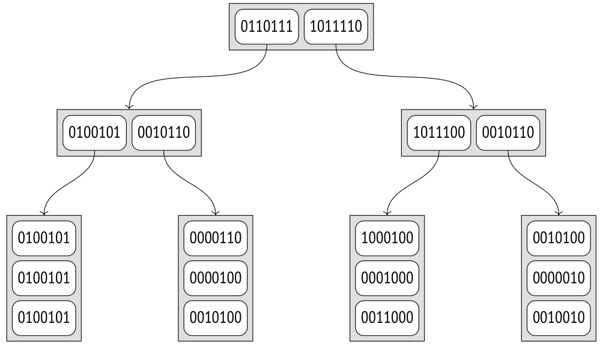

Hãy xem lại điều kiện `DOC_TSV @@ TO_TSQUERY(’COWS’)`. Signature của truy vấn được tính theo cùng cách như signature của văn bản; trong trường hợp cụ thể này nó bằng `0000010`. Consistency function[^18] phải tìm tất cả các nút con có cùng các bit được đặt trong signature của chúng:

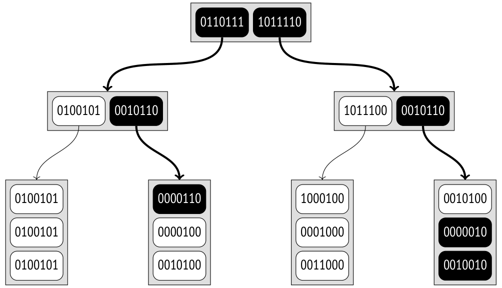

So với ví dụ trước, ở đây phải quét nhiều nút hơn do các lần trúng false positive. Vì dung lượng của signature có giới hạn, một số lexeme trong một tập lớn chắc chắn sẽ có cùng signature. Trong ví dụ này, các lexeme như vậy là "cow" và "oink". Điều đó có nghĩa là một signature có thể khớp với các văn bản khác nhau; ở đây signature của truy vấn tương ứng với ba văn bản.

False positive làm giảm hiệu quả của index nhưng hoàn toàn không ảnh hưởng đến tính đúng đắn của nó: vì false negative (âm tính giả) được đảm bảo là bị loại trừ, giá trị cần tìm không thể bị bỏ sót.

Rõ ràng là trên thực tế kích thước signature lớn hơn. Theo mặc định, nó chiếm 124 byte (992 bit), nên xác suất xung đột thấp hơn nhiều so với ví dụ này. Nếu cần, bạn có thể tăng thêm kích thước signature lên đến khoảng 2000 byte bằng *operator class parameter* (tham số của operator class) *(v. 13)*:

```
CREATE INDEX ... USING gist(column tsvector_ops(siglen = 1024));
```

Ngoài ra, nếu các giá trị đủ nhỏ (nhỏ hơn một chút so với 1/16 page, tức khoảng 500 byte đối với page tiêu chuẩn),[^19] thì operator class `tsvector_ops` giữ chính các giá trị `tsvector` chứ không phải signature của chúng trong các leaf page của index.

Để xem việc đánh chỉ mục hoạt động thế nào trên dữ liệu thực, ta có thể lấy kho lưu trữ mailing list pgsql-hackers.[^20] Nó chứa 356,125 email cùng với ngày gửi, tiêu đề, tên tác giả và nội dung thư.

Hãy thêm một cột kiểu `tsvector` và xây dựng index. Ở đây tôi kết hợp ba giá trị (tiêu đề, tác giả và nội dung thư) thành một vector duy nhất để cho thấy rằng văn bản có thể được sinh động và không nhất thiết phải được lưu trong một cột duy nhất.

```
=> ALTER TABLE mail_messages ADD COLUMN tsv tsvector
GENERATED ALWAYS AS ( to_tsvector(
  'pg_catalog.english', subject||' '||author||' '||body_plain
) ) STORED;
NOTICE:  word is too long to be indexed
DETAIL:  Words longer than 2047 characters are ignored.
 ...
NOTICE:  word is too long to be indexed
DETAIL:  Words longer than 2047 characters are ignored.
ALTER TABLE
```

```
=> CREATE INDEX mail_gist_idx ON mail_messages USING gist(tsv);
=> SELECT pg_size_pretty(pg_relation_size('mail_gist_idx'));
 pg_size_pretty
----------------
 127 MB
(1 row)
```

Trong khi cột được điền dữ liệu, một số từ dài nhất đã bị lọc bỏ vì kích thước của chúng. Nhưng một khi index đã sẵn sàng, nó có thể được dùng trong các truy vấn tìm kiếm:

```
=> EXPLAIN (analyze, costs off, timing off, summary off)
SELECT *
FROM mail_messages
WHERE tsv @@ to_tsquery('magic & value');
                       QUERY PLAN
----------------------------------------------------------
 Index Scan using mail_gist_idx on mail_messages
   (actual rows=898 loops=1)
   Index Cond: (tsv @@ to_tsquery('magic & value'::text))
   Rows Removed by Index Recheck: 7859
(4 rows)
```

Cùng với 898 dòng thoả mãn điều kiện, access method còn trả về 7859 dòng mà sau đó bị lọc bỏ khi kiểm tra lại. Nếu ta tăng dung lượng signature, độ chính xác (và do đó, hiệu quả của index) sẽ được cải thiện, nhưng kích thước index sẽ tăng lên:

```
=> DROP INDEX mail_messages_tsv_idx;
=> CREATE INDEX ON mail_messages
USING gist(tsv tsvector_ops(siglen=248));
=> SELECT pg_size_pretty(pg_relation_size('mail_messages_tsv_idx'));
 pg_size_pretty
----------------
 139 MB
(1 row)
=> EXPLAIN (analyze, costs off, timing off, summary off)
SELECT *
FROM mail_messages
WHERE tsv @@ to_tsquery('magic & value');
                       QUERY PLAN
----------------------------------------------------------
 Index Scan using mail_messages_tsv_idx on mail_messages
   (actual rows=898 loops=1)
   Index Cond: (tsv @@ to_tsquery('magic & value'::text))
   Rows Removed by Index Recheck: 2060
(4 rows)
```

### Các thuộc tính (Properties)

Tôi đã trình bày các thuộc tính của access method, và phần lớn chúng giống nhau cho mọi operator class *[→ tr. 459](26-gist.md)*. Nhưng hai thuộc tính cấp cột sau đây đáng được nhắc đến:

```
=> SELECT p.name,
  pg_index_column_has_property('mail_messages_tsv_idx', 1, p.name)
FROM unnest(array[
   'returnable', 'distance_orderable'
]) p(name);
```

```
        name        | pg_index_column_has_property
--------------------+------------------------------
 returnable         | f
 distance_orderable | f
(2 rows)
```

Index-only scan giờ đây không thể thực hiện được, vì giá trị gốc không thể được khôi phục từ signature của nó. Điều này hoàn toàn ổn trong trường hợp cụ thể này: giá trị `tsvector` chỉ được dùng để tìm kiếm, còn thứ ta cần truy xuất là chính văn bản.

Toán tử ordering cho class `tsvector_ops` cũng không được định nghĩa.

## 26.4 Các kiểu dữ liệu khác (Other Data Types)

Tôi mới chỉ xem xét hai ví dụ nổi bật nhất. Chúng cho thấy rằng mặc dù phương thức GiST dựa trên một cây cân bằng, nó có thể được dùng cho nhiều kiểu dữ liệu khác nhau nhờ các cách hiện thực support function khác nhau trong các operator class khác nhau. Khi nói về một index GiST, ta phải luôn chỉ rõ operator class, vì nó có ý nghĩa quyết định đối với các thuộc tính của index.

Dưới đây là một vài kiểu dữ liệu khác hiện được access method GiST hỗ trợ.

**Geometric data types.** Ngoài điểm, GiST có thể đánh chỉ mục các đối tượng hình học khác: hình chữ nhật, hình tròn, đa giác. Với mục đích này, tất cả các đối tượng đó đều được biểu diễn bằng bounding box của chúng.

Extension `cube` thêm kiểu dữ liệu cùng tên biểu diễn các khối lập phương nhiều chiều. Chúng được đánh chỉ mục bằng R-tree với các bounding box có số chiều tương ứng.

**Range types.** PostgreSQL cung cấp vài range type (kiểu khoảng) dạng số và thời gian có sẵn, chẳng hạn `int4range` và `tstzrange`.[^21] Các range type tuỳ chỉnh có thể được định nghĩa bằng lệnh `CREATE TYPE AS RANGE`.

Mọi range type, cả chuẩn lẫn tuỳ chỉnh, đều được GiST hỗ trợ thông qua operator class `range_ops`.[^22] Để đánh chỉ mục, người ta áp dụng R-tree một chiều: trong trường hợp này các bounding box được chuyển thành các đoạn bao (bounding segment).

Các multirange type cũng được hỗ trợ; chúng dựa vào class `multirange_ops` *(v. 14)*. Một khoảng bao (bounding range) bao gồm tất cả các khoảng là thành phần của một giá trị multirange.

Extension `seg` cung cấp kiểu dữ liệu cùng tên cho các khoảng có cận được xác định với một độ chính xác cụ thể. Nó không được coi là một range type, nhưng thực chất là vậy, nên nó được đánh chỉ mục theo đúng cách tương tự.

**Ordinal types.** Hãy nhắc lại extension `btree_gist` một lần nữa: nó cung cấp các operator class cho phương thức GiST để hỗ trợ nhiều kiểu dữ liệu có thứ tự khác nhau, vốn thường được đánh chỉ mục bằng B-tree. Những operator class như vậy có thể được dùng để xây dựng index nhiều cột khi kiểu dữ liệu ở một trong các cột không được B-tree hỗ trợ.

**Network address types.** Kiểu dữ liệu `inet` có sẵn sự hỗ trợ GiST, được hiện thực thông qua operator class `inet_ops`[^23].

**Integer arrays.** Extension `intarray` mở rộng chức năng của mảng số nguyên để bổ sung hỗ trợ GiST cho chúng. Có hai operator class. Với các mảng nhỏ, bạn có thể dùng `gist__int_ops`, hiện thực RD-tree với biểu diễn đầy đủ các khoá trong index entry. Các mảng lớn sẽ hưởng lợi từ signature RD-tree gọn hơn nhưng kém chính xác hơn, dựa trên operator class `gist__bigint_ops`.

> Các dấu gạch dưới thừa trong tên các operator class thuộc về tên của mảng các kiểu cơ bản. Chẳng hạn, bên cạnh cách viết int4[] phổ biến hơn, một mảng số nguyên có thể được ký hiệu là _int4. Tuy nhiên, không có kiểu _int và _bigint nào cả.

**Ltree.** Extension `ltree` thêm kiểu dữ liệu cùng tên cho các cấu trúc dạng cây có nhãn. Sự hỗ trợ GiST được cung cấp thông qua signature RD-tree, dùng operator class `gist_ltree_ops` cho các giá trị `ltree` và operator class `gist__ltree_ops` cho các mảng kiểu `ltree`.

**Key–value storage.** Extension `hstore` cung cấp kiểu dữ liệu `hstore` để lưu các cặp khoá–giá trị. Operator class `gist_hstore_ops` hiện thực sự hỗ trợ index dựa trên signature RD-tree.

**Trigrams.** Extension `pg_trgm` thêm class `gist_trgm_ops`, hiện thực sự hỗ trợ index cho việc so sánh chuỗi văn bản và tìm kiếm với ký tự đại diện (wildcard) *[→ tr. 507](28-gin.md)*.

[^1]: postgresql.org/docs/14/gist.html  
backend/access/gist/README
[^2]: backend/access/gist/gistget.c, hàm gistgettuple
[^3]: backend/access/gist/gistutil.c, hàm gistchoose
[^4]: backend/access/gist/gistsplit.c, hàm gistSplitByKey
[^5]: Bạn có thể tải file tương ứng tại edu.postgrespro.ru/internals-14/extra_airports.copy (tôi đã dùng  
dữ liệu có trên website openflights.org).
[^6]: sigaev.ru/git/gitweb.cgi?p=gevel.git
[^7]: postgresql.org/docs/14/gist-extensibility.html
[^8]: include/access/stratnum.h
[^9]: backend/access/gist/gistproc.c, hàm gist_point_consistent
[^10]: backend/utils/adt/geo_ops.c, hàm point_distance
[^11]: backend/utils/adt/geo_ops.c, hàm box_closest_point
[^12]: backend/access/gist/gistproc.c, hàm gist_box_penalty
[^13]: backend/access/gist/gistproc.c, hàm gist_box_picksplit
[^14]: postgresql.org/docs/14/textsearch.html
[^15]: postgresql.org/docs/14/textsearch-indexes.html
[^16]: postgresql.org/docs/14/textsearch-features.html#TEXTSEARCH-UPDATE-TRIGGERS
[^17]: postgresql.org/docs/14/ddl-generated-columns.html
[^18]: backend/utils/adt/tsgistidx.c, hàm gtsvector_consistent
[^19]: backend/utils/adt/tsgistidx.c, hàm gtsvector_compress
[^20]: edu.postgrespro.ru/mail_messages.sql.gz
[^21]: postgresql.org/docs/14/rangetypes.html
[^22]: backend/utils/adt/rangetypes_gist.c
[^23]: backend/utils/adt/network_gist.c
