# Chương 27. SP-GiST

## 27.1 Tổng quan (Overview)

Những chữ cái đầu trong tên SP-GiST là viết tắt của Space Partitioning (phân hoạch không gian). Không gian ở đây được hiểu là một tập giá trị bất kỳ mà trên đó việc tìm kiếm được thực hiện; nó không nhất thiết là không gian theo nghĩa thông thường của từ này (chẳng hạn như một mặt phẳng hai chiều). Phần GiST trong tên gợi ý về sự tương đồng nhất định giữa hai phương thức GiST và SP-GiST: cả hai đều là cây tìm kiếm tổng quát (generalized search tree) và đóng vai trò là khung (framework) để đánh index cho nhiều kiểu dữ liệu khác nhau.

Ý tưởng đằng sau phương thức SP-GiST[^1] là chia không gian tìm kiếm thành nhiều vùng không chồng lấn nhau, và các vùng này đến lượt mình lại có thể được chia đệ quy thành các vùng con. Cách phân hoạch như vậy tạo ra các cây *không cân bằng* (khác với B-tree và cây GiST) và có thể dùng để hiện thực những cấu trúc nổi tiếng như quadtree, *k*-D tree và radix tree (trie).

Cây không cân bằng thường có ít nhánh và do đó có độ sâu lớn. Ví dụ, một node của quadtree có tối đa bốn node con, còn một node của *k*-D tree chỉ có thể có hai. Điều này không gây ra vấn đề gì nếu cây được giữ trong bộ nhớ; nhưng khi lưu trên đĩa, các node của cây phải được đóng gói vào các page càng dày đặc càng tốt để giảm thiểu I/O, và nhiệm vụ này không hề đơn giản. Index B-tree và GiST không phải bận tâm về điều đó vì mỗi node cây của chúng chiếm trọn một page.

Một node trong (inner node) của cây SP-GiST chứa một giá trị thỏa mãn điều kiện đúng với tất cả các node con của nó. Giá trị như vậy thường được gọi là *prefix* (tiền tố); nó đóng vai trò giống như *predicate* trong index GiST. Các con trỏ tới node con của SP-GiST có thể có *label* (nhãn).

Các phần tử của node lá (leaf node) chứa một giá trị được đánh index (hoặc một phần của nó) và TID tương ứng.

Cũng giống như GiST, SP-GiST chỉ hiện thực các thuật toán chính, lo liệu những chi tiết mức thấp như truy cập đồng thời, lock và ghi log. Các kiểu dữ liệu mới và các thuật toán phân hoạch không gian có thể được bổ sung thông qua giao diện operator class. Operator class cung cấp phần lớn logic và định nghĩa nhiều khía cạnh của chức năng đánh index.

Trong SP-GiST, việc tìm kiếm được thực hiện theo chiều sâu (depth-first), bắt đầu từ node gốc.[^2] Những node đáng để đi xuống được chọn bởi *hàm consistency* (consistency function), tương tự như hàm được dùng trong GiST. Với một node trong của cây, hàm này trả về tập các node con có giá trị không mâu thuẫn với predicate tìm kiếm. Hàm consistency không đi xuống các node này: nó chỉ đánh giá các label và prefix tương ứng. Với node lá, nó xác định giá trị được đánh index của node này có khớp với predicate tìm kiếm hay không.

Trong một cây không cân bằng, thời gian tìm kiếm có thể thay đổi tùy theo độ sâu của nhánh.

Có hai hàm hỗ trợ (support function) tham gia vào việc chèn giá trị vào index SP-GiST. Khi cây được duyệt từ node gốc, *hàm choose* (choose function) đưa ra một trong các quyết định sau: gửi giá trị mới vào một node con đã có, tạo một node con mới cho giá trị này, hoặc tách node hiện tại (nếu giá trị không khớp với prefix của node này). Nếu page lá được chọn không đủ chỗ trống, *hàm picksplit* (picksplit function) sẽ xác định những node nào cần được chuyển sang một page mới.

Bây giờ tôi sẽ đưa ra một số ví dụ để minh họa các thuật toán này.

## 27.2 Quadtree cho điểm (Quadtrees for Points)

*Quadtree* được dùng để đánh index các điểm trên một mặt phẳng hai chiều. Mặt phẳng được chia đệ quy thành bốn vùng (góc phần tư — quadrant) dựa trên điểm được chọn. Điểm này được gọi là *centroid* (tâm); nó đóng vai trò prefix của node, tức là điều kiện xác định vị trí của các giá trị con.

Node gốc chia mặt phẳng thành bốn góc phần tư.


Sau đó mỗi góc phần tư lại được chia tiếp thành các góc phần tư của riêng nó.

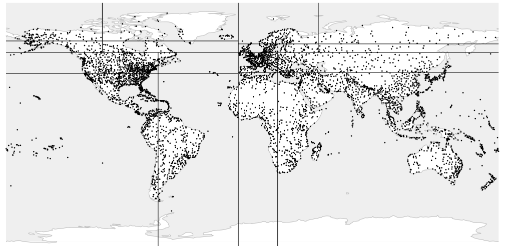

Quá trình này tiếp diễn cho đến khi đạt được số phân vùng mong muốn.

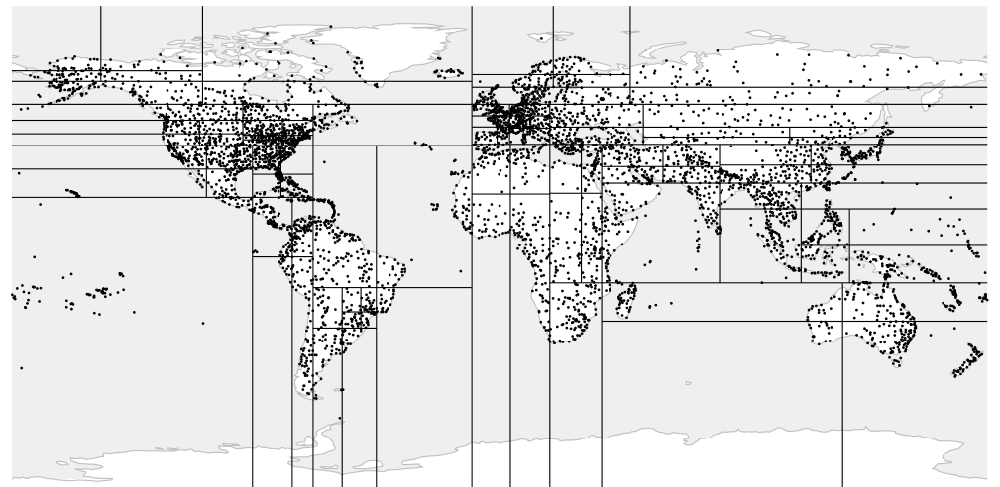

Ví dụ này dùng một index được xây dựng trên bảng airports mở rộng. Các hình minh họa cho thấy độ sâu của nhánh phụ thuộc vào mật độ điểm trong các góc phần tư tương ứng *[→ tr. 446](26-gist.md)*. Để trực quan hơn, tôi đặt giá trị nhỏ cho tham số lưu trữ *fillfactor*, khiến cây sâu hơn *(mặc định: 80)*:

```
=> CREATE INDEX airports_quad_idx ON airports_big
USING spgist(coordinates) WITH (fillfactor = 10);
```

Operator class mặc định cho điểm là `quad_point_ops`.

### Operator class (Operator Class)

Tôi đã nhắc tới các hàm hỗ trợ của SP-GiST:[^3] hàm consistency cho tìm kiếm và hàm `picksplit` cho thao tác chèn.

Bây giờ hãy xem danh sách các hàm hỗ trợ của operator class `quad_point_ops`.[^4] Tất cả chúng đều bắt buộc.

```
=> SELECT amprocnum, amproc::regproc
FROM pg_am am
  JOIN pg_opclass opc ON opcmethod = am.oid
  JOIN pg_amproc amop ON amprocfamily = opcfamily
WHERE amname = 'spgist'
AND opcname = 'quad_point_ops'
ORDER BY amprocnum;
 amprocnum |          amproc
-----------+---------------------------
         1 | spg_quad_config
         2 | spg_quad_choose
         3 | spg_quad_picksplit
         4 | spg_quad_inner_consistent
         5 | spg_quad_leaf_consistent
(5 rows)
```

Các hàm này thực hiện những nhiệm vụ sau:

1 Hàm `config` báo cho access method biết thông tin cơ bản về operator class.

2 Hàm `choose` chọn node cho thao tác chèn.

3 Hàm `picksplit` phân bổ các node giữa các page sau khi tách page.

4 Hàm `inner_consistent` kiểm tra giá trị của node *trong* có thỏa mãn predicate tìm kiếm hay không.

5 Hàm `leaf_consistent` xác định giá trị lưu trong node *lá* có thỏa mãn predicate tìm kiếm hay không.

Ngoài ra còn có một số hàm tùy chọn.

Operator class `quad_point_ops` hỗ trợ các strategy giống như GiST:[^5] *[→ tr. 449](26-gist.md)*

```
=> SELECT amopopr::regoperator, oprcode::regproc, amopstrategy
FROM pg_am am
  JOIN pg_opclass opc ON opcmethod = am.oid
  JOIN pg_amop amop ON amopfamily = opcfamily
  JOIN pg_operator opr ON opr.oid = amopopr
WHERE amname = 'spgist'
AND opcname = 'quad_point_ops'
ORDER BY amopstrategy;
     amopopr      |    oprcode    | amopstrategy
------------------+----------------+--------------
 <<(point,point)  | point_left    |            1
 >>(point,point)  | point_right   |            5
 ~=(point,point)  | point_eq      |            6
 <@(point,box)    | on_pb         |            8
 <<|(point,point) | point_below   |           10
 |>>(point,point) | point_above   |           11
 <->(point,point) | point_distance |          15
 <^(point,point)  | point_below   |           29
 >^(point,point)  | point_above   |           30
(9 rows)
```

Ví dụ, bạn có thể dùng toán tử *above* `>^` để tìm các sân bay nằm ở phía Bắc của Dikson:

```
=> SELECT airport_code, airport_name->>'en'
FROM airports_big
WHERE coordinates >^ '(80.3817,73.5167)'::point;
 airport_code |         ?column?
--------------+----------------------------
 THU          | Thule Air Base
 YEU          | Eureka Airport
 YLT          | Alert Airport
 YRB          | Resolute Bay Airport
 LYR          | Svalbard Airport, Longyear
 NAQ          | Qaanaaq Airport
 YGZ          | Grise Fiord Airport
 DKS          | Dikson Airport
(8 rows)
=> EXPLAIN (costs off) SELECT airport_code
FROM airports_big
WHERE coordinates >^ '(80.3817,73.5167)'::point;
                         QUERY PLAN
---------------------------------------------------------------
 Bitmap Heap Scan on airports_big
   Recheck Cond: (coordinates >^ '(80.3817,73.5167)'::point)
   -> Bitmap Index Scan on airports_quad_idx
       Index Cond: (coordinates >^ '(80.3817,73.5167)'::point)
(4 rows)
```

Hãy xem xét kỹ hơn cấu trúc và cách hoạt động bên trong của một quadtree. Chúng ta sẽ dùng lại ví dụ đơn giản với vài điểm mà ta đã thảo luận trong chương về GiST *[→ tr. 451](26-gist.md)*.

Đây là cách mặt phẳng có thể được phân hoạch trong trường hợp này:

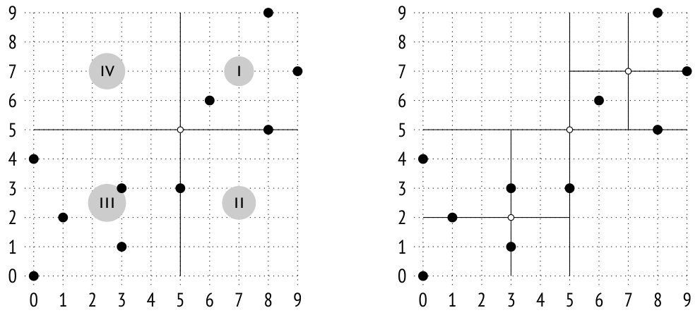

Hình bên trái cho thấy cách đánh số các góc phần tư ở một mức của cây; trong các hình minh họa tiếp theo, để cho rõ ràng, tôi sẽ đặt các node con từ trái sang phải theo đúng thứ tự này. Các điểm nằm trên đường biên được xếp vào góc phần tư có số nhỏ hơn. Hình bên phải cho thấy kết quả phân hoạch cuối cùng.

Bạn có thể thấy một cấu trúc khả dĩ của index này dưới đây. Mỗi node trong tham chiếu tới tối đa bốn node con, và mỗi con trỏ này được gắn label là số thứ tự của góc phần tư:

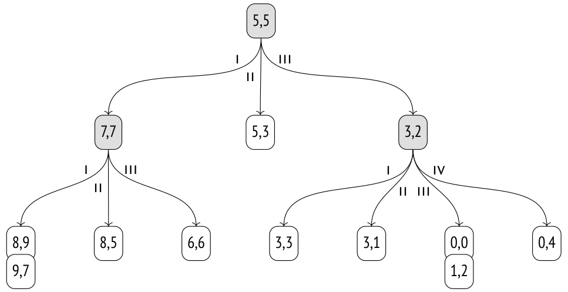

### Bố cục page (Page Layout)

Không giống index B-tree và GiST, SP-GiST không có sự tương ứng một-một giữa các node của cây và các page. Vì node trong thường không có quá nhiều node con, nhiều node phải được đóng gói vào một page duy nhất. Các loại node khác nhau được lưu trong các page khác nhau: node trong được lưu trong *page trong* (inner page), còn node lá được đưa vào *page lá* (leaf page).

Các mục index (index entry) lưu trong page trong chứa giá trị dùng làm prefix, cùng với một tập các con trỏ tới node con; mỗi con trỏ có thể đi kèm một label.

Các mục của page lá gồm một giá trị và một TID.

Tất cả các node lá liên quan tới một node trong cụ thể được lưu cùng nhau trong một page duy nhất và được liên kết thành một danh sách. Nếu page không thể chứa thêm một node nữa, danh sách này có thể được chuyển sang một page khác,[^6] hoặc page có thể bị tách; dù theo cách nào thì một danh sách cũng không bao giờ trải dài qua nhiều page.

Để tiết kiệm không gian, thuật toán cố gắng thêm node mới vào cùng các page cho đến khi các page này được lấp đầy hoàn toàn. Số hiệu của các page được dùng gần nhất được các backend lưu cache và định kỳ được ghi vào page số không, gọi là *metapage*. Metapage không chứa tham chiếu tới node gốc như ta vẫn thấy trong B-tree; gốc của index SP-GiST luôn nằm ở page đầu tiên.

> Đáng tiếc là extension pageinspect không cung cấp hàm nào để khảo sát SP-GiST, nhưng ta có thể dùng một extension bên ngoài có tên gevel.[^7] Đã từng có nỗ lực tích hợp chức năng của nó vào pageinspect, nhưng không thành công.[^8]

Hãy quay lại ví dụ của chúng ta. Hình minh họa dưới đây cho thấy các node của cây có thể được phân bổ giữa các page như thế nào. Operator class `quad_point_ops` thực ra không dùng label. Vì một node có thể có tối đa bốn node con, index giữ một mảng kích thước cố định gồm bốn con trỏ, một số trong đó có thể rỗng.

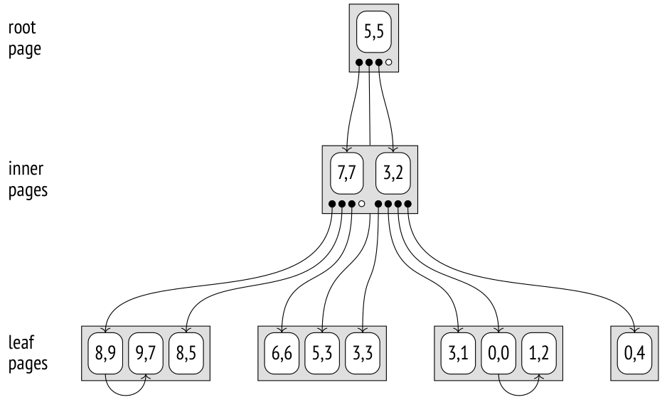

### Tìm kiếm (Search)

Hãy dùng cùng ví dụ này để xem xét thuật toán tìm các điểm nằm phía trên điểm `(3,7)`.

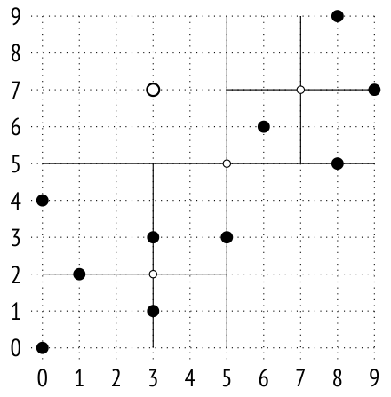

Việc tìm kiếm bắt đầu từ gốc. Hàm inner consistency[^9] xác định các node con cần đi xuống. Điểm `(3,7)` được so sánh với centroid `(5,5)` của node gốc để chọn các góc phần tư có thể chứa các điểm cần tìm; trong ví dụ này, đó là các góc phần tư I và IV.

Khi đã vào trong node có centroid `(7,7)`, ta lại phải chọn các node con để đi xuống. Chúng thuộc các góc phần tư I và IV, nhưng vì góc phần tư IV rỗng nên ta chỉ cần kiểm tra một node lá. Hàm leaf consistency[^10] so sánh các điểm của node này với điểm `(3,7)` được chỉ định trong truy vấn. Điều kiện *above* chỉ được thỏa mãn với `(8,9)`.

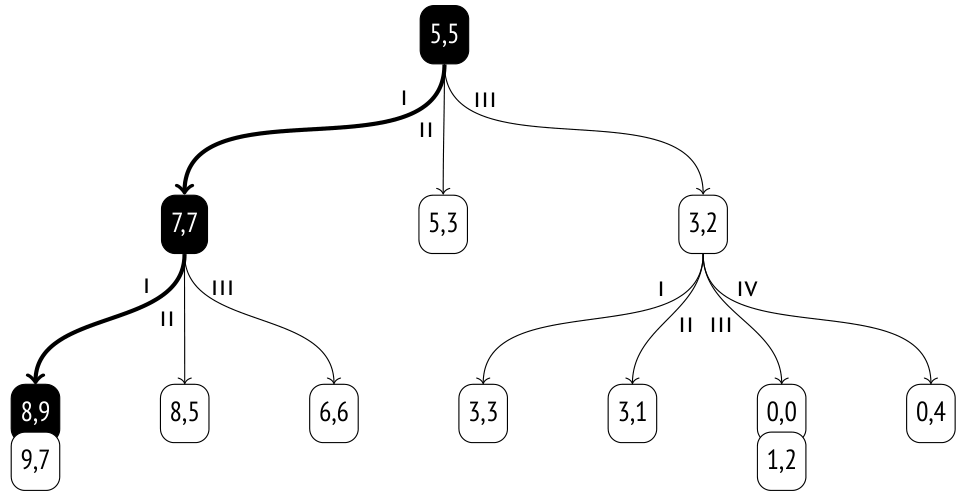

Giờ ta chỉ cần quay lại một mức và kiểm tra node tương ứng với góc phần tư IV của node gốc. Node này rỗng, nên việc tìm kiếm hoàn tất.

### Chèn (Insertion)

Khi một giá trị được chèn vào cây SP-GiST,[^11] mỗi hành động tiếp theo được quyết định bởi hàm choice.[^12] Trong trường hợp cụ thể này, nó chỉ đơn giản hướng điểm tới một trong các node đã có tương ứng với góc phần tư của điểm đó.

Ví dụ, hãy thêm giá trị `(7,1)`:

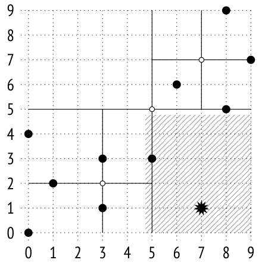

Giá trị này thuộc góc phần tư II và sẽ được thêm vào node tương ứng của cây:

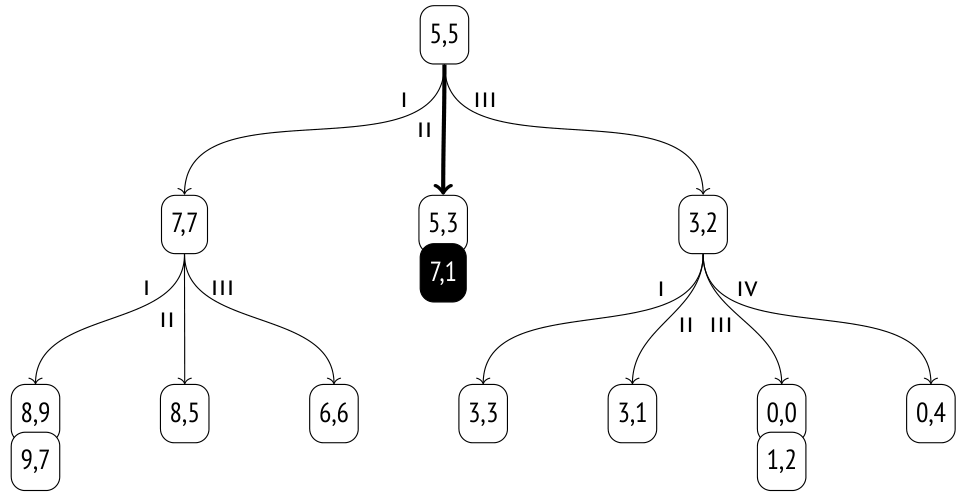

Nếu sau khi chèn, danh sách các node lá trong góc phần tư được chọn trở nên quá lớn (nó phải vừa trong một page duy nhất), page sẽ bị tách. Hàm `picksplit`[^13] xác định centroid mới bằng cách tính giá trị trung bình tọa độ của tất cả các điểm, nhờ đó phân bổ các node con giữa các góc phần tư mới một cách tương đối đồng đều.

Hình sau minh họa tình trạng tràn page do việc chèn điểm `(2,1)`:

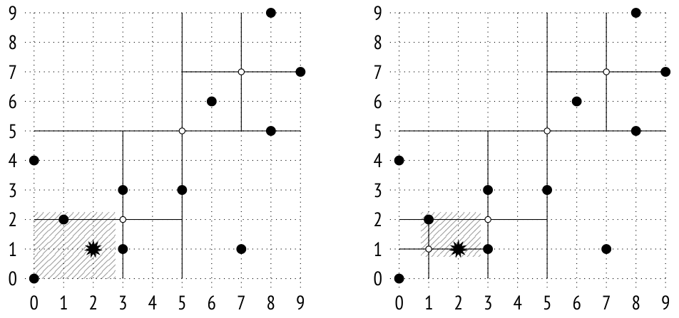

Một node trong mới với centroid `(1,1)` được thêm vào cây, trong khi các điểm `(0,0)`, `(1,2)` và `(2,1)` được phân bổ lại giữa các góc phần tư mới:

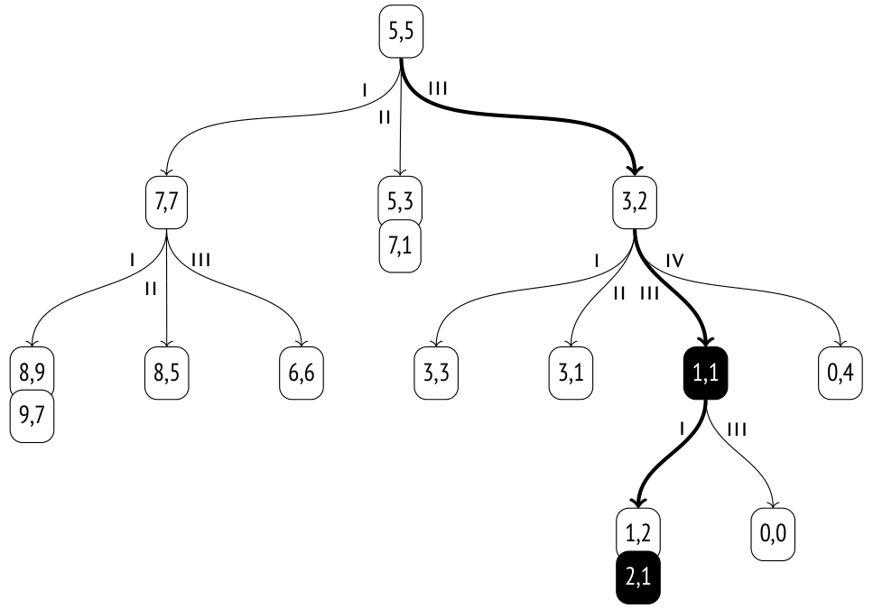

### Thuộc tính (Properties)

**Access method properties.** Phương thức `spgist` báo cáo các thuộc tính sau:

```
=> SELECT a.amname, p.name, pg_indexam_has_property(a.oid, p.name)
FROM pg_am a, unnest(array[
  'can_order', 'can_unique', 'can_multi_col',
  'can_exclude', 'can_include'
]) p(name)
WHERE a.amname = 'spgist';
 amname |     name     | pg_indexam_has_property
--------+---------------+-------------------------
 spgist | can_order    | f
 spgist | can_unique   | f
 spgist | can_multi_col | f
 spgist | can_exclude  | t
 spgist | can_include  | t
(5 rows)
```

Không có hỗ trợ cho các thuộc tính sắp xếp và tính duy nhất. Index nhiều cột cũng không được hỗ trợ.

Exclusion constraint được hỗ trợ, giống như trong GiST.

Index SP-GiST có thể được tạo với các cột `INCLUDE` bổ sung *(v. 14)*.

**Index-level properties.** Không giống GiST, index SP-GiST không hỗ trợ clusterization (sắp xếp lại bảng theo index):

```
=>  SELECT p.name, pg_index_has_property('airports_quad_idx', p.name)
FROM unnest(array[
  'clusterable', 'index_scan', 'bitmap_scan', 'backward_scan'
]) p(name);
     name      | pg_index_has_property
---------------+-----------------------
 clusterable   | f
 index_scan    | t
 bitmap_scan   | t
 backward_scan | f
(4 rows)
```

Cả hai cách lấy TID (từng cái một hoặc dưới dạng bitmap) đều được hỗ trợ. Quét ngược (backward scan) không khả dụng, vì nó không có ý nghĩa gì đối với SP-GiST.

**Column-level properties.** Phần lớn các thuộc tính mức cột là giống nhau:

```
=> SELECT p.name,
  pg_index_column_has_property('airports_quad_idx', 1, p.name)
FROM unnest(array[
  'orderable', 'search_array', 'search_nulls'
]) p(name);
```

```
     name     | pg_index_column_has_property
--------------+------------------------------
 orderable    | f
 search_array | f
 search_nulls | t
(3 rows)
```

Sắp xếp không được hỗ trợ, nên mọi thuộc tính liên quan đều không có ý nghĩa và bị tắt.

Cho tới giờ tôi chưa nói gì về giá trị NULL, nhưng như ta thấy trong các thuộc tính của index, chúng được hỗ trợ. Không giống GiST, index SP-GiST không lưu giá trị NULL trong cây chính. Thay vào đó, một cây riêng được tạo ra; gốc của nó nằm ở page thứ hai của index. Như vậy, ba page đầu tiên luôn có ý nghĩa cố định: metapage, gốc của cây chính và gốc của cây dành cho giá trị NULL.

Một số thuộc tính mức cột có thể phụ thuộc vào operator class cụ thể:

```
=> SELECT p.name,
  pg_index_column_has_property('airports_quad_idx', 1, p.name)
FROM unnest(array[
  'returnable', 'distance_orderable'
]) p(name);
        name        | pg_index_column_has_property
--------------------+------------------------------
 returnable         | t
 distance_orderable | t
(2 rows)
```

Giống như tất cả các ví dụ khác trong chương này, index này có thể được dùng cho index-only scan.

Nhưng nói chung, một operator class không nhất thiết phải lưu giá trị đầy đủ trong page lá, vì nó có thể kiểm tra lại (recheck) chúng bằng bảng *(v. 11)*. Chẳng hạn, điều này cho phép dùng index SP-GiST trong PostGIS cho các giá trị `geometry` có thể rất lớn.

Tìm kiếm láng giềng gần nhất (nearest neighbor search) được hỗ trợ *(v. 12)*; ta đã thấy toán tử sắp xếp `<->` trong operator class.

## 27.3 K-D tree cho điểm (K-Dimensional Trees for Points)

Các điểm trên mặt phẳng cũng có thể được đánh index bằng một cách phân hoạch khác: ta có thể chia mặt phẳng thành hai vùng con thay vì bốn. Cách phân hoạch này được hiện thực bởi operator class `kd_point_ops`:[^14]

```
=> CREATE INDEX airports_kd_idx ON airports_big
USING spgist(coordinates kd_point_ops);
```

Lưu ý rằng giá trị được đánh index, prefix và label có thể có các kiểu dữ liệu khác nhau. Với operator class này, giá trị được biểu diễn dưới dạng điểm, prefix là số thực, còn label thì không được cung cấp (như trong `quad_point_ops`).

Hãy chọn một tọa độ nào đó trên trục Y (trong ví dụ về sân bay, nó xác định vĩ độ). Tọa độ này chia mặt phẳng thành hai vùng con, vùng trên và vùng dưới:


Với mỗi vùng con này, chọn các tọa độ trên trục X (kinh độ) để chia chúng thành hai vùng con, trái và phải:


Ta sẽ tiếp tục chia mỗi vùng con thu được, luân phiên giữa phân hoạch theo chiều ngang và chiều dọc, cho đến khi các điểm trong mỗi phần vừa trong một page index duy nhất:

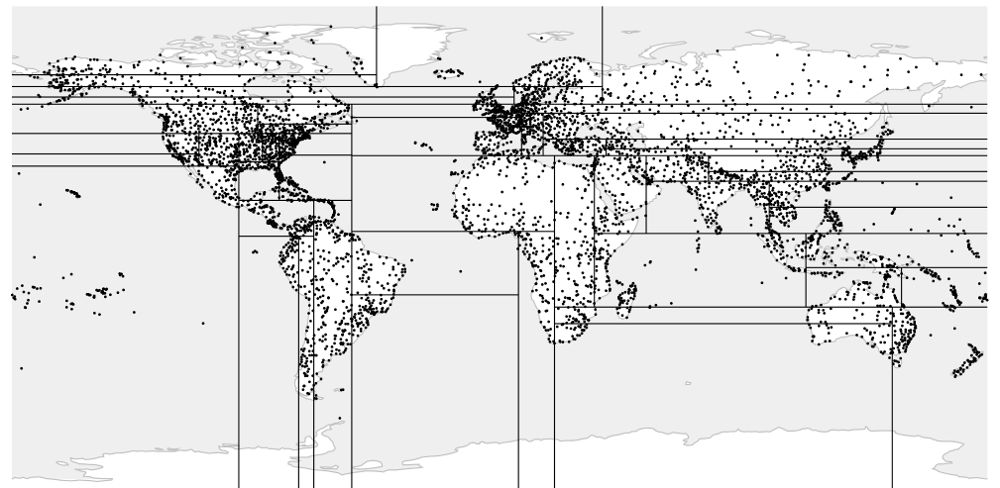

Tất cả các node trong của cây được xây dựng theo cách này sẽ chỉ có hai node con. Phương pháp này có thể dễ dàng tổng quát hóa cho không gian có số chiều bất kỳ, vì vậy những cây như thế thường được gọi là cây *k chiều* (*k*-D tree).

## 27.4 Radix tree cho chuỗi (Radix Trees for Strings)

Operator class `text_ops` dành cho SP-GiST hiện thực một radix tree cho chuỗi.[^15] Ở đây *prefix* của node trong thực sự là một tiền tố, chung cho tất cả các chuỗi trong các node con.

Các con trỏ tới node con được đánh dấu bằng byte đầu tiên của các giá trị đứng sau prefix.

> Để cho rõ ràng, tôi dùng một ký tự duy nhất để biểu thị một prefix, nhưng điều này chỉ đúng với các bảng mã 8-byte. Nói chung, operator class xử lý một chuỗi như một dãy byte. Ngoài ra, prefix có thể nhận một số giá trị khác với ngữ nghĩa đặc biệt, nên thực tế mỗi prefix được cấp phát hai byte.

Các node con lưu những phần của giá trị đứng sau prefix và label. Node lá chỉ giữ các hậu tố (suffix).

Để khôi phục giá trị đầy đủ của một khóa index trong page lá, ta có thể nối tất cả các prefix và label, bắt đầu từ node gốc.

Đây là ví dụ về một radix tree được xây dựng trên một số tên:

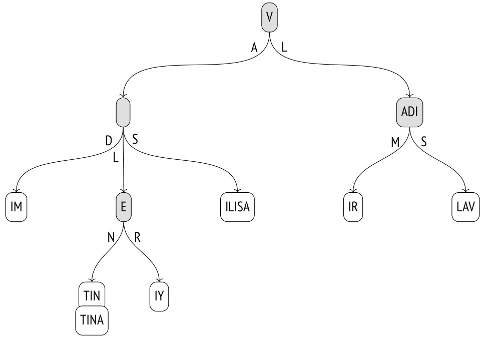

### Operator class (Operator Class)

Operator class `text_ops` hỗ trợ các toán tử so sánh thường dùng với các kiểu dữ liệu có thứ tự, bao gồm cả chuỗi văn bản:

```
=> SELECT oprname, oprcode::regproc, amopstrategy
FROM pg_am am
  JOIN pg_opclass opc ON opcmethod = am.oid
  JOIN pg_amop amop ON amopfamily = opcfamily
  JOIN pg_operator opr ON opr.oid = amopopr
WHERE amname = 'spgist'
AND opcname = 'text_ops'
ORDER BY amopstrategy;
 oprname |     oprcode    | amopstrategy
---------+-----------------+--------------
 ~<~     | text_pattern_lt |           1
 ~<=~    | text_pattern_le |           2
 =       | texteq         |            3
 ~>=~    | text_pattern_ge |           4
 ~>~     | text_pattern_gt |           5
 <       | text_lt        |           11
 <=      | text_le        |           12
 >=      | text_ge        |           14
 >       | text_gt        |           15
 ^@      | starts_with    |           28
(10 rows)
```

Các toán tử thông thường xử lý theo ký tự, còn các toán tử có dấu ngã thì làm việc với byte. Chúng không tính đến collation (giống như operator class `text_pattern_ops` của B-tree) *[→ tr. 317](19-index-access-methods.md)*, nên có thể được dùng để tăng tốc tìm kiếm theo điều kiện `LIKE`:

```
=> CREATE INDEX tickets_spgist_idx ON tickets
  USING spgist(passenger_name);
=> EXPLAIN (costs off) SELECT *
FROM tickets
WHERE passenger_name LIKE 'IVAN%';
                       QUERY PLAN
-----------------------------------------------------------
 Bitmap Heap Scan on tickets
   Filter: (passenger_name ~~ 'IVAN%'::text)
   -> Bitmap Index Scan on tickets_spgist_idx
       Index Cond: ((passenger_name ~>=~ 'IVAN'::text) AND
       (passenger_name ~<~ 'IVAO'::text))
(5 rows)
```

> Nếu bạn dùng các toán tử thông thường >= và < cùng với một collation khác "C", index gần như trở nên vô dụng, vì nó làm việc với byte chứ không phải ký tự.

Với những trường hợp *tìm kiếm theo tiền tố* (prefix search) như vậy, operator class cung cấp toán tử `^@` phù hợp hơn *(v. 11)*:

```
=> EXPLAIN (costs off) SELECT *
FROM tickets
WHERE passenger_name ^@ 'IVAN';
                     QUERY PLAN
----------------------------------------------------
 Bitmap Heap Scan on tickets
   Recheck Cond: (passenger_name ^@ 'IVAN'::text)
   -> Bitmap Index Scan on tickets_spgist_idx
       Index Cond: (passenger_name ^@ 'IVAN'::text)
(4 rows)
```

Biểu diễn dạng radix tree đôi khi có thể gọn hơn nhiều so với B-tree, vì nó không lưu giá trị đầy đủ: nó tái tạo chúng khi cần trong lúc duyệt cây.

### Tìm kiếm (Search)

Hãy chạy truy vấn sau trên bảng `names`:

```
SELECT * FROM names
WHERE name ~>=~ 'VALERIY'
  AND name ~<~ 'VLADISLAV';
```

Đầu tiên, hàm inner consistency[^16] được gọi trên node gốc để xác định các node con cần đi xuống. Hàm này nối prefix `V` với các label `A` và `L`. Giá trị nhận được *VA* được đưa vào điều kiện truy vấn; các hằng chuỗi ở đó bị cắt ngắn sao cho độ dài của chúng không vượt quá độ dài của giá trị đang được kiểm tra: *VA* `~>=~ 'VA' AND` *VA* `~<~ 'VL'`. Điều kiện được thỏa mãn, nên node con có label `A` cần được kiểm tra. Giá trị *VL* cũng được kiểm tra theo cách tương tự. Nó cũng khớp, nên node có label `L` cũng phải được kiểm tra.

Bây giờ hãy xét node tương ứng với giá trị `VA`. Prefix của nó rỗng, nên với ba node con, hàm inner consistency tái tạo các giá trị *VAD*, *VAL* và *VAS* bằng cách nối `VA` nhận được ở bước trước với label. Điều kiện *VAD* `~>=~ 'VAL' AND` *VAD* `~<~ 'VER'` không đúng, nhưng hai giá trị còn lại thì phù hợp.

Khi cây được duyệt theo cách này, thuật toán lọc bỏ các nhánh không khớp và đi tới các node lá. Hàm leaf consistency[^17] kiểm tra xem giá trị được tái tạo trong quá trình duyệt cây có thỏa mãn điều kiện truy vấn hay không. Các giá trị khớp được trả về làm kết quả của index scan.

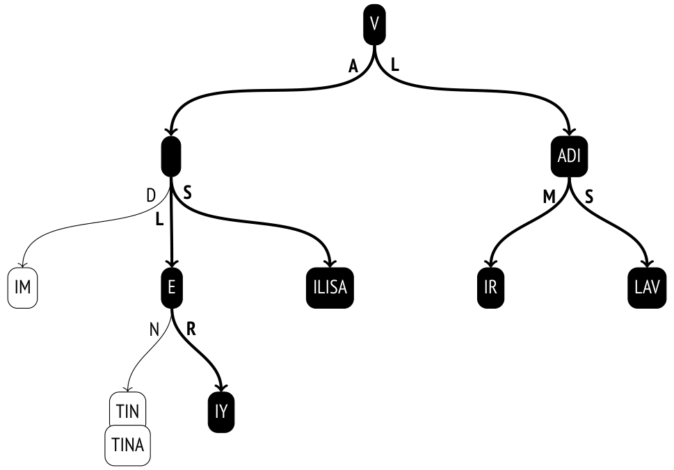

Lưu ý rằng mặc dù truy vấn dùng các toán tử *lớn hơn* và *nhỏ hơn* vốn quen thuộc với B-tree, tìm kiếm theo khoảng (range search) bằng SP-GiST kém hiệu quả hơn nhiều. Trong B-tree, chỉ cần đi xuống tới một giá trị biên của khoảng rồi quét danh sách các page lá.

### Chèn (Insertion)

Hàm choice của các operator class cho điểm luôn có thể hướng một giá trị mới vào một trong các vùng con đã có (một góc phần tư hoặc một trong hai nửa). Nhưng điều đó không đúng với radix tree: một giá trị mới có thể không khớp với bất kỳ prefix nào đã có, và trong trường hợp này node trong phải bị tách.

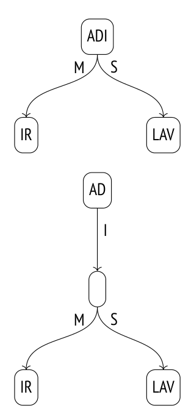

Hãy thêm tên `VLADA` vào một cây đã được xây dựng.

Hàm choice[^18] đi xuống được từ gốc tới node tiếp theo (`V` + `L`), nhưng phần còn lại của giá trị là `ADA` không khớp với prefix `ADI`. Node này phải được tách làm hai: một trong các node thu được sẽ chứa phần chung của prefix (`AD`), còn phần còn lại của prefix sẽ được chuyển xuống một mức:

Sau đó hàm choice lại được gọi trên cùng node đó. Lúc này prefix đã khớp với giá trị, nhưng không có node con nào có label phù hợp (`A`), nên hàm quyết định tạo một node như vậy. Kết quả cuối cùng được thể hiện trong hình dưới đây; các node được thêm vào hoặc bị sửa đổi trong quá trình chèn được tô sáng.

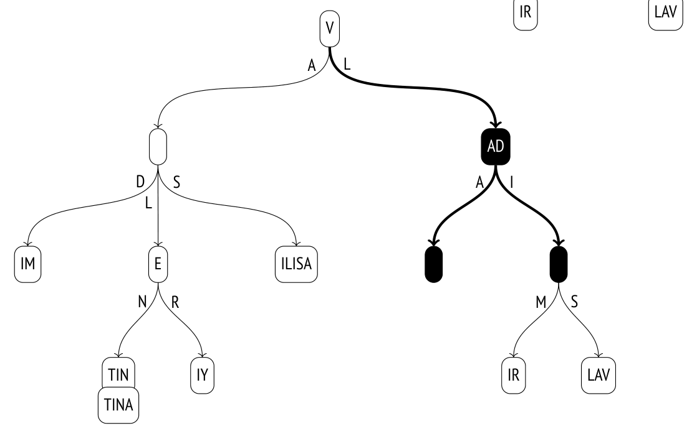

### Thuộc tính (Properties)

Tôi đã mô tả các thuộc tính mức access method và mức index ở trên; chúng là chung cho tất cả các class. Phần lớn các thuộc tính mức cột cũng giữ nguyên.

```
=> SELECT p.name,
  pg_index_column_has_property('tickets_spgist_idx', 1, p.name)
FROM unnest(array[
  'returnable', 'distance_orderable'
]) p(name);
        name        | pg_index_column_has_property
--------------------+------------------------------
 returnable         | t
 distance_orderable | f
(2 rows)
```

Mặc dù các giá trị được đánh index không được lưu tường minh trong cây, index-only scan vẫn được hỗ trợ, vì các giá trị được tái tạo khi cây được duyệt từ gốc tới các node lá.

Còn về toán tử khoảng cách, nó không được định nghĩa cho chuỗi, nên operator class này không cung cấp tìm kiếm láng giềng gần nhất.

> Điều đó không có nghĩa là khái niệm khoảng cách không thể hiện thực cho chuỗi. Ví dụ, extension pg_trgm bổ sung một toán tử khoảng cách dựa trên trigram: hai chuỗi có càng ít trigram chung thì được coi là nằm càng xa nhau. Ngoài ra còn có khoảng cách Levenshtein, được định nghĩa là số phép sửa đổi một ký tự tối thiểu cần thiết để biến đổi một chuỗi thành chuỗi khác. Một hàm tính khoảng cách này được cung cấp trong extension fuzzystrmatch. Nhưng không extension nào trong số đó cung cấp operator class có hỗ trợ SP-GiST.

## 27.5 Các kiểu dữ liệu khác (Other Data Types)

Các operator class của SP-GiST không chỉ giới hạn ở việc đánh index các điểm và chuỗi văn bản mà ta đã thảo luận ở trên.

**Geometric types.** Operator class `box_ops`[^19] hiện thực một quadtree cho hình chữ nhật. Các hình chữ nhật được biểu diễn bằng các điểm trong không gian bốn chiều, nên vùng không gian được chia thành mười sáu phân vùng.

Class `poly_ops` có thể được dùng để đánh index đa giác. Đây là một operator class "mờ" (fuzzy): thực ra nó dùng các hình chữ nhật bao (bounding box) thay cho đa giác, giống như `box_ops`, rồi kiểm tra lại kết quả bằng bảng *(v. 11)*.

Việc chọn GiST hay SP-GiST phần lớn phụ thuộc vào bản chất của dữ liệu cần đánh index. Ví dụ, tài liệu PostGIS khuyến nghị SP-GiST cho các đối tượng chồng lấn nhau nhiều (còn được gọi là "spaghetti data").[^20]

**Range types.** Quadtree cho các khoảng (range) cung cấp operator class `range_ops`.[^21] Một khoảng được xác định bởi một điểm hai chiều: trục X biểu diễn cận dưới, còn trục Y biểu diễn cận trên.

**Network address types.** Với kiểu dữ liệu `inet`, operator class `inet_ops`[^22] hiện thực một radix tree.

[^1]: postgresql.org/docs/14/spgist.html  
backend/access/spgist/README
[^2]: backend/access/spgist/spgscan.c, hàm spgWalk
[^3]: postgresql.org/docs/14/spgist-extensibility.html
[^4]: backend/access/spgist/spgquadtreeproc.c
[^5]: include/access/stratnum.h
[^6]: backend/access/spgist/spgdoinsert.c, hàm moveLeafs
[^7]: sigaev.ru/git/gitweb.cgi?p=gevel.git
[^8]: commitfest.postgresql.org/15/1207
[^9]: backend/access/spgist/spgquadtreeproc.c, hàm spg_quad_inner_consistent
[^10]: backend/access/spgist/spgquadtreeproc.c, hàm spg_quad_leaf_consistent
[^11]: backend/access/spgist/spgdoinsert.c, hàm spgdoinsert
[^12]: backend/access/spgist/spgquadtreeproc.c, hàm spg_quad_choose
[^13]: backend/access/spgist/spgquadtreeproc.c, hàm spg_quad_picksplit
[^14]: backend/access/spgist/spgkdtreeproc.c
[^15]: backend/access/spgist/spgtextproc.c
[^16]: backend/access/spgist/spgtextproc.c, hàm spg_text_inner_consistent
[^17]: backend/access/spgist/spgtextproc.c, hàm spg_text_leaf_consistent
[^18]: backend/access/spgist/spgtextproc.c, hàm spg_text_choose
[^19]: backend/utils/adt/geo_spgist.c
[^20]: postgis.net/docs/using_postgis_dbmanagement.html#spgist_indexes
[^21]: backend/utils/adt/rangetypes_spgist.c
[^22]: backend/utils/adt/network_spgist.c
