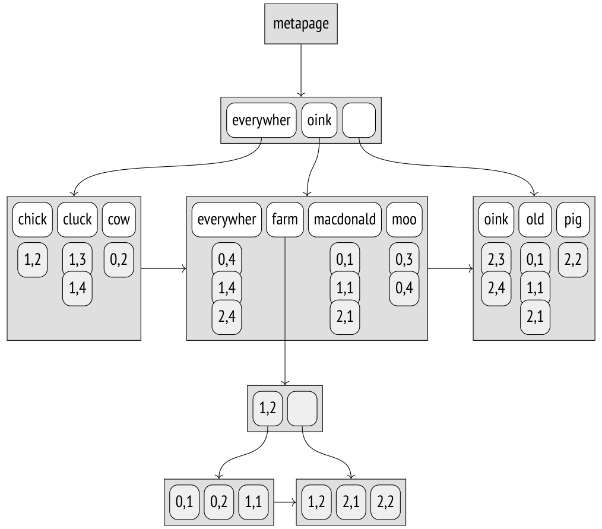
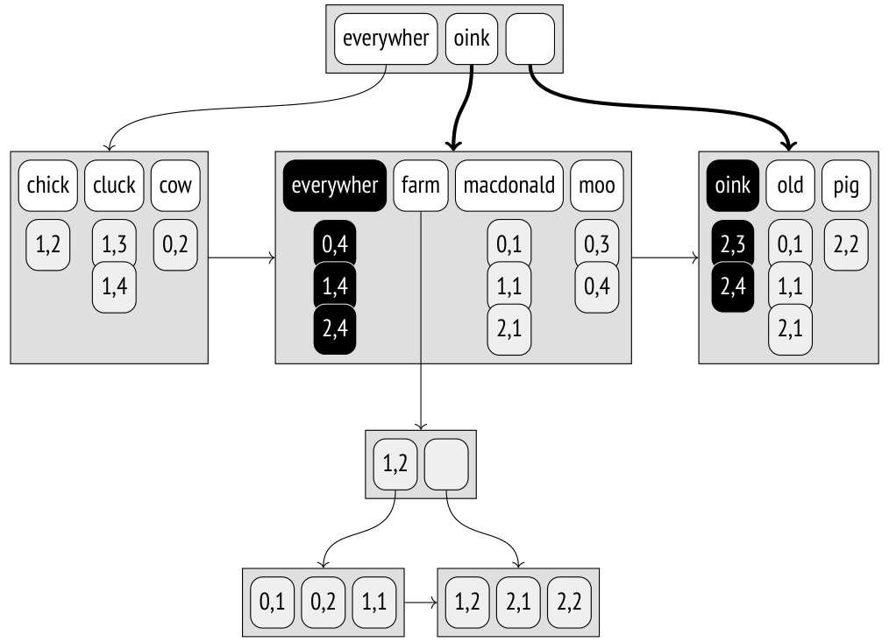
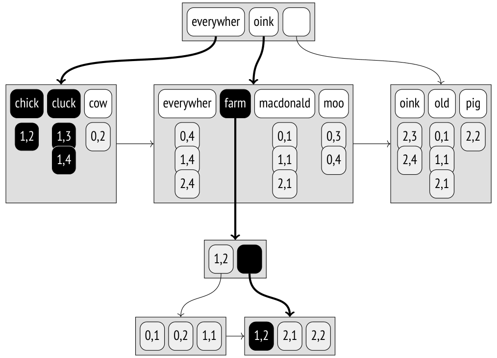
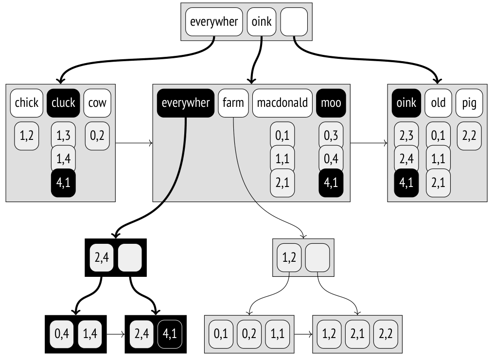
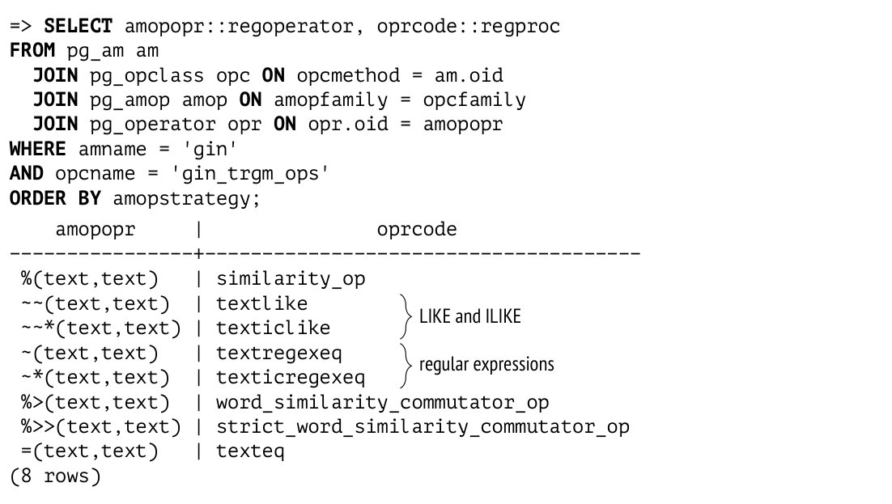
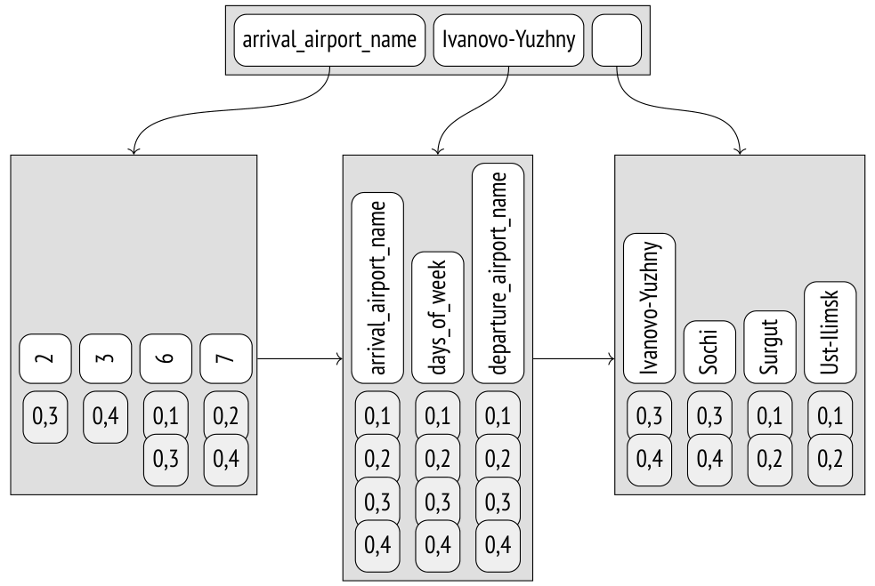
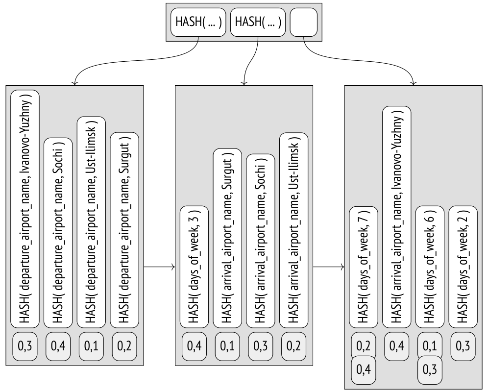

# Chương 28. GIN

## 28.1 Tổng quan (Overview)

Theo các tác giả của nó, GIN là viết tắt của một tinh thần mạnh mẽ và không khuất phục, chứ không phải một loại đồ uống có cồn.[^1] Nhưng cũng có một cách diễn giải chính thức: từ viết tắt này được mở rộng thành Generalized Inverted Index (chỉ mục đảo ngược tổng quát).

Phương thức truy cập GIN được thiết kế cho các kiểu dữ liệu biểu diễn những *giá trị* không nguyên tử, được tạo thành từ các *phần tử* riêng biệt (ví dụ, trong ngữ cảnh tìm kiếm toàn văn, các tài liệu bao gồm các lexeme). Khác với GiST, vốn index các giá trị như một khối thống nhất, GIN chỉ index các phần tử của chúng; mỗi phần tử được ánh xạ tới tất cả các giá trị chứa nó.

Chúng ta có thể so sánh phương thức này với phần chỉ mục của một cuốn sách, nơi bao gồm tất cả các thuật ngữ quan trọng và liệt kê tất cả các trang có nhắc đến những thuật ngữ đó. Để tiện sử dụng, nó phải được sắp xếp theo thứ tự bảng chữ cái, nếu không sẽ không thể tra cứu nhanh được. Tương tự như vậy, GIN dựa vào thực tế là mọi phần tử của các giá trị phức hợp đều có thể được sắp xếp; cấu trúc dữ liệu chính của nó là B-tree. *[→ tr. 421](25-b-tree.md)*

Việc cài đặt cây phần tử của GIN ít phức tạp hơn so với một B-tree thông thường: nó được thiết kế để chứa những tập phần tử khá nhỏ nhưng lặp lại nhiều lần.

Giả định này dẫn đến hai kết luận quan trọng:

- Một phần tử chỉ được lưu trong index một lần duy nhất.

- Mỗi phần tử được ánh xạ tới một danh sách các TID, gọi là *posting list*. Nếu danh sách này khá ngắn, nó được lưu cùng với phần tử; các danh sách dài hơn được chuyển sang một *posting tree* riêng, thực chất là một B-tree. Cũng giống như cây phần tử, các posting list được sắp xếp; điều này không quan trọng lắm từ góc độ người dùng nhưng giúp tăng tốc truy cập dữ liệu và giảm kích thước index.

- Không có lý do gì để xoá các phần tử khỏi cây.

- Ngay cả khi danh sách TID của một phần tử cụ thể là rỗng, nhiều khả năng phần tử đó sẽ lại xuất hiện như một phần của một giá trị nào đó khác.

Như vậy, một index là một cây các phần tử mà các entry lá của nó gắn với các danh sách phẳng hoặc các cây TID.

Cũng giống như các phương thức truy cập GiST và SP-GiST, GIN có thể được dùng để index đủ loại kiểu dữ liệu thông qua một giao diện đơn giản hoá gồm các operator class. Các toán tử của những lớp này thường kiểm tra xem giá trị phức hợp được index có khớp với một tập phần tử cụ thể hay không (giống như toán tử `@@` kiểm tra xem một tài liệu có thoả mãn một truy vấn tìm kiếm toàn văn hay không).

Để index một kiểu dữ liệu cụ thể, phương thức GIN phải có khả năng tách các giá trị phức hợp thành các phần tử, sắp xếp các phần tử này, và kiểm tra xem giá trị tìm được có thoả mãn truy vấn hay không. Các thao tác này được cài đặt bởi các hàm hỗ trợ (support function) của operator class.

## 28.2 Index cho tìm kiếm toàn văn (Index for Full-Text Search)

GIN chủ yếu được áp dụng để tăng tốc tìm kiếm toàn văn (full-text search), vì vậy tôi sẽ tiếp tục với ví dụ đã dùng để minh hoạ việc index bằng GiST. Như bạn có thể đoán, các giá trị phức hợp trong trường hợp này là các *tài liệu*, *[→ tr. 463](26-gist.md)* còn các phần tử của những giá trị này là các *lexeme*.

Hãy xây dựng một GIN index trên bảng “Old MacDonald”: *[→ tr. 463](26-gist.md)*

```
=> CREATE INDEX ts_gin_idx ON ts USING gin(doc_tsv);
```

Một cấu trúc khả dĩ của index này được trình bày bên dưới. Khác với các hình minh hoạ trước, ở đây tôi đưa ra các giá trị TID thực tế (được thể hiện với nền xám), vì chúng quan trọng cho việc hiểu các thuật toán. Những giá trị này cho thấy các heap tuple có các ID như sau:

```
=> SELECT ctid, * FROM ts;
  ctid |               doc                 |            doc_tsv
-------+------------------------------------+--------------------------------
 (0,1) | Old MacDonald had a farm          | 'farm':5 'macdonald':2 'old':1
 (0,2) | And on his farm he had some cows  | 'cow':8 'farm':4
 (0,3) | Here a moo, there a moo           | 'moo':3,6
 (0,4) | Everywhere a moo moo              | 'everywher':1 'moo':3,4
 (1,1) | Old MacDonald had a farm          | 'farm':5 'macdonald':2 'old':1
 (1,2) | And on his farm he had some chicks | 'chick':8 'farm':4
 (1,3) | Here a cluck, there a cluck       | 'cluck':3,6
 (1,4) | Everywhere a cluck cluck          | 'cluck':3,4 'everywher':1
 (2,1) | Old MacDonald had a farm          | 'farm':5 'macdonald':2 'old':1
 (2,2) | And on his farm he had some pigs  | 'farm':4 'pig':8
 (2,3) | Here an oink, there an oink       | 'oink':3,6
 (2,4) | Everywhere an oink oink           | 'everywher':1 'oink':3,4
(12 rows)
```



Lưu ý một số điểm khác biệt so với một B-tree index thông thường ở đây. Các khoá ngoài cùng bên trái trong các nút trong (inner node) của B-tree *[→ tr. 426](25-b-tree.md)* là rỗng, vì thực ra chúng dư thừa; trong một GIN index, chúng hoàn toàn không được lưu. Vì lý do này, các tham chiếu tới nút con cũng bị dịch đi. High key được dùng trong cả hai loại index, nhưng trong GIN nó nằm ở vị trí ngoài cùng bên phải đúng như lẽ thường. Các nút cùng mức trong B-tree được liên kết thành một danh sách hai chiều; GIN dùng danh sách một chiều, vì cây luôn chỉ được duyệt theo một hướng.

Trong ví dụ lý thuyết này, tất cả các posting list đều vừa trong các page thông thường, ngoại trừ danh sách của lexeme “farm”. Lexeme này xuất hiện trong tới sáu tài liệu, vì vậy các ID của nó đã được chuyển sang một posting tree riêng.

### Bố cục page (Page Layout)

Bố cục page của GIN rất giống với B-tree. Chúng ta có thể xem bên trong một index bằng extension `pageinspect`. Hãy tạo một GIN index trên bảng lưu các email của mailing list pgsql-hackers: *[→ tr. 468](26-gist.md)*

```
=> CREATE INDEX mail_gin_idx ON mail_messages USING gin(tsv);
```

Page số không (metapage) chứa các thống kê cơ bản, chẳng hạn như số lượng phần tử và số page thuộc các loại khác:

```
=> SELECT *
FROM gin_metapage_info(get_raw_page('mail_gin_idx',0)) \gx
-[ RECORD 1 ]----+-----------
pending_head     | 4294967295
pending_tail     | 4294967295
tail_free_size   | 0
n_pending_pages  | 0
n_pending_tuples | 0
n_total_pages    | 22957
n_entry_pages    | 13522
n_data_pages     | 9434
n_entries        | 999109
version          | 2
```

GIN sử dụng vùng đặc biệt (special space) của các index page; ví dụ, vùng này lưu các bit xác định loại page: *[→ tr. 63](03-pages-and-tuples.md)*

```
=> SELECT flags, count(*)
FROM generate_series(0,22956) AS p, -- n_total_pages
  gin_page_opaque_info(get_raw_page('mail_gin_idx',p))
GROUP BY flags
ORDER BY 2;
         flags         | count
------------------------+-------
 {meta}                |     1
 {}                    |   137
 {data}                |  1525
 {data,leaf,compressed} | 7909
 {leaf}                | 13385
(5 rows)
```

Page có thuộc tính `meta` dĩ nhiên là metapage. Các page có thuộc tính `data` thuộc về các posting list, còn các page không có thuộc tính này liên quan đến các cây phần tử. Các page lá có thuộc tính `leaf`.

Trong ví dụ tiếp theo, một hàm khác của `pageinspect` trả về thông tin về các TID được lưu trong các page lá của cây. Mỗi entry của một cây như vậy thực chất là một danh sách nhỏ các TID chứ không phải một TID đơn lẻ:

```
=> SELECT left(tids::text,60)||'...' tids
FROM gin_leafpage_items(get_raw_page('mail_gin_idx',24));
```

```
                             tids
-----------------------------------------------------------------
 {"(4771,4)","(4775,2)","(4775,5)","(4777,4)","(4779,1)","(47...
 {"(5004,2)","(5011,2)","(5013,1)","(5013,2)","(5013,3)","(50...
 {"(5435,6)","(5438,3)","(5439,3)","(5439,4)","(5439,5)","(54...
 ...
 {"(9789,4)","(9791,6)","(9792,4)","(9794,4)","(9794,5)","(97...
 {"(9937,4)","(9937,6)","(9938,4)","(9939,1)","(9939,5)","(99...
 {"(10116,5)","(10118,1)","(10118,4)","(10119,2)","(10121,2)"...
(27 rows)
```

Các posting list được sắp thứ tự, nhờ đó chúng có thể được nén (vì vậy mới có thuộc tính cùng tên `compressed`). Thay vì lưu TID sáu byte, chúng lưu hiệu số của nó so với giá trị trước đó, được biểu diễn bằng một số byte thay đổi:[^2] hiệu số càng nhỏ, dữ liệu càng chiếm ít chỗ.

### Operator Class

Dưới đây là danh sách các hàm hỗ trợ cho các operator class của GIN:[^3]

```
=> SELECT amprocnum, amproc::regproc
FROM pg_am am
  JOIN pg_opclass opc ON opcmethod = am.oid
  JOIN pg_amproc amop ON amprocfamily = opcfamily
WHERE amname = 'gin'
AND opcname = 'tsvector_ops'
ORDER BY amprocnum;
 amprocnum |             amproc
-----------+-----------------------------------
         1 | gin_cmp_tslexeme
         2 | pg_catalog.gin_extract_tsvector
         3 | pg_catalog.gin_extract_tsquery
         4 | pg_catalog.gin_tsquery_consistent
         5 | gin_cmp_prefix
         6 | gin_tsquery_triconsistent
(6 rows)
```

Hàm hỗ trợ thứ nhất so sánh hai phần tử (trong trường hợp này là hai lexeme). Nếu các lexeme được biểu diễn bằng một kiểu SQL thông thường được B-tree hỗ trợ, GIN sẽ tự động dùng các toán tử so sánh được định nghĩa trong operator class của B-tree.

Hàm thứ năm (tuỳ chọn) được dùng trong *tìm kiếm một phần* (partial search) để kiểm tra xem một phần tử của index có khớp một phần với khoá tìm kiếm hay không. Trong trường hợp cụ thể này, tìm kiếm một phần là tìm các lexeme theo tiền tố. Ví dụ, truy vấn “c:*” tương ứng với tất cả các lexeme bắt đầu bằng chữ “c.”

Hàm thứ hai trích xuất các lexeme từ tài liệu, còn hàm thứ ba trích xuất các lexeme từ truy vấn tìm kiếm. Việc dùng các hàm khác nhau là hợp lý bởi vì, ít nhất thì tài liệu và truy vấn cũng được biểu diễn bằng các kiểu dữ liệu khác nhau, cụ thể là `tsvector` và `tsquery`. Ngoài ra, hàm dành cho truy vấn tìm kiếm quyết định cách thức việc tìm kiếm sẽ được thực hiện. Nếu truy vấn yêu cầu tài liệu phải chứa một lexeme cụ thể, việc tìm kiếm sẽ được giới hạn trong các tài liệu chứa ít nhất một lexeme được chỉ định trong truy vấn. Nếu không có điều kiện như vậy (ví dụ, nếu bạn cần các tài liệu *không* chứa một lexeme cụ thể), thì tất cả tài liệu đều phải được quét — điều này dĩ nhiên tốn kém hơn nhiều.

> Nếu truy vấn có chứa bất kỳ khoá tìm kiếm nào khác, index trước tiên được quét theo các khoá này, rồi sau đó các kết quả trung gian này được kiểm tra lại. *(v. 13)* Như vậy, không cần phải quét toàn bộ index.

Hàm thứ tư và thứ sáu là các hàm nhất quán (consistency function), quyết định xem tài liệu tìm được có thoả mãn truy vấn tìm kiếm hay không. Làm đầu vào, hàm thứ tư nhận thông tin chính xác về những lexeme nào được chỉ định trong truy vấn xuất hiện trong tài liệu. Hàm thứ sáu hoạt động trong bối cảnh không chắc chắn và có thể được gọi khi chưa rõ một số lexeme có mặt trong tài liệu hay không. Một operator class không bắt buộc phải cài đặt cả hai hàm: chỉ cần cung cấp một trong hai là đủ, nhưng hiệu quả tìm kiếm có thể bị ảnh hưởng trong trường hợp này.

Operator class `tsvector_ops` chỉ hỗ trợ một toán tử khớp tài liệu với truy vấn tìm kiếm: `@@`,[^4] toán tử này cũng có trong operator class của GiST.

### Tìm kiếm (Search)

Hãy xem xét thuật toán tìm kiếm cho truy vấn “`everywhere | oink`”, trong đó hai lexeme được nối với nhau bởi toán tử `OR`. Trước tiên, một hàm hỗ trợ[^5] trích xuất các lexeme “everywher” và “oink” (*các khoá tìm kiếm*) từ chuỗi tìm kiếm có kiểu `tsquery`.

Vì truy vấn yêu cầu phải có mặt những lexeme cụ thể, TID của các tài liệu chứa *ít nhất một* khoá được chỉ định trong truy vấn được gom lại thành một danh sách. Để làm việc này, các TID tương ứng với mỗi khoá tìm kiếm được tìm trong cây lexeme và được thêm vào một danh sách chung. Tất cả các TID được lưu trong index đều được sắp thứ tự, điều này cho phép merge (trộn) *[→ tr. 387](23-sorting-and-merging.md)* nhiều luồng TID đã sắp xếp thành một.[^6]

Lưu ý rằng ở thời điểm này, việc các khoá được kết hợp bằng `AND`, `OR` hay bất kỳ toán tử nào khác vẫn chưa quan trọng: bộ máy tìm kiếm làm việc với danh sách các khoá và không biết gì về ngữ nghĩa của truy vấn tìm kiếm.



Mỗi TID tìm được tương ứng với một tài liệu sẽ được kiểm tra bởi hàm nhất quán.[^7] Chính hàm này diễn giải truy vấn tìm kiếm và chỉ giữ lại những TID thoả mãn truy vấn (hoặc ít nhất là có thể thoả mãn và phải được kiểm tra lại bằng bảng).

Trong trường hợp cụ thể này, hàm nhất quán giữ lại tất cả các TID:

| TID | “everywher” | “oink” | hàm nhất quán (consistency function) |
|---|---|---|---|
| `(0,4)` | ✓ | – | ✓ |
| `(1,4)` | ✓ | – | ✓ |
| `(2,3)` | – | ✓ | ✓ |
| `(2,4)` | ✓ | ✓ | ✓ |

Thay vì một lexeme thông thường, truy vấn tìm kiếm có thể chứa một tiền tố. Điều này hữu ích khi người dùng ứng dụng có thể gõ vài chữ cái đầu của một từ vào ô tìm kiếm và mong nhận được kết quả ngay lập tức. Ví dụ, truy vấn “`pig:*`” sẽ khớp với tất cả các tài liệu chứa lexeme bắt đầu bằng “pig”: ở đây chúng ta nhận được “pigs”, và cũng sẽ nhận được cả “pigeons” nếu ông MacDonald già có nuôi chim bồ câu trong trang trại của mình.

Việc tìm kiếm *một phần* như vậy so khớp các lexeme đã được index với khoá tìm kiếm bằng một hàm hỗ trợ đặc biệt;[^8] ngoài việc so khớp tiền tố, hàm này cũng có thể cài đặt logic khác cho tìm kiếm một phần.

### Lexeme phổ biến và lexeme hiếm (Frequent and Rare Lexemes)

Nếu các lexeme được tìm kiếm xuất hiện trong tài liệu nhiều lần, danh sách TID được tạo ra sẽ rất dài, điều này dĩ nhiên là kém hiệu quả. May mắn là thường có thể tránh được điều đó nếu truy vấn cũng chứa một số lexeme hiếm.

Hãy xem xét truy vấn “`farm & cluck`”. Lexeme “cluck” xuất hiện hai lần, trong khi lexeme “farm” xuất hiện sáu lần. Thay vì đối xử với cả hai lexeme như nhau và xây dựng danh sách TID đầy đủ theo chúng, lexeme hiếm “cluck” được coi là bắt buộc, còn lexeme phổ biến hơn “farm” được xem là tuỳ chọn, vì rõ ràng là (xét đến ngữ nghĩa của truy vấn) một tài liệu có lexeme “farm” chỉ có thể thoả mãn truy vấn nếu nó cũng chứa lexeme “cluck”.

Như vậy, một index scan xác định tài liệu đầu tiên chứa “cluck”; TID của nó là `(1,3)`. Sau đó chúng ta phải tìm hiểu xem tài liệu này có chứa lexeme “farm” hay không, nhưng tất cả các tài liệu có TID nhỏ hơn `(1,3)` đều có thể bỏ qua. Vì các lexeme phổ biến nhiều khả năng tương ứng với rất nhiều TID, khả năng cao là chúng được lưu trong một cây riêng, nên một số page cũng có thể được bỏ qua. Trong trường hợp cụ thể này, việc tìm kiếm trong cây của lexeme “farm” bắt đầu từ `(1,3)`.

Quy trình này được lặp lại cho các giá trị tiếp theo của lexeme bắt buộc.

Rõ ràng, tối ưu hoá này cũng có thể được áp dụng cho các kịch bản tìm kiếm phức tạp hơn liên quan đến nhiều hơn hai lexeme. Thuật toán sắp xếp các lexeme theo thứ tự tần suất của chúng, lần lượt thêm từng lexeme vào danh sách các lexeme bắt buộc, và dừng lại khi các lexeme còn lại không còn có thể đảm bảo rằng tài liệu thoả mãn truy vấn.[^9]

Ví dụ, hãy xem xét truy vấn “`farm & ( cluck | chick )`”. Lexeme ít phổ biến nhất là “chick”; nó được thêm ngay vào danh sách các lexeme bắt buộc. Để kiểm tra xem các lexeme khác có thể được coi là tuỳ chọn hay không, hàm nhất quán nhận giá trị false cho lexeme bắt buộc và true cho tất cả các lexeme khác. Nó trả về `true AND (true OR false)` = `true`, nghĩa là các lexeme còn lại là “tự đủ”, và ít nhất một trong số chúng phải trở thành bắt buộc.

Lexeme ít phổ biến tiếp theo (“cluck”) được thêm vào danh sách, và bây giờ hàm nhất quán trả về `true AND (false OR false)` = `false`. Như vậy, các lexeme “chick” và “cluck” trở thành bắt buộc, còn “farm” vẫn là tuỳ chọn.



Độ dài của posting list là ba, vì các lexeme bắt buộc đã xuất hiện ba lần:

| TID | “chick” | “cluck” | “farm” | hàm nhất quán (consistency function) |
|---|---|---|---|---|
| `(1,2)` | ✓ | – | ✓ | ✓ |
| `(1,3)` | – | ✓ | – | – |
| `(1,4)` | – | ✓ | – | – |

Như vậy, nếu biết được tần suất của các lexeme, có thể merge các cây lexeme theo cách hiệu quả nhất, bắt đầu từ các lexeme hiếm và bỏ qua những dải page của các lexeme phổ biến chắc chắn là dư thừa. *[→ tr. 283](17-statistics.md)* Điều này giảm số lần phải gọi hàm nhất quán.

Để chắc chắn rằng tối ưu hoá này thực sự có tác dụng, hãy truy vấn kho lưu trữ pgsql-hackers. *[→ tr. 468](26-gist.md)* Chúng ta sẽ cần chỉ định hai lexeme, một lexeme phổ biến và một lexeme hiếm:

```
=> SELECT word, ndoc
FROM ts_stat('SELECT tsv FROM mail_messages')
WHERE word IN ('wrote', 'tattoo');
  word  |  ndoc
--------+--------
 wrote  | 231173
 tattoo |      2
(2 rows)
```

Hoá ra một tài liệu chứa cả hai lexeme này thực sự tồn tại:

```
=> \timing on
=> SELECT count(*) FROM mail_messages
WHERE tsv @@ to_tsquery('wrote & tattoo');
 count
-------
     1
(1 row)
Time: 0,631 ms
```

Truy vấn này được thực hiện gần như nhanh bằng việc tìm kiếm một từ đơn “tattoo”:

```
=> SELECT count(*) FROM mail_messages
WHERE tsv @@ to_tsquery('tattoo');
 count
-------
     2
(1 row)
Time: 2,227 ms
```

Nhưng nếu chúng ta tìm một từ đơn “wrote”, việc tìm kiếm sẽ mất nhiều thời gian hơn hẳn:

```
=> SELECT count(*) FROM mail_messages
WHERE tsv @@ to_tsquery('wrote');
```

```
 count
--------
 231173
(1 row)
Time: 343,556 ms
=> \timing off
```

### Chèn dữ liệu (Insertions)

Một GIN index không thể chứa các bản trùng lặp;[^10] nếu phần tử cần thêm đã có mặt trong index, TID của nó đơn giản được thêm vào posting list hoặc posting tree của phần tử đã tồn tại.

Posting list là một phần của index entry và không thể chiếm quá nhiều chỗ trong page, vì vậy nếu vượt quá không gian được cấp phát, danh sách sẽ được chuyển thành một cây.[^11]

Khi một phần tử mới (hoặc một TID mới) được thêm vào cây, có thể xảy ra tràn page; trong trường hợp này, page được tách làm đôi, và các phần tử được phân bổ lại giữa chúng.[^12]

Nhưng mỗi tài liệu thường chứa nhiều lexeme cần được index. Vì vậy, ngay cả khi chúng ta chỉ tạo hoặc sửa đổi một tài liệu, cây index vẫn phải trải qua rất nhiều sửa đổi. Đó là lý do tại sao việc cập nhật GIN khá chậm.

Hình minh hoạ bên dưới cho thấy trạng thái của cây sau khi dòng “Everywhere clucks, moos, and oinks” với TID `(4,1)` được chèn vào bảng. Các posting list của các lexeme “cluck”, “moo” và “oink” được mở rộng; danh sách của lexeme “everywher” vượt quá kích thước tối đa và được tách ra thành một cây riêng.



Tuy nhiên, nếu một index được cập nhật để đưa vào các thay đổi liên quan đến nhiều tài liệu cùng lúc, tổng khối lượng công việc có khả năng giảm đi so với các thay đổi liên tiếp, vì những tài liệu này có thể chứa một số lexeme chung.

Tối ưu hoá này được điều khiển bởi storage parameter *fastupdate* *(mặc định: on)*. Các cập nhật index bị trì hoãn được tích luỹ trong một *pending list* không có thứ tự, được lưu vật lý trong các page danh sách riêng biệt nằm ngoài cây phần tử. *[→ tr. 233](14-miscellaneous-locks.md)* Khi danh sách này trở nên đủ lớn, toàn bộ nội dung của nó được chuyển vào index trong một lần, và danh sách được làm rỗng.[^13] Kích thước tối đa của danh sách được xác định bởi tham số *gin_pending_list_limit* hoặc bởi storage parameter cùng tên của index *(mặc định: 4MB)*.

Theo mặc định, các cập nhật trì hoãn như vậy được bật, nhưng bạn nên lưu ý rằng chúng làm chậm việc tìm kiếm: ngoài bản thân cây, toàn bộ danh sách lexeme không có thứ tự cũng phải được quét. Ngoài ra, thời gian chèn trở nên khó dự đoán hơn, vì bất kỳ thay đổi nào cũng có thể dẫn đến tràn và gây ra một thủ tục merge tốn kém. Điều sau được giảm nhẹ phần nào nhờ việc merge cũng có thể được thực hiện bất đồng bộ trong quá trình vacuum index.

Khi một index mới được tạo,[^14] các phần tử cũng được thêm theo lô chứ không phải từng cái một, vì như vậy sẽ quá chậm. Thay vì được lưu vào một danh sách không có thứ tự trên đĩa, tất cả các thay đổi được tích luỹ trong một vùng bộ nhớ kích thước *maintenance_work_mem* *(mặc định: 64MB)* và được chuyển vào index khi vùng này không còn chỗ trống. Càng nhiều bộ nhớ được cấp cho thao tác này, index được xây dựng càng nhanh.

Các ví dụ được đưa ra trong chương này chứng minh sự vượt trội của GIN so với các cây chữ ký (signature tree) của GiST khi xét về độ chính xác tìm kiếm. *[→ tr. 463](26-gist.md)* Vì lý do này, GIN thường được dùng cho tìm kiếm toàn văn. Tuy nhiên, vấn đề cập nhật GIN chậm có thể khiến cán cân nghiêng về phía GiST nếu dữ liệu đang được cập nhật tích cực.

### Giới hạn kích thước tập kết quả (Limiting Result Set Size)

Phương thức truy cập GIN luôn trả về kết quả dưới dạng bitmap; không thể lấy các TID từng cái một. Nói cách khác, thuộc tính `BITMAP SCAN` được hỗ trợ, nhưng thuộc tính `INDEX SCAN` thì không. *[→ tr. 326](19-index-access-methods.md)*

Lý do của giới hạn này là danh sách các cập nhật trì hoãn không có thứ tự. Trong trường hợp truy cập index, danh sách này được quét để xây dựng một bitmap, rồi sau đó bitmap này được cập nhật bằng dữ liệu của cây. Nếu danh sách không có thứ tự được merge vào cây (do kết quả của một lần cập nhật index hoặc trong quá trình vacuum) trong khi việc tìm kiếm đang diễn ra, cùng một giá trị có thể được trả về hai lần, điều này là không thể chấp nhận. Nhưng trong trường hợp bitmap thì không gây ra vấn đề gì: cùng một bit đơn giản sẽ được bật hai lần.

Do đó, việc dùng mệnh đề `LIMIT` với một GIN index không thật sự hiệu quả, vì bitmap vẫn phải được xây dựng đầy đủ, điều này đóng góp một phần đáng kể vào tổng cost:

```
=> EXPLAIN SELECT * FROM mail_messages
WHERE tsv @@ to_tsquery('hacker')
LIMIT 1000;
                       QUERY PLAN
-----------------------------------------------------------
 Limit  (cost=481.41..1964.22 rows=1000 width=1258)
   -> Bitmap Heap Scan on mail_messages
       (cost=481.41..74939.28 rows=50214 width=1258)
       Recheck Cond: (tsv @@ to_tsquery('hacker'::text))
       -> Bitmap Index Scan on mail_gin_idx
           (cost=0.00..468.85 rows=50214 width=0)
           Index Cond: (tsv @@ to_tsquery('hacker'::text))
(7 rows)
```

Vì vậy, phương thức GIN cung cấp một tính năng đặc biệt giới hạn số kết quả được trả về bởi một index scan. Giới hạn này được áp đặt bởi tham số *gin_fuzzy_search_limit* *(mặc định: 0)*, tham số này bị tắt theo mặc định. Nếu tham số này được bật, phương thức truy cập index sẽ bỏ qua ngẫu nhiên một số giá trị để nhận được *xấp xỉ* số dòng đã chỉ định (vì vậy mới có tên “fuzzy” — mờ):[^15]

```
=> SET gin_fuzzy_search_limit = 1000;
=> SELECT count(*)
FROM mail_messages
WHERE tsv @@ to_tsquery('hacker');
 count
-------
   727
(1 row)
=> SELECT count(*)
FROM mail_messages
WHERE tsv @@ to_tsquery('hacker');
 count
-------
   791
(1 row)
=> RESET gin_fuzzy_search_limit;
```

Lưu ý rằng không có mệnh đề `LIMIT` nào trong các truy vấn này. Đây là cách hợp lệ duy nhất để nhận được dữ liệu khác nhau khi dùng index scan và heap scan. Planner không biết gì về hành vi như vậy của GIN index và không tính đến giá trị của tham số này khi ước lượng cost.

### Các thuộc tính (Properties)

Tất cả các thuộc tính của phương thức truy cập `gin` đều giống nhau ở mọi mức; chúng không phụ thuộc vào một operator class cụ thể.

**Access Method Properties**

```
=> SELECT a.amname, p.name, pg_indexam_has_property(a.oid, p.name)
FROM pg_am a, unnest(array[
  'can_order', 'can_unique', 'can_multi_col',
  'can_exclude', 'can_include'
]) p(name)
WHERE a.amname = 'gin';
 amname |     name     | pg_indexam_has_property
--------+---------------+-------------------------
 gin    | can_order    | f
 gin    | can_unique   | f
 gin    | can_multi_col | t
 gin    | can_exclude  | f
 gin    | can_include  | f
(5 rows)
```

GIN không hỗ trợ cả sắp xếp lẫn ràng buộc unique.

Index nhiều cột được hỗ trợ, nhưng cần lưu ý rằng thứ tự các cột của chúng không quan trọng. Khác với một B-tree thông thường, GIN index nhiều cột không lưu các khoá phức hợp; thay vào đó, nó mở rộng các phần tử riêng lẻ bằng số thứ tự cột tương ứng.

Ràng buộc loại trừ (exclusion constraint) không thể được hỗ trợ vì thuộc tính `INDEX SCAN` không khả dụng.

GIN không hỗ trợ các cột `INCLUDE` bổ sung. Những cột như vậy đơn giản là không có nhiều ý nghĩa ở đây, vì khó có thể dùng GIN index như một covering index: nó chỉ chứa các phần tử riêng lẻ của giá trị được index, trong khi bản thân giá trị được lưu trong bảng.

**Index-Level Properties**

```
=>  SELECT p.name, pg_index_has_property('mail_gin_idx', p.name)
FROM unnest(array[
  'clusterable', 'index_scan', 'bitmap_scan', 'backward_scan'
]) p(name);
     name      | pg_index_has_property
---------------+-----------------------
 clusterable   | f
 index_scan    | f
 bitmap_scan   | t
 backward_scan | f
(4 rows)
```

Việc lấy kết quả từng cái một không được hỗ trợ: truy cập index luôn trả về một bitmap.

Cũng vì lý do đó, việc sắp xếp lại bảng theo GIN index là vô nghĩa: bitmap luôn tương ứng với bố cục vật lý của dữ liệu trong bảng, dù nó thế nào đi nữa.

Quét ngược (backward scan) không được hỗ trợ: tính năng này hữu ích cho index scan thông thường, chứ không phải cho bitmap scan.

**Column-Level Properties**

```
=> SELECT p.name,
  pg_index_column_has_property('mail_gin_idx', 1, p.name)
FROM unnest(array[
  'orderable', 'search_array', 'search_nulls',
  'returnable', 'distance_orderable'
]) p(name);
        name        | pg_index_column_has_property
--------------------+------------------------------
 orderable          | f
 search_array       | f
 search_nulls       | f
 returnable         | f
 distance_orderable | f
(5 rows)
```

Không có thuộc tính mức cột nào khả dụng: không có sắp xếp (vì những lý do hiển nhiên), cũng không thể dùng index như covering index (vì bản thân tài liệu không được lưu trong index). Hỗ trợ NULL cũng không có (điều này không có ý nghĩa đối với các phần tử của kiểu không nguyên tử).

### Các hạn chế của GIN và RUM index (GIN Limitations and RUM Index)

Dù mạnh mẽ như vậy, GIN vẫn không thể giải quyết mọi thách thức của tìm kiếm toàn văn. Mặc dù kiểu `tsvector` có chỉ ra vị trí của các lexeme, thông tin này không được đưa vào index. Do đó, GIN không thể được dùng để tăng tốc *tìm kiếm cụm từ* (phrase search), vốn có tính đến độ gần nhau của các lexeme. Hơn nữa, các công cụ tìm kiếm thường trả về kết quả *theo mức độ liên quan* (relevance, dù thuật ngữ này có nghĩa là gì đi nữa), và vì GIN không hỗ trợ các toán tử sắp thứ tự (ordering operator), giải pháp duy nhất ở đây là tính hàm xếp hạng cho từng dòng kết quả, điều này dĩ nhiên rất chậm.

Những nhược điểm này đã được giải quyết bởi phương thức truy cập RUM (cái tên khiến chúng ta nghi ngờ sự chân thành của các nhà phát triển khi nói đến ý nghĩa thật sự của GIN). Phương thức truy cập này được cung cấp dưới dạng extension; bạn có thể tải gói tương ứng từ kho PGDG[^16] hoặc lấy chính mã nguồn.[^17]

RUM dựa trên GIN, nhưng chúng có hai khác biệt chính. Thứ nhất, RUM không cung cấp cập nhật trì hoãn, vì vậy nó hỗ trợ index scan thông thường bên cạnh bitmap scan và cài đặt các toán tử sắp thứ tự. Thứ hai, các khoá của RUM index có thể được mở rộng bằng thông tin bổ sung. Tính năng này ở mức độ nào đó giống với các cột `INCLUDE`, nhưng ở đây thông tin bổ sung gắn với một khoá cụ thể. Trong ngữ cảnh tìm kiếm toàn văn, operator class của RUM ánh xạ các lần xuất hiện của lexeme tới vị trí của chúng trong tài liệu, giúp tăng tốc tìm kiếm cụm từ và xếp hạng kết quả.

Nhược điểm của cách tiếp cận này là cập nhật chậm và kích thước index lớn hơn. Ngoài ra, vì phương thức truy cập `rum` được cung cấp dưới dạng extension, nó dựa vào cơ chế generic WAL,[^18] vốn chậm hơn so với việc ghi log tích hợp sẵn và sinh ra khối lượng WAL lớn hơn.

## 28.3 Trigram (Trigrams)

Extension `pg_trgm`[^19] có thể đánh giá độ tương đồng của từ bằng cách so sánh số lượng các chuỗi ba chữ cái trùng nhau (*trigram*). Độ tương đồng của từ có thể được dùng cùng với tìm kiếm toàn văn để trả về một số kết quả ngay cả khi các từ cần tìm được nhập có lỗi chính tả.

Operator class `gin_trgm_ops` cài đặt việc index các chuỗi văn bản. Để tách ra các phần tử của giá trị văn bản, nó trích xuất các chuỗi con ba chữ cái khác nhau thay vì các từ hay lexeme (chỉ các chữ cái và chữ số được tính đến; các ký tự khác bị bỏ qua). Trong index, các trigram được biểu diễn dưới dạng số nguyên. Lưu ý rằng đối với các ký tự không phải Latin, vốn chiếm từ hai đến bốn byte trong mã hoá UTF-8, cách biểu diễn như vậy không cho phép giải mã lại các ký tự gốc.

```
=> CREATE EXTENSION pg_trgm;
=> SELECT unnest(show_trgm('macdonald')),
          unnest(show_trgm('McDonald'));
 unnest | unnest
--------+--------
   m    |   m
  ma    |  mc
 acd    | ald
 ald    | cdo
 cdo    | don
 don    | ld
 ld     | mcd
 mac    | nal
 nal    | ona
 ona    |
(10 rows)
```

Lớp này hỗ trợ các toán tử cho cả so sánh chính xác lẫn so sánh mờ (fuzzy) giữa các chuỗi và các từ.

```
=> SELECT amopopr::regoperator, oprcode::regproc
FROM pg_am am
  JOIN pg_opclass opc ON opcmethod = am.oid
  JOIN pg_amop amop ON amopfamily = opcfamily
  JOIN pg_operator opr ON opr.oid = amopopr
WHERE amname = 'gin'
AND opcname = 'gin_trgm_ops'
ORDER BY amopstrategy;
    amopopr     |              oprcode
----------------+--------------------------------------
 %(text,text)   | similarity_op
 ~~(text,text)  | textlike
 ~~*(text,text) | texticlike
 ~(text,text)   | textregexeq
 ~*(text,text)  | texticregexeq
 %>(text,text)  | word_similarity_commutator_op
 %>>(text,text) | strict_word_similarity_commutator_op
 =(text,text)   | texteq
(8 rows)
```



Để thực hiện so sánh mờ, chúng ta có thể định nghĩa khoảng cách giữa các chuỗi là tỉ lệ giữa số trigram chung và tổng số trigram trong chuỗi truy vấn. Nhưng như tôi đã chỉ ra, GIN không hỗ trợ các toán tử sắp thứ tự, vì vậy tất cả các toán tử trong lớp phải là Boolean. Do đó, đối với các toán tử `%`, `%>` và `%>>` cài đặt các strategy so sánh mờ, hàm nhất quán trả về true nếu khoảng cách tính được không vượt quá ngưỡng đã định.

Đối với các toán tử `=` và `LIKE`, hàm nhất quán yêu cầu giá trị phải chứa tất cả các trigram của chuỗi truy vấn. Việc so khớp một tài liệu với một biểu thức chính quy đòi hỏi một phép kiểm tra phức tạp hơn nhiều.

Trong mọi trường hợp, tìm kiếm trigram luôn là mờ, và các kết quả phải được kiểm tra lại.

## 28.4 Index mảng (Indexing Arrays)

Kiểu dữ liệu mảng cũng được GIN hỗ trợ. Được xây dựng trên các phần tử mảng, một GIN index có thể được dùng để nhanh chóng xác định xem một mảng có giao với hoặc được chứa trong một mảng khác hay không:

```
=> SELECT amopopr::regoperator, oprcode::regproc, amopstrategy
FROM pg_am am
  JOIN pg_opclass opc ON opcmethod = am.oid
  JOIN pg_amop amop ON amopfamily = opcfamily
  JOIN pg_operator opr ON opr.oid = amopopr
WHERE amname = 'gin'
AND opcname = 'array_ops'
ORDER BY amopstrategy;
        amopopr        |   oprcode     | amopstrategy
-----------------------+----------------+--------------
 &&(anyarray,anyarray) | arrayoverlap  |            1
 @>(anyarray,anyarray) | arraycontains |            2
 <@(anyarray,anyarray) | arraycontained |           3
 =(anyarray,anyarray)  | array_eq      |            4
(4 rows)
```

Làm ví dụ, hãy lấy view `routes` của cơ sở dữ liệu demo, hiển thị thông tin về các chuyến bay. Cột `days_of_week` là một mảng các ngày trong tuần mà chuyến bay được thực hiện. Để xây dựng index, trước tiên chúng ta phải materialize view này:

```
=> CREATE TABLE routes_tbl AS
SELECT * FROM routes;
SELECT 710
=> CREATE INDEX ON routes_tbl USING gin(days_of_week);
```

Hãy dùng index vừa tạo để chọn các chuyến bay khởi hành vào thứ Ba, thứ Năm và Chủ nhật. Tôi tắt sequential scan; nếu không, planner sẽ không dùng index cho một bảng nhỏ như vậy:

```
=> SET enable_seqscan = off;
=> EXPLAIN (costs off)
SELECT *
FROM routes_tbl
WHERE days_of_week = ARRAY[2,4,7];
                       QUERY PLAN
---------------------------------------------------------
 Bitmap Heap Scan on routes_tbl
   Recheck Cond: (days_of_week = '{2,4,7}'::integer[])
   -> Bitmap Index Scan on routes_tbl_days_of_week_idx
       Index Cond: (days_of_week = '{2,4,7}'::integer[])
(4 rows)
```

Hoá ra có mười một chuyến bay như vậy:

```
=> SELECT flight_no, departure_airport, arrival_airport, days_of_week
FROM routes_tbl
WHERE days_of_week = ARRAY[2,4,7];
```

```
 flight_no | departure_airport | arrival_airport | days_of_week
-----------+-------------------+-----------------+--------------
 PG0023    | OSW              | KRO             | {2,4,7}
 PG0123    | NBC              | ROV             | {2,4,7}
 PG0155    | ARH              | TJM             | {2,4,7}
 PG0260    | STW              | CEK             | {2,4,7}
 PG0261    | SVO              | GDZ             | {2,4,7}
 PG0310    | UUD              | NYM             | {2,4,7}
 PG0370    | DME              | KRO             | {2,4,7}
 PG0371    | KRO              | DME             | {2,4,7}
 PG0448    | VKO              | STW             | {2,4,7}
 PG0482    | DME              | KEJ             | {2,4,7}
 PG0651    | UIK              | KHV             | {2,4,7}
(11 rows)
```

Index được xây dựng chỉ chứa bảy phần tử: các số nguyên từ 1 đến 7 biểu diễn các ngày trong tuần.

Việc thực thi truy vấn khá giống với những gì tôi đã trình bày trước đây cho tìm kiếm toàn văn. Trong trường hợp cụ thể này, truy vấn tìm kiếm được biểu diễn bằng một mảng thông thường chứ không phải bằng một kiểu dữ liệu đặc biệt; giả định rằng mảng được index phải chứa tất cả các phần tử đã chỉ định. Một khác biệt quan trọng ở đây là điều kiện *bằng* còn yêu cầu mảng được index không chứa phần tử nào khác. Hàm nhất quán[^20] biết về yêu cầu này nhờ số hiệu strategy, nhưng nó không thể xác minh rằng không có phần tử không mong muốn nào, vì vậy nó yêu cầu bộ máy index kiểm tra lại các kết quả bằng bảng:

```
=> EXPLAIN (analyze, costs off, timing off, summary off)
SELECT * FROM routes_tbl
WHERE days_of_week = ARRAY[2,4,7];
                            QUERY PLAN
---------------------------------------------------------------------
 Bitmap Heap Scan on routes_tbl (actual rows=11 loops=1)
   Recheck Cond: (days_of_week = '{2,4,7}'::integer[])
   Rows Removed by Index Recheck: 482
   Heap Blocks: exact=16
   -> Bitmap Index Scan on routes_tbl_days_of_week_idx (actual ro...
       Index Cond: (days_of_week = '{2,4,7}'::integer[])
(6 rows)
```

Việc mở rộng GIN index bằng các cột bổ sung có thể hữu ích. Ví dụ, để có thể tìm các chuyến bay khởi hành vào thứ Ba, thứ Năm và Chủ nhật *từ Moscow*, index còn thiếu cột `departure_city`. Nhưng không có operator class nào được cài đặt cho các kiểu dữ liệu vô hướng (scalar) thông thường:

```
=> CREATE INDEX ON routes_tbl USING gin(days_of_week, departure_city);
ERROR:  data type text has no default operator class for access
method "gin"
HINT:  You must specify an operator class for the index or define a
default operator class for the data type.
```

Những tình huống như vậy có thể được giải quyết bằng extension `btree_gin`. Nó bổ sung các operator class của GIN mô phỏng cách xử lý của B-tree thông thường bằng cách biểu diễn một giá trị vô hướng như một giá trị phức hợp chỉ có một phần tử. *[→ tr. 459](26-gist.md)*

```
=> CREATE EXTENSION btree_gin;
=> CREATE INDEX ON routes_tbl USING gin(days_of_week,departure_city);
=> EXPLAIN (costs off)
SELECT * FROM routes_tbl
WHERE days_of_week = ARRAY[2,4,7]
AND departure_city = 'Moscow';
                            QUERY PLAN
---------------------------------------------------------------------
 Bitmap Heap Scan on routes_tbl
   Recheck Cond: ((days_of_week = '{2,4,7}'::integer[]) AND
   (departure_city = 'Moscow'::text))
   -> Bitmap Index Scan on routes_tbl_days_of_week_departure_city...
       Index Cond: ((days_of_week = '{2,4,7}'::integer[]) AND
       (departure_city = 'Moscow'::text))
(6 rows)
=> RESET enable_seqscan;
```

Nhận xét đã đưa ra về `btree_gist` cũng đúng với `btree_gin`: B-tree hiệu quả hơn nhiều khi nói đến các phép so sánh, vì vậy chỉ nên dùng extension `btree_gin` khi thực sự cần một GIN index. Chẳng hạn, việc tìm kiếm theo các điều kiện *nhỏ hơn* hoặc *nhỏ hơn hoặc bằng* có thể được thực hiện bằng backward scan trong B-tree, nhưng không thể trong GIN.

## 28.5 Index JSON (Indexing JSON)

Một kiểu dữ liệu không nguyên tử khác có hỗ trợ GIN tích hợp sẵn là `jsonb`.[^21] Nó cung cấp cả một loạt toán tử cho JSON, và một số trong đó có thể thực hiện nhanh hơn nhờ GIN.

Có hai operator class trích xuất các tập phần tử khác nhau từ một tài liệu JSON:

```
=> SELECT opcname
FROM pg_am am
  JOIN pg_opclass opc ON opcmethod = am.oid
WHERE amname = 'gin'
AND opcintype = 'jsonb'::regtype;
    opcname
----------------
 jsonb_ops
 jsonb_path_ops
(2 rows)
```

### Operator class jsonb_ops (jsonb_ops Operator Class)

Operator class `jsonb_ops` là operator class mặc định. Tất cả các khoá, giá trị và phần tử mảng của tài liệu JSON gốc đều được chuyển thành các index entry.[^22] Nó tăng tốc các truy vấn kiểm tra việc bao hàm giá trị JSON (`@>`), sự tồn tại của khoá (`?`, `?|` và `?&`), hoặc khớp JSON path (`@?` và `@@`):

```
=> SELECT amopopr::regoperator, oprcode::regproc, amopstrategy
FROM pg_am am
  JOIN pg_opclass opc ON opcmethod = am.oid
  JOIN pg_amop amop ON amopfamily = opcfamily
  JOIN pg_operator opr ON opr.oid = amopopr
WHERE amname = 'gin'
AND opcname = 'jsonb_ops'
ORDER BY amopstrategy;
      amopopr       |       oprcode        | amopstrategy
--------------------+-----------------------+--------------
 @>(jsonb,jsonb)    | jsonb_contains       |            7
 ?(jsonb,text)      | jsonb_exists         |            9
 ?|(jsonb,text[])   | jsonb_exists_any     |           10
 ?&(jsonb,text[])   | jsonb_exists_all     |           11
 @?(jsonb,jsonpath) | jsonb_path_exists_opr |          15
 @@(jsonb,jsonpath) | jsonb_path_match_opr |           16
(6 rows)
```

Hãy chuyển một vài dòng của view `routes` sang định dạng JSON:

```
=> CREATE TABLE routes_jsonb AS
SELECT to_jsonb(t) route
FROM (
  SELECT departure_airport_name, arrival_airport_name, days_of_week
  FROM routes
  ORDER BY flight_no
  LIMIT 4
) t;
```

```
=> SELECT ctid, jsonb_pretty(route) FROM routes_jsonb;
 ctid  |                       jsonb_pretty
-------+-------------------------------------------------------------
 (0,1) | {                                                         +
       |     "days_of_week": [                                     +
       |         6                                                 +
       |     ],                                                    +
       |     "arrival_airport_name": "Surgut Airport",             +
       |     "departure_airport_name": "Ust-Ilimsk Airport"        +
       | }
 (0,2) | {                                                         +
       |     "days_of_week": [                                     +
       |         7                                                 +
       |     ],                                                    +
       |     "arrival_airport_name": "Ust-Ilimsk Airport",         +
       |     "departure_airport_name": "Surgut Airport"            +
       | }
 (0,3) | {                                                         +
       |     "days_of_week": [                                     +
       |         2,                                                +
       |         6                                                 +
       |     ],                                                    +
       |     "arrival_airport_name": "Sochi International Airport", +
       |     "departure_airport_name": "Ivanovo South Airport"     +
       | }
 (0,4) | {                                                         +
       |     "days_of_week": [                                     +
       |         3,                                                +
       |         7                                                 +
       |     ],                                                    +
       |     "arrival_airport_name": "Ivanovo South Airport",      +
       |     "departure_airport_name": "Sochi International Airport"+
       | }
(4 rows)
=> CREATE INDEX ON routes_jsonb USING gin(route);
```

Hãy xem xét một truy vấn với điều kiện `route @> '{"days_of_week": [6]}'`, chọn ra các tài liệu JSON chứa path đã chỉ định (tức là các chuyến bay được thực hiện vào thứ Bảy).

Hàm hỗ trợ[^23] trích xuất các khoá tìm kiếm từ giá trị JSON của truy vấn tìm kiếm: “days_of_week” và “6”. Các khoá này được tìm trong cây phần tử, và các tài liệu chứa ít nhất một trong số chúng được kiểm tra bởi hàm nhất quán.[^24] Đối với strategy *contains* (chứa), hàm này yêu cầu *tất cả* các khoá tìm kiếm đều có mặt, nhưng các kết quả vẫn phải được kiểm tra lại bằng bảng: từ góc độ của index, path đã chỉ định cũng có thể tương ứng với các tài liệu như `{"days_of_week": [2],"foo": [6]}`.

Index được tạo có thể được minh hoạ như sau:



### Operator class jsonb_path_ops (jsonb_path_ops Operator Class)

Lớp thứ hai có tên `jsonb_path_ops` chứa ít toán tử hơn:

```
=> SELECT amopopr::regoperator, oprcode::regproc, amopstrategy
FROM pg_am am
  JOIN pg_opclass opc ON opcmethod = am.oid
  JOIN pg_amop amop ON amopfamily = opcfamily
  JOIN pg_operator opr ON opr.oid = amopopr
WHERE amname = 'gin'
AND opcname = 'jsonb_path_ops'
ORDER BY amopstrategy;
      amopopr       |       oprcode        | amopstrategy
--------------------+-----------------------+--------------
 @>(jsonb,jsonb)    | jsonb_contains       |            7
 @?(jsonb,jsonpath) | jsonb_path_exists_opr |          15
 @@(jsonb,jsonpath) | jsonb_path_match_opr |           16
(3 rows)
```

Nếu lớp này được sử dụng, index sẽ chứa các path từ gốc của tài liệu tới tất cả các giá trị và tất cả các phần tử mảng, thay vì các mảnh JSON riêng lẻ.[^25] Điều này làm cho việc tìm kiếm chính xác và hiệu quả hơn nhiều, nhưng không có sự tăng tốc nào cho các thao tác có đối số được biểu diễn bằng các khoá riêng lẻ thay vì path.

Vì một path có thể khá dài, nên thực tế không phải bản thân các path mà là các giá trị băm (hash) của chúng được index.

Hãy tạo một index cho cùng bảng đó bằng operator class này:

```
=> CREATE INDEX ON routes_jsonb USING gin(route jsonb_path_ops);
```

Index được tạo có thể được biểu diễn bằng cây sau:



Khi thực thi một truy vấn với cùng điều kiện `route @> '{"days_of_week": [6]}'`, hàm hỗ trợ[^26] trích xuất toàn bộ path “days_of_week, 6” thay vì các thành phần riêng lẻ của nó. TID của hai tài liệu khớp sẽ được tìm thấy ngay trong cây phần tử.

Rõ ràng, các entry này sẽ được kiểm tra bởi hàm nhất quán[^27] và sau đó được bộ máy index kiểm tra lại (ví dụ, để loại trừ xung đột băm). Nhưng việc tìm kiếm trong cây hiệu quả hơn nhiều, vì vậy nên luôn chọn lớp `jsonb_path_ops` nếu sự hỗ trợ index mà các toán tử của nó cung cấp là đủ cho các truy vấn.

## 28.6 Index các kiểu dữ liệu khác (Indexing Other Data Types)

Hỗ trợ GIN thông qua các extension cũng được cung cấp cho các kiểu dữ liệu sau:

**Arrays of integers.** Extension `intarray` bổ sung operator class `gin__int_ops` cho mảng số nguyên. Nó rất giống với operator class chuẩn `array_ops`, nhưng hỗ trợ toán tử so khớp `@@`, dùng để khớp một tài liệu với một truy vấn tìm kiếm.

**Key–value storage.** Extension `hstore` cài đặt một kho lưu trữ các cặp khoá–giá trị và cung cấp operator class `gin_hstore_ops`. Cả khoá và giá trị đều được index.

**JSON query language.** Extension bên ngoài `jsquery` cung cấp ngôn ngữ truy vấn riêng và hỗ trợ GIN index cho JSON.

Sau khi chuẩn SQL:2016 được thông qua và ngôn ngữ truy vấn SQL/JSON được cài đặt trong PostgreSQL, các khả năng tích hợp sẵn theo chuẩn có vẻ là lựa chọn tốt hơn. *(v. 12)*

[^1]: postgresql.org/docs/14/gin.html  
backend/access/gin/README
[^2]: backend/access/gin/ginpostinglist.c
[^3]: postgresql.org/docs/14/gin-extensibility.html  
backend/utils/adt/tsginidx.c
[^4]: backend/utils/adt/tsvector_op.c, hàm ts_match_vq
[^5]: backend/utils/adt/tsginidx.c, hàm gin_extract_tsquery
[^6]: backend/access/gin/ginget.c, hàm keyGetItem
[^7]: backend/utils/adt/tsginidx.c, hàm gin_tsquery_triconsistent
[^8]: backend/utils/adt/tsginidx.c, hàm gin_cmp_prefix
[^9]: backend/access/gin/ginget.c, hàm startScanKey
[^10]: backend/access/gin/gininsert.c, hàm ginEntryInsert
[^11]: backend/access/gin/gininsert.c, hàm addItemPointersToLeafTuple
[^12]: backend/access/gin/ginbtree.c, hàm ginInsertValue
[^13]: backend/access/gin/ginfast.c, hàm ginInsertCleanup
[^14]: backend/access/gin/gininsert.c, hàm ginbuild
[^15]: backend/access/gin/ginget.c, macro dropItem
[^16]: postgresql.org/download
[^17]: github.com/postgrespro/rum
[^18]: postgresql.org/docs/14/generic-wal.html
[^19]: postgresql.org/docs/14/pgtrgm.html
[^20]: backend/access/gin/ginarrayproc.c, hàm ginarrayconsistent
[^21]: postgresql.org/docs/14/datatype-json.html
[^22]: backend/utils/adt/jsonb_gin.c, hàm gin_extract_jsonb
[^23]: backend/utils/adt/jsonb_gin.c, hàm gin_extract_jsonb_query
[^24]: backend/utils/adt/jsonb_gin.c, hàm gin_consistent_jsonb
[^25]: backend/utils/adt/jsonb_gin.c, hàm gin_extract_jsonb_path
[^26]: backend/utils/adt/jsonb_gin.c, hàm gin_extract_jsonb_query_path
[^27]: backend/utils/adt/jsonb_gin.c, hàm gin_consistent_jsonb_path
