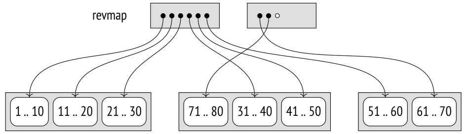
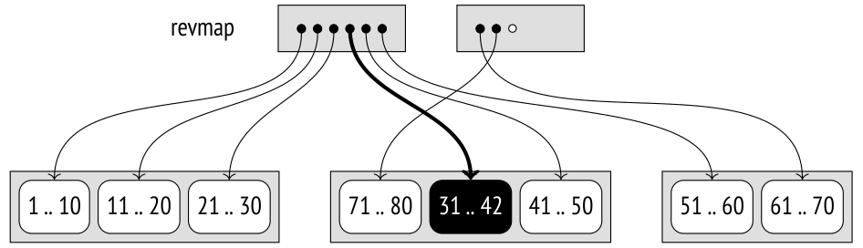
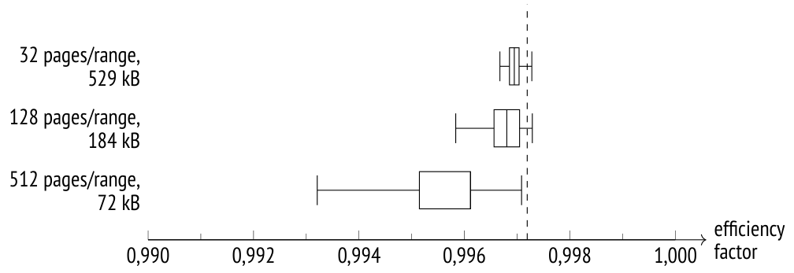
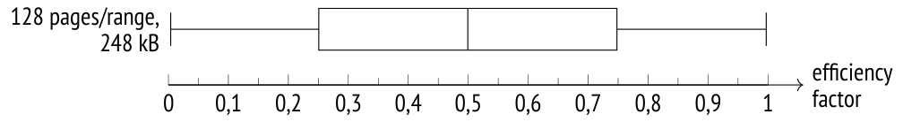
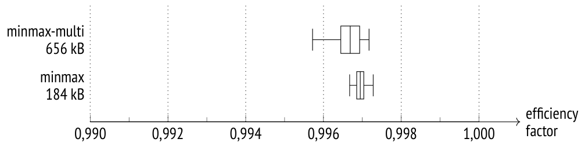
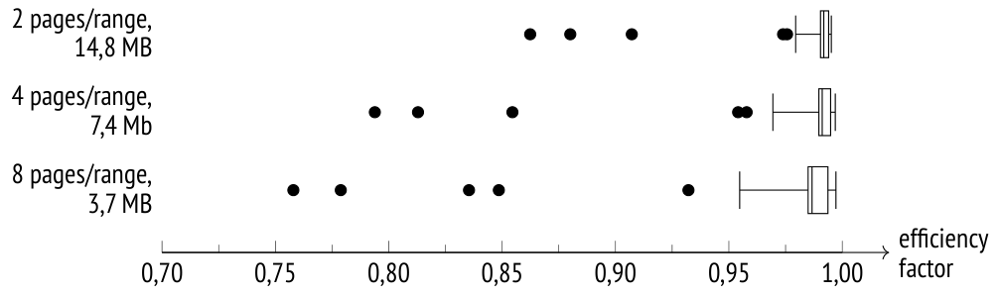

# Chương 29. BRIN

## 29.1 Tổng quan (Overview)

Không giống các index khác vốn được tối ưu để nhanh chóng tìm ra các dòng cần thiết, BRIN[^1] được thiết kế để lọc bỏ các dòng không cần thiết. Access method này được tạo ra chủ yếu cho các bảng lớn, cỡ vài terabyte trở lên, nên kích thước index nhỏ được ưu tiên hơn độ chính xác của tìm kiếm.

Để tăng tốc tìm kiếm, toàn bộ bảng được chia thành các *range* (dải), từ đó có tên gọi: Block Range Index. Mỗi range bao gồm một số page. Index không lưu TID, mà chỉ giữ một bản tóm tắt về dữ liệu của mỗi range. Với các kiểu dữ liệu có thứ tự, trong trường hợp đơn giản nhất đó là giá trị nhỏ nhất và lớn nhất, nhưng các operator class khác nhau có thể thu thập những thông tin khác nhau về các giá trị trong một range.

Số page trong một range được xác định tại thời điểm tạo index dựa trên giá trị của storage parameter *pages_per_range*. *(mặc định: 128)*

Nếu điều kiện truy vấn tham chiếu đến một cột được đánh index, tất cả các range được đảm bảo không có giá trị khớp đều có thể được bỏ qua. Các page của tất cả những range còn lại được index trả về dưới dạng một *lossy bitmap* (bitmap mất mát thông tin); tất cả các dòng của những page này phải được kiểm tra lại. *[→ tr. 342](20-index-scans.md)*

Do đó, BRIN hoạt động tốt với các cột có giá trị mang tính cục bộ (tức là các cột mà trong đó những giá trị được lưu gần nhau có các thuộc tính thông tin tóm tắt tương tự nhau). Với các kiểu dữ liệu có thứ tự, điều này có nghĩa là các giá trị phải được lưu theo thứ tự tăng dần hoặc giảm dần, tức là có *correlation* (tương quan) cao giữa vị trí vật lý của chúng và thứ tự logic được xác định bởi các phép toán *greater than* và *less than* *[→ tr. 284](17-statistics.md)*. Với các loại thông tin tóm tắt khác, "các thuộc tính tương tự" có thể khác nhau.

Sẽ không sai nếu nghĩ về BRIN như một bộ tăng tốc cho sequential scan trên heap hơn là một index theo nghĩa thông thường của từ này. Nó có thể được xem như một giải pháp thay thế cho partitioning (phân vùng), trong đó mỗi range đại diện cho một partition ảo.

## 29.2 Ví dụ (Example)

Cơ sở dữ liệu demo của chúng ta không có bảng nào đủ lớn cho BRIN, nhưng ta có thể hình dung rằng các báo cáo phân tích đòi hỏi phải có một bảng phi chuẩn hoá chứa thông tin tóm tắt về tất cả các chuyến bay đi và đến của một sân bay cụ thể, chi tiết đến từng ghế đã có người ngồi. Dữ liệu của mỗi sân bay được cập nhật hằng ngày, ngay khi đến nửa đêm theo múi giờ tương ứng. Dữ liệu đã thêm vào không bị cập nhật hay xoá.

Bảng có dạng như sau:

```
CREATE TABLE flights_bi(
  airport_code char(3),
  airport_coord point,        -- airport coordinates
  airport_utc_offset interval, -- timezone
  flight_no char(6),
  flight_type text,           -- departure or arrival
  scheduled_time timestamptz,
  actual_time timestamptz,
  aircraft_code char(3),
  seat_no varchar(4),
  fare_conditions varchar(10), -- travel class
  passenger_id varchar(20),
  passenger_name text
);
```

Việc nạp dữ liệu có thể được mô phỏng bằng các vòng lặp lồng nhau:[^2] vòng lặp ngoài tương ứng với các ngày (cơ sở dữ liệu demo lưu dữ liệu của một năm), còn vòng lặp trong dựa trên các múi giờ. Kết quả là dữ liệu được nạp sẽ ít nhiều có thứ tự, ít nhất là theo thời gian và theo sân bay, mặc dù nó không được sắp xếp tường minh bên trong vòng lặp.

Tôi sẽ nạp một bản sao có sẵn của cơ sở dữ liệu, chiếm khoảng 4 GB và chứa khoảng 30 triệu dòng:[^3]

```
postgres$ pg_restore -d demo -c flights_bi.dump
=> ANALYZE flights_bi;
=> SELECT count(*) FROM flights_bi;
  count
----------
 30517076
(1 row)
=> SELECT pg_size_pretty(pg_total_relation_size('flights_bi'));
 pg_size_pretty
----------------
 4129 MB
(1 row)
```

Khó có thể gọi đây là một bảng lớn, nhưng lượng dữ liệu này đủ để minh hoạ cách BRIN hoạt động. Tôi sẽ tạo trước một index:

```
=> CREATE INDEX ON flights_bi USING brin(scheduled_time);
=> SELECT pg_size_pretty(pg_total_relation_size(
  'flights_bi_scheduled_time_idx'
));
 pg_size_pretty
----------------
 184 kB
(1 row)
```

Với các thiết lập mặc định, nó chiếm rất ít không gian.

Một index B-tree lớn hơn cả nghìn lần, ngay cả khi bật tính năng khử trùng lặp dữ liệu (deduplication) *(v. 13)*. Đúng là hiệu quả của nó cũng cao hơn nhiều, nhưng dung lượng bổ sung có thể trở thành một thứ xa xỉ không kham nổi đối với các bảng thực sự lớn.

```
=> CREATE INDEX flights_bi_btree_idx ON flights_bi(scheduled_time);
=> SELECT pg_size_pretty(pg_total_relation_size(
  'flights_bi_btree_idx'
));
 pg_size_pretty
----------------
 210 MB
(1 row)
=> DROP INDEX flights_bi_btree_idx;
```

## 29.3 Bố cục page (Page Layout)

Page số không của một index BRIN được gọi là *metapage*; nó lưu thông tin về cấu trúc index.

Tại một độ lệch nhất định so với metadata là các page chứa *thông tin tóm tắt* (summary information). Mỗi index entry trong page như vậy chứa bản tóm tắt của một block range cụ thể.

Khoảng không gian giữa metapage và thông tin tóm tắt được chiếm bởi *range map*, đôi khi còn được gọi là *reverse map* (vì vậy có cách viết tắt phổ biến là *revmap*). Thực chất nó là một mảng các con trỏ đến các index row tương ứng; chỉ số trong mảng này tương ứng với số thứ tự của range.




Khi bảng mở rộng, kích thước của range map cũng tăng lên. Nếu map không vừa trong các page đã cấp phát, nó sẽ chiếm lấy page kế tiếp, và tất cả các index entry trước đó nằm trong page này được chuyển sang các page khác. Vì một page có thể chứa rất nhiều con trỏ nên những lần chuyển như vậy khá hiếm.

Các page của index BRIN có thể được hiển thị bằng extension `pageinspect`, như thường lệ. Metadata bao gồm kích thước của range và số page được dành cho range map:

```
=> SELECT pagesperrange, lastrevmappage
FROM brin_metapage_info(get_raw_page(
  'flights_bi_scheduled_time_idx', 0
));
 pagesperrange | lastrevmappage
---------------+----------------
           128 |             4
(1 row)
```

Ở đây range map chiếm bốn page, từ page thứ nhất đến page thứ tư. Ta có thể xem các con trỏ đến các index entry chứa dữ liệu tóm tắt:

```
=> SELECT *
FROM brin_revmap_data(get_raw_page(
  'flights_bi_scheduled_time_idx', 1
));
  pages
----------
 (6,197)
 (6,198)
 (6,199)
 ...
 (6,195)
 (6,196)
(1360 rows)
```

Nếu range chưa được tóm tắt, con trỏ trong range map là NULL.

Và đây là các bản tóm tắt của một vài range:

```
=> SELECT itemoffset, blknum, value
FROM brin_page_items(
  get_raw_page('flights_bi_scheduled_time_idx', 6),
  'flights_bi_scheduled_time_idx'
)
ORDER BY blknum
LIMIT 3 \gx
-[ RECORD 1 ]--------------------------------------------------
itemoffset | 197
blknum     | 0
value      | {2016-08-15 02:45:00+03 .. 2016-08-15 16:20:00+03}
-[ RECORD 2 ]--------------------------------------------------
itemoffset | 198
blknum     | 128
value      | {2016-08-15 05:50:00+03 .. 2016-08-15 18:55:00+03}
-[ RECORD 3 ]--------------------------------------------------
itemoffset | 199
blknum     | 256
value      | {2016-08-15 07:15:00+03 .. 2016-08-15 18:50:00+03}
-[ RECORD 4 ]--------------------------------------------------
itemoffset | 200
blknum     | 384
value      | 2016-08-15 07:55:00+03 .. 2016-08-15 20:20:00+03
```

## 29.4 Tìm kiếm (Search)

Nếu một điều kiện truy vấn được index BRIN hỗ trợ,[^4] executor sẽ quét range map và thông tin tóm tắt của từng range. Nếu dữ liệu trong một range có thể khớp với khoá tìm kiếm, tất cả các page thuộc range này được thêm vào bitmap. Vì BRIN không lưu ID của từng tuple riêng lẻ nên bitmap luôn là lossy.

Việc đối chiếu dữ liệu với khoá tìm kiếm được thực hiện bởi *consistency function* (hàm nhất quán), hàm này diễn giải thông tin tóm tắt của range. Các range chưa được tóm tắt luôn được thêm vào bitmap.

Bitmap nhận được sẽ được dùng để quét bảng theo cách thông thường. Điều quan trọng cần nhắc đến là việc đọc các heap page diễn ra tuần tự, từng block range một, và có sử dụng prefetching (đọc trước) *[→ tr. 340](20-index-scans.md)*.

## 29.5 Cập nhật thông tin tóm tắt (Summary Information Updates)

### Chèn giá trị (Value Insertion)

Khi một tuple mới được thêm vào một heap page, thông tin tóm tắt trong index range tương ứng sẽ được cập nhật.[^5] Số thứ tự của range được tính từ số page bằng các phép toán số học đơn giản, sau đó thông tin tóm tắt được định vị nhờ range map.

Để xác định xem thông tin tóm tắt hiện tại có cần được mở rộng hay không, *addition function* (hàm bổ sung) được sử dụng. Nếu cần mở rộng và page có đủ không gian trống, việc này được thực hiện tại chỗ (không thêm index entry mới).

Giả sử ta đã thêm một tuple có giá trị 42 vào page 13. Số thứ tự của range được tính bằng phép chia nguyên số page cho kích thước range. Giả sử kích thước range bằng bốn page, ta được range số 3; vì việc đánh số range bắt đầu từ 0, ta lấy con trỏ thứ tư trong range map. Giá trị nhỏ nhất trong range này là 31, giá trị lớn nhất là 40. Giá trị được thêm vào nằm ngoài các giới hạn này, nên giá trị lớn nhất được tăng lên:




Nếu không thể cập nhật tại chỗ, một entry mới sẽ được thêm vào và range map được sửa đổi.

### Tóm tắt range (Range Summarization)

Mọi điều nói ở trên áp dụng cho các tình huống khi một tuple mới xuất hiện trong một range đã được tóm tắt. Khi một index được xây dựng, tất cả các range hiện có đều được tóm tắt, nhưng khi bảng lớn lên, các page mới có thể nằm ngoài những range này.

Nếu index được tạo với storage parameter *autosummarize* được bật *(mặc định: off)*, range mới sẽ được tóm tắt ngay lập tức. Nhưng trong các kho dữ liệu (data warehouse), nơi các dòng thường được thêm vào theo từng lô lớn chứ không phải từng dòng một, chế độ này có thể làm chậm nghiêm trọng việc chèn dữ liệu.

Theo mặc định, các range mới không được tóm tắt ngay. Điều này không ảnh hưởng đến tính đúng đắn của index vì các range không có thông tin tóm tắt luôn được quét. Việc tóm tắt được thực hiện bất đồng bộ, hoặc trong quá trình vacuum bảng *[→ tr. 112](06-vacuum-and-autovacuum.md)*, hoặc khi được khởi động thủ công bằng cách gọi hàm `brin_summarize_new_values` (hoặc hàm `brin_summarize_range` xử lý một range duy nhất).

Việc tóm tắt range[^6] không khoá bảng đối với các thao tác cập nhật. Khi bắt đầu quá trình này, một entry giữ chỗ (placeholder) được chèn vào index cho range này. Nếu dữ liệu trong range bị thay đổi trong khi range này đang được quét, placeholder sẽ được cập nhật bằng thông tin tóm tắt về những thay đổi này. Sau đó *union function* (hàm hợp) sẽ hợp nhất dữ liệu này với thông tin tóm tắt của range tương ứng.

Về lý thuyết, đôi khi thông tin tóm tắt có thể co lại sau khi một số dòng bị xoá. Nhưng trong khi index GiST có thể phân phối lại dữ liệu sau khi tách page *[→ tr. 445](26-gist.md)*, thông tin tóm tắt của index BRIN không bao giờ co lại mà chỉ có thể rộng ra. Việc co lại thường không cần thiết ở đây vì một kho lưu trữ dữ liệu thường chỉ được dùng để nối thêm dữ liệu mới. Bạn có thể xoá thủ công thông tin tóm tắt bằng cách gọi hàm `brin_desummarize_range` để range này được tóm tắt lại, nhưng không có manh mối nào cho biết range nào có thể được lợi từ việc đó.

Do đó, BRIN chủ yếu nhắm đến các bảng có kích thước rất lớn, hoặc có rất ít cập nhật và chủ yếu thêm dòng mới vào cuối file, hoặc hoàn toàn không được cập nhật. Nó chủ yếu được dùng trong các kho dữ liệu để xây dựng báo cáo phân tích.

## 29.6 Các lớp minmax (Minmax Classes)

Với các kiểu dữ liệu cho phép so sánh giá trị, thông tin tóm tắt bao gồm ít nhất giá trị lớn nhất và nhỏ nhất. Các operator class tương ứng có chứa từ `minmax` trong tên:[^7]

```
=> SELECT opcname
FROM pg_am am
  JOIN pg_opclass opc ON opcmethod = am.oid
WHERE amname = 'brin'
AND opcname LIKE '%minmax_ops'
ORDER BY opcname;
```

```
        opcname
------------------------
 bit_minmax_ops
 bpchar_minmax_ops
 bytea_minmax_ops
 ...
 timetz_minmax_ops
 uuid_minmax_ops
 varbit_minmax_ops
(26 rows)
```

Đây là các support function (hàm hỗ trợ) của những operator class này:

```
=> SELECT amprocnum, amproc::regproc
FROM pg_am am
  JOIN pg_opclass opc ON opcmethod = am.oid
  JOIN pg_amproc amop ON amprocfamily = opcfamily
WHERE amname = 'brin'
AND opcname = 'numeric_minmax_ops'
ORDER BY amprocnum;
 amprocnum |         amproc
-----------+------------------------
         1 | brin_minmax_opcinfo
         2 | brin_minmax_add_value
         3 | brin_minmax_consistent
         4 | brin_minmax_union
(4 rows)
```

Hàm đầu tiên trả về metadata của operator class, còn tất cả các hàm khác đều đã được mô tả: chúng chèn giá trị mới, kiểm tra tính nhất quán và thực hiện phép hợp.

Lớp `minmax` bao gồm cùng các toán tử so sánh mà ta đã thấy ở B-tree *[→ tr. 432](25-b-tree.md)*:

```
=> SELECT amopopr::regoperator, oprcode::regproc, amopstrategy
FROM pg_am am
  JOIN pg_opclass opc ON opcmethod = am.oid
  JOIN pg_amop amop ON amopfamily = opcfamily
  JOIN pg_operator opr ON opr.oid = amopopr
WHERE amname = 'brin'
AND opcname = 'numeric_minmax_ops'
ORDER BY amopstrategy;
       amopopr       | oprcode   | amopstrategy
---------------------+------------+--------------
 <(numeric,numeric)  | numeric_lt |           1
 <=(numeric,numeric) | numeric_le |           2
 =(numeric,numeric)  | numeric_eq |           3
 >=(numeric,numeric) | numeric_ge |           4
 >(numeric,numeric)  | numeric_gt |           5
(5 rows)
```

### Chọn cột để đánh index (Choosing Columns to be Indexed)

Những cột nào nên được đánh index bằng operator class này? Như đã đề cập trước đó, các index như vậy hoạt động tốt nếu vị trí vật lý của các dòng tương quan với thứ tự logic của các giá trị.

Hãy kiểm tra điều này với ví dụ ở trên.

```
=> SELECT attname, correlation, n_distinct
FROM pg_stats
WHERE tablename = 'flights_bi'
ORDER BY correlation DESC NULLS LAST;
      attname       |  correlation  |  n_distinct
--------------------+----------------+--------------
 scheduled_time     |     0.9999949 |        25926
 actual_time        |     0.9999948 |        34469
 fare_conditions    |     0.7976897 |            3
 flight_type        |     0.4981733 |            2
 airport_utc_offset |     0.4440067 |           11
 aircraft_code      |    0.19249801 |            8
 airport_code       |   0.061483838 |          104
 seat_no            |  0.0024594965 |          461
 flight_no          |  0.0020146023 |          710
 passenger_id       | -0.00046121294 | 2.610987e+06
 passenger_name     |  -0.012388787 |         8618
 airport_coord      |               |            0
(12 rows)
```

Dữ liệu được sắp xếp theo thời gian (cả thời gian theo lịch lẫn thời gian thực tế; sự khác biệt giữa chúng rất nhỏ, nếu có): các entry mới được thêm vào theo thứ tự thời gian, và vì dữ liệu không bị cập nhật hay xoá, tất cả các dòng đều đi vào main fork của bảng một cách tuần tự, dòng này nối tiếp dòng kia *[→ tr. 25](01-introduction.md)*.

Các cột `fare_conditions`, `flight_type` và `airport_utc_offset` có correlation tương đối cao, nhưng chúng lưu quá ít giá trị phân biệt.

Correlation ở các cột khác quá thấp để việc đánh index chúng bằng operator class `minmax` có ý nghĩa gì.

### Kích thước range và hiệu quả tìm kiếm (Range Size and Search Efficiency)

Kích thước range phù hợp có thể được xác định dựa trên số page dùng để lưu các giá trị cụ thể.

Hãy xem xét cột `scheduled_time` và lấy thông tin về tất cả các chuyến bay được thực hiện trong 24 giờ. Trước tiên ta cần tìm hiểu dữ liệu liên quan đến khoảng thời gian này chiếm bao nhiêu page của bảng.

Để có con số này, ta có thể tận dụng việc một TID bao gồm số page và offset. Đáng tiếc là không có hàm dựng sẵn nào để tách TID thành hai thành phần này, nên ta sẽ phải tự viết một hàm vụng về để thực hiện ép kiểu thông qua biểu diễn dạng text:

```
=> CREATE FUNCTION tid2page(t tid) RETURNS integer
LANGUAGE sql
RETURN (t::text::point)[0]::integer;
```

Bây giờ ta có thể xem các ngày được phân bố trong bảng như thế nào:

```
=> SELECT min(numblk), round(avg(numblk)) avg, max(numblk)
FROM (
  SELECT count(distinct tid2page(ctid)) numblk
  FROM flights_bi
  GROUP BY scheduled_time::date
) t;
 min  | avg  | max
------+------+------
 1192 | 1447 | 1512
(1 row)
```

Như có thể thấy, sự phân bố dữ liệu không hoàn toàn đồng đều. Với kích thước range tiêu chuẩn là 128 page, mỗi ngày sẽ chiếm từ 9 đến 12 range. Khi lấy dữ liệu cho một ngày cụ thể, index scan sẽ trả về cả những dòng thực sự cần thiết lẫn một số dòng thuộc các ngày khác nhưng nằm trong cùng các range. Kích thước range càng lớn thì càng nhiều giá trị biên thừa được đọc; ta có thể thay đổi số lượng của chúng bằng cách giảm hoặc tăng kích thước range.

Hãy thử một truy vấn cho một ngày cụ thể nào đó (tôi đã tạo sẵn một index với các thiết lập mặc định). Để đơn giản, tôi sẽ cấm thực thi song song:

```
=> SET max_parallel_workers_per_gather = 0;
=> \set d '2016-08-15 02:45:00+03'
=> EXPLAIN (analyze, buffers, costs off, timing off, summary off)
SELECT * FROM flights_bi
WHERE scheduled_time >= :'d'::timestamptz
  AND scheduled_time < :'d'::timestamptz + interval '1 day';
                            QUERY PLAN
---------------------------------------------------------------------
 Bitmap Heap Scan on flights_bi (actual rows=81964 loops=1)
   Recheck Cond: ((scheduled_time >= '2016-08-15 02:45:00+03'::ti...
   Rows Removed by Index Recheck: 11606
   Heap Blocks: lossy=1536
   Buffers: shared hit=1561
   -> Bitmap Index Scan on flights_bi_scheduled_time_idx
       (actual rows=15360 loops=1)
       Index Cond: ((scheduled_time >= '2016-08-15 02:45:00+03'::...
       Buffers: shared hit=25
```

```
 Planning:
   Buffers: shared hit=1
(11 rows)
```

Ta có thể định nghĩa *hệ số hiệu quả* (efficiency factor) của một index BRIN đối với một truy vấn cụ thể là tỉ số giữa số page được bỏ qua trong index scan và tổng số page trong bảng. Nếu hệ số hiệu quả bằng không, việc truy cập qua index suy biến thành sequential scan (chưa tính đến chi phí phụ trội). Hệ số hiệu quả càng cao thì càng ít page phải đọc *[→ tr. 348](20-index-scans.md)*. Nhưng vì một số page chứa dữ liệu cần trả về và không thể bỏ qua, hệ số hiệu quả luôn nhỏ hơn một.

Trong trường hợp cụ thể này, hệ số hiệu quả là (528417 − 1561) / 528417 ≈ 0.997, trong đó 528,417 là số page trong bảng.

Tuy nhiên, ta không thể rút ra kết luận có ý nghĩa nào dựa trên một giá trị duy nhất. Ngay cả khi dữ liệu phân bố đồng đều và correlation là lý tưởng, hiệu quả vẫn sẽ dao động vì, ít nhất là, ranh giới của range sẽ không trùng với ranh giới của page. Ta chỉ có thể có bức tranh đầy đủ nếu coi hệ số hiệu quả là một biến ngẫu nhiên và phân tích phân phối của nó.

Với ví dụ của chúng ta, ta có thể chọn tất cả các ngày khác nhau trong năm, kiểm tra execution plan cho từng giá trị, và tính toán thống kê dựa trên tập lựa chọn này. Ta có thể dễ dàng tự động hoá quá trình này vì lệnh `EXPLAIN` có thể trả kết quả ở định dạng JSON, vốn thuận tiện để phân tích cú pháp. Tôi sẽ không đưa toàn bộ code ở đây, nhưng đoạn mã sau chứa tất cả các chi tiết quan trọng:

```
=> DO $$
DECLARE
  plan jsonb;
BEGIN
  EXECUTE
    'EXPLAIN (analyze, buffers, timing off, costs off, format json)
     SELECT * FROM flights_bi
     WHERE scheduled_time >= $1
       AND scheduled_time < $1 + interval ''1 day'''
  USING '2016-08-15 02:45:00+03'::timestamptz
  INTO plan;
  RAISE NOTICE 'shared hit=%, read=%',
    plan -> 0 -> 'Plan' ->> 'Shared Hit Blocks',
    plan -> 0 -> 'Plan' ->> 'Shared Read Blocks';
END;
$$;
NOTICE:  shared hit=1561, read=0
DO
```

Kết quả có thể được hiển thị trực quan dưới dạng biểu đồ hộp (box plot), còn gọi là biểu đồ "hộp và râu" (box-and-whiskers). Các "râu" ở đây biểu thị tứ phân vị thứ nhất và thứ tư (tức là râu bên phải chứa 25% giá trị lớn nhất, còn râu bên trái chứa 25% giá trị nhỏ nhất). Bản thân chiếc hộp chứa 50% giá trị còn lại và có đánh dấu giá trị trung vị. Quan trọng hơn, cách biểu diễn gọn gàng này cho phép ta so sánh trực quan các kết quả khác nhau. Hình minh hoạ sau đây cho thấy phân phối của hệ số hiệu quả với kích thước range mặc định và với hai kích thước khác lớn hơn và nhỏ hơn bốn lần.

Đúng như ta có thể dự đoán, độ chính xác và hiệu quả tìm kiếm đều cao ngay cả với các range khá lớn.

Đường nét đứt ở đây đánh dấu giá trị trung bình của hệ số hiệu quả tối đa có thể đạt được cho truy vấn này, giả sử rằng một ngày chiếm khoảng 1/365 của bảng.



Lưu ý rằng sự gia tăng hiệu quả phải trả giá bằng việc tăng kích thước index. BRIN khá linh hoạt trong việc cho phép bạn tìm điểm cân bằng giữa hai yếu tố này.

### Các thuộc tính (Properties)

Các thuộc tính của BRIN được cố định cứng và không phụ thuộc vào operator class.

**Thuộc tính của access method (Access Method Properties)**

```
=> SELECT a.amname, p.name, pg_indexam_has_property(a.oid, p.name)
FROM pg_am a, unnest(array[
  'can_order', 'can_unique', 'can_multi_col',
  'can_exclude', 'can_include'
]) p(name)
WHERE a.amname = 'brin';
 amname |     name     | pg_indexam_has_property
--------+---------------+-------------------------
 brin   | can_order    | f
 brin   | can_unique   | f
 brin   | can_multi_col | t
 brin   | can_exclude  | f
 brin   | can_include  | f
(5 rows)
```

Hiển nhiên, cả thuộc tính sắp xếp lẫn thuộc tính duy nhất (uniqueness) đều không được hỗ trợ. Vì index BRIN luôn trả về một bitmap nên exclusion constraint cũng không được hỗ trợ. Các cột `INCLUDE` bổ sung cũng chẳng có ý nghĩa gì, vì ngay cả các khoá index cũng không được lưu trong index BRIN.

Tuy nhiên, ta có thể tạo index BRIN nhiều cột. Trong trường hợp này, thông tin tóm tắt của mỗi cột được thu thập và lưu trong một index entry riêng, nhưng chúng vẫn có chung một range map. Index như vậy hữu ích nếu cùng một kích thước range có thể áp dụng cho tất cả các cột được đánh index.

Ngoài ra, ta có thể tạo các index BRIN riêng cho nhiều cột và tận dụng việc các bitmap có thể được kết hợp với nhau *[→ tr. 343](20-index-scans.md)*. Ví dụ:

```
=> CREATE INDEX ON flights_bi USING brin(airport_utc_offset);
=> EXPLAIN (analyze, costs off, timing off, summary off)
SELECT *
FROM flights_bi
WHERE scheduled_time >= :'d'::timestamptz
  AND scheduled_time < :'d'::timestamptz + interval '1 day'
  AND airport_utc_offset = '08:00:00';
                            QUERY PLAN
---------------------------------------------------------------------
 Bitmap Heap Scan on flights_bi (actual rows=1658 loops=1)
   Recheck Cond: ((scheduled_time >= '2016-08-15 02:45:00+03'::ti...
   Rows Removed by Index Recheck: 14077
   Heap Blocks: lossy=256
   -> BitmapAnd (actual rows=0 loops=1)
       -> Bitmap Index Scan on flights_bi_scheduled_time_idx (act...
           Index Cond: ((scheduled_time >= '2016-08-15 02:45:00+0...
       -> Bitmap Index Scan on flights_bi_airport_utc_offset_idx ...
           Index Cond: (airport_utc_offset = '08:00:00'::interval)
(9 rows)
```

**Thuộc tính mức index (Index-Level Properties)**

```
=> SELECT p.name, pg_index_has_property(
  'flights_bi_scheduled_time_idx', p.name
)
FROM unnest(array[
  'clusterable', 'index_scan', 'bitmap_scan', 'backward_scan'
]) p(name);
     name      | pg_index_has_property
---------------+-----------------------
 clusterable   | f
 index_scan    | f
 bitmap_scan   | t
 backward_scan | f
(4 rows)
```

Hiển nhiên, bitmap scan là kiểu truy cập duy nhất được hỗ trợ.

Việc thiếu khả năng clusterization (sắp xếp lại bảng theo index) có vẻ khó hiểu. Vì BRIN nhạy cảm với thứ tự vật lý của các dòng, sẽ khá hợp lý khi cho rằng nó nên hỗ trợ việc sắp xếp lại, điều sẽ tối đa hoá hiệu quả của nó. Nhưng dù sao thì clusterization các bảng lớn cũng là một thứ xa xỉ, nếu tính đến toàn bộ khối lượng xử lý và không gian đĩa bổ sung cần thiết để xây dựng lại bảng. Hơn nữa, như ví dụ về bảng `flights_bi` cho thấy, một mức độ sắp xếp nào đó trong các kho dữ liệu có thể xuất hiện một cách tự nhiên.

**Thuộc tính mức cột (Column-Level Properties)**

```
=> SELECT p.name, pg_index_column_has_property(
  'flights_bi_scheduled_time_idx', 1, p.name
)
FROM unnest(array[
  'orderable', 'distance_orderable', 'returnable',
  'search_array', 'search_nulls'
]) p(name);
        name        | pg_index_column_has_property
--------------------+------------------------------
 orderable          | f
 distance_orderable | f
 returnable         | f
 search_array       | f
 search_nulls       | t
(5 rows)
```

Thuộc tính mức cột duy nhất khả dụng là hỗ trợ NULL. Để theo dõi các giá trị NULL trong một range, thông tin tóm tắt cung cấp một thuộc tính riêng:

```
=> SELECT hasnulls, allnulls, value
FROM brin_page_items(
  get_raw_page('flights_bi_airport_utc_offset_idx', 6),
  'flights_bi_airport_utc_offset_idx'
)
WHERE itemoffset= 1;
 hasnulls | allnulls |        value
----------+----------+------------------------
 f        | f        | {03:00:00 .. 03:00:00}
(1 row)
```

## 29.7 Các lớp minmax-multi (Minmax-Multi Classes) *(v. 14)*

Correlation đã được thiết lập có thể dễ dàng bị phá vỡ bởi các thao tác cập nhật dữ liệu. Nguyên nhân không nằm ở việc sửa đổi thực sự một giá trị cụ thể mà ở chính thiết kế MVCC: row version cũ của một dòng có thể bị xoá ở một page, trong khi row version mới của nó có thể được chèn vào bất kỳ vị trí nào hiện đang trống *[→ tr. 66](03-pages-and-tuples.md)*, nên thứ tự ban đầu của các dòng không thể được bảo toàn.

Để giảm thiểu phần nào ảnh hưởng này, ta có thể giảm giá trị của storage parameter *fillfactor* để chừa thêm không gian trong page cho các lần cập nhật sau này. Nhưng liệu có thực sự đáng để tăng kích thước của một bảng vốn đã rất lớn? Hơn nữa, dù sao thì các thao tác xoá cũng sẽ giải phóng một ít không gian trong các page hiện có, từ đó giăng bẫy cho các tuple mới, vốn lẽ ra sẽ được đưa vào cuối file.

Tình huống như vậy có thể dễ dàng được mô phỏng. Hãy xoá 0.1% số dòng được chọn ngẫu nhiên và vacuum bảng để dọn một ít không gian cho các tuple mới:

```
=> WITH t AS (
  SELECT ctid
  FROM flights_bi TABLESAMPLE BERNOULLI(0.1) REPEATABLE(0)
)
DELETE FROM flights_bi
WHERE ctid IN (SELECT ctid FROM t);
DELETE 30180
=> VACUUM flights_bi;
```

Bây giờ hãy thêm một ít dữ liệu cho một ngày mới ở một trong các múi giờ. Tôi sẽ đơn giản sao chép dữ liệu của ngày hôm trước:

```
=> INSERT INTO flights_bi
SELECT airport_code, airport_coord, airport_utc_offset,
  flight_no, flight_type, scheduled_time + interval '1 day',
  actual_time + interval '1 day', aircraft_code, seat_no,
 fare_conditions, passenger_id, passenger_name
FROM flights_bi
WHERE date_trunc('day', scheduled_time) = '2017-08-15'
  AND airport_utc_offset = '03:00:00';
INSERT 0 40532
```

Thao tác xoá vừa thực hiện đã đủ để giải phóng một ít không gian trong tất cả hoặc gần như tất cả các range. Khi rơi vào các page nằm đâu đó ở giữa file, các tuple mới đã tự động mở rộng các range. Ví dụ, thông tin tóm tắt của range đầu tiên trước đây chỉ bao phủ chưa đến một ngày, nhưng giờ đây nó bao trùm cả năm:

```
=> SELECT value
FROM brin_page_items(
  get_raw_page('flights_bi_scheduled_time_idx', 6),
  'flights_bi_scheduled_time_idx'
)
WHERE blknum = 0;
                       value
----------------------------------------------------
 {2016-08-15 02:45:00+03 .. 2017-08-16 09:35:00+03}
(1 row)
```

Ngày được chỉ định trong truy vấn càng nhỏ thì càng nhiều range phải được quét. Đồ thị cho thấy mức độ nghiêm trọng của thảm hoạ:



Để giải quyết vấn đề này, ta phải làm cho thông tin tóm tắt tinh vi hơn một chút: thay vì một khoảng liên tục duy nhất, ta phải lưu nhiều khoảng nhỏ hơn mà khi gộp lại sẽ bao phủ tất cả các giá trị. Khi đó một khoảng có thể bao phủ tập dữ liệu chính, còn các khoảng còn lại sẽ xử lý những giá trị ngoại lai thỉnh thoảng xuất hiện.

Chức năng như vậy được cung cấp bởi các operator class `minmax-multi`:[^8]

```
=> SELECT opcname
FROM pg_am am
  JOIN pg_opclass opc ON opcmethod = am.oid
WHERE amname = 'brin'
AND opcname LIKE '%minmax_multi_ops'
ORDER BY opcname;
           opcname
------------------------------
 date_minmax_multi_ops
 float4_minmax_multi_ops
 float8_minmax_multi_ops
 inet_minmax_multi_ops
 ...
 time_minmax_multi_ops
 timestamp_minmax_multi_ops
 timestamptz_minmax_multi_ops
 timetz_minmax_multi_ops
 uuid_minmax_multi_ops
(19 rows)
```

So với các operator class `minmax`, các lớp `minmax-multi` có thêm một support function tính khoảng cách giữa các giá trị; hàm này được dùng để xác định độ dài của khoảng, thứ mà operator class cố gắng giảm thiểu:

```
=> SELECT amprocnum, amproc::regproc
FROM pg_am am
  JOIN pg_opclass opc ON opcmethod = am.oid
  JOIN pg_amproc amop ON amprocfamily = opcfamily
WHERE amname = 'brin'
AND opcname = 'numeric_minmax_multi_ops'
ORDER BY amprocnum;
```

```
 amprocnum |              amproc
-----------+------------------------------------
         1 | brin_minmax_multi_opcinfo
         2 | brin_minmax_multi_add_value
         3 | brin_minmax_multi_consistent
         4 | brin_minmax_multi_union
         5 | brin_minmax_multi_options
        11 | brin_minmax_multi_distance_numeric
(6 rows)
```

Các toán tử của những lớp như vậy hoàn toàn giống với các toán tử của lớp `minmax`.

Các lớp `Minmax-multi` có thể nhận tham số *values_per_range*, tham số này xác định số lượng tối đa các giá trị tóm tắt được phép trên mỗi range *(mặc định: 32)*. Một giá trị tóm tắt được biểu diễn bằng hai số (một khoảng), trong khi một điểm riêng lẻ chỉ cần một số. Nếu không đủ số giá trị cho phép, một số khoảng sẽ bị rút gọn.[^9]

Hãy xây dựng một index `minmax-multi` thay cho index hiện có. Ta sẽ giới hạn số giá trị được phép trên mỗi range là 16:

```
=> DROP INDEX flights_bi_scheduled_time_idx;
=> CREATE INDEX ON flights_bi USING brin(
  scheduled_time timestamptz_minmax_multi_ops(
    values_per_range = 16
  )
);
```

Đồ thị cho thấy index mới đưa hiệu quả trở lại mức ban đầu. Hoàn toàn đúng như dự đoán, nó dẫn đến việc tăng kích thước index:



## 29.8 Các lớp inclusion (Inclusion Classes)

Sự khác biệt giữa các operator class `minmax` và `inclusion` gần giống như sự khác biệt giữa B-tree và index GiST: loại sau được thiết kế cho các kiểu dữ liệu không hỗ trợ phép so sánh, mặc dù vị trí tương đối giữa các giá trị vẫn có ý nghĩa đối với chúng. Thông tin tóm tắt cho một range cụ thể do các operator class `inclusion` cung cấp được biểu diễn bằng hình chữ nhật bao (bounding box) của các giá trị trong range này.

Dưới đây là các operator class này; chúng không nhiều:

```
=> SELECT opcname
FROM pg_am am
  JOIN pg_opclass opc ON opcmethod = am.oid
WHERE amname = 'brin'
AND opcname LIKE '%inclusion_ops'
ORDER BY opcname;
       opcname
---------------------
 box_inclusion_ops
 inet_inclusion_ops
 range_inclusion_ops
(3 rows)
```

Danh sách support function được mở rộng thêm một hàm bắt buộc dùng để hợp nhất hai giá trị, cùng một loạt hàm tuỳ chọn:

```
=> SELECT amprocnum, amproc::regproc
FROM pg_am am
  JOIN pg_opclass opc ON opcmethod = am.oid
  JOIN pg_amproc amop ON amprocfamily = opcfamily
WHERE amname = 'brin'
AND opcname = 'box_inclusion_ops'
ORDER BY amprocnum;
 amprocnum |          amproc
-----------+---------------------------
         1 | brin_inclusion_opcinfo
         2 | brin_inclusion_add_value
         3 | brin_inclusion_consistent
         4 | brin_inclusion_union
        11 | bound_box
        13 | box_contain
(6 rows)
```

Khi làm việc với các giá trị có thể so sánh, ta dựa vào correlation của chúng; nhưng với các kiểu dữ liệu khác, không có thống kê nào như vậy được thu thập,[^10] nên rất khó dự đoán hiệu quả của một index BRIN dựa trên `inclusion`.

Tệ hơn nữa, correlation ảnh hưởng rất lớn đến việc ước lượng cost của index scan. Nếu không có thống kê này, nó được coi là bằng không.[^11] Do đó, planner không có cách nào phân biệt giữa index `inclusion` chính xác và index `inclusion` kém chính xác, nên nó thường tránh dùng chúng hoàn toàn.

> PostGIS có thu thập thống kê về correlation của dữ liệu không gian. *(v. 3.1.1)*

Trong trường hợp cụ thể này, ta có thể giả định rằng việc xây dựng index trên toạ độ sân bay là có ý nghĩa, vì kinh độ hẳn phải tương quan với múi giờ.

Không giống các predicate của GiST, thông tin tóm tắt của BRIN có cùng kiểu với dữ liệu được đánh index; do đó, không dễ để xây dựng index cho các điểm. Nhưng ta có thể tạo một expression index (index trên biểu thức) bằng cách chuyển các điểm thành các hình chữ nhật giả:

```
=> CREATE INDEX ON flights_bi USING brin(box(airport_coord))
WITH (pages_per_range = 8);
=> SELECT pg_size_pretty(pg_total_relation_size(
  'flights_bi_box_idx'
));
 pg_size_pretty
----------------
 3816 kB
(1 row)
```

Một index được xây dựng trên múi giờ với cùng kích thước range chiếm dung lượng xấp xỉ như vậy (3288 kB).

Các toán tử có trong lớp này tương tự như các toán tử của GiST. Ví dụ, một index BRIN có thể được dùng để tăng tốc việc tìm kiếm các điểm trong một khu vực nhất định:

```
=> SELECT airport_code, airport_name
FROM airports
WHERE box(coordinates) <@ box '135,45,140,50';
 airport_code |      airport_name
--------------+-------------------------
 KHV          | Khabarovsk-Novy Airport
(1 row)
```

Nhưng như đã đề cập trước đó, planner từ chối sử dụng index scan trừ khi ta tắt sequential scan:

```
=> EXPLAIN (costs off)
SELECT *
FROM flights_bi
WHERE box(airport_coord) <@ box '135,45,140,50';
                        QUERY PLAN
------------------------------------------------------------
 Seq Scan on flights_bi
   Filter: (box(airport_coord) <@ '(140,50),(135,45)'::box)
(2 rows)
=> SET enable_seqscan = off;
=> EXPLAIN (analyze, costs off, timing off, summary off)
SELECT *
FROM flights_bi
WHERE box(airport_coord) <@ box '135,45,140,50';
```

```
                            QUERY PLAN
---------------------------------------------------------------------
 Bitmap Heap Scan on flights_bi (actual rows=511414 loops=1)
   Recheck Cond: (box(airport_coord) <@ '(140,50),(135,45)'::box)
   Rows Removed by Index Recheck: 630756
   Heap Blocks: lossy=19656
   -> Bitmap Index Scan on flights_bi_box_idx (actual rows=196560...
       Index Cond: (box(airport_coord) <@ '(140,50),(135,45)'::box)
(6 rows)
=> RESET enable_seqscan;
```

## 29.9 Các lớp bloom (Bloom Classes) *(v. 14)*

Các operator class dựa trên Bloom filter cho phép sử dụng BRIN với bất kỳ kiểu dữ liệu nào hỗ trợ phép toán *equal to* (bằng) và có định nghĩa hàm băm. Chúng cũng có thể được áp dụng cho các kiểu có thứ tự thông thường nếu các giá trị tập trung cục bộ trong từng range riêng biệt nhưng vị trí vật lý của chúng không tương quan với thứ tự logic.

Tên của các operator class như vậy có chứa từ `bloom`:[^12]

```
=> SELECT opcname
FROM pg_am am
  JOIN pg_opclass opc ON opcmethod = am.oid
WHERE amname = 'brin'
AND opcname LIKE '%bloom_ops'
ORDER BY opcname;
        opcname
-----------------------
 bpchar_bloom_ops
 bytea_bloom_ops
 char_bloom_ops
 ...
 timestamptz_bloom_ops
 timetz_bloom_ops
 uuid_bloom_ops
(24 rows)
```

Bloom filter cổ điển là một cấu trúc dữ liệu cho phép bạn nhanh chóng kiểm tra xem một phần tử có thuộc một tập hợp hay không. Filter này rất gọn, nhưng nó cho phép dương tính giả (false positive): một tập hợp có thể bị coi là chứa nhiều phần tử hơn thực tế. Nhưng điều quan trọng hơn là âm tính giả (false negative) bị loại trừ: filter không thể kết luận rằng một phần tử không có mặt trong tập hợp nếu thực ra nó có ở đó.

Filter là một mảng gồm *m* bit (còn gọi là *signature* — chữ ký), ban đầu được điền toàn số không. Ta chọn *k* hàm băm khác nhau để ánh xạ mỗi phần tử của tập hợp tới *k* bit của signature. Khi một phần tử được thêm vào tập hợp, mỗi bit tương ứng trong signature được đặt thành một. Do đó, nếu tất cả các bit tương ứng với một phần tử đều được đặt thành một, phần tử đó *có thể* có mặt trong tập hợp; nếu có ít nhất một bit bằng không, phần tử chắc chắn không có mặt.

Trong trường hợp index BRIN, filter xử lý tập các giá trị của một cột được đánh index thuộc về một range cụ thể; thông tin tóm tắt cho range này được biểu diễn bằng Bloom filter đã được xây dựng.

> Extension bloom[^13] cung cấp index access method riêng dựa trên Bloom filter. Nó xây dựng một filter cho *mỗi dòng của bảng* và làm việc với tập các giá trị *cột* của mỗi dòng. Index như vậy được thiết kế để đánh index nhiều cột cùng lúc và có thể được dùng trong các truy vấn ad hoc, khi chưa biết trước những cột nào sẽ được tham chiếu trong điều kiện lọc. Một index BRIN cũng có thể được xây dựng trên nhiều cột, nhưng thông tin tóm tắt của nó sẽ chứa nhiều Bloom filter độc lập cho từng cột này.

Độ chính xác của Bloom filter phụ thuộc vào độ dài signature. Về mặt lý thuyết, số bit tối ưu của signature có thể được ước lượng bằng *m* = −*n* log<sub>2</sub> *p* / ln 2, trong đó *n* là số phần tử trong tập hợp và *p* là xác suất dương tính giả.

Hai thiết lập này có thể được điều chỉnh bằng các tham số tương ứng của operator class:

- *n_distinct_per_range* xác định số phần tử trong một tập hợp; trong trường hợp này, đó là số giá trị phân biệt trong một range của cột được đánh index *(mặc định: -0.1)*. Giá trị của tham số này được diễn giải giống như thống kê về các giá trị phân biệt: giá trị âm biểu thị tỉ lệ các dòng trong range, chứ không phải số lượng tuyệt đối của chúng *[→ tr. 276](17-statistics.md)*.

- *false_positive_rate* xác định xác suất dương tính giả. *(mặc định: 0.01)*

  Giá trị gần bằng không có nghĩa là index scan gần như chắc chắn sẽ bỏ qua các range không chứa giá trị cần tìm. Nhưng điều đó không đảm bảo tìm kiếm chính xác, vì các range được quét cũng sẽ chứa những dòng thừa không khớp với truy vấn. Hành vi này là do độ rộng của range và vị trí vật lý của dữ liệu chứ không phải do các thuộc tính thực sự của filter.

Danh sách support function được mở rộng thêm một hàm băm:

```
=> SELECT amprocnum, amproc::regproc
FROM pg_am am
  JOIN pg_opclass opc ON opcmethod = am.oid
  JOIN pg_amproc amop ON amprocfamily = opcfamily
WHERE amname = 'brin'
AND opcname = 'numeric_bloom_ops'
ORDER BY amprocnum;
```

```
 amprocnum |        amproc
-----------+-----------------------
         1 | brin_bloom_opcinfo
         2 | brin_bloom_add_value
         3 | brin_bloom_consistent
         4 | brin_bloom_union
         5 | brin_bloom_options
        11 | hash_numeric
(6 rows)
```

Vì Bloom filter dựa trên phép băm nên chỉ toán tử so sánh bằng được hỗ trợ:

```
=> SELECT amopopr::regoperator, oprcode::regproc, amopstrategy
FROM pg_am am
  JOIN pg_opclass opc ON opcmethod = am.oid
  JOIN pg_amop amop ON amopfamily = opcfamily
  JOIN pg_operator opr ON opr.oid = amopopr
WHERE amname = 'brin'
AND opcname = 'numeric_bloom_ops'
ORDER BY amopstrategy;
      amopopr       |  oprcode  | amopstrategy
--------------------+------------+--------------
 =(numeric,numeric) | numeric_eq |           1
(1 row)
```

Hãy lấy cột `flight_no` lưu số hiệu chuyến bay; nó có correlation gần bằng không, nên vô dụng đối với operator class range thông thường. Ta sẽ giữ thiết lập dương tính giả mặc định; còn số giá trị phân biệt trong một range thì có thể dễ dàng tính được. Ví dụ, với range tám page ta sẽ có giá trị sau:

```
=> SELECT max(nd)
FROM (
  SELECT count(distinct flight_no) nd
  FROM flights_bi
  GROUP BY tid2page(ctid) / 8
) t;
 max
-----
  22
(1 row)
```

Với các range nhỏ hơn, con số này sẽ còn thấp hơn nữa (nhưng dù sao thì operator class cũng không cho phép giá trị nhỏ hơn 16).

Ta chỉ cần tạo index và kiểm tra execution plan:

```
=> CREATE INDEX ON flights_bi USING brin(
  flight_no bpchar_bloom_ops(n_distinct_per_range = 22)
)
WITH (pages_per_range = 8);
```

```
=> EXPLAIN (analyze, costs off, timing off, summary off)
SELECT *
FROM flights_bi
WHERE flight_no = 'PG0001';
                            QUERY PLAN
---------------------------------------------------------------------
 Bitmap Heap Scan on flights_bi (actual rows=5192 loops=1)
   Recheck Cond: (flight_no = 'PG0001'::bpchar)
   Rows Removed by Index Recheck: 122894
   Heap Blocks: lossy=2168
   -> Bitmap Index Scan on flights_bi_flight_no_idx (actual rows=...
       Index Cond: (flight_no = 'PG0001'::bpchar)
(6 rows)
=> RESET max_parallel_workers_per_gather;
```

Đồ thị cho thấy với một số số hiệu chuyến bay (được biểu diễn bằng các điểm riêng lẻ không thuộc về râu nào) index hoạt động không tốt lắm, nhưng hiệu quả tổng thể của nó khá cao:



[^1]: postgresql.org/docs/14/brin.html  
backend/access/brin/README
[^2]: edu.postgrespro.ru/internals-14/flights_bi.sql
[^3]: edu.postgrespro.ru/internals-14/flights_bi.dump
[^4]: backend/access/brin/brin.c, hàm bringetbitmap
[^5]: backend/access/brin/brin.c, hàm brininsert
[^6]: backend/access/brin/brin.c, hàm summarize_range
[^7]: backend/access/brin/brin_minmax.c
[^8]: backend/access/brin/brin_minmax_multi.c
[^9]: backend/access/brin/brin_minmax_multi.c, hàm reduce_expanded_ranges
[^10]: backend/commands/analyze.c, hàm compute_scalar_stats
[^11]: backend/utils/adt/selfuncs.c, hàm brincostestimate
[^12]: backend/access/brin/brin_bloom.c
[^13]: postgresql.org/docs/14/bloom.html
