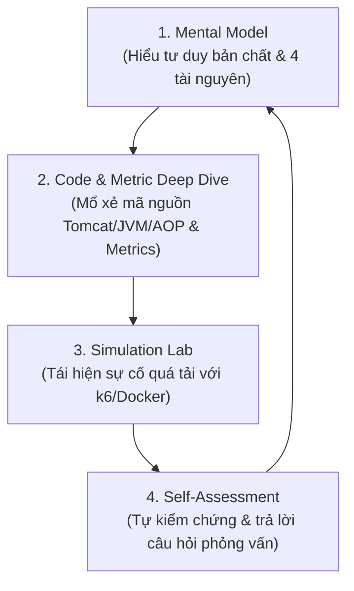

# Java / Spring Boot Scalability — Bộ tài liệu chuyên sâu

Bộ ghi chú nghiên cứu về khả năng mở rộng (scalability) của ứng dụng Java/Spring Boot trên Tomcat: đi từ tầng TCP/kernel → Tomcat internals → JVM concurrency → capacity planning định lượng. Mỗi tài liệu độc lập đọc được, nhưng được thiết kế thành một mạch kiến thức có tham chiếu chéo.

## Cấu trúc chủ đề

### Chủ đề I — Connection & Request Lifecycle
| # | Tài liệu | Nội dung chính |
|---|---|---|
| 01 | [Hành trình một request](./Chủ%20đề%20I%20%E2%80%94%20Connection%20%26%20Request%20Lifecycle/01-connection-request-flow.md) | 3-way handshake, SYN/Accept Queue, `somaxconn` cắt ngọn `accept-count`, mã nguồn Acceptor + LimitLatch, Poller/epoll (C10K), keep-alive, bảng "5 cánh cửa", playbook chẩn đoán 5 phút, thí nghiệm tự kiểm chứng |
| 02 | [Giải phẫu các Timeout](./Chủ%20đề%20I%20%E2%80%94%20Connection%20%26%20Request%20Lifecycle/02-timeouts-and-exceptions.md) | 4 lỗi ở tầng gói tin (SYN retransmit, RST, FIN), ai-là-người-ngắt, retry + idempotency key, idle-timeout lệch pha client/LB/server, timeout budget giảm dần, bảng chẩn đoán 2h sáng |

### Chủ đề II — Concurrency Model
| # | Tài liệu | Nội dung chính |
|---|---|---|
| 03 | [Sync ≠ Blocking, Async ≠ Non-blocking](./Chủ%20đề%20II%20%E2%80%94%20Concurrency%20Model/03-sync-async-blocking-nonblocking.md) | Hai trục độc lập, cơ chế từng ô (socketRead0, Selector, event loop), bẫy `@Async` + JDBC và pool 8 thread mặc định, BlockHound, cây quyết định chọn mô hình |
| 04 | [Thread Lifecycle & bí ẩn RUNNABLE](./Chủ%20đề%20II%20%E2%80%94%20Concurrency%20Model/04-java-thread-lifecycle.md) | 6 trạng thái + điều kiện chuyển, ranh giới JVM/kernel (vì sao chờ DB vẫn RUNNABLE), bảng đối chiếu JVM state vs Linux state, ReentrantLock=WAITING, đọc thread dump bằng pattern đỉnh stack, bẫy jstack với virtual thread (bài học Netflix) |
| 05 | [Virtual Threads](./Chủ%20đề%20II%20%E2%80%94%20Concurrency%20Model/05-virtual-threads.md) | Mount/unmount/continuation từng bước, carrier = ForkJoinPool ≈ số core, scale-not-speed, pinning + JEP 491 (Java 24), Semaphore thay pool, ThreadLocal/ScopedValue, điểm nghẽn dời sang connection pool |

### Chủ đề III — Capacity Planning & Pool Sizing
| # | Tài liệu | Nội dung chính |
|---|---|---|
| 06 | [Tomcat TaskQueue internals](./Chủ%20đề%20III%20%E2%80%94%20Capacity%20Planning%20%26%20Pool%20Sizing/06-tomcat-threadpool-taskqueue.md) | Mã nguồn `TaskQueue.offer()` "nói dối" (thread-trước-queue-sau, ngược executor chuẩn), phép tính latency khi queue vô hạn, cascading failure, van 2 tầng (max-queue-capacity vs Bulkhead), Bulkhead-concurrency ≠ Bucket4j-rate |
| 07 | [Thread pool sizing](./Chủ%20đề%20III%20%E2%80%94%20Capacity%20Planning%20%26%20Pool%20Sizing/07-threadpool-sizing.md) | Chi phí thật của thread (10GB off-heap, context switch), công thức Goetz `core×U×(1+W/C)` + trực giác đằng sau, Little's Law → capacity, container-aware JVM (cgroup/CFS throttling), Cloud Run concurrency phải khớp threads.max, 2 kiểu nghẽn cùng triệu chứng |
| 08 | [DB connection pool sizing](./Chủ%20đề%20III%20%E2%80%94%20Capacity%20Planning%20%26%20Pool%20Sizing/08-database-connection-pool-sizing.md) | Chuỗi 5 phép tính: 1600 RPS → 5 instance → Hikari 17 → 85 tổng → 17 execute → 8 core DB; vì sao more-connections-is-slower (Oracle RWP ~50×), 3 con số 17/85/max_connections, 4 ca giữ-connection-quá-lâu kèm code fix, virtual threads dời van sang connection pool |

### Chủ đề IV — Transaction Management
| # | Tài liệu | Nội dung chính |
|---|---|---|
| 09 | [Proxy & ThreadLocal trong @Transactional](./Chủ%20đề%20IV%20%E2%80%94%20Transaction%20Management/09-transactional-proxy-threadlocal.md) | Tắt `autoCommit`, cơ chế AOP Proxy (JDK Dynamic vs CGLIB), `TransactionInterceptor`, cất Connection vào `ThreadLocal` via `TransactionSynchronizationManager`, lý do self-invocation lơ annotation |
| 10 | [Năm cái bẫy @Transactional](./Chủ%20đề%20IV%20%E2%80%94%20Transaction%20Management/10-transactional-five-traps.md) | 5 bẫy production: Annotation bị lơ, Captive Connection (I/O REST call trong Transaction), Exception Mismatch (Unchecked vs Checked), Transactional Event Listener, Deadlock `REQUIRES_NEW` |

### System Programming — Lập trình hệ thống (UIUC CS 241)
| # | Tài liệu | Nội dung chính |
|---|---|---|
| — | [`System_Programming_VI/`](./System_Programming_VI/) | Bản dịch tiếng Việt đầy đủ **System Programming Coursebook** (University of Illinois, CS 241 — B. Venkatesh, L. Angrave et al.), giấy phép **CC BY 4.0**. 18 chương: C, tiến trình, bộ cấp phát bộ nhớ, luồng, đồng bộ hoá, deadlock, bộ nhớ ảo & IPC, lập lịch, mạng, hệ thống tệp, tín hiệu, bảo mật và các chủ đề nâng cao. Xem [mục lục đầy đủ](./System_Programming_VI/README.md). |

## Phương pháp tiếp thu & Lộ trình đọc

### 🔄 Vòng xoay tiếp thu 4 bước (Learning Flywheel)


### 🎯 Lộ trình đọc khuyến nghị theo vai trò
* **Backend Engineer (Med-Senior):** [01](./Chủ%20đề%20I%20%E2%80%94%20Connection%20%26%20Request%20Lifecycle/01-connection-request-flow.md) → [03](./Chủ%20đề%20II%20%E2%80%94%20Concurrency%20Model/03-sync-async-blocking-nonblocking.md) → [04](./Chủ%20đề%20II%20%E2%80%94%20Concurrency%20Model/04-java-thread-lifecycle.md) → [05](./Chủ%20đề%20II%20%E2%80%94%20Concurrency%20Model/05-virtual-threads.md) → [08](./Chủ%20đề%20III%20%E2%80%94%20Capacity%20Planning%20%26%20Pool%20Sizing/08-database-connection-pool-sizing.md) → [09](./Chủ%20đề%20IV%20%E2%80%94%20Transaction%20Management/09-transactional-proxy-threadlocal.md) → [10](./Chủ%20đề%20IV%20%E2%80%94%20Transaction%20Management/10-transactional-five-traps.md) *(Nắm vững Request Flow, Threading, Sizing và Transaction Traps)*.
* **SRE / DevOps Engineer:** [01](./Chủ%20đề%20I%20%E2%80%94%20Connection%20%26%20Request%20Lifecycle/01-connection-request-flow.md) → [02](./Chủ%20đề%20I%20%E2%80%94%20Connection%20%26%20Request%20Lifecycle/02-timeouts-and-exceptions.md) → [06](./Chủ%20đề%20III%20%E2%80%94%20Capacity%20Planning%20%26%20Pool%20Sizing/06-tomcat-threadpool-taskqueue.md) → [07](./Chủ%20đề%20III%20%E2%80%94%20Capacity%20Planning%20%26%20Pool%20Sizing/07-threadpool-sizing.md) *(Nắm Kernel Queue, Timeouts, OS Limits và Container Throttling)*.
* **Software Architect / Tech Lead:** [06](./Chủ%20đề%20III%20%E2%80%94%20Capacity%20Planning%20%26%20Pool%20Sizing/06-tomcat-threadpool-taskqueue.md) → [07](./Chủ%20đề%20III%20%E2%80%94%20Capacity%20Planning%20%26%20Pool%20Sizing/07-threadpool-sizing.md) → [08](./Chủ%20đề%20III%20%E2%80%94%20Capacity%20Planning%20%26%20Pool%20Sizing/08-database-connection-pool-sizing.md) → [05](./Chủ%20đề%20II%20%E2%80%94%20Concurrency%20Model/05-virtual-threads.md) → [10](./Chủ%20đề%20IV%20%E2%80%94%20Transaction%20Management/10-transactional-five-traps.md) *(Nắm System Sizing, Architectural Limits, Virtual Threads và Ranh giới Transaction)*.
* **Đang chữa cháy production:** [02](./Chủ%20đề%20I%20%E2%80%94%20Connection%20%26%20Request%20Lifecycle/02-timeouts-and-exceptions.md) (tra lỗi socket/timeout) → [04](./Chủ%20đề%20II%20%E2%80%94%20Concurrency%20Model/04-java-thread-lifecycle.md) §6 (đọc Thread Dump) → [10](./Chủ%20đề%20IV%20%E2%80%94%20Transaction%20Management/10-transactional-five-traps.md) (check cạn connection do Transaction) → [06](./Chủ%20đề%20III%20%E2%80%94%20Capacity%20Planning%20%26%20Pool%20Sizing/06-tomcat-threadpool-taskqueue.md)/[07](./Chủ%20đề%20III%20%E2%80%94%20Capacity%20Planning%20%26%20Pool%20Sizing/07-threadpool-sizing.md)/[08](./Chủ%20đề%20III%20%E2%80%94%20Capacity%20Planning%20%26%20Pool%20Sizing/08-database-connection-pool-sizing.md) (tuỳ điểm nghẽn).

## 📊 Bảng tra cứu Prometheus & Micrometer Metrics cốt lõi

| Tầng / Chủ đề | Metrics quan trọng | Mô tả & Cảnh báo cần đặt Alert |
|---|---|---|
| **OS Kernel & Network** | `node_netstat_TcpExt_ListenOverflows`<br/>`node_netstat_TcpExt_ListenDrops` | Tăng khi Accept Queue bị tràn do Tomcat `accept()` không kịp. Alert: `rate > 0`. |
| **Tomcat Thread Pool** | `tomcat.threads.busy`<br/>`tomcat.threads.config.max` | Tỷ lệ `busy / max > 80%` liên tục cảnh báo cạn Worker Threads. |
| **JVM Threading** | `jvm.threads.live`<br/>`jvm.threads.states{state="blocked/waiting"}` | Theo dõi số lượng thread đang nằm ở trạng thái nghẽn hoặc chờ khóa lock. |
| **Virtual Threads** | `jdk.VirtualThreadPinned`<br/>`jvm.threads.virtual.pinned` | Cảnh báo khi Virtual Thread bị pinned vào Carrier Thread do khối `synchronized`. |
| **HikariCP Connection Pool** | `hikaricp.connections.active`<br/>`hikaricp.connections.pending`<br/>`hikaricp.connections.timeout` | `pending > 0` nghĩa là request đang phải xếp hàng chờ DB Connection. Alert ngay khi `timeout > 0`. |
| **Spring Transactions** | `spring.data.repository.invocations`<br/>`hikaricp.connections.usage` | Thời gian giữ Connection kéo dài bất thường cảnh báo cạm bẫy Transaction bọc I/O (Bẫy 2). |

## Năm nguyên tắc xuyên suốt

1. **Connection ≠ Request ≠ Thread ≠ DB connection** — bốn tài nguyên, bốn giới hạn, bốn cách tràn khác nhau.
2. **Throughput = mắt xích hẹp nhất** trong chuỗi `concurrency nền tảng → threads.max → connection pool → DB core`; nới mắt khác chỉ dời chỗ xếp hàng.
3. **Queue vô hạn không chống quá tải — nó giấu quá tải** (đổi triệu chứng dễ thấy lấy triệu chứng khó thấy).
4. **Đo, đừng đoán** — mọi công thức chỉ cho điểm xuất phát; chốt số bằng load test + metrics (Deming: *"Without data you're just another person with an opinion."*).
5. **Framework che giấu phức tạp chứ không xoá nó** — lúc 2 giờ sáng, hiểu tầng dưới quyết định gỡ trong 15 phút hay 15 tiếng.

## Ảnh minh hoạ

Thư mục [`images/`](./images/) — 10 hình được nhúng đúng ngữ cảnh trong từng tài liệu.

---

## 📚 DevPrep — nền tảng học đa lĩnh vực

Ngoài mảng Java, repo còn chứa bộ tài liệu luyện thi **CKAD/CKA/CKS**, bản dịch **System Programming Coursebook**, bản dịch **Kubernetes in Action**, bản dịch **Spring Security in Action** và web app **DevPrep** để học/ôn tập/thi thử cả bốn lĩnh vực:

| Thành phần | Mô tả |
|---|---|
| [`CKAD/CKAD-Prerequisites.md`](./CKAD/CKAD-Prerequisites.md) | Kiến thức nền: Linux, vim, Docker, YAML |
| [`CKAD/CKAD-Study-Guide.md`](./CKAD/CKAD-Study-Guide.md) | Lộ trình học 8–10 tuần + chiến lược làm bài thi |
| [`CKAD/CKAD-Cheat-Sheet.md`](./CKAD/CKAD-Cheat-Sheet.md) | Tra cứu nhanh lệnh & YAML mẫu theo 20 chủ đề |
| [`CKA/`](./CKA/), [`CKS/`](./CKS/) | Study guide + cheat sheet cho CKA (quản trị cluster) và CKS (bảo mật) |
| [`System_Programming_VI/`](./System_Programming_VI/) | Bản dịch tiếng Việt System Programming Coursebook (UIUC CS 241), 18 chương, CC BY 4.0 |
| [`k8s-ebook/`](./k8s-ebook/) | Bản dịch tiếng Việt *Kubernetes in Action*, ấn bản 2 (Marko Lukša, Manning) — sách có bản quyền thương mại, không phải giấy phép mở như CC BY 4.0. 17 chương, 184 hình. Đọc trong app ở lĩnh vực Kubernetes. |
| [`spring-security-vi/`](./spring-security-vi/) | Bản dịch tiếng Việt *Spring Security in Action*, ấn bản 2 (Laurențiu Spilcă, Manning 2024) — 18 chương + 2 phụ lục. Đọc trong app ở lĩnh vực Spring Security. |
| [`webapp/`](./webapp/) | **DevPrep** — web app học tập đa lĩnh vực (Kubernetes & chứng chỉ, System Programming, Java & Spring Boot Scalability, Spring Security): lộ trình tương tác (6 giáo trình, 264 mục), thư viện tài liệu (73 tài liệu), flashcards spaced repetition (174 thẻ), trắc nghiệm (220 câu), thi thử bấm giờ, 22 labs thực hành, tra cứu kubectl. Không cần build, không dependency. |

### Chạy local

```bash
./webapp/dev.sh          # mở http://localhost:8888
```

### Deploy lên GitHub Pages

1. Push lên nhánh `main` — workflow [`.github/workflows/deploy-pages.yml`](./.github/workflows/deploy-pages.yml) tự chạy.
2. Làm **một lần duy nhất**: vào **Settings → Pages → Build and deployment → Source** chọn **GitHub Actions**.
3. App sẽ có tại `https://<username>.github.io/<repo>/`.

Tiến độ học (lộ trình, flashcards, điểm thi thử…) được lưu trong `localStorage` của trình duyệt — không cần backend.


