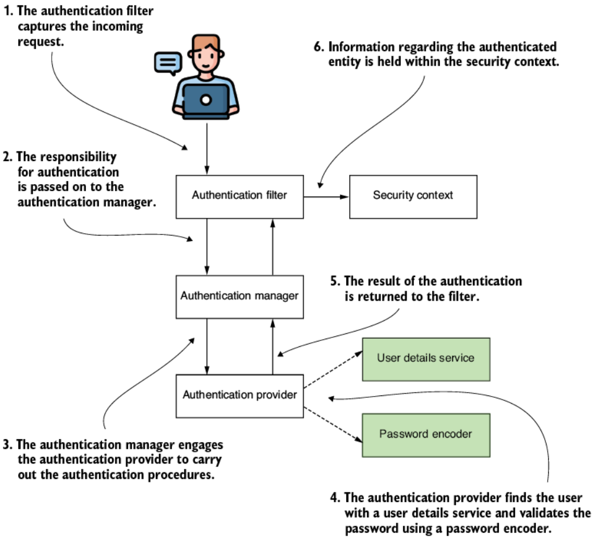
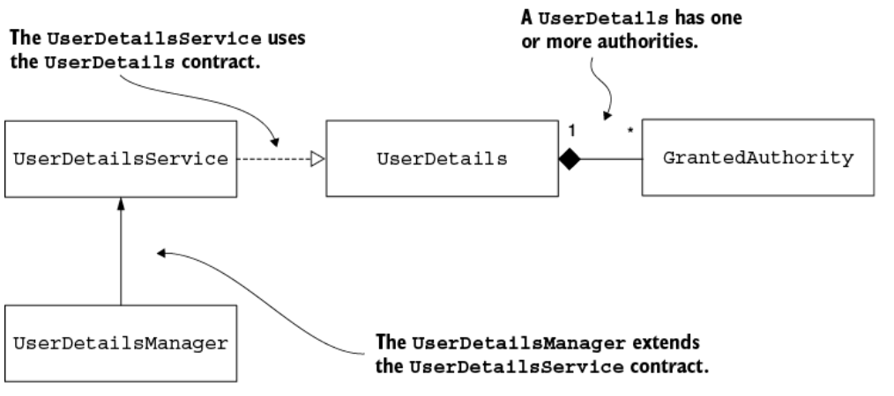
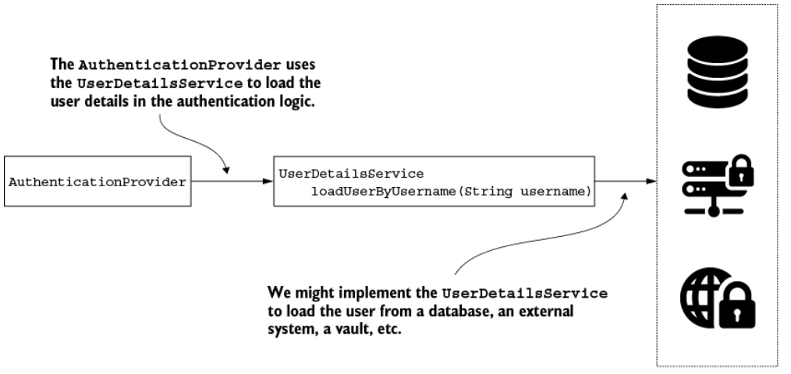
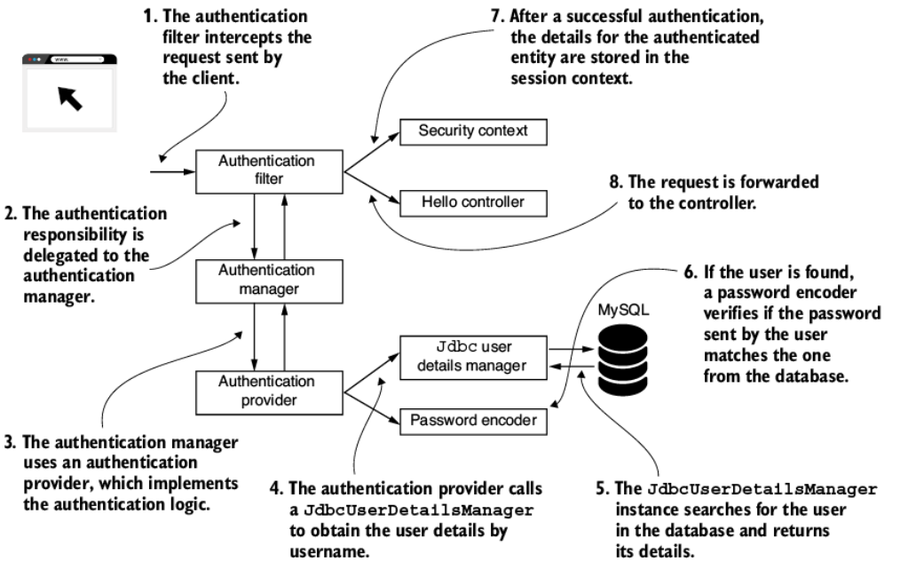

# 3. Quản lý user (Managing users)

> Bản dịch tiếng Việt của chương 3 — *Spring Security in Action, Second Edition* (Laurentiu Spilca, Manning).

**Nội dung chương này bao gồm:**

- Mô tả một user bằng interface `UserDetails`
- Sử dụng `UserDetailsService` trong luồng authentication (xác thực)
- Tạo một hiện thực tùy chỉnh của `UserDetailsService`
- Tạo một hiện thực tùy chỉnh của `UserDetailsManager`
- Sử dụng `JdbcUserDetailsManager` trong luồng authentication

Một đồng nghiệp của tôi ở trường đại học nấu ăn khá ngon. Anh ấy không phải đầu bếp trong nhà hàng sang trọng, nhưng rất đam mê nấu nướng. Một hôm, trong lúc trò chuyện chia sẻ suy nghĩ, tôi hỏi anh ấy làm sao nhớ được nhiều công thức đến vậy. Anh ấy bảo điều đó dễ thôi. "Cậu không cần nhớ toàn bộ công thức, mà nhớ cách các nguyên liệu cơ bản kết hợp với nhau. Nó giống như những contract (giao ước) ngoài đời thực cho cậu biết cái gì có thể trộn và cái gì thì không. Rồi với mỗi công thức, cậu chỉ cần nhớ vài mẹo nhỏ."

Phép so sánh này tương tự cách các kiến trúc hoạt động. Với bất kỳ framework vững chắc nào, chúng ta dùng contract để tách rời (decouple) hiện thực của framework khỏi ứng dụng được xây trên nó. Với Java, chúng ta dùng interface để định nghĩa contract. Một lập trình viên cũng giống một đầu bếp, biết các nguyên liệu phối hợp với nhau ra sao để chọn đúng hiện thực phù hợp. Lập trình viên nắm các abstraction (trừu tượng) của framework và dùng chúng để tích hợp.

Chương này nói về việc hiểu chi tiết một trong những vai trò nền tảng mà bạn đã gặp trong ví dụ đầu tiên ở chương 2 — `UserDetailsService`. Cùng với `UserDetailsService`, chúng ta sẽ bàn về những interface (contract) sau:

- `UserDetails` — mô tả user theo cách Spring Security hiểu.
- `GrantedAuthority` — cho phép chúng ta định nghĩa những hành động mà user có thể thực hiện.
- `UserDetailsManager` — mở rộng contract `UserDetailsService`. Ngoài hành vi kế thừa, nó còn mô tả các hành động như tạo user, sửa hoặc xóa password của user.

Từ chương 2, bạn đã có ý niệm về vai trò của `UserDetailsService` và `PasswordEncoder` trong tiến trình authentication. Nhưng chúng ta mới chỉ bàn cách cắm (plug in) một instance do bạn định nghĩa thay vì dùng cái mặc định do Spring Boot cấu hình. Chúng ta còn nhiều chi tiết cần bàn, chẳng hạn:

- Các hiện thực do Spring Security cung cấp và cách dùng chúng
- Cách định nghĩa hiện thực tùy chỉnh cho các contract và khi nào nên làm vậy
- Những cách hiện thực interface mà bạn gặp trong các ứng dụng thực tế
- Best practice khi dùng những interface này

Kế hoạch là bắt đầu với cách Spring Security hiểu định nghĩa về user. Với mục đích đó, chúng ta sẽ bàn về contract `UserDetails` và `GrantedAuthority`. Tiếp theo, chúng ta sẽ đi chi tiết vào `UserDetailsService` và cách `UserDetailsManager` mở rộng contract này. Bạn sẽ áp dụng các hiện thực cho những interface này (ví dụ `InMemoryUserDetailsManager`, `JdbcUserDetailsManager`, và `LdapUserDetailsManager`). Khi những hiện thực này không phù hợp với hệ thống của bạn, bạn sẽ viết một hiện thực tùy chỉnh.

---

## 3.1 Hiện thực authentication trong Spring Security

Ở chương trước, chúng ta đã bắt đầu với Spring Security. Trong ví dụ đầu tiên, chúng ta đã bàn cách Spring Boot chỉ định một số mặc định định nghĩa cách một ứng dụng mới hoạt động ban đầu. Bạn cũng đã học cách ghi đè những mặc định đó bằng nhiều cách thay thế mà chúng ta thường gặp trong các app. Tuy nhiên, chúng ta mới chỉ chạm tới bề mặt để bạn có ý niệm về những gì chúng ta sẽ làm. Trong chương này, cũng như chương 4 và 5, chúng ta sẽ bàn chi tiết hơn về các interface này, cùng với những hiện thực khác nhau và nơi bạn có thể gặp chúng trong các ứng dụng thực tế.

Hình 3.1 trình bày luồng authentication trong Spring Security. Kiến trúc này là xương sống của tiến trình authentication như Spring Security hiện thực. Việc hiểu nó rất quan trọng vì bạn sẽ dựa vào nó trong bất kỳ hiện thực Spring Security nào. Bạn sẽ thấy chúng ta bàn về các phần của kiến trúc này ở gần như tất cả các chương của cuốn sách. Bạn sẽ gặp nó thường xuyên đến mức có lẽ sẽ thuộc lòng, và đó là điều tốt. Nếu bạn nắm được kiến trúc này, bạn giống như một đầu bếp biết rõ nguyên liệu của mình và có thể ghép lại bất kỳ công thức nào.

Trong hình 3.1, các ô được tô đậm biểu diễn những component mà chúng ta bắt đầu: `UserDetailsService` và `PasswordEncoder`. Hai component này tập trung vào phần của luồng mà tôi thường gọi là "phần quản lý user". Trong chương này, `UserDetailsService` và `PasswordEncoder` là những component xử lý trực tiếp thông tin chi tiết về user và credential (thông tin đăng nhập) của họ. Chúng ta sẽ bàn chi tiết về `PasswordEncoder` ở chương 4.



**Hình 3.1** Luồng authentication của Spring Security. `AuthenticationFilter` bắt lấy request đến và chuyển nhiệm vụ authentication cho `AuthenticationManager`. `AuthenticationManager`, đến lượt mình, sử dụng một authentication provider để thực hiện tiến trình authentication. Để kiểm chứng username và password, `AuthenticationProvider` dựa vào một `UserDetailsService` và một `PasswordEncoder`.

Là một phần của việc quản lý user, chúng ta dùng các interface `UserDetailsService` và `UserDetailsManager`. `UserDetailsService` chỉ chịu trách nhiệm truy xuất user theo username. Đây là hành động duy nhất mà framework cần để hoàn tất authentication. `UserDetailsManager` bổ sung hành vi liên quan tới việc thêm, sửa, hoặc xóa user — một chức năng bắt buộc trong hầu hết ứng dụng. Sự tách biệt giữa hai contract là một ví dụ tuyệt vời về *interface segregation principle* (nguyên lý phân tách interface). Việc tách các interface cho phép linh hoạt hơn vì framework không ép bạn hiện thực hành vi mà app của bạn không cần. Nếu app chỉ cần authentication user, thì hiện thực contract `UserDetailsService` là đủ để bao phủ chức năng mong muốn. Để quản lý user, các component `UserDetailsService` và `UserDetailsManager` cần một cách để biểu diễn chúng.

Spring Security cung cấp contract `UserDetails`, thứ bạn phải hiện thực để mô tả một user theo cách mà framework hiểu được. Như bạn sẽ học trong chương này, trong Spring Security, một user có một tập privilege (đặc quyền), là những hành động mà user được phép làm. Chúng ta sẽ làm việc rất nhiều với những privilege này ở các chương 7 đến 12 khi bàn về authorization (phân quyền). Còn bây giờ, Spring Security biểu diễn các hành động mà một user có thể làm bằng interface `GrantedAuthority`. Chúng ta thường gọi chúng là **authority**, và một user có một hoặc nhiều authority. Trong hình 3.2, bạn thấy biểu diễn mối quan hệ giữa các component thuộc phần quản lý user của luồng authentication.



**Hình 3.2** Các phụ thuộc giữa những component tham gia vào việc quản lý user. `UserDetailsService` truy xuất thông tin chi tiết của một user bằng cách tìm user theo tên. User được đặc tả bởi contract `UserDetails`. Mỗi user sở hữu một hoặc nhiều authority, được mô tả bởi interface `GrantedAuthority`. Để đưa vào các thao tác như tạo, xóa, hoặc sửa password cho một user, contract `UserDetailsManager` — thứ mở rộng `UserDetailsService` — được dùng để bao gồm những chức năng này.

Việc hiểu các liên kết giữa những object này trong kiến trúc Spring Security và cách hiện thực chúng cho bạn một loạt lựa chọn rộng rãi khi làm việc với ứng dụng. Bất kỳ lựa chọn nào trong số đó cũng có thể là mảnh ghép đúng cho app bạn đang làm, và bạn cần lựa chọn một cách khôn ngoan. Nhưng để có thể chọn, trước hết bạn cần biết mình có thể chọn từ những gì.

---

## 3.2 Mô tả user

Trong mục này, bạn sẽ học cách mô tả user của ứng dụng để Spring Security hiểu được họ. Học cách biểu diễn user và làm cho framework nhận biết được họ là một bước thiết yếu trong việc xây dựng luồng authentication. Dựa trên user, ứng dụng đưa ra quyết định — liệu một lời gọi tới một chức năng nào đó có được phép hay không. Để làm việc với user, trước hết bạn cần hiểu cách định nghĩa nguyên mẫu (prototype) của user trong ứng dụng của mình. Mục này mô tả bằng ví dụ cách thiết lập một bản thiết kế (blueprint) cho user trong một ứng dụng Spring Security.

Với Spring Security, một định nghĩa user phải thỏa mãn contract `UserDetails`. Contract `UserDetails` biểu diễn user theo cách Spring Security hiểu. Class của ứng dụng mô tả user phải hiện thực interface này, và bằng cách đó, framework hiểu được nó.

### 3.2.1 Mô tả user bằng contract `UserDetails`

Trong mục này, bạn sẽ học cách hiện thực interface `UserDetails` để mô tả user trong ứng dụng của mình. Chúng ta sẽ bàn về các phương thức mà contract `UserDetails` khai báo để hiểu cách và lý do chúng ta hiện thực từng cái. Trước hết, hãy nhìn vào interface như trình bày ở listing sau đây.

**Listing 3.1 Interface `UserDetails`**

```java
public interface UserDetails extends Serializable {

  String getUsername();                                        // ①
  String getPassword();

  Collection<? extends GrantedAuthority> getAuthorities();     // ②

  boolean isAccountNonExpired();                               // ③
  boolean isAccountNonLocked();
  boolean isCredentialsNonExpired();
  boolean isEnabled();
}
```

① Những phương thức này trả về credential của user.

② Trả về các hành động mà app cho phép user thực hiện, dưới dạng một collection các instance `GrantedAuthority`.

③ Bốn phương thức này bật hoặc tắt tài khoản vì những lý do khác nhau.

Phương thức `getUsername()` và `getPassword()` trả về, như bạn mong đợi, username và password. App dùng những giá trị này trong tiến trình authentication, và đây là những chi tiết duy nhất liên quan tới authentication trong contract này. Năm phương thức còn lại đều liên quan tới việc authorize user truy cập tài nguyên của ứng dụng.

Nói chung, app nên cho phép user thực hiện một số hành động có ý nghĩa trong ngữ cảnh của ứng dụng. Ví dụ, user nên có thể đọc, ghi, hoặc xóa dữ liệu. Chúng ta nói rằng một user có hoặc không có privilege để thực hiện một hành động, và một authority biểu diễn privilege mà một user có. Chúng ta hiện thực phương thức `getAuthorities()` để trả về nhóm authority được cấp cho một user.

> **NOTE** Như bạn sẽ học ở chương 6, Spring Security dùng từ *authority* để chỉ hoặc các privilege chi tiết (fine-grained), hoặc các *role* (vai trò), vốn là nhóm các privilege. Để bạn đọc dễ dàng hơn, trong cuốn sách này tôi dùng từ *authority* để chỉ các privilege chi tiết.

Hơn nữa, như thấy trong contract `UserDetails`, một user có thể:

- Để tài khoản hết hạn (expire)
- Bị khóa tài khoản (lock)
- Để credential hết hạn
- Bị vô hiệu hóa tài khoản (disable)

Giả sử bạn chọn hiện thực những ràng buộc user này trong logic ứng dụng của mình. Trong trường hợp đó, bạn cần hiện thực các phương thức `isAccountNonExpired()`, `isAccountNonLocked()`, `isCredentialsNonExpired()`, và `isEnabled()`, sao cho những cái cần được bật thì trả về `true`. Không phải mọi ứng dụng đều có tài khoản hết hạn hoặc bị khóa theo những điều kiện nhất định. Nếu bạn không cần hiện thực những chức năng này trong ứng dụng của mình, bạn có thể đơn giản cho bốn phương thức này trả về `true`.

> **NOTE** Tên của bốn phương thức cuối trong interface `UserDetails` nghe có vẻ lạ. Có người sẽ lập luận rằng chúng không được chọn khôn ngoan xét về mặt clean coding và khả năng bảo trì. Ví dụ, tên `isAccountNonExpired()` trông như một phủ định kép, và thoạt nhìn có thể gây nhầm lẫn. Nhưng hãy phân tích cả bốn tên phương thức một cách chú ý. Chúng được đặt tên sao cho tất cả đều trả về `false` khi authorization nên thất bại và `true` trong trường hợp ngược lại. Đây là cách tiếp cận đúng đắn, bởi tâm trí con người có xu hướng liên kết từ "false" với tiêu cực và từ "true" với các kịch bản tích cực.

### 3.2.2 Đi sâu vào contract `GrantedAuthority`

Như bạn đã thấy trong định nghĩa của interface `UserDetails` ở mục 3.2.1, các hành động được cấp cho một user được gọi là **authority**. Ở các chương 7 đến 12, chúng ta sẽ viết các cấu hình authorization dựa trên những authority này của user. Vì vậy, biết cách định nghĩa chúng là điều thiết yếu.

Authority biểu diễn những gì user có thể làm trong ứng dụng của bạn. Không có chúng, tất cả user sẽ như nhau. Dù có những ứng dụng đơn giản trong đó các user là như nhau, ở hầu hết tình huống thực tế, một ứng dụng định nghĩa nhiều loại user khác nhau. Một ứng dụng có thể có những user chỉ đọc được thông tin cụ thể, trong khi những người khác cũng có thể sửa dữ liệu. Và bạn cần làm cho ứng dụng của mình phân biệt được giữa họ, tùy thuộc vào yêu cầu chức năng của ứng dụng — đó chính là những authority mà một user cần. Để mô tả authority trong Spring Security, bạn dùng interface `GrantedAuthority`.

Trước khi bàn về việc hiện thực `UserDetails`, hãy hiểu interface `GrantedAuthority`. Chúng ta dùng interface này trong định nghĩa của user details. Nó biểu diễn một privilege được cấp cho user. Một user phải có ít nhất một authority. Đây là định nghĩa của `GrantedAuthority`:

```java
public interface GrantedAuthority extends Serializable {
    String getAuthority();
}
```

Để tạo một authority, bạn chỉ cần tìm một cái tên cho privilege đó để có thể tham chiếu tới nó sau này khi viết các quy tắc authorization. Ví dụ, một user có thể đọc các bản ghi do ứng dụng quản lý hoặc xóa chúng. Bạn viết các quy tắc authorization dựa trên những cái tên bạn đặt cho các hành động này.

Trong chương này, chúng ta sẽ hiện thực phương thức `getAuthority()` để trả về tên của authority dưới dạng một `String`. Interface `GrantedAuthority` chỉ có một phương thức abstract duy nhất, và trong cuốn sách này, bạn sẽ thường gặp những ví dụ mà chúng ta dùng biểu thức lambda để hiện thực nó. Một khả năng khác là dùng class `SimpleGrantedAuthority` để tạo các instance authority. Class `SimpleGrantedAuthority` cung cấp một cách tạo các instance bất biến (immutable) kiểu `GrantedAuthority`. Bạn cung cấp tên authority khi xây dựng instance. Trong đoạn code kế tiếp, bạn sẽ thấy hai ví dụ về việc hiện thực một `GrantedAuthority`. Ở đây chúng ta dùng biểu thức lambda, rồi dùng class `SimpleGrantedAuthority`:

```java
GrantedAuthority g1 = () -> "READ";
GrantedAuthority g2 = new SimpleGrantedAuthority("READ");
```

### 3.2.3 Viết một hiện thực tối giản của `UserDetails`

Trong mục này, bạn sẽ viết hiện thực đầu tiên của mình cho contract `UserDetails`. Chúng ta bắt đầu với một hiện thực cơ bản trong đó mỗi phương thức trả về một giá trị tĩnh. Sau đó chúng ta sẽ đổi nó thành một phiên bản mà bạn nhiều khả năng sẽ gặp trong tình huống thực tế, một phiên bản cho phép bạn có nhiều instance user khác nhau. Giờ khi đã biết cách hiện thực interface `UserDetails` và `GrantedAuthority`, chúng ta có thể viết định nghĩa user đơn giản nhất cho một ứng dụng.

Với một class tên là `DummyUser`, hãy hiện thực một mô tả tối giản về một user, như ở listing sau đây. Tôi dùng class này chủ yếu để minh họa việc hiện thực các phương thức của contract `UserDetails`. Các instance của class này luôn chỉ tới một user duy nhất, `"bill"`, người có password `"12345"` và một authority tên là `"READ"`.

**Listing 3.2 Class `DummyUser`**

```java
public class DummyUser implements UserDetails {

  @Override
  public String getUsername() {
    return "bill";
  }

  @Override
  public String getPassword() {
    return "12345";
  }

  // Phần code được lược bỏ
}
```

Class ở listing 3.2 hiện thực interface `UserDetails` và cần hiện thực tất cả các phương thức của nó. Ở đây bạn sẽ thấy hiện thực của `getUsername()` và `getPassword()`. Trong ví dụ này, những phương thức đó chỉ trả về một giá trị cố định cho mỗi thuộc tính.

Tiếp theo, chúng ta thêm định nghĩa cho danh sách authority. Listing kế tiếp cho thấy hiện thực của phương thức `getAuthorities()`. Phương thức này trả về một collection chỉ chứa một hiện thực của interface `GrantedAuthority`.

**Listing 3.3 Hiện thực phương thức `getAuthorities()`**

```java
public class DummyUser implements UserDetails {

  // Phần code được lược bỏ

  @Override
  public Collection<? extends GrantedAuthority> getAuthorities() {
    return List.of(() -> "READ");
  }

  // Phần code được lược bỏ
}
```

Cuối cùng, bạn phải thêm hiện thực cho bốn phương thức cuối của interface `UserDetails`. Với class `DummyUser`, những phương thức này luôn trả về `true`, nghĩa là user luôn hoạt động và dùng được. Bạn có thể xem ví dụ ở listing sau đây.

**Listing 3.4 Hiện thực bốn phương thức cuối của interface `UserDetails`**

```java
public class DummyUser implements UserDetails {

  // Phần code được lược bỏ

  @Override
  public boolean isAccountNonExpired() {
    return true;
  }

  @Override
  public boolean isAccountNonLocked() {
    return true;
  }

  @Override
  public boolean isCredentialsNonExpired() {
    return true;
  }

  @Override
  public boolean isEnabled() {
    return true;
  }

  // Phần code được lược bỏ
}
```

Tất nhiên, hiện thực tối giản này nghĩa là mọi instance của class đều biểu diễn cùng một user. Đó là khởi đầu tốt để hiểu contract, nhưng không phải điều bạn sẽ làm trong một ứng dụng thực. Với ứng dụng thực, bạn nên tạo một class mà bạn có thể dùng để sinh ra các instance biểu diễn những user khác nhau. Trong trường hợp này, định nghĩa của bạn ít nhất sẽ có username và password làm thuộc tính trong class, như trình bày ở listing kế tiếp.

**Listing 3.5 Một hiện thực thực tế hơn của interface `UserDetails`**

```java
public class SimpleUser implements UserDetails {

  private final String username;
  private final String password;

  public SimpleUser(String username, String password) {
    this.username = username;
    this.password = password;
  }

  @Override
  public String getUsername() {
    return this.username;
  }

  @Override
  public String getPassword() {
    return this.password;
  }

  // Phần code được lược bỏ
}
```

### 3.2.4 Dùng builder để tạo instance kiểu `UserDetails`

Một số ứng dụng đơn giản và không cần hiện thực tùy chỉnh của interface `UserDetails`. Trong mục này, chúng ta xem xét việc dùng một builder class do Spring Security cung cấp để tạo các instance user đơn giản. Thay vì khai báo thêm một class trong ứng dụng, bạn nhanh chóng có được một instance biểu diễn user bằng builder class `User`.

Class `User` từ package `org.springframework.security.core.userdetails` là một cách đơn giản để xây dựng các instance kiểu `UserDetails`. Dùng class này, bạn có thể tạo các instance `UserDetails` bất biến. Bạn cần cung cấp ít nhất một username và một password, và username không được là chuỗi rỗng. Listing sau đây minh họa cách dùng builder này. Xây dựng user theo cách này, bạn không cần có hiện thực tùy chỉnh của contract `UserDetails`.

**Listing 3.6 Xây dựng một user bằng builder class `User`**

```java
UserDetails u = User.withUsername("bill")
                .password("12345")
                .authorities("read", "write")
                .accountExpired(false)
                .disabled(true)
                .build();
```

Lấy listing trước làm ví dụ, hãy đi sâu hơn vào cấu tạo của builder class `User`. Phương thức `User.withUsername(String username)` trả về một instance của builder class `UserBuilder` lồng trong class `User`. Một cách khác để tạo builder là bắt đầu từ một instance `UserDetails` khác. Ở listing 3.7, dòng đầu tiên xây dựng một `UserBuilder`, bắt đầu với username được cho dưới dạng một chuỗi. Sau đó, chúng ta minh họa cách tạo một builder bắt đầu từ một instance `UserDetails` đã tồn tại.

**Listing 3.7 Tạo instance `User.UserBuilder`**

```java
User.UserBuilder builder1 = User.withUsername("bill");        // ①

UserDetails u1 = builder1
                 .password("12345")
                 .authorities("read", "write")
                 .passwordEncoder(p -> encode(p))             // ②
                 .accountExpired(false)
                 .disabled(true)
                 .build();                                    // ③

User.UserBuilder builder2 = User.withUserDetails(u);          // ④

UserDetails u2 = builder2.build();
```

① Xây dựng một user với username của họ.

② Password encoder ở đây chỉ là một hàm thực hiện việc encode.

③ Ở cuối pipeline xây dựng, gọi phương thức `build()`.

④ Bạn cũng có thể xây dựng một user từ một instance `UserDetails` đã có.

Bạn có thể thấy với bất kỳ builder nào được định nghĩa ở listing 3.7, việc dùng builder để lấy một user được biểu diễn bởi contract `UserDetails` là khả thi. Ở cuối pipeline xây dựng, bạn gọi phương thức `build()`. Nó áp dụng hàm được định nghĩa để encode password nếu bạn cung cấp, xây dựng instance `UserDetails`, và trả về nó.

> **NOTE** Lưu ý rằng password encoder ở đây được đưa vào dưới dạng một `Function<String, String>` chứ không phải dưới dạng interface `PasswordEncoder` do Spring Security cung cấp. Trách nhiệm duy nhất của hàm này là biến đổi một password theo một cách encode nào đó. Ở mục tiếp theo, chúng ta sẽ bàn chi tiết về contract `PasswordEncoder` của Spring Security mà chúng ta đã dùng ở chương 2. Chúng ta sẽ bàn chi tiết hơn về contract `PasswordEncoder` ở chương 4.

### 3.2.5 Kết hợp nhiều trách nhiệm liên quan tới user

Ở mục trước, bạn đã học cách hiện thực interface `UserDetails`. Trong các tình huống thực tế, mọi thứ thường phức tạp hơn. Trong hầu hết trường hợp, bạn thấy nhiều trách nhiệm mà một user liên quan tới. Và nếu bạn lưu user trong database, rồi trong ứng dụng, bạn sẽ cần một class để biểu diễn persistence entity nữa. Hoặc nếu bạn truy xuất user thông qua một web service từ hệ thống khác, có lẽ bạn sẽ cần một data transfer object để biểu diễn các instance user. Giả sử trường hợp đầu tiên — một trường hợp đơn giản nhưng cũng điển hình — hãy xem như chúng ta có một bảng trong database SQL nơi lưu các user. Để ví dụ ngắn gọn hơn, chúng ta chỉ cho mỗi user một authority. Listing sau đây cho thấy entity class ánh xạ bảng đó.

**Listing 3.8 Định nghĩa JPA entity class `User`**

```java
@Entity
public class User {

  @Id
  private Long id;
  private String username;
  private String password;
  private String authority;

  // Đã lược bỏ getter và setter
}
```

Nếu bạn cho cùng class đó cũng hiện thực contract user details của Spring Security, class sẽ trở nên phức tạp hơn. Bạn nghĩ sao về cách code trông ra sao ở listing kế tiếp? Theo tôi, nó là một mớ hỗn độn. Tôi sẽ bị lạc trong đó.

**Listing 3.9 Class `User` mang hai trách nhiệm**

```java
@Entity
public class User implements UserDetails {

  @Id
  private int id;
  private String username;
  private String password;
  private String authority;

  @Override
  public String getUsername() {
    return this.username;
  }

  @Override
  public String getPassword() {
    return this.password;
  }

  public String getAuthority() {
    return this.authority;
  }

  @Override
  public Collection<? extends GrantedAuthority> getAuthorities() {
    return List.of(() -> authority);
  }

  // Phần code được lược bỏ
}
```

Class này chứa các JPA annotation, getter và setter, trong đó cả `getUsername()` lẫn `getPassword()` đều ghi đè các phương thức trong contract `UserDetails`. Nó có một phương thức `getAuthority()` trả về một `String`, cũng như một phương thức `getAuthorities()` trả về một `Collection`. Phương thức `getAuthority()` chỉ là một getter trong class, trong khi `getAuthorities()` hiện thực phương thức trong interface `UserDetails`. Mọi thứ còn phức tạp hơn nữa khi thêm các quan hệ tới những entity khác. Một lần nữa, code này hoàn toàn không thân thiện!

Làm sao chúng ta có thể viết code này sạch hơn? Gốc rễ của sự lộn xộn trong ví dụ code trước là sự pha trộn của hai trách nhiệm. Dù đúng là bạn cần cả hai trong ứng dụng, trong trường hợp này, không ai nói rằng bạn phải đặt chúng vào cùng một class. Hãy thử tách chúng bằng cách định nghĩa một class riêng tên là `SecurityUser`, class này đóng vai trò adapter cho class `User`. Như listing kế tiếp cho thấy, class `SecurityUser` hiện thực contract `UserDetails` và dùng nó để cắm user của chúng ta vào kiến trúc Spring Security. Class `User` chỉ còn lại trách nhiệm JPA entity của nó.

**Listing 3.10 Hiện thực class `User` chỉ như một JPA entity**

```java
@Entity
public class User {

  @Id
  private int id;
  private String username;
  private String password;
  private String authority;

  // Đã lược bỏ getter và setter
}
```

Class `User` ở listing 3.10 chỉ còn lại trách nhiệm JPA entity, và nhờ đó nó trở nên dễ đọc hơn. Nếu đọc code này, giờ bạn có thể tập trung hoàn toàn vào những chi tiết liên quan tới persistence, những thứ không quan trọng từ góc nhìn của Spring Security. Ở listing kế tiếp, chúng ta hiện thực class `SecurityUser` để bao bọc entity `User`.

**Listing 3.11 Class `SecurityUser` hiện thực contract `UserDetails`**

```java
public class SecurityUser implements UserDetails {

  private final User user;

  public SecurityUser(User user) {
    this.user = user;
  }

  @Override
  public String getUsername() {
    return user.getUsername();
  }

  @Override
  public String getPassword() {
    return user.getPassword();
  }

  @Override
  public Collection<? extends GrantedAuthority> getAuthorities() {
    return List.of(() -> user.getAuthority());
  }

  // Phần code được lược bỏ
}
```

Như bạn có thể quan sát, chúng ta chỉ dùng class `SecurityUser` để ánh xạ thông tin chi tiết user trong hệ thống sang contract `UserDetails` mà Spring Security hiểu được. Để đánh dấu sự thật rằng `SecurityUser` không có ý nghĩa nếu không có một entity `User`, chúng ta để field đó là `final`. Bạn phải cung cấp user thông qua constructor. Class `SecurityUser` đóng vai trò adapter cho entity class `User` và thêm phần code cần thiết liên quan tới contract Spring Security mà không trộn lẫn code đó vào một JPA entity, từ đó hiện thực nhiều nhiệm vụ khác nhau.

> **NOTE** Bạn có thể tìm thấy nhiều cách tiếp cận khác nhau để tách hai trách nhiệm này. Tôi không muốn nói rằng cách tiếp cận tôi trình bày trong mục này là tốt nhất hay duy nhất. Thông thường, cách bạn chọn hiện thực thiết kế class thay đổi rất nhiều từ trường hợp này sang trường hợp khác. Nhưng ý chính vẫn như nhau: tránh trộn lẫn các trách nhiệm và cố gắng viết code sao cho càng ít liên kết (decoupled) càng tốt để tăng khả năng bảo trì cho app của bạn.

---

## 3.3 Chỉ dẫn cho Spring Security cách quản lý user

Ở mục trước, bạn đã hiện thực contract `UserDetails` để mô tả user sao cho Spring Security hiểu được họ. Nhưng Spring Security quản lý user như thế nào? Họ được lấy từ đâu khi so sánh credential, và làm sao bạn thêm user mới hoặc thay đổi user hiện có? Ở chương 2, bạn đã học rằng framework định nghĩa một component cụ thể mà tiến trình authentication ủy quyền việc quản lý user cho nó: instance `UserDetailsService`. Chúng ta thậm chí đã định nghĩa một `UserDetailsService` để ghi đè hiện thực mặc định do Spring Boot cung cấp.

Trong mục này, chúng ta thử nghiệm nhiều cách khác nhau để hiện thực class `UserDetailsService`. Bạn sẽ hiểu việc quản lý user hoạt động thế nào bằng cách hiện thực trách nhiệm được mô tả bởi contract `UserDetailsService` trong ví dụ của chúng ta. Sau đó, bạn sẽ khám phá cách interface `UserDetailsManager` bổ sung thêm hành vi vào contract do `UserDetailsService` định nghĩa. Ở cuối mục này, chúng ta sẽ dùng các hiện thực có sẵn của interface `UserDetailsManager` do Spring Security cung cấp. Chúng ta sẽ viết một project ví dụ dùng một trong những hiện thực nổi tiếng nhất do Spring Security cung cấp — class `JdbcUserDetailsManager`. Sau khi học điều này, bạn sẽ biết cách nói cho Spring Security biết tìm user ở đâu, điều thiết yếu trong luồng authentication.

### 3.3.1 Hiểu contract `UserDetailsService`

Trong mục này, bạn sẽ học về định nghĩa của interface `UserDetailsService`. Trước khi hiểu cách và tại sao hiện thực nó, bạn phải hiểu contract trước đã. Đã đến lúc đi sâu hơn vào `UserDetailsService` và cách làm việc với các hiện thực của component này. Interface `UserDetailsService` chỉ chứa một phương thức, như sau:

```java
public interface UserDetailsService {

  UserDetails loadUserByUsername(String username)
      throws UsernameNotFoundException;
}
```

Hiện thực authentication gọi phương thức `loadUserByUsername(String username)` để lấy thông tin chi tiết của một user với username cho trước (hình 3.3). Username, tất nhiên, được coi là duy nhất. User được phương thức này trả về là một hiện thực của contract `UserDetails`. Nếu username không tồn tại, phương thức ném ra một `UsernameNotFoundException`.

> **NOTE** `UsernameNotFoundException` là một `RuntimeException`. Mệnh đề `throws` trong interface `UserDetailsService` chỉ nhằm mục đích tài liệu hóa. `UsernameNotFoundException` kế thừa trực tiếp từ kiểu `AuthenticationException`, vốn là cha của tất cả các exception liên quan tới tiến trình authentication. `AuthenticationException` lại kế thừa class `RuntimeException`.



**Hình 3.3** `AuthenticationProvider` là thành phần chịu trách nhiệm thực thi tiến trình authentication và sử dụng `UserDetailsService` để thu thập thông tin chi tiết user. Nó gọi phương thức `loadUserByUsername(String username)` để định vị user dựa trên username của họ.

### 3.3.2 Hiện thực contract `UserDetailsService`

Trong mục này, chúng ta làm một ví dụ thực hành để minh họa việc hiện thực `UserDetailsService`. Ứng dụng của bạn quản lý thông tin chi tiết về credential và các khía cạnh khác của user. Có thể chúng được lưu trong database hoặc do một hệ thống khác xử lý mà bạn truy cập qua web service hoặc bằng cách khác (hình 3.3). Bất kể điều đó diễn ra thế nào trong hệ thống của bạn, thứ duy nhất Spring Security cần từ bạn là một hiện thực để truy xuất user theo username.

Trong ví dụ tiếp theo, chúng ta viết một `UserDetailsService` có một danh sách user trong bộ nhớ. Ở chương 2, bạn đã dùng một hiện thực có sẵn làm điều tương tự — `InMemoryUserDetailsManager`. Vì bạn đã quen với cách hiện thực đó hoạt động, tôi đã chọn một chức năng tương tự, nhưng lần này để tự chúng ta hiện thực. Chúng ta cung cấp một danh sách user khi tạo một instance của class `UserDetailsService` của mình. Bạn có thể tìm thấy ví dụ này trong project `ssia-ch3-ex1`. Trong package tên là *model*, chúng ta định nghĩa `UserDetails` như trình bày ở listing sau đây.

**Listing 3.12 Hiện thực của interface `UserDetails`**

```java
public class User implements UserDetails {

  private final String username;                    // ①
  private final String password;
  private final String authority;                   // ②

  public User(String username, String password, String authority) {
    this.username = username;
    this.password = password;
    this.authority = authority;
  }

  @Override
  public Collection<? extends GrantedAuthority> getAuthorities() {
    return List.of(() -> authority);                // ③
  }

  @Override
  public String getPassword() {
    return password;
  }

  @Override
  public String getUsername() {
    return username;
  }

  @Override
  public boolean isAccountNonExpired() {            // ④
    return true;
  }

  @Override
  public boolean isAccountNonLocked() {
    return true;
  }

  @Override
  public boolean isCredentialsNonExpired() {
    return true;
  }

  @Override
  public boolean isEnabled() {
    return true;
  }
}
```

① Class `User` là bất biến. Bạn đưa giá trị cho ba thuộc tính khi xây dựng instance, và những giá trị này không thể thay đổi sau đó.

② Để ví dụ đơn giản, một user chỉ có một authority.

③ Trả về một danh sách chỉ chứa object `GrantedAuthority` với cái tên bạn cung cấp khi xây dựng instance.

④ Tài khoản không hết hạn và không bị khóa.

Trong package tên là *services*, chúng ta tạo một class gọi là `InMemoryUserDetailsService`. Listing sau đây cho thấy cách chúng ta hiện thực class này.

**Listing 3.13 Hiện thực của interface `UserDetailsService`**

```java
public class InMemoryUserDetailsService implements UserDetailsService {

  private final List<UserDetails> users;                          // ①

  public InMemoryUserDetailsService(List<UserDetails> users) {
    this.users = users;
  }

  @Override
  public UserDetails loadUserByUsername(String username)
    throws UsernameNotFoundException {
    return users.stream()
      .filter(
         u -> u.getUsername().equals(username)
      )
      .findFirst()                                                // ②
      .orElseThrow(                                               // ③
        () -> new UsernameNotFoundException("User not found")
      );
   }
}
```

① `UserDetailsService` quản lý danh sách user trong bộ nhớ.

② Nếu có user như vậy, trả về nó.

③ Nếu user với username này không tồn tại, ném ra exception.

Phương thức `loadUserByUsername(String username)` tìm trong danh sách user theo username cho trước và trả về instance `UserDetails` mong muốn. Nếu không có instance nào với username đó, nó ném ra một `UsernameNotFoundException`. Giờ chúng ta có thể dùng hiện thực này làm `UserDetailsService` của mình. Listing kế tiếp cho thấy cách chúng ta thêm nó làm bean trong configuration class và đăng ký một user trong đó.

**Listing 3.14 `UserDetailsService` được đăng ký làm bean trong configuration class**

```java
@Configuration
public class ProjectConfig {

  @Bean
  public UserDetailsService userDetailsService() {
    UserDetails u = new User("john", "12345", "read");
    List<UserDetails> users = List.of(u);
    return new InMemoryUserDetailsService(users);
  }

  @Bean
  public PasswordEncoder passwordEncoder() {
    return NoOpPasswordEncoder.getInstance();
  }
}
```

Cuối cùng, chúng ta tạo một endpoint đơn giản và test hiện thực này. Listing sau đây định nghĩa endpoint đó.

**Listing 3.15 Định nghĩa endpoint dùng để test hiện thực**

```java
@RestController
public class HelloController {

  @GetMapping("/hello")
  public String hello() {
    return "Hello!";
  }
}
```

Khi gọi endpoint bằng cURL, chúng ta quan sát thấy rằng với user `john` và password `12345`, chúng ta nhận về HTTP 200 OK. Nếu dùng thứ khác, ứng dụng trả về 401 Unauthorized:

```bash
curl -u john:12345 http://localhost:8080/hello
```

Response body là

```
Hello!
```

### 3.3.3 Hiện thực contract `UserDetailsManager`

Trong mục này, chúng ta bàn về việc sử dụng và hiện thực interface `UserDetailsManager`. Interface này mở rộng và bổ sung thêm phương thức vào contract `UserDetailsService`. Spring Security cần contract `UserDetailsService` để thực hiện authentication. Nhưng nói chung, trong các ứng dụng cũng có nhu cầu quản lý user. Phần lớn thời gian, một app nên có khả năng thêm user mới hoặc xóa user hiện có. Trong trường hợp này, chúng ta hiện thực một interface chuyên biệt hơn do Spring Security định nghĩa — `UserDetailsManager`. Nó mở rộng `UserDetailsService` và thêm các thao tác mà chúng ta cần hiện thực:

```java
public interface UserDetailsManager extends UserDetailsService {

  void createUser(UserDetails user);
  void updateUser(UserDetails user);
  void deleteUser(String username);
  void changePassword(String oldPassword, String newPassword);
  boolean userExists(String username);
}
```

Object `InMemoryUserDetailsManager` mà chúng ta dùng ở chương 2 thực chất là một `UserDetailsManager`. Vào lúc đó, chúng ta chỉ xét tới đặc tính `UserDetailsService` của nó. Project `ssia-ch3-ex2` đi kèm ví dụ trong mục này.

---

> ### Dùng `JdbcUserDetailsManager` để quản lý user
>
> Bên cạnh `InMemoryUserDetailsManager`, chúng ta thường dùng một hiện thực `UserDetailsManager` khác — `JdbcUserDetailsManager`. Class `JdbcUserDetailsManager` quản lý user trong một database SQL. Nó kết nối tới database trực tiếp qua JDBC. Bằng cách này, `JdbcUserDetailsManager` độc lập với bất kỳ framework hay đặc tả nào khác liên quan tới kết nối database.
>
> Để hiểu `JdbcUserDetailsManager` hoạt động thế nào, tốt nhất là bạn đưa nó vào thực hành với một ví dụ. Trong ví dụ sau đây, bạn hiện thực một ứng dụng quản lý user trong database MySQL bằng `JdbcUserDetailsManager`. Hình 3.4 cung cấp cái nhìn tổng quan về vị trí mà hiện thực `JdbcUserDetailsManager` chiếm giữ trong luồng authentication.



**Hình 3.4** Luồng authentication của Spring Security. Ở đây chúng ta dùng một `JdbcUserDetailsManager` làm component `UserDetailsService` của mình. `JdbcUserDetailsManager` dùng một database để quản lý user.

> Bạn sẽ bắt đầu làm ứng dụng demo dùng `JdbcUserDetailsManager` bằng cách tạo một database và hai bảng. Trong trường hợp của chúng ta, chúng ta đặt tên database là `spring`, và đặt tên một bảng là `users`, bảng còn lại là `authorities`. Đây là những tên bảng mặc định mà `JdbcUserDetailsManager` biết. Như bạn sẽ học ở cuối mục này, hiện thực `JdbcUserDetailsManager` rất linh hoạt và cho phép bạn ghi đè những tên mặc định này nếu muốn.
>
> Mục đích của bảng `users` là giữ các bản ghi user. Hiện thực `JdbcUserDetailsManager` mong đợi ba cột trong bảng `users` — một username, một password, và *enabled* — cái mà bạn có thể dùng để vô hiệu hóa user.
>
> Bạn có thể chọn tự tạo database và cấu trúc của nó bằng cách dùng công cụ dòng lệnh cho hệ quản trị cơ sở dữ liệu (DBMS) của bạn hoặc một ứng dụng client. Ví dụ, với MySQL, bạn có thể chọn dùng MySQL Workbench để làm việc này. Nhưng cách dễ nhất là để chính Spring Boot chạy các script giúp bạn. Để làm điều đó, chỉ cần thêm hai file nữa vào project của bạn trong thư mục *resources*: *schema.sql* và *data.sql*. Trong file *schema.sql*, bạn thêm các truy vấn liên quan tới cấu trúc database, chẳng hạn tạo, thay đổi, hoặc xóa bảng. Trong file *data.sql*, bạn thêm các truy vấn làm việc với dữ liệu bên trong các bảng, chẳng hạn `INSERT`, `UPDATE`, hoặc `DELETE`. Spring Boot tự động chạy những file này cho bạn khi bạn khởi động ứng dụng. Một giải pháp đơn giản hơn để xây dựng các ví dụ cần database là dùng database in-memory H2. Bằng cách này, bạn không cần cài đặt một giải pháp DBMS riêng.
>
> > **NOTE** Nếu thích, bạn cũng có thể dùng H2 (như tôi làm trong project `ssia-ch3-ex2`) khi phát triển các ứng dụng được trình bày trong cuốn sách này. Nhưng trong hầu hết trường hợp, tôi chọn hiện thực các ví dụ với một DBMS bên ngoài để làm rõ rằng đó là một component bên ngoài của hệ thống và tránh nhầm lẫn theo cách này.
>
> Bạn dùng code ở listing kế tiếp để tạo bảng `users` với một MySQL server. Bạn có thể thêm script này vào file *schema.sql* trong project Spring Boot của mình.
>
> **Listing 3.16 Truy vấn SQL tạo bảng `users`**
>
> ```sql
> CREATE TABLE IF NOT EXISTS `spring`.`users` (
>   `id` INT NOT NULL AUTO_INCREMENT,
>   `username` VARCHAR(45) NOT NULL,
>   `password` VARCHAR(45) NOT NULL,
>   `enabled` INT NOT NULL,
>   PRIMARY KEY (`id`));
> ```
>
> Bảng `authorities` lưu các authority theo từng user. Mỗi bản ghi lưu một username và một authority được cấp cho user có username đó.
>
> **Listing 3.17 Truy vấn SQL tạo bảng `authorities`**
>
> ```sql
> CREATE TABLE IF NOT EXISTS `spring`.`authorities` (
>   `id` INT NOT NULL AUTO_INCREMENT,
>   `username` VARCHAR(45) NOT NULL,
>   `authority` VARCHAR(45) NOT NULL,
>   PRIMARY KEY (`id`));
> ```
>
> > **NOTE** Để đơn giản và giúp bạn tập trung vào các cấu hình Spring Security mà chúng ta đang bàn, trong những ví dụ đi kèm cuốn sách này, tôi bỏ qua phần định nghĩa index hoặc foreign key.
>
> Để đảm bảo bạn có một user để test, hãy chèn một bản ghi vào mỗi bảng. Bạn có thể thêm những truy vấn này vào file *data.sql* trong thư mục *resources* của project Spring Boot:
>
> ```sql
> INSERT INTO `spring`.`authorities`
> (username, authority)
> VALUES
> ('john', 'write');
>
> INSERT INTO `spring`.`users`
> (username, password, enabled)
> VALUES
> ('john', '12345', '1');
> ```
>
> Với project của bạn, bạn cần thêm ít nhất những dependency nêu ở listing sau đây. Hãy kiểm tra file *pom.xml* để chắc rằng bạn đã thêm chúng.
>
> **Listing 3.18 Các dependency cần thiết để phát triển project ví dụ**
>
> ```xml
> <dependency>
>   <groupId>org.springframework.boot</groupId>
>   <artifactId>spring-boot-starter-security</artifactId>
> </dependency>
> <dependency>
>   <groupId>org.springframework.boot</groupId>
>   <artifactId>spring-boot-starter-web</artifactId>
> </dependency>
> <dependency>
>   <groupId>org.springframework.boot</groupId>
>   <artifactId>spring-boot-starter-jdbc</artifactId>
> </dependency>
> <dependency>
>   <groupId>com.h2database</groupId>
>   <artifactId>h2</artifactId>
> </dependency>
> ```
>
> > **NOTE** Trong các ví dụ của bạn, bạn có thể dùng bất kỳ công nghệ database SQL nào miễn là bạn thêm đúng JDBC driver vào dependency.
>
> Hãy nhớ, bạn cần thêm JDBC driver tương ứng với công nghệ database bạn dùng. Ví dụ, nếu bạn dùng MySQL, bạn cần thêm dependency MySQL driver như trình bày ở đoạn code kế tiếp:
>
> ```xml
> <dependency>
>   <groupId>mysql</groupId>
>   <artifactId>mysql-connector-java</artifactId>
>   <scope>runtime</scope>
> </dependency>
> ```
>
> Bạn có thể cấu hình một data source trong file *application.properties* của project hoặc dưới dạng một bean riêng. Nếu bạn chọn dùng file *application.properties*, bạn cần thêm các dòng sau vào file đó:
>
> ```properties
> spring.datasource.url=jdbc:h2:mem:ssia
> spring.datasource.username=sa
> spring.datasource.password=
> spring.sql.init.mode=always
> ```
>
> Trong configuration class của project, bạn định nghĩa `UserDetailsService` và `PasswordEncoder`. `JdbcUserDetailsManager` cần `DataSource` để kết nối tới database. Data source có thể được autowire thông qua một tham số của phương thức (như trình bày ở listing kế tiếp) hoặc thông qua một thuộc tính của class.
>
> **Listing 3.19 Đăng ký `JdbcUserDetailsManager` trong configuration class**
>
> ```java
> @Configuration
> public class ProjectConfig {
>
>   @Bean
>   public UserDetailsService userDetailsService(DataSource dataSource) {
>     return new JdbcUserDetailsManager(dataSource);
>   }
>
>   @Bean
>   public PasswordEncoder passwordEncoder() {
>     return NoOpPasswordEncoder.getInstance();
>   }
> }
> ```
>
> Để truy cập bất kỳ endpoint nào của ứng dụng, giờ bạn cần dùng HTTP Basic authentication với một trong những user được lưu trong database. Để chứng minh điều này, chúng ta tạo một endpoint mới, như trình bày ở listing sau đây, rồi gọi nó bằng cURL.
>
> **Listing 3.20 Endpoint test để kiểm tra hiện thực**
>
> ```java
> @RestController
> public class HelloController {
>
>   @GetMapping("/hello")
>   public String hello() {
>     return "Hello!";
>   }
> }
> ```
>
> Ở đoạn code kế tiếp, bạn thấy kết quả khi gọi endpoint với username và password đúng:
>
> ```bash
> curl -u john:12345 http://localhost:8080/hello
> ```
>
> Response của lời gọi là
>
> ```
> Hello!
> ```
>
> `JdbcUserDetailsManager` cũng cho phép bạn cấu hình các truy vấn được dùng. Trong ví dụ trước, chúng ta đã đảm bảo dùng chính xác tên cho các bảng và cột, vì hiện thực `JdbcUserDetailsManager` mong đợi những tên đó. Nhưng có thể những tên này không phải lựa chọn tốt nhất cho ứng dụng của bạn. Listing kế tiếp cho thấy cách ghi đè các truy vấn cho `JdbcUserDetailsManager`.
>
> **Listing 3.21 Thay đổi truy vấn của `JdbcUserDetailsManager` để tìm user**
>
> ```java
> @Bean
> public UserDetailsService userDetailsService(DataSource dataSource) {
>   String usersByUsernameQuery =
>      "select username, password, enabled from users where username = ?";
>   String authsByUserQuery =
>      "select username, authority from spring.authorities where username = ?";
>
>   var userDetailsManager = new JdbcUserDetailsManager(dataSource);
>   userDetailsManager.setUsersByUsernameQuery(usersByUsernameQuery);
>   userDetailsManager.setAuthoritiesByUsernameQuery(authsByUserQuery);
>
>   return userDetailsManager;
> }
> ```
>
> > **Ghi chú của người dịch:** Trong PDF gốc, hai chuỗi truy vấn ở listing 3.21 bị cắt cụt do tràn khỏi khung hiển thị (thiếu dấu `;` ở dòng đầu và thiếu `= ?";` ở dòng sau). Phần thiếu đã được khôi phục theo ngữ cảnh.
>
> Theo cách tương tự, chúng ta có thể thay đổi tất cả các truy vấn được hiện thực `JdbcUserDetailsManager` sử dụng.
>
> > **BÀI TẬP** Hãy viết một ứng dụng tương tự trong đó bạn đặt tên bảng và cột khác đi trong database. Ghi đè các truy vấn cho hiện thực `JdbcUserDetailsManager` (ví dụ, authentication hoạt động với một cấu trúc bảng mới). Project `ssia-ch3-ex2` trình bày một lời giải khả dĩ.

---

> ### Dùng `LdapUserDetailsManager` để quản lý user
>
> Spring Security cũng cung cấp một hiện thực `UserDetailsManager` cho LDAP. Dù nó ít phổ biến hơn `JdbcUserDetailsManager`, bạn có thể trông cậy vào nó nếu cần tích hợp với một hệ thống LDAP để quản lý user. Trong project `ssia-ch3-ex3`, bạn có thể tìm thấy một minh họa đơn giản về việc dùng `LdapUserDetailsManager`. Vì tôi không thể dùng một LDAP server thật cho phần minh họa này, tôi đã thiết lập một LDAP server nhúng (embedded) trong ứng dụng Spring Boot của mình. Để thiết lập LDAP server nhúng, tôi đã định nghĩa một file LDAP Data Interchange Format (LDIF) đơn giản. Listing sau đây cho thấy nội dung file LDIF của tôi.
>
> **Listing 3.22 Định nghĩa file LDIF**
>
> ```ldif
> dn: dc=springframework,dc=org                        # ①
> objectclass: top
> objectclass: domain
> objectclass: extensibleObject
> dc: springframework
>
> dn: ou=groups,dc=springframework,dc=org              # ②
> objectclass: top
> objectclass: organizationalUnit
> ou: groups
>
> dn: uid=john,ou=groups,dc=springframework,dc=org     # ③
> objectclass: top
> objectclass: person
> objectclass: organizationalPerson
> objectclass: inetOrgPerson
> cn: John
> sn: John
> uid: john
> userPassword: 12345
> ```
>
> ① Định nghĩa entity gốc.
>
> ② Định nghĩa một entity nhóm.
>
> ③ Định nghĩa một user.
>
> Trong file LDIF, tôi chỉ thêm một user mà chúng ta cần để kiểm tra hành vi của app ở cuối ví dụ này. Chúng ta có thể thêm file LDIF trực tiếp vào thư mục *resources*. Bằng cách này, nó tự động nằm trong `classpath`, nên chúng ta có thể dễ dàng tham chiếu tới nó sau này. Tôi đặt tên file LDIF là *server.ldif*. Để làm việc với LDAP và cho phép Spring Boot khởi động một LDAP server nhúng, bạn cần thêm vào *pom.xml* các dependency sau:
>
> ```xml
> <dependency>
>   <groupId>org.springframework.security</groupId>
>   <artifactId>spring-security-ldap</artifactId>
> </dependency>
> <dependency>
>   <groupId>com.unboundid</groupId>
>   <artifactId>unboundid-ldapsdk</artifactId>
> </dependency>
> ```
>
> Trong file *application.properties*, bạn cũng cần thêm cấu hình cho LDAP server nhúng, như trình bày ở đoạn code sau. Những giá trị mà app cần để khởi động LDAP server nhúng bao gồm vị trí của file LDIF, một cổng cho LDAP server, và giá trị nhãn base domain component (DN):
>
> ```properties
> spring.ldap.embedded.ldif=classpath:server.ldif
> spring.ldap.embedded.base-dn=dc=springframework,dc=org
> spring.ldap.embedded.port=33389
> ```
>
> Khi đã có một LDAP server cho authentication, bạn có thể cấu hình ứng dụng của mình để dùng nó. Listing kế tiếp cho thấy cách cấu hình `LdapUserDetailsManager` để cho phép app của bạn authentication user thông qua LDAP server.
>
> **Listing 3.23 Định nghĩa `LdapUserDetailsManager` trong file cấu hình**
>
> ```java
> @Configuration
> public class ProjectConfig {
>
>   @Bean                                                 // ①
>   public UserDetailsService userDetailsService() {
>     var cs = new DefaultSpringSecurityContextSource(
>       "ldap://127.0.0.1:33389/dc=springframework,dc=org");    // ②
>     cs.afterPropertiesSet();
>
>     var manager = new LdapUserDetailsManager(cs);       // ③
>
>     manager.setUsernameMapper(
>       new DefaultLdapUsernameToDnMapper("ou=groups", "uid")); // ④
>
>     manager.setGroupSearchBase("ou=groups");            // ⑤
>
>     return manager;
>   }
>
>   @Bean
>   public PasswordEncoder passwordEncoder() {
>     return NoOpPasswordEncoder.getInstance();
>   }
> }
> ```
>
> ① Thêm một hiện thực `UserDetailsService` vào Spring context.
>
> ② Tạo một context source để chỉ định địa chỉ của LDAP server.
>
> ③ Tạo instance `LdapUserDetailsManager`.
>
> ④ Thiết lập một username mapper để chỉ dẫn `LdapUserDetailsManager` cách tìm user.
>
> ⑤ Thiết lập group search base mà app cần để tìm user.
>
> Hãy cũng tạo một endpoint đơn giản để test cấu hình bảo mật. Tôi đã thêm một controller class, như trình bày ở đoạn code kế tiếp:
>
> ```java
> @RestController
> public class HelloController {
>
>   @GetMapping("/hello")
>   public String hello() {
>     return "Hello!";
>   }
> }
> ```
>
> Giờ hãy khởi động app và gọi endpoint `/hello`. Bạn cần authentication với user `john` nếu muốn app cho phép bạn gọi endpoint. Đoạn code kế tiếp cho bạn thấy kết quả của việc gọi endpoint bằng cURL:
>
> ```bash
> curl -u john:12345 http://localhost:8080/hello
> ```
>
> Response của lời gọi là
>
> ```
> Hello!
> ```

---

## Tóm tắt

- Interface `UserDetails` là contract bạn dùng để mô tả một user trong Spring Security.
- Interface `UserDetailsService` là contract mà Spring Security mong đợi bạn hiện thực trong kiến trúc authentication để mô tả cách ứng dụng lấy thông tin chi tiết của user.
- Interface `UserDetailsManager` mở rộng `UserDetailsService` và bổ sung hành vi liên quan tới việc tạo, thay đổi, hoặc xóa một user.
- Spring Security cung cấp một vài hiện thực của contract `UserDetailsManager`. Trong số đó có `InMemoryUserDetailsManager`, `JdbcUserDetailsManager`, và `LdapUserDetailsManager`.
- Class `JdbcUserDetailsManager` có lợi thế là dùng trực tiếp JDBC và không khóa ứng dụng vào các framework khác.
