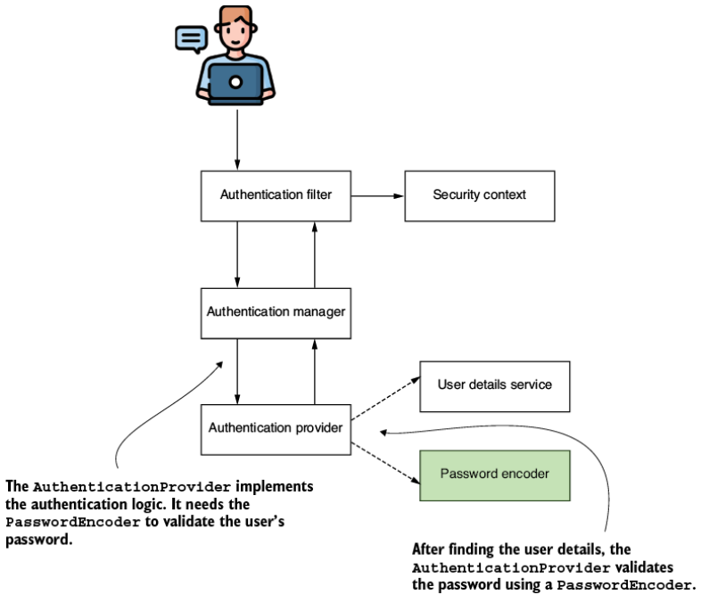
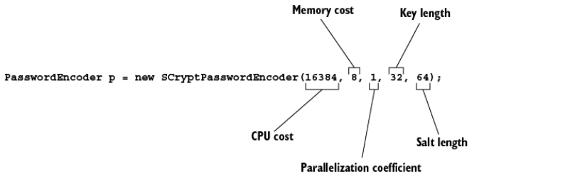
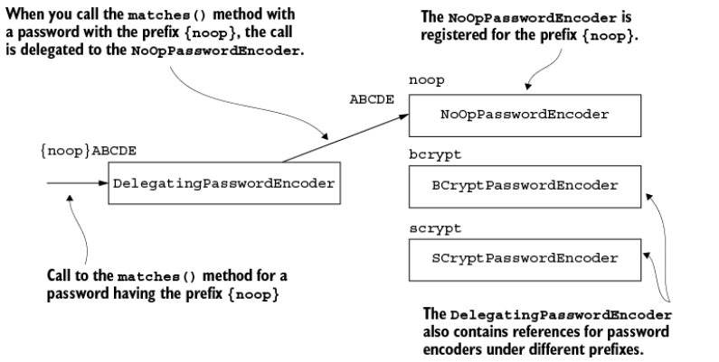
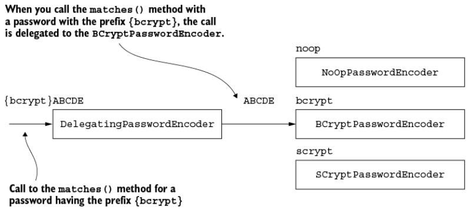

# 4. Quản lý mật khẩu (Managing passwords)

> Bản dịch tiếng Việt của chương 4 — *Spring Security in Action, Second Edition* (Laurentiu Spilca, Manning).

**Nội dung chương này bao gồm:**

- Hiện thực và làm việc với `PasswordEncoder`
- Sử dụng các công cụ do Spring Security Crypto module cung cấp

Ở chương 3, chúng ta đã bàn về việc quản lý user (người dùng) trong một ứng dụng được hiện thực bằng Spring Security. Nhưng còn mật khẩu thì sao? Chúng chắc chắn là một mảnh ghép thiết yếu của luồng authentication (xác thực). Trong chương này, bạn sẽ học cách quản lý mật khẩu và secret trong một ứng dụng được hiện thực với Spring Security. Chúng ta sẽ thảo luận về contract (giao ước) `PasswordEncoder` và các công cụ mà Spring Security Crypto module (SSCM) cung cấp để quản lý mật khẩu.

---

## 4.1 Sử dụng password encoder

Từ chương 3, đến giờ bạn hẳn đã có hình dung rõ ràng về interface `UserDetails` là gì, cũng như nhiều cách khác nhau để sử dụng hiện thực của nó. Nhưng như bạn đã học ở chương 2, có nhiều actor (thành phần tham gia) khác nhau cùng quản lý phần biểu diễn user trong tiến trình authentication và authorization (phân quyền). Bạn cũng đã học rằng một số trong số đó có sẵn giá trị mặc định, chẳng hạn `UserDetailsService` và `PasswordEncoder`. Giờ bạn đã biết rằng mình có thể ghi đè (override) các giá trị mặc định đó. Chúng ta tiếp tục đi sâu tìm hiểu những bean này và các cách hiện thực chúng, nên trong mục này chúng ta sẽ phân tích `PasswordEncoder`. Hình 4.1 nhắc lại cho bạn vị trí của `PasswordEncoder` trong tiến trình authentication.



**Hình 4.1** Tiến trình authentication của Spring Security. `AuthenticationProvider` sử dụng `PasswordEncoder` để kiểm tra tính hợp lệ mật khẩu của user trong tiến trình authentication.

Bởi vì nhìn chung một hệ thống không quản lý mật khẩu ở dạng plain text (văn bản thuần), chúng thường trải qua một dạng biến đổi nào đó khiến việc đọc và đánh cắp trở nên khó khăn hơn. Với trách nhiệm này, Spring Security định nghĩa một contract riêng. Để giải thích một cách đơn giản trong mục này, tôi sẽ đưa ra nhiều ví dụ code liên quan đến việc hiện thực `PasswordEncoder`. Chúng ta sẽ bắt đầu bằng việc hiểu contract, sau đó sẽ viết hiện thực của riêng mình trong một project. Tiếp theo, ở mục 4.1.3, tôi sẽ cung cấp cho bạn danh sách những hiện thực `PasswordEncoder` nổi tiếng và được dùng rộng rãi nhất mà Spring Security cung cấp.

### 4.1.1 Contract `PasswordEncoder`

Trong mục này, chúng ta bàn về định nghĩa của contract `PasswordEncoder`. Bạn hiện thực contract này để nói cho Spring Security biết cách kiểm tra tính hợp lệ mật khẩu của user. Trong tiến trình authentication, `PasswordEncoder` quyết định một mật khẩu có hợp lệ hay không. Mọi hệ thống đều lưu trữ mật khẩu đã được encode (mã hóa/biến đổi) theo một cách nào đó. Tốt nhất là bạn nên lưu chúng dưới dạng hash (băm) để không ai có cơ hội đọc được. `PasswordEncoder` cũng có thể encode mật khẩu. Hai phương thức `encode()` và `matches()` mà contract khai báo thực chất chính là định nghĩa trách nhiệm của nó. Cả hai đều thuộc cùng một contract bởi chúng liên kết chặt chẽ với nhau. Cách ứng dụng encode một mật khẩu có liên quan đến cách mật khẩu đó được kiểm tra. Trước hết, hãy xem qua nội dung của interface `PasswordEncoder`:

```java
public interface PasswordEncoder {
  String encode(CharSequence rawPassword);
  boolean matches(CharSequence rawPassword, String encodedPassword);
  default boolean upgradeEncoding(String encodedPassword) {
    return false;
  }
}
```

Interface này định nghĩa hai phương thức abstract và một phương thức có hiện thực mặc định. Hai phương thức abstract `encode()` và `matches()` cũng là những phương thức bạn nghe nhắc đến nhiều nhất khi làm việc với một hiện thực `PasswordEncoder`.

Mục đích của phương thức `encode(CharSequence rawPassword)` là trả về kết quả biến đổi của một chuỗi được cung cấp. Xét về mặt chức năng trong Spring Security, nó được dùng để cung cấp phép mã hóa (encryption) hoặc giá trị hash cho một mật khẩu cho trước. Sau đó, bạn có thể dùng phương thức `matches(CharSequence rawPassword, String encodedPassword)` để kiểm tra xem một chuỗi đã encode có khớp với một mật khẩu thô (raw password) hay không. Bạn dùng phương thức `matches()` trong tiến trình authentication để đối chiếu mật khẩu được cung cấp với một tập credential (thông tin đăng nhập) đã biết. Phương thức thứ ba, tên là `upgradeEncoding(CharSequence encodedPassword)`, mặc định trả về `false` trong contract. Nếu bạn ghi đè nó để trả về `true`, thì mật khẩu đã encode sẽ được encode thêm một lần nữa nhằm tăng độ bảo mật.

Trong một số trường hợp, việc encode lại mật khẩu đã encode có thể khiến việc thu được mật khẩu ở dạng cleartext (văn bản rõ) từ kết quả trở nên khó khăn hơn. Nói chung, đây là một kiểu "bảo mật bằng che giấu" (obscurity) mà cá nhân tôi không thích. Nhưng framework vẫn cung cấp khả năng này nếu bạn thấy nó phù hợp với trường hợp của mình.

### 4.1.2 Hiện thực `PasswordEncoder` của riêng bạn

Như bạn đã thấy, hai phương thức `matches()` và `encode()` có quan hệ chặt chẽ với nhau. Nếu bạn ghi đè chúng, chúng phải luôn tương ứng với nhau về mặt chức năng: một chuỗi được trả về bởi phương thức `encode()` phải luôn kiểm chứng được bằng phương thức `matches()` của cùng một `PasswordEncoder`. Trong mục này, bạn sẽ hiện thực contract `PasswordEncoder` và định nghĩa hai phương thức abstract mà interface khai báo. Khi biết cách hiện thực `PasswordEncoder`, bạn có thể chọn cách ứng dụng quản lý mật khẩu cho tiến trình authentication. Hiện thực đơn giản nhất là một password encoder coi mật khẩu ở dạng plain text — tức là nó không thực hiện bất kỳ phép encode nào lên mật khẩu.

Quản lý mật khẩu ở dạng cleartext chính xác là những gì instance của `NoOpPasswordEncoder` làm. Chúng ta đã dùng class này trong ví dụ đầu tiên ở chương 2. Nếu bạn tự viết một cái, nó sẽ trông giống như listing dưới đây.

**Listing 4.1 Hiện thực đơn giản nhất của một `PasswordEncoder`**

```java
public class PlainTextPasswordEncoder
  implements PasswordEncoder {

  @Override
  public String encode(CharSequence rawPassword) {
    return rawPassword.toString();                        // ①
  }

  @Override
  public boolean matches(
    CharSequence rawPassword, String encodedPassword) {
      return rawPassword.equals(encodedPassword);         // ②
  }
}
```

① Chúng ta không thay đổi mật khẩu; chỉ trả về nguyên trạng.

② Kiểm tra xem hai chuỗi có bằng nhau không.

Kết quả của phép encode luôn giống hệt mật khẩu. Vì vậy, để kiểm tra chúng có khớp hay không, bạn chỉ cần so sánh các chuỗi bằng `equals()`. Một hiện thực đơn giản của `PasswordEncoder` sử dụng thuật toán hash SHA-512 sẽ trông như listing kế tiếp.

**Listing 4.2 Hiện thực một `PasswordEncoder` sử dụng SHA-512**

```java
public class Sha512PasswordEncoder
  implements PasswordEncoder {

  @Override
  public String encode(CharSequence rawPassword) {
    return hashWithSHA512(rawPassword.toString());
  }

  @Override
  public boolean matches(
    CharSequence rawPassword, String encodedPassword) {
    String hashedPassword = encode(rawPassword);
    return encodedPassword.equals(hashedPassword);
  }

  // Phần code được lược bỏ
}
```

Trong listing 4.2, chúng ta dùng một phương thức để hash giá trị chuỗi được cung cấp bằng SHA-512. Tôi lược bỏ hiện thực của phương thức này trong listing 4.2, nhưng bạn có thể tìm thấy nó trong listing 4.3. Chúng ta gọi phương thức này từ phương thức `encode()`, và giờ nó trả về giá trị hash cho đầu vào của nó. Để kiểm chứng một giá trị hash với một đầu vào, phương thức `matches()` hash mật khẩu thô trong đầu vào của nó rồi so sánh bằng nhau với giá trị hash mà nó đang đối chiếu.

**Listing 4.3 Hiện thực phương thức hash đầu vào bằng SHA-512**

```java
private String hashWithSHA512(String input) {
  StringBuilder result = new StringBuilder();
  try {
    MessageDigest md = MessageDigest.getInstance("SHA-512");
    byte [] digested = md.digest(input.getBytes());
    for (int i = 0; i < digested.length; i++) {
       result.append(Integer.toHexString(0xFF & digested[i]));
    }
  } catch (NoSuchAlgorithmException e) {
    throw new RuntimeException("Bad algorithm");
  }
  return result.toString();
}
```

Bạn sẽ học được những lựa chọn tốt hơn để làm việc này ở mục kế tiếp, nên đừng bận tâm quá nhiều về đoạn code này lúc này.

### 4.1.3 Lựa chọn trong số các hiện thực `PasswordEncoder` có sẵn

Việc biết cách hiện thực `PasswordEncoder` của riêng mình rất hữu ích, nhưng bạn cũng cần biết rằng Spring Security đã cung cấp sẵn một số hiện thực rất có lợi. Nếu một trong số đó phù hợp với ứng dụng của bạn, bạn không cần phải viết lại. Trong mục này, chúng ta bàn về các lựa chọn hiện thực `PasswordEncoder` mà Spring Security cung cấp. Đó là:

- **`NoOpPasswordEncoder`** — Không encode mật khẩu mà giữ nguyên ở dạng cleartext. Chúng ta chỉ dùng hiện thực này cho các ví dụ minh họa. Vì nó không hash mật khẩu, bạn tuyệt đối không nên dùng nó trong tình huống thực tế.
- **`StandardPasswordEncoder`** — Dùng SHA-256 để hash mật khẩu. Hiện thực này giờ đã bị deprecated (không khuyến khích dùng nữa), và bạn không nên dùng nó cho các hiện thực mới. Nó bị deprecated vì sử dụng một thuật toán hash mà chúng ta không còn coi là đủ mạnh nữa, nhưng bạn vẫn có thể bắt gặp hiện thực này trong các ứng dụng hiện hữu. Tốt nhất, nếu tìm thấy nó trong các app đang tồn tại, bạn nên thay nó bằng một password encoder khác mạnh hơn.
- **`Pbkdf2PasswordEncoder`** — Dùng password-based key derivation function 2 (PBKDF2).
- **`BCryptPasswordEncoder`** — Dùng hàm hash mạnh bcrypt để encode mật khẩu.
- **`SCryptPasswordEncoder`** — Dùng hàm hash scrypt để encode mật khẩu.

Để tìm hiểu thêm về hashing và các thuật toán này, bạn có thể đọc phần thảo luận rất hay ở chương 2 của cuốn *Real-World Cryptography* của David Wong (Manning, 2021) tại <http://mng.bz/QRJw>.

Hãy cùng xem một vài ví dụ về cách tạo instance của các kiểu hiện thực `PasswordEncoder` này. `NoOpPasswordEncoder` không encode mật khẩu. Nó có hiện thực tương tự `PlainTextPasswordEncoder` trong ví dụ của chúng ta ở listing 4.1. Vì lý do này, chúng ta chỉ dùng password encoder này với các ví dụ mang tính lý thuyết. Ngoài ra, class `NoOpPasswordEncoder` được thiết kế theo kiểu singleton. Bạn không thể gọi constructor của nó trực tiếp từ bên ngoài class, nhưng bạn có thể dùng phương thức `NoOpPasswordEncoder.getInstance()` để lấy instance của class như sau:

```java
PasswordEncoder p = NoOpPasswordEncoder.getInstance();
```

Hiện thực `StandardPasswordEncoder` do Spring Security cung cấp sử dụng SHA-256 để hash mật khẩu. Với `StandardPasswordEncoder`, bạn có thể cung cấp một secret được dùng trong tiến trình hashing. Bạn đặt giá trị của secret này qua tham số của constructor. Nếu bạn chọn gọi constructor không tham số, hiện thực sẽ dùng chuỗi rỗng làm giá trị cho key. Tuy nhiên, `StandardPasswordEncoder` hiện đã bị deprecated, và tôi không khuyến nghị bạn dùng nó cho các hiện thực mới. Bạn có thể bắt gặp các ứng dụng cũ hoặc legacy code vẫn đang dùng nó, nên bạn cũng cần biết về nó. Đoạn code dưới đây cho thấy cách tạo instance của password encoder này:

```java
PasswordEncoder p = new StandardPasswordEncoder();
PasswordEncoder p = new StandardPasswordEncoder("secret");
```

Một lựa chọn khác mà Spring Security cung cấp là hiện thực `Pbkdf2PasswordEncoder`, sử dụng PBKDF2 để encode mật khẩu. Để tạo instance của `Pbkdf2PasswordEncoder`, bạn có lựa chọn sau:

```java
PasswordEncoder p =
   new Pbkdf2PasswordEncoder("secret", 16, 310000,
       Pbkdf2PasswordEncoder.SecretKeyFactoryAlgorithm.PBKDF2WithHmacSHA1);
```

> **Ghi chú của người dịch:** Trong file PDF gốc, dòng code này bị cắt ngang ở `Pbkdf2PasswordEncoder.SecretKey` do tràn khỏi khung hiển thị. Phần còn lại đã được bổ sung theo API của Spring Security.

PBKDF2 là một hàm hash chậm khá đơn giản, thực hiện HMAC với số lần được chỉ định bởi tham số số vòng lặp (iterations). Ba tham số đầu tiên mà lời gọi trên nhận vào lần lượt là giá trị của key dùng cho tiến trình encode, số vòng lặp dùng để encode mật khẩu, và kích thước của hash. Tham số thứ hai và thứ ba có thể ảnh hưởng đến độ mạnh của kết quả. Tham số thứ tư quy định độ rộng (hash width) của hash. Bạn có thể chọn các tùy chọn sau:

- `PBKDF2WithHmacSHA1`
- `PBKDF2WithHmacSHA256`
- `PBKDF2WithHmacSHA512`

Bạn có thể chọn nhiều hơn hoặc ít vòng lặp hơn, cũng như độ dài của kết quả. Hash càng dài thì mật khẩu càng mạnh (điều tương tự cũng đúng với hash width). Tuy nhiên, hãy lưu ý rằng hiệu năng bị ảnh hưởng bởi các giá trị này: càng nhiều vòng lặp thì ứng dụng của bạn càng tiêu tốn nhiều tài nguyên. Bạn nên tìm một sự thỏa hiệp khôn ngoan giữa lượng tài nguyên tiêu tốn để sinh hash và độ mạnh cần thiết của phép encode.

> **NOTE** Trong cuốn sách này, tôi có nhắc tới một số khái niệm mật mã học mà bạn có thể muốn tìm hiểu thêm. Để có thông tin liên quan về HMAC và các chi tiết mật mã học khác, tôi khuyến nghị cuốn *Real-World Cryptography* của David Wong (Manning, 2021). Chương 3 của cuốn sách đó cung cấp thông tin chi tiết về HMAC. Bạn có thể tìm thấy cuốn sách tại <http://mng.bz/XqJG>.

Một lựa chọn tuyệt vời khác mà Spring Security cung cấp là `BCryptPasswordEncoder`, sử dụng hàm hash mạnh bcrypt để encode mật khẩu. Bạn có thể khởi tạo `BCryptPasswordEncoder` bằng cách gọi constructor không tham số. Tuy nhiên, bạn cũng có lựa chọn chỉ định một hệ số độ mạnh (strength coefficient) biểu diễn số log rounds (số vòng logarit) được dùng trong tiến trình encode. Hơn nữa, bạn cũng có thể thay đổi instance `SecureRandom` được dùng cho việc encode:

```java
PasswordEncoder p = new BCryptPasswordEncoder();
PasswordEncoder p = new BCryptPasswordEncoder(4);

SecureRandom s = SecureRandom.getInstanceStrong();
PasswordEncoder p = new BCryptPasswordEncoder(4, s);
```

Giá trị log rounds mà bạn cung cấp ảnh hưởng đến số vòng lặp mà thao tác hashing sử dụng. Số vòng lặp được dùng là 2^log rounds. Để tính số vòng lặp, giá trị log rounds chỉ có thể nằm trong khoảng từ 4 đến 31. Bạn có thể chỉ định giá trị này bằng cách gọi constructor nạp chồng thứ hai hoặc thứ ba, như trong đoạn code phía trên.

Lựa chọn cuối cùng tôi giới thiệu với bạn là `SCryptPasswordEncoder` (hình 4.2). Password encoder này sử dụng hàm hash scrypt. Với `ScryptPasswordEncoder`, bạn có lựa chọn tạo instance như trình bày trong hình 4.2.



**Hình 4.2** Constructor của `SCryptPasswordEncoder` nhận năm tham số và cho phép bạn cấu hình CPU cost, memory cost, độ dài key, và độ dài salt.

### 4.1.4 Nhiều chiến lược encode với `DelegatingPasswordEncoder`

Trong mục này, chúng ta bàn về các trường hợp mà một luồng authentication phải áp dụng nhiều hiện thực khác nhau để đối chiếu mật khẩu. Bạn cũng sẽ học cách áp dụng một công cụ hữu ích đóng vai trò như một `PasswordEncoder` trong ứng dụng của bạn. Thay vì có hiện thực của riêng mình, công cụ này ủy quyền (delegate) cho các object khác vốn hiện thực interface `PasswordEncoder`.

Trong một số ứng dụng, bạn có thể thấy hữu ích khi có nhiều password encoder và chọn trong số đó tùy theo một cấu hình cụ thể nào đó. Một tình huống phổ biến mà tôi thường thấy `DelegatingPasswordEncoder` xuất hiện trong các ứng dụng production là khi thuật toán encode bị thay đổi kể từ một phiên bản cụ thể của ứng dụng. Hãy hình dung ai đó phát hiện ra một lỗ hổng trong thuật toán đang dùng, và bạn muốn đổi nó cho những user mới đăng ký, nhưng lại không muốn đổi cho các credential hiện hữu. Kết cục là bạn có nhiều loại hash khác nhau. Bạn quản lý tình huống này thế nào? Dù đây không phải là cách tiếp cận duy nhất cho tình huống này, một lựa chọn tốt là dùng một object `DelegatingPasswordEncoder`.

`DelegatingPasswordEncoder` là một hiện thực của interface `PasswordEncoder` mà thay vì tự hiện thực thuật toán encode của riêng mình, nó ủy quyền cho một instance khác của một hiện thực cùng contract. Giá trị hash bắt đầu bằng một prefix (tiền tố) nêu tên thuật toán được dùng để tạo ra hash đó. `DelegatingPasswordEncoder` ủy quyền cho hiện thực `PasswordEncoder` đúng đắn dựa trên prefix của mật khẩu.

Nghe có vẻ phức tạp, nhưng với một ví dụ, bạn sẽ thấy nó khá dễ. Hình 4.3 trình bày mối quan hệ giữa các instance `PasswordEncoder`. `DelegatingPasswordEncoder` có một danh sách các hiện thực `PasswordEncoder` để ủy quyền. `DelegatingPasswordEncoder` lưu từng instance trong một map. `NoOpPasswordEncoder` được gán cho key `noop`, trong khi hiện thực `BCryptPasswordEncoder` được gán key `bcrypt`. Khi mật khẩu có prefix `{noop}`, `DelegatingPasswordEncoder` ủy quyền thao tác cho hiện thực `NoOpPasswordEncoder`. Nếu prefix là `{bcrypt}`, thì hành động được ủy quyền cho hiện thực `BCryptPasswordEncoder`, như trình bày trong hình 4.4.



**Hình 4.3** Trong tình huống này, `DelegatingPasswordEncoder` huy động một `NoOpPasswordEncoder` để xử lý các mật khẩu có prefix `{noop}`, một `BCryptPasswordEncoder` cho những mật khẩu bắt đầu bằng `{bcrypt}`, và một `SCryptPasswordEncoder` cho các mật khẩu bắt đầu bằng `{scrypt}`. Khi một mật khẩu đi kèm prefix `{noop}`, `DelegatingPasswordEncoder` hướng công việc đó tới phiên bản `NoOpPasswordEncoder`.



**Hình 4.4** Ở đây `DelegatingPasswordEncoder` giao nhiệm vụ xử lý các mật khẩu có prefix `{noop}` cho `NoOpPasswordEncoder`, mật khẩu có prefix `{bcrypt}` cho `BCryptPasswordEncoder`, và mật khẩu có prefix `{scrypt}` cho `SCryptPasswordEncoder`. Nếu một mật khẩu mang prefix `{bcrypt}`, `DelegatingPasswordEncoder` định tuyến tiến trình tới cơ chế của `BCryptPasswordEncoder`.

Tiếp theo, hãy tìm hiểu cách định nghĩa một `DelegatingPasswordEncoder`. Bạn bắt đầu bằng cách tạo một collection gồm các instance của những hiện thực `PasswordEncoder` mà bạn mong muốn, rồi gộp chúng lại trong một `DelegatingPasswordEncoder`, như trong listing dưới đây.

**Listing 4.4 Tạo một instance của `DelegatingPasswordEncoder`**

```java
@Configuration
public class ProjectConfig {

  // Phần code được lược bỏ

  @Bean
  public PasswordEncoder passwordEncoder() {
    Map<String, PasswordEncoder> encoders = new HashMap<>();

    encoders.put("noop", NoOpPasswordEncoder.getInstance());
    encoders.put("bcrypt", new BCryptPasswordEncoder());
    encoders.put("scrypt", new SCryptPasswordEncoder());

    return new DelegatingPasswordEncoder("bcrypt", encoders);
  }
}
```

`DelegatingPasswordEncoder` chỉ đơn thuần là một công cụ đóng vai trò như một `PasswordEncoder`, nên bạn có thể dùng nó khi cần chọn trong một tập hợp các hiện thực. Trong listing 4.4, instance `DelegatingPasswordEncoder` được khai báo chứa các tham chiếu tới một `NoOpPasswordEncoder`, một `BCryptPasswordEncoder`, và một `SCryptPasswordEncoder`, và ủy quyền mặc định cho hiện thực `BCryptPasswordEncoder`. Dựa trên prefix của hash, `DelegatingPasswordEncoder` dùng đúng hiện thực `PasswordEncoder` để đối chiếu mật khẩu. Prefix này chứa key định danh password encoder cần dùng từ map các encoder. Nếu không có prefix, `DelegatingPasswordEncoder` dùng encoder mặc định. `PasswordEncoder` mặc định là cái được truyền vào làm tham số đầu tiên khi khởi tạo instance `DelegatingPasswordEncoder`. Với code trong listing 4.4, `PasswordEncoder` mặc định là bcrypt.

> **NOTE** Dấu ngoặc nhọn là một phần của prefix hash, và chúng phải bao quanh tên của key. Ví dụ, nếu hash được cung cấp là `{noop}12345`, `DelegatingPasswordEncoder` sẽ ủy quyền cho `NoOpPasswordEncoder` mà chúng ta đã đăng ký cho prefix `noop`. Một lần nữa, hãy nhớ rằng dấu ngoặc nhọn là bắt buộc trong prefix.

Nếu hash trông giống như đoạn code kế tiếp, password encoder là cái mà chúng ta gán cho prefix `{bcrypt}`, tức `BCryptPasswordEncoder`. Đây cũng là cái mà ứng dụng sẽ ủy quyền tới nếu hoàn toàn không có prefix, bởi chúng ta đã định nghĩa nó là hiện thực mặc định:

```
{bcrypt}$2a$10$xn3LI/AjqicFYZFruSwve.681477XaVNaUQbr1gioaWPn4t1KsnmG
```

Để thuận tiện, Spring Security cung cấp một cách tạo `DelegatingPasswordEncoder` đã có sẵn map tới tất cả các hiện thực `PasswordEncoder` chuẩn. Class `PasswordEncoderFactories` cung cấp phương thức static `createDelegatingPasswordEncoder()` trả về một hiện thực `DelegatingPasswordEncoder` với đầy đủ bộ ánh xạ `PasswordEncoder` và bcrypt làm encoder mặc định:

```java
PasswordEncoder passwordEncoder =
    PasswordEncoderFactories.createDelegatingPasswordEncoder();
```

> **Ghi chú của người dịch:** Dòng code này cũng bị cắt trong PDF gốc (dừng ở `createDelegatingPassword`); phần còn lại đã được bổ sung theo API của Spring Security.

---

> ### Encoding vs. encrypting vs. hashing
>
> Ở các mục trước, tôi đã dùng khá nhiều các thuật ngữ *encoding*, *encrypting*, và *hashing*. Tôi muốn làm rõ ngắn gọn các thuật ngữ này và cách chúng được sử dụng xuyên suốt cuốn sách.
>
> **Encoding** đề cập tới bất kỳ phép biến đổi nào trên một đầu vào cho trước. Ví dụ, nếu ta có một hàm `x` đảo ngược một chuỗi, thì hàm `x -> y` áp dụng lên `ABCD` sẽ tạo ra `DCBA`.
>
> **Encryption** (mã hóa) là một dạng encoding cụ thể, trong đó để thu được đầu ra, ta cung cấp cả giá trị đầu vào và một key. Key giúp ta có thể quyết định về sau ai là người có khả năng đảo ngược hàm (thu được đầu vào từ đầu ra). Cách biểu diễn encryption đơn giản nhất dưới dạng một hàm là
>
> ```
> (x, k) -> y
> ```
>
> trong đó `x` là đầu vào, `k` là key, và `y` là kết quả của phép encryption. Theo cách này, một người biết key có thể dùng một hàm đã biết để thu lại đầu vào từ đầu ra: `(y, k) -> x`. Chúng ta gọi hàm ngược này là **decryption** (giải mã). Nếu key dùng cho encryption trùng với key dùng cho decryption, ta thường gọi đó là **symmetric key** (khóa đối xứng).
>
> Nếu ta có hai key khác nhau cho encryption (`(x, k1) -> y`) và decryption (`(y, k2) -> x`), thì ta nói phép encryption được thực hiện với **asymmetric keys** (khóa bất đối xứng). Khi đó `(k1, k2)` được gọi là một **key pair** (cặp khóa). Key dùng cho encryption, `k1`, còn được gọi là **public key** (khóa công khai), trong khi `k2` được gọi là **private key** (khóa riêng tư). Theo cách này, chỉ chủ sở hữu private key mới có thể giải mã dữ liệu.
>
> **Hashing** (băm) là một dạng encoding cụ thể, ngoại trừ việc hàm chỉ đi theo một chiều. Nghĩa là, từ một đầu ra `y` của hàm hash, bạn không thể lấy lại đầu vào `x`. Tuy nhiên, luôn phải có cách để kiểm tra xem một đầu ra `y` có tương ứng với một đầu vào `x` hay không, nên ta có thể hiểu hashing như một cặp hàm dùng để encode và matching. Nếu hashing là `x -> y`, thì ta cũng phải có một hàm đối chiếu `(x, y) -> boolean`.
>
> Đôi khi, hàm hash cũng có thể dùng một giá trị ngẫu nhiên cộng thêm vào đầu vào: `(x, k) -> y`. Chúng ta gọi giá trị này là **salt**. Salt làm cho hàm mạnh hơn, khiến việc áp dụng một hàm ngược để thu được đầu vào từ kết quả trở nên khó khăn hơn.

---

Để tóm tắt các contract mà chúng ta đã bàn và áp dụng cho tới lúc này trong cuốn sách, bảng 4.1 mô tả ngắn gọn từng thành phần.

**Bảng 4.1** Các interface biểu diễn những contract chính cho luồng authentication trong Spring Security

| Contract | Mô tả |
| --- | --- |
| `UserDetails` | Biểu diễn user theo cách Spring Security nhìn nhận. |
| `GrantedAuthority` | Định nghĩa một hành động trong phạm vi mục đích của ứng dụng mà user được phép thực hiện (ví dụ: read, write, delete, v.v.). |
| `UserDetailsService` | Biểu diễn object được dùng để truy xuất thông tin user theo username. |
| `UserDetailsManager` | Một contract chuyên biệt hơn của `UserDetailsService`. Ngoài việc lấy user theo username, nó còn có thể được dùng để thay đổi một tập hợp user hoặc một user cụ thể. |
| `PasswordEncoder` | Quy định cách mật khẩu được encrypt hoặc hash, và cách kiểm tra xem một chuỗi đã encode cho trước có khớp với một mật khẩu dạng plaintext hay không. |

---

## 4.2 Tận dụng Spring Security Crypto module

Trong mục này, chúng ta bàn về Spring Security Crypto module (SSCM) — phần của Spring Security xử lý về mật mã học. Việc dùng các hàm encryption, decryption và sinh key không được cung cấp sẵn (out of the box) trong ngôn ngữ Java, điều này gây ràng buộc cho lập trình viên khi phải thêm các dependency cung cấp cách tiếp cận dễ dùng hơn tới những tính năng này.

Để giúp cuộc sống của chúng ta dễ dàng hơn, Spring Security cũng cung cấp giải pháp của riêng mình, cho phép bạn giảm bớt dependency của project bằng cách loại bỏ nhu cầu dùng một thư viện riêng. Các password encoder cũng là một phần của SSCM, dù chúng ta đã xử lý chúng riêng biệt ở các mục trước. Trong mục này, chúng ta bàn về những lựa chọn khác liên quan đến mật mã học mà SSCM cung cấp. Bạn sẽ thấy các ví dụ về cách dùng hai tính năng thiết yếu từ SSCM:

- **Key generator** — Các object được dùng để sinh key cho các thuật toán hashing và encryption
- **Encryptor** — Các object được dùng để encrypt và decrypt dữ liệu

### 4.2.1 Sử dụng key generator

Trong mục này, chúng ta bàn về key generator. Một key generator là một object được dùng để sinh ra một loại key cụ thể, thường là loại key mà một thuật toán encryption hoặc hashing yêu cầu. Các hiện thực key generator mà Spring Security cung cấp là những công cụ tiện ích tuyệt vời. Bạn sẽ muốn dùng những hiện thực này hơn là thêm một dependency khác vào ứng dụng của mình, và đó là lý do tôi khuyến nghị bạn làm quen với chúng. Hãy cùng xem một số ví dụ code về cách tạo và áp dụng key generator.

Hai interface biểu diễn hai loại key generator chính: `BytesKeyGenerator` và `StringKeyGenerator`. Chúng ta có thể xây dựng chúng trực tiếp bằng cách sử dụng factory class `KeyGenerators`. Bạn có thể dùng một string key generator, được biểu diễn bởi contract `StringKeyGenerator`, để lấy một key dưới dạng chuỗi. Thông thường, chúng ta dùng key này làm giá trị salt cho một thuật toán hashing hoặc encryption. Bạn có thể xem định nghĩa của contract `StringKeyGenerator` trong đoạn code sau:

```java
public interface StringKeyGenerator {
    String generateKey();
}
```

Generator này chỉ có duy nhất một phương thức `generateKey()` trả về một chuỗi biểu diễn giá trị key. Đoạn code kế tiếp trình bày ví dụ về cách lấy một instance `StringKeyGenerator` và cách dùng nó để lấy một giá trị salt:

```java
StringKeyGenerator keyGenerator = KeyGenerators.string();
String salt = keyGenerator.generateKey();
```

Generator tạo ra một key 8 byte, và encode nó dưới dạng chuỗi thập lục phân (hexadecimal). Phương thức trả về kết quả của các thao tác này dưới dạng một chuỗi. Interface thứ hai mô tả một key generator là `BytesKeyGenerator`, được định nghĩa như sau:

```java
public interface BytesKeyGenerator {
  int getKeyLength();
  byte[] generateKey();
}
```

Ngoài phương thức `generateKey()` trả về key dưới dạng `byte[]`, interface này định nghĩa thêm một phương thức trả về độ dài key tính theo số byte. Một `BytesKeyGenerator` mặc định sinh ra các key có độ dài 8 byte:

```java
BytesKeyGenerator keyGenerator = KeyGenerators.secureRandom();
byte [] key = keyGenerator.generateKey();
int keyLength = keyGenerator.getKeyLength();
```

Trong đoạn code phía trên, key generator sinh ra các key có độ dài 8 byte. Nếu bạn muốn chỉ định độ dài key khác, bạn có thể làm điều đó khi lấy instance của key generator bằng cách cung cấp giá trị mong muốn cho phương thức `KeyGenerators.secureRandom()`:

```java
BytesKeyGenerator keyGenerator = KeyGenerators.secureRandom(16);
```

Các key được sinh bởi `BytesKeyGenerator` tạo ra bằng phương thức `KeyGenerators.secureRandom()` là duy nhất cho mỗi lần gọi phương thức `generateKey()`. Trong một số trường hợp, chúng ta lại muốn một hiện thực trả về cùng một giá trị key cho mỗi lần gọi trên cùng một key generator. Trong trường hợp này, chúng ta có thể tạo một `BytesKeyGenerator` bằng phương thức `KeyGenerators.shared(int length)`. Trong đoạn code sau, `key1` và `key2` có cùng giá trị:

```java
BytesKeyGenerator keyGenerator = KeyGenerators.shared(16);
byte [] key1 = keyGenerator.generateKey();
byte [] key2 = keyGenerator.generateKey();
```

### 4.2.2 Encrypt và decrypt secret bằng encryptor

Trong mục này, chúng ta áp dụng các hiện thực encryptor mà Spring Security cung cấp qua các ví dụ code. Một encryptor là một object hiện thực một thuật toán encryption. Khi nói về bảo mật, encryption và decryption là những thao tác phổ biến, nên bạn hãy chuẩn bị tinh thần rằng mình sẽ cần chúng trong ứng dụng.

Chúng ta thường cần encrypt dữ liệu khi gửi nó giữa các thành phần của hệ thống hoặc khi lưu trữ (persist) nó. Các thao tác mà một encryptor cung cấp là encryption và decryption. Có hai loại encryptor được SSCM định nghĩa: `BytesEncryptor` và `TextEncryptor`. Dù chúng có trách nhiệm tương tự nhau, chúng xử lý các kiểu dữ liệu khác nhau. `TextEncryptor` quản lý dữ liệu dưới dạng chuỗi. Các phương thức của nó nhận chuỗi làm đầu vào và trả về chuỗi làm đầu ra, như bạn có thể thấy từ định nghĩa interface của nó:

```java
public interface TextEncryptor {
  String encrypt(String text);
  String decrypt(String encryptedText);
}
```

`BytesEncryptor` thì tổng quát hơn. Bạn cung cấp dữ liệu đầu vào cho nó dưới dạng một mảng byte:

```java
public interface BytesEncryptor {
  byte[] encrypt(byte[] byteArray);
  byte[] decrypt(byte[] encryptedByteArray);
}
```

Hãy cùng tìm hiểu xem chúng ta có những lựa chọn nào để xây dựng và sử dụng một encryptor. Factory class `Encryptors` cung cấp cho chúng ta nhiều khả năng. Với `BytesEncryptor`, chúng ta có thể dùng phương thức `Encryptors.standard()` hoặc `Encryptors.stronger()` như sau:

```java
String salt = KeyGenerators.string().generateKey();
String password = "secret";
String valueToEncrypt = "HELLO";

BytesEncryptor e = Encryptors.standard(password, salt);
byte [] encrypted = e.encrypt(valueToEncrypt.getBytes());
byte [] decrypted = e.decrypt(encrypted);
```

Ở phía sau hậu trường, byte encryptor chuẩn dùng phép encryption AES 256-byte để encrypt đầu vào. Để xây dựng một instance byte encryptor mạnh hơn, bạn có thể gọi phương thức `Encryptors.stronger()`:

```java
BytesEncryptor e = Encryptors.stronger(password, salt);
```

Khác biệt là nhỏ và diễn ra ở phía sau hậu trường, nơi phép encryption AES 256-bit dùng Galois/Counter Mode (GCM) làm chế độ vận hành. Chế độ standard dùng cipher block chaining (CBC), vốn được coi là phương pháp yếu hơn.

`TextEncryptor` có ba loại chính. Bạn tạo ba loại này bằng cách gọi `Encryptors.text()` hoặc `Encryptors.delux()`. Bên cạnh những phương thức tạo encryptor này, còn có một phương thức trả về một `TextEncryptor` giả (dummy), tức là không encrypt giá trị. Bạn có thể dùng `TextEncryptor` dummy này cho các ví dụ demo hoặc trong những trường hợp bạn muốn kiểm thử hiệu năng ứng dụng mà không tốn thời gian cho việc encryption. Phương thức trả về encryptor no-op này là `Encryptors.noOpText()`. Trong đoạn code dưới đây, bạn sẽ thấy ví dụ về việc sử dụng một `TextEncryptor`. Dù đây là một lời gọi tới encryptor, trong ví dụ này `encrypted` và `valueToEncrypt` là giống hệt nhau:

```java
String valueToEncrypt = "HELLO";
TextEncryptor e = Encryptors.noOpText();
String encrypted = e.encrypt(valueToEncrypt);
```

Encryptor `Encryptors.text()` dùng phương thức `Encryptors.standard()` để quản lý thao tác encryption, trong khi phương thức `Encryptors.delux()` dùng một instance `Encryptors.stronger()` như sau:

```java
String salt = KeyGenerators.string().generateKey();
String password = "secret";
String valueToEncrypt = "HELLO";

TextEncryptor e = Encryptors.text(password, salt);       // ①
String encrypted = e.encrypt(valueToEncrypt);
String decrypted = e.decrypt(encrypted);
```

① Tạo một object `TextEncryptor` sử dụng salt và password.

---

## Tóm tắt

- `PasswordEncoder` nắm giữ một trong những trách nhiệm quan trọng bậc nhất trong logic authentication — xử lý mật khẩu.
- Spring Security cung cấp nhiều lựa chọn thay thế về thuật toán hashing, khiến việc hiện thực chỉ còn là vấn đề lựa chọn.
- Spring Security Crypto module (SSCM) cung cấp nhiều lựa chọn thay thế cho các hiện thực của key generator và encryptor.
- Key generator là các object tiện ích giúp bạn sinh ra những key dùng với các thuật toán mật mã.
- Encryptor là các object tiện ích giúp bạn áp dụng việc encryption và decryption dữ liệu.
