# 5. Bảo mật của web app bắt đầu từ filter (A web app's security begins with filters)

> Bản dịch tiếng Việt của chương 5 — *Spring Security in Action, Second Edition* (Laurentiu Spilca, Manning).

**Nội dung chương này bao gồm:**

- Làm việc với filter chain (chuỗi filter)
- Định nghĩa các filter tùy chỉnh
- Sử dụng các class của Spring Security hiện thực interface `Filter`

Trong Spring Security, các HTTP filter ủy quyền (delegate) những trách nhiệm khác nhau cho một HTTP request. Hơn nữa, chúng thường quản lý từng trách nhiệm phải được áp dụng lên request. Các filter vì thế tạo thành một chuỗi trách nhiệm (chain of responsibilities). Một filter nhận request, thực thi logic của nó, và cuối cùng ủy quyền request cho filter tiếp theo trong chuỗi (hình 5.1).

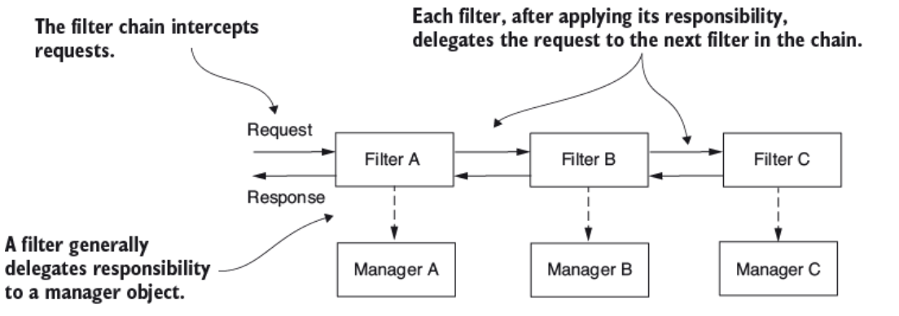

**Hình 5.1** Request được truyền vào filter chain. Mỗi filter huy động một manager để thực thi logic cụ thể lên request rồi chuyển nó xuống filter kế tiếp trong chuỗi.

Hãy lấy một phép so sánh làm ví dụ. Khi bạn tới sân bay, từ lúc vào nhà ga đến lúc lên máy bay, bạn đi qua nhiều filter khác nhau (hình 5.2). Trước tiên bạn xuất trình vé, rồi hộ chiếu của bạn được kiểm tra, và sau đó bạn đi qua khu vực an ninh. Tại cửa ra máy bay, có thể còn thêm những filter khác. Ví dụ, trong một số trường hợp, ngay trước khi lên máy bay, hộ chiếu và visa của bạn lại được kiểm tra lần nữa. Đây là một phép so sánh tuyệt vời với filter chain trong Spring Security. Theo cách tương tự, bạn tùy chỉnh các filter trong một filter chain với Spring Security. Spring Security cung cấp những hiện thực filter mà bạn thêm vào filter chain thông qua việc tùy chỉnh, nhưng bạn cũng có thể định nghĩa filter tùy chỉnh của riêng mình.

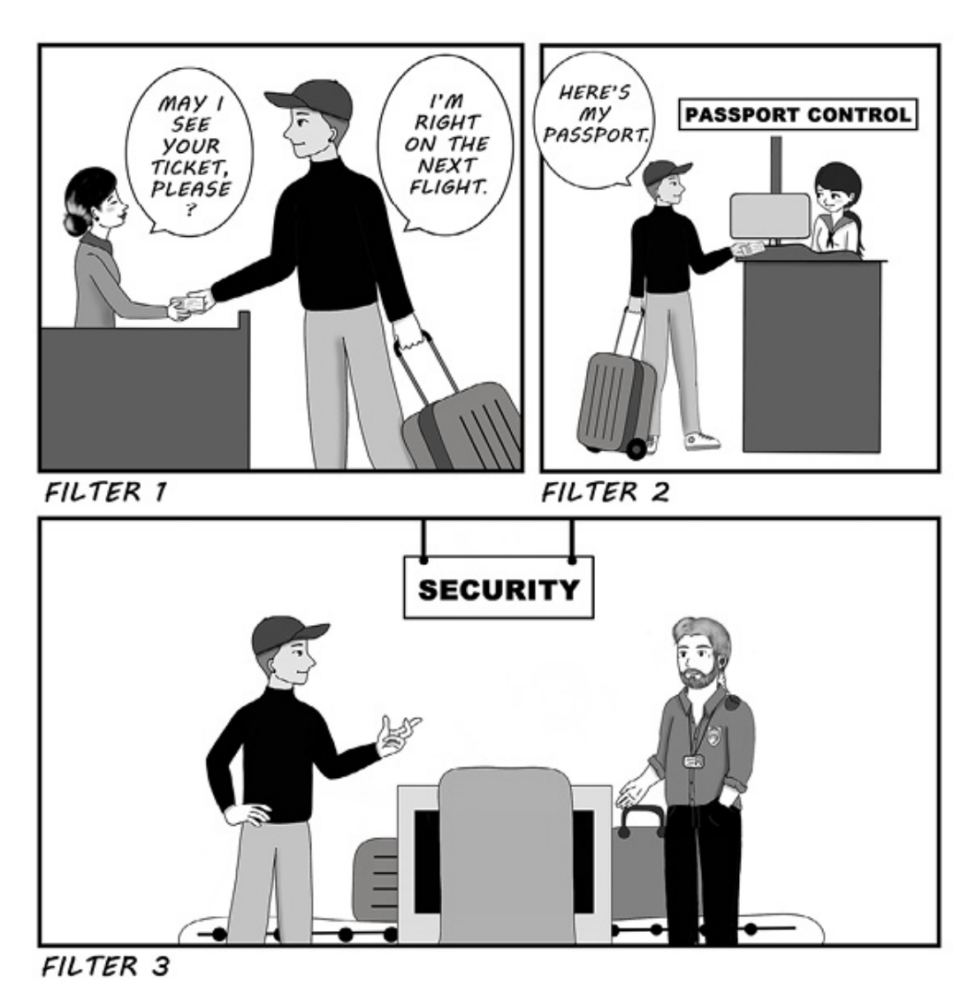

**Hình 5.2** Ở sân bay, bạn đi qua một loạt các trạm kiểm soát trước khi cuối cùng lên máy bay. Tương tự, Spring Security hiện thực một chuỗi filter xử lý các HTTP request mà ứng dụng nhận được.

Chương này sẽ bàn về cách dùng Spring Security để tùy chỉnh các filter — vốn là một phần của kiến trúc authentication (xác thực) và authorization (phân quyền) trong một web app. Ví dụ, bạn có thể muốn tăng cường authentication bằng cách thêm một bước nữa cho user, chẳng hạn kiểm tra địa chỉ email của họ hoặc dùng one-time password. Bạn cũng có thể thêm chức năng liên quan tới việc audit (kiểm toán) các sự kiện authentication. Bạn sẽ gặp nhiều tình huống khác nhau trong đó ứng dụng dùng auditing authentication, từ mục đích debug cho tới nhận diện hành vi của user. Công nghệ và các thuật toán machine learning ngày nay có thể cải thiện ứng dụng, ví dụ bằng cách học hành vi của user và biết được liệu có ai đó đã hack tài khoản hay mạo danh user hay không.

Biết cách tùy chỉnh chuỗi trách nhiệm của các HTTP filter là một kỹ năng giá trị. Trong thực tế, các ứng dụng đi kèm nhiều yêu cầu khác nhau mà ở đó cấu hình mặc định không còn phù hợp. Bạn sẽ cần thêm hoặc thay thế các component hiện có của chuỗi. Với hiện thực mặc định, bạn dùng phương thức HTTP Basic authentication, cho phép bạn dựa vào username và password. Tuy nhiên, trong các tình huống thực tế, có rất nhiều hoàn cảnh bạn cần nhiều hơn thế. Có thể bạn sẽ cần hiện thực một chiến lược authentication khác, thông báo cho một hệ thống bên ngoài về một sự kiện authorization, hoặc ghi log một lần authentication thành công hay thất bại để dùng sau này trong việc tracing và auditing (hình 5.3). Dù tình huống của bạn là gì, Spring Security cung cấp cho bạn sự linh hoạt để mô hình hóa filter chain chính xác theo nhu cầu.

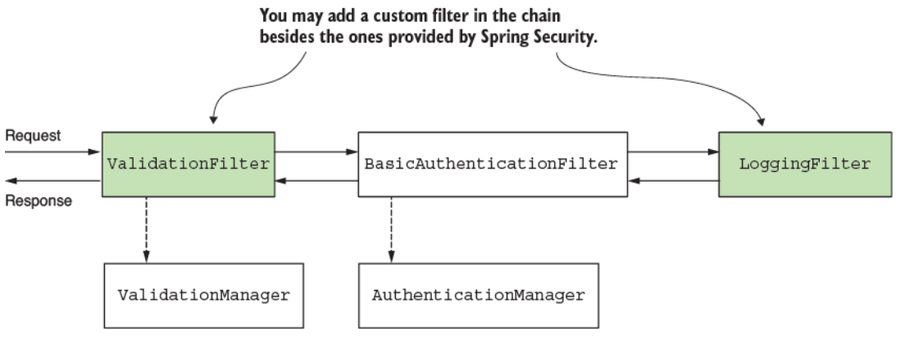

**Hình 5.3** Bạn có lựa chọn cá nhân hóa filter chain bằng cách chèn các filter mới vào trước, sau, hoặc tại vị trí của những filter hiện có. Bằng cách đó, bạn có thể điều chỉnh không chỉ tiến trình authentication mà còn toàn bộ cách xử lý request và response.

---

## 5.1 Hiện thực filter trong kiến trúc Spring Security

Mục này bàn về cách filter và filter chain hoạt động trong kiến trúc Spring Security. Bạn cần cái nhìn tổng quan này trước để hiểu các ví dụ hiện thực mà chúng ta sẽ làm ở những mục tiếp theo. Ở chương 2 và 3, chúng ta đã học rằng authentication filter chặn lấy request và ủy quyền trách nhiệm authentication tiếp cho authorization manager. Nếu muốn thực thi một logic nào đó trước authentication, chúng ta làm điều này bằng cách chèn một filter vào trước authentication filter.

Các filter trong kiến trúc Spring Security là những HTTP filter thông thường. Chúng ta có thể tạo filter bằng cách hiện thực interface `Filter` từ package `jakarta.servlet`. Cũng như với bất kỳ HTTP filter nào khác, bạn cần ghi đè phương thức `doFilter()` để hiện thực logic của nó. Phương thức này nhận `ServletRequest`, `ServletResponse`, và `FilterChain` làm tham số:

- **`ServletRequest`** — Biểu diễn HTTP request. Chúng ta dùng object `ServletRequest` để truy xuất chi tiết về request.
- **`ServletResponse`** — Biểu diễn HTTP response. Chúng ta dùng object `ServletResponse` để thay đổi response trước khi gửi nó về cho client hoặc đi tiếp trong filter chain.
- **`FilterChain`** — Biểu diễn chuỗi các filter. Chúng ta dùng object `FilterChain` để chuyển tiếp request tới filter kế tiếp trong chuỗi.

> **NOTE** Bắt đầu từ Spring Boot 3, Jakarta EE thay thế đặc tả Java EE cũ. Do thay đổi này, bạn sẽ thấy một số package đổi prefix từ "javax" sang "jakarta". Ví dụ, các kiểu như `Filter`, `ServletRequest`, và `ServletResponse` trước đây nằm trong package `javax.servlet`, nhưng giờ bạn tìm thấy chúng trong package `jakarta.servlet`.

Filter chain biểu diễn một tập hợp các filter với một thứ tự xác định mà chúng hoạt động. Spring Security cung cấp sẵn một số hiện thực filter và thứ tự của chúng cho chúng ta. Dưới đây là một số filter được cung cấp:

- `BasicAuthenticationFilter` lo việc HTTP Basic authentication, nếu có.
- `CsrfFilter` lo việc bảo vệ cross-site request forgery (CSRF), mà chúng ta sẽ bàn ở chương 9.
- `CorsFilter` lo các quy tắc authorization cross-origin resource sharing (CORS), mà chúng ta cũng sẽ bàn ở chương 10.

Bạn không cần biết tất cả các filter, vì có lẽ bạn sẽ không đụng trực tiếp tới chúng từ code của mình, nhưng bạn cần hiểu filter chain hoạt động ra sao và biết về một vài hiện thực. Trong cuốn sách này, tôi chỉ giải thích những filter thiết yếu với các chủ đề khác nhau mà chúng ta bàn tới.

Điều quan trọng cần hiểu là một ứng dụng không nhất thiết có instance của tất cả các filter này trong chuỗi. Chuỗi dài hay ngắn tùy thuộc vào cách bạn cấu hình ứng dụng. Ví dụ, ở chương 2 và 3, bạn đã học rằng bạn cần gọi phương thức `httpBasic()` của class `HttpSecurity` nếu muốn dùng phương thức HTTP Basic authentication. Điều xảy ra là nếu bạn gọi phương thức `httpBasic()`, một instance của `BasicAuthenticationFilter` được thêm vào chuỗi. Tương tự, tùy thuộc vào những cấu hình bạn viết, định nghĩa của filter chain sẽ bị ảnh hưởng.

Bạn thêm một filter mới vào chuỗi một cách tương đối so với một filter khác (hình 5.4). Hoặc bạn có thể thêm một filter vào trước, sau, hoặc tại vị trí của một filter đã biết. Mỗi vị trí thực chất là một chỉ số (một con số), và bạn cũng có thể thấy nó được gọi là "the order" (thứ tự).

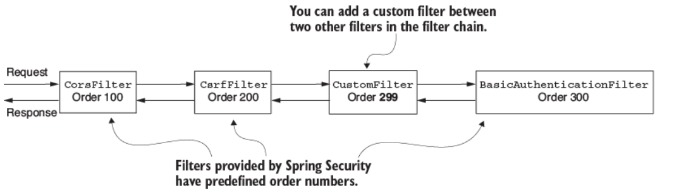

**Hình 5.4** Mỗi filter có một số thứ tự (order number), quyết định thứ tự mà các filter được áp dụng lên một request. Bạn có thể thêm filter tùy chỉnh cùng với các filter do Spring Security cung cấp.

Nếu bạn muốn tìm hiểu thêm về các filter mà Spring Security cung cấp và thứ tự cấu hình của chúng, bạn có thể xem enum `SecurityWebFiltersOrder`, có tại <http://mng.bz/yZEG>.

Bạn có thể thêm hai hoặc nhiều filter vào cùng một vị trí (hình 5.5). Ở mục 5.4, chúng ta sẽ gặp một trường hợp phổ biến mà điều này có thể xảy ra — một trường hợp thường gây nhầm lẫn cho các lập trình viên.

> **NOTE** Nếu nhiều filter có cùng vị trí, thứ tự mà chúng được gọi là không xác định.

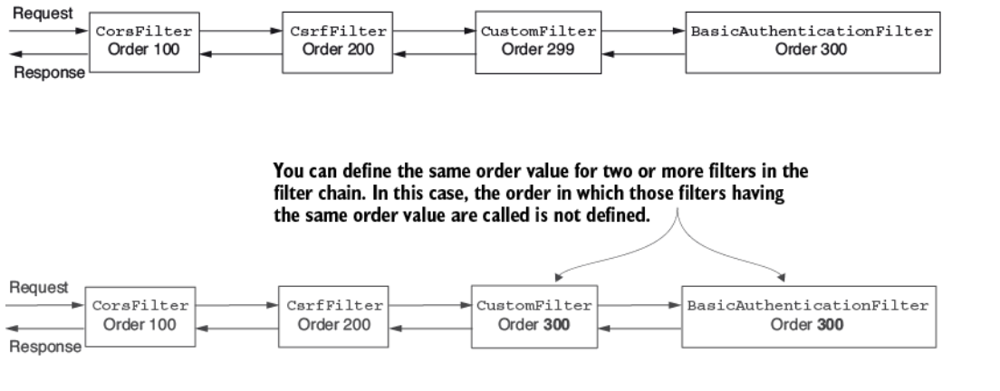

**Hình 5.5** Bạn có thể có nhiều filter với cùng giá trị thứ tự trong chuỗi. Trong trường hợp này, Spring Security không đảm bảo thứ tự mà chúng được gọi.

---

## 5.2 Thêm một filter vào trước một filter hiện có trong chuỗi

Mục này bàn về việc áp dụng các HTTP filter tùy chỉnh vào trước một filter hiện có trong filter chain. Bạn có thể gặp những tình huống mà điều này hữu ích. Để tiếp cận vấn đề này một cách thực tế, chúng ta sẽ làm một project làm ví dụ, và bạn sẽ học cách dễ dàng hiện thực một filter tùy chỉnh và áp dụng nó trước một filter hiện có trong filter chain. Sau đó bạn có thể điều chỉnh ví dụ này cho bất kỳ yêu cầu tương tự nào bạn có thể gặp trong ứng dụng production.

Với hiện thực filter tùy chỉnh đầu tiên, hãy xét một tình huống đơn giản. Chúng ta muốn đảm bảo rằng mọi request đều có một header tên là `Request-Id` (xem project `ssia-ch5-ex1`). Chúng ta giả định rằng ứng dụng của mình dùng header này để theo dõi request và header này là bắt buộc. Đồng thời, chúng ta muốn kiểm chứng những giả định này trước khi ứng dụng thực hiện authentication. Tiến trình authentication có thể liên quan tới việc truy vấn database hoặc những hành động tiêu tốn tài nguyên khác mà chúng ta không muốn ứng dụng thực thi nếu định dạng request không hợp lệ. Chúng ta làm điều này thế nào? Để giải quyết yêu cầu hiện tại chỉ cần hai bước, và cuối cùng filter chain sẽ trông như ở hình 5.6:

1. **Hiện thực filter.** Tạo một class `RequestValidationFilter` kiểm tra rằng header cần thiết tồn tại trong request.
2. **Thêm filter vào filter chain.** Làm việc này trong configuration class, dùng bean `SecurityFilterChain`.

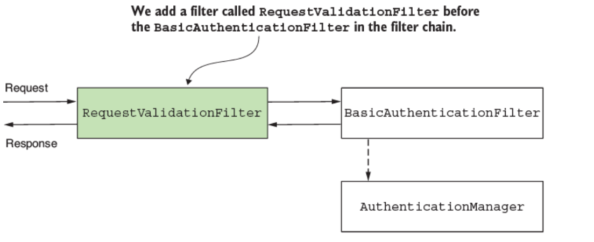

**Hình 5.6** Với ví dụ của chúng ta, chúng ta thêm một `RequestValidationFilter` hoạt động trước authentication filter. `RequestValidationFilter` đảm bảo rằng authentication sẽ không xảy ra nếu việc kiểm chứng request thất bại. Trong trường hợp của chúng ta, request phải có một header bắt buộc tên là `Request-Id`.

Để hoàn thành bước 1 — hiện thực filter — chúng ta định nghĩa một filter tùy chỉnh. Listing kế tiếp cho thấy hiện thực đó.

**Listing 5.1 Hiện thực một filter tùy chỉnh**

```java
public class RequestValidationFilter
  implements Filter {                    // ①

  @Override
  public void doFilter(
     ServletRequest servletRequest,
     ServletResponse servletResponse,
     FilterChain filterChain)
     throws IOException, ServletException {
     // ...
  }
}
```

① Để định nghĩa một filter, class này hiện thực interface `Filter` và ghi đè phương thức `doFilter()`.

Bên trong phương thức `doFilter()`, chúng ta viết logic của filter. Trong ví dụ của mình, chúng ta kiểm tra xem header `Request-Id` có tồn tại hay không. Nếu có, chúng ta chuyển tiếp request tới filter kế tiếp trong chuỗi bằng cách gọi phương thức `doFilter()`. Nếu header không tồn tại, chúng ta đặt HTTP status 400 Bad Request lên response mà không chuyển tiếp nó tới filter kế tiếp trong chuỗi (hình 5.7). Listing 5.2 trình bày logic đó.

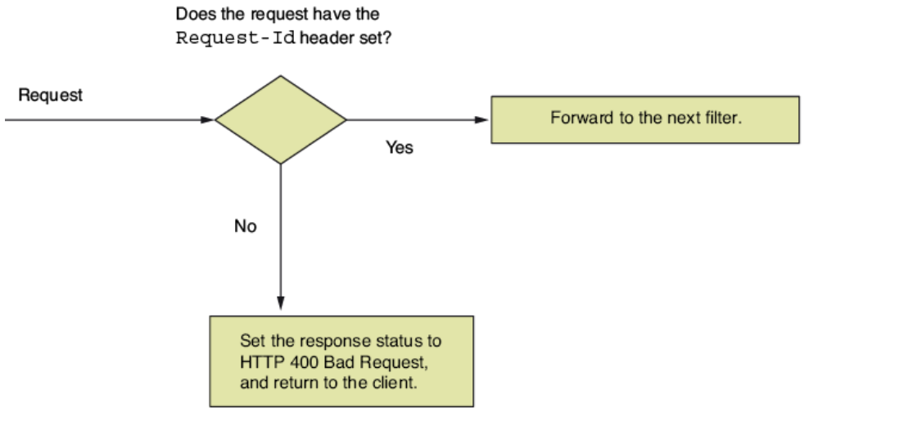

**Hình 5.7** Filter tùy chỉnh mà chúng ta thêm vào trước authentication kiểm tra xem header `Request-Id` có tồn tại hay không. Nếu header tồn tại trong request, ứng dụng chuyển tiếp request để được authentication. Nếu header không tồn tại, ứng dụng đặt HTTP status 400 Bad Request và trả về cho client.

**Listing 5.2 Hiện thực logic trong phương thức `doFilter()`**

```java
@Override
public void doFilter(
  ServletRequest request,
  ServletResponse response,
  FilterChain filterChain)
    throws IOException,
           ServletException {

  var httpRequest = (HttpServletRequest) request;
  var httpResponse = (HttpServletResponse) response;

  String requestId = httpRequest.getHeader("Request-Id");

  if (requestId == null || requestId.isBlank()) {
      httpResponse.setStatus(HttpServletResponse.SC_BAD_REQUEST);
      return;                                                      // ①
  }

  filterChain.doFilter(request, response);                         // ②
}
```

① Nếu header bị thiếu, HTTP status đổi thành 400 Bad Request, và request không được chuyển tiếp tới filter kế tiếp trong chuỗi.

② Nếu header tồn tại, request được chuyển tiếp tới filter kế tiếp trong chuỗi.

Để hiện thực bước 2 — áp dụng filter trong configuration class — chúng ta dùng phương thức `addFilterBefore()` của object `HttpSecurity`, vì chúng ta muốn ứng dụng thực thi filter tùy chỉnh này trước authentication. Phương thức này nhận hai tham số:

- **Một instance của filter tùy chỉnh mà chúng ta muốn thêm vào chuỗi** — Trong ví dụ của chúng ta, đây là một instance của class `RequestValidationFilter` trình bày ở listing 5.1.
- **Kiểu của filter mà trước nó chúng ta thêm instance mới vào** — Với ví dụ này, vì yêu cầu là thực thi logic filter trước authentication, chúng ta cần thêm instance filter tùy chỉnh của mình vào trước authentication filter. Class `BasicAuthenticationFilter` định nghĩa kiểu mặc định của authentication filter.

Cho tới giờ, chúng ta vẫn gọi chung filter xử lý authentication là *authentication filter*. Bạn sẽ khám phá ở các chương tiếp theo rằng Spring Security cũng cấu hình những filter khác. Ở chương 9, chúng ta sẽ bàn về bảo vệ cross-site request forgery (CSRF), và ở chương 10, chúng ta sẽ bàn về cross-origin resource sharing (CORS). Cả hai khả năng này cũng dựa vào filter.

Listing kế tiếp cho thấy cách thêm filter tùy chỉnh vào trước authentication filter trong configuration class. Để ví dụ đơn giản hơn, chúng ta dùng phương thức `permitAll()` để cho phép tất cả các request chưa được authentication.

**Listing 5.3 Cấu hình filter tùy chỉnh trước authentication**

```java
@Configuration
public class ProjectConfig {

  @Bean
  public SecurityFilterChain securityFilterChain(HttpSecurity http)
    throws Exception {

    http.addFilterBefore(                            // ①
           new RequestValidationFilter(), BasicAuthenticationFilter.class)
       .authorizeRequests(c -> c.anyRequest().permitAll());

    return http.build();
  }
}
```

① Thêm một instance của filter tùy chỉnh vào trước authentication filter trong filter chain.

> **Ghi chú của người dịch:** Trong PDF gốc, dòng `new RequestValidationFilter(), BasicAuthenticationFilter.cla` bị cắt cụt do tràn khỏi khung hiển thị; phần còn lại đã được khôi phục thành `BasicAuthenticationFilter.class)`.

Chúng ta cũng cần một controller class và một endpoint để test chức năng. Listing kế tiếp định nghĩa controller class.

**Listing 5.4 Controller class**

```java
@RestController
public class HelloController {

  @GetMapping("/hello")
  public String hello() {
    return "Hello!";
  }
}
```

Giờ bạn có thể chạy và test ứng dụng. Gọi endpoint mà không có header sẽ sinh ra một response với HTTP status 400 Bad Request. Nếu bạn thêm header vào request, trạng thái response trở thành HTTP 200 OK, và bạn cũng sẽ thấy response body, `Hello!` Để gọi endpoint mà không có header `Request-Id`, chúng ta dùng lệnh cURL này:

```bash
curl -v http://localhost:8080/hello
```

Lời gọi này sinh ra response (đã rút gọn) sau:

```
...
< HTTP/1.1 400
...
```

Để gọi endpoint và cung cấp header `Request-Id`, chúng ta dùng lệnh cURL này:

```bash
curl -H "Request-Id:12345" http://localhost:8080/hello
```

Lời gọi này sinh ra response body sau:

```
Hello!
```

---

## 5.3 Thêm một filter vào sau một filter hiện có trong chuỗi

Mục này minh họa cách thêm một filter vào sau một filter hiện có trong filter chain. Cách tiếp cận này được dùng khi bạn muốn thực thi một logic nào đó sau một thứ đã có sẵn trong filter chain. Giả sử bạn phải thực thi một logic nào đó sau tiến trình authentication. Ví dụ về điều này có thể là thông báo cho một hệ thống khác sau những sự kiện authentication nhất định, hoặc đơn giản là cho mục đích logging và tracing (hình 5.8). Như ở mục 5.1, chúng ta hiện thực một ví dụ để cho thấy cách làm điều này. Bạn có thể điều chỉnh nó theo nhu cầu của mình cho một tình huống thực tế.

Với ví dụ của chúng ta, chúng ta ghi log tất cả các sự kiện authentication thành công bằng cách thêm một filter vào sau authentication filter (hình 5.8). Chúng ta xem những gì vượt qua được authentication filter là biểu hiện của một sự kiện đã authentication thành công, và chúng ta muốn ghi log nó. Tiếp nối ví dụ từ mục 5.1, chúng ta cũng ghi log request ID nhận được qua HTTP header.

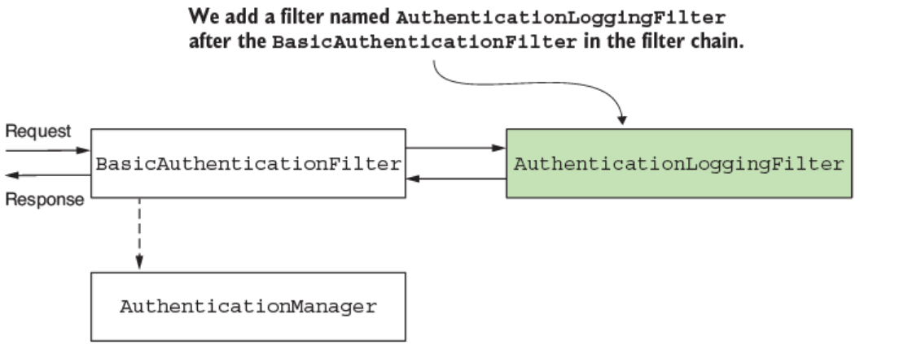

**Hình 5.8** Chúng ta thêm `AuthenticationLoggingFilter` vào sau `BasicAuthenticationFilter` để ghi log các request mà ứng dụng authentication.

Listing sau đây trình bày định nghĩa của một filter ghi log các request vượt qua authentication filter.

**Listing 5.5 Định nghĩa một filter để ghi log request**

```java
public class AuthenticationLoggingFilter implements Filter {

  private final Logger logger =
          Logger.getLogger(
          AuthenticationLoggingFilter.class.getName());

  @Override
  public void doFilter(
    ServletRequest request,
    ServletResponse response,
    FilterChain filterChain)
      throws IOException, ServletException {

      var httpRequest = (HttpServletRequest) request;

      var requestId =
        httpRequest.getHeader("Request-Id");             // ①

      logger.info("Successfully authenticated            // ②
                   request with id " +  requestId);      // ②

      filterChain.doFilter(request, response);           // ③
  }
}
```

① Lấy request ID từ các header của request.

② Ghi log sự kiện với giá trị của request ID.

③ Chuyển tiếp request tới filter kế tiếp trong chuỗi.

Để thêm filter tùy chỉnh vào chuỗi sau authentication filter, bạn gọi phương thức `addFilterAfter()` của `HttpSecurity`. Listing kế tiếp cho thấy hiện thực đó.

**Listing 5.6 Thêm một filter tùy chỉnh vào sau một filter hiện có trong filter chain**

```java
@Configuration
public class ProjectConfig {

  @Bean
  public SecurityFilterChain securityFilterChain(HttpSecurity http)
    throws Exception {

    http.addFilterBefore(
            new RequestValidationFilter(),
            BasicAuthenticationFilter.class)
        .addFilterAfter(                        // ①
            new AuthenticationLoggingFilter(),
            BasicAuthenticationFilter.class)
        .authorizeRequests(c -> c.anyRequest().permitAll());

    return http.build();
  }
}
```

① Thêm một instance của `AuthenticationLoggingFilter` vào filter chain sau authentication filter.

Sau khi chạy ứng dụng và gọi endpoint, chúng ta quan sát thấy rằng với mỗi lần gọi thành công tới endpoint, ứng dụng in ra một dòng log trên console. Với lời gọi

```bash
curl -H "Request-Id:12345" http://localhost:8080/hello
```

response body là

```
Hello!
```

Trên console, bạn có thể thấy một dòng tương tự

```
INFO 5876 --- [nio-8080-exec-2]
c.l.s.f.AuthenticationLoggingFilter:
Successfully authenticated request with id 12345
```

---

## 5.4 Thêm một filter tại vị trí của một filter khác trong chuỗi

Mục này bàn về việc thêm một filter tại vị trí của một filter khác trong filter chain. Cách tiếp cận này đặc biệt hữu ích khi cung cấp một hiện thực khác cho một trách nhiệm vốn đã được một trong những filter mà Spring Security biết đảm nhận. Một tình huống điển hình là authentication.

Giả sử rằng thay vì luồng HTTP Basic authentication, bạn muốn hiện thực một thứ khác. Thay vì dùng username và password làm credential đầu vào để ứng dụng authentication user, bạn cần áp dụng một cách tiếp cận khác. Một số ví dụ về những tình huống bạn có thể gặp là:

- Định danh dựa trên một giá trị header tĩnh để authentication
- Dùng một symmetric key (khóa đối xứng) để ký request nhằm authentication
- Dùng one-time password (OTP) trong tiến trình authentication

Trong tình huống thứ nhất (định danh dựa trên một static key để authentication), client gửi một chuỗi tới app trong header của HTTP request, và chuỗi này luôn giống nhau. Ứng dụng lưu những giá trị này ở đâu đó, nhiều khả năng trong database hoặc trong một secrets vault. Dựa trên giá trị tĩnh này, ứng dụng định danh client.

Cách tiếp cận này (hình 5.9) mang lại mức bảo mật yếu liên quan tới authentication, nhưng các kiến trúc sư và lập trình viên thường chọn nó cho các lời gọi giữa những ứng dụng backend vì tính đơn giản của nó. Các hiện thực cũng thực thi nhanh vì chúng không phải làm những tính toán phức tạp, như trong trường hợp áp dụng chữ ký mật mã. Bằng cách này, static key dùng cho authentication đại diện cho một sự thỏa hiệp, trong đó lập trình viên dựa nhiều hơn vào tầng hạ tầng về mặt bảo mật đồng thời cũng không để các endpoint hoàn toàn không được bảo vệ.

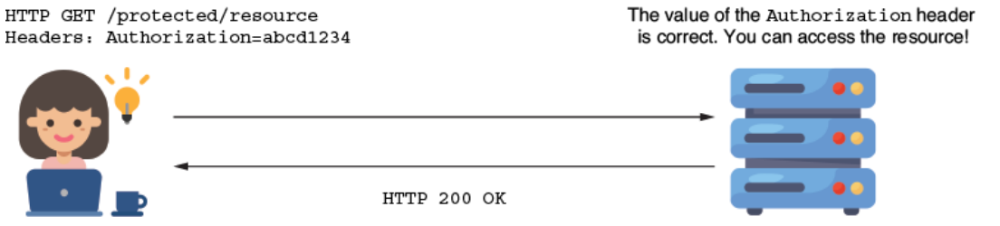

**Hình 5.9** Request chứa một header với giá trị của static key. Nếu giá trị này khớp với giá trị mà ứng dụng biết, nó chấp nhận request.

Trong tình huống thứ hai, dùng symmetric key để ký và kiểm chứng request, cả client và server đều biết giá trị của một key (client và server chia sẻ key này). Client dùng key này để ký một phần của request (ví dụ, ký giá trị của những header cụ thể), và server kiểm tra xem chữ ký có hợp lệ hay không bằng cùng key đó (hình 5.10). Server có thể lưu key riêng cho từng client trong database hoặc secrets vault. Tương tự, bạn có thể dùng một cặp asymmetric key (khóa bất đối xứng).

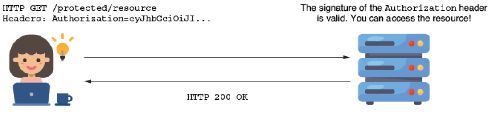

**Hình 5.10** Header `Authorization` giữ một giá trị được mã hóa bằng một key chia sẻ giữa client và server (hoặc mã hóa bằng một private key mà server sở hữu public key tương ứng). Nếu ứng dụng kiểm chứng chữ ký là hợp lệ, nó cho phép request đi tiếp.

Cuối cùng, với tình huống thứ ba, dùng OTP trong tiến trình authentication, user nhận OTP qua tin nhắn hoặc bằng cách dùng một app authentication provider như Google Authenticator (hình 5.11).

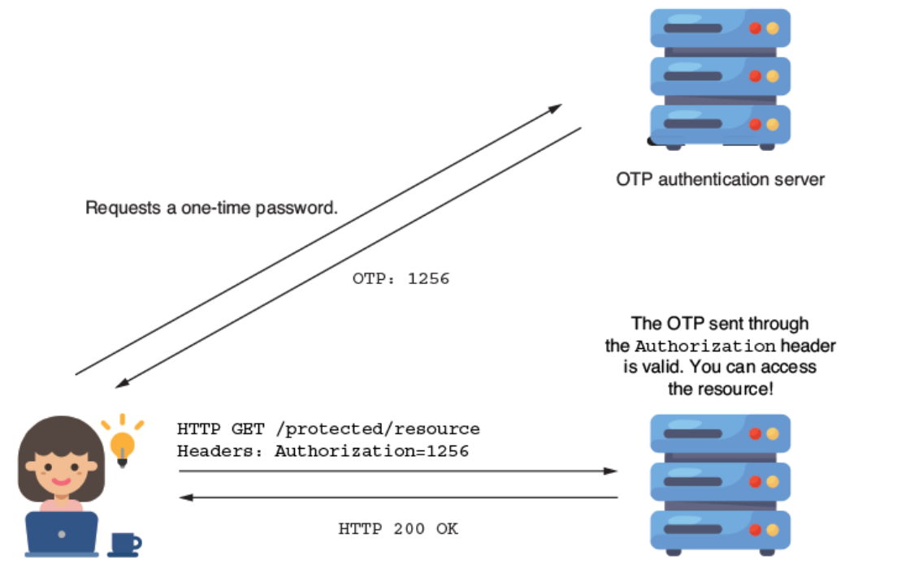

**Hình 5.11** Để vào được tài nguyên, client phải sử dụng một one-time password (OTP). OTP này được lấy từ một authentication server bên ngoài. Thông thường, các ứng dụng dùng phương pháp này cho những tiến trình đăng nhập đòi hỏi multi-factor authentication (xác thực đa yếu tố).

Hãy hiện thực một ví dụ để minh họa cách áp dụng một filter tùy chỉnh. Để giữ trường hợp vừa liên quan vừa dễ hiểu, chúng ta tập trung vào cấu hình và xét một logic đơn giản cho authentication. Trong tình huống của chúng ta, chúng ta có giá trị của một static key, giống nhau cho mọi request. Để được authentication, user phải thêm giá trị đúng của static key vào header `Authorization`, như trình bày ở hình 5.12. Bạn có thể tìm thấy code cho ví dụ này trong project `ssia-ch5-ex2`.

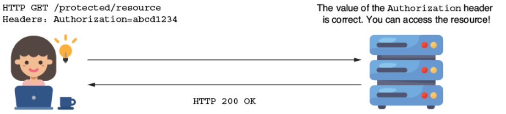

**Hình 5.12** Client thêm một static key vào header `Authorization` của HTTP request. Server kiểm tra xem nó có biết key đó hay không trước khi authorize các request.

Chúng ta bắt đầu bằng việc hiện thực class filter, đặt tên là `StaticKeyAuthenticationFilter`. Class này đọc giá trị của static key từ file properties và kiểm chứng xem giá trị của header `Authorization` có bằng nó hay không. Nếu các giá trị giống nhau, filter chuyển tiếp request tới component kế tiếp trong filter chain. Nếu không, filter đặt giá trị 401 Unauthorized cho HTTP status của response mà không chuyển tiếp request trong filter chain. Listing sau đây định nghĩa class `StaticKeyAuthenticationFilter`.

**Listing 5.7 Định nghĩa class `StaticKeyAuthenticationFilter`**

```java
@Component                                           // ①
public class StaticKeyAuthenticationFilter
  implements Filter {                                // ②

  @Value("${authorization.key}")                     // ③
  private String authorizationKey;

  @Override
  public void doFilter(ServletRequest request,
                       ServletResponse response,
                       FilterChain filterChain)
    throws IOException, ServletException {

    var httpRequest = (HttpServletRequest) request;
    var httpResponse = (HttpServletResponse) response;

    String authentication =                          // ④
           httpRequest.getHeader("Authorization");

    if (authorizationKey.equals(authentication)) {
        filterChain.doFilter(request, response);
    } else {
        httpResponse.setStatus(
            HttpServletResponse.SC_UNAUTHORIZED);
    }
  }
}
```

① Để cho phép chúng ta inject giá trị từ file properties, nó thêm một instance của class vào Spring context.

② Định nghĩa logic authentication bằng cách hiện thực interface `Filter` và ghi đè phương thức `doFilter()`.

③ Lấy giá trị của static key từ file properties bằng annotation `@Value`.

④ Lấy giá trị của header `Authorization` từ request để so sánh nó với static key.

Khi đã định nghĩa filter, chúng ta thêm nó vào filter chain tại vị trí của class `BasicAuthenticationFilter` bằng phương thức `addFilterAt()` (hình 5.13).

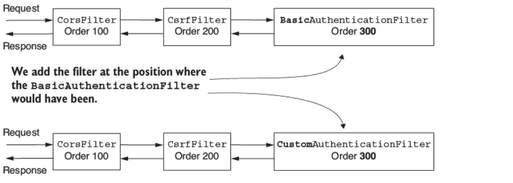

**Hình 5.13** Chúng ta thêm authentication filter tùy chỉnh của mình vào vị trí mà class `BasicAuthenticationFilter` lẽ ra sẽ ở đó nếu chúng ta dùng HTTP Basic làm phương thức authentication. Điều này nghĩa là filter tùy chỉnh của chúng ta có cùng giá trị thứ tự.

Nhưng hãy nhớ những gì chúng ta đã bàn ở mục 5.1. Khi thêm một filter vào một vị trí cụ thể, Spring Security không giả định rằng nó là filter duy nhất tại vị trí đó. Bạn có thể thêm nhiều filter hơn vào cùng vị trí trong chuỗi. Trong trường hợp này, Spring Security không đảm bảo thứ tự mà chúng sẽ hoạt động. Tôi nhắc lại điều này vì tôi đã thấy nhiều người bị nhầm lẫn về cách nó hoạt động. Một số lập trình viên nghĩ rằng khi bạn áp dụng một filter tại vị trí của một filter đã biết, nó sẽ được thay thế. Không phải vậy! Chúng ta phải đảm bảo không thêm những filter mà mình không cần.

> **NOTE** Tôi khuyên bạn không nên thêm nhiều filter vào cùng một vị trí trong chuỗi. Khi bạn thêm nhiều filter vào cùng một vị trí, thứ tự chúng được dùng là không xác định. Việc có một thứ tự rõ ràng mà các filter được gọi là điều hợp lý. Có một thứ tự đã biết khiến ứng dụng của bạn dễ hiểu và dễ bảo trì hơn.

Ở listing 5.8, bạn có thể tìm thấy định nghĩa của configuration class thêm filter này. Hãy để ý rằng chúng ta không gọi phương thức `httpBasic()` từ class `HttpSecurity` ở đây, vì chúng ta không muốn instance `BasicAuthenticationFilter` được thêm vào filter chain.

**Listing 5.8 Thêm filter trong configuration class**

```java
@Configuration
public class ProjectConfig {

  private final StaticKeyAuthenticationFilter filter;       // ①

  // constructor được lược bỏ

  @Bean
  public SecurityFilterChain securityFilterChain(HttpSecurity http)
    throws Exception {

    http.addFilterAt(filter,                                // ②
           BasicAuthenticationFilter.class)
        .authorizeRequests(c -> c.anyRequest().permitAll());

    return http.build();
  }
}
```

① Inject instance của filter từ Spring context.

② Thêm filter vào vị trí của basic authentication filter trong filter chain.

Để test ứng dụng, chúng ta cũng cần một endpoint. Với mục đích đó, chúng ta định nghĩa một controller, như ở listing 5.4. Bạn nên thêm một giá trị cho static key ở phía server trong file *application.properties*, như sau:

```properties
authorization.key=SD9cICjl1e
```

> **NOTE** Lưu password, key, hay bất kỳ dữ liệu nào không dành cho tất cả mọi người trong file properties không bao giờ là ý tưởng tốt cho một ứng dụng production. Trong các ví dụ của chúng ta, chúng ta dùng cách này cho đơn giản và để bạn tập trung vào các cấu hình Spring Security mà chúng ta thực hiện. Nhưng trong tình huống thực tế, hãy đảm bảo dùng một secrets vault để lưu những loại thông tin như vậy.

Giờ chúng ta có thể test ứng dụng. Kỳ vọng là app sẽ cho phép các request có giá trị đúng cho header `Authorization` và từ chối những request khác, trả về HTTP 401 Unauthorized trong response. Các đoạn code sau trình bày các lời gọi curl dùng để test ứng dụng. Nếu bạn dùng cùng giá trị đã đặt ở phía server cho header `Authorization`, lời gọi sẽ thành công, và bạn sẽ thấy response body, `Hello!` Lời gọi

```bash
curl -H "Authorization:SD9cICjl1e" http://localhost:8080/hello
```

trả về response body này:

```
Hello!
```

Với lời gọi sau đây, nếu header `Authorization` bị thiếu hoặc không đúng, trạng thái response là HTTP 401 Unauthorized:

```bash
curl -v http://localhost:8080/hello
```

Trạng thái response là

```
...
< HTTP/1.1 401
...
```

Trong trường hợp này, vì chúng ta không cấu hình một `UserDetailsService`, Spring Boot tự động cấu hình một cái, như bạn đã học ở chương 2. Nhưng trong tình huống của chúng ta, bạn hoàn toàn không cần `UserDetailsService`, bởi khái niệm về user không tồn tại. Chúng ta chỉ kiểm chứng rằng người yêu cầu gọi một endpoint trên server biết một giá trị cho trước. Các tình huống ứng dụng thường không đơn giản như vậy, và chúng thường đòi hỏi một `UserDetailsService`. Tuy nhiên, nếu bạn lường trước hoặc gặp trường hợp mà component này không cần thiết, bạn có thể tắt autoconfiguration. Để tắt việc cấu hình `UserDetailsService` mặc định, bạn có thể dùng thuộc tính `exclude` của annotation `@SpringBootApplication` trên class chính:

```java
@SpringBootApplication(exclude =
  {UserDetailsServiceAutoConfiguration.class })
```

---

## 5.5 Các hiện thực filter do Spring Security cung cấp

Mục này bàn về các class do Spring Security cung cấp mà hiện thực interface `Filter`. Trong các ví dụ, chúng ta định nghĩa filter bằng cách hiện thực trực tiếp interface này.

Spring Security cung cấp một vài abstract class hiện thực interface `Filter` mà bạn có thể kế thừa cho định nghĩa filter của mình. Những class này cũng bổ sung chức năng mà hiện thực của bạn có thể hưởng lợi khi kế thừa chúng. Ví dụ, bạn có thể kế thừa class `GenericFilterBean`, cho phép bạn dùng các tham số khởi tạo (initialization parameter) mà bạn định nghĩa trong file mô tả *web.xml* nếu áp dụng được. Một class hữu ích hơn kế thừa `GenericFilterBean` là `OncePerRequestFilter`. Khi thêm một filter vào chuỗi, framework không đảm bảo nó sẽ chỉ được gọi một lần cho mỗi request. `OncePerRequestFilter`, như tên gọi cho thấy, hiện thực logic để đảm bảo rằng phương thức `doFilter()` của filter chỉ được thực thi một lần duy nhất cho mỗi request.

Nếu bạn cần chức năng như vậy trong ứng dụng của mình, hãy dùng các class mà Spring cung cấp. Tuy nhiên, nếu bạn không cần chúng, tôi luôn khuyến nghị hiện thực càng đơn giản càng tốt. Quá thường xuyên, tôi thấy các lập trình viên kế thừa class `GenericFilterBean` thay vì hiện thực interface `Filter` trong những chức năng không đòi hỏi logic tùy chỉnh mà class `GenericFilterBean` bổ sung. Khi được hỏi tại sao, có vẻ họ không biết. Có lẽ họ đã copy hiện thực đó từ những ví dụ tìm được trên mạng.

Để làm thật rõ cách dùng một class như vậy, hãy viết một ví dụ. Chức năng logging mà chúng ta hiện thực ở mục 5.3 là ứng cử viên tuyệt vời để dùng `OncePerRequestFilter`. Chúng ta muốn tránh ghi log cùng một request nhiều lần. Spring Security không đảm bảo filter sẽ không được gọi nhiều hơn một lần, nên chúng ta phải tự lo việc này. Cách dễ nhất là hiện thực filter bằng class `OncePerRequestFilter`. Tôi đã viết nó trong một project riêng tên là `ssia-ch5-ex3`.

Ở listing 5.9, bạn sẽ thấy thay đổi tôi thực hiện cho class `AuthenticationLoggingFilter`. Thay vì hiện thực trực tiếp interface `Filter` như trong ví dụ ở mục 5.3, giờ nó kế thừa class `OncePerRequestFilter`. Phương thức chúng ta ghi đè ở đây là `doFilterInternal()`. Bạn có thể tìm thấy code này trong project `ssia-ch5-ex3`.

**Listing 5.9 Kế thừa class `OncePerRequestFilter`**

```java
public class AuthenticationLoggingFilter
  extends OncePerRequestFilter {                           // ①

  private final Logger logger =
          Logger.getLogger(
            AuthenticationLoggingFilter.class.getName());

  @Override
  protected void doFilterInternal(                         // ②
    HttpServletRequest request,                            // ③
    HttpServletResponse response,                          // ③
    FilterChain filterChain) throws
      ServletException, IOException {

      String requestId = request.getHeader("Request-Id");
      logger.info("Successfully authenticated request with id " +
                   requestId);

      filterChain.doFilter(request, response);
  }
}
```

① Thay vì hiện thực interface `Filter`, nó kế thừa class `OncePerRequestFilter`.

② Ghi đè `doFilterInternal()`, thứ thay thế vai trò của phương thức `doFilter()` trong interface `Filter`.

③ `OncePerRequestFilter` chỉ hỗ trợ HTTP filter. Đây là lý do các tham số được đưa trực tiếp dưới dạng `HttpServletRequest` và `HttpServletResponse`.

Một vài quan sát ngắn về class `OncePerRequestFilter` mà bạn có thể thấy hữu ích:

- Nó chỉ hỗ trợ HTTP request, nhưng đó thực ra là thứ chúng ta luôn dùng. Lợi thế là nó ép kiểu (cast) sẵn, và chúng ta nhận trực tiếp request dưới dạng `HttpServletRequest` và `HttpServletResponse`. Hãy nhớ rằng với interface `Filter`, chúng ta phải tự ép kiểu request và response.
- Bạn có thể hiện thực logic để quyết định filter có được áp dụng hay không. Ngay cả khi bạn đã thêm filter vào chuỗi, bạn có thể quyết định nó không áp dụng cho một số request nhất định. Bạn thiết lập điều này bằng cách ghi đè phương thức `shouldNotFilter(HttpServletRequest)`. Mặc định, filter áp dụng cho tất cả request.
- Mặc định, một `OncePerRequestFilter` không áp dụng cho các request bất đồng bộ (asynchronous) hoặc error dispatch request. Bạn có thể thay đổi hành vi này bằng cách ghi đè các phương thức `shouldNotFilterAsyncDispatch()` và `shouldNotFilterErrorDispatch()`.

Nếu bạn thấy bất kỳ đặc điểm nào trong số này của `OncePerRequestFilter` hữu ích cho hiện thực của mình, tôi khuyến nghị dùng class này để định nghĩa filter.

---

## Tóm tắt

- Tầng đầu tiên của kiến trúc web application, thứ chặn lấy các HTTP request, là một filter chain. Cũng như các component khác trong kiến trúc Spring Security, bạn có thể tùy chỉnh chúng cho khớp với yêu cầu của mình.
- Bạn có thể tùy chỉnh filter chain bằng cách thêm filter mới vào trước, sau, hoặc tại vị trí của một filter hiện có.
- Bạn có thể có nhiều filter tại cùng vị trí của một filter hiện có. Trong trường hợp này, thứ tự các filter được thực thi là không xác định.
- Thay đổi filter chain giúp bạn tùy chỉnh authentication và authorization cho khớp với yêu cầu của ứng dụng.
