# 6. Hiện thực authentication (Implementing authentications)

> Bản dịch tiếng Việt của chương 6 — *Spring Security in Action, Second Edition* (Laurentiu Spilca, Manning).

**Nội dung chương này bao gồm:**

- Hiện thực logic authentication (xác thực) bằng một `AuthenticationProvider` tùy chỉnh
- Sử dụng phương thức HTTP Basic và form-based login authentication
- Hiểu và quản lý component `SecurityContext`

Chương 3 và 4 đã bao quát một vài component hoạt động trong luồng authentication. Chúng ta đã bàn về `UserDetails` và cách định nghĩa nguyên mẫu (prototype) để mô tả một user trong Spring Security. Tiếp theo, chúng ta dùng `UserDetails` trong các ví dụ cho thấy cách contract (giao ước) `UserDetailsService` và `UserDetailsManager` hoạt động cũng như cách hiện thực chúng. Chúng ta cũng đã bàn và sử dụng những hiện thực chủ đạo của các interface này trong các ví dụ. Cuối cùng, bạn đã học cách một `PasswordEncoder` quản lý mật khẩu và cách dùng nó, cùng với Spring Security crypto module (SSCM) với các encryptor và key generator của nó.

Tuy nhiên, tầng `AuthenticationProvider` mới là nơi chịu trách nhiệm cho logic của authentication. `AuthenticationProvider` là nơi bạn tìm thấy các điều kiện và chỉ dẫn quyết định có authentication một request hay không. Component ủy quyền (delegate) trách nhiệm này cho `AuthenticationProvider` là `AuthenticationManager`, thứ nhận request từ tầng HTTP filter, và đã được bàn tới ở chương 5. Trong chương này, chúng ta sẽ xem xét tiến trình authentication, vốn chỉ có hai kết quả khả dĩ:

- **Thực thể gửi request không được authentication.** User không được nhận diện, và ứng dụng từ chối request mà không ủy quyền tiếp cho tiến trình authorization (phân quyền). Thông thường, trạng thái response gửi về cho client trong trường hợp này là HTTP 401 Unauthorized.
- **Thực thể gửi request được authentication.** Thông tin chi tiết về người gửi request được lưu lại để ứng dụng có thể dùng chúng cho authorization. Như bạn sẽ khám phá trong chương này, `SecurityContext` chịu trách nhiệm về những chi tiết liên quan tới request đã được authentication hiện tại.

Để nhắc bạn nhớ về các actor và những liên kết giữa chúng, hình 6.1 trình bày sơ đồ mà chúng ta đã thấy ở chương 2.

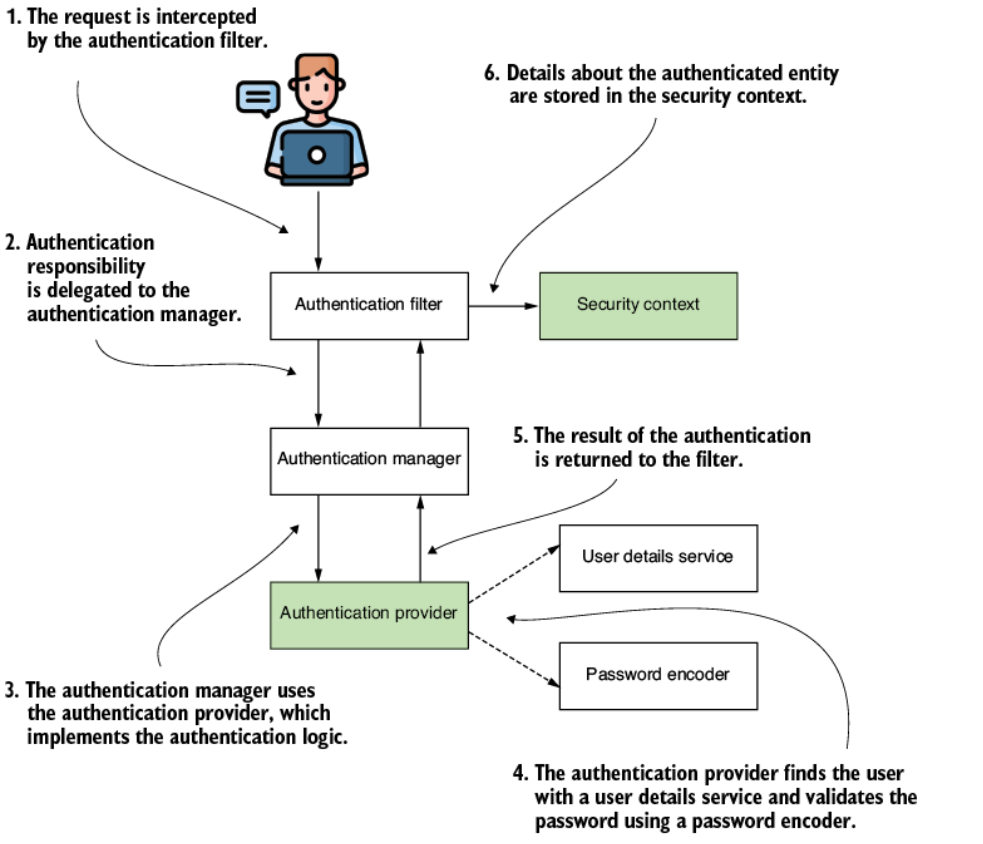

**Hình 6.1** Luồng authentication trong Spring Security. Tiến trình này phác họa phương thức mà ứng dụng nhận diện cá nhân gửi một request. Những thành phần là trọng tâm của chương này được làm nổi bật. Trong ngữ cảnh này, `AuthenticationProvider` chịu trách nhiệm thực hiện thủ tục authentication, và `SecurityContext` lưu giữ thông tin về request đã được authentication.

Chương này bao quát những phần còn lại của luồng authentication (các ô được tô đậm trong hình 6.1). Sau đó, ở chương 7 và 8, bạn sẽ học cách authorization hoạt động — tiến trình diễn ra sau authentication trong HTTP request. Trước hết, chúng ta cần bàn về cách hiện thực interface `AuthenticationProvider`. Bạn cần biết Spring Security hiểu một request như thế nào trong tiến trình authentication.

Để có mô tả rõ ràng về cách biểu diễn một authentication request, chúng ta sẽ bắt đầu với interface `Authentication`. Khi đã bàn xong về nó, chúng ta có thể đi xa hơn và quan sát điều gì xảy ra với chi tiết của một request sau khi authentication thành công. Rồi chúng ta có thể bàn về interface `SecurityContext` và cách Spring Security quản lý nó. Gần cuối chương, bạn sẽ học cách tùy chỉnh phương thức HTTP Basic authentication. Chúng ta cũng sẽ bàn về một lựa chọn khác cho authentication có thể dùng trong ứng dụng của mình — form-based login.

---

## 6.1 Hiểu về `AuthenticationProvider`

Trong các ứng dụng doanh nghiệp, bạn có thể rơi vào tình huống mà hiện thực mặc định của authentication dựa trên username và password không còn phù hợp. Thêm vào đó, khi nói tới authentication, ứng dụng của bạn có thể yêu cầu hiện thực nhiều tình huống khác nhau (hình 6.2). Ví dụ, bạn có thể muốn user chứng minh danh tính bằng cách dùng một mã nhận được qua tin nhắn SMS hoặc hiển thị bởi một ứng dụng cụ thể. Hoặc bạn có thể cần hiện thực các tình huống authentication mà user phải cung cấp một loại key nào đó được lưu trong một file. Bạn thậm chí có thể cần dùng biểu diễn vân tay của user để hiện thực logic authentication. Mục đích của một framework là đủ linh hoạt để cho phép bạn hiện thực bất kỳ tình huống nào trong số đó.

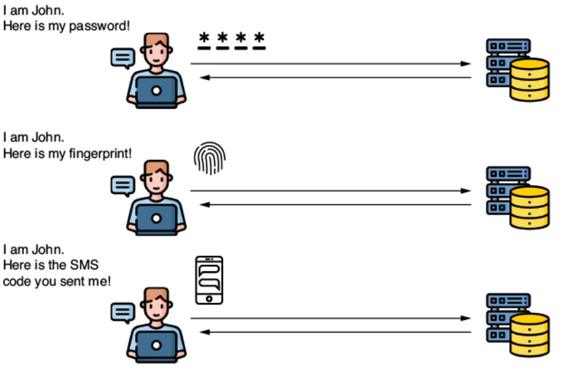

**Hình 6.2** Một ứng dụng có thể yêu cầu nhiều phương pháp hiện thực authentication khác nhau. Mặc dù username và password là đủ cho hầu hết tình huống, có những trường hợp mà tiến trình authentication một user có thể phức tạp hơn.

Một framework thường cung cấp một tập những hiện thực được dùng nhiều nhất, nhưng tất nhiên nó không thể bao quát mọi lựa chọn có thể. Về phần Spring Security, bạn có thể dùng contract `AuthenticationProvider` để định nghĩa bất kỳ logic authentication tùy chỉnh nào. Trong mục này, bạn sẽ học cách biểu diễn sự kiện authentication bằng cách hiện thực interface `Authentication` rồi tạo logic authentication tùy chỉnh của mình với một `AuthenticationProvider`. Để đạt mục tiêu:

- Ở mục 6.1.1, chúng ta phân tích cách Spring Security biểu diễn sự kiện authentication.
- Ở mục 6.1.2, chúng ta bàn về contract `AuthenticationProvider`, thứ chịu trách nhiệm cho logic authentication.
- Ở mục 6.1.3, bạn sẽ viết logic authentication tùy chỉnh bằng cách hiện thực contract `AuthenticationProvider` trong một ví dụ.

### 6.1.1 Biểu diễn request trong quá trình authentication

Mục này bàn về cách Spring Security hiểu một request trong tiến trình authentication. Việc chạm tới điều này là quan trọng trước khi đi sâu vào hiện thực logic authentication tùy chỉnh. Như bạn sẽ học ở mục 6.1.2, để hiện thực một `AuthenticationProvider` tùy chỉnh, trước hết bạn cần hiểu cách mô tả sự kiện authentication. Ở đây, chúng ta sẽ xem xét contract biểu diễn authentication và bàn về những phương thức bạn cần biết.

`Authentication` là một trong những interface thiết yếu tham gia vào tiến trình cùng tên. Interface `Authentication` biểu diễn sự kiện authentication request và giữ chi tiết về thực thể yêu cầu truy cập ứng dụng. Bạn có thể dùng thông tin liên quan tới sự kiện authentication request này trong và sau tiến trình authentication. User yêu cầu truy cập ứng dụng được gọi là **principal**. Nếu bạn từng dùng Java Security trong bất kỳ app nào, có lẽ bạn biết rằng một interface tên là `Principal` biểu diễn cùng khái niệm này. Interface `Authentication` của Spring Security mở rộng contract đó (hình 6.3).

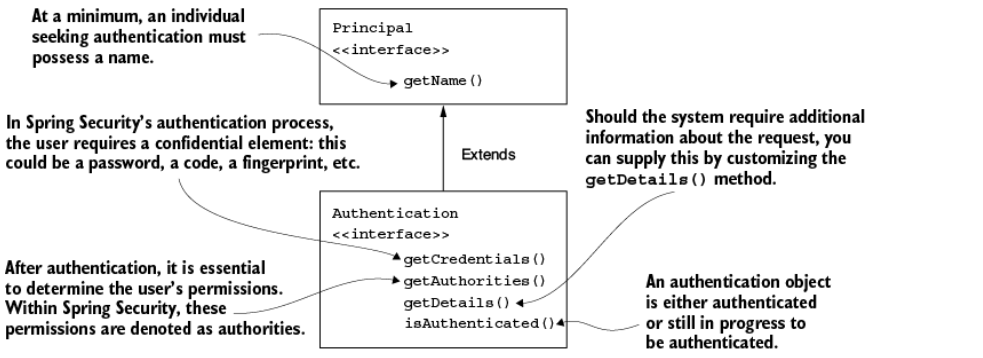

**Hình 6.3** Giao ước `Authentication` mở rộng giao ước `Principal`. Nó giới thiệu thêm những quy định bổ sung, chẳng hạn sự cần thiết của một password hoặc tùy chọn cung cấp thêm chi tiết về authentication request. Một số khía cạnh, chẳng hạn mảng các authority, là đặc thù của Spring Security.

Contract `Authentication` trong Spring Security không chỉ biểu diễn một principal, mà còn bổ sung thông tin về việc tiến trình authentication đã hoàn tất hay chưa, cũng như một tập hợp các authority. Việc contract này được thiết kế để mở rộng contract `Principal` từ Java Security là một điểm cộng về khả năng tương thích với hiện thực của các framework và ứng dụng khác. Sự linh hoạt này cho phép việc di chuyển sang Spring Security dễ dàng hơn từ những ứng dụng hiện thực authentication theo cách khác.

Hãy tìm hiểu thêm về thiết kế của interface `Authentication` trong listing sau đây.

**Listing 6.1 Interface `Authentication` như được khai báo trong Spring Security**

```java
public interface Authentication extends Principal, Serializable {
  Collection<? extends GrantedAuthority> getAuthorities();
  Object getCredentials();
  Object getDetails();
  Object getPrincipal();
  boolean isAuthenticated();
  void setAuthenticated(boolean isAuthenticated)
     throws IllegalArgumentException;
}
```

Hiện tại, những phương thức duy nhất của contract này mà bạn cần học là:

- `isAuthenticated()` — Trả về `true` nếu tiến trình authentication kết thúc hoặc `false` nếu tiến trình authentication vẫn đang diễn ra
- `getCredentials()` — Trả về một password hoặc bất kỳ secret nào được dùng trong tiến trình authentication
- `getAuthorities()` — Trả về một collection các authority đã được cấp cho request đã authentication

Chúng ta sẽ bàn về những phương thức khác của contract `Authentication` ở các chương sau, khi phù hợp với những hiện thực được xét tới.

### 6.1.2 Hiện thực logic authentication tùy chỉnh

Mục này bàn về việc hiện thực logic authentication tùy chỉnh. Chúng ta phân tích contract của Spring Security liên quan tới trách nhiệm này để hiểu định nghĩa của nó. Với những chi tiết đó, bạn có thể hiện thực logic authentication tùy chỉnh với một ví dụ code ở mục 6.1.3.

`AuthenticationProvider` trong Spring Security lo việc logic authentication. Hiện thực mặc định của interface `AuthenticationProvider` ủy quyền trách nhiệm tìm user của hệ thống cho một `UserDetailsService`. Nó cũng dùng `PasswordEncoder` để quản lý password trong tiến trình authentication. Listing sau đây đưa ra định nghĩa của `AuthenticationProvider`, thứ bạn cần để định nghĩa một authentication provider tùy chỉnh cho ứng dụng của mình.

**Listing 6.2 Interface `AuthenticationProvider`**

```java
public interface AuthenticationProvider {
  Authentication authenticate(Authentication authentication)
    throws AuthenticationException;

  boolean supports(Class<?> authentication);
}
```

Trách nhiệm của `AuthenticationProvider` gắn chặt với contract `Authentication`. Phương thức `authenticate()` nhận một object `Authentication` làm tham số và trả về một object `Authentication`. Chúng ta hiện thực phương thức `authenticate()` để định nghĩa logic authentication. Dưới đây, chúng ta tóm tắt nhanh cách bạn nên hiện thực phương thức `authenticate()`:

- Phương thức nên ném ra một `AuthenticationException` nếu authentication thất bại.
- Nếu phương thức nhận một object authentication không được hiện thực `AuthenticationProvider` của bạn hỗ trợ, thì phương thức nên trả về `null`. Bằng cách này, chúng ta có khả năng dùng nhiều kiểu `Authentication` được tách biệt ở tầng HTTP filter.
- Phương thức nên trả về một instance `Authentication` biểu diễn một object đã được authentication đầy đủ. Với instance này, phương thức `isAuthenticated()` trả về `true`, và nó chứa tất cả chi tiết cần thiết về thực thể đã authentication. Thông thường, ứng dụng cũng loại bỏ dữ liệu nhạy cảm, chẳng hạn password, khỏi instance này. Sau một lần authentication thành công, password không còn cần thiết nữa, và việc giữ lại những chi tiết này có thể khiến chúng lộ ra trước những cặp mắt không mong muốn.

Phương thức thứ hai trong interface `AuthenticationProvider` là `supports(Class<?> authentication)`. Bạn có thể hiện thực phương thức này để trả về `true` nếu `AuthenticationProvider` hiện tại hỗ trợ kiểu được cung cấp dưới dạng một object `Authentication`. Hãy để ý rằng ngay cả khi phương thức này trả về `true` cho một object, vẫn có khả năng phương thức `authenticate()` sẽ từ chối request bằng cách trả về `null`. Spring Security được thiết kế để linh hoạt hơn, cho phép người dùng hiện thực một `AuthenticationProvider` có thể từ chối một authentication request dựa trên chi tiết của nó, chứ không chỉ dựa trên kiểu của nó.

Một phép so sánh về cách authentication manager và authentication provider phối hợp để chấp nhận hay bác bỏ một authentication request là việc có một ổ khóa phức tạp hơn cho cửa nhà bạn. Bạn có thể mở ổ khóa này bằng một chiếc thẻ hoặc bằng chìa khóa vật lý kiểu cũ (hình 6.4). Bản thân ổ khóa là authentication manager quyết định có mở cửa hay không. Để đưa ra quyết định đó, nó ủy quyền cho hai authentication provider: một cái biết cách kiểm chứng thẻ và cái kia biết cách kiểm chứng chìa khóa vật lý. Nếu bạn đưa một chiếc thẻ ra để mở cửa, authentication provider chỉ làm việc với chìa khóa vật lý sẽ phàn nàn rằng nó không quen thuộc với loại authentication này. Tuy nhiên, provider kia hỗ trợ loại authentication này và kiểm chứng xem chiếc thẻ có hợp lệ với cửa hay không. Đây chính là mục đích của phương thức `supports()`.

Ngoài việc kiểm tra kiểu authentication, Spring Security còn thêm một tầng linh hoạt nữa. Ổ khóa cửa có thể nhận diện nhiều loại thẻ. Trong trường hợp này, khi bạn đưa ra một chiếc thẻ, một trong các authentication provider có thể nói: "Tôi hiểu đây là một chiếc thẻ. Nhưng nó không phải loại thẻ mà tôi có thể kiểm chứng!" Điều này xảy ra khi `supports()` trả về `true` nhưng `authenticate()` trả về `null`.

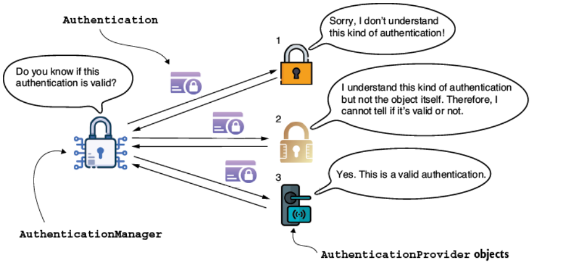

**Hình 6.4** `AuthenticationManager` ủy quyền cho một trong các authentication provider khả dụng. `AuthenticationProvider` có thể không hỗ trợ kiểu authentication được cung cấp. Tuy nhiên, nếu nó có hỗ trợ kiểu object đó, nó có thể vẫn không biết cách authentication object cụ thể ấy. Authentication được đánh giá, và một `AuthenticationProvider` có thể nói được request có đúng hay không sẽ phản hồi lại `AuthenticationManager`.

Hình 6.5 cho thấy tình huống thay thế, nơi một trong các object `AuthenticationProvider` nhận diện được `Authentication` nhưng quyết định rằng nó không hợp lệ. Trong trường hợp này, kết quả sẽ là một `AuthenticationException` và cuối cùng trở thành trạng thái HTTP 401 Unauthorized trong HTTP response của một web app.

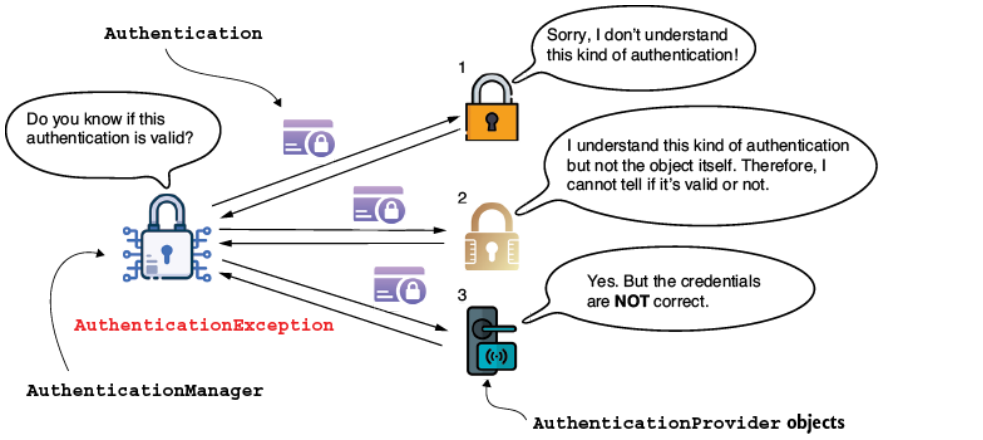

**Hình 6.5** Nếu không có object `AuthenticationProvider` nào nhận diện được `Authentication` hoặc nếu một trong số đó từ chối nó, kết quả là một `AuthenticationException`.

### 6.1.3 Áp dụng logic authentication tùy chỉnh

Trong mục này, chúng ta hiện thực logic authentication tùy chỉnh. Bạn có thể tìm thấy ví dụ này trong project `ssia-ch6-ex1`. Với ví dụ này, bạn áp dụng những gì đã học về interface `Authentication` và `AuthenticationProvider` ở mục 6.1.1 và 6.1.2. Trong listing 6.3 và 6.4, chúng ta xây dựng một ví dụ về cách hiện thực một `AuthenticationProvider` tùy chỉnh. Các bước này, cũng được trình bày ở hình 6.5, như sau:

1. Khai báo một class hiện thực contract `AuthenticationProvider`.
2. Quyết định những loại object `Authentication` nào được `AuthenticationProvider` mới hỗ trợ.
3. Hiện thực phương thức `supports(Class<?> c)` để chỉ định kiểu authentication nào được `AuthenticationProvider` mà chúng ta định nghĩa hỗ trợ.
4. Hiện thực phương thức `authenticate(Authentication a)` để hiện thực logic authentication.
5. Đăng ký một instance của hiện thực `AuthenticationProvider` mới với Spring Security.

**Listing 6.3 Ghi đè phương thức `supports()` của `AuthenticationProvider`**

```java
@Component
public class CustomAuthenticationProvider
  implements AuthenticationProvider {

  // Phần code được lược bỏ

  @Override
  public boolean supports(Class<?> authenticationType) {
    return authenticationType
            .equals(UsernamePasswordAuthenticationToken.class);
  }
}
```

Ở listing 6.3, chúng ta định nghĩa một class mới hiện thực interface `AuthenticationProvider`. Chúng ta đánh dấu class bằng `@Component` để có một instance kiểu của nó trong context do Spring quản lý. Rồi chúng ta phải quyết định `AuthenticationProvider` này hỗ trợ loại hiện thực interface `Authentication` nào. Điều đó phụ thuộc vào kiểu mà chúng ta mong đợi được cung cấp làm tham số cho phương thức `authenticate()`. Nếu chúng ta không tùy chỉnh gì ở tầng authentication filter (như đã bàn ở chương 5), thì class `UsernamePasswordAuthenticationToken` định nghĩa kiểu đó. Class này là một hiện thực của interface `Authentication` và biểu diễn một authentication request chuẩn với username và password.

Với định nghĩa này, chúng ta đã làm cho `AuthenticationProvider` hỗ trợ một loại key cụ thể. Khi đã chỉ định phạm vi của `AuthenticationProvider`, chúng ta hiện thực logic authentication bằng cách ghi đè phương thức `authenticate()`, như trình bày ở listing sau đây.

**Listing 6.4 Hiện thực logic authentication**

```java
@Component
public class CustomAuthenticationProvider
  implements AuthenticationProvider {

  private final UserDetailsService userDetailsService;
  private final PasswordEncoder passwordEncoder;

  // constructor được lược bỏ

  @Override
  public Authentication authenticate(Authentication authentication) {
    String username = authentication.getName();
    String password = authentication.getCredentials().toString();

    UserDetails u = userDetailsService.loadUserByUsername(username);

    if (passwordEncoder.matches(password, u.getPassword())) {
      return new UsernamePasswordAuthenticationToken(
            username,
            password,
            u.getAuthorities());                    // ①
    } else {
      throw new BadCredentialsException
                  ("Something went wrong!");        // ②
    }
  }

  // Phần code được lược bỏ
}
```

① Nếu password khớp, nó trả về một hiện thực của contract `Authentication` với những chi tiết cần thiết.

② Nếu password không khớp, nó ném ra một exception kiểu `AuthenticationException`. `BadCredentialsException` kế thừa từ `AuthenticationException`.

Logic ở listing 6.4 rất đơn giản, và hình 6.6 cung cấp một biểu diễn trực quan của logic này. Chúng ta dùng hiện thực `UserDetailsService` để lấy `UserDetails`. Nếu user không tồn tại, phương thức `loadUserByUsername()` nên ném ra một `AuthenticationException`. Trong trường hợp này, tiến trình authentication dừng lại, và HTTP filter đặt trạng thái response thành HTTP 401 Unauthorized. Nếu username có tồn tại, chúng ta có thể kiểm tra tiếp password của user bằng phương thức `matches()` của `PasswordEncoder` từ context. Nếu password không khớp, thì một lần nữa, một `AuthenticationException` nên được ném ra. Nếu password đúng, `AuthenticationProvider` trả về một instance `Authentication` được đánh dấu là "authenticated", chứa các chi tiết của request.

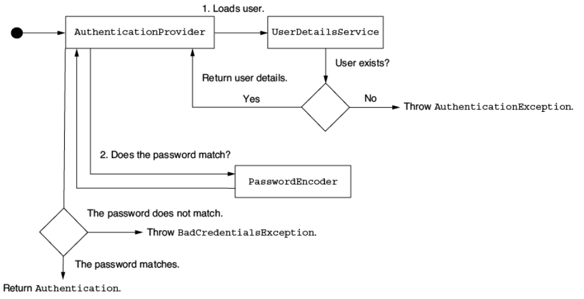

**Hình 6.6** `AuthenticationProvider` thực thi một thủ tục authentication được may đo riêng. Nó xác nhận authentication request bằng cách truy xuất thông tin user thông qua một hiện thực `UserDetailsService` cụ thể, và nó kiểm chứng password bằng một `PasswordEncoder` nếu password đúng. Nếu không tìm thấy user hoặc password sai, `AuthenticationProvider` sẽ ném ra một `AuthenticationException`.

Để cắm hiện thực mới của `AuthenticationProvider` vào, chúng ta định nghĩa một bean `SecurityFilterChain`. Điều này được minh họa ở listing sau đây.

**Listing 6.5 Đăng ký `AuthenticationProvider` trong configuration class**

```java
@Configuration
public class ProjectConfig {

  private final AuthenticationProvider authenticationProvider;

  // constructor được lược bỏ

  @Bean
  public SecurityFilterChain securityFilterChain(HttpSecurity http)
    throws Exception {

    http.httpBasic(Customizer.withDefaults());
    http.authenticationProvider(authenticationProvider);
    http.authorizeHttpRequests(c -> c.anyRequest().authenticated());

    return http.build();
  }

  // Phần code được lược bỏ
}
```

> **NOTE** Ở listing 6.5, dependency injection được dùng với một field khai báo bằng interface `AuthenticationProvider`. Spring nhận diện `AuthenticationProvider` là một interface (vốn là một abstraction). Tuy nhiên, Spring biết rằng nó cần tìm một instance của một hiện thực trong context cho interface cụ thể đó. Trong trường hợp của chúng ta, hiện thực đó là instance của `CustomAuthenticationProvider`, cái duy nhất thuộc kiểu này mà chúng ta đã khai báo và thêm vào Spring context bằng annotation `@Component`. Để ôn lại về dependency injection, tôi khuyến nghị cuốn *Spring Start Here* (Manning, 2021), một cuốn sách khác do tôi viết.

Vậy là xong! Bạn đã tùy chỉnh thành công hiện thực của `AuthenticationProvider`. Giờ bạn có thể tùy chỉnh logic authentication cho ứng dụng của mình ở nơi bạn cần.

---

> ### Cách thất bại trong thiết kế ứng dụng
>
> Áp dụng một framework không đúng cách dẫn tới một ứng dụng khó bảo trì hơn. Tệ hơn nữa, đôi khi những người thất bại trong việc dùng framework lại tin rằng đó là lỗi của framework. Để tôi kể cho bạn một câu chuyện.
>
> Một mùa đông nọ, trưởng bộ phận phát triển ở một công ty mà tôi làm tư vấn gọi tôi tới giúp họ hiện thực một tính năng mới. Họ cần áp dụng một phương thức authentication tùy chỉnh trong một component của hệ thống được phát triển bằng Spring từ những ngày đầu. Đáng tiếc, khi hiện thực thiết kế class của ứng dụng, các lập trình viên đã không dựa đúng vào kiến trúc xương sống của Spring Security. Họ chỉ dùng filter chain, hiện thực lại toàn bộ các tính năng của Spring Security bằng code tùy chỉnh.
>
> Các lập trình viên nhận thấy rằng theo thời gian, việc tùy chỉnh ngày càng khó khăn. Tuy nhiên, không ai hành động để thiết kế lại component một cách đúng đắn và dùng các contract theo đúng ý đồ trong Spring Security. Phần lớn khó khăn đến từ việc không biết các khả năng của Spring. Một trong những lập trình viên chủ chốt nói: "Chỉ là lỗi của cái Spring Security này thôi! Framework này khó áp dụng, và khó dùng với bất kỳ tùy chỉnh nào." Tôi hơi sốc trước nhận xét của anh ta. Tôi biết Spring Security đôi khi khó hiểu và framework này nổi tiếng là có đường cong học tập không hề dễ dàng. Nhưng tôi chưa bao giờ gặp tình huống mà mình không tìm được cách thiết kế một class dễ tùy chỉnh với Spring Security!
>
> Chúng tôi cùng nhau điều tra vấn đề, và tôi nhận ra các lập trình viên của ứng dụng có lẽ chỉ dùng khoảng 10% những gì Spring Security có thể cung cấp. Sau đó tôi trình bày một workshop hai ngày về Spring Security, tập trung vào những gì chúng tôi có thể làm cho component hệ thống cụ thể mà họ phải thay đổi và cách làm điều đó.
>
> Mọi thứ kết thúc với quyết định viết lại hoàn toàn rất nhiều code tùy chỉnh để dựa vào Spring Security một cách đúng đắn, và nhờ đó làm cho ứng dụng dễ mở rộng hơn để đáp ứng các mối quan tâm của họ về hiện thực bảo mật. Chúng tôi cũng phát hiện một số vấn đề khác không liên quan tới Spring Security, nhưng đó lại là một câu chuyện khác.
>
> Đây là một vài bài học bạn có thể rút ra từ câu chuyện này:
>
> - Một framework, đặc biệt là framework được dùng rộng rãi trong các ứng dụng, được viết bởi nhiều người thông minh, và khó tin rằng nó có thể được hiện thực tệ. Hãy luôn phân tích ứng dụng của mình trước khi kết luận rằng bất kỳ vấn đề nào có thể là lỗi của framework.
> - Khi quyết định dùng một framework, hãy đảm bảo bạn hiểu, ít nhất là, những điều cơ bản của nó.
> - Hãy thận trọng với những tài nguyên bạn dùng để học về framework. Đôi khi, các bài viết bạn tìm thấy trên mạng chỉ cho thấy cách làm những giải pháp chắp vá nhanh chóng chứ không nhất thiết là cách hiện thực đúng một thiết kế class.
> - Hãy dùng nhiều nguồn trong nghiên cứu của bạn. Để làm rõ những hiểu lầm, hãy viết một proof of concept khi không chắc chắn về cách dùng thứ gì đó.
> - Nếu bạn quyết định dùng một framework, hãy dùng nó nhiều nhất có thể cho đúng mục đích của nó. Ví dụ, giả sử bạn dùng Spring Security, và bạn nhận thấy rằng với các hiện thực bảo mật, bạn có xu hướng viết nhiều code tùy chỉnh hơn thay vì dựa vào những gì framework cung cấp. Bạn nên tự hỏi tại sao điều này lại xảy ra.
>
> Khi chúng ta dựa vào các chức năng do framework hiện thực, chúng ta được hưởng vài lợi ích. Chúng ta biết chúng đã được test, và có ít thay đổi chứa lỗ hổng hơn. Tương tự, một framework tốt dựa vào các abstraction, giúp bạn tạo ra những ứng dụng dễ bảo trì. Hãy nhớ rằng khi bạn viết hiện thực của riêng mình, bạn dễ đưa vào lỗ hổng bảo mật hơn.

---

## 6.2 Sử dụng `SecurityContext`

Mục này bàn về security context. Chúng ta phân tích cách nó hoạt động, cách truy cập dữ liệu, và cách ứng dụng quản lý nó trong những tình huống khác nhau liên quan tới thread. Khi bạn hoàn thành mục này, bạn sẽ biết cách cấu hình security context cho nhiều hoàn cảnh khác nhau. Bằng cách này, bạn có thể dùng chi tiết về user đã authentication được security context lưu trữ để cấu hình authorization ở chương 7 và 8.

Nhiều khả năng bạn sẽ cần chi tiết về thực thể đã authentication sau tiến trình authentication. Ví dụ, bạn có thể cần tham chiếu tới username hoặc các authority của user đã authentication hiện tại. Thông tin này có còn truy cập được sau khi tiến trình authentication kết thúc không? Một khi `AuthenticationManager` hoàn tất tiến trình authentication thành công, nó lưu instance `Authentication` cho phần còn lại của request (xem hình 6.7). Instance lưu object `Authentication` được gọi là **security context**.

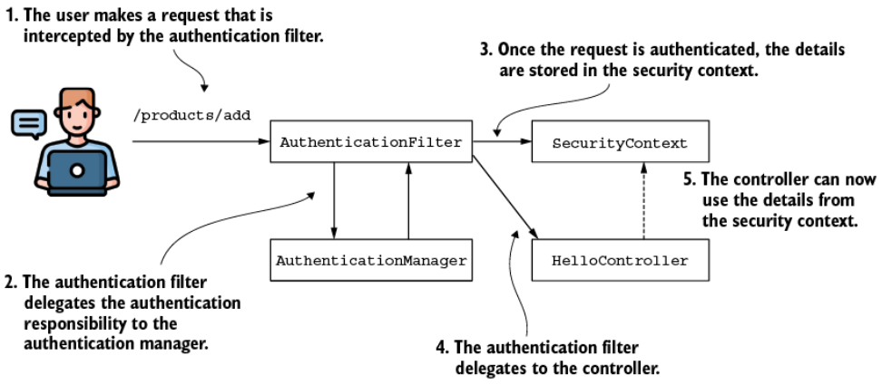

**Hình 6.7** Sau khi authentication thành công, authentication filter lưu chi tiết của thực thể đã authentication vào security context. Từ đó, controller hiện thực hành động được ánh xạ tới request có thể truy cập những chi tiết này khi cần.

Security context của Spring Security được mô tả bởi interface `SecurityContext` và được định nghĩa ở listing sau đây.

**Listing 6.6 Interface `SecurityContext`**

```java
public interface SecurityContext extends Serializable {
  Authentication getAuthentication();
  void setAuthentication(Authentication authentication);
}
```

Như bạn có thể nhận ra từ định nghĩa contract, trách nhiệm chính của `SecurityContext` là lưu trữ object `Authentication`. Nhưng bản thân `SecurityContext` được quản lý thế nào? Spring Security cung cấp ba chiến lược để quản lý `SecurityContext` với một object đóng vai trò manager. Nó có tên là `SecurityContextHolder`:

- **`MODE_THREADLOCAL`** — Cho phép mỗi thread lưu chi tiết của riêng nó trong security context. Trong một web application kiểu thread-per-request (mỗi request một thread), đây là cách tiếp cận phổ biến, vì mỗi request có một thread riêng.
- **`MODE_INHERITABLETHREADLOCAL`** — Tương tự `MODE_THREADLOCAL`, nhưng nó cũng chỉ thị cho Spring Security sao chép security context sang thread kế tiếp trong trường hợp một phương thức bất đồng bộ. Bằng cách này, ta có thể nói rằng thread mới chạy phương thức `@Async` kế thừa security context. Annotation `@Async` được dùng với các phương thức để chỉ thị cho Spring gọi phương thức được annotate trên một thread riêng.
- **`MODE_GLOBAL`** — Làm cho tất cả các thread của ứng dụng thấy cùng một instance security context.

Ngoài ba chiến lược quản lý security context do Spring Security cung cấp này, mục này còn minh họa điều gì xảy ra khi bạn định nghĩa những thread của riêng mình mà Spring không biết tới. Như bạn sẽ học, với những trường hợp này, bạn cần sao chép tường minh các chi tiết từ security context sang thread mới. Spring Security không thể tự động quản lý những object không nằm trong context của Spring, nhưng nó cung cấp một số utility class rất hay.

### 6.2.1 Sử dụng chiến lược lưu giữ cho security context

Chiến lược đầu tiên để quản lý security context là `MODE_THREADLOCAL`, và nó cũng là chiến lược mặc định để quản lý security context mà Spring Security dùng. Với chiến lược này, Spring Security dùng `ThreadLocal` để quản lý context. `ThreadLocal` là một hiện thực do JDK cung cấp. Hiện thực này hoạt động như một tập hợp dữ liệu nhưng đảm bảo rằng mỗi thread của ứng dụng chỉ có thể thấy dữ liệu được lưu trong phần dành riêng cho nó trong tập hợp đó. Bằng cách này, mỗi request có quyền truy cập security context của riêng nó. Không thread nào có quyền truy cập `ThreadLocal` của thread khác. Điều đó nghĩa là trong một web application, mỗi request chỉ có thể thấy security context của riêng nó. Có thể nói đây cũng là điều bạn thường muốn có cho một backend web application.

Hình 6.8 cung cấp cái nhìn tổng quan về chức năng này. Mỗi request (A, B, và C) có thread được cấp phát riêng (T1, T2, và T3), nên mỗi request chỉ thấy chi tiết được lưu trong security context của chính nó. Tuy nhiên, điều này cũng nghĩa là nếu một thread mới được tạo (ví dụ, khi một phương thức bất đồng bộ được gọi), thread mới cũng sẽ có security context riêng. Các chi tiết từ thread cha (thread gốc của request) không được sao chép sang security context của thread mới.

> **NOTE** Ở đây chúng ta bàn về một ứng dụng servlet truyền thống nơi mỗi request gắn với một thread. Kiến trúc này chỉ áp dụng cho ứng dụng servlet truyền thống nơi mỗi request có thread riêng được gán. Nó không áp dụng cho các ứng dụng reactive. Chúng ta sẽ bàn chi tiết về bảo mật cho các cách tiếp cận reactive ở chương 17.

Là chiến lược mặc định để quản lý security context, tiến trình này không cần được cấu hình tường minh. Chỉ cần lấy security context từ holder bằng phương thức static `getContext()` ở bất cứ đâu bạn cần sau khi tiến trình authentication kết thúc. Ở listing 6.7, bạn tìm thấy một ví dụ về việc lấy security context trong một trong các endpoint của ứng dụng. Từ security context, bạn có thể lấy tiếp object `Authentication`, thứ lưu chi tiết về thực thể đã authentication. Bạn có thể tìm thấy các ví dụ được bàn trong mục này như một phần của project `ssia-ch6-ex2`.

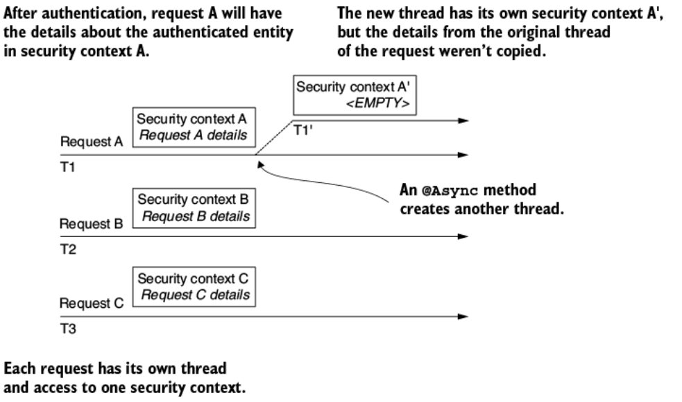

**Hình 6.8** Mỗi request có thread riêng được biểu diễn bằng một mũi tên. Mỗi thread chỉ có quyền truy cập chi tiết security context của riêng nó. Khi một thread mới được tạo (ví dụ, bởi một phương thức `@Async`), các chi tiết từ thread cha không được sao chép sang.

**Listing 6.7 Lấy `SecurityContext` từ `SecurityContextHolder`**

```java
@GetMapping("/hello")
public String hello() {
  SecurityContext context = SecurityContextHolder.getContext();
  Authentication a = context.getAuthentication();

  return "Hello, " + a.getName() + "!";
}
```

Việc lấy authentication từ context thậm chí còn tiện hơn ở mức endpoint, vì Spring biết cách inject nó trực tiếp vào tham số của phương thức. Bạn không cần phải tham chiếu tường minh tới class `SecurityContextHolder` mỗi lần. Cách tiếp cận này, như trình bày ở listing sau đây, tốt hơn.

**Listing 6.8 Spring inject giá trị `Authentication` vào tham số của phương thức**

```java
@GetMapping("/hello")
public String hello(Authentication a) {        // ①
  return "Hello, " + a.getName() + "!";
}
```

① Spring Boot inject `Authentication` hiện tại vào tham số của phương thức.

Khi gọi endpoint với một user đúng, response body chứa username. Ví dụ:

```bash
curl -u user:99ff79e3-8ca0-401c-a396-0a8625ab3bad http://localhost:8080/hello
```

```
Hello, user!
```

### 6.2.2 Sử dụng chiến lược lưu giữ cho các lời gọi bất đồng bộ

Rất dễ để bám theo chiến lược mặc định cho việc quản lý security context. Trong rất nhiều trường hợp, đó là thứ duy nhất bạn cần. `MODE_THREADLOCAL` cung cấp khả năng cô lập security context cho từng thread, và nó khiến security context tự nhiên hơn để hiểu và quản lý. Tuy nhiên, cũng có những trường hợp mà điều này không áp dụng được.

Tình huống trở nên phức tạp hơn nếu chúng ta phải xử lý nhiều thread cho mỗi request. Hãy xem điều gì xảy ra nếu bạn làm cho endpoint trở thành bất đồng bộ. Thread thực thi phương thức không còn là thread phục vụ request nữa. Hãy nghĩ về một endpoint như cái được trình bày ở listing kế tiếp.

**Listing 6.9 Một phương thức `@Async` được phục vụ bởi một thread khác**

```java
@GetMapping("/bye")
@Async                      // ①
public void goodbye() {
  SecurityContext context = SecurityContextHolder.getContext();
  String username = context.getAuthentication().getName();
  // làm gì đó với username
}
```

① Vì là `@Async`, phương thức được thực thi trên một thread riêng.

Để bật chức năng của annotation `@Async`, tôi cũng đã tạo một configuration class và annotate nó bằng `@EnableAsync`:

```java
@Configuration
@EnableAsync
public class ProjectConfig {
}
```

> **NOTE** Đôi khi trong các bài viết hoặc diễn đàn, các annotation cấu hình được đặt trên class chính. Ví dụ, bạn có thể thấy một số ví dụ dùng annotation `@EnableAsync` trực tiếp trên class chính. Cách tiếp cận này về mặt kỹ thuật là đúng, vì chúng ta annotate class chính của một ứng dụng Spring Boot bằng annotation `@SpringBootApplication`, vốn bao gồm cả đặc tính `@Configuration`. Tuy nhiên, trong một ứng dụng thực tế, chúng ta thích tách biệt các trách nhiệm, và chúng ta không bao giờ dùng class chính làm configuration class. Để mọi thứ rõ ràng nhất có thể cho các ví dụ trong cuốn sách này, tôi thích giữ những annotation này trên class `@Configuration`, tương tự cách bạn sẽ thấy chúng trong các tình huống thực tế.

Nếu bạn thử code như hiện tại, nó sẽ ném ra một `NullPointerException` ở dòng lấy tên từ authentication, tức là

```java
String username = context.getAuthentication().getName()
```

Điều này là vì phương thức giờ thực thi trên một thread khác không kế thừa security context. Vì lý do này, object `Authorization` là `null` và, trong ngữ cảnh của code được trình bày, gây ra `NullPointerException`. Trong trường hợp này, bạn có thể giải quyết vấn đề bằng cách dùng chiến lược `MODE_INHERITABLETHREADLOCAL`. Điều này có thể được thiết lập bằng cách gọi phương thức `SecurityContextHolder.setStrategyName()` hoặc bằng cách dùng system property `spring.security.strategy`. Bằng cách đặt chiến lược này, framework biết cách sao chép chi tiết của thread gốc của request sang thread mới được tạo của phương thức bất đồng bộ (hình 6.9).

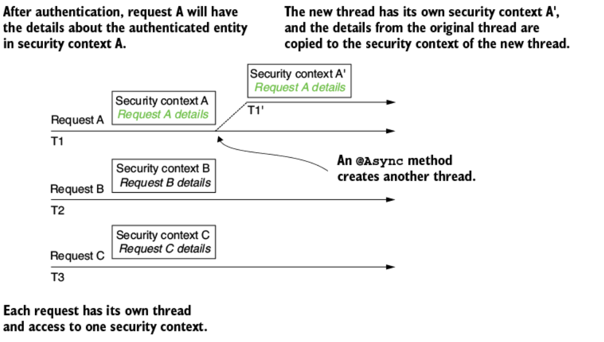

**Hình 6.9** Khi dùng `MODE_INHERITABLETHREADLOCAL`, framework sao chép các chi tiết security context từ thread gốc của request sang security context của thread mới.

Listing kế tiếp trình bày một cách để đặt chiến lược quản lý security context bằng cách gọi phương thức `setStrategyName()`.

**Listing 6.10 Dùng `InitializingBean` để đặt chế độ của `SecurityContextHolder`**

```java
@Configuration
@EnableAsync
public class ProjectConfig {

  @Bean
  public InitializingBean initializingBean() {
    return () -> SecurityContextHolder.setStrategyName(
      SecurityContextHolder.MODE_INHERITABLETHREADLOCAL);
  }
}
```

Sau khi gọi endpoint, bạn sẽ quan sát thấy security context được Spring lan truyền (propagate) đúng cách sang thread kế tiếp. Thêm vào đó, `Authentication` không còn `null` nữa.

> **NOTE** Điều này chỉ hoạt động khi chính framework tạo ra thread (ví dụ, trong trường hợp một phương thức `@Async`). Nếu code của bạn tạo thread, bạn sẽ gặp lại cùng vấn đề đó ngay cả với chiến lược `MODE_INHERITABLETHREADLOCAL`. Điều này xảy ra vì trong trường hợp này, framework không biết về thread mà code của bạn tạo ra. Chúng ta sẽ bàn cách giải quyết vấn đề của những trường hợp này ở mục 6.2.4 và 6.2.5.

### 6.2.3 Sử dụng chiến lược lưu giữ cho ứng dụng standalone

Nếu thứ bạn cần là một security context được chia sẻ bởi tất cả các thread của ứng dụng, hãy đổi chiến lược thành `MODE_GLOBAL` (hình 6.10). Bạn sẽ không dùng chiến lược này cho một web server vì nó không phù hợp với bức tranh tổng thể của ứng dụng. Một backend web application quản lý độc lập các request mà nó nhận được, nên thực sự hợp lý hơn khi có security context tách riêng cho từng request thay vì một context chung cho tất cả. Tuy vậy, đây có thể là lựa chọn tốt cho một ứng dụng standalone.

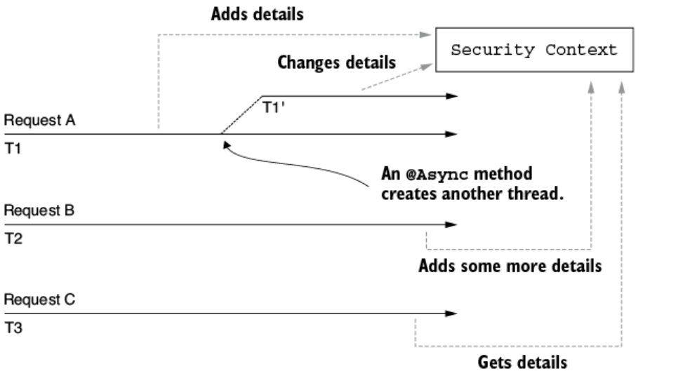

**Hình 6.10** Với `MODE_GLOBAL` được dùng làm chiến lược quản lý security context, tất cả các thread đều truy cập cùng một security context. Điều này ngụ ý rằng tất cả chúng đều có quyền truy cập cùng dữ liệu và có thể thay đổi thông tin đó. Vì vậy, race condition có thể xảy ra, và bạn phải lo việc đồng bộ hóa.

Như đoạn code sau đây cho thấy, bạn có thể đổi chiến lược giống như chúng ta đã làm với `MODE_INHERITABLETHREADLOCAL`. Bạn có thể dùng phương thức `SecurityContextHolder.setStrategyName()` hoặc system property `spring.security.strategy`:

```java
@Bean
public InitializingBean initializingBean() {
  return () -> SecurityContextHolder.setStrategyName(
    SecurityContextHolder.MODE_GLOBAL);
}
```

Ngoài ra, hãy lưu ý rằng `SecurityContext` không phải thread-safe. Nên với chiến lược này, trong đó tất cả các thread của ứng dụng đều có thể truy cập object `SecurityContext`, bạn cần lo việc truy cập đồng thời.

### 6.2.4 Chuyển tiếp security context với `DelegatingSecurityContextRunnable`

Bạn đã học rằng bạn có thể quản lý security context với ba chế độ do Spring Security cung cấp: `MODE_THREADLOCAL`, `MODE_INHERITEDTHREADLOCAL`, và `MODE_GLOBAL`. Mặc định, framework chỉ đảm bảo cung cấp một security context cho thread của request, và security context này chỉ truy cập được bởi thread đó. Tuy nhiên, framework không lo cho những thread mới được tạo (ví dụ, trong trường hợp một phương thức bất đồng bộ). Hơn nữa, bạn đã học rằng với tình huống này, bạn phải đặt tường minh một chế độ khác cho việc quản lý security context. Nhưng chúng ta vẫn còn một điểm đặc biệt: Điều gì xảy ra khi code của bạn khởi tạo những thread mới mà framework không biết tới? Đôi khi chúng ta gọi đây là *self-managed thread* (thread tự quản), bởi chính chúng ta quản lý chúng chứ không phải framework. Trong mục này, chúng ta áp dụng một số công cụ tiện ích do Spring Security cung cấp giúp bạn lan truyền security context sang những thread mới được tạo.

Không chiến lược cụ thể nào của `SecurityContextHolder` cung cấp cho bạn giải pháp cho các self-managed thread. Trong trường hợp này, bạn cần lo việc lan truyền security context. Một giải pháp cho điều này là dùng `DelegatingSecurityContextRunnable` để trang trí (decorate) các task mà bạn muốn thực thi trên một thread riêng. `DelegatingSecurityContextRunnable` mở rộng `Runnable`. Bạn có thể dùng nó sau khi thực thi task khi không mong đợi giá trị trả về. Nếu bạn có giá trị trả về, bạn có thể dùng lựa chọn `Callable<T>` thay thế, tức `DelegatingSecurityContextCallable<T>`. Cả hai class đều biểu diễn các task được thực thi bất đồng bộ, như bất kỳ `Runnable` hay `Callable` nào khác. Hơn nữa, chúng đảm bảo sao chép security context hiện tại cho thread thực thi task. Như hình 6.11 cho thấy, những object này trang trí các task gốc và sao chép security context sang thread mới.

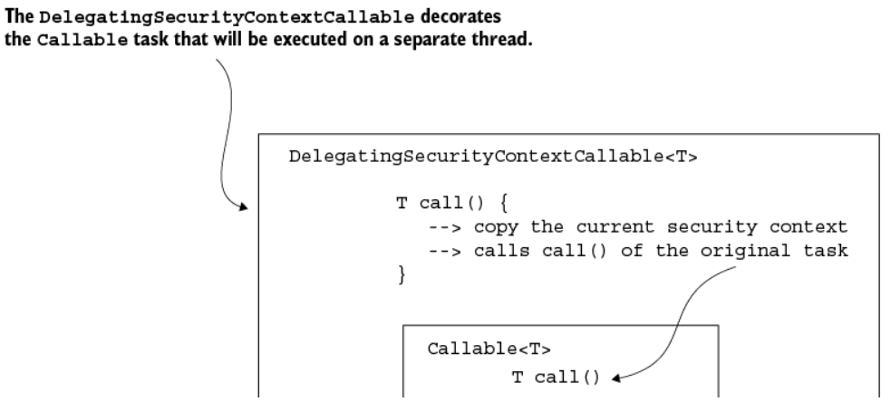

**Hình 6.11** `DelegatingSecurityContextCallable` được thiết kế như một decorator của object `Callable`. Khi xây dựng một object như vậy, bạn cung cấp callable task mà ứng dụng thực thi bất đồng bộ. `DelegatingSecurityContextCallable` sao chép các chi tiết từ security context sang thread mới rồi thực thi task.

Listing kế tiếp trình bày cách dùng `DelegatingSecurityContextCallable`. Hãy bắt đầu bằng việc định nghĩa một phương thức endpoint đơn giản khai báo một object `Callable`. Task `Callable` trả về username từ security context hiện tại.

**Listing 6.11 Định nghĩa một object `Callable` và thực thi nó như một task trên thread riêng**

```java
@GetMapping("/ciao")
public String ciao() throws Exception {
  Callable<String> task = () -> {
     SecurityContext context = SecurityContextHolder.getContext();
     return context.getAuthentication().getName();
  };

  // Phần code được lược bỏ
}
```

Chúng ta tiếp tục ví dụ bằng cách submit task tới một `ExecutorService`. Phản hồi của việc thực thi được truy xuất và trả về dưới dạng response body bởi endpoint.

**Listing 6.12 Định nghĩa một `ExecutorService` và submit task**

```java
@GetMapping("/ciao")
public String ciao() throws Exception {
  Callable<String> task = () -> {
      SecurityContext context = SecurityContextHolder.getContext();
      return context.getAuthentication().getName();
  };

  ExecutorService e = Executors.newCachedThreadPool();
  try {
     return "Ciao, " + e.submit(task).get() + "!";
  } finally {
     e.shutdown();
  }
}
```

Nếu bạn chạy ứng dụng như hiện tại, bạn chẳng nhận được gì ngoài một `NullPointerException`. Bên trong thread mới được tạo để chạy callable task, authentication không còn tồn tại nữa, và security context rỗng. Để giải quyết vấn đề này, chúng ta trang trí task bằng `DelegatingSecurityContextCallable`, thứ cung cấp context hiện tại cho thread mới, như trình bày ở listing sau đây.

**Listing 6.13 Chạy task được trang trí bởi `DelegatingSecurityContextCallable`**

```java
@GetMapping("/ciao")
public String ciao() throws Exception {
  Callable<String> task = () -> {
    SecurityContext context = SecurityContextHolder.getContext();
    return context.getAuthentication().getName();
  };

  ExecutorService e = Executors.newCachedThreadPool();
  try {
    var contextTask = new DelegatingSecurityContextCallable<>(task);
    return "Ciao, " + e.submit(contextTask).get() + "!";
  } finally {
    e.shutdown();
  }
}
```

Gọi endpoint bây giờ, bạn có thể quan sát thấy Spring đã lan truyền security context sang thread nơi các task thực thi:

```bash
curl -u user:2eb3f2e8-debd-420c-9680-48159b2ff905 http://localhost:8080/ciao
```

Response body cho lời gọi này là

```
Ciao, user!
```

### 6.2.5 Chuyển tiếp security context với `DelegatingSecurityContextExecutorService`

Khi xử lý những thread mà code của chúng ta khởi tạo mà không cho framework biết, chúng ta phải quản lý việc lan truyền chi tiết từ security context sang thread kế tiếp. Ở mục 6.2.4, bạn đã áp dụng một kỹ thuật để sao chép chi tiết từ security context bằng cách dùng chính task đó. Spring Security cung cấp một số utility class tuyệt vời như `DelegatingSecurityContextRunnable` và `DelegatingSecurityContextCallable`. Những class này trang trí các task mà bạn thực thi bất đồng bộ và cũng nhận trách nhiệm sao chép các chi tiết từ security context để hiện thực của bạn có thể truy cập chúng từ thread mới được tạo. Tuy nhiên, chúng ta có lựa chọn thứ hai để xử lý việc lan truyền security context sang một thread mới, đó là quản lý việc lan truyền từ thread pool thay vì từ chính task. Trong mục này, bạn sẽ học cách áp dụng kỹ thuật này bằng cách dùng thêm những utility class tuyệt vời do Spring Security cung cấp.

Một lựa chọn thay thế cho việc trang trí task là dùng một loại `Executor` cụ thể. Trong ví dụ kế tiếp, bạn có thể thấy task vẫn là một `Callable<T>` đơn giản, nhưng thread vẫn quản lý được security context. Việc lan truyền security context xảy ra bởi một hiện thực tên là `DelegatingSecurityContextExecutorService` trang trí `ExecutorService`. `DelegatingSecurityContextExecutorService` cũng lo việc lan truyền security context, như trình bày ở hình 6.12.

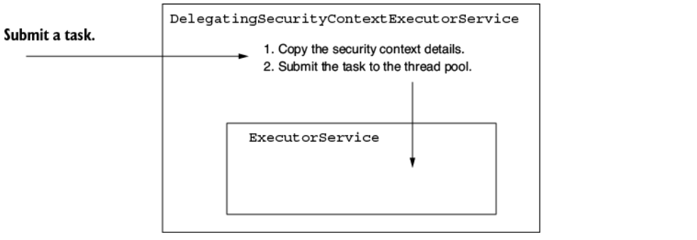

**Hình 6.12** `DelegatingSecurityContextExecutorService` trang trí một `ExecutorService` và lan truyền các chi tiết security context sang thread kế tiếp trước khi submit task.

Code ở listing sau đây cho thấy cách dùng một `DelegatingSecurityContextExecutorService` để trang trí một `ExecutorService` sao cho khi bạn submit task, nó lo việc lan truyền các chi tiết của security context.

**Listing 6.14 Lan truyền `SecurityContext`**

```java
@GetMapping("/hola")
public String hola() throws Exception {
  Callable<String> task = () -> {
    SecurityContext context = SecurityContextHolder.getContext();
    return context.getAuthentication().getName();
  };

  ExecutorService e = Executors.newCachedThreadPool();
  e = new DelegatingSecurityContextExecutorService(e);
  try {
    return "Hola, " + e.submit(task).get() + "!";
  } finally {
    e.shutdown();
  }
}
```

Gọi endpoint để test rằng `DelegatingSecurityContextExecutorService` đã ủy quyền security context đúng cách:

```bash
curl -u user:5a5124cc-060d-40b1-8aad-753d3da28dca http://localhost:8080/hola
```

Response body cho lời gọi này là

```
Hola, user!
```

> **NOTE** Trong số các class liên quan tới hỗ trợ concurrency cho security context, bạn nên ghi nhớ những cái được trình bày ở bảng 6.1.

Spring cung cấp nhiều hiện thực khác nhau của các utility class có thể dùng trong ứng dụng của bạn để quản lý security context khi tạo thread của riêng mình. Ở mục 6.2.4, bạn đã hiện thực `DelegatingSecurityContextCallable`. Trong mục này, chúng ta dùng `DelegatingSecurityContextExecutorService`. Nếu bạn cần hiện thực việc lan truyền security context cho một scheduled task, thì bạn sẽ vui khi nghe rằng Spring Security cũng cung cấp cho bạn một decorator tên là `DelegatingSecurityContextScheduledExecutorService`. Cơ chế này tương tự `DelegatingSecurityContextExecutorService` được trình bày trong mục này, với khác biệt là nó trang trí một `ScheduledExecutorService`, cho phép bạn làm việc với các scheduled task.

Thêm vào đó, để linh hoạt hơn, Spring Security cung cấp cho bạn một phiên bản trừu tượng hơn của decorator tên là `DelegatingSecurityContextExecutor`. Class này trực tiếp trang trí một `Executor`, vốn là contract trừu tượng nhất trong hệ thống phân cấp thread pool này. Bạn có thể chọn nó cho thiết kế ứng dụng của mình khi muốn có khả năng thay thế hiện thực của thread pool bằng bất kỳ lựa chọn nào mà ngôn ngữ cung cấp.

**Bảng 6.1** Các object chịu trách nhiệm ủy quyền security context sang một thread riêng

| Class | Mô tả |
| --- | --- |
| `DelegatingSecurityContextExecutor` | Hiện thực interface `Executor` và được thiết kế để trang trí một object `Executor` với khả năng chuyển tiếp security context sang các thread do pool của nó tạo ra. |
| `DelegatingSecurityContextExecutorService` | Hiện thực interface `ExecutorService` và được thiết kế để trang trí một object `ExecutorService` với khả năng chuyển tiếp security context sang các thread do pool của nó tạo ra. |
| `DelegatingSecurityContextScheduledExecutorService` | Hiện thực interface `ScheduledExecutorService` và được thiết kế để trang trí một object `ScheduledExecutorService` với khả năng chuyển tiếp security context sang các thread do pool của nó tạo ra. |
| `DelegatingSecurityContextRunnable` | Hiện thực interface `Runnable` và biểu diễn một task được thực thi trên một thread khác mà không trả về phản hồi. So với một `Runnable` thông thường, nó còn có thể lan truyền một security context để dùng trên thread mới. |
| `DelegatingSecurityContextCallable` | Hiện thực interface `Callable` và biểu diễn một task được thực thi trên một thread khác và cuối cùng sẽ trả về một phản hồi. So với một `Callable` thông thường, nó còn có thể lan truyền một security context để dùng trên thread mới. |

> **Ghi chú của người dịch:** Trong PDF gốc, cột "Description" của bảng 6.1 bị cắt cụt ở mỗi dòng do tràn khỏi độ rộng cột hiển thị. Nội dung đã được khôi phục đầy đủ theo các mảnh văn bản còn lại và ngữ cảnh của mục 6.2.4–6.2.5.

---

## 6.3 Hiểu về HTTP Basic và form-based login authentication

Cho tới giờ, chúng ta mới chỉ dùng HTTP Basic làm phương thức authentication, nhưng xuyên suốt cuốn sách này, bạn sẽ học rằng còn có những khả năng khác nữa. Phương thức HTTP Basic authentication đơn giản, điều này khiến nó là lựa chọn tuyệt vời cho các ví dụ và mục đích minh họa hoặc proof of concept. Nhưng cũng vì lý do đó, nó có thể không phù hợp với tất cả các tình huống thực tế mà bạn cần hiện thực.

Trong mục này, bạn sẽ học thêm nhiều cấu hình liên quan tới HTTP Basic. Ngoài ra, chúng ta sẽ nói về một phương thức authentication mới gọi là `formLogin`. Trong phần còn lại của cuốn sách, chúng ta sẽ bàn về những phương thức authentication khác, phù hợp tốt với các loại kiến trúc khác nhau. Chúng ta sẽ so sánh chúng để bạn có thể hiểu các best practice, cũng như những anti-pattern cho authentication.

### 6.3.1 Sử dụng và cấu hình HTTP Basic

Bạn đã biết rằng HTTP Basic là phương thức authentication mặc định, và chúng ta đã thấy cách nó hoạt động trong nhiều ví dụ ở chương 3. Trong mục này, chúng ta bổ sung thêm chi tiết về cấu hình của phương thức authentication này.

Với các tình huống lý thuyết, những giá trị mặc định mà HTTP Basic authentication đi kèm là rất tuyệt. Tuy nhiên, trong một ứng dụng phức tạp hơn, bạn có thể thấy cần tùy chỉnh một số thiết lập này. Ví dụ, bạn có thể muốn hiện thực một logic cụ thể cho trường hợp tiến trình authentication thất bại. Bạn thậm chí có thể cần đặt một số giá trị trên response gửi về cho client trong trường hợp này. Hãy xét những trường hợp này với các ví dụ thực hành để hiểu cách bạn có thể hiện thực điều này. Tôi muốn chỉ ra lần nữa cách bạn có thể đặt phương thức này một cách tường minh, như trình bày ở listing sau đây. Bạn có thể tìm thấy ví dụ này trong project `ssia-ch6-ex3`.

**Listing 6.15 Đặt phương thức HTTP Basic authentication**

```java
@Configuration
public class ProjectConfig {

  @Bean
  public SecurityFilterChain configure(HttpSecurity http)
    throws Exception {

     http.httpBasic(Customizer.withDefaults());

     return http.build();
  }
}
```

Bạn có thể gọi phương thức `httpBasic()` của instance `HttpSecurity` với một tham số kiểu `Customizer`. Tham số này cho phép bạn thiết lập một số cấu hình liên quan tới phương thức authentication, ví dụ như tên realm, như trình bày ở listing 6.16. Bạn có thể nghĩ về realm như một không gian bảo vệ sử dụng một phương thức authentication cụ thể. Để có mô tả đầy đủ, hãy tham khảo RFC 2617 tại <https://tools.ietf.org/html/rfc2617>.

**Listing 6.16 Cấu hình tên realm cho response của những lần authentication thất bại**

```java
@Bean
public SecurityFilterChain configure(HttpSecurity http)
  throws Exception {

  http.httpBasic(c -> {
    c.realmName("OTHER");
    c.authenticationEntryPoint(new CustomEntryPoint());
  });

  http.authorizeHttpRequests(c -> c.anyRequest().authenticated());

  return http.build();
}
```

Listing 6.16 trình bày một ví dụ về việc thay đổi tên realm. Biểu thức lambda được dùng thực chất là một object kiểu `Customizer<HttpBasicConfigurer<HttpSecurity>>`. Tham số kiểu `HttpBasicConfigurer<HttpSecurity>` cho phép chúng ta gọi phương thức `realmName()` để đổi tên realm. Bạn có thể dùng cURL với cờ `-v` để lấy một HTTP response chi tiết, trong đó tên realm quả thực đã thay đổi. Tuy nhiên, lưu ý rằng bạn chỉ tìm thấy header `WWW-Authenticate` trong response khi trạng thái HTTP response là 401 Unauthorized chứ không phải khi trạng thái HTTP response là 200 OK. Đây là lời gọi cURL:

```bash
curl -v http://localhost:8080/hello
```

Response của lời gọi là

```
...
< WWW-Authenticate: Basic realm="OTHER"
...
```

Thêm vào đó, bằng cách dùng một `Customizer`, chúng ta có thể tùy chỉnh response cho một lần authentication thất bại. Bạn cần làm điều này nếu client của hệ thống mong đợi một thứ cụ thể trong response khi authentication thất bại. Bạn có thể cần thêm hoặc bớt một hay nhiều header. Hoặc bạn có thể có logic nào đó lọc body để đảm bảo ứng dụng không lộ bất kỳ dữ liệu nhạy cảm nào ra cho client.

> **NOTE** Hãy luôn thận trọng với dữ liệu mà bạn phơi bày ra ngoài hệ thống. Một trong những sai lầm phổ biến nhất (cũng nằm trong top mười lỗ hổng của OWASP; xem <https://owasp.org/www-project-top-ten/>) là làm lộ dữ liệu nhạy cảm. Làm việc với những chi tiết mà ứng dụng gửi cho client khi authentication thất bại luôn là điểm rủi ro cho việc tiết lộ thông tin bí mật.

Để tùy chỉnh response cho một lần authentication thất bại, chúng ta có thể hiện thực một `AuthenticationEntryPoint`. Phương thức `commence()` của nó nhận `HttpServletRequest`, `HttpServletResponse`, và `AuthenticationException` gây ra việc authentication thất bại. Listing 6.17 minh họa một cách hiện thực `AuthenticationEntryPoint`, thứ thêm một header vào response và đặt HTTP status thành 401 Unauthorized.

> **NOTE** Hơi mơ hồ khi tên của interface `AuthenticationEntryPoint` không phản ánh việc nó được dùng khi authentication thất bại. Trong kiến trúc Spring Security, cái này được dùng trực tiếp bởi một component tên là `ExceptionTranslationManager`, thứ xử lý mọi `AccessDeniedException` và `AuthenticationException` được ném ra trong filter chain. Bạn có thể xem `ExceptionTranslationManager` như một cầu nối giữa các Java exception và HTTP response.

**Listing 6.17 Hiện thực một `AuthenticationEntryPoint`**

```java
public class CustomEntryPoint
  implements AuthenticationEntryPoint {

  @Override
  public void commence(
    HttpServletRequest httpServletRequest,
    HttpServletResponse httpServletResponse,
    AuthenticationException e)
      throws IOException, ServletException {

      httpServletResponse
        .addHeader("message", "Luke, I am your father!");
      httpServletResponse
        .sendError(HttpStatus.UNAUTHORIZED.value());
    }
}
```

Sau đó bạn có thể đăng ký `CustomEntryPoint` với phương thức HTTP Basic trong configuration class. Listing sau đây trình bày configuration class cho custom entry point.

**Listing 6.18 Đặt `AuthenticationEntryPoint` tùy chỉnh**

```java
@Bean
public SecurityFilterChain configure(HttpSecurity http)
  throws Exception {

  http.httpBasic(c -> {
    c.realmName("OTHER");
    c.authenticationEntryPoint(new CustomEntryPoint());
  });

  http.authorizeHttpRequests().anyRequest().authenticated();

  return http.build();
}
```

Nếu bây giờ bạn gọi tới một endpoint sao cho authentication thất bại, bạn sẽ thấy header mới được thêm vào trong response:

```bash
curl -v http://localhost:8080/hello
```

Response của lời gọi là

```
...
< HTTP/1.1 401
< Set-Cookie: JSESSIONID=459BAFA7E0E6246A463AD19B07569C7B; Path=/; HttpOnly
< message: Luke, I am your father!
...
```

### 6.3.2 Hiện thực authentication với form-based login

Khi phát triển một web application, có lẽ bạn muốn trình bày một form đăng nhập thân thiện với người dùng, nơi user có thể nhập credential của mình. Hơn nữa, bạn có thể muốn những user đã authentication có thể lướt qua các trang web sau khi đăng nhập và có thể đăng xuất. Với một web application nhỏ, bạn có thể tận dụng phương thức form-based login. Trong mục này, bạn học cách áp dụng và cấu hình phương thức authentication này cho ứng dụng của mình. Để đạt được điều đó, chúng ta viết một web application nhỏ dùng form-based login. Hình 6.13 mô tả luồng mà chúng ta sẽ hiện thực. Các ví dụ trong mục này là một phần của project `ssia-ch6-ex4`.

> **NOTE** Tôi liên hệ phương thức này với một web application nhỏ vì theo cách này, chúng ta dùng server-side session để quản lý security context. Với những ứng dụng lớn hơn đòi hỏi khả năng mở rộng theo chiều ngang (horizontal scalability), việc dùng server-side session để quản lý security context là không mong muốn. Chúng ta sẽ bàn chi tiết hơn về những khía cạnh này ở các chương 12 đến 15 khi xử lý OAuth 2.

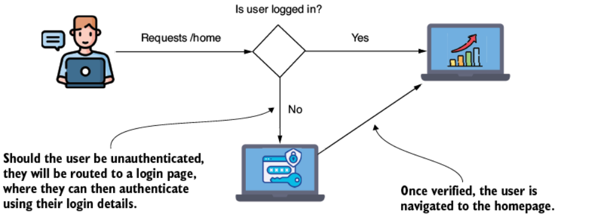

**Hình 6.13** Sử dụng form-based login. Một user chưa được authentication sẽ được đưa tới một form để đăng nhập bằng credential của mình. Sau khi ứng dụng đã kiểm chứng danh tính của họ, họ được đưa tới trang chính của ứng dụng.

Để đổi phương thức authentication sang form-based login, dùng object `HttpSecurity` của bean `SecurityFilterChain`, thay vì `httpBasic()`, hãy gọi phương thức `formLogin()` của tham số `HttpSecurity`. Listing sau đây trình bày thay đổi này.

**Listing 6.19 Đổi phương thức authentication sang form-based login**

```java
@Configuration
public class ProjectConfig {

  @Bean
  public SecurityFilterChain securityFilterChain(HttpSecurity http)
    throws Exception {

    http.formLogin(Customizer.withDefaults());
    http.authorizeHttpRequests(c -> c.anyRequest().authenticated());

    return http.build();
  }
}
```

Ngay cả với cấu hình tối thiểu này, Spring Security đã cấu hình sẵn một form đăng nhập, cũng như một trang đăng xuất cho project của bạn. Khởi động ứng dụng và truy cập nó bằng trình duyệt sẽ chuyển hướng bạn tới một trang đăng nhập (hình 6.14).

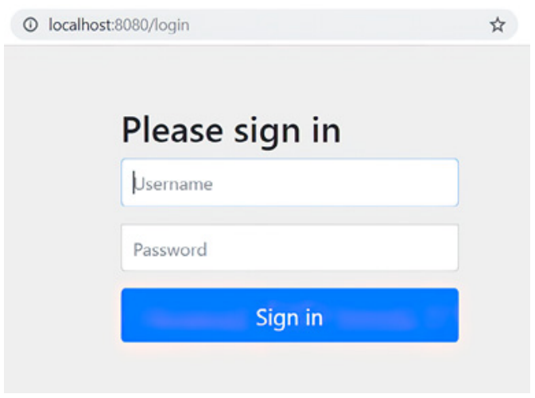

**Hình 6.14** Trang đăng nhập mặc định được Spring Security tự động cấu hình khi dùng phương thức `formLogin()`.

Bạn có thể đăng nhập bằng credential mặc định được cung cấp miễn là bạn chưa đăng ký `UserDetailsService` của mình. Đó là, như chúng ta đã học ở chương 2, username `user` và một password UUID được in ra console khi ứng dụng khởi động. Vì chưa có trang nào khác được định nghĩa, bạn sẽ được chuyển hướng tới một trang lỗi mặc định sau khi đăng nhập thành công.

Ứng dụng dựa vào cùng kiến trúc authentication mà chúng ta đã gặp trong các ví dụ trước. Vì vậy, như thể hiện ở hình 6.14, bạn cần hiện thực một controller cho trang chủ của ứng dụng. Khác biệt là thay vì có một response định dạng JSON đơn giản, chúng ta muốn endpoint trả về HTML mà trình duyệt có thể diễn giải thành trang web của chúng ta. Vì lý do này, chúng ta chọn bám theo luồng Spring MVC và để view được render từ một file sau khi thực thi action được định nghĩa trong controller. Hình 6.15 trình bày luồng Spring MVC để render trang chủ của ứng dụng.

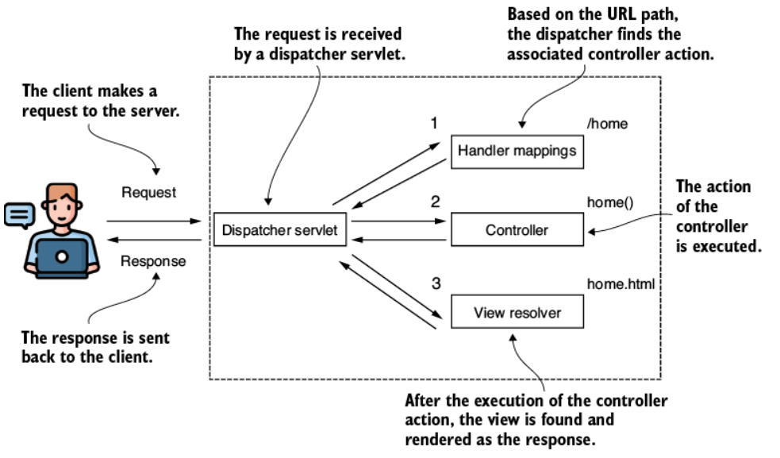

**Hình 6.15** Một biểu diễn đơn giản của luồng Spring MVC. Dispatcher tìm controller action gắn với đường dẫn cho trước (`/home` trong trường hợp này). Sau khi thực thi controller action, view được render, và response được gửi về cho client.

Để thêm một trang đơn giản vào ứng dụng, trước hết bạn phải tạo một file HTML trong thư mục *resources/static* của project. Tôi gọi file này là *home.html*. Bên trong nó, hãy gõ một đoạn văn bản mà sau này bạn có thể tìm thấy trong trình duyệt. Bạn chỉ cần thêm một heading (ví dụ, `<h1>Welcome</h1>`).

Sau khi tạo trang HTML, một controller cần định nghĩa ánh xạ từ đường dẫn tới view. Listing sau đây trình bày định nghĩa của action method cho trang *home.html* trong controller class.

**Listing 6.20 Định nghĩa action method của controller cho trang home.html**

```java
@Controller
public class HelloController {

  @GetMapping("/home")
  public String home() {
    return "home.html";
  }
}
```

Hãy nhớ rằng đây không phải `@RestController` mà là một `@Controller` đơn giản. Vì vậy, Spring không gửi giá trị mà phương thức trả về trong HTTP response. Thay vào đó, nó tìm và render view có tên *home.html*.

Thử truy cập đường dẫn `/home` bây giờ, trước tiên bạn được hỏi có muốn đăng nhập không. Sau khi đăng nhập thành công, bạn được chuyển hướng tới trang chủ, nơi thông điệp chào mừng xuất hiện. Giờ bạn có thể truy cập đường dẫn `/logout`, và điều này sẽ chuyển hướng bạn tới trang đăng xuất (hình 6.16).


**Hình 6.16** Trang đăng xuất được Spring Security cấu hình cho phương thức form-based login authentication.

Sau khi cố truy cập một đường dẫn mà chưa đăng nhập, user tự động được chuyển hướng tới trang đăng nhập. Sau khi đăng nhập thành công, ứng dụng chuyển hướng user trở lại đường dẫn mà họ đã cố truy cập ban đầu. Nếu đường dẫn đó không tồn tại, ứng dụng hiển thị một trang lỗi mặc định. Phương thức `formLogin()` trả về một object kiểu `FormLoginConfigurer<HttpSecurity>`, cho phép chúng ta thực hiện các tùy chỉnh. Ví dụ, bạn có thể làm điều này bằng cách gọi phương thức `defaultSuccessUrl()`, như trình bày ở listing sau đây.

**Listing 6.21 Đặt một default success URL cho login form**

```java
@Bean
public SecurityFilterChain securityFilterChain(HttpSecurity http)
  throws Exception {

  http.formLogin(c -> c.defaultSuccessUrl("/home", true));

  http.authorizeHttpRequests(c -> c.anyRequest().authenticated());

  return http.build();
}
```

Nếu bạn cần đi sâu hơn nữa vào việc này, sử dụng các object `AuthenticationSuccessHandler` và `AuthenticationFailureHandler` cung cấp một cách tùy chỉnh chi tiết hơn. Những interface này cho phép bạn hiện thực một object mà qua đó bạn có thể áp dụng logic được thực thi cho authentication. Nếu bạn muốn tùy chỉnh logic cho authentication thành công, bạn có thể định nghĩa một `AuthenticationSuccessHandler`. Phương thức `onAuthenticationSuccess()` nhận servlet request, servlet response, và object `Authentication` làm tham số. Ở listing kế tiếp, bạn sẽ thấy một ví dụ về việc hiện thực phương thức `onAuthenticationSuccess()` để chuyển hướng khác nhau tùy theo các authority được cấp của user đã đăng nhập.

**Listing 6.22 Hiện thực một `AuthenticationSuccessHandler`**

```java
@Component
public class CustomAuthenticationSuccessHandler
  implements AuthenticationSuccessHandler {

  @Override
  public void onAuthenticationSuccess(
    HttpServletRequest httpServletRequest,
    HttpServletResponse httpServletResponse,
    Authentication authentication)
      throws IOException {

      var authorities = authentication.getAuthorities();

      var auth =
              authorities.stream()
                .filter(a -> a.getAuthority().equals("read"))
                .findFirst();           // ①

      if (auth.isPresent()) {           // ②
        httpServletResponse
          .sendRedirect("/home");
      } else {
        httpServletResponse
          .sendRedirect("/error");
      }
   }
}
```

① Trả về một object `Optional` rỗng nếu authority "read" không tồn tại.

② Nếu authority "read" tồn tại, nó chuyển hướng tới `/home`.

Có những tình huống trong thực tế khi client mong đợi một định dạng response nhất định trong trường hợp authentication thất bại. Họ có thể mong đợi một mã trạng thái HTTP khác 401 Unauthorized hoặc thông tin bổ sung trong body của response. Trường hợp điển hình nhất mà tôi gặp trong các ứng dụng là gửi kèm một request identifier. Request identifier này có một giá trị duy nhất được dùng để truy vết lại request giữa nhiều hệ thống, và ứng dụng có thể gửi nó trong body của response khi authentication thất bại. Một tình huống khác là khi bạn muốn làm sạch (sanitize) response để đảm bảo ứng dụng không phơi bày dữ liệu nhạy cảm ra ngoài hệ thống. Bạn có thể muốn định nghĩa logic tùy chỉnh cho authentication thất bại đơn giản bằng cách ghi log sự kiện để điều tra thêm.

Nếu bạn muốn tùy chỉnh logic mà ứng dụng thực thi khi authentication thất bại, bạn có thể làm điều này một cách tương tự với một hiện thực `AuthenticationFailureHandler`. Ví dụ, nếu bạn muốn thêm một header cụ thể cho mọi lần authentication thất bại, bạn có thể làm giống như trình bày ở listing 6.23. Tất nhiên, bạn cũng có thể hiện thực bất kỳ logic nào ở đây. Với `AuthenticationFailureHandler`, `onAuthenticationFailure()` nhận request, response, và object `Authentication`.

**Listing 6.23 Hiện thực một `AuthenticationFailureHandler`**

```java
@Component
public class CustomAuthenticationFailureHandler
  implements AuthenticationFailureHandler {

  @Override
  public void onAuthenticationFailure(
    HttpServletRequest httpServletRequest,
    HttpServletResponse httpServletResponse,
    AuthenticationException e)  {
    try {
      httpServletResponse.setHeader("failed",
         LocalDateTime.now().toString());
      httpServletResponse.sendRedirect("/error");
    } catch (IOException ex) {
      throw new RuntimeException(ex);
    }
  }
}
```

Để dùng hai object này, bạn cần đăng ký chúng trong phương thức `securityFilterChain()` trên object `FormLoginConfigurer` được phương thức `formLogin()` trả về. Listing sau đây cho thấy cách làm điều này.

**Listing 6.24 Đăng ký các object handler trong configuration class**

```java
@Configuration
public class ProjectConfig {

  private final CustomAuthenticationSuccessHandler authenticationSuccessHandler;
  private final CustomAuthenticationFailureHandler authenticationFailureHandler;

  // constructor được lược bỏ

  @Bean
  public UserDetailsService uds() {
    var uds = new InMemoryUserDetailsManager();

    uds.createUser(
       User.withDefaultPasswordEncoder()
            .username("john")
            .password("12345")
            .authorities("read")
            .build()
    );

    uds.createUser(
       User.withDefaultPasswordEncoder()
             .username("bill")
             .password("12345")
             .authorities("write")
             .build()
    );

    return uds;
  }

  @Bean
  public SecurityFilterChain configure(HttpSecurity http)
    throws Exception {

     http.formLogin(c ->
       c.successHandler(authenticationSuccessHandler)
        .failureHandler(authenticationFailureHandler)
     );

     http.authorizeHttpRequests(c -> c.anyRequest().authenticated());

     return http.build();
  }
}
```

Hiện tại, nếu bạn thử truy cập đường dẫn `/home` bằng HTTP Basic với username và password đúng, bạn sẽ nhận được một response với trạng thái HTTP 302 Found. Đây là cách ứng dụng nói với bạn rằng nó đang cố thực hiện một chuyển hướng. Ngay cả khi bạn đã cung cấp đúng username và password, nó sẽ không xét đến chúng mà thay vào đó cố đưa bạn tới login form như phương thức `formLogin` yêu cầu. Tuy nhiên, bạn có thể đổi cấu hình để hỗ trợ cả HTTP Basic lẫn phương thức form-based login, như ở listing sau đây.

**Listing 6.25 Dùng form-based login và HTTP Basic cùng nhau**

```java
@Bean
public SecurityFilterChain securityFilterChain(HttpSecurity http)
  throws Exception {

  http.formLogin(c ->
     c.successHandler(authenticationSuccessHandler)
      .failureHandler(authenticationFailureHandler)
  );

  http.httpBasic(Customizer.withDefaults());

  http.authorizeHttpRequests(c -> c.anyRequest().authenticated());

  return http.build();
}
```

Truy cập đường dẫn `/home` bây giờ hoạt động với cả phương thức form-based login lẫn HTTP Basic authentication:

```bash
curl -u user:cdd430f6-8ebc-49a6-9769-b0f3ce571d19 http://localhost:8080/home
```

Response của lời gọi là

```html
<h1>Welcome</h1>
```

> **Ghi chú của người dịch:** Một số dòng lệnh cURL và khai báo field trong chương này bị PDF gốc cắt cụt ở cuối dòng (ví dụ `http://localhost:8080/h`, `authenticationSuccessH`, `HttpOn`). Phần thiếu đã được khôi phục theo ngữ cảnh của đoạn văn đi kèm.

---

## Tóm tắt

- `AuthenticationProvider` là component cho phép bạn hiện thực logic authentication tùy chỉnh.
- Khi bạn hiện thực logic authentication tùy chỉnh, việc giữ các trách nhiệm tách rời là một thực hành tốt. Với việc quản lý user, `AuthenticationProvider` ủy quyền cho một `UserDetailsService`, và với trách nhiệm kiểm chứng password, `AuthenticationProvider` ủy quyền cho một `PasswordEncoder`.
- `SecurityContext` giữ chi tiết về thực thể đã authentication sau khi authentication thành công.
- Bạn có thể dùng ba chiến lược để quản lý security context: `MODE_THREADLOCAL`, `MODE_INHERITABLETHREADLOCAL`, và `MODE_GLOBAL`. Việc truy cập chi tiết security context từ các thread khác nhau hoạt động khác nhau, tùy thuộc vào chế độ bạn chọn.
- Hãy nhớ rằng khi dùng chế độ shared-thread local, nó chỉ áp dụng cho những thread do Spring quản lý. Framework sẽ không sao chép security context cho những thread không nằm dưới sự quản lý của nó.
- Spring Security cung cấp cho bạn những utility class tuyệt vời để quản lý các thread do code của bạn tạo ra, những thread mà framework không biết tới. Để quản lý `SecurityContext` cho các thread bạn tạo, bạn có thể dùng:
  - `DelegatingSecurityContextRunnable`
  - `DelegatingSecurityContextCallable`
  - `DelegatingSecurityContextExecutor`
- Spring Security tự động cấu hình một form để đăng nhập và một tùy chọn để đăng xuất với phương thức form-based login authentication, `formLogin()`. Nó rất dễ dùng khi phát triển các web application nhỏ.
- Phương thức `formLogin` authentication có khả năng tùy chỉnh cao. Hơn nữa, bạn có thể dùng loại authentication này cùng với phương thức HTTP Basic.
