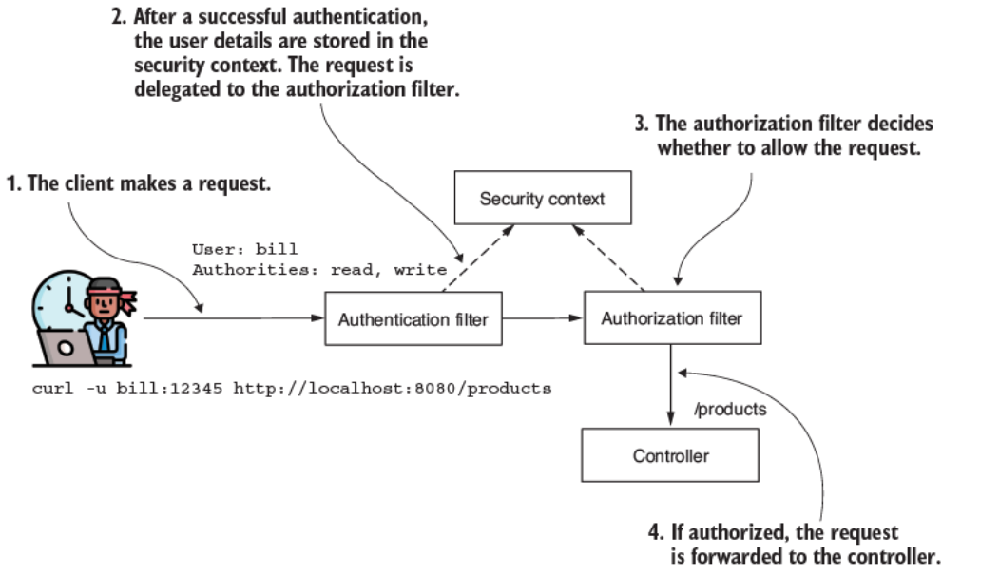
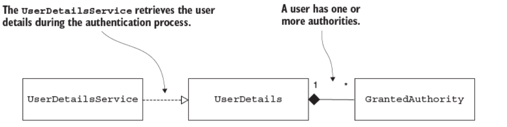
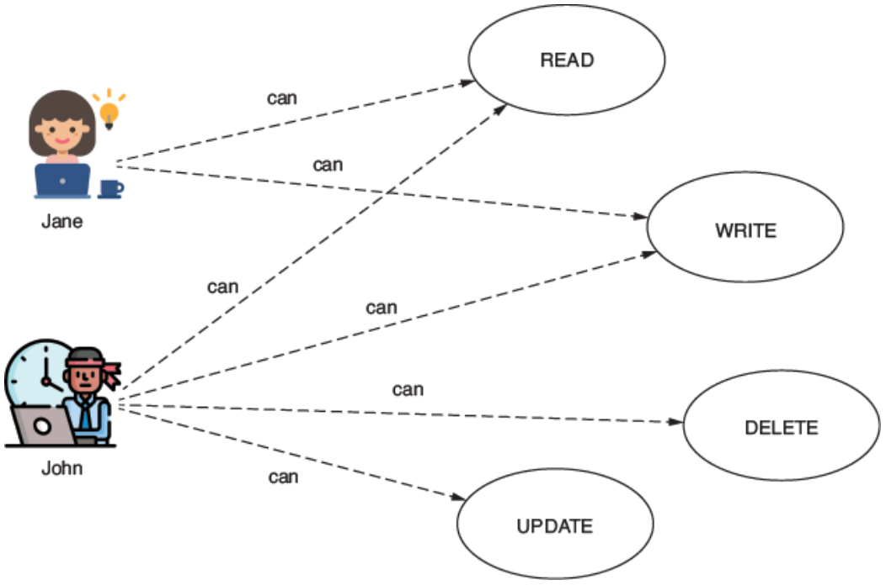
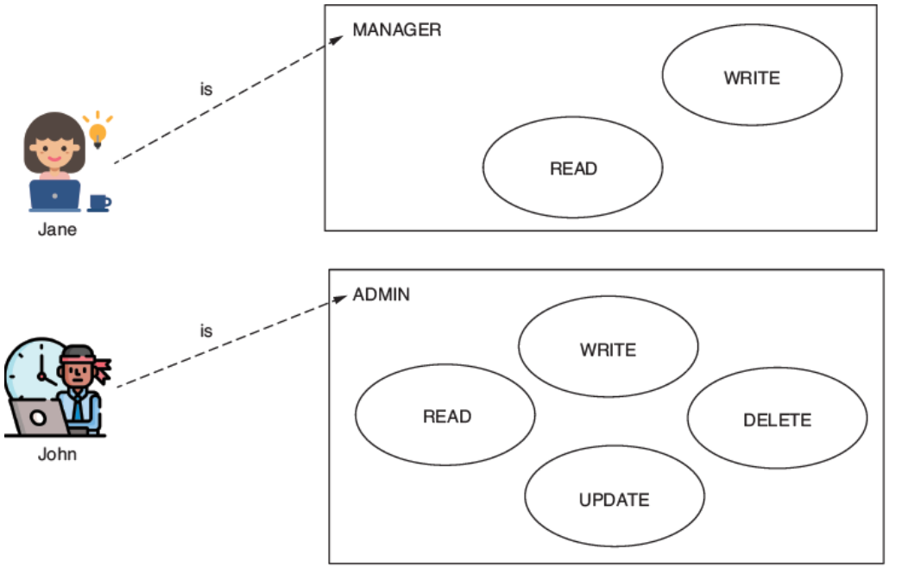
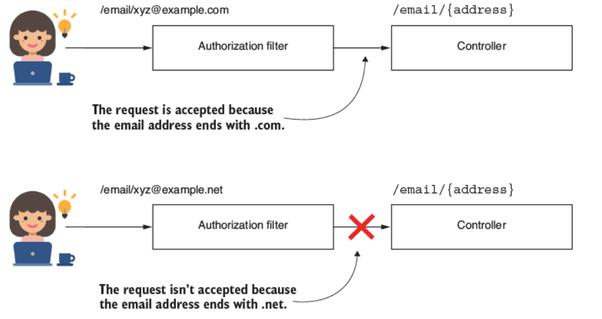
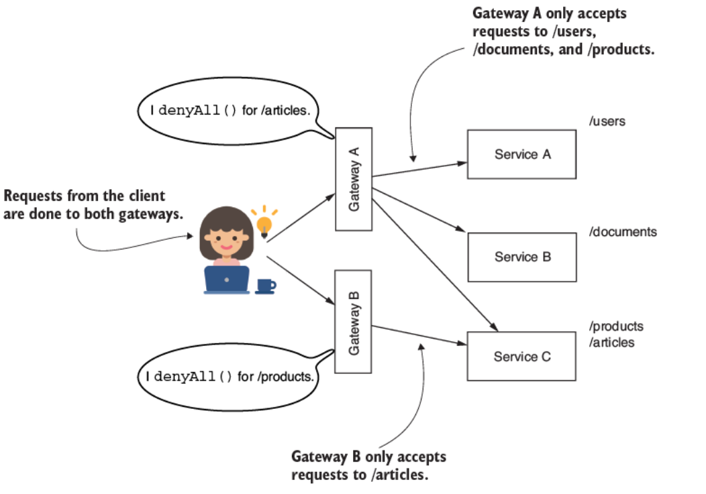

# 7. Cấu hình authorization ở mức endpoint: Hạn chế quyền truy cập

> Bản dịch tiếng Việt của chương 7 — *Spring Security in Action, Second Edition* (Laurentiu Spilca, Manning).

**Nội dung chương này bao gồm:**

- Định nghĩa authority (quyền hạn) và role (vai trò)
- Áp dụng các quy tắc authorization (phân quyền) lên endpoint

Vài năm trước, tôi đang trượt tuyết ở dãy Carpathian tuyệt đẹp thì chứng kiến một cảnh khá buồn cười. Khoảng 10, có lẽ 15 người đang xếp hàng để lên cabin đi tới đỉnh dốc trượt. Một nghệ sĩ nhạc pop nổi tiếng xuất hiện, đi cùng hai vệ sĩ. Anh ta tự tin sải bước tới, mong đợi được bỏ qua hàng chờ vì mình nổi tiếng. Khi tới đầu hàng, anh ta nhận một bất ngờ. "Vé, làm ơn!" người quản lý việc lên cabin nói, rồi phải giải thích: "Ừm, thứ nhất anh cần có vé, và thứ hai, không có làn ưu tiên cho việc lên cabin này, xin lỗi. Hàng chờ kết thúc ở đằng kia." Anh ta chỉ về phía cuối hàng. Trong cuộc sống, thường thì việc bạn là ai không quan trọng. Chúng ta có thể nói điều tương tự về các ứng dụng phần mềm. Việc bạn là ai không quan trọng khi cố truy cập một chức năng hoặc dữ liệu cụ thể!

Cho tới giờ, chúng ta mới chỉ bàn về authentication (xác thực), thứ mà như bạn đã học, là tiến trình trong đó ứng dụng định danh người gọi một tài nguyên. Trong các ví dụ trước, chúng ta chưa hiện thực bất kỳ quy tắc nào để quyết định có chấp thuận một request hay không. Chúng ta chỉ quan tâm liệu hệ thống có biết user hay không. Trong hầu hết ứng dụng, không phải mọi user được hệ thống định danh đều có thể truy cập mọi tài nguyên trong đó. Trong chương này, chúng ta sẽ bàn về authorization. **Authorization** là tiến trình trong đó hệ thống quyết định xem một client đã được định danh có quyền truy cập tài nguyên được yêu cầu hay không (hình 7.1).


**Hình 7.1** Authorization là tiến trình trong đó ứng dụng quyết định xem một thực thể đã authentication có được phép truy cập một tài nguyên hay không. Authorization luôn diễn ra sau authentication.

Trong Spring Security, một khi ứng dụng kết thúc luồng authentication, nó ủy quyền (delegate) request cho một authorization filter. Filter này cho phép hoặc từ chối request dựa trên các quy tắc authorization đã cấu hình (hình 7.2).



**Hình 7.2** Khi client khởi tạo request, authentication filter kiểm chứng danh tính của user. Sau khi kiểm chứng thành công, authentication filter đặt chi tiết của user vào security context và chuyển request tới authorization filter. Filter này sau đó đánh giá xem request có nên được cho phép hay không. Nó đưa ra quyết định này bằng thông tin user được cung cấp trong security context.

Để bao quát tất cả các chi tiết thiết yếu về authorization, trong chương này chúng ta sẽ:

- Hiểu authority là gì và áp dụng các quy tắc truy cập lên tất cả endpoint dựa trên authority của một user
- Học cách nhóm các authority thành role và cách áp dụng các quy tắc authorization dựa trên role của một user

Ở chương 8, chúng ta sẽ tiếp tục với việc chọn lựa những endpoint mà chúng ta sẽ áp dụng quy tắc authorization lên. Còn bây giờ, hãy xem xét authority và role cùng cách chúng có thể hạn chế quyền truy cập vào ứng dụng của chúng ta.

---

## 7.1 Hạn chế truy cập dựa trên authority và role

Trong mục này, bạn sẽ học về các khái niệm authorization và role. Bạn dùng chúng để bảo vệ tất cả các endpoint của ứng dụng. Việc hiểu những khái niệm này là cần thiết trước khi bạn có thể áp dụng chúng vào các tình huống thực tế, nơi những user khác nhau có quyền hạn khác nhau. Dựa trên privilege (đặc quyền) mà user có, họ chỉ có thể thực hiện một hành động cụ thể. Ứng dụng cung cấp privilege dưới dạng authority và role.

Ở chương 3, bạn đã hiện thực interface `GrantedAuthority`. Contract (giao ước) này được giới thiệu khi chúng ta bàn về một component thiết yếu khác: interface `UserDetails`. Chúng ta chưa làm việc với `GrantedAuthority` lúc đó bởi vì, như bạn sẽ học trong chương này, interface này chủ yếu liên quan tới tiến trình authorization. Giờ chúng ta có thể quay lại `GrantedAuthority` để xem xét mục đích của nó. Hình 7.3 trình bày mối quan hệ giữa contract `UserDetails` và interface `GrantedAuthority`. Khi bàn xong về contract này, bạn sẽ học cách dùng các quy tắc này một cách riêng lẻ hoặc cho những request cụ thể.



**Hình 7.3** Một user sở hữu một hoặc nhiều authority (các hành động được phép). Trong suốt giai đoạn authentication, `UserDetailsService` truy xuất đầy đủ chi tiết về user, bao gồm cả các authority của họ. Sau khi authentication thành công, ứng dụng dùng những authority này, được mô tả bởi interface `GrantedAuthority`, để thực hiện authorization.

Listing 7.1 cho thấy định nghĩa của contract `GrantedAuthority`. Một **authority** là một hành động mà user có thể thực hiện với một tài nguyên của hệ thống. Một authority có một cái tên mà hành vi `getAuthority()` của object trả về dưới dạng một `String`. Chúng ta dùng tên của authority khi định nghĩa quy tắc authorization tùy chỉnh. Thông thường, một quy tắc authorization có thể trông như thế này: "Jane được phép xóa các bản ghi sản phẩm", hoặc "John được phép đọc các bản ghi tài liệu". Trong những trường hợp này, *delete* và *read* là các authority được cấp. Ứng dụng cho phép user Jane và John thực hiện những hành động này, vốn thường có tên như read, write, hoặc delete.

**Listing 7.1 Contract `GrantedAuthority`**

```java
public interface GrantedAuthority extends Serializable {
  String getAuthority();
}
```

`UserDetails`, contract mô tả user trong Spring Security, có một collection các instance `GrantedAuthority`, như trình bày ở hình 7.3. Bạn có thể cho phép một user một hoặc nhiều privilege. Phương thức `getAuthorities()` trả về collection các instance `GrantedAuthority`. Ở listing 7.2, bạn có thể xem lại phương thức này trong contract `UserDetails`. Chúng ta hiện thực phương thức này sao cho nó trả về tất cả các authority được cấp cho user. Sau khi authentication kết thúc, các authority trở thành một phần của chi tiết về user đã đăng nhập, thứ mà ứng dụng có thể dùng để cấp quyền.

**Listing 7.2 Phương thức `getAuthorities()` từ contract `UserDetails`**

```java
public interface UserDetails extends Serializable {
  Collection<? extends GrantedAuthority> getAuthorities();

  // Phần code được lược bỏ
}
```

### 7.1.1 Hạn chế truy cập cho tất cả endpoint dựa trên authority của user

Mục này bàn về cách giới hạn quyền truy cập tới endpoint cho những user cụ thể. Cho tới giờ trong các ví dụ của chúng ta, bất kỳ user nào đã authentication đều có thể gọi bất kỳ endpoint nào của ứng dụng. Giờ bạn sẽ học cách tùy chỉnh quyền truy cập này. Trong các app bạn gặp ở production, bạn có thể gọi một số endpoint của ứng dụng ngay cả khi chưa authentication, trong khi với những endpoint khác, bạn cần privilege đặc biệt (hình 7.4). Chúng ta sẽ viết vài ví dụ để bạn học được nhiều cách khác nhau áp dụng những hạn chế này với Spring Security.



**Hình 7.4** Authority định nghĩa những thao tác được phép mà user có thể thực hiện trong ứng dụng. Những thao tác này định hình việc tạo ra các quy định authorization, giới hạn một số request tới endpoint cho những user có authority được chỉ định. Ví dụ, Jane bị giới hạn ở việc đọc và ghi tại endpoint, trong khi John có khả năng đọc, ghi, xóa, và sửa tại endpoint đó.

Giờ khi bạn đã nhớ lại contract `UserDetails` và `GrantedAuthority` cùng mối quan hệ giữa chúng, đã đến lúc viết một app nhỏ áp dụng một quy tắc authorization. Với ví dụ này, bạn học được vài cách thay thế để cấu hình quyền truy cập tới endpoint dựa trên authority của user. Chúng ta bắt đầu một project mới mà tôi đặt tên là `ssia-ch7-ex1`. Tôi sẽ chỉ cho bạn ba cách để cấu hình quyền truy cập bằng các phương thức sau:

- **`hasAuthority()`** — Nhận tham số là chỉ một authority duy nhất mà ứng dụng cấu hình các hạn chế cho nó. Chỉ những user có authority đó mới có thể gọi endpoint.
- **`hasAnyAuthority()`** — Có thể nhận nhiều hơn một authority mà ứng dụng cấu hình các hạn chế cho chúng. Tôi nhớ phương thức này là "has any of the given authorities" (có bất kỳ authority nào trong số đã cho). User phải có ít nhất một trong những authority được chỉ định để thực hiện request.

  Tôi khuyến nghị dùng phương thức này hoặc phương thức `hasAuthority()` vì tính đơn giản của chúng, tùy thuộc vào số lượng privilege bạn gán. Chúng đơn giản để đọc trong cấu hình và làm code của bạn dễ hiểu hơn.
- **`access()`** — Cung cấp khả năng vô hạn để cấu hình quyền truy cập bởi ứng dụng xây dựng các quy tắc authorization dựa trên một object tùy chỉnh tên là `AuthorizationManager` mà bạn hiện thực. Bạn có thể cung cấp bất kỳ hiện thực nào cho contract `AuthorizationManager`, tùy theo trường hợp của bạn. Spring Security cũng cung cấp sẵn một vài hiện thực. Hiện thực phổ biến nhất là `WebExpressionAuthorizationManager`, giúp bạn áp dụng các quy tắc authorization dựa trên Spring Expression Language (SpEL). Nhưng dùng phương thức `access()` có thể khiến các quy tắc authorization khó đọc và khó hiểu hơn. Vì lý do này, tôi khuyến nghị nó là giải pháp kém ưu tiên hơn và chỉ dùng nếu bạn không thể áp dụng phương thức `hasAnyAuthority()` hoặc `hasAuthority()`.

Những dependency duy nhất cần thiết trong file *pom.xml* của bạn là `spring-boot-starter-web` và `spring-boot-starter-security`. Những dependency này là đủ để tiếp cận cả ba giải pháp đã liệt kê ở trên. Bạn có thể tìm thấy ví dụ này trong project `ssia-ch7-ex1`:

```xml
<dependency>
  <groupId>org.springframework.boot</groupId>
  <artifactId>spring-boot-starter-security</artifactId>
</dependency>
<dependency>
  <groupId>org.springframework.boot</groupId>
  <artifactId>spring-boot-starter-web</artifactId>
</dependency>
```

Chúng ta cũng thêm một endpoint vào ứng dụng để test cấu hình authorization:

```java
@RestController
public class HelloController {

  @GetMapping("/hello")
  public String hello() {
    return "Hello!";
  }
}
```

Trong một configuration class, chúng ta khai báo một `InMemoryUserDetailsManager` làm `UserDetailsService` và thêm hai user, John và Jane, để được quản lý. Mỗi user có một authority khác nhau. Bạn có thể xem cách làm điều này ở listing sau đây.

**Listing 7.3 Khai báo `UserDetailsService` và gán user**

```java
@Configuration
public class ProjectConfig {

  @Bean                                                 // ①
  public UserDetailsService userDetailsService() {
    var manager = new InMemoryUserDetailsManager();     // ②

    var user1 = User.withUsername("john")               // ③
                    .password("12345")
                    .authorities("READ")
                    .build();

    var user2 = User.withUsername("jane")               // ④
                    .password("12345")
                    .authorities("WRITE")
                    .build();

    manager.createUser(user1);                          // ⑤
    manager.createUser(user2);

    return manager;
  }

  @Bean                                                 // ⑥
  public PasswordEncoder passwordEncoder() {
    return NoOpPasswordEncoder.getInstance();
  }
}
```

① `UserDetailsService` được phương thức trả về sẽ được thêm vào Spring context.

② Khai báo một `InMemoryUserDetailsManager` lưu vài user.

③ User đầu tiên, John, có authority READ.

④ User thứ hai, Jane, có authority WRITE.

⑤ Các user được thêm vào và quản lý bởi `UserDetailsService`.

⑥ Đừng quên rằng một `PasswordEncoder` cũng là cần thiết.

Việc tiếp theo chúng ta làm là thêm cấu hình authorization. Ở chương 2, khi làm ví dụ đầu tiên, bạn đã thấy cách chúng ta có thể làm cho tất cả endpoint truy cập được bởi mọi người. Để làm điều đó, chúng ta tạo một bean `SecurityFilterChain` trong context của app, tương tự như trình bày ở listing kế tiếp.

**Listing 7.4 Làm cho tất cả endpoint truy cập được bởi mọi người mà không cần authentication**

```java
@Configuration
public class ProjectConfig {

  // Phần code được lược bỏ

  @Bean
  public SecurityFilterChain securityFilterChain(HttpSecurity http)
    throws Exception {

    http.httpBasic(Customizer.withDefaults());

    http.authorizeHttpRequests(
        c -> c.anyRequest().permitAll()    // ①
    );

    return http.build();
  }
}
```

① Cho phép truy cập với tất cả các request.

Phương thức `authorizeHttpRequests()` cho phép chúng ta tiếp tục với việc chỉ định các quy tắc authorization lên endpoint. Phương thức `anyRequest()` chỉ ra rằng quy tắc áp dụng cho tất cả các request, bất kể URL hay HTTP method được dùng. Phương thức `permitAll()` cho phép truy cập tới tất cả các request khớp, dù đã authentication hay chưa.

Giả sử chúng ta muốn đảm bảo rằng chỉ những user có authority WRITE mới có thể truy cập tất cả endpoint. Với ví dụ của chúng ta, điều này nghĩa là chỉ mình Jane. Chúng ta có thể đạt mục tiêu và hạn chế quyền truy cập lần này dựa trên authority của user. Hãy xem code ở listing sau đây.

**Listing 7.5 Hạn chế quyền truy cập chỉ cho user có authority WRITE**

```java
@Configuration
public class ProjectConfig {

  // Phần code được lược bỏ

  @Bean
  public SecurityFilterChain securityFilterChain(HttpSecurity http)
    throws Exception {

    http.httpBasic(Customizer.withDefaults());

    http.authorizeHttpRequests(
        c -> c.anyRequest()
          .hasAuthority("WRITE")    // ①
    );

    return http.build();
  }
}
```

① Chỉ định điều kiện mà user có quyền truy cập endpoint.

Bạn có thể thấy phương thức `permitAll()` đã được thay bằng phương thức `hasAuthority()`. Bạn cung cấp tên của authority được cho phép với user làm tham số của phương thức `hasAuthority()`. Ứng dụng cần authentication request trước, rồi dựa trên authority của user, app quyết định có cho phép lời gọi hay không.

Giờ chúng ta có thể bắt đầu test ứng dụng bằng cách gọi endpoint với từng user trong số hai user. Khi gọi endpoint với user Jane, trạng thái HTTP response là 200 OK, và chúng ta thấy response body "Hello!". Khi gọi nó với user John, trạng thái HTTP response là 403 Forbidden, và chúng ta nhận về một response body rỗng. Ví dụ, gọi endpoint này với user Jane

```bash
curl -u jane:12345 http://localhost:8080/hello
```

chúng ta nhận response này:

```
Hello!
```

Gọi endpoint với user John

```bash
curl -u john:12345 http://localhost:8080/hello
```

chúng ta nhận response này:

```json
{
  "status":403,
  "error":"Forbidden",
  "message":"Forbidden",
  "path":"/hello"
}
```

Tương tự, chúng ta có thể dùng phương thức `hasAnyAuthority()`. Phương thức này có tham số kiểu `varargs`; nhờ vậy, nó có thể nhận nhiều tên authority. Ứng dụng cho phép request nếu user có ít nhất một trong những authority được cung cấp làm tham số cho phương thức. Bạn có thể thay `hasAuthority()` trong listing trước bằng `hasAnyAuthority("WRITE")`, trong trường hợp đó ứng dụng hoạt động chính xác như cũ. Tuy nhiên, nếu bạn thay `hasAuthority()` bằng `hasAnyAuthority("WRITE", "READ")`, thì các request từ user có một trong hai authority đều được chấp nhận. Với trường hợp của chúng ta, ứng dụng cho phép request từ cả John và Jane. Listing sau đây cho thấy cách áp dụng phương thức `hasAnyAuthority()`.

**Listing 7.6 Áp dụng phương thức `hasAnyAuthority()`**

```java
@Configuration
public class ProjectConfig {

  // Phần code được lược bỏ

  @Bean
  public SecurityFilterChain securityFilterChain(HttpSecurity http)
    throws Exception {

    http.httpBasic(Customizer.withDefaults());

    http.authorizeHttpRequests(
       c -> c.anyRequest()
            .hasAnyAuthority("WRITE", "READ")     // ①
    );

    return http.build();
  }
}
```

① Cho phép request từ user có cả authority WRITE lẫn READ.

Bạn có thể gọi endpoint thành công bây giờ với bất kỳ user nào trong hai user của chúng ta. Đây là lời gọi cho John:

```bash
curl -u john:12345 http://localhost:8080/hello
```

Response body là

```
Hello!
```

Và lời gọi cho Jane là

```bash
curl -u jane:12345 http://localhost:8080/hello
```

Response body là

```
Hello!
```

Để chỉ định quyền truy cập dựa trên authority của user, cách thứ ba bạn gặp trong thực tế là phương thức `access()`. Tuy nhiên, phương thức `access()` tổng quát hơn. Nó nhận tham số là một hiện thực `AuthorizationManager`. Bạn có thể cung cấp bất kỳ hiện thực nào cho object này, thứ có thể áp dụng bất kỳ loại logic nào định nghĩa các quy tắc authorization. Phương thức này rất mạnh, và nó không chỉ liên quan tới authority. Tuy nhiên, phương thức này cũng khiến code khó đọc và khó hiểu hơn. Vì lý do này, tôi khuyến nghị nó là lựa chọn cuối cùng, và chỉ khi bạn không thể áp dụng một trong các phương thức `hasAuthority()` hay `hasAnyAuthority()` đã trình bày ở đầu mục này.

Để phương thức này dễ hiểu hơn, trước tiên tôi trình bày nó như một cách thay thế cho việc chỉ định authority bằng phương thức `hasAuthority()` và `hasAnyAuthority()`. Trong ví dụ này, bạn sẽ dùng một hiện thực `AuthorizationManager` mà ở đó bạn phải cung cấp một biểu thức SpEL làm tham số. Quy tắc authorization mà chúng ta định nghĩa trở nên khó đọc hơn, và đây là lý do tôi không khuyến nghị cách tiếp cận này cho những quy tắc đơn giản. Tuy nhiên, phương thức `access()` có lợi thế là cho phép bạn tùy chỉnh các quy tắc thông qua hiện thực `AuthorizationManager` mà bạn cung cấp làm tham số. Và điều này thực sự rất mạnh! Với các biểu thức SpEL, về cơ bản bạn có thể định nghĩa bất kỳ điều kiện nào.

> **NOTE** Trong hầu hết tình huống, những hạn chế cần thiết có thể được hiện thực bằng phương thức `hasAuthority()` và `hasAnyAuthority()`, và tôi khuyến nghị bạn dùng chúng. Chỉ dùng phương thức `access()` nếu hai lựa chọn kia không phù hợp và bạn muốn hiện thực những quy tắc authorization tổng quát hơn.

Chúng ta bắt đầu với một ví dụ đơn giản để đáp ứng cùng yêu cầu như trong những trường hợp trước. Nếu bạn chỉ phải kiểm tra xem user có các authority cụ thể hay không, biểu thức bạn cần dùng với phương thức `access()` có thể là một trong những cái sau:

- `hasAuthority('WRITE')` — Quy định rằng user cần authority WRITE để gọi endpoint.
- `hasAnyAuthority('READ', 'WRITE')` — Chỉ định rằng user cần một trong hai authority READ hoặc WRITE. Với biểu thức này, bạn có thể liệt kê tất cả các authority mà bạn muốn cho phép truy cập.

Hãy để ý rằng những biểu thức này có cùng tên với các phương thức được trình bày ở đầu mục này. Listing sau đây minh họa cách dùng phương thức `access()`.

**Listing 7.7 Dùng phương thức `access()` để cấu hình quyền truy cập tới endpoint**

```java
@Configuration
public class ProjectConfig {

  // Phần code được lược bỏ

  @Bean
  public SecurityFilterChain securityFilterChain(HttpSecurity http)
    throws Exception {

    http.httpBasic(Customizer.withDefaults());

    http.authorizeHttpRequests(
      c -> c.anyRequest()
               .access("hasAuthority('WRITE')")  // ①
    );

    return http.build();
  }
}
```

① Authorize các request từ user có authority WRITE.

Ví dụ trình bày ở listing 7.7 chứng minh cách phương thức `access()` làm phức tạp cú pháp nếu bạn dùng nó cho những yêu cầu đơn giản. Trong trường hợp như vậy, bạn nên dùng trực tiếp phương thức `hasAuthority()` hoặc `hasAnyAuthority()`. Nhưng phương thức `access()` không hề tệ. Như đã nói ở trên, nó mang lại sự linh hoạt. Bạn sẽ gặp những tình huống trong thực tế mà ở đó bạn có thể dùng nó để viết những biểu thức phức tạp hơn, dựa trên đó ứng dụng cấp quyền truy cập. Bạn sẽ không thể hiện thực những tình huống này nếu không có phương thức `access()`.

Ở listing 7.8, bạn có thể thấy phương thức `access()` được áp dụng với một biểu thức mà khó viết theo cách khác. Chính xác hơn, cấu hình trình bày ở listing 7.8 định nghĩa hai user, John và Jane, có các authority khác nhau. User John chỉ có authority read, trong khi Jane có các authority read, write, và delete. Endpoint nên truy cập được với những user có authority read, nhưng không với những user có authority delete.

> **NOTE** Trong các app Spring, bạn gặp nhiều phong cách và quy ước khác nhau để đặt tên authority. Một số lập trình viên dùng toàn chữ hoa, trong khi người khác dùng toàn chữ thường. Theo tôi, tất cả những lựa chọn này đều ổn miễn là bạn giữ chúng nhất quán trong app của mình. Trong cuốn sách này, tôi dùng những phong cách khác nhau trong các ví dụ để bạn có thể quan sát nhiều cách tiếp cận mà bạn có thể gặp trong các tình huống thực tế.

Đây tất nhiên là một ví dụ giả định, nhưng nó đủ đơn giản để dễ hiểu và đủ phức tạp để chứng minh tại sao phương thức `access()` mạnh hơn. Để hiện thực điều này với phương thức `access()`, bạn có thể dùng một hiện thực `AuthorizationManager` nhận một biểu thức SpEL. Biểu thức SpEL phải phản ánh yêu cầu. Ví dụ:

```
"hasAuthority('read') and !hasAuthority('delete')"
```

Listing kế tiếp minh họa cách áp dụng phương thức `access()` với một biểu thức phức tạp hơn. Bạn có thể tìm thấy ví dụ này trong project tên là `ssia-ch7-ex2`.

**Listing 7.8 Áp dụng phương thức `access()` với một biểu thức phức tạp hơn**

```java
@Configuration
public class ProjectConfig {

  @Bean
  public UserDetailsService userDetailsService() {
    var manager = new InMemoryUserDetailsManager();

    var user1 = User.withUsername("john")
            .password("12345")
            .authorities("read")
            .build();

    var user2 = User.withUsername("jane")
            .password("12345")
            .authorities("read", "write", "delete")
            .build();

    manager.createUser(user1);
    manager.createUser(user2);

    return manager;
  }

  @Bean
  public PasswordEncoder passwordEncoder() {
    return NoOpPasswordEncoder.getInstance();
  }

  @Bean
  public SecurityFilterChain securityFilterChain(HttpSecurity http)
    throws Exception {

    http.httpBasic(Customizer.withDefaults());

    String expression =
           """
           hasAuthority('read') and
           !hasAuthority('delete')
           """;                                 // ①

    http.authorizeHttpRequests(
      c -> c.anyRequest()
               .access(new WebExpressionAuthorizationManager(expression))
    );

    return http.build();
  }
}
```

① Nêu rằng user phải có authority read nhưng không có authority delete.

> **Ghi chú của người dịch:** Trong PDF gốc, dòng `.access(new WebExpressionAuthorizationManager(expressio` bị cắt cụt do tràn khỏi khung hiển thị; phần còn lại đã được khôi phục thành `(expression))`.

Hãy test ứng dụng của chúng ta bây giờ bằng cách gọi endpoint `/hello` cho user John:

```bash
curl -u john:12345 http://localhost:8080/hello
```

Body của response là

```
Hello!
```

Và khi gọi endpoint với user Jane

```bash
curl -u jane:12345 http://localhost:8080/hello
```

body của response là

```json
{
    "status":403,
    "error":"Forbidden",
    "message":"Forbidden",
    "path":"/hello"
}
```

User John chỉ có authority read và có thể gọi endpoint thành công. Tuy nhiên, Jane cũng có authority delete và không được authorize để gọi endpoint. Trạng thái HTTP cho lời gọi của Jane là 403 Forbidden.

Với những ví dụ này, bạn có thể thấy cách đặt ràng buộc về các authority mà một user cần có để truy cập một số endpoint được chỉ định. Tất nhiên, chúng ta chưa bàn về việc chọn lựa request nào cần được bảo vệ dựa trên path hay HTTP method. Thay vào đó, chúng ta đã áp dụng các quy tắc cho tất cả request bất kể endpoint nào được ứng dụng expose. Khi chúng ta hoàn thành việc thực thi cùng cấu hình đó cho role của user, chúng ta sẽ bàn cách chọn các endpoint mà bạn áp dụng cấu hình authorization lên.

### 7.1.2 Hạn chế truy cập cho tất cả endpoint dựa trên role của user

Trong mục này, chúng ta bàn về việc hạn chế quyền truy cập tới endpoint dựa trên role. **Role** là một cách khác để chỉ những gì một user có thể làm (hình 7.5). Bạn cũng gặp chúng trong các ứng dụng thực tế, nên đây là lý do việc hiểu role và sự khác biệt giữa role và authority là quan trọng. Trong mục này, chúng ta áp dụng vài ví dụ dùng role để bạn biết tất cả các tình huống thực tế mà ứng dụng dùng role và cách viết cấu hình cho những trường hợp này.



**Hình 7.5** Role có tính thô (coarse grained). Mỗi user với một role cụ thể chỉ có thể làm những hành động mà role đó cấp. Khi áp dụng triết lý này trong authorization, một request được cho phép dựa trên mục đích của user trong hệ thống. Chỉ những user có một role cụ thể mới có thể gọi một endpoint nhất định.

Spring Security hiểu authority là các privilege chi tiết (fine-grained) mà chúng ta áp dụng hạn chế lên. Role giống như phù hiệu cho user. Chúng cấp cho user privilege cho một nhóm hành động. Một số ứng dụng luôn cung cấp cùng nhóm authority cho những user cụ thể. Hãy hình dung rằng trong ứng dụng của bạn, một user hoặc chỉ có authority read, hoặc có tất cả (read, write, và delete) authority. Trong trường hợp này, có thể thoải mái hơn khi nghĩ rằng những user chỉ có thể đọc thì có một role tên là READER, trong khi những người khác có role ADMIN. Có role ADMIN nghĩa là ứng dụng cấp cho bạn các privilege read, write, update, và delete. Bạn có thể có nhiều role hơn nữa. Ví dụ, nếu tại một thời điểm nào đó yêu cầu chỉ ra rằng bạn cũng cần một user chỉ được phép đọc và ghi, bạn có thể tạo role thứ ba tên là MANAGER cho ứng dụng của mình.

> **NOTE** Khi dùng cách tiếp cận với role trong ứng dụng, bạn sẽ không phải định nghĩa authority nữa. Authority tồn tại, trong trường hợp này như một khái niệm, và có thể xuất hiện trong các yêu cầu hiện thực. Nhưng trong ứng dụng, bạn chỉ phải định nghĩa một role để bao phủ một hoặc nhiều hành động mà user có đặc quyền thực hiện.

Những cái tên bạn đặt cho role cũng giống tên cho authority — đó là lựa chọn của riêng bạn. Có thể nói rằng role có tính thô hơn khi so với authority. Dù sao đi nữa, ở phía sau hậu trường, role được biểu diễn bằng cùng contract trong Spring Security — `GrantedAuthority`. Khi định nghĩa một role, tên của nó nên bắt đầu bằng prefix `ROLE_`. Ở mức hiện thực, prefix này chỉ ra sự khác biệt giữa một role và một authority. Bạn sẽ tìm thấy ví dụ mà chúng ta làm trong mục này ở project `ssia-ch7-ex3`. Ở listing kế tiếp, hãy xem thay đổi tôi đã thực hiện với ví dụ trước.

**Listing 7.9 Đặt role cho user**

```java
@Configuration
public class ProjectConfig {

  @Bean
  public UserDetailsService userDetailsService() {
    var manager = new InMemoryUserDetailsManager();

    var user1 = User.withUsername("john")
                    .password("12345")
                    .authorities("ROLE_ADMIN")       // ①
                    .build();

    var user2 = User.withUsername("jane")
                    .password("12345")
                    .authorities("ROLE_MANAGER")
                    .build();

    manager.createUser(user1);
    manager.createUser(user2);

    return manager;
  }

  // Phần code được lược bỏ
}
```

① Có prefix `ROLE_`, `GrantedAuthority` giờ biểu diễn một role.

Để đặt ràng buộc cho role của user, bạn có thể dùng một trong các phương thức sau:

- **`hasRole()`** — Nhận tham số là tên role mà ứng dụng authorize request cho nó.
- **`hasAnyRole()`** — Nhận tham số là các tên role mà ứng dụng chấp thuận request cho chúng.
- **`access()`** — Dùng một `AuthorizationManager` để chỉ định role hoặc các role mà ứng dụng authorize request. Về mặt role, bạn có thể dùng `hasRole()` hoặc `hasAnyRole()` như các biểu thức SpEL cùng với hiện thực `WebExpressionAuthorizationManager`.

Như bạn quan sát, các tên tương tự với những phương thức được trình bày ở mục 7.1.1. Chúng ta dùng chúng theo cùng cách, nhưng để áp dụng cấu hình cho role thay vì authority. Khuyến nghị của tôi cũng tương tự: hãy dùng phương thức `hasRole()` hoặc `hasAnyRole()` như lựa chọn đầu tiên, và chỉ quay lại dùng `access()` khi hai cái trước không áp dụng được. Listing kế tiếp cho thấy phương thức `securityFilterChain()` trông thế nào bây giờ.

**Listing 7.10 Cấu hình app chỉ chấp nhận request từ admin**

```java
@Configuration
public class ProjectConfig {

  // Phần code được lược bỏ

  @Bean
  public SecurityFilterChain securityFilterChain(HttpSecurity http)
    throws Exception {

    http.httpBasic(Customizer.withDefaults());

    http.authorizeHttpRequests(
      c -> c.anyRequest().hasRole("ADMIN")   // ①
    );

    return http.build();
  }
}
```

① Phương thức `hasRole()` giờ chỉ định các role được phép truy cập endpoint. Hãy nhớ rằng prefix `ROLE_` không xuất hiện ở đây.

> **NOTE** Một điều quan trọng cần quan sát là chúng ta chỉ dùng prefix `ROLE_` để *khai báo* role. Nhưng khi *dùng* role, chúng ta chỉ dùng tên của nó.

Khi test ứng dụng, bạn sẽ quan sát thấy user John có thể truy cập endpoint, trong khi Jane nhận HTTP 403 Forbidden. Để gọi endpoint với user John, dùng

```bash
curl -u john:12345 http://localhost:8080/hello
```

Response body là

```
Hello!
```

Và để gọi endpoint với user Jane, dùng

```bash
curl -u jane:12345 http://localhost:8080/hello
```

Response body là

```json
{
  "status":403,
  "error":"Forbidden",
  "message":"Forbidden",
  "path":"/hello"
}
```

Khi xây dựng user với builder class `User`, như chúng ta đã làm trong ví dụ của mục này, bạn chỉ định role bằng phương thức `roles()`. Phương thức này tạo object `GrantedAuthority` và tự động thêm prefix `ROLE_` vào những cái tên bạn cung cấp.

> **NOTE** Hãy đảm bảo tham số bạn cung cấp cho phương thức `roles()` không bao gồm prefix `ROLE_`. Nếu prefix đó vô tình được đưa vào tham số của `role()`, phương thức sẽ ném ra một exception. Tóm lại, khi dùng phương thức `authorities()`, hãy bao gồm prefix `ROLE_`. Khi dùng phương thức `roles()`, đừng bao gồm prefix `ROLE_`.

Ở listing 7.11, bạn có thể thấy cách đúng để dùng phương thức `roles()` thay vì phương thức `authorities()` khi bạn thiết kế quyền truy cập dựa trên role. Bạn cũng có thể so sánh listing này với listing 7.9 để quan sát sự khác biệt giữa việc dùng authority và role.

**Listing 7.11 Thiết lập role bằng phương thức `roles()`**

```java
@Configuration
public class ProjectConfig {

  @Bean
  public UserDetailsService userDetailsService() {
    var manager = new InMemoryUserDetailsManager();

    var user1 = User.withUsername("john")
                    .password("12345")
                    .roles("ADMIN")          // ①
                    .build();

    var user2 = User.withUsername("jane")
                    .password("12345")
                    .roles("MANAGER")
                    .build();

    manager.createUser(user1);
    manager.createUser(user2);

    return manager;
  }

  // Phần code được lược bỏ
}
```

① Phương thức `roles()` chỉ định các role của user.

---

> ### Nói thêm về phương thức `access()`
>
> Ở mục 7.1.1 và 7.1.2, bạn đã học cách dùng phương thức `access()` để áp dụng các quy tắc authorization liên quan tới authority và role. Nói chung, trong một ứng dụng, các hạn chế authorization liên quan tới authority và role. Tuy nhiên, điều quan trọng cần nhớ là phương thức `access()` mang tính tổng quát, và nó chỉ phụ thuộc vào việc bạn cung cấp hiện thực nào của contract `AuthorizationManager` làm tham số.
>
> Hơn nữa, trong ví dụ của chúng ta, chúng ta chỉ dùng hiện thực `WebExpressionAuthorizationManager` áp dụng các hạn chế authorization dựa trên một biểu thức SpEL. Với những ví dụ tôi trình bày, tôi tập trung vào việc dạy bạn cách áp dụng nó cho authority và role, nhưng trong thực tế, `WebExpressionAuthorizationManager` nhận bất kỳ biểu thức SpEL nào. Nó không cần phải liên quan tới authority và role.
>
> Một ví dụ đơn giản là cấu hình quyền truy cập tới endpoint chỉ được cho phép sau 12:00 trưa. Để giải quyết điều gì đó như thế này, bạn có thể dùng biểu thức SpEL sau:
>
> ```
> T(java.time.LocalTime).now().isAfter(T(java.time.LocalTime).of(12, 0))
> ```
>
> Để biết thêm về các biểu thức SpEL, hãy xem tài liệu Spring Framework: <http://mng.bz/M9J7>
>
> Có thể nói rằng với phương thức `access()`, về cơ bản bạn có thể hiện thực bất kỳ loại quy tắc nào. Khả năng là vô tận. Chỉ đừng quên rằng trong các ứng dụng, chúng ta luôn cố gắng giữ cú pháp đơn giản nhất có thể. Chỉ làm phức tạp cấu hình khi bạn không còn lựa chọn nào khác. Bạn sẽ tìm thấy ví dụ này được áp dụng trong project `ssia-ch7-ex4`.

---

### 7.1.3 Chặn quyền truy cập tới tất cả endpoint

Trong mục này, chúng ta bàn về việc chặn quyền truy cập tới tất cả request. Bạn đã học ở mục 5.2 rằng bằng cách dùng phương thức `permitAll()`, bạn có thể cho phép truy cập với tất cả request. Bạn cũng đã học rằng bạn có thể áp dụng các quy tắc truy cập dựa trên authority và role. Nhưng điều bạn cũng có thể làm là từ chối tất cả request. Phương thức `denyAll()` chính là đối lập của phương thức `permitAll()`. Ở listing kế tiếp, bạn có thể thấy cách dùng phương thức `denyAll()`.

**Listing 7.12 Dùng phương thức `denyAll()` để chặn quyền truy cập tới endpoint**

```java
@Configuration
public class ProjectConfig {

  // Phần code được lược bỏ

  @Bean
  public SecurityFilterChain securityFilterChain(HttpSecurity http)
    throws Exception {

    http.httpBasic(Customizer.withDefaults());

    http.authorizeHttpRequests(
       c -> c.anyRequest().denyAll()     // ①
    );

    return http.basic();
  }
}
```

① Dùng `denyAll()` để chặn quyền truy cập với mọi người.

> **Ghi chú của người dịch:** Dòng `return http.basic();` trong listing 7.12 là lỗi đánh máy có trong chính sách gốc — nó phải là `return http.build();` như ở các listing khác trong chương. Tôi giữ nguyên để bạn đối chiếu được với bản gốc, nhưng khi viết code hãy dùng `http.build()`.

Bạn có thể dùng một hạn chế như vậy ở đâu? Bạn sẽ không thấy nó được dùng nhiều như các phương thức khác, nhưng có những trường hợp mà yêu cầu khiến nó trở nên cần thiết. Để tôi cho bạn xem vài trường hợp làm rõ điểm này.

Giả sử bạn có một endpoint nhận một địa chỉ email làm path variable. Bạn muốn cho phép những request có giá trị của biến là địa chỉ kết thúc bằng `.com`. Bạn không muốn ứng dụng chấp nhận bất kỳ định dạng nào khác cho địa chỉ email. (Bạn sẽ học ở chương tiếp theo cách áp dụng hạn chế cho một nhóm request dựa trên path và HTTP method, và thậm chí cho cả path variable.) Với yêu cầu này, bạn dùng một biểu thức chính quy (regular expression) để nhóm các request khớp với quy tắc của bạn rồi dùng phương thức `denyAll()` để chỉ thị cho ứng dụng từ chối tất cả những request này (hình 7.6).



**Hình 7.6** Khi user gọi endpoint với giá trị tham số kết thúc bằng `.com`, ứng dụng chấp nhận request. Khi user gọi endpoint và cung cấp một địa chỉ email kết thúc bằng `.net`, ứng dụng từ chối lời gọi. Để đạt được hành vi như vậy, bạn có thể dùng phương thức `denyAll()` cho tất cả endpoint mà giá trị của tham số không kết thúc bằng `.com`.

Bạn cũng có thể hình dung một ứng dụng được thiết kế như ở hình 7.7. Một vài service hiện thực các use case của ứng dụng, những use case này truy cập được bằng cách gọi các endpoint khả dụng ở những path khác nhau. Nhưng để gọi một endpoint, client phải yêu cầu một service khác mà chúng ta có thể gọi là gateway. Trong kiến trúc này, có hai service riêng biệt loại này. Trong hình 7.7, tôi gọi chúng là Gateway A và Gateway B. Client yêu cầu Gateway A nếu họ muốn truy cập path `/products`. Nhưng với path `/articles`, client phải yêu cầu Gateway B. Mỗi service gateway được thiết kế để từ chối tất cả request tới các path khác mà nó không phục vụ. Tình huống đơn giản hóa này có thể giúp bạn dễ hiểu phương thức `denyAll()`. Trong một ứng dụng production, bạn có thể gặp những trường hợp tương tự trong các kiến trúc phức tạp hơn.



**Hình 7.7** Việc truy cập được thực hiện qua Gateway A và B. Mỗi gateway chỉ chuyển giao request cho những path cụ thể và từ chối tất cả những path khác.

Các ứng dụng chạy production đối mặt với nhiều yêu cầu kiến trúc khác nhau, đôi khi trông có vẻ kỳ lạ. Một framework phải cho phép sự linh hoạt cần thiết cho bất kỳ tình huống nào bạn có thể gặp. Vì lý do này, phương thức `denyAll()` cũng quan trọng như tất cả các lựa chọn khác mà bạn đã học trong chương này.

---

## Tóm tắt

- Authorization là tiến trình trong đó ứng dụng quyết định xem một request đã authentication có được phép hay không. Authorization luôn diễn ra sau authentication.
- Bạn cấu hình cách ứng dụng authorize các request dựa trên authority và role của một user đã authentication.
- Trong ứng dụng của mình, bạn cũng có thể chỉ định rằng một số request nhất định là khả dụng với những user chưa authentication.
- Bạn có thể cấu hình app của mình để từ chối mọi request, bằng phương thức `denyAll()`, hoặc cho phép mọi request, bằng phương thức `permitAll()`.
