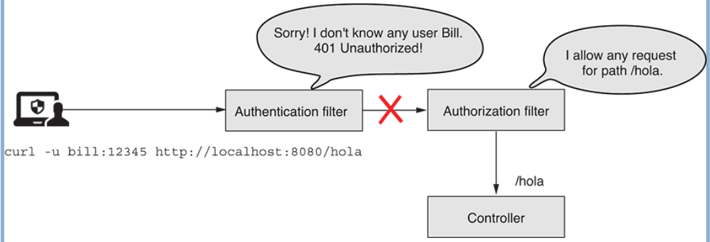
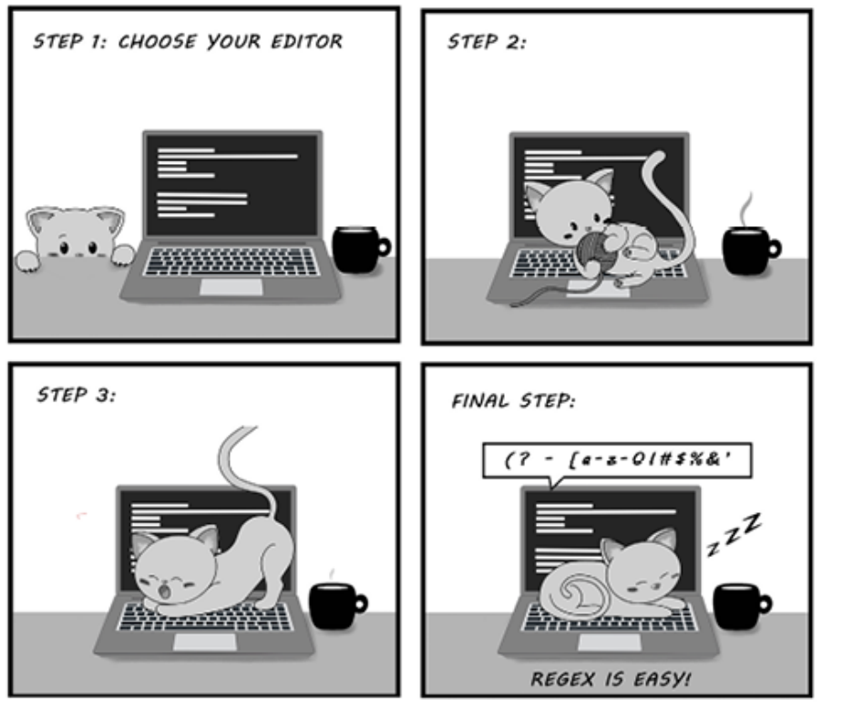

# 8. Cấu hình authorization ở mức endpoint: Áp dụng các hạn chế

> Bản dịch tiếng Việt của chương 8 — *Spring Security in Action, Second Edition* (Laurentiu Spilca, Manning).

**Nội dung chương này bao gồm:**

- Chọn lựa request để áp dụng hạn chế bằng các matcher method
- Tìm hiểu tình huống phù hợp nhất cho từng matcher method

Ở chương 7, bạn đã học cách cấu hình quyền truy cập dựa trên authority (quyền hạn) và role (vai trò). Nhưng chúng ta chỉ áp dụng cấu hình cho tất cả endpoint. Trong chương này, bạn sẽ học cách áp dụng các ràng buộc authorization (phân quyền) lên một nhóm request cụ thể. Trong các ứng dụng production, khả năng bạn áp dụng cùng một quy tắc cho tất cả request là khá thấp. Bạn có những endpoint chỉ có thể được gọi bởi những user cụ thể, trong khi các endpoint khác có thể truy cập được bởi mọi người. Tùy thuộc vào yêu cầu nghiệp vụ, mỗi ứng dụng có cấu hình authorization tùy chỉnh của riêng nó. Hãy bàn về những lựa chọn khả dụng để tham chiếu tới các request khác nhau khi chúng ta viết cấu hình truy cập.

Dù chưa chú ý tới nó, matcher method đầu tiên bạn từng dùng là phương thức `anyRequest()`. Và vì nó đã được dùng ở các chương trước, giờ bạn biết rằng nó tham chiếu tới tất cả request, bất kể path hay HTTP method. Đó là cách để nói "bất kỳ request nào" hoặc đôi khi là "bất kỳ request nào khác".

Trước hết, hãy nói về việc chọn request theo path; sau đó chúng ta cũng có thể thêm HTTP method vào tình huống. Để chọn những request mà chúng ta áp dụng cấu hình authorization lên, chúng ta dùng phương thức `requestMatchers()`.

---

## 8.1 Dùng phương thức `requestMatchers()` để chọn endpoint

Trong mục này, bạn sẽ học cách dùng phương thức `requestMatchers()` một cách tổng quát, để ở các mục 8.2 đến 8.4, chúng ta có thể tiếp tục mô tả những cách tiếp cận khác nhau để chọn các HTTP request mà bạn cần áp dụng hạn chế authorization. Đến cuối chương này, bạn sẽ có thể áp dụng phương thức `requestMatchers()` trong bất kỳ cấu hình authorization nào mà bạn có thể cần viết cho yêu cầu của ứng dụng. Hãy bắt đầu với một ví dụ đơn giản.

Chúng ta tạo một ứng dụng expose hai endpoint: `/hello` và `/ciao`. Chúng ta muốn đảm bảo rằng chỉ những user có role ADMIN mới có thể gọi endpoint `/hello`. Tương tự, chúng ta muốn đảm bảo rằng chỉ những user có role MANAGER mới có thể gọi endpoint `/ciao`. Bạn có thể tìm thấy ví dụ này trong project `ssia-ch8-ex1`. Listing sau đây định nghĩa controller class.

**Listing 8.1 Định nghĩa của controller class**

```java
@RestController
public class HelloController {

  @GetMapping("/hello")
  public String hello() {
    return "Hello!";
  }

  @GetMapping("/ciao")
  public String ciao() {
    return "Ciao!";
  }
}
```

Trong configuration class, chúng ta khai báo một `InMemoryUserDetailsManager` làm instance `UserDetailsService` và thêm hai user với role khác nhau. User John có role ADMIN, trong khi Jane có role MANAGER. Để chỉ định rằng chỉ những user có role ADMIN mới có thể gọi endpoint `/hello` khi authorize các request, chúng ta dùng phương thức `requestMatchers()`. Listing kế tiếp trình bày định nghĩa của configuration class.

**Listing 8.2 Định nghĩa của configuration class**

```java
@Configuration
public class ProjectConfig {

  @Bean
  public UserDetailsService userDetailsService() {
    var manager = new InMemoryUserDetailsManager();

    var user1 = User.withUsername("john")
            .password("12345")
            .roles("ADMIN")
            .build();

    var user2 = User.withUsername("jane")
            .password("12345")
            .roles("MANAGER")
            .build();

    manager.createUser(user1);
    manager.createUser(user2);

    return manager;
  }

  @Bean
  public PasswordEncoder passwordEncoder() {
    return NoOpPasswordEncoder.getInstance();
  }

  @Bean
  public SecurityFilterChain securityFilterChain(HttpSecurity http)
    throws Exception {

    http.httpBasic(Customizer.withDefaults());

    http.authorizeHttpRequests(
      c -> c.requestMatchers("/hello").hasRole("ADMIN")        // ①
            .requestMatchers("/ciao").hasRole("MANAGER")       // ②
    );

    return http.build();
  }
}
```

① Chỉ gọi được path `/hello` nếu user có role ADMIN.

② Chỉ gọi được path `/ciao` nếu user có role MANAGER.

Bạn có thể chạy và test ứng dụng này. Khi gọi endpoint `/hello` với user John, bạn nhận được một response thành công. Nhưng nếu gọi cùng endpoint đó với user Jane, trạng thái response trả về HTTP 403 Forbidden. Tương tự, với endpoint `/ciao`, bạn chỉ có thể dùng Jane để có kết quả thành công. Với user John, trạng thái response trả về HTTP 403 Forbidden. Bạn có thể xem các lời gọi ví dụ dùng cURL trong những đoạn code sau đây. Để gọi endpoint `/hello` cho user John, dùng

```bash
curl -u john:12345 http://localhost:8080/hello
```

Response body là

```
Hello!
```

Để gọi endpoint `/hello` cho user Jane, dùng

```bash
curl -u jane:12345 http://localhost:8080/hello
```

Response body là

```json
{
  "status":403,
  "error":"Forbidden",
  "message":"Forbidden",
  "path":"/hello"
}
```

Để gọi endpoint `/ciao` cho user Jane, dùng

```bash
curl -u jane:12345 http://localhost:8080/ciao
```

Response body là

```
Ciao!
```

Để gọi endpoint `/ciao` cho user John, dùng

```bash
curl -u john:12345 http://localhost:8080/ciao
```

Response body là

```json
{
    "status":403,
    "error":"Forbidden",
    "message":"Forbidden",
    "path":"/ciao"
}
```

Nếu bây giờ bạn thêm bất kỳ endpoint nào khác vào ứng dụng, mặc định nó truy cập được bởi bất kỳ ai, kể cả những user chưa authentication. Giả sử bạn thêm một endpoint mới `/hola` như trình bày ở listing kế tiếp.

**Listing 8.3 Thêm một endpoint mới cho path `/hola` vào ứng dụng**

```java
@RestController
public class HelloController {

  // Phần code được lược bỏ

  @GetMapping("/hola")
  public String hola() {
    return "Hola!";
  }
}
```

Khi bạn truy cập endpoint mới này, bạn thấy rằng nó truy cập được dù có hay không có một user hợp lệ. Các đoạn code sau đây minh họa hành vi này. Để gọi endpoint `/hola` mà không authentication, dùng

```bash
curl http://localhost:8080/hola
```

Response body là

```
Hola!
```

Để gọi endpoint `/hola` cho user John, dùng

```bash
curl -u john:12345 http://localhost:8080/hola
```

Response body là

```
Hola!
```

Bạn có thể làm hành vi này rõ ràng hơn nếu muốn bằng cách dùng phương thức `permitAll()`. Bạn làm điều này bằng cách dùng matcher method `anyRequest()` ở cuối chuỗi cấu hình cho việc authorization request, như trình bày ở listing 8.4.

> **NOTE** Làm cho tất cả các quy tắc của bạn trở nên tường minh là một thực hành tốt. Listing 8.4 chỉ ra một cách rõ ràng và không mơ hồ ý định cho phép request tới endpoint với mọi người, ngoại trừ các endpoint `/hello` và `/ciao`.

**Listing 8.4 Đánh dấu tường minh các request bổ sung là truy cập được mà không cần authentication**

```java
@Configuration
public class ProjectConfig {

  // Phần code được lược bỏ

  @Bean
  public SecurityFilterChain securityFilterChain(HttpSecurity http)
    throws Exception {

    http.httpBasic(Customizer.withDefaults());

    http.authorizeHttpRequests(
       c -> c.requestMatchers("/hello").hasRole("ADMIN")
           .requestMatchers("/ciao").hasRole("MANAGER")
           .anyRequest().permitAll()                     // ①
    );

    return http.build();
  }
}
```

① Phương thức `permitAll()` nêu rằng tất cả các request khác được cho phép mà không cần authentication.

> **NOTE** Khi bạn dùng matcher để tham chiếu tới request, thứ tự các quy tắc nên đi từ cụ thể tới tổng quát. Đây là lý do phương thức `anyRequest()` không thể được gọi trước một phương thức `requestMatchers()` cụ thể hơn.

---

> ### Chưa authentication vs. authentication thất bại
>
> Nếu bạn đã thiết kế một endpoint để truy cập được bởi bất kỳ ai, bạn có thể gọi nó mà không cần cung cấp username và password để authentication. Trong trường hợp này, Spring Security sẽ không thực hiện authentication. Tuy nhiên, nếu bạn cung cấp username và password, Spring Security sẽ đánh giá chúng trong tiến trình authentication. Nếu chúng sai (hệ thống không biết), authentication thất bại, và trạng thái response sẽ là 401 Unauthorized.
>
> Chính xác hơn, nếu bạn gọi endpoint `/hola` với cấu hình trình bày ở listing 8.4, app trả về body `Hola!` như mong đợi, và trạng thái response là 200 OK. Ví dụ:
>
> ```bash
> curl http://localhost:8080/hola
> ```
>
> Response body là
>
> ```
> Hola!
> ```
>
> Tuy nhiên, nếu bạn gọi endpoint với credential không hợp lệ, trạng thái của response là 401 Unauthorized. Ở lời gọi tiếp theo, tôi dùng một password không hợp lệ:
>
> ```bash
> curl -u bill:abcde http://localhost:8080/hola
> ```
>
> Response body là
>
> ```json
> {
>     "status":401,
>     "error":"Unauthorized",
>     "message":"Unauthorized",
>     "path":"/hola"
> }
> ```
>
> Hành vi này có thể trông lạ, nhưng nó hợp lý, bởi framework đánh giá bất kỳ username và password nào nếu bạn cung cấp chúng trong request. Như bạn đã học ở chương 7, ứng dụng luôn thực hiện authentication trước authorization, như hình dưới đây cho thấy.



> Authorization filter cho phép mọi request tới path `/hola`. Tuy nhiên, vì ứng dụng thực thi logic authentication trước, request không bao giờ được chuyển tiếp tới authorization filter. Thay vào đó, authentication filter phản hồi bằng HTTP 401 Unauthorized.
>
> Kết luận, bất kỳ tình huống nào mà authentication thất bại đều sẽ sinh ra một response với trạng thái 401 Unauthorized, và ứng dụng sẽ không chuyển tiếp lời gọi tới endpoint. Phương thức `permitAll()` chỉ liên quan tới cấu hình authorization, và nếu authentication thất bại, lời gọi sẽ không được cho phép đi tiếp.

---

Tất nhiên, bạn có thể quyết định làm cho tất cả các endpoint khác chỉ truy cập được với những user đã authentication. Để làm điều này, bạn sẽ đổi phương thức `permitAll()` thành `authenticated()` như trình bày ở listing sau đây. Tương tự, bạn thậm chí có thể từ chối tất cả các request khác bằng phương thức `denyAll()`.

**Listing 8.5 Làm cho các request khác truy cập được với tất cả user đã authentication**

```java
@Configuration
public class ProjectConfig {

  // Phần code được lược bỏ

  @Bean
  public SecurityFilterChain securityFilterChain(HttpSecurity http)
    throws Exception {

    http.httpBasic(Customizer.withDefaults());

    http.authorizeHttpRequests(
       c -> c.requestMatchers("/hello").hasRole("ADMIN")
           .requestMatchers("/ciao").hasRole("MANAGER")
           .anyRequest().authenticated()                 // ①
    );

    return http.build();
  }
}
```

① Tất cả các request khác chỉ truy cập được bởi những user đã authentication.

Bạn đã trở nên quen thuộc với việc dùng matcher method để tham chiếu tới những request mà bạn muốn cấu hình hạn chế authorization. Giờ chúng ta phải đi sâu hơn vào những cú pháp bạn có thể dùng.

Trong hầu hết các tình huống thực tế, nhiều endpoint có thể có cùng quy tắc authorization, nên bạn không phải thiết lập chúng từng endpoint một. Hơn nữa, đôi khi bạn cần chỉ định HTTP method, chứ không chỉ path, như những gì chúng ta đã làm cho tới giờ.

Những lúc khác, bạn chỉ cần cấu hình quy tắc cho một endpoint khi path của nó được gọi bằng HTTP GET. Trong trường hợp này, bạn cần định nghĩa các quy tắc khác nhau cho HTTP POST và HTTP DELETE. Ở mục tiếp theo, chúng ta xét từng loại matcher method và bàn về những khía cạnh này một cách chi tiết.

---

## 8.2 Chọn request để áp dụng hạn chế authorization

Trong mục này, chúng ta đi sâu vào việc cấu hình request matcher. Dùng phương thức `requestMatchers()` là cách tiếp cận phổ biến để tham chiếu tới request nhằm áp dụng cấu hình authorization. Vì vậy, tôi mong bạn sẽ có nhiều cơ hội dùng phương thức này để tham chiếu tới request trong các ứng dụng bạn phát triển.

Matcher này dùng cú pháp ANT chuẩn (bảng 8.1) để tham chiếu tới các path. Cú pháp này giống với cái bạn dùng khi viết endpoint mapping với các annotation như `@RequestMapping`, `@GetMapping`, `@PostMapping`, v.v. Hai phương thức bạn có thể dùng để khai báo MVC matcher là:

- **`requestMatchers(HttpMethod method, String... patterns)`** — Cho phép bạn chỉ định cả HTTP method mà các hạn chế áp dụng lên lẫn các path. Phương thức này hữu ích nếu bạn muốn áp dụng những hạn chế khác nhau cho các HTTP method khác nhau trên cùng một path.
- **`requestMatchers(String... patterns)`** — Đơn giản và dễ dùng hơn nếu bạn chỉ cần áp dụng hạn chế authorization dựa trên path. Các hạn chế có thể tự động áp dụng cho bất kỳ HTTP method nào được dùng với path đó.

Trong mục này, chúng ta tiếp cận nhiều cách dùng phương thức `requestMatchers()`. Để minh họa điều này, chúng ta bắt đầu bằng cách viết một ứng dụng expose nhiều endpoint.

Lần đầu tiên, chúng ta viết những endpoint có thể được gọi bằng các HTTP method khác ngoài GET. Bạn có thể đã để ý rằng cho tới giờ, tôi đã tránh dùng các HTTP method khác. Lý do là Spring Security mặc định áp dụng bảo vệ chống cross-site request forgery (CSRF). Ở chương 9, chúng ta sẽ bàn cách Spring Security giảm thiểu lỗ hổng này bằng CSRF token. Nhưng để mọi thứ đơn giản hơn cho ví dụ hiện tại và để có thể gọi tất cả endpoint, bao gồm cả những endpoint expose bằng POST, PUT, hoặc DELETE, chúng ta cần tắt bảo vệ CSRF trong phương thức `securityFilterChain()`:

```java
http.csrf(
  c -> c.disable()
);
```

> **NOTE** Chúng ta tắt bảo vệ CSRF lúc này chỉ để bạn tập trung tạm thời vào chủ đề đang bàn: matcher method. Nhưng đừng vội coi đây là một cách tiếp cận tốt. Ở chương 9, chúng ta sẽ nói chi tiết về bảo vệ CSRF do Spring Security cung cấp.

Chúng ta bắt đầu bằng cách định nghĩa bốn endpoint để dùng trong các bài test:

- `/a` dùng HTTP method GET
- `/a` dùng HTTP method POST
- `/a/b` dùng HTTP method GET
- `/a/b/c` dùng HTTP method GET

Với những endpoint này, chúng ta có thể xét các tình huống khác nhau cho cấu hình authorization. Listing kế tiếp cung cấp định nghĩa của những endpoint này. Bạn có thể tìm thấy ví dụ này trong project `ssia-ch8-ex2`.

**Listing 8.6 Định nghĩa bốn endpoint mà chúng ta cấu hình authorization cho chúng**

```java
@RestController
public class TestController {

  @PostMapping("/a")
  public String postEndpointA() {
    return "Works!";
  }

  @GetMapping("/a")
  public String getEndpointA() {
    return "Works!";
  }

  @GetMapping("/a/b")
  public String getEnpointB() {
    return "Works!";
  }

  @GetMapping("/a/b/c")
  public String getEnpointC() {
    return "Works!";
  }
}
```

Chúng ta cũng cần vài user với role khác nhau. Để giữ mọi thứ đơn giản, chúng ta tiếp tục dùng một `InMemoryUserDetailsManager`. Ở listing kế tiếp, bạn có thể thấy định nghĩa của `UserDetailsService` trong configuration class.

**Listing 8.7 Định nghĩa của `UserDetailsService`**

```java
@Configuration
public class ProjectConfig {

  @Bean
  public UserDetailsService userDetailsService() {
    var manager = new InMemoryUserDetailsManager();    // ①

    var user1 = User.withUsername("john")
            .password("12345")
            .roles("ADMIN")                            // ②
            .build();

    var user2 = User.withUsername("jane")
            .password("12345")
            .roles("MANAGER")                          // ③
            .build();

    manager.createUser(user1);
    manager.createUser(user2);

    return manager;
  }

  @Bean
  public PasswordEncoder passwordEncoder() {
    return NoOpPasswordEncoder.getInstance();          // ④
  }
}
```

① Định nghĩa một `InMemoryUserDetailsManager` để lưu user.

② User John có role ADMIN.

③ User Jane có role MANAGER.

④ Đừng quên bạn cũng cần thêm một `PasswordEncoder`.

Hãy bắt đầu với tình huống đầu tiên. Với những request thực hiện bằng HTTP method GET cho path `/a`, ứng dụng cần authentication user. Với cùng path đó, các request dùng HTTP method POST không yêu cầu authentication. Ứng dụng từ chối tất cả các request khác. Listing sau đây cho thấy những cấu hình bạn cần viết để đạt được thiết lập này.

**Listing 8.8 Cấu hình authorization cho tình huống đầu tiên, `/a`**

```java
@Configuration
public class ProjectConfig {

  // Phần code được lược bỏ

  @Bean
  public SecurityFilterChain securityFilterChain(HttpSecurity http)
    throws Exception {

    http.httpBasic(Customizer.withDefaults());

    http.authorizeHttpRequests(
      c -> c.requestMatchers(HttpMethod.GET, "/a")
               .authenticated()                       // ①
            .requestMatchers(HttpMethod.POST, "/a")
               .permitAll()                           // ②
            .anyRequest()
               .denyAll()                             // ③
    );

    http.csrf(
      c -> c.disable()
    );                                                // ④

    return http.build();
  }
}
```

① Với các request path `/a` được gọi bằng HTTP method GET, app cần authentication user.

② Cho phép mọi người gọi request path `/a` bằng HTTP method POST.

③ Từ chối bất kỳ request nào khác tới bất kỳ path nào khác.

④ Tắt CSRF để cho phép gọi path `/a` bằng HTTP method POST.

Trong các đoạn code sau đây, chúng ta phân tích kết quả của các lời gọi tới endpoint với cấu hình trình bày ở listing 8.8. Với lời gọi tới path `/a` bằng HTTP method POST mà không authentication, dùng lệnh cURL này:

```bash
curl -XPOST http://localhost:8080/a
```

Response body là

```
Works!
```

Khi gọi path `/a` bằng HTTP GET mà không authentication, dùng

```bash
curl -XGET http://localhost:8080/a
```

Response là

```json
{
  "status":401,
  "error":"Unauthorized",
  "message":"Unauthorized",
  "path":"/a"
}
```

Nếu bạn muốn đổi response thành thành công, bạn cần authentication với một user hợp lệ. Với lời gọi sau đây

```bash
curl -u john:12345 -XGET http://localhost:8080/a
```

response body là

```
Works!
```

Tuy nhiên, user John không được phép gọi path `/a/b`, nên việc authentication bằng credential của anh ta cho lời gọi này sinh ra 403 Forbidden:

```bash
curl -u john:12345 -XGET http://localhost:8080/a/b
```

Response là

```json
{
  "status":403,
  "error":"Forbidden",
  "message":"Forbidden",
  "path":"/a/b"
}
```

Với ví dụ này, giờ bạn biết cách phân biệt request dựa trên HTTP method. Nhưng nếu nhiều path có cùng quy tắc authorization thì sao? Tất nhiên, chúng ta có thể liệt kê tất cả các path mà chúng ta áp dụng quy tắc authorization lên; tuy nhiên, nếu chúng ta có quá nhiều path, điều này khiến việc đọc code trở nên khó chịu. Ngoài ra, chúng ta có thể biết ngay từ đầu rằng một nhóm path có cùng prefix luôn có cùng quy tắc authorization. Chúng ta muốn đảm bảo rằng việc thêm một path mới vào cùng nhóm cũng không làm thay đổi cấu hình authorization. Để quản lý những trường hợp này, chúng ta dùng path expression. Hãy chứng minh điều này qua một ví dụ.

Với project hiện tại, chúng ta muốn đảm bảo rằng cùng các quy tắc áp dụng cho tất cả request tới những path bắt đầu bằng `/a/b`. Các path này trong trường hợp của chúng ta là `/a/b` và `/a/b/c`. Để đạt được điều này, chúng ta dùng toán tử `**`. Bạn có thể tìm thấy ví dụ này trong project `ssia-ch8-ex3`.

**Listing 8.9 Các thay đổi trong configuration class cho nhiều path**

```java
@Configuration
public class ProjectConfig {

  // Phần code được lược bỏ

  @Bean
  public SecurityFilterChain securityFilterChain(HttpSecurity http)
    throws Exception {

    http.httpBasic(Customizer.withDefaults());

    http.authorizeHttpRequests(
      c -> c.requestMatchers("/a/b/**").authenticated()     // ①
            .anyRequest().permitAll()
    );

    http.csrf(
      c -> c.disable()
    );

    return http.build();
  }
}
```

① Biểu thức `/a/b/**` tham chiếu tới tất cả path có prefix `/a/b`.

Với cấu hình cho ở listing 8.9, bạn có thể gọi path `/a` mà không cần authentication, nhưng với tất cả các path có prefix `/a/b`, ứng dụng cần authentication user. Các đoạn code sau đây trình bày kết quả của việc gọi các endpoint `/a`, `/a/b`, và `/a/b/c`. Trước hết, để gọi path `/a` mà không authentication, dùng

```bash
curl http://localhost:8080/a
```

Response body là

```
Works!
```

Để gọi path `/a/b` mà không authentication, dùng

```bash
curl http://localhost:8080/a/b
```

Response là

```json
{
  "status":401,
  "error":"Unauthorized",
  "message":"Unauthorized",
  "path":"/a/b"
}
```

Để gọi path `/a/b/c` mà không authentication, dùng

```bash
curl http://localhost:8080/a/b/c
```

Response là

```json
{
  "status":401,
  "error":"Unauthorized",
  "message":"Unauthorized",
  "path":"/a/b/c"
}
```

Như trình bày trong các ví dụ trước, toán tử `**` tham chiếu tới bất kỳ số lượng pathname nào. Bạn có thể dùng nó như chúng ta đã làm trong ví dụ cuối để khớp các request có path với prefix đã biết. Bạn cũng có thể dùng nó ở giữa một path để tham chiếu tới bất kỳ số lượng pathname nào hoặc để tham chiếu tới các path kết thúc bằng một pattern cụ thể, chẳng hạn `/a/**/c`. Do đó, `/a/**/c` sẽ không chỉ khớp `/a/b/c` mà còn khớp `/a/b/d/c` và `a/b/c/d/e/c` và cứ thế. Nếu bạn chỉ muốn khớp một pathname, thì bạn có thể dùng một dấu `*` duy nhất. Ví dụ, `a/*/c` sẽ khớp `a/b/c` và `a/d/c` nhưng không khớp `a/b/d/c`.

Vì bạn thường dùng path variable, chúng có thể hữu ích để áp dụng quy tắc authorization cho những request như vậy. Bạn thậm chí có thể áp dụng quy tắc tham chiếu tới giá trị của path variable. Bạn có nhớ phần thảo luận ở mục 8.1 về phương thức `denyAll()` và việc chặn tất cả request không?

Giờ hãy chuyển sang một ví dụ phù hợp hơn cho những gì bạn đã học trong mục này. Chúng ta có một endpoint với một path variable, và chúng ta muốn từ chối tất cả request dùng giá trị cho path variable có bất cứ thứ gì khác ngoài chữ số. Bạn có thể tìm thấy ví dụ này trong project `ssia-ch8-ex4`. Listing sau đây trình bày controller.

**Listing 8.10 Định nghĩa một endpoint với path variable trong controller class**

```java
@RestController
public class ProductController {

  @GetMapping("/product/{code}")
  public String productCode(@PathVariable String code) {
    return code;
  }
}
```

Listing kế tiếp cho thấy cách cấu hình authorization sao cho chỉ những lời gọi có giá trị chỉ chứa chữ số mới luôn được cho phép, trong khi tất cả các lời gọi khác bị từ chối.

**Listing 8.11 Cấu hình authorization để chỉ cho phép chữ số cụ thể**

```java
@Configuration
public class ProjectConfig {

  @Bean
  public SecurityFilterChain securityFilterChain(HttpSecurity http)
    throws Exception {

    http.httpBasic(Customizer.withDefaults());

    http.authorizeHttpRequests(
      c -> c.requestMatchers("/product/{code:^[0-9]*$}")        // ①
              .permitAll()
         .anyRequest()
              .denyAll()
    );

    return http.build();
  }
}
```

① Regex tham chiếu tới các chuỗi có độ dài bất kỳ, chứa bất kỳ chữ số nào.

> **NOTE** Khi dùng biểu thức tham số với một regex, hãy đảm bảo không có khoảng trắng giữa tên tham số, dấu hai chấm (`:`), và regex, như hiển thị trong listing.

Chạy ví dụ này, bạn có thể thấy kết quả như trình bày ở các đoạn code sau đây. Ứng dụng chỉ chấp nhận lời gọi khi giá trị path variable chỉ có chữ số. Để gọi endpoint bằng giá trị `1234a`, dùng

```bash
curl http://localhost:8080/product/1234a
```

Response là

```json
{
  "status":401,
  "error":"Unauthorized",
  "message":"Unauthorized",
  "path":"/product/1234a"
}
```

Để gọi endpoint với giá trị `12345`, dùng

```bash
curl http://localhost:8080/product/12345
```

Response là

```
12345
```

Chúng ta đã bàn kỹ và đưa ra rất nhiều ví dụ về cách tham chiếu tới request bằng phương thức `requestMatchers()`. Bảng 8.1 là phần ôn lại cho các path expression được dùng trong mục này. Bạn có thể tham khảo nó sau này khi muốn nhớ lại bất kỳ cái nào trong số đó.

**Bảng 8.1** Các biểu thức thường dùng cho việc khớp path với MVC matcher

| Biểu thức | Mô tả |
| --- | --- |
| `/a` | Chỉ path `/a`. |
| `/a/*` | Toán tử `*` thay thế một pathname. Trong trường hợp này, nó khớp `/a/b` hoặc `/a/c`, nhưng không khớp `/a/b/c`. |
| `/a/**` | Toán tử `**` thay thế nhiều pathname. Trong trường hợp này, `/a`, `/a/b`, và `/a/b/c` đều khớp với biểu thức này. |
| `/a/{param}` | Biểu thức này áp dụng cho path `/a` với một path parameter cho trước. |
| `/a/{param:regex}` | Biểu thức này áp dụng cho path `/a` với một path parameter cho trước chỉ khi giá trị của tham số khớp với biểu thức chính quy đã cho. |

---

## 8.3 Dùng biểu thức chính quy với request matcher

Mục này bàn về biểu thức chính quy (regular expression — regex). Bạn hẳn đã biết biểu thức chính quy là gì, nhưng bạn không cần phải là chuyên gia về chủ đề này. Bất kỳ cuốn sách nào được khuyến nghị tại <https://www.regular-expressions.info/books.html> đều là tài nguyên tuyệt vời để bạn tìm hiểu sâu hơn về chủ đề này. Để viết regex, tôi cũng thường dùng các trình sinh trực tuyến như <https://regexr.com/> (hình 8.1).



**Hình 8.1** Để mèo của bạn nghịch bàn phím không phải là giải pháp tốt nhất để sinh biểu thức chính quy (regex). Để học cách sinh regex, bạn có thể dùng một trình sinh trực tuyến như <https://regexr.com/>.

Mục 8.2 và 8.3 đã cho thấy rằng trong hầu hết trường hợp, có thể dùng cú pháp path expression để tham chiếu tới những request mà bạn áp dụng cấu hình authorization lên. Tuy nhiên, trong một số trường hợp, bạn có thể có những yêu cầu đặc thù hơn, và bạn không thể giải quyết chúng bằng path expression. Một ví dụ về yêu cầu như vậy có thể là: "Từ chối tất cả request khi path chứa các ký hiệu hoặc ký tự cụ thể." Với những tình huống này, bạn cần dùng một biểu thức mạnh hơn như regex.

Bạn có thể dùng regex để biểu diễn bất kỳ định dạng nào của một chuỗi, nên chúng mang lại khả năng vô hạn cho vấn đề này. Tuy nhiên, chúng có nhược điểm là khó đọc, ngay cả khi áp dụng cho những tình huống đơn giản. Vì lý do này, bạn có thể thích dùng path expression hơn và chỉ quay lại dùng regex khi bạn không còn lựa chọn nào khác. Để hiện thực một regex request matcher, bạn có thể dùng phương thức `requestMatchers()` với một hiện thực `RegexRequestMatcher` làm tham số.

Để cho thấy regex matcher hoạt động thế nào, hãy đưa chúng vào thực hành bằng cách xây dựng một ứng dụng cung cấp nội dung video cho user. Ứng dụng trình bày video lấy nội dung bằng cách gọi endpoint `/video/{country}/{language}`. Vì mục đích của ví dụ, ứng dụng nhận quốc gia và ngôn ngữ trong hai path variable từ nơi user thực hiện request. Chúng ta xem như bất kỳ user đã authentication nào cũng có thể xem nội dung video nếu request đến từ Hoa Kỳ, Canada, hoặc Vương quốc Anh, hoặc nếu họ dùng tiếng Anh.

Bạn có thể tìm thấy ví dụ này được hiện thực trong project `ssia-ch8-ex5`. Endpoint mà chúng ta cần bảo vệ có hai path variable, như trình bày ở listing sau đây. Điều này khiến yêu cầu trở nên phức tạp để hiện thực với request matcher.

**Listing 8.12 Định nghĩa endpoint cho controller class**

```java
@RestController
public class VideoController {

  @GetMapping("/video/{country}/{language}")
  public String video(@PathVariable String country,
                      @PathVariable String language) {
    return "Video allowed for " + country + " " + language;
  }
}
```

Với một điều kiện trên một path variable duy nhất, chúng ta có thể viết regex trực tiếp trong path expression. Chúng ta đã tham chiếu tới một ví dụ như vậy ở mục 8.2, nhưng lúc đó tôi chưa đi vào chi tiết vì chúng ta chưa bàn về regex. Hãy giả sử bạn có endpoint `/email/{email}`. Bạn muốn áp dụng một quy tắc bằng matcher chỉ cho những request gửi địa chỉ kết thúc bằng `.com` làm giá trị của tham số email. Trong trường hợp đó, bạn viết một request matcher như trình bày ở đoạn code kế tiếp. Bạn có thể tìm thấy ví dụ đầy đủ trong project `ssia-ch8-ex6`:

```java
http.authorizeHttpRequests(
   c -> c.requestMatchers("/email/{email:.*(?:.+@.+\\.com)}").permitAll()
         .anyRequest().denyAll()
);
```

Nếu bạn test một hạn chế như vậy, bạn có thể thấy rằng ứng dụng chỉ chấp nhận những email kết thúc bằng `.com`. Ví dụ, để gọi endpoint tới `jane@example.com`, bạn có thể dùng

```bash
curl http://localhost:8080/email/jane@example.com
```

Response body là

```
Allowed for email jane@example.com
```

Và để gọi endpoint tới `jane@example.net`, bạn dùng

```bash
curl http://localhost:8080/email/jane@example.net
```

Response body là

```json
{
  "status":401,
  "error":"Unauthorized",
  "message":"Unauthorized",
  "path":"/email/jane@example.net"
}
```

Nó khá dễ và thậm chí làm rõ hơn tại sao chúng ta ít gặp regex matcher hơn. Tuy nhiên, như tôi đã nói trước đó, các yêu cầu đôi khi phức tạp. Bạn sẽ thấy dùng regex matcher tiện hơn khi gặp những thứ như sau:

- Cấu hình cụ thể cho tất cả path chứa số điện thoại hoặc địa chỉ email
- Cấu hình cụ thể cho tất cả path có một định dạng nhất định, bao gồm cả những gì được gửi qua tất cả các path variable

Quay lại ví dụ regex matcher của chúng ta (`ssia-ch8-ex6`): khi bạn cần viết một quy tắc phức tạp hơn, cuối cùng tham chiếu tới nhiều path pattern và nhiều giá trị path variable, việc viết một regex matcher sẽ dễ hơn. Listing 8.13 trình bày định nghĩa cho configuration class dùng một regex matcher để giải quyết yêu cầu đã đưa ra cho path `/video/{country}/{language}`. Chúng ta cũng thêm hai user với authority khác nhau để test hiện thực.

**Listing 8.13 Configuration class dùng regex matcher**

```java
@Configuration
public class ProjectConfig {

  @Bean
  public UserDetailsService userDetailsService() {
    var uds = new InMemoryUserDetailsManager();

    var u1 = User.withUsername("john")
                 .password("12345")
                 .authorities("read")
                 .build();

    var u2 = User.withUsername("jane")
                .password("12345")
                .authorities("read", "premium")
                .build();

    uds.createUser(u1);
    uds.createUser(u2);

    return uds;
  }

  @Bean
  public PasswordEncoder passwordEncoder() {
    return NoOpPasswordEncoder.getInstance();
  }

  @Bean
  public SecurityFilterChain securityFilterChain(HttpSecurity http)
    throws Exception {

    http.httpBasic(Customizer.withDefaults());

    http.authorizeHttpRequests(
      c -> c.regexMatchers(".*/(us|uk|ca)+/(en|fr).*")    // ①
                .authenticated()
            .anyRequest()
                .hasAuthority("premium")                  // ②
    );

    return http.build();
  }
}
```

① Chúng ta dùng một regex để khớp các path mà ở đó user chỉ cần được authentication.

② Cấu hình các path khác mà ở đó user cần có quyền truy cập premium.

> **Ghi chú của người dịch:** Listing 8.13 trong sách gốc có vài lỗi đánh máy: thiếu `return http.build();`, có dấu `;` thừa bên trong lambda, và dùng `regexMatchers(...)` trong khi phần văn bản ngay trên lại nói dùng `requestMatchers()` với một `RegexRequestMatcher`. Trên Spring Security 6, `regexMatchers()` đã bị loại bỏ; cách viết tương đương là `requestMatchers(new RegexRequestMatcher(".*/(us|uk|ca)+/(en|fr).*", null))`. Tôi đã bổ sung `return http.build();` và bỏ dấu `;` thừa để đoạn code biên dịch được, nhưng giữ nguyên tên `regexMatchers` đúng như bản gốc.

Chạy và test các endpoint xác nhận rằng ứng dụng đã áp dụng cấu hình authorization đúng cách. User John có thể gọi endpoint với mã quốc gia `US` và ngôn ngữ `en`, nhưng anh ta không thể gọi endpoint cho mã quốc gia `FR` và ngôn ngữ `fr` do các hạn chế mà chúng ta đã cấu hình. Gọi endpoint `/video` và authentication user John cho khu vực US và ngôn ngữ English trông như thế này:

```bash
curl -u john:12345 http://localhost:8080/video/us/en
```

Response body là

```
Video allowed for us en
```

Gọi endpoint `/video` và authentication user John cho khu vực FR và ngôn ngữ French trông như thế này:

```bash
curl -u john:12345 http://localhost:8080/video/fr/fr
```

Response body là

```json
{
  "status":403,
  "error":"Forbidden",
  "message":"Forbidden",
  "path":"/video/fr/fr"
}
```

Có authority premium, user Jane thực hiện cả hai lời gọi đều thành công. Với lời gọi đầu tiên

```bash
curl -u jane:12345 http://localhost:8080/video/us/en
```

response body là

```
Video allowed for us en
```

Với lời gọi thứ hai

```bash
curl -u jane:12345 http://localhost:8080/video/fr/fr
```

response body là

```
Video allowed for fr fr
```

Regex là công cụ mạnh mẽ. Bạn có thể dùng chúng để tham chiếu tới path cho bất kỳ yêu cầu nào. Tuy nhiên, vì regex khó đọc và có thể trở nên khá dài, chúng nên là lựa chọn cuối cùng của bạn. Chỉ dùng chúng nếu path expression không mang lại giải pháp cho vấn đề của bạn.

Trong mục này, tôi đã dùng ví dụ đơn giản nhất mà tôi có thể hình dung để regex cần thiết là ngắn. Nhưng trong những tình huống phức tạp hơn, regex có thể trở nên dài hơn nhiều. Tất nhiên, bạn sẽ gặp những chuyên gia nói rằng bất kỳ regex nào cũng dễ đọc. Ví dụ, một regex dùng để khớp địa chỉ email có thể trông như đoạn code kế tiếp. Bạn có đọc và hiểu nó một cách dễ dàng không?

```
(?:[a-z0-9!#$%&'*+/=?^_`{|}~-]+(?:\.[a-z0-9!#$%&'*+/=?^_`{|}~-
]+)*|"(?:[\x01-\x08\x0b\x0c\x0e-\x1f\x21\x23-\x5b\x5d-\x7f]|\\[\x01-
\x09\x0b\x0c\x0e-\x7f])*")@(?:(?:[a-z0-9](?:[a-z0-9-]*[a-z0-9])?\.)+[a
-9](?:[a-z0-9-]*[a-z0-9])?|\[(?:(?:25[0-5]|2[0-4][0-9]|[01]?[0-9][0
-9]?)\.){3}(?:25[0-5]|2[0-4][0-9]|[01]?[0-9][0-9]?|[a-z0-9-]*[a-z0
-9]:(?:[\x01-\x08\x0b\x0c\x0e-\x1f\x21-\x5a\x53-\x7f]|\\[\x01-
\x09\x0b\x0c\x0e-\x7f])+)\])
```

---

## Tóm tắt

- Trong các tình huống thực tế, những quy tắc authorization khác nhau được áp dụng cho những request khác nhau.
- Các request mà quy tắc authorization được cấu hình cho chúng được chỉ định dựa trên path và HTTP method. Để làm điều này, bạn dùng phương thức `requestMatchers()`.
- Khi các yêu cầu quá phức tạp để giải quyết bằng path expression, bạn có thể hiện thực chúng bằng những regex mạnh mẽ hơn.
