# 9. Cấu hình bảo vệ CSRF (Configuring CSRF protection)

> Bản dịch tiếng Việt của chương 9 — *Spring Security in Action, Second Edition* (Laurentiu Spilca, Manning).

**Nội dung chương này bao gồm:**

- Hiểu về tấn công CSRF
- Hiện thực bảo vệ CSRF
- Tùy chỉnh bảo vệ CSRF

Bạn đã học về filter chain và mục đích của nó trong kiến trúc Spring Security. Chúng ta đã làm vài ví dụ ở chương 5, nơi chúng ta tùy chỉnh filter chain. Nhưng Spring Security cũng thêm các filter của riêng nó vào chuỗi. Chương này bàn về filter cấu hình bảo vệ CSRF (cross-site request forgery — giả mạo request xuyên trang). Bạn sẽ học cách tùy chỉnh các filter để chúng phù hợp hoàn hảo với tình huống của bạn.

Có lẽ bạn đã quan sát thấy rằng trong hầu hết các ví dụ cho tới giờ, chúng ta chỉ hiện thực endpoint bằng HTTP GET. Hơn nữa, khi cần cấu hình HTTP POST, chúng ta cũng phải thêm một chỉ thị bổ sung vào cấu hình để tắt bảo vệ CSRF. Lý do bạn không thể gọi trực tiếp một endpoint bằng HTTP POST là vì bảo vệ CSRF, vốn được bật mặc định trong Spring Security.

Giờ chúng ta sẽ bàn về bảo vệ CSRF và khi nào nên dùng nó trong ứng dụng của bạn. CSRF là một loại tấn công phổ biến rộng rãi, và những ứng dụng dễ bị tổn thương có thể buộc user thực hiện những hành động không mong muốn trên một web application sau khi authentication (xác thực). Bạn không muốn những ứng dụng mình phát triển bị tổn thương bởi CSRF và cho phép kẻ tấn công lừa user của bạn thực hiện những hành động không mong muốn.

Vì việc hiểu cách giảm thiểu những lỗ hổng này là thiết yếu, chúng ta bắt đầu bằng việc xem lại CSRF là gì và nó hoạt động ra sao. Sau đó chúng ta bàn về cơ chế CSRF token mà Spring Security dùng để giảm thiểu các lỗ hổng CSRF. Chúng ta tiếp tục với việc lấy một token và dùng nó để gọi một endpoint bằng HTTP POST method. Chúng ta chứng minh điều này bằng một ứng dụng nhỏ với các REST endpoint. Khi bạn đã học cách Spring Security hiện thực cơ chế CSRF token của nó, chúng ta bàn cách dùng nó trong các tình huống ứng dụng thực tế. Cuối cùng, bạn sẽ học những tùy chỉnh khả dĩ của cơ chế CSRF token trong Spring Security.

---

## 9.1 Bảo vệ CSRF hoạt động thế nào trong Spring Security

Mục này bàn về cách Spring Security hiện thực bảo vệ CSRF. Điều thiết yếu trước hết là hiểu cơ chế nền tảng của bảo vệ CSRF. Tôi gặp nhiều tình huống mà việc hiểu sai cách bảo vệ CSRF hoạt động dẫn tới việc dùng sai nó, hoặc vì nó bị tắt trong những tình huống lẽ ra nên bật, hoặc ngược lại. Như bất kỳ tính năng nào khác trong một framework, bạn phải dùng nó đúng cách để mang lại giá trị cho ứng dụng.

Ví dụ, hãy xét tình huống này (hình 9.1): bạn đang ở nơi làm việc, dùng một công cụ web để lưu trữ và quản lý file của mình. Với công cụ này, trong một giao diện web, bạn có thể thêm file mới, thêm phiên bản mới cho các bản ghi, và thậm chí xóa chúng. Bạn nhận một email yêu cầu bạn mở một trang vì một lý do cụ thể (ví dụ, một chương trình khuyến mãi ở cửa hàng yêu thích của bạn). Bạn mở trang đó, nhưng trang trống rỗng, hoặc nó chuyển hướng bạn tới một website quen thuộc (cửa hàng trực tuyến yêu thích của bạn). Bạn quay lại công việc và phát hiện tất cả các file của mình đã biến mất!

Điều gì đã xảy ra? Bạn đã đăng nhập vào ứng dụng công việc của mình để có thể quản lý file. Khi bạn thêm, sửa, hoặc xóa một file, trang web mà bạn tương tác gọi một số endpoint từ server để thực thi những thao tác đó. Khi bạn mở trang lạ bằng cách click vào đường link không quen thuộc trong email, trang đó đã gọi backend của app bạn và thực thi hành động thay mặt bạn (tức là, nó đã xóa file của bạn).

Nó có thể làm vậy vì bạn đã đăng nhập trước đó, nên server tin rằng những hành động đó đến từ bạn. Bạn có thể nghĩ rằng không ai có thể lừa bạn dễ dàng như vậy để click vào một đường link từ email hay tin nhắn lạ, nhưng tin tôi đi, điều này xảy ra với rất nhiều người. Hầu hết user của web app không nhận thức được các rủi ro bảo mật. Vì vậy sẽ khôn ngoan hơn nếu bạn, người biết tất cả các mánh khóe, bảo vệ user của mình và xây dựng các app an toàn thay vì dựa vào việc user của app tự bảo vệ mình.

Tấn công CSRF giả định rằng một user đã đăng nhập vào một web application. Kẻ tấn công lừa user mở một trang chứa script thực thi các hành động trong chính ứng dụng mà user đang làm việc. Vì user đã đăng nhập rồi (như chúng ta đã giả định từ đầu), đoạn code giả mạo giờ có thể mạo danh user và thực hiện hành động thay mặt họ.

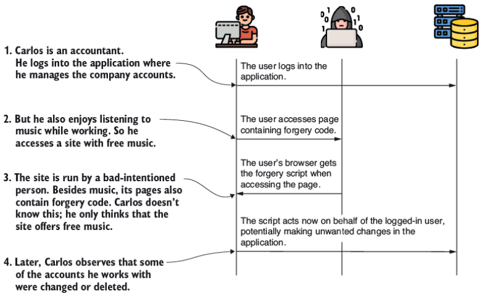

**Hình 9.1** Sau khi user đăng nhập vào tài khoản của mình, họ truy cập một trang chứa code giả mạo. Code này mạo danh user và có thể thực thi những hành động không mong muốn thay mặt user.

Làm sao chúng ta bảo vệ user khỏi những tình huống như vậy? Bảo vệ CSRF nhằm đảm bảo rằng chỉ frontend của web application mới có thể thực hiện các thao tác biến đổi dữ liệu (theo quy ước, các HTTP method khác GET, HEAD, TRACE, hoặc OPTIONS). Khi đó một trang lạ, như trang trong ví dụ của chúng ta, không thể hành động thay mặt user.

Làm sao chúng ta đạt được điều này? Điều bạn biết chắc chắn là trước khi có thể thực hiện bất kỳ hành động nào có thể thay đổi dữ liệu, một user phải gửi một request bằng HTTP GET để xem trang web ít nhất một lần. Khi điều này xảy ra, ứng dụng sinh ra một token duy nhất. Ứng dụng giờ chỉ chấp nhận những request cho các thao tác biến đổi dữ liệu (POST, PUT, DELETE, v.v.) có chứa giá trị duy nhất này trong header.

Ứng dụng coi việc biết giá trị của token là bằng chứng rằng chính app đang thực hiện request biến đổi chứ không phải hệ thống khác. Bất kỳ trang nào chứa các lời gọi biến đổi dữ liệu, chẳng hạn POST, PUT, DELETE, v.v., đều nên nhận CSRF token qua response, và trang phải dùng token này khi thực hiện các lời gọi biến đổi.

Điểm khởi đầu của bảo vệ CSRF là một filter trong filter chain tên là `CsrfFilter`. `CsrfFilter` chặn các request và cho phép tất cả những request dùng các HTTP method sau: GET, HEAD, TRACE, và OPTIONS. Với tất cả các request khác, filter mong đợi nhận được một header chứa token. Nếu header này không tồn tại hoặc chứa giá trị token sai, ứng dụng từ chối request và đặt trạng thái response thành HTTP 403 Forbidden.

Token này là gì, và nó đến từ đâu? Những token này chẳng qua chỉ là các giá trị chuỗi. Bạn phải thêm token vào header của request khi bạn dùng bất kỳ method nào khác GET, HEAD, TRACE, hoặc OPTIONS. Nếu bạn không làm điều này, ứng dụng sẽ không chấp nhận request, như trình bày ở hình 9.2.

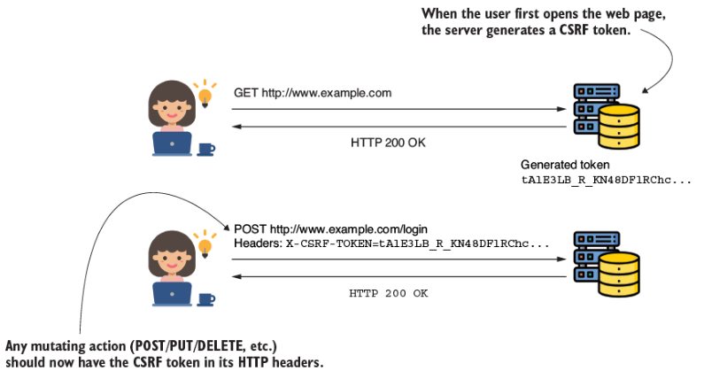

**Hình 9.2** Để thực hiện một POST request, client cần thêm một header chứa CSRF token. Ứng dụng sinh ra một CSRF token khi trang được nạp (qua một GET request), và token được thêm vào tất cả các request có thể được thực hiện từ trang đã nạp. Bằng cách này, chỉ trang đã nạp mới có thể thực hiện các request biến đổi dữ liệu.

`CsrfFilter` (hình 9.3) sử dụng một component tên là `CsrfTokenRepository` để quản lý các giá trị CSRF token — sinh token mới, lưu token, và cuối cùng là vô hiệu hóa chúng. Mặc định, `CsrfTokenRepository` lưu token trên HTTP session và sinh token dưới dạng các giá trị chuỗi ngẫu nhiên. Trong hầu hết trường hợp, như vậy là đủ, nhưng như bạn sẽ học ở mục 9.3, bạn có thể dùng hiện thực `CsrfTokenRepository` của riêng mình nếu cái mặc định không phù hợp với yêu cầu bạn cần hiện thực.

Trong mục này, tôi đã giải thích cách bảo vệ CSRF hoạt động trong Spring Security với rất nhiều chữ và hình. Nhưng tôi muốn củng cố hiểu biết của bạn bằng một ví dụ code nhỏ nữa. Bạn sẽ tìm thấy code này như một phần của project tên là `ssia-ch9-ex1`. Hãy tạo một ứng dụng expose hai endpoint. Chúng ta có thể gọi một trong số đó bằng HTTP GET và cái kia bằng HTTP POST.

Như bạn đã biết, bạn không thể gọi trực tiếp endpoint bằng POST mà không tắt bảo vệ CSRF. Trong ví dụ này, bạn học cách gọi endpoint POST mà không tắt bảo vệ CSRF. Bạn cần lấy CSRF token để có thể dùng nó trong header của lời gọi, thứ bạn thực hiện bằng HTTP POST.

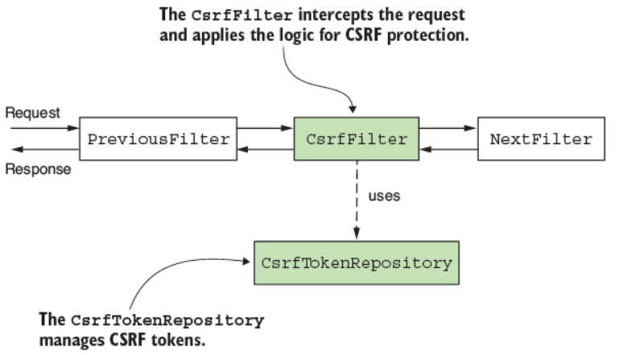

**Hình 9.3** `CsrfFilter` là một trong các filter trong filter chain. Nó nhận request và cuối cùng chuyển tiếp nó tới filter kế tiếp trong chuỗi. Để quản lý CSRF token, `CsrfFilter` dùng một `CsrfTokenRepository`.

Như bạn học được từ ví dụ này, `CsrfFilter` thêm CSRF token được sinh ra vào thuộc tính của HTTP request tên là `_csrf` (hình 9.4). Nếu biết điều này, chúng ta biết rằng sau `CsrfFilter`, chúng ta có thể tìm thuộc tính này và lấy giá trị token từ nó. Với ứng dụng nhỏ này, chúng ta chọn thêm một filter tùy chỉnh sau `CsrfFilter`, như bạn đã học ở chương 5. Bạn dùng filter tùy chỉnh này để in CSRF token ra console của ứng dụng — token mà app sinh ra khi chúng ta gọi endpoint bằng HTTP GET. Sau đó chúng ta có thể copy giá trị token từ console và dùng nó để thực hiện lời gọi biến đổi bằng HTTP POST. Ở listing 9.1, bạn có thể tìm thấy định nghĩa của controller class với hai endpoint mà chúng ta dùng để test.

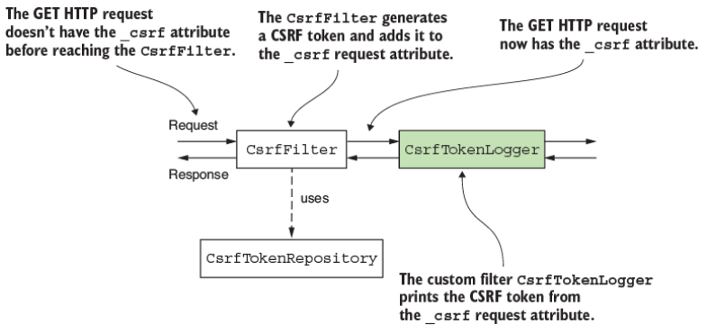

**Hình 9.4** Chèn `CsrfTokenLogger` (được làm nổi bật) ngay sau `CsrfFilter` cho phép nó truy xuất giá trị của token từ thuộc tính `_csrf` của request, nơi `CsrfFilter` đặt nó vào. `CsrfTokenLogger` xuất CSRF token ra console của ứng dụng, từ đó nó có thể được lấy để dùng cho việc thực hiện một HTTP POST request tới endpoint.

**Listing 9.1 Controller class với hai endpoint**

```java
@RestController
public class HelloController {

  @GetMapping("/hello")
  public String getHello() {
    return "Get Hello!";
  }

  @PostMapping("/hello")
  public String postHello() {
    return "Post Hello!";
  }
}
```

Listing 9.2 định nghĩa filter tùy chỉnh mà chúng ta dùng để in giá trị của CSRF token ra console. Tôi đặt tên filter tùy chỉnh này là `CsrfTokenLogger`. Khi được gọi, filter lấy giá trị của CSRF token từ thuộc tính request `_csrf` và in nó ra console. Tên của thuộc tính request, `_csrf`, là nơi `CsrfFilter` đặt giá trị của CSRF token được sinh ra dưới dạng một instance của class `CsrfToken`. Instance `CsrfToken` này chứa giá trị chuỗi của CSRF token. Bạn có thể lấy nó bằng cách gọi phương thức `getToken()`.

**Listing 9.2 Định nghĩa của class filter tùy chỉnh**

```java
public class CsrfTokenLogger implements Filter {

  private Logger logger =
          Logger.getLogger(CsrfTokenLogger.class.getName());

  @Override
  public void doFilter(
    ServletRequest request,
    ServletResponse response,
    FilterChain filterChain)
      throws IOException, ServletException {

      CsrfToken token =
       (CsrfToken) request.getAttribute("_csrf");      // ①

      logger.info("CSRF token " + token.getToken());

      filterChain.doFilter(request, response);
  }
}
```

① Lấy giá trị của token từ thuộc tính request `_csrf` và in nó ra console.

> **Ghi chú của người dịch:** Trong sách gốc, biến ở listing 9.2 được khai báo là `CsrfToken o = ...` nhưng dòng dưới lại dùng `token.getToken()` — một lỗi đánh máy. Tôi đã thống nhất tên biến thành `token` để đoạn code biên dịch được.

Trong configuration class, chúng ta thêm filter tùy chỉnh. Listing kế tiếp trình bày configuration class. Hãy để ý rằng tôi không tắt bảo vệ CSRF trong listing này.

**Listing 9.3 Thêm filter tùy chỉnh trong configuration class**

```java
@Configuration
public class ProjectConfig {

  @Bean
  public SecurityFilterChain configure(HttpSecurity http)
    throws Exception {

    http.addFilterAfter(
            new CsrfTokenLogger(), CsrfFilter.class)
        .authorizeHttpRequests(
            c -> c.anyRequest().permitAll()
        );

    return http.build();
  }
}
```

Giờ chúng ta có thể test các endpoint. Chúng ta bắt đầu bằng cách gọi endpoint với HTTP GET. Vì hiện thực mặc định của interface `CsrfTokenRepository` dùng HTTP session để lưu giá trị token ở phía server, chúng ta cũng cần nhớ session ID. Vì lý do này, tôi thêm cờ `-v` vào lời gọi để có thể thấy nhiều chi tiết hơn từ response, bao gồm cả session ID. Gọi endpoint

```bash
curl -v http://localhost:8080/hello
```

trả về response (đã rút gọn) này:

```
...
< Set-Cookie: JSESSIONID=21ADA55E10D70BA81C338FFBB06B0206;
...
Get Hello!
```

Theo dõi request trong console của ứng dụng, bạn có thể tìm thấy một dòng log chứa CSRF token:

```
INFO 21412 --- [nio-8080-exec-1] c.l.ssia.filters.CsrfTokenLogger : CSRF token tAlE3LB_R_KN48DFlRChc…
```

> **NOTE** Bạn có thể tự hỏi làm sao client lấy được CSRF token. Họ không thể đoán nó cũng không thể đọc nó trong log của server. Tôi thiết kế ví dụ này để bạn dễ hiểu hơn về cách hiện thực bảo vệ CSRF hoạt động. Như bạn sẽ thấy ở mục 9.2, ứng dụng backend có trách nhiệm thêm giá trị của CSRF token vào HTTP response để client dùng.

Nếu bạn gọi endpoint bằng HTTP POST method mà không cung cấp CSRF token, trạng thái response là 403 Forbidden, như dòng lệnh này cho thấy:

```bash
curl -XPOST http://localhost:8080/hello
```

Response body là

```json
{
    "status":403,
    "error":"Forbidden",
    "message":"Forbidden",
    "path":"/hello"
}
```

Nhưng nếu bạn cung cấp giá trị đúng cho CSRF token, lời gọi sẽ thành công. Bạn cũng cần chỉ định session ID (`JSESSIONID`) vì hiện thực mặc định của `CsrfTokenRepository` lưu giá trị của CSRF token trên session:

```bash
curl -X POST http://localhost:8080/hello \
-H 'Cookie: JSESSIONID=21ADA55E10D70BA81C338FFBB06B0206' \
-H 'X-CSRF-TOKEN: tAlE3LB_R_KN48DFlRChc…'
```

Response body là

```
Post Hello!
```

---

## 9.2 Dùng bảo vệ CSRF trong các tình huống thực tế

Trong mục này, chúng ta bàn về việc áp dụng bảo vệ CSRF trong các tình huống thực tế. Giờ khi bạn đã biết bảo vệ CSRF hoạt động thế nào trong Spring Security, bạn cần biết nên dùng nó ở đâu trong thế giới thực. Những loại ứng dụng nào cần dùng bảo vệ CSRF?

Bạn dùng bảo vệ CSRF cho các web app chạy trong trình duyệt, nơi bạn nên mong đợi rằng các thao tác biến đổi dữ liệu có thể được thực hiện bởi trình duyệt nạp nội dung hiển thị của app. Ví dụ cơ bản nhất mà tôi có thể đưa ra ở đây là một web application đơn giản được phát triển theo luồng Spring MVC chuẩn. Chúng ta đã làm một ứng dụng như vậy khi bàn về form login ở chương 6, và web app đó thực ra đã dùng bảo vệ CSRF. Bạn có để ý rằng thao tác đăng nhập trong ứng dụng đó dùng HTTP POST không? Vậy tại sao chúng ta không cần làm gì tường minh về CSRF trong trường hợp đó? Lý do chúng ta không quan sát thấy điều này là vì chúng ta không phát triển bất kỳ thao tác biến đổi dữ liệu nào ở đó.

Với form login mặc định, Spring Security áp dụng bảo vệ CSRF đúng cách giúp chúng ta. Framework lo việc thêm CSRF token vào login request. Giờ hãy phát triển một ứng dụng tương tự để xem kỹ hơn bảo vệ CSRF hoạt động thế nào. Như hình 9.5 cho thấy, trong mục này chúng ta sẽ:

- Xây dựng một ví dụ về web application với login form
- Xem xét cách hiện thực mặc định của login dùng CSRF token
- Hiện thực một lời gọi HTTP POST từ trang chính

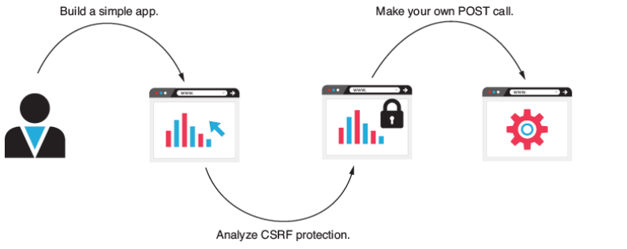

**Hình 9.5** Kế hoạch. Trong mục này, chúng ta bắt đầu bằng việc xây dựng và phân tích một app đơn giản để hiểu cách Spring Security áp dụng bảo vệ CSRF, rồi chúng ta viết lời gọi POST của riêng mình.

Trong ứng dụng ví dụ này, bạn sẽ nhận thấy rằng lời gọi HTTP POST sẽ không hoạt động cho tới khi chúng ta dùng CSRF token đúng cách, và ở đây, bạn sẽ học cách áp dụng CSRF token trong một form trên một trang web như vậy. Để hiện thực ứng dụng này, chúng ta bắt đầu bằng cách tạo một project Spring Boot mới. Bạn có thể tìm thấy ví dụ này trong project `ssia-ch9-ex2`. Đoạn code kế tiếp trình bày những dependency cần thiết:

```xml
<dependency>
   <groupId>org.springframework.boot</groupId>
   <artifactId>spring-boot-starter-security</artifactId>
</dependency>
<dependency>
   <groupId>org.springframework.boot</groupId>
   <artifactId>spring-boot-starter-thymeleaf</artifactId>
</dependency>
<dependency>
   <groupId>org.springframework.boot</groupId>
   <artifactId>spring-boot-starter-web</artifactId>
</dependency>
```

Tiếp theo, tất nhiên, chúng ta cần cấu hình form login và ít nhất một user. Listing sau đây trình bày configuration class, thứ định nghĩa `UserDetailsService`, thêm một user, và cấu hình phương thức `formLogin`.

**Listing 9.4 Định nghĩa của configuration class**

```java
@Configuration
public class ProjectConfig {

  @Bean                                       // ①
  public UserDetailsService uds() {
    var uds = new InMemoryUserDetailsManager();

    var u1 = User.withUsername("mary")
                 .password("12345")
                 .authorities("READ")
                 .build();

    uds.createUser(u1);

    return uds;
  }

  @Bean                                       // ②
  public PasswordEncoder passwordEncoder() {
    return NoOpPasswordEncoder.getInstance();
  }

  @Bean                                       // ③
  public SecurityFilterChain securityFilterChain(HttpSecurity http)
    throws Exception {

    http.formLogin(
      c -> c.defaultSuccessUrl("/main", true)
    );

    http.authorizeHttpRequests(
      c -> c.anyRequest().authenticated()
    );

    return http.build();
  }
}
```

① Thêm một bean `UserDetailsService` quản lý một user để test ứng dụng.

② Thêm một `PasswordEncoder`.

③ Tạo một bean kiểu `SecurityFilterChain` để đặt phương thức form login authentication và chỉ định rằng chỉ những user đã authentication mới có thể truy cập bất kỳ endpoint nào.

Chúng ta thêm một controller class cho trang chính vào một package tên là *controllers* và một file *main.html* trong thư mục *resources/templates* của Maven project. File *main.html* có thể tạm để trống vì ở lần chạy đầu tiên của ứng dụng, chúng ta chỉ tập trung vào cách trang login dùng CSRF token. Listing sau đây trình bày class `MainController`, thứ phục vụ trang chính.

**Listing 9.5 Định nghĩa của class `MainController`**

```java
@Controller
public class MainController {

  @GetMapping("/main")
  public String main() {
    return "main.html";
  }
}
```

Sau khi chạy ứng dụng, bạn có thể truy cập trang login mặc định. Nếu bạn kiểm tra form bằng chức năng inspect element của trình duyệt, bạn có thể quan sát thấy rằng hiện thực mặc định của login form gửi CSRF token. Đây là lý do việc đăng nhập của bạn hoạt động với bảo vệ CSRF được bật ngay cả khi nó dùng HTTP POST request! Hình 9.6 cho thấy cách login form gửi CSRF token qua một hidden input.

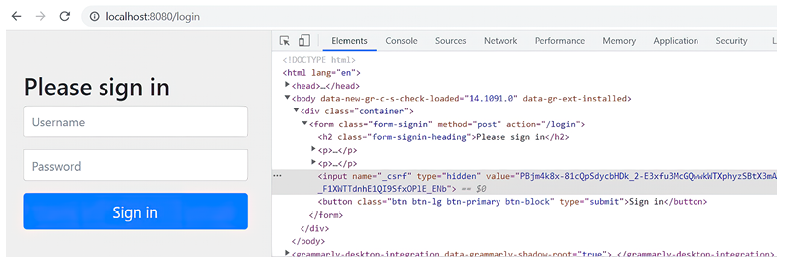

**Hình 9.6** Form login mặc định dùng một hidden input để gửi CSRF token trong request. Đây là lý do login request dùng HTTP POST method hoạt động với bảo vệ CSRF được bật.

Nhưng còn việc phát triển endpoint của riêng chúng ta dùng POST, PUT, hoặc DELETE làm HTTP method thì sao? Với những cái này, chúng ta phải lo việc gửi giá trị của CSRF token nếu bảo vệ CSRF được bật. Để test điều này, hãy thêm một endpoint dùng HTTP POST vào ứng dụng. Chúng ta gọi endpoint này từ trang chính, và chúng ta tạo một controller thứ hai cho việc này, gọi là `ProductController`. Bên trong controller này, chúng ta định nghĩa một endpoint, `/product/add`, dùng HTTP POST. Tiếp theo, chúng ta dùng một form trên trang chính để gọi endpoint này. Listing sau đây định nghĩa class `ProductController`.

**Listing 9.6 Định nghĩa của class `ProductController`**

```java
@Controller
@RequestMapping("/product")
public class ProductController {

  private Logger logger =
    Logger.getLogger(ProductController.class.getName());

  @PostMapping("/add")
  public String add(@RequestParam String name) {
    logger.info("Adding product " + name);
    return "main.html";
  }
}
```

Endpoint nhận một request parameter và in nó ra console của ứng dụng. Listing sau đây cho thấy định nghĩa của form được định nghĩa trong file *main.html*.

**Listing 9.7 Định nghĩa của form trong trang main.html**

```html
<form action="/product/add" method="post">
   <span>Name:</span>
   <span><input type="text" name="name" /></span>
   <span><button type="submit">Add</button></span>
</form>
```

Giờ bạn có thể chạy lại ứng dụng và test form. Bạn sẽ quan sát thấy rằng khi submit request, một trang lỗi mặc định được hiển thị, xác nhận trạng thái HTTP 403 Forbidden trên response từ server (hình 9.7). Lý do cho trạng thái này là sự vắng mặt của CSRF token.

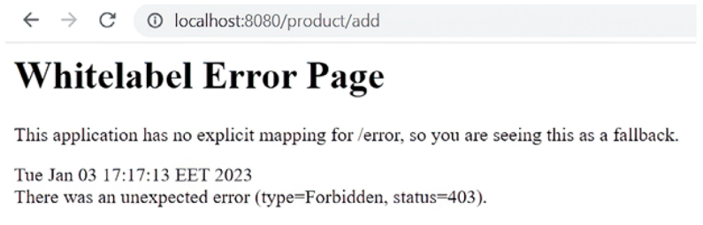

**Hình 9.7** Nếu CSRF token không được đưa vào, server sẽ từ chối bất kỳ request nào thực hiện bằng HTTP POST method. User sẽ bị chuyển hướng tới một trang lỗi chuẩn hiển thị trạng thái HTTP 403 Forbidden trong response.

Để giải quyết vấn đề này và làm cho server cho phép request, chúng ta cần thêm CSRF token vào request được thực hiện qua form. Một cách dễ dàng để làm điều này là dùng một component hidden input, như bạn đã thấy trong form login mặc định. Điều này có thể được hiện thực như trình bày ở listing sau đây.

**Listing 9.8 Thêm CSRF token vào request được thực hiện qua form**

```html
<form action="/product/add" method="post">
   <span>Name:</span>
   <span><input type="text" name="name" /></span>
   <span><button type="submit">Add</button></span>
   <input type="hidden"                         <!-- ① -->
          th:name="${_csrf.parameterName}"      <!-- ② -->
          th:value="${_csrf.token}" />          <!-- ② -->
</form>
```

① Dùng hidden input để thêm CSRF token vào request.

② Prefix "th" cho phép Thymeleaf in giá trị token.

> **NOTE** Trong ví dụ, chúng ta dùng Thymeleaf vì nó cung cấp một cách đơn giản để lấy giá trị thuộc tính request trong view. Trong trường hợp của chúng ta, chúng ta cần in CSRF token. Hãy nhớ rằng `CsrfFilter` thêm giá trị của token vào thuộc tính `_csrf` của request. Việc dùng Thymeleaf không bắt buộc. Bạn có thể dùng bất kỳ giải pháp thay thế nào bạn chọn để in giá trị token vào response.

Sau khi chạy lại ứng dụng, bạn có thể test form lần nữa. Lần này, server chấp nhận request, và ứng dụng in dòng log ra console, chứng minh rằng việc thực thi đã thành công. Hơn nữa, nếu bạn kiểm tra form, bạn có thể tìm thấy hidden input với giá trị của CSRF token (hình 9.8).

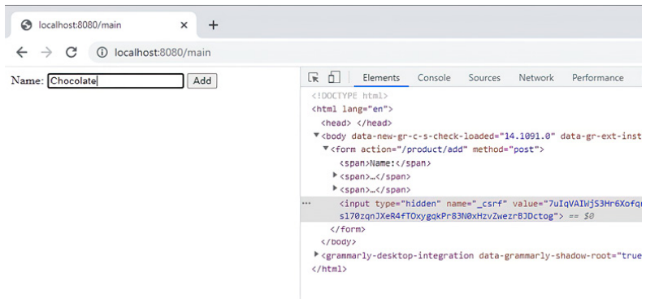

**Hình 9.8** Form được định nghĩa trên trang chính giờ gửi giá trị cho CSRF token trong request. Bằng cách này, server cho phép request và thực thi controller action. Trong mã nguồn của trang, giờ bạn có thể tìm thấy hidden input mà form dùng để gửi CSRF token trong request.

Sau khi submit form, bạn sẽ tìm thấy trong console của ứng dụng một dòng tương tự thế này:

```
INFO 20892 --- [nio-8080-exec-7] c.l.s.controllers.ProductController : Adding product …
```

Tất nhiên, với bất kỳ action hoặc JavaScript request bất đồng bộ nào mà trang của bạn dùng để gọi một action biến đổi dữ liệu, bạn cần gửi một CSRF token hợp lệ. Đây là cách phổ biến nhất mà một ứng dụng dùng để đảm bảo request không đến từ bên thứ ba. Một request bên thứ ba có thể cố mạo danh user để thực thi hành động thay mặt họ.

CSRF token hoạt động tốt trong một kiến trúc mà cùng một server chịu trách nhiệm cho cả frontend lẫn backend, chủ yếu vì tính đơn giản của nó. Nhưng CSRF token không hoạt động tốt khi client độc lập với giải pháp backend mà nó tiêu thụ. Tình huống này xảy ra khi bạn có một ứng dụng mobile làm client hoặc một web frontend được phát triển độc lập. Một web client được phát triển bằng framework như Angular, ReactJS, hoặc Vue.js là rất phổ biến trong các kiến trúc web application, và đây là lý do bạn cần biết cách hiện thực cách tiếp cận bảo mật cho những trường hợp này nữa. Chúng ta sẽ bàn về những loại thiết kế này ở phần 4 của cuốn sách.

Ở các chương 13 đến 16, bạn sẽ học cách hiện thực đặc tả OAuth 2, thứ có những lợi thế tuyệt vời trong việc tách rời component. Điều này tách authentication khỏi các tài nguyên mà ứng dụng authorize cho client.

> **NOTE** Nó có thể trông như một lỗi tầm thường, nhưng theo kinh nghiệm của tôi, tôi thấy nó quá nhiều lần trong các ứng dụng — đừng bao giờ dùng HTTP GET với các thao tác biến đổi dữ liệu! Đừng hiện thực hành vi thay đổi dữ liệu và cho phép nó được gọi bằng một HTTP GET endpoint. Hãy nhớ rằng các lời gọi tới HTTP GET endpoint không yêu cầu CSRF token.

---

## 9.3 Tùy chỉnh bảo vệ CSRF

Trong mục này, bạn học cách tùy chỉnh giải pháp bảo vệ CSRF do Spring Security cung cấp. Vì các ứng dụng có nhiều yêu cầu khác nhau, bất kỳ hiện thực nào do framework cung cấp cũng cần đủ linh hoạt để dễ dàng thích ứng với những tình huống khác nhau. Cơ chế bảo vệ CSRF trong Spring Security cũng không ngoại lệ. Trong mục này, các ví dụ cho phép bạn áp dụng những nhu cầu thường gặp nhất trong việc tùy chỉnh cơ chế bảo vệ CSRF. Đó là:

- Cấu hình các path mà CSRF áp dụng lên
- Quản lý CSRF token

Chúng ta chỉ dùng bảo vệ CSRF khi trang tiêu thụ tài nguyên do server tạo ra cũng được sinh ra bởi chính server đó. Nó có thể là một web application mà các endpoint được tiêu thụ được expose bởi một origin khác, như chúng ta đã bàn ở mục 9.2, hoặc một ứng dụng mobile. Trong trường hợp ứng dụng mobile, bạn có thể dùng luồng OAuth 2, thứ chúng ta sẽ bàn ở các chương 13 đến 16.

Mặc định, bảo vệ CSRF áp dụng cho bất kỳ path nào của các endpoint được gọi bằng HTTP method khác GET, HEAD, TRACE, hoặc OPTIONS. Bạn đã biết từ chương 5 cách tắt hoàn toàn bảo vệ CSRF. Nhưng nếu bạn chỉ muốn tắt nó cho một số path của ứng dụng thì sao? Bạn có thể thực hiện cấu hình này nhanh chóng với một object `Customizer`, tương tự cách chúng ta tùy chỉnh HTTP Basic cho các phương thức form-login ở chương 6.

Ở đây, chúng ta tạo một project mới và chỉ thêm các dependency web và security, như trình bày ở đoạn code kế tiếp. Bạn có thể tìm thấy ví dụ này trong project `ssia-ch9-ex3`. Đây là các dependency:

```xml
<dependency>
  <groupId>org.springframework.boot</groupId>
  <artifactId>spring-boot-starter-security</artifactId>
</dependency>
<dependency>
  <groupId>org.springframework.boot</groupId>
  <artifactId>spring-boot-starter-web</artifactId>
</dependency>
```

Trong ứng dụng này, chúng ta thêm hai endpoint được gọi bằng HTTP POST, nhưng chúng ta muốn loại trừ một trong số đó khỏi việc dùng bảo vệ CSRF (hình 9.9). Listing 9.9 định nghĩa controller class cho việc này, mà tôi đặt tên là `HelloController`.

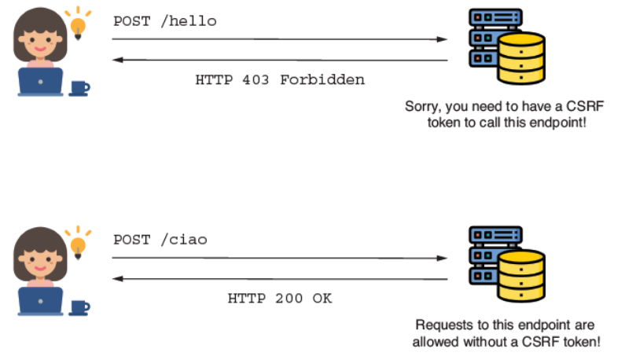

**Hình 9.9** Ứng dụng yêu cầu một CSRF token cho endpoint `/hello` được gọi bằng HTTP POST nhưng cho phép các HTTP POST request tới endpoint `/ciao` mà không cần CSRF token.

**Listing 9.9 Định nghĩa của class `HelloController`**

```java
@RestController
public class HelloController {

  @PostMapping("/hello")         // ①
  public String postHello() {
    return "Post Hello!";
  }

  @PostMapping("/ciao")          // ②
  public String postCiao() {
    return "Post Ciao";
  }
}
```

① Path `/hello` vẫn nằm dưới bảo vệ CSRF. Bạn không thể gọi endpoint mà không có CSRF token hợp lệ.

② Path `/ciao` có thể được gọi mà không cần CSRF token.

Để thực hiện tùy chỉnh trên bảo vệ CSRF, bạn có thể dùng phương thức `csrf()` của object `HttpSecurity` trong phương thức `securityFilterChain()` với một object `Customizer`. Listing kế tiếp trình bày cách tiếp cận này.

**Listing 9.10 Một object `Customizer` cho việc cấu hình bảo vệ CSRF**

```java
@Configuration
public class ProjectConfig {

  @Bean
  public SecurityFilterChain securityFilterChain(HttpSecurity http)
    throws Exception {

    http.csrf(c -> {                        // ①
        c.ignoringRequestMatchers("/ciao");
    });

    http.authorizeHttpRequests(
         c -> c.anyRequest().permitAll()
    );

    return http.build();
  }
}
```

① Tham số của biểu thức lambda là một `CsrfConfigurer`. Bằng cách gọi các phương thức của nó, bạn có thể cấu hình bảo vệ CSRF theo nhiều cách khác nhau.

Gọi phương thức `ignoringRequestMatchers(String paths)`, bạn có thể chỉ định các path expression biểu diễn những path mà bạn muốn loại trừ khỏi cơ chế bảo vệ CSRF. Một cách tiếp cận tổng quát hơn là dùng một `RequestMatcher`. Dùng cái này cho phép bạn áp dụng các quy tắc loại trừ bằng path expression thông thường cũng như bằng regex (biểu thức chính quy). Khi dùng phương thức `ignoringRequestMatchers()` của object `CsrfCustomizer`, bạn có thể cung cấp bất kỳ `RequestMatcher` nào làm tham số. Đoạn code kế tiếp cho thấy cách dùng phương thức `ignoringRequestMatchers()` với một `MvcRequestMatcher` thay vì dùng `ignoringRequestMatchers()` với một path được cho dưới dạng giá trị `String`:

```java
HandlerMappingIntrospector i = new HandlerMappingIntrospector();
MvcRequestMatcher r = new MvcRequestMatcher(i, "/ciao");
c.ignoringRequestMatchers(r);
```

Hoặc bạn có thể dùng tương tự một regex matcher:

```java
String pattern = ".*[0-9].*";
String httpMethod = HttpMethod.POST.name();
RegexRequestMatcher r = new RegexRequestMatcher(pattern, httpMethod);
c.ignoringRequestMatchers(r);
```

Một nhu cầu khác thường gặp trong các yêu cầu của ứng dụng là tùy chỉnh việc quản lý CSRF token. Như bạn đã học, mặc định, ứng dụng lưu CSRF token trong HTTP session ở phía server. Cách tiếp cận đơn giản này phù hợp với các ứng dụng nhỏ, nhưng nó không tuyệt vời cho những ứng dụng phục vụ số lượng lớn request và đòi hỏi mở rộng theo chiều ngang (horizontal scaling). HTTP session là stateful (có trạng thái) và làm giảm khả năng mở rộng của ứng dụng.

Giả sử bạn muốn thay đổi cách ứng dụng quản lý token và lưu chúng ở đâu đó trong database thay vì trong HTTP session. Spring Security cung cấp ba contract mà bạn cần hiện thực để làm điều này:

- **`CsrfToken`** — Mô tả chính CSRF token
- **`CsrfTokenRepository`** — Mô tả object tạo, lưu, và nạp CSRF token
- **`CsrfTokenRequestHandler`** — Mô tả object quản lý cách CSRF token được sinh ra được đặt lên HTTP request

Object `CsrfToken` có ba đặc tính chính mà bạn cần chỉ định khi hiện thực contract (listing 9.11 định nghĩa contract `CsrfToken`):

- Tên của header trong request chứa giá trị của CSRF token (mặc định tên là `X-CSRF-TOKEN`)
- Tên của thuộc tính của request lưu giá trị của token (mặc định tên là `_csrf`)
- Giá trị của token

**Listing 9.11 Định nghĩa của interface `CsrfToken`**

```java
public interface CsrfToken extends Serializable {
  String getHeaderName();
  String getParameterName();
  String getToken();
}
```

Nói chung, bạn chỉ cần instance kiểu `CsrfToken` để lưu ba chi tiết đó trong các thuộc tính của instance. Với chức năng này, Spring Security cung cấp một hiện thực gọi là `DefaultCsrfToken` mà chúng ta cũng dùng trong ví dụ của mình. `DefaultCsrfToken` hiện thực contract `CsrfToken` và tạo các instance bất biến chứa những giá trị cần thiết: tên của thuộc tính request và header, và chính token.

Interface `CsrfTokenRepository` là contract biểu diễn component quản lý CSRF token. Để thay đổi cách ứng dụng quản lý token, bạn cần hiện thực interface `CsrfTokenRepository`, thứ cho phép bạn cắm hiện thực tùy chỉnh của mình vào framework. Hãy thay đổi ứng dụng hiện tại mà chúng ta dùng trong mục này để thêm một hiện thực mới cho `CsrfTokenRepository`, thứ lưu token trong database. Hình 9.10 trình bày các component chúng ta hiện thực cho ví dụ này và liên kết giữa chúng.

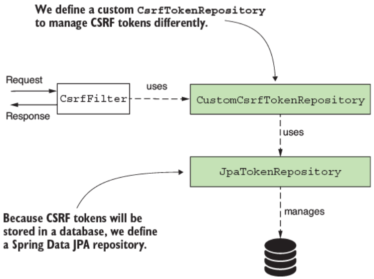

**Hình 9.10** `CsrfToken` dùng một hiện thực tùy chỉnh của `CsrfTokenRepository`. Hiện thực tùy chỉnh này dùng một `JpaRepository` để quản lý CSRF token trong database.

Trong ví dụ của chúng ta, chúng ta dùng một bảng trong database để lưu CSRF token. Chúng ta giả định client có một ID để định danh bản thân một cách duy nhất. Ứng dụng cần định danh này để lấy CSRF token và kiểm chứng nó. Nói chung, ID duy nhất này sẽ được lấy trong lúc đăng nhập và nên khác nhau mỗi lần user đăng nhập. Chiến lược quản lý token này tương tự việc lưu chúng trong bộ nhớ. Trong trường hợp đó, bạn dùng một session ID. Vì vậy, định danh mới cho ví dụ này chỉ đơn thuần thay thế session ID.

Một cách tiếp cận thay thế sẽ là dùng CSRF token với thời gian sống được định nghĩa. Với cách tiếp cận như vậy, token hết hạn sau một khoảng thời gian bạn định nghĩa. Bạn có thể lưu token trong database mà không liên kết chúng với một user ID cụ thể. Bạn chỉ cần kiểm tra xem một token được cung cấp qua một HTTP request có tồn tại và chưa hết hạn hay không để quyết định có cho phép request đó không.

> **BÀI TẬP** Khi bạn hoàn thành ví dụ này, nơi chúng ta dùng một định danh mà chúng ta gán CSRF token cho nó, hãy hiện thực cách tiếp cận thứ hai, nơi bạn dùng CSRF token có hết hạn.

Để ví dụ ngắn gọn hơn, chúng ta chỉ tập trung vào việc hiện thực `CsrfTokenRepository`, và chúng ta cần xem như client đã có một định danh được sinh sẵn. Để làm việc với database, chúng ta cần thêm một vài dependency nữa vào file *pom.xml*:

```xml
<dependency>
  <groupId>org.springframework.boot</groupId>
  <artifactId>spring-boot-starter-data-jpa</artifactId>
</dependency>
<dependency>
  <groupId>com.mysql</groupId>
  <artifactId>mysql-connector-j</artifactId>
</dependency>
```

Trong file *application.properties*, chúng ta cần thêm các property cho kết nối database:

```properties
spring.datasource.url=jdbc:mysql://localhost/spring?useLegacyDatetimeCode=false&serverTimezone=UTC
spring.datasource.username=root
spring.datasource.password=
spring.sql.init.mode=always
```

Để cho phép ứng dụng tạo bảng cần thiết trong database lúc khởi động, bạn có thể thêm file *schema.xml* vào thư mục *resources* của project. File này nên chứa truy vấn tạo bảng:

```sql
CREATE TABLE IF NOT EXISTS `spring`.`token` (
    `id` INT NOT NULL AUTO_INCREMENT,
    `identifier` VARCHAR(45) NULL,
    `token` TEXT NULL,
PRIMARY KEY (`id`));
```

Chúng ta dùng Spring Data với một hiện thực JPA để kết nối tới database, nên chúng ta cần định nghĩa entity class và class `JpaRepository`. Trong một package tên là *entities*, chúng ta định nghĩa JPA entity như trình bày ở listing sau đây.

**Listing 9.12 Định nghĩa của JPA entity class**

```java
@Entity
public class Token {

  @Id
  @GeneratedValue(strategy = GenerationType.IDENTITY)
  private int id;

  private String identifier;     // ①
  private String token;          // ②

  // Phần code được lược bỏ
}
```

① Định danh của client.

② CSRF token do ứng dụng sinh ra cho client.

`JpaTokenRepository`, vốn là contract `JpaRepository` của chúng ta, có thể được định nghĩa như trình bày ở listing sau đây. Phương thức duy nhất bạn cần là `findTokenByIdentifier()`, thứ lấy CSRF token từ database cho một client cụ thể.

**Listing 9.13 Định nghĩa của interface `JpaTokenRepository`**

```java
public interface JpaTokenRepository
  extends JpaRepository<Token, Integer> {

  Optional<Token> findTokenByIdentifier(String identifier);
}
```

Với quyền truy cập tới database đã hiện thực, giờ chúng ta có thể bắt đầu viết hiện thực `CsrfTokenRepository`, mà tôi gọi là `CustomCsrfTokenRepository`. Listing kế tiếp định nghĩa class này, thứ ghi đè ba phương thức của `CsrfTokenRepository`.

**Listing 9.14 Hiện thực contract `CsrfTokenRepository`**

```java
@Component
public class CustomCsrfTokenRepository implements CsrfTokenRepository {

  private final JpaTokenRepository jpaTokenRepository;

  // constructor được lược bỏ

  @Override
  public CsrfToken generateToken(
    HttpServletRequest httpServletRequest) {
    // ...
  }

  @Override
  public void saveToken(
    CsrfToken csrfToken,
    HttpServletRequest httpServletRequest,
    HttpServletResponse httpServletResponse) {
    // ...
  }

  @Override
  public CsrfToken loadToken(
    HttpServletRequest httpServletRequest) {
    // ...
  }
}
```

`CustomCsrfTokenRepository` inject một instance của `JpaTokenRepository` từ Spring context để có quyền truy cập tới database. `CustomCsrfTokenRepository` dùng instance này để truy xuất hoặc lưu CSRF token trong database. Cơ chế bảo vệ CSRF gọi phương thức `generateToken()` khi ứng dụng cần sinh một token mới. Listing 9.15 minh họa hiện thực của phương thức này cho bài tập của chúng ta. Chúng ta dùng class `UUID` để sinh một giá trị UUID ngẫu nhiên mới, và chúng ta giữ cùng tên cho request header và thuộc tính, `X-CSRF-TOKEN` và `_csrf`, như trong hiện thực mặc định do Spring Security cung cấp.

**Listing 9.15 Hiện thực của phương thức `generateToken()`**

```java
@Override
public CsrfToken generateToken(HttpServletRequest httpServletRequest) {
  String uuid = UUID.randomUUID().toString();
  return new DefaultCsrfToken("X-CSRF-TOKEN", "_csrf", uuid);
}
```

Phương thức `saveToken()` lưu một token được sinh ra cho một client cụ thể. Trong trường hợp hiện thực bảo vệ CSRF mặc định, ứng dụng dùng HTTP session để định danh CSRF token. Trong trường hợp của chúng ta, chúng ta giả định rằng client có một định danh duy nhất. Client gửi giá trị của ID duy nhất của mình trong request với header tên là `X-IDENTIFIER`. Trong logic của phương thức, chúng ta kiểm tra xem giá trị đó có tồn tại trong database hay không. Nếu có, chúng ta cập nhật database với giá trị mới của token. Nếu không, chúng ta tạo một bản ghi mới cho ID này với giá trị mới của CSRF token. Listing sau đây trình bày hiện thực của phương thức `saveToken()`.

**Listing 9.16 Hiện thực của phương thức `saveToken()`**

```java
@Override
public void saveToken(
   CsrfToken csrfToken,
   HttpServletRequest httpServletRequest,
   HttpServletResponse httpServletResponse) {

    String identifier =
        httpServletRequest.getHeader("X-IDENTIFIER");

    Optional<Token> existingToken =                     // ①
        jpaTokenRepository.findTokenByIdentifier(identifier);

    if (existingToken.isPresent()) {                    // ②
       Token token = existingToken.get();
       token.setToken(csrfToken.getToken());
    } else {                                            // ③
       Token token = new Token();
       token.setToken(csrfToken.getToken());
       token.setIdentifier(identifier);
       jpaTokenRepository.save(token);
    }
}
```

① Lấy token từ database theo client ID.

② Nếu ID tồn tại, cập nhật giá trị của token bằng giá trị mới được sinh ra.

③ Nếu ID không tồn tại, tạo một bản ghi mới cho ID với giá trị được sinh ra cho CSRF token.

Hiện thực của phương thức `loadToken()` nạp chi tiết token (nếu chúng tồn tại) hoặc trả về `null` trong trường hợp ngược lại. Listing sau đây cho thấy hiện thực này.

**Listing 9.17 Hiện thực của phương thức `loadToken()`**

```java
@Override
public CsrfToken loadToken(
  HttpServletRequest httpServletRequest) {

  String identifier = httpServletRequest.getHeader("X-IDENTIFIER");

  Optional<Token> existingToken =
    jpaTokenRepository
      .findTokenByIdentifier(identifier);

  if (existingToken.isPresent()) {
    Token token = existingToken.get();
    return new DefaultCsrfToken(
                  "X-CSRF-TOKEN",
                  "_csrf",
                  token.getToken());
  }

  return null;
}
```

Chúng ta dùng một hiện thực tùy chỉnh của `CsrfTokenRepository` để khai báo một bean trong configuration class. Sau đó chúng ta cắm bean này vào cơ chế bảo vệ CSRF bằng phương thức `csrfTokenRepository()` của `CsrfConfigurer`. Listing kế tiếp định nghĩa configuration class này.

**Listing 9.18 Configuration class cho `CsrfTokenRepository` tùy chỉnh**

```java
@Configuration
public class ProjectConfig {

  private final CustomCsrfTokenRepository customTokenRepository;

  // constructor được lược bỏ

  @Bean
  public SecurityFilterChain securityFilterChain(HttpSecurity http)
    throws Exception {

    http.csrf(c -> {
      c.csrfTokenRepository(customTokenRepository);      // ①
    });

    http.authorizeHttpRequests(
      c -> c.anyRequest().permitAll()
    );

    return http.build();
  }
}
```

① Dùng object `Customizer<CsrfConfigurer<HttpSecurity>>` để cắm hiện thực `CsrfTokenRepository` mới vào cơ chế bảo vệ CSRF.

Mảnh ghép cuối cùng chúng ta cần cắm vào để mọi thứ hoạt động tốt là một `CsrfTokenRequestHandler`. May mắn thay, chúng ta có thể dùng một hiện thực mà Spring Security cung cấp — `CsrfTokenRequestAttributeHandler`. Hiện thực này đơn giản dùng phương thức `generateToken()` của `CsrfTokenRepository` để sinh một token mới khi một endpoint được gọi bằng HTTP GET method. Sau đó nó thêm `CsrfToken` được sinh ra lên request dưới dạng một thuộc tính.

Bạn có thể tùy chỉnh hành vi đơn giản của object `CsrfTokenRequestAttributeHandler` bằng cách kế thừa class của nó. Ví dụ, hiện thực mặc định mà Spring Security dùng (tên là `XorCsrfTokenRequestAttributeHandler`) có hành vi phức tạp hơn. Hiện thực này sinh một giá trị ngẫu nhiên bằng một object `SecureRandom` rồi trộn mảng byte của nó với token do `CsrfTokenRepository` sinh ra bằng một phép toán logic XOR. Tuy nhiên, để tránh làm ví dụ của chúng ta quá phức tạp và cho phép bạn tập trung vào phần cấu hình, chúng ta sẽ thiết lập một `CsrfTokenRequestAttributeHandler` đơn giản để xử lý việc quản lý CSRF token trên object HTTP request. Listing kế tiếp cho bạn thấy cách cấu hình `CsrfTokenRequestAttributeHandler` trong configuration class.

**Listing 9.19 Configuration class cho `CsrfTokenRepository` tùy chỉnh**

```java
@Configuration
public class ProjectConfig {

  private final CustomCsrfTokenRepository customTokenRepository;

  // constructor được lược bỏ

  @Bean
  public SecurityFilterChain securityFilterChain(HttpSecurity http)
    throws Exception {

    http.csrf(c -> {
      c.csrfTokenRepository(customTokenRepository);
      c.csrfTokenRequestHandler(
        new CsrfTokenRequestAttributeHandler()     // ①
      );
    });

    http.authorizeHttpRequests(
      c -> c.anyRequest().permitAll()
    );

    return http.build();
  }
}
```

① Thiết lập object `CsrfTokenRequestAttributeHandler` để quản lý việc đặt CSRF token lên HTTP request.

Trong định nghĩa của controller class trình bày ở listing 9.9, chúng ta cũng thêm một endpoint dùng HTTP GET method. Chúng ta cần phương thức này để lấy CSRF token khi test hiện thực của mình:

```java
@GetMapping("/hello")
public String getHello() {
  return "Get Hello!";
}
```

Giờ bạn có thể khởi động ứng dụng và test hiện thực mới cho việc quản lý token. Chúng ta gọi endpoint bằng HTTP GET để lấy một giá trị cho CSRF token. Khi thực hiện lời gọi, chúng ta phải dùng ID của client trong header `X-IDENTIFIER`, như đã giả định từ yêu cầu. Một giá trị mới của CSRF token được sinh ra và lưu trong database. Đây là lời gọi:

```bash
curl -H "X-IDENTIFIER:12345" http://localhost:8080/hello
```

```
Get Hello!
```

Nếu bạn tìm trong bảng `token` trong database, bạn sẽ thấy ứng dụng đã thêm một bản ghi mới cho client với identifier `12345`. Trong trường hợp của tôi, giá trị được sinh ra cho CSRF token, mà tôi có thể thấy trong database, là `2bc652f5-258b-4a26-b456-928e9bad71f8`. Chúng ta dùng giá trị này để gọi endpoint `/hello` bằng HTTP POST method, như đoạn code kế tiếp trình bày. Tất nhiên, chúng ta cũng phải cung cấp client ID mà ứng dụng dùng để truy xuất token từ database nhằm so sánh nó với cái chúng ta cung cấp trong request:

```bash
curl -XPOST -H "X-IDENTIFIER:12345" \
  -H "X-CSRF-TOKEN:2bc652f5-258b-4a26-b456-928e9bad71f8" \
  http://localhost:8080/hello
```

```
Post Hello!
```

Hình 9.11 mô tả luồng này.

Nếu chúng ta thử gọi endpoint `/hello` bằng POST mà không cung cấp các header cần thiết, chúng ta nhận về một response với trạng thái HTTP 403 Forbidden. Để xác nhận điều này, hãy gọi endpoint bằng

```bash
curl -XPOST http://localhost:8080/hello
```

Response body là

```json
{
  "status":403,
  "error":"Forbidden",
  "message":"Forbidden",
  "path":"/hello"
}
```

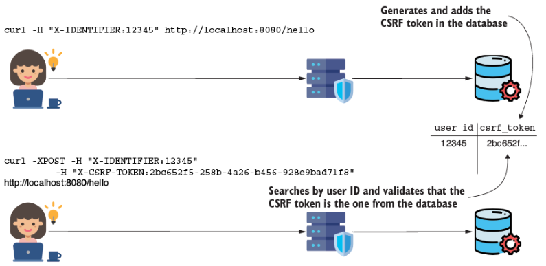

**Hình 9.11** Trước hết, GET request sinh ra CSRF token và lưu giá trị của nó trong database. Bất kỳ POST request nào sau đó đều phải gửi giá trị này. Rồi `CsrfFilter` kiểm tra xem giá trị trong request có tương ứng với giá trị trong database hay không. Dựa trên đó, request được chấp nhận hoặc bị từ chối.

> **Ghi chú của người dịch:** Một số dòng lệnh cURL và dòng log trong chương này bị PDF gốc cắt cụt ở cuối dòng (giá trị token, đường dẫn endpoint). Phần thiếu đã được khôi phục theo ngữ cảnh. Ngoài ra, listing 9.4 và 9.10 trong sách gốc thiếu lần lượt annotation `@Configuration` và dấu `}` đóng class; tôi đã bổ sung để đoạn code hoàn chỉnh.

---

## Tóm tắt

- CSRF là một loại tấn công trong đó user bị lừa truy cập một trang chứa script giả mạo. Script này có thể mạo danh một user đã đăng nhập vào ứng dụng và thực thi hành động thay mặt họ.
- Bảo vệ CSRF mặc định được bật trong Spring Security.
- Điểm vào của logic bảo vệ CSRF trong kiến trúc Spring Security là một HTTP filter.
- Bạn có thể tùy chỉnh khả năng cung cấp bảo vệ CSRF. Spring Security cung cấp ba contract đơn giản mà bạn có thể hiện thực và cắm vào để định nghĩa khả năng bảo vệ CSRF tùy chỉnh:
  - **`CsrfToken`** — Mô tả chính CSRF token
  - **`CsrfTokenRepository`** — Mô tả object tạo, lưu, và nạp CSRF token
  - **`CsrfTokenRequestHandler`** — Mô tả object quản lý cách CSRF token được sinh ra được đặt lên HTTP request
