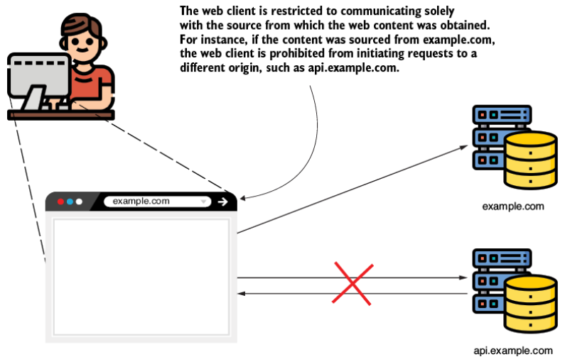
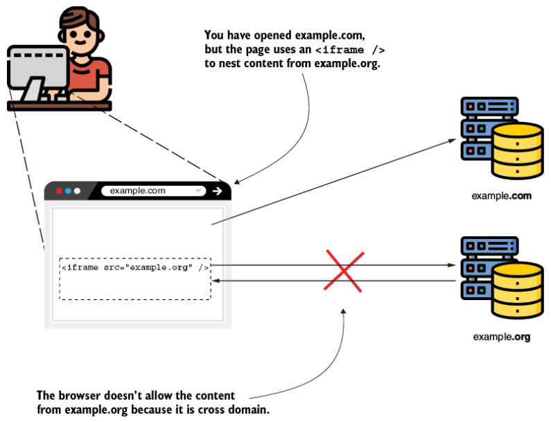
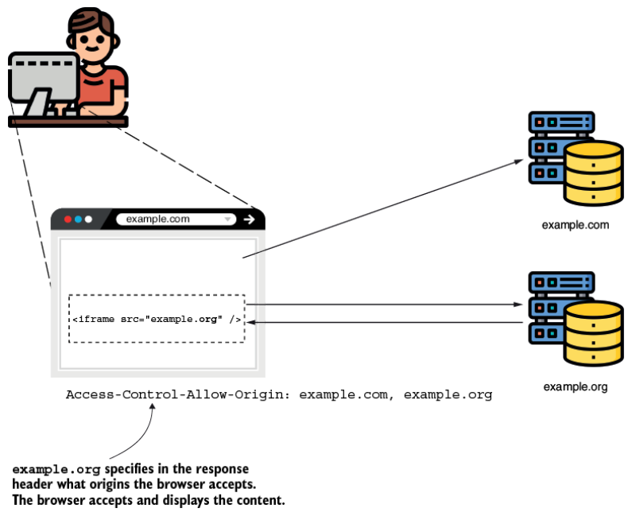
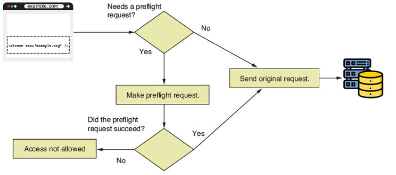

# 10. Cấu hình CORS (Configuring CORS)

> Bản dịch tiếng Việt của chương 10 — *Spring Security in Action, Second Edition* (Laurentiu Spilca, Manning).

**Nội dung chương này bao gồm:**

- Định nghĩa CORS
- Áp dụng cấu hình CORS

Trong chương này, chúng ta bàn về cross-origin resource sharing (CORS — chia sẻ tài nguyên giữa các origin khác nhau) và cách áp dụng nó với Spring Security. Trước hết, CORS là gì, và tại sao bạn nên quan tâm? Nhu cầu về CORS bắt nguồn từ các web application. Mặc định, trình duyệt không cho phép các request tới bất kỳ domain nào khác ngoài domain mà site được nạp từ đó. Ví dụ, nếu bạn truy cập site từ *example.com*, trình duyệt sẽ không cho site thực hiện request tới *api.example.com*. Hình 10.1 minh họa khái niệm này.



**Hình 10.1** Cross-origin resource sharing (CORS). Khi được truy cập từ *example.com*, website không thể thực hiện request tới *api.example.com* vì chúng sẽ là các request cross-domain.

Có thể nói ngắn gọn rằng một app dùng cơ chế CORS để nới lỏng chính sách nghiêm ngặt này và cho phép các request giữa những origin khác nhau trong một số điều kiện. Bạn cần biết điều này vì nhiều khả năng bạn sẽ phải dùng nó cho ứng dụng của mình, đặc biệt là ngày nay khi frontend và backend là những ứng dụng riêng biệt. Việc một ứng dụng frontend được phát triển bằng framework như Angular, ReactJS, hoặc Vue và được host tại một domain như *example.com*, nhưng gọi các endpoint ở backend được host tại một domain khác, chẳng hạn *api.example.com*, là rất phổ biến.

Chương này cung cấp một số ví dụ mà từ đó bạn có thể học cách áp dụng chính sách CORS cho web application của mình. Nó cũng cho thấy cách tránh để lại các lỗ hổng bảo mật trong ứng dụng.

---

## 10.1 CORS hoạt động thế nào?

Mục này bàn về cách CORS áp dụng cho các web application. Nếu bạn là chủ sở hữu của *example.com*, và vì lý do nào đó các lập trình viên từ *example.org* quyết định gọi các REST endpoint của bạn (*api.example.com*) từ website của họ, họ sẽ không thể làm được. Tình huống tương tự có thể xảy ra nếu một domain nạp ứng dụng của bạn bằng một iframe (xem hình 10.2).

> **NOTE** Một iframe là một phần tử HTML được dùng để nhúng nội dung do một trang web sinh ra vào một trang web khác (ví dụ, để tích hợp nội dung từ *example.org* bên trong một trang từ *example.com*).

Bất kỳ tình huống nào mà một ứng dụng thực hiện lời gọi giữa hai domain khác nhau đều bị cấm. Tất nhiên, bạn có thể gặp những tình huống mà bạn cần thực hiện những lời gọi như vậy, và đây là lúc CORS cho phép bạn chỉ định ứng dụng của mình cho phép request từ domain nào và những chi tiết nào có thể được chia sẻ. Cơ chế CORS hoạt động dựa trên các HTTP header (hình 10.3).



**Hình 10.2** Ngay cả khi trang *example.org* được nạp trong một iframe từ domain *example.com*, các lời gọi từ nội dung được nạp trong *example.org* sẽ không nạp được. Hơn nữa, ngay cả khi ứng dụng thực hiện một request, trình duyệt sẽ không chấp nhận response.

Quan trọng nhất là:

- **`Access-Control-Allow-Origin`** — Chỉ định các domain (origin) bên ngoài có thể truy cập tài nguyên trên domain của bạn.
- **`Access-Control-Allow-Methods`** — Cho phép chúng ta chỉ tham chiếu tới một số HTTP method trong những tình huống mà chúng ta muốn cho phép truy cập tới một domain khác, nhưng chỉ với những HTTP method cụ thể. Ví dụ, bạn dùng cái này nếu bạn sẽ cho phép *example.com* gọi một endpoint nào đó, nhưng chỉ bằng HTTP GET.
- **`Access-Control-Allow-Headers`** — Thêm giới hạn về những header bạn có thể dùng trong một request cụ thể. Ví dụ, bạn không muốn client có thể gửi một header cụ thể cho một request cho trước.



**Hình 10.3** Bật các request cross-origin. Server *example.org* thêm header `Access-Control-Allow-Origin` để chỉ định các origin của request mà trình duyệt nên chấp nhận response. Nếu domain thực hiện lời gọi nằm trong danh sách origin, trình duyệt chấp nhận response.

Với Spring Security, mặc định, không header nào trong số này được thêm vào response. Vậy hãy bắt đầu từ đầu: Điều gì xảy ra khi bạn thực hiện một lời gọi cross-origin nếu bạn không cấu hình CORS trong ứng dụng của mình? Khi ứng dụng thực hiện request, nó mong đợi response có một header `Access-Control-Allow-Origin` chứa các origin được server chấp nhận. Nếu điều này không xảy ra, như trong trường hợp hành vi mặc định của Spring Security, trình duyệt sẽ không chấp nhận response. Hãy minh họa điều này bằng một web application nhỏ. Chúng ta tạo một project mới dùng các dependency trình bày ở đoạn code kế tiếp (bạn có thể tìm thấy ví dụ này trong project `ssia-ch10-ex1`):

```xml
<dependency>
  <groupId>org.springframework.boot</groupId>
  <artifactId>spring-boot-starter-security</artifactId>
</dependency>
<dependency>
  <groupId>org.springframework.boot</groupId>
  <artifactId>spring-boot-starter-web</artifactId>
</dependency>
<dependency>
  <groupId>org.springframework.boot</groupId>
  <artifactId>spring-boot-starter-thymeleaf</artifactId>
</dependency>
```

Chúng ta định nghĩa một controller class có một action cho trang chính và một REST endpoint. Vì class này là một class `@Controller` Spring MVC thông thường, chúng ta cũng phải thêm annotation `@ResponseBody` một cách tường minh cho endpoint. Listing sau đây định nghĩa controller.

**Listing 10.1 Định nghĩa của controller class**

```java
@Controller
public class MainController {

  private Logger logger =                             // ①
    Logger.getLogger(MainController.class.getName());

  @GetMapping("/")                                    // ②
  public String main() {
    return "main.html";
  }

  @PostMapping("/test")
  @ResponseBody
  public String test() {                              // ③
    logger.info("Test method called");
    return "HELLO";
  }
}
```

① Dùng một logger để quan sát khi phương thức `test()` được gọi.

② Định nghĩa một trang *main.html* thực hiện request tới endpoint `/test`.

③ Định nghĩa một endpoint mà chúng ta gọi từ một origin khác để chứng minh CORS hoạt động thế nào.

Hơn nữa, chúng ta cần định nghĩa configuration class, nơi chúng ta tắt bảo vệ CSRF để làm ví dụ đơn giản hơn và cho phép bạn chỉ tập trung vào cơ chế CORS. Thêm vào đó, chúng ta cho phép truy cập không cần authentication tới tất cả endpoint. Listing kế tiếp định nghĩa configuration class này.

**Listing 10.2 Định nghĩa của configuration class**

```java
@Configuration
public class ProjectConfig {

  @Bean
  public SecurityFilterChain securityFilterChain(HttpSecurity http)
    throws Exception {

    http.csrf(
      c -> c.disable()
    );

    http.authorizeHttpRequests(
       c -> c.anyRequest().permitAll()
    );

    return http.build();
  }
}
```

Tất nhiên, chúng ta cũng cần định nghĩa file *main.html* trong thư mục *resources/templates* của project. File *main.html* chứa đoạn code JavaScript gọi endpoint `/test`. Để mô phỏng lời gọi cross-origin, chúng ta có thể truy cập trang trong trình duyệt bằng domain *localhost*. Từ code JavaScript, chúng ta thực hiện lời gọi bằng địa chỉ IP `127.0.0.1`. Dù *localhost* và `127.0.0.1` trỏ tới cùng một host, trình duyệt xem chúng như những chuỗi khác nhau và coi chúng là những domain khác nhau. Listing kế tiếp định nghĩa trang *main.html*.

**Listing 10.3 Trang main.html**

```html
<!DOCTYPE HTML>
<html lang="en">
  <head>
    <script>
      const http = new XMLHttpRequest();
      const url='http://127.0.0.1:8080/test';     // ①
      http.open("POST", url);
      http.send();

      http.onreadystatechange = (e) => {
        document                                  // ②
          .getElementById("output")
          .innerHTML = http.responseText;
      }
    </script>
  </head>
  <body>
    <div id="output"></div>
  </body>
</html>
```

① Gọi endpoint dùng `127.0.0.1` làm host để mô phỏng lời gọi cross-origin.

② Đặt response body vào div `output` trong body của trang.

Khi khởi động ứng dụng và mở trang trong trình duyệt với `localhost:8080`, chúng ta có thể quan sát thấy trang không hiển thị gì cả. Chúng ta mong đợi thấy `HELLO` trên trang vì đó là thứ endpoint `/test` trả về. Tuy nhiên, khi kiểm tra console của trình duyệt, thứ chúng ta thấy là một lỗi do lời gọi JavaScript in ra. Lỗi trông như thế này:

```
Access to XMLHttpRequest at 'http://127.0.0.1:8080/test' from origin
'http://localhost:8080' has been blocked by CORS policy:
No 'Access-Control-Allow-Origin' header is present on the requested resource.
```

> **Ghi chú của người dịch:** Thông điệp lỗi trên bị PDF gốc cắt cụt ở `from origin 'http://localh`. Phần còn lại đã được khôi phục theo thông điệp lỗi CORS chuẩn của trình duyệt mà đoạn văn ngay sau đó mô tả.

Thông điệp lỗi nói với chúng ta rằng response không được chấp nhận vì HTTP header `Access-Control-Allow-Origin` không tồn tại. Hành vi này xảy ra vì chúng ta không cấu hình gì liên quan tới CORS trong ứng dụng Spring Boot của mình, và mặc định, nó không đặt bất kỳ header nào liên quan tới CORS. Vậy nên hành vi của trình duyệt là không hiển thị response là đúng đắn. Tuy nhiên, tôi muốn bạn để ý rằng trong console của ứng dụng, log chứng minh rằng phương thức đã được gọi. Đoạn code kế tiếp cho thấy những gì bạn tìm thấy trong console của ứng dụng:

```
INFO 25020 --- [nio-8080-exec-2]
➥c.l.s.controllers.MainController :
➥Test method called
```

Khía cạnh này rất quan trọng! Tôi gặp nhiều lập trình viên hiểu CORS như một hạn chế tương tự authorization (phân quyền) hay bảo vệ CSRF. Thay vì là một hạn chế, CORS giúp **nới lỏng** một ràng buộc cứng nhắc đối với các lời gọi cross-domain. Và ngay cả khi các hạn chế được áp dụng, trong một số tình huống, endpoint vẫn có thể được gọi. Hành vi này không phải lúc nào cũng xảy ra. Đôi khi, trình duyệt trước hết thực hiện một lời gọi bằng HTTP OPTIONS method để kiểm tra xem request có nên được cho phép hay không. Chúng ta gọi request kiểm tra này là **preflight request**. Nếu preflight request thất bại, trình duyệt sẽ không cố thực hiện request ban đầu.

Preflight request và quyết định có thực hiện nó hay không là trách nhiệm của trình duyệt. Bạn không phải hiện thực logic này. Tuy nhiên, việc hiểu nó là quan trọng để bạn không ngạc nhiên khi thấy các lời gọi cross-origin tới backend, ngay cả khi bạn không chỉ định bất kỳ chính sách CORS nào cho những domain cụ thể. Điều này cũng có thể xảy ra khi bạn có một app phía client được phát triển bằng framework như Angular hoặc ReactJS. Hình 10.4 trình bày luồng request này. Trình duyệt bỏ qua việc thực hiện preflight request khi HTTP method là GET, POST, hoặc OPTIONS, và nó chỉ có một số header cơ bản, như mô tả trong tài liệu chính thức tại <https://fetch.spec.whatwg.org/#http-cors-protocol>.



**Hình 10.4** Với các request đơn giản, trình duyệt gửi request gốc trực tiếp tới server. Trình duyệt từ chối response nếu server không cho phép origin đó. Trong một số trường hợp, trình duyệt gửi một preflight request để kiểm tra xem server có chấp nhận origin hay không. Nếu preflight request thành công, trình duyệt gửi request gốc.

Trong ví dụ của chúng ta, trình duyệt thực hiện request, nhưng chúng ta không chấp nhận response nếu origin không được chỉ định ở đó, như thể hiện ở hình 10.1 và 10.2. Cuối cùng, cơ chế CORS liên quan tới trình duyệt chứ không phải là một cách để bảo vệ endpoint. Điều duy nhất nó đảm bảo là chỉ những origin domain mà bạn cho phép mới có thể thực hiện request từ những trang cụ thể trong trình duyệt.

---

## 10.2 Áp dụng chính sách CORS bằng annotation `@CrossOrigin`

Mục này bàn về cách cấu hình CORS để cho phép request từ những domain khác nhau bằng annotation `@CrossOrigin`. Bạn có thể đặt annotation `@CrossOrigin` trực tiếp phía trên phương thức định nghĩa endpoint và cấu hình nó bằng các origin và method được cho phép. Như bạn học trong mục này, lợi thế của việc dùng annotation `@CrossOrigin` là nó giúp dễ dàng cấu hình CORS cho từng endpoint.

Chúng ta dùng ứng dụng đã tạo ở mục 10.1 để minh họa cách `@CrossOrigin` hoạt động. Để lời gọi cross-origin hoạt động trong ứng dụng, điều duy nhất bạn cần làm là thêm annotation `@CrossOrigin` phía trên phương thức `test()` trong controller class. Listing sau đây cho thấy cách dùng annotation để biến *localhost* thành một origin được cho phép.

**Listing 10.4 Biến localhost thành một origin được cho phép**

```java
@PostMapping("/test")
@ResponseBody
@CrossOrigin("http://localhost:8080")      // ①
public String test() {
  logger.info("Test method called");
  return "HELLO";
}
```

① Cho phép origin *localhost* cho các request cross-origin.

Bạn có thể chạy lại và test ứng dụng. Giờ nó sẽ hiển thị trên trang chuỗi mà endpoint `/test` trả về: `HELLO`.

Tham số `value` của `@CrossOrigin` nhận một mảng để cho phép bạn định nghĩa nhiều origin; ví dụ, `@CrossOrigin({"example.com", "example.org"})`. Bạn cũng có thể đặt các header và method được cho phép bằng thuộc tính `allowedHeaders` và thuộc tính `methods` của annotation. Với cả origin lẫn header, bạn có thể dùng dấu sao (`*`) để biểu diễn tất cả header hoặc tất cả origin. Tuy nhiên, tôi khuyến nghị bạn nên thận trọng với cách tiếp cận này. Luôn tốt hơn khi lọc các origin và header mà bạn muốn cho phép và không bao giờ cho phép bất kỳ domain nào hiện thực code truy cập tài nguyên của ứng dụng bạn.

Bằng cách cho phép tất cả origin, bạn phơi bày ứng dụng trước các request cross-site scripting (XSS), thứ cuối cùng có thể dẫn tới tấn công DDoS. Cá nhân tôi tránh việc cho phép tất cả origin ngay cả trong môi trường test. Tôi biết rằng các ứng dụng đôi khi chạy trên những hạ tầng được định nghĩa sai, dùng chung data center cho cả test lẫn production. Sẽ khôn ngoan hơn khi xử lý tất cả các tầng mà bảo mật áp dụng lên một cách độc lập, như chúng ta đã bàn ở chương 1, và tránh giả định rằng ứng dụng không có lỗ hổng cụ thể nào chỉ vì hạ tầng không cho phép điều đó.

Lợi thế của việc dùng `@CrossOrigin` để chỉ định quy tắc trực tiếp ở nơi endpoint được định nghĩa là nó tạo ra tính minh bạch tốt cho các quy tắc. Nhược điểm là nó có thể trở nên dài dòng, buộc bạn phải lặp lại rất nhiều code. Nó cũng đặt ra rủi ro rằng lập trình viên có thể quên thêm annotation cho những endpoint mới hiện thực. Ở mục 10.3, chúng ta bàn về việc áp dụng cấu hình CORS tập trung trong configuration class.

---

## 10.3 Áp dụng CORS bằng `CorsConfigurer`

Dù việc dùng annotation `@CrossOrigin` khá dễ, như bạn đã học ở mục 10.2, bạn có thể thấy thoải mái hơn trong rất nhiều trường hợp khi định nghĩa cấu hình CORS ở một nơi. Trong mục này, chúng ta thay đổi ví dụ đã làm ở mục 10.1 và 10.2 để áp dụng cấu hình CORS trong configuration class bằng một `Customizer`. Listing kế tiếp cho thấy những thay đổi chúng ta cần thực hiện trong configuration class để định nghĩa các origin mà chúng ta muốn cho phép.

**Listing 10.5 Định nghĩa cấu hình CORS tập trung trong configuration class**

```java
@Configuration
public class ProjectConfig {

  @Bean
  public SecurityFilterChain securityFilterChain(HttpSecurity http)
    throws Exception {

     http.cors(c -> {                                 // ①
      CorsConfigurationSource source = request -> {
        CorsConfiguration config = new CorsConfiguration();

        config.setAllowedOrigins(
            List.of("example.com", "example.org"));
        config.setAllowedMethods(
            List.of("GET", "POST", "PUT", "DELETE"));
        config.setAllowedHeaders(List.of("*"));

        return config;
      };
      c.configurationSource(source);
    });

    http.csrf(
      c -> c.disable()
    );

    http.authorizeHttpRequests(
      c -> c.anyRequest().permitAll()
    );

    return http.build();
  }
}
```

① Gọi `cors()` để định nghĩa cấu hình CORS. Bên trong nó, chúng ta tạo một object `CorsConfiguration`, nơi chúng ta đặt các origin và method được cho phép.

Phương thức `cors()` mà chúng ta gọi từ object `HttpSecurity` nhận tham số là một object `Customizer<CorsConfigurer>`. Với object này, chúng ta đặt một `CorsConfigurationSource`, thứ trả về `CorsConfiguration` cho một HTTP request. `CorsConfiguration` là object nêu rõ những origin, method, và header nào được cho phép. Nếu bạn dùng cách tiếp cận này, bạn phải chỉ định ít nhất các origin và method. Nếu bạn chỉ chỉ định origin, ứng dụng của bạn sẽ không cho phép các request. Hành vi này xảy ra vì một object `CorsConfiguration` mặc định không định nghĩa method nào cả.

Trong ví dụ này, để phần giải thích được đơn giản, tôi cung cấp hiện thực cho `CorsConfigurationSource` dưới dạng một biểu thức lambda dùng trực tiếp bean `SecurityFilterChain`. Tôi rất khuyến nghị tách đoạn code này ra một class khác trong ứng dụng của bạn. Trong các ứng dụng thực tế, bạn có thể có đoạn code dài hơn nhiều, nên nó có thể trở nên khó đọc nếu không được tách khỏi configuration class.

---

## Tóm tắt

- CORS chỉ tình huống mà một web application được host trên một domain cụ thể cố truy cập nội dung từ một domain khác.
- Mặc định, trình duyệt không cho phép các request cross-origin xảy ra.
- Cấu hình CORS vì thế cho phép bạn để một phần tài nguyên của mình được gọi từ một domain khác trong một web application chạy trong trình duyệt.
- Bạn có thể cấu hình CORS cho một endpoint bằng annotation `@CrossOrigin` hoặc tập trung trong configuration class bằng phương thức `cors()` của object `HttpSecurity`.
