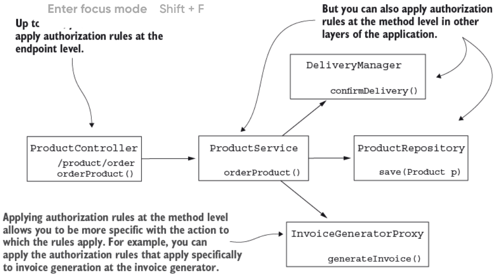
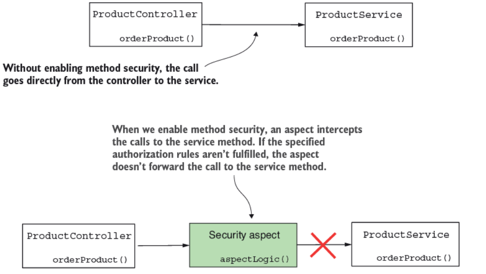
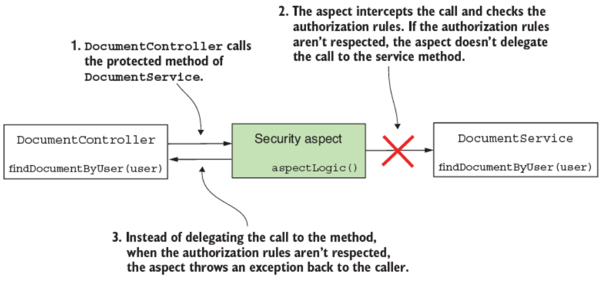
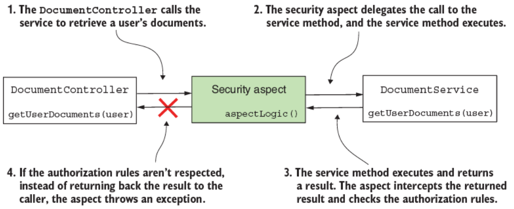
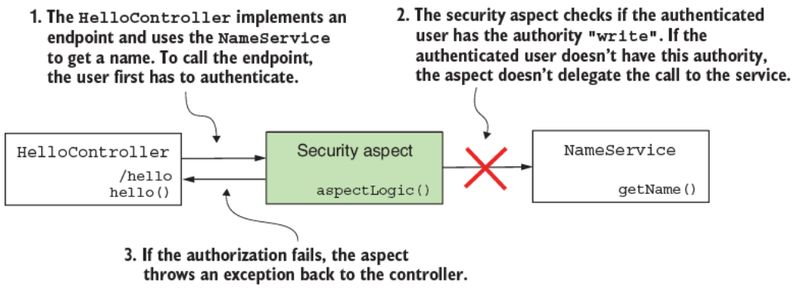
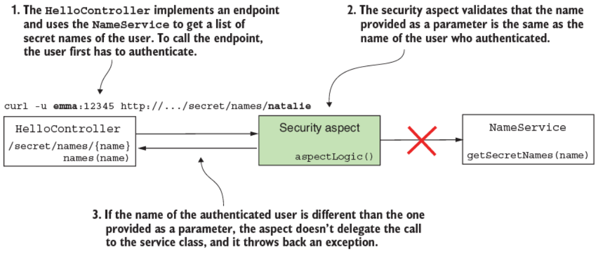
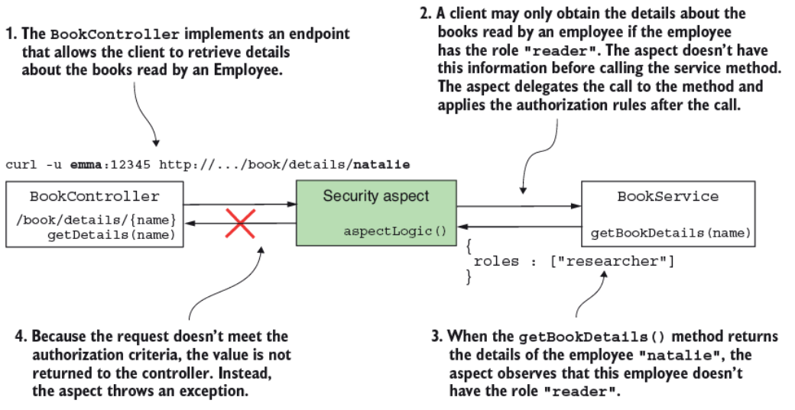

# 11. Hiện thực authorization ở mức method

> Bản dịch tiếng Việt của chương 11 — *Spring Security in Action, Second Edition* (Laurentiu Spilca, Manning).

**Nội dung chương này bao gồm:**

- Method security trong các ứng dụng Spring
- Preauthorization (phân quyền trước) cho method dựa trên authority, role, và permission
- Postauthorization (phân quyền sau) cho method dựa trên authority, role, và permission

Cho tới giờ, chúng ta đã bàn về nhiều cách khác nhau để cấu hình authentication (xác thực). Chúng ta bắt đầu với cách đơn giản nhất, HTTP Basic, ở chương 2, rồi tôi chỉ cho bạn cách thiết lập form login ở chương 6. Tuy nhiên, về mặt authorization (phân quyền), chúng ta mới chỉ bàn về việc cấu hình ở mức endpoint. Giả sử app của bạn không phải một web application — bạn không thể dùng Spring Security cho authentication và authorization được sao? Spring Security rất phù hợp với những tình huống mà app của bạn không được sử dụng qua các HTTP endpoint. Trong chương này, bạn sẽ học cách cấu hình authorization ở mức method. Chúng ta sẽ dùng cách tiếp cận này để cấu hình authorization trong cả web application lẫn ứng dụng không phải web, và chúng ta gọi nó là **method security** (hình 11.1).



**Hình 11.1** Method security cho phép bạn chi tiết hơn và áp dụng các quy tắc authorization ở bất kỳ tầng nào được chọn cụ thể trong ứng dụng của bạn.

Với các ứng dụng không phải web, method security cho phép chúng ta hiện thực các quy tắc authorization ngay cả khi chúng ta không có endpoint. Trong các web application, cách tiếp cận này cho chúng ta sự linh hoạt để áp dụng quy tắc authorization lên các tầng khác nhau của app, không chỉ ở mức endpoint. Hãy đi sâu vào chương này và học cách áp dụng authorization ở mức method với method security.

---

## 11.1 Bật method security

Mục này sẽ cho thấy cách bật authorization ở mức method và những lựa chọn khác nhau mà Spring Security cung cấp để áp dụng các quy tắc authorization đa dạng. Cách tiếp cận này mang lại cho bạn sự linh hoạt lớn hơn trong việc áp dụng authorization. Đó là một kỹ năng thiết yếu cho phép bạn giải quyết những tình huống mà authorization không thể được cấu hình chỉ ở mức endpoint.

Mặc định, method security bị tắt, nên nếu bạn muốn dùng chức năng này, trước hết bạn cần bật nó. Hơn nữa, method security cung cấp nhiều cách tiếp cận để áp dụng authorization. Chúng ta bàn về những cách tiếp cận này rồi hiện thực chúng trong các ví dụ ở những mục tiếp theo của chương này và ở chương 12. Nói ngắn gọn, bạn có thể làm hai việc chính với global method security:

- **Call authorization (phân quyền lời gọi)** — Quyết định xem ai đó có thể gọi một method theo một số quy tắc privilege (đặc quyền) được hiện thực hay không (preauthorization), hoặc liệu ai đó có thể truy cập những gì method trả về sau khi method thực thi hay không (postauthorization).
- **Filtering (lọc)** — Quyết định những gì một method có thể nhận qua tham số của nó (prefiltering) và những gì người gọi có thể nhận lại từ method sau khi method thực thi (postfiltering). Chúng ta sẽ bàn và hiện thực filtering ở chương 12.

### 11.1.1 Hiểu về call authorization

Một trong những cách tiếp cận để cấu hình quy tắc authorization dùng với method security là call authorization. Cách tiếp cận call authorization đề cập tới việc áp dụng các quy tắc authorization quyết định xem một method có thể được gọi hay không, hoặc cho phép method được gọi rồi mới quyết định xem người gọi có thể truy cập giá trị mà method trả về hay không. Thông thường, chúng ta cần quyết định xem ai đó có thể truy cập một mảnh logic hay không tùy thuộc vào tham số được cung cấp hoặc kết quả của nó. Vậy hãy bàn về call authorization rồi áp dụng nó vào một số ví dụ.

Method security hoạt động thế nào? Cơ chế đằng sau việc áp dụng quy tắc authorization là gì? Khi chúng ta bật method security trong ứng dụng, thực chất chúng ta bật một Spring aspect. Aspect này chặn các lời gọi tới method mà chúng ta áp dụng quy tắc authorization lên, và dựa trên những quy tắc authorization này, nó quyết định có chuyển tiếp lời gọi tới method bị chặn hay không (hình 11.2).



**Hình 11.2** Khi chúng ta bật global method security, một aspect chặn lời gọi tới method được bảo vệ. Nếu các quy tắc authorization đã cho không được tuân thủ, aspect không ủy quyền lời gọi tới method được bảo vệ.

Rất nhiều hiện thực trong Spring framework dựa vào aspect-oriented programming (AOP — lập trình hướng khía cạnh). Method security chỉ là một trong nhiều component trong các ứng dụng Spring dựa vào aspect. Nếu bạn cần ôn lại về aspect và AOP, tôi khuyến nghị bạn đọc chương 6 của cuốn *Spring Start Here* (Manning, 2021), một cuốn sách khác do tôi viết. Nói ngắn gọn, chúng ta phân loại call authorization thành:

- **Preauthorization** — Framework kiểm tra các quy tắc authorization **trước** lời gọi method.
- **Postauthorization** — Framework kiểm tra các quy tắc authorization **sau** khi method thực thi.

Hãy lấy cả hai cách tiếp cận, mô tả chúng, và hiện thực chúng với một số ví dụ.

#### Dùng preauthorization để bảo vệ quyền truy cập tới method

Giả sử chúng ta có một method `findDocumentsByUser(String username)` trả về cho người gọi các tài liệu cho một user cụ thể. Người gọi cung cấp qua tham số của method tên của user mà method truy xuất tài liệu cho họ. Giả sử bạn cần đảm bảo rằng user đã authentication chỉ có thể lấy tài liệu của chính họ. Chúng ta có thể áp dụng một quy tắc lên method này sao cho chỉ những lời gọi method nhận username của user đã authentication làm tham số mới được cho phép không? Có! Đây là điều chúng ta làm với preauthorization.

Khi chúng ta áp dụng các quy tắc authorization hoàn toàn cấm bất kỳ ai gọi một method trong những tình huống cụ thể, chúng ta gọi đây là **preauthorization** (hình 11.3). Cách tiếp cận này ngụ ý rằng framework kiểm chứng các điều kiện authorization trước khi thực thi method. Nếu người gọi không có quyền theo các quy tắc authorization mà chúng ta định nghĩa, framework không ủy quyền lời gọi tới method. Thay vào đó, framework ném ra một exception tên là `AccessDeniedException`. Đây là cách tiếp cận được dùng thường xuyên nhất cho global method security.



**Hình 11.3** Với preauthorization, các quy tắc authorization được kiểm chứng trước khi ủy quyền lời gọi method đi tiếp. Framework sẽ không ủy quyền lời gọi nếu các quy tắc authorization không được tuân thủ, và thay vào đó, nó sẽ ném ra một exception cho người gọi method.

Thông thường, chúng ta không muốn một chức năng được thực thi chút nào nếu một số điều kiện không được đáp ứng. Bạn có thể áp dụng điều kiện dựa trên user đã authentication, và bạn cũng có thể tham chiếu tới các giá trị mà method nhận qua tham số của nó.

#### Dùng postauthorization để bảo vệ một lời gọi method

Khi chúng ta áp dụng các quy tắc authorization cho phép ai đó gọi một method nhưng không nhất thiết được nhận kết quả trả về, chúng ta đang dùng **postauthorization** (hình 11.4). Với postauthorization, Spring Security kiểm tra các quy tắc authorization sau khi method thực thi. Bạn có thể dùng loại authorization này để hạn chế quyền truy cập tới giá trị trả về của method trong những điều kiện nhất định. Vì postauthorization xảy ra sau khi method thực thi, bạn có thể áp dụng các quy tắc authorization lên kết quả trả về.



**Hình 11.4** Với postauthorization, aspect ủy quyền lời gọi tới method được bảo vệ. Sau khi method được bảo vệ hoàn thành việc thực thi, aspect kiểm tra các quy tắc authorization. Nếu các quy tắc không được tuân thủ, thay vì trả kết quả về cho người gọi, aspect ném ra một exception.

Thông thường, chúng ta dùng postauthorization để áp dụng các quy tắc authorization dựa trên những gì method trả về sau khi thực thi. Nhưng hãy cẩn thận với postauthorization! Nếu method biến đổi thứ gì đó trong quá trình thực thi, thay đổi đó vẫn xảy ra bất kể authorization có thành công hay không.

> **NOTE** Ngay cả với annotation `@Transactional`, một thay đổi cũng không bị rollback nếu postauthorization thất bại. Exception do chức năng postauthorization ném ra xảy ra sau khi transaction manager commit transaction.

### 11.1.2 Bật method security trong project của bạn

Trong mục này, chúng ta làm một project để áp dụng các tính năng preauthorization và postauthorization do method security cung cấp. Method security không được bật mặc định trong một project Spring Security. Để dùng nó, trước hết bạn cần bật nó. Tuy nhiên, việc bật chức năng này rất đơn giản. Bạn làm điều đó đơn giản bằng cách dùng annotation `@EnableMethodSecurity` trên configuration class.

Tôi đã tạo một project mới cho ví dụ này, `ssia-ch11-ex1`. Với project này, tôi viết một configuration class `ProjectConfig`, như trình bày ở listing 11.1. Trên configuration class, chúng ta thêm annotation `@EnableMethodSecurity`. Method security cung cấp cho chúng ta ba cách tiếp cận sau để định nghĩa các quy tắc authorization mà chúng ta bàn trong chương này:

- Các annotation pre-/postauthorization (được bật mặc định)
- Annotation JSR 250, `@RolesAllowed`
- Annotation `@Secured`

Vì trong hầu hết mọi trường hợp, các annotation pre-/postauthorization là cách tiếp cận duy nhất được dùng, chúng ta bàn về nó trong chương này. Cách tiếp cận này được bật sẵn khi bạn thêm annotation `@EnableMethodSecurity`. Chúng ta trình bày một cái nhìn tổng quan ngắn gọn về hai lựa chọn kia ở cuối chương này.

**Listing 11.1 Bật method security**

```java
@Configuration
@EnableMethodSecurity
public class ProjectConfig {
}
```

Bạn có thể dùng global method security với bất kỳ cách tiếp cận authentication nào, từ HTTP Basic authentication tới OAuth 2 (thứ bạn sẽ học ở phần ba của cuốn sách này). Để giữ mọi thứ đơn giản và cho phép bạn tập trung vào những chi tiết mới, chúng ta cung cấp method security với HTTP Basic authentication. Vì lý do này, file *pom.xml* cho các project trong chương này chỉ cần dependency web và Spring Security, như đoạn code kế tiếp trình bày:

```xml
<dependency>
   <groupId>org.springframework.boot</groupId>
   <artifactId>spring-boot-starter-security</artifactId>
</dependency>
<dependency>
   <groupId>org.springframework.boot</groupId>
   <artifactId>spring-boot-starter-web</artifactId>
</dependency>
```

> **NOTE** Ở các phiên bản Spring Security trước đây, chúng ta dùng annotation `@EnableGlobalMethodSecurity`, và pre- và postauthorization không được bật mặc định. Nếu bạn cần làm việc với method authorization và một phiên bản Spring Security cũ hơn (cũ hơn 6), bạn có thể thấy chương 16 của ấn bản đầu tiên cuốn *Spring Security in Action* hữu ích.

---

## 11.2 Áp dụng quy tắc preauthorization

Trong mục này, chúng ta hiện thực một ví dụ preauthorization. Với ví dụ của mình, chúng ta tiếp tục với project `ssia-ch11-ex1` đã bắt đầu ở mục 11.1. Như đã bàn ở mục 11.1, preauthorization ngụ ý việc định nghĩa các quy tắc authorization mà Spring Security áp dụng trước khi gọi một method cụ thể. Nếu các quy tắc không được tuân thủ, framework không gọi method.

Ứng dụng chúng ta hiện thực trong mục này có một tình huống đơn giản. Nó expose một endpoint, `/hello`, trả về chuỗi `"Hello"`, theo sau là một cái tên. Để lấy tên, controller gọi một service method (hình 11.5). Method này áp dụng một quy tắc preauthorization để kiểm chứng user có authority `write` hay không.



**Hình 11.5** Để gọi method `getName()` của `NameService`, user đã authentication cần có authority `write`. Nếu user không có authority này, framework sẽ không cho phép lời gọi và sẽ ném ra một exception.

Tôi đã thêm một `UserDetailsService` và một `PasswordEncoder` để đảm bảo có một số user để authentication. Để kiểm chứng giải pháp của mình, chúng ta cần hai user: một người có authority `write` và một người không có. Chúng ta chứng minh rằng user thứ nhất có thể gọi endpoint thành công, trong khi với user thứ hai, app ném ra một exception authorization khi cố gọi method. Listing sau đây cho thấy định nghĩa đầy đủ của configuration class, thứ định nghĩa `UserDetailsService` và `PasswordEncoder`.

**Listing 11.2 Configuration class cho `UserDetailsService` và `PasswordEncoder`**

```java
@Configuration
@EnableMethodSecurity                 // ①
public class ProjectConfig {

  @Bean                               // ②
  public UserDetailsService userDetailsService() {
    var service = new InMemoryUserDetailsManager();

    var u1 = User.withUsername("natalie")
              .password("12345")
              .authorities("read")
              .build();

    var u2 = User.withUsername("emma")
              .password("12345")
              .authorities("write")
              .build();

    service.createUser(u1);
    service.createUser(u2);

    return service;
  }

  @Bean                              // ③
  public PasswordEncoder passwordEncoder() {
    return NoOpPasswordEncoder.getInstance();
  }
}
```

① Bật method security cho pre-/postauthorization.

② Thêm một `UserDetailsService` vào Spring context với hai user để test.

③ Thêm một `PasswordEncoder` vào Spring context.

Để định nghĩa quy tắc authorization cho method này, chúng ta dùng annotation `@PreAuthorize`. Annotation `@PreAuthorize` nhận giá trị là một biểu thức Spring Expression Language (SpEL) mô tả quy tắc authorization. Trong ví dụ này, chúng ta áp dụng một quy tắc đơn giản.

Bạn có thể định nghĩa các hạn chế cho user dựa trên authority của họ bằng phương thức `hasAuthority()`. Bạn đã học về phương thức `hasAuthority()` ở chương 7, nơi chúng ta bàn về việc áp dụng authorization ở mức endpoint. Listing sau đây định nghĩa service class, thứ cung cấp giá trị cho cái tên.

**Listing 11.3 Service class định nghĩa quy tắc preauthorization trên method**

```java
@Service
public class NameService {

  @PreAuthorize("hasAuthority('write')")       // ①
  public String getName() {
    return "Fantastico";
  }
}
```

① Định nghĩa quy tắc authorization. Chỉ những user có authority `write` mới có thể gọi method.

Chúng ta định nghĩa controller class ở listing sau đây. Nó dùng `NameService` làm một dependency.

**Listing 11.4 Controller class hiện thực endpoint và dùng service**

```java
@RestController
public class HelloController {

  private final NameService nameService;         // ①

  // constructor được lược bỏ

  @GetMapping("/hello")
  public String hello() {
    return "Hello, " + nameService.getName();    // ②
  }
}
```

① Inject service từ context.

② Gọi method mà chúng ta áp dụng quy tắc preauthorization lên.

Giờ bạn có thể khởi động ứng dụng và test hành vi của nó. Chúng ta mong đợi chỉ user Emma được authorize để gọi endpoint vì cô ấy có authority `write`. Đoạn code kế tiếp trình bày các lời gọi tới endpoint với hai user của chúng ta, Emma và Natalie. Để gọi endpoint `/hello` và authentication bằng user Emma, dùng lệnh cURL này:

```bash
curl -u emma:12345 http://localhost:8080/hello
```

Response body là

```
Hello, Fantastico
```

Để gọi endpoint `/hello` và authentication bằng user Natalie, dùng lệnh cURL này:

```bash
curl -u natalie:12345 http://localhost:8080/hello
```

Response body là

```json
{
  "status":403,
  "error":"Forbidden",
  "message":"Forbidden",
  "path":"/hello"
}
```

Tương tự, bạn có thể dùng bất kỳ biểu thức nào khác mà chúng ta đã bàn ở chương 7 cho endpoint authentication. Đây là phần tóm tắt ngắn gọn về chúng:

- `hasAnyAuthority()` — Chỉ định nhiều authority. User phải có ít nhất một trong những authority này để gọi method.
- `hasRole()` — Chỉ định một role mà user phải có để gọi method.
- `hasAnyRole()` — Chỉ định nhiều role. User phải có ít nhất một trong số đó để gọi method.

Hãy mở rộng ví dụ của chúng ta để chứng minh cách bạn có thể dùng giá trị của các tham số method để định nghĩa quy tắc authorization (hình 11.6). Bạn tìm thấy ví dụ này trong project tên là `ssia-ch11-ex2`.



**Hình 11.6** Khi hiện thực preauthorization, chúng ta có thể dùng giá trị của các tham số method trong quy tắc authorization. Trong ví dụ của chúng ta, chỉ user đã authentication mới có thể truy xuất thông tin về tên bí mật của chính họ.

Với project này, tôi định nghĩa cùng class `ProjectConfig` như trong ví dụ đầu tiên để chúng ta có thể tiếp tục làm việc với hai user, Emma và Natalie. Endpoint giờ nhận một giá trị qua path variable và gọi một service class để lấy "tên bí mật" cho một username cho trước. Tất nhiên, trong trường hợp này, tên bí mật chỉ là phát minh của tôi, ám chỉ một đặc điểm của user, thứ mà không phải ai cũng thấy được. Tôi định nghĩa controller class như trình bày ở listing kế tiếp.

**Listing 11.5 Controller class định nghĩa một endpoint để test**

```java
@RestController
public class HelloController {

  private final NameService nameService;                   // ①

  // constructor được lược bỏ

  @GetMapping("/secret/names/{name}")                      // ②
  public List<String> names(@PathVariable String name) {
      return nameService.getSecretNames(name);             // ③
  }
}
```

① Từ context, inject một instance của service class định nghĩa method được bảo vệ.

② Định nghĩa một endpoint nhận một giá trị từ path variable.

③ Gọi method được bảo vệ để lấy tên bí mật của user.

Giờ hãy xem cách hiện thực class `NameService` ở listing 11.6. Biểu thức chúng ta dùng cho authorization bây giờ là `#name == authentication.principal.username`. Trong biểu thức này, chúng ta dùng `#name` để tham chiếu tới giá trị của tham số method `getSecretNames()` tên là `name`, và chúng ta có quyền truy cập trực tiếp tới object `authentication` mà chúng ta có thể dùng để tham chiếu tới user đang được authentication hiện tại. Biểu thức chúng ta dùng chỉ ra rằng method chỉ có thể được gọi nếu username của user đã authentication trùng với giá trị được gửi qua tham số của method. Nói cách khác, một user chỉ có thể truy xuất tên bí mật của chính mình.

**Listing 11.6 Class `NameService` định nghĩa method được bảo vệ**

```java
@Service
public class NameService {

  private Map<String, List<String>> secretNames =
    Map.of(
     "natalie", List.of("Energico", "Perfecto"),
     "emma", List.of("Fantastico"));

  @PreAuthorize                                     // ①
    ("#name == authentication.principal.username")
  public List<String> getSecretNames(String name) {
    return secretNames.get(name);
  }
}
```

① Dùng `#name` để biểu diễn giá trị của tham số method trong biểu thức authorization.

Chúng ta khởi động ứng dụng và test nó để chứng minh nó hoạt động như mong muốn. Đoạn code kế tiếp cho thấy hành vi của ứng dụng khi gọi endpoint, cung cấp giá trị của path variable bằng với tên của user:

```bash
curl -u emma:12345 http://localhost:8080/secret/names/emma
```

Response body là

```json
["Fantastico"]
```

Khi authentication bằng user Emma, chúng ta thử lấy tên bí mật của Natalie. Lời gọi không hoạt động:

```bash
curl -u emma:12345 http://localhost:8080/secret/names/natalie
```

Response body là

```json
{
  "status":403,
  "error":"Forbidden",
  "message":"Forbidden",
  "path":"/secret/names/natalie"
}
```

Tuy nhiên, user Natalie có thể lấy tên bí mật của chính cô ấy. Đoạn code kế tiếp chứng minh điều này:

```bash
curl -u natalie:12345 http://localhost:8080/secret/names/natalie
```

Response body là

```json
["Energico","Perfecto"]
```

> **NOTE** Hãy nhớ, bạn có thể áp dụng method security cho bất kỳ tầng nào của ứng dụng. Trong các ví dụ được trình bày ở chương này, bạn thấy các quy tắc authorization được áp dụng cho method của những service class. Tuy nhiên, bạn có thể áp dụng quy tắc authorization với method security cho bất kỳ phần nào của ứng dụng: controller, repository, manager, proxy, v.v.

---

## 11.3 Áp dụng quy tắc postauthorization

Giả sử bạn muốn cho phép một lời gọi tới một method, nhưng trong một số hoàn cảnh nhất định, bạn muốn đảm bảo người gọi không nhận được giá trị trả về. Khi chúng ta muốn áp dụng một quy tắc authorization được kiểm chứng sau lời gọi của một method, chúng ta dùng postauthorization. Ban đầu nghe có vẻ hơi kỳ lạ: Tại sao ai đó có thể thực thi code nhưng không nhận được kết quả? Vấn đề không nằm ở bản thân method, mà hãy hình dung method này truy xuất dữ liệu nào đó từ một nguồn dữ liệu, chẳng hạn một web service hoặc một database. Các điều kiện bạn cần thêm cho authorization phụ thuộc vào dữ liệu nhận được. Vậy nên bạn cho phép method thực thi, nhưng bạn kiểm chứng những gì nó trả về, và nếu nó không đáp ứng tiêu chí, bạn không cho người gọi truy cập giá trị trả về.

Để áp dụng quy tắc postauthorization với Spring Security, chúng ta dùng annotation `@PostAuthorize`, tương tự `@PreAuthorize` đã bàn ở mục 11.2. Annotation này nhận SpEL làm giá trị, định nghĩa một quy tắc authorization. Chúng ta tiếp tục với một ví dụ cho thấy cách dùng annotation `@PostAuthorize` và định nghĩa quy tắc postauthorization cho một method (hình 11.7).



**Hình 11.7** Với postauthorization, chúng ta không bảo vệ method khỏi việc bị gọi, mà chúng ta bảo vệ giá trị trả về khỏi việc bị phơi bày nếu các quy tắc authorization đã định nghĩa không được tuân thủ.

Tình huống cho ví dụ của chúng ta, mà tôi đã tạo một project tên là `ssia-ch11-ex3`, định nghĩa một object `Employee`. `Employee` của chúng ta có một cái tên, một danh sách sách, và một danh sách authority. Chúng ta liên kết mỗi `Employee` với một user của ứng dụng. Để nhất quán với các ví dụ khác trong chương này, chúng ta định nghĩa cùng những user, Emma và Natalie. Chúng ta muốn đảm bảo rằng người gọi method chỉ nhận được chi tiết nhân viên nếu nhân viên đó có authority `read`. Vì chúng ta không biết các authority gắn với bản ghi nhân viên cho tới khi truy xuất nó, chúng ta cần áp dụng quy tắc authorization sau khi method thực thi. Vì lý do này, chúng ta dùng annotation `@PostAuthorize`.

Configuration class giống với cái chúng ta đã dùng trong các ví dụ trước. Nhưng để tiện cho bạn, tôi lặp lại nó ở listing kế tiếp.

**Listing 11.7 Bật method security và định nghĩa user**

```java
@Configuration
@EnableMethodSecurity
public class ProjectConfig {

  @Bean
  public UserDetailsService userDetailsService() {
    var service = new InMemoryUserDetailsManager();

    var u1 = User.withUsername("natalie")
                 .password("12345")
                 .authorities("read")
                 .build();

    var u2 = User.withUsername("emma")
                 .password("12345")
                 .authorities("write")
                 .build();

    service.createUser(u1);
    service.createUser(u2);

    return service;
  }

  @Bean
  public PasswordEncoder passwordEncoder() {
    return NoOpPasswordEncoder.getInstance();
  }
}
```

Chúng ta cũng cần khai báo một class để biểu diễn object `Employee` với tên, danh sách sách, và danh sách role của nó. Listing sau đây định nghĩa class `Employee`.

**Listing 11.8 Định nghĩa của class `Employee`**

```java
public class Employee {
  private String name;
  private List<String> books;
  private List<String> roles;

  // Đã lược bỏ constructor, getter, và setter
}
```

Chúng ta có lẽ lấy chi tiết nhân viên từ một database. Để ví dụ ngắn gọn hơn, tôi dùng một `Map` với vài bản ghi mà chúng ta coi là nguồn dữ liệu của mình. Ở listing 11.9, bạn tìm thấy định nghĩa của class `BookService`. Class `BookService` cũng chứa method mà chúng ta áp dụng quy tắc authorization lên. Hãy để ý rằng biểu thức chúng ta dùng với annotation `@PostAuthorize` tham chiếu tới giá trị do method trả về bằng `returnObject`. Biểu thức postauthorization có thể dùng giá trị do method trả về, thứ khả dụng sau khi method thực thi.

**Listing 11.9 Class `BookService` định nghĩa method được authorize**

```java
@Service
public class BookService {

  private Map<String, Employee> records =
    Map.of("emma",
           new Employee("Emma Thompson",
               List.of("Karamazov Brothers"),
               List.of("accountant", "reader")),
           "natalie",
           new Employee("Natalie Parker",
               List.of("Beautiful Paris"),
               List.of("researcher"))
        );

  @PostAuthorize("returnObject.roles.contains('reader')")      // ①
  public Employee getBookDetails(String name) {
      return records.get(name);
  }
}
```

① Định nghĩa biểu thức cho postauthorization.

Hãy cùng viết một controller và hiện thực một endpoint để gọi method mà chúng ta đã áp dụng quy tắc authorization lên. Listing sau đây trình bày controller class này.

**Listing 11.10 Controller class hiện thực endpoint**

```java
@RestController
public class BookController {

  private final BookService bookService;

  // constructor được lược bỏ

  @GetMapping("/book/details/{name}")
  public Employee getDetails(@PathVariable String name) {
    return bookService.getBookDetails(name);
  }
}
```

Giờ bạn có thể khởi động ứng dụng và gọi endpoint để quan sát hành vi của app. Trong các đoạn code kế tiếp, bạn tìm thấy các ví dụ về việc gọi endpoint. Bất kỳ user nào cũng có thể truy cập chi tiết của Emma vì danh sách role trả về chứa chuỗi `"reader"`, nhưng không user nào có thể lấy chi tiết của Natalie. Gọi endpoint để lấy chi tiết của Emma và authentication bằng user Emma, chúng ta thực hiện lệnh sau:

```bash
curl -u emma:12345 http://localhost:8080/book/details/emma
```

Response body là

```json
{
  "name":"Emma Thompson",
  "books":["Karamazov Brothers"],
  "roles":["accountant","reader"]
}
```

Gọi endpoint để lấy chi tiết của Emma và authentication bằng user Natalie, chúng ta dùng

```bash
curl -u natalie:12345 http://localhost:8080/book/details/emma
```

Response body là

```json
{
  "name":"Emma Thompson",
  "books":["Karamazov Brothers"],
  "roles":["accountant","reader"]
}
```

Gọi endpoint để lấy chi tiết của Natalie và authentication bằng user Emma, chúng ta dùng

```bash
curl -u emma:12345 http://localhost:8080/book/details/natalie
```

Response body là

```json
{
  "status":403,
  "error":"Forbidden",
  "message":"Forbidden",
  "path":"/book/details/natalie"
}
```

Gọi endpoint để lấy chi tiết của Natalie và authentication bằng user Natalie, chúng ta dùng lệnh này:

```bash
curl -u natalie:12345 http://localhost:8080/book/details/natalie
```

Response body là

```json
{
  "status":403,
  "error":"Forbidden",
  "message":"Forbidden",
  "path":"/book/details/natalie"
}
```

> **NOTE** Bạn có thể dùng cả `@PreAuthorize` lẫn `@PostAuthorize` cho cùng một method nếu yêu cầu của bạn cần có cả preauthorization lẫn postauthorization.

---

## 11.4 Hiện thực permission cho method

Cho tới giờ, bạn đã học cách định nghĩa quy tắc với những biểu thức đơn giản cho preauthorization và postauthorization. Giờ hãy giả sử logic authorization phức tạp hơn, và bạn không thể viết nó trong một dòng. Chắc chắn không thoải mái khi phải viết những biểu thức SpEL khổng lồ. Tôi không bao giờ khuyến nghị dùng những biểu thức SpEL dài trong bất kỳ tình huống nào, bất kể đó có phải quy tắc authorization hay không. Nó đơn giản tạo ra code khó đọc, và điều này ảnh hưởng tới khả năng bảo trì của app. Khi bạn cần hiện thực các quy tắc authorization phức tạp thay vì viết những biểu thức SpEL dài, hãy tách logic ra một class riêng. Spring Security cung cấp khái niệm **permission**, thứ giúp dễ dàng viết các quy tắc authorization trong một class riêng để ứng dụng của bạn dễ đọc và dễ hiểu hơn.

Trong mục này, chúng ta áp dụng quy tắc authorization bằng permission trong một project. Tôi đặt tên project này là `ssia-ch11-ex4`. Trong tình huống này, bạn có một ứng dụng quản lý tài liệu. Mỗi tài liệu có một chủ sở hữu, là user đã tạo ra tài liệu đó. Để lấy chi tiết của một tài liệu hiện có, một user hoặc phải là admin, hoặc phải là chủ sở hữu của tài liệu. Chúng ta hiện thực một permission evaluator để giải quyết yêu cầu này. Listing sau đây định nghĩa `Document`, thứ chỉ là một object Java thuần túy.

**Listing 11.11 Class `Document`**

```java
public class Document {
  private String owner;

  // Đã lược bỏ constructor, getter, và setter
}
```

Để giả lập database và làm ví dụ ngắn gọn hơn cho bạn thoải mái, tôi đã tạo một repository class quản lý vài instance `Document` trong một `Map`. Class này được trình bày ở listing kế tiếp.

**Listing 11.12 Class `DocumentRepository` quản lý vài instance `Document`**

```java
@Repository
public class DocumentRepository {

  private Map<String, Document> documents =        // ①
    Map.of("abc123", new Document("natalie"),
           "qwe123", new Document("natalie"),
           "asd555", new Document("emma"));

  public Document findDocument(String code) {
    return documents.get(code);                    // ②
  }
}
```

① Định danh mỗi tài liệu bằng một mã duy nhất và nêu tên chủ sở hữu.

② Lấy một tài liệu bằng mã định danh duy nhất của nó.

Một service class định nghĩa một method dùng repository để lấy một tài liệu theo mã của nó. Method trong service class là method mà chúng ta áp dụng quy tắc authorization lên. Logic của class rất đơn giản. Nó định nghĩa một method trả về `Document` theo mã duy nhất của nó. Chúng ta annotate method này bằng `@PostAuthorize` và dùng một biểu thức SpEL `hasPermission()`. Method này cho phép chúng ta tham chiếu tới một biểu thức authorization bên ngoài mà chúng ta hiện thực tiếp theo trong ví dụ này. Trong lúc đó, hãy quan sát rằng các tham số chúng ta cung cấp cho method `hasPermission()` là `returnObject`, thứ biểu diễn giá trị do method trả về, và tên của role mà chúng ta cho phép truy cập, đó là `'ROLE_admin'`. Định nghĩa của class này được trình bày ở listing sau đây.

**Listing 11.13 Class `DocumentService` hiện thực method được bảo vệ**

```java
@Service
public class DocumentService {

  private final DocumentRepository documentRepository;

  // constructor được lược bỏ

  @PostAuthorize                                  // ①
  ("hasPermission(returnObject, 'ROLE_admin')")
  public Document getDocument(String code) {
    return documentRepository.findDocument(code);
  }
}
```

① Dùng biểu thức `hasPermission()` để tham chiếu tới một biểu thức authorization.

Nhiệm vụ của chúng ta là hiện thực logic permission. Và chúng ta làm điều này bằng cách viết một object hiện thực contract `PermissionEvaluator`. Contract `PermissionEvaluator` cung cấp hai cách để hiện thực logic permission:

- **Theo object và permission** — Được dùng trong ví dụ hiện tại, nó giả định permission evaluator nhận hai object: một object là đối tượng của quy tắc authorization và một object cung cấp thêm chi tiết cần thiết để hiện thực logic permission.
- **Theo object ID, kiểu object, và permission** — Giả định permission evaluator nhận một object ID mà nó có thể dùng để truy xuất object cần thiết. Nó cũng nhận một kiểu object, thứ có thể dùng nếu cùng một permission evaluator áp dụng cho nhiều kiểu object, và nó cần một object cung cấp thêm chi tiết để đánh giá permission.

Ở listing kế tiếp, bạn tìm thấy contract `PermissionEvaluator` với hai method.

**Listing 11.14 Định nghĩa contract `PermissionEvaluator`**

```java
public interface PermissionEvaluator {

    boolean hasPermission(
              Authentication a,
              Object subject,
              Object permission);

    boolean hasPermission(
              Authentication a,
              Serializable id,
              String type,
              Object permission);
}
```

Với ví dụ hiện tại, dùng method đầu tiên là đủ. Chúng ta đã có subject, trong trường hợp của chúng ta là giá trị do method trả về. Chúng ta cũng gửi tên role `'ROLE_admin'`, thứ mà theo định nghĩa của tình huống ví dụ, có thể truy cập bất kỳ tài liệu nào. Tất nhiên, trong ví dụ của chúng ta, chúng ta có thể đã dùng trực tiếp tên của role trong permission evaluator class và tránh việc gửi nó như một giá trị của object `hasPermission()`. Ở đây, chúng ta chỉ làm theo cách trước vì mục đích minh họa. Trong một tình huống thực tế, vốn có thể phức tạp hơn, bạn có nhiều method, và các chi tiết cần thiết trong tiến trình authorization có thể khác nhau giữa từng cái. Vì lý do này, bạn có một tham số mà bạn có thể gửi các chi tiết cần thiết để dùng trong logic authorization từ mức method.

Để bạn nhận biết và tránh nhầm lẫn, tôi cũng muốn đề cập rằng bạn không phải truyền object `Authentication`. Spring Security tự động cung cấp giá trị tham số này khi gọi method `hasPermission()`. Framework biết giá trị của instance authentication vì nó đã có trong `SecurityContext`. Ở listing kế tiếp, bạn tìm thấy class `DocumentsPermissionEvaluator`, thứ trong ví dụ của chúng ta hiện thực contract `PermissionEvaluator` để định nghĩa quy tắc authorization tùy chỉnh.

**Listing 11.15 Hiện thực quy tắc authorization**

```java
@Component
public class DocumentsPermissionEvaluator
  implements PermissionEvaluator {                  // ①

  @Override
  public boolean hasPermission(
    Authentication authentication,
    Object target,
    Object permission) {

    Document document = (Document) target;          // ②
    String p = (String) permission;                 // ③

    boolean admin =                                 // ④
      authentication.getAuthorities()
        .stream()
        .anyMatch(a -> a.getAuthority().equals(p));

    return admin ||                                 // ⑤
      document.getOwner()
        .equals(authentication.getName());
  }

  @Override
  public boolean hasPermission(Authentication authentication,
                               Serializable targetId,
                               String targetType,
                               Object permission) {
    return false;                                   // ⑥
  }
}
```

① Hiện thực contract `PermissionEvaluator`.

② Ép kiểu object đích thành `Document`.

③ Object permission trong trường hợp của chúng ta là tên role, nên chúng ta ép kiểu nó thành `String`.

④ Kiểm tra xem user đã authentication có role mà chúng ta nhận làm tham số hay không.

⑤ Nếu là admin hoặc user đã authentication là chủ sở hữu của tài liệu, cấp permission.

⑥ Chúng ta không cần hiện thực method thứ hai vì chúng ta không dùng nó.

Để Spring Security nhận biết được hiện thực `PermissionEvaluator` mới của chúng ta, chúng ta phải định nghĩa một bean `MethodSecurityExpressionHandler` trong configuration class. Listing sau đây trình bày cách định nghĩa một `MethodSecurityExpressionHandler` để làm cho `PermissionEvaluator` tùy chỉnh được biết đến.

**Listing 11.16 Cấu hình `PermissionEvaluator` trong configuration class**

```java
@Configuration
@EnableMethodSecurity
public class ProjectConfig {

  private final DocumentsPermissionEvaluator evaluator;

  // constructor được lược bỏ

  @Bean                                                 // ①
  protected MethodSecurityExpressionHandler createExpressionHandler() {
    var expressionHandler =                             // ②
        new DefaultMethodSecurityExpressionHandler();

    expressionHandler.setPermissionEvaluator(
        evaluator);                                     // ③

    return expressionHandler;                           // ④
  }

  // Đã lược bỏ định nghĩa của UserDetailsService và PasswordEncoder
}
```

① Làm cho object `MethodSecurityExpressionHandler` được trả về trở thành một bean trong Spring context.

② Tạo một security expression handler mặc định để thiết lập permission evaluator tùy chỉnh.

③ Thiết lập permission evaluator tùy chỉnh.

④ Trả về expression handler tùy chỉnh để được thêm vào Spring context.

> **NOTE** Ở đây chúng ta dùng một hiện thực cho `MethodSecurityExpressionHandler` tên là `DefaultMethodSecurityExpressionHandler` do Spring Security cung cấp. Bạn cũng có thể hiện thực một `MethodSecurityExpressionHandler` tùy chỉnh để định nghĩa các biểu thức SpEL tùy chỉnh mà bạn dùng để áp dụng quy tắc authorization. Bạn hiếm khi cần làm điều này trong tình huống thực tế, và vì lý do đó, chúng ta sẽ không hiện thực một object tùy chỉnh như vậy trong các ví dụ. Tôi chỉ muốn bạn biết rằng điều này là khả thi.

Tôi tách riêng định nghĩa của `UserDetailsService` và `PasswordEncoder` để bạn chỉ tập trung vào code mới. Ở listing 11.17, bạn có thể tìm thấy phần còn lại của configuration class. Điều duy nhất quan trọng cần chú ý về các user là role của họ. User Natalie là admin và có thể truy cập bất kỳ tài liệu nào. User Emma là manager và chỉ có thể truy cập tài liệu của chính cô ấy.

**Listing 11.17 Định nghĩa đầy đủ của configuration class**

```java
@Configuration
@EnableMethodSecurity
public class ProjectConfig {

  private final DocumentsPermissionEvaluator evaluator;

  // constructor được lược bỏ

  @Bean
  protected MethodSecurityExpressionHandler createExpressionHandler() {
    var expressionHandler =
        new DefaultMethodSecurityExpressionHandler();
    expressionHandler.setPermissionEvaluator(evaluator);
    return expressionHandler;
  }

  @Bean
  public UserDetailsService userDetailsService() {
    var service = new InMemoryUserDetailsManager();

    var u1 = User.withUsername("natalie")
             .password("12345")
             .roles("admin")
             .build();

     var u2 = User.withUsername("emma")
              .password("12345")
              .roles("manager")
              .build();

     service.createUser(u1);
     service.createUser(u2);

     return service;
  }

  @Bean
  public PasswordEncoder passwordEncoder() {
    return NoOpPasswordEncoder.getInstance();
  }
}
```

> **Ghi chú của người dịch:** Trong sách gốc, listing 11.17 đánh dấu `createExpressionHandler()` bằng `@Override` (còn sót lại từ cách viết cũ với `GlobalMethodSecurityConfiguration`), và dòng khai báo method bị cắt cụt dấu `{`. Tôi đã thống nhất thành `@Bean` như ở listing 11.16 để đoạn code nhất quán và biên dịch được.

Để test ứng dụng, chúng ta định nghĩa một endpoint. Listing sau đây trình bày định nghĩa này.

**Listing 11.18 Định nghĩa controller class và hiện thực một endpoint**

```java
@RestController
public class DocumentController {

  private final DocumentService documentService;

  // constructor được lược bỏ

  @GetMapping("/documents/{code}")
  public Document getDetails(@PathVariable String code) {
    return documentService.getDocument(code);
  }
}
```

Hãy chạy ứng dụng và gọi endpoint để quan sát hành vi của nó. User Natalie có thể truy cập tài liệu bất kể chủ sở hữu của chúng là ai. User Emma chỉ có thể truy cập những tài liệu cô ấy sở hữu. Gọi endpoint cho một tài liệu thuộc về Natalie và authentication bằng user `"natalie"`, chúng ta dùng lệnh này:

```bash
curl -u natalie:12345 http://localhost:8080/documents/abc123
```

Response body là

```json
{
  "owner":"natalie"
}
```

Gọi endpoint cho một tài liệu thuộc về Emma và authentication bằng user `"natalie"`, chúng ta dùng

```bash
curl -u natalie:12345 http://localhost:8080/documents/asd555
```

Response body là

```json
{
  "owner":"emma"
}
```

Gọi endpoint cho một tài liệu thuộc về Emma và authentication bằng user `"emma"`, chúng ta dùng

```bash
curl -u emma:12345 http://localhost:8080/documents/asd555
```

Response body là

```json
{
  "owner":"emma"
}
```

Gọi endpoint cho một tài liệu thuộc về Natalie và authentication bằng user `"emma"`, chúng ta dùng

```bash
curl -u emma:12345 http://localhost:8080/documents/abc123
```

Response body là

```json
{
  "status":403,
  "error":"Forbidden",
  "message":"Forbidden",
  "path":"/documents/abc123"
}
```

Theo cách tương tự, bạn có thể dùng method `PermissionEvaluator` thứ hai để viết biểu thức authorization của mình. Method thứ hai đề cập tới việc dùng một định danh và kiểu subject thay vì chính object đó. Ví dụ, giả sử chúng ta muốn thay đổi ví dụ hiện tại để áp dụng quy tắc authorization trước khi method được thực thi, dùng `@PreAuthorize`. Trong trường hợp này, chúng ta chưa có object trả về. Nhưng thay vì có chính object, chúng ta có mã của tài liệu, vốn là định danh duy nhất của nó. Listing kế tiếp cho bạn thấy cách thay đổi permission evaluator class để hiện thực tình huống này. Tôi đã tách các ví dụ vào một project tên là `ssia-ch11-ex5`, thứ bạn có thể chạy riêng.

**Listing 11.19 Các thay đổi trong class `DocumentsPermissionEvaluator`**

```java
@Component
public class DocumentsPermissionEvaluator
  implements PermissionEvaluator {

  private final DocumentRepository documentRepository;

  // constructor được lược bỏ

  @Override
  public boolean hasPermission(Authentication authentication,
                               Object target,
                               Object permission) {
    return false;                                                // ①
  }

  @Override
  public boolean hasPermission(Authentication authentication,
                                 Serializable targetId,
                                 String targetType,
                                 Object permission) {
    String code = targetId.toString();                           // ②
    Document document = documentRepository.findDocument(code);

    String p = (String) permission;

    boolean admin =
           authentication.getAuthorities()
              .stream()
              .anyMatch(a -> a.getAuthority().equals(p));

     return admin ||                                             // ③
       document.getOwner().equals(
         authentication.getName());
  }
}
```

① Không còn định nghĩa quy tắc authorization qua method thứ nhất.

② Thay vì có object, chúng ta có ID của nó, và chúng ta lấy object bằng ID.

③ Nếu user là admin hoặc chủ sở hữu của tài liệu, user có thể truy cập tài liệu.

Tất nhiên, chúng ta cũng cần dùng lời gọi đúng tới permission evaluator với annotation `@PreAuthorize`. Ở listing sau đây, bạn tìm thấy thay đổi tôi đã thực hiện trong class `DocumentService` để áp dụng quy tắc authorization với method mới.

**Listing 11.20 Class `DocumentService`**

```java
@Service
public class DocumentService {

  private final DocumentRepository documentRepository;

  // constructor được lược bỏ

  @PreAuthorize                                       // ①
   ("hasPermission(#code, 'document', 'ROLE_admin')")
  public Document getDocument(String code) {
    return documentRepository.findDocument(code);
  }
}
```

① Áp dụng quy tắc preauthorization bằng cách dùng method thứ hai của permission evaluator.

Bạn có thể chạy lại ứng dụng và kiểm tra hành vi của endpoint. Bạn sẽ thấy cùng kết quả như trong trường hợp chúng ta dùng method thứ nhất của permission evaluator để hiện thực quy tắc authorization. User Natalie là admin và có thể truy cập chi tiết của bất kỳ tài liệu nào, trong khi user Emma chỉ có thể truy cập những tài liệu cô ấy sở hữu. Gọi endpoint cho một tài liệu thuộc về Natalie và authentication bằng user `"natalie"`, chúng ta thực hiện

```bash
curl -u natalie:12345 http://localhost:8080/documents/abc123
```

Response body là

```json
{
  "owner":"natalie"
}
```

Gọi endpoint cho một tài liệu thuộc về Emma và authentication bằng user `"natalie"`, chúng ta thực hiện

```bash
curl -u natalie:12345 http://localhost:8080/documents/asd555
```

Response body là

```json
{
  "owner":"emma"
}
```

Gọi endpoint cho một tài liệu thuộc về Emma và authentication bằng user `"emma"`, chúng ta thực hiện

```bash
curl -u emma:12345 http://localhost:8080/documents/asd555
```

Response body là

```json
{
  "owner":"emma"
}
```

Gọi endpoint cho một tài liệu thuộc về Natalie và authentication bằng user `"emma"`, chúng ta thực hiện

```bash
curl -u emma:12345 http://localhost:8080/documents/abc123
```

Response body là

```json
{
  "status":403,
  "error":"Forbidden",
  "message":"Forbidden",
  "path":"/documents/abc123"
}
```

---

> ### Dùng annotation `@Secured` và `@RolesAllowed`
>
> Xuyên suốt chương này, chúng ta đã bàn về việc áp dụng quy tắc authorization với global method security. Chúng ta bắt đầu bằng việc học rằng chức năng này mặc định bị tắt và bạn có thể bật nó bằng annotation `@EnableMethodSecurity` trên configuration class. Hơn nữa, khi dùng pre- và postauthorization, bạn không cần chỉ định một cách cụ thể để áp dụng quy tắc authorization bằng một thuộc tính của annotation `@EnableMethodSecurity`. Chúng ta đã dùng annotation như thế này:
>
> ```java
> @EnableMethodSecurity
> ```
>
> Annotation `@EnableMethodSecurity` cung cấp hai thuộc tính mà bạn có thể dùng để bật những annotation khác nhau. Bạn dùng thuộc tính `jsr250Enabled` để bật annotation `@RolesAllowed` và thuộc tính `securedEnabled` để bật annotation `@Secured`. Việc dùng hai annotation này ít mạnh mẽ hơn so với việc dùng `@PreAuthorize` và `@PostAuthorize`, và khả năng bạn gặp chúng trong các tình huống thực tế là nhỏ. Dù vậy, tôi vẫn muốn cho bạn biết về cả hai, nhưng không dành quá nhiều thời gian cho chi tiết.
>
> Bạn bật việc sử dụng những annotation này theo cùng cách chúng ta đã làm cho preauthorization và postauthorization bằng cách đặt các thuộc tính của `@EnableMethodSecurity` thành `true`. Bạn bật những thuộc tính biểu diễn việc dùng một loại annotation, hoặc `@Secured` hoặc `@RolesAllowed`. Bạn có thể tìm thấy ví dụ về cách làm điều này ở đoạn code kế tiếp:
>
> ```java
> @EnableMethodSecurity(
>    jsr250Enabled = true,
>    securedEnabled = true
> )
> ```
>
> Khi bạn đã bật những thuộc tính này, bạn có thể dùng annotation `@RolesAllowed` hoặc `@Secured` để chỉ định những role hoặc authority nào mà user đã đăng nhập cần có để gọi một method nhất định. Đoạn code kế tiếp cho bạn thấy cách dùng annotation `@RolesAllowed` để chỉ định rằng chỉ những user có role ADMIN mới có thể gọi method `getName()`:
>
> ```java
> @Service
> public class NameService {
>
>   @RolesAllowed("ADMIN")
>   public String getName() {
>       return "Fantastico";
>   }
> }
> ```
>
> Tương tự, bạn có thể dùng annotation `@Secured` thay cho annotation `@RolesAllowed`:
>
> ```java
> @Service
> public class NameService {
>
>   @Secured("ROLE_ADMIN")
>   public String getName() {
>       return "Fantastico";
>   }
> }
> ```
>
> Giờ bạn có thể test ví dụ của mình. Đoạn code kế tiếp cho thấy cách làm điều này:
>
> ```bash
> curl -u emma:12345 http://localhost:8080/hello
> ```
>
> Response body là
>
> ```
> Hello, Fantastico
> ```
>
> Để gọi endpoint và authentication bằng user Natalie, dùng
>
> ```bash
> curl -u natalie:12345 http://localhost:8080/hello
> ```
>
> Response body là
>
> ```json
> {
>   "status":403,
>   "error":"Forbidden",
>   "message":"Forbidden",
>   "path":"/hello"
> }
> ```
>
> Bạn có thể tìm thấy một ví dụ đầy đủ dùng annotation `@RolesAllowed` và `@Secured` trong project `ssia-ch9-ex6`.
>
> > **Ghi chú của người dịch:** Tên project ở dòng cuối (`ssia-ch9-ex6`) là lỗi đánh máy trong sách gốc; theo quy ước đặt tên của chương này, nó phải là `ssia-ch11-ex6`.

---

## Tóm tắt

- Spring Security cho phép bạn áp dụng quy tắc authorization cho bất kỳ tầng ứng dụng nào, không chỉ ở mức endpoint. Để làm điều này, chúng ta bật chức năng method security.
- Chức năng method security mặc định bị tắt. Để bật nó, chúng ta dùng annotation `@EnableMethodSecurity` trên configuration class của ứng dụng.
- Bạn có thể áp dụng quy tắc authorization mà ứng dụng kiểm tra trước lời gọi tới một method. Nếu những quy tắc authorization này không được tuân thủ, framework không cho phép method thực thi. Khi chúng ta test các quy tắc authorization trước lời gọi method, chúng ta dùng preauthorization.
- Để hiện thực preauthorization, chúng ta dùng annotation `@PreAuthorize` với giá trị là một biểu thức SpEL định nghĩa quy tắc authorization.
- Nếu chúng ta chỉ muốn quyết định sau lời gọi method rằng người gọi có thể dùng giá trị trả về hay không và luồng thực thi có thể tiếp tục hay không, chúng ta dùng postauthorization.
- Để hiện thực postauthorization, chúng ta dùng annotation `@PostAuthorize` với giá trị là một biểu thức SpEL biểu diễn quy tắc authorization.
- Khi hiện thực logic authorization phức tạp, bạn nên tách logic này ra một class khác để code dễ đọc hơn. Trong Spring Security, cách phổ biến để làm điều này là hiện thực một `PermissionEvaluator`.
- Spring Security cung cấp khả năng tương thích với những đặc tả cũ hơn như annotation `@RolesAllowed` và `@Secured`. Bạn có thể dùng chúng, nhưng chúng ít mạnh mẽ hơn `@PreAuthorize` và `@PostAuthorize`, và khả năng bạn thấy chúng được dùng với Spring trong một tình huống thực tế là rất thấp.
