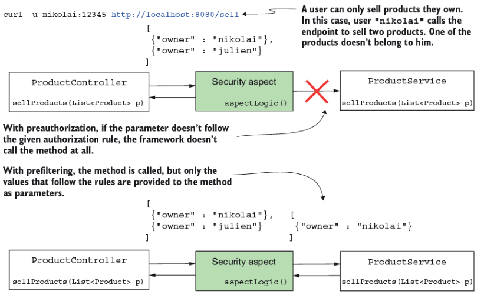
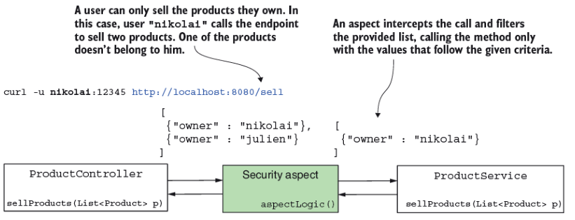
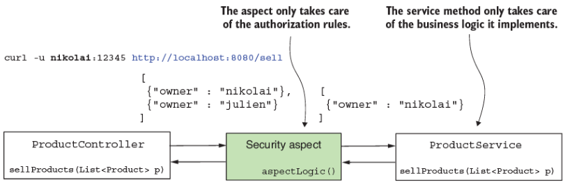
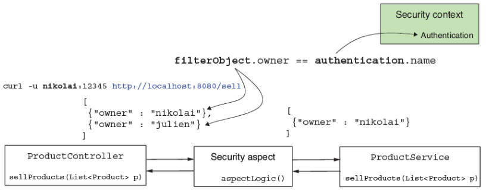
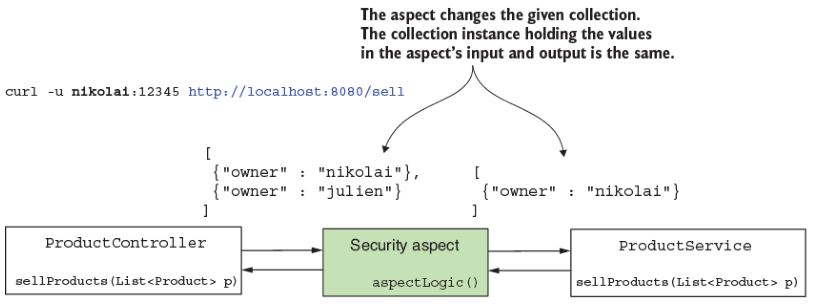
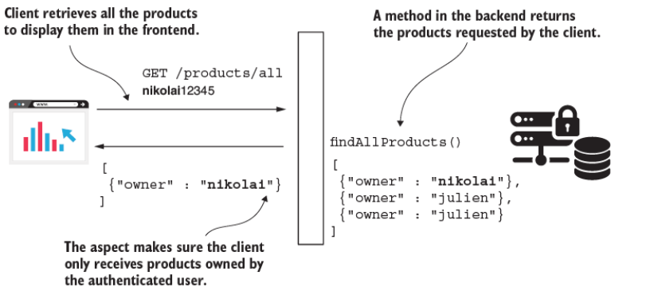
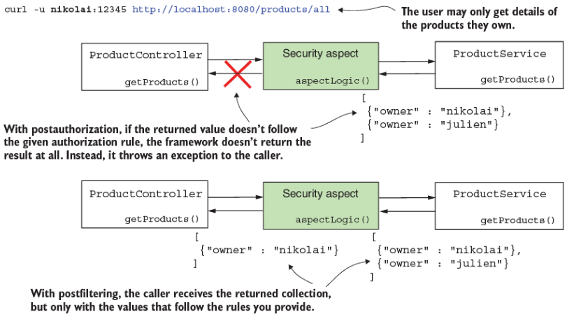
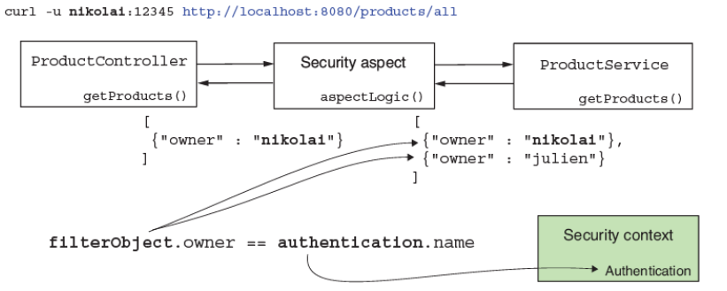
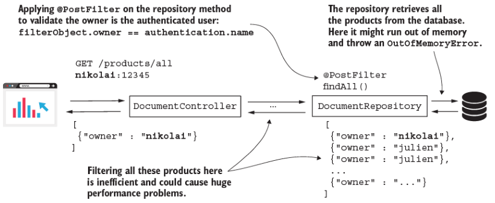
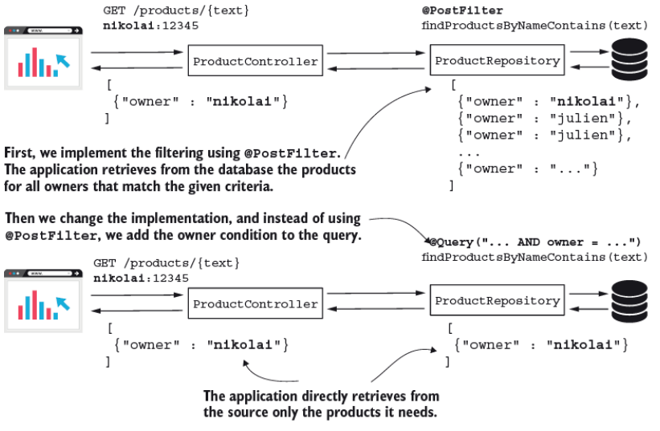

# 12. Hiện thực filtering ở mức method

> Bản dịch tiếng Việt của chương 12 — *Spring Security in Action, Second Edition* (Laurentiu Spilca, Manning).

**Nội dung chương này bao gồm:**

- Dùng prefiltering để hạn chế những gì một method nhận làm giá trị tham số
- Dùng postfiltering để hạn chế những gì một method trả về
- Tích hợp filtering với Spring Data

Ở chương 11, bạn đã học cách áp dụng quy tắc authorization (phân quyền) bằng global method security. Chúng ta đã làm các ví dụ dùng annotation `@PreAuthorize` và `@PostAuthorize`. Khi bạn dùng những annotation này, ứng dụng hoặc cho phép lời gọi method, hoặc từ chối hoàn toàn nó. Giả sử bạn không muốn cấm lời gọi tới một method, nhưng bạn muốn đảm bảo rằng các tham số gửi tới nó tuân theo một số quy tắc. Hoặc, trong một tình huống khác, bạn muốn đảm bảo rằng sau khi method được gọi, người gọi method chỉ nhận được phần được authorize của giá trị trả về. Chức năng này gọi là **filtering** (lọc), và nó được phân thành hai loại:

- **Prefiltering** — Framework lọc các giá trị của tham số **trước** khi gọi method.
- **Postfiltering** — Framework lọc giá trị trả về **sau** lời gọi method.

Filtering hoạt động khác với call authorization (hình 12.1). Với filtering, framework thực thi lời gọi và không ném exception nếu một tham số hay giá trị trả về không tuân theo quy tắc authorization mà bạn định nghĩa. Thay vào đó, nó lọc bỏ những phần tử không tuân theo điều kiện đã chỉ định.



**Hình 12.1** Client gọi endpoint cung cấp một giá trị không tuân theo quy tắc authorization. Với preauthorization, method hoàn toàn không được gọi, và người gọi nhận về một exception. Với prefiltering, aspect gọi method nhưng chỉ cung cấp những giá trị tuân theo các quy tắc đã cho.

Điều quan trọng cần đề cập ngay từ đầu là bạn chỉ có thể áp dụng filtering cho collection và array. Bạn chỉ dùng prefiltering nếu method nhận tham số là một array hoặc một collection các object. Framework lọc collection hoặc array này theo các quy tắc bạn định nghĩa. Điều tương tự cũng đúng với postfiltering: bạn chỉ có thể áp dụng cách tiếp cận này nếu method trả về một collection hoặc một array. Framework lọc giá trị method trả về dựa trên các quy tắc bạn chỉ định.

---

## 12.1 Áp dụng prefiltering cho method authorization

Mục này bàn về cơ chế đằng sau prefiltering, rồi chúng ta hiện thực prefiltering trong một ví dụ. Bạn có thể dùng filtering để chỉ thị cho framework kiểm chứng những giá trị được gửi qua tham số method khi ai đó gọi một method. Framework lọc những giá trị không khớp tiêu chí đã cho và chỉ gọi method với những giá trị khớp. Chức năng này gọi là prefiltering (hình 12.2).



**Hình 12.2** Với prefiltering, một aspect chặn lời gọi tới method được bảo vệ. Aspect lọc những giá trị mà người gọi cung cấp làm tham số và chỉ gửi tới method những giá trị tuân theo các quy tắc đã định nghĩa.

Bạn gặp những yêu cầu trong các ví dụ thực tế mà ở đó prefiltering áp dụng rất tốt vì nó tách rời quy tắc authorization khỏi business logic mà method hiện thực. Giả sử bạn hiện thực một use case chỉ xử lý những chi tiết cụ thể do user đã authentication sở hữu. Use case này có thể được gọi từ nhiều nơi. Tuy vậy, trách nhiệm của nó luôn nêu rằng chỉ những chi tiết của user đã authentication mới có thể được xử lý, bất kể ai gọi use case đó. Thay vì đảm bảo rằng người gọi use case áp dụng quy tắc authorization đúng cách, bạn làm cho chính use case áp dụng quy tắc authorization của riêng nó. Tất nhiên, bạn có thể làm điều này bên trong method. Nhưng việc tách rời logic authorization khỏi business logic nâng cao khả năng bảo trì của code và giúp người khác dễ đọc và hiểu nó hơn.

Như trong trường hợp call authorization mà chúng ta đã bàn ở chương 11, Spring Security cũng hiện thực filtering bằng cách dùng aspect. Aspect chặn các lời gọi method cụ thể và có thể bổ sung chúng bằng những chỉ thị khác. Với prefiltering, một aspect chặn những method được annotate bằng annotation `@PreFilter` và lọc các giá trị trong collection được cung cấp làm tham số theo tiêu chí bạn định nghĩa (hình 12.3).



**Hình 12.3** Với prefiltering, chúng ta tách rời trách nhiệm authorization khỏi hiện thực nghiệp vụ. Aspect do Spring Security cung cấp chỉ lo các quy tắc authorization, và service method chỉ lo business logic của use case mà nó hiện thực.

Tương tự annotation `@PreAuthorize` và `@PostAuthorize` đã bàn ở chương 11, bạn đặt các quy tắc authorization làm giá trị của annotation `@PreFilter`. Trong những quy tắc này, mà bạn cung cấp dưới dạng biểu thức SpEL, bạn dùng `filterObject` để tham chiếu tới bất kỳ phần tử nào bên trong collection hoặc array được cung cấp làm tham số cho method.

Để thấy prefiltering được áp dụng, hãy làm một project. Tôi đặt tên project này là `ssia-ch12-ex1`. Giả sử bạn có một ứng dụng để mua và bán sản phẩm, và backend của nó hiện thực endpoint `/sell`. Frontend của ứng dụng gọi endpoint này khi một user bán một sản phẩm. Nhưng user đã đăng nhập chỉ có thể bán những sản phẩm họ sở hữu. Hãy hiện thực một tình huống đơn giản về một service method được gọi để bán những sản phẩm nhận được làm tham số. Với ví dụ này, bạn học cách áp dụng annotation `@PreFilter`, vì đây là thứ chúng ta dùng để đảm bảo rằng method chỉ nhận những sản phẩm do user đang đăng nhập sở hữu.

Khi đã tạo project, chúng ta viết một configuration class để đảm bảo có vài user để test hiện thực của mình. Bạn tìm thấy định nghĩa đơn giản của configuration class ở listing 12.1. Configuration class mà tôi gọi là `ProjectConfig` chỉ khai báo một `UserDetailsService` và một `PasswordEncoder`, và tôi annotate nó bằng `@EnableMethodSecurity`. Với annotation filtering, chúng ta vẫn cần dùng annotation `@EnableMethodSecurity` và bật các annotation pre-/postauthorization. `UserDetailsService` được cung cấp định nghĩa hai user chúng ta cần trong các bài test: Nikolai và Julien.

**Listing 12.1 Cấu hình user và bật method security**

```java
@Configuration
@EnableMethodSecurity
public class ProjectConfig {

  @Bean
  public UserDetailsService userDetailsService() {
    var uds = new InMemoryUserDetailsManager();

    var u1 = User.withUsername("nikolai")
            .password("12345")
            .authorities("read")
            .build();

    var u2 = User.withUsername("julien")
            .password("12345")
            .authorities("write")
            .build();

    uds.createUser(u1);
    uds.createUser(u2);

    return uds;
  }

  @Bean
  public PasswordEncoder passwordEncoder() {
    return NoOpPasswordEncoder.getInstance();
  }
}
```

Tôi mô tả sản phẩm bằng model class trình bày ở listing kế tiếp.

**Listing 12.2 Định nghĩa class `Product`**

```java
public class Product {
  private String name;
  private String owner;         // ①

  // Đã lược bỏ constructor, getter, và setter
}
```

① Thuộc tính `owner` mang giá trị của username.

Class `ProductService` định nghĩa service method mà chúng ta bảo vệ bằng `@PreFilter`. Bạn có thể tìm thấy class `ProductService` ở listing 12.3. Trong listing đó, trước method `sellProducts()`, bạn có thể quan sát thấy việc dùng annotation `@PreFilter`. Biểu thức Spring Expression Language (SpEL) dùng với annotation là `filterObject.owner == authentication.name`, thứ chỉ cho phép những giá trị mà thuộc tính `owner` của `Product` bằng với username của user đã đăng nhập. Ở vế trái của toán tử `==` trong biểu thức SpEL, chúng ta dùng `filterObject`. Với `filterObject`, chúng ta tham chiếu tới các object trong list làm tham số. Vì chúng ta có một list các sản phẩm, `filterObject` trong trường hợp của chúng ta có kiểu `Product`. Vì lý do này, chúng ta có thể tham chiếu tới thuộc tính `owner` của sản phẩm. Ở vế phải của toán tử `==` trong biểu thức, chúng ta dùng object `authentication`. Với annotation `@PreFilter` và `@PostFilter`, chúng ta có thể tham chiếu trực tiếp tới object `authentication`, thứ khả dụng trong `SecurityContext` sau khi authentication (hình 12.4).



**Hình 12.4** Khi dùng prefiltering với `filterObject`, chúng ta tham chiếu tới các object bên trong list mà người gọi cung cấp làm tham số. Object `authentication` là cái được lưu sau tiến trình authentication trong security context.

Service method trả về list chính xác như cách nó nhận. Bằng cách này, chúng ta có thể test và kiểm chứng rằng framework đã lọc list như chúng ta mong đợi bằng cách kiểm tra list trả về trong HTTP response body.

**Listing 12.3 Dùng annotation `@PreFilter` trong class `ProductService`**

```java
@Service
public class ProductService {

  @PreFilter("filterObject.owner == authentication.name")       // ①
  public List<Product> sellProducts(List<Product> products) {
    // bán sản phẩm và trả về danh sách sản phẩm đã bán
    return products;                                            // ②
  }
}
```

① List được đưa vào làm tham số chỉ cho phép những sản phẩm do user đã authentication sở hữu.

② Trả về các sản phẩm phục vụ mục đích test.

Để làm các bài test dễ hơn, tôi định nghĩa một endpoint để gọi service method được bảo vệ. Listing 12.4 định nghĩa endpoint này trong một controller class gọi là `ProductController`. Ở đây, để lời gọi endpoint ngắn gọn hơn, tôi tạo một list và cung cấp nó trực tiếp làm tham số cho service method. Trong một tình huống thực tế, list này nên được client cung cấp trong request body. Bạn cũng có thể quan sát thấy tôi dùng `@GetMapping` cho một thao tác gợi ý sự biến đổi dữ liệu, điều này là không chuẩn. Nhưng hãy biết rằng tôi làm vậy để tránh phải xử lý bảo vệ CSRF trong ví dụ của chúng ta, và điều này cho phép bạn tập trung vào chủ đề đang bàn. Bạn đã học về bảo vệ CSRF ở chương 9.

**Listing 12.4 Controller class hiện thực endpoint chúng ta dùng để test**

```java
@RestController
public class ProductController {

  private final ProductService productService;

  // constructor được lược bỏ

  @GetMapping("/sell")
  public List<Product> sellProduct() {
    List<Product> products = new ArrayList<>();

    products.add(new Product("beer", "nikolai"));
    products.add(new Product("candy", "nikolai"));
    products.add(new Product("chocolate", "julien"));

    return productService.sellProducts(products);
  }
}
```

Hãy khởi động ứng dụng và xem điều gì xảy ra khi chúng ta gọi endpoint `/sell`. Hãy quan sát ba sản phẩm từ list mà chúng ta cung cấp làm tham số cho service method. Tôi gán hai sản phẩm cho user Nikolai và sản phẩm còn lại cho user Julien. Khi gọi endpoint và authentication bằng user Nikolai, chúng ta mong đợi chỉ thấy trong response hai sản phẩm gắn với người đó. Khi gọi endpoint và authentication bằng Julien, trong response, chúng ta chỉ nên thấy một sản phẩm gắn với Julien. Ở đoạn code sau đây, bạn tìm thấy các lời gọi test và kết quả của chúng. Để gọi endpoint `/sell` và authentication bằng user Nikolai, dùng lệnh này:

```bash
curl -u nikolai:12345 http://localhost:8080/sell
```

Response body là

```json
[
  {"name":"beer","owner":"nikolai"},
  {"name":"candy","owner":"nikolai"}
]
```

Để gọi endpoint `/sell` và authentication bằng user Julien, dùng

```bash
curl -u julien:12345 http://localhost:8080/sell
```

Response body là

```json
[
  {"name":"chocolate","owner":"julien"}
]
```

Bạn cần cẩn thận với việc aspect **thay đổi chính collection được đưa vào**. Trong trường hợp của chúng ta, đừng mong đợi nó trả về một instance `List` mới. Thực tế, đó vẫn là cùng instance mà aspect đã loại bỏ khỏi đó những phần tử không khớp tiêu chí đã cho. Điều này rất quan trọng cần cân nhắc. Bạn phải luôn đảm bảo rằng instance collection bạn cung cấp không phải là bất biến (immutable). Việc cung cấp một collection bất biến để xử lý sẽ dẫn tới một exception lúc thực thi, bởi aspect filtering sẽ không thể thay đổi nội dung của collection (hình 12.5).



**Hình 12.5** Aspect chặn và thay đổi collection được đưa vào làm tham số. Bạn cần cung cấp một instance collection có thể thay đổi được (mutable) để aspect có thể thay đổi nó.

Listing kế tiếp trình bày cùng project chúng ta đã làm ở đầu mục này, nhưng tôi đổi định nghĩa `List` thành một instance bất biến như phương thức `List.of()` trả về để test xem điều gì xảy ra trong tình huống này.

**Listing 12.5 Dùng một collection bất biến**

```java
@RestController
public class ProductController {

  private final ProductService productService;

  // constructor được lược bỏ

  @GetMapping("/sell")
  public List<Product> sellProduct() {
    List<Product> products = List.of(          // ①
            new Product("beer", "nikolai"),
            new Product("candy", "nikolai"),
            new Product("chocolate", "julien"));

    return productService.sellProducts(products);
  }
}
```

① `List.of()` trả về một instance bất biến của list.

Tôi đã tách ví dụ này vào thư mục project `ssia-ch12-ex2` để bạn cũng có thể tự test. Chạy ứng dụng và gọi endpoint `/sell` dẫn tới một HTTP response với trạng thái 500 Internal Server Error và một exception trong console log, như trình bày ở đoạn code kế tiếp:

```bash
curl -u julien:12345 http://localhost:8080/sell
```

Response body là

```json
{
  "status":500,
  "error":"Internal Server Error",
  "path":"/sell"
}
```

Trong console của ứng dụng, bạn có thể tìm thấy một exception tương tự cái được trình bày ở đoạn code sau đây:

```
java.lang.UnsupportedOperationException: null
    at java.base/java.util.ImmutableCollections.uoe(ImmutableCollections.java:73)
...
```

---

## 12.2 Áp dụng postfiltering cho method authorization

Trong mục này, chúng ta hiện thực postfiltering. Giả sử chúng ta có tình huống sau. Một ứng dụng có frontend được hiện thực bằng Angular và backend dựa trên Spring quản lý một số sản phẩm. User sở hữu sản phẩm, và họ chỉ có thể lấy chi tiết về sản phẩm của mình. Để lấy chi tiết sản phẩm của họ, frontend gọi các endpoint do backend expose (hình 12.6).



**Hình 12.6** Tình huống postfiltering. Một client gọi endpoint để truy xuất dữ liệu nó cần hiển thị ở frontend. Một hiện thực postfiltering đảm bảo rằng client chỉ nhận được dữ liệu do user đang được authentication sở hữu.

Ở backend trong một service class, lập trình viên viết một method `List<Product> findProducts()` truy xuất chi tiết sản phẩm. Ứng dụng client hiển thị những chi tiết này ở frontend. Làm sao lập trình viên có thể đảm bảo rằng bất kỳ ai gọi method này chỉ nhận được sản phẩm họ sở hữu chứ không phải sản phẩm của người khác? Một lựa chọn để hiện thực chức năng này bằng cách giữ các quy tắc authorization tách rời khỏi quy tắc nghiệp vụ của ứng dụng gọi là postfiltering. Mục này bàn về cách postfiltering hoạt động và minh họa hiện thực của nó trong một ứng dụng.

Tương tự prefiltering, postfiltering cũng dựa vào một aspect. Aspect này cho phép một lời gọi tới một method, nhưng khi method trả về, aspect lấy giá trị trả về và đảm bảo rằng nó tuân theo các quy tắc bạn định nghĩa. Như trong trường hợp prefiltering, postfiltering thay đổi một collection hoặc một array do method trả về. Bạn cung cấp tiêu chí mà các phần tử bên trong collection trả về nên tuân theo. Aspect postfilter lọc khỏi collection hoặc array trả về những phần tử không tuân theo quy tắc của bạn.

Để áp dụng postfiltering, bạn cần dùng annotation `@PostFilter`. Annotation `@PostFilter` hoạt động tương tự tất cả các annotation pre-/post khác mà chúng ta đã dùng ở chương 11 và trong chương này. Bạn cung cấp quy tắc authorization dưới dạng một biểu thức SpEL làm giá trị của annotation, và quy tắc đó là cái mà aspect filtering dùng, như thể hiện ở hình 12.7. Ngoài ra, tương tự prefiltering, postfiltering chỉ hoạt động với array và collection. Hãy đảm bảo bạn chỉ áp dụng annotation `@PostFilter` cho những method có kiểu trả về là array hoặc collection.



**Hình 12.7** Postfiltering. Một aspect chặn collection do method được bảo vệ trả về và lọc những giá trị không tuân theo các quy tắc bạn cung cấp. Không giống postauthorization, postfiltering không ném exception cho người gọi khi giá trị trả về không tuân theo các quy tắc authorization.

Hãy áp dụng postfiltering trong một ví dụ mà tôi đã tạo project tên là `ssia-ch12-ex3`. Để nhất quán, tôi giữ nguyên các user như trong những ví dụ trước ở chương này, nên configuration class không thay đổi. Để tiện cho bạn, tôi lặp lại cấu hình được trình bày ở listing sau đây.

**Listing 12.6 Configuration class**

```java
@Configuration
@EnableMethodSecurity
public class ProjectConfig {

  @Bean
  public UserDetailsService userDetailsService() {
    var uds = new InMemoryUserDetailsManager();

    var u1 = User.withUsername("nikolai")
            .password("12345")
            .authorities("read")
            .build();

    var u2 = User.withUsername("julien")
            .password("12345")
            .authorities("write")
            .build();

    uds.createUser(u1);
    uds.createUser(u2);

    return uds;
  }

  @Bean
  public PasswordEncoder passwordEncoder() {
    return NoOpPasswordEncoder.getInstance();
  }
}
```

Đoạn code kế tiếp cho thấy class `Product` cũng không thay đổi:

```java
public class Product {
  private String name;
  private String owner;

  // Đã lược bỏ constructor, getter, và setter
}
```

Trong class `ProductService`, giờ chúng ta hiện thực một method trả về một list các sản phẩm. Trong tình huống thực tế, chúng ta giả định ứng dụng sẽ đọc sản phẩm từ một database hoặc bất kỳ nguồn dữ liệu nào khác. Để giữ ví dụ ngắn gọn và cho phép bạn tập trung vào những khía cạnh chúng ta bàn, chúng ta dùng một collection đơn giản, như trình bày ở listing 12.7.

Tôi annotate method `findProducts()`, thứ trả về list các sản phẩm, bằng annotation `@PostFilter`. Điều kiện tôi thêm làm giá trị của annotation, `filterObject.owner == authentication.name`, chỉ cho phép trả về những sản phẩm có `owner` bằng với user đã authentication (hình 12.8). Ở vế trái của toán tử `==`, chúng ta dùng `filterObject` để tham chiếu tới các phần tử bên trong collection trả về. Ở vế phải của toán tử, chúng ta dùng `authentication` để tham chiếu tới object `Authentication` được lưu trong `SecurityContext`.



**Hình 12.8** Trong biểu thức SpEL dùng cho authorization, chúng ta dùng `filterObject` để tham chiếu tới các object trong collection trả về, và chúng ta dùng `authentication` để tham chiếu tới instance `Authentication` từ security context.

**Listing 12.7 Class `ProductService`**

```java
@Service
public class ProductService {

  @PostFilter("filterObject.owner == authentication.name")       // ①
  public List<Product> findProducts() {
    List<Product> products = new ArrayList<>();

    products.add(new Product("beer", "nikolai"));
    products.add(new Product("candy", "nikolai"));
    products.add(new Product("chocolate", "julien"));

    return products;
  }
}
```

① Thêm điều kiện lọc cho các object trong collection do method trả về.

Chúng ta định nghĩa một controller class để method của mình truy cập được qua một endpoint. Listing kế tiếp trình bày controller class.

**Listing 12.8 Class `ProductController`**

```java
@RestController
public class ProductController {

  private final ProductService productService;

  // constructor được lược bỏ

  @GetMapping("/find")
  public List<Product> findProducts() {
    return productService.findProducts();
  }
}
```

Đã đến lúc chạy ứng dụng và test hành vi của nó bằng cách gọi endpoint `/find`. Chúng ta mong đợi chỉ thấy trong HTTP response body những sản phẩm do user đã authentication sở hữu. Các đoạn code kế tiếp cho thấy kết quả khi gọi endpoint với từng user của chúng ta, Nikolai và Julien. Để gọi endpoint `/find` và authentication bằng user Julien, dùng lệnh cURL này:

```bash
curl -u julien:12345 http://localhost:8080/find
```

Response body là

```json
[
  {"name":"chocolate","owner":"julien"}
]
```

Để gọi endpoint `/find` và authentication bằng user Nikolai, dùng lệnh cURL này:

```bash
curl -u nikolai:12345 http://localhost:8080/find
```

Response body là

```json
[
  {"name":"beer","owner":"nikolai"},
  {"name":"candy","owner":"nikolai"}
]
```

---

## 12.3 Dùng filtering trong Spring Data repository

Trong mục này, chúng ta bàn về filtering được áp dụng với Spring Data repository. Việc hiểu cách tiếp cận này rất quan trọng vì chúng ta thường dùng database để lưu bền dữ liệu của ứng dụng. Việc hiện thực các ứng dụng Spring Boot dùng Spring Data như một tầng cấp cao để kết nối tới database — dù là SQL hay NoSQL — là khá phổ biến. Chúng ta bàn về hai cách tiếp cận để áp dụng filtering ở mức repository khi dùng Spring Data, và chúng ta hiện thực chúng bằng các ví dụ.

Cách tiếp cận đầu tiên chúng ta dùng là cái bạn đã học trước đó trong chương này: dùng annotation `@PreFilter` và `@PostFilter`. Cách tiếp cận thứ hai chúng ta bàn là tích hợp trực tiếp các quy tắc authorization vào query. Như bạn sẽ học trong mục này, bạn cần chú ý khi chọn cách áp dụng filtering trong Spring Data repository. Như đã đề cập, chúng ta có hai lựa chọn:

- Dùng annotation `@PreFilter` và `@PostFilter`
- Áp dụng filtering trực tiếp trong query

Việc dùng annotation `@PreFilter` trong trường hợp repository cũng giống như áp dụng annotation này ở bất kỳ tầng nào khác của ứng dụng. Nhưng khi nói tới postfiltering, tình hình thay đổi. Việc dùng `@PostFilter` trên method của repository về mặt kỹ thuật thì hoạt động tốt, nhưng nó hiếm khi là lựa chọn tốt từ góc độ hiệu năng.

Giả sử bạn có một ứng dụng quản lý tài liệu của công ty. Lập trình viên cần hiện thực một tính năng mà tất cả các tài liệu được liệt kê trên một trang web sau khi user đăng nhập. Lập trình viên quyết định dùng method `findAll()` của Spring Data repository và annotate nó bằng `@PostFilter` để cho phép Spring Security lọc tài liệu sao cho method chỉ trả về những tài liệu do user đang đăng nhập sở hữu. Cách tiếp cận này rõ ràng là sai, vì nó cho phép ứng dụng truy xuất **tất cả** các bản ghi từ database rồi mới tự lọc chúng. Nếu chúng ta có một số lượng lớn tài liệu, việc gọi `findAll()` mà không phân trang có thể trực tiếp dẫn tới `OutOfMemoryError`. Ngay cả khi số lượng tài liệu không đủ lớn để làm đầy heap, việc lọc bản ghi trong ứng dụng vẫn kém hiệu năng hơn so với việc ngay từ đầu chỉ truy xuất những gì bạn cần từ database (hình 12.9).



**Hình 12.9** Cấu trúc của một thiết kế tồi. Khi bạn cần áp dụng filtering ở mức repository, tốt hơn là trước hết đảm bảo bạn chỉ truy xuất dữ liệu mình cần. Nếu không, ứng dụng của bạn có thể đối mặt với những vấn đề nặng nề về bộ nhớ và hiệu năng.

Ở mức service, bạn không có lựa chọn nào khác ngoài việc lọc các bản ghi trong app. Tuy vậy, nếu ở mức repository bạn đã biết rằng mình chỉ cần truy xuất những bản ghi do user đang đăng nhập sở hữu, bạn nên hiện thực một query chỉ trích xuất những tài liệu cần thiết từ database.

> **NOTE** Trong bất kỳ tình huống nào mà bạn truy xuất dữ liệu từ một nguồn dữ liệu — dù là database, web service, input stream, hay bất cứ thứ gì khác — hãy đảm bảo ứng dụng chỉ truy xuất dữ liệu nó cần. Hãy tránh càng nhiều càng tốt nhu cầu lọc dữ liệu bên trong ứng dụng.

Hãy làm một ứng dụng mà trước hết chúng ta dùng annotation `@PostFilter` trên method của Spring Data repository, rồi chúng ta chuyển sang cách tiếp cận thứ hai, nơi chúng ta viết điều kiện trực tiếp trong query. Bằng cách này, chúng ta có cơ hội thử nghiệm cả hai cách tiếp cận và so sánh chúng.

Tôi đã tạo một project mới tên là `ssia-ch12-ex4`, nơi tôi dùng cùng configuration class như các ví dụ trước trong chương này. Giống các ví dụ trước đó, chúng ta viết một ứng dụng quản lý sản phẩm, nhưng lần này, chúng ta truy xuất chi tiết sản phẩm từ một bảng trong database. Với ví dụ của mình, chúng ta hiện thực một chức năng tìm kiếm sản phẩm (hình 12.10). Chúng ta viết một endpoint nhận một chuỗi và trả về list các sản phẩm có chuỗi đã cho trong tên của chúng. Tuy nhiên, chúng ta cần đảm bảo chỉ trả về những sản phẩm gắn với user đã authentication.



**Hình 12.10** Trong tình huống của chúng ta, chúng ta bắt đầu bằng cách hiện thực ứng dụng dùng `@PostFilter` để lọc sản phẩm dựa trên chủ sở hữu của chúng. Rồi chúng ta thay đổi hiện thực để thêm điều kiện trực tiếp vào query. Bằng cách này, chúng ta đảm bảo ứng dụng chỉ lấy từ nguồn những bản ghi cần thiết.

Chúng ta dùng Spring Data JPA để kết nối tới database. Vì lý do này, chúng ta cũng cần thêm vào file *pom.xml* dependency `spring-boot-starter-data-jpa` và một connection driver tương ứng với công nghệ hệ quản trị cơ sở dữ liệu của bạn. Đoạn code kế tiếp cung cấp những dependency tôi dùng trong file *pom.xml*:

```xml
<dependency>
   <groupId>org.springframework.boot</groupId>
   <artifactId>spring-boot-starter-data-jpa</artifactId>
</dependency>
<dependency>
   <groupId>org.springframework.boot</groupId>
   <artifactId>spring-boot-starter-security</artifactId>
</dependency>
<dependency>
   <groupId>org.springframework.boot</groupId>
   <artifactId>spring-boot-starter-web</artifactId>
</dependency>
<dependency>
   <groupId>mysql</groupId>
   <artifactId>mysql-connector-java</artifactId>
   <scope>runtime</scope>
</dependency>
```

Trong file *application.properties*, chúng ta thêm các property mà Spring Boot cần để tạo data source. Ở đoạn code kế tiếp, bạn tìm thấy những property tôi đã thêm vào file *application.properties* của mình:

```properties
spring.datasource.url=jdbc:mysql://localhost/spring?useLegacyDatetimeCode=false&serverTimezone=UTC
spring.datasource.username=root
spring.datasource.password=
spring.datasource.initialization-mode=always
```

Chúng ta cũng cần một bảng trong database để lưu chi tiết sản phẩm mà ứng dụng truy xuất. Chúng ta định nghĩa file *schema.sql*, nơi chúng ta viết script tạo bảng, và file *data.sql*, nơi chúng ta viết các query chèn dữ liệu test vào bảng. Bạn cần đặt cả hai file (*schema.sql* và *data.sql*) vào thư mục *resources* của project Spring Boot để chúng được tìm thấy và thực thi lúc ứng dụng khởi động. Đoạn code kế tiếp cho bạn thấy query dùng để tạo bảng, thứ chúng ta cần viết trong file *schema.sql*:

```sql
CREATE TABLE IF NOT EXISTS `spring`.`product` (
  `id` INT NOT NULL AUTO_INCREMENT,
  `name` VARCHAR(45) NULL,
  `owner` VARCHAR(45) NULL,
  PRIMARY KEY (`id`));
```

Trong file *data.sql*, tôi viết ba câu lệnh `INSERT`, được trình bày ở đoạn code kế tiếp. Những câu lệnh này tạo ra dữ liệu test mà chúng ta cần sau này để chứng minh hành vi của ứng dụng:

```sql
INSERT IGNORE INTO `spring`.`product` (`id`, `name`, `owner`) VALUES ('1', 'beer', 'nikolai');
INSERT IGNORE INTO `spring`.`product` (`id`, `name`, `owner`) VALUES ('2', 'candy', 'nikolai');
INSERT IGNORE INTO `spring`.`product` (`id`, `name`, `owner`) VALUES ('3', 'chocolate', 'julien');
```

> **Ghi chú của người dịch:** Ba câu lệnh `INSERT` và dòng `spring.datasource.url` ở trên bị PDF gốc cắt cụt ở cuối dòng. Phần thiếu đã được khôi phục theo dữ liệu test mà các ví dụ trong chương này sử dụng.

> **NOTE** Hãy nhớ, chúng ta đã dùng cùng những tên bảng trong các ví dụ khác xuyên suốt cuốn sách. Nếu bạn đã có những bảng cùng tên từ các ví dụ trước, bạn có lẽ nên drop chúng trước khi bắt đầu với project này. Một lựa chọn thay thế là dùng một schema khác.

Để ánh xạ bảng `product` trong ứng dụng, chúng ta cần viết một entity class. Listing sau đây định nghĩa entity `Product`.

**Listing 12.9 Entity class `Product`**

```java
@Entity
public class Product {

    @Id
    @GeneratedValue(strategy = GenerationType.IDENTITY)
    private int id;

    private String name;
    private String owner;

    // Đã lược bỏ getter và setter
}
```

Với entity `Product`, chúng ta cũng viết một interface Spring Data repository được định nghĩa ở listing kế tiếp. Hãy để ý rằng lần này chúng ta dùng annotation `@PostFilter` trực tiếp trên method được khai báo bởi interface repository.

**Listing 12.10 Interface `ProductRepository`**

```java
public interface ProductRepository
        extends JpaRepository<Product, Integer> {

    @PostFilter("filterObject.owner == authentication.name")     // ①
    List<Product> findProductByNameContains(String text);
}
```

① Dùng annotation `@PostFilter` cho method được khai báo bởi Spring Data repository.

Listing kế tiếp cho bạn thấy cách định nghĩa một controller class hiện thực endpoint chúng ta dùng để test hành vi.

**Listing 12.11 Class `ProductController`**

```java
@RestController
public class ProductController {

  private final ProductRepository productRepository;

  // constructor được lược bỏ

  @GetMapping("/products/{text}")
  public List<Product> findProductsContaining(
    @PathVariable String text) {
    return productRepository.findProductByNameContains(text);
  }
}
```

Khởi động ứng dụng, chúng ta có thể test xem điều gì xảy ra khi gọi endpoint `/products/{text}`. Bằng cách tìm kiếm chữ cái `c` trong khi authentication bằng user Nikolai, HTTP response chỉ chứa sản phẩm `candy`. Dù `chocolate` cũng chứa chữ `c`, nhưng vì Julien sở hữu nó, `chocolate` sẽ không xuất hiện trong response. Bạn tìm thấy các lời gọi và response của chúng trong những đoạn code sau đây. Để gọi endpoint `/products` và authentication bằng user Nikolai, hãy thực hiện lệnh này:

```bash
curl -u nikolai:12345 http://localhost:8080/products/c
```

Response body là

```json
[
  {"id":2,"name":"candy","owner":"nikolai"}
]
```

Để gọi endpoint `/products` và authentication bằng user Julien, hãy thực hiện

```bash
curl -u julien:12345 http://localhost:8080/products/c
```

Response body là

```json
[
  {"id":3,"name":"chocolate","owner":"julien"}
]
```

Chúng ta đã bàn ở đầu mục này rằng việc dùng `@PostFilter` trong repository không phải lựa chọn tốt nhất. Thay vào đó, chúng ta nên đảm bảo không select từ database những gì mình không cần. Vậy làm sao chúng ta có thể thay đổi ví dụ của mình để chỉ select dữ liệu cần thiết thay vì lọc dữ liệu sau khi select? Chúng ta có thể cung cấp các biểu thức SpEL trực tiếp trong query được dùng bởi các repository class. Để đạt được điều này, chúng ta theo hai bước đơn giản:

1. Chúng ta thêm một object kiểu `SecurityEvaluationContextExtension` vào Spring context. Chúng ta có thể làm điều này bằng một method `@Bean` đơn giản trong configuration class.
2. Chúng ta điều chỉnh các query trong repository class bằng những mệnh đề phù hợp cho việc select.

Trong project của chúng ta, để thêm bean `SecurityEvaluationContextExtension` vào context, chúng ta cần thay đổi configuration class như trình bày ở listing kế tiếp. Để giữ tất cả code gắn với các ví dụ trong sách, tôi dùng một project khác ở đây tên là `ssia-ch12-ex5`.

**Listing 12.12 Thêm `SecurityEvaluationContextExtension` vào context**

```java
@Configuration
@EnableMethodSecurity
public class ProjectConfig {

  @Bean                                      // ①
  public SecurityEvaluationContextExtension
    securityEvaluationContextExtension() {
    return new SecurityEvaluationContextExtension();
  }

  // Đã lược bỏ khai báo của UserDetailsService và PasswordEncoder
}
```

① Thêm một `SecurityEvaluationContextExtension` vào Spring context.

Trong interface `ProductRepository`, chúng ta thêm query phía trước method, và chúng ta điều chỉnh mệnh đề `WHERE` với điều kiện phù hợp bằng một biểu thức SpEL. Listing sau đây trình bày thay đổi này.

**Listing 12.13 Dùng SpEL trong query trong interface repository**

```java
public interface ProductRepository
        extends JpaRepository<Product, Integer> {

    @Query("""
           SELECT p FROM Product p WHERE
             p.name LIKE %:text% AND
             p.owner=?#{authentication.name}
           """)                                            // ①
    List<Product> findProductByNameContains(String text);
}
```

① Dùng SpEL trong query để thêm một điều kiện về chủ sở hữu của bản ghi.

> **Ghi chú của người dịch:** Trong sách gốc, listing 12.13 thiếu ký tự `@` trước `Query` và thiếu dấu `)` đóng annotation. Tôi đã bổ sung để đoạn code biên dịch được.

Giờ chúng ta có thể khởi động ứng dụng và test nó bằng cách gọi endpoint `/products/{text}`. Chúng ta mong đợi hành vi vẫn giống như trường hợp dùng `@PostFilter`. Nhưng bây giờ chỉ những bản ghi của đúng chủ sở hữu mới được truy xuất từ database, điều này khiến chức năng nhanh hơn và đáng tin cậy hơn. Các đoạn code kế tiếp trình bày những lời gọi tới endpoint. Để gọi endpoint `/products` và authentication bằng user Nikolai, chúng ta dùng

```bash
curl -u nikolai:12345 http://localhost:8080/products/c
```

Response body là

```json
[
  {"id":2,"name":"candy","owner":"nikolai"}
]
```

Để gọi endpoint `/products` và authentication bằng user Julien, chúng ta dùng

```bash
curl -u julien:12345 http://localhost:8080/products/c
```

Response body là

```json
[
  {"id":3,"name":"chocolate","owner":"julien"}
]
```

---

## Tóm tắt

- Filtering là một cách tiếp cận authorization trong đó framework kiểm chứng các tham số đầu vào của một method hoặc giá trị do method trả về và loại trừ những phần tử không thỏa mãn một số tiêu chí bạn định nghĩa. Là một cách tiếp cận authorization, filtering tập trung vào giá trị đầu vào và đầu ra của một method chứ không phải vào chính việc thực thi method.
- Bạn dùng filtering để đảm bảo rằng một method không nhận những giá trị khác ngoài những giá trị nó được authorize để xử lý và rằng nó không thể trả về những giá trị mà người gọi method không nên nhận được.
- Khi dùng filtering, bạn không hạn chế quyền truy cập tới method, mà bạn hạn chế những gì có thể được gửi qua tham số của method hoặc những gì method trả về. Cách tiếp cận này cho phép bạn kiểm soát đầu vào và đầu ra của method.
- Để hạn chế những giá trị có thể được gửi qua tham số của method, bạn dùng annotation `@PreFilter`. Annotation `@PreFilter` nhận điều kiện cho biết những giá trị nào được phép gửi làm tham số method. Framework lọc khỏi collection được đưa vào làm tham số tất cả những giá trị không tuân theo quy tắc đã cho.
- Để dùng annotation `@PreFilter`, tham số của method phải là một collection hoặc một array. Từ biểu thức SpEL của annotation, thứ định nghĩa quy tắc, chúng ta tham chiếu tới các object bên trong collection bằng `filterObject`.
- Để hạn chế những giá trị do method trả về, bạn dùng annotation `@PostFilter`. Khi dùng annotation `@PostFilter`, kiểu trả về của method phải là một collection hoặc một array. Framework lọc các giá trị trong collection trả về theo một quy tắc bạn định nghĩa làm giá trị của annotation `@PostFilter`.
- Bạn cũng có thể dùng annotation `@PreFilter` và `@PostFilter` với Spring Data repository. Nhưng việc dùng `@PostFilter` trên một method của Spring Data repository hiếm khi là lựa chọn tốt. Để tránh vấn đề hiệu năng, việc lọc kết quả trong trường hợp này nên được thực hiện trực tiếp ở mức database.
- Spring Security tích hợp dễ dàng với Spring Data, và bạn dùng tính năng này để tránh việc dùng `@PostFilter` với các method của Spring Data repository.
