# 13. OAuth 2 và OpenID Connect là gì?

> Bản dịch tiếng Việt của chương 13 — *Spring Security in Action, Second Edition* (Laurentiu Spilca, Manning).

**Nội dung chương này bao gồm:**

- Mục đích của access token
- Cách token được cấp phát và kiểm chứng trong một hệ thống OAuth 2
- Các vai trò tham gia trong một hệ thống OAuth 2/OpenID Connect

Giả sử bạn làm việc cho một tổ chức lớn và dùng nhiều công cụ trong công việc hằng ngày. Bạn dùng các app theo dõi bug, app tài liệu hóa công việc, app chấm công, v.v. Với mỗi app, bạn cần authentication (xác thực) để làm việc với chúng. Bạn có dùng những bộ credential (thông tin đăng nhập) khác nhau cho những app này không? Tất nhiên, làm vậy có thể hoạt động được, nhưng cách tiếp cận này sẽ rất phiền toái cho người dùng (bạn), và nó cũng làm phức tạp hóa mục đích của các app bạn làm việc cùng.

Với bạn, sự phức tạp đến từ việc bạn phải nhớ credential và đăng nhập nhiều lần vào từng app mình dùng. Với các app, sự phức tạp thêm vào đến từ việc chúng cũng cần hiện thực khả năng lưu bền và bảo vệ credential cùng việc authentication thực tế.

Còn việc quản lý trách nhiệm lưu trữ credential và authentication trong một app riêng biệt thì sao? Trong trường hợp này, người dùng chỉ phải đăng nhập một lần và dùng tất cả các app của mình mà không phải bận tâm authentication lặp đi lặp lại. Có giải pháp như vậy không? Có. Bạn có thể hiện thực authentication theo đặc tả OAuth 2. Điều thứ hai là chúng ta có thể đi xa hơn nữa. Một app có thể được dùng bởi người dùng công khai (những người ngoài tổ chức — một app bạn tạo ra cho cả thế giới) cũng có thể cần khả năng authentication. App có thể hiện thực những khả năng đó, nhưng:

- Việc hiện thực authentication trong app này đòi hỏi nhiều công sức và nỗ lực hơn.
- Người dùng cần một bộ credential riêng cho app này.
- Người dùng đôi khi không tin tưởng việc tạo credential riêng cho bất kỳ app nhỏ nào họ dùng.

Bạn có thể cho phép người dùng của app này đăng nhập bằng một số credential họ đã có không? Người dùng app của bạn có thể đăng nhập bằng credential tài khoản Facebook, GitHub, Twitter, hoặc Google của họ không? Có lẽ bạn đã thấy điều này ở khắp nơi. Các app trên web cho phép người dùng chọn đăng ký và dùng nhiều nền tảng mạng xã hội khác nhau. Bằng cách này, một app cho phép người dùng authentication bằng một bộ credential họ đã có mà bạn không cần hiện thực gì cụ thể trong app của mình. Cách tiếp cận như vậy:

- Giảm chi phí (ví dụ, chi phí hiện thực và bảo trì authentication trong app của bạn)
- Tránh các vấn đề về niềm tin của người dùng (ví dụ, phải đăng ký và tạo thêm một bộ credential mà app của bạn sẽ bảo trì)
- Giúp người dùng giảm thiểu số lượng credential họ dùng

**OAuth 2** là một đặc tả cho biết cách tách riêng các trách nhiệm authentication trong một hệ thống. Bằng cách này, nhiều app có thể dùng một app khác hiện thực việc authentication, giúp người dùng authentication nhanh hơn, giữ thông tin của họ an toàn hơn, và giảm thiểu chi phí hiện thực trong các app.

Chúng ta sẽ bắt đầu với mục 13.1, nơi tôi giới thiệu các actor (thành phần tham gia) chính trong một hệ thống mà authentication và authorization (phân quyền) được xây dựng trên đặc tả OAuth 2. Ở mục 13.1, bạn sẽ học tất cả trách nhiệm của các thành phần trong một hệ thống OAuth 2, chẳng hạn user, client, authorization server, và resource server. Ở mục 13.2, chúng ta bàn về token. Token giống như chìa khóa truy cập cho một app. Bạn sẽ học rằng bạn có thể dùng nhiều loại token và khi nào tốt nhất nên dùng từng loại. Mục 13.3 xem xét những cách quan trọng nhất mà token có thể được cấp phát (thứ chúng ta sẽ hiện thực và test ở chương 14). Chúng ta kết thúc chương này với mục 13.4, nơi chúng ta sẽ đi qua những cạm bẫy có thể xảy ra mà bạn cần cân nhắc khi hiện thực OAuth 2.

Trước khi bắt đầu, tôi muốn đề cập rằng trong chương này, tôi đưa ra một góc nhìn đơn giản về mọi thứ bạn cần biết để hiểu tiếp phần thảo luận ở các chương 14 đến 16. Tôi không có ý định biến bạn thành chuyên gia OAuth 2 và OpenID Connect chỉ trong một chương. Tôi không nghĩ điều đó khả thi, vì cả hai đủ phức tạp để người khác đã viết hẳn những cuốn sách về chúng. Nếu bạn muốn mở rộng kiến thức về chủ đề này, tôi khuyến nghị cuốn *OAuth 2 in Action* của Justin Richer và Antonio Sanso (Manning, 2017) và *OpenID Connect in Action* của Prabath Siriwardena (Manning, 2023).

---

## 13.1 Bức tranh tổng thể về OAuth 2 và OpenID Connect

Giả sử bạn cần tham dự một buổi phỏng vấn với một tập đoàn lớn. Bạn đã được mời tới trụ sở chính của họ để thảo luận trực tiếp. Nhưng không phải ai cũng có thể vào văn phòng công ty. Có những quy trình cụ thể được áp dụng cho khách.

Để vào tòa nhà và tham dự buổi thảo luận, trước hết bạn phải tới quầy lễ tân và chứng minh mình là ai bằng một giấy tờ tùy thân (ID). Sau khi được định danh, bạn sẽ nhận một thẻ ra vào từ quầy lễ tân, cho phép bạn mở một số cửa nhất định. Bạn thậm chí có thể không dùng được tất cả thang máy mà chỉ dùng được một số cụ thể (hình 13.1).

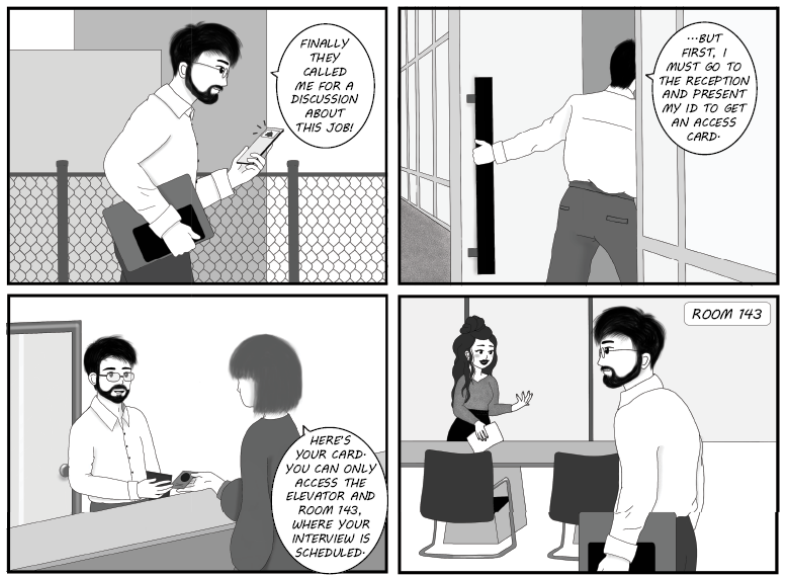

**Hình 13.1** Đặc tả OAuth 2 rất giống với việc ra vào một tòa nhà văn phòng.

Quá trình vào tòa nhà để thảo luận rất giống cách authentication và authorization hoạt động trong một hiện thực OAuth 2. Bạn là user cần thực hiện một use case cụ thể (đi tới một phòng nhất định để thảo luận). Để làm điều đó, bạn dùng credential của mình (giấy tờ tùy thân) để authentication tại quầy lễ tân (**authorization server**). Khi bạn đã chứng minh được mình là ai, bạn có một thẻ ra vào (**token**). Nhưng bạn chỉ có thể dùng token này để truy cập những tài nguyên cụ thể (như thang máy và những cửa nhất định). Bạn chỉ có thể dùng thẻ ra vào trong một khoảng thời gian ngắn. Sau buổi thảo luận, bạn phải trả lại thẻ cho quầy lễ tân.

Trong mục này, chúng ta bàn về những trách nhiệm tương tác với nhau trong một hệ thống OAuth 2, và bạn sẽ thấy nó giống với việc tới thăm trụ sở của một tổ chức để phỏng vấn ra sao. Chúng ta cũng bàn về OAuth 2 với tư cách một đặc tả và sự khác biệt giữa OpenID Connect (một giao thức) và OAuth 2 (đặc tả mà nó dựa vào). Tôi cho rằng việc hiểu kỹ những khái niệm đằng sau cách tiếp cận authentication và authorization này là thiết yếu trước khi đi sâu vào hiện thực của nó ở các chương 14 đến 16.

Trước hết, hãy khám phá ai đóng vai trò gì trong một hệ thống OAuth 2. Hình 13.2 trình bày các actor chính của một hệ thống OAuth 2. Khi nói *actor*, tôi muốn nói tới bất kỳ thực thể nào đóng một vai trò trong chức năng của hệ thống. Với một hệ thống OAuth 2, bạn sẽ thấy những actor sau:

- **User (người dùng)** — Người sử dụng ứng dụng. User thường làm việc với một ứng dụng frontend, mà chúng ta gọi là client. User không phải lúc nào cũng tồn tại trong một hệ thống OAuth 2, như đã bàn ở mục 13.3.3, nơi bạn sẽ học về client credentials grant type.
- **Client** — Ứng dụng gọi một backend và cần authentication cùng authorization. Client có thể là một web app, một mobile app, hoặc thậm chí một desktop app hay một backend service riêng biệt. Hệ thống thường không có user khi client là một backend service.
- **Resource server** — Một ứng dụng backend authorize và phục vụ các lời gọi được gửi bởi một hoặc nhiều ứng dụng client.
- **Authorization server** — Một app hiện thực việc authentication và lưu trữ an toàn credential.

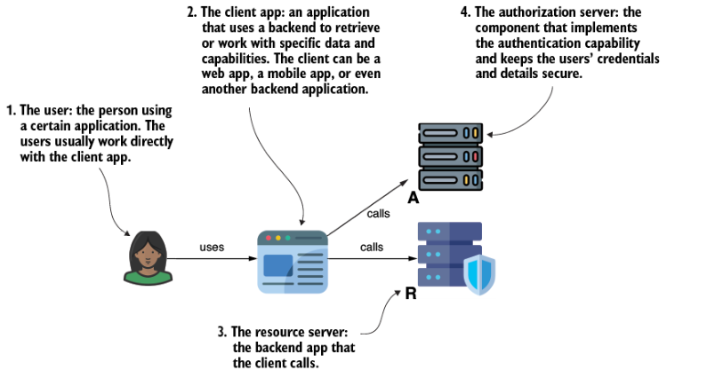

**Hình 13.2** Những thành phần tham gia trong một framework OAuth 2. User tương tác qua một client cần authorization cho một số thao tác nhất định trên backend service, được biết đến là resource server. Để được authorization ở backend, bước đầu tiên của client là authentication bởi authorization server.

Giờ hãy bàn về cách authentication và authorization thực sự diễn ra. Các bước rất đơn giản:

1. User thực hiện một use case nhất định với app client.
2. App client được authorize để gọi resource server nhằm phục vụ request của user.
3. Để được authorize, client trước hết yêu cầu một token (gọi là **access token**) từ authorization server. Token này chỉ là một số thông tin cụ thể giúp client chứng minh rằng authorization server đã định danh họ đúng cách.
4. Client dùng token mà authorization server cấp phát để được authorize khi gửi request tới backend của nó (resource server).

Hình 13.3 mô tả luồng này một cách trực quan. Các bước được đánh số trong hình biểu diễn:

1. User cố dùng ứng dụng client để thực hiện một use case cụ thể.
2. Ứng dụng client biết rằng nó không thể gọi backend của mình nếu chưa có một token cho phép nó được authorize. Client yêu cầu một access token như vậy từ authorization server.
3. Theo yêu cầu của app client, authorization server cấp phát một token và gửi nó tới app client.
4. Client dùng token để gửi request tới backend của nó (resource server).
5. Resource server authorize request của client. Nếu authorize thành công, resource server thực thi request của client và phản hồi lại.
6. Client hiển thị kết quả cho user.

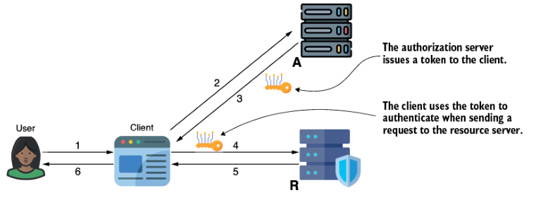

**Hình 13.3** Cách giải thích đơn giản nhất về thủ tục authentication OAuth 2 bao gồm việc client lấy một token từ authorization server. Token này sau đó được dùng để có được authorization cho các request gửi tới ứng dụng backend, tức resource server.

Nhưng chính xác thì token mà authorization server cấp phát là gì? Một token có thể là bất kỳ mẩu dữ liệu nào (thường là một chuỗi ký tự) cho phép client chứng minh rằng họ (và/hoặc user) đã được authorization server định danh. Token cũng là một cách để lấy thêm chi tiết về cả user lẫn client nếu cần. Vì authorization server giờ quản lý tất cả chi tiết về user và client, backend đôi khi cần lấy một phần những chi tiết này từ authorization server và dùng chúng. Backend sẽ lấy những chi tiết đó thông qua token. Đôi khi, chính token chứa những chi tiết cần thiết (như bạn sẽ đọc ở mục 13.2, những token như vậy gọi là **non-opaque token**); nếu không, backend cần gọi authorization server để lấy dữ liệu về client và user (tức **opaque token**). Ngoài ra, không giống một chiếc chìa khóa vật lý, một access token không có vòng đời dài. Nó hết hạn sau một khoảng thời gian ngắn (trong hầu hết trường hợp là vài phút), sau đó client cần hỏi authorization server lần nữa để lấy token khác. Bằng cách này, một token bị mất (như một chiếc chìa khóa bị mất) không thể bị lạm dụng.

OAuth 2 mô tả nhiều luồng mà trong đó một client có thể lấy token. Chúng ta gọi những luồng này là **grant type**, và ở mục 13.3, chúng ta bàn về những grant type phổ biến nhất được dùng.

---

## 13.2 Sử dụng các hiện thực token khác nhau

Token là những tấm thẻ ra vào (hình 13.4) mà client dùng để được authorize khi gửi request tới backend (resource server). Token là một phần thiết yếu của tiến trình authentication và authorization OAuth 2 vì chúng là thứ được dùng để chứng minh tính xác thực của việc authentication client và user, nhưng chúng cũng là cách để backend lấy thêm chi tiết về client và user.

Trong mục này, chúng ta bàn về cách token được phân loại và, tùy theo loại token, cách chúng được dùng trong tiến trình authorization.

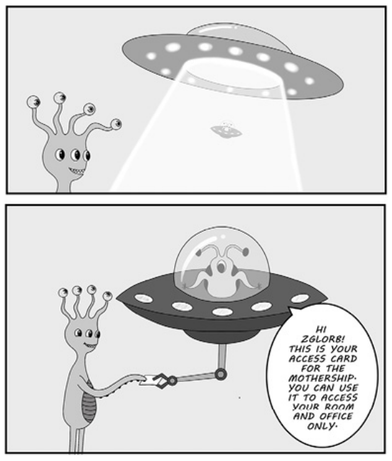

**Hình 13.4** Zglorb (user) cần truy cập Mothership (resource server). Để làm điều đó, trước hết họ được authentication (bởi authorization server), rồi họ được cấp một thẻ ra vào (token). Zglorb chỉ có thể truy cập những khu vực (tài nguyên) cụ thể của Mothership bằng thẻ ra vào của mình.

Chúng ta phân loại token dựa trên cách chúng cung cấp cho resource server dữ liệu cho việc authorization:

- **Opaque (không trong suốt)** — Những token không lưu dữ liệu. Để hiện thực authorization, resource server thường cần gọi authorization server, cung cấp opaque token, và lấy các chi tiết. Lời gọi này được biết đến là **introspection call** (lời gọi nội soi).
- **Non-opaque (trong suốt)** — Những token lưu dữ liệu, khiến backend có thể hiện thực authorization ngay lập tức. JSON Web Token (JWT) là hiện thực non-opaque token được dùng nhiều nhất.

### 13.2.1 Sử dụng opaque token

Opaque token không chứa dữ liệu mà backend có thể dùng để định danh user hay client, hoặc để hiện thực các quy tắc authorization. Opaque token chỉ là bằng chứng của một lần thử authentication. Khi một resource server nhận một opaque token, nó cần gọi authorization server để tìm hiểu xem token có hợp lệ hay không và lấy thêm thông tin cho phép nó áp dụng các ràng buộc authorization.

Một opaque token theo nghĩa đen giống như chìa khóa của một rương báu. Nó không cung cấp thông tin gì trước; bạn chỉ biết nó hoạt động khi bạn thử mở rương bằng nó. Khi bạn phát hiện ra nó hợp lệ, nó cũng đưa bạn tới thứ bên trong rương (trong trường hợp này là chi tiết user và client). Hình 13.5 minh họa phép so sánh này.

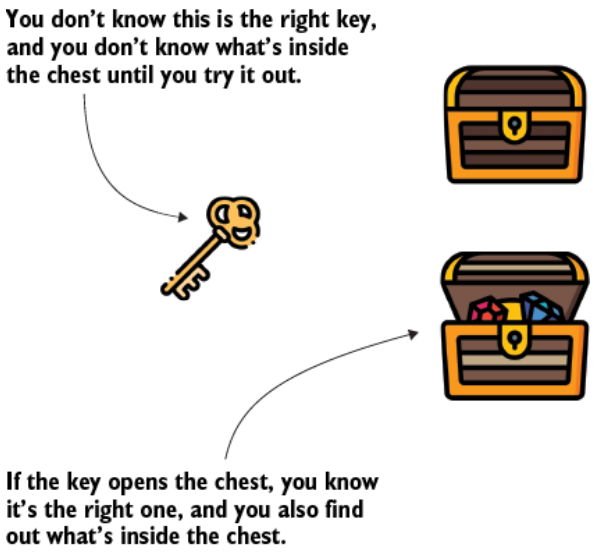

**Hình 13.5** Một phép so sánh với opaque token. Một opaque token giống như một chiếc chìa khóa. Bạn không biết nó hoạt động hay không cho tới khi bạn thử. Nếu chìa khóa hoạt động, bạn cũng có quyền truy cập những gì bên trong.

Resource server gọi một endpoint do authorization server cung cấp để tìm hiểu xem opaque token có hợp lệ hay không và lấy những chi tiết cần thiết về client và user mà token được cấp cho họ. Lời gọi này được gọi là **token introspection** (hình 13.6). Khi resource server có những chi tiết này, nó có thể áp dụng các ràng buộc authorization.

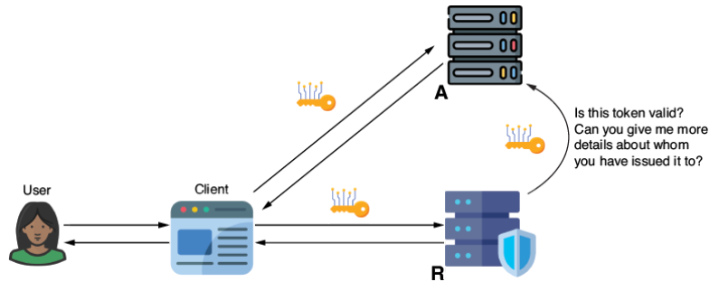

**Hình 13.6** Lời gọi token introspection. Resource server gửi một request tới authorization server để tìm hiểu xem opaque token có hợp lệ hay không và các chi tiết về việc nó được cấp cho ai.

### 13.2.2 Sử dụng non-opaque token

Không giống opaque token đã bàn ở mục 13.2.1, non-opaque token chứa thông tin về client và user mà authorization server đã cấp token cho họ trong tiến trình authentication. Bạn có thể so sánh non-opaque token với những tài liệu đã ký (hình 13.7).

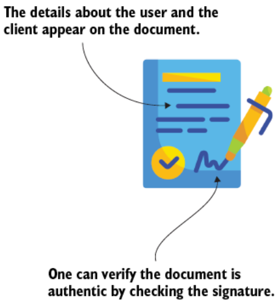

**Hình 13.7** Non-opaque token giống như một tài liệu đã ký. Nó chứa những chi tiết cần thiết để resource server áp dụng các ràng buộc authorization và một chữ ký để kiểm chứng tính xác thực của nó.

Hiện thực phổ biến nhất của một non-opaque token là JWT. Một JWT gồm ba phần (hình 13.8):

- **Header** — Thường chứa dữ liệu về token, chẳng hạn thuật toán mật mã dùng để ký token hoặc key ID mà authorization server đã dùng để ký nó
- **Body** — Thường chứa dữ liệu về thực thể mà token được cấp cho, chẳng hạn chi tiết client và user
- **Signature (chữ ký)** — Một giá trị được sinh ra bằng mật mã, có thể dùng để chứng minh rằng authorization server quả thực đã cấp token và không ai thay đổi nội dung của nó (trong header hay body) sau khi nó được sinh ra

Dữ liệu trong header và body được định dạng JavaScript Object Notation (JSON), rồi được encode dưới dạng Base64 để nhỏ hơn và dễ truyền hơn. Dấu chấm phân tách ba phần này.

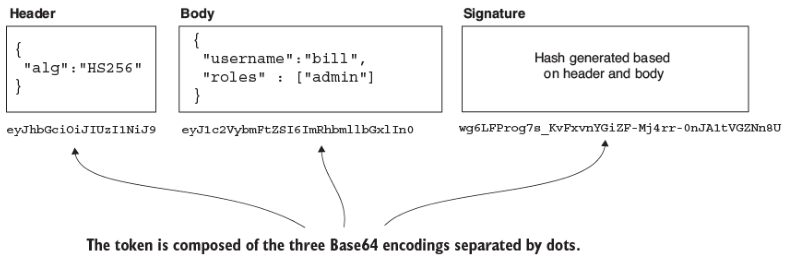

**Hình 13.8** Cấu tạo của một JWT token. Header và body chứa những chi tiết cần thiết để resource server kiểm chứng tính xác thực của token và áp dụng các ràng buộc authorization.

Đoạn code kế tiếp cho thấy một ví dụ về JWT trong đó ba phần được encode Base64, phân tách bởi dấu chấm:

```
eyJhbGciOiJIUzI1NiIsInR5cCI6IkpXVCJ9.eyJzdWIiOiIxMjM0NTY3ODkwIiwibmFtZSI6IkpvaG4gRG…
```

> **Ghi chú của người dịch:** Chuỗi JWT ví dụ trên bị PDF gốc cắt cụt ở cuối dòng. Đây là chuỗi JWT mẫu quen thuộc, giải mã header cho `{"alg":"HS256","typ":"JWT"}` và body bắt đầu bằng `{"sub":"1234567890","name":"John Do…`.

Giờ bạn có thể đang tự hỏi: "Khi nào tôi nên dùng opaque token, và khi nào nên dùng non-opaque token?" Như tôi đã nói ở đầu mục này, non-opaque token được dùng thường xuyên nhất hiện nay vì chúng không cần introspection để kiểm chứng. Tuy nhiên, non-opaque token chứa dữ liệu, và client gửi dữ liệu này qua đường truyền tới backend của nó. Bất kỳ ai lấy được token cũng có thể thấy dữ liệu mà token mang theo. Trong đa số trường hợp, đây không phải vấn đề. Và tôi khuyến nghị mọi người tránh gửi quá nhiều dữ liệu bên trong token.

Nhưng bạn nên làm gì nếu bạn có một lượng dữ liệu lớn hơn hoặc dữ liệu không an toàn để gửi qua đường truyền bên trong một token? Trong trường hợp như vậy, opaque token có thể là một lựa chọn tốt. Tôi khuyến nghị bạn trước hết cân nhắc non-opaque token và chỉ quay lại dùng opaque token nếu lượng dữ liệu mà token phải mang quá lớn, hoặc bạn cần gửi những chi tiết nhạy cảm hơn và muốn tránh trao đổi chúng qua token.

---

## 13.3 Lấy token thông qua các grant type khác nhau

Mục này bàn về grant type. Một **grant type** là một tiến trình trong đó client lấy được một token. Trong các app, bạn sẽ thấy nhiều cách tiếp cận mà client lấy token từ authorization server. Chúng ta sẽ bàn về ba grant type được dùng nhiều nhất. Ở cuối mục này, chúng ta sẽ khám phá cách một client có thể sinh lại token sau khi nó hết hạn.

> **NOTE** Bạn vẫn có thể gặp những app hiện thực hai grant type khác: implicit và password grant type. Hai grant type này đã trở nên deprecated vì chúng bị phát hiện là không đủ an toàn. Chúng ta sẽ không bàn về chúng trong cuốn sách này; tôi không khuyến nghị dùng chúng trong các app. Bạn luôn có thể thay thế cả hai bằng một trong những grant type được bàn ở mục này. Nếu bạn muốn tìm hiểu thêm về password grant type, có một phần thảo luận hay về nó ở chương 12 của ấn bản đầu tiên cuốn sách này. Chúng ta cũng đi nhanh qua implicit grant type và lý do nó bị deprecated khi bàn về authorization code grant type trong mục này.

Mục 13.3.1 bàn về authorization code grant type, grant type được dùng nhiều nhất khi hệ thống cần cho phép một user authentication. Ở mục 13.3.2, chúng ta bàn về một bổ sung cho authorization code grant type — proof key for code exchange (PKCE). Ở mục 13.3.3, chúng ta tiếp tục với tình huống mà một app cần lấy token mà không có user nào authentication, và chúng ta kết thúc với cách sinh lại token ở mục 13.3.4.

### 13.3.1 Lấy token bằng authorization code grant type

Authorization code grant type là grant type được dùng nhiều nhất hiện nay. Nó được dùng khi app của chúng ta cần authentication một user (để dễ hiểu grant type này, xem hình 13.9, minh họa các bước trong một sơ đồ tuần tự):

1. User muốn làm gì đó trong app họ dùng. Ví dụ, giả sử cô gái ở bên trái sơ đồ là Mary, một kế toán viên muốn xem tất cả các hóa đơn mà công ty cô làm việc cần thanh toán.
2. App Mary dùng là client. Trong trường hợp này, Mary ngồi trước máy tính của cô, nên app client của cô là một web app. Nhưng Mary cũng có thể đã dùng phiên bản mobile của app. Trong cả hai trường hợp, grant type sẽ trông giống nhau. Vì Mary chưa đăng nhập, app chuyển hướng cô tới một trang đăng nhập được host bởi authorization server.
3. Giờ Mary thấy trang đăng nhập trong trình duyệt của cô. Trang đăng nhập không nằm trong app cô truy cập mà được host bởi một hệ thống khác. Mary nhận ra trang cô được chuyển hướng tới là ứng dụng authentication tập trung mà cô dùng cho bất kỳ app nào cô làm việc cùng cho công ty. Mary biết rằng sau khi gửi credential của mình, trình duyệt sẽ đưa cô trở lại ứng dụng hóa đơn, và cô sẽ có thể xem các hóa đơn và thao tác với dữ liệu cô cần. Cô điền đúng credential và chọn nút đăng nhập.
4. Vì credential Mary cung cấp là đúng, authorization server chuyển hướng trở lại ứng dụng hóa đơn. Authorization server cũng cung cấp cho ứng dụng ban đầu (client) một mã duy nhất gọi là "**authorization code**". Client sẽ dùng mã này để lấy access token.
5. Client yêu cầu một access token. Client cần access token này để gửi request tới backend của nó (resource server).
6. Vì authorization code là đúng (chính cái mà server đã cung cấp ở bước 5), authorization server phản hồi bằng một access token.
7. App client dùng access token để gửi request tới backend của nó và được authorize.

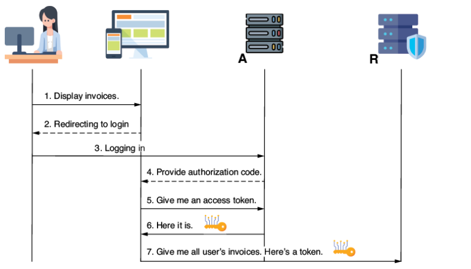

**Hình 13.9** Authorization code grant type. User được yêu cầu đăng nhập. Sau khi đăng nhập, authorization server cấp một authorization code cho client, thứ mà client sau đó dùng để lấy access token. Access token này cho phép client được resource server authorize các request của mình.

Một vài quan sát giúp bạn hiểu luồng này tốt hơn:

- Hãy chú ý tới các mũi tên nét đứt. Điều cốt yếu cần nhớ là chúng biểu diễn các phép chuyển hướng (redirect) trong trình duyệt chứ không phải request hay response. Ở bước 2, app client chuyển hướng user tới trang đăng nhập của authorization server (nó chuyển hướng trong trình duyệt tới một trang web của app khác). Ở bước 4, authorization server chuyển hướng trở lại app client, cung cấp authorization code (thường dưới dạng một query parameter).
- Mary (user) không nhận thức được các bước 4 đến 7. Sau khi cô đăng nhập, cuối cùng cô sẽ thấy các hóa đơn được client hiển thị — client lấy chúng từ response của bước 7 sau khi được authorize.
- Hãy nhớ đừng nhầm lẫn giữa authorization code và access token. Access token là thứ mà cuối cùng client cần để được backend của nó authorize (bước 7). Nhưng để lấy access token, client trước hết phải lấy một authorization code (bước 4 và 5).

Thêm vào đó, nhiều lập trình viên mới với authorization và authentication bị nhầm lẫn về bước 4. Câu hỏi tôi thường nhận được là: "Tại sao authorization server không trả về trực tiếp access token ở đây?" Có vẻ lạ khi client cần thêm một bước nữa để lấy access token trong khi họ có thể lấy trực tiếp ở bước 4.

Nhưng điều đó hợp lý. Thực tế, trong phiên bản đầu tiên của OAuth, authorization server cung cấp access token thay vì authorization code ở bước 4. Đây là cái mà giờ chúng ta gọi là "**implicit grant type**", thứ đã bị deprecated và không còn được khuyến nghị dùng. Lý do là một redirect có thể dễ dàng bị chặn bắt, và một cá nhân có ý đồ xấu có thể rất dễ dàng lấy được access token. Bằng cách trả về authorization code, authorization server buộc client phải gửi lại một request mà ở đó họ phải authentication lần nữa bằng credential của mình. Bằng cách này, nếu ai đó chặn bắt redirect và lấy được authorization code, như vậy vẫn chưa đủ để lấy access token. Họ sẽ cần biết cả credential của client để gửi request và lấy token.

Hình 13.10 trình bày trực quan hai bước mà authorization code bổ sung thêm bảo vệ nhằm tránh cho phép ai đó lấy được access token.

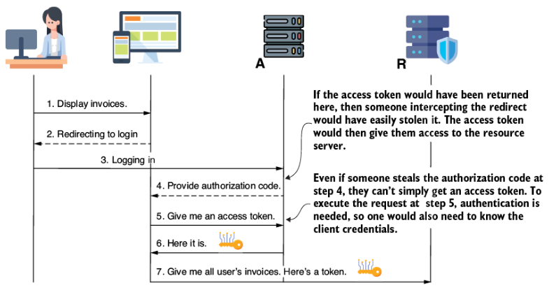

**Hình 13.10** Sau khi đăng nhập và nhận một authorization code, client phải thực hiện thêm một request nữa để lấy access token. Trong request này, client được yêu cầu kiểm chứng danh tính của mình bằng credential. Phương pháp này làm tăng độ khó cho bất kỳ ai cố lấy access token một cách bất hợp pháp, vì họ sẽ cần chặn bắt authorization code và cũng phải biết credential của client.

### 13.3.2 Áp dụng bảo vệ PKCE cho authorization code grant type

Điều gì xảy ra nếu một cá nhân có ý đồ xấu cũng lấy được credential của client? Trong trường hợp này, họ có thể lấy được access token và gửi request tới resource server. Có cách nào để chúng ta ngăn chặn điều như vậy xảy ra không? Có, **proof key for code exchange** (PKCE, thường được phát âm là "pixy") là một cải tiến được thêm vào luồng authorization code để làm nó an toàn hơn. Trong mục này, chúng ta bàn về cách PKCE bao phủ trường hợp ai đó có thể lấy access token bằng cách đánh cắp credential của client.

Việc dùng PKCE chỉ ảnh hưởng tới hai bước của authorization code grant type mà chúng ta đã bàn ở mục 13.3.1. Trong hình 13.11, tôi đã làm dày các mũi tên biểu diễn bước 3 và 5. Đây là hai bước của authorization code grant type mà PKCE được áp dụng:

1. Trước hết, client cần sinh một giá trị ngẫu nhiên. Giá trị này có thể là một chuỗi byte ngẫu nhiên. Giá trị này gọi là **verifier**.
2. Thứ hai, client sẽ áp dụng một hàm hash lên giá trị được sinh ngẫu nhiên ở bước 1. Hàm hash là một phép mã hóa đặc trưng bởi việc đầu ra không thể chuyển ngược lại thành đầu vào (chương 4). Kết quả của việc áp dụng hàm hash lên verifier gọi là **challenge**.

```
verifier = random();
challenge = hash(verifier);
```

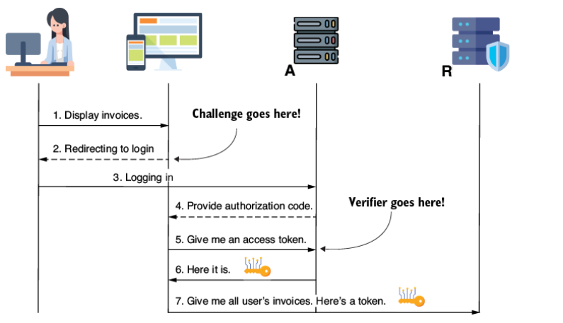

**Hình 13.11** Client sẽ gửi một challenge ở bước 3 và verifier ở bước 5 để chứng minh rằng họ chính là client đã ban đầu yêu cầu user đăng nhập.

Client gửi challenge ở bước 3 cùng với việc đăng nhập của user. Authorization server giữ challenge và mong đợi verifier trong request được thực hiện ở bước 5 để lấy access token. Nếu verifier mà client gửi khi yêu cầu token ở bước 5 khớp với challenge họ đã gửi ở bước 3, thì authorization server biết rằng app client yêu cầu token chính là app đã yêu cầu user authentication.

Giờ ai đó không thể lấy được access token ngay cả khi họ bằng cách nào đó lấy được authorization code ở bước 4. Điều này là vì họ sẽ cần biết cả giá trị verifier. Họ không thể biết verifier vì client chưa gửi nó qua đường truyền. Và họ không thể lấy verifier chỉ bằng cách chặn bắt challenge (ở bước 3) vì challenge được tạo bằng một hàm hash, ngụ ý rằng đầu ra không thể chuyển ngược lại thành đầu vào.

### 13.3.3 Lấy token với client credentials grant type

Đôi khi một app cần được authorization mà không có sự can thiệp của user. Nếu không có user nào trên sân khấu, một app sẽ phải dùng **client credentials grant type** để lấy access token. Tình huống này thường xảy ra khi một service cần gọi một service khác khi một sự kiện khách quan, chẳng hạn bộ đếm thời gian của một tiến trình được lập lịch, kích hoạt nó. Dùng client grant type, app chỉ cần authentication bằng credential client của mình. Hình 13.12 trình bày client credentials grant type:

1. App yêu cầu một access token từ authorization server. App dùng credential của mình để authentication.
2. Nếu credential hợp lệ, authorization server cấp một access token.
3. App dùng access token để được authorize khi gửi request tới resource server.

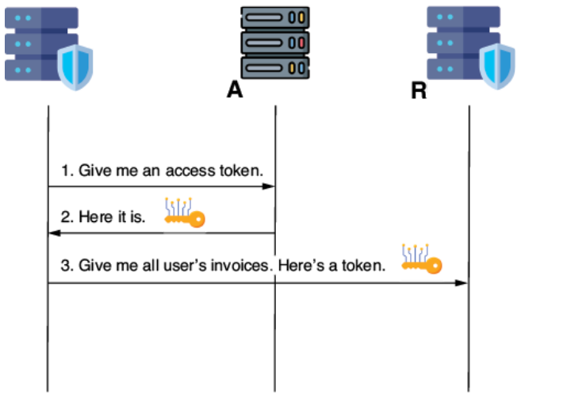

**Hình 13.12** Client grant type. Một app lấy được access token mà không cần một user authentication.

### 13.3.4 Dùng refresh token để lấy access token mới

Một điều thiết yếu bạn phải nhớ về token là chúng phải có vòng đời tương đối ngắn. Thời gian chính xác chúng còn sống thường được quyết định theo tình huống, nhưng thường ngắn chỉ 15 phút, và tôi chưa bao giờ dùng token sống lâu hơn một giờ. Cuối cùng, tất cả token đều cần hết hạn sớm hay muộn. Khi một token hết hạn, resource server sẽ không chấp nhận nó nữa. Trong trường hợp như vậy, khi một client có một token và token đã hết hạn, họ có hai lựa chọn:

1. Lấy một access token mới bằng cách lặp lại các bước của grant type. Điều này ngụ ý việc yêu cầu user đăng nhập lại trong trường hợp authorization code grant type.
2. Dùng một **refresh token** để lấy access token mới.

Refresh token đặc biệt hữu ích khi client dùng một grant type, chẳng hạn authorization code, đòi hỏi một user phải đăng nhập. Hãy hình dung bạn có token với vòng đời 15 phút. Là một user, bạn có không thấy phiền nếu app của bạn yêu cầu đăng nhập lại liên tục mỗi 15 phút? Tôi thì có!

App có thể dùng refresh token để lấy access token mới thay vì yêu cầu user đăng nhập mỗi lần access token hết hạn.

Hình 13.13 cho thấy các bước sử dụng refresh token:

1. User cố lấy một số dữ liệu, ngụ ý rằng client phải gọi backend của nó.
2. Vì access token (đã lấy trước đó) đã hết hạn, client cần lấy một cái mới. Client gửi một refresh token để chứng minh họ chính là người đã authentication trước đó.
3. Authorization server nhận diện refresh token và cung cấp cho client một access token mới.
4. Client có thể gọi backend (resource server) và được authorize bằng access token mới.

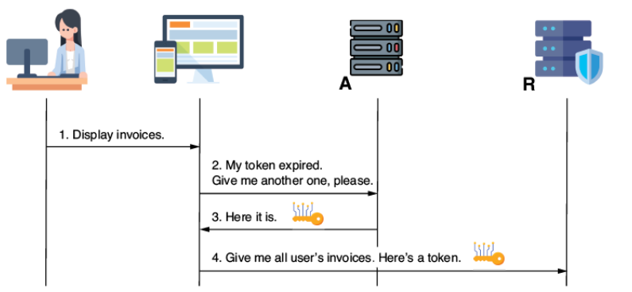

**Hình 13.13** Một app client có thể dùng refresh token để lấy access token mới khi cái cũ hết hạn. Bằng cách này, app tránh việc yêu cầu user authentication lần nữa.

---

## 13.4 OpenID Connect mang lại gì cho OAuth 2

Chắc chắn vẫn còn rất nhiều nhầm lẫn ngoài kia về OpenID Connect (đôi khi gọi là OIDC) và OAuth 2 cùng những khác biệt giữa hai thứ này. Tôi thường nói với học viên của mình đừng căng thẳng quá về chủ đề này: "Nếu bạn hiểu OAuth 2, bạn cũng biết cách dùng OpenID Connect."

Thực tế, OIDC là một giao thức được xây dựng trên đặc tả OAuth 2. Vì lý do này, việc hiểu OAuth 2 giúp bạn dễ dàng nắm được OIDC. Để tôi đưa cho bạn một phép so sánh về đặc tả (specification) và giao thức (protocol).

Tất cả chúng ta đều dùng ổ cắm điện mỗi ngày. Ổ cắm điện trông khác nhau trên khắp thế giới. Đôi khi, đây là một nỗi đau thực sự khi bạn đi du lịch. Bạn có thể cần có adapter để đảm bảo sạc được thiết bị của mình, đặc biệt nếu bạn di chuyển giữa các vùng địa lý khác nhau.

Nhưng ở phía sau hậu trường, tất cả ổ cắm đều hoạt động theo cùng một cách. Có một số dây dẫn xuất ra điện áp. Bạn có thể định nghĩa một framework mà tất cả ổ cắm điện trên thế giới hoạt động theo, chỉ trong vài gạch đầu dòng:

- Một ổ cắm điện có ba dây cho phép dòng điện chạy qua: dây pha, dây trung tính, và dây nối đất. Dây nối đất là tùy chọn.
- Ổ cắm điện cung cấp một điện áp hoặc khoảng 120 Volt, hoặc 230 Volt.

Đừng lo nếu bạn không phải người kỹ thuật; bạn không cần hiểu hai gạch đầu dòng này. Ít nhất là không cần cho việc học Spring Security. Cứ tin lời tôi.

Vấn đề là ngay cả khi tất cả ổ cắm trên thế giới thỏa mãn những đặc tả này, chúng ta vẫn gặp tình huống cần adapter khi đi du lịch. Lý do là chúng không có một giao thức chung. Adapter là cần thiết để chuyển đổi ổ cắm từ giao thức này sang giao thức khác (ví dụ, Bắc Mỹ sang châu Âu).

Điều tương tự xảy ra với các app cùng authentication và authorization. Nếu hai app thỏa mãn đặc tả OAuth 2, chúng vẫn có thể rơi vào tình huống không hoàn toàn tương thích và cần được điều chỉnh vì chúng không chạy cùng giao thức. OpenID Connect là một giao thức hạn chế một chút sự tự do của đặc tả OAuth 2, giới thiệu một vài thay đổi. Những thay đổi chính là:

- Các giá trị cụ thể cho scope (chẳng hạn `profile` hoặc `openid`).
- Việc dùng một token bổ sung tên là **ID token**, dùng để lưu chi tiết về danh tính của user và client mà token được cấp cho họ.
- Thông thường thuật ngữ *grant type* cũng được gọi là *flow* khi bàn về nó trong ngữ cảnh OIDC, trong khi authorization server thường được gọi là **identity provider** hay **IdP**.

---

## 13.5 Những "tội lỗi" của OAuth 2

Mục này bàn về những lỗ hổng có thể có của các ứng dụng dùng authentication và authorization OAuth 2. Việc hiểu điều gì có thể sai khi dùng OAuth 2 là thiết yếu để tránh những tình huống này khi phát triển ứng dụng. Tất nhiên, như mọi thứ khác trong phát triển phần mềm, OAuth 2 không phải bất khả xâm phạm. Nó có những lỗ hổng mà chúng ta phải nhận thức được khi xây dựng ứng dụng. Tôi liệt kê ở đây một số cái phổ biến nhất:

- **Dùng cross-site request forgery (CSRF) trên client** — Với một user đã đăng nhập, CSRF là khả thi nếu ứng dụng không áp dụng cơ chế bảo vệ CSRF nào. Chúng ta đã có phần thảo luận tuyệt vời về bảo vệ CSRF do Spring Security hiện thực ở chương 9.
- **Đánh cắp credential của client** — Việc lưu trữ hoặc truyền credential mà không được bảo vệ có thể tạo ra những lỗ hổng cho phép kẻ tấn công đánh cắp và dùng chúng.
- **Phát lại (replay) token** — Như đã bàn ở mục 13.2, token là những "chìa khóa" chúng ta dùng trong một kiến trúc authentication và authorization OAuth 2 để truy cập tài nguyên. Bạn gửi chúng qua mạng, và đôi khi chúng có thể bị chặn bắt. Nếu bị chặn bắt, chúng bị đánh cắp và có thể được tái sử dụng. Hãy hình dung bạn làm mất chìa khóa cửa trước nhà mình. Điều gì có thể xảy ra? Người khác có thể dùng nó để mở cửa bao nhiêu lần tùy thích (replay).
- **Chiếm đoạt (hijack) token** — Bạn can thiệp vào tiến trình authentication và đánh cắp token mà bạn có thể dùng để truy cập tài nguyên. Đây cũng là một lỗ hổng tiềm tàng của việc dùng refresh token, vì chúng cũng có thể bị chặn bắt và dùng để lấy access token mới. Tôi khuyến nghị bài viết hữu ích này: <http://mng.bz/am5z>.

Hãy nhớ, OAuth 2 là một framework. Các lỗ hổng là kết quả của việc hiện thực chức năng sai trên nó. Việc dùng Spring Security đã giúp chúng ta giảm thiểu hầu hết những lỗ hổng đó trong ứng dụng của mình. Khi hiện thực một ứng dụng với Spring Security, như bạn đã thấy trong chương này, chúng ta cần thiết lập các cấu hình, nhưng chúng ta dựa vào luồng như Spring Security đã hiện thực.

Để biết thêm chi tiết về các lỗ hổng liên quan tới framework OAuth 2 và cách một cá nhân có ý đồ xấu có thể khai thác chúng, xem phần 3 của cuốn *OAuth 2 In Action* của Justin Richer và Antonio Sanso (Manning, 2017), có tại <http://mng.bz/g7Ql>.

---

## Tóm tắt

- Framework OAuth 2 mô tả những cách an toàn mà một backend có thể authentication các client của nó. OpenID Connect là một giao thức hiện thực client OAuth 2 bằng cách áp dụng một số ràng buộc cho các hiện thực khả dĩ.
- Bốn actor chính trong một hệ thống OAuth 2 là:
  - **User** — Một người muốn thực hiện một use case
  - **Client** — Một app phải được authorize để truy cập một tài nguyên hoặc use case trên một backend cho trước
  - **Resource server** — Một backend cần authorize một client để thực hiện một use case cụ thể hoặc truy cập một tài nguyên
  - **Authorization server** — Một app quản lý chi tiết user và client, cho phép họ authentication, và cung cấp một token có thể dùng cho mục đích authorization
- Token là một thẻ ra vào (hoặc một chìa khóa) mà client lấy từ authorization server và dùng để được authorize gọi một use case hoặc truy cập một tài nguyên cụ thể trên một backend được bảo vệ (resource server).
- Chúng ta phân loại token thành hai nhóm:
  - **Opaque** — những token không chứa chi tiết về user và client mà chúng được cấp cho. Với những token như vậy, resource server luôn cần gọi authorization server để kiểm chứng token và lấy những chi tiết nó cần để authorize request. Request kiểm chứng token này gọi là introspection.
  - **Non-opaque** — những token chứa chi tiết về user và client mà chúng được cấp cho. Hiện thực phổ biến nhất của non-opaque token là JSON Web Token (JWT).
- Có nhiều luồng mà trong đó một app client có thể hỏi authorization server để lấy token. Những luồng mà token được cấp phát này gọi là grant type. Các grant type phổ biến nhất là:
  - Authorization code grant type
  - Client credentials grant type
- Đôi khi chúng ta thêm bảo mật bổ sung cho authorization code grant type bằng cách tiếp cận proof key for code exchange (PKCE). Ở đây client dùng những giá trị bổ sung để tránh việc ai đó có thể lấy được access token bằng cách đánh cắp credential của client và authorization code.
- Trong những trường hợp cụ thể, một app có thể cần lấy access token mới mà không cần user authentication lại. Với những trường hợp như vậy, app có thể dùng refresh token. Refresh token là những token đặc biệt chỉ có thể dùng để lấy access token mới.
