# 16. Hiện thực một OAuth 2 client

> Bản dịch tiếng Việt của chương 16 — *Spring Security in Action, Second Edition* (Laurentiu Spilca, Manning).

**Nội dung chương này bao gồm:**

- Hiện thực một OAuth 2 login
- Hiện thực một Spring Security OAuth 2 client
- Sử dụng client credentials grant type

Thông thường, việc hiện thực giao tiếp giữa các ứng dụng backend là cần thiết, đặc biệt với những app backend liên quan tới nhiều service. Trong những trường hợp như vậy, khi các hệ thống có authentication (xác thực) và authorization (phân quyền) được xây dựng trên OAuth 2, bạn nên authentication các lời gọi giữa các app bằng cùng cách tiếp cận đó. Dù các lập trình viên đôi khi dùng phương thức HTTP Basic và API Key authentication (chương 6) cho đơn giản, để giữ hệ thống nhất quán và an toàn hơn, việc dùng OAuth 2 client credentials grant type là lựa chọn được ưu tiên.

Còn nhớ các actor OAuth 2 (hình 16.1)? Chúng ta đã bàn về authorization server ở chương 14 và resource server ở chương 15. Chương này dành riêng cho client. Chúng ta sẽ bàn về cách dùng Spring Security để hiện thực một OAuth 2 client và khi nào cùng cách thức một app backend trở thành một client trong hệ thống OAuth 2.

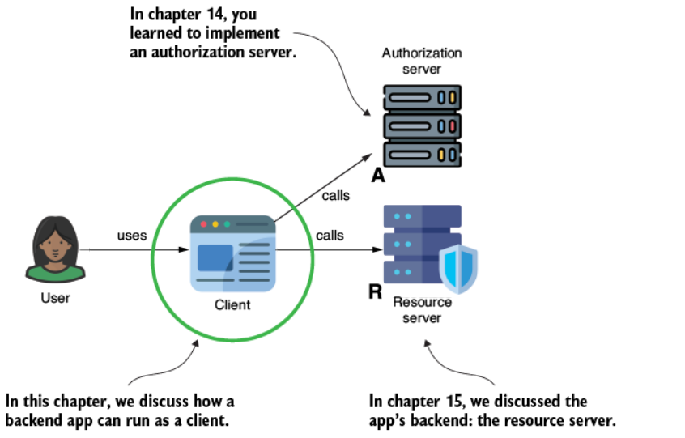

**Hình 16.1** Các actor OAuth 2. Trong chương này, chúng ta bàn về client và cách một app backend có thể đóng vai trò client trong một hệ thống có authentication và authorization được thiết kế theo OAuth 2.

Được rồi, có lẽ hình 16.1 chưa minh họa đầy đủ những gì chúng ta sẽ nói tới. Chúng ta sẽ bắt đầu bằng việc bàn về login cho user, nhưng chúng ta cũng sẽ tập trung vào cách làm cho một app backend trở thành client cho một app backend khác. Các app backend được thiết kế với Spring Security cũng có thể trở thành client. Hình 16.2 cho thấy trường hợp còn lại mà chúng ta sẽ bàn ở đây. Trong chương hiện tại, chúng ta sẽ giải quyết vấn đề hiện thực giao tiếp giữa hai app backend, biến một trong số đó thành một OAuth 2 client thực thụ. Trong trường hợp như vậy, chúng ta cần dùng Spring Security để xây dựng một OAuth 2 client.

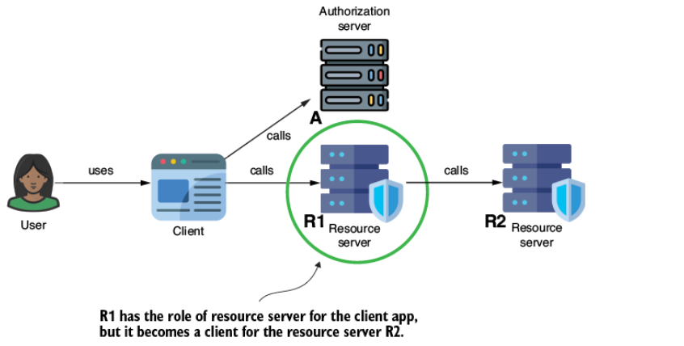

**Hình 16.2** Một app backend có thể trở thành client cho một app backend khác. Chúng ta bàn về trường hợp này trong chương hiện tại.

Mục 16.1 bàn về cách dễ dàng hiện thực một OAuth 2 login cho một web app Spring MVC dùng Spring Security. Chúng ta sẽ dùng một nhà cung cấp authorization server bên ngoài, chẳng hạn Google và GitHub. Bạn sẽ học cách hiện thực login cho app của mình, nơi user có thể authentication bằng credential Google hoặc GitHub của họ. Dùng cùng cách tiếp cận, bạn có thể hiện thực login như vậy với một authorization server tùy chỉnh (tự sở hữu).

Ở mục 16.2, chúng ta triển khai một hiện thực tùy chỉnh của client thông qua một service và bàn về việc dùng client credentials grant type.

---

## 16.1 Hiện thực OAuth 2 login

Mục này bàn về cách hiện thực một OAuth 2 login cho web app Spring của bạn. Với Spring Boot, việc cấu hình authentication cho những trường hợp chuẩn (trường hợp mà authorization server thỏa mãn đúng đặc tả OAuth 2 và OpenID Connect) dễ như ăn bánh. Chúng ta sẽ bắt đầu với một trường hợp kinh điển (mà bạn có thể dùng với hầu hết các nhà cung cấp nổi tiếng như Google, GitHub, Facebook, và Okta).

Rồi tôi sẽ cho bạn thấy những gì diễn ra phía sau hậu trường của cấu hình tự cung cấp để bạn cũng có thể bao quát những trường hợp tùy chỉnh. Ở cuối mục này, bạn sẽ có thể hiện thực login cho web app Spring của mình với bất kỳ nhà cung cấp OAuth 2 nào và thậm chí cho phép user chọn giữa nhiều nhà cung cấp khác nhau khi authentication.

### 16.1.1 Hiện thực authentication với một nhà cung cấp phổ biến

Trong mục này, chúng ta sẽ hiện thực trường hợp login đơn giản nhất, cho phép user của app đăng nhập chỉ dùng một nhà cung cấp. Cho phần minh họa này, tôi chọn Google làm nhà cung cấp authentication cho user.

Chúng ta bắt đầu bằng cách thêm một vài tài nguyên vào project để hiện thực một web app Spring đơn giản với những khả năng login đã đề cập. Listing 16.1 cho thấy các dependency cho app demo. Bạn có thể tìm thấy app trong ví dụ này ở project `ssia-ch16-ex1`. Bạn sẽ nhận ra một dependency mới mà chúng ta chưa dùng ở các chương trước: dependency OAuth 2 client.

**Listing 16.1 Các dependency cần thiết cho phần minh họa của chúng ta**

```xml
<dependency>
   <groupId>org.springframework.boot</groupId>
   <artifactId>spring-boot-starter-oauth2-client</artifactId>   <!-- ① -->
</dependency>
<dependency>
   <groupId>org.springframework.boot</groupId>
   <artifactId>spring-boot-starter-security</artifactId>
</dependency>
<dependency>
   <groupId>org.springframework.boot</groupId>
   <artifactId>spring-boot-starter-web</artifactId>
</dependency>
```

① Dependency mới duy nhất bạn thấy là dependency OAuth 2 client. Chúng ta cần dependency này cho tất cả các khả năng OAuth 2 client mà chúng ta cấu hình trong project.

Nếu bạn cần ôn lại về việc xây dựng web app với Spring Boot, chương 7 và 8 của cuốn *Spring Start Here* (Manning, 2020), một cuốn sách khác do tôi viết, sẽ giúp bạn nhớ lại những kỹ năng này nhanh chóng. Đoạn code sau đây cho thấy controller đơn giản của web app demo, chỉ có một trang chủ:

```java
@Controller
public class HomeController {

  @GetMapping("/")
  public String home() {
    return "index.html";
  }
}
```

Đoạn code kế tiếp cho thấy trang HTML demo nhỏ mà chúng ta mong đợi truy cập được khi authentication kết thúc thành công:

```html
<!DOCTYPE html>
<html lang="en">
<head>
    <meta charset="UTF-8">
    <title>Title</title>
</head>
<body>
    <h1>Home</h1>
</body>
</html>
```

Listing 16.2 trình bày cấu hình cho OAuth 2 login như một phương thức authentication cho web app. Việc cấu hình app theo cách này sẽ tự động theo authorization code grant type, chuyển hướng user tới đăng nhập trên một authorization server cụ thể và chuyển hướng trở lại khi authentication thành công. Tiến trình này theo chính xác những gì chúng ta đã bàn ở chương 13 đến 15 và đã minh họa nhiều lần trong những chương đó bằng cURL.

**Listing 16.2 Cấu hình OAuth 2 login**

```java
@Configuration
public class SecurityConfig {

  @Bean
  public SecurityFilterChain securityFilterChain(HttpSecurity http)
    throws Exception {

    http.oauth2Login(Customizer.withDefaults());         // ①

    http.authorizeHttpRequests(
       c -> c.anyRequest().authenticated());

    return http.build();
  }
}
```

① Để cấu hình authentication như OAuth 2 login, chúng ta dùng phương thức `oauth2Login()`.

Tôi cá là bạn đang nghĩ: Chẳng phải chúng ta vẫn phải điền tất cả những chi tiết đã học ở chương 13 đến 15, chẳng hạn authorization URL, token URL, client ID, client secret, v.v.? Đúng, tất cả những chi tiết này đều cần thiết. May mắn thay, Spring Security lại có thể giúp bạn. Nếu app của bạn dùng một trong những nhà cung cấp mà Spring Security coi là nổi tiếng (well known), hầu hết những chi tiết này đã được điền sẵn. Bạn chỉ cần cấu hình client credential của app. Spring Security coi những nhà cung cấp sau là nổi tiếng:

- Google
- GitHub
- Okta
- Facebook

Spring Security cấu hình sẵn chi tiết cho những nhà cung cấp này trong class `CommonOAuth2Provider`. Vậy nên nếu bạn dùng bất kỳ cái nào trong số đó, bạn chỉ cần cấu hình client credential trong application properties, và nó sẽ hoạt động. Đoạn code sau đây cho thấy hai property bạn cần để cấu hình client ID và client secret khi dùng Google (tôi đã cắt bớt giá trị credential của mình):

```properties
spring.security.oauth2.client.registration.google.client-id=790…
spring.security.oauth2.client.registration.google.client-secret=GOC…
```

Tôi ngầm định ở đây rằng bạn đã đăng ký app của mình trong Google Developer Console — đó là nơi bạn lấy bộ credential duy nhất cho app. Nếu bạn chưa làm điều này trước đây, và bạn muốn cấu hình authentication dùng Google cho app của mình, bạn có thể tìm thấy tài liệu chi tiết của Google về cách đăng ký app OAuth 2 với Google tại <http://mng.bz/eEvz>.

Hình 16.3 cho thấy cách app hiển thị màn hình đăng nhập Google khi cấu hình đúng nhà cung cấp nổi tiếng này.

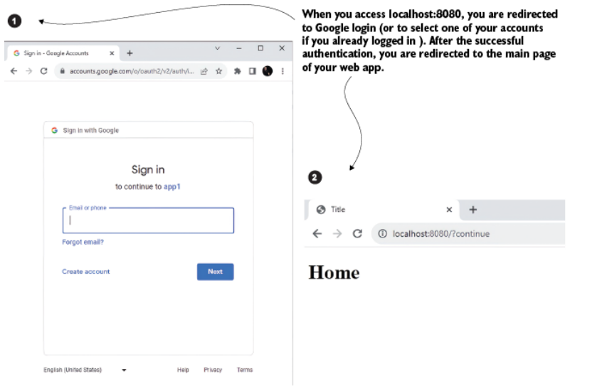

**Hình 16.3** Khi truy cập app trong trình duyệt web, trình duyệt chuyển hướng bạn tới trang đăng nhập Google. Nếu bạn authentication với Google đúng cách, bạn được chuyển hướng trở lại trang chính của app.

### 16.1.2 Cho user nhiều lựa chọn hơn

Tôi chắc rằng đến giờ bạn đã lướt internet đủ nhiều để thấy rằng nhiều app cung cấp hơn một cách để user đăng nhập. Đôi khi bạn thậm chí có thể chọn giữa bốn hoặc năm nhà cung cấp để đăng nhập vào một app. Cách tiếp cận này có lợi vì không phải tất cả chúng ta đều đã có tài khoản với một mạng xã hội. Một số người có tài khoản Facebook, nhưng những người khác thích dùng LinkedIn. Một số lập trình viên thích đăng nhập bằng tài khoản GitHub, nhưng những người khác dùng địa chỉ Gmail.

Với Spring Security, bạn có thể làm cho điều này hoạt động một cách đơn giản, ngay cả khi dùng nhiều nhà cung cấp. Giả sử tôi muốn cho phép user của app đăng nhập bằng Google hoặc GitHub. Tôi chỉ cần cấu hình credential cho cả hai nhà cung cấp tương tự nhau. Đoạn code sau đây cho thấy các property cần thiết trong file *application.properties* để thêm GitHub làm một phương thức authentication. Hãy nhớ rằng bạn phải giữ lại những cái đã cấu hình cho Google ở mục 16.1.1:

```properties
spring.security.oauth2.client.registration.github.client-id=03…
spring.security.oauth2.client.registration.github.client-secret=c5d…
```

Tương tự bất kỳ nhà cung cấp nào khác, trước hết bạn phải đăng ký app của mình, cấu hình client ID và secret trong file *application.properties*. Cách tiếp cận đăng ký app khác nhau giữa các nhà cung cấp. Với GitHub, bạn tìm thấy tài liệu hướng dẫn cách đăng ký một app tại <http://mng.bz/p1YG>.

Trước khi yêu cầu bạn authentication, app cho bạn hai lựa chọn đăng nhập: những cái chúng ta đã cấu hình trước đó (hình 16.4). Bạn phải chọn Google hoặc GitHub để đăng nhập. Sau khi bạn chọn nhà cung cấp ưa thích, app chuyển hướng bạn tới trang authentication cụ thể của nhà cung cấp đó.

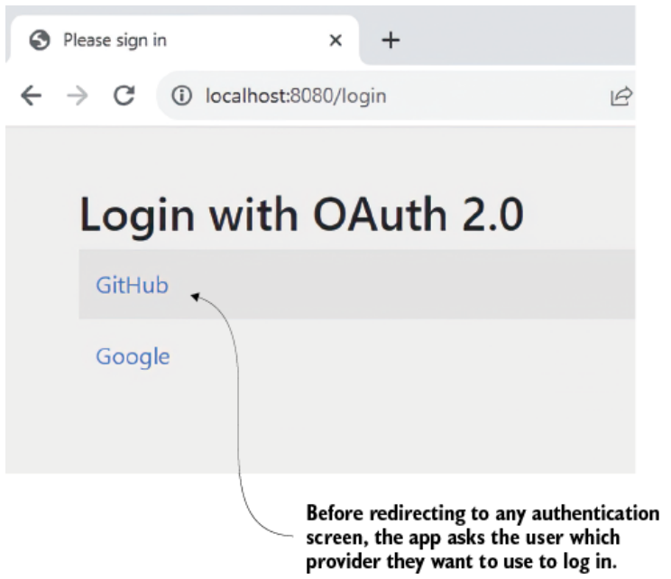

**Hình 16.4** App cho phép user chọn giữa GitHub và Google khi authentication trong app.

### 16.1.3 Sử dụng một authorization server tùy chỉnh

Spring Security định nghĩa một danh sách bốn nhà cung cấp phổ biến, như đã bàn ở mục 16.1.1 và 16.1.2. Nhưng nếu bạn muốn dùng một nhà cung cấp không nằm trong danh sách nhà cung cấp phổ biến thì sao? Bạn có nhiều lựa chọn thay thế khác, chẳng hạn LinkedIn, Twitter, Yahoo, và những cái khác. Bạn có thể muốn dùng một authorization server tùy chỉnh mà bạn đã xây dựng, như bạn đã học ở chương 14.

Bạn có thể cấu hình một OAuth 2 login với bất kỳ nhà cung cấp nào, bao gồm cả một cái tùy chỉnh do bạn xây dựng. Trong mục này, chúng ta sẽ dùng một authorization server mà chúng ta đã xây dựng ở chương 14 để cho thấy cấu hình của một OAuth 2 login tùy chỉnh. Để việc học của bạn dễ hơn và cũng để giữ các ví dụ tách biệt, tôi đã copy nội dung của project `ssia-ch14-ex1` mà chúng ta đã bàn ở chương 14 vào một project cho chương này, mà tôi đặt tên là `ssia-ch16-ex1-as`.

Chúng ta chỉ cần đảm bảo rằng cấu hình client của mình khớp với những gì chúng ta muốn hiện thực trong chương này. Listing 16.2 cho thấy registered client được cấu hình trong authorization server của chúng ta. Điều quan trọng nhất ở đây là đảm bảo rằng redirect URI khớp với cái chúng ta mong đợi cho ứng dụng mà chúng ta sẽ hiện thực login:

```
http://localhost:8080/login/oauth2/code/my_authorization_server
```

Hình 16.5 phân tích cấu tạo của redirect URI. Hãy quan sát rằng redirect URI chuẩn dùng path `/login/oauth2/code` theo sau là tên của authorization server. Trong ví dụ này, cái tên tôi đặt cho authorization server là `my_authorization_server`.

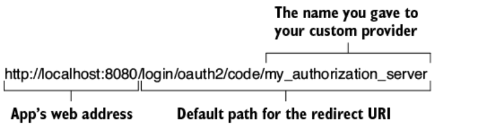

**Hình 16.5** Định dạng redirect URI chuẩn. Phần cuối của path là tên của nhà cung cấp.

Listing kế tiếp cho thấy phần cấu hình từ authorization server, thứ đăng ký chi tiết client. Bạn cần những chi tiết này sau trong mục này; chúng ta sẽ cấu hình chúng ở phía app nữa.

**Listing 16.3 Chi tiết client được đăng ký ở phía authorization server**

```java
@Bean
public RegisteredClientRepository registeredClientRepository() {
  var registeredClient = RegisteredClient
    .withId(UUID.randomUUID().toString())
    .clientId("client")
    .clientSecret("secret")
    .clientAuthenticationMethod(
       ClientAuthenticationMethod.CLIENT_SECRET_BASIC)
    .authorizationGrantType(
       AuthorizationGrantType.AUTHORIZATION_CODE)
    .redirectUri(
      "http://localhost:8080/login/oauth2/code/my_authorization_server")
    .scope(OidcScopes.OPENID)
    .build();

    return new InMemoryRegisteredClientRepository(registeredClient);
  }
```

Hãy nhớ, bạn không thể khởi động hai app dùng cùng một số cổng trên cùng hệ thống. Vì web app dùng cổng 8080, chúng ta phải đổi cổng của authorization server sang một cổng khác. Như trình bày ở đoạn code sau đây, tôi chọn 7070 cho ví dụ này và cấu hình nó trong file *application.properties*:

```properties
server.port=7070
```

Giờ chúng ta có thể chuyển sang cấu hình của web app. Vì chúng ta dùng một nhà cung cấp phổ biến trong các ví dụ ở mục 16.1.1 và 16.1.2, chúng ta không phải định nghĩa nó. Spring Security đã biết tất cả chi tiết nó cần về các nhà cung cấp phổ biến. Tuy nhiên, chúng ta cần cấu hình một vài thứ để dùng một nhà cung cấp khác. Spring Security cần biết những điều sau (như đã bàn ở chương 13 và 14):

- Authorization endpoint của nhà cung cấp để biết chuyển hướng user tới đâu trong luồng authorization code
- Token endpoint mà app phải gọi để lấy access token
- Key set endpoint mà app cần để kiểm chứng access token

Tin tốt là nếu nhà cung cấp của bạn (authorization server) thỏa mãn đúng giao thức OpenID Connect, bạn chỉ cần cấu hình **issuer URI**. App sau đó dùng issuer URI để tìm tất cả chi tiết nó cần, chẳng hạn authorization URI, token URI, và key set URI. Nếu authorization server không thỏa mãn giao thức OpenID Connect, bạn sẽ phải cấu hình tường minh ba chi tiết này trong file *application.properties*.

Vì các authorization server chúng ta xây dựng ở chương 14 hiện thực đúng giao thức OpenID Connect, chúng ta có thể dựa vào issuer URI. Đoạn code kế tiếp cho thấy cách cấu hình issuer URI. Hãy quan sát rằng tôi đã đặt tên cho nhà cung cấp. Với ví dụ này, tôi chọn định danh nó bằng cái tên `my_authorization_server`, nhưng bạn có thể chọn bất kỳ tên nào để định danh nhà cung cấp của mình:

```properties
spring.security.oauth2.client.provider.my_authorization_server.issuer-uri=http://127.0.0.1:7070
```

> **NOTE** Chúng ta chạy cả hai app, authorization server và web app, trên hệ thống cục bộ. Việc chạy các app này trên cùng hệ thống và truy cập chúng từ trình duyệt có thể gây vấn đề với cookie mà trình duyệt dùng để lưu session của user. Vì lý do này, tôi khuyến nghị bạn dùng địa chỉ IP `"127.0.0.1"` để tham chiếu tới một app và tên DNS `"localhost"` để tham chiếu tới app kia. Ngay cả khi hai cái này giống hệt nhau từ góc độ mạng và chúng tham chiếu tới cùng một hệ thống (hệ thống cục bộ), chúng sẽ được trình duyệt coi là khác nhau, nhờ đó trình duyệt có thể quản lý các session một cách đúng đắn. Trong ví dụ này, tôi dùng `"127.0.0.1"` để tham chiếu tới authorization server và `"localhost"` cho web app.

Listing 16.4 cho thấy cấu hình client registration. Ngoài việc khai báo nhà cung cấp là ai, client registration cũng dài hơn một chút so với cái chúng ta đã viết ở mục 16.1.1 và 16.1.2, nơi chúng ta dùng những nhà cung cấp phổ biến. Bên cạnh client ID và client secret, bạn cũng cần điền những thứ sau:

- **Tên nhà cung cấp** — Một cái tên bạn đặt cho nhà cung cấp bạn muốn dùng trong trường hợp nó không phổ biến.
- **Client authentication method** — Phương thức authentication của app để gọi các endpoint được bảo vệ của nhà cung cấp (thường là HTTP Basic).
- **Redirect URI** — URI mà app mong đợi nhà cung cấp chuyển hướng user tới sau khi authentication đúng. URI này phải khớp với một trong những cái được đăng ký ở phía authorization server (xem listing 16.3).
- **Scope mà web app yêu cầu** — Scope mà web app yêu cầu chỉ có thể là một trong những cái được đăng ký ở phía authorization server (xem listing 16.3).

**Listing 16.4 Cấu hình client registration**

```properties
spring.security.oauth2.client.registration.my_authorization_server.client-id=client
spring.security.oauth2.client.registration.my_authorization_server.client-name=Custom
spring.security.oauth2.client.registration.my_authorization_server.client-secret=secret
spring.security.oauth2.client.registration.my_authorization_server.provider=my_authorization_server
spring.security.oauth2.client.registration.my_authorization_server.client-authentication-method=client_secret_basic
spring.security.oauth2.client.registration.my_authorization_server.redirect-uri=http://localhost:8080/login/oauth2/code/my_authorization_server
spring.security.oauth2.client.registration.my_authorization_server.scope[0]=openid
```

① `client-id` — Client ID được đăng ký ở phía authorization server.

② `client-name` — Tên hiển thị của client.

③ `client-secret` — Client secret được đăng ký ở phía authorization server.

④ `provider` — Tên của nhà cung cấp tùy chỉnh.

⑤ `client-authentication-method` — Phương thức authentication của app để gọi các endpoint được bảo vệ của nhà cung cấp.

⑥ `redirect-uri` — URI mà nhà cung cấp chuyển hướng user tới sau khi authentication thành công.

⑦ `scope[0]` — Scope mà app yêu cầu.

> **Ghi chú của người dịch:** Trong PDF gốc, giá trị `issuer-uri` bị cắt cụt ở `http:/` và một dòng property bị in nhầm thành `Spring.security...` (viết hoa chữ S). Phần thiếu đã được khôi phục theo ghi chú ngay trên (authorization server chạy ở `127.0.0.1:7070`) và tên property đã được sửa về chữ thường.

Bạn có thể khởi động authorization server và web application. Hãy nhớ, bạn phải khởi động authorization server trước. Khi web app khởi động, nó sẽ gọi issuer URI để lấy phần còn lại của những chi tiết nó cần. Khi bạn đã khởi động cả hai app, hãy truy cập web app trong trình duyệt bằng địa chỉ `http://localhost:8080`. Hình 16.6 cho thấy nhà cung cấp tùy chỉnh giờ xuất hiện trong danh sách và có thể được user chọn để authentication.

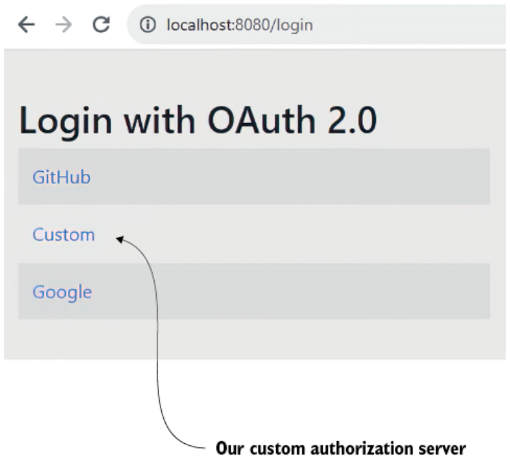

**Hình 16.6** Authorization server tùy chỉnh giờ xuất hiện trong danh sách nhà cung cấp mà user có thể chọn để authentication.

### 16.1.4 Thêm sự linh hoạt cho cấu hình của bạn

Thông thường, chúng ta cần nhiều linh hoạt hơn những gì file properties mang lại. Đôi khi, chúng ta cần có khả năng thay đổi credential một cách động mà không cần deploy lại app. Trong những trường hợp khác, chúng ta muốn bật hoặc tắt những nhà cung cấp cụ thể hoặc thậm chí cho phép truy cập chúng dựa trên một logic cho trước. Với những trường hợp như vậy, việc thêm credential vào file properties và để Spring Boot làm phép màu giúp chúng ta không còn hiệu quả nữa.

Tuy nhiên, nếu bạn biết điều gì diễn ra phía sau hậu trường, bạn có thể tùy chỉnh chi tiết của nhà cung cấp theo ý muốn. Hai kiểu duy nhất bạn phải nhớ là:

- **`ClientRegistration`** — Object này được dùng để định nghĩa những chi tiết mà client cần để dùng authorization server (credential, redirect URI, authorization URI, v.v.).
- **`ClientRegistrationRepository`** — Contract này được hiện thực để định nghĩa logic truy xuất các client registration. Ví dụ, bạn có thể hiện thực một client registration repository để bảo app của mình lấy client registration từ một database hoặc một vault tùy chỉnh.

Với ví dụ này, tôi giữ mọi thứ đơn giản. Tôi sẽ tiếp tục dùng file *application.properties* nhưng với những tên property khác để chứng minh rằng không còn Spring Boot cấu hình mọi thứ cho chúng ta nữa. Tuy nhiên, dù đơn giản, ví dụ này cho thấy cùng cách tiếp cận bạn sẽ dùng nếu muốn lưu chi tiết trong một database hoặc lấy chúng bằng cách gọi một endpoint cho trước. Trong bất kỳ trường hợp nào như vậy, bạn phải hiện thực contract `ClientRegistrationRepository` một cách phù hợp.

Bạn định nghĩa component `ClientRegistrationRepository` như một Spring bean. App sẽ dùng hiện thực của bạn để lấy chi tiết client registration. Listing 16.5 cho thấy một ví dụ mà tôi dùng một hiện thực in-memory. Trong ví dụ này, tôi làm ba việc:

1. Inject các giá trị credential từ file properties
2. Tạo một object `ClientRegistration` với tất cả chi tiết cần thiết
3. Cấu hình nó trong một hiện thực `ClientRegistrationRepository` in-memory

Bạn có thể tìm thấy ví dụ này trong project `ssia-ch16-ex2`.

**Listing 16.5 Hiện thực logic tùy chỉnh**

```java
@Configuration
public class SecurityConfig {

  @Value("${client-id}")
  private String clientId;                                         // ①

  @Value("${client-secret}")
  private String clientSecret;                                     // ①

  @Bean
  public SecurityFilterChain securityFilterChain(HttpSecurity http)
    throws Exception {

    http.oauth2Login(Customizer.withDefaults());

    http.authorizeHttpRequests(
      c -> c.anyRequest().authenticated()
    );

    return http.build();
  }

  @Bean
  public ClientRegistrationRepository clientRegistrationRepository() {
    return new InMemoryClientRegistrationRepository(
      this.googleClientRegistration());                            // ②
  }

  private ClientRegistration googleClientRegistration() {
    return CommonOAuth2Provider.GOOGLE.getBuilder("google")        // ③
                .clientId(clientId)
                .clientSecret(clientSecret)
                .build();
  }
}
```

① Inject các giá trị credential từ file properties.

② Cung cấp một hiện thực repository in-memory chứa chi tiết client registration.

③ Tạo client registration dựa trên template của nhà cung cấp phổ biến Google.

### 16.1.5 Quản lý authorization cho một OAuth 2 login

Trong mục này, chúng ta bàn về việc sử dụng chi tiết authentication. Trong hầu hết trường hợp, app của bạn cần biết ai đã đăng nhập. Yêu cầu này là để hiển thị mọi thứ khác nhau hoặc để áp dụng các hạn chế authorization khác nhau. May mắn thay, việc dùng phương thức authentication `oauth2Login()` không khác gì bất kỳ phương thức authentication nào khác về phương diện này.

Còn nhớ thiết kế authentication của Spring Security mà chúng ta đã bàn từ chương 2 (được tái hiện ở hình 16.7)? Authentication thành công luôn kết thúc bằng việc app thêm chi tiết authentication vào security context. Việc dùng `oauth2Login()` cũng không ngoại lệ.

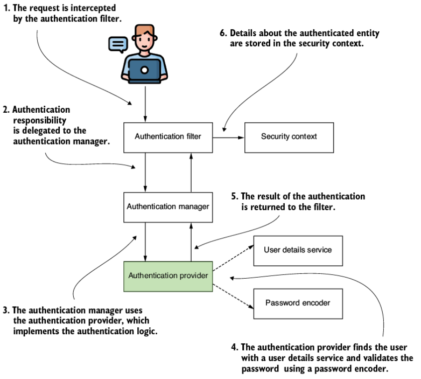

**Hình 16.7** Luồng authentication trong Spring Security. Authentication thành công kết thúc bằng việc app thêm chi tiết của principal đã authentication vào security context.

Khi biết rằng chi tiết authentication nằm trong security context, bạn có thể dùng chúng chính xác theo cùng cách như với bất kỳ phương thức authentication nào đã bàn trước đó — `httpBasic()`, `formLogin()`, hoặc `oauth2ResourceServer()`:

- Bạn có thể inject object `Authentication` làm tham số của method.
- Bạn có thể lấy nó từ security context ở bất kỳ đâu trong app (`SecurityContextHolder.getContext().getAuthentication()`).
- Bạn có thể dùng các annotation pre-/post-, như đã bàn ở chương 11 và 12.

Bạn có thể dùng contract `Authentication` để lấy những chi tiết user chuẩn như username và các authority. Nếu bạn cần chi tiết tùy chỉnh, bạn có thể dùng trực tiếp hiện thực của contract, như trình bày ở listing 16.6. Với OAuth 2, class `OAuth2AuthenticationPrincipal` định nghĩa hiện thực của contract. Tuy nhiên, hãy nhớ rằng vì mục đích bảo trì, tôi khuyến nghị bạn dùng contract `Authentication` ở mọi nơi có thể và chỉ dựa vào hiện thực khi bạn không có lựa chọn nào khác (ví dụ, nếu bạn cần lấy một chi tiết mà bạn không thể lấy được bằng tham chiếu contract).

**Listing 16.6 Lấy chi tiết authentication**

```java
@Controller
public class HomeController {

  @GetMapping("/")
  public String home(
    OAuth2AuthenticationToken authentication) {       // ①
    // làm gì đó với authentication
    return "index.html";
  }
}
```

① Inject chi tiết authentication vào tham số của method.

---

## 16.2 Hiện thực một OAuth 2 client

Mục này bàn về việc hiện thực một service như một OAuth 2 client. Trong các hệ thống hướng dịch vụ, các app thường giao tiếp với nhau. Trong những trường hợp như vậy, app gửi request tới một app khác trở thành một client của app cụ thể đó. Trong hầu hết trường hợp, nếu chúng ta quyết định hiện thực authentication cho các request qua OAuth 2, app dùng client credentials grant type để lấy một access token.

Client credentials grant type không ngụ ý có một user. Vì lý do này, bạn sẽ không cần một redirect URI và một authorization URI. Client credential là đủ để cho phép một client authentication và lấy một access token bằng cách gửi một request tới token URI. Hình 16.8 nhắc bạn về client credentials grant type mà chúng ta đã bàn ở chương 13.

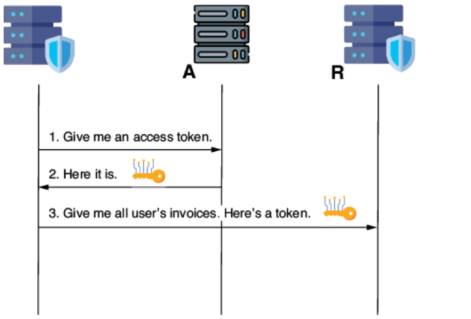

**Hình 16.8** Client credentials grant type. Client gửi một request tới token endpoint dùng client credential để authentication. Sau khi authentication thành công, client nhận một access token nó có thể dùng để truy cập tài nguyên ở phía resource server.

Hãy xây dựng một ví dụ đơn giản để cho bạn thấy mọi thứ bạn cần biết về việc hiện thực khả năng OAuth 2 client với Spring Security. Chúng ta sẽ xây dựng một app dùng client credentials grant type để lấy một access token từ một authorization server. App này sẽ lấy một access token từ một authorization server. Để đơn giản hóa ví dụ, chúng ta sẽ chỉ bàn về việc truy xuất access token. Việc bạn tạo request thế nào không liên quan tới phần minh họa của chúng ta. Miễn là bạn biết cách lấy access token, bạn có thể gửi HTTP request theo cách nào cũng được, vì bất kỳ công nghệ nào cũng cho phép bạn dễ dàng thêm một giá trị request header (hãy nhớ rằng bạn thêm giá trị access token vào request header `Authorization` với prefix là chuỗi `"Bearer"`).

Vậy điều chúng ta sẽ làm chính xác trong ví dụ này là cấu hình một app để truy xuất một access token từ một OAuth 2 authorization server dùng client credentials grant type. Để chứng minh rằng chúng ta truy xuất access token đúng cách, chúng ta sẽ trả nó về trong response body của một endpoint demo. Hình 16.9 minh họa những gì chúng ta muốn xây dựng. Các bước thể hiện trong hình là:

1. User (bạn) gọi một endpoint demo mà chúng ta đặt tên là `/token` dùng cURL (hoặc một công cụ thay thế như Postman).
2. Công cụ (cURL) mô phỏng một app gửi request tới ứng dụng chúng ta xây dựng cho ví dụ này.
3. Ứng dụng của chúng ta dùng client credentials grant type để truy xuất một access token từ một authorization server.
4. App trả về giá trị của access token cho client trong HTTP response body.
5. User (bạn) tìm thấy giá trị access token trong HTTP response body.

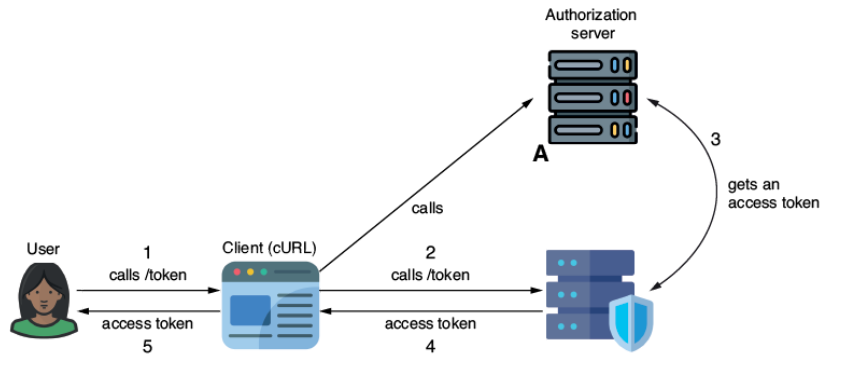

**Hình 16.9** Phần minh họa của chúng ta xây dựng một app có khả năng truy xuất một access token từ một authorization server dùng client credentials grant type. Để chứng minh rằng app truy xuất access token đúng cách, app gửi giá trị token trong response cho một lời gọi endpoint demo. Chúng ta đặt tên endpoint demo này là `/token`.

Chúng ta sẽ dùng cùng authorization server bạn đã xây dựng ở chương 14, mà bạn có thể tìm thấy cho chương này trong project `ssia-ch16-ex1-as`. Hãy nhớ trước hết thêm vào authorization server một client registration cho phép dùng client credentials grant type. Bạn có thể thay đổi cái bạn đã cấu hình trước đó ở chương 14 (như trình bày ở listing kế tiếp) hoặc thêm một client registration thứ hai thỏa mãn yêu cầu này.

**Listing 16.7 Chi tiết client được đăng ký ở phía authorization server**

```java
@Bean
public RegisteredClientRepository registeredClientRepository() {
  var registeredClient = RegisteredClient
    .withId(UUID.randomUUID().toString())
    .clientId("client")
    .clientSecret("secret")
    .clientAuthenticationMethod(
       ClientAuthenticationMethod.CLIENT_SECRET_BASIC)
    .authorizationGrantType(
       AuthorizationGrantType.CLIENT_CREDENTIALS)        // ①
    .scope(OidcScopes.OPENID)
    .build();

    return new InMemoryRegisteredClientRepository(registeredClient);
  }
```

① Thêm một client registration cho phép dùng client credentials grant type.

Tương tự các phương thức authentication khác, Spring Security cung cấp một phương thức của object `HttpSecurity` để cấu hình một app như một OAuth 2 client. Gọi phương thức `oauth2Client()` được trình bày ở listing sau đây để cấu hình app như một OAuth 2 client.

**Listing 16.8 Cấu hình OAuth 2 client authentication**

```java
@Configuration
public class ProjectConfig {

  @Bean
  public SecurityFilterChain securityFilterChain(HttpSecurity http)
    throws Exception {

    http.oauth2Client(Customizer.withDefaults());       // ①

    http.authorizeHttpRequests(
       c -> c.anyRequest().permitAll()
    );

    return http.build();
  }
}
```

① Việc dùng phương thức authentication `oauth2Client()` khiến app này trở thành một OAuth 2 client.

App cũng cần biết một số chi tiết để gửi cho authorization server các request lấy access token. Như bạn đã học ở mục 16.1, chúng ta cung cấp những chi tiết này bằng một component `ClientRegistrationRepository`. Bạn có thể thấy code ở listing 16.9 quen thuộc, vì nó giống với code chúng ta đã viết ở listing 16.4.

Tuy nhiên, vì tôi không dùng một nhà cung cấp phổ biến, tôi phải chỉ định thêm nhiều chi tiết hơn, chẳng hạn scope, token URI, và phương thức authentication. Hãy quan sát rằng tôi cấu hình client credentials làm grant type.

**Listing 16.9 Cấu hình chi tiết client registration cho app client**

```java
@Configuration
public class ProjectConfig {

  // Phần code được lược bỏ

  @Bean
  public ClientRegistrationRepository clientRegistrationRepository() {
    ClientRegistration c1 =
      ClientRegistration.withRegistrationId("1")
        .clientId("client")
        .clientSecret("secret")
        .authorizationGrantType(AuthorizationGrantType.CLIENT_CREDENTIALS)
        .clientAuthenticationMethod(
            ClientAuthenticationMethod.CLIENT_SECRET_BASIC)
        .tokenUri("http://localhost:7070/oauth2/token")
        .scope(OidcScopes.OPENID)
        .build();

    var repository =
        new InMemoryClientRegistrationRepository(c1);

    return repository;
  }
}
```

Một component **client manager** thực hiện request cần thiết để lấy access token. Hình 16.10 minh họa mối quan hệ giữa controller và client manager (cho ví dụ của chúng ta).

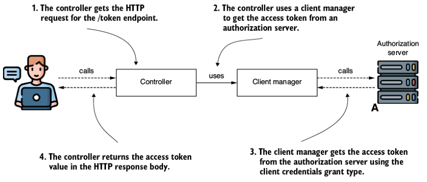

**Hình 16.10** Controller dùng một client manager để lấy access token từ một authorization server. Client manager là component Spring Security chịu trách nhiệm kết nối tới authorization server và dùng grant type đúng cách để lấy access token.

Class `OAuth2AuthorizedClientManager` định nghĩa một client manager. Listing kế tiếp cấu hình một client manager như một bean trong context của app.

**Listing 16.10 Hiện thực một OAuth 2 client manager**

```java
@Configuration
public class ProjectConfig {

  // Phần code được lược bỏ

  @Bean
  public OAuth2AuthorizedClientManager oAuth2AuthorizedClientManager(
    ClientRegistrationRepository clientRegistrationRepository,
    OAuth2AuthorizedClientRepository auth2AuthorizedClientRepository
  ) {

    var provider =                                          // ①
        OAuth2AuthorizedClientProviderBuilder.builder()
            .clientCredentials()
            .build();

    var cm = new DefaultOAuth2AuthorizedClientManager(      // ②
            clientRegistrationRepository,
            auth2AuthorizedClientRepository);

    cm.setAuthorizedClientProvider(provider);               // ③

    return cm;
  }
}
```

① Tạo một object provider để chỉ định những grant type dự định dùng.

② Tạo một instance client manager sẽ xử lý logic request của client.

③ Đặt provider cho client manager.

Giờ bạn có thể dùng client manager ở bất cứ đâu bạn cần lấy một access token. Như thể hiện ở hình 16.10, tôi làm cho controller dùng client manager trực tiếp để đơn giản hóa ví dụ này và cho phép bạn tập trung vào phần thảo luận về việc hiện thực một OAuth 2 client. Hãy nhớ rằng một app thực tế có lẽ sẽ phức tạp hơn. Trong một thiết kế phân tách đúng đắn trách nhiệm của các object, client manager nhiều khả năng sẽ được dùng bởi một object proxy chứ không phải trực tiếp bởi một controller (hình 16.11).

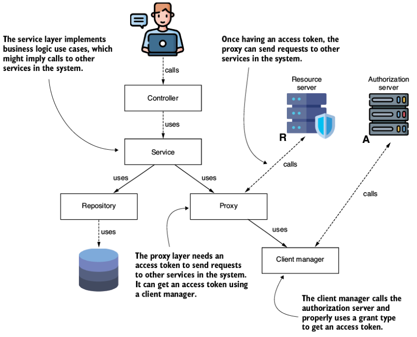

**Hình 16.11** Một app thực tế sẽ có các trách nhiệm được phân tách tốt hơn. Không giống ví dụ của chúng ta, một tầng proxy dùng token nó lấy được với sự trợ giúp của client manager để gửi request tới một app khác trong hệ thống.

Listing kế tiếp cho thấy cách inject instance client manager và minh họa việc truy xuất một access token bằng một endpoint. Khi gọi endpoint `/token` mà app expose, response body nên chứa giá trị access token.

**Listing 16.11 Dùng OAuth 2 client manager để lấy một token**

```java
@RestController
public class DemoController {

  private final OAuth2AuthorizedClientManager clientManager;

  // constructor được lược bỏ

  @GetMapping("/token")                                      // ①
  public String token() {
    OAuth2AuthorizeRequest request = OAuth2AuthorizeRequest
        .withClientRegistrationId("1")
        .principal("client")
        .build();                                            // ②

    var client =
       clientManager.authorize(request);                     // ③

    return client
      .getAccessToken().getTokenValue();                     // ④
  }
}
```

① Expose một GET endpoint tại path `/token`.

② Tạo một instance authorization request.

③ Gửi request, app trả về giá trị access token.

④ App trả về giá trị access token trong response body.

Dùng lệnh cURL sau đây để gọi endpoint mà app expose:

```bash
curl http://localhost:8080/token
```

Response body nên chứa giá trị của một access token, tương tự

```
eyJhbGciOiJIUzI1NiIsInR5cCI6IkpXVCJ9.eyJzdWIiOiIxMjM0NTY3ODkwIiwibmFtZSI6Im
JpbGwiLCJpYXQiOjE1MTYyMzkwMjJ9.zjL2JXw0TVgNgTMUKmP0-PTPklULUVmV_5re50eZoHw
```

---

## Tóm tắt

- Khi hiện thực một web app Spring, chúng ta thường phải cấu hình khả năng authentication. Dù chúng ta có thể hiện thực một login form nhanh chóng bằng phương thức `formLogin()`, chúng ta cũng có thể cho phép user authentication bằng một hệ thống khác với tài khoản đã đăng ký.
- Việc cho phép user chọn một hệ thống khác để đăng nhập mang lại lợi thế cho cả user lẫn app của chúng ta. User không cần nhớ thêm credential, và app của chúng ta không phải quản lý credential cho tất cả user của họ.
- Spring Security coi GitHub, Google, Facebook, và Okta là những nhà cung cấp phổ biến. Với những nhà cung cấp phổ biến, Spring Security đã biết tất cả chi tiết để thiết lập request qua framework OAuth 2, nên bạn chỉ cần cấu hình client credential mà nhà cung cấp đưa ra để cấu hình khả năng login.
- Bạn có thể cấu hình app của mình dùng những nhà cung cấp khác ngoài các nhà cung cấp phổ biến, nhưng bạn cần cấu hình tường minh tất cả chi tiết mà app cần để thiết lập các luồng grant type nhằm lấy access token. Những chi tiết chính bạn cần cấu hình là ba URI: authorization URI, token URI, và key set URI.
- Khi user đăng nhập vào app của bạn, ngay cả khi được authentication thông qua một hệ thống bên ngoài, app vẫn lấy được chi tiết về họ và lưu chi tiết đó trong security context. Tiến trình này theo đúng thiết kế authentication chuẩn của Spring Security. Vì lý do này, bạn có thể cấu hình authorization tương tự tất cả các phương thức authentication khác.
- Đôi khi, một backend service trở thành client cho một app backend khác. Trong trường hợp như vậy, một app muốn gọi một app khác và dùng cách tiếp cận OAuth 2 cần lấy một access token để được app kia authentication. Một service có thể dùng client credentials grant type để lấy một access token.
- Spring Security cung cấp một object gọi là client manager. Object này hiện thực logic thực thi một grant type cụ thể và lấy một access token. Tầng proxy của một app gửi request tới một app khác và cần authentication các request bằng access token sẽ dùng một client manager để lấy access token.
