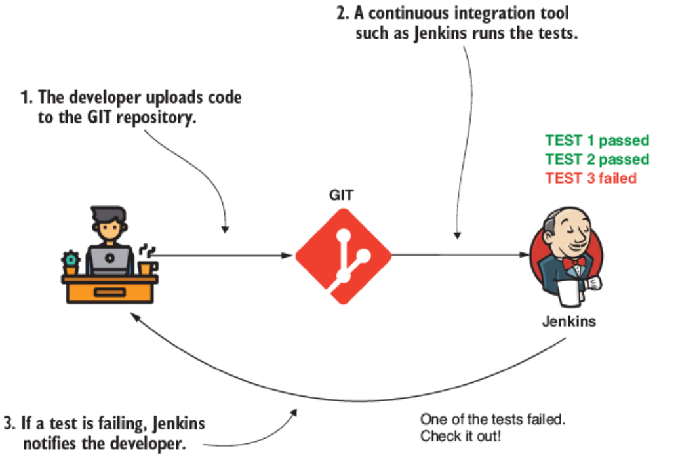
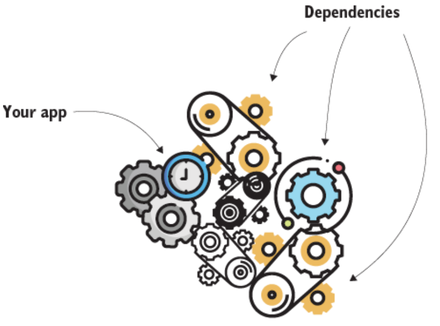
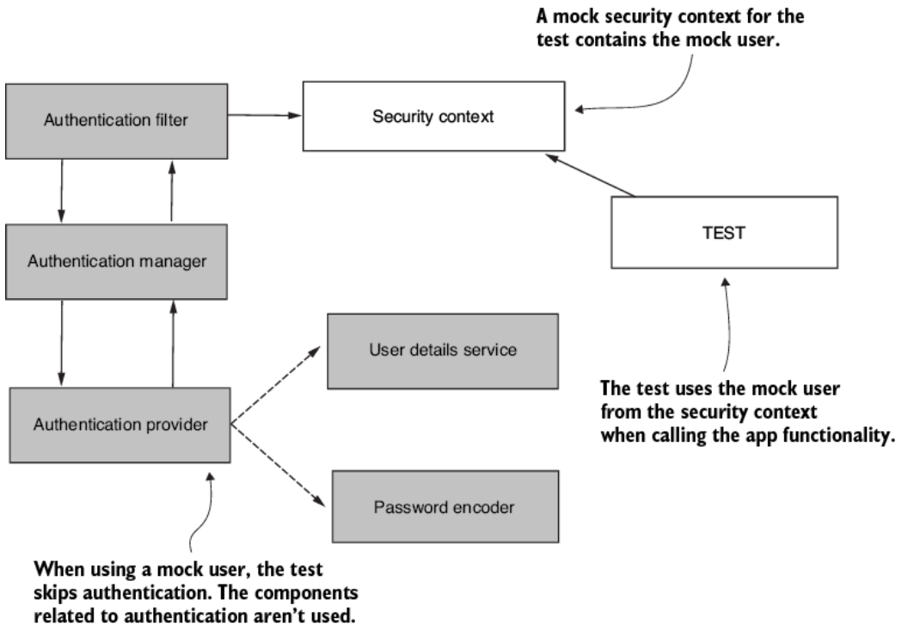
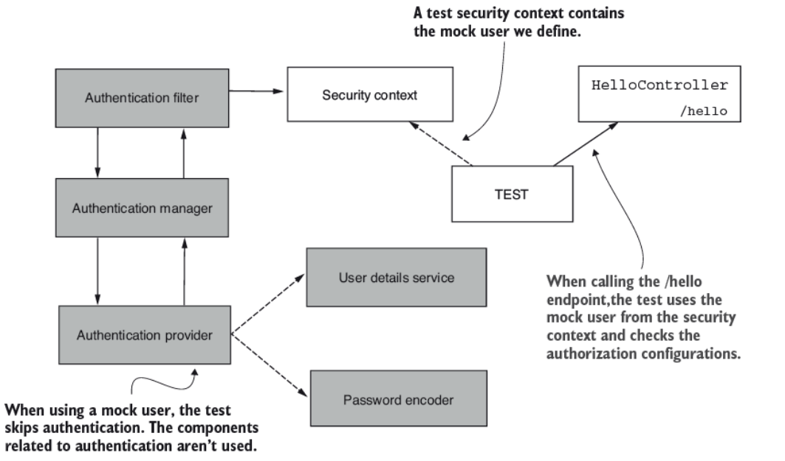
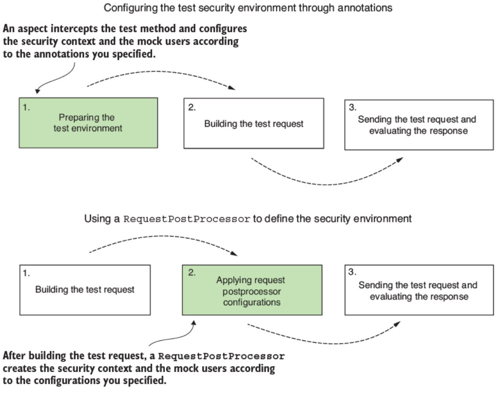
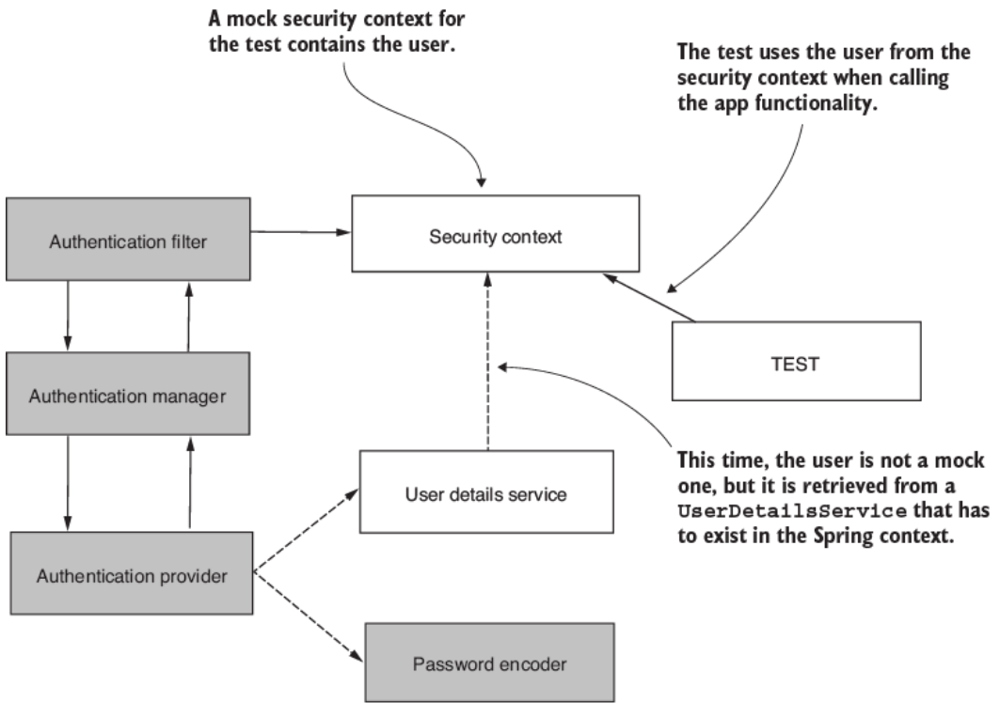
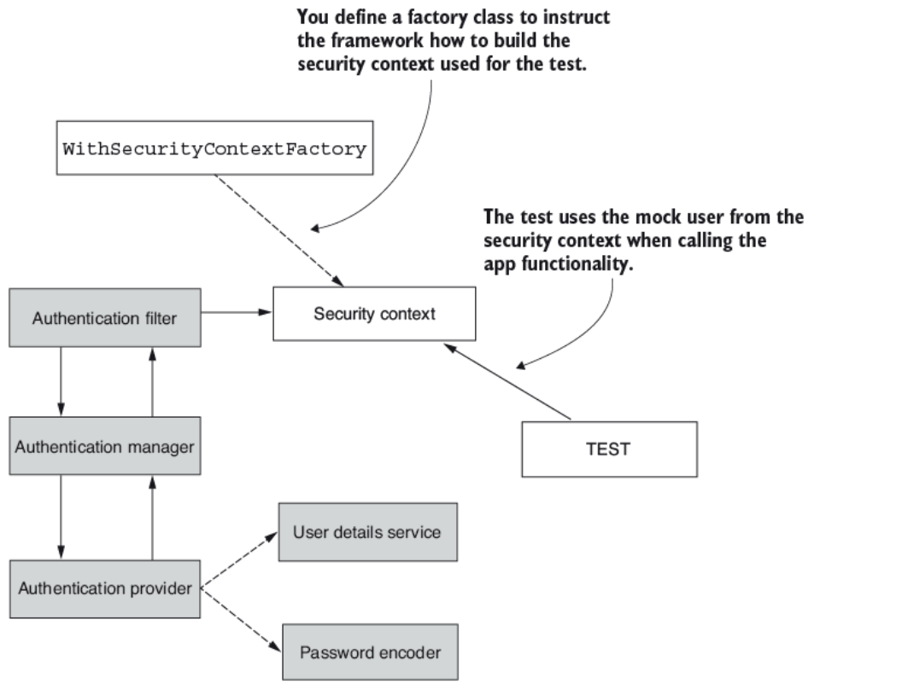
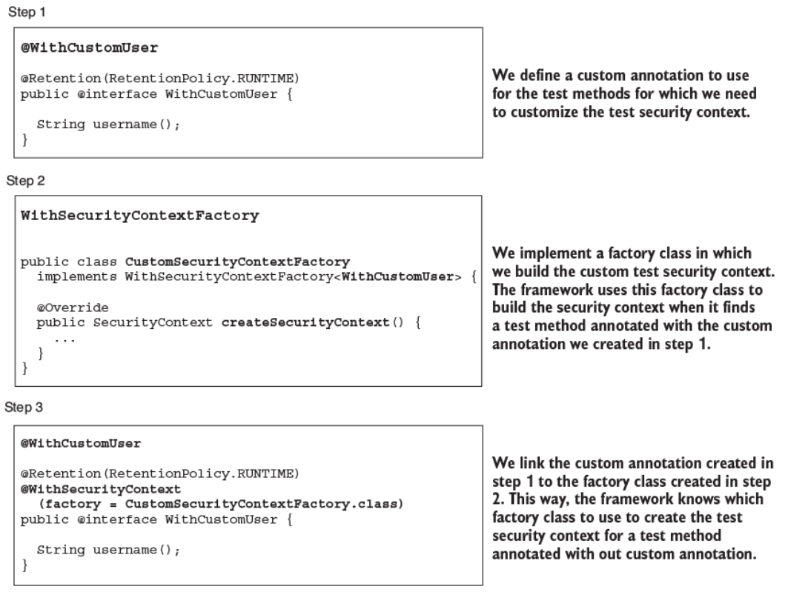
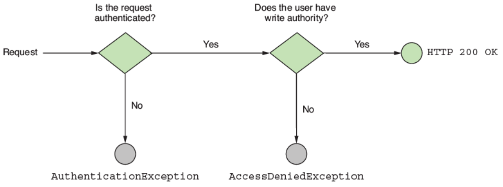
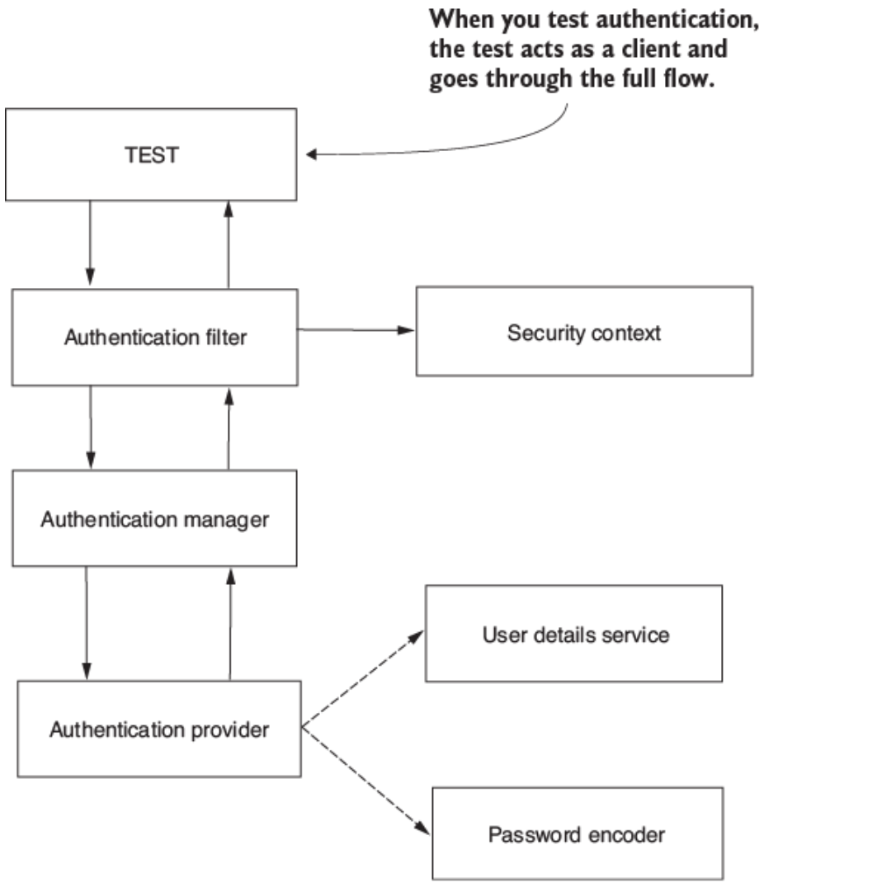

# 18. Kiểm thử các cấu hình bảo mật (Testing security configurations)

> Bản dịch tiếng Việt của chương 18 — *Spring Security in Action, Second Edition* (Laurentiu Spilca, Manning).

**Nội dung chương này bao gồm:**

- Kiểm thử tích hợp với cấu hình Spring Security cho endpoint
- Định nghĩa mock user cho các bài test
- Kiểm thử tích hợp với Spring Security cho method-level security
- Kiểm thử các hiện thực Spring reactive

Truyền thuyết kể rằng việc viết unit test và integration test bắt đầu từ bài vè ngắn sau:

> 99 con bug nhỏ trong code,
> 99 con bug nhỏ.
> Lần ra một con, vá nó lại,
> Có 113 con bug nhỏ trong code.
>
> — Khuyết danh

Theo thời gian, phần mềm trở nên phức tạp hơn, và các đội ngũ trở nên lớn hơn. Việc biết tất cả chức năng do người khác hiện thực qua thời gian trở nên bất khả thi. Lập trình viên cần một cách để đảm bảo họ không phá vỡ những chức năng hiện có trong khi sửa bug hoặc hiện thực tính năng mới.

Khi phát triển ứng dụng, chúng ta liên tục viết test để kiểm chứng rằng những chức năng mình hiện thực hoạt động như mong muốn. Lý do chính chúng ta viết unit test và integration test là để đảm bảo không phá vỡ các chức năng hiện có khi thay đổi code để sửa bug hoặc hiện thực tính năng mới. Điều này cũng được gọi là **regression testing** (kiểm thử hồi quy).

Ngày nay, khi một lập trình viên hoàn thành một thay đổi, họ upload thay đổi lên một server mà đội dùng để quản lý phiên bản code. Hành động này tự động kích hoạt một công cụ continuous integration chạy tất cả các test hiện có. Nếu bất kỳ thay đổi nào phá vỡ một chức năng hiện có, các test thất bại, và công cụ continuous integration thông báo cho đội (hình 18.1). Bằng cách này, ít có khả năng chuyển giao những thay đổi ảnh hưởng tới các tính năng hiện có.



**Hình 18.1** Testing là một phần của tiến trình phát triển. Bất cứ khi nào một lập trình viên upload code, các test sẽ chạy. Nếu bất kỳ test nào thất bại, một công cụ continuous integration thông báo cho lập trình viên.

> **NOTE** Bằng việc dùng Jenkins trong hình này, tôi không nói rằng đây là công cụ continuous integration duy nhất được dùng hoặc rằng nó là tốt nhất. Bạn có nhiều lựa chọn thay thế như Bamboo, GitLab CI, CircleCI, v.v.

Khi test ứng dụng, bạn cần nhớ rằng không chỉ code ứng dụng của bạn cần được test. Bạn cũng cần đảm bảo test những tích hợp với các framework và thư viện bạn dùng (hình 18.2). Vào một lúc nào đó trong tương lai, bạn có thể nâng cấp framework hoặc thư viện đó lên phiên bản mới. Khi thay đổi phiên bản dependency, bạn muốn đảm bảo app của mình vẫn tích hợp tốt với phiên bản mới của dependency đó. Nếu app của bạn không tích hợp theo cùng cách, bạn muốn dễ dàng tìm ra nơi cần thay đổi để sửa các vấn đề tích hợp.



**Hình 18.2** Chức năng của một ứng dụng dựa vào nhiều dependency. Khi bạn nâng cấp hoặc thay đổi một dependency, bạn có thể ảnh hưởng tới chức năng hiện có. Việc có các integration test với dependency giúp bạn nhanh chóng phát hiện xem một thay đổi trong dependency có ảnh hưởng tới chức năng hiện có của ứng dụng hay không.

Đó chính là lý do bạn cần biết những gì chúng ta sẽ bao quát trong chương này — cách test tích hợp của app với Spring Security. Spring Security, cũng như hệ sinh thái Spring Framework nói chung, tiến hóa nhanh chóng. Bạn có lẽ sẽ nâng cấp app lên các phiên bản mới, và bạn chắc chắn muốn biết liệu việc nâng cấp lên một phiên bản cụ thể có gây ra lỗ hổng, lỗi, hoặc sự không tương thích trong ứng dụng của mình hay không. Hãy nhớ những gì chúng ta đã nhấn mạnh ngay từ chương đầu tiên: *bạn cần cân nhắc bảo mật ngay từ thiết kế đầu tiên cho app, và bạn cần xem nó một cách nghiêm túc.* Việc hiện thực test cho bất kỳ cấu hình bảo mật nào của bạn nên là một nhiệm vụ bắt buộc và nên được định nghĩa như một phần trong *definition of done* của bạn. Bạn không nên xem một task là hoàn thành nếu các security test chưa sẵn sàng.

Trong chương này, chúng ta sẽ bàn về vài thực hành để test tích hợp của một app với Spring Security. Chúng ta sẽ quay lại một số ví dụ đã làm ở các chương trước, và bạn sẽ học cách viết integration test cho chức năng đã hiện thực. Testing nói chung là một câu chuyện quan trọng. Nhưng việc học chủ đề này một cách chi tiết mang lại nhiều lợi ích.

Trong chương này, chúng ta sẽ tập trung vào việc test tích hợp giữa một ứng dụng và Spring Security. Trước khi bắt đầu các ví dụ, tôi muốn khuyến nghị một vài tài nguyên đã giúp tôi hiểu sâu chủ đề này. Nếu bạn cần hiểu chủ đề chi tiết hơn, hoặc thậm chí để ôn lại, bạn có thể đọc những cuốn sách này. Tôi chắc rằng bạn sẽ thấy chúng rất hữu ích!

- *JUnit in Action, Third Edition* của Cătălin Tudose và cộng sự (Manning, 2020)
- *Unit Testing Principles, Practices, and Patterns* của Vladimir Khorikov (Manning, 2020)
- *Testing Java Microservices* của Alex Soto Bueno và cộng sự (Manning, 2018)

Cuộc phiêu lưu viết test cho các hiện thực bảo mật của chúng ta bắt đầu với việc test cấu hình authorization (phân quyền). Ở mục 18.1, bạn sẽ học cách bỏ qua authentication (xác thực) và định nghĩa mock user để test cấu hình authorization ở mức endpoint. Rồi ở mục 18.2, bạn sẽ học cách test cấu hình authorization với user từ một `UserDetailsService`. Ở mục 18.3, chúng ta sẽ bàn cách thiết lập đầy đủ security context trong trường hợp bạn cần dùng những hiện thực cụ thể của object `Authentication`. Và cuối cùng, ở mục 18.4, bạn sẽ áp dụng các cách tiếp cận đã học ở những mục trước để test cấu hình authorization trên method security.

Khi chúng ta hoàn thành phần thảo luận về việc test authorization, mục 18.5 sẽ dạy bạn cách test luồng authentication. Rồi ở mục 18.6 và 18.7, chúng ta sẽ bàn về việc test các cấu hình bảo mật khác, chẳng hạn cross-site request forgery (CSRF) và cross-origin resource sharing (CORS). Chương kết thúc với mục 18.8, bàn về integration test của Spring Security và các ứng dụng reactive.

---

## 18.1 Dùng mock user cho các bài test

Mục này bàn về việc dùng mock user để test cấu hình authorization. Cách tiếp cận này là phương pháp đơn giản nhất và được dùng thường xuyên nhất để test cấu hình authorization. Khi dùng một mock user, bài test hoàn toàn bỏ qua tiến trình authentication (hình 18.3).

Việc hiện thực test bỏ qua authentication và tập trung vào authorization là rất phổ biến. Bạn không cần kiểm chứng tiến trình authentication mỗi lần kiểm chứng rằng hệ thống áp dụng đúng một quy tắc authorization. Hãy nhớ rằng authentication và authorization phụ thuộc lẫn nhau, nhưng chúng hoàn toàn tách rời thông qua security context. Vậy nên nếu bạn muốn test một cấu hình authorization một cách cô lập, bạn có thể định nghĩa một mock security context và kiểm soát nó để test tất cả các tình huống authorization cần thiết. Vì trong hầu hết trường hợp một app chỉ hiện thực một số giới hạn các phương thức authentication (thực tế trong hầu hết trường hợp là một) nhưng có rất nhiều quy tắc authorization áp dụng cho các use case hoặc endpoint, bạn sẽ muốn viết các authorization test một cách cô lập để không phải lặp lại các authentication test mỗi lần kiểm chứng rằng authorization cho một phần tử cụ thể hoạt động tốt.

Mock user chỉ hợp lệ trong quá trình thực thi test, và với user này, bạn có thể cấu hình bất kỳ đặc tính nào bạn cần để kiểm chứng một tình huống cụ thể. Ví dụ, bạn có thể cho user những role cụ thể (ADMIN, MANAGER, v.v.) hoặc dùng các authority khác nhau để kiểm chứng rằng app hoạt động như mong đợi trong những điều kiện này.

> **NOTE** Điều quan trọng là biết những component nào từ framework tham gia vào một integration test. Bằng cách này, bạn biết phần nào của việc tích hợp mà bạn bao phủ bằng test. Ví dụ, một mock user chỉ có thể được dùng để bao phủ authorization. (Ở mục 18.5, bạn sẽ học cách xử lý authentication.) Tôi đôi khi thấy các lập trình viên bị nhầm lẫn về khía cạnh này. Họ nghĩ rằng mình cũng đang bao phủ, chẳng hạn, một hiện thực tùy chỉnh của `AuthenticationProvider` khi làm việc với một mock user, điều này không đúng. Hãy đảm bảo bạn hiểu đúng những gì mình đang test.



**Hình 18.3** Chúng ta bỏ qua các component được tô đậm trong luồng authentication của Spring Security khi thực thi một test. Test trực tiếp dùng một `SecurityContext` giả, chứa mock user mà bạn định nghĩa để gọi chức năng được test.

Để chứng minh cách viết một test như vậy, hãy quay lại ví dụ đơn giản nhất chúng ta đã làm trong cuốn sách này, project `ssia-ch2-ex1`. Project này expose một endpoint cho path `/hello` chỉ với cấu hình Spring Security mặc định. Chúng ta mong đợi điều gì xảy ra?

- Khi gọi endpoint mà không có user, trạng thái HTTP response nên là 401 Unauthorized.
- Khi gọi endpoint với một user đã authentication, trạng thái HTTP response nên là 200 OK, và response body nên là `Hello!`.

Hãy test hai tình huống này! Chúng ta cần một vài dependency trong file *pom.xml* để viết test. Đoạn code kế tiếp cho bạn thấy các class chúng ta dùng xuyên suốt các ví dụ trong chương này. Bạn nên đảm bảo có những cái này trong file *pom.xml* trước khi bắt đầu viết test. Đây là các dependency:

```xml
<dependency>
   <groupId>org.springframework.boot</groupId>
   <artifactId>spring-boot-starter-test</artifactId>
   <scope>test</scope>
</dependency>
<dependency>
   <groupId>org.springframework.security</groupId>
   <artifactId>spring-security-test</artifactId>
   <scope>test</scope>
</dependency>
```

> **NOTE** Với các ví dụ trong chương này, chúng ta dùng JUnit 5 để viết test. Tuy nhiên, đừng nản lòng nếu bạn vẫn làm việc với JUnit 4. Từ góc độ tích hợp Spring Security, các annotation và những class còn lại mà bạn sẽ học hoạt động giống nhau. Chương 4 của cuốn *JUnit in Action* của Cătălin Tudose và cộng sự (Manning, 2020), vốn là phần thảo luận chuyên biệt về việc di chuyển từ JUnit 4 sang JUnit 5, chứa một số bảng thú vị cho thấy sự tương ứng giữa các class và annotation của phiên bản 4 và 5. Đây là liên kết: <http://mng.bz/OPJn>.

Trong thư mục *test* của project Spring Boot Maven, chúng ta thêm một class tên là `MainTests`. Chúng ta viết class này như một phần của package chính của ứng dụng. Tên của package chính là `com.laurentiuspilca.ssia`. Ở listing kế tiếp, bạn có thể tìm thấy định nghĩa của class rỗng cho các test. Chúng ta dùng annotation `@SpringBootTest`, thứ đại diện cho một cách tiện lợi để quản lý Spring context cho bộ test của chúng ta.

**Listing 18.1 Một class để viết các test**

```java
@SpringBootTest             // ①
public class MainTests {
}
```

① Giao cho Spring Boot trách nhiệm quản lý Spring context cho các test.

Một cách tiện lợi để hiện thực test cho hành vi của một endpoint là dùng MockMvc của Spring. Trong một ứng dụng Spring Boot, bạn có thể tự động cấu hình tiện ích MockMvc để test các lời gọi endpoint bằng cách thêm một annotation phía trên class, như listing kế tiếp minh họa.

**Listing 18.2 Thêm MockMvc để hiện thực các tình huống test**

```java
@SpringBootTest
@AutoConfigureMockMvc        // ①
public class MainTests {

  @Autowired
  private MockMvc mvc;       // ②
}
```

① Cho phép Spring Boot tự động cấu hình MockMvc. Kết quả là một object kiểu `MockMvc` được thêm vào Spring context.

② Inject object `MockMvc` mà chúng ta dùng để test endpoint.

Giờ khi chúng ta có một công cụ để test hành vi của endpoint, hãy bắt đầu với tình huống đầu tiên. Khi gọi endpoint `/hello` mà không có user đã authentication, trạng thái HTTP response nên là 401 Unauthorized.

Bạn có thể hình dung mối quan hệ giữa các component để chạy test này ở hình 18.4. Test gọi endpoint nhưng dùng một `SecurityContext` giả. Chúng ta quyết định thêm gì vào `SecurityContext` này. Với test này, chúng ta cần kiểm tra rằng nếu chúng ta không thêm một user — điều biểu diễn tình huống mà ai đó gọi endpoint mà không authentication — app từ chối lời gọi với một HTTP response có trạng thái 401 Unauthorized. Khi chúng ta thêm một user vào `SecurityContext`, app chấp nhận lời gọi, và trạng thái HTTP response là 200 OK.



**Hình 18.4** Khi chạy test, chúng ta bỏ qua authentication. Test dùng một `SecurityContext` giả và gọi endpoint `/hello` do `HelloController` expose. Chúng ta thêm một mock user vào `SecurityContext` của test để kiểm chứng rằng hành vi là đúng theo các quy tắc authorization. Nếu chúng ta không định nghĩa mock user, chúng ta mong đợi app không authorize lời gọi, nhưng nếu chúng ta định nghĩa một user, chúng ta mong đợi lời gọi thành công.

Listing sau đây trình bày hiện thực của tình huống này.

**Listing 18.3 Test rằng bạn không thể gọi endpoint mà không có user đã authentication**

```java
@SpringBootTest
@AutoConfigureMockMvc
public class MainTests {

  @Autowired
  private MockMvc mvc;

  @Test
  public void helloUnauthenticated() throws Exception {
    mvc.perform(get("/hello"))                            // ①
         .andExpect(status().isUnauthorized());
  }
}
```

① Khi thực hiện một GET request cho path `/hello`, chúng ta mong đợi nhận về một response với trạng thái Unauthorized.

Lưu ý rằng chúng ta static import các method `get()` và `status()`. Bạn có thể tìm thấy method `get()` và các method tương tự liên quan tới request mà chúng ta dùng trong các ví dụ của chương này ở class:

```
org.springframework.test.web.servlet.request.MockMvcRequestBuilders
```

Tương tự, bạn có thể tìm thấy method `status()` và các method tương tự liên quan tới kết quả của các lời gọi mà chúng ta dùng trong những ví dụ kế tiếp của chương này ở class:

```
org.springframework.test.web.servlet.result.MockMvcResultMatchers
```

Bạn có thể chạy các test bây giờ và xem trạng thái trong IDE của mình. Thông thường, trong bất kỳ IDE nào, để chạy test, bạn có thể click chuột phải vào class test rồi chọn Run. IDE hiển thị test thành công bằng màu xanh và test thất bại bằng màu khác (thường là đỏ hoặc vàng).

> **NOTE** Trong các project được cung cấp cùng sách, phía trên mỗi method hiện thực một test, tôi cũng dùng annotation `@DisplayName`. Annotation này cho phép chúng ta có mô tả dài hơn, chi tiết hơn về tình huống test. Để chiếm ít không gian hơn và cho phép bạn tập trung vào chức năng của các test mà chúng ta bàn, tôi đã lược bỏ annotation `@DisplayName` khỏi các listing trong sách.

Để test tình huống thứ hai, chúng ta cần một mock user. Để kiểm chứng hành vi khi gọi endpoint `/hello` với một user đã authentication, chúng ta dùng annotation `@WithMockUser`. Bằng cách thêm annotation này phía trên method test, chúng ta chỉ thị cho Spring thiết lập một `SecurityContext` chứa một instance hiện thực `UserDetails`. Về cơ bản nó bỏ qua authentication. Giờ việc gọi endpoint hoạt động như thể user được định nghĩa bởi annotation `@WithMockUser` đã authentication thành công.

Với ví dụ đơn giản này, chúng ta không quan tâm tới chi tiết của mock user như username, role, hay authority của nó. Vì vậy, chúng ta thêm annotation `@WithMockUser`, thứ cung cấp một số giá trị mặc định cho các thuộc tính của mock user. Sau này trong chương này, bạn sẽ học cách cấu hình các thuộc tính của user cho những tình huống test mà giá trị của chúng quan trọng. Listing kế tiếp cung cấp hiện thực cho tình huống test thứ hai.

**Listing 18.4 Dùng `@WithMockUser` để định nghĩa một mock authenticated user**

```java
@SpringBootTest
@AutoConfigureMockMvc
public class MainTests {

  @Autowired
  private MockMvc mvc;

  // Phần code được lược bỏ

  @Test
  @WithMockUser                                         // ①
  public void helloAuthenticated() throws Exception {
    mvc.perform(get("/hello"))                          // ②
         .andExpect(content().string("Hello!"))
         .andExpect(status().isOk());
  }
}
```

① Gọi method với một mock authenticated user.

② Trong trường hợp này, khi thực hiện một GET request cho path `/hello`, chúng ta mong đợi trạng thái response là OK.

Chạy test này bây giờ, và quan sát sự thành công của nó. Tuy nhiên, trong một số tình huống, chúng ta cần dùng một cái tên cụ thể hoặc cho user những role hay authority cụ thể để hiện thực test. Giả sử chúng ta muốn test các endpoint đã định nghĩa trong `ssia-ch5-ex2`. Với ví dụ này, các endpoint trả về một body tùy thuộc vào tên của user đã authentication. Để viết test, chúng ta cần cho user một username đã biết. Listing kế tiếp cho thấy cách cấu hình chi tiết của mock user bằng cách viết một test cho endpoint `/hello` trong project `ssia-ch5-ex2`.

**Listing 18.5 Cấu hình chi tiết cho mock user**

```java
@SpringBootTest
@AutoConfigureMockMvc
public class MainTests {

  // Phần code được lược bỏ

  @Test
  @WithMockUser(username = "mary")                      // ①
  public void helloAuthenticated() throws Exception {
    mvc.perform(get("/hello"))
         .andExpect(content().string("Hello, mary!"))
         .andExpect(status().isOk());
    }
}
```

① Thiết lập một username cho mock user.

Ở hình 18.5, bạn tìm thấy một so sánh về việc dùng annotation để định nghĩa môi trường bảo mật cho test khác với việc dùng một `RequestPostProcessor` như thế nào. Framework diễn giải các annotation như `@WithMockUser` trước khi nó thực thi method test. Bằng cách này, method test tạo test request và thực thi nó trong một môi trường bảo mật đã được cấu hình sẵn. Khi dùng một `RequestPostProcessor`, framework trước hết gọi method test và xây dựng test request. Framework sau đó áp dụng `RequestPostProcessor`, thứ thay đổi request hoặc môi trường mà nó được thực thi trong đó trước khi gửi đi. Trong trường hợp này, framework cấu hình các dependency của test, chẳng hạn mock user và `SecurityContext`, sau khi xây dựng test request.

Cũng như việc thiết lập username, bạn có thể đặt authority và role để test các quy tắc authorization. Một cách tiếp cận thay thế để tạo một mock user là dùng một `RequestPostProcessor`. Chúng ta có thể cung cấp một `RequestPostProcessor` bằng method `with()`, như listing 18.6 cho thấy. Class `SecurityMockMvcRequestPostProcessors` do Spring Security cung cấp mang lại cho chúng ta rất nhiều hiện thực cho `RequestPostProcessor`, thứ giúp chúng ta bao phủ nhiều tình huống test khác nhau.

Trong chương này, chúng ta cũng bàn về những hiện thực thường dùng cho `RequestPostProcessor`. Method `user()` của class `SecurityMockMvcRequestPostProcessors` trả về một `RequestPostProcessor` mà chúng ta có thể dùng như một lựa chọn thay thế cho annotation `@WithMockUser`.



**Hình 18.5** Khác biệt giữa việc dùng annotation và `RequestPostProcessor` để tạo môi trường bảo mật cho test. Khi dùng annotation, framework thiết lập môi trường bảo mật cho test trước. Khi dùng một `RequestPostProcessor`, test request được tạo ra rồi mới được thay đổi để định nghĩa những ràng buộc khác như môi trường bảo mật cho test. Trong hình, những điểm mà framework áp dụng môi trường bảo mật cho test được tô đậm.

**Listing 18.6 Dùng một `RequestPostProcessor` để định nghĩa một mock user**

```java
@SpringBootTest
@AutoConfigureMockMvc
public class MainTests {

  // Phần code được lược bỏ

  @Test
  public void helloAuthenticatedWithUser() throws Exception {
    mvc.perform(
          get("/hello")
            .with(user("mary")))                 // ①
        .andExpect(content().string("Hello!"))
        .andExpect(status().isOk());
  }
}
```

① Gọi endpoint `/hello` dùng một mock user với username Mary.

Như bạn đã quan sát trong mục này, việc viết test cho cấu hình authorization vừa thú vị vừa đơn giản! Hầu hết các test bạn viết cho việc tích hợp Spring Security với chức năng của ứng dụng đều dành cho cấu hình authorization. Bạn có thể thắc mắc tại sao chúng ta không test cả authentication. Ở mục 18.5, chúng ta sẽ bàn về việc test authentication. Tuy nhiên, nói chung, và như đã bàn ở đầu mục này, việc test authorization và authentication riêng biệt là hợp lý. Thông thường, một app có một cách để authentication user nhưng có thể expose hàng chục endpoint mà authorization được cấu hình khác nhau. Đó là lý do bạn test authentication riêng với một số ít test rồi hiện thực chúng riêng lẻ cho từng cấu hình authorization cho các endpoint. Thật lãng phí thời gian thực thi khi lặp lại authentication cho mỗi endpoint được test, miễn là logic không thay đổi.

---

## 18.2 Test với user từ một `UserDetailsService`

Mục này bàn về việc lấy chi tiết user cho các test từ một `UserDetailsService`. Cách tiếp cận này là một lựa chọn thay thế cho việc tạo một mock user. Khác biệt là lần này, thay vì tạo một user giả, chúng ta cần lấy user từ một `UserDetailsService` cho trước. Bạn dùng cách tiếp cận này nếu bạn cũng muốn test tích hợp với nguồn dữ liệu nơi app của bạn nạp chi tiết user (hình 18.6).



**Hình 18.6** Thay vì tạo một mock user cho test khi xây dựng `SecurityContext` được test dùng, chúng ta lấy chi tiết user từ một `UserDetailsService`. Bằng cách này, bạn có thể test authorization dùng những user thật lấy từ một nguồn dữ liệu. Trong quá trình test, luồng thực thi bỏ qua các component được tô đậm.

Để minh họa cách tiếp cận này, hãy mở project `ssia-ch2-ex2` và hiện thực các test cho endpoint được expose ở path `/hello`. Chúng ta dùng bean `UserDetailsService` mà project đã thêm vào context. Lưu ý rằng với cách tiếp cận này, chúng ta cần có một bean `UserDetailsService` trong context. Để chỉ định user mà chúng ta authentication từ `UserDetailsService` này, chúng ta annotate method test bằng `@WithUserDetails`. Với annotation `@WithUserDetails`, để tìm user, bạn chỉ định username. Listing sau đây trình bày hiện thực của test cho endpoint `/hello` dùng annotation `@WithUserDetails` để định nghĩa user đã authentication.

**Listing 18.7 Định nghĩa user đã authentication bằng annotation `@WithUserDetails`**

```java
@SpringBootTest
@AutoConfigureMockMvc
public class MainTests {

  @Autowired
  private MockMvc mvc;

  @Test
  @WithUserDetails("john")                            // ①
  public void helloAuthenticated() throws Exception {
    mvc.perform(get("/hello"))
        .andExpect(status().isOk());
  }
}
```

① Nạp user John bằng `UserDetailsService` để chạy tình huống test.

---

## 18.3 Dùng object `Authentication` tùy chỉnh cho việc test

Nói chung, khi dùng một mock user cho một test, bạn không quan tâm framework dùng class nào để tạo các instance `Authentication` trong `SecurityContext`. Nhưng giả sử bạn có một số logic trong controller phụ thuộc vào kiểu của object. Bạn có thể bằng cách nào đó chỉ thị cho framework tạo object `Authentication` cho test bằng một kiểu cụ thể không? Câu trả lời là có, và đây là điều chúng ta bàn trong mục này.

Logic đằng sau cách tiếp cận này rất đơn giản. Chúng ta định nghĩa một class factory chịu trách nhiệm xây dựng `SecurityContext`. Bằng cách này, chúng ta có toàn quyền kiểm soát cách `SecurityContext` cho test được xây dựng, bao gồm cả những gì bên trong nó (hình 18.7). Ví dụ, chúng ta có thể chọn có một object `Authentication` tùy chỉnh.



**Hình 18.7** Để có toàn quyền kiểm soát cách `SecurityContext` cho test được định nghĩa, chúng ta xây dựng một class factory chỉ thị cho test cách xây dựng `SecurityContext`. Bằng cách này, chúng ta có được sự linh hoạt lớn hơn, và chúng ta có thể chọn những chi tiết như loại object dùng làm object `Authentication`. Trong hình, các component bị lược bỏ khỏi luồng trong quá trình test được tô đậm.

Hãy mở project `ssia-ch2-ex4` và viết một test mà trong đó chúng ta cấu hình `SecurityContext` giả và chỉ thị cho framework cách tạo object `Authentication`. Một khía cạnh thú vị cần nhớ về ví dụ này là chúng ta dùng nó để chứng minh hiện thực của một `AuthenticationProvider` tùy chỉnh. `AuthenticationProvider` tùy chỉnh mà chúng ta hiện thực trong trường hợp này chỉ authentication một user tên là John. Tuy nhiên, như trong hai cách tiếp cận trước mà chúng ta đã bàn ở mục 18.1 và 18.2, cách tiếp cận hiện tại bỏ qua authentication. Vì lý do này, bạn thấy ở cuối ví dụ rằng chúng ta thực ra có thể đặt bất kỳ tên nào cho mock user của mình. Chúng ta theo ba bước để đạt được hành vi này (hình 18.8):

1. Viết một annotation để dùng trên test, tương tự cách chúng ta dùng `@WithMockUser` hoặc `@WithUserDetails`.
2. Viết một class hiện thực interface `WithSecurityContextFactory`. Class này hiện thực method `createSecurityContext()` trả về `SecurityContext` giả mà framework dùng cho test.
3. Liên kết annotation tùy chỉnh được tạo ở bước 1 với class factory được tạo ở bước 2 thông qua annotation `@WithSecurityContext`.



**Hình 18.8** Để cho phép test dùng một `SecurityContext` tùy chỉnh, bạn cần theo ba bước được minh họa trong hình này.

### Bước 1: Định nghĩa một annotation tùy chỉnh

Ở listing 18.8, bạn có thể tìm thấy định nghĩa của annotation tùy chỉnh mà chúng ta định nghĩa cho test, tên là `@WithCustomUser`. Là các thuộc tính của annotation, bạn có thể định nghĩa bất kỳ chi tiết nào bạn cần để tạo object `Authentication` giả. Tôi chỉ thêm username ở đây cho phần minh họa của mình. Ngoài ra, đừng quên dùng annotation `@Retention(RetentionPolicy.RUNTIME)` để đặt retention policy thành runtime. Spring cần đọc annotation này bằng Java reflection lúc runtime. Để cho phép Spring đọc annotation, bạn cần đổi retention policy của nó thành `RetentionPolicy.RUNTIME`.

**Listing 18.8 Định nghĩa annotation `@WithCustomUser`**

```java
@Retention(RetentionPolicy.RUNTIME)
public @interface WithCustomUser {
  String username();
}
```

### Bước 2: Tạo một class factory cho `SecurityContext` giả

Bước thứ hai bao gồm việc hiện thực code xây dựng `SecurityContext` mà framework dùng cho việc thực thi test. Đây là nơi chúng ta quyết định dùng loại `Authentication` nào cho test. Listing sau đây minh họa hiện thực của class factory.

**Listing 18.9 Hiện thực của một factory cho `SecurityContext`**

```java
public class CustomSecurityContextFactory                  // ①
  implements WithSecurityContextFactory<WithCustomUser> {

  @Override                                                // ②
  public SecurityContext createSecurityContext(
    WithCustomUser withCustomUser) {

      SecurityContext context =                            // ③
        SecurityContextHolder.createEmptyContext();

      var a = new UsernamePasswordAuthenticationToken(
        withCustomUser.username(), null, null);            // ④

      context.setAuthentication(a);                        // ⑤

      return context;
    }
}
```

① Hiện thực `WithSecurityContextFactory` và chỉ định annotation tùy chỉnh mà chúng ta dùng cho các test.

② Hiện thực `createSecurityContext()` để định nghĩa cách tạo `SecurityContext` cho test.

③ Xây dựng một security context rỗng.

④ Tạo một instance `Authentication`.

⑤ Thêm `Authentication` giả vào `SecurityContext`.

### Bước 3: Liên kết annotation tùy chỉnh với class factory

Dùng annotation `@WithSecurityContext`, giờ chúng ta liên kết annotation tùy chỉnh đã tạo ở bước 1 với class factory cho `SecurityContext` mà chúng ta đã hiện thực ở bước 2. Listing sau đây trình bày thay đổi với annotation `@WithCustomUser` của chúng ta để liên kết nó với class factory `SecurityContext`.

**Listing 18.10 Liên kết annotation tùy chỉnh với class factory `SecurityContext`**

```java
@Retention(RetentionPolicy.RUNTIME)
@WithSecurityContext(factory = CustomSecurityContextFactory.class)
public @interface WithCustomUser {
    String username();
}
```

Với thiết lập này hoàn tất, chúng ta có thể viết một test để dùng `SecurityContext` tùy chỉnh. Listing kế tiếp định nghĩa test đó.

**Listing 18.11 Viết một test dùng `SecurityContext` tùy chỉnh**

```java
@SpringBootTest
@AutoConfigureMockMvc
public class MainTests {

  @Autowired
  private MockMvc mvc;

  @Test
  @WithCustomUser(username = "mary")                   // ①
  public void helloAuthenticated() throws Exception {
    mvc.perform(get("/hello"))
         .andExpect(status().isOk());
  }
}
```

① Thực thi test với một user có username "mary".

Chạy test, bạn quan sát thấy kết quả thành công. Bạn có thể nghĩ: "Khoan! Trong ví dụ này, chúng ta đã hiện thực một `AuthenticationProvider` tùy chỉnh chỉ authentication một user tên là `john`. Làm sao test có thể thành công với username `mary`?" Như trong trường hợp `@WithMockUser` và `@WithUserDetails`, với phương pháp này, chúng ta bỏ qua logic authentication. Vì vậy, bạn chỉ có thể dùng nó để test những gì liên quan tới authorization và những phần sau đó.

---

## 18.4 Test method security

Mục này bàn về việc test method security. Tất cả các test chúng ta đã viết cho tới giờ trong chương này đều liên quan tới endpoint. Nhưng nếu ứng dụng của bạn không có endpoint thì sao? Thực tế, nếu nó không phải một web app, nó hoàn toàn không có endpoint! Tuy nhiên, bạn có thể đã dùng Spring Security với global method security, như chúng ta đã bàn ở chương 11 và 12. Bạn vẫn cần test các cấu hình bảo mật của mình trong những tình huống như vậy.

May mắn thay, bạn làm điều này bằng cách dùng cùng những cách tiếp cận mà chúng ta đã bàn ở các mục trước. Bạn vẫn có thể dùng `@WithMockUser`, `@WithUserDetails`, hoặc một annotation tùy chỉnh để định nghĩa `SecurityContext` của riêng mình. Nhưng thay vì dùng `MockMvc`, bạn trực tiếp inject từ context bean định nghĩa method bạn cần test.

Hãy mở project `ssia-ch11-ex1` và hiện thực các test cho method `getName()` trong class `NameService`. Chúng ta đã bảo vệ method `getName()` bằng annotation `@PreAuthorize`. Ở listing 18.12, bạn tìm thấy hiện thực của class test với ba test của nó, và hình 18.9 minh họa ba tình huống chúng ta test:

1. Gọi method mà không có user đã authentication, method nên ném ra `AuthenticationException`.
2. Gọi method với một user đã authentication có authority khác với cái được mong đợi (`write`), method nên ném ra `AccessDeniedException`.
3. Gọi method với một user đã authentication có authority được mong đợi sẽ trả về kết quả mong đợi.



**Hình 18.9** Các tình huống được test. Nếu HTTP request không được authentication, kết quả mong đợi là một `AuthenticationException`. Nếu HTTP request được authentication, nhưng user không có authority được mong đợi, kết quả mong đợi là một `AccessDeniedException`. Nếu user đã authentication có authority được mong đợi, lời gọi thành công.

**Listing 18.12 Hiện thực ba tình huống test cho method `getName()`**

```java
@SpringBootTest
class MainTests {

  @Autowired
  private NameService nameService;

  @Test
  void testNameServiceWithNoUser() {
    assertThrows(AuthenticationException.class,
            () -> nameService.getName());
  }

  @Test
  @WithMockUser(authorities = "read")
  void testNameServiceWithUserButWrongAuthority() {
    assertThrows(AccessDeniedException.class,
            () -> nameService.getName());
  }

  @Test
  @WithMockUser(authorities = "write")
  void testNameServiceWithUserButCorrectAuthority() {
    var result = nameService.getName();
    assertEquals("Fantastico", result);
  }
}
```

Chúng ta không cấu hình `MockMvc` nữa vì chúng ta không cần gọi một endpoint. Thay vào đó, chúng ta trực tiếp inject instance `NameService` để gọi method được test. Chúng ta dùng annotation `@WithMockUser`, như đã bàn ở mục 18.1. Tương tự, bạn có thể đã dùng `@WithUserDetails`, như đã bàn ở mục 18.2, hoặc thiết kế một cách tùy chỉnh để xây dựng `SecurityContext`, như đã bàn ở mục 18.3.

---

## 18.5 Test authentication

Trong mục này, chúng ta bàn về việc test authentication. Trước đó trong chương này, bạn đã học cách định nghĩa mock user và test cấu hình authorization. Nhưng còn authentication thì sao? Chúng ta cũng có thể test logic authentication chứ? Bạn cần làm điều này nếu, ví dụ, bạn có logic tùy chỉnh được hiện thực cho authentication của mình, và bạn muốn đảm bảo toàn bộ luồng hoạt động. Khi test authentication, các request trong hiện thực test hoạt động như request client thông thường, như trình bày ở hình 18.10.



**Hình 18.10** Khi test authentication, test đóng vai trò như một client và đi qua toàn bộ luồng Spring Security đã bàn xuyên suốt cuốn sách. Bằng cách này, bạn cũng có thể test, ví dụ, các object `AuthenticationProvider` tùy chỉnh của mình.

Ví dụ, quay lại project `ssia-ch2-ex4`, chúng ta có thể chứng minh rằng custom authentication provider mà chúng ta đã hiện thực hoạt động đúng và bảo vệ nó bằng các test không? Trong project này, chúng ta đã hiện thực một `AuthenticationProvider` tùy chỉnh, và chúng ta muốn đảm bảo rằng chúng ta cũng bảo vệ logic authentication tùy chỉnh này bằng các test. Có, chúng ta cũng có thể test logic authentication.

Logic chúng ta hiện thực rất đơn giản. Chỉ một bộ credential được chấp nhận: username `"john"` và password `"12345"`. Chúng ta cần chứng minh rằng khi dùng credential hợp lệ, lời gọi thành công, trong khi khi dùng credential khác, trạng thái HTTP response là 401 Unauthorized. Hãy mở lại project `ssia-ch2-ex4` và hiện thực vài test để kiểm chứng rằng authentication hoạt động đúng.

**Listing 18.13 Test authentication với `RequestPostProcessor` `httpBasic()`**

```java
@SpringBootTest
@AutoConfigureMockMvc
public class AuthenticationTests {

  @Autowired
  private MockMvc mvc;

  @Test
  public void helloAuthenticatingWithValidUser() throws Exception {
    mvc.perform(
       get("/hello")
         .with(httpBasic("john","12345")))          // ①
         .andExpect(status().isOk());
  }

  @Test
  public void helloAuthenticatingWithInvalidUser() throws Exception {
    mvc.perform(
       get("/hello")
         .with(httpBasic("mary","12345")))          // ②
         .andExpect(status().isUnauthorized());
  }
}
```

① Authentication với credential đúng.

② Authentication với credential sai.

Dùng request postprocessor `httpBasic()`, chúng ta chỉ thị cho test thực thi authentication. Bằng cách này, chúng ta kiểm chứng hành vi của endpoint khi authentication bằng credential hợp lệ hoặc không hợp lệ. Bạn có thể dùng cùng cách tiếp cận để test authentication với form login. Hãy mở project `ssia-ch6-ex4`, nơi chúng ta dùng form login cho authentication, và viết một số test để chứng minh authentication hoạt động đúng. Chúng ta test hành vi của app trong những tình huống sau:

- Khi authentication bằng một bộ credential không đúng
- Khi authentication bằng một bộ credential hợp lệ, nhưng user không có authority hợp lệ theo hiện thực mà chúng ta viết trong `AuthenticationSuccessHandler`
- Khi authentication bằng một bộ credential hợp lệ và một user có authority hợp lệ theo hiện thực mà chúng ta viết trong `AuthenticationSuccessHandler`

Ở listing 18.14, bạn tìm thấy hiện thực cho tình huống đầu tiên. Nếu chúng ta authentication bằng credential không hợp lệ, app không authentication user và thêm header `"failed"` vào HTTP response. Chúng ta đã tùy chỉnh một app và thêm header `"failed"` bằng một `AuthenticationFailureHandler` khi bàn về authentication ở chương 6.

**Listing 18.14 Test authentication thất bại với form login**

```java
@SpringBootTest
@AutoConfigureMockMvc
public class MainTests {

  @Autowired
  private MockMvc mvc;

  @Test
  public void loggingInWithWrongUser() throws Exception {
    mvc.perform(formLogin()                               // ①
          .user("joey").password("12345"))
          .andExpect(header().exists("failed"))
          .andExpect(unauthenticated());
  }
}
```

① Authentication dùng form login với một bộ credential không hợp lệ.

Ở chương 6, chúng ta đã tùy chỉnh logic authentication bằng một `AuthenticationSuccessHandler`. Trong hiện thực của chúng ta, nếu user có authority `read`, app chuyển hướng họ tới trang `/home`. Nếu không, app chuyển hướng user tới trang `/error`. Listing sau đây trình bày hiện thực của hai tình huống này.

**Listing 18.15 Test hành vi của app khi authentication user**

```java
@SpringBootTest
@AutoConfigureMockMvc
public class MainTests {

  @Autowired
  private MockMvc mvc;

  // Phần code được lược bỏ

  @Test
  public void loggingInWithWrongAuthority() throws Exception {
    mvc.perform(formLogin()
                .user("bill").password("12345")
            )
            .andExpect(redirectedUrl("/error"))        // ①
            .andExpect(status().isFound())
            .andExpect(authenticated());
    }

  @Test
  public void loggingInWithCorrectAuthority() throws Exception {
    mvc.perform(formLogin()
                 .user("john").password("12345")
            )
            .andExpect(redirectedUrl("/home"))         // ②
            .andExpect(status().isFound())
            .andExpect(authenticated());
    }
}
```

① Khi authentication với một user không có authority `read`, app chuyển hướng user tới path `/error`.

② Khi authentication với một user có authority `read`, app chuyển hướng user tới path `/home`.

Nếu app là một OAuth 2/OpenID Connect resource server (chương 15), bạn sẽ cần một token để test authentication. Một resource server có thể dùng non-opaque JWT hoặc opaque token. Spring Security cung cấp hỗ trợ để test app của bạn cho cả hai cách tiếp cận này. Tương tự method `with(httpBasic())` đã dùng ở đầu mục này, bạn có thể dùng `with(jwt())` để cấu hình một mock JWT token cho test của mình hoặc `with(opaqueToken())` để cấu hình một mock opaque token cho test.

Listing sau đây cho thấy một ví dụ về một test mà bạn có thể tìm thấy trong project `ssia-ch15-ex1`. Test này dùng cách tiếp cận `with(jwt())` để đặt một mock token nhằm test authentication của một resource server.

**Listing 18.16 Dùng một mock JWT để test authentication của resource server**

```java
@SpringBootTest
@AutoConfigureMockMvc
class ApplicationTests {

    @Autowired
    private MockMvc mockMvc;

    @Test
    void demoEndpointSuccessfulAuthenticationTest() throws Exception {
      mockMvc.perform(
          get("/demo").with(jwt()))      // ①
       .andExpect(status().isOk());
    }
}
```

① Cấu hình một mock JWT để test authentication cho một resource server dùng non-opaque token.

Dùng cách tiếp cận này, bạn cũng có thể cần đặt một số field tùy chỉnh trong token, chẳng hạn các authority. Bạn có thể dùng các method cấu hình theo sau method `jwt()` để chỉ định authority tùy chỉnh hoặc thậm chí tùy chỉnh hoàn toàn JWT. Đoạn code sau đây cho thấy cách chỉ định authority tùy chỉnh trên JWT. Code thêm một authority tên là `"read"` vào mock token được dùng trong authentication:

```java
jwt().authorities(() -> "read"))
```

Một test tương tự cái được trình bày ở listing 18.16, nhưng cho opaque token, có thể tìm thấy trong project `ssia-ch15-ex3`. Listing sau đây trình bày hiện thực test này.

**Listing 18.17 Dùng một mock opaque token để test authentication của resource server**

```java
@SpringBootTest
@AutoConfigureMockMvc
class ApplicationTests {

  @Autowired
  private MockMvc mockMvc;

  @Test
  void demoEndpointSuccessfulAuthenticationTest() throws Exception {
    mockMvc.perform(
      get("/demo").with(opaqueToken()))        // ①
    .andExpect(status().isOk());
  }
}
```

① Dùng một mock opaque token để test authentication của resource server.

Ngay cả với một opaque token, bạn có thể cần có những authority cụ thể trong security context sinh ra sau authentication. Bạn có thể kiểm soát instance authentication được thêm vào security context sẽ có những authority nào. Để làm điều đó, bạn có thể theo sau method `opaqueToken()` bằng method cấu hình `authorities()` như trình bày ở đoạn code sau đây. Đoạn code sau cấu hình một authority tên là `"read"` trong instance authentication sẽ được thêm vào security context của test:

```java
opaqueToken().authorities(() -> "read")))
```

---

## 18.6 Test cấu hình CSRF

Trong mục này, chúng ta bàn về việc test cấu hình bảo vệ CSRF cho ứng dụng của bạn. Khi một app có lỗ hổng CSRF, kẻ tấn công có thể lừa user thực hiện những hành động họ không muốn thực hiện khi họ đã đăng nhập vào ứng dụng. Như đã bàn ở chương 9, Spring Security dùng CSRF token để giảm thiểu những lỗ hổng này. Bằng cách này, với bất kỳ thao tác biến đổi dữ liệu nào (POST, PUT, DELETE), request cần có một CSRF token hợp lệ trong header của nó. Tất nhiên, đến một lúc nào đó, bạn cần test nhiều hơn chỉ các HTTP GET request. Tùy vào cách bạn hiện thực ứng dụng, như đã bàn ở chương 9, bạn có thể cần test bảo vệ CSRF. Bạn cần đảm bảo nó hoạt động như mong đợi và bảo vệ endpoint hiện thực các hành động biến đổi dữ liệu.

May mắn thay, Spring Security cung cấp một cách tiếp cận dễ dàng để test bảo vệ CSRF bằng một `RequestPostProcessor`. Hãy mở project `ssia-ch9-ex1` và test rằng bảo vệ CSRF được bật cho một endpoint `/hello` khi được gọi bằng HTTP POST trong những tình huống sau:

- Nếu chúng ta không dùng CSRF token, trạng thái HTTP response là 403 Forbidden.
- Nếu chúng ta gửi một CSRF token, trạng thái HTTP response là 200 OK.

Listing sau đây cho thấy hiện thực của hai tình huống này. Hãy quan sát cách chúng ta có thể gửi một CSRF token trong response đơn giản bằng cách dùng `RequestPostProcessor` `csrf()`.

**Listing 18.18 Hiện thực các tình huống test bảo vệ CSRF**

```java
@SpringBootTest
@AutoConfigureMockMvc
public class MainTests {

  @Autowired
  private MockMvc mvc;

  @Test
  public void testHelloPOST() throws Exception {
    mvc.perform(post("/hello"))                             // ①
          .andExpect(status().isForbidden());
  }

  @Test
  public void testHelloPOSTWithCSRF() throws Exception {
    mvc.perform(post("/hello").with(csrf()))                // ②
          .andExpect(status().isOk());
  }
}
```

① Khi gọi endpoint mà không có CSRF token, trạng thái HTTP response là 403 Forbidden.

② Khi gọi endpoint với một CSRF token, trạng thái HTTP response là 200 OK.

---

## 18.7 Test cấu hình CORS

Mục này bàn về việc test cấu hình CORS. Như bạn đã học ở chương 10, nếu một trình duyệt nạp một web app từ một origin (giả sử *example.com*), trình duyệt sẽ không cho phép app dùng một HTTP response đến từ một origin khác (giả sử *example.org*). Chúng ta dùng các chính sách CORS để nới lỏng những hạn chế này. Bằng cách này, chúng ta có thể cấu hình ứng dụng của mình để làm việc với nhiều origin. Tất nhiên, như với bất kỳ cấu hình bảo mật nào khác, bạn cũng cần test các chính sách CORS. Ở chương 10, bạn đã học rằng CORS là về những header cụ thể trên response mà giá trị của chúng định nghĩa xem HTTP response có được chấp nhận hay không. Hai trong số những header này liên quan tới đặc tả CORS là `Access-Control-Allow-Origin` và `Access-Control-Allow-Methods`. Chúng ta đã dùng những header này ở chương 10 để cấu hình nhiều origin cho app của mình.

Khi viết test cho các chính sách CORS, tất cả những gì chúng ta cần làm là đảm bảo rằng những header này (và có thể cả những header khác liên quan tới CORS, tùy thuộc vào độ phức tạp của cấu hình) tồn tại và có giá trị đúng. Với việc kiểm chứng này, chúng ta có thể hành động chính xác như trình duyệt làm khi thực hiện một preflight request. Chúng ta thực hiện một request dùng HTTP OPTIONS method, yêu cầu giá trị cho các header CORS. Hãy mở project `ssia-ch10-ex1` và viết một test để kiểm chứng giá trị cho các header CORS. Listing sau đây cho thấy định nghĩa của test.

**Listing 18.19 Hiện thực test cho các chính sách CORS**

```java
@SpringBootTest
@AutoConfigureMockMvc
public class MainTests {

  @Autowired
  private MockMvc mvc;

  @Test
  public void testCORSForTestEndpoint() throws Exception {
    mvc.perform(options("/test")                              // ①
            .header("Access-Control-Request-Method", "POST")
            .header("Origin", "http://www.example.com")
      )                                                       // ②
      .andExpect(header().exists("Access-Control-Allow-Origin"))
      .andExpect(header().string("Access-Control-Allow-Origin", "*"))
      .andExpect(header().exists("Access-Control-Allow-Methods"))
      .andExpect(header().string("Access-Control-Allow-Methods", "POST"))
      .andExpect(status().isOk());
  }
}
```

① Thực hiện một HTTP OPTIONS request trên endpoint yêu cầu giá trị cho các header CORS.

② Kiểm chứng giá trị cho các header theo cấu hình chúng ta đã làm trong app.

> **Ghi chú của người dịch:** Dòng `.andExpect(header().string("Access-Control-Allow-Methods", "POS` bị PDF gốc cắt cụt ở cuối; phần còn lại đã được khôi phục thành `"POST"))`.

---

## 18.8 Test các hiện thực Spring Security reactive

Trong mục này, chúng ta bàn về việc test tích hợp của Spring Security với những chức năng được phát triển bên trong một app reactive. Bạn sẽ không ngạc nhiên khi biết rằng Spring Security cũng cung cấp hỗ trợ để test cấu hình bảo mật cho app reactive. Như trong trường hợp ứng dụng non-reactive, bảo mật cho app reactive là rất quan trọng. Vậy nên việc test cấu hình bảo mật của chúng cũng thiết yếu. Để cho bạn thấy cách hiện thực test cho cấu hình bảo mật của mình, chúng ta quay lại các ví dụ đã làm ở chương 17. Với Spring Security cho các ứng dụng reactive, bạn cần biết hai cách tiếp cận để viết test:

- Dùng mock user với annotation `@WithMockUser`
- Dùng một `WebTestClientConfigurer`

Việc dùng annotation `@WithMockUser` rất đơn giản vì nó hoạt động giống như với app non-reactive, như chúng ta đã bàn ở mục 18.1. Tuy nhiên, định nghĩa của test thì khác, bởi vì vì đây là một app reactive, chúng ta không thể dùng `MockMvc` nữa. Tuy nhiên, thay đổi này không liên quan tới Spring Security. Chúng ta có thể dùng một thứ tương tự khi test app reactive, một công cụ tên là `WebTestClient`. Ở listing kế tiếp, bạn tìm thấy hiện thực của một test đơn giản dùng một mock user để kiểm chứng hành vi của một endpoint reactive.

**Listing 18.20 Dùng `@WithMockUser` khi test các hiện thực reactive**

```java
@SpringBootTest
@AutoConfigureWebTestClient           // ①
class MainTests {

  @Autowired                          // ②
  private WebTestClient client;

  @Test
  @WithMockUser                       // ③
  void testCallHelloWithValidUser() {
    client.get()                      // ④
            .uri("/hello")
            .exchange()
            .expectStatus().isOk();
  }
}
```

① Yêu cầu Spring Boot tự động cấu hình `WebTestClient` mà chúng ta dùng cho các test.

② Inject instance `WebTestClient` được Spring Boot cấu hình từ Spring context.

③ Dùng annotation `@WithMockUser` để định nghĩa một mock user cho test.

④ Thực hiện exchange và kiểm chứng kết quả.

Như bạn sẽ quan sát, việc dùng annotation `@WithMockUser` gần như giống hệt với app non-reactive. Framework tạo một `SecurityContext` với mock user. Ứng dụng bỏ qua tiến trình authentication và dùng mock user từ `SecurityContext` của test để kiểm chứng các quy tắc authorization.

Cách tiếp cận thứ hai bạn có thể dùng là một `WebTestClientConfigurer`. Cách tiếp cận này tương tự việc dùng `RequestPostProcessor` trong trường hợp một app non-reactive. Trong trường hợp một app reactive, với `WebTestClient` mà chúng ta dùng, chúng ta đặt một `WebTestClientConfigurer`, thứ giúp biến đổi (mutate) context của test. Ví dụ, chúng ta có thể định nghĩa mock user hoặc gửi một CSRF token để test bảo vệ CSRF như chúng ta đã làm cho app non-reactive ở mục 18.6. Listing sau đây cho thấy cách dùng một `WebTestClientConfigurer`.

**Listing 18.21 Dùng một `WebTestClientConfigurer` để định nghĩa một mock user**

```java
@SpringBootTest
@AutoConfigureWebTestClient
class MainTests {

  @Autowired
  private WebTestClient client;

  // Phần code được lược bỏ

  @Test
  void testCallHelloWithValidUserWithMockUser() {
    client.mutateWith(mockUser())                    // ①
           .get()
           .uri("/hello")
           .exchange()
           .expectStatus().isOk();
    }
}
```

① Trước khi thực thi GET request, biến đổi lời gọi để dùng một mock user.

Giả sử bạn đang test bảo vệ CSRF trên một lời gọi POST, bạn viết một thứ tương tự như:

```java
client.mutateWith(csrf())
         .post()
         .uri("/hello")
         .exchange()
         .expectStatus().isOk();
```

---

## Tóm tắt

- Viết test là best practice. Bạn viết test để đảm bảo những hiện thực mới hoặc bản sửa lỗi của mình không phá vỡ các chức năng hiện có.
- Bạn cần không chỉ test code của mình, mà còn test cả tích hợp với các thư viện và framework bạn dùng.
- Spring Security cung cấp hỗ trợ tuyệt vời để hiện thực test cho các cấu hình bảo mật của bạn.
- Bạn có thể test authorization trực tiếp bằng cách dùng mock user. Bạn viết các test riêng cho authorization mà không có authentication vì nói chung, bạn cần ít test authentication hơn test authorization.
- Việc test authentication trong các test riêng biệt, với số lượng ít hơn, rồi sau đó test cấu hình authorization cho các endpoint và method của bạn giúp tiết kiệm thời gian thực thi.
- Để test cấu hình bảo mật cho endpoint trong app non-reactive, Spring Security cung cấp hỗ trợ tuyệt vời để viết test với `MockMvc`.
- Để test cấu hình bảo mật cho endpoint trong app reactive, Spring Security cung cấp hỗ trợ tuyệt vời để viết test với `WebTestClient`.
- Có thể viết test trực tiếp cho những method mà bạn đã viết cấu hình bảo mật bằng method security.
