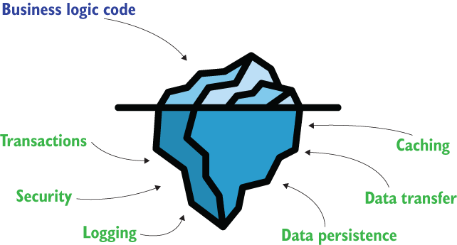
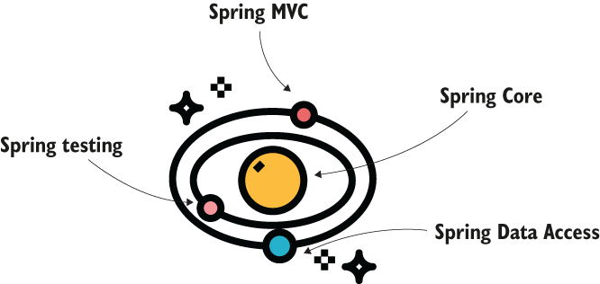
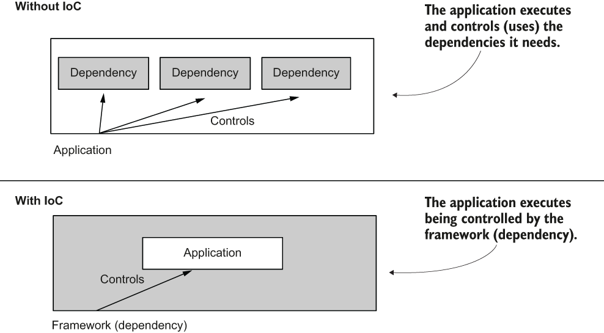
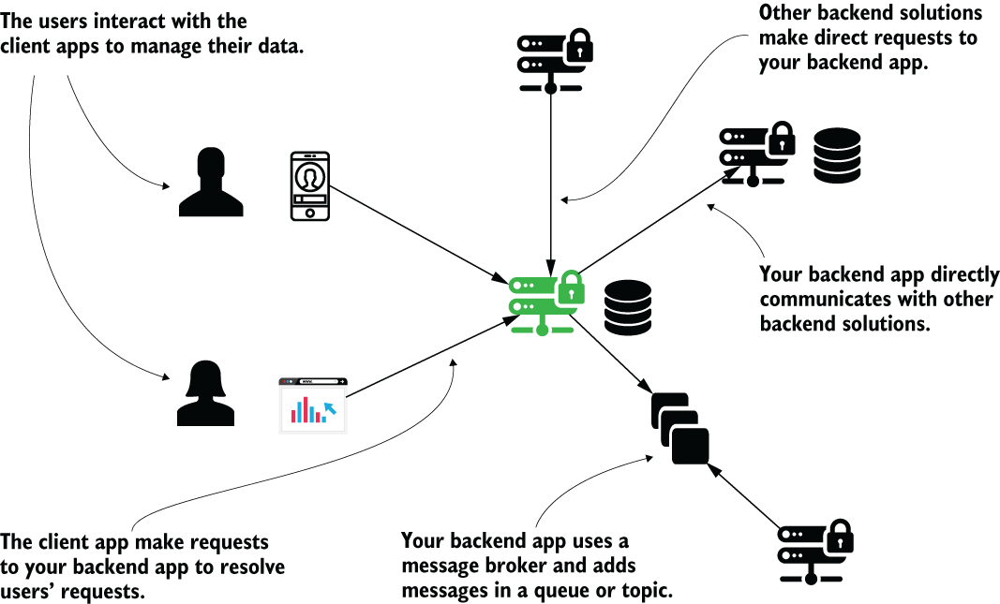
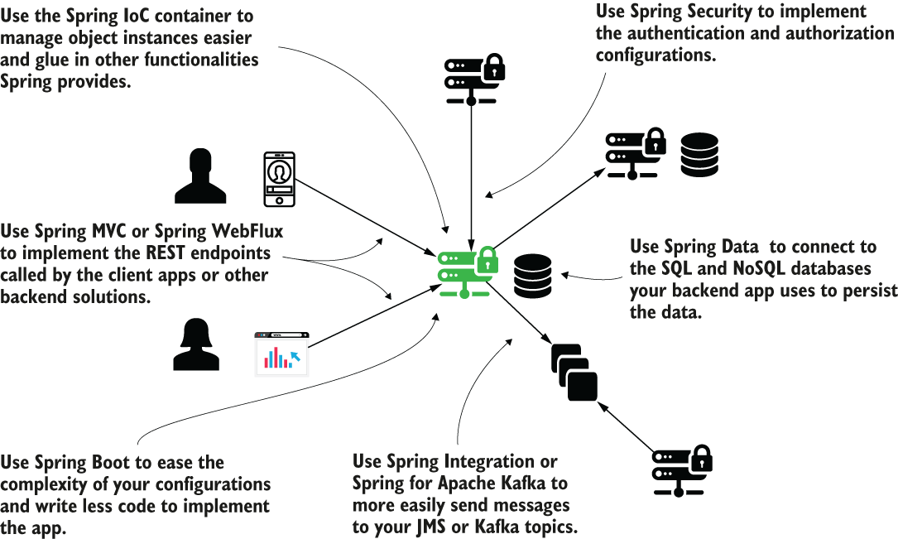
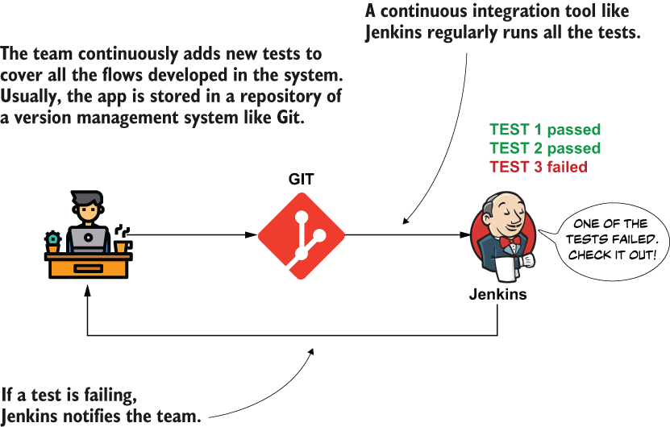
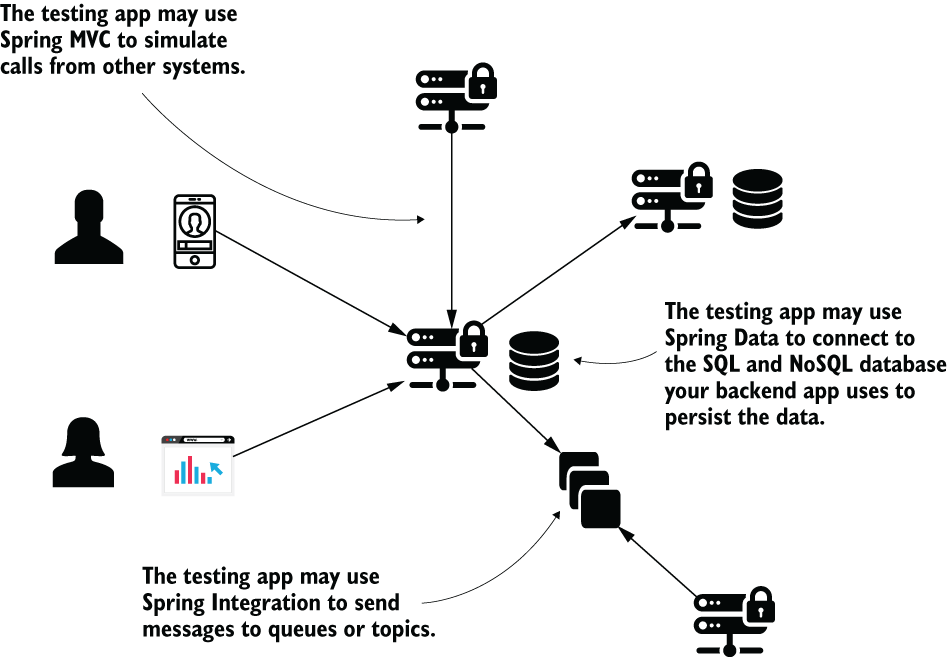

# 1 Spring trong thế giới thực

**Chương này bao gồm**

- Framework là gì
- Khi nào nên dùng và khi nào nên tránh dùng framework
- Spring framework là gì
- Sử dụng Spring trong các tình huống thực tế

Spring framework (gọi tắt là Spring) là một application framework thuộc hệ sinh thái Java. Application framework là một tập hợp các chức năng phần mềm phổ biến cung cấp cấu trúc nền tảng để phát triển một ứng dụng. Application framework giảm nhẹ công sức viết ứng dụng bằng cách loại bỏ việc phải viết toàn bộ code của chương trình từ đầu.

Ngày nay chúng ta dùng Spring để phát triển nhiều loại ứng dụng, từ các giải pháp backend lớn đến các ứng dụng kiểm thử tự động. Theo nhiều báo cáo khảo sát về công nghệ Java (như báo cáo này của JRebel năm 2020: http://mng.bz/N4V7; hoặc báo cáo này của JAXEnter: http://mng.bz/DK9a), Spring là Java framework được dùng nhiều nhất hiện nay.

Spring rất phổ biến, và các lập trình viên cũng bắt đầu dùng nó thường xuyên hơn với các ngôn ngữ JVM khác ngoài Java. Trong vài năm gần đây, chúng ta quan sát thấy sự tăng trưởng ấn tượng của số lập trình viên dùng Spring với Kotlin (một ngôn ngữ được đánh giá cao khác trong gia đình JVM). Trong cuốn sách này, chúng ta sẽ tập trung vào nền tảng của Spring, và tôi sẽ dạy bạn các kỹ năng thiết yếu để dùng Spring trong các ví dụ thực tế. Để chủ đề dễ tiếp cận hơn và cho phép bạn tập trung vào Spring, chúng ta sẽ chỉ dùng ví dụ Java. Xuyên suốt cuốn sách, chúng ta sẽ bàn và áp dụng, bằng ví dụ, các kỹ năng thiết yếu như kết nối đến database, thiết lập giao tiếp giữa các ứng dụng, bảo mật và kiểm thử ứng dụng.

Trước khi đi sâu vào các chi tiết kỹ thuật hơn trong các chương tiếp theo, hãy nói về Spring framework và nơi bạn sẽ thực sự dùng nó. Tại sao Spring được đánh giá cao đến vậy, và khi nào bạn thậm chí nên dùng nó?

Trong chương này, chúng ta sẽ tập trung vào framework là gì, đặc biệt là Spring framework. Trong mục 1.1, chúng ta bàn về các lợi ích của việc dùng framework. Trong mục 1.2, chúng ta bàn về hệ sinh thái Spring với các thành phần bạn cần học để bắt đầu với Spring. Sau đó tôi sẽ đưa bạn qua các cách dùng có thể của Spring framework, đặc biệt là các tình huống thực tế trong mục 1.3. Trong mục 1.4, chúng ta sẽ bàn về khi nào việc dùng framework có thể không phải là cách tiếp cận đúng. Bạn cần hiểu tất cả những điều này về Spring framework trước khi thử dùng nó. Nếu không, bạn có thể đang cố dùng búa để đào vườn.

Tùy vào trình độ, bạn có thể thấy chương này khó. Tôi có thể giới thiệu một số khái niệm bạn chưa từng nghe, và khía cạnh này có thể làm bạn khó chịu. Nhưng đừng lo; ngay cả khi bạn không hiểu một số điều lúc này, chúng sẽ được làm rõ ở phần sau của sách. Đôi khi, xuyên suốt cuốn sách, tôi sẽ nhắc lại điều gì đó đã nói ở các chương trước. Tôi dùng cách này vì học một framework như Spring không phải lúc nào cũng cho chúng ta một lộ trình học tuyến tính, và đôi khi bạn cần chờ đến khi có thêm nhiều mảnh ghép trước khi thấy được bức tranh hoàn chỉnh. Nhưng cuối cùng, bạn sẽ có một hình ảnh rõ ràng, và bạn sẽ có được các kỹ năng quý giá cần thiết để phát triển ứng dụng như một chuyên gia.

## 1.1 Tại sao chúng ta nên dùng framework?

Trong mục này, chúng ta bàn về framework. Chúng là gì? Khái niệm này xuất hiện thế nào, và tại sao? Để có động lực dùng một thứ gì đó, bạn cần biết thứ đó mang lại giá trị cho bạn ra sao. Và điều đó cũng đúng với Spring. Tôi sẽ dạy bạn những chi tiết thiết yếu này bằng cách chia sẻ kiến thức tôi thu thập được từ kinh nghiệm của bản thân và từ việc nghiên cứu, sử dụng nhiều framework khác nhau trong các tình huống thực tế, bao gồm cả Spring.

Application framework là một tập hợp các chức năng mà trên đó chúng ta xây dựng ứng dụng. Application framework cung cấp cho chúng ta một bộ công cụ và chức năng rộng mà bạn có thể dùng để xây dựng ứng dụng. Bạn không cần dùng tất cả các tính năng mà framework cung cấp. Tùy vào yêu cầu của ứng dụng bạn làm, bạn sẽ chọn những phần phù hợp của framework để dùng.

Đây là một phép so sánh tôi thích về application framework. Bạn đã bao giờ mua một món đồ nội thất từ cửa hàng tự lắp ráp (DIY) như Ikea chưa? Giả sử bạn mua một chiếc tủ quần áo, bạn sẽ không nhận được một chiếc tủ đã lắp sẵn, mà là đúng những linh kiện bạn cần để lắp nó và một hướng dẫn cách lắp ráp món đồ nội thất của bạn. Giờ hãy tưởng tượng bạn đặt mua một chiếc tủ quần áo, nhưng thay vì chỉ nhận đúng những linh kiện cần thiết, bạn nhận được tất cả các linh kiện có thể dùng để lắp ráp bất kỳ món đồ nội thất nào: một cái bàn, một cái tủ, v.v. Nếu bạn muốn một chiếc tủ quần áo, bạn phải tìm đúng các bộ phận và lắp ráp chúng. Điều đó giống như một application framework. Application framework cung cấp cho bạn nhiều mảnh phần mềm khác nhau mà bạn cần để xây dựng ứng dụng. Bạn cần biết chọn tính năng nào và cách lắp ráp chúng để đạt được kết quả đúng (hình 1.1).

> **Hình 1.1** David đặt mua một chiếc tủ quần áo từ cửa hàng UAssemble. Nhưng cửa hàng (framework) không chỉ giao cho David (lập trình viên) đúng những linh kiện (khả năng phần mềm) mà anh cần để lắp chiếc tủ mới (ứng dụng). Cửa hàng gửi cho anh tất cả các bộ phận có thể cần để lắp chiếc tủ. Việc chọn linh kiện (khả năng phần mềm) nào phù hợp và cách lắp ráp chúng để có kết quả đúng (ứng dụng) là lựa chọn của David (lập trình viên).

Ý tưởng về framework không mới. Xuyên suốt lịch sử phát triển phần mềm, các lập trình viên nhận thấy họ có thể tái sử dụng các phần code đã viết trong nhiều ứng dụng. Ban đầu, khi chưa có nhiều ứng dụng được triển khai, mỗi ứng dụng là duy nhất và được phát triển từ đầu bằng một ngôn ngữ lập trình cụ thể. Khi lĩnh vực phát triển phần mềm mở rộng, và ngày càng nhiều ứng dụng được đưa ra thị trường, người ta dễ dàng nhận thấy nhiều ứng dụng trong số này có các yêu cầu tương tự nhau. Hãy kể ra một vài yêu cầu:

- Ghi log các thông báo lỗi, cảnh báo và thông tin xuất hiện trong mọi ứng dụng.
- Hầu hết ứng dụng dùng transaction để xử lý các thay đổi dữ liệu. Transaction là một cơ chế quan trọng đảm bảo tính nhất quán của dữ liệu. Chúng ta sẽ bàn chi tiết chủ đề này trong chương 13.
- Hầu hết ứng dụng dùng các cơ chế bảo vệ chống lại cùng những lỗ hổng phổ biến.
- Hầu hết ứng dụng dùng các cách tương tự nhau để giao tiếp với nhau.
- Hầu hết ứng dụng dùng các cơ chế tương tự nhau để cải thiện hiệu năng, như caching hoặc nén dữ liệu.

Và danh sách còn tiếp tục. Hóa ra code logic nghiệp vụ được triển khai trong một ứng dụng nhỏ hơn đáng kể so với các bánh răng và dây đai tạo nên động cơ của ứng dụng (thường còn được gọi là "the plumbing", phần "ống nước").

Khi tôi nói "code logic nghiệp vụ", tôi muốn nói đến code triển khai các yêu cầu nghiệp vụ của ứng dụng. Code này là thứ hiện thực hóa kỳ vọng của người dùng trong ứng dụng. Ví dụ, "nhấp vào một liên kết cụ thể sẽ tạo ra một hóa đơn" là điều người dùng mong đợi xảy ra. Một phần code của ứng dụng bạn phát triển triển khai chức năng này, và phần code này là thứ các lập trình viên gọi là code logic nghiệp vụ. Tuy nhiên, bất kỳ ứng dụng nào cũng lo thêm nhiều khía cạnh khác: bảo mật, logging, tính nhất quán dữ liệu, v.v. (hình 1.2).

> **Hình 1.2** Góc nhìn của người dùng giống như nhìn một tảng băng trôi. Người dùng chủ yếu quan sát kết quả của code logic nghiệp vụ, nhưng đây chỉ là một phần nhỏ của toàn bộ chức năng tạo nên ứng dụng. Giống như tảng băng trôi phần lớn chìm dưới nước và khuất tầm nhìn, chúng ta không thấy hầu hết code trong một ứng dụng doanh nghiệp vì nó được cung cấp bởi các dependency.

Hơn nữa, code logic nghiệp vụ là thứ làm cho ứng dụng này khác ứng dụng kia về mặt chức năng. Nếu bạn lấy hai ứng dụng khác nhau, chẳng hạn một hệ thống chia sẻ xe và một ứng dụng mạng xã hội, chúng có các use case khác nhau.

> **LƯU Ý** Use case đại diện cho lý do một người dùng ứng dụng. Ví dụ, trong ứng dụng chia sẻ xe, một use case là "yêu cầu một chiếc xe". Với ứng dụng quản lý giao đồ ăn, một use case là "đặt một chiếc pizza".

Bạn thực hiện các hành động khác nhau, nhưng cả hai đều cần lưu trữ dữ liệu, truyền dữ liệu, logging, cấu hình bảo mật, có thể cả caching, v.v. Nhiều ứng dụng khác nhau có thể tái sử dụng các triển khai phi nghiệp vụ này. Vậy có hiệu quả không nếu viết lại cùng các chức năng mỗi lần? Dĩ nhiên là không:

- Bạn tiết kiệm rất nhiều thời gian và tiền bạc bằng cách tái sử dụng thứ gì đó thay vì tự phát triển.
- Một triển khai hiện có mà nhiều ứng dụng đã dùng có ít khả năng gây lỗi hơn, vì những người khác đã kiểm thử nó.
- Bạn hưởng lợi từ lời khuyên của cộng đồng vì giờ có rất nhiều lập trình viên hiểu cùng một chức năng. Nếu bạn tự triển khai code của mình, chỉ vài người biết nó.

> **Một câu chuyện chuyển đổi**
>
> Một trong những ứng dụng đầu tiên tôi làm việc là một hệ thống khổng lồ được phát triển bằng Java. Hệ thống này gồm nhiều ứng dụng được thiết kế quanh một kiến trúc server kiểu cũ, tất cả đều được viết từ đầu bằng Java SE. Việc phát triển ứng dụng này bắt đầu cùng với ngôn ngữ khoảng 25 năm trước. Đó là lý do chính cho hình hài của nó. Và hầu như không ai có thể hình dung nó sẽ lớn đến mức nào. Khi đó, các khái niệm tiên tiến hơn về kiến trúc hệ thống chưa tồn tại, và mọi thứ nhìn chung hoạt động khác so với các hệ thống riêng lẻ do kết nối internet chậm.
>
> Nhưng thời gian trôi qua, và nhiều năm sau, ứng dụng trở nên giống một "quả bóng bùn lớn" (big ball of mud). Vì những lý do chính đáng mà tôi sẽ không đề cập ở đây, nhóm quyết định họ phải chuyển sang kiến trúc hiện đại. Thay đổi này trước hết ngụ ý dọn dẹp code, và một trong các bước chính là dùng một framework. Chúng tôi quyết định chọn Spring. Khi đó, chúng tôi có lựa chọn thay thế là Java EE (giờ gọi là Jakarta EE), nhưng hầu hết thành viên trong nhóm cho rằng tốt hơn nên chọn Spring, thứ cung cấp một lựa chọn nhẹ hơn, dễ triển khai hơn và chúng tôi cũng coi là dễ bảo trì hơn.
>
> Quá trình chuyển đổi không hề dễ dàng. Cùng với vài đồng nghiệp, là chuyên gia trong lĩnh vực của họ và am hiểu về chính ứng dụng, chúng tôi đã đầu tư rất nhiều công sức vào cuộc chuyển đổi này.
>
> Kết quả thật đáng kinh ngạc! Chúng tôi loại bỏ hơn 40% số dòng code. Cuộc chuyển đổi này là khoảnh khắc đầu tiên tôi hiểu tác động của việc dùng framework có thể lớn đến mức nào.

> **LƯU Ý** Việc chọn và dùng một framework gắn liền với thiết kế và kiến trúc của ứng dụng. Bạn sẽ thấy hữu ích khi tìm hiểu thêm về các chủ đề này cùng với việc học Spring framework. Trong phụ lục A, bạn sẽ thấy một phần thảo luận về kiến trúc phần mềm với các tài nguyên xuất sắc nếu bạn muốn đi vào chi tiết.

## 1.2 Hệ sinh thái Spring

Trong mục này, chúng ta sẽ bàn về Spring và các project liên quan như Spring Boot hay Spring Data. Bạn sẽ học tất cả về chúng trong cuốn sách này, cùng với mối liên hệ giữa chúng. Trong thực tế, việc dùng nhiều framework khác nhau cùng nhau là phổ biến, trong đó mỗi framework được thiết kế để giúp bạn triển khai một phần cụ thể của ứng dụng nhanh hơn.

Chúng ta gọi Spring là một framework, nhưng nó phức tạp hơn nhiều. Spring là một hệ sinh thái các framework. Thường thì, khi các lập trình viên nói đến Spring framework, họ muốn nói đến một phần các khả năng phần mềm bao gồm những thứ sau:

1. Spring Core: Một trong những phần nền tảng của Spring, bao gồm các khả năng cơ bản. Một trong các tính năng này là Spring context. Như bạn sẽ học chi tiết trong chương 2, Spring context là một khả năng nền tảng của Spring framework cho phép Spring quản lý các instance của ứng dụng. Ngoài ra, thuộc Spring Core, bạn thấy chức năng aspect của Spring. Aspect giúp Spring chặn và thao tác các method bạn định nghĩa trong ứng dụng. Chúng ta bàn chi tiết hơn về aspect trong chương 6. Spring Expression Language (SpEL) là một khả năng khác bạn sẽ thấy thuộc Spring Core, cho phép bạn mô tả cấu hình cho Spring bằng một ngôn ngữ cụ thể. Tất cả đều là khái niệm mới, và tôi không mong bạn biết chúng ngay. Nhưng bạn sẽ sớm hiểu rằng Spring Core chứa các cơ chế mà Spring dùng để tích hợp vào ứng dụng của bạn.
2. Spring model-view-controller (MVC): Phần của Spring framework cho phép bạn phát triển các ứng dụng web phục vụ HTTP request. Chúng ta sẽ dùng Spring MVC bắt đầu từ chương 7.
3. Spring Data Access: Cũng là một trong những phần nền tảng của Spring. Nó cung cấp các công cụ cơ bản bạn có thể dùng để kết nối đến database SQL nhằm triển khai tầng lưu trữ của ứng dụng. Chúng ta sẽ dùng Spring Data Access bắt đầu từ chương 13.
4. Spring testing: Phần chứa các công cụ bạn cần để viết test cho ứng dụng Spring. Chúng ta sẽ bàn chủ đề này trong chương 15.

Ban đầu bạn có thể hình dung Spring framework như một hệ mặt trời, trong đó Spring Core là ngôi sao ở giữa, giữ toàn bộ framework lại với nhau (hình 1.3).

> **Hình 1.3** Bạn có thể hình dung Spring framework như một hệ mặt trời với Spring Core ở trung tâm. Các khả năng phần mềm là các hành tinh quanh Spring Core, được giữ gần nó bởi trường hấp dẫn của nó.

### 1.2.1 Khám phá Spring Core: Nền tảng của Spring

Spring Core là phần của Spring framework cung cấp các cơ chế nền tảng để tích hợp vào ứng dụng. Spring hoạt động dựa trên nguyên lý inversion of control (IoC, đảo ngược điều khiển). Khi dùng nguyên lý này, thay vì cho phép ứng dụng kiểm soát việc thực thi, chúng ta trao quyền kiểm soát cho một phần mềm khác, trong trường hợp của chúng ta là Spring framework. Thông qua cấu hình, chúng ta chỉ thị framework cách quản lý code chúng ta viết, code này định nghĩa logic của ứng dụng. Đây là nơi chữ "đảo ngược" trong IoC xuất phát: bạn không để ứng dụng kiểm soát việc thực thi bằng code của chính nó và dùng các dependency. Thay vào đó, chúng ta cho phép framework (dependency) kiểm soát ứng dụng và code của nó (hình 1.4).

> **Hình 1.4** Inversion of control. Thay vì thực thi code của chính nó, thứ sử dụng nhiều dependency khác, trong trường hợp một kịch bản IoC, việc thực thi ứng dụng được kiểm soát bởi dependency. Spring framework kiểm soát ứng dụng trong quá trình thực thi. Do đó, nó triển khai một kịch bản thực thi IoC.

> **LƯU Ý** Trong ngữ cảnh này, thuật ngữ "kiểm soát" đề cập đến các hành động như "tạo một instance" hoặc "gọi một method". Framework có thể tạo các đối tượng của các class bạn định nghĩa trong ứng dụng. Dựa trên các cấu hình bạn viết, Spring chặn method để bổ sung cho nó nhiều tính năng khác nhau. Ví dụ, Spring có thể chặn một method cụ thể để ghi log bất kỳ lỗi nào có thể xuất hiện trong quá trình thực thi method.

Bạn sẽ bắt đầu học Spring với Spring Core bằng cách bàn về chức năng IoC của Spring trong các chương 2 đến 5. IoC container gắn kết các thành phần của Spring và các thành phần của ứng dụng với framework. Dùng IoC container, thứ bạn thường gọi là Spring context, bạn làm cho một số đối tượng nhất định được Spring biết đến, điều này cho phép framework dùng chúng theo cách bạn cấu hình.

Trong chương 6, chúng ta sẽ tiếp tục thảo luận với Spring aspect-oriented programming (AOP, lập trình hướng khía cạnh). Spring có thể kiểm soát các instance được thêm vào IoC container, và một trong những việc nó có thể làm là chặn các method đại diện cho hành vi của các instance này. Khả năng này được gọi là "aspecting" method. Spring AOP là một trong những cách phổ biến nhất mà framework tương tác với những gì ứng dụng làm. Đặc điểm này khiến Spring AOP cũng thuộc phần thiết yếu. Thuộc Spring Core, chúng ta cũng thấy quản lý tài nguyên, quốc tế hóa (i18n), chuyển đổi kiểu, và SpEL. Chúng ta sẽ gặp các khía cạnh của những tính năng này trong các ví dụ xuyên suốt cuốn sách.

### 1.2.2 Dùng tính năng Spring Data Access để triển khai lưu trữ dữ liệu cho ứng dụng

Với hầu hết ứng dụng, việc lưu trữ một phần dữ liệu chúng xử lý là rất quan trọng. Làm việc với database là một chủ đề nền tảng, và trong Spring, module Data Access là thứ bạn sẽ dùng để lo việc lưu trữ dữ liệu trong nhiều trường hợp. Spring Data Access bao gồm việc dùng JDBC, tích hợp với các framework object-relational mapping (ORM) như Hibernate (đừng lo nếu bạn chưa biết ORM framework là gì hoặc chưa nghe về Hibernate; chúng ta sẽ bàn các khía cạnh này ở phần sau của sách), và quản lý transaction. Trong các chương 12 đến 14, chúng ta sẽ đề cập mọi thứ cần thiết để bạn bắt đầu với Spring Data Access.

### 1.2.3 Các khả năng của Spring MVC để phát triển ứng dụng web

Các ứng dụng phổ biến nhất được phát triển với Spring là ứng dụng web, và trong hệ sinh thái Spring, bạn sẽ thấy một bộ công cụ lớn cho phép bạn viết ứng dụng web và web service theo nhiều cách khác nhau. Bạn có thể dùng Spring MVC để phát triển ứng dụng theo kiểu servlet chuẩn, cách phổ biến trong rất nhiều ứng dụng ngày nay. Trong chương 7, chúng ta sẽ đi vào chi tiết hơn về việc dùng Spring MVC.

### 1.2.4 Tính năng testing của Spring

Module Spring testing cung cấp cho chúng ta một bộ công cụ lớn mà chúng ta sẽ dùng để viết unit test và integration test. Đã có rất nhiều trang sách viết về chủ đề kiểm thử, nhưng chúng ta sẽ bàn mọi thứ thiết yếu để bạn bắt đầu với Spring testing trong chương 15. Tôi cũng sẽ giới thiệu một số tài nguyên quý giá bạn cần đọc để nắm đầy đủ chi tiết chủ đề này. Quy tắc của tôi là bạn chưa phải một lập trình viên trưởng thành nếu bạn không hiểu về kiểm thử, nên đây là chủ đề bạn nên quan tâm.

### 1.2.5 Các project trong hệ sinh thái Spring

Hệ sinh thái Spring còn nhiều hơn rất nhiều so với chỉ các khả năng đã bàn ở phần đầu mục này. Nó bao gồm một bộ sưu tập lớn các framework khác tích hợp tốt với nhau và tạo thành một vũ trụ lớn hơn. Ở đây chúng ta có các project như Spring Data, Spring Security, Spring Cloud, Spring Batch, Spring Boot, v.v. Khi phát triển một ứng dụng, bạn có thể dùng nhiều project trong số này cùng nhau. Ví dụ, bạn có thể xây dựng một ứng dụng dùng cả Spring Boot, Spring Security và Spring Data. Trong vài chương tiếp theo, chúng ta sẽ làm các project nhỏ hơn sử dụng nhiều project khác nhau của hệ sinh thái Spring. Khi tôi nói project, tôi muốn nói đến một phần của hệ sinh thái Spring được phát triển độc lập. Mỗi project này có một nhóm riêng làm việc để mở rộng các khả năng của nó. Ngoài ra, mỗi project được mô tả riêng và có tài liệu tham khảo riêng trên website chính thức của Spring: https://spring.io/projects.

Trong vũ trụ rộng lớn do Spring tạo ra này, chúng ta cũng sẽ đề cập đến Spring Data và Spring Boot. Các project này thường gặp trong ứng dụng, nên điều quan trọng là làm quen với chúng ngay từ đầu.

**MỞ RỘNG CÁC KHẢ NĂNG LƯU TRỮ VỚI SPRING DATA**

Project Spring Data triển khai một phần của hệ sinh thái Spring cho phép bạn dễ dàng kết nối đến database và sử dụng tầng lưu trữ với số dòng code viết ra tối thiểu. Project này đề cập đến cả công nghệ SQL lẫn NoSQL và tạo ra một lớp cấp cao, giúp đơn giản hóa cách bạn làm việc với lưu trữ dữ liệu.

> **LƯU Ý** Chúng ta có Spring Data Access, là một module của Spring Core, và chúng ta cũng có một project độc lập trong hệ sinh thái Spring tên là Spring Data. Spring Data Access chứa các triển khai truy cập dữ liệu nền tảng như cơ chế transaction và các công cụ JDBC. Spring Data tăng cường việc truy cập database và cung cấp một bộ công cụ rộng hơn, giúp việc phát triển dễ tiếp cận hơn và cho phép ứng dụng kết nối đến nhiều loại nguồn dữ liệu khác nhau. Chúng ta sẽ bàn chủ đề này trong chương 14.

**SPRING BOOT**

Spring Boot là một project thuộc hệ sinh thái Spring giới thiệu khái niệm "convention over configuration" (quy ước hơn cấu hình). Ý tưởng chính của khái niệm này là thay vì tự thiết lập tất cả các cấu hình của framework, Spring Boot cung cấp cho bạn một cấu hình mặc định mà bạn có thể tùy chỉnh khi cần. Kết quả, nhìn chung, là bạn viết ít code hơn vì bạn tuân theo các quy ước đã biết và ứng dụng của bạn chỉ khác các ứng dụng khác ở một vài điểm nhỏ. Vậy nên thay vì viết tất cả cấu hình cho từng ứng dụng, sẽ hiệu quả hơn nếu bắt đầu với cấu hình mặc định và chỉ thay đổi những gì khác với quy ước. Chúng ta sẽ bàn thêm về Spring Boot bắt đầu từ chương 7.

Hệ sinh thái Spring rất rộng và chứa nhiều project. Một số bạn gặp thường xuyên hơn số khác, và một số bạn có thể hoàn toàn không dùng nếu bạn xây dựng ứng dụng không có nhu cầu đặc biệt. Trong cuốn sách này, chúng ta chỉ đề cập đến các project thiết yếu để bạn bắt đầu: Spring Core, Spring Data và Spring Boot. Bạn có thể tìm thấy danh sách đầy đủ các project thuộc hệ sinh thái Spring trên website chính thức của Spring: https://spring.io/projects/.

> **Các lựa chọn thay thế cho việc dùng Spring**
>
> Chúng ta không thể thực sự bàn về các lựa chọn thay thế cho Spring vì ai đó có thể hiểu nhầm chúng là lựa chọn thay thế cho toàn bộ hệ sinh thái. Nhưng với nhiều thành phần và project riêng lẻ tạo nên hệ sinh thái Spring, bạn có thể tìm thấy các lựa chọn khác như các framework hoặc library mã nguồn mở hoặc thương mại khác.
>
> Ví dụ, hãy lấy Spring IoC container. Nhiều năm trước, đặc tả Java EE là một giải pháp được các lập trình viên đánh giá rất cao. Với một triết lý hơi khác, Java EE (được mở mã nguồn năm 2017 và tái tạo thành Jakarta EE, https://jakarta.ee/) cung cấp các đặc tả như Context and Dependency Injection (CDI) hoặc Enterprise Java Beans (EJB). Bạn có thể dùng CDI hoặc EJB để quản lý một context các object instance và triển khai aspect (gọi là "interceptor" trong thuật ngữ EE). Ngoài ra, trong lịch sử, Google Guice (https://github.com/google/guice) là một framework được đánh giá cao để quản lý các object instance trong một container.
>
> Với một số project xét riêng lẻ, bạn có thể tìm thấy một hoặc nhiều lựa chọn thay thế. Ví dụ, bạn có thể chọn dùng Apache Shiro (https://shiro.apache.org/) thay vì Spring Security. Hoặc bạn có thể quyết định triển khai ứng dụng web bằng Play framework (https://www.playframework.com/) thay vì Spring MVC và các công nghệ liên quan đến Spring.
>
> Một project gần đây hơn trông đầy hứa hẹn là Red Hat Quarkus. Quarkus được thiết kế cho các triển khai cloud native và ngày càng trưởng thành với những bước tiến nhanh. Tôi sẽ không ngạc nhiên nếu thấy nó là một trong những project dẫn đầu trong phát triển ứng dụng doanh nghiệp trong hệ sinh thái Java trong tương lai (https://quarkus.io/).
>
> Lời khuyên của tôi dành cho bạn là luôn cân nhắc các lựa chọn thay thế. Trong phát triển phần mềm, bạn cần cởi mở và không bao giờ tin một giải pháp là "duy nhất". Bạn sẽ luôn thấy các tình huống mà một công nghệ cụ thể hoạt động tốt hơn công nghệ khác.

## 1.3 Spring trong các tình huống thực tế

Giờ bạn đã có cái nhìn tổng quan về Spring, bạn biết khi nào và tại sao nên dùng một framework. Trong mục này, tôi sẽ đưa ra một số kịch bản ứng dụng mà việc dùng Spring framework có thể rất phù hợp. Quá thường xuyên, tôi thấy các lập trình viên chỉ nghĩ đến ứng dụng backend khi dùng một framework như Spring. Tôi thậm chí còn thấy xu hướng thu hẹp hơn nữa kịch bản xuống chỉ còn ứng dụng web backend. Dù đúng là trong rất nhiều trường hợp chúng ta thấy Spring được dùng theo cách này, điều quan trọng cần nhớ là framework không giới hạn ở kịch bản này. Tôi đã thấy các nhóm dùng Spring thành công trong nhiều loại ứng dụng khác nhau, như phát triển một ứng dụng kiểm thử tự động hoặc thậm chí trong các kịch bản desktop độc lập.

Tôi sẽ mô tả thêm cho bạn một số tình huống thực tế phổ biến mà tôi đã thấy Spring được dùng thành công. Đây không phải là những kịch bản duy nhất có thể, và Spring có thể không phải lúc nào cũng hoạt động trong các trường hợp này. Hãy nhớ những gì chúng ta đã bàn trong mục 1.2: một framework không phải lúc nào cũng là lựa chọn tốt. Nhưng đây là các trường hợp phổ biến mà nhìn chung Spring phù hợp:

1. Phát triển ứng dụng backend
2. Phát triển framework kiểm thử tự động
3. Phát triển ứng dụng desktop
4. Phát triển ứng dụng di động

### 1.3.1 Dùng Spring trong phát triển ứng dụng backend

Ứng dụng backend là phần của hệ thống thực thi ở phía server và có trách nhiệm quản lý dữ liệu và phục vụ các request của ứng dụng client. Người dùng truy cập các chức năng bằng cách dùng trực tiếp các ứng dụng client. Sau đó, các ứng dụng client gửi request đến ứng dụng backend để làm việc với dữ liệu của người dùng. Ứng dụng backend có thể dùng database để lưu dữ liệu hoặc giao tiếp với các ứng dụng backend khác theo nhiều cách khác nhau.

Bạn có thể hình dung, trong một tình huống thực tế, ứng dụng sẽ là ứng dụng backend quản lý các giao dịch trong tài khoản ngân hàng của bạn. Người dùng có thể truy cập tài khoản của họ và quản lý chúng qua một ứng dụng web (ngân hàng trực tuyến) hoặc một ứng dụng di động. Cả ứng dụng di động lẫn ứng dụng web đều là client của ứng dụng backend. Để quản lý giao dịch của người dùng, ứng dụng backend cần giao tiếp với các giải pháp backend khác, và một phần dữ liệu nó quản lý cần được lưu trữ trong database. Trong hình 1.5, bạn có thể hình dung kiến trúc của một hệ thống như vậy.

> **Hình 1.5** Ứng dụng backend tương tác theo nhiều cách với các ứng dụng khác và dùng database để quản lý dữ liệu. Thường thì ứng dụng backend phức tạp và có thể đòi hỏi dùng nhiều công nghệ khác nhau. Framework đơn giản hóa việc triển khai bằng cách cung cấp các công cụ bạn có thể dùng để triển khai giải pháp backend nhanh hơn.

> **LƯU Ý** Đừng lo nếu bạn không hiểu hết các chi tiết của hình 1.5. Tôi không mong bạn biết message broker là gì và thậm chí không mong bạn biết cách thiết lập trao đổi dữ liệu giữa các thành phần. Điều tôi muốn bạn thấy là một hệ thống như vậy có thể trở nên phức tạp trong thực tế, rồi hiểu rằng các project trong hệ sinh thái Spring được xây dựng để giúp bạn loại bỏ sự phức tạp này nhiều nhất có thể.

Spring cung cấp một bộ công cụ xuất sắc để triển khai ứng dụng backend. Nó làm cuộc sống của bạn dễ dàng hơn với các chức năng khác nhau bạn thường triển khai trong một giải pháp backend, từ tích hợp với các ứng dụng khác đến lưu trữ trong nhiều công nghệ database khác nhau. Không có gì lạ khi các lập trình viên thường dùng Spring cho những ứng dụng như vậy. Framework về cơ bản cung cấp cho bạn mọi thứ bạn cần trong các triển khai như vậy và rất phù hợp với bất kỳ phong cách kiến trúc nào. Hình 1.6 chỉ ra các khả năng dùng Spring cho ứng dụng backend.

> **Hình 1.6** Các khả năng dùng Spring trong ứng dụng backend là vô tận, từ công khai các chức năng mà các ứng dụng khác có thể gọi đến quản lý truy cập database, và từ bảo mật ứng dụng đến quản lý tích hợp thông qua các message broker bên thứ ba.

### 1.3.2 Dùng Spring trong ứng dụng kiểm thử tự động

Ngày nay, chúng ta thường dùng kiểm thử tự động (automation testing) để kiểm thử đầu cuối (end-to-end) các hệ thống chúng ta triển khai. Kiểm thử tự động là việc triển khai phần mềm mà các nhóm phát triển dùng để đảm bảo một ứng dụng hành xử như mong đợi. Nhóm phát triển có thể lên lịch cho triển khai kiểm thử tự động để thường xuyên kiểm thử ứng dụng và thông báo cho các lập trình viên nếu có gì đó sai. Có chức năng như vậy mang lại sự tự tin cho các lập trình viên vì họ biết họ sẽ được thông báo nếu làm hỏng bất cứ thứ gì trong các khả năng hiện có của ứng dụng khi phát triển tính năng mới.

Dù với các hệ thống nhỏ bạn có thể kiểm thử thủ công, tự động hóa các trường hợp kiểm thử luôn là ý hay. Với các hệ thống phức tạp hơn, kiểm thử thủ công tất cả các luồng thậm chí không phải là một lựa chọn. Vì các luồng quá nhiều, sẽ cần một số giờ khổng lồ và quá nhiều công sức để bao phủ hoàn toàn.

Hóa ra giải pháp hiệu quả nhất là có một nhóm riêng triển khai một ứng dụng có trách nhiệm xác nhận tất cả các luồng của hệ thống được kiểm thử. Trong khi các lập trình viên thêm chức năng mới vào hệ thống, ứng dụng kiểm thử này cũng được cải tiến để bao phủ những gì mới, và các nhóm dùng nó để xác nhận mọi thứ vẫn hoạt động như mong muốn. Các lập trình viên cuối cùng dùng một công cụ tích hợp và lên lịch cho ứng dụng chạy thường xuyên để nhận phản hồi sớm nhất có thể cho các thay đổi của họ (hình 1.7).

> **Hình 1.7** Nhóm deploy ứng dụng kiểm thử trong môi trường test. Một công cụ tích hợp liên tục như Jenkins thực thi ứng dụng thường xuyên và gửi phản hồi cho nhóm. Bằng cách này, nhóm luôn biết trạng thái của hệ thống, và họ biết nếu họ làm hỏng gì đó trong quá trình phát triển.

Một ứng dụng như vậy có thể trở nên phức tạp như một ứng dụng backend. Để xác nhận các luồng, ứng dụng cần giao tiếp với các thành phần của hệ thống và thậm chí kết nối đến database. Đôi khi ứng dụng mock các dependency bên ngoài để mô phỏng các kịch bản thực thi khác nhau. Để viết các kịch bản kiểm thử, các lập trình viên dùng các framework như Selenium, Cucumber, Gauge và các framework khác. Nhưng cùng với các framework này, ứng dụng vẫn có thể hưởng lợi theo nhiều cách từ các công cụ của Spring. Ví dụ, ứng dụng có thể quản lý các object instance để code dễ bảo trì hơn bằng Spring IoC container. Nó có thể dùng Spring Data để kết nối đến các database nơi nó cần xác nhận dữ liệu. Nó có thể gửi message đến các queue hoặc topic của một hệ thống broker để mô phỏng các kịch bản cụ thể hoặc đơn giản dùng Spring để gọi một số REST endpoint (hình 1.8). (Hãy nhớ, không sao nếu điều này trông quá nâng cao; ý nghĩa sẽ được làm rõ khi bạn tiến bộ qua cuốn sách).

> **Hình 1.8** Ứng dụng kiểm thử có thể cần kết nối đến database hoặc giao tiếp với các hệ thống khác hoặc hệ thống được kiểm thử. Các lập trình viên có thể dùng các thành phần của hệ sinh thái Spring để đơn giản hóa việc triển khai các chức năng này.

### 1.3.3 Dùng Spring để phát triển ứng dụng desktop

Ngày nay, ứng dụng desktop không được phát triển thường xuyên, vì ứng dụng web hoặc di động đã đảm nhận vai trò tương tác với người dùng. Tuy nhiên, vẫn có một số nhỏ ứng dụng desktop, và các thành phần của hệ sinh thái Spring có thể là lựa chọn tốt trong việc phát triển các tính năng của chúng. Ứng dụng desktop có thể dùng thành công Spring IoC container để quản lý các object instance. Bằng cách này, việc triển khai ứng dụng sạch hơn và cải thiện khả năng bảo trì. Ngoài ra, ứng dụng có thể dùng các công cụ của Spring để triển khai các tính năng khác nhau, ví dụ để giao tiếp với backend hoặc các thành phần khác (gọi web service hoặc dùng các kỹ thuật khác cho lời gọi từ xa) hoặc triển khai giải pháp caching.

### 1.3.4 Dùng Spring trong ứng dụng di động

Với project Spring for Android (https://spring.io/projects/spring-android), cộng đồng Spring cố gắng hỗ trợ việc phát triển ứng dụng di động. Dù có lẽ bạn sẽ hiếm khi gặp tình huống này, đáng để đề cập rằng bạn có thể dùng các công cụ của Spring để phát triển ứng dụng Android. Project Spring này cung cấp một REST client cho Android và hỗ trợ xác thực để truy cập các API được bảo vệ.

## 1.4 Khi nào không nên dùng framework

Trong mục này, chúng ta bàn về lý do đôi khi bạn nên tránh dùng framework. Điều thiết yếu là bạn biết khi nào nên dùng framework và khi nào nên tránh. Đôi khi, dùng một công cụ quá mức cho công việc có thể tiêu tốn nhiều công sức hơn và còn cho kết quả tệ hơn. Hãy tưởng tượng dùng cưa máy để cắt bánh mì. Dù bạn có thể thử và thậm chí đạt được kết quả cuối cùng, nó sẽ khó khăn và tốn sức hơn dùng một con dao thường (và bạn có thể chỉ còn lại vụn bánh thay vì bánh mì cắt lát). Chúng ta sẽ bàn vài kịch bản mà dùng framework không phải ý hay, rồi tôi sẽ kể cho bạn câu chuyện về một nhóm tôi từng tham gia đã thất bại trong việc triển khai một ứng dụng vì dùng framework.

Hóa ra, giống như mọi thứ khác trong phát triển phần mềm, bạn không nên áp dụng framework trong mọi trường hợp. Bạn sẽ thấy các tình huống mà framework không phù hợp, hoặc có thể một framework phù hợp, nhưng không phải Spring framework. Trong những kịch bản nào sau đây bạn nên cân nhắc không dùng framework?

1. Bạn cần triển khai một chức năng cụ thể với footprint (dấu chân) nhỏ nhất có thể. Footprint ở đây là dung lượng lưu trữ mà các file của ứng dụng chiếm.
2. Các yêu cầu bảo mật cụ thể buộc bạn chỉ triển khai code tùy chỉnh trong ứng dụng mà không dùng bất kỳ framework mã nguồn mở nào.
3. Bạn sẽ phải tùy chỉnh framework nhiều đến mức bạn viết nhiều code hơn so với việc không dùng nó.
4. Bạn đã có một ứng dụng hoạt động, và bằng cách thay đổi nó để dùng framework bạn không thu được lợi ích nào.

Hãy bàn chi tiết hơn về các điểm này.

### 1.4.1 Bạn cần có footprint nhỏ

Với điểm một, tôi muốn nói đến các tình huống bạn cần làm ứng dụng nhỏ. Trong các hệ thống ngày nay, chúng ta thấy ngày càng nhiều trường hợp các service được cung cấp trong container. Có lẽ bạn đã nghe về container, như Docker, Kubernetes, hoặc các thuật ngữ khác liên quan đến chủ đề này (nếu chưa, một lần nữa, không sao cả).

Container nói chung là chủ đề nằm ngoài phạm vi cuốn sách này, nên hiện tại điều duy nhất tôi cần bạn biết là khi dùng cách deploy như vậy, bạn muốn ứng dụng nhỏ nhất có thể. Container giống như một cái hộp mà ứng dụng của bạn sống trong đó. Một nguyên tắc quan trọng về deploy ứng dụng trong container là các container phải dễ dàng bị loại bỏ: chúng có thể bị hủy và tạo lại nhanh nhất có thể. Kích thước của ứng dụng (footprint) rất quan trọng ở đây. Bạn có thể tiết kiệm vài giây khởi tạo ứng dụng bằng cách làm nó nhỏ hơn. Điều đó không có nghĩa bạn sẽ không dùng framework cho tất cả ứng dụng được deploy trong container.

Nhưng với một số ứng dụng, thường cũng khá nhỏ, sẽ hợp lý hơn khi cải thiện việc khởi tạo và làm footprint nhỏ hơn thay vì thêm dependency vào các framework khác nhau. Trường hợp như vậy là một loại ứng dụng gọi là server-less function. Các server-less function này là các ứng dụng nhỏ xíu được deploy trong container. Vì bạn không có nhiều quyền truy cập vào cách chúng được deploy, trông như chúng thực thi mà không có server (do đó có tên gọi này). Các ứng dụng này cần nhỏ, và đó là lý do, với trường hợp ứng dụng cụ thể này, bạn sẽ muốn tránh thêm framework nhiều nhất có thể. Vì kích thước của nó, cũng có khả năng bạn không cần framework.

### 1.4.2 Nhu cầu bảo mật đòi hỏi code tùy chỉnh

Tôi đã nói ở điểm hai rằng trong các tình huống cụ thể, ứng dụng không thể dùng framework vì các yêu cầu bảo mật. Kịch bản này thường xảy ra với các ứng dụng trong lĩnh vực quốc phòng hoặc các tổ chức chính phủ. Một lần nữa, điều đó không có nghĩa tất cả ứng dụng dùng trong các tổ chức chính phủ đều bị cấm dùng framework, nhưng với một số, các hạn chế được áp dụng. Bạn có thể thắc mắc tại sao. Chà, giả sử một framework mã nguồn mở như Spring được dùng. Nếu ai đó tìm thấy một lỗ hổng cụ thể, nó sẽ được biết đến, và một hacker có thể dùng kiến thức này để khai thác. Đôi khi, các bên liên quan của những ứng dụng như vậy muốn đảm bảo khả năng ai đó xâm nhập vào hệ thống của họ gần bằng không nhất có thể. Điều này có thể dẫn đến việc thậm chí xây dựng lại một chức năng thay vì dùng từ nguồn bên thứ ba.

> **LƯU Ý** Khoan đã! Trước đó tôi nói dùng framework mã nguồn mở an toàn hơn vì nếu có lỗ hổng tồn tại, ai đó có thể sẽ phát hiện ra. Chà, nếu bạn đầu tư đủ thời gian và tiền bạc, có lẽ bạn cũng có thể tự đạt được điều này. Nhìn chung, dùng framework dĩ nhiên rẻ hơn. Và nếu bạn không muốn quá thận trọng, dùng framework hợp lý hơn. Nhưng trong một số dự án, các bên liên quan thực sự muốn đảm bảo không có thông tin nào trở thành công khai.

### 1.4.3 Quá nhiều tùy chỉnh hiện có khiến framework không thực tế

Một trường hợp khác (điểm ba) mà bạn có thể muốn tránh dùng framework là khi bạn phải tùy chỉnh các thành phần của nó nhiều đến mức cuối cùng bạn viết nhiều code hơn so với việc không dùng nó. Như tôi đã nêu trong mục 1.1, framework cung cấp cho bạn các bộ phận mà bạn lắp ráp với code nghiệp vụ để có được ứng dụng. Các thành phần này, do framework cung cấp, không khớp hoàn hảo, và bạn cần tùy chỉnh chúng theo nhiều cách khác nhau. Việc tùy chỉnh các thành phần của framework và cách chúng được lắp ráp là hoàn toàn bình thường, so với việc bạn phát triển chức năng từ đầu. Nếu bạn rơi vào tình huống như vậy, có lẽ bạn đã chọn sai framework (hãy tìm các lựa chọn thay thế) hoặc bạn không nên dùng framework nào cả.

### 1.4.4 Bạn sẽ không hưởng lợi từ việc chuyển sang framework

Ở điểm bốn, tôi đã đề cập rằng một sai lầm tiềm ẩn có thể là cố dùng framework để thay thế thứ gì đó đã tồn tại và đang hoạt động trong ứng dụng. Đôi khi chúng ta bị cám dỗ thay thế một kiến trúc hiện có bằng thứ gì đó mới. Một framework mới xuất hiện, nó phổ biến, và mọi người đều dùng, vậy tại sao chúng ta không thay đổi ứng dụng để dùng framework này? Bạn có thể, nhưng bạn cần phân tích cẩn thận điều bạn muốn đạt được khi thay đổi thứ gì đó đang hoạt động. Trong một số trường hợp, như câu chuyện của tôi trong mục 1.1, việc thay đổi ứng dụng và làm nó dựa vào một framework cụ thể có thể hữu ích. Chừng nào thay đổi này mang lại lợi ích, hãy làm! Một lý do có thể là bạn muốn làm ứng dụng dễ bảo trì hơn, hiệu năng hơn, hoặc an toàn hơn. Nhưng nếu thay đổi này không mang lại lợi ích, và đôi khi nó thậm chí mang lại sự bất định, thì cuối cùng, bạn có thể phát hiện mình đã đầu tư thời gian và tiền bạc cho một kết quả tệ hơn. Hãy để tôi kể cho bạn một câu chuyện từ kinh nghiệm của chính tôi.

> **Một sai lầm có thể tránh được**
>
> Dùng framework không phải lúc nào cũng là lựa chọn tốt nhất, và tôi đã phải học điều đó một cách đau đớn. Nhiều năm trước, chúng tôi làm việc trên backend của một ứng dụng web. Thời thế ảnh hưởng đến nhiều thứ, bao gồm cả kiến trúc phần mềm. Ứng dụng dùng JDBC để kết nối trực tiếp đến database Oracle. Code khá xấu. Ở mọi nơi ứng dụng cần thực thi một truy vấn trên database, nó mở một statement rồi gửi một truy vấn đôi khi được viết trên nhiều dòng. Có thể bạn đủ trẻ để chưa từng gặp việc dùng JDBC trực tiếp trong ứng dụng, nhưng tin tôi đi, đó là một đoạn code dài và xấu.
>
> Vào thời điểm đó, một số framework dùng phương pháp khác để làm việc với database ngày càng trở nên phổ biến. Tôi nhớ lần đầu tôi gặp Hibernate. Đây là một ORM framework, cho phép bạn xử lý các bảng và quan hệ của chúng trong database như các đối tượng và quan hệ giữa các đối tượng. Khi được dùng đúng cách, nó cho phép bạn viết ít code hơn và chức năng trực quan hơn. Khi dùng sai, nó có thể làm chậm ứng dụng, làm code kém trực quan hơn, và thậm chí gây ra lỗi.
>
> Ứng dụng chúng tôi đang phát triển cần một thay đổi. Chúng tôi biết có thể cải thiện đoạn code JDBC xấu xí đó. Trong suy nghĩ của tôi, ít nhất chúng tôi có thể giảm thiểu số dòng. Thay đổi này sẽ mang lại lợi ích lớn cho khả năng bảo trì. Cùng với các lập trình viên khác, chúng tôi đề xuất dùng một công cụ do Spring cung cấp tên là JdbcTemplate (bạn sẽ học công cụ này trong chương 12). Nhưng những người khác thúc đẩy mạnh quyết định dùng Hibernate. Nó khá phổ biến, vậy tại sao không dùng? (Thực tế nó vẫn là một trong những framework phổ biến nhất trong loại của nó, và bạn sẽ học về việc tích hợp nó với Spring trong chương 13.) Tôi có thể thấy việc đổi đoạn code đó sang một phương pháp hoàn toàn mới sẽ là một thách thức. Hơn nữa, tôi không thấy lợi ích nào. Thay đổi này cũng ngụ ý rủi ro lớn hơn về việc gây ra lỗi.
>
> May mắn thay, thay đổi bắt đầu bằng một proof of concept. Sau vài tháng, rất nhiều công sức và căng thẳng, nhóm quyết định từ bỏ.
>
> Sau khi phân tích các lựa chọn, chúng tôi hoàn thành việc triển khai bằng JdbcTemplate. Chúng tôi viết được code sạch hơn bằng cách loại bỏ một số lượng lớn dòng code, và chúng tôi không cần đưa vào framework mới nào cho thay đổi này.

## 1.5 Bạn sẽ học gì trong cuốn sách này

Vì bạn đã mở cuốn sách này, tôi giả định có lẽ bạn là một lập trình viên phần mềm trong hệ sinh thái Java, người nhận ra việc học Spring là hữu ích. Mục đích của cuốn sách này là dạy bạn nền tảng của Spring, giả định bạn hoàn toàn chưa biết gì về framework và dĩ nhiên là về Spring. Khi tôi nói Spring, tôi muốn nói đến hệ sinh thái Spring, không chỉ phần lõi của framework.

Khi bạn đọc xong cuốn sách, bạn sẽ học được cách làm những điều sau:

- Dùng Spring context và triển khai aspect quanh các đối tượng được framework quản lý.
- Triển khai cơ chế để ứng dụng Spring kết nối đến database và làm việc với dữ liệu được lưu trữ.
- Thiết lập trao đổi dữ liệu giữa các ứng dụng bằng REST API được triển khai với Spring.
- Xây dựng các ứng dụng cơ bản dùng cách tiếp cận convention-over-configuration.
- Dùng các thực hành tốt nhất trong thiết kế class chuẩn của một ứng dụng Spring.
- Kiểm thử đúng cách các triển khai Spring của bạn.

## Tóm tắt

- Application framework là một tập hợp các chức năng phần mềm phổ biến cung cấp cấu trúc nền tảng để phát triển ứng dụng. Framework đóng vai trò như bộ khung để xây dựng ứng dụng.
- Framework giúp bạn xây dựng ứng dụng hiệu quả hơn bằng cách cung cấp chức năng mà bạn lắp ráp vào phần triển khai của mình thay vì tự phát triển. Dùng framework tiết kiệm thời gian và giúp đảm bảo ít khả năng triển khai các tính năng có lỗi hơn.
- Dùng một framework được biết đến rộng rãi như Spring mở ra cánh cửa đến một cộng đồng lớn, khiến nhiều khả năng những người khác cũng gặp các vấn đề tương tự. Khi đó bạn có cơ hội tuyệt vời để học cách những người khác giải quyết thứ gì đó tương tự vấn đề bạn cần xử lý, giúp bạn tiết kiệm thời gian nghiên cứu cá nhân.
- Khi triển khai một ứng dụng, hãy luôn nghĩ đến mọi khả năng, bao gồm cả việc không dùng framework. Nếu bạn quyết định dùng một hoặc nhiều framework, hãy cân nhắc tất cả các lựa chọn thay thế của chúng. Bạn nên nghĩ về mục đích của framework, ai khác đang dùng nó (cộng đồng lớn đến đâu), và nó đã có mặt trên thị trường bao lâu (độ trưởng thành).
- Spring không chỉ là một framework. Chúng ta thường gọi Spring là "Spring framework" để chỉ các chức năng lõi, nhưng Spring cung cấp cả một hệ sinh thái gồm nhiều project được dùng trong phát triển ứng dụng. Mỗi project dành riêng cho một lĩnh vực cụ thể, và khi triển khai một ứng dụng, bạn có thể dùng nhiều project trong số này để triển khai chức năng bạn mong muốn. Các project của hệ sinh thái Spring chúng ta sẽ dùng trong cuốn sách này như sau:
  - Spring Core, xây dựng nền tảng của Spring và cung cấp các tính năng như context, aspect và truy cập dữ liệu cơ bản.
  - Spring Data, cung cấp một bộ công cụ cấp cao, thoải mái khi dùng để triển khai tầng lưu trữ của ứng dụng. Bạn sẽ thấy dùng Spring Data để làm việc với cả database SQL lẫn NoSQL dễ dàng thế nào.
  - Spring Boot, một project của hệ sinh thái Spring giúp bạn áp dụng cách tiếp cận "convention-over-configuration".
- Khá thường xuyên, các tài liệu học tập (như sách, bài viết, hoặc video hướng dẫn) chỉ đưa ra ví dụ với Spring cho ứng dụng backend. Dù đúng là việc dùng Spring với ứng dụng backend rất phổ biến, bạn cũng có thể dùng Spring với các loại ứng dụng khác, kể cả ứng dụng desktop và ứng dụng kiểm thử tự động.
