# 10 Triển khai REST service

**Chương này bao gồm**

- Hiểu về REST service
- Triển khai REST endpoint
- Quản lý dữ liệu mà server gửi cho client trong HTTP response
- Lấy dữ liệu từ client trong HTTP request body
- Quản lý exception ở cấp endpoint

Trong các chương 7 đến 9, tôi đã đề cập vài lần đến REST service (representational state transfer) liên quan đến ứng dụng web. Trong chương này, chúng ta mở rộng thảo luận về REST service, và bạn sẽ học rằng chúng không chỉ liên quan đến ứng dụng web.

REST service là một trong những cách thường gặp nhất để triển khai giao tiếp giữa hai ứng dụng. REST cung cấp quyền truy cập vào chức năng mà server công khai thông qua các endpoint mà client có thể gọi.

Bạn dùng REST service để thiết lập giao tiếp giữa client và server trong ứng dụng web. Nhưng bạn cũng có thể dùng REST service để phát triển giao tiếp giữa ứng dụng di động và backend hoặc thậm chí giữa hai backend service (hình 10.1).

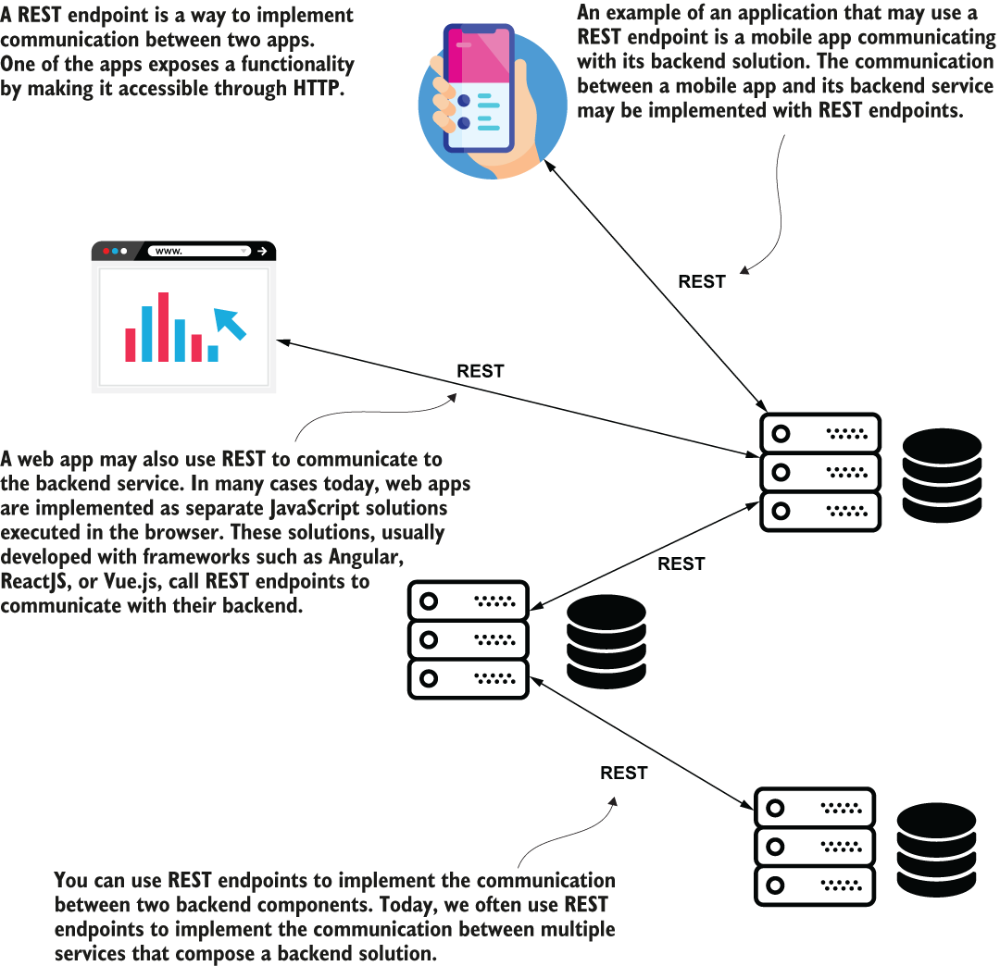

> **Hình 10.1** REST service là một phương thức giao tiếp giữa hai ứng dụng. Ngày nay, bạn có thể thấy REST service ở nhiều nơi. Một ứng dụng web client hoặc ứng dụng di động có thể gọi giải pháp backend của nó thông qua REST endpoint, nhưng ngay cả các backend service cũng có thể giao tiếp bằng các lời gọi REST web service.

Vì trong nhiều ứng dụng Spring ngày nay bạn có nhiều khả năng gặp và làm việc với REST service, tôi coi chủ đề này là bắt buộc phải học với mọi lập trình viên Spring.

Chúng ta sẽ bắt đầu bằng việc bàn chính xác REST service là gì trong mục 10.1. Bạn sẽ học rằng Spring hỗ trợ REST service bằng cùng cơ chế Spring MVC mà chúng ta đã bàn trong các chương 7 đến 9. Trong mục 10.2, chúng ta bàn về các cú pháp thiết yếu bạn cần biết khi làm việc với REST endpoint. Chúng ta sẽ làm nhiều ví dụ để làm rõ các khía cạnh quan trọng mà bất kỳ lập trình viên Spring nào cũng cần biết khi triển khai giao tiếp giữa hai ứng dụng bằng REST service.

## 10.1 Dùng REST service để trao đổi dữ liệu giữa các ứng dụng

Trong mục này, chúng ta bàn về REST service và cách Spring hỗ trợ triển khai chúng thông qua Spring MVC. REST endpoint đơn giản là một cách triển khai giao tiếp giữa hai ứng dụng. REST endpoint đơn giản như việc triển khai một action của controller được ánh xạ vào một HTTP method và một đường dẫn. Một ứng dụng gọi action controller này thông qua HTTP. Vì đó là cách một ứng dụng công khai một service thông qua giao thức web, chúng ta gọi endpoint này là web service.

Suy cho cùng, trong Spring một REST endpoint vẫn là một action của controller được ánh xạ vào một HTTP method và đường dẫn. Spring dùng cùng cơ chế bạn đã học cho ứng dụng web để công khai REST endpoint. Khác biệt duy nhất là với REST service chúng ta sẽ bảo dispatcher servlet của Spring MVC không tìm view. Trong sơ đồ Spring MVC bạn đã học ở chương 7, view resolver biến mất. Server gửi lại, trong HTTP response cho client, trực tiếp những gì action của controller trả về. Hình 10.2 trình bày các thay đổi trong luồng Spring MVC.

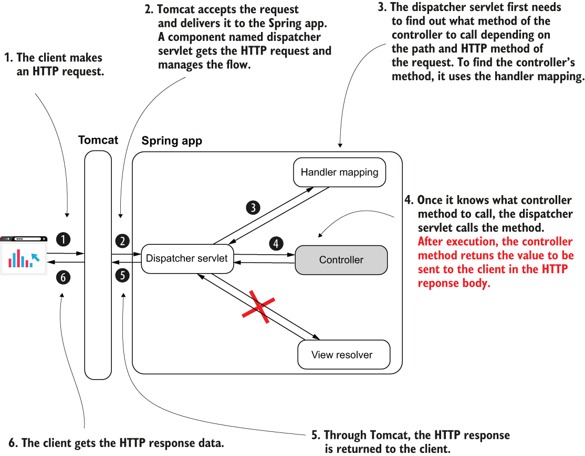

> **Hình 10.2** Khi triển khai REST endpoint, luồng Spring MVC thay đổi. Ứng dụng không cần view resolver nữa vì client cần trực tiếp dữ liệu mà action của controller trả về. Khi action của controller hoàn thành, dispatcher servlet trả về HTTP response mà không render view nào.

Bạn sẽ thấy REST service rất thoải mái để dùng. Sự đơn giản của chúng là một lý do chúng được dùng thường xuyên đến vậy ngày nay, và Spring làm việc triển khai chúng trở nên đơn giản. Nhưng trước khi bắt đầu với ví dụ đầu tiên, tôi muốn bạn biết một số vấn đề giao tiếp mà REST endpoint có thể mang lại:

- Nếu action của controller mất nhiều thời gian để hoàn thành, lời gọi HTTP đến endpoint có thể hết thời gian chờ (timeout) và làm gián đoạn giao tiếp.
- Gửi lượng dữ liệu lớn trong một lời gọi (qua HTTP request) có thể khiến lời gọi timeout và làm gián đoạn giao tiếp. Gửi nhiều hơn vài megabyte qua một lời gọi REST thường không phải lựa chọn đúng.
- Quá nhiều lời gọi đồng thời đến một endpoint do một thành phần backend công khai có thể gây áp lực quá lớn lên ứng dụng và khiến nó thất bại.
- Mạng hỗ trợ các lời gọi HTTP, và mạng không bao giờ đáng tin cậy 100%. Luôn có khả năng một lời gọi REST endpoint thất bại vì mạng.

Khi bạn triển khai giao tiếp giữa hai ứng dụng bằng REST, bạn luôn cần cân nhắc điều gì sẽ xảy ra nếu một lời gọi thất bại và nó có thể ảnh hưởng đến ứng dụng thế nào. Hãy tự hỏi liệu dữ liệu có thể bị ảnh hưởng theo bất kỳ cách nào không. Cách bạn thiết kế ứng dụng có thể dẫn đến không nhất quán dữ liệu nếu một lời gọi endpoint thất bại không? Trong trường hợp ứng dụng cần hiển thị lỗi cho người dùng, bạn sẽ làm thế nào? Đây là những vấn đề phức tạp và đòi hỏi kiến thức kiến trúc nằm ngoài phạm vi cuốn sách này, nhưng tôi khuyên bạn đọc *API Design Patterns* (Manning, 2021) của J. J. Geewax, một hướng dẫn xuất sắc bàn về các thực hành tốt nhất khi thiết kế API.

## 10.2 Triển khai REST endpoint

Trong mục này, bạn sẽ học cách triển khai REST endpoint với Spring. Tin tốt là Spring dùng cùng cơ chế Spring MVC phía sau REST endpoint, nên bạn đã biết phần lớn cách chúng hoạt động từ chương 7 và 8. Hãy bắt đầu với một ví dụ (project "sq-ch10-ex1"). Tôi sẽ xây dựng ví dụ trên những gì chúng ta đã bàn trong chương 7 và 8, và bạn sẽ học cách chuyển một web controller đơn giản thành một REST controller để triển khai REST web service.

Listing 10.1 cho bạn thấy một class controller triển khai một action đơn giản. Như bạn đã học từ chương 7, chúng ta đánh dấu class controller bằng stereotype annotation `@Controller`. Bằng cách này, một instance của class trở thành bean trong Spring context, và Spring MVC biết đây là một controller ánh xạ các method của nó vào các đường dẫn HTTP cụ thể. Ngoài ra, chúng ta dùng annotation `@GetMapping` để chỉ định đường dẫn và HTTP method của action. Điều mới duy nhất bạn thấy trong listing này là việc dùng annotation `@ResponseBody`. Annotation `@ResponseBody` nói cho dispatcher servlet biết rằng action của controller không trả về tên view mà là dữ liệu được gửi trực tiếp trong HTTP response.

**Listing 10.1** Triển khai một action REST endpoint trong class controller

```java
@Controller                               ❶
public class HelloController {
    @GetMapping("/hello")                ❷
    @ResponseBody                        ❸
    public String hello() {
         return "Hello!";
    }
}
```

❶ Chúng ta dùng annotation `@Controller` để đánh dấu class là một controller của Spring MVC

❷ Chúng ta dùng annotation `@GetMapping` để gắn HTTP method GET và một đường dẫn với action của controller.

❸ Chúng ta dùng annotation `@ResponseBody` để thông báo cho dispatcher servlet rằng method này không trả về tên view mà trả về HTTP response trực tiếp.

Nhưng hãy xem điều gì xảy ra nếu chúng ta thêm nhiều method hơn vào controller, như trong listing sau. Lặp lại annotation `@ResponseBody` trên mọi method trở nên phiền phức.

**Listing 10.2** Annotation @ResponseBody trở thành code trùng lặp

```java
@Controller
public class HelloController {

    @GetMapping("/hello")
    @ResponseBody
    public String hello() {
      return "Hello!";
    }

    @GetMapping("/ciao")
    @ResponseBody
    public String ciao() {
         return "Ciao!";
    }
}
```

Một thực hành tốt là tránh trùng lặp code. Chúng ta muốn bằng cách nào đó ngăn việc lặp lại annotation `@ResponseBody` cho từng method. Để giúp chúng ta về khía cạnh này, Spring cung cấp annotation `@RestController`, một sự kết hợp của `@Controller` và `@ResponseBody`. Bạn dùng `@RestController` để chỉ thị Spring rằng tất cả các action của controller đều là REST endpoint. Bằng cách này, bạn tránh lặp lại annotation `@ResponseBody`. Listing 10.3 cho thấy những gì bạn cần thay đổi trong controller để dùng `@RestController` một lần cho class thay vì `@ResponseBody` cho từng method. Để bạn có thể kiểm tra và so sánh cả hai cách, tôi tách code này vào ví dụ "sq-ch10-ex2".

**Listing 10.3** Dùng annotation @RestController để tránh trùng lặp code

```java
@RestController                           ❶
public class HelloController {

    @GetMapping("/hello")
    public String hello() {
      return "Hello!";
    }

    @GetMapping("/ciao")
    public String ciao() {
        return "Ciao!";
    }
}
```

❶ Thay vì lặp lại annotation `@ResponseBody` cho từng method, chúng ta thay `@Controller` bằng `@RestController`.

Quả thật rất dễ để triển khai vài endpoint. Nhưng làm sao chúng ta xác nhận chúng hoạt động đúng? Trong mục này, bạn sẽ học cách gọi các endpoint bằng hai công cụ bạn sẽ thường gặp trong thực tế:

- Postman: Cung cấp giao diện đồ họa (GUI) đẹp và thoải mái khi dùng
- cURL: Công cụ dòng lệnh hữu ích trong các trường hợp bạn không có GUI (ví dụ, khi bạn kết nối đến máy ảo qua SSH hoặc khi viết một batch script)

Cả hai công cụ này đều bắt buộc phải học với bất kỳ lập trình viên nào. Trong chương 15, bạn sẽ học cách thứ ba để xác nhận một endpoint hành xử như mong đợi bằng cách viết integration test.

Trước hết, khởi động ứng dụng. Bạn có thể dùng project "sq-ch10-ex1" hoặc "sq-ch10-ex2". Chúng có cùng hành vi. Khác biệt duy nhất là cú pháp, như đã bàn trong các đoạn trước. Như bạn đã học ở chương 7, mặc định ứng dụng Spring Boot cấu hình một Tomcat servlet container có thể truy cập ở cổng 8080.

Hãy bàn về Postman trước. Bạn cần cài đặt công cụ này trên hệ thống như hướng dẫn trên website chính thức của họ: https://www.postman.com/. Khi đã cài đặt Postman, lúc mở nó lên, bạn sẽ thấy nó có giao diện như trình bày trong hình 10.3.

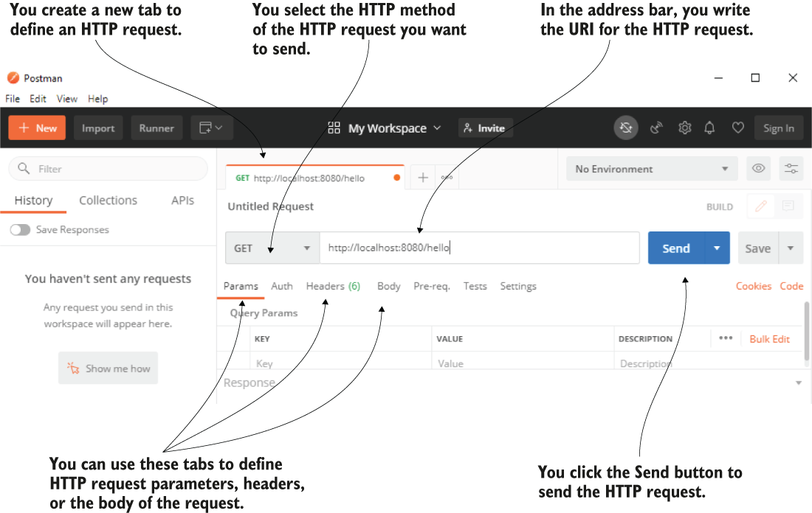

> **Hình 10.3** Postman cung cấp giao diện thân thiện để cấu hình và gửi HTTP request. Bạn chọn HTTP method, đặt URI của HTTP request, rồi bấm nút Send để gửi HTTP request. Bạn cũng có thể định nghĩa các cấu hình khác như request parameter, header, hoặc request body nếu cần.

Khi bạn bấm nút Send, Postman gửi HTTP request. Khi request hoàn thành, Postman hiển thị chi tiết HTTP response, như trình bày trong hình 10.4.

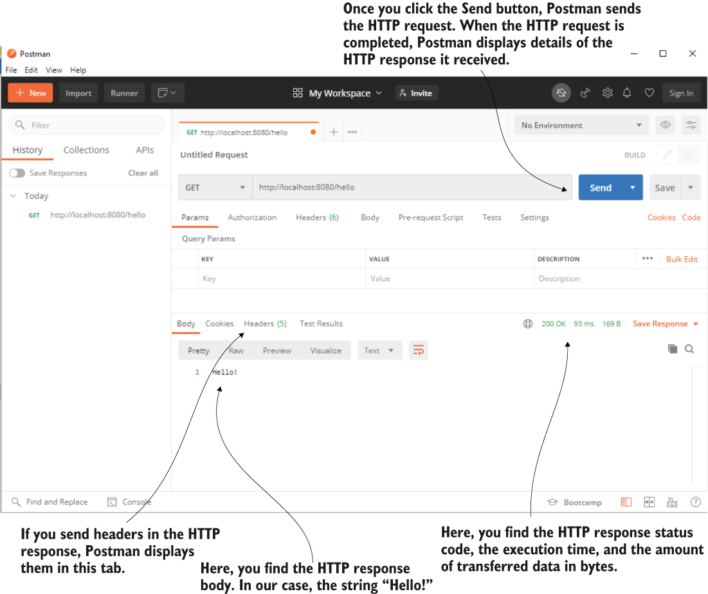

> **Hình 10.4** Khi HTTP request hoàn thành, Postman hiển thị chi tiết HTTP response. Bạn thấy status của response, thời gian request hoàn thành, lượng dữ liệu được truyền tính bằng byte, cùng response body và các header.

Trong trường hợp bạn không có GUI, bạn có thể dùng công cụ dòng lệnh để gọi endpoint. Bạn cũng sẽ thấy các bài viết và sách thường dùng công cụ dòng lệnh để minh họa thay vì công cụ GUI vì đó là cách ngắn gọn hơn để biểu diễn lệnh.

Nếu bạn chọn dùng cURL làm công cụ dòng lệnh, giống như với Postman, trước hết bạn cần đảm bảo đã cài đặt nó. Bạn cài đặt cURL tùy theo hệ điều hành như mô tả trên trang web chính thức của công cụ: https://curl.se/

Khi đã cài đặt và cấu hình xong, bạn có thể dùng lệnh `curl` để gửi HTTP request. Đoạn sau cho bạn thấy lệnh có thể dùng để gửi HTTP request kiểm tra endpoint /hello mà ứng dụng công khai:

```bash
curl http://localhost:8080/hello
```

Khi HTTP request hoàn thành, console chỉ hiển thị HTTP response body như trong đoạn tiếp theo:

```text
Hello!
```

Nếu HTTP method là HTTP GET, bạn không cần chỉ định tường minh. Khi method không phải HTTP GET, hoặc nếu bạn muốn chỉ định tường minh, bạn có thể dùng cờ `-X`, như trong đoạn tiếp theo:

```bash
curl -X GET http://localhost:8080/hello
```

Nếu bạn muốn xem thêm chi tiết của HTTP request, bạn có thể thêm tùy chọn `-v` vào lệnh, như trong đoạn tiếp theo:

```bash
curl -v http://localhost:8080/hello
```

Đoạn tiếp theo trình bày kết quả của lệnh này, hơi phức tạp hơn một chút. Bạn cũng thấy các chi tiết như status, lượng dữ liệu được truyền, và các header trong response dài này:

```text
  Trying ::1:8080...
* Connected to localhost (::1) port 8080 (#0)
> GET /hello HTTP/1.1
> Host: localhost:8080
> User-Agent: curl/7.73.0
> Accept: */*
>
* Mark bundle as not supporting multiuse
< HTTP/1.1 200                                            ❶
< Content-Type: text/plain;charset=UTF-8
< Content-Length: 6
< Date: Fri, 25 Dec 2020 23:11:02 GMT
<
{ [6 bytes data]
100       6   100       6      0       0     857          0 --:--:-- --:--:-- --:--
1000
Hello!                                                    ❷
* Connection #0 to host localhost left intact
```

❶ Status của HTTP response

❷ HTTP response body

## 10.3 Quản lý HTTP response

Trong mục này, chúng ta bàn về việc quản lý HTTP response trong action của controller. HTTP response là cách ứng dụng backend gửi dữ liệu trở lại client để đáp lại request của client. HTTP response chứa dữ liệu dưới các dạng sau:

- Response header: Các mẩu dữ liệu ngắn trong response (thường không dài hơn vài từ)
- Response body: Lượng dữ liệu lớn hơn mà backend cần gửi trong response
- Response status: Biểu diễn ngắn gọn kết quả của request

Hãy dành vài phút xem lại phụ lục C để nhớ các chi tiết về HTTP trước khi đi tiếp. Trong mục 10.3.1 và 10.3.2, chúng ta bàn về các lựa chọn bạn có để gửi dữ liệu trong response body. Trong mục 10.3.3, bạn sẽ học cách đặt status và header của HTTP response nếu cần.

### 10.3.1 Gửi đối tượng làm response body

Trong mục này, chúng ta bàn về việc gửi các object instance trong response body. Điều duy nhất bạn cần làm để gửi một đối tượng cho client trong response là làm cho action của controller trả về đối tượng đó. Trong ví dụ "sq-ch10-ex3", chúng ta định nghĩa một đối tượng model tên là `Country` với các thuộc tính `name` (đại diện cho tên quốc gia) và `population` (đại diện cho số triệu người sống ở quốc gia đó). Chúng ta triển khai một action của controller trả về một instance kiểu `Country`.

Listing 10.4 cho thấy class định nghĩa đối tượng `Country`. Khi chúng ta dùng một đối tượng (như `Country`) để mô hình hóa dữ liệu được truyền giữa hai ứng dụng, chúng ta gọi đối tượng này là data transfer object (DTO). Chúng ta có thể nói `Country` là DTO của chúng ta, các instance của nó được REST endpoint mà chúng ta triển khai trả về trong HTTP response body.

**Listing 10.4** Model của dữ liệu mà server trả về trong HTTP response body

```java
public class Country {

    private String name;
    private int population;

    public static Country of(              ❶
      String name,
        int population) {
          Country country = new Country();
          country.setName(name);
          country.setPopulation(population);
          return country;
    }
   // Omitted getters and setters
}
```

❶ Để tạo instance `Country` đơn giản hơn, chúng ta định nghĩa một static factory method nhận tên và dân số. Method này trả về một instance `Country` với các giá trị đã cung cấp được đặt sẵn.

Listing sau cho thấy phần triển khai một action của controller trả về một instance kiểu `Country`.

**Listing 10.5** Trả về một object instance từ action của controller

```java
@RestController                 ❶
public class CountryController {

    @GetMapping("/france")                ❷
    public Country france() {
        Country c = Country.of("France", 67);
        return c;                         ❸
    }
}
```

❶ Đánh dấu class là REST controller để thêm bean vào Spring context và cũng thông báo cho dispatcher servlet không tìm view khi method này trả về

❷ Ánh xạ action của controller vào HTTP method GET và đường dẫn /france

❸ Trả về một instance kiểu `Country`

Điều gì xảy ra khi bạn gọi endpoint này? Đối tượng sẽ trông thế nào trong HTTP response body? Mặc định, Spring tạo một biểu diễn chuỗi của đối tượng và định dạng nó thành JSON. JavaScript Object Notation (JSON) là cách đơn giản để định dạng chuỗi dưới dạng các cặp thuộc tính-giá trị. Rất có thể bạn đã thấy JSON rồi, nhưng nếu bạn chưa dùng nó trước đây, tôi đã chuẩn bị một phần thảo luận với mọi thứ bạn cần biết trong phụ lục D.

Khi gọi endpoint /france, response body trông như trong đoạn tiếp theo:

```json
{
        "name": "France",
        "population": 67
}
```

Hình 10.5 nhắc bạn nơi tìm HTTP response body khi bạn dùng Postman để gọi endpoint.

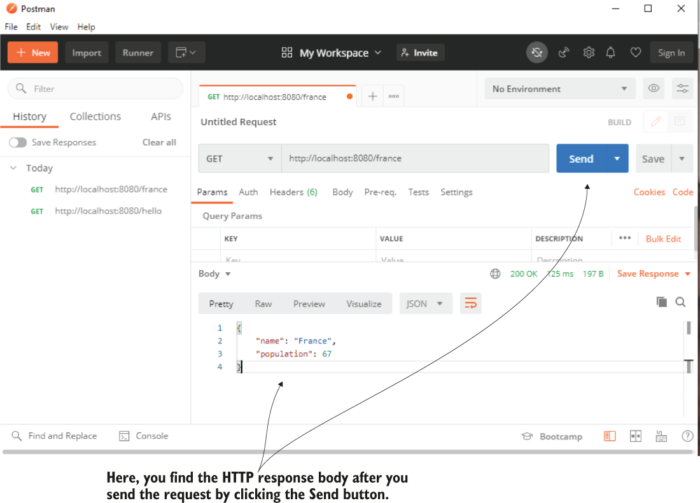

> **Hình 10.5** Khi bạn bấm nút Send, Postman gửi request. Khi request hoàn thành, Postman hiển thị chi tiết response, bao gồm cả response body.

Bạn cũng có thể gửi các instance collection của đối tượng trong response body. Listing tiếp theo cho thấy chúng ta thêm một method trả về một `List` các đối tượng `Country`.

**Listing 10.6** Trả về một collection trong response body

```java
@RestController
public class CountryController {

    // Omitted code

    @GetMapping("/all")
    public List<Country> countries() {
        Country c1 = Country.of("France", 67);
        Country c2 = Country.of("Spain", 47);

        return List.of(c1,c2);        ❶
    }

}
```

❶ Trả về một collection trong HTTP response body

Khi bạn gọi endpoint này, response body trông như trong đoạn tiếp theo:

```json
[                                            ❶
     {                                       ❷
             "name": "France",               ❷
             "population": 67                ❷
     },                                      ❷
     {
             "name": "Spain",
             "population": 47
     }
]
```

❶ Trong JSON, danh sách được định nghĩa bằng dấu ngoặc vuông.

❷ Mỗi đối tượng nằm giữa cặp dấu ngoặc nhọn, và các đối tượng được phân cách bằng dấu phẩy.

Dùng JSON là cách phổ biến nhất để biểu diễn đối tượng khi làm việc với REST endpoint. Dù bạn không bị ràng buộc phải dùng JSON làm biểu diễn đối tượng, có lẽ bạn sẽ không bao giờ thấy ai dùng thứ gì khác. Spring cung cấp khả năng dùng các cách khác để định dạng response body (như XML hay YAML) nếu bạn muốn, bằng cách cắm vào một converter tùy chỉnh cho các đối tượng của bạn. Tuy nhiên, khả năng bạn cần điều này trong thực tế nhỏ đến mức chúng ta sẽ bỏ qua thảo luận này và đi thẳng đến chủ đề liên quan tiếp theo bạn cần học.

### 10.3.2 Đặt status và header cho response

Trong mục này, chúng ta bàn về việc đặt status và header cho response. Đôi khi sẽ thoải mái hơn khi gửi một phần dữ liệu trong các response header. Response status cũng là một cờ thiết yếu trong HTTP response mà bạn dùng để báo hiệu kết quả của request. Mặc định, Spring đặt một số HTTP status phổ biến:

- 200 OK nếu không có exception nào được ném ra ở phía server khi xử lý request.
- 404 Not Found nếu tài nguyên được yêu cầu không tồn tại.
- 400 Bad Request nếu một phần của request không khớp với cách server mong đợi dữ liệu.
- 500 Error on server nếu một exception được ném ra ở phía server vì bất kỳ lý do gì khi xử lý request. Thường với loại exception này, client không thể làm gì, và người ta mong đợi ai đó sẽ giải quyết vấn đề ở backend.

Tuy nhiên, trong một số trường hợp, yêu cầu buộc bạn cấu hình một status tùy chỉnh. Bạn làm điều đó thế nào? Cách dễ nhất và phổ biến nhất để tùy chỉnh HTTP response là dùng class `ResponseEntity`. Class này do Spring cung cấp cho phép bạn chỉ định response body, status và header trên HTTP response. Ví dụ "sq-ch10-ex4" minh họa việc dùng class `ResponseEntity`. Trong listing 10.7, một action của controller trả về một instance `ResponseEntity` thay vì trả trực tiếp đối tượng bạn muốn đặt vào response body. Class `ResponseEntity` cho phép bạn đặt giá trị của response body cũng như status và header của response. Chúng ta đặt ba header và đổi response status thành "202 Accepted".

**Listing 10.7** Thêm header tùy chỉnh và đặt response status

```java
@RestController
public class CountryController {

    @GetMapping("/france")
    public ResponseEntity<Country> france() {
        Country c = Country.of("France", 67);
        return ResponseEntity
                .status(HttpStatus.ACCEPTED)                              ❶
                .header("continent", "Europe")                            ❷
                .header("capital", "Paris")                               ❷
                .header("favorite_food", "cheese and wine")               ❷
                .body(c);                                                 ❸
    }
}
```

❶ Đổi status của HTTP response thành 202 Accepted

❷ Thêm ba header tùy chỉnh vào response

❸ Đặt response body

Khi bạn gửi request bằng Postman, bạn có thể xác nhận status của HTTP response đã đổi thành "202 Accepted" (hình 10.6).

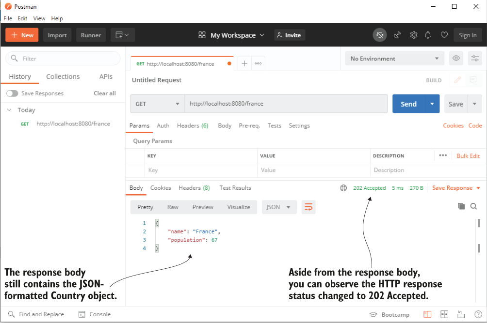

> **Hình 10.6** Khi bạn gửi HTTP request bằng cách bấm nút Send và nhận HTTP response, bạn thấy status của HTTP response là 202 Accepted. Bạn vẫn có thể thấy response body dưới dạng chuỗi định dạng JSON.

Trong tab Headers của HTTP response trong Postman, bạn cũng thấy ba response header tùy chỉnh bạn đã thêm (hình 10.7).

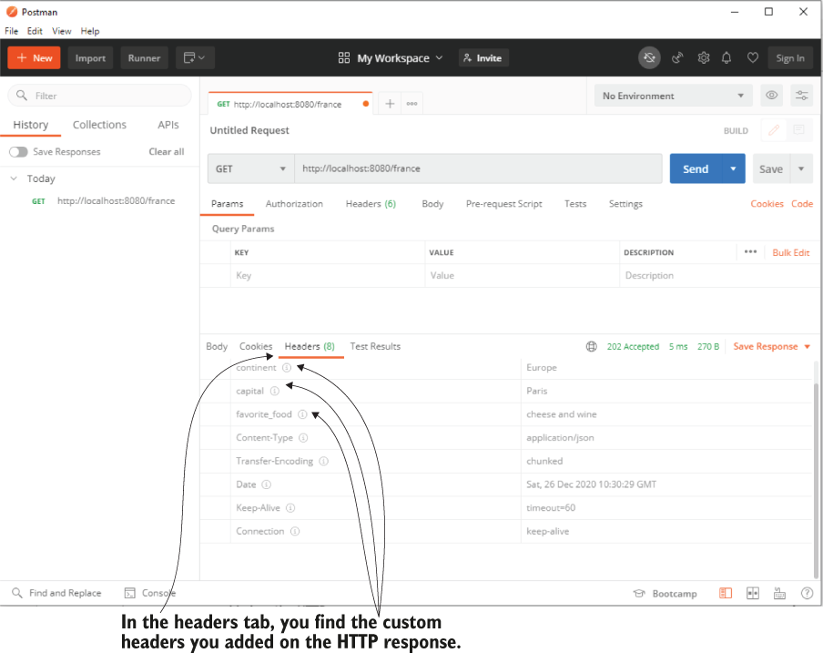

> **Hình 10.7** Để xem các header tùy chỉnh trong Postman, bạn phải chuyển đến tab Headers của HTTP response.

### 10.3.3 Quản lý exception ở cấp endpoint

Điều thiết yếu là cân nhắc điều gì xảy ra nếu action của controller ném ra exception. Trong nhiều trường hợp, chúng ta dùng exception để báo hiệu các tình huống cụ thể, một số trong đó liên quan đến logic nghiệp vụ. Giả sử bạn tạo một endpoint mà client gọi để thanh toán. Nếu người dùng không có đủ tiền trong tài khoản, ứng dụng có thể biểu diễn tình huống này bằng cách ném ra exception. Trong trường hợp này, có lẽ bạn muốn đặt một số chi tiết trên HTTP response để thông báo cho client về tình huống cụ thể đã xảy ra.

Một trong những cách bạn có thể quản lý exception là bắt chúng trong action của controller và dùng class `ResponseEntity`, như bạn đã học trong mục 10.3.2, để gửi một cấu hình response khác khi exception xảy ra.

Chúng ta sẽ bắt đầu bằng cách minh họa cách này với một ví dụ. Sau đó tôi sẽ chỉ cho bạn một cách thay thế mà tôi ưa thích, dùng class REST controller advice: một aspect chặn lời gọi endpoint khi nó ném ra exception, và bạn có thể chỉ định logic tùy chỉnh để thực thi cho exception cụ thể đó.

Hãy tạo một project mới tên là "sq-ch10-ex5". Với tình huống của chúng ta, chúng ta định nghĩa một exception tên là `NotEnoughMoneyException`, và ứng dụng sẽ ném ra exception này khi không thể hoàn thành thanh toán vì client không có đủ tiền trong tài khoản. Đoạn code tiếp theo cho thấy class định nghĩa exception:

```java
public class NotEnoughMoneyException extends RuntimeException {
}
```

Chúng ta cũng triển khai một class service định nghĩa use case. Với bài kiểm tra của chúng ta, chúng ta ném trực tiếp exception này. Trong tình huống thực tế, service sẽ triển khai logic phức tạp để thực hiện thanh toán. Đoạn code tiếp theo cho thấy class service chúng ta dùng cho bài kiểm tra:

```java
@Service
public class PaymentService {

    public PaymentDetails processPayment() {
        throw new NotEnoughMoneyException();
    }
}
```

`PaymentDetails`, kiểu trả về của method `processPayment()`, chỉ là một class model mô tả response body mà chúng ta mong đợi action của controller trả về khi thanh toán thành công. Đoạn code tiếp theo trình bày class `PaymentDetails`:

```java
public class PaymentDetails {

      private double amount;

      // Omitted getters and setters
}
```

Khi ứng dụng gặp exception, nó dùng một class model khác tên là `ErrorDetails` để thông báo cho client về tình huống. Class `ErrorDetails` cũng đơn giản và chỉ định nghĩa thông báo lỗi làm thuộc tính. Đoạn code tiếp theo trình bày class model `ErrorDetails`:

```java
public class ErrorDetails {

      private String message;

      // Omitted getters and setters
}
```

Làm sao controller có thể quyết định gửi lại đối tượng nào tùy theo cách luồng thực thi? Khi không có exception (ứng dụng hoàn thành thanh toán thành công), chúng ta muốn trả về HTTP response với status "Accepted" kiểu `PaymentDetails`. Giả sử ứng dụng gặp exception trong luồng thực thi. Trong trường hợp đó, action của controller trả về HTTP response với status "400 Bad Request" và một instance `ErrorDetails` chứa thông báo mô tả vấn đề. Hình 10.8 trình bày trực quan mối quan hệ giữa các thành phần và trách nhiệm của chúng.

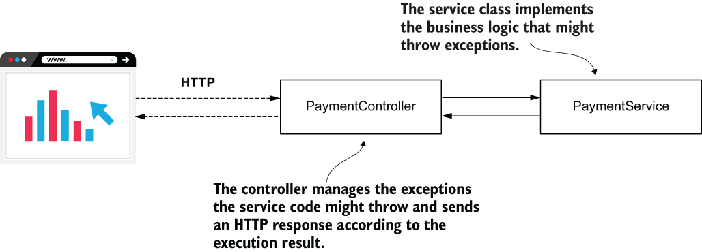

> **Hình 10.8** Class PaymentService triển khai logic nghiệp vụ có thể ném ra exception. Class PaymentController quản lý exception và gửi cho client HTTP response tùy theo kết quả thực thi.

Listing tiếp theo cho thấy logic này được triển khai bởi method của controller.

**Listing 10.8** Quản lý HTTP response cho exception trong action của controller

```java
@RestController
public class PaymentController {

    private final PaymentService paymentService;

    public PaymentController(PaymentService paymentService) {
        this.paymentService = paymentService;
    }

    @PostMapping("/payment")
    public ResponseEntity<?> makePayment() {
        try {
            PaymentDetails paymentDetails =                       ❶
              paymentService.processPayment();
            return ResponseEntity                                 ❷
                    .status(HttpStatus.ACCEPTED)
                    .body(paymentDetails);
        } catch (NotEnoughMoneyException e) {
            ErrorDetails errorDetails = new ErrorDetails();
            errorDetails.setMessage("Not enough money to make the payment.");
            return ResponseEntity                                 ❸
                    .badRequest()
                    .body(errorDetails);
        }
    }
}
```

❶ Chúng ta thử gọi method `processPayment()` của service.

❷ Nếu gọi method của service thành công, chúng ta trả về HTTP response với status Accepted và instance `PaymentDetails` làm response body.

❸ Nếu một exception kiểu `NotEnoughMoneyException` được ném ra, chúng ta trả về HTTP response với status Bad Request và một instance `ErrorDetails` làm body.

Khởi động ứng dụng và gọi endpoint bằng Postman hoặc cURL. Chúng ta biết rằng chúng ta đã làm method của service luôn ném ra `NotEnoughMoneyException`, nên chúng ta mong đợi thấy thông báo status của response là "400 Bad Request", và body chứa thông báo lỗi. Hình 10.9 trình bày kết quả của việc gửi request đến endpoint /payment trong Postman.

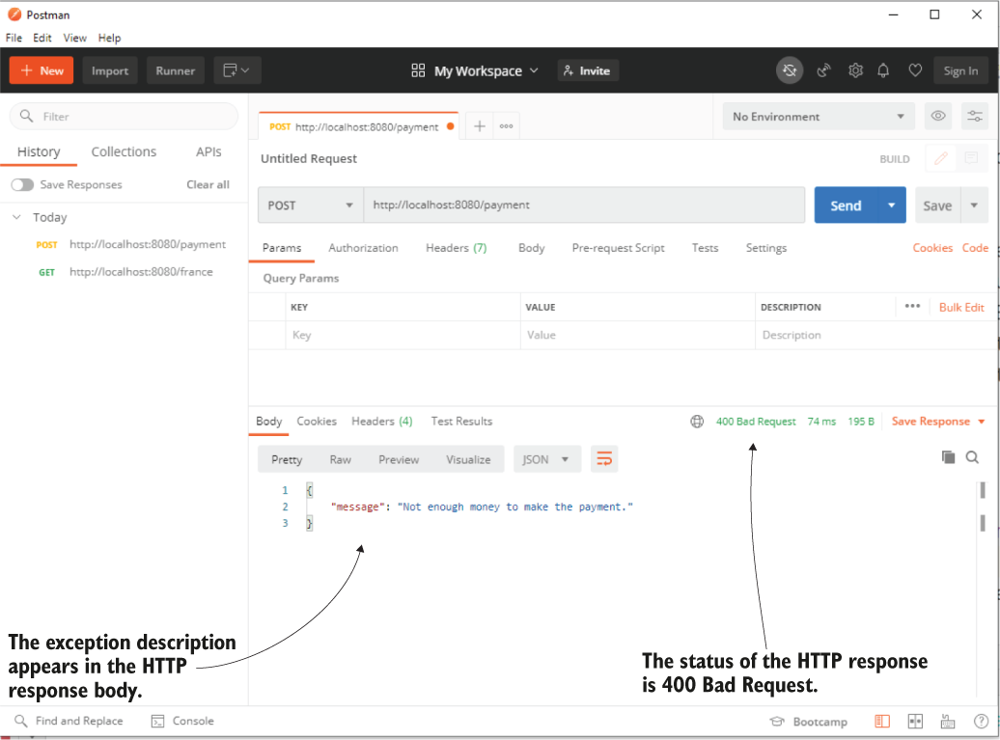

> **Hình 10.9** Gọi endpoint /payment, status của HTTP response là "400 Bad Request" và thông báo exception xuất hiện trong response body.

Cách này tốt, và bạn sẽ thường thấy các lập trình viên dùng nó để quản lý các trường hợp exception. Tuy nhiên, trong một ứng dụng phức tạp hơn, bạn sẽ thấy thoải mái hơn khi tách riêng trách nhiệm quản lý exception. Thứ nhất, đôi khi cùng một exception phải được quản lý cho nhiều endpoint, và như bạn đoán, chúng ta không muốn đưa vào code trùng lặp. Thứ hai, sẽ thoải mái hơn khi biết bạn tìm thấy toàn bộ logic exception ở một nơi khi cần hiểu một trường hợp cụ thể hoạt động thế nào. Vì những lý do này, tôi thích dùng REST controller advice, một aspect chặn các exception do action của controller ném ra và áp dụng logic tùy chỉnh bạn định nghĩa tùy theo exception bị chặn.

Hình 10.10 trình bày các thay đổi chúng ta muốn thực hiện trong thiết kế class. Hãy dành thời gian so sánh thiết kế class mới này với thiết kế trong hình 10.8.

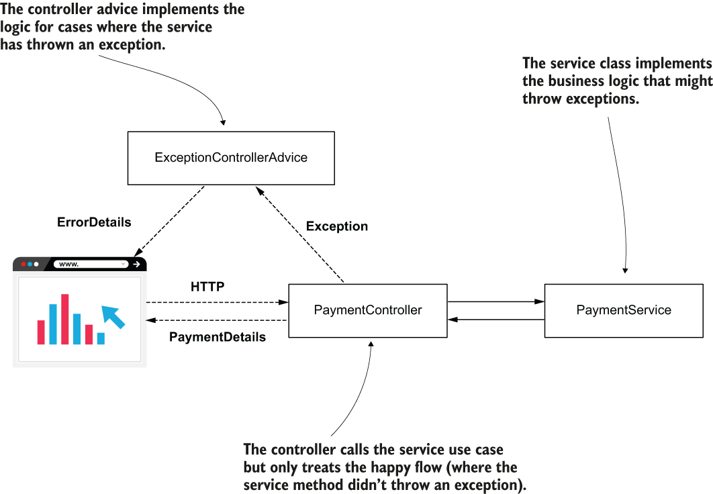

> **Hình 10.10** Thay vì quản lý các trường hợp exception, controller giờ chỉ lo happy flow. Chúng ta thêm một controller advice tên là ExceptionControllerAdvice để lo logic sẽ được triển khai nếu action của controller ném ra exception.

Trong project "sq-ch10-ex6", bạn thấy thay đổi này được triển khai. Action của controller được đơn giản hóa nhiều vì nó không còn xử lý trường hợp exception nữa, như trình bày trong listing sau.

**Listing 10.9** Action của controller không còn xử lý trường hợp exception

```java
@RestController
public class PaymentController {

     private final PaymentService paymentService;

     public PaymentController(PaymentService paymentService) {
         this.paymentService = paymentService;
     }

     @PostMapping("/payment")
     public ResponseEntity<PaymentDetails> makePayment() {
           PaymentDetails paymentDetails = paymentService.processPayment();
           return ResponseEntity
                   .status(HttpStatus.ACCEPTED)
                   .body(paymentDetails);
    }
}
```

Thay vào đó, chúng ta tạo một class riêng tên là `ExceptionControllerAdvice` triển khai điều gì xảy ra nếu action của controller ném ra `NotEnoughMoneyException`. Class `ExceptionControllerAdvice` là một REST controller advice. Để đánh dấu nó là REST controller advice, chúng ta dùng annotation `@RestControllerAdvice`. Method mà class định nghĩa cũng được gọi là exception handler. Bạn chỉ định exception nào kích hoạt một method của controller advice bằng annotation `@ExceptionHandler` phía trên method. Listing sau cho thấy định nghĩa class REST controller advice và method exception handler triển khai logic gắn với exception `NotEnoughMoneyException`.

**Listing 10.10** Tách logic exception bằng REST controller advice

```java
@RestControllerAdvice                                                      ❶
public class ExceptionControllerAdvice {

    @ExceptionHandler(NotEnoughMoneyException.class)                       ❷
    public ResponseEntity<ErrorDetails> exceptionNotEnoughMoneyHandler() {
        ErrorDetails errorDetails = new ErrorDetails();
        errorDetails.setMessage("Not enough money to make the payment.");
        return ResponseEntity
           .badRequest()
           .body(errorDetails);
    }
}
```

❶ Chúng ta dùng annotation `@RestControllerAdvice` để đánh dấu class là REST controller advice.

❷ Chúng ta dùng annotation `@ExceptionHandler` để gắn một exception với logic mà method triển khai.

> **LƯU Ý** Trong ứng dụng production, đôi khi bạn cần gửi thông tin về exception đã xảy ra, từ action của controller đến advice. Trong trường hợp này, bạn có thể thêm một tham số vào method exception handler của advice với kiểu của exception được xử lý. Spring đủ thông minh để truyền tham chiếu exception từ controller đến method exception handler của advice. Sau đó bạn có thể dùng bất kỳ chi tiết nào của instance exception trong logic của advice.

## 10.4 Dùng request body để lấy dữ liệu từ client

Trong mục này, chúng ta bàn về việc lấy dữ liệu từ client trong HTTP request body. Bạn đã học ở chương 8 rằng bạn có thể gửi dữ liệu trong HTTP request bằng request parameter và path variable. Vì REST endpoint dựa trên cùng cơ chế Spring MVC, không có gì trong các cú pháp bạn đã học ở chương 8 thay đổi về việc gửi dữ liệu trong request parameter và path variable. Bạn có thể dùng cùng các annotation và triển khai REST endpoint giống hệt như khi bạn triển khai các action của controller cho trang web.

Tuy nhiên, chúng ta chưa bàn về một điều thiết yếu: HTTP request có request body, và bạn có thể dùng nó để gửi dữ liệu từ client đến server. HTTP request body thường được dùng với REST endpoint. Như cũng đã đề cập trong phụ lục C, khi bạn cần gửi lượng dữ liệu lớn hơn (khuyến nghị của tôi là bất cứ thứ gì hơn 50 đến 100 ký tự), bạn dùng request body.

Để dùng request body, bạn chỉ cần đánh dấu một tham số của action controller bằng `@RequestBody`. Mặc định, Spring giả định bạn dùng JSON để biểu diễn tham số bạn đánh dấu và sẽ cố giải mã chuỗi JSON thành một instance của kiểu tham số. Trong trường hợp Spring không thể giải mã chuỗi định dạng JSON thành kiểu đó, ứng dụng gửi lại response với status "400 Bad Request". Trong project "sq-ch10-ex7", chúng ta triển khai một ví dụ đơn giản về việc dùng request body. Controller định nghĩa một action được ánh xạ vào đường dẫn /payment với HTTP POST và mong đợi nhận một request body kiểu `PaymentDetails`. Controller in số tiền của đối tượng `PaymentDetails` ra console của server và gửi cùng đối tượng đó trong response body trở lại client.

Listing tiếp theo cho thấy định nghĩa của controller trong project "sq-ch10-ex7".

**Listing 10.11** Lấy dữ liệu từ client trong request body

```java
@RestController
public class PaymentController {

   private static Logger logger =
      Logger.getLogger(PaymentController.class.getName());

   @PostMapping("/payment")
   public ResponseEntity<PaymentDetails> makePayment(
           @RequestBody PaymentDetails paymentDetails) {               ❶
       logger.info("Received payment " +
       paymentDetails.getAmount());                                  ❷

       return ResponseEntity                                         ❸
                    .status(HttpStatus.ACCEPTED)
                    .body(paymentDetails);
  }}
```

❶ Chúng ta lấy chi tiết thanh toán từ HTTP request body.

❷ Chúng ta ghi log số tiền thanh toán ra console của server.

❸ Chúng ta gửi lại đối tượng chi tiết thanh toán trong HTTP response body, và đặt status của HTTP response là 202 ACCEPTED.

Hình 10.11 cho bạn thấy cách dùng Postman để gọi endpoint /payment với request body.

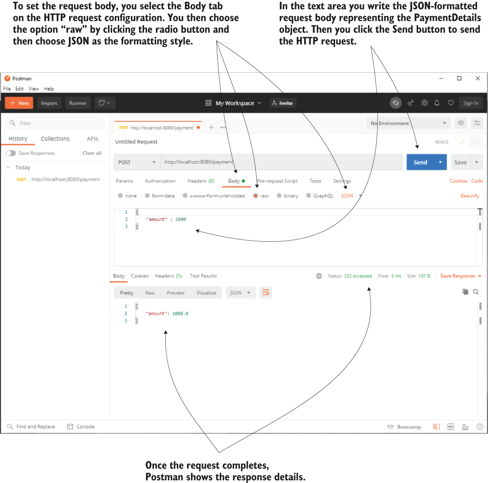

> **Hình 10.11** Dùng Postman để gọi endpoint và chỉ định request body. Bạn cần điền request body định dạng JSON vào vùng văn bản request body và chọn kiểu mã hóa dữ liệu là JSON. Khi request hoàn thành, Postman hiển thị chi tiết response.

Nếu bạn thích dùng cURL, bạn có thể dùng lệnh trình bày trong đoạn tiếp theo:

```bash
curl -v -X POST http://127.0.0.1:8080/payment -d '{"amount": 1000}' -H "Content-Type: application/json"
```

> **Một endpoint HTTP GET có thể dùng request body không?**
>
> Tôi thường nghe câu hỏi này từ học viên. Tại sao việc dùng HTTP GET với request body lại là chủ đề gây nhầm lẫn? Trước năm 2014, đặc tả giao thức HTTP không cho phép request body với các lời gọi HTTP GET. Không implementation nào ở phía client hay server cho phép bạn dùng request body với lời gọi HTTP GET.
>
> Đặc tả HTTP thay đổi vào năm 2014, và giờ nó cho phép dùng request body với lời gọi HTTP GET. Nhưng đôi khi học viên tìm thấy các bài viết cũ trên internet hoặc đọc các ấn bản sách chưa được cập nhật, và điều này dường như gây nhầm lẫn nhiều năm sau.
>
> Bạn có thể đọc thêm chi tiết về HTTP method GET trong mục 4.3.1 của đặc tả HTTP, RFC 7231: https://tools.ietf.org/html/rfc7231#page-24.

## Tóm tắt

- Representational state transfer (REST) web service là một cách đơn giản để thiết lập giao tiếp giữa hai ứng dụng.
- Trong ứng dụng Spring, cơ chế Spring MVC hỗ trợ việc triển khai REST endpoint. Bạn cần hoặc dùng annotation `@ResponseBody` để chỉ định rằng một method trả về trực tiếp response body, hoặc thay annotation `@Controller` bằng `@RestController` để triển khai REST endpoint. Nếu bạn không dùng một trong hai cách này, dispatcher servlet sẽ giả định method của controller trả về tên view và cố tìm view đó.
- Bạn có thể làm action của controller trả về trực tiếp HTTP response body và dựa vào hành vi mặc định của Spring cho HTTP status. Bạn có thể quản lý HTTP status và header bằng cách làm action của controller trả về một instance `ResponseEntity`.
- Một cách quản lý exception là xử lý chúng trực tiếp ở cấp action của controller. Cách này gắn chặt logic dùng để xử lý exception với action controller cụ thể đó. Đôi khi dùng cách này có thể dẫn đến trùng lặp code, điều tốt nhất nên tránh.
- Bạn có thể quản lý exception trực tiếp trong action của controller hoặc tách logic được thực thi nếu action của controller ném ra exception bằng cách dùng một class REST controller advice.
- Một endpoint có thể lấy dữ liệu từ client thông qua HTTP request trong request parameter, path variable, hoặc HTTP request body.
