# 11 Sử dụng các REST endpoint

**Chương này bao gồm**

- Gọi các REST endpoint bằng Spring Cloud OpenFeign
- Gọi các REST endpoint bằng RestTemplate
- Gọi các REST endpoint bằng WebClient

Trong chương 10, chúng ta đã thảo luận về việc triển khai các REST endpoint. Các REST service là một cách phổ biến để triển khai việc giao tiếp giữa hai thành phần của hệ thống. Client của một web app có thể gọi backend, và một thành phần backend khác cũng có thể làm vậy. Trong một giải pháp backend gồm nhiều service (xem phụ lục A), các thành phần này cần "nói chuyện" với nhau để trao đổi dữ liệu, vì thế khi bạn triển khai một service như vậy bằng Spring, bạn cần biết cách gọi một REST endpoint do một service khác cung cấp (hình 11.1).

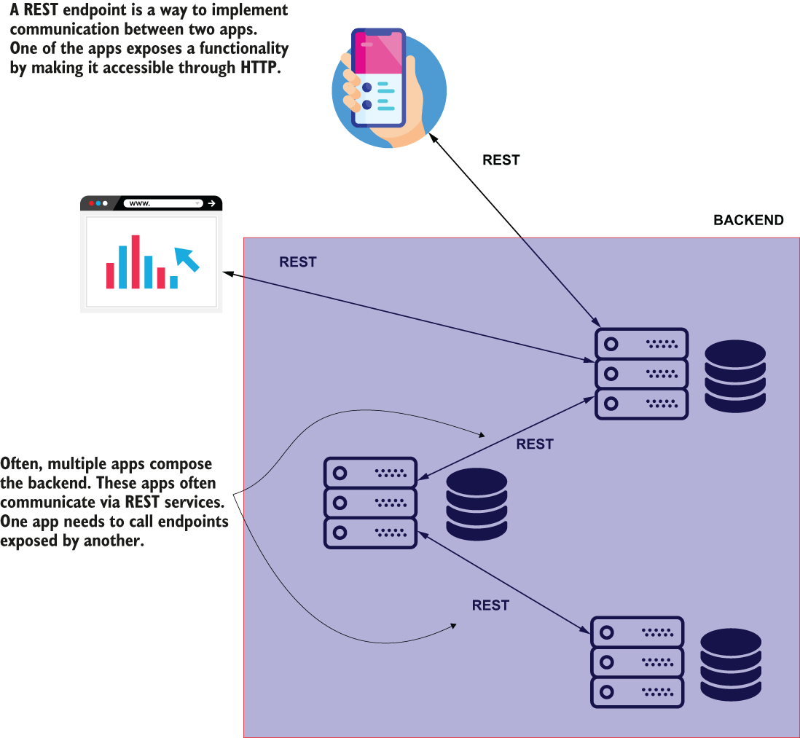

> **Hình 11.1** Thông thường, một ứng dụng backend cần đóng vai trò client cho một ứng dụng backend khác, và gọi các REST endpoint được cung cấp để làm việc với dữ liệu cụ thể.

Trong chương này, bạn sẽ học ba cách để gọi các REST endpoint từ một ứng dụng Spring:

1. OpenFeign—Một công cụ do dự án Spring Cloud cung cấp. Tôi khuyên các lập trình viên nên dùng tính năng này trong các ứng dụng mới để sử dụng các REST endpoint.
2. RestTemplate—Một công cụ nổi tiếng mà các lập trình viên đã dùng từ Spring 3 để gọi các REST endpoint. RestTemplate ngày nay vẫn thường được dùng trong các ứng dụng Spring. Tuy nhiên, như chúng ta sẽ thảo luận trong chương này, OpenFeign là một lựa chọn thay thế tốt hơn RestTemplate, vì vậy nếu bạn làm việc trên một ứng dụng mới, có lẽ bạn sẽ tránh RestTemplate và dùng OpenFeign thay thế.
3. WebClient—Một tính năng của Spring được giới thiệu như một lựa chọn thay thế cho RestTemplate. Tính năng này dùng một cách tiếp cận lập trình khác gọi là lập trình reactive (reactive programming), mà chúng ta sẽ thảo luận ở cuối chương này.

Tính năng đầu tiên của Spring mà chúng ta thảo luận, trong mục 11.1, là OpenFeign, một phần của họ Spring Cloud và là tính năng tôi khuyên dùng cho mọi triển khai mới ngày nay. Như bạn sẽ thấy, OpenFeign cung cấp một cú pháp đơn giản và làm cho việc gọi một REST endpoint từ một ứng dụng Spring trở nên dễ dàng.

Trong mục 11.2, chúng ta sẽ dùng RestTemplate. Nhưng hãy cẩn thận! RestTemplate đã được đưa vào chế độ bảo trì (maintenance mode) kể từ Spring 5, và cuối cùng nó sẽ bị đánh dấu là lỗi thời (deprecated). Vậy tại sao tôi vẫn dạy bạn về nó? Hầu hết các dự án Spring ngày nay dùng RestTemplate để gọi các REST endpoint vì chúng được bắt đầu khi đây là giải pháp duy nhất hoặc tốt nhất để triển khai tính năng như vậy. Với một số ứng dụng trong số đó, các khả năng của RestTemplate là đủ và hoạt động tốt, nên việc thay thế chúng là vô nghĩa. Đôi khi thời gian cần để thay RestTemplate bằng một giải pháp mới hơn có thể quá tốn kém, vì vậy học nó vẫn là điều bắt buộc đối với một lập trình viên Spring.

Đây là một sự thật thú vị thường gây bối rối cho học viên. Trong tài liệu của RestTemplate (http://mng.bz/7lWe), WebClient được đưa ra như một khuyến nghị để thay thế cho việc dùng RestTemplate. Trong mục 11.3, tôi sẽ giải thích tại sao dùng WebClient không phải lúc nào cũng là lựa chọn thay thế tốt nhất cho RestTemplate. Chúng ta sẽ thảo luận về WebClient và làm rõ khi nào thì tốt nhất nên dùng tính năng này.

Để dạy bạn ba cách cơ bản này, chúng ta sẽ viết một ví dụ cho mỗi cách. Trước tiên chúng ta sẽ triển khai một dự án cung cấp một endpoint. Mục đích của chúng ta là gọi endpoint đó theo từng cách tiếp cận mà chúng ta thảo luận trong chương này: OpenFeign, RestTemplate và WebClient.

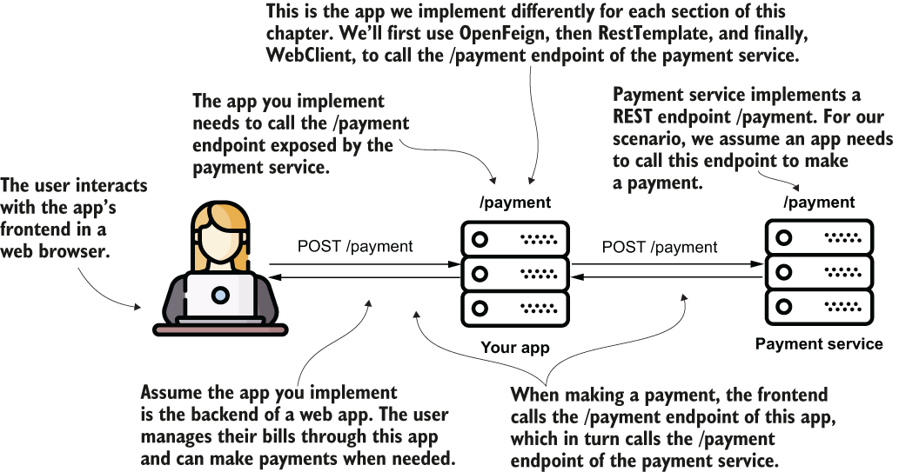

> **Hình 11.2** Để dạy bạn đúng cách gọi các REST endpoint, chúng ta sẽ triển khai vài ví dụ. Với mỗi ví dụ, chúng ta triển khai hai dự án. Một dự án cung cấp một REST endpoint. Dự án thứ hai minh họa việc triển khai gọi REST endpoint đó bằng OpenFeign, RestTemplate và WebClient.

Giả sử bạn triển khai một ứng dụng cho phép người dùng thực hiện thanh toán. Để thực hiện một thanh toán, bạn cần gọi một endpoint của một hệ thống khác. Hình 11.2 trình bày trực quan kịch bản này. Hình 11.3 mô tả chi tiết kịch bản, thể hiện các chi tiết của request và response.

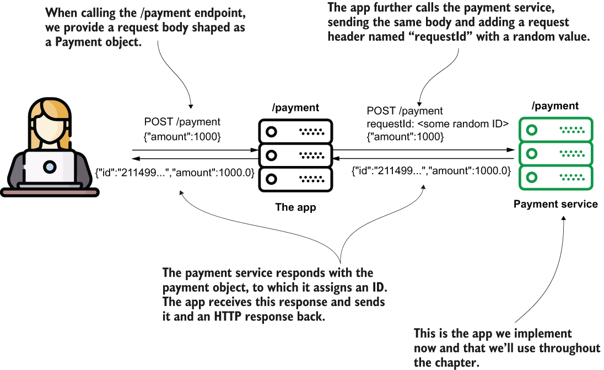

> **Hình 11.3** Payment service cung cấp một endpoint yêu cầu một HTTP request body. Ứng dụng dùng OpenFeign, RestTemplate hoặc WebClient để gửi các request đến endpoint mà payment service cung cấp.

Với dự án đầu tiên này, chúng ta triển khai ứng dụng payment service. Chúng ta sẽ dùng ứng dụng này trong tất cả các ví dụ tiếp theo.

Hãy tạo dự án "sq-ch11-payments," đại diện cho payments service. Đây là một web app, vì vậy, giống như tất cả các dự án chúng ta đã thảo luận trong các chương 7 đến 10, chúng ta cần thêm vào file `pom.xml` dependency web, như trình bày trong đoạn code sau:

```xml
<dependency>
    <groupId>org.springframework.boot</groupId>
    <artifactId>spring-boot-starter-web</artifactId>
</dependency>
```

Chúng ta sẽ mô hình hóa thanh toán bằng class `Payment`, như trình bày trong đoạn code sau:

```java
public class Payment {
   private String id;
   private double amount;
 // Omitted getters and setters
}
```

Listing 11.1 cho thấy phần triển khai của endpoint trong class controller. Về mặt kỹ thuật, nó không làm gì nhiều. Method nhận một instance `Payment` và gán một ID ngẫu nhiên cho thanh toán trước khi trả về nó. Endpoint này đơn giản nhưng đủ tốt cho phần minh họa của chúng ta. Chúng ta dùng HTTP POST. Chúng ta cần chỉ định một request header và request body. Khi được gọi, endpoint trả về một header trong HTTP response và đối tượng `Payment` trong response body.

**Listing 11.1** Phần triển khai của endpoint /payment trong class controller

```java
@RestController
public class PaymentsController {

     private static Logger logger =                                      ❶
         Logger.getLogger(PaymentsController.class.getName());

     @PostMapping("/payment")                                            ❷
     public ResponseEntity<Payment> createPayment(
           @RequestHeader String requestId,                              ❸
           @RequestBody Payment payment                                  ❸
     ) {
         logger.info("Received request with ID " + requestId +
             " ;Payment Amount: " + payment.getAmount());

         payment.setId(UUID.randomUUID().toString());                    ❹

         return ResponseEntity                                           ❺
             .status(HttpStatus.OK)
             .header("requestId", requestId)
             .body(payment);
     }

}
```

❶ Chúng ta dùng một logger để chứng minh method đúng của controller nhận được dữ liệu chính xác khi endpoint được gọi.  
❷ Ứng dụng cung cấp endpoint với HTTP POST tại đường dẫn /payment.  
❸ Endpoint cần nhận một request header và request body từ bên gọi. Method của controller nhận hai chi tiết này dưới dạng tham số.  
❹ Method gán một giá trị ngẫu nhiên cho ID của thanh toán.  
❺ Hành động của controller trả về HTTP response. Response có một header và response body chứa thanh toán với giá trị ID ngẫu nhiên đã được gán.

Bây giờ bạn có thể chạy ứng dụng này, và nó sẽ khởi động Tomcat trên port 8080, là giá trị mặc định của Spring Boot, như chúng ta đã thảo luận trong chương 7. Endpoint đã có thể truy cập được, và bạn có thể gọi nó bằng cURL hoặc Postman. Nhưng mục đích của chương này là học cách triển khai một ứng dụng gọi endpoint đó, vì vậy đây chính xác là điều chúng ta sẽ làm trong các mục 11.1, 11.2 và 11.3.

## 11.1 Gọi các REST endpoint bằng Spring Cloud OpenFeign

Trong mục này, chúng ta thảo luận về một cách tiếp cận hiện đại để gọi các REST endpoint từ một ứng dụng Spring. Trong hầu hết các ứng dụng, các lập trình viên đã dùng RestTemplate (mà chúng ta sẽ thảo luận trong mục 11.2). Như đã đề cập ở đầu chương này, RestTemplate đang ở chế độ bảo trì kể từ Spring 5. Hơn nữa, RestTemplate sẽ sớm bị đánh dấu là lỗi thời, vì vậy tôi muốn bắt đầu chương này bằng việc thảo luận về lựa chọn thay thế cho RestTemplate mà tôi khuyên bạn dùng: OpenFeign.

Với OpenFeign, như bạn sẽ thấy trong ví dụ chúng ta viết ở mục này, bạn chỉ cần viết một interface, và công cụ này sẽ cung cấp cho bạn phần triển khai.

Để dạy bạn cách OpenFeign hoạt động, chúng ta sẽ tạo dự án "sq-ch11-ex1" và triển khai một ứng dụng dùng OpenFeign để gọi endpoint mà ứng dụng "sq-ch11-payments" cung cấp (hình 11.4).

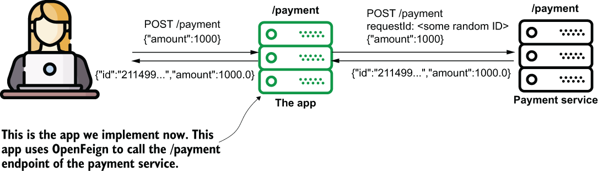

> **Hình 11.4** Bây giờ chúng ta triển khai ứng dụng sử dụng endpoint /payment mà payment service cung cấp. Chúng ta dùng OpenFeign để triển khai chức năng sử dụng REST endpoint.

Chúng ta sẽ định nghĩa một interface, trong đó chúng ta khai báo các method sử dụng các REST endpoint. Điều duy nhất chúng ta cần làm là gắn annotation cho các method này để định nghĩa đường dẫn, HTTP method, và có thể cả các tham số, header và body của request. Điều thú vị là chúng ta không cần tự triển khai các method đó. Bạn định nghĩa các method của interface dựa trên các annotation, và Spring biết cách triển khai chúng. Chúng ta lại một lần nữa dựa vào phép màu tuyệt vời của Spring.

Hình 11.5 cho thấy thiết kế class của ứng dụng chúng ta sẽ xây dựng để sử dụng một REST endpoint.

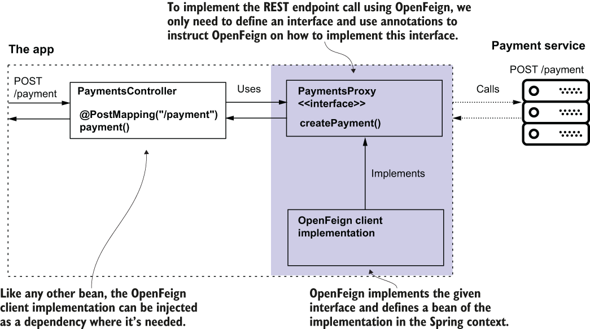

> **Hình 11.5** Với OpenFeign, bạn chỉ cần định nghĩa một interface (một hợp đồng) và cho OpenFeign biết nơi tìm hợp đồng này để triển khai nó. OpenFeign triển khai interface và cung cấp phần triển khai dưới dạng một bean trong Spring context dựa trên các cấu hình bạn định nghĩa bằng annotation. Bạn có thể inject bean này từ Spring context vào bất cứ nơi nào bạn cần trong ứng dụng.

File `pom.xml` của bạn cần định nghĩa dependency, như đoạn code sau cho thấy:

```xml
<dependency>
   <groupId>org.springframework.cloud</groupId>
   <artifactId>spring-cloud-starter-openfeign</artifactId>
</dependency>
```

Khi đã có dependency, bạn có thể tạo interface proxy (như trình bày trong hình 11.5). Trong thuật ngữ của OpenFeign, chúng ta cũng gọi interface này là OpenFeign client. OpenFeign triển khai interface này, vì vậy bạn không phải bận tâm viết code gọi endpoint. Bạn chỉ cần dùng vài annotation để cho OpenFeign biết cách gửi request. Listing sau cho bạn thấy việc định nghĩa request với OpenFeign đơn giản đến mức nào.

**Listing 11.2** Khai báo một interface OpenFeign client

```java
@FeignClient(name = "payments",           ❶
             url = "${name.service.url}")
public interface PaymentsProxy {

    @PostMapping("/payment")                          ❷
    Payment createPayment(
        @RequestHeader String requestId,              ❸
        @RequestBody Payment payment);                ❸

}
```

❶ Chúng ta dùng annotation @FeignClient để cấu hình REST client. Một cấu hình tối thiểu định nghĩa một tên và URI gốc của endpoint.  
❷ Chúng ta chỉ định đường dẫn và HTTP method của endpoint.  
❸ Chúng ta định nghĩa các request header và body.

Việc đầu tiên cần làm là gắn annotation `@FeignClient` cho interface để cho OpenFeign biết nó phải cung cấp phần triển khai cho hợp đồng này. Chúng ta phải gán một tên cho proxy bằng thuộc tính `name` của annotation `@FeignClient`, tên này được OpenFeign dùng nội bộ. Tên đó định danh duy nhất client trong ứng dụng của bạn. Annotation `@FeignClient` cũng là nơi chúng ta chỉ định URI gốc của request. Bạn có thể định nghĩa URI gốc dưới dạng một chuỗi bằng thuộc tính `url` của `@FeignClient`.

> **LƯU Ý** Hãy đảm bảo bạn luôn lưu các URI và những chi tiết khác có thể khác nhau giữa các môi trường trong các properties file và không bao giờ hardcode chúng trong ứng dụng.

Bạn có thể định nghĩa một property trong file "application.properties" của dự án và tham chiếu nó từ mã nguồn bằng cú pháp sau: `${property_name}`. Với thực hành này, bạn không cần biên dịch lại code khi muốn chạy ứng dụng trong các môi trường khác nhau.

Mỗi method bạn khai báo trong interface đại diện cho một lời gọi REST endpoint. Bạn dùng cùng các annotation đã học trong chương 10 cho các hành động của controller để cung cấp các REST endpoint:

- Để chỉ định đường dẫn và HTTP method: `@GetMapping`, `@PostMapping`, `@PutMapping`, v.v.
- Để chỉ định một request header: `@RequestHeader`
- Để chỉ định request body: `@RequestBody`

Tôi thấy khía cạnh tái sử dụng annotation này rất có lợi. Ở đây, "tái sử dụng annotation" nghĩa là OpenFeign dùng cùng các annotation mà chúng ta dùng khi định nghĩa các endpoint. Bạn không phải học thứ gì đặc thù của OpenFeign. Chỉ cần dùng cùng các annotation như khi cung cấp các REST endpoint trong các class controller của Spring MVC.

OpenFeign cần biết nơi tìm các interface định nghĩa các hợp đồng client. Chúng ta dùng annotation `@EnableFeignClients` trên một class cấu hình để bật chức năng OpenFeign và cho OpenFeign biết nơi tìm kiếm các hợp đồng client. Trong listing sau, bạn thấy class cấu hình của dự án, nơi chúng ta bật các OpenFeign client.

**Listing 11.3** Bật các OpenFeign client trong class cấu hình

```java
@Configuration
@EnableFeignClients(                                  ❶
   basePackages = "com.example.proxy")
public class ProjectConfig {
}
```

❶ Chúng ta bật các OpenFeign client và cho dependency OpenFeign biết nơi tìm kiếm các hợp đồng proxy.

Bây giờ bạn có thể inject OpenFeign client thông qua interface bạn đã định nghĩa trong listing 11.2. Khi bạn bật OpenFeign, nó biết cách triển khai các interface được gắn annotation `@FeignClient`. Trong chương 5, chúng ta đã thảo luận rằng Spring đủ thông minh để cung cấp cho bạn một instance bean từ context của nó khi bạn dùng một abstraction, và đây chính xác là điều bạn làm ở đây. Listing sau cho bạn thấy class controller inject FeignClient.

**Listing 11.4** Inject và sử dụng OpenFeign client

```java
@RestController
public class PaymentsController {

  private final PaymentsProxy paymentsProxy;
    public PaymentsController(PaymentsProxy paymentsProxy) {
        this.paymentsProxy = paymentsProxy;
    }

    @PostMapping("/payment")
    public Payment createPayment(
          @RequestBody Payment payment
          ) {
        String requestId = UUID.randomUUID().toString();
        return paymentsProxy.createPayment(requestId, payment);
    }
}
```

Bây giờ hãy khởi động cả hai dự án (payments service và ứng dụng của mục này) và gọi endpoint /payment của ứng dụng bằng cURL hoặc Postman. Dùng cURL, lệnh request trông như đoạn sau:

```bash
curl -X POST -H 'content-type:application/json' -d '{"amount":1000}'
➥ http://localhost:9090/payment
```

Trong console nơi bạn thực thi lệnh cURL, bạn sẽ thấy một response, như trình bày trong đoạn sau:

```json
{"id":"1c518ead-2477-410f-82f3-54533b4058ff","amount":1000.0}
```

Trong console của payment service, bạn thấy log chứng minh ứng dụng đã gửi request đúng đến payment service:

```text
Received request with ID 1c518ead-2477-410f-82f3-54533b4058ff ;Payme
➥ Amount: 1000.0
```

## 11.2 Gọi các REST endpoint bằng RestTemplate

Trong mục này, chúng ta lại triển khai ứng dụng gọi endpoint /payment của payment service, nhưng lần này chúng ta dùng một cách tiếp cận khác: RestTemplate.

Tôi không muốn bạn kết luận rằng RestTemplate có vấn đề gì. Nó bị "cho ngủ yên" không phải vì nó hoạt động không đúng hay vì nó không phải là một công cụ tốt. Nhưng khi các ứng dụng phát triển, chúng ta bắt đầu cần nhiều khả năng hơn. Các lập trình viên muốn được hưởng lợi từ nhiều thứ khác nhau mà không dễ triển khai với RestTemplate, chẳng hạn như sau:

- Gọi các endpoint theo cả hai cách đồng bộ và bất đồng bộ
- Viết ít code hơn và xử lý ít exception hơn (loại bỏ boilerplate code)
- Thử lại (retry) việc thực thi lời gọi và triển khai các thao tác dự phòng (fallback) (logic được thực hiện khi ứng dụng không thể thực thi một lời gọi REST cụ thể vì bất kỳ lý do gì)

Nói cách khác, các lập trình viên thích có sẵn nhiều thứ hơn thay vì phải tự triển khai chúng bất cứ khi nào có thể. Hãy nhớ rằng tái sử dụng code và tránh boilerplate code là một trong những mục đích chính của framework, như đã thảo luận trong chương 1. Bạn sẽ có cơ hội so sánh các ví dụ chúng ta triển khai trong mục 11.1 và 11.2 và nhận thấy rằng dùng OpenFeign dễ hơn nhiều so với dùng RestTemplate.

> **LƯU Ý** Đây là một bài học hay tôi rút ra từ kinh nghiệm của mình: Khi thứ gì đó bị gọi là "deprecated" (lỗi thời) hay "legacy" (cũ), điều đó không nhất thiết có nghĩa là bạn không nên học nó. Đôi khi, các công nghệ lỗi thời vẫn được dùng trong các dự án nhiều năm sau khi bị tuyên bố là lỗi thời, bao gồm RestTemplate và dự án Spring Security OAuth.

Các bước để định nghĩa lời gọi như sau (hình 11.6):

1. Định nghĩa các HTTP header bằng cách tạo và cấu hình một instance `HttpHeaders`.
2. Tạo một instance `HttpEntity` đại diện cho dữ liệu request (các header và body).
3. Gửi lời gọi HTTP bằng method `exchange()` và nhận HTTP response.

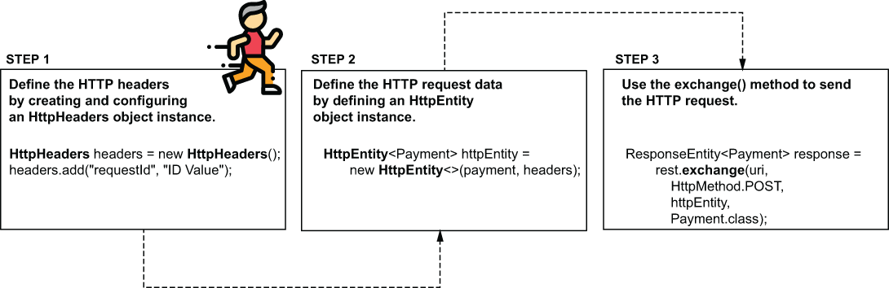

> **Hình 11.6** Để định nghĩa một HTTP request phức tạp hơn, bạn phải dùng class HttpHeaders để định nghĩa các header, rồi dùng class HttpEntity để đại diện cho toàn bộ dữ liệu request. Khi đã định nghĩa xong dữ liệu trên request, bạn gọi method exchange() để gửi nó.

Chúng ta bắt đầu triển khai ví dụ này trong dự án "sq-ch11-ex2." Trong listing 11.5, bạn thấy định nghĩa của class proxy. Hãy quan sát cách method `createPayment()` định nghĩa header bằng cách tạo một instance `HttpHeaders` và thêm header cần thiết "requestId" vào instance này bằng method `add()`. Sau đó nó tạo một instance `HttpEntity` dựa trên các header và body (mà method nhận được dưới dạng tham số). Method sau đó gửi HTTP request bằng method `exchange()` của RestTemplate. Các tham số của method `exchange()` là URI và HTTP method, tiếp theo là instance `HttpEntity` (chứa dữ liệu request) và kiểu mong đợi cho response body.

**Listing 11.5** PaymentsProxy của ứng dụng gọi endpoint /payment

```java
@Component
public class PaymentsProxy {

    private final RestTemplate rest;

    @Value("${name.service.url}")
    private String paymentsServiceUrl;                          ❶

    public PaymentsProxy(RestTemplate rest) {                   ❷
        this.rest = rest;
    }

    public Payment createPayment(Payment payment) {
        String uri = paymentsServiceUrl + "/payment";

        HttpHeaders headers = new HttpHeaders();                ❸
        headers.add("requestId",                                ❸
                    UUID.randomUUID().toString());              ❸

        HttpEntity<Payment> httpEntity =                        ❹
          new HttpEntity<>(payment, headers);

        ResponseEntity<Payment> response =                      ❺
            rest.exchange(uri,                                  ❺
                HttpMethod.POST,                                ❺
                httpEntity,                                     ❺
                Payment.class);                                 ❺

        return response.getBody();                              ❻
    }
}
```

❶ Chúng ta lấy URL đến payment service từ properties file.  
❷ Chúng ta inject RestTemplate từ Spring context bằng DI qua constructor.  
❸ Chúng ta xây dựng đối tượng HttpHeaders để định nghĩa các HTTP request header.  
❹ Chúng ta xây dựng đối tượng HttpEntity để định nghĩa dữ liệu request.  
❺ Chúng ta gửi HTTP request và lấy dữ liệu trên HTTP response.  
❻ Chúng ta trả về HTTP response body.

Chúng ta định nghĩa một endpoint đơn giản để gọi phần triển khai này, giống như đã làm với endpoint nhỏ mà chúng ta đã gọi trong mục 11.1.1. Listing sau cho bạn thấy cách định nghĩa class controller.

**Listing 11.6** Định nghĩa một class controller để kiểm thử phần triển khai

```java
@RestController
public class PaymentsController {

    private final PaymentsProxy paymentsProxy;

    public PaymentsController(PaymentsProxy paymentsProxy) {
        this.paymentsProxy = paymentsProxy;
    }

    @PostMapping("/payment")                                       ❶
    public Payment createPayment(
          @RequestBody Payment payment                             ❷
          ) {
        return paymentsProxy.createPayment(payment);               ❸
    }
}
```

❶ Chúng ta định nghĩa một hành động của controller và ánh xạ nó tới đường dẫn /payment.  
❷ Chúng ta nhận dữ liệu thanh toán dưới dạng request body.  
❸ Chúng ta gọi method của proxy, method này lại gọi endpoint của payments service. Chúng ta nhận response body và trả body đó về cho client.

Chúng ta chạy cả hai ứng dụng, payments service ("sq-ch11-payments") và ứng dụng của mục này ("sq-ch11-ex2"), trên các port khác nhau để xác nhận phần triển khai của chúng ta hoạt động như mong đợi. Với ví dụ này, tôi giữ nguyên cấu hình từ mục 11.1.1: port 8080 cho payment service và port 9090 cho ứng dụng của mục này. Dùng cURL, bạn có thể gọi endpoint của ứng dụng, như trình bày trong đoạn sau:

```bash
curl -X POST -H 'content-type:application/json' -d '{"amount":1000}'
➥ http://localhost:9090/payment
```

Trong console nơi bạn thực thi lệnh cURL, bạn sẽ thấy một response, như trình bày trong đoạn sau:

```json
{
    "id":"21149959-d93d-41a4-a0a3-426c6fd8f9e9",
    "amount":1000.0
}
```

Trong console của payment service, bạn thấy log chứng minh ứng dụng đã gửi request đúng đến payment service:

```text
Received request with ID e02b5c7a-c683-4a77-bd0e-38fe76c145cf ;Payme
➥ Amount: 1000.0
```

## 11.3 Gọi các REST endpoint bằng WebClient

Trong mục này, chúng ta thảo luận về việc dùng WebClient để gọi các REST endpoint. WebClient là một công cụ được dùng trong nhiều ứng dụng khác nhau và được xây dựng trên một phương pháp luận mà chúng ta gọi là cách tiếp cận reactive. Phương pháp reactive là một cách tiếp cận nâng cao, và tôi khuyên bạn nên nghiên cứu nó khi đã nắm vững các kiến thức cơ bản. Một điểm khởi đầu tốt là đọc chương 12 và 13 của cuốn Spring in Action, ấn bản thứ 6, của Craig Walls (Manning, 2021).

Tài liệu của Spring khuyến nghị dùng WebClient, nhưng đó chỉ là khuyến nghị hợp lệ cho các ứng dụng reactive. Nếu bạn không viết một ứng dụng reactive, hãy dùng OpenFeign thay thế. Giống như mọi thứ khác trong phần mềm, nó phù hợp với một số trường hợp, nhưng có thể làm phức tạp mọi thứ với những trường hợp khác. Việc chọn WebClient để triển khai các lời gọi REST endpoint gắn chặt với việc làm cho ứng dụng của bạn trở thành reactive.

> **LƯU Ý** Nếu bạn quyết định không triển khai một ứng dụng reactive, hãy dùng OpenFeign để triển khai các khả năng REST client. Nếu bạn triển khai một ứng dụng reactive, bạn nên dùng một công cụ reactive đúng nghĩa: WebClient.

Mặc dù các ứng dụng reactive hơi vượt quá phạm vi kiến thức cơ bản, tôi muốn đảm bảo bạn biết việc dùng WebClient trông như thế nào và công cụ này khác với những công cụ khác chúng ta đã thảo luận ra sao, để bạn có thể so sánh các cách tiếp cận. Hãy để tôi kể về các ứng dụng reactive rồi sau đó dùng WebClient để gọi endpoint /payment mà chúng ta đã dùng làm ví dụ trong mục 11.1 và 11.2.

Trong một ứng dụng không reactive (nonreactive), một thread thực thi một luồng nghiệp vụ. Nhiều tác vụ hợp thành một luồng nghiệp vụ, nhưng các tác vụ này không độc lập. Cùng một thread thực thi tất cả các tác vụ hợp thành một luồng. Hãy lấy một ví dụ để quan sát xem cách tiếp cận này có thể gặp vấn đề ở đâu và chúng ta có thể cải thiện nó như thế nào.

Giả sử bạn triển khai một ứng dụng ngân hàng, trong đó một khách hàng của ngân hàng có một hoặc nhiều tài khoản tín dụng. Thành phần hệ thống bạn triển khai tính tổng nợ của một khách hàng của ngân hàng. Để dùng chức năng này, các thành phần khác của hệ thống thực hiện một lời gọi REST để gửi một ID duy nhất của người dùng. Để tính giá trị này, luồng bạn triển khai bao gồm các bước sau (hình 11.7):

1. Ứng dụng nhận ID người dùng.
2. Nó gọi một service khác của hệ thống để tìm hiểu xem người dùng có khoản tín dụng với các tổ chức khác hay không.
3. Nó gọi một service khác của hệ thống để lấy khoản nợ cho các khoản tín dụng nội bộ.
4. Nếu người dùng có nợ bên ngoài, nó gọi một service bên ngoài để tìm hiểu khoản nợ bên ngoài.
5. Ứng dụng cộng các khoản nợ và trả về giá trị trong một HTTP response.

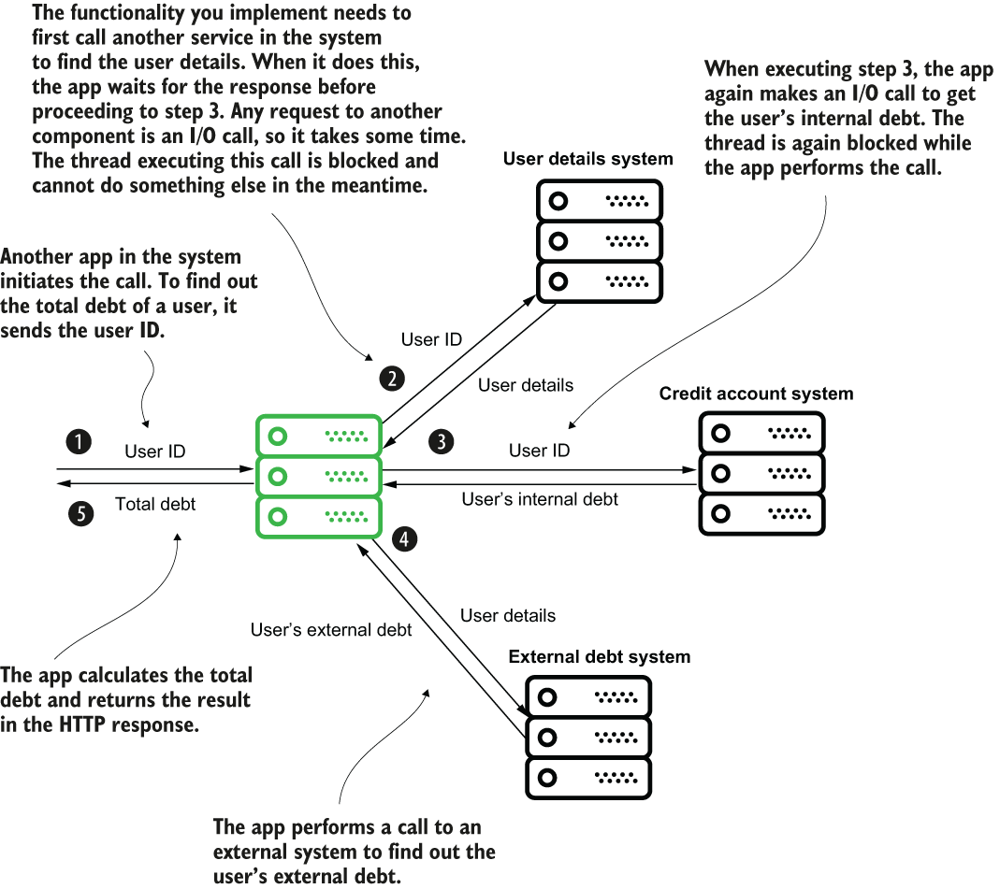

> **Hình 11.7** Một kịch bản chức năng để minh họa sự hữu ích của cách tiếp cận reactive. Một ứng dụng ngân hàng cần gọi vài ứng dụng khác để tính tổng nợ của một người dùng. Do các lời gọi này, thread thực thi request bị chặn (block) nhiều lần trong khi chờ các thao tác I/O hoàn tất.

Đây chỉ là các bước chức năng giả tưởng, nhưng tôi thiết kế chúng để chứng minh nơi mà việc dùng một ứng dụng reactive có thể hữu ích. Hãy phân tích các bước này sâu hơn. Hình 11.8 trình bày việc thực thi kịch bản từ góc nhìn của thread. Ứng dụng tạo một thread mới cho mỗi request, và thread này thực thi các bước lần lượt từng bước một. Thread phải chờ một bước hoàn tất trước khi chuyển sang bước tiếp theo và bị chặn mỗi lần nó chờ ứng dụng thực hiện một lời gọi I/O.

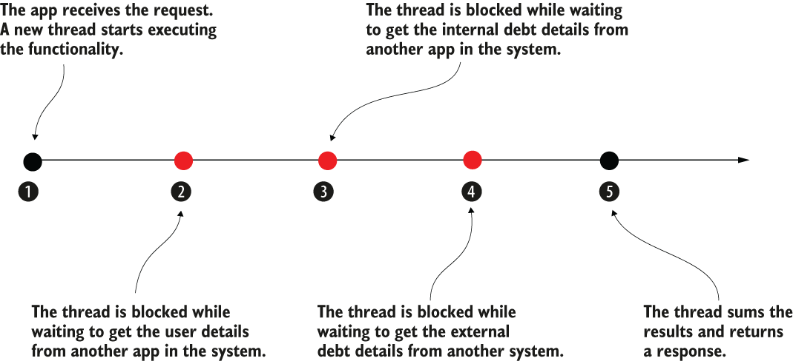

> **Hình 11.8** Việc thực thi chức năng của kịch bản từ góc nhìn của thread. Mũi tên đại diện cho dòng thời gian của thread. Một số bước khiến thread bị chặn, nó phải chờ tác vụ hoàn tất trước khi tiếp tục.

Chúng ta nhận thấy hai vấn đề đáng kể ở đây:

1. Thread ở trạng thái rảnh (idle) trong khi một lời gọi I/O chặn nó. Thay vì sử dụng thread, chúng ta để nó nằm đó và chiếm bộ nhớ của ứng dụng. Chúng ta tiêu tốn tài nguyên mà không thu được lợi ích gì. Với cách tiếp cận như vậy, bạn có thể gặp các trường hợp ứng dụng nhận 10 request cùng lúc, nhưng tất cả các thread đều đồng thời rảnh trong khi chờ thông tin từ các hệ thống khác.
2. Một số tác vụ không phụ thuộc lẫn nhau. Ví dụ, ứng dụng có thể thực thi bước 2 và bước 3 cùng lúc. Không có lý do gì để ứng dụng chờ bước 2 kết thúc rồi mới thực thi bước 3. Cuối cùng, ứng dụng chỉ cần kết quả của cả hai để tính tổng nợ.

Các ứng dụng reactive thay đổi ý tưởng về việc có một luồng nguyên tử (atomic) trong đó một thread thực thi tất cả các tác vụ của nó từ đầu đến cuối. Với các ứng dụng reactive, chúng ta coi các tác vụ là độc lập, và nhiều thread có thể cộng tác để hoàn thành một luồng gồm nhiều tác vụ.

Thay vì hình dung chức năng này như các bước trên một dòng thời gian, hãy hình dung nó như một backlog các tác vụ và một đội lập trình viên giải quyết chúng. Với phép so sánh này, tôi sẽ giúp bạn hình dung cách một ứng dụng reactive hoạt động: các lập trình viên là các thread, và các tác vụ trong backlog là các bước của một chức năng.

Hai lập trình viên có thể triển khai hai tác vụ khác nhau cùng lúc nếu chúng không phụ thuộc lẫn nhau. Nếu một lập trình viên bị kẹt ở một tác vụ vì một phụ thuộc bên ngoài, họ có thể tạm thời rời khỏi nó và làm việc khác. Cùng lập trình viên đó có thể quay lại tác vụ khi nó không còn bị chặn nữa, hoặc một lập trình viên khác có thể hoàn thành việc giải quyết nó (hình 11.9).

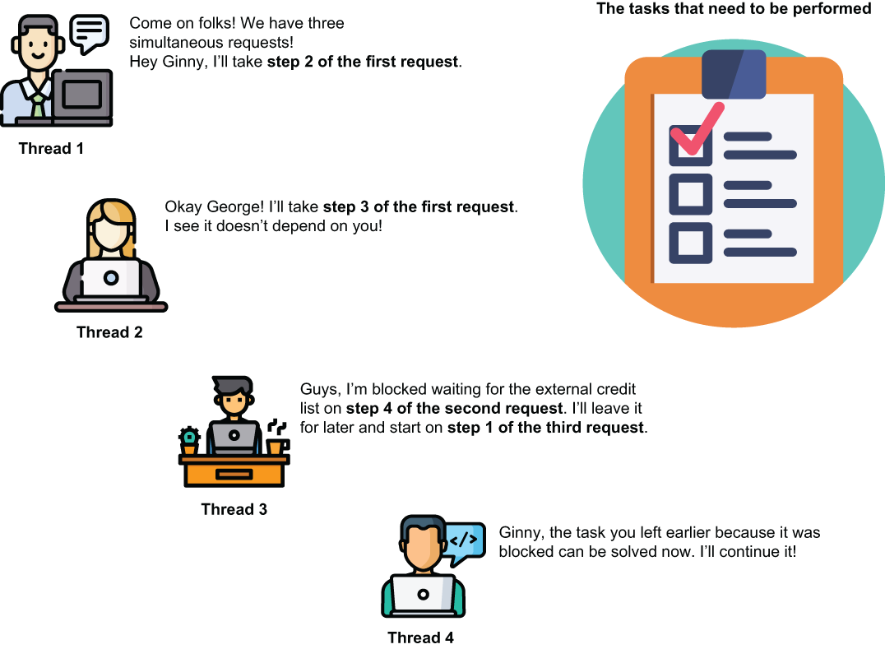

> **Hình 11.9** Một phép so sánh về cách một ứng dụng reactive hoạt động. Một thread không nhận các tác vụ của một request theo thứ tự rồi chờ khi bị chặn. Thay vào đó, tất cả các tác vụ từ tất cả các request đều nằm trong một backlog. Bất kỳ thread nào đang rảnh đều có thể làm việc trên các tác vụ của bất kỳ request nào. Bằng cách này, các tác vụ độc lập có thể được giải quyết song song, và các thread không bị rảnh.

Với cách tiếp cận này, bạn không cần một thread cho mỗi request. Bạn có thể giải quyết nhiều request với ít thread hơn vì các thread không phải ở trạng thái rảnh. Khi bị chặn ở một tác vụ nào đó, thread rời khỏi nó và làm việc trên một tác vụ khác không bị chặn.

Về mặt kỹ thuật, trong một ứng dụng reactive, chúng ta triển khai một luồng bằng cách định nghĩa các tác vụ và các phụ thuộc giữa chúng. Đặc tả ứng dụng reactive cung cấp cho chúng ta hai thành phần: producer (bên sản xuất) và subscriber (bên đăng ký) để triển khai các phụ thuộc giữa các tác vụ.

Một tác vụ trả về một producer để cho phép các tác vụ khác đăng ký (subscribe) vào nó, đánh dấu sự phụ thuộc của chúng vào tác vụ đó. Một tác vụ dùng một subscriber để gắn vào producer của một tác vụ khác và tiêu thụ kết quả của tác vụ đó khi nó kết thúc.

Hình 11.10 cho thấy kịch bản đã thảo luận được triển khai theo cách tiếp cận reactive. Hãy dành vài phút để so sánh hình này với hình 11.8. Thay vì là các bước trên một dòng thời gian, các tác vụ độc lập với bất kỳ thread nào và khai báo các phụ thuộc của chúng. Nhiều thread có thể thực thi các tác vụ này, và không thread nào phải chờ một tác vụ khi một giao tiếp I/O chặn nó. Thread có thể bắt đầu thực thi một tác vụ khác. Hơn nữa, các tác vụ không phụ thuộc lẫn nhau có thể được thực thi đồng thời. Trong hình 11.10, các tác vụ C và D, vốn ban đầu là bước 2 và 3 trong thiết kế không reactive, giờ đây có thể được thực thi đồng thời, giúp ứng dụng có hiệu năng cao hơn.

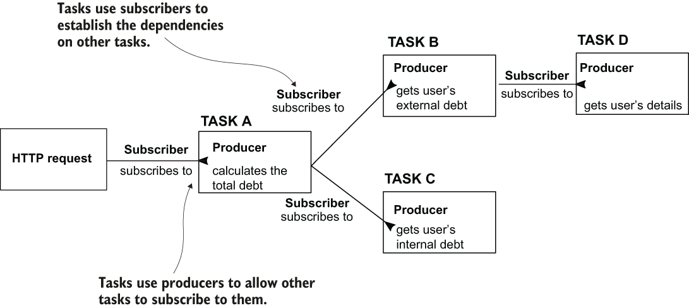

> **Hình 11.10** Trong một ứng dụng reactive, các bước trở thành các tác vụ. Mỗi tác vụ đánh dấu các phụ thuộc của nó vào các tác vụ khác và cho phép các tác vụ khác phụ thuộc vào nó. Các thread tự do thực thi bất kỳ tác vụ nào.

Cho phần minh họa này, chúng ta dùng các dự án "sq-ch11-payments" (payments service) và "sq-ch11-ex3" (ứng dụng). Chúng ta đã dùng payment service trong mục 11.1 và 11.2, và nó cung cấp endpoint /payment có thể truy cập bằng HTTP method POST. Với ứng dụng của mục này, chúng ta dùng WebClient để gửi các request đến endpoint mà payment service cung cấp.

Vì WebClient áp đặt một cách tiếp cận reactive, chúng ta cần thêm một dependency tên là WebFlux thay vì dependency web tiêu chuẩn. Đoạn code sau cho thấy dependency WebFlux, mà bạn có thể thêm vào file `pom.xml` hoặc chọn khi xây dựng dự án bằng start.spring.io:

```xml
<dependency>
    <groupId>org.springframework.boot</groupId>
    <artifactId>spring-boot-starter-webflux</artifactId>
</dependency>
```

Để gọi REST endpoint, bạn cần dùng một instance `WebClient`. Cách tốt nhất để có thể truy cập nó dễ dàng là đặt nó vào Spring context bằng annotation `@Bean` với một method trong class cấu hình, như bạn đã học trong chương 2. Listing sau cho bạn thấy class cấu hình của ứng dụng.

**Listing 11.7** Thêm một bean WebClient vào Spring context trong class cấu hình

```java
@Configuration
public class ProjectConfig {

    @Bean
    public WebClient webClient() {
      return WebClient
                .builder()            ❶
                .build();
    }
}
```

❶ Tạo một bean WebClient và thêm nó vào Spring context

Listing 11.8 cho thấy phần triển khai của class proxy, dùng WebClient để gọi endpoint mà ứng dụng cung cấp. Logic tương tự như những gì bạn đã học với RestTemplate. Bạn lấy URL gốc từ properties file; chỉ định HTTP method, các header và body; rồi thực thi lời gọi. Tên các method của WebClient khác đi, nhưng khá dễ hiểu chúng làm gì sau khi đọc tên của chúng.

**Listing 11.8** Triển khai một class proxy với WebClient

```java
@Component
public class PaymentsProxy {

    private final WebClient webClient;

    @Value("${name.service.url}")                                         ❶
    private String url;

    public PaymentsProxy(WebClient webClient) {
        this.webClient = webClient;
    }

    public Mono<Payment> createPayment(
      String requestId,
        Payment payment) {
        return webClient.post()                                           ❷
                  .uri(url + "/payment")                                  ❸
                  .header("requestId", requestId)                         ❹
                  .body(Mono.just(payment), Payment.class)                ❺
                  .retrieve()                                             ❻
                  .bodyToMono(Payment.class);                             ❼
    }
}
```

❶ Chúng ta lấy URL gốc từ properties file.  
❷ Chúng ta chỉ định HTTP method dùng khi thực hiện lời gọi.  
❸ Chúng ta chỉ định URI cho lời gọi.  
❹ Chúng ta thêm giá trị HTTP header vào request. Bạn có thể gọi method header() nhiều lần nếu muốn thêm nhiều header hơn.  
❺ Chúng ta cung cấp HTTP request body.  
❻ Chúng ta gửi HTTP request và nhận HTTP response.  
❼ Chúng ta lấy HTTP response body.

Trong phần minh họa của chúng ta, chúng ta dùng một class tên là `Mono`. Class này định nghĩa một producer. Trong listing 11.8, bạn thấy trường hợp này, nơi method thực hiện lời gọi không nhận đầu vào trực tiếp. Thay vào đó, chúng ta gửi một `Mono`. Bằng cách này, chúng ta có thể tạo một tác vụ độc lập cung cấp giá trị request body. WebClient đăng ký vào tác vụ này và trở nên phụ thuộc vào nó.

Method cũng không trả về một giá trị trực tiếp. Thay vào đó, nó trả về một `Mono`, cho phép một chức năng khác đăng ký vào nó. Bằng cách này, ứng dụng xây dựng luồng, không phải bằng cách xâu chuỗi các tác vụ trên một thread, mà bằng cách liên kết các phụ thuộc giữa các tác vụ thông qua các producer và consumer (hình 11.11).

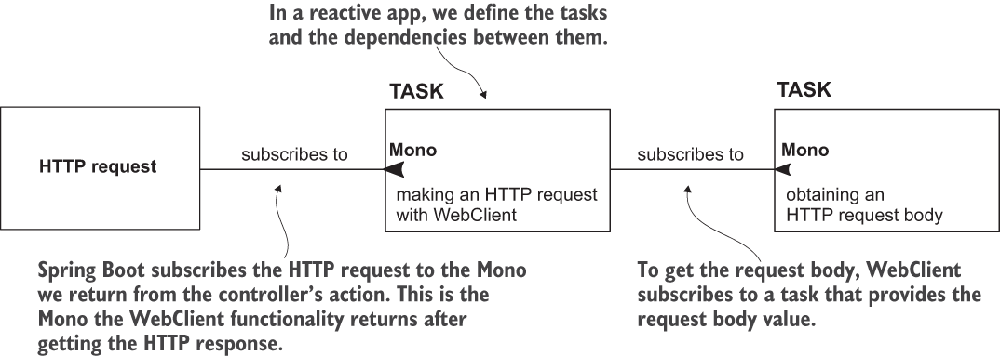

> **Hình 11.11** Chuỗi tác vụ trong một ứng dụng reactive. Khi xây dựng một web app reactive, chúng ta định nghĩa các tác vụ và các phụ thuộc giữa chúng. Chức năng WebFlux khởi tạo HTTP request đăng ký vào tác vụ mà chúng ta tạo ra thông qua producer mà hành động của controller trả về. Trong trường hợp của chúng ta, producer này là producer chúng ta nhận được khi gửi HTTP request bằng WebClient. Để WebClient thực hiện request, nó đăng ký vào một tác vụ khác cung cấp request body.

Listing 11.8 cũng cho thấy method của proxy tiêu thụ một `Mono` sản xuất HTTP request body và trả nó về cho thứ mà chức năng WebFlux đăng ký vào.

Để chứng minh lời gọi hoạt động đúng, như đã làm trong các ví dụ trước của chương này, chúng ta triển khai một class controller dùng proxy để cung cấp một endpoint mà chúng ta sẽ gọi để kiểm thử hành vi của phần triển khai. Listing sau cho thấy phần triển khai của class controller.

**Listing 11.9** Một class controller cung cấp một endpoint và gọi proxy

```java
@RestController
public class PaymentsController {

    private final PaymentsProxy paymentsProxy;

    public PaymentsController(PaymentsProxy paymentsProxy) {
        this.paymentsProxy = paymentsProxy;
    }

    @PostMapping("/payment")
    public Mono<Payment> createPayment(
        @RequestBody Payment payment
          ) {
        String requestId = UUID.randomUUID().toString();
        return paymentsProxy.createPayment(requestId, payment);
    }
}
```

Bạn có thể kiểm thử chức năng của cả hai ứng dụng, "sq-ch11-payments" (payments service) và "sq-ch11-ex3," bằng cách gọi endpoint /payment với cURL hoặc Postman. Dùng cURL, lệnh request trông như đoạn sau:

```bash
curl -X POST -H 'content-type:application/json' -d '{"amount":1000}'
➥ http://localhost:9090/payment
```

Trong console nơi bạn thực thi lệnh cURL, bạn sẽ thấy một response như đoạn sau:

```json
{
    "id":"e1e63bc1-ce9c-448e-b7b6-268940ea0fcc",
    "amount":1000.0
}
```

Trong console của payment service, bạn thấy log chứng minh ứng dụng của mục này đã gửi request đúng đến payment service:

```text
Received request with ID e1e63bc1-ce9c-448e-b7b6-268940ea0fcc ;Payme
➥ Amount: 1000.0
```

## Tóm tắt

- Trong một giải pháp backend thực tế, bạn thường gặp các trường hợp một ứng dụng backend cần gọi các endpoint do một ứng dụng backend khác cung cấp.
- Spring cung cấp nhiều giải pháp để triển khai phía client của một REST service. Ba trong số các giải pháp phù hợp nhất là:
  - OpenFeign—Một giải pháp do dự án Spring Cloud cung cấp, đơn giản hóa thành công lượng code bạn cần viết để gọi một REST endpoint và bổ sung nhiều tính năng phù hợp với cách chúng ta triển khai các service ngày nay
  - RestTemplate—Một công cụ đơn giản được dùng để gọi các REST endpoint trong các ứng dụng Spring
  - WebClient—Một giải pháp reactive để gọi các REST endpoint trong một ứng dụng Spring
- Bạn không nên dùng RestTemplate trong các triển khai mới. Bạn có thể chọn giữa OpenFeign và WebClient để gọi các REST endpoint. Với một ứng dụng theo cách tiếp cận tiêu chuẩn (không reactive), lựa chọn tốt nhất là dùng OpenFeign.
- WebClient là một công cụ tuyệt vời cho một ứng dụng được thiết kế theo cách tiếp cận reactive. Nhưng trước khi dùng nó, bạn nên hiểu sâu về cách tiếp cận reactive và cách triển khai một ứng dụng reactive với Spring.
