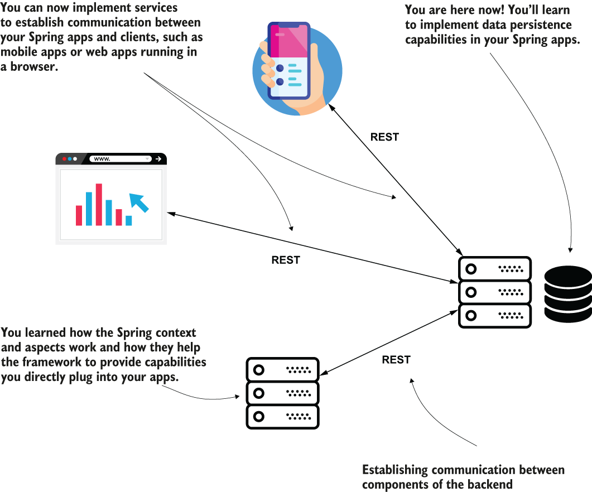
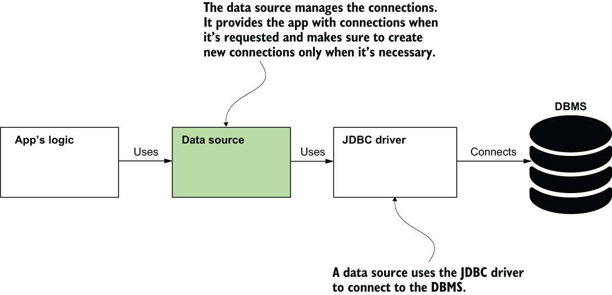
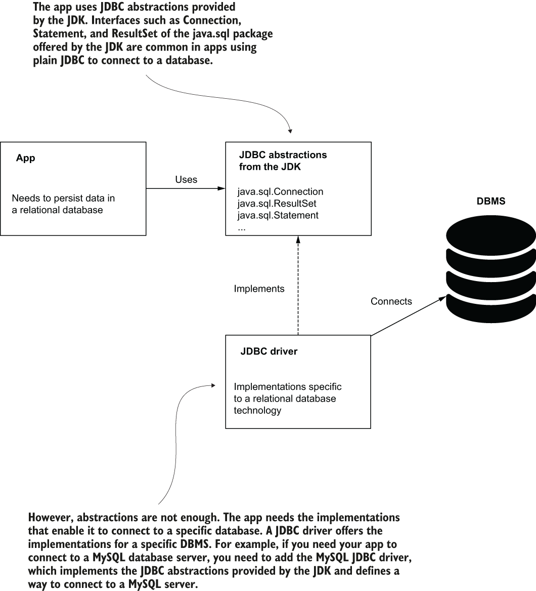
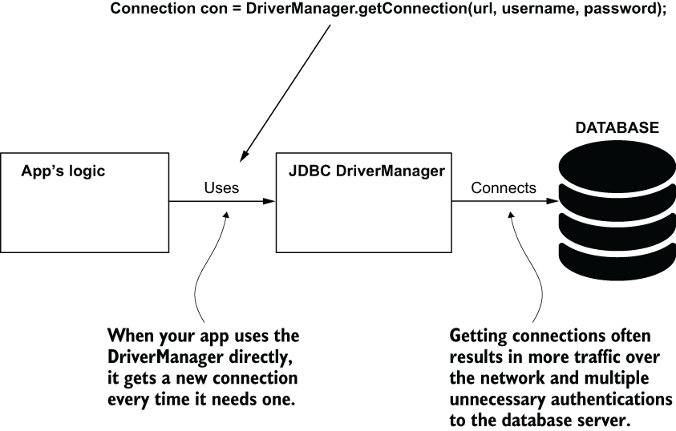
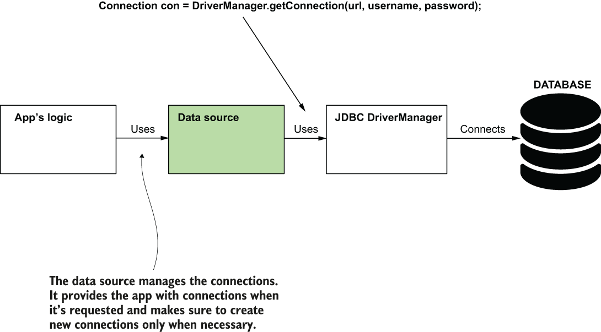
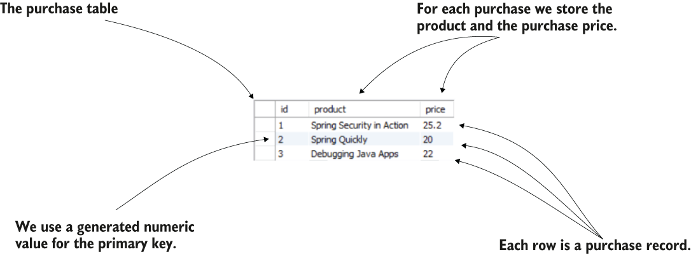
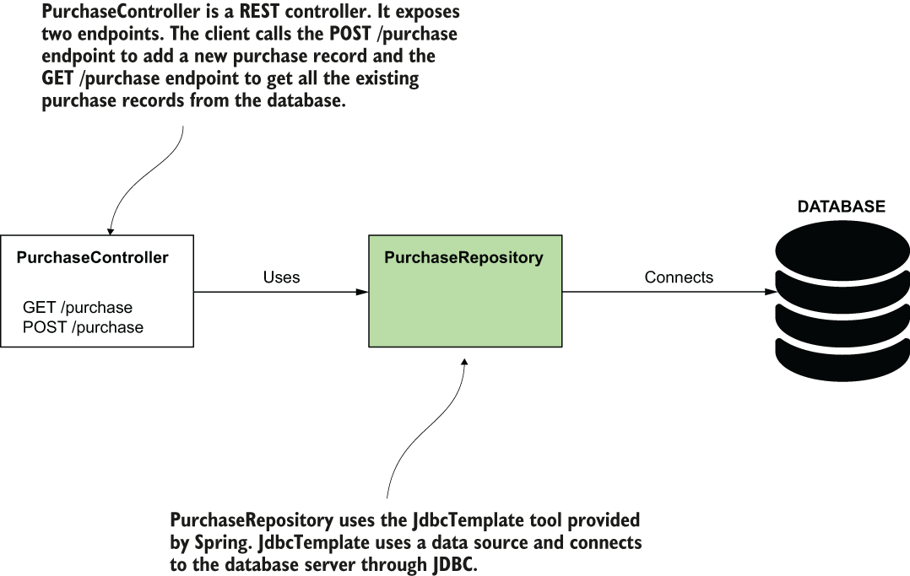
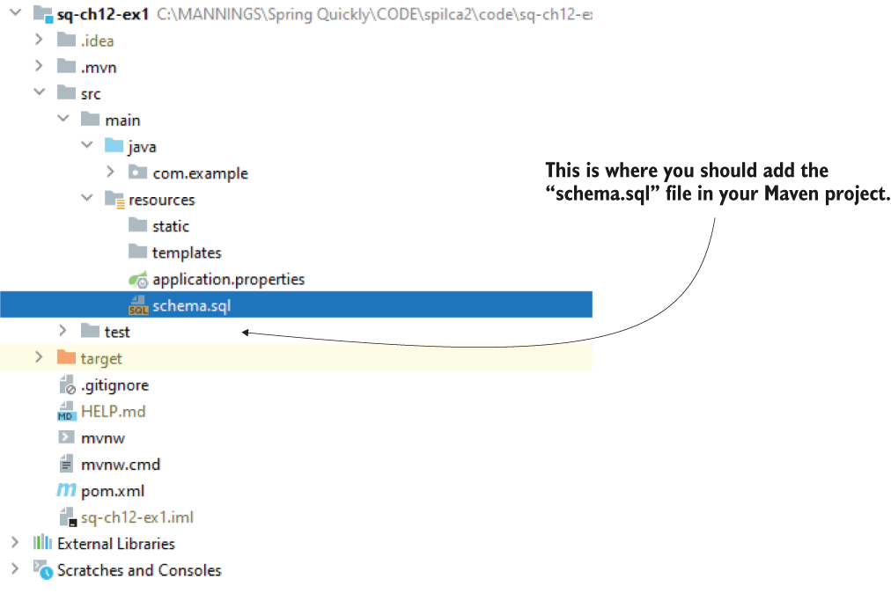
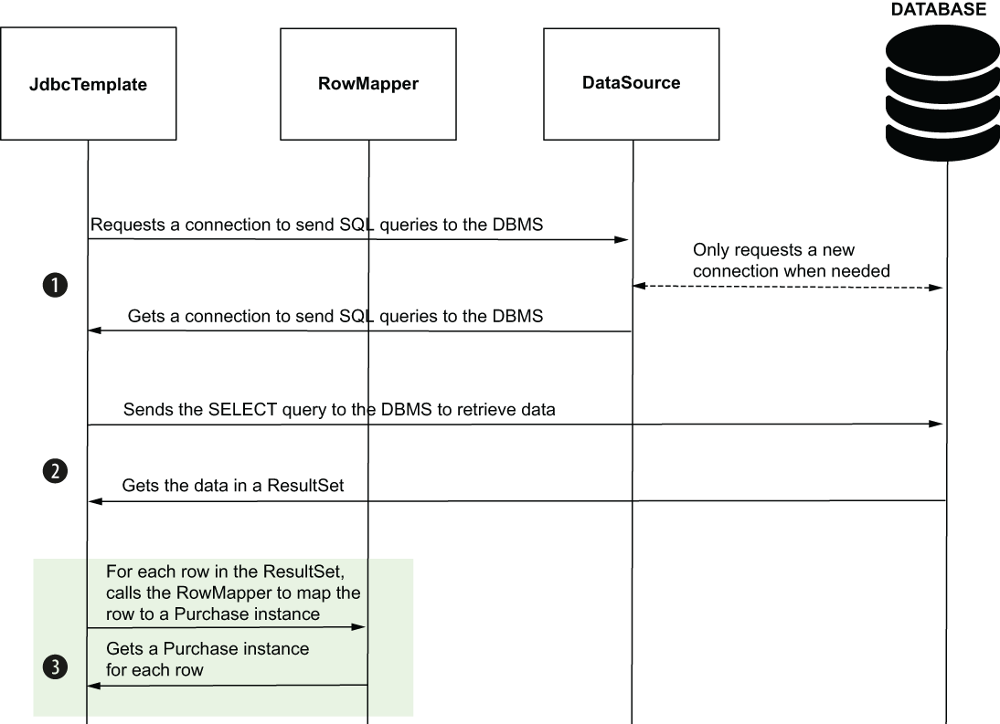

# 12 Sử dụng data source trong ứng dụng Spring

**Chương này bao gồm**

- Data source là gì
- Cấu hình data source trong ứng dụng Spring
- Dùng JdbcTemplate để làm việc với database

Hầu như mọi ứng dụng ngày nay đều cần lưu trữ dữ liệu mà nó làm việc, và các ứng dụng thường dùng database để quản lý dữ liệu chúng lưu trữ. Trong nhiều năm, các relational database (cơ sở dữ liệu quan hệ) đã cung cấp cho ứng dụng một cách đơn giản và tinh tế để lưu dữ liệu mà bạn có thể áp dụng thành công trong nhiều tình huống. Các ứng dụng Spring, giống các ứng dụng khác, thường cần dùng database để lưu trữ dữ liệu, và vì lý do này, bạn cần học cách triển khai các khả năng như vậy cho ứng dụng Spring của mình.

Trong chương này, chúng ta bàn về data source là gì và cách đơn giản nhất để ứng dụng Spring của bạn làm việc với database. Cách đơn giản đó là công cụ JdbcTemplate mà Spring cung cấp.



> **Hình 12.1** Bạn đã hiểu các phần thiết yếu mà bạn triển khai với Spring trong một hệ thống. Trong các chương 1 đến 6, bạn đã học nền tảng và điều gì khiến Spring có thể cung cấp các khả năng bạn dùng trong ứng dụng. Trong các chương 7 đến 11, bạn đã học cách triển khai ứng dụng web và REST endpoint để thiết lập giao tiếp giữa các thành phần của hệ thống. Giờ bạn bắt đầu hành trình học các kỹ năng quý giá để ứng dụng Spring làm việc với dữ liệu được lưu trữ.

Hình 12.1 cho thấy tiến độ của bạn trong các chương trước về việc học dùng Spring để triển khai các khả năng nền tảng khác nhau trong một hệ thống. Chúng ta đã có tiến bộ tốt, và giờ bạn có thể dùng Spring để triển khai các khả năng ở nhiều phần khác nhau của hệ thống.

## 12.1 Data source là gì

Trong mục này, chúng ta bàn về một thành phần thiết yếu mà ứng dụng Spring của bạn cần để truy cập database: data source. Data source (hình 12.2) là một thành phần quản lý các kết nối đến server xử lý database (hệ quản trị cơ sở dữ liệu, còn gọi là DBMS).



> **Hình 12.2** Data source là một thành phần quản lý các kết nối đến hệ quản trị cơ sở dữ liệu (DBMS). Data source dùng JDBC driver để lấy các kết nối mà nó quản lý. Data source nhằm cải thiện hiệu năng của ứng dụng bằng cách cho phép logic của ứng dụng tái sử dụng các kết nối đến DBMS và chỉ yêu cầu kết nối mới khi cần. Data source cũng đảm bảo đóng các kết nối khi giải phóng chúng.

> **LƯU Ý** DBMS là phần mềm có trách nhiệm cho phép bạn quản lý hiệu quả dữ liệu được lưu trữ (thêm, thay đổi, truy xuất) trong khi vẫn giữ an toàn cho dữ liệu. DBMS quản lý dữ liệu trong các database. Database là một tập hợp dữ liệu được lưu trữ bền vững.

Nếu không có một đối tượng đảm nhận trách nhiệm data source, ứng dụng sẽ phải yêu cầu một kết nối mới cho mỗi thao tác với dữ liệu. Cách này không thực tế trong môi trường production vì việc giao tiếp qua mạng để thiết lập kết nối mới cho mỗi thao tác sẽ làm chậm ứng dụng đáng kể và gây ra vấn đề hiệu năng. Data source đảm bảo ứng dụng chỉ yêu cầu kết nối mới khi thực sự cần, cải thiện hiệu năng của ứng dụng.

Khi làm việc với bất kỳ công cụ nào liên quan đến lưu trữ dữ liệu trong relational database, Spring mong đợi bạn định nghĩa một data source. Vì lý do này, điều quan trọng là trước hết chúng ta bàn về vị trí của data source trong tầng lưu trữ (persistence layer) của ứng dụng, rồi minh họa cách triển khai một tầng lưu trữ dữ liệu bằng các ví dụ.

Trong một ứng dụng Java, khả năng của ngôn ngữ để kết nối đến relational database được gọi là Java Database Connectivity (JDBC). JDBC cung cấp cho bạn cách kết nối đến DBMS để làm việc với database. Tuy nhiên, JDK không cung cấp implementation cụ thể để làm việc với một công nghệ cụ thể (như MySQL, Postgres hay Oracle). JDK chỉ cung cấp các abstraction cho các đối tượng mà ứng dụng cần để làm việc với relational database. Để có implementation của abstraction này và cho phép ứng dụng kết nối đến một công nghệ DBMS nhất định, bạn thêm một runtime dependency gọi là JDBC driver (hình 12.3). Mỗi nhà cung cấp công nghệ cung cấp JDBC driver mà bạn cần thêm vào ứng dụng để cho phép nó kết nối đến công nghệ cụ thể đó. JDBC driver không phải là thứ đến từ JDK hay từ framework như Spring.



> **Hình 12.3** Khi kết nối đến database, một ứng dụng Java dùng JDBC. JDK cung cấp một tập abstraction, nhưng ứng dụng cần một implementation nhất định tùy vào công nghệ relational database mà ứng dụng kết nối đến. Một runtime dependency tên là JDBC driver cung cấp các implementation này. Với mỗi công nghệ cụ thể, có một driver như vậy, và ứng dụng cần đúng driver cung cấp implementation cho công nghệ server mà nó cần kết nối.

JDBC driver cung cấp cho bạn cách lấy kết nối đến DBMS. Lựa chọn đầu tiên là dùng trực tiếp JDBC driver và triển khai ứng dụng để yêu cầu một kết nối mỗi khi cần thực thi một thao tác mới trên dữ liệu được lưu trữ. Bạn sẽ thường thấy cách này trong các hướng dẫn Java cơ bản. Khi bạn học JDBC trong một hướng dẫn Java cơ bản, các ví dụ thường dùng một class tên là `DriverManager` để lấy kết nối, như trong đoạn code sau:

```java
Connection con = DriverManager.getConnection(url, username, password);
```

Method `getConnection()` dùng URL được cung cấp làm giá trị cho tham số đầu tiên để xác định database mà ứng dụng cần truy cập, và username cùng password để xác thực quyền truy cập database (hình 12.4). Nhưng việc yêu cầu kết nối mới và xác thực lại cho từng thao tác là lãng phí tài nguyên và thời gian cho cả client lẫn database server. Hãy tưởng tượng bạn vào một quán bar và gọi một ly bia; bạn trông trẻ, nên người phục vụ hỏi giấy tờ tùy thân. Điều này ổn, nhưng sẽ trở nên phiền phức nếu người phục vụ lại hỏi giấy tờ khi bạn gọi ly thứ hai và thứ ba (dĩ nhiên chỉ là giả định).



> **Hình 12.4** Ứng dụng của bạn có thể tái sử dụng các kết nối đến database server. Nếu nó không yêu cầu kết nối mới, ứng dụng trở nên kém hiệu năng hơn do thực thi các thao tác không cần thiết. Để đạt được hành vi này, ứng dụng cần một đối tượng chịu trách nhiệm quản lý các kết nối: data source.

Một đối tượng data source có thể quản lý hiệu quả các kết nối để giảm thiểu số thao tác không cần thiết. Thay vì dùng trực tiếp JDBC driver manager, chúng ta dùng data source để lấy và quản lý các kết nối (hình 12.5).



> **Hình 12.5** Thêm data source vào thiết kế class giúp ứng dụng tiết kiệm thời gian cho các thao tác không cần thiết. Data source quản lý các kết nối, cung cấp kết nối cho ứng dụng khi được yêu cầu, và chỉ tạo kết nối mới khi cần.

> **LƯU Ý** Data source là một đối tượng có trách nhiệm quản lý các kết nối đến database server cho ứng dụng. Nó đảm bảo ứng dụng yêu cầu kết nối từ database một cách hiệu quả, cải thiện hiệu năng của các thao tác ở tầng lưu trữ.

Với ứng dụng Java, bạn có nhiều lựa chọn implementation cho data source, nhưng phổ biến nhất hiện nay là data source HikariCP (Hikari connection pool). Cấu hình theo quy ước của Spring Boot cũng coi HikariCP là implementation data source mặc định, và đây là thứ chúng ta sẽ dùng trong các ví dụ. Bạn có thể tìm hiểu thêm về data source này tại đây: https://github.com/brettwooldridge/HikariCP. HikariCP là mã nguồn mở, và bạn có thể góp phần vào việc phát triển nó.

## 12.2 Dùng JdbcTemplate để làm việc với dữ liệu được lưu trữ

Trong mục này, chúng ta triển khai ứng dụng Spring đầu tiên dùng database, và chúng ta bàn về các lợi thế mà Spring mang lại khi triển khai tầng lưu trữ. Ứng dụng của bạn có thể dùng data source để lấy kết nối đến database server một cách hiệu quả. Nhưng bạn có thể viết code làm việc với dữ liệu dễ dàng đến đâu? Dùng các class JDBC do JDK cung cấp đã được chứng minh không phải là cách thoải mái để làm việc với dữ liệu được lưu trữ. Bạn phải viết những khối code dài dòng ngay cả cho các thao tác đơn giản nhất. Trong các ví dụ Java cơ bản, có thể bạn đã thấy code như trong đoạn tiếp theo:

```java
String sql = "INSERT INTO purchase VALUES (?,?)";
try (PreparedStatement stmt = con.prepareStatement(sql)) {
  stmt.setString(1, name);
    stmt.setDouble(2, price);
    stmt.executeUpdate();
} catch (SQLException e) {
  // do something when an exception occurs
}
```

Một khối code dài như vậy cho một thao tác đơn giản là thêm bản ghi mới vào bảng! Và hãy nhớ tôi đã bỏ qua logic trong khối catch. Nhưng Spring giúp chúng ta giảm thiểu code phải viết cho các thao tác như vậy. Với ứng dụng Spring, chúng ta có thể dùng nhiều lựa chọn để triển khai tầng lưu trữ, và những lựa chọn quan trọng nhất chúng ta sẽ bàn trong chương này và trong các chương 13 và 14. Trong mục này, chúng ta sẽ dùng một công cụ tên là JdbcTemplate cho phép bạn làm việc với database bằng JDBC theo cách đơn giản hóa.

JdbcTemplate là công cụ đơn giản nhất mà Spring cung cấp để dùng relational database, nhưng nó là lựa chọn tuyệt vời cho các ứng dụng nhỏ vì nó không buộc bạn phải dùng bất kỳ persistence framework cụ thể nào khác. JdbcTemplate là lựa chọn tốt nhất của Spring để triển khai tầng lưu trữ khi bạn không muốn ứng dụng có thêm dependency nào khác. Tôi cũng coi nó là cách tuyệt vời để bắt đầu học cách triển khai tầng lưu trữ của ứng dụng Spring.

Để minh họa cách dùng JdbcTemplate, chúng ta sẽ triển khai một ví dụ. Chúng ta sẽ làm theo các bước sau:

1. Tạo kết nối đến DBMS.
2. Viết logic của repository.
3. Gọi các method của repository trong các method triển khai action của REST endpoint.

Bạn có thể tìm thấy ví dụ này trong project "sq-ch12-ex1".

Với ứng dụng này, chúng ta có một bảng "purchase" trong database. Bảng này lưu chi tiết về các sản phẩm được mua từ một cửa hàng trực tuyến và giá của giao dịch mua. Các cột của bảng này như sau (hình 12.6):

- id: Một giá trị duy nhất tự tăng, cũng đảm nhận vai trò primary key của bảng
- product: Tên sản phẩm được mua
- price: Giá mua



> **Hình 12.6** Bảng purchase. Mỗi giao dịch mua được lưu thành một hàng trong bảng. Các thuộc tính chúng ta lưu cho một giao dịch mua là sản phẩm được mua và giá mua. Primary key của bảng (ID) là một giá trị số được sinh tự động.

Các ví dụ trong sách này không phụ thuộc vào công nghệ relational database bạn chọn. Bạn có thể dùng cùng code với công nghệ bạn chọn. Tuy nhiên, tôi phải chọn một công nghệ nhất định cho các ví dụ. Trong sách này, chúng ta sẽ dùng H2 (một database in-memory, rất tốt cho ví dụ, và, như bạn sẽ thấy trong chương 15, để triển khai integration test) và MySQL (một công nghệ miễn phí và nhẹ mà bạn có thể dễ dàng cài đặt cục bộ để chứng minh các ví dụ hoạt động với thứ gì đó ngoài database in-memory). Bạn có thể chọn triển khai các ví dụ với một công nghệ relational database khác mà bạn thích, như Postgres, Oracle hay MS SQL. Trong trường hợp đó, bạn sẽ phải dùng JDBC driver phù hợp cho runtime của mình (như đã đề cập ở đầu chương và như bạn biết từ Java cơ bản). Ngoài ra, cú pháp SQL có thể khác nhau giữa hai công nghệ relational database khác nhau. Bạn sẽ phải điều chỉnh chúng cho công nghệ bạn chọn nếu bạn dùng thứ gì khác.

> **LƯU Ý** Ứng dụng của bạn cũng dùng JDBC driver cho database H2. Nhưng với H2, bạn không phải thêm riêng vì nó đi kèm với dependency database H2 mà bạn đã thêm vào file pom.xml.

Với các ví dụ trong sách này, tôi giả định bạn đã biết SQL cơ bản và hiểu các cú pháp truy vấn SQL đơn giản. Tôi cũng giả định bạn đã làm việc với JDBC ít nhất trong các ví dụ lý thuyết vì bạn học điều này trong Java cơ bản, một điều kiện tiên quyết bắt buộc để học Spring. Nhưng có thể bạn muốn ôn lại kiến thức trong lĩnh vực này trước khi đi tiếp. Tôi khuyên bạn đọc chương 21 của cuốn *OCP Oracle Certified Professional Java SE 11 Developer Complete Study Guide* của Jeanne Boyarsky và Scott Selikoff (Sybex, 2020) cho phần JDBC. Để ôn lại SQL, tôi khuyên bạn đọc *Learning SQL*, ấn bản thứ 3, của Alan Beaulieu (O'Reilly Media, 2020).

Yêu cầu cho ứng dụng chúng ta triển khai rất đơn giản. Chúng ta sẽ phát triển một backend service cung cấp hai endpoint. Client gọi một endpoint để thêm bản ghi mới vào bảng purchase và endpoint thứ hai để lấy tất cả bản ghi từ bảng purchase.

Khi làm việc với database, chúng ta triển khai tất cả các khả năng liên quan đến tầng lưu trữ trong các class mà (theo quy ước) chúng ta gọi là repository. Hình 12.7 cho bạn thấy thiết kế class của ứng dụng chúng ta muốn triển khai.



> **Hình 12.7** Một REST controller triển khai hai endpoint. Khi client gọi các endpoint, controller ủy quyền cho một đối tượng repository để dùng database.

> **LƯU Ý** Repository là một class chịu trách nhiệm làm việc với database.

Chúng ta bắt đầu triển khai như thường lệ, bằng cách thêm các dependency cần thiết. Đoạn code tiếp theo cho bạn thấy các dependency bạn cần thêm như chúng xuất hiện trong file pom.xml của project:

```xml
<dependency>                                                               ❶
    <groupId>org.springframework.boot</groupId>                            ❶
    <artifactId>spring-boot-starter-web</artifactId>                       ❶
</dependency>                                                              ❶
<dependency>                                                               ❷
    <groupId>org.springframework.boot</groupId>                            ❷
    <artifactId>spring-boot-starter-jdbc</artifactId>                      ❷
</dependency>                                                              ❷
<dependency>                                                               ❸
    <groupId>com.h2database</groupId>                                      ❸
    <artifactId>h2</artifactId>                                            ❸
    <scope>runtime</scope>                                                 ❹
</dependency>
```

❶ Chúng ta dùng cùng dependency web như trong các chương trước để triển khai REST endpoint.

❷ Chúng ta thêm JDBC starter để có tất cả các khả năng cần thiết để làm việc với database bằng JDBC.

❸ Chúng ta thêm dependency H2 để có cả database in-memory cho ví dụ này lẫn JDBC driver để làm việc với nó.

❹ Ứng dụng chỉ cần database và JDBC driver lúc runtime. Ứng dụng không cần chúng để biên dịch. Để chỉ thị Maven rằng chúng ta chỉ muốn các dependency này lúc runtime, chúng ta thêm thẻ scope với giá trị "runtime".

Ngay cả khi bạn không có database server cho ví dụ này, dependency H2 mô phỏng database. H2 là công cụ tuyệt vời mà chúng ta dùng cho cả ví dụ lẫn test ứng dụng khi muốn kiểm thử chức năng của ứng dụng nhưng loại bỏ sự phụ thuộc vào database (chúng ta bàn về test ứng dụng trong chương 15).

Chúng ta cần thêm một bảng lưu các bản ghi purchase. Trong các ví dụ lý thuyết, việc tạo cấu trúc database rất dễ bằng cách thêm một file tên là "schema.sql" vào thư mục resources của project Maven (hình 12.8).



> **Hình 12.8** Trong project Maven, bạn tạo file "schema.sql" trong thư mục resources, nơi bạn có thể viết các truy vấn định nghĩa cấu trúc database. Spring thực thi các truy vấn này khi ứng dụng khởi động.

Trong file này, bạn có thể viết tất cả các truy vấn SQL cấu trúc mà bạn cần để định nghĩa cấu trúc database. Bạn cũng thấy các lập trình viên gọi các truy vấn này là "data description language" (DDL). Chúng ta cũng sẽ thêm một file như vậy vào project và thêm truy vấn để tạo bảng purchase, như trong đoạn code tiếp theo:

```sql
CREATE TABLE IF NOT EXISTS purchase (
        id INT AUTO_INCREMENT PRIMARY KEY,
        product varchar(50) NOT NULL,
        price double NOT NULL
);
```

> **LƯU Ý** Dùng file "schema.sql" để định nghĩa cấu trúc database chỉ phù hợp cho các ví dụ lý thuyết. Cách này dễ vì nó nhanh và cho phép bạn tập trung vào những gì bạn học thay vì định nghĩa cấu trúc database trong một hướng dẫn. Nhưng trong ví dụ thực tế, bạn sẽ cần dùng một dependency cũng cho phép bạn quản lý phiên bản các script database. Tôi khuyên bạn xem Flyway (https://flywaydb.org/) và Liquibase (https://www.liquibase.org/). Đây là hai dependency được đánh giá rất cao để quản lý phiên bản schema database. Chúng vượt ra ngoài kiến thức cơ bản của Spring, nên chúng ta sẽ không dùng chúng trong các ví dụ của sách này. Nhưng đó là một trong những thứ tôi khuyên bạn học ngay sau phần nền tảng.

Chúng ta cần một class model để định nghĩa dữ liệu purchase trong ứng dụng. Các instance của class này ánh xạ với các hàng của bảng purchase trong database, nên mỗi instance cần có ID, product và price làm thuộc tính. Đoạn code tiếp theo cho thấy class model `Purchase`:

```java
public class Purchase {

    private int id;
    private String product;
    private BigDecimal price;
    // Omitted getters and setters
}
```

Có thể bạn thấy thú vị rằng kiểu của thuộc tính price trong class `Purchase` là `BigDecimal`. Chẳng lẽ chúng ta không thể định nghĩa nó là `double`? Đây là điều quan trọng tôi muốn bạn lưu ý: trong các ví dụ lý thuyết, bạn thường thấy `double` được dùng cho các giá trị thập phân, nhưng trong nhiều ví dụ thực tế, dùng `double` hay `float` cho số thập phân không phải là điều đúng đắn. Khi thao tác với các giá trị `double` và `float`, bạn có thể mất độ chính xác ngay cả với các phép toán số học đơn giản như cộng hoặc trừ. Hiệu ứng này do cách Java lưu các giá trị như vậy trong bộ nhớ. Khi bạn làm việc với thông tin nhạy cảm như giá cả, bạn nên dùng kiểu `BigDecimal` thay thế. Đừng lo về việc chuyển đổi. Tất cả các khả năng thiết yếu mà Spring cung cấp đều biết cách dùng `BigDecimal`.

> **LƯU Ý** Khi bạn muốn lưu chính xác một giá trị dấu phẩy động và đảm bảo không mất độ chính xác thập phân khi thực thi các phép toán khác nhau với các giá trị, hãy dùng `BigDecimal` chứ không phải `double` hay `float`.

Để dễ dàng lấy một instance `PurchaseRepository` khi cần trong controller, chúng ta cũng sẽ biến đối tượng này thành bean trong Spring context. Cách đơn giản nhất là dùng stereotype annotation (như `@Component` hay `@Service`), như bạn đã học ở chương 3. Nhưng thay vì dùng `@Component`, Spring cung cấp một annotation chuyên biệt cho repository mà chúng ta có thể dùng: `@Repository`. Như bạn đã học ở chương 3 về việc dùng `@Service` cho các class service, với repository, bạn nên dùng stereotype annotation `@Repository` để chỉ thị Spring thêm bean vào context. Listing sau cho bạn thấy định nghĩa class repository.

**Listing 12.1** Định nghĩa bean PurchaseRepository

```java
@Repository                                   ❶
public class PurchaseRepository {
}
```

❶ Chúng ta dùng stereotype annotation `@Repository` để thêm một bean kiểu class này vào Spring context.

Giờ `PurchaseRepository` đã là bean trong application context, chúng ta có thể inject một instance `JdbcTemplate` mà chúng ta sẽ dùng để làm việc với database. Tôi biết bạn đang nghĩ gì! "Instance `JdbcTemplate` này từ đâu ra? Ai đã tạo instance này để chúng ta có thể inject nó vào repository?" Trong ví dụ này, giống nhiều tình huống production, chúng ta sẽ một lần nữa hưởng lợi từ phép màu của Spring Boot. Khi Spring Boot thấy bạn thêm dependency H2 vào pom.xml, nó tự động cấu hình một data source và một instance `JdbcTemplate`. Trong ví dụ này, chúng ta sẽ dùng chúng trực tiếp.

Nếu bạn dùng Spring nhưng không dùng Spring Boot, bạn cần định nghĩa bean `DataSource` và bean `JdbcTemplate` (bạn có thể thêm chúng vào Spring context bằng annotation `@Bean` trong class cấu hình, như bạn đã học ở chương 2). Trong mục 12.3, tôi sẽ chỉ cho bạn cách tùy chỉnh chúng và trong những tình huống nào bạn cần định nghĩa data source và instance `JdbcTemplate` của riêng mình. Listing sau cho bạn thấy cách inject instance `JdbcTemplate` mà Spring Boot đã cấu hình cho ứng dụng.

**Listing 12.2** Inject một bean JdbcTemplate để làm việc với dữ liệu được lưu trữ

```java
@Repository
public class PurchaseRepository {

    private final JdbcTemplate jdbc;

    public PurchaseRepository(             ❶
        JdbcTemplate jdbc) {

        this.jdbc = jdbc;
    }

}
```

❶ Chúng ta dùng inject qua constructor để lấy instance `JdbcTemplate` từ application context.

Cuối cùng, bạn có một instance `JdbcTemplate`, nên bạn có thể triển khai các yêu cầu của ứng dụng. `JdbcTemplate` có một method `update()` mà bạn có thể dùng để thực thi bất kỳ truy vấn thay đổi dữ liệu nào: INSERT, UPDATE hoặc DELETE. Truyền SQL và các tham số nó cần, thế là xong; hãy để `JdbcTemplate` lo phần còn lại (lấy kết nối, tạo statement, xử lý `SQLException`, v.v.). Listing sau thêm một method `storePurchase()` vào class `PurchaseRepository`. Method `storePurchase()` dùng `JdbcTemplate` để thêm một bản ghi mới vào bảng purchase.

**Listing 12.3** Dùng JdbcTemplate để thêm bản ghi mới vào bảng

```java
@Repository
public class PurchaseRepository {

    private final JdbcTemplate jdbc;

    public PurchaseRepository(JdbcTemplate jdbc) {
        this.jdbc = jdbc;
    }

    public void storePurchase(Purchase purchase) {                            ❶
        String sql =                                                          ❷
          "INSERT INTO purchase VALUES (NULL, ?, ?)";

        jdbc.update(sql,                                                      ❸
             purchase.getProduct(),
             purchase.getPrice());
    }

}
```

❶ Method nhận một tham số đại diện cho dữ liệu cần lưu.

❷ Truy vấn được viết dưới dạng chuỗi, và các dấu chấm hỏi (?) thay thế cho các giá trị tham số của truy vấn. Với ID, chúng ta dùng NULL vì chúng ta đã cấu hình DBMS sinh giá trị cho cột này.

❸ Method `update()` của `JdbcTemplate` gửi truy vấn đến database server. Tham số đầu tiên method nhận là truy vấn, và các tham số tiếp theo là giá trị cho các tham số. Các giá trị này thay thế, theo cùng thứ tự, từng dấu chấm hỏi trong truy vấn.

Với vài dòng code, bạn có thể thêm, cập nhật hoặc xóa các bản ghi trong bảng. Truy xuất dữ liệu cũng không khó hơn thế. Giống như với insert, bạn viết và gửi một truy vấn. Để truy xuất dữ liệu, lần này, bạn sẽ viết một truy vấn SELECT. Và để nói cho `JdbcTemplate` biết cách chuyển đổi dữ liệu thành các đối tượng `Purchase` (class model của bạn), bạn triển khai một `RowMapper`: một đối tượng chịu trách nhiệm chuyển đổi một hàng từ `ResultSet` thành một đối tượng cụ thể. Ví dụ, nếu bạn muốn lấy dữ liệu từ database được mô hình hóa thành các đối tượng `Purchase`, bạn cần triển khai một `RowMapper` để định nghĩa cách một hàng được ánh xạ thành một instance `Purchase` (hình 12.9).



> **Hình 12.9** JdbcTemplate dùng RowMapper để chuyển ResultSet thành danh sách các instance Purchase. Với mỗi hàng trong ResultSet, JdbcTemplate gọi RowMapper để ánh xạ hàng đó thành một instance Purchase. Sơ đồ trình bày cả ba bước JdbcTemplate thực hiện để gửi truy vấn SELECT: (1) lấy kết nối DBMS, (2) gửi truy vấn và nhận kết quả, và (3) ánh xạ kết quả thành các instance Purchase.

Listing sau cho bạn thấy cách triển khai một method repository để lấy tất cả các bản ghi trong bảng purchase.

**Listing 12.4** Dùng JdbcTemplate để chọn các bản ghi từ database

```java
@Repository
public class PurchaseRepository {

   // Omitted code

   public List<Purchase> findAllPurchases() {                                ❶
     String sql = "SELECT * FROM purchase";                                  ❷
          RowMapper<Purchase> purchaseRowMapper = (r, i) -> {              ❸
               Purchase rowObject = new Purchase();                        ❹
               rowObject.setId(r.getInt("id"));                            ❹
               rowObject.setProduct(r.getString("product"));               ❹
               rowObject.setPrice(r.getBigDecimal("price"));               ❹
               return rowObject;                                           ❹
          };

          return jdbc.query(sql, purchaseRowMapper);                       ❺
      }
}
```

❶ Method trả về các bản ghi nó truy xuất từ database trong một danh sách các đối tượng `Purchase`.

❷ Chúng ta định nghĩa truy vấn SELECT để lấy tất cả bản ghi từ bảng purchase.

❸ Chúng ta triển khai một đối tượng `RowMapper` nói cho `JdbcTemplate` biết cách ánh xạ một hàng trong result set thành một đối tượng `Purchase`. Trong biểu thức lambda, tham số "r" là `ResultSet` (dữ liệu bạn nhận từ database), còn tham số "i" là một `int` đại diện cho số thứ tự hàng.

❹ Chúng ta đặt dữ liệu vào một instance `Purchase`. `JdbcTemplate` sẽ dùng logic này cho mỗi hàng trong result set.

❺ Chúng ta gửi truy vấn SELECT bằng method `query`, và cung cấp đối tượng row mapper để `JdbcTemplate` biết cách chuyển đổi dữ liệu nó nhận được thành các đối tượng `Purchase`.

Khi bạn đã có các method repository và có thể lưu và truy xuất bản ghi trong database, đã đến lúc cung cấp các method này thông qua endpoint. Listing sau cho bạn thấy phần triển khai controller.

**Listing 12.5** Dùng đối tượng repository trong class controller

```java
@RestController
@RequestMapping("/purchase")
public class PurchaseController {

      private final PurchaseRepository purchaseRepository;

      public PurchaseController(                                               ❶
          PurchaseRepository purchaseRepository) {
          this.purchaseRepository = purchaseRepository;
    }

    @PostMapping
    public void storePurchase(@RequestBody Purchase purchase) {
        purchaseRepository.storePurchase(purchase);                        ❷
    }

    @GetMapping
    public List<Purchase> findPurchases() {
      return purchaseRepository.findAllPurchases();                        ❸
    }
}
```

❶ Chúng ta dùng dependency injection qua constructor để lấy đối tượng repository từ Spring context.

❷ Chúng ta triển khai một endpoint mà client gọi để lưu một bản ghi purchase vào database. Chúng ta dùng method `storePurchase()` của repository để lưu trữ dữ liệu mà action của controller nhận từ HTTP request body.

❸ Chúng ta triển khai một endpoint mà client gọi để lấy tất cả bản ghi từ bảng purchase. Action của controller dùng method của repository để lấy dữ liệu từ database và trả dữ liệu về client trong HTTP response body.

Nếu bạn chạy ứng dụng ngay bây giờ, bạn có thể kiểm tra hai endpoint bằng Postman hoặc cURL.

Để thêm một bản ghi mới vào bảng purchase, gọi đường dẫn /purchase với HTTP POST, như trong đoạn tiếp theo:

```bash
curl -XPOST 'http://localhost:8080/purchase' \
-H 'Content-Type: application/json' \
-d '{
        "product" : "Spring Security in Action",
        "price" : 25.2
}'
```

Sau đó bạn có thể gọi endpoint HTTP GET /purchase để chứng minh ứng dụng đã lưu bản ghi purchase đúng. Đoạn tiếp theo cho thấy lệnh cURL cho request:

```bash
curl 'http://localhost:8080/purchase'
```

HTTP response body của request là danh sách tất cả các bản ghi purchase trong database, như trong đoạn tiếp theo:

```json
[
      {
             "id": 1,
             "product": "Spring Security in Action",
             "price": 25.2
      }
]
```

## 12.3 Tùy chỉnh cấu hình của data source

Trong mục này, bạn sẽ học cách tùy chỉnh data source mà `JdbcTemplate` dùng để làm việc với database. Database H2 chúng ta dùng trong mục 12.2 rất tốt cho ví dụ và hướng dẫn, cũng như để bắt đầu triển khai tầng lưu trữ cho ứng dụng. Tuy nhiên, trong các ứng dụng production, bạn cần nhiều hơn một database in-memory, và thường bạn cũng cần cấu hình data source.

Để bàn về việc dùng DBMS trong các tình huống kiểu thực tế, chúng ta sẽ thay đổi ví dụ đã triển khai trong mục 12.2 để dùng một MySQL server. Bạn sẽ thấy logic trong ví dụ không thay đổi, và việc đổi data source để trỏ đến một database khác không hề phức tạp. Đây là các bước chúng ta sẽ làm:

1. Trong mục 12.3.1, chúng ta sẽ thêm MySQL JDBC driver và cấu hình data source bằng file "application.properties" để trỏ đến một database MySQL. Chúng ta vẫn để Spring Boot định nghĩa bean `DataSource` trong Spring context dựa trên các property chúng ta định nghĩa.
2. Trong mục 12.3.2, chúng ta sẽ thay đổi project để định nghĩa một bean `DataSource` tùy chỉnh và bàn khi nào cần làm điều như vậy trong thực tế.

### 12.3.1 Định nghĩa data source trong file application properties

Trong mục này, chúng ta sẽ kết nối ứng dụng đến một MySQL DBMS. Các ứng dụng sẵn sàng cho production dùng các database server bên ngoài, nên có kỹ năng này sẽ giúp ích cho bạn.

Project cho phần minh họa của mục này là "sq-ch12-ex2". Nếu bạn muốn tự chạy ví dụ (điều tôi khuyến nghị), bạn sẽ cần cài đặt một MySQL server và tạo một database để kết nối đến. Bạn cũng có thể điều chỉnh ví dụ để dùng một công nghệ database thay thế (như Postgres hay Oracle) nếu muốn.

Chúng ta làm theo hai bước đơn giản để thực hiện chuyển đổi này:

1. Thay đổi các dependency của project để loại bỏ H2 và thêm JDBC driver phù hợp.
2. Thêm các property kết nối cho database mới vào file "application.properties".

Với bước 1, trong file pom.xml, loại bỏ dependency H2. Nếu bạn dùng MySQL, bạn cần thêm MySQL JDBC driver. Project giờ cần có các dependency như trong đoạn tiếp theo:

```xml
<dependency>
    <groupId>org.springframework.boot</groupId>
    <artifactId>spring-boot-starter-jdbc</artifactId>
</dependency>
<dependency>
    <groupId>org.springframework.boot</groupId>
    <artifactId>spring-boot-starter-web</artifactId>
</dependency>
<dependency>
    <groupId>mysql</groupId>
    <artifactId>mysql-connector-java</artifactId>                     ❶
    <scope>runtime</scope>
</dependency>
```

❶ Chúng ta thêm MySQL JDBC driver làm runtime dependency.

Với bước 2, file "application.properties" sẽ trông như đoạn code sau. Chúng ta thêm property `spring.datasource.url` để định nghĩa vị trí database, và các property `spring.datasource.username` và `spring.datasource.password` để định nghĩa thông tin xác thực mà ứng dụng cần để xác thực và lấy kết nối từ DBMS. Ngoài ra, chúng ta cần dùng property `spring.datasource.initialization-mode` với giá trị "always" để chỉ thị Spring Boot dùng file "schema.sql" và tạo bảng purchase. Bạn không cần dùng property này với H2. Với H2, mặc định Spring Boot chạy các truy vấn trong file "schema.sql", nếu file này tồn tại:

```properties
spring.datasource.url=jdbc:mysql://localhost/spring_quickly?useLegacyDatetimeCode=false&serverTimezone=UTC    ❶
spring.datasource.username=<dbms username>                                 ❷
spring.datasource.password=<dbms password>                                 ❷
spring.datasource.initialization-mode=always                               ❸
```

❶ Chúng ta cấu hình URL định nghĩa vị trí đến database.

❷ Chúng ta cấu hình thông tin xác thực để xác thực và lấy kết nối từ DBMS.

❸ Chúng ta đặt chế độ khởi tạo là "always" để chỉ thị Spring Boot chạy các truy vấn trong file "schema.sql".

> **LƯU Ý** Lưu các bí mật (như mật khẩu) trong file properties không phải là thực hành tốt trong các ứng dụng sẵn sàng cho production. Những chi tiết riêng tư như vậy được lưu trong các kho bí mật (secret vault). Chúng ta sẽ không bàn về secret vault trong sách này vì chủ đề này vượt xa phần nền tảng. Nhưng tôi muốn bạn biết rằng định nghĩa mật khẩu theo cách này chỉ dành cho ví dụ và hướng dẫn.

Với vài thay đổi này, ứng dụng giờ dùng database MySQL. Spring Boot biết cách tạo bean `DataSource` bằng các property `spring.datasource` bạn cung cấp trong file "application.properties". Bạn có thể khởi động ứng dụng và kiểm tra các endpoint như đã làm trong mục 12.2.

Để thêm một bản ghi mới vào bảng purchase, gọi đường dẫn /purchase với HTTP POST, như trong đoạn tiếp theo:

```bash
curl -XPOST 'http://localhost:8080/purchase' \
-H 'Content-Type: application/json' \
-d '{
      "product" : "Spring Security in Action",
      "price" : 25.2
}'
```

Sau đó bạn có thể gọi endpoint HTTP GET /purchase để chứng minh ứng dụng đã lưu bản ghi purchase đúng. Đoạn tiếp theo cho thấy lệnh cURL cho request:

```bash
curl 'http://localhost:8080/purchase'
```

HTTP response body của request là danh sách tất cả các bản ghi purchase trong database, như trong đoạn tiếp theo:

```json
[
     {
           "id": 1,
           "product": "Spring Security in Action",
           "price": 25.2
     }
]
```

### 12.3.2 Dùng bean DataSource tùy chỉnh

Spring Boot biết cách dùng bean `DataSource` nếu bạn cung cấp chi tiết kết nối trong file "application.properties". Đôi khi như vậy là đủ, và như thường lệ, tôi khuyên bạn chọn giải pháp đơn giản nhất giải quyết được vấn đề của mình. Nhưng trong các trường hợp khác, bạn không thể dựa vào Spring Boot để tạo bean `DataSource`. Trong trường hợp đó, bạn cần tự định nghĩa bean. Một số tình huống bạn cần tự định nghĩa bean như sau:

- Bạn cần dùng một implementation `DataSource` cụ thể dựa trên một điều kiện chỉ có được lúc runtime.
- Ứng dụng của bạn kết nối đến nhiều hơn một database, nên bạn phải tạo nhiều data source và phân biệt chúng bằng qualifier.
- Bạn phải cấu hình các tham số cụ thể của đối tượng `DataSource` trong những điều kiện nhất định mà ứng dụng chỉ có lúc runtime. Ví dụ, tùy vào môi trường bạn khởi động ứng dụng, bạn muốn có nhiều hơn hoặc ít hơn kết nối trong connection pool để tối ưu hiệu năng.
- Ứng dụng của bạn dùng Spring framework nhưng không dùng Spring Boot.

Đừng lo! `DataSource` chỉ là một bean bạn thêm vào Spring context như bất kỳ bean nào khác. Thay vì để Spring Boot chọn implementation cho bạn và cấu hình đối tượng `DataSource`, bạn định nghĩa một method được đánh dấu `@Bean` trong class cấu hình (như bạn đã học ở chương 3) và tự thêm đối tượng vào context. Bằng cách này, bạn có toàn quyền kiểm soát việc tạo đối tượng.

Chúng ta sẽ thay đổi ví dụ "sq-ch12-ex2" để định nghĩa một bean cho data source thay vì để Spring Boot tạo nó từ file properties. Bạn tìm thấy các thay đổi này trong project "sq-ch12-ex3". Chúng ta sẽ tạo một file cấu hình và định nghĩa một method được đánh dấu `@Bean`, method này trả về instance `DataSource` mà chúng ta thêm vào Spring context. Listing tiếp theo cho thấy class cấu hình và định nghĩa của method được đánh dấu `@Bean`.

**Listing 12.6** Định nghĩa bean DataSource cho project

```java
@Configuration
public class ProjectConfig {

    @Value("${custom.datasource.url}")                          ❶
    private String datasourceUrl;

    @Value("${custom.datasource.username}")                     ❶
    private String datasourceUsername;

    @Value("${custom.datasource.password}")                     ❶
    private String datasourcePassword;

    @Bean                                                       ❷
    public DataSource dataSource() {                            ❸
      HikariDataSource dataSource =                             ❹
          new HikariDataSource();

        dataSource.setJdbcUrl(datasourceUrl);                   ❺
        dataSource.setUsername(datasourceUsername);             ❺
        dataSource.setPassword(datasourcePassword);             ❺
        dataSource.setConnectionTimeout(1000);                  ❻

        return dataSource;                                      ❼
    }
}
```

❶ Chi tiết kết nối là có thể cấu hình, nên tiếp tục định nghĩa chúng bên ngoài mã nguồn là ý hay. Trong ví dụ này, chúng ta giữ chúng trong file "application.properties".

❷ Chúng ta đánh dấu method bằng `@Bean` để chỉ thị Spring thêm giá trị trả về vào context.

❸ Method trả về một đối tượng `DataSource`. Nếu Spring Boot thấy đã có một `DataSource` tồn tại trong Spring context, nó không cấu hình thêm cái nào.

❹ Chúng ta sẽ dùng HikariCP làm implementation data source cho ví dụ này. Tuy nhiên, khi bạn tự định nghĩa bean, bạn có thể chọn các implementation khác nếu project của bạn cần thứ gì khác.

❺ Chúng ta đặt các tham số kết nối trên data source.

❻ Bạn cũng có thể cấu hình các property khác (có thể trong những điều kiện nhất định). Trong trường hợp này, tôi dùng connection timeout (thời gian data source chờ một kết nối trước khi coi là không thể lấy được) làm ví dụ.

❼ Chúng ta trả về instance `DataSource`, và Spring thêm nó vào context.

Đừng quên cấu hình giá trị cho các property bạn inject bằng annotation `@Value`. Trong file "application.properties", các property này sẽ trông như đoạn code tiếp theo. Tôi cố ý dùng từ "custom" trong tên của chúng để nhấn mạnh rằng chúng ta tự chọn các tên này, và chúng không phải là property của Spring Boot. Bạn có thể đặt tên bất kỳ cho các property này:

```properties
custom.datasource.url=jdbc:mysql://localhost/spring_quickly?useLegacyDatetimeCode=false&serverTimezone=UTC

custom.datasource.username=root
custom.datasource.password=
```

Giờ bạn có thể khởi động và kiểm tra project "sq-ch12-ex3". Kết quả sẽ giống như hai project trước trong chương này.

Để thêm một bản ghi mới vào bảng purchase, gọi đường dẫn /purchase với HTTP POST, như trong đoạn tiếp theo:

```bash
curl -XPOST 'http://localhost:8080/purchase' \
-H 'Content-Type: application/json' \
-d '{
     "product" : "Spring Security in Action",
     "price" : 25.2
}'
```

Sau đó bạn có thể gọi endpoint HTTP GET /purchase để chứng minh ứng dụng đã lưu bản ghi purchase đúng. Đoạn tiếp theo cho thấy lệnh cURL cho request:

```bash
curl 'http://localhost:8080/purchase'
```

HTTP response body của request là danh sách tất cả các bản ghi purchase trong database, như trong đoạn tiếp theo:

```json
[
     {
          "id": 1,
          "product": "Spring Security in Action",
          "price": 25.2
     }
]
```

> **LƯU Ý** Nếu bạn không dọn dẹp bảng purchase và dùng cùng database như project "sq-ch12-ex2", kết quả sẽ chứa cả các bản ghi bạn đã thêm trước đó.

## Tóm tắt

- Với một ứng dụng Java, Java Development Kit (JDK) cung cấp các abstraction của các đối tượng mà ứng dụng cần để kết nối đến relational database. Ứng dụng luôn cần thêm một runtime dependency cung cấp các implementation của các abstraction này. Chúng ta gọi dependency này là JDBC driver.
- Data source là một đối tượng quản lý các kết nối đến database server. Không có data source, ứng dụng sẽ yêu cầu kết nối quá thường xuyên, ảnh hưởng đến hiệu năng.
- Mặc định, Spring Boot cấu hình một implementation data source tên là HikariCP, dùng connection pool để tối ưu cách ứng dụng dùng kết nối đến database. Bạn có thể dùng implementation data source khác nếu nó giúp ích cho ứng dụng.
- JdbcTemplate là một công cụ của Spring giúp đơn giản hóa code bạn viết để truy cập relational database bằng JDBC. Đối tượng `JdbcTemplate` phụ thuộc vào data source để kết nối đến database server.
- Để gửi một truy vấn thay đổi dữ liệu trong bảng, bạn dùng method `update()` của đối tượng `JdbcTemplate`. Để gửi các truy vấn SELECT nhằm truy xuất dữ liệu, bạn dùng một trong các method `query()` của `JdbcTemplate`. Bạn sẽ thường xuyên cần dùng các thao tác như vậy để thay đổi hoặc truy xuất dữ liệu được lưu trữ.
- Để tùy chỉnh data source mà ứng dụng Spring Boot dùng, bạn cấu hình một bean tùy chỉnh kiểu `java.sql.DataSource`. Nếu bạn khai báo một bean kiểu này trong Spring context, Spring Boot sẽ dùng nó thay vì cấu hình một cái mặc định. Bạn dùng cùng cách nếu cần một đối tượng `JdbcTemplate` tùy chỉnh. Chúng ta thường dùng các mặc định do Spring Boot cung cấp, nhưng các trường hợp cụ thể đôi khi cần cấu hình hoặc implementation tùy chỉnh cho các tối ưu khác nhau.
- Bạn có thể tạo nhiều đối tượng data source, mỗi cái có đối tượng `JdbcTemplate` riêng đi kèm nếu bạn muốn ứng dụng kết nối đến nhiều database. Trong tình huống như vậy, bạn cần dùng annotation `@Qualifier` để phân biệt các đối tượng cùng kiểu trong application context (như bạn đã học ở chương 4 và 5).
