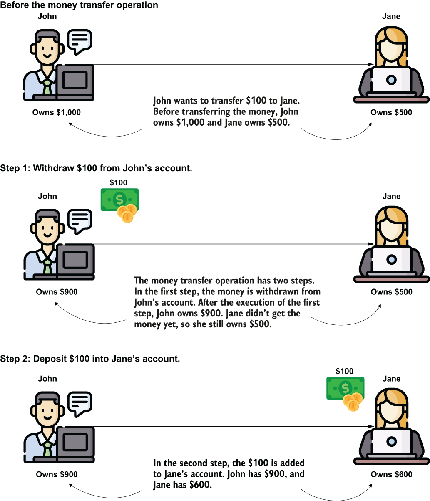
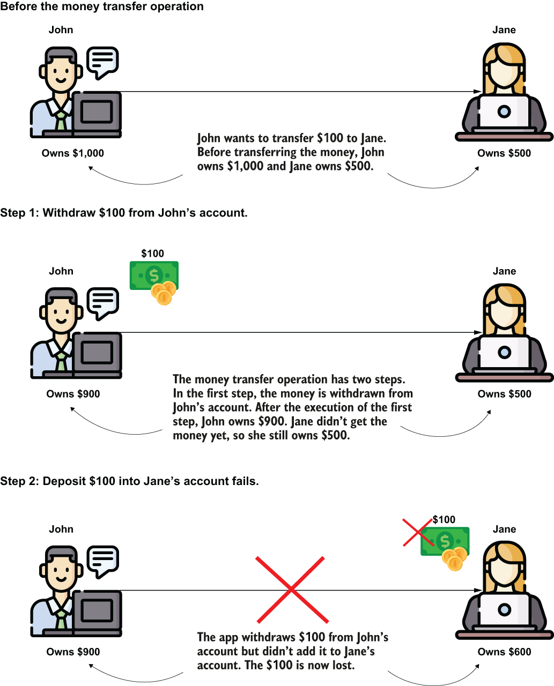
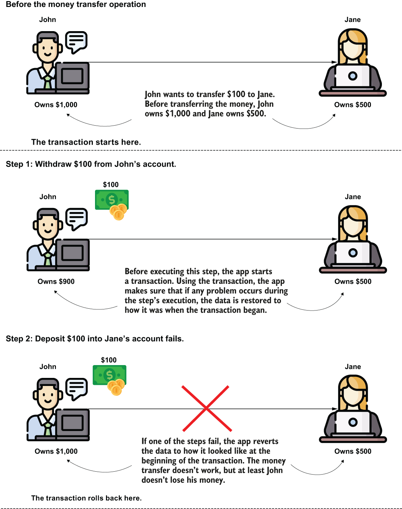
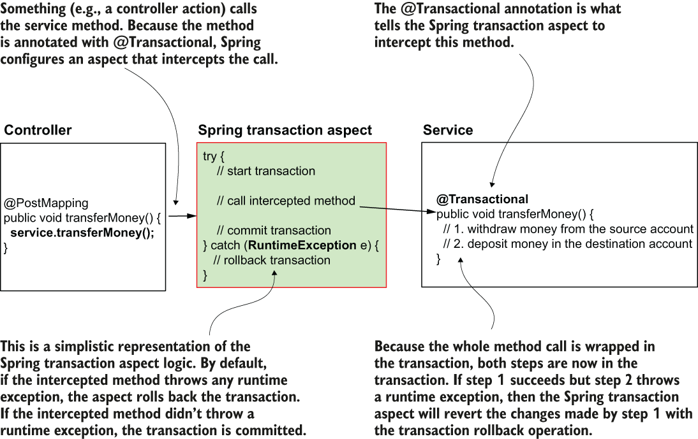
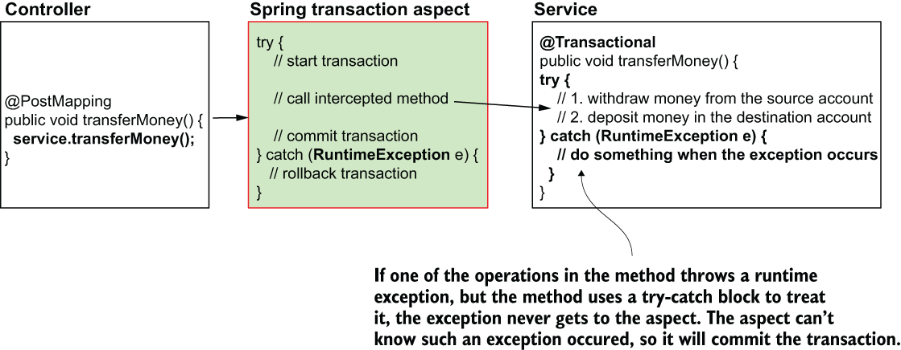
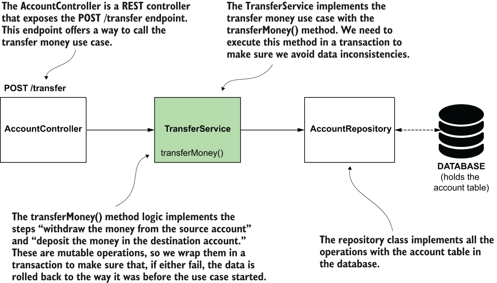
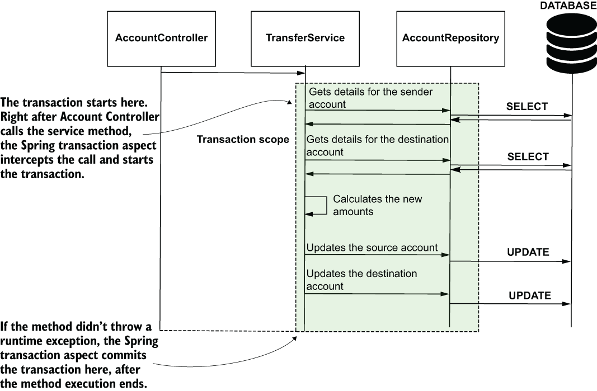
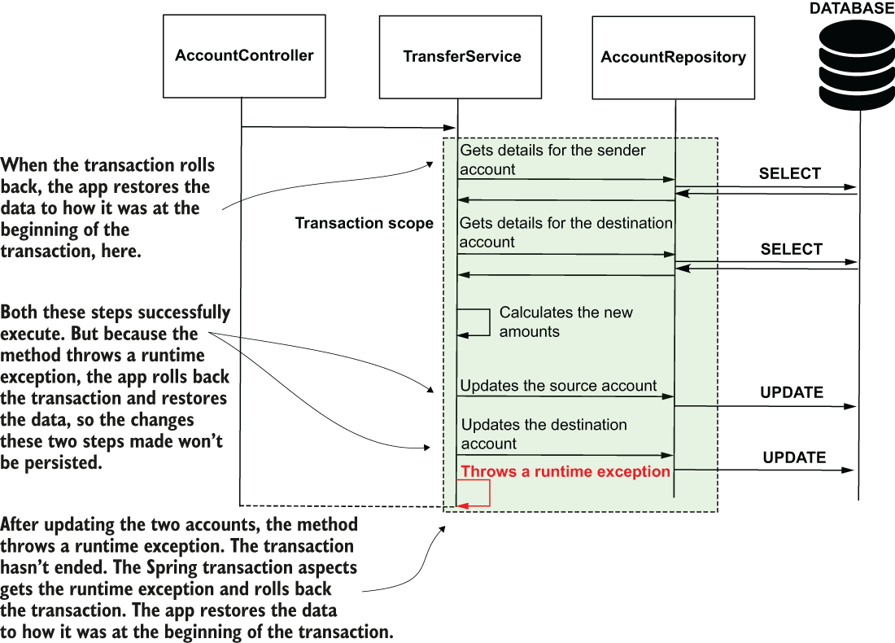

# 13 Sử dụng transaction trong ứng dụng Spring

**Chương này bao gồm**

- Transaction là gì
- Spring quản lý transaction như thế nào
- Sử dụng transaction trong ứng dụng Spring

Một trong những điều quan trọng nhất chúng ta cân nhắc khi quản lý dữ liệu là giữ cho dữ liệu chính xác. Chúng ta không muốn những kịch bản thực thi cụ thể kết thúc với dữ liệu sai hoặc không nhất quán. Hãy để tôi đưa ra một ví dụ. Giả sử bạn triển khai một ứng dụng dùng để chia sẻ tiền, một ví điện tử. Trong ứng dụng này, người dùng có các tài khoản để lưu tiền của họ. Bạn triển khai một chức năng cho phép người dùng chuyển tiền từ tài khoản này sang tài khoản khác. Xét một cách triển khai đơn giản cho ví dụ của chúng ta, điều này ngụ ý hai bước (hình 13.1):

1. Rút tiền từ tài khoản nguồn.
2. Nạp tiền vào tài khoản đích.



> **Hình 13.1** Một ví dụ về use case. Khi chuyển tiền từ tài khoản này sang tài khoản khác, ứng dụng thực thi hai thao tác: trừ số tiền chuyển khỏi tài khoản thứ nhất và cộng vào tài khoản thứ hai. Chúng ta sẽ triển khai use case này, và cần đảm bảo việc thực thi nó không tạo ra sự không nhất quán trong dữ liệu.

Cả hai bước này đều là các thao tác thay đổi dữ liệu (thao tác dữ liệu khả biến), và cả hai thao tác đều cần thành công để thực thi việc chuyển tiền đúng. Nhưng điều gì xảy ra nếu bước thứ hai gặp sự cố và không thể hoàn thành? Nếu bước đầu tiên đã xong, nhưng bước 2 không thể hoàn thành, dữ liệu trở nên không nhất quán.

Giả sử John gửi $100 cho Jane. John có $1.000 trong tài khoản trước khi thực hiện chuyển tiền, còn Jane có $500. Sau khi việc chuyển tiền hoàn tất, chúng ta mong đợi tài khoản của John sẽ ít đi $100 (tức là $1.000 - $100 = $900), còn Jane sẽ nhận được $100. Jane sẽ có $500 + $100 = $600.

Nếu bước thứ hai thất bại, chúng ta rơi vào tình huống tiền đã bị lấy khỏi tài khoản của John, nhưng Jane không bao giờ nhận được. John sẽ có $900 còn Jane vẫn có $500. $100 đã đi đâu? Hình 13.2 minh họa hành vi này.



> **Hình 13.2** Nếu một trong các bước của use case thất bại, dữ liệu trở nên không nhất quán. Với ví dụ chuyển tiền, nếu thao tác trừ tiền khỏi tài khoản thứ nhất thành công, nhưng thao tác cộng tiền vào tài khoản đích thất bại, tiền bị mất.

Để tránh những kịch bản mà dữ liệu trở nên không nhất quán như vậy, chúng ta cần đảm bảo hoặc cả hai bước thực thi đúng hoặc không bước nào thực thi. Transaction cho chúng ta khả năng triển khai nhiều thao tác mà hoặc tất cả thực thi đúng hoặc không thao tác nào.

## 13.1 Transaction

Trong mục này, chúng ta bàn về transaction. Transaction là một tập hợp xác định các thao tác khả biến (thao tác thay đổi dữ liệu) mà hoặc thực thi đúng tất cả cùng nhau hoặc hoàn toàn không. Chúng ta gọi điều này là tính nguyên tử (atomicity). Transaction thiết yếu trong ứng dụng vì chúng đảm bảo dữ liệu vẫn nhất quán nếu bất kỳ bước nào của use case thất bại khi ứng dụng đã thay đổi dữ liệu. Hãy lại xét chức năng chuyển tiền (đơn giản hóa) gồm hai bước:

1. Rút tiền từ tài khoản nguồn.
2. Nạp tiền vào tài khoản đích.

Chúng ta có thể bắt đầu một transaction trước bước 1 và đóng transaction sau bước 2 (hình 13.3). Trong trường hợp như vậy, nếu cả hai bước thực thi thành công, khi transaction kết thúc (sau bước 2), ứng dụng lưu trữ các thay đổi do cả hai bước thực hiện. Trong trường hợp này, chúng ta cũng nói transaction "commit". Thao tác "commit" xảy ra khi transaction kết thúc và tất cả các bước đã thực thi thành công, nên ứng dụng lưu trữ các thay đổi dữ liệu.



> **Hình 13.3** Transaction giải quyết các sự không nhất quán có thể xuất hiện nếu bất kỳ bước nào của use case thất bại. Với transaction, nếu bất kỳ bước nào thất bại, dữ liệu được khôi phục về trạng thái lúc bắt đầu transaction.

> **COMMIT** Kết thúc thành công của một transaction, khi ứng dụng lưu tất cả các thay đổi do các thao tác khả biến của transaction thực hiện.

Nếu bước 1 thực thi không có vấn đề, nhưng bước 2 thất bại vì bất kỳ lý do gì, ứng dụng hoàn tác các thay đổi mà bước 1 đã thực hiện. Thao tác này được gọi là rollback.

> **ROLLBACK** Transaction kết thúc bằng rollback khi ứng dụng khôi phục dữ liệu về trạng thái lúc bắt đầu transaction để tránh sự không nhất quán dữ liệu.

## 13.2 Transaction hoạt động như thế nào trong Spring

Trước khi chỉ cho bạn cách dùng transaction trong ứng dụng Spring, hãy bàn về cách transaction hoạt động trong Spring và các khả năng mà framework cung cấp cho bạn để triển khai code transactional. Thực tế, một aspect của Spring AOP nằm phía sau hậu trường của transaction. (Chúng ta đã bàn về cách aspect hoạt động trong chương 6.)

Aspect là một đoạn code chặn (intercept) việc thực thi của các method cụ thể theo cách bạn định nghĩa. Trong hầu hết các trường hợp ngày nay, chúng ta dùng annotation để đánh dấu các method mà aspect cần chặn và thay đổi việc thực thi. Với transaction của Spring, mọi thứ cũng không khác. Để đánh dấu một method mà chúng ta muốn Spring bọc trong transaction, chúng ta dùng một annotation tên là `@Transactional`. Phía sau hậu trường, Spring cấu hình một aspect (bạn không tự triển khai aspect này; Spring cung cấp nó) và áp dụng logic transaction cho các thao tác được thực thi bởi method đó (hình 13.4).



> **Hình 13.4** Khi bạn dùng annotation @Transactional với một method, một aspect do Spring cấu hình chặn lời gọi method và áp dụng logic transaction cho lời gọi đó. Ứng dụng không lưu trữ các thay đổi mà method thực hiện nếu method ném ra một runtime exception.

Spring biết rollback transaction nếu method ném ra một runtime exception. Nhưng tôi muốn nhấn mạnh từ "ném ra". Khi tôi dạy Spring trên lớp, học viên thường hiểu rằng chỉ cần một thao tác nào đó bên trong method `transferMoney()` ném ra runtime exception là đủ. Nhưng như vậy là không đủ! Method transactional phải ném exception ra ngoài để aspect biết nó cần rollback các thay đổi. Nếu method xử lý exception trong logic của nó và không ném exception ra ngoài, aspect không thể biết exception đã xảy ra (hình 13.5).



> **Hình 13.5** Nếu một runtime exception được ném ra bên trong method, nhưng method xử lý exception và không ném lại cho bên gọi, aspect sẽ không nhận được exception này và sẽ commit transaction. Khi bạn xử lý exception trong một method transactional, như trong trường hợp này, bạn cần nhận thức rằng transaction sẽ không được rollback, vì aspect quản lý transaction không thể thấy exception.

> **Còn checked exception trong transaction thì sao?**
>
> Đến giờ, tôi mới chỉ bàn về runtime exception. Nhưng còn checked exception thì sao? Checked exception trong Java là những exception bạn phải xử lý hoặc ném ra; nếu không, ứng dụng của bạn sẽ không biên dịch được. Chúng có gây rollback transaction nếu method ném ra chúng không? Mặc định là không! Hành vi mặc định của Spring chỉ rollback transaction khi gặp runtime exception. Đây là cách bạn sẽ thấy transaction được dùng trong hầu hết mọi tình huống thực tế.
>
> Khi bạn làm việc với checked exception, bạn phải thêm mệnh đề "throws" vào chữ ký method; nếu không, code của bạn sẽ không biên dịch được, nên bạn luôn biết khi nào logic của mình có thể ném ra exception như vậy. Vì lý do này, một tình huống được biểu diễn bằng checked exception không phải là vấn đề có thể gây không nhất quán dữ liệu, mà là một kịch bản có kiểm soát cần được quản lý bởi logic mà lập trình viên triển khai.
>
> Tuy nhiên, nếu bạn muốn Spring cũng rollback transaction cho checked exception, bạn có thể thay đổi hành vi mặc định của Spring. Annotation `@Transactional`, mà bạn sẽ học cách dùng trong mục 13.3, có các thuộc tính để định nghĩa những exception nào bạn muốn Spring rollback transaction.
>
> Tuy nhiên, tôi khuyên bạn luôn giữ ứng dụng đơn giản và, trừ khi cần thiết, hãy dựa vào hành vi mặc định của framework.

## 13.3 Sử dụng transaction trong ứng dụng Spring

Hãy bắt đầu với một ví dụ dạy bạn cách dùng transaction trong ứng dụng Spring. Khai báo một transaction trong ứng dụng Spring dễ như dùng một annotation: `@Transactional`. Bạn dùng `@Transactional` để đánh dấu method mà bạn muốn Spring bọc trong transaction. Bạn không cần làm gì khác. Spring cấu hình một aspect chặn các method bạn đánh dấu bằng `@Transactional`. Aspect này bắt đầu một transaction và hoặc commit các thay đổi của method nếu mọi thứ ổn hoặc rollback các thay đổi nếu có bất kỳ runtime exception nào xảy ra.

Chúng ta sẽ viết một ứng dụng lưu chi tiết tài khoản trong một bảng database. Hãy tưởng tượng đây là backend của một ứng dụng ví điện tử mà bạn triển khai. Chúng ta sẽ tạo khả năng chuyển tiền từ tài khoản này sang tài khoản khác. Với use case này, chúng ta cần dùng transaction để đảm bảo dữ liệu vẫn nhất quán nếu có exception xảy ra.

Thiết kế class của ứng dụng chúng ta triển khai rất đơn giản. Chúng ta dùng một bảng trong database để lưu chi tiết tài khoản (bao gồm số tiền). Chúng ta triển khai một repository để làm việc với dữ liệu trong bảng này, và triển khai logic nghiệp vụ (use case chuyển tiền) trong một class service. Method của service triển khai logic nghiệp vụ là nơi chúng ta cần dùng transaction. Chúng ta cung cấp use case này bằng cách triển khai một endpoint trong class controller. Để chuyển tiền từ tài khoản này sang tài khoản khác, ai đó cần gọi endpoint này. Hình 13.6 minh họa thiết kế class của ứng dụng.



> **Hình 13.6** Chúng ta triển khai use case chuyển tiền trong một class service và cung cấp method service này thông qua REST endpoint. Method service dùng repository để truy cập dữ liệu trong database và thay đổi nó. Method service (triển khai logic nghiệp vụ) phải được bọc trong transaction để tránh không nhất quán dữ liệu nếu có vấn đề xảy ra trong quá trình thực thi method.

Bạn tìm thấy ví dụ trong project "sq-ch13-ex1". Chúng ta sẽ tạo một project Spring Boot và thêm các dependency vào file pom.xml, như trong đoạn code tiếp theo. Chúng ta tiếp tục dùng Spring JDBC (như đã làm ở chương 12) và database in-memory H2:

```xml
<dependency>
   <groupId>org.springframework.boot</groupId>
   <artifactId>spring-boot-starter-web</artifactId>
</dependency>
<dependency>
   <groupId>org.springframework.boot</groupId>
   <artifactId>spring-boot-starter-data-jdbc</artifactId>
</dependency>
<dependency>
   <groupId>com.h2database</groupId>
   <artifactId>h2</artifactId>
   <scope>runtime</scope>
</dependency>
```

Ứng dụng chỉ làm việc với một bảng trong database. Chúng ta đặt tên bảng này là "account", và nó có các trường sau:

- id: Primary key. Chúng ta định nghĩa trường này là giá trị INT tự tăng.
- name: Tên chủ tài khoản.
- amount: Số tiền chủ tài khoản có trong tài khoản.

Chúng ta dùng file "schema.sql" trong thư mục resources của project để tạo bảng. Trong file này, chúng ta viết truy vấn SQL để tạo bảng, như trong đoạn code tiếp theo:

```sql
create table account (
    id INT NOT NULL AUTO_INCREMENT PRIMARY KEY,
     name VARCHAR(50) NOT NULL,
     amount DOUBLE NOT NULL
);
```

Chúng ta cũng thêm một file "data.sql" bên cạnh "schema.sql" trong thư mục resources để tạo hai bản ghi mà chúng ta sẽ dùng sau này để kiểm tra. File "data.sql" chứa các truy vấn SQL để thêm hai bản ghi tài khoản vào database. Bạn thấy các truy vấn này trong đoạn code sau:

```sql
INSERT INTO account VALUES (NULL, 'Helen Down', 1000);
INSERT INTO account VALUES (NULL, 'Peter Read', 1000);
```

Chúng ta cần một class mô hình hóa bảng account để có cách tham chiếu đến dữ liệu trong ứng dụng, nên chúng ta tạo một class tên là `Account` để mô hình hóa các bản ghi account trong database, như trong listing sau.

**Listing 13.1** Class Account mô hình hóa bảng account

```java
public class Account {

    private long id;
    private String name;
    private BigDecimal amount;

    // Omitted getters and setters
}
```

Để triển khai use case "chuyển tiền", chúng ta cần các khả năng sau ở tầng repository:

1. Tìm chi tiết của một tài khoản bằng ID tài khoản.
2. Cập nhật số tiền cho một tài khoản cho trước.

Chúng ta sẽ triển khai các khả năng này như đã bàn ở chương 10, bằng `JdbcTemplate`. Với bước 1, chúng ta triển khai method `findAccountById(long id)`, method này nhận ID tài khoản trong tham số và dùng `JdbcTemplate` để lấy chi tiết tài khoản có ID đó từ database. Với bước 2, chúng ta triển khai một method tên là `changeAmount(long id, BigDecimal amount)`. Method này đặt số tiền nhận được ở tham số thứ hai cho tài khoản có ID nhận được ở tham số thứ nhất. Listing tiếp theo cho bạn thấy phần triển khai của hai method này.

**Listing 13.2** Triển khai các khả năng lưu trữ trong repository

```java
@Repository                                                              ❶
public class AccountRepository {

    private final JdbcTemplate jdbc;

    public AccountRepository(JdbcTemplate jdbc) {                        ❷
      this.jdbc = jdbc;
    }

    public Account findAccountById(long id) {
        String sql = "SELECT * FROM account WHERE id = ?";               ❸
        return jdbc.queryForObject(sql, new AccountRowMapper(), id);
    }

    public void changeAmount(long id, BigDecimal amount) {
      String sql = "UPDATE account SET amount = ? WHERE id = ?";
        jdbc.update(sql, amount, id);                                         ❹
    }
}
```

❶ Chúng ta thêm một bean của class này vào Spring context bằng annotation `@Repository` để sau này inject bean này vào nơi dùng nó trong class service.

❷ Chúng ta dùng dependency injection qua constructor để lấy đối tượng `JdbcTemplate` để làm việc với database.

❸ Chúng ta lấy chi tiết của một tài khoản bằng cách gửi truy vấn SELECT đến DBMS thông qua method `queryForObject()` của `JdbcTemplate`. Chúng ta cũng cần cung cấp một `RowMapper` để nói cho `JdbcTemplate` biết cách ánh xạ một hàng trong kết quả thành đối tượng model của chúng ta.

❹ Chúng ta thay đổi số tiền của một tài khoản bằng cách gửi truy vấn UPDATE đến DBMS thông qua method `update()` của `JdbcTemplate`.

Như bạn đã học ở chương 12, khi bạn dùng `JdbcTemplate` để truy xuất dữ liệu từ database bằng truy vấn SELECT, bạn cần cung cấp một đối tượng `RowMapper`, đối tượng này nói cho `JdbcTemplate` biết cách ánh xạ mỗi hàng của kết quả từ database thành đối tượng model cụ thể của bạn. Trong trường hợp của chúng ta, chúng ta cần nói cho `JdbcTemplate` biết cách ánh xạ một hàng trong kết quả thành đối tượng `Account`. Listing tiếp theo cho bạn thấy cách triển khai đối tượng `RowMapper`.

**Listing 13.3** Ánh xạ hàng thành instance của đối tượng model bằng RowMapper

```java
public class AccountRowMapper
  implements RowMapper<Account> {                                         ❶

    @Override
    public Account mapRow(ResultSet resultSet, int i)                     ❷
        throws SQLException {
        Account a = new Account();                                        ❸
        a.setId(resultSet.getInt("id"));                                  ❸
        a.setName(resultSet.getString("name"));                           ❸
        a.setAmount(resultSet.getBigDecimal("amount"));                   ❸
        return a;                                                         ❹
    }
}
```

❶ Chúng ta triển khai contract `RowMapper` và cung cấp class model mà chúng ta ánh xạ hàng kết quả vào dưới dạng kiểu generic.

❷ Chúng ta triển khai method `mapRow()`, method này nhận kết quả truy vấn làm tham số (dưới dạng đối tượng `ResultSet`) và trả về instance `Account` mà chúng ta ánh xạ hàng hiện tại vào.

❸ Chúng ta ánh xạ các giá trị trên hàng kết quả hiện tại vào các thuộc tính của `Account`.

❹ Chúng ta trả về instance account sau khi ánh xạ các giá trị kết quả.

Để kiểm tra ứng dụng dễ dàng hơn, hãy cũng thêm khả năng lấy tất cả chi tiết tài khoản từ database, như trong listing sau. Chúng ta sẽ dùng khả năng này khi xác nhận ứng dụng hoạt động như mong đợi.

**Listing 13.4** Lấy tất cả bản ghi account từ database

```java
@Repository
public class AccountRepository {

    // Omitted code

    public List<Account> findAllAccounts() {
      String sql = "SELECT * FROM account";
        return jdbc.query(sql, new AccountRowMapper());
    }

}
```

Trong class service, chúng ta triển khai logic cho use case "chuyển tiền". Class `TransferService` dùng class `AccountRepository` để quản lý dữ liệu trong bảng account. Logic mà method triển khai như sau:

1. Lấy chi tiết tài khoản nguồn và đích để biết số tiền trong cả hai tài khoản.
2. Rút số tiền chuyển khỏi tài khoản thứ nhất bằng cách đặt một giá trị mới, là số tiền của tài khoản trừ đi số tiền cần rút.
3. Nạp số tiền chuyển vào tài khoản đích bằng cách đặt một giá trị mới, là số tiền hiện tại của tài khoản cộng với số tiền chuyển.

Listing 13.5 cho bạn thấy cách method `transferMoney()` của class service triển khai logic này. Hãy quan sát rằng điểm 2 và 3 định nghĩa các thao tác khả biến. Cả hai thao tác này đều thay đổi dữ liệu được lưu trữ (tức là chúng cập nhật số tiền của một tài khoản nào đó). Nếu chúng ta không bọc chúng trong transaction, chúng ta có thể rơi vào những trường hợp dữ liệu trở nên không nhất quán vì một trong các bước thất bại.

May mắn thay, chúng ta chỉ cần dùng annotation `@Transactional` để đánh dấu method là transactional và nói cho Spring biết nó cần chặn các lần thực thi của method này và bọc chúng trong transaction. Listing sau cho bạn thấy phần triển khai logic use case chuyển tiền trong class service.

**Listing 13.5** Triển khai use case chuyển tiền trong class service

```java
@Service
public class TransferService {

    private final AccountRepository accountRepository;

    public TransferService(AccountRepository accountRepository) {
        this.accountRepository = accountRepository;
    }

    @Transactional                                                 ❶
    public void transferMoney(long idSender,
                                   long idReceiver,
                                   BigDecimal amount) {
        Account sender =                                           ❷
          accountRepository.findAccountById(idSender);             ❷
        Account receiver =                                         ❷
          accountRepository.findAccountById(idReceiver); ❷

        BigDecimal senderNewAmount =                               ❸
          sender.getAmount().subtract(amount);                     ❸
        BigDecimal receiverNewAmount =                             ❹
          receiver.getAmount().add(amount);                        ❹

        accountRepository                                          ❺
         .changeAmount(idSender, senderNewAmount);                 ❺

        accountRepository                                          ❻
        .changeAmount(idReceiver, receiverNewAmount);              ❻
    }
}
```

❶ Chúng ta dùng annotation `@Transactional` để chỉ thị Spring bọc các lời gọi của method trong transaction.

❷ Chúng ta lấy chi tiết các tài khoản để biết số tiền hiện tại trong mỗi tài khoản.

❸ Chúng ta tính số tiền mới cho tài khoản người gửi.

❹ Chúng ta tính số tiền mới cho tài khoản đích.

❺ Chúng ta đặt giá trị số tiền mới cho tài khoản người gửi.

❻ Chúng ta đặt giá trị số tiền mới cho tài khoản đích.

Hình 13.7 trình bày trực quan phạm vi transaction và các bước mà method `transferMoney()` thực thi.



> **Hình 13.7** Transaction bắt đầu ngay trước khi method service thực thi và kết thúc ngay sau khi method kết thúc thành công. Nếu method không ném ra runtime exception nào, ứng dụng commit transaction. Nếu bất kỳ bước nào gây ra runtime exception, ứng dụng khôi phục dữ liệu về trạng thái trước khi transaction bắt đầu.

Hãy cũng triển khai một method truy xuất tất cả các tài khoản. Chúng ta sẽ cung cấp method này bằng một endpoint trong class controller mà chúng ta sẽ định nghĩa sau. Chúng ta sẽ dùng nó để kiểm tra dữ liệu đã được thay đổi đúng khi kiểm tra use case chuyển tiền.

> **Sử dụng @Transactional**
>
> Annotation `@Transactional` cũng có thể được áp dụng trực tiếp cho class. Nếu dùng trên class (như trong đoạn code tiếp theo), annotation áp dụng cho tất cả các method của class. Thường trong các ứng dụng thực tế bạn sẽ thấy annotation `@Transactional` được dùng trên class, vì các method của một class service định nghĩa các use case, và nhìn chung, tất cả các use case đều cần transactional. Để tránh lặp lại annotation trên từng method, đơn giản hơn là chỉ đánh dấu class một lần. Khi dùng `@Transactional` trên cả class lẫn method, cấu hình ở cấp method ghi đè cấu hình trên class:
>
> ```java
> @Service
> @Transactional                               ❶
> public class TransferService {
>    // Omitted code
>
>    public void transferMoney(long idSender,
>                                      long idReceiver,
>                                    BigDecimal amount) {
>
>         // Omitted code
>     }
> }
> ```
>
> ❶ Chúng ta thường dùng annotation `@Transactional` trực tiếp với class. Nếu class có nhiều method, `@Transactional` áp dụng cho tất cả chúng.

Listing tiếp theo cho bạn thấy phần triển khai method `getAllAccounts()`, method này trả về danh sách tất cả các bản ghi account trong database.

**Listing 13.6** Triển khai method service trả về tất cả các tài khoản hiện có

```java
@Service
public class TransferService {

    // Omitted code

    public List<Account> getAllAccounts() {
        return accountRepository.findAllAccounts();
    }
}
```

Trong listing sau, bạn thấy phần triển khai class `AccountController` định nghĩa các endpoint cung cấp các method của service.

**Listing 13.7** Cung cấp các use case thông qua REST endpoint trong class controller

```java
@RestController
public class AccountController {

    private final TransferService transferService;

    public AccountController(TransferService transferService) {
        this.transferService = transferService;
    }

    @PostMapping("/transfer")                            ❶
    public void transferMoney(
          @RequestBody TransferRequest request           ❷
          ) {
        transferService.transferMoney(                   ❸
             request.getSenderAccountId(),
             request.getReceiverAccountId(),
             request.getAmount());
    }

    @GetMapping("/accounts")
    public List<Account> getAllAccounts() {
        return transferService.getAllAccounts();
    }
}
```

❶ Chúng ta dùng HTTP method POST cho endpoint /transfer vì nó thực hiện các thay đổi trên dữ liệu của database.

❷ Chúng ta dùng request body để nhận các giá trị cần thiết (ID tài khoản nguồn, ID tài khoản đích, và số tiền cần chuyển).

❸ Chúng ta gọi method `transferMoney()` của service, method transactional triển khai use case chuyển tiền.

Chúng ta dùng một đối tượng kiểu `TransferRequest` làm tham số của action controller `transferMoney()`. Đối tượng `TransferRequest` đơn giản mô hình hóa HTTP request body. Những đối tượng như vậy, có trách nhiệm mô hình hóa dữ liệu được truyền giữa hai ứng dụng, là DTO. Listing sau cho thấy định nghĩa của DTO `TransferRequest`.

**Listing 13.8** Data transfer object TransferRequest mô hình hóa HTTP request body

```java
public class TransferRequest {

    private long senderAccountId;
    private long receiverAccountId;
    private BigDecimal amount;

    // Omitted code
}
```

Khởi động ứng dụng, và hãy kiểm tra transaction hoạt động thế nào. Chúng ta dùng cURL hoặc Postman để gọi endpoint mà ứng dụng cung cấp. Trước hết, hãy gọi endpoint /accounts để kiểm tra dữ liệu trông thế nào trước khi thực thi bất kỳ thao tác chuyển tiền nào. Đoạn tiếp theo cho bạn thấy lệnh cURL để gọi endpoint /accounts:

```bash
curl http://localhost:8080/accounts
```

Khi bạn chạy lệnh này, bạn sẽ thấy đầu ra trong console tương tự như trong đoạn tiếp theo:

```json
[
    {"id":1,"name":"Helen Down","amount":1000.0},
    {"id":2,"name":"Peter Read","amount":1000.0}
]
```

Chúng ta có hai tài khoản trong database (chúng ta đã chèn chúng ở phần đầu mục này khi định nghĩa file "data.sql"). Cả Helen và Peter mỗi người có $1.000. Giờ hãy thực thi use case chuyển tiền để chuyển $100 từ Helen sang Peter. Trong đoạn code tiếp theo, bạn thấy lệnh cURL cần chạy để gọi endpoint /transfer nhằm gửi $100 từ Helen sang Peter:

```bash
curl -XPOST -H "content-type:application/json" -d '{"senderAccountId":1, "receiverAccountId":2, "amount":100}' http://localhost:8080/transfer
```

Nếu bạn gọi lại endpoint /accounts, bạn sẽ thấy sự khác biệt. Sau thao tác chuyển tiền, Helen có $900, còn Peter giờ có $1.100:

```bash
curl http://localhost:8080/accounts
```

Kết quả của việc gọi endpoint /accounts sau thao tác chuyển tiền được trình bày trong đoạn tiếp theo:

```json
[
    {"id":1,"name":"Helen Down","amount":900.0},
    {"id":2,"name":"Peter Read","amount":1100.0}
]
```

Ứng dụng đang hoạt động, và use case cho kết quả như mong đợi. Nhưng chúng ta chứng minh transaction thực sự hoạt động ở đâu? Ứng dụng lưu trữ dữ liệu đúng khi mọi thứ ổn, nhưng làm sao chúng ta biết ứng dụng thực sự khôi phục dữ liệu nếu có gì đó trong method ném ra runtime exception? Chúng ta có nên chỉ tin rằng nó làm vậy? Dĩ nhiên là không!

> **LƯU Ý** Một trong những điều quan trọng nhất tôi học được về ứng dụng là bạn không bao giờ nên tin thứ gì đó hoạt động trừ khi bạn đã kiểm tra nó đúng cách!

Tôi thích nói rằng cho đến khi bạn kiểm tra bất kỳ tính năng nào của ứng dụng, nó đang ở trạng thái Schrödinger. Nó vừa hoạt động vừa không hoạt động cho đến khi bạn chứng minh trạng thái của nó. Dĩ nhiên, đây chỉ là một phép so sánh cá nhân tôi đưa ra với một khái niệm thiết yếu từ cơ học lượng tử.

Hãy kiểm tra transaction rollback như mong đợi khi có runtime exception nào đó xảy ra. Tôi đã nhân bản project "sq-ch13-ex1" thành project "sq-ch13-ex2". Trong bản sao này của project, tôi chỉ thêm một dòng code ném ra runtime exception ở cuối method service `transferMoney()`, như trong listing sau.

**Listing 13.9** Mô phỏng một vấn đề xảy ra trong quá trình thực thi use case

```java
@Service
public class TransferService {

    // Omitted code

    @Transactional
    public void transferMoney(
     long idSender,
     long idReceiver,
     BigDecimal amount) {

        Account sender = accountRepository.findAccountById(idSender);
        Account receiver = accountRepository.findAccountById(idReceiver);

        BigDecimal senderNewAmount = sender.getAmount().subtract(amount);
        BigDecimal receiverNewAmount = receiver.getAmount().add(amount);

        accountRepository.changeAmount(idSender, senderNewAmount);
        accountRepository.changeAmount(idReceiver, receiverNewAmount);

        throw new RuntimeException("Oh no! Something went wrong!");       ❶
    }

}
```

❶ Chúng ta ném ra một runtime exception ở cuối method service để mô phỏng một vấn đề xảy ra trong transaction.

Hình 13.8 minh họa thay đổi chúng ta đã làm trong method service `transferMoney()`.



> **Hình 13.8** Khi method ném ra runtime exception, Spring rollback transaction. Tất cả các thay đổi thành công trên dữ liệu không được lưu trữ. Ứng dụng khôi phục dữ liệu về trạng thái khi transaction bắt đầu.

Chúng ta khởi động ứng dụng và kiểm tra các bản ghi tài khoản bằng cách gọi endpoint /accounts, endpoint này trả về tất cả các tài khoản trong database:

```bash
curl http://localhost:8080/accounts
```

Khi bạn chạy lệnh này, bạn sẽ thấy đầu ra trong console tương tự như trong đoạn tiếp theo:

```json
[
    {"id":1,"name":"Helen Down","amount":1000.0},
    {"id":2,"name":"Peter Read","amount":1000.0}
]
```

Như trong lần kiểm tra trước, chúng ta gọi endpoint /transfer để chuyển $100 từ Helen sang Peter bằng lệnh cURL, như trong đoạn tiếp theo:

```bash
curl -XPOST -H "content-type:application/json" -d '{"senderAccountId":1, "receiverAccountId":2, "amount":100}' http://localhost:8080/transfer
```

Giờ, method `transferMoney()` của class service ném ra một exception, dẫn đến lỗi 500 trong response gửi về client. Bạn sẽ thấy exception này trong console của ứng dụng. Stack trace của exception tương tự như trong đoạn code tiếp theo:

```text
java.lang.RuntimeException: Oh no! Something went wrong!
      at
com.example.services.TransferService.transferMoney(TransferService.java:...)
➥ ~[classes/:na]
   at
com.example.services.TransferService$$FastClassBySpringCGLIB$$338bad6b.invoke
➥ (<generated>) ~[classes/:na]
   at
org.springframework.cglib.proxy.MethodProxy.invoke(MethodProxy.java:218)
➥ ~[spring-core-5.3.3.jar:5.3.3]
```

Hãy gọi lại endpoint /accounts và xem ứng dụng có thay đổi các tài khoản không:

```bash
curl http://localhost:8080/accounts
```

Khi bạn chạy lệnh này, bạn sẽ thấy đầu ra trong console tương tự như trong đoạn tiếp theo:

```json
[
    {"id":1,"name":"Helen Down","amount":1000.0},
    {"id":2,"name":"Peter Read","amount":1000.0}
]
```

Bạn thấy dữ liệu không thay đổi ngay cả khi exception xảy ra sau hai thao tác thay đổi số tiền trong các tài khoản. Helen đáng lẽ có $900 và Peter $1.100, nhưng cả hai vẫn có cùng số tiền trong tài khoản. Kết quả này là hệ quả của việc transaction được ứng dụng rollback, khiến dữ liệu được khôi phục về trạng thái lúc bắt đầu transaction. Ngay cả khi cả hai bước khả biến đã được thực thi, khi aspect transaction của Spring nhận được runtime exception, nó đã rollback transaction.

## Tóm tắt

- Transaction là một tập hợp các thao tác thay đổi dữ liệu, mà hoặc thực thi cùng nhau hoặc hoàn toàn không. Trong tình huống thực tế, hầu như mọi use case đều nên là đối tượng của transaction để tránh không nhất quán dữ liệu.
- Nếu bất kỳ thao tác nào thất bại, ứng dụng khôi phục dữ liệu về trạng thái lúc bắt đầu transaction. Khi điều đó xảy ra, chúng ta nói transaction rollback.
- Nếu tất cả các thao tác thành công, chúng ta nói transaction commit, nghĩa là ứng dụng lưu trữ tất cả các thay đổi mà việc thực thi use case đã thực hiện.
- Để triển khai code transactional trong Spring, bạn dùng annotation `@Transactional`. Bạn dùng annotation `@Transactional` để đánh dấu method mà bạn mong đợi Spring bọc trong transaction. Bạn cũng có thể đánh dấu class bằng `@Transactional` để nói cho Spring biết mọi method của class đều cần transactional.
- Khi thực thi, một aspect của Spring chặn các method được đánh dấu `@Transactional`. Aspect bắt đầu transaction, và nếu có exception xảy ra, aspect rollback transaction. Nếu method không ném ra exception, transaction commit, và ứng dụng lưu trữ các thay đổi của method.
