# 14 Triển khai lưu trữ dữ liệu với Spring Data

**Chương này bao gồm**

- Spring Data hoạt động như thế nào
- Định nghĩa các repository của Spring Data
- Dùng Spring Data JDBC để triển khai tầng lưu trữ của ứng dụng Spring

Trong chương này, bạn sẽ học cách dùng Spring Data, một project trong hệ sinh thái Spring cho bạn khả năng triển khai tầng lưu trữ (persistence layer) của ứng dụng Spring với công sức tối thiểu. Như bạn đã biết, vai trò thiết yếu của một application framework là cung cấp các khả năng có sẵn mà bạn có thể cắm trực tiếp vào ứng dụng. Framework giúp chúng ta tiết kiệm thời gian và cũng làm thiết kế của ứng dụng dễ hiểu hơn.

Bạn sẽ học cách tạo các repository của ứng dụng bằng cách khai báo interface. Bạn sẽ để framework cung cấp implementation cho các interface này. Bạn thực sự cho phép ứng dụng làm việc với database mà không cần tự triển khai repository và với công sức tối thiểu.

Chúng ta sẽ bắt đầu chương bằng việc bàn về cách Spring Data hoạt động, và trong mục 14.2 bạn sẽ học cách Spring Data tích hợp vào ứng dụng Spring. Sau đó chúng ta tiếp tục trong mục 14.3 với một ví dụ thực hành, nơi bạn sẽ học cách dùng Spring Data JDBC để triển khai tầng lưu trữ của một ứng dụng.

## 14.1 Spring Data là gì

Trong mục này, chúng ta bàn về Spring Data là gì và tại sao chúng ta nên dùng project này để triển khai các khả năng lưu trữ của ứng dụng Spring. Spring Data là một project trong hệ sinh thái Spring giúp đơn giản hóa việc phát triển tầng lưu trữ bằng cách cung cấp các implementation tương ứng với công nghệ lưu trữ mà chúng ta dùng. Bằng cách này, chúng ta chỉ cần viết vài dòng code để định nghĩa các repository của ứng dụng Spring. Hình 14.1 đưa ra biểu diễn trực quan về vị trí của Spring Data từ góc độ ứng dụng.

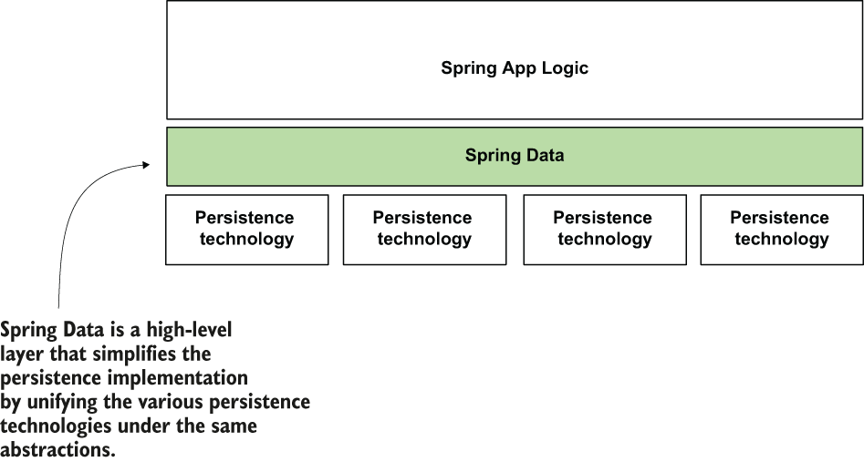

> **Hình 14.1** Hệ sinh thái Java cung cấp một số lượng lớn các công nghệ lưu trữ khác nhau. Bạn dùng mỗi công nghệ theo một cách cụ thể. Mỗi công nghệ có các abstraction và thiết kế class riêng. Spring Data cung cấp một lớp abstraction chung trên tất cả các công nghệ lưu trữ này để đơn giản hóa việc dùng nhiều công nghệ lưu trữ.

Hãy xem Spring Data nằm ở đâu trong một ứng dụng Spring. Trong một ứng dụng, bạn có nhiều công nghệ có thể dùng để làm việc với dữ liệu được lưu trữ. Trong chương 12 và 13, chúng ta dùng JDBC, kết nối trực tiếp đến relational DBMS thông qua driver manager. Nhưng JDBC không phải là cách duy nhất bạn có thể dùng để kết nối đến relational database. Một cách phổ biến khác để triển khai lưu trữ dữ liệu là dùng ORM framework, như Hibernate. Và relational database không phải là loại công nghệ lưu trữ dữ liệu duy nhất. Một ứng dụng có thể dùng một trong nhiều công nghệ NoSQL ngoài kia để lưu trữ dữ liệu.

Hình 14.2 cho bạn thấy một số lựa chọn của Spring để lưu trữ dữ liệu. Mỗi lựa chọn có cách riêng để triển khai các repository của ứng dụng. Đôi khi, bạn thậm chí có nhiều lựa chọn hơn để triển khai tầng lưu trữ của ứng dụng cho một công nghệ (như JDBC). Ví dụ, với JDBC, bạn có thể dùng `JdbcTemplate`, như bạn đã học ở chương 12, nhưng bạn cũng có thể làm việc trực tiếp với các interface của JDK (`Statement`, `PreparedStatement`, `ResultSet`, v.v.). Có quá nhiều cách để triển khai các khả năng lưu trữ của ứng dụng làm tăng độ phức tạp.

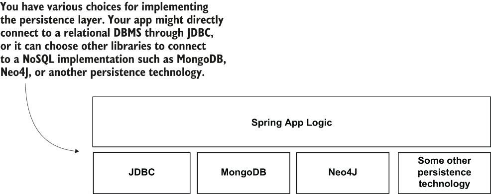

> **Hình 14.2** Dùng JDBC để kết nối đến relational DBMS không phải là lựa chọn duy nhất để triển khai tầng lưu trữ của ứng dụng. Trong thực tế, bạn cũng sẽ dùng các lựa chọn khác, và mỗi cách lưu trữ dữ liệu có library và tập API riêng mà bạn cần học để dùng. Sự đa dạng này làm tăng đáng kể độ phức tạp.

Sơ đồ trở nên phức tạp hơn nếu chúng ta thêm vào các ORM framework như Hibernate. Hình 14.3 cho thấy vị trí của Hibernate trong bức tranh. Ứng dụng của bạn có thể dùng trực tiếp JDBC theo nhiều cách, nhưng cũng có thể dựa vào một framework được triển khai trên JDBC.

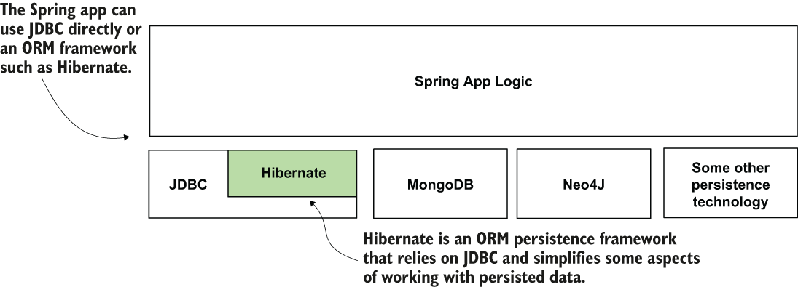

> **Hình 14.3** Đôi khi ứng dụng dùng các framework được xây dựng trên JDBC, như Hibernate. Sự đa dạng trong lựa chọn khiến việc triển khai tầng lưu trữ trở nên phức tạp. Chúng ta muốn loại bỏ sự phức tạp này khỏi ứng dụng, và, như bạn sẽ học, Spring Data giúp chúng ta làm điều này.

Đừng lo lắng! Bạn không cần học tất cả những thứ này cùng lúc, và bạn không cần biết tất cả để học Spring Data. May mắn thay, biết những gì chúng ta đã bàn trong chương 12 và 13 về JDBC là đủ làm nền tảng để bắt đầu học Spring Data. Lý do tôi cho bạn biết tất cả những điều này là để chứng minh tại sao Spring Data lại giá trị đến vậy. Có thể bạn đã tự hỏi, "Có cách nào để chúng ta triển khai lưu trữ cho tất cả các công nghệ này thay vì phải biết các cách khác nhau cho từng công nghệ không?" Câu trả lời là có, và Spring Data giúp chúng ta đạt được mục tiêu này.

Spring Data đơn giản hóa việc triển khai tầng lưu trữ bằng cách làm những điều sau:

- Cung cấp một tập abstraction chung (interface) cho nhiều công nghệ lưu trữ khác nhau. Bằng cách này, bạn dùng cách tiếp cận tương tự để triển khai lưu trữ cho các công nghệ khác nhau.
- Cho phép người dùng triển khai các thao tác lưu trữ chỉ bằng các abstraction, mà Spring Data cung cấp implementation cho chúng. Bằng cách này, bạn viết ít code hơn, nên triển khai các khả năng của ứng dụng nhanh hơn. Với ít code được viết hơn, ứng dụng cũng trở nên dễ hiểu và dễ bảo trì hơn.

Hình 14.4 cho thấy vị trí của Spring Data trong một ứng dụng Spring. Như bạn thấy, Spring Data là một lớp cấp cao trên các cách triển khai lưu trữ khác nhau. Vậy nên, dù bạn chọn cách nào để triển khai lưu trữ cho ứng dụng, nếu bạn dùng Spring Data, bạn sẽ viết các thao tác lưu trữ theo cách tương tự nhau.

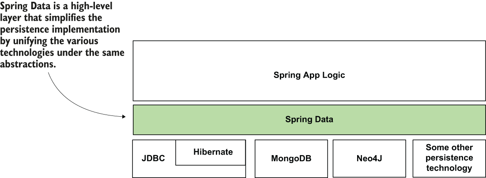

> **Hình 14.4** Spring Data đơn giản hóa việc triển khai tầng lưu trữ bằng cách cung cấp một tập abstraction chung cho nhiều công nghệ khác nhau.

## 14.2 Spring Data hoạt động như thế nào

Trong mục này, chúng ta bàn về cách Spring Data hoạt động và cách bạn sẽ dùng nó để triển khai tầng lưu trữ của ứng dụng Spring. Khi các lập trình viên dùng thuật ngữ "Spring Data", họ thường muốn nói đến tất cả các khả năng mà project này cung cấp cho ứng dụng Spring của bạn để kết nối đến công nghệ lưu trữ này hay công nghệ lưu trữ khác. Trong một ứng dụng, thường bạn dùng một công nghệ cụ thể: JDBC, Hibernate, MongoDB hoặc một công nghệ khác.

Project Spring Data cung cấp các module khác nhau cho từng công nghệ. Các module này độc lập với nhau, và bạn có thể thêm chúng vào project bằng các Maven dependency khác nhau. Vậy nên, khi bạn triển khai một ứng dụng, bạn không dùng "dependency Spring Data". Không có thứ gọi là một dependency Spring Data duy nhất. Project Spring Data cung cấp một Maven dependency cho mỗi cách lưu trữ mà nó hỗ trợ. Ví dụ, bạn có thể dùng module Spring Data JDBC để kết nối trực tiếp đến DBMS qua JDBC, hoặc dùng module Spring Data Mongo để kết nối đến database MongoDB. Hình 14.5 cho thấy Spring Data trông thế nào khi dùng JDBC.

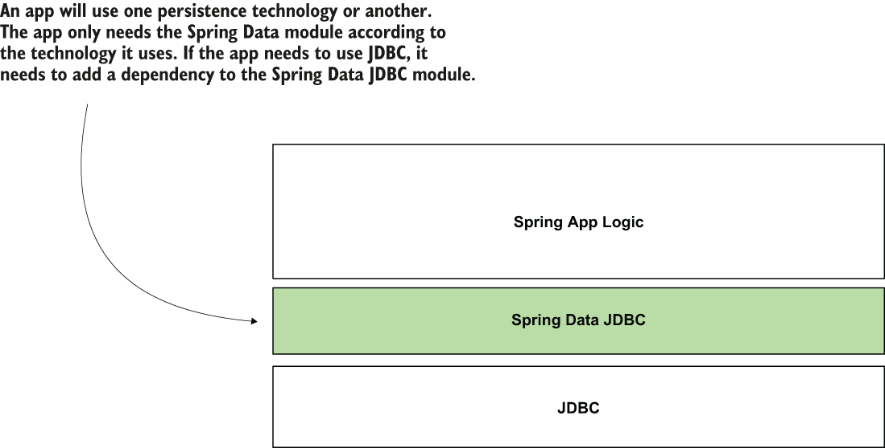

> **Hình 14.5** Nếu ứng dụng dùng JDBC, nó chỉ cần phần của project Spring Data quản lý lưu trữ qua JDBC. Module Spring Data quản lý lưu trữ qua JDBC được gọi là Spring Data JDBC. Bạn thêm module Spring Data này vào ứng dụng thông qua dependency riêng của nó.

Bạn có thể tìm thấy danh sách đầy đủ các module Spring Data trên trang chính thức của Spring Data: https://spring.io/projects/spring-data.

Dù ứng dụng của bạn dùng công nghệ lưu trữ nào, Spring Data cung cấp một tập interface chung (contract) mà bạn mở rộng (extend) để định nghĩa các khả năng lưu trữ của ứng dụng. Hình 14.6 trình bày các interface sau:

- `Repository` là contract trừu tượng nhất. Nếu bạn mở rộng contract này, ứng dụng nhận diện interface bạn viết là một Spring Data repository cụ thể. Tuy nhiên, bạn sẽ không kế thừa bất kỳ thao tác định nghĩa sẵn nào (như thêm bản ghi mới, truy xuất tất cả bản ghi, hay lấy bản ghi theo primary key). Interface `Repository` không khai báo method nào (nó là một marker interface).
- `CrudRepository` là contract đơn giản nhất của Spring Data cũng cung cấp một số khả năng lưu trữ. Nếu bạn mở rộng contract này để định nghĩa các khả năng lưu trữ của ứng dụng, bạn nhận được các thao tác đơn giản nhất để tạo, truy xuất, cập nhật và xóa bản ghi.
- `PagingAndSortingRepository` mở rộng `CrudRepository` và thêm các thao tác liên quan đến sắp xếp bản ghi hoặc truy xuất chúng theo từng phần với số lượng cụ thể (trang).

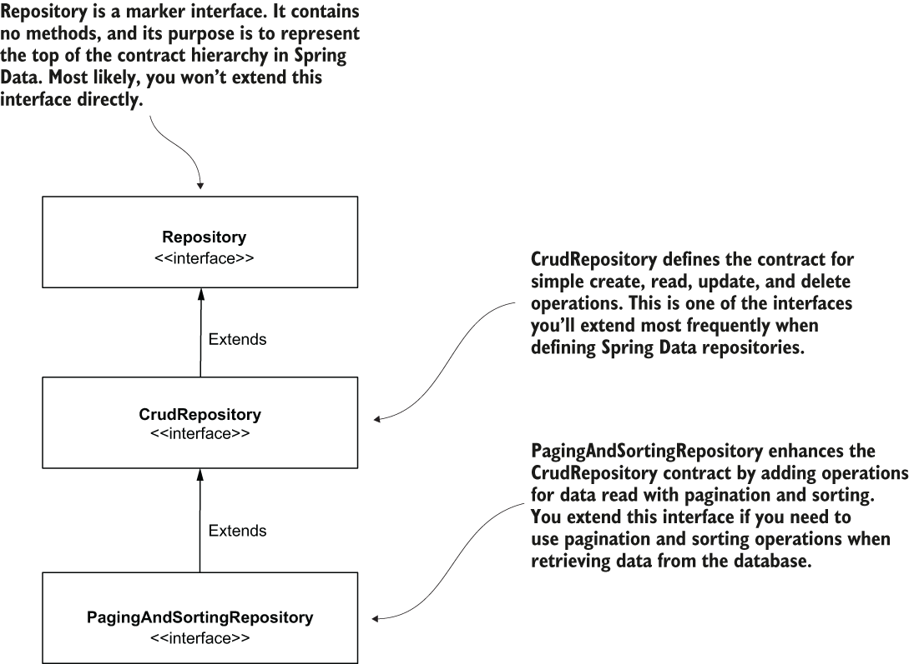

> **Hình 14.6** Để triển khai các repository của ứng dụng bằng Spring Data, bạn mở rộng các interface cụ thể. Các interface chính đại diện cho các contract của Spring Data là Repository, CrudRepository và PagingAndSortingRepository. Bạn mở rộng một trong các contract này để triển khai các khả năng lưu trữ của ứng dụng.

> **LƯU Ý** Đừng nhầm lẫn annotation `@Repository` mà chúng ta đã bàn ở chương 4 với interface `Repository` của Spring Data. Annotation `@Repository` là stereotype annotation bạn dùng với các class để chỉ thị Spring thêm một instance của class được đánh dấu vào application context. Interface `Repository` mà chúng ta bàn trong chương này là đặc thù của Spring Data và, như bạn sẽ học, bạn mở rộng nó hoặc một interface khác mở rộng từ nó để định nghĩa một Spring Data repository.

Có thể bạn thắc mắc tại sao Spring Data cung cấp nhiều interface mở rộng lẫn nhau. Tại sao không chỉ một interface với tất cả các thao tác trong đó? Bằng cách triển khai nhiều contract mở rộng lẫn nhau thay vì cung cấp cho bạn một contract "béo" với tất cả các thao tác, Spring Data cho ứng dụng của bạn khả năng chỉ triển khai các thao tác nó cần. Cách này là một nguyên lý đã biết gọi là interface segregation (phân tách interface). Ví dụ, nếu ứng dụng của bạn chỉ cần dùng các thao tác CRUD, nó mở rộng contract `CrudRepository`. Ứng dụng sẽ không nhận các thao tác liên quan đến sắp xếp và phân trang bản ghi, giúp ứng dụng đơn giản hơn (hình 14.7).

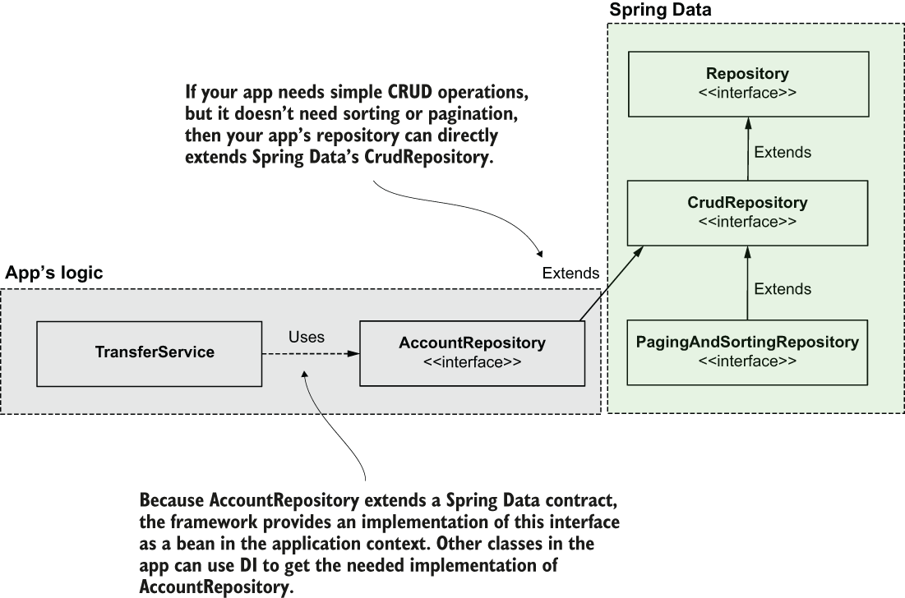

> **Hình 14.7** Để tạo một Spring Data repository, bạn định nghĩa một interface mở rộng một trong các contract của Spring Data. Ví dụ, nếu ứng dụng chỉ cần các thao tác CRUD, interface bạn định nghĩa làm repository nên mở rộng interface CrudRepository. Ứng dụng thêm vào Spring context một bean triển khai contract bạn định nghĩa, nên bất kỳ thành phần nào khác của ứng dụng cần dùng nó chỉ cần inject nó từ context.

Nếu ứng dụng của bạn cũng cần các khả năng phân trang và sắp xếp ngoài các thao tác CRUD đơn giản, nó nên mở rộng một contract cụ thể hơn, interface `PagingAndSortingRepository` (hình 14.8).

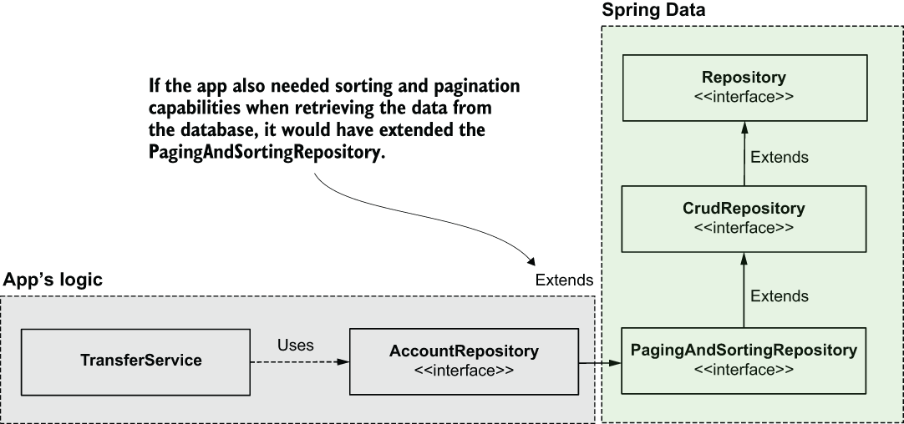

> **Hình 14.8** Nếu ứng dụng cần các khả năng sắp xếp và phân trang, nó nên mở rộng một contract cụ thể hơn. Ứng dụng cung cấp một bean triển khai contract, bean này sau đó có thể được inject từ bất kỳ thành phần nào khác cần dùng nó.

Một số module Spring Data có thể cung cấp các contract đặc thù cho công nghệ mà chúng đại diện. Ví dụ, khi dùng Spring Data JPA, bạn cũng có thể mở rộng trực tiếp interface `JpaRepository` (như trình bày trong hình 14.9). Interface `JpaRepository` là một contract cụ thể hơn `PagingAndSortingRepository`. Contract này thêm các thao tác chỉ áp dụng được khi dùng các công nghệ cụ thể như Hibernate, vốn triển khai đặc tả Jakarta Persistence API (JPA).

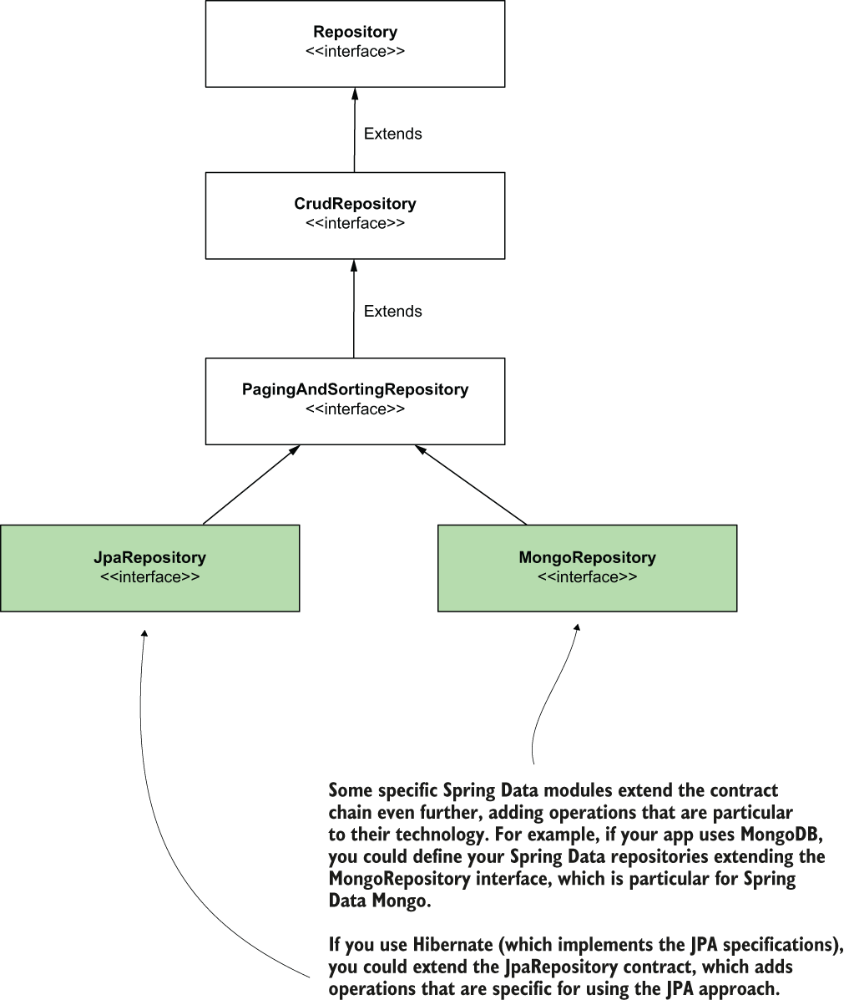

> **Hình 14.9** Các module Spring Data đặc thù cho một số công nghệ nhất định có thể cung cấp các contract riêng định nghĩa các thao tác bạn chỉ có thể áp dụng với các công nghệ đó. Khi dùng những công nghệ như vậy, ứng dụng của bạn rất có thể sẽ dùng các contract đặc thù này.

Một ví dụ khác là dùng công nghệ NoSQL như MongoDB. Để dùng Spring Data với MongoDB, bạn sẽ cần thêm module Spring Data Mongo vào ứng dụng, module này cũng cung cấp một contract riêng tên là `MongoRepository`, thêm các thao tác đặc thù cho công nghệ lưu trữ này.

Khi một ứng dụng dùng một công nghệ nhất định, nó mở rộng các contract của Spring Data cung cấp các thao tác đặc thù cho công nghệ đó. Ứng dụng vẫn có thể triển khai `CrudRepository` nếu nó không cần nhiều hơn các thao tác CRUD, nhưng các contract đặc thù này thường cung cấp các giải pháp thoải mái hơn khi dùng với công nghệ cụ thể mà chúng được tạo ra. Trong hình 14.10, class `AccountRepository` (của ứng dụng) mở rộng từ `JpaRepository` (đặc thù cho module Spring Data JPA).

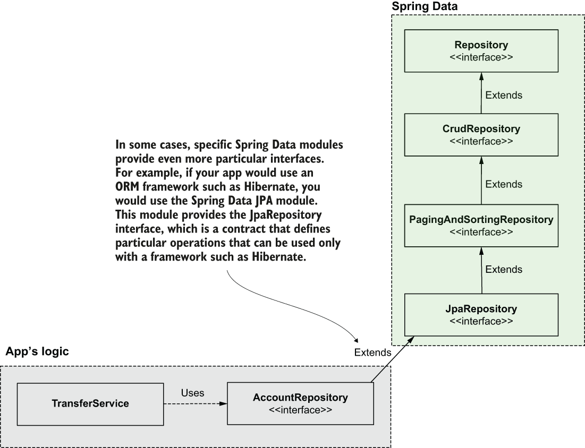

> **Hình 14.10** Các module Spring Data khác nhau có thể cung cấp các contract khác, cụ thể hơn. Ví dụ, nếu bạn dùng một ORM framework như Hibernate (vốn triển khai JPA) với Spring Data, bạn có thể mở rộng interface JpaRepository, một contract cụ thể hơn cung cấp các thao tác chỉ áp dụng được khi dùng một implementation JPA, như Hibernate.

## 14.3 Sử dụng Spring Data JDBC

Trong mục này, chúng ta dùng Spring Data JDBC để triển khai tầng lưu trữ của một ứng dụng Spring. Chúng ta đã bàn rằng tất cả những gì bạn cần làm là mở rộng một contract của Spring Data, nhưng hãy xem nó hoạt động thực tế. Ngoài việc triển khai một repository đơn thuần, bạn cũng sẽ học cách tạo và dùng các thao tác repository tùy chỉnh.

Chúng ta sẽ xét một tình huống tương tự tình huống chúng ta đã làm trong chương 13. Ứng dụng chúng ta xây dựng là một ví điện tử quản lý các tài khoản của người dùng. Một người dùng có thể chuyển tiền từ tài khoản của họ sang tài khoản khác. Trong hướng dẫn này, chúng ta triển khai use case chuyển tiền để cho phép người dùng gửi tiền từ tài khoản này sang tài khoản khác. Thao tác chuyển tiền có hai bước (hình 14.11):

1. Rút một số tiền cho trước khỏi tài khoản người gửi.
2. Nạp số tiền đó vào tài khoản đích.

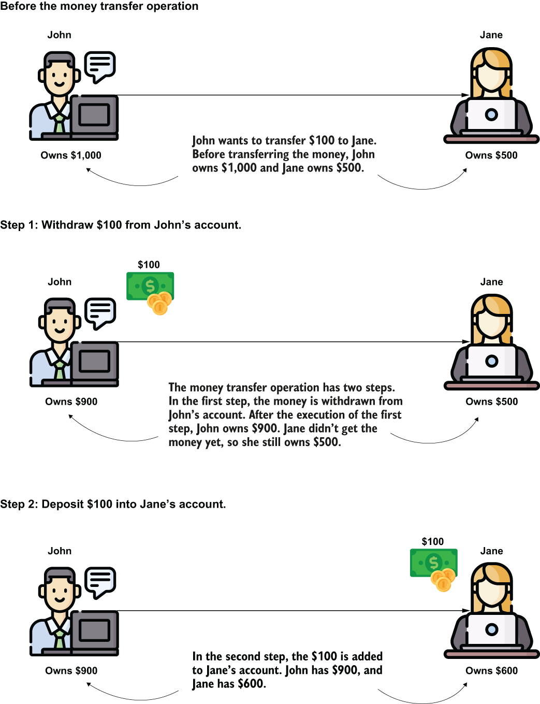

> **Hình 14.11** Use case chuyển tiền ngụ ý hai bước. Thứ nhất, ứng dụng rút số tiền chuyển khỏi tài khoản của người gửi (John). Thứ hai, ứng dụng nạp số tiền chuyển vào tài khoản của người nhận (Jane).

Chúng ta sẽ lưu chi tiết tài khoản trong một bảng trong database. Để giữ ví dụ ngắn gọn và đơn giản, cho phép bạn tập trung vào chủ đề của mục này, chúng ta sẽ dùng database in-memory H2 (như đã bàn ở chương 12).

Bảng account có các trường sau:

- id: Primary key. Chúng ta định nghĩa trường này là giá trị INT tự tăng.
- name: Tên chủ tài khoản
- amount: Số tiền chủ tài khoản có trong tài khoản

Bạn có thể tìm thấy ví dụ này trong project "sq-ch14-ex1". Các dependency chúng ta cần thêm vào project (trong file pom.xml) được trình bày trong đoạn code tiếp theo:

```xml
<dependency>
     <groupId>org.springframework.boot</groupId>
     <artifactId>spring-boot-starter-web</artifactId>
</dependency>
<dependency>
     <groupId>org.springframework.boot</groupId>                           ❶
     <artifactId>spring-boot-starter-data-jdbc</artifactId>
</dependency>
   <dependency>
     <groupId>com.h2database</groupId>
     <artifactId>h2</artifactId>
   <scope>runtime</scope>
</dependency>
```

❶ Chúng ta dùng module Spring Data JDBC để triển khai tầng lưu trữ của ứng dụng này.

Chúng ta thêm một file "schema.sql" vào thư mục resources của project Maven để tạo bảng account trong database in-memory H2 của ứng dụng. File này lưu truy vấn DDL cần thiết để tạo bảng account, như trong đoạn code tiếp theo:

```sql
create table account (
     id INT NOT NULL AUTO_INCREMENT PRIMARY KEY,
     name VARCHAR(50) NOT NULL,
     amount DOUBLE NOT NULL
);
```

Chúng ta cũng cần thêm vài bản ghi vào bảng account. Chúng ta dùng các bản ghi này để kiểm tra ứng dụng sau khi triển khai xong. Để chỉ thị ứng dụng thêm vài bản ghi, chúng ta tạo một file "data.sql" trong thư mục resources của project Maven. Để thêm hai bản ghi vào bảng account, chúng ta sẽ viết vài câu lệnh INSERT trong file "data.sql", như trong đoạn code tiếp theo:

```sql
INSERT INTO account VALUES (NULL, 'Jane Down', 1000);
INSERT INTO account VALUES (NULL, 'John Read', 1000);
```

Ở cuối mục này, chúng ta sẽ chứng minh ứng dụng hoạt động bằng cách chuyển $100 từ Jane sang John. Hãy mô hình hóa các bản ghi của bảng account bằng một class tên là `Account`. Chúng ta dùng một field để ánh xạ mỗi cột trong bảng với kiểu phù hợp.

Hãy nhớ rằng, với số thập phân, tôi khuyên dùng `BigDecimal` thay vì `double` hay `float` để tránh các vấn đề tiềm ẩn về độ chính xác trong các phép toán số học.

Với một số thao tác nó cung cấp, như truy xuất dữ liệu từ database, Spring Data cần biết field nào ánh xạ với primary key của bảng. Bạn dùng annotation `@Id`, như trong listing 14.1, để đánh dấu primary key. Listing sau cho thấy class model `Account`.

**Listing 14.1** Class Account mô hình hóa các bản ghi của bảng account

```java
public class Account {

    @Id                      ❶
    private long id;

    private String name;
    private BigDecimal amount;

    // Omitted getters and setters

}
```

❶ Chúng ta đánh dấu thuộc tính mô hình hóa primary key bằng annotation `@Id`.

Giờ bạn đã có class model, chúng ta có thể triển khai Spring Data repository (listing 14.2). Chúng ta chỉ cần các thao tác CRUD cho ứng dụng này, nên chúng ta sẽ viết một interface mở rộng interface `CrudRepository`. Tất cả các interface của Spring Data đều có hai kiểu generic bạn cần cung cấp:

1. Class model (đôi khi gọi là entity) mà bạn viết repository cho nó
2. Kiểu của field primary key

**Listing 14.2** Định nghĩa Spring Data repository

```java
public interface AccountRepository
      extends CrudRepository<Account, Long> {                  ❶

}
```

❶ Giá trị kiểu generic đầu tiên là kiểu của class model đại diện cho bảng. Giá trị thứ hai là kiểu của field primary key.

Khi bạn mở rộng interface `CrudRepository`, Spring Data cung cấp các thao tác đơn giản như lấy giá trị theo primary key, lấy tất cả bản ghi từ bảng, xóa bản ghi, v.v. Nhưng nó không thể cung cấp cho bạn tất cả các thao tác có thể triển khai bằng truy vấn SQL. Trong ứng dụng thực tế, bạn cần các thao tác tùy chỉnh, cần một truy vấn SQL được viết ra để triển khai. Làm sao bạn triển khai một thao tác tùy chỉnh trong Spring Data repository?

Spring Data làm khía cạnh này dễ đến mức đôi khi bạn thậm chí không cần viết truy vấn SQL. Spring Data biết cách diễn giải tên method dựa trên một số quy tắc đặt tên và tạo truy vấn SQL phía sau hậu trường cho bạn. Ví dụ, giả sử bạn muốn viết một thao tác để lấy tất cả các tài khoản theo một tên cho trước. Trong Spring Data, bạn có thể viết một method với tên sau: `findAccountsByName`.

Khi tên method bắt đầu bằng "find", Spring Data biết bạn muốn SELECT thứ gì đó. Tiếp theo, từ "Accounts" nói cho Spring Data biết bạn muốn SELECT gì. Spring Data thông minh đến mức tôi thậm chí có thể đặt tên method là `findByName`. Nó vẫn biết cần chọn gì chỉ vì method nằm trong interface `AccountRepository`. Trong ví dụ này, tôi muốn cụ thể hơn và làm tên thao tác rõ ràng. Sau "By" trong tên method, Spring Data mong đợi nhận được điều kiện của truy vấn (mệnh đề WHERE). Trong trường hợp của chúng ta, chúng ta muốn chọn "ByName", nên Spring Data dịch điều này thành `WHERE name = ?`.

Hình 14.12 biểu diễn trực quan mối quan hệ giữa tên method và truy vấn mà Spring Data tạo phía sau hậu trường.

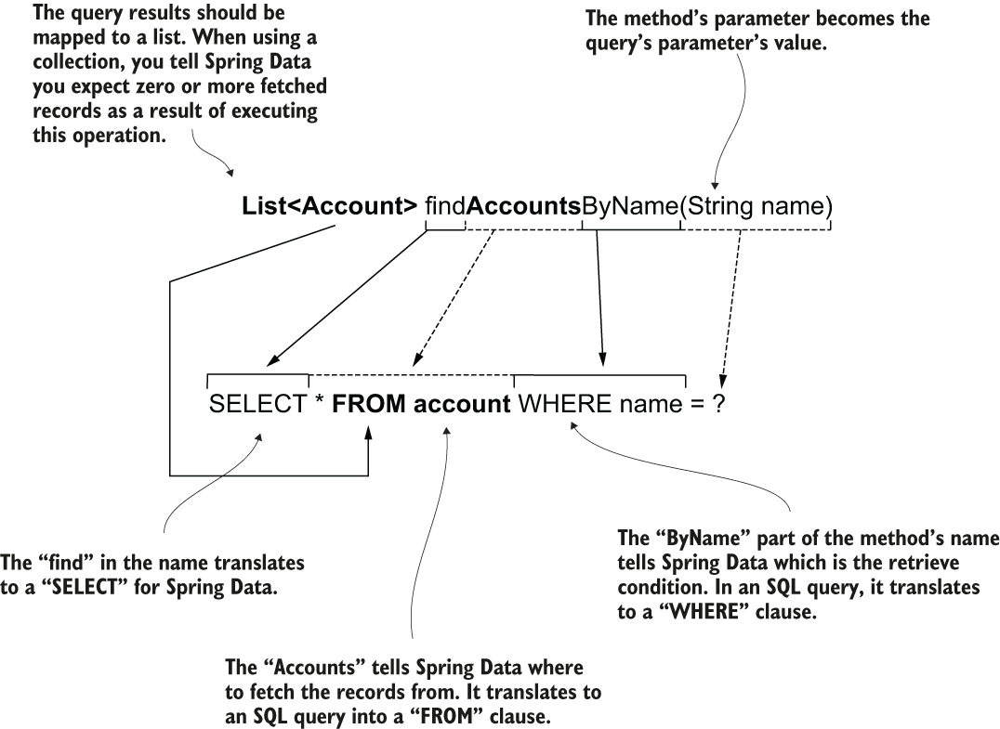

> **Hình 14.12** Mối quan hệ giữa tên method của repository và truy vấn mà Spring Data tạo phía sau hậu trường

Listing sau cho thấy định nghĩa của method trong interface `AccountRepository`.

**Listing 14.3** Thêm thao tác repository để lấy tất cả các tài khoản có tên chỉ định

```java
public interface AccountRepository
  extends CrudRepository<Account, Long> {

  List<Account> findAccountsByName(String name);
}
```

Phép màu dịch tên method thành truy vấn này trông thật đáng kinh ngạc thoạt nhìn. Tuy nhiên, với kinh nghiệm bạn nhận ra nó không phải là viên đạn bạc. Nó có vài nhược điểm, nên tôi luôn khuyên các lập trình viên chỉ định tường minh truy vấn thay vì dựa vào Spring Data để dịch tên method. Các nhược điểm chính của việc dựa vào tên method như sau:

- Nếu thao tác đòi hỏi một truy vấn phức tạp hơn, tên method sẽ quá dài và khó đọc.
- Nếu một lập trình viên vô tình refactor tên method, họ có thể ảnh hưởng đến hành vi của ứng dụng mà không nhận ra (thật không may, không phải ứng dụng nào cũng được kiểm thử kỹ, và chúng ta cần cân nhắc điều này).
- Trừ khi bạn có một IDE đưa ra gợi ý khi viết tên method, bạn cần học các quy tắc đặt tên của Spring Data. Vì bạn đã biết SQL, việc học một tập quy tắc chỉ áp dụng cho Spring Data không có lợi.
- Hiệu năng bị ảnh hưởng vì Spring Data cũng phải dịch tên method thành truy vấn, nên ứng dụng sẽ khởi tạo chậm hơn (ứng dụng dịch tên method thành truy vấn khi khởi động).

Cách đơn giản nhất để tránh các vấn đề này là dùng annotation `@Query` để chỉ định truy vấn SQL mà ứng dụng sẽ chạy khi bạn gọi method đó. Khi bạn đánh dấu method bằng `@Query`, cách bạn đặt tên method không còn quan trọng nữa. Spring Data sẽ dùng truy vấn bạn cung cấp thay vì dịch tên method thành truy vấn. Hành vi cũng trở nên hiệu năng hơn. Listing sau cho bạn thấy cách dùng annotation `@Query`.

**Listing 14.4** Dùng annotation @Query để chỉ định truy vấn SQL cho một thao tác

```java
public interface AccountRepository
    extends CrudRepository<Account, Long> {

    @Query("SELECT * FROM account WHERE name = :name")                        ❶
    List<Account> findAccountsByName(String name);

}
```

❶ Hãy nhớ rằng tên tham số trong truy vấn phải giống tên tham số của method. Không được có khoảng trắng giữa dấu hai chấm (:) và tên tham số.

Bạn dùng annotation `@Query` theo cùng cách để định nghĩa bất kỳ truy vấn nào. Tuy nhiên, khi truy vấn của bạn thay đổi dữ liệu, bạn cũng cần đánh dấu method bằng annotation `@Modifying`. Nếu bạn dùng UPDATE, INSERT hoặc DELETE, bạn cũng cần đánh dấu method bằng `@Modifying`. Listing sau cho bạn thấy cách dùng `@Query` để định nghĩa một truy vấn UPDATE cho một method repository.

**Listing 14.5** Định nghĩa một thao tác thay đổi dữ liệu trong repository

```java
public interface AccountRepository
  extends CrudRepository<Account, Long> {

    @Query("SELECT * FROM account WHERE name = :name")
    List<Account> findAccountsByName(String name);

    @Modifying                                                             ❶
    @Query("UPDATE account SET amount = :amount WHERE id = :id")
    void changeAmount(long id, BigDecimal amount);

}
```

❶ Chúng ta đánh dấu các method định nghĩa thao tác thay đổi dữ liệu bằng annotation `@Modifying`.

Dùng DI để lấy một bean triển khai interface `AccountRepository` ở bất cứ đâu bạn cần trong ứng dụng. Đừng lo vì bạn chỉ viết interface. Spring Data tạo một implementation động và thêm một bean vào context của ứng dụng. Listing 14.6 cho thấy cách thành phần `TransferService` của ứng dụng dùng inject qua constructor để lấy một bean kiểu `AccountRepository`. Trong chương 5 bạn đã học rằng Spring thông minh và biết rằng nếu bạn yêu cầu DI cho một field có kiểu interface, nó cần tìm một bean triển khai interface đó.

**Listing 14.6** Inject repository vào class service để triển khai use case

```java
@Service
public class TransferService {

    private final AccountRepository accountRepository;

    public TransferService(AccountRepository accountRepository) {
        this.accountRepository = accountRepository;
    }

}
```

Listing 14.7 cho thấy phần triển khai use case chuyển tiền. Chúng ta dùng `AccountRepository` để lấy chi tiết tài khoản và thay đổi số tiền của các tài khoản. Chúng ta tiếp tục dùng annotation `@Transactional`, như bạn đã học ở chương 13, để bọc logic trong transaction và đảm bảo không làm hỏng dữ liệu nếu bất kỳ thao tác nào thất bại.

**Listing 14.7** Triển khai use case chuyển tiền

```java
@Service
public class TransferService {

    private final AccountRepository accountRepository;

    public TransferService(AccountRepository accountRepository) {
        this.accountRepository = accountRepository;
    }

    @Transactional                                                       ❶
    public void transferMoney(
      long idSender,
        long idReceiver,
        BigDecimal amount) {

        Account sender =                                                 ❷
         accountRepository.findById(idSender)                            ❷
           .orElseThrow(() -> new AccountNotFoundException());           ❷

        Account receiver =                                               ❷
         accountRepository.findById(idReceiver)
           .orElseThrow(() -> new AccountNotFoundException());

        BigDecimal senderNewAmount =                                     ❸
         sender.getAmount().subtract(amount);                            ❸

        BigDecimal receiverNewAmount =                                   ❸
          receiver.getAmount().add(amount);                              ❸

        accountRepository                                                ❹
         .changeAmount(idSender, senderNewAmount);                       ❹

        accountRepository                                                ❹
         .changeAmount(idReceiver, receiverNewAmount);                   ❹
    }

}
```

❶ Chúng ta bọc logic use case trong transaction để tránh không nhất quán dữ liệu nếu bất kỳ lệnh nào thất bại.

❷ Chúng ta lấy chi tiết tài khoản của người gửi và người nhận.

❸ Chúng ta tính số tiền mới của các tài khoản bằng cách trừ giá trị chuyển khỏi tài khoản người gửi và cộng vào tài khoản đích.

❹ Chúng ta thay đổi số tiền của các tài khoản trong database.

Trong use case chuyển tiền, chúng ta dùng một class runtime exception đơn giản tên là `AccountNotFoundException`. Đoạn code tiếp theo trình bày định nghĩa của class này:

```java
public class AccountNotFoundException extends RuntimeException {
}
```

Hãy thêm một method service để truy xuất tất cả các bản ghi từ database và lấy chi tiết tài khoản theo tên chủ sở hữu. Chúng ta sẽ dùng các thao tác này khi kiểm tra ứng dụng. Để lấy tất cả bản ghi, chúng ta không tự viết method. `AccountRepository` của chúng ta kế thừa method `findAll()` từ contract `CrudRepository`, như trong listing sau.

**Listing 14.8** Thêm các method service để truy xuất chi tiết tài khoản

```java
@Service
public class TransferService {

    // Omitted code

    public Iterable<Account> getAllAccounts() {
      return accountRepository.findAll();                        ❶
    }

    public List<Account> findAccountsByName(String name) {
      return accountRepository.findAccountsByName(name);
    }
}
```

❶ `AccountRepository` kế thừa method này từ interface `CrudRepository` của Spring Data.

Listing sau cho bạn thấy cách class `AccountController` cung cấp use case chuyển tiền thông qua REST endpoint.

**Listing 14.9** Cung cấp use case chuyển tiền bằng REST endpoint

```java
@RestController
public class AccountController {

    private final TransferService transferService;

    public AccountController(TransferService transferService) {
      this.transferService = transferService;
    }

    @PostMapping("/transfer")
    public void transferMoney(                          ❶
        @RequestBody TransferRequest request
        ) {
        transferService.transferMoney(                 ❷
            request.getSenderAccountId(),
             request.getReceiverAccountId(),
             request.getAmount());
    }

}
```

❶ Chúng ta nhận ID tài khoản người gửi và tài khoản đích cùng số tiền chuyển trong HTTP request body.

❷ Chúng ta gọi service để thực thi use case chuyển tiền.

Đoạn code tiếp theo trình bày phần triển khai DTO `TransferRequest` mà endpoint /transfer dùng để ánh xạ HTTP request body:

```java
public class TransferRequest {

    private long senderAccountId;
    private long receiverAccountId;
    private BigDecimal amount;

    // Omitted getters and setters
}
```

Trong listing tiếp theo, chúng ta triển khai một endpoint để lấy các bản ghi từ database.

**Listing 14.10** Triển khai endpoint để truy xuất chi tiết tài khoản

```java
@RestController
public class AccountController {

    // Omitted code

    @GetMapping("/accounts")
    public Iterable<Account> getAllAccounts(                           ❶
        @RequestParam(required = false) String name
    ) {
      if (name == null) {                                              ❷
          return transferService.getAllAccounts();
        } else {                                                       ❸
            return transferService.findAccountsByName(name);
        }
    }

}
```

❶ Chúng ta dùng một request parameter tùy chọn để nhận tên mà chúng ta muốn trả về chi tiết tài khoản.

❷ Nếu không có tên nào được cung cấp trong request parameter tùy chọn, chúng ta trả về tất cả chi tiết tài khoản.

❸ Nếu một tên được cung cấp trong request parameter, chúng ta chỉ trả về chi tiết tài khoản cho tên đó.

Chúng ta khởi động ứng dụng và kiểm tra các bản ghi tài khoản bằng cách gọi endpoint /accounts, endpoint này trả về tất cả tài khoản trong database:

```bash
curl http://localhost:8080/accounts
```

Khi bạn chạy lệnh này, bạn sẽ thấy đầu ra trong console tương tự như trong đoạn tiếp theo:

```json
[
 {"id":1,"name":"Jane Down","amount":1000.0},
 {"id":2,"name":"John Read","amount":1000.0}
]
```

Chúng ta gọi endpoint /transfer để chuyển $100 từ Jane sang John bằng lệnh cURL trong đoạn tiếp theo:

```bash
curl -XPOST -H "content-type:application/json" -d '{"senderAccountId":1, "receiverAccountId":2, "amount":100}' http://localhost:8080/transfer
```

Nếu bạn gọi lại endpoint /accounts, bạn sẽ thấy sự khác biệt. Sau thao tác chuyển tiền, Jane chỉ còn $900, còn John giờ có $1.100:

```bash
curl http://localhost:8080/accounts
```

Kết quả của việc gọi endpoint /accounts sau thao tác chuyển tiền được trình bày trong đoạn tiếp theo:

```json
[
 {"id":1,"name":"Jane Down","amount":900.0},
 {"id":2,"name":"John Read","amount":1100.0}
]
```

Bạn cũng có thể yêu cầu chỉ xem các tài khoản của Jane nếu dùng query parameter name với endpoint /accounts, như trong đoạn tiếp theo:

```bash
curl http://localhost:8080/accounts?name=Jane+Down
```

Như trong đoạn tiếp theo, trong response body của lệnh cURL này, bạn sẽ chỉ nhận được các tài khoản của Jane:

```json
[
     {
           "id": 1,
           "name": "Jane Down",
           "amount": 900.0
     }
]
```

## Tóm tắt

- Spring Data là một project trong hệ sinh thái Spring giúp chúng ta triển khai tầng lưu trữ của ứng dụng Spring dễ dàng hơn. Spring Data cung cấp một lớp abstraction trên nhiều công nghệ lưu trữ và tạo thuận lợi cho việc triển khai bằng cách cung cấp một tập contract chung.
- Với Spring Data, chúng ta triển khai repository thông qua các interface mở rộng các contract chuẩn của Spring Data:
  - `Repository`, không cung cấp thao tác lưu trữ nào
  - `CrudRepository`, cung cấp các thao tác CREATE, READ, UPDATE, DELETE (CRUD) đơn giản
  - `PagingAndSortingRepository`, mở rộng `CrudRepository` và thêm các thao tác phân trang và sắp xếp các bản ghi được lấy
- Khi dùng Spring Data, bạn chọn một module nhất định tùy theo công nghệ lưu trữ mà ứng dụng dùng. Ví dụ, nếu ứng dụng kết nối đến DBMS qua JDBC, ứng dụng cần module Spring Data JDBC, còn nếu ứng dụng dùng một implementation NoSQL như MongoDB, nó cần module Spring Data Mongo.
- Khi mở rộng một contract của Spring Data, ứng dụng kế thừa và có thể dùng các thao tác được định nghĩa bởi contract đó. Tuy nhiên, ứng dụng có thể định nghĩa các thao tác tùy chỉnh bằng các method trong các interface repository.
- Bạn dùng annotation `@Query` với method của Spring Data repository để định nghĩa truy vấn SQL mà ứng dụng thực thi cho thao tác cụ thể đó.
- Nếu bạn khai báo một method và không chỉ định tường minh truy vấn bằng annotation `@Query`, Spring Data sẽ dịch tên method thành truy vấn SQL. Tên method cần được định nghĩa theo các quy tắc của Spring Data để nó hiểu và dịch thành truy vấn đúng. Nếu Spring Data không thể giải quyết tên method, ứng dụng không khởi động được và ném ra exception.
- Nên dùng annotation `@Query` và tránh dựa vào Spring Data để dịch tên method thành truy vấn. Dùng cách dịch tên có thể đi kèm các khó khăn:
  - Nó tạo ra các tên method dài và khó đọc cho các thao tác phức tạp hơn, ảnh hưởng đến khả năng bảo trì của ứng dụng.
  - Nó làm chậm việc khởi tạo ứng dụng vì ứng dụng giờ cũng cần dịch các tên method.
  - Bạn cần học quy ước đặt tên method của Spring Data.
  - Nó có nguy cơ ảnh hưởng đến hành vi của ứng dụng do refactor tên method sai.
- Bất kỳ thao tác nào thay đổi dữ liệu (ví dụ, thực thi truy vấn INSERT, UPDATE hoặc DELETE) phải được đánh dấu bằng annotation `@Modifying` để chỉ thị Spring Data rằng thao tác thay đổi các bản ghi dữ liệu.
