# 15 Kiểm thử ứng dụng Spring

**Chương này bao gồm**

- Tại sao kiểm thử ứng dụng lại quan trọng
- Test hoạt động như thế nào
- Triển khai unit test cho ứng dụng Spring
- Triển khai integration test của Spring

Trong chương này, bạn sẽ học cách triển khai test cho ứng dụng Spring. Test là một đoạn logic nhỏ có mục đích xác nhận rằng một khả năng cụ thể mà ứng dụng triển khai hoạt động như mong đợi. Chúng ta sẽ phân loại test thành hai nhóm:

- Unit test: Chỉ tập trung vào một đoạn logic cô lập
- Integration test: Tập trung xác nhận rằng nhiều thành phần tương tác đúng với nhau

Nhưng khi tôi chỉ dùng thuật ngữ "test", tôi muốn nói đến cả hai nhóm này.

Test thiết yếu cho bất kỳ ứng dụng nào. Chúng đảm bảo các thay đổi chúng ta thực hiện trong quá trình phát triển ứng dụng không làm hỏng các khả năng hiện có (hoặc ít nhất làm cho lỗi ít xảy ra hơn) và cũng đóng vai trò như tài liệu. Nhiều lập trình viên (thật đáng tiếc) bỏ qua test vì chúng không trực tiếp là một phần của logic nghiệp vụ của ứng dụng, và dĩ nhiên, viết chúng tốn thời gian. Vì vậy, test có vẻ không có tác động đáng kể. Thật vậy, tác động của chúng thường không thấy được trong ngắn hạn, nhưng hãy tin tôi, test vô giá trong dài hạn. Tôi không thể nhấn mạnh đủ tầm quan trọng của việc đảm bảo bạn kiểm thử đúng cách logic của ứng dụng.

Tại sao bạn nên viết test thay vì dựa vào việc kiểm tra thủ công một khả năng?

- Vì bạn có thể chạy test đó lặp đi lặp lại để xác nhận mọi thứ hoạt động như mong đợi với công sức tối thiểu (xác nhận ứng dụng hành xử đúng một cách liên tục)
- Vì bằng cách đọc các bước của test bạn có thể dễ dàng hiểu mục đích của use case (đóng vai trò như tài liệu)
- Vì test cung cấp phản hồi sớm về các vấn đề mới của ứng dụng trong quá trình phát triển

Tại sao các khả năng của ứng dụng lại không hoạt động lần thứ hai nếu ban đầu chúng đã hoạt động?

- Vì chúng ta liên tục thay đổi mã nguồn của ứng dụng để sửa lỗi hoặc thêm tính năng mới. Khi bạn thay đổi mã nguồn, bạn có thể làm hỏng các khả năng đã triển khai trước đó.

Nếu bạn viết test cho các khả năng đó, bạn có thể chạy chúng bất cứ khi nào bạn thay đổi ứng dụng để xác nhận mọi thứ vẫn hoạt động như mong đợi. Nếu bạn ảnh hưởng đến chức năng hiện có nào đó, bạn sẽ phát hiện ra điều gì đã xảy ra trước khi đưa code lên production. Regression testing (kiểm thử hồi quy) là cách tiếp cận liên tục kiểm thử chức năng hiện có để xác nhận nó vẫn hoạt động đúng.

Một cách tiếp cận tốt là đảm bảo bạn kiểm thử tất cả các kịch bản liên quan cho bất kỳ khả năng cụ thể nào bạn triển khai. Sau đó bạn có thể chạy các test bất cứ khi nào thay đổi gì đó để xác nhận các khả năng đã triển khai trước đó không bị ảnh hưởng bởi thay đổi của bạn.

Ngày nay, chúng ta không chỉ dựa vào việc lập trình viên chạy test thủ công, mà chúng ta biến việc thực thi chúng thành một phần của quy trình build ứng dụng. Nhìn chung, các nhóm phát triển dùng cái mà chúng ta gọi là cách tiếp cận tích hợp liên tục (continuous integration, CI): họ cấu hình một công cụ như Jenkins hoặc TeamCity để chạy quy trình build mỗi khi một lập trình viên thực hiện thay đổi. Công cụ tích hợp liên tục là phần mềm chúng ta dùng để thực thi các bước cần thiết để build và đôi khi cài đặt các ứng dụng mà chúng ta triển khai trong quá trình phát triển. Công cụ CI này cũng chạy các test và thông báo cho lập trình viên nếu có gì đó bị hỏng (hình 15.1).

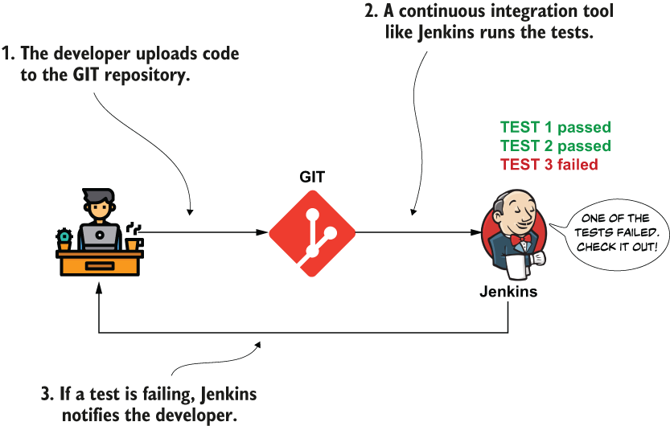

> **Hình 15.1** Công cụ CI, như Jenkins hay TeamCity, chạy các test mỗi khi lập trình viên thay đổi ứng dụng. Nếu bất kỳ test nào thất bại, công cụ CI thông báo cho lập trình viên để kiểm tra khả năng nào không hoạt động như mong đợi và sửa vấn đề.

Trong mục 15.1, chúng ta bắt đầu bằng việc vẽ bức tranh tổng thể về unit test là gì và nó hoạt động thế nào. Trong mục 15.2, chúng ta bàn về hai loại test thường gặp nhất mà bạn sẽ thấy được dùng với ứng dụng Spring: unit test và integration test. Chúng ta sẽ lấy ví dụ các khả năng chúng ta đã triển khai xuyên suốt cuốn sách và triển khai test cho chúng.

Trước khi đi sâu vào chương này, tôi muốn bạn biết rằng kiểm thử là một chủ đề phức tạp, và chúng ta sẽ chỉ tập trung vào kiến thức thiết yếu bạn cần có khi kiểm thử ứng dụng Spring. Nhưng kiểm thử là chủ đề xứng đáng có cả một kệ sách riêng. Tôi khuyên bạn cũng đọc cuốn *JUnit in Action* (Manning, 2020) của Cătălin Tudose, cuốn sách tiết lộ thêm nhiều điều về kiểm thử mà bạn sẽ thấy giá trị.

## 15.1 Viết test được triển khai đúng cách

Trong mục này, chúng ta bàn về cách test hoạt động và thế nào là một test được triển khai đúng cách. Bạn sẽ học cách viết code ứng dụng để dễ kiểm thử, và bạn sẽ thấy có mối liên hệ chặt chẽ giữa việc làm ứng dụng dễ kiểm thử và làm nó dễ bảo trì (tức là dễ thay đổi để triển khai tính năng mới và sửa lỗi). Khả năng kiểm thử và khả năng bảo trì là các phẩm chất phần mềm hỗ trợ lẫn nhau. Bằng cách thiết kế ứng dụng dễ kiểm thử, bạn cũng giúp nó dễ bảo trì.

Chúng ta viết test để xác nhận logic được triển khai bởi một method cụ thể trong project hoạt động theo cách mong muốn. Khi bạn kiểm thử một method cho trước, thường bạn cần xác nhận nhiều kịch bản (các cách ứng dụng hành xử tùy theo các đầu vào khác nhau). Với mỗi kịch bản, bạn viết một method test trong một class test. Trong một project Maven (như các ví dụ chúng ta đã triển khai xuyên suốt cuốn sách), bạn viết các class test trong thư mục test của project (hình 15.2).

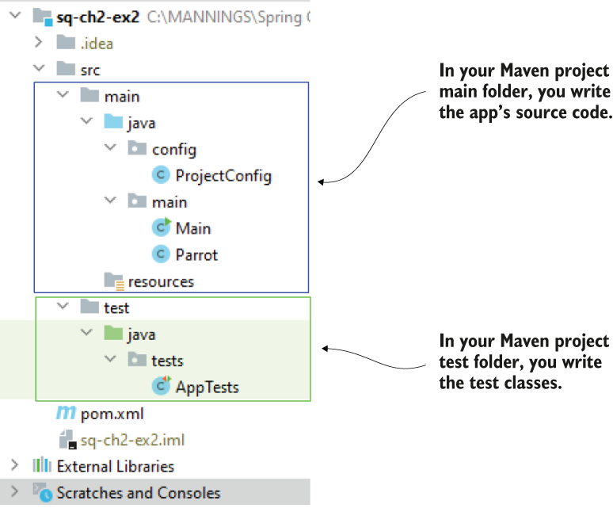

> **Hình 15.2** Trong một project Maven, bạn viết các class test trong thư mục test của project.

Một class test nên chỉ tập trung vào một method cụ thể có logic bạn kiểm thử. Ngay cả logic đơn giản cũng sinh ra nhiều kịch bản khác nhau. Với mỗi kịch bản, bạn sẽ viết một method trong class test để xác nhận trường hợp cụ thể đó.

Hãy lấy một ví dụ. Bạn còn nhớ use case chuyển tiền chúng ta đã bàn trong chương 13 và 14? Đó là cách triển khai đơn giản của chúng ta để chuyển một số tiền cho trước giữa hai tài khoản khác nhau. Use case chỉ có bốn bước:

1. Tìm chi tiết tài khoản nguồn trong database.
2. Tìm chi tiết tài khoản đích trong database.
3. Tính số tiền mới cho hai tài khoản sau khi chuyển.
4. Cập nhật giá trị số tiền của các tài khoản trong database.

Ngay cả chỉ với các bước này, chúng ta vẫn có thể tìm thấy nhiều kịch bản liên quan để kiểm thử:

1. Kiểm thử điều gì xảy ra nếu ứng dụng không tìm thấy chi tiết tài khoản nguồn.
2. Kiểm thử điều gì xảy ra nếu ứng dụng không tìm thấy chi tiết tài khoản đích.
3. Kiểm thử điều gì xảy ra nếu tài khoản nguồn không có đủ tiền.
4. Kiểm thử điều gì xảy ra nếu việc cập nhật số tiền thất bại.
5. Kiểm thử điều gì xảy ra nếu tất cả các bước hoạt động tốt.

Với mỗi kịch bản kiểm thử, bạn cần hiểu ứng dụng nên hành xử thế nào và viết một method test để xác nhận nó hoạt động như mong muốn. Ví dụ, nếu với trường hợp test 3, bạn không muốn cho phép chuyển tiền xảy ra nếu tài khoản nguồn không có đủ tiền, bạn sẽ kiểm thử rằng ứng dụng ném ra một exception cụ thể và việc chuyển tiền không xảy ra. Nhưng tùy vào yêu cầu của ứng dụng, bạn có thể cho phép một hạn mức tín dụng xác định cho tài khoản nguồn. Trong trường hợp đó, test của bạn cũng cần tính đến hạn mức này.

Việc triển khai kịch bản kiểm thử liên quan chặt chẽ đến cách ứng dụng nên hoạt động, nhưng về mặt kỹ thuật, ý tưởng là như nhau trong bất kỳ ứng dụng nào: bạn xác định các kịch bản kiểm thử, và viết một method test cho mỗi kịch bản (hình 15.3).

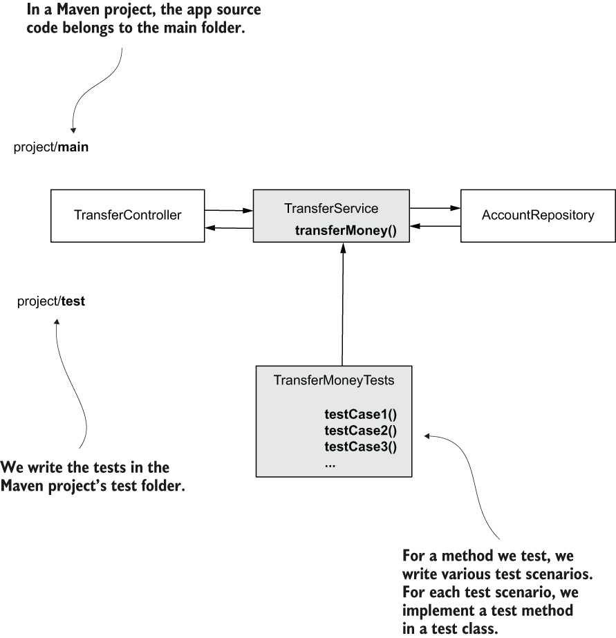

> **Hình 15.3** Với bất kỳ đoạn logic nào bạn kiểm thử, bạn cần tìm các kịch bản kiểm thử liên quan. Với mỗi kịch bản kiểm thử, bạn viết một method test trong một class test. Bạn thêm các class test vào thư mục test của project Maven của ứng dụng. Trong hình này, class TransferMoneyTests là một class test chứa các kịch bản kiểm thử cho method transferMoney(). TransferMoneyTests định nghĩa nhiều method test case để kiểm thử từng kịch bản liên quan trong logic của method transferMoney().

Một điều quan trọng cần quan sát là chúng ta có thể tìm thấy nhiều kịch bản kiểm thử liên quan, ngay cả cho một method nhỏ, một lý do nữa để giữ các method trong ứng dụng của bạn nhỏ! Nếu bạn viết các method lớn với nhiều dòng code và tham số, tập trung vào nhiều thứ cùng lúc, việc xác định kịch bản kiểm thử liên quan trở nên cực kỳ khó khăn. Chúng ta nói rằng khả năng kiểm thử của ứng dụng giảm khi bạn không tách các trách nhiệm khác nhau thành các method nhỏ và dễ đọc.

## 15.2 Triển khai test trong ứng dụng Spring

Trong mục này, chúng ta dùng hai kỹ thuật kiểm thử cho ứng dụng Spring mà bạn thường gặp trong các project thực tế. Chúng ta sẽ minh họa mỗi kỹ thuật bằng cách xét một use case chúng ta đã triển khai trong các chương trước và viết test cho nó. Các kỹ thuật này (theo quan điểm của tôi) là bắt buộc phải biết với bất kỳ lập trình viên nào:

- Viết unit test để xác nhận logic của một method. Unit test ngắn, thực thi nhanh, và chỉ tập trung vào một luồng. Các test này là cách tập trung xác nhận một đoạn logic nhỏ bằng cách loại bỏ tất cả các dependency.
- Viết Spring integration test để xác nhận logic của một method và sự tích hợp của nó với các khả năng cụ thể mà framework cung cấp. Các test này giúp bạn đảm bảo các khả năng của ứng dụng vẫn hoạt động khi bạn nâng cấp dependency.

Trong mục 15.2.1, bạn sẽ học về unit test. Chúng ta sẽ bàn tại sao unit test quan trọng và các bước bạn cân nhắc khi viết unit test, và chúng ta sẽ viết vài unit test làm ví dụ cho các use case chúng ta đã triển khai trong các chương trước. Trong mục 15.2.2, bạn sẽ học cách triển khai integration test, chúng khác unit test thế nào, và chúng bổ sung cho unit test trong ứng dụng Spring ra sao.

### 15.2.1 Triển khai unit test

Trong mục này, chúng ta bàn về unit test. Unit test là các method gọi một use case nhất định trong các điều kiện cụ thể để xác nhận hành vi. Method unit test định nghĩa các điều kiện mà use case thực thi và xác nhận hành vi được định nghĩa bởi yêu cầu của ứng dụng. Chúng loại bỏ tất cả các dependency của khả năng mà chúng kiểm thử, chỉ bao phủ một đoạn logic cụ thể, cô lập.

Unit test giá trị vì khi một test thất bại, bạn biết có gì đó sai với một đoạn code cụ thể, và bạn được chỉ chính xác nơi cần sửa. Unit test giống như một trong các đèn báo trên bảng điều khiển ô tô của bạn. Nếu bạn thử khởi động xe và nó không nổ máy, có thể do bạn hết xăng hoặc ắc quy không hoạt động đúng. Ô tô là một hệ thống phức tạp (giống như ứng dụng), và bạn không biết vấn đề là gì trừ khi có đèn báo. Nếu đèn báo của xe cho thấy bạn hết xăng, thì bạn đã xác định ngay được vấn đề!

Mục đích của unit test là xác nhận hành vi của một đơn vị logic duy nhất, và giống như đèn báo của ô tô, chúng giúp bạn xác định vấn đề trong một thành phần cụ thể.

**TRIỂN KHAI UNIT TEST ĐẦU TIÊN**

Hãy xem một trong các use case chúng ta đã viết trong chương 14: use case chuyển tiền. Các bước trong đoạn logic này như sau:

1. Tìm chi tiết tài khoản của người gửi.
2. Tìm chi tiết tài khoản đích.
3. Tính số tiền mới cho mỗi tài khoản.
4. Cập nhật số tiền tài khoản của người gửi.
5. Cập nhật số tiền tài khoản đích.

Listing sau cho bạn thấy phần triển khai use case như chúng ta đã làm trong project "sq-ch14-ex1".

**Listing 15.1** Phần triển khai use case chuyển tiền

```java
@Transactional
public void transferMoney(
    long idSender,
    long idReceiver,
    BigDecimal amount) {

    Account sender = accountRepository.findById(idSender)                  ❶
     .orElseThrow(() -> new AccountNotFoundException());

    Account receiver = accountRepository.findById(idReceiver)              ❷
     .orElseThrow(() -> new AccountNotFoundException());

    BigDecimal senderNewAmount = sender.getAmount().subtract(amount);      ❸
    BigDecimal receiverNewAmount = receiver.getAmount().add(amount);       ❸

    accountRepository
      .changeAmount(idSender, senderNewAmount);                            ❹
    accountRepository
     .changeAmount(idReceiver, receiverNewAmount);                         ❺
}
```

❶ Chúng ta tìm chi tiết tài khoản của người gửi.

❷ Chúng ta tìm chi tiết tài khoản đích.

❸ Chúng ta tính số tiền của các tài khoản.

❹ Chúng ta cập nhật số tiền mới vào tài khoản người gửi.

❺ Chúng ta cập nhật số tiền mới vào tài khoản đích.

Thường thì các kịch bản hiển nhiên nhất và là những kịch bản đầu tiên chúng ta viết test là các luồng hạnh phúc (happy flow): một lần thực thi không gặp exception hay lỗi nào. Hình 15.4 biểu diễn trực quan happy flow của use case chuyển tiền.

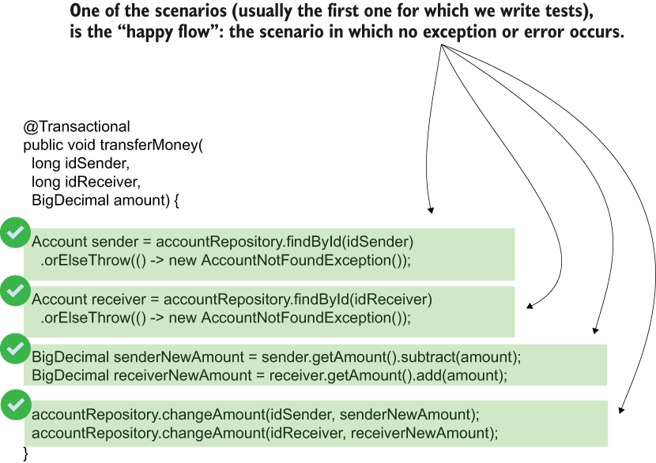

> **Hình 15.4** Happy flow: một lần thực thi không gặp lỗi hay exception nào. Thường thì happy flow là những kịch bản đầu tiên được viết test vì chúng là các kịch bản hiển nhiên nhất.

Hãy viết một unit test cho happy flow này của use case chuyển tiền. Bất kỳ test nào cũng có ba phần chính (hình 15.5):

1. Giả định (Assumptions): Chúng ta cần định nghĩa mọi đầu vào và tìm mọi dependency của logic mà chúng ta cần kiểm soát để đạt được kịch bản luồng mong muốn. Với điểm này, chúng ta sẽ trả lời các câu hỏi sau: chúng ta nên cung cấp đầu vào nào, và các dependency nên hành xử thế nào để logic được kiểm thử hoạt động theo cách cụ thể mà chúng ta muốn?
2. Gọi/Thực thi (Call/Execution): Chúng ta cần gọi logic mà chúng ta kiểm thử để xác nhận hành vi của nó.
3. Xác nhận (Validations): Chúng ta cần định nghĩa tất cả các xác nhận cần thực hiện cho đoạn logic đã cho. Chúng ta sẽ trả lời câu hỏi: điều gì nên xảy ra khi đoạn logic này được gọi trong các điều kiện đã cho?

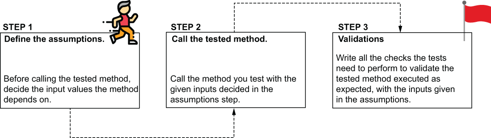

> **Hình 15.5** Các bước để viết unit test. Viết các giả định bằng cách định nghĩa đầu vào của method. Gọi method với các giả định đã định nghĩa và viết các kiểm tra mà test cần thực hiện để xác nhận hành vi của method là đúng.

> **LƯU Ý** Đôi khi, bạn sẽ thấy ba bước này (giả định, gọi, và xác nhận) được đặt tên hơi khác: "arrange, act, and assert" hoặc "given, when, and then". Dù bạn thích gọi chúng thế nào, ý tưởng về cách viết test vẫn như nhau.

Trong phần giả định của test, chúng ta xác định các dependency cho trường hợp test mà chúng ta viết. Chúng ta chọn các đầu vào và cách các dependency hành xử để làm cho logic được kiểm thử hoạt động theo một cách nhất định.

Các dependency của use case chuyển tiền là gì? Dependency là bất cứ thứ gì method dùng nhưng không tự tạo ra:

- Các tham số của method
- Các object instance mà method dùng nhưng không được tạo bởi nó

Trong hình 15.6, chúng ta xác định các dependency này cho ví dụ của mình.

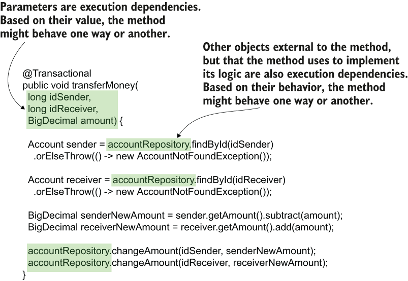

> **Hình 15.6** Unit test xác nhận logic của use case một cách cô lập với mọi dependency. Để viết test, chúng ta cần đảm bảo biết các dependency và cách kiểm soát chúng. Với kịch bản của chúng ta, các tham số và đối tượng AccountRepository là các dependency chúng ta cần kiểm soát cho test.

Khi chúng ta gọi method để kiểm thử, chúng ta có thể cung cấp bất kỳ giá trị nào cho ba tham số của nó để kiểm soát luồng thực thi. Nhưng instance `AccountRepository` phức tạp hơn một chút. Việc thực thi method `transferMoney()` phụ thuộc vào cách method `findById()` của instance `AccountRepository` hành xử.

Nhưng hãy nhớ, unit test chỉ tập trung vào một đoạn logic, nên nó không nên gọi method `findById()`. Unit test nên giả định `findById()` hoạt động theo một cách cho trước và khẳng định rằng việc thực thi method được kiểm thử làm đúng những gì mong đợi trong tình huống đã cho.

Nhưng method được kiểm thử gọi `findById()`. Làm sao chúng ta kiểm soát nó? Để kiểm soát một dependency như vậy, chúng ta dùng mock: một đối tượng giả mà chúng ta có thể kiểm soát hành vi. Trong trường hợp này, thay vì dùng đối tượng `AccountRepository` thật, chúng ta sẽ đảm bảo method được kiểm thử dùng đối tượng giả này. Chúng ta sẽ tận dụng việc kiểm soát cách đối tượng giả này hành xử để tạo ra tất cả các lần thực thi khác nhau của method `transferMoney()` mà chúng ta muốn kiểm thử.

Hình 15.7 cho bạn thấy điều chúng ta muốn làm. Chúng ta thay đối tượng `AccountRepository` bằng một mock để loại bỏ dependency của đối tượng được kiểm thử.

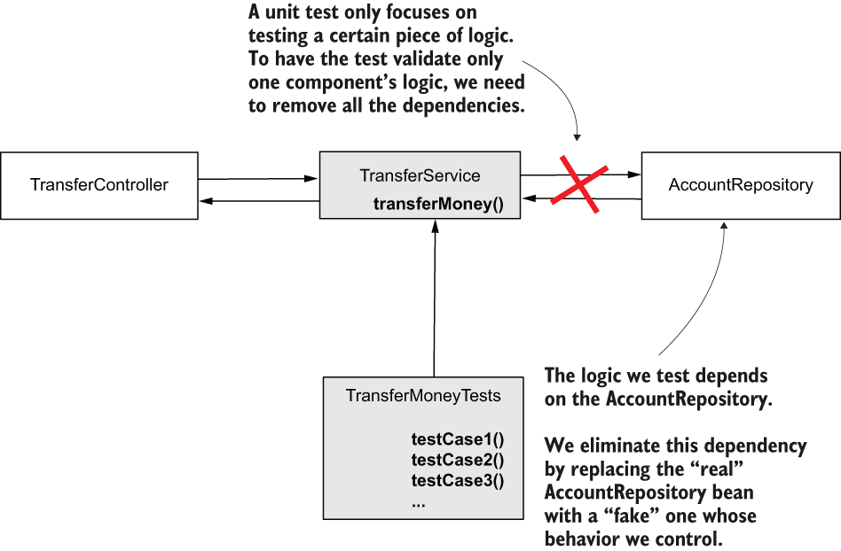

> **Hình 15.7** Để cho phép unit test chỉ tập trung vào logic của method transferMoney(), chúng ta loại bỏ dependency đến đối tượng AccountRepository. Chúng ta dùng một đối tượng mock để thay thế instance AccountRepository thật, và chúng ta kiểm soát instance giả này để kiểm thử cách method transferMoney() hành xử trong các tình huống khác nhau.

Trong listing 15.2, chúng ta bắt đầu triển khai unit test. Sau khi tạo một class mới trong thư mục test của project Maven, chúng ta bắt đầu triển khai kịch bản test đầu tiên bằng cách viết một method mới được đánh dấu bằng annotation `@Test`.

> **LƯU Ý** Với các ví dụ trong sách này, chúng ta dùng JUnit 5 Jupiter, phiên bản JUnit mới nhất, để triển khai unit test và integration test. Tuy nhiên, trong các ứng dụng thực tế, bạn cũng có thể thấy JUnit 4 được dùng thường xuyên. Đây là một lý do nữa tôi khuyên bạn cũng đọc các sách tập trung vào kiểm thử. Chương 4 của *JUnit in Action* (Manning, 2020) của Cătălin Tudose tập trung vào sự khác biệt giữa JUnit 4 và JUnit 5.

Chúng ta tạo một instance `TransferService` để gọi method `transferMoney()` mà chúng ta muốn kiểm thử. Thay vì dùng instance `AccountRepository` thật, chúng ta tạo một đối tượng mock mà chúng ta có thể kiểm soát. Để tạo đối tượng mock như vậy, chúng ta dùng một method tên là `mock()`. Method `mock()` này được cung cấp bởi một dependency tên là Mockito (thường được dùng cùng JUnit để triển khai test).

**Listing 15.2** Tạo đối tượng có method mà chúng ta muốn unit test

```java
public class TransferServiceUnitTests {
    @Test
    public void moneyTransferHappyFlow() {
        AccountRepository accountRepository =
          mock(AccountRepository.class);                       ❶

        TransferService transferService =                      ❷
          new TransferService(accountRepository);
    }
}
```

❶ Chúng ta dùng method `mock()` của Mockito để tạo một instance mock cho đối tượng `AccountRepository`.

❷ Chúng ta tạo một instance của đối tượng `TransferService` có method mà chúng ta muốn kiểm thử. Thay vì instance `AccountRepository` thật, chúng ta tạo đối tượng bằng một `AccountRepository` mock. Bằng cách này, chúng ta thay dependency bằng thứ gì đó chúng ta có thể kiểm soát.

Giờ chúng ta có thể chỉ định đối tượng mock nên hành xử thế nào, rồi gọi method được kiểm thử và chứng minh nó hoạt động như mong đợi trong các điều kiện đã cho. Bạn kiểm soát hành vi của mock bằng method `given()`, như trong listing 15.3. Dùng method `given()`, bạn nói cho mock biết cách hành xử khi một trong các method của nó được gọi. Trong trường hợp của chúng ta, chúng ta muốn method `findById()` của `AccountRepository` trả về một instance `Account` cụ thể cho một giá trị tham số cho trước.

> **LƯU Ý** Trong ứng dụng thực tế, một thực hành tốt là dùng annotation `@DisplayName` để mô tả kịch bản test (như bạn thấy trong listing tiếp theo). Trong các ví dụ của chúng ta, tôi đã bỏ annotation `@DisplayName` để tiết kiệm chỗ và cho phép bạn tập trung vào logic của test. Tuy nhiên, dùng nó trong ứng dụng thực tế có thể giúp bạn, và cả các lập trình viên khác trong nhóm, hiểu rõ hơn kịch bản test đã triển khai.

**Listing 15.3** Một unit test xác nhận happy flow

```java
public class TransferServiceUnitTests {

    @Test
    @DisplayName("Test the amount is transferred " +
     "from one account to another if no exception occurs.")
    public void moneyTransferHappyFlow() {
        AccountRepository accountRepository =
          mock(AccountRepository.class);
        TransferService transferService =
          new TransferService(accountRepository);
        Account sender = new Account();                                    ❶
        sender.setId(1);
        sender.setAmount(new BigDecimal(1000));

        Account destination = new Account();                               ❶
        destination.setId(2);
        destination.setAmount(new BigDecimal(1000));

        given(accountRepository.findById(sender.getId()))                  ❷
          .willReturn(Optional.of(sender));

        given(accountRepository.findById(destination.getId()))             ❸
          .willReturn(Optional.of(destination));

        transferService.transferMoney(                                     ❹
                                sender.getId(),
                                destination.getId(),
                                new BigDecimal(100)
                          );

    }

}
```

❶ Chúng ta tạo các instance `Account` của người gửi và đích, chứa các chi tiết `Account` mà chúng ta giả định ứng dụng sẽ tìm thấy trong database.

❷ Chúng ta kiểm soát method `findById()` của mock để trả về instance tài khoản người gửi khi nó nhận ID tài khoản người gửi. Bạn có thể đọc dòng này là "Nếu ai đó gọi method `findById()` với tham số ID người gửi, thì trả về instance tài khoản người gửi."

❸ Chúng ta kiểm soát method `findById()` của mock để trả về instance tài khoản đích khi nó nhận ID tài khoản đích. Bạn có thể đọc dòng này là "Nếu ai đó gọi method `findById()` với tham số ID đích, thì trả về instance tài khoản đích."

❹ Chúng ta gọi method muốn kiểm thử với ID người gửi, ID đích, và giá trị cần chuyển.

Điều duy nhất chúng ta còn cần làm là nói cho test biết điều gì nên xảy ra khi method được kiểm thử thực thi. Chúng ta mong đợi gì? Chúng ta biết mục đích của method này là chuyển tiền từ một tài khoản cho trước sang tài khoản khác. Vậy nên, chúng ta mong đợi nó gọi instance repository để thay đổi số tiền với các giá trị đúng. Trong listing 15.4, chúng ta thêm các lệnh test xác nhận method đã gọi đúng các method của instance repository để thay đổi số tiền.

Để xác nhận một method của đối tượng mock đã được gọi, bạn dùng method `verify()`, như trình bày trong listing sau.

**Listing 15.4** Một unit test xác nhận happy flow

```java
public class TransferServiceUnitTests {

    @Test
    public void moneyTransferHappyFlow() {
      AccountRepository accountRepository =
          mock(AccountRepository.class);
        TransferService transferService =
          new TransferService(accountRepository);

        Account sender = new Account();
        sender.setId(1);
        sender.setAmount(new BigDecimal(1000));

        Account destination = new Account();
        destination.setId(2);
        destination.setAmount(new BigDecimal(1000));

        given(accountRepository.findById(sender.getId()))
          .willReturn(Optional.of(sender));

        given(accountRepository.findById(destination.getId()))
          .willReturn(Optional.of(destination));

        transferService.transferMoney(
                               sender.getId(),
                               destination.getId(),
                               new BigDecimal(100)
                          );

        verify(accountRepository)                            ❶
          .changeAmount(1, new BigDecimal(900));             ❶

        verify(accountRepository)                            ❶
          .changeAmount(2, new BigDecimal(1100));            ❶
    }

}
```

❶ Xác nhận rằng method `changeAmount()` trong `AccountRepository` đã được gọi với các tham số mong đợi.

Nếu bạn chạy test ngay bây giờ (thường trong IDE bằng cách nhấp chuột phải vào class test và chọn tùy chọn "Run tests"), bạn sẽ thấy các test thành công. Khi một test thành công, IDE hiển thị chúng màu xanh lá, và console không hiển thị thông báo exception nào. Nếu một test thất bại, nó thường được hiển thị màu đỏ hoặc vàng trong IDE (hình 15.8).

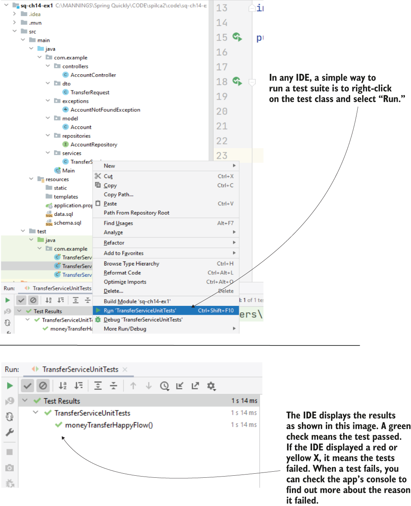

> **Hình 15.8** Chạy một test. IDE thường cung cấp nhiều cách để bạn chạy test. Một trong số đó là nhấp chuột phải vào class test và chọn "Run". Bạn cũng có thể chạy tất cả các test của project bằng cách nhấp chuột phải vào tên project và chọn "Run tests". Các IDE khác nhau có thể có giao diện đồ họa hơi khác, nhưng chúng đều trông tương tự như những gì bạn thấy trong hình này. Sau khi chạy các test, IDE hiển thị trạng thái của từng test.

Dù trong nhiều trường hợp bạn thấy method `mock()` được khai báo bên trong method, như trình bày trong các listing 15.2 đến 15.4, tôi thường thích một cách khác để tạo đối tượng mock. Nó không hẳn tốt hơn hay được dùng thường xuyên hơn, nhưng tôi coi việc dùng annotation để tạo mock và đối tượng được kiểm thử là cách sạch sẽ hơn, như trình bày trong listing 15.5.

**Listing 15.5** Dùng annotation cho các dependency mock

```java
@ExtendWith(MockitoExtension.class)                                         ❶
public class TransferServiceWithAnnotationsUnitTests {

    @Mock                                                                   ❷
    private AccountRepository accountRepository;

    @InjectMocks                                                            ❸
    private TransferService transferService;

    @Test
    public void moneyTransferHappyFlow() {
        Account sender = new Account();
        sender.setId(1);
        sender.setAmount(new BigDecimal(1000));

        Account destination = new Account();
        destination.setId(2);
        destination.setAmount(new BigDecimal(1000));

        given(accountRepository.findById(sender.getId()))
            .willReturn(Optional.of(sender));

        given(accountRepository.findById(destination.getId()))
            .willReturn(Optional.of(destination));

        transferService.transferMoney(1, 2, new BigDecimal(100));

        verify(accountRepository)
          .changeAmount(1, new BigDecimal(900));

        verify(accountRepository)
          .changeAmount(2, new BigDecimal(1100));
    }
}
```

❶ Bật việc dùng các annotation `@Mock` và `@InjectMocks`.

❷ Dùng annotation `@Mock` để tạo một đối tượng mock và inject nó vào field được đánh dấu của class test.

❸ Dùng `@InjectMocks` để tạo đối tượng được kiểm thử và inject nó vào field được đánh dấu của class.

Hãy quan sát cách, thay vì khai báo các đối tượng này bên trong method test, tôi đưa chúng ra thành các thuộc tính của class và đánh dấu bằng `@Mock` và `@InjectMocks`. Khi bạn dùng annotation `@Mock`, framework tạo và inject một đối tượng mock vào thuộc tính được đánh dấu. Với annotation `@InjectMocks`, bạn tạo đối tượng cần kiểm thử và chỉ thị framework inject tất cả các mock (được tạo bằng `@Mock`) vào các tham số của nó.

Để các annotation `@Mock` và `@InjectMocks` hoạt động, bạn cũng cần đánh dấu class test bằng annotation `@ExtendWith(MockitoExtension.class)`. Khi đánh dấu class theo cách này, bạn bật một extension cho phép framework đọc các annotation `@Mock` và `@InjectMocks` và kiểm soát các field được đánh dấu.

Hình 15.9 tóm tắt test chúng ta đã xây dựng. Trong hình này, bạn thấy các bước và code chúng ta đã viết để giải quyết từng bước chúng ta đã liệt kê khi bắt đầu viết test:

1. Giả định: Liệt kê và kiểm soát các dependency.
2. Gọi: Thực thi method được kiểm thử.
3. Xác nhận: Xác nhận method đã thực thi có hành vi mong đợi

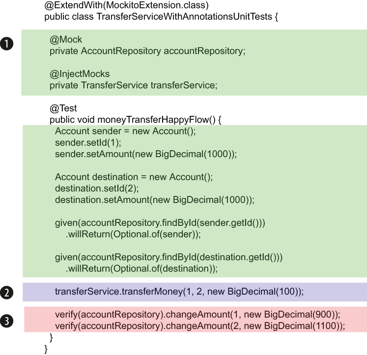

> **Hình 15.9** Các phần chính của việc triển khai test. (1) Định nghĩa và kiểm soát các dependency, (2) thực thi method được kiểm thử, và (3) xác nhận method hành xử như mong đợi.

**VIẾT TEST CHO LUỒNG EXCEPTION**

Hãy nhớ rằng happy flow không phải là luồng duy nhất bạn cần kiểm thử. Bạn cũng muốn biết method thực thi theo cách mong muốn khi gặp exception. Luồng như vậy được gọi là luồng exception (exception flow). Trong ví dụ của chúng ta, luồng exception có thể xảy ra nếu chi tiết tài khoản của người gửi hoặc tài khoản đích không được tìm thấy với ID đã cho, như trình bày trong hình 15.10.

Listing 15.6 cho bạn thấy cách viết unit test cho luồng exception. Nếu bạn muốn kiểm tra method ném ra exception, bạn dùng `assertThrows()`. Bạn chỉ định exception bạn mong đợi method sẽ ném ra và chỉ định method được kiểm thử. Method `assertThrows()` gọi method được kiểm thử và xác nhận nó ném ra exception mong đợi.

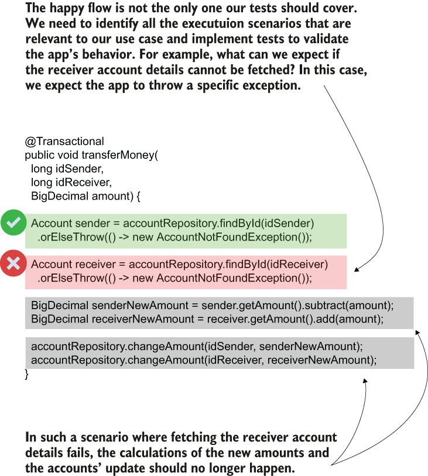

> **Hình 15.10** Luồng exception là một lần thực thi gặp lỗi hoặc exception. Ví dụ, nếu chi tiết tài khoản người nhận không được tìm thấy, ứng dụng nên ném ra AccountNotFoundException, và method changeAmount() không nên được gọi. Luồng exception cũng quan trọng, và chúng ta cần triển khai test cho các kịch bản này giống như với happy flow.

**Listing 15.6** Kiểm thử luồng exception

```java
@ExtendWith(MockitoExtension.class)
public class TransferServiceWithAnnotationsUnitTests {

  @Mock
  private AccountRepository accountRepository;

  @InjectMocks
  private TransferService transferService;

  @Test
  public void moneyTransferDestinationAccountNotFoundFlow() {
     Account sender = new Account();
        sender.setId(1);
        sender.setAmount(new BigDecimal(1000));

        given(accountRepository.findById(1L))
            .willReturn(Optional.of(sender));

        given(accountRepository.findById(2L))
            .willReturn(Optional.empty());                    ❶

        assertThrows(
            AccountNotFoundException.class,                   ❷
             () -> transferService.transferMoney(1, 2, new BigDecimal(100))
        );

        verify(accountRepository, never())                    ❸
            .changeAmount(anyLong(), any());
    }
}
```

❶ Chúng ta kiểm soát mock `AccountRepository` để trả về một `Optional` rỗng khi method `findById()` được gọi cho tài khoản đích.

❷ Chúng ta khẳng định rằng method ném ra `AccountNotFoundException` trong kịch bản đã cho.

❸ Chúng ta dùng method `verify()` với điều kiện `never()` để khẳng định rằng method `changeAmount()` chưa được gọi.

**KIỂM THỬ GIÁ TRỊ MÀ METHOD TRẢ VỀ**

Một trường hợp thường gặp là cần kiểm tra giá trị mà method trả về. Listing tiếp theo cho thấy một method chúng ta đã triển khai trong chương 9, trong project "sq-ch9-ex1". Bạn sẽ triển khai unit test cho method này thế nào, xét rằng bạn cần kiểm thử kịch bản người dùng cung cấp đúng thông tin đăng nhập?

**Listing 15.7** Phần triển khai action controller đăng nhập mà chúng ta muốn unit test

```java
@PostMapping("/")
  public String loginPost(
      @RequestParam String username,
          @RequestParam String password,
          Model model
    ) {
      loginProcessor.setUsername(username);
      loginProcessor.setPassword(password);
      boolean loggedIn = loginProcessor.login();

      if (loggedIn) {
        model.addAttribute("message", "You are now logged in.");
      } else {
        model.addAttribute("message", "Login failed!");
      }

      return "login.html";
  }
```

Bạn làm theo các bước tương tự bạn đã học trong mục này:

1. Xác định và kiểm soát các dependency.
2. Gọi method được kiểm thử.
3. Xác nhận việc thực thi method được kiểm thử hành xử như mong đợi.

Listing 15.8 cho thấy phần triển khai unit test. Hãy quan sát rằng chúng ta đã mock các dependency có hành vi mà chúng ta muốn kiểm soát hoặc xác nhận: các đối tượng `Model` và `LoginProcessor`. Chúng ta chỉ thị đối tượng mock `LoginProcessor` trả về `true` (tương đương với giả định người dùng cung cấp đúng thông tin đăng nhập), và chúng ta gọi method muốn kiểm thử.

Chúng ta xác nhận những điều sau:

- Method trả về chuỗi "login.html". Chúng ta dùng một method assert để xác nhận method đã trả về một giá trị. Như trong listing 15.8, chúng ta có thể dùng method `assertEquals()`, method này so sánh một giá trị mong đợi với giá trị mà method trả về.
- Instance `Model` chứa thông báo hợp lệ "You are now logged in." Chúng ta dùng method `verify()` để xác nhận method `addAttribute()` của instance `Model` đã được gọi với giá trị đúng làm tham số.

**Listing 15.8** Kiểm thử giá trị trả về trong unit test

```java
@ExtendWith(MockitoExtension.class)
class LoginControllerUnitTests {

  @Mock
  private Model model;                                                   ❶

  @Mock
    private LoginProcessor loginProcessor;                              ❶

    @InjectMocks
    private LoginController loginController;                            ❶

    @Test
    public void loginPostLoginSucceedsTest() {
      given(loginProcessor.login())                                     ❷
          .willReturn(true);

        String result =                                         ❸
          loginController.loginPost("username", "password", model);

        assertEquals("login.html", result);                             ❹

        verify(model)                                                   ❺
         .addAttribute("message", "You are now logged in.");
    }
}
```

❶ Chúng ta định nghĩa các đối tượng mock và inject chúng vào instance có hành vi mà chúng ta kiểm thử.

❷ Chúng ta kiểm soát instance mock `LoginProcessor`, bảo nó trả về `true` khi method `login()` của nó được gọi.

❸ Chúng ta gọi method được kiểm thử với các giả định đã cho.

❹ Chúng ta xác nhận giá trị trả về của method được kiểm thử.

❺ Chúng ta xác nhận thuộc tính message đã được thêm với giá trị đúng vào đối tượng model.

Bằng cách kiểm soát các đầu vào (giá trị tham số và cách các đối tượng mock hành xử), bạn cũng có thể kiểm thử điều gì xảy ra trong các kịch bản khác nhau. Trong listing tiếp theo, chúng ta làm cho method `login()` của đối tượng mock `LoginProcessor` trả về `false` để kiểm thử điều gì sẽ xảy ra nếu đăng nhập thất bại.

**Listing 15.9** Thêm test để xác nhận kịch bản đăng nhập thất bại

```java
@ExtendWith(MockitoExtension.class)
class LoginControllerUnitTests {

    // Omitted code

    @Test
         public void loginPostLoginFailsTest() {
             given(loginProcessor.login())
               .willReturn(false);

             String result =
               loginController.loginPost("username", "password", model);

             assertEquals("login.html", result);

             verify(model)
               .addAttribute("message", "Login failed!");
         }
     }
```

### 15.2.2 Triển khai integration test

Trong mục này, chúng ta bàn về integration test. Integration test rất giống unit test. Chúng ta thậm chí sẽ tiếp tục viết chúng bằng JUnit. Nhưng thay vì tập trung vào cách một thành phần cụ thể hoạt động, integration test tập trung vào cách hai hay nhiều thành phần tương tác.

Bạn còn nhớ phép so sánh với các đèn báo trên bảng điều khiển ô tô? Nếu bình xăng của xe đầy, nhưng có gì đó hỏng trong hệ thống phân phối xăng giữa bình và động cơ, xe vẫn không nổ máy. Thật không may, lần này đèn báo xăng sẽ không cho bạn thấy có gì đó sai vì bình có đủ xăng, và với tư cách một thành phần cô lập, nó hoạt động đúng. Trong trường hợp như vậy, chúng ta không biết tại sao xe không hoạt động. Vấn đề tương tự có thể xảy ra với ứng dụng. Ngay cả khi một số thành phần hoạt động đúng khi cô lập với nhau, chúng không "nói chuyện" đúng với nhau. Viết integration test giúp chúng ta giảm thiểu các vấn đề có thể xảy ra khi các thành phần hoạt động đúng một cách độc lập nhưng không giao tiếp đúng.

Chúng ta sẽ lấy cùng ví dụ đã dùng cho unit test cho ví dụ này: use case chuyển tiền chúng ta đã triển khai trong chương 14 (project "sq-ch14-ex1").

Chúng ta có thể kiểm thử những loại tích hợp nào? Chúng ta có vài khả năng:

- Tích hợp giữa hai (hoặc nhiều) đối tượng của ứng dụng. Kiểm thử rằng các đối tượng tương tác đúng giúp bạn xác định vấn đề trong cách chúng cộng tác nếu bạn thay đổi một trong số chúng.
- Tích hợp của một đối tượng trong ứng dụng với một khả năng nào đó mà framework bổ sung cho nó. Kiểm thử cách một đối tượng tương tác với một khả năng nào đó mà framework cung cấp giúp bạn xác định các vấn đề có thể xảy ra khi bạn nâng cấp framework lên phiên bản mới. Integration test giúp bạn xác định ngay nếu có gì đó thay đổi trong framework và khả năng mà đối tượng dựa vào không còn hoạt động như cũ.
- Tích hợp của ứng dụng với tầng lưu trữ của nó (database). Kiểm thử cách repository hoạt động với database đảm bảo bạn nhanh chóng xác định các vấn đề có thể xảy ra khi nâng cấp hoặc thay đổi một dependency giúp ứng dụng làm việc với dữ liệu được lưu trữ (như JDBC driver).

Integration test trông rất giống unit test. Bạn vẫn làm theo cùng các bước: xác định các giả định, gọi method được kiểm thử, và xác nhận kết quả. Khác biệt là giờ test không tập trung vào một đoạn logic cô lập, nên bạn không nhất thiết phải mock tất cả các dependency. Bạn có thể cho phép method bạn kiểm thử gọi method của một đối tượng thật khác (không phải mock) vì bạn muốn kiểm thử hai đối tượng giao tiếp đúng. Vậy nên, nếu với unit test việc mock repository là bắt buộc, với integration test điều đó không còn bắt buộc. Bạn vẫn có thể mock nó nếu test bạn viết không quan tâm cách service tương tác với repository đó, nhưng nếu bạn muốn kiểm thử cách hai đối tượng này giao tiếp, bạn có thể để đối tượng thật được gọi (hình 15.11).

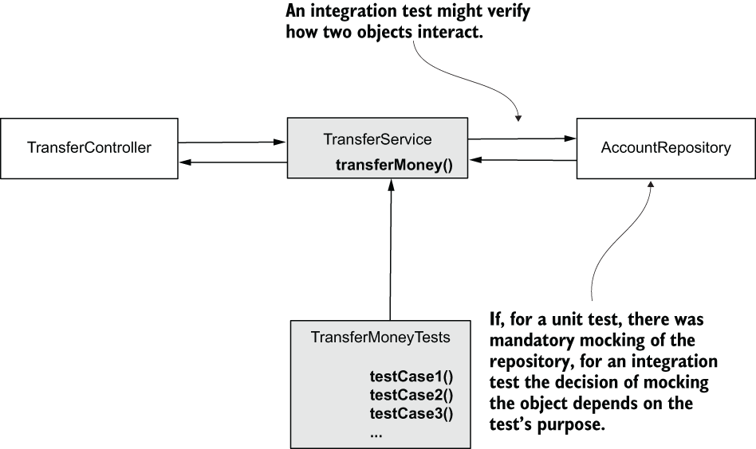

> **Hình 15.11** Trong trường hợp unit test, tất cả các dependency cần được mock. Nếu mục đích của integration test là xác nhận cách TestService và AccountRepository tương tác, repository có thể là đối tượng thật. Integration test vẫn có thể mock một đối tượng nếu mục đích của nó không xác nhận sự tích hợp với một thành phần cụ thể.

> **LƯU Ý** Nếu bạn quyết định không mock repository trong integration test, bạn nên dùng database in-memory như H2 thay vì database thật. Điều này sẽ giúp bạn giữ các test độc lập với hạ tầng chạy ứng dụng. Dùng database thật có thể gây độ trễ khi thực thi test và thậm chí làm test thất bại trong trường hợp có vấn đề về hạ tầng hoặc mạng. Vì bạn kiểm thử ứng dụng chứ không phải hạ tầng, bạn nên tránh tất cả rắc rối này bằng cách dùng một database in-memory giả lập.

Với ứng dụng Spring, bạn thường dùng integration test để xác nhận hành vi của ứng dụng tương tác đúng với các khả năng mà Spring cung cấp. Chúng ta gọi test như vậy là "Spring integration test". Không giống unit test, integration test cho phép Spring tạo các bean và cấu hình context (giống như khi chạy ứng dụng).

Listing 15.10 cho bạn thấy việc chuyển một unit test thành Spring integration test đơn giản thế nào. Hãy quan sát rằng chúng ta có thể dùng annotation `@MockBean` để tạo một đối tượng mock trong ứng dụng Spring Boot. Annotation này khá giống annotation `@Mock` chúng ta dùng cho unit test, nhưng nó cũng đảm bảo đối tượng mock được thêm vào application context. Bằng cách này, bạn có thể đơn giản dùng `@Autowired` (như bạn đã học ở chương 3) để inject đối tượng có hành vi mà bạn kiểm thử.

**Listing 15.10** Triển khai một Spring integration test

```java
@SpringBootTest
class TransferServiceSpringIntegrationTests {

  @MockBean                                                         ❶
  private AccountRepository accountRepository;

  @Autowired                                                        ❷
  private TransferService transferService;

  @Test
  void transferServiceTransferAmountTest() {
     Account sender = new Account();                                ❸
     sender.setId(1);                                               ❸
     sender.setAmount(new BigDecimal(1000));                        ❸

     Account receiver = new Account();                              ❸
     receiver.setId(2);                                             ❸
     receiver.setAmount(new BigDecimal(1000));                      ❸

     when(accountRepository.findById(1L))                           ❸
       .thenReturn(Optional.of(sender));                            ❸
     when(accountRepository.findById(2L))                           ❸
           .thenReturn(Optional.of(receiver));                        ❸

         transferService
            .transferMoney(1, 2, new BigDecimal(100));                ❹

         verify(accountRepository)                                    ❺
           .changeAmount(1, new BigDecimal(900));                     ❺
         verify(accountRepository)                                    ❺
           .changeAmount(2, new BigDecimal(1100));                    ❺
     }

}
```

❶ Tạo một đối tượng mock cũng là một phần của Spring context.

❷ Inject đối tượng thật từ Spring context có hành vi mà bạn sẽ kiểm thử.

❸ Định nghĩa tất cả các giả định cho test.

❹ Gọi method được kiểm thử.

❺ Xác nhận lời gọi method được kiểm thử có hành vi mong đợi.

> **LƯU Ý** Annotation `@MockBean` là annotation của Spring Boot. Nếu bạn có một ứng dụng Spring thuần chứ không phải Spring Boot như trình bày ở đây, bạn sẽ không thể dùng `@MockBean`. Tuy nhiên, bạn vẫn có thể dùng cùng cách tiếp cận bằng cách đánh dấu class cấu hình với `@ExtendsWith(SpringExtension.class)`. Một ví dụ dùng annotation này nằm trong project "sq-ch3-ex1".

Bạn chạy test theo cùng cách như với bất kỳ test nào khác. Tuy nhiên, dù nó trông rất giống unit test, giờ Spring biết đối tượng được kiểm thử và quản lý nó như trong một ứng dụng đang chạy. Ví dụ, nếu chúng ta nâng cấp phiên bản Spring và, vì lý do nào đó, dependency injection không còn hoạt động, test sẽ thất bại ngay cả khi chúng ta không thay đổi gì trong đối tượng được kiểm thử. Điều tương tự áp dụng cho bất kỳ khả năng nào Spring cung cấp cho method được kiểm thử: tính transactional, bảo mật, caching, v.v. Bạn sẽ có thể kiểm thử sự tích hợp của method với bất kỳ khả năng nào trong số này mà method dùng trong ứng dụng.

> **LƯU Ý** Trong ứng dụng thực tế, hãy dùng unit test để xác nhận hành vi của các thành phần và Spring integration test để xác nhận các kịch bản tích hợp cần thiết. Ngay cả khi Spring integration test có thể được dùng để xác nhận hành vi của thành phần (triển khai tất cả các kịch bản test cho logic của method), dùng integration test cho mục đích này không phải là ý hay. Integration test mất nhiều thời gian hơn để thực thi vì chúng phải cấu hình Spring context. Mỗi lời gọi method cũng kích hoạt nhiều cơ chế Spring cần, tùy vào những khả năng nó cung cấp cho method cụ thể đó. Không hợp lý khi tốn thời gian và tài nguyên để thực thi những thứ này cho mọi kịch bản logic của ứng dụng. Để tiết kiệm thời gian, cách tốt nhất là dựa vào unit test để xác nhận logic của các thành phần trong ứng dụng và chỉ dùng integration test để xác nhận cách chúng tích hợp với framework.

## Tóm tắt

- Test là một đoạn code nhỏ bạn viết để xác nhận hành vi của một logic nhất định được triển khai trong ứng dụng. Test cần thiết vì chúng giúp bạn đảm bảo các phát triển tương lai của ứng dụng không làm hỏng các khả năng hiện có. Test cũng hữu ích như tài liệu.
- Test được chia thành hai nhóm: unit test và integration test. Mỗi nhóm có mục đích riêng.
  - Unit test chỉ tập trung vào một đoạn logic cô lập và xác nhận cách một thành phần đơn giản hoạt động mà không kiểm tra cách nó tích hợp với các tính năng khác. Unit test hữu ích vì chúng thực thi nhanh và chỉ thẳng cho chúng ta vấn đề mà một thành phần cụ thể có thể gặp.
  - Integration test tập trung xác nhận sự tương tác giữa hai hay nhiều thành phần. Chúng thiết yếu vì đôi khi hai thành phần có thể hoạt động đúng khi cô lập nhưng không giao tiếp tốt. Integration test giúp chúng ta giảm thiểu các vấn đề phát sinh từ các trường hợp như vậy.
- Đôi khi trong test bạn muốn loại bỏ dependency đến một số thành phần để cho phép test tập trung vào cách một số (chứ không phải tất cả) các phần tương tác. Trong những trường hợp như vậy, chúng ta thay các thành phần không muốn kiểm thử bằng "mock": các đối tượng giả mà bạn kiểm soát để loại bỏ các dependency bạn không muốn kiểm thử và cho phép test chỉ tập trung vào các tương tác cụ thể.
- Bất kỳ test nào cũng có ba phần chính:
  - Giả định (Assumptions): Định nghĩa các giá trị đầu vào và cách các đối tượng mock hành xử.
  - Gọi/Thực thi (Call/Execution): Gọi method bạn muốn kiểm thử.
  - Xác nhận (Validations): Xác nhận cách method được kiểm thử đã hành xử.
