# 2 Spring context: Định nghĩa bean

**Chương này bao gồm**

- Hiểu vì sao cần Spring context
- Thêm các object instance mới vào Spring context

Trong chương này, bạn bắt đầu học cách làm việc với một thành phần cốt lõi của Spring framework: context (trong một ứng dụng Spring còn được gọi là application context). Hãy hình dung context như một vùng trong bộ nhớ của ứng dụng, nơi chúng ta đưa vào tất cả các object instance mà chúng ta muốn framework quản lý. Mặc định, Spring không biết bất kỳ đối tượng nào bạn định nghĩa trong ứng dụng. Để Spring "nhìn thấy" các đối tượng của bạn, bạn cần thêm chúng vào context. Ở phần sau của cuốn sách, chúng ta sẽ bàn về việc sử dụng các tính năng khác nhau mà Spring cung cấp trong ứng dụng. Bạn sẽ thấy rằng việc "cắm" các tính năng đó vào được thực hiện thông qua context, bằng cách thêm các object instance và thiết lập quan hệ giữa chúng. Spring dùng các instance trong context để kết nối ứng dụng của bạn với những chức năng mà nó cung cấp. Bạn sẽ học những điều cơ bản về các tính năng quan trọng nhất (ví dụ transaction, testing, v.v.) xuyên suốt cuốn sách.

Học Spring context là gì và nó hoạt động ra sao là bước đầu tiên để học cách dùng Spring, bởi vì nếu không biết cách quản lý Spring context, hầu như bạn sẽ không thể làm được bất cứ điều gì khác với nó. Context là một cơ chế phức tạp cho phép Spring kiểm soát các instance mà bạn định nghĩa. Nhờ đó, nó cho phép bạn sử dụng các khả năng mà framework cung cấp.

Trong chương này, chúng ta bắt đầu bằng việc học cách thêm object instance vào Spring context. Ở chương 3, bạn sẽ học cách tham chiếu đến các instance đã thêm và thiết lập quan hệ giữa chúng.

Chúng ta sẽ gọi các object instance này là "bean". Dĩ nhiên, với những cú pháp bạn cần học, chúng ta sẽ viết các đoạn code, và bạn có thể tìm thấy tất cả các đoạn code này trong các project đi kèm sách (bạn có thể tải các project từ mục "Book resources" của bản live book). Tôi sẽ bổ sung cho các ví dụ code bằng hình minh họa và giải thích chi tiết về các cách tiếp cận.

Vì tôi muốn phần giới thiệu Spring của bạn diễn ra từng bước và tuần tự, trong chương này chúng ta tập trung vào các cú pháp bạn cần biết để làm việc với Spring context. Sau này bạn sẽ thấy rằng không phải mọi đối tượng trong ứng dụng đều cần được Spring quản lý, nên bạn không cần thêm tất cả các object instance của ứng dụng vào Spring context. Hiện tại, tôi mời bạn tập trung học các cách thêm một instance để Spring quản lý.

## 2.1 Tạo một project Maven

Trong mục này, chúng ta sẽ bàn về việc tạo một project Maven. Maven không phải là chủ đề liên quan trực tiếp đến Spring, nhưng nó là công cụ bạn dùng để quản lý dễ dàng quy trình build của ứng dụng bất kể bạn dùng framework nào. Bạn cần biết những điều cơ bản về project Maven để theo dõi các ví dụ code. Maven cũng là một trong những công cụ build được dùng nhiều nhất cho các project Spring trong thực tế (Gradle, một công cụ build khác, đứng thứ hai, nhưng chúng ta sẽ không bàn về nó trong cuốn sách này). Vì Maven là công cụ rất phổ biến, có thể bạn đã biết cách tạo project và thêm dependency vào đó thông qua cấu hình của nó. Trong trường hợp đó, bạn có thể bỏ qua mục này và đi thẳng đến mục 2.2.

Build tool là phần mềm chúng ta dùng để build ứng dụng dễ dàng hơn. Bạn cấu hình build tool để nó thực hiện các tác vụ thuộc quy trình build ứng dụng thay vì làm thủ công. Một số ví dụ về các tác vụ thường nằm trong quy trình build ứng dụng như sau:

- Tải các dependency mà ứng dụng cần
- Chạy test
- Kiểm tra cú pháp tuân theo các quy tắc bạn định nghĩa
- Kiểm tra lỗ hổng bảo mật
- Biên dịch ứng dụng
- Đóng gói ứng dụng thành một archive có thể thực thi

Để các ví dụ có thể quản lý dependency dễ dàng, chúng ta cần dùng một build tool cho các project mà chúng ta phát triển. Mục này chỉ dạy những gì bạn cần biết để phát triển các ví dụ trong sách; chúng ta sẽ đi từng bước qua quy trình tạo một project Maven, và tôi sẽ dạy bạn những điều cốt yếu về cấu trúc của nó. Nếu bạn muốn tìm hiểu chi tiết hơn về cách dùng Maven, tôi khuyên bạn đọc cuốn *Introducing Maven: A Build Tool for Today's Java Developers* của Balaji Varanasi (APress, 2019).

Hãy bắt đầu từ điểm khởi đầu. Trước hết, giống như khi phát triển bất kỳ ứng dụng nào khác, bạn cần một môi trường phát triển tích hợp (IDE). Bất kỳ IDE chuyên nghiệp nào ngày nay đều hỗ trợ project Maven, nên bạn có thể chọn IDE tùy thích: IntelliJ IDEA, Eclipse, Spring STS, Netbeans, v.v. Trong cuốn sách này, tôi dùng IntelliJ IDEA, là IDE tôi dùng thường xuyên nhất. Đừng lo, cấu trúc của project Maven là như nhau bất kể bạn chọn IDE nào.

Hãy bắt đầu bằng việc tạo một project mới. Bạn tạo project mới trong IntelliJ từ File > New > Project. Thao tác này đưa bạn đến một cửa sổ như trong hình 2.1.

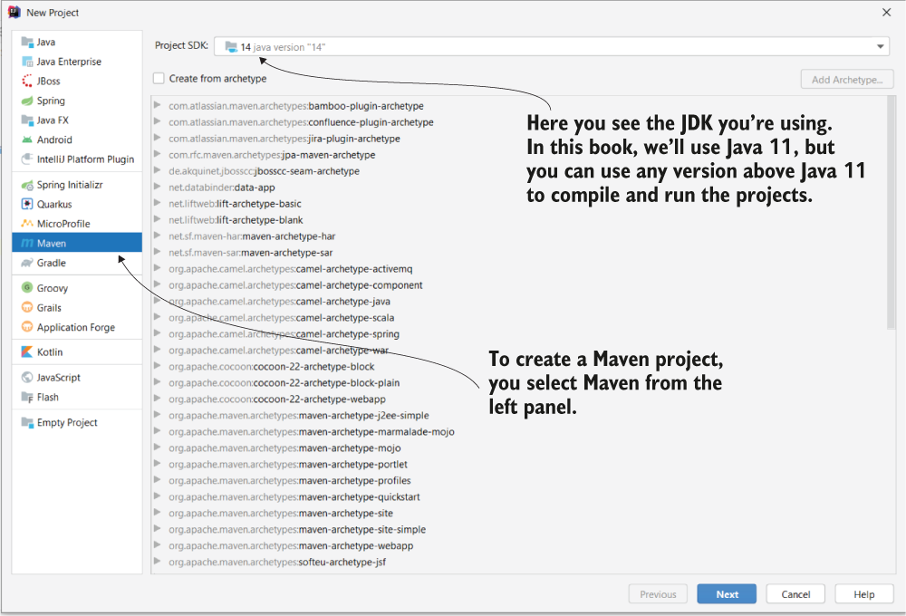

> **Hình 2.1** Tạo một project Maven mới. Sau khi vào File > New > Project, bạn đến cửa sổ này, nơi bạn cần chọn loại project ở bảng bên trái. Trong trường hợp của chúng ta, chọn Maven. Ở phần trên của cửa sổ, bạn chọn JDK muốn dùng để biên dịch và chạy project.

Sau khi đã chọn loại project, ở cửa sổ tiếp theo (hình 2.2) bạn cần đặt tên cho nó. Ngoài tên project và việc chọn vị trí lưu trữ, với một project Maven bạn còn có thể chỉ định các thông tin sau:

- Group ID, dùng để nhóm nhiều project liên quan với nhau
- Artifact ID, là tên của ứng dụng hiện tại
- Version, là định danh cho trạng thái triển khai hiện tại

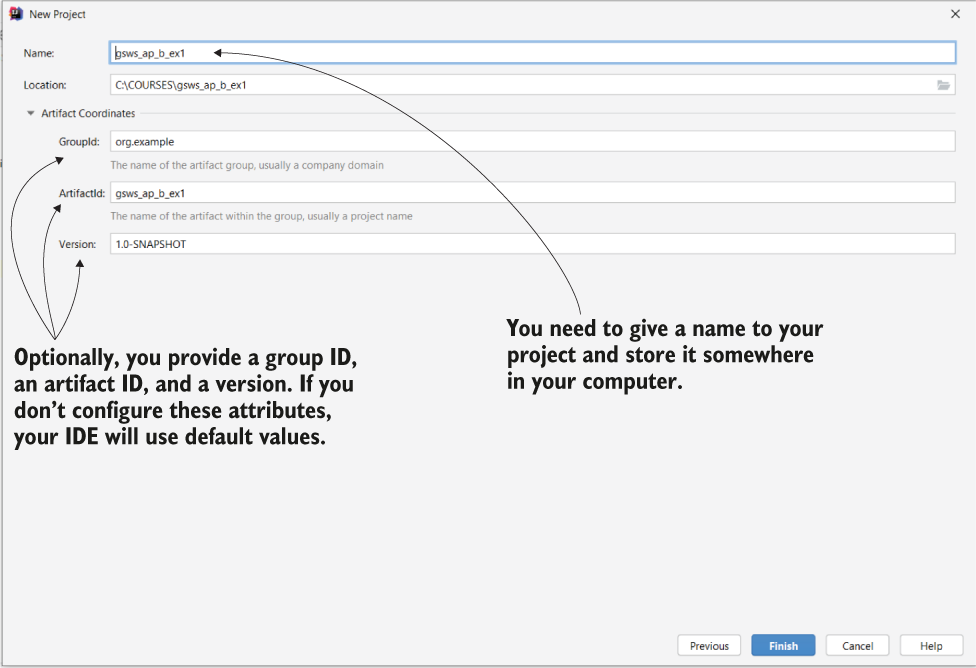

> **Hình 2.2** Trước khi hoàn tất việc tạo project, bạn cần đặt tên và chỉ định nơi bạn muốn IDE lưu project. Tùy chọn, bạn có thể đặt group ID, artifact ID và version cho project. Sau đó bạn bấm nút Finish ở góc dưới bên phải để hoàn tất việc tạo project.

Trong một ứng dụng thực tế, ba thuộc tính này là những chi tiết thiết yếu, và việc cung cấp chúng là quan trọng. Nhưng trong trường hợp của chúng ta, vì chỉ làm việc với các ví dụ mang tính lý thuyết, bạn có thể bỏ qua và để IDE tự điền các giá trị mặc định cho các đặc tính này.

Sau khi tạo xong project, bạn sẽ thấy cấu trúc của nó giống như trong hình 2.3. Một lần nữa, cấu trúc project Maven không phụ thuộc vào IDE bạn chọn để phát triển. Khi lần đầu nhìn vào project, bạn sẽ thấy hai thứ chính:

- Thư mục "src" (còn gọi là thư mục nguồn), nơi bạn đặt mọi thứ thuộc về ứng dụng.
- File pom.xml, nơi bạn viết các cấu hình cho project Maven, ví dụ như thêm dependency mới.

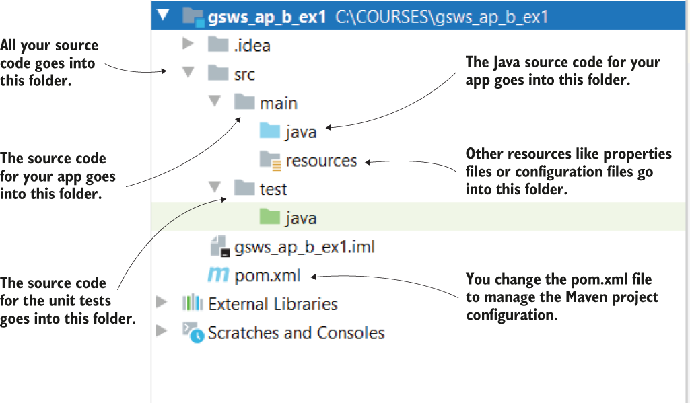

> **Hình 2.3** Cách một project Maven được tổ chức. Bên trong thư mục src, chúng ta thêm mọi thứ thuộc về ứng dụng: mã nguồn của ứng dụng nằm trong thư mục main, và mã nguồn của các unit test nằm trong thư mục test. Trong file pom.xml chúng ta viết cấu hình cho project Maven (trong các ví dụ, chúng ta chủ yếu dùng nó để định nghĩa các dependency).

Maven tổ chức thư mục "src" thành các thư mục con sau:

- Thư mục "main", nơi bạn lưu mã nguồn của ứng dụng. Thư mục này chứa code Java và các cấu hình tách riêng thành hai thư mục con tên là "java" và "resources".
- Thư mục "test", nơi bạn lưu mã nguồn của các unit test (chúng ta sẽ bàn kỹ hơn về unit test và cách định nghĩa chúng trong chương 15).

Hình 2.4 cho bạn thấy cách thêm mã nguồn mới vào thư mục "main/java" của project Maven. Các class mới của ứng dụng được đặt trong thư mục này.

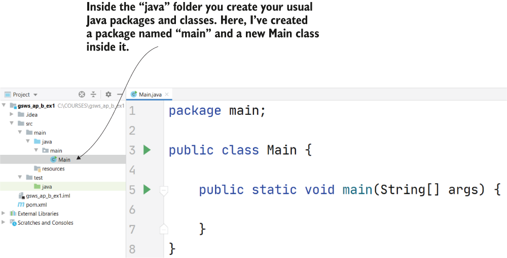

> **Hình 2.4** Bên trong thư mục "java", bạn tạo các package và class Java thông thường của ứng dụng. Đây là các class định nghĩa toàn bộ logic của ứng dụng và sử dụng các dependency mà bạn cung cấp.

Trong các project chúng ta tạo trong sách này, chúng ta dùng rất nhiều dependency bên ngoài: các library hoặc framework mà chúng ta dùng để triển khai chức năng của các ví dụ. Để thêm các dependency này vào project Maven, chúng ta cần thay đổi nội dung của file pom.xml. Trong listing sau, bạn thấy nội dung mặc định của file pom.xml ngay sau khi tạo project Maven.

**Listing 2.1** Nội dung mặc định của file pom.xml

```xml
<?xml version="1.0" encoding="UTF-8"?>
<project xmlns="http://maven.apache.org/POM/4.0.0"
            xmlns:xsi="http://www.w3.org/2001/XMLSchema-instance"
            xsi:schemaLocation="http://maven.apache.org/POM/4.0.0
            http://maven.apache.org/xsd/maven-4.0.0.xsd">

   <modelVersion>4.0.0</modelVersion>

   <groupId>org.example</groupId>
   <artifactId>sq-ch2-ex1</artifactId>
   <version>1.0-SNAPSHOT</version>

</project>
```

Với file pom.xml này, project không dùng bất kỳ dependency bên ngoài nào. Nếu bạn nhìn vào thư mục external dependencies của project, bạn chỉ thấy JDK (hình 2.5).

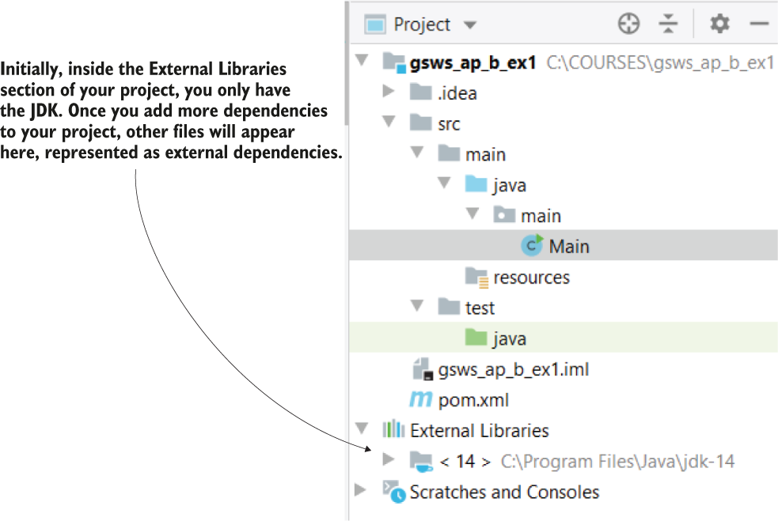

> **Hình 2.5** Với file pom.xml mặc định, project của bạn chỉ dùng JDK làm dependency bên ngoài. Một trong những lý do bạn thay đổi file pom.xml (và cũng là lý do chúng ta sẽ dùng trong sách này) là để thêm các dependency mới mà ứng dụng cần.

Listing sau cho bạn thấy cách thêm dependency bên ngoài vào project. Bạn viết tất cả các dependency giữa cặp thẻ `<dependencies>` `</dependencies>`. Mỗi dependency được biểu diễn bằng một nhóm thẻ `<dependency>` `</dependency>`, trong đó bạn viết các thuộc tính của dependency: group ID, tên artifact và version của dependency. Maven sẽ tìm dependency theo các giá trị bạn cung cấp cho ba thuộc tính này và tải các dependency từ một repository. Tôi sẽ không đi vào chi tiết cách cấu hình một repository tùy chỉnh. Bạn chỉ cần biết rằng mặc định Maven sẽ tải các dependency (thường là các file jar) từ một repository có tên Maven central. Bạn có thể tìm thấy các file jar đã tải trong thư mục external dependencies của project, như trình bày trong hình 2.6.

**Listing 2.2** Thêm một dependency mới vào file pom.xml

```xml
<?xml version="1.0" encoding="UTF-8"?>
<project xmlns="http://maven.apache.org/POM/4.0.0"
            xmlns:xsi="http://www.w3.org/2001/XMLSchema-instance"
            xsi:schemaLocation="http://maven.apache.org/POM/4.0.0
            http://maven.apache.org/xsd/maven-4.0.0.xsd">

   <modelVersion>4.0.0</modelVersion>

   <groupId>org.example</groupId>
   <artifactId>sq_ch2_ex1</artifactId>
   <version>1.0-SNAPSHOT</version>

   <dependencies>                                              ❶
      <dependency>                                             ❷
        <groupId>org.springframework</groupId>
         <artifactId>spring-jdbc</artifactId>
         <version>5.2.6.RELEASE</version>
      </dependency>
   </dependencies>

</project>
```

❶ Bạn cần viết các dependency của project giữa cặp thẻ `<dependencies>` và `</dependencies>`.

❷ Một dependency được biểu diễn bằng một nhóm thẻ `<dependency>` `</dependency>`.

Sau khi bạn thêm dependency vào file pom.xml như trong listing trên, IDE sẽ tải chúng về, và giờ bạn sẽ thấy các dependency này trong thư mục "External Libraries" (hình 2.6).

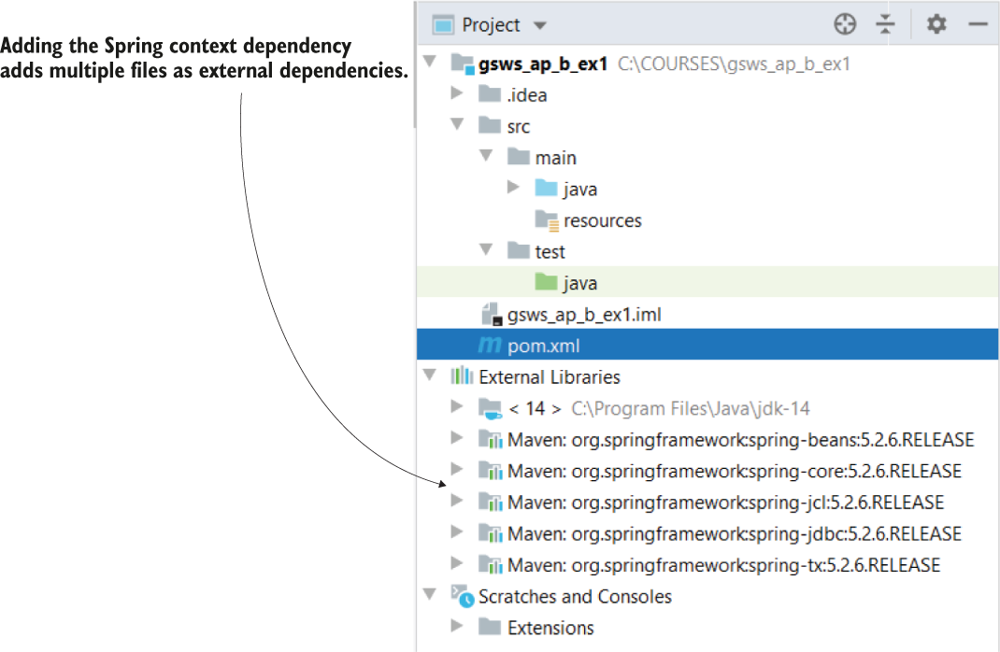

> **Hình 2.6** Khi bạn thêm một dependency mới vào file pom.xml, Maven tải về các file jar đại diện cho dependency đó. Bạn tìm thấy các file jar này trong thư mục External Libraries của project.

Bây giờ chúng ta có thể chuyển sang mục tiếp theo, nơi chúng ta bàn về những điều cơ bản của Spring context. Bạn sẽ tạo các project Maven, và bạn sẽ học cách dùng một dependency của Spring có tên spring-context để quản lý Spring context.

## 2.2 Thêm bean mới vào Spring context

Trong mục này, bạn sẽ học cách thêm các object instance mới (tức là bean) vào Spring context. Bạn sẽ thấy có nhiều cách để thêm bean vào Spring context sao cho Spring có thể quản lý chúng và cắm các tính năng mà nó cung cấp vào ứng dụng của bạn. Tùy vào tình huống, bạn sẽ chọn một cách cụ thể để thêm bean; chúng ta sẽ bàn khi nào nên chọn cách này hay cách kia. Bạn có thể thêm bean vào context theo các cách sau (chúng ta sẽ mô tả ở phần sau của chương này):

- Dùng annotation `@Bean`
- Dùng stereotype annotation
- Theo cách lập trình (programmatically)

Trước hết, hãy tạo một project không tham chiếu đến framework nào, kể cả Spring. Sau đó chúng ta sẽ thêm các dependency cần thiết để dùng Spring context và tạo ra nó (hình 2.7). Ví dụ này sẽ là điều kiện tiên quyết cho các ví dụ thêm bean vào Spring context mà chúng ta sẽ làm trong các mục 2.2.1 đến 2.2.3.

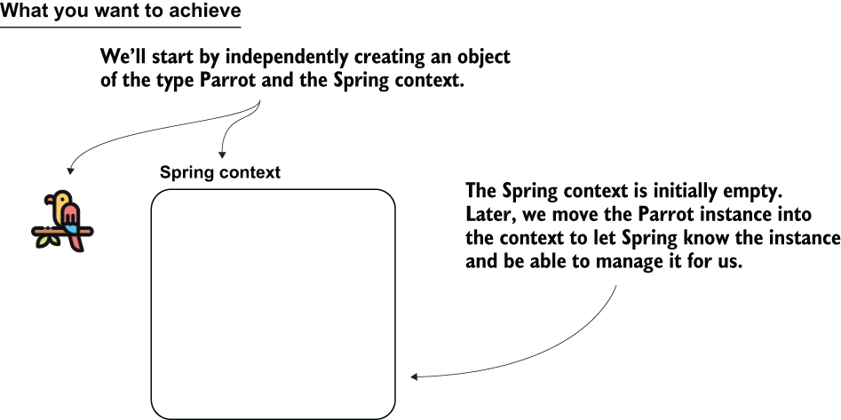

> **Hình 2.7** Để bắt đầu, chúng ta tạo một object instance và một Spring context rỗng.

Chúng ta tạo một project Maven và định nghĩa một class. Vì thật thú vị khi tưởng tượng, tôi sẽ dùng một class tên là `Parrot` (con vẹt) chỉ có một thuộc tính `String` đại diện cho tên của con vẹt (listing 2.3). Hãy nhớ, trong chương này chúng ta chỉ tập trung vào việc thêm bean vào Spring context, nên dùng bất kỳ đối tượng nào giúp bạn ghi nhớ cú pháp tốt hơn đều được. Bạn tìm thấy code của ví dụ này trong project "sq-ch2-ex1" (bạn có thể tải các project từ mục "Resources" của bản live book). Với project của bạn, bạn có thể dùng cùng tên hoặc chọn tên bạn thích.

**Listing 2.3** Class Parrot

```java
public class Parrot {

    private String name;

    // Omitted getters and setters
}
```

Giờ bạn có thể định nghĩa một class chứa method `main` và tạo một instance của class `Parrot`, như trình bày trong listing sau. Tôi thường đặt tên class này là `Main`.

**Listing 2.4** Tạo một instance của class Parrot

```java
public class Main {

    public static void main(String[] args) {
      Parrot p = new Parrot();
    }
}
```

Giờ là lúc thêm các dependency cần thiết vào project. Vì đang dùng Maven, tôi sẽ thêm các dependency vào file pom.xml, như trình bày trong listing sau.

**Listing 2.5** Thêm dependency cho Spring context

```xml
<project xmlns="http://maven.apache.org/POM/4.0.0"
    xmlns:xsi="http://www.w3.org/2001/XMLSchema-instance"
    xsi:schemaLocation="http://maven.apache.org/POM/4.0.0
    http://maven.apache.org/xsd/maven-4.0.0.xsd">

    <modelVersion>4.0.0</modelVersion>

    <groupId>org.example</groupId>
    <artifactId>sq-ch2-ex1</artifactId>
    <version>1.0-SNAPSHOT</version>

    <dependencies>
       <dependency>
            <groupId>org.springframework</groupId>
            <artifactId>spring-context</artifactId>
            <version>5.2.6.RELEASE</version>
       </dependency>
    </dependencies>

</project>
```

Một điều quan trọng cần quan sát là Spring được thiết kế theo hướng module hóa. Module hóa nghĩa là bạn không cần thêm toàn bộ Spring vào ứng dụng khi bạn dùng một thứ gì đó trong hệ sinh thái Spring. Bạn chỉ cần thêm những phần bạn dùng. Vì lý do này, trong listing 2.5, bạn thấy tôi chỉ thêm dependency spring-context, dependency này chỉ thị Maven kéo về những dependency cần thiết để chúng ta dùng Spring context. Xuyên suốt cuốn sách, chúng ta sẽ thêm nhiều dependency khác nhau vào project tùy theo những gì chúng ta triển khai, nhưng luôn chỉ thêm những gì cần thiết.

> **LƯU Ý** Bạn có thể thắc mắc làm sao tôi biết cần thêm dependency Maven nào. Sự thật là tôi đã dùng chúng nhiều lần đến mức thuộc lòng. Tuy nhiên, bạn không cần phải ghi nhớ chúng. Mỗi khi làm việc với một project Spring mới, bạn có thể tìm các dependency cần thêm trực tiếp trong tài liệu tham khảo của Spring (https://docs.spring.io/spring-framework/docs/current/spring-framework-reference/core.html). Nhìn chung, các dependency của Spring thuộc group ID `org.springframework`.

Với dependency đã được thêm vào project, chúng ta có thể tạo một instance của Spring context. Trong listing tiếp theo, bạn thấy cách tôi thay đổi method `main` để tạo instance của Spring context.

**Listing 2.6** Tạo instance của Spring context

```java
public class Main {

    public static void main(String[] args) {
      var context =
          new AnnotationConfigApplicationContext();                     ❶

        Parrot p = new Parrot();
    }
}
```

❶ Tạo một instance của Spring context

> **LƯU Ý** Chúng ta dùng class `AnnotationConfigApplicationContext` để tạo instance của Spring context. Spring cung cấp nhiều implementation. Vì trong hầu hết các trường hợp bạn sẽ dùng class `AnnotationConfigApplicationContext` (implementation dùng cách tiếp cận phổ biến nhất hiện nay: annotation), chúng ta sẽ tập trung vào class này trong sách. Ngoài ra, tôi chỉ nói với bạn những gì bạn cần biết cho phần thảo luận hiện tại. Nếu bạn mới bắt đầu với Spring, lời khuyên của tôi là tránh đi sâu vào chi tiết các implementation của context và chuỗi kế thừa của các class này. Rất có thể nếu làm vậy bạn sẽ lạc vào những chi tiết không quan trọng thay vì tập trung vào những điều cốt yếu.

Như trình bày trong hình 2.8, bạn đã tạo một instance của `Parrot`, thêm các dependency của Spring context vào project, và tạo một instance của Spring context. Mục tiêu của bạn là thêm đối tượng `Parrot` vào context, đó là bước tiếp theo.

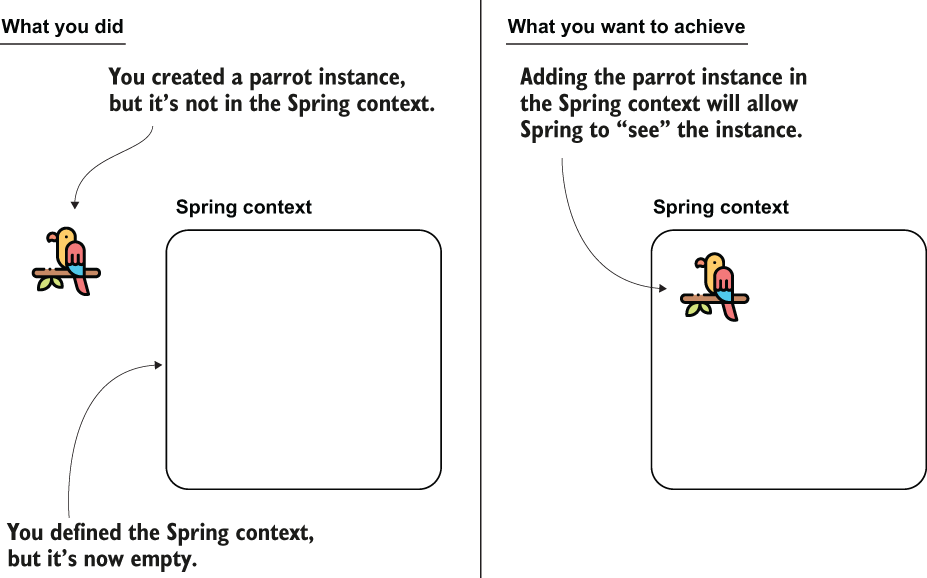

> **Hình 2.8** Bạn đã tạo instance của Spring context và một instance `Parrot`. Giờ bạn muốn thêm instance `Parrot` vào bên trong Spring context để Spring biết đến instance này.

Chúng ta vừa hoàn thành project tiền đề (khung sườn) mà chúng ta sẽ dùng trong các mục tiếp theo để hiểu cách thêm bean vào Spring context. Trong mục 2.2.1, chúng ta tiếp tục học cách thêm instance vào Spring context bằng annotation `@Bean`. Tiếp đó, trong các mục 2.2.2 và 2.2.3, bạn cũng sẽ học các cách thay thế để thêm instance bằng stereotype annotation và bằng cách lập trình. Sau khi bàn về cả ba cách, chúng ta sẽ so sánh chúng, và bạn sẽ biết hoàn cảnh nào phù hợp nhất để dùng mỗi cách.

### 2.2.1 Dùng annotation @Bean để thêm bean vào Spring context

Trong mục này, chúng ta sẽ bàn về việc thêm một object instance vào Spring context bằng annotation `@Bean`. Cách này cho phép bạn thêm instance của các class được định nghĩa trong project của bạn (như `Parrot` trong trường hợp của chúng ta), cũng như các class bạn không tự tạo nhưng có dùng trong ứng dụng. Tôi tin đây là cách dễ hiểu nhất khi mới bắt đầu. Hãy nhớ rằng lý do bạn học cách thêm bean vào Spring context là vì Spring chỉ có thể quản lý các đối tượng là một phần của context. Trước hết, tôi sẽ đưa ra một ví dụ đơn giản về cách thêm bean vào Spring context bằng annotation `@Bean`. Sau đó tôi sẽ chỉ cho bạn cách thêm nhiều bean cùng kiểu hoặc khác kiểu.

Các bước bạn cần làm để thêm một bean vào Spring context bằng annotation `@Bean` như sau (hình 2.9):

1. Định nghĩa một class cấu hình (được đánh dấu bằng `@Configuration`) cho project, mà như chúng ta sẽ bàn sau, được dùng để cấu hình context của Spring.
2. Thêm một method vào class cấu hình, method này trả về object instance bạn muốn thêm vào context, và đánh dấu method bằng annotation `@Bean`.
3. Làm cho Spring sử dụng class cấu hình đã định nghĩa ở bước 1. Như bạn sẽ học sau, chúng ta dùng các class cấu hình để viết các cấu hình khác nhau cho framework.

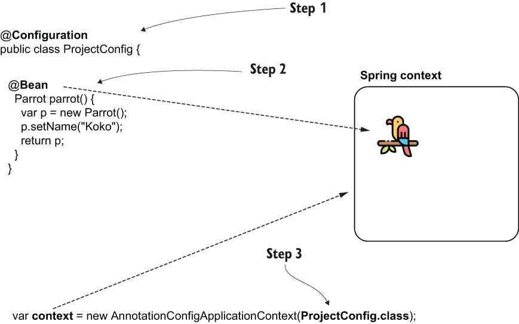

> **Hình 2.9** Các bước thêm bean vào context bằng annotation @Bean. Bằng cách thêm instance vào Spring context, bạn làm cho framework biết đến đối tượng đó, cho phép nó quản lý instance này.

Hãy làm theo các bước này và áp dụng trong project tên là "sq-c2-ex2". Để tách biệt tất cả các bước chúng ta bàn, tôi khuyên bạn tạo project mới cho mỗi ví dụ.

> **LƯU Ý** Hãy nhớ, bạn có thể tìm thấy các project của sách trong mục "Resources" của bản live book.

> **LƯU Ý** Class cấu hình là một class đặc biệt trong ứng dụng Spring mà chúng ta dùng để chỉ thị Spring thực hiện những hành động cụ thể. Ví dụ, chúng ta có thể bảo Spring tạo bean hoặc bật một số chức năng nhất định. Bạn sẽ học những điều khác nhau có thể định nghĩa trong class cấu hình xuyên suốt phần còn lại của cuốn sách.

**BƯỚC 1: ĐỊNH NGHĨA MỘT CLASS CẤU HÌNH TRONG PROJECT**

Bước đầu tiên là tạo một class cấu hình trong project. Một class cấu hình Spring có đặc điểm là được đánh dấu bằng annotation `@Configuration`. Chúng ta dùng các class cấu hình để định nghĩa nhiều cấu hình liên quan đến Spring cho project. Xuyên suốt cuốn sách, bạn sẽ học những thứ khác nhau có thể cấu hình bằng class cấu hình. Hiện tại chúng ta chỉ tập trung vào việc thêm instance mới vào Spring context. Listing tiếp theo cho bạn thấy cách định nghĩa class cấu hình. Tôi đặt tên class cấu hình này là `ProjectConfig`.

**Listing 2.7** Định nghĩa một class cấu hình cho project

```java
@Configuration                                ❶
public class ProjectConfig {
}
```

❶ Chúng ta dùng annotation `@Configuration` để định nghĩa class này là một class cấu hình Spring.

> **LƯU Ý** Tôi tách các class vào các package khác nhau để code dễ hiểu hơn. Ví dụ, tôi tạo các class cấu hình trong package tên là `config`, và class `Main` trong package tên là `main`. Tổ chức các class thành package là một thực hành tốt; tôi khuyên bạn cũng làm theo trong các triển khai thực tế.

**BƯỚC 2: TẠO MỘT METHOD TRẢ VỀ BEAN, VÀ ĐÁNH DẤU METHOD BẰNG @BEAN**

Một trong những việc bạn có thể làm với class cấu hình là thêm bean vào Spring context. Để làm điều này, chúng ta cần định nghĩa một method trả về object instance mà chúng ta muốn thêm vào context và đánh dấu method đó bằng annotation `@Bean`, annotation này cho Spring biết rằng nó cần gọi method này khi khởi tạo context và thêm giá trị trả về vào context. Listing tiếp theo cho thấy các thay đổi trong class cấu hình để thực hiện bước hiện tại.

> **LƯU Ý** Với các project trong sách này, tôi dùng Java 11: phiên bản Java được hỗ trợ dài hạn mới nhất. Ngày càng nhiều project chuyển sang phiên bản này. Nhìn chung, tính năng đặc thù duy nhất tôi dùng trong các đoạn code không hoạt động với phiên bản Java cũ hơn là tên kiểu dành riêng `var`. Tôi dùng `var` rải rác để code ngắn gọn và dễ đọc hơn, nhưng nếu bạn muốn dùng phiên bản Java cũ hơn (ví dụ Java 8), bạn có thể thay `var` bằng kiểu được suy ra. Bằng cách này, bạn sẽ làm cho các project hoạt động được với cả Java 8.

**Listing 2.8** Định nghĩa method @Bean

```java
@Configuration
public class ProjectConfig {

    @Bean                                 ❶
    Parrot parrot() {
        var p = new Parrot();
        p.setName("Koko");                ❷
        return p;                         ❸
    }
}
```

❶ Bằng cách thêm annotation `@Bean`, chúng ta chỉ thị Spring gọi method này khi khởi tạo context và thêm giá trị trả về vào context.

❷ Đặt tên cho con vẹt mà chúng ta sẽ dùng sau này khi test ứng dụng.

❸ Spring thêm instance `Parrot` do method trả về vào context của nó.

Hãy quan sát rằng tên tôi dùng cho method không chứa động từ. Có lẽ bạn đã học rằng một thực hành tốt trong Java là đặt động từ trong tên method vì method thường đại diện cho hành động. Nhưng với các method chúng ta dùng để thêm bean vào Spring context, chúng ta không theo quy ước này. Những method như vậy đại diện cho các object instance mà chúng trả về và giờ sẽ là một phần của Spring context. Tên của method cũng trở thành tên của bean (như trong listing 2.8, tên bean giờ là "parrot"). Theo quy ước, bạn có thể dùng danh từ, và thường thì chúng có cùng tên với class.

**BƯỚC 3: LÀM CHO SPRING KHỞI TẠO CONTEXT BẰNG CLASS CẤU HÌNH VỪA TẠO**

Chúng ta đã triển khai một class cấu hình, trong đó chúng ta nói cho Spring biết object instance nào cần trở thành bean. Giờ chúng ta cần đảm bảo Spring dùng class cấu hình này khi khởi tạo context. Listing tiếp theo cho bạn thấy cách thay đổi việc khởi tạo Spring context trong class main để dùng class cấu hình chúng ta đã triển khai ở hai bước đầu.

**Listing 2.9** Khởi tạo Spring context dựa trên class cấu hình đã định nghĩa

```java
public class Main {

    public static void main(String[] args) {
        var context =
          new AnnotationConfigApplicationContext(
                ProjectConfig.class);                            ❶
    }
}
```

❶ Khi tạo instance của Spring context, truyền class cấu hình làm tham số để chỉ thị Spring dùng nó.

Để xác nhận instance `Parrot` giờ thực sự là một phần của context, bạn có thể tham chiếu đến instance và in tên của nó ra console, như trình bày trong listing sau.

**Listing 2.10** Tham chiếu đến instance Parrot từ context

```java
public class Main {

    public static void main(String[] args) {
        var context =
          new AnnotationConfigApplicationContext(
            ProjectConfig.class);

        Parrot p = context.getBean(Parrot.class);                ❶

        System.out.println(p.getName());
    }
}
```

❶ Lấy tham chiếu đến một bean kiểu `Parrot` từ Spring context

Giờ bạn sẽ thấy trong console tên bạn đã đặt cho con vẹt được thêm vào context, trong trường hợp của tôi là Koko.

> **LƯU Ý** Trong thực tế, chúng ta dùng unit test và integration test để xác nhận các triển khai hoạt động như mong muốn. Các project trong sách này có triển khai unit test để xác nhận hành vi được thảo luận. Vì đây là sách "bắt đầu", có thể bạn chưa biết về unit test. Để tránh gây nhầm lẫn và cho phép bạn tập trung vào chủ đề đang bàn, chúng ta sẽ không bàn về unit test cho đến chương 15. Tuy nhiên, nếu bạn đã biết cách viết unit test và việc đọc chúng giúp bạn hiểu chủ đề tốt hơn, bạn có thể tìm thấy tất cả các unit test được triển khai trong thư mục test của mỗi project Maven. Nếu bạn chưa biết unit test hoạt động thế nào, tôi khuyên bạn chỉ tập trung vào chủ đề đang bàn.

Như trong ví dụ trước, bạn có thể thêm bất kỳ loại đối tượng nào vào Spring context (hình 2.10). Hãy thêm cả một `String` và một `Integer` và xem nó hoạt động.

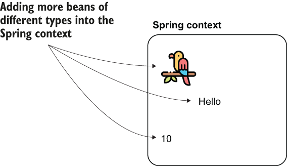

> **Hình 2.10** Bạn có thể thêm bất kỳ đối tượng nào vào Spring context để Spring biết đến nó.

Listing tiếp theo cho bạn thấy cách tôi thay đổi class cấu hình để thêm cả một bean kiểu `String` và một bean kiểu `Integer`.

**Listing 2.11** Thêm hai bean nữa vào context

```java
@Configuration
public class ProjectConfig {

    @Bean
    Parrot parrot() {
      var p = new Parrot();
        p.setName("Koko");
        return p;
    }

    @Bean                       ❶
    String hello() {
        return "Hello";
    }

    @Bean                       ❷
    Integer ten() {
      return 10;
    }
}
```

❶ Thêm chuỗi "Hello" vào Spring context

❷ Thêm số nguyên 10 vào Spring context

> **LƯU Ý** Hãy nhớ mục đích của Spring context: chúng ta thêm vào đó các instance mà chúng ta mong muốn Spring quản lý. (Bằng cách này, chúng ta cắm các chức năng do framework cung cấp vào.) Trong một ứng dụng thực tế, chúng ta sẽ không thêm mọi đối tượng vào Spring context. Bắt đầu từ chương 4, khi các ví dụ trở nên gần hơn với code trong một ứng dụng sẵn sàng cho production, chúng ta cũng sẽ tập trung hơn vào việc Spring cần quản lý những đối tượng nào. Hiện tại, hãy tập trung vào các cách bạn có thể dùng để thêm bean vào Spring context.

Giờ bạn có thể tham chiếu đến hai bean mới này theo cùng cách chúng ta đã làm với con vẹt. Listing tiếp theo cho bạn thấy cách thay đổi method `main` để in giá trị của các bean mới.

**Listing 2.12** In hai bean mới ra console

```java
public class Main {
     public static void main(String[] args) {
         var context = new AnnotationConfigApplicationContext(
                         ProjectConfig.class);

         Parrot p = context.getBean(Parrot.class);               ❶
         System.out.println(p.getName());

         String s = context.getBean(String.class);
         System.out.println(s);

         Integer n = context.getBean(Integer.class);
         System.out.println(n);
     }
}
```

❶ Bạn không cần ép kiểu tường minh. Spring tìm trong context một bean có kiểu bạn yêu cầu. Nếu bean như vậy không tồn tại, Spring sẽ ném ra một exception.

Chạy ứng dụng lúc này, giá trị của ba bean sẽ được in ra console, như trong đoạn code sau.

```text
Koko
Hello
10
```

Đến giờ chúng ta đã thêm một hoặc nhiều bean thuộc các kiểu khác nhau vào Spring context. Nhưng liệu chúng ta có thể thêm nhiều hơn một đối tượng cùng kiểu (hình 2.11)? Nếu có, làm sao chúng ta tham chiếu riêng đến từng đối tượng này? Hãy tạo một project mới, "sq-ch2-ex3", để minh họa cách bạn thêm nhiều bean cùng kiểu vào Spring context và cách bạn tham chiếu đến chúng sau đó.

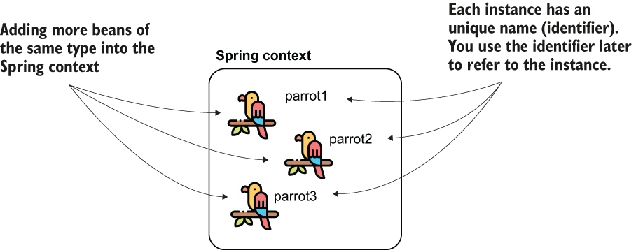

> **Hình 2.11** Bạn có thể thêm nhiều bean cùng kiểu vào Spring context bằng cách dùng nhiều method được đánh dấu `@Bean`. Mỗi instance sẽ có một định danh duy nhất. Để tham chiếu đến chúng sau đó, bạn sẽ cần dùng định danh của các bean.

> **LƯU Ý** Đừng nhầm lẫn tên của bean với tên của con vẹt. Trong ví dụ của chúng ta, tên (hay định danh) của các bean trong Spring context là `parrot1`, `parrot2` và `parrot3` (giống tên của các method `@Bean` định nghĩa chúng). Tên tôi đặt cho các con vẹt là Koko, Miki và Riki. Tên con vẹt chỉ là một thuộc tính của đối tượng `Parrot`, và nó không có ý nghĩa gì với Spring.

Bạn có thể khai báo bao nhiêu instance cùng kiểu tùy thích chỉ bằng cách khai báo thêm các method được đánh dấu bằng annotation `@Bean`. Listing sau cho bạn thấy cách tôi khai báo ba bean kiểu `Parrot` trong class cấu hình. Bạn tìm thấy ví dụ này trong project "sq-ch2-ex3".

**Listing 2.13** Thêm nhiều bean cùng kiểu vào Spring context

```java
@Configuration
public class ProjectConfig {

    @Bean
    Parrot parrot1() {
        var p = new Parrot();
        p.setName("Koko");
        return p;
    }

    @Bean
    Parrot parrot2() {
      var p = new Parrot();
        p.setName("Miki");
        return p;
    }

    @Bean
    Parrot parrot3() {
        var p = new Parrot();
        p.setName("Riki");
        return p;
    }
}
```

Dĩ nhiên, bạn không thể lấy bean từ context chỉ bằng cách chỉ định kiểu nữa. Nếu làm vậy, bạn sẽ nhận một exception vì Spring không thể đoán bạn đang tham chiếu đến instance nào trong số các instance bạn đã khai báo. Hãy xem listing sau. Chạy đoạn code như vậy sẽ ném ra một exception, trong đó Spring nói với bạn rằng bạn cần chỉ rõ instance nào bạn muốn dùng.

**Listing 2.14** Tham chiếu đến một instance Parrot theo kiểu

```java
public class Main {

    public static void main(String[] args) {
      var context = new
         AnnotationConfigApplicationContext(ProjectConfig.class);

        Parrot p = context.getBean(Parrot.class);              ❶

        System.out.println(p.getName());

    }
}
```

❶ Bạn sẽ nhận một exception ở dòng này vì Spring không thể đoán bạn đang tham chiếu đến instance nào trong ba instance `Parrot`.

Khi chạy ứng dụng, bạn sẽ nhận một exception tương tự như đoạn code sau.

```text
Exception in thread "main" org.springframework.beans.factory.NoUniqueBeanDefinition
        parrot1,parrot2,parrot3            ❶
        at ...
```

❶ Tên của các bean `Parrot` trong context

Để giải quyết vấn đề mơ hồ này, bạn cần tham chiếu chính xác đến một trong các instance bằng tên của bean. Mặc định, Spring dùng tên của các method được đánh dấu `@Bean` làm tên của chính các bean. Hãy nhớ đó là lý do chúng ta không đặt tên các method `@Bean` bằng động từ. Trong trường hợp của chúng ta, các bean có tên `parrot1`, `parrot2` và `parrot3` (hãy nhớ, method đại diện cho bean). Bạn có thể tìm thấy các tên này trong đoạn code trước, ở thông báo của exception. Bạn có nhận ra chúng không? Hãy thay đổi method `main` để tham chiếu tường minh đến một trong các bean này bằng tên của nó. Hãy quan sát cách tôi tham chiếu đến bean `parrot2` trong listing sau.

**Listing 2.15** Tham chiếu đến một bean bằng định danh của nó

```java
public class Main {

    public static void main(String[] args) {
        var context = new
         AnnotationConfigApplicationContext(ProjectConfig.class);

        Parrot p = context.getBean("parrot2", Parrot.class);               ❶
        System.out.println(p.getName());

    }
}
```

❶ Tham số đầu tiên là tên của instance mà chúng ta tham chiếu đến

Chạy ứng dụng lúc này, bạn sẽ không còn nhận exception nữa. Thay vào đó, bạn sẽ thấy trong console tên của con vẹt thứ hai, Miki.

Nếu bạn muốn đặt tên khác cho bean, bạn có thể dùng thuộc tính `name` hoặc `value` của annotation `@Bean`. Bất kỳ cú pháp nào sau đây đều sẽ đổi tên bean thành "miki":

```java
@Bean(name = "miki")
@Bean(value = "miki")
@Bean("miki")
```

Trong đoạn code tiếp theo, bạn có thể quan sát thay đổi khi nó xuất hiện trong code, và nếu bạn muốn chạy ví dụ này, bạn tìm thấy nó trong project tên là "sq-ch2-ex4":

```java
@Bean(name = "miki")            ❶
Parrot parrot2() {
  var p = new Parrot();
    p.setName("Miki");          ❷
    return p;
}
```

❶ Đặt tên cho bean

❷ Đặt tên cho con vẹt

### 2.2.2 Dùng stereotype annotation để thêm bean vào Spring context

Trong mục này, bạn sẽ học một cách tiếp cận khác để thêm bean vào Spring context (ở phần sau của chương này, chúng ta cũng sẽ so sánh các cách tiếp cận và bàn khi nào nên chọn cách này hay cách kia). Hãy nhớ, thêm bean vào Spring context là thiết yếu vì đó là cách bạn làm cho Spring biết đến các object instance của ứng dụng cần được framework quản lý. Spring cung cấp cho bạn thêm nhiều cách để thêm bean vào context. Trong các tình huống khác nhau, bạn sẽ thấy dùng một trong các cách này thoải mái hơn cách khác. Ví dụ, với stereotype annotation, bạn sẽ thấy mình viết ít code hơn để chỉ thị Spring thêm một bean vào context.

> **Định nghĩa một bean là primary**
>
> Ở phần trước của mục này, chúng ta đã bàn rằng bạn có thể có nhiều bean cùng loại trong Spring context, nhưng bạn cần tham chiếu đến chúng bằng tên. Có một lựa chọn khác khi tham chiếu đến các bean trong context khi bạn có nhiều bean cùng kiểu.
>
> Khi bạn có nhiều bean cùng loại trong Spring context, bạn có thể đặt một trong số chúng là primary. Bạn đánh dấu bean muốn là primary bằng annotation `@Primary`. Bean primary là bean mà Spring sẽ chọn nếu nó có nhiều lựa chọn và bạn không chỉ định tên; bean primary đơn giản là lựa chọn mặc định của Spring. Đoạn code tiếp theo cho bạn thấy method `@Bean` được đánh dấu primary trông như thế nào:
>
> ```java
> @Bean
> @Primary
> Parrot parrot2() {
>   var p = new Parrot();
>     p.setName("Miki");
>     return p;
> }
> ```
>
> Nếu bạn tham chiếu đến một `Parrot` mà không chỉ định tên, Spring giờ sẽ chọn Miki theo mặc định. Dĩ nhiên, bạn chỉ có thể định nghĩa một bean của mỗi kiểu là primary. Bạn tìm thấy ví dụ này được triển khai trong project "sq-ch2-ex5".

Sau này bạn sẽ học rằng Spring cung cấp nhiều stereotype annotation. Nhưng trong mục này, tôi muốn bạn tập trung vào cách dùng một stereotype annotation nói chung. Chúng ta sẽ lấy annotation cơ bản nhất trong số đó, `@Component`, và dùng nó để minh họa các ví dụ.

Với stereotype annotation, bạn thêm annotation phía trên class mà bạn cần có một instance của nó trong Spring context. Khi làm vậy, chúng ta nói rằng bạn đã đánh dấu class là một component. Khi ứng dụng tạo Spring context, Spring tạo một instance của class bạn đã đánh dấu là component và thêm instance đó vào context. Chúng ta vẫn sẽ có một class cấu hình khi dùng cách này để nói cho Spring biết nơi tìm các class được đánh dấu bằng stereotype annotation. Hơn nữa, bạn có thể dùng cả hai cách (dùng `@Bean` và stereotype annotation cùng nhau; chúng ta sẽ làm việc với những ví dụ phức tạp kiểu này trong các chương sau).

Các bước chúng ta cần thực hiện trong quy trình như sau (hình 2.12):

1. Dùng annotation `@Component`, đánh dấu các class mà bạn muốn Spring thêm một instance của chúng vào context (trong trường hợp của chúng ta là `Parrot`).
2. Dùng annotation `@ComponentScan` phía trên class cấu hình, chỉ thị Spring nơi tìm các class bạn đã đánh dấu.

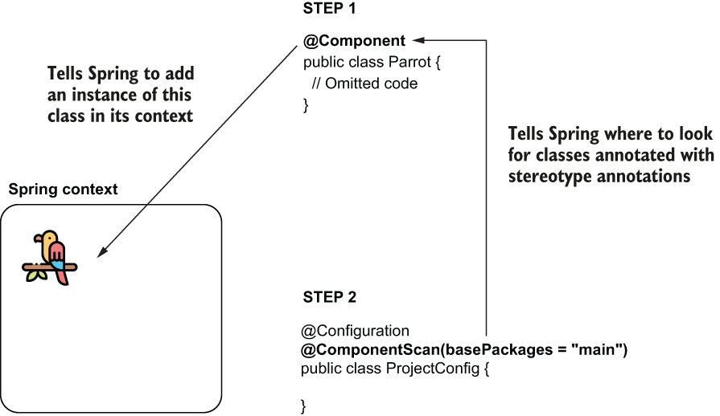

> **Hình 2.12** Khi dùng stereotype annotation, hãy xem xét hai bước. Thứ nhất, dùng stereotype annotation (@Component) để đánh dấu class mà bạn muốn Spring thêm một bean của nó vào context. Thứ hai, dùng annotation @ComponentScan để nói cho Spring biết nơi tìm các class được đánh dấu bằng stereotype annotation.

Hãy lấy ví dụ với class `Parrot` của chúng ta. Chúng ta có thể thêm một instance của class vào Spring context bằng cách đánh dấu class `Parrot` với một trong các stereotype annotation, chẳng hạn `@Component`.

Listing tiếp theo cho bạn thấy cách dùng annotation `@Component` cho class `Parrot`. Bạn có thể tìm thấy ví dụ này trong project "sq-ch2-ex6".

**Listing 2.16** Dùng stereotype annotation cho class Parrot

```java
@Component                        ❶
public class Parrot {

    private String name;

    public String getName() {
        return name;
    }

    public void setName(String name) {
      this.name = name;
    }
}
```

❶ Bằng cách dùng annotation `@Component` phía trên class, chúng ta chỉ thị Spring tạo một instance của class này và thêm nó vào context.

Nhưng khoan đã! Code này chưa hoạt động được. Mặc định, Spring không tìm kiếm các class được đánh dấu bằng stereotype annotation, nên nếu chúng ta để nguyên code như vậy, Spring sẽ không thêm bean kiểu `Parrot` vào context. Để nói cho Spring biết nó cần tìm các class được đánh dấu bằng stereotype annotation, chúng ta dùng annotation `@ComponentScan` phía trên class cấu hình. Ngoài ra, với annotation `@ComponentScan`, chúng ta nói cho Spring biết nơi tìm các class này. Chúng ta liệt kê các package nơi chúng ta định nghĩa các class có stereotype annotation. Listing tiếp theo cho bạn thấy cách dùng annotation `@ComponentScan` phía trên class cấu hình của project. Trong trường hợp của tôi, tên package là "main".

**Listing 2.17** Dùng annotation @ComponentScan để nói cho Spring biết nơi tìm kiếm

```java
@Configuration
@ComponentScan(basePackages = "main")                    ❶
public class ProjectConfig {

}
```

❶ Dùng thuộc tính `basePackages` của annotation, chúng ta nói cho Spring biết nơi tìm các class được đánh dấu bằng stereotype annotation.

Giờ bạn đã nói cho Spring biết những điều sau:

1. Thêm instance của class nào vào context (`Parrot`)
2. Tìm các class này ở đâu (dùng `@ComponentScan`)

> **LƯU Ý** Chúng ta không cần method để định nghĩa bean nữa. Và giờ có vẻ cách này tốt hơn vì bạn đạt được cùng kết quả mà viết ít code hơn. Nhưng hãy chờ đến cuối chương này. Bạn sẽ học rằng cả hai cách đều hữu ích, tùy vào tình huống.

Bạn có thể tiếp tục viết method `main` như trình bày trong listing sau để chứng minh rằng Spring tạo và thêm bean vào context.

**Listing 2.18** Định nghĩa method main để test cấu hình Spring

```java
public class Main {

    public static void main(String[] args) {
      var context = new
            AnnotationConfigApplicationContext(ProjectConfig.class);

            Parrot p = context.getBean(Parrot.class);

            System.out.println(p);                      ❶
            System.out.println(p.getName());            ❷
    }
}
```

❶ In ra biểu diễn `String` mặc định của instance lấy từ Spring context

❷ In ra `null` vì chúng ta không gán tên nào cho instance con vẹt mà Spring đã thêm vào context

Chạy ứng dụng này, bạn sẽ thấy Spring đã thêm một instance `Parrot` vào context vì giá trị đầu tiên được in ra là biểu diễn `String` mặc định của instance này. Tuy nhiên, giá trị thứ hai được in ra là `null` vì chúng ta không gán tên nào cho con vẹt này. Spring chỉ tạo instance của class, nhưng nếu chúng ta muốn thay đổi instance này theo bất kỳ cách nào sau đó (như gán tên cho nó), đó vẫn là trách nhiệm của chúng ta.

Giờ chúng ta đã đề cập đến hai cách thêm bean vào Spring context thường gặp nhất, hãy so sánh ngắn gọn chúng (bảng 2.1).

**Bảng 2.1** Ưu điểm và nhược điểm: So sánh hai cách thêm bean vào Spring context, cho bạn biết khi nào nên dùng cách nào

| Dùng annotation @Bean | Dùng stereotype annotation |
|---|---|
| 1. Bạn có toàn quyền kiểm soát việc tạo instance mà bạn thêm vào Spring context. Trách nhiệm của bạn là tạo và cấu hình instance trong thân method được đánh dấu `@Bean`. Spring chỉ lấy instance đó và thêm nguyên trạng vào context. | 1. Bạn chỉ có quyền kiểm soát instance sau khi framework đã tạo nó. |
| 2. Bạn có thể dùng cách này để thêm nhiều instance cùng kiểu vào Spring context. Hãy nhớ, trong mục 2.1.1 chúng ta đã thêm ba instance `Parrot` vào Spring context. | 2. Với cách này, bạn chỉ có thể thêm một instance của class vào context. |
| 3. Bạn có thể dùng annotation `@Bean` để thêm bất kỳ object instance nào vào Spring context. Class định nghĩa instance không cần được định nghĩa trong ứng dụng của bạn. Hãy nhớ, trước đó chúng ta đã thêm một `String` và một `Integer` vào Spring context. | 3. Bạn chỉ có thể dùng stereotype annotation để tạo bean của các class mà ứng dụng của bạn sở hữu. Ví dụ, bạn không thể thêm một bean kiểu `String` hay `Integer` như chúng ta đã làm trong mục 2.1.1 với annotation `@Bean`, vì bạn không sở hữu các class này để thay đổi chúng bằng cách thêm stereotype annotation. |
| 4. Bạn cần viết một method riêng cho mỗi bean bạn tạo, điều này thêm code rườm rà (boilerplate) vào ứng dụng. Vì lý do này, chúng ta ưu tiên dùng `@Bean` như lựa chọn thứ hai sau stereotype annotation trong các project. | 4. Dùng stereotype annotation để thêm bean vào Spring context không thêm code rườm rà vào ứng dụng. Nhìn chung bạn sẽ ưu tiên cách này cho các class thuộc về ứng dụng của bạn. |

Điều bạn sẽ nhận thấy là trong thực tế, bạn sẽ dùng stereotype annotation nhiều nhất có thể (vì cách này đồng nghĩa với viết ít code hơn), và bạn chỉ dùng `@Bean` khi không thể thêm bean bằng cách khác (ví dụ, bạn tạo bean cho một class thuộc một library nên bạn không thể sửa class đó để thêm stereotype annotation).

> **Dùng @PostConstruct để quản lý instance sau khi nó được tạo**
>
> Như chúng ta đã bàn trong mục này, dùng stereotype annotation bạn chỉ thị Spring tạo một bean và thêm nó vào context. Nhưng, không giống như dùng annotation `@Bean`, bạn không có toàn quyền kiểm soát việc tạo instance. Với `@Bean`, chúng ta có thể định nghĩa tên cho từng instance `Parrot` mà chúng ta thêm vào Spring context, nhưng với `@Component`, chúng ta không có cơ hội làm gì đó sau khi Spring gọi constructor của class `Parrot`. Điều gì xảy ra nếu chúng ta muốn thực thi một số lệnh ngay sau khi Spring tạo bean? Chúng ta có thể dùng annotation `@PostConstruct`. Spring mượn annotation `@PostConstruct` từ Java EE. Chúng ta cũng có thể dùng annotation này với các bean của Spring để chỉ định một tập lệnh mà Spring thực thi sau khi tạo bean. Bạn chỉ cần định nghĩa một method trong class component và đánh dấu method đó bằng `@PostConstruct`, điều này chỉ thị Spring gọi method đó sau khi constructor hoàn thành việc thực thi.
>
> Hãy thêm vào pom.xml dependency Maven cần thiết để dùng annotation `@PostConstruct`:
>
> ```xml
> <dependency>
>      <groupId>javax.annotation</groupId>
>      <artifactId>javax.annotation-api</artifactId>
>      <version>1.3.2</version>
> </dependency>
> ```
>
> Bạn không cần thêm dependency này nếu bạn dùng phiên bản Java nhỏ hơn Java 11. Trước Java 11, các dependency của Java EE là một phần của JDK. Với Java 11, JDK đã được dọn dẹp khỏi các API không liên quan đến SE, bao gồm cả các dependency của Java EE.
>
> Nếu bạn muốn dùng các chức năng từng là một phần của các API đã bị loại bỏ (như `@PostConstruct`), giờ bạn cần thêm dependency vào ứng dụng một cách tường minh.
>
> Giờ bạn có thể định nghĩa một method trong class `Parrot`, như trình bày trong đoạn code tiếp theo:
>
> ```java
> @Component
> public class Parrot {
>
>     private String name;
>
>     @PostConstruct
>     public void init() {
>         this.name = "Kiki";
>     }
>
>     // Omitted code
> }
> ```
>
> Bạn tìm thấy ví dụ này trong project "sq-ch2-ex7". Nếu giờ bạn in tên con vẹt ra console, bạn sẽ thấy ứng dụng in giá trị Kiki ra console.
>
> Rất tương tự, nhưng ít gặp hơn trong các ứng dụng thực tế, bạn có thể dùng một annotation tên là `@PreDestroy`. Với annotation này, bạn định nghĩa một method mà Spring gọi ngay trước khi đóng và dọn dẹp context. Annotation `@PreDestroy` cũng được mô tả trong JSR-250 và được Spring mượn lại. Nhưng nhìn chung tôi khuyên các lập trình viên tránh dùng nó và tìm một cách khác để thực thi điều gì đó trước khi Spring dọn dẹp context, chủ yếu vì bạn có thể gặp trường hợp Spring không dọn dẹp được context. Giả sử bạn định nghĩa một thứ nhạy cảm (như đóng kết nối database) trong method `@PreDestroy`; nếu Spring không gọi method đó, bạn có thể gặp rắc rối lớn.

### 2.2.3 Thêm bean vào Spring context theo cách lập trình

Trong mục này, chúng ta bàn về việc thêm bean vào Spring context theo cách lập trình. Chúng ta có tùy chọn thêm bean vào Spring context theo cách lập trình từ Spring 5, tùy chọn này mang lại sự linh hoạt lớn vì nó cho phép bạn thêm instance mới vào context trực tiếp bằng cách gọi một method của instance context. Bạn sẽ dùng cách này khi bạn muốn triển khai một cách tùy chỉnh để thêm bean vào context và `@Bean` hay stereotype annotation không đủ đáp ứng nhu cầu của bạn. Giả sử bạn cần đăng ký các bean cụ thể vào Spring context tùy theo cấu hình cụ thể của ứng dụng. Với `@Bean` và stereotype annotation, bạn có thể triển khai hầu hết các tình huống, nhưng bạn không thể làm điều gì đó như đoạn code trình bày trong snippet sau:

```java
if (condition) {
     registerBean(b1);          ❶

} else {

     registerBean(b2);          ❷

}
```

❶ Nếu điều kiện đúng, thêm một bean cụ thể vào Spring context.

❷ Ngược lại, thêm một bean khác vào Spring context.

Để tiếp tục dùng ví dụ về những con vẹt, tình huống như sau: Ứng dụng đọc một tập hợp các con vẹt. Một số con màu xanh lá; một số con khác màu cam. Bạn muốn ứng dụng chỉ thêm vào Spring context những con vẹt màu xanh lá (hình 2.13).

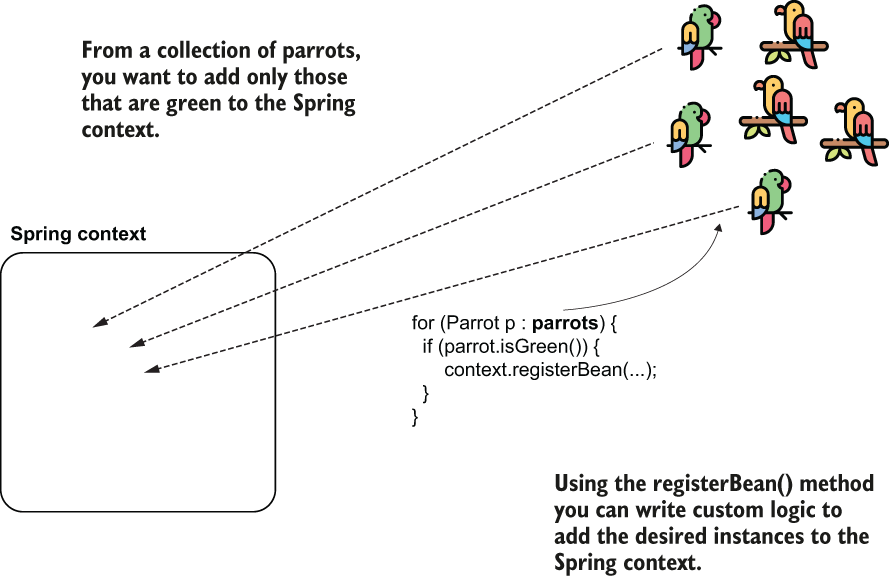

> **Hình 2.13** Dùng method registerBean() để thêm các object instance cụ thể vào Spring context

Hãy xem method này hoạt động thế nào. Để thêm một bean vào Spring context theo cách lập trình, bạn chỉ cần gọi method `registerBean()` của instance `ApplicationContext`. Method `registerBean()` có bốn tham số, như trình bày trong đoạn code tiếp theo:

```java
<T> void registerBean(
    String beanName,
    Class<T> beanClass,
    Supplier<T> supplier,
    BeanDefinitionCustomizer... customizers);
```

1. Dùng tham số đầu tiên `beanName` để định nghĩa tên cho bean bạn thêm vào Spring context. Nếu bạn không cần đặt tên cho bean đang thêm, bạn có thể dùng giá trị `null` khi gọi method.
2. Tham số thứ hai là class định nghĩa bean bạn thêm vào context. Giả sử bạn muốn thêm một instance của class `Parrot`; giá trị bạn truyền cho tham số này là `Parrot.class`.
3. Tham số thứ ba là một instance của `Supplier`. Implementation của `Supplier` này cần trả về giá trị của instance bạn thêm vào context. Hãy nhớ, `Supplier` là một functional interface bạn tìm thấy trong package `java.util.function`. Mục đích của một implementation supplier là trả về một giá trị bạn định nghĩa mà không nhận tham số.
4. Tham số thứ tư và cuối cùng là một varargs kiểu `BeanDefinitionCustomizer`. (Nếu điều này nghe không quen, không sao; `BeanDefinitionCustomizer` chỉ là một interface bạn triển khai để cấu hình các đặc tính khác nhau của bean; ví dụ, đặt nó là primary.) Vì được định nghĩa là kiểu varargs, bạn có thể bỏ hẳn tham số này, hoặc truyền cho nó nhiều giá trị kiểu `BeanDefinitionCustomizer`.

Trong project "sq-ch2-ex8", bạn tìm thấy một ví dụ về cách dùng method `registerBean()`. Bạn sẽ thấy class cấu hình của project này rỗng, và class `Parrot` mà chúng ta dùng cho ví dụ định nghĩa bean chỉ là một plain old Java object (POJO); chúng ta không dùng annotation nào với nó. Trong đoạn code tiếp theo, bạn thấy class cấu hình như tôi đã định nghĩa cho ví dụ này:

```java
@Configuration
public class ProjectConfig {
}
```

Tôi đã định nghĩa class `Parrot` mà chúng ta dùng để tạo bean:

```java
public class Parrot {

    private String name;

    // Omitted getters and setters
}
```

Trong method `main` của project, tôi đã dùng method `registerBean()` để thêm một instance kiểu `Parrot` vào Spring context. Listing tiếp theo trình bày code của method `main`. Hình 2.14 tập trung vào cú pháp gọi method `registerBean()`.

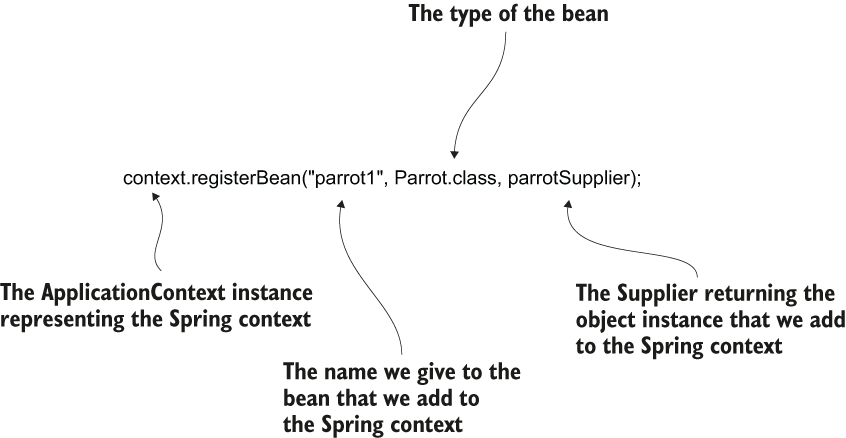

> **Hình 2.14** Gọi method registerBean() để thêm một bean vào Spring context theo cách lập trình

**Listing 2.19** Dùng method registerBean() để thêm một bean vào Spring context

```java
public class Main {

    public static void main(String[] args) {
        var context =
         new AnnotationConfigApplicationContext(
             ProjectConfig.class);

         Parrot x = new Parrot();                                 ❶
         x.setName("Kiki");

         Supplier<Parrot> parrotSupplier = () -> x;               ❷

         context.registerBean("parrot1",
            Parrot.class, parrotSupplier);                        ❸

         Parrot p = context.getBean(Parrot.class);                ❹
         System.out.println(p.getName());                         ❹
    }
}
```

❶ Chúng ta tạo instance muốn thêm vào Spring context.

❷ Chúng ta định nghĩa một `Supplier` để trả về instance này.

❸ Chúng ta gọi method `registerBean()` để thêm instance vào Spring context.

❹ Để xác nhận bean giờ đã ở trong context, chúng ta tham chiếu đến bean parrot và in tên của nó ra console.

Dùng một hoặc nhiều instance bean configurator làm các tham số cuối để đặt các đặc tính khác nhau cho các bean bạn thêm. Ví dụ, bạn có thể đặt bean là primary bằng cách thay đổi lời gọi method `registerBean()`, như trong đoạn code tiếp theo. Bean primary định nghĩa instance mà Spring chọn theo mặc định nếu bạn có nhiều bean cùng kiểu trong context:

```java
context.registerBean("parrot1",
                    Parrot.class,
                    parrotSupplier,
                    bc -> bc.setPrimary(true));
```

Bạn vừa thực hiện bước tiến lớn đầu tiên vào thế giới Spring. Học cách thêm bean vào Spring context có vẻ không nhiều, nhưng nó quan trọng hơn vẻ ngoài. Với kỹ năng này, giờ bạn có thể tiến tới việc tham chiếu đến các bean trong Spring context, điều chúng ta sẽ bàn trong chương 3.

> **LƯU Ý** Trong cuốn sách này, chúng ta chỉ dùng các cách cấu hình hiện đại. Tuy nhiên, tôi thấy điều thiết yếu là bạn cũng cần biết cách các lập trình viên cấu hình framework trong những ngày đầu của Spring. Khi đó, chúng ta dùng XML để viết các cấu hình này. Trong phụ lục B, một ví dụ ngắn được cung cấp để bạn có cảm nhận về cách bạn sẽ dùng XML để thêm một bean vào Spring context.

## Tóm tắt

- Điều đầu tiên bạn cần học trong Spring là thêm các object instance (mà chúng ta gọi là bean) vào Spring context. Bạn có thể hình dung Spring context như một cái xô, trong đó bạn thêm vào các instance mà bạn mong muốn Spring có thể quản lý. Spring chỉ có thể nhìn thấy các instance bạn thêm vào context của nó.
- Bạn có thể thêm bean vào Spring context theo ba cách: dùng annotation `@Bean`, dùng stereotype annotation, và theo cách lập trình.
  - Dùng annotation `@Bean` để thêm instance vào Spring context cho phép bạn thêm bất kỳ loại object instance nào làm bean và thậm chí nhiều instance cùng loại vào Spring context. Từ góc độ này, cách tiếp cận này linh hoạt hơn dùng stereotype annotation. Tuy nhiên, nó đòi hỏi bạn viết nhiều code hơn vì bạn cần viết một method riêng trong class cấu hình cho mỗi instance độc lập được thêm vào context.
  - Dùng stereotype annotation, bạn chỉ có thể tạo bean cho các class của ứng dụng có một annotation cụ thể (ví dụ `@Component`). Cách cấu hình này đòi hỏi viết ít code hơn, giúp cấu hình của bạn dễ đọc hơn. Bạn sẽ ưu tiên cách này hơn annotation `@Bean` cho các class do bạn định nghĩa và có thể đánh dấu annotation.
  - Dùng method `registerBean()` cho phép bạn triển khai logic tùy chỉnh để thêm bean vào Spring context. Hãy nhớ, bạn chỉ có thể dùng cách này với Spring 5 trở lên.
