# 3 Spring context: Wiring bean

**Chương này bao gồm**

- Thiết lập quan hệ giữa các bean
- Sử dụng dependency injection
- Truy cập các bean từ Spring context thông qua dependency injection

Trong chương 2, chúng ta đã bàn về Spring context: nơi trong bộ nhớ của ứng dụng mà chúng ta thêm vào các object instance muốn Spring quản lý. Vì Spring dùng nguyên lý IoC, như đã bàn ở chương 1, chúng ta cần nói cho Spring biết những đối tượng nào trong ứng dụng nó cần kiểm soát. Spring cần kiểm soát một số đối tượng của ứng dụng để bổ sung cho chúng các khả năng mà nó cung cấp. Trong chương 2, bạn đã học nhiều cách thêm object instance vào Spring context. Bạn cũng đã học rằng chúng ta thêm các instance (bean) này vào Spring context để Spring biết đến chúng.

Trong chương này, chúng ta bàn về cách truy cập các bean mà chúng ta đã thêm vào Spring context. Trong chương 2, chúng ta dùng trực tiếp method `getBean()` của instance context để truy cập các bean. Nhưng trong ứng dụng, chúng ta cần tham chiếu từ bean này sang bean khác một cách đơn giản, bằng cách bảo Spring cung cấp tham chiếu đến một instance từ context của nó tại nơi chúng ta cần. Bằng cách này, chúng ta thiết lập quan hệ giữa các bean (một bean sẽ có tham chiếu đến bean khác để ủy quyền các lời gọi khi cần). Như có lẽ bạn đã biết, trong bất kỳ ngôn ngữ lập trình hướng đối tượng nào, một đối tượng thường cần ủy quyền các trách nhiệm cụ thể cho các đối tượng khác khi triển khai hành vi của mình, nên bạn cũng cần biết cách thiết lập các quan hệ như vậy giữa các đối tượng khi dùng Spring làm framework.

Bạn sẽ học rằng có nhiều cách để truy cập các đối tượng bạn đã thêm vào Spring context, và chúng ta sẽ nghiên cứu từng cách với ví dụ, hình minh họa, và dĩ nhiên là các đoạn code. Cuối chương này, bạn sẽ có các kỹ năng cần thiết để dùng Spring context và cấu hình các bean cùng quan hệ giữa chúng. Kỹ năng này là nền tảng của việc dùng Spring; bạn sẽ không tìm thấy ứng dụng Spring nào mà không áp dụng các cách tiếp cận chúng ta bàn trong chương này. Vì lý do này, mọi thứ trong cuốn sách này (và mọi thứ bạn sẽ học từ bất kỳ cuốn sách, bài viết hay video hướng dẫn nào khác) đều dựa trên việc hiểu đúng các cách tiếp cận chúng ta bàn trong các chương 2 đến 5.

Trong chương 2, bạn đã học cách dùng annotation `@Bean` để thêm bean vào Spring context. Trong mục 3.1, chúng ta bắt đầu bằng việc triển khai quan hệ giữa hai bean mà bạn sẽ định nghĩa trong class cấu hình bằng annotation `@Bean`. Ở đây chúng ta bàn về hai cách bạn có thể thiết lập quan hệ giữa các bean:

- Liên kết các bean bằng cách gọi trực tiếp các method tạo ra chúng (mà chúng ta sẽ gọi là wiring).
- Cho phép Spring cung cấp cho chúng ta một giá trị thông qua tham số của method (mà chúng ta sẽ gọi là auto-wiring).

Sau đó, trong mục 3.2, chúng ta bàn về cách tiếp cận thứ ba, một kỹ thuật được hỗ trợ bởi nguyên lý IoC: dependency injection (DI). Chúng ta sẽ bàn cách dùng DI trong Spring, áp dụng annotation `@Autowired` để triển khai quan hệ giữa hai bean (đây cũng là một ví dụ của auto-wiring). Bạn sẽ dùng cả hai cách tiếp cận này cùng nhau trong các project thực tế.

> **LƯU Ý** Bạn có thể nghĩ rằng các ví dụ trong chương 2 và 3 chưa đủ gần với code production. Suy cho cùng, ứng dụng thực tế không quản lý vẹt và người! Nhưng tôi muốn khởi đầu nhẹ nhàng với các ví dụ đơn giản nhất và đảm bảo bạn tập trung vào các cú pháp thiết yếu này, những cú pháp bạn sẽ dùng trong hầu như mọi ứng dụng Spring. Bằng cách này, tôi đảm bảo bạn hiểu đúng cách các cách tiếp cận được bàn hoạt động và chỉ tập trung vào chúng. Bắt đầu từ chương 4, thiết kế class của chúng ta sẽ trở nên gần hơn với những gì bạn thấy trong các project thực tế.

## 3.1 Triển khai quan hệ giữa các bean được định nghĩa trong file cấu hình

Trong mục này, bạn sẽ học cách triển khai quan hệ giữa hai bean được định nghĩa trong class cấu hình bằng cách đánh dấu các method với annotation `@Bean`. Bạn sẽ thường gặp cách này để thiết lập quan hệ giữa các bean bằng cấu hình Spring. Trong chương 2, chúng ta đã bàn rằng chúng ta dùng annotation `@Bean` để thêm bean vào Spring context trong các trường hợp không thể thay đổi class mà chúng ta muốn thêm bean, ví dụ, nếu class là một phần của JDK hoặc một dependency khác. Và để thiết lập quan hệ giữa các bean này, bạn cần học các cách tiếp cận chúng ta bàn trong mục này. Chúng ta sẽ bàn cách các cách tiếp cận này hoạt động, tôi sẽ đưa ra các bước bạn cần để triển khai quan hệ giữa các bean, rồi chúng ta sẽ áp dụng các bước này với các project code nhỏ.

Giả sử chúng ta có hai instance trong Spring context: một con vẹt và một người. Chúng ta sẽ tạo và thêm các instance này vào context. Chúng ta muốn người sở hữu con vẹt. Nói cách khác, chúng ta cần liên kết hai instance. Ví dụ đơn giản này giúp chúng ta bàn về hai cách liên kết các bean trong Spring context mà không thêm sự phức tạp không cần thiết, và cho phép bạn chỉ tập trung vào cấu hình Spring.

Vậy, với mỗi cách trong hai cách (wiring và auto-wiring), chúng ta có hai bước (hình 3.1):

1. Thêm bean person và parrot vào Spring context (như bạn đã học ở chương 2).
2. Thiết lập quan hệ giữa person và parrot.

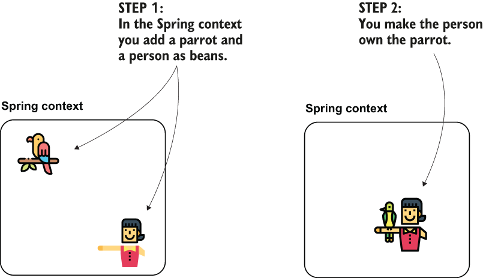

> **Hình 3.1** Có hai bean trong Spring context, chúng ta muốn thiết lập quan hệ giữa chúng. Chúng ta làm điều này để một đối tượng sau đó có thể ủy quyền cho đối tượng kia trong việc triển khai trách nhiệm của mình. Bạn có thể làm điều này bằng cách wiring, tức là gọi trực tiếp các method khai báo bean để thiết lập liên kết giữa chúng, hoặc thông qua auto-wiring. Bạn dùng khả năng dependency injection của framework.

Hình 3.2 trình bày quan hệ "has-A" giữa đối tượng person và parrot theo cách kỹ thuật hơn hình 3.1.

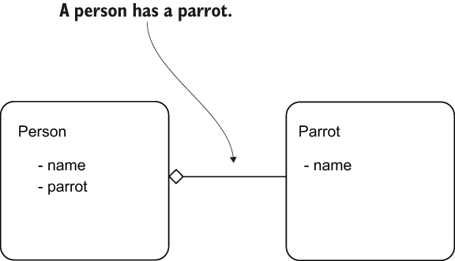

> **Hình 3.2** Triển khai quan hệ giữa các bean. Đây là sơ đồ đơn giản hóa biểu diễn quan hệ "has-A" giữa đối tượng Person và Parrot. Chúng ta sẽ triển khai quan hệ này thông qua wiring và auto-wiring.

Trước khi đi sâu vào bất kỳ cách nào, hãy bắt đầu với ví dụ đầu tiên của chương này ("sq-ch3-ex1") để nhớ lại cách thêm các bean vào Spring context bằng các method được đánh dấu `@Bean` trong class cấu hình, như chúng ta đã bàn trong mục 2.2.1 (bước 1). Chúng ta sẽ thêm một instance parrot và một instance person. Khi project này sẵn sàng, chúng ta thay đổi nó để thiết lập quan hệ giữa hai instance (bước 2). Trong mục 3.1.1, chúng ta triển khai wiring, và trong mục 3.1.2, chúng ta triển khai auto-wiring cho các method được đánh dấu `@Bean`. Trong file pom.xml của project Maven, chúng ta thêm dependency cho Spring context như trong đoạn code tiếp theo:

```xml
<dependency>
     <groupId>org.springframework</groupId>
     <artifactId>spring-context</artifactId>
   <version>5.2.7.RELEASE</version>
</dependency>
```

Sau đó chúng ta định nghĩa một class mô tả đối tượng `Parrot` và một class mô tả `Person`. Trong đoạn code tiếp theo, bạn thấy định nghĩa của class `Parrot`:

```java
public class Parrot {

    private String name;

    // Omitted getters and setters

    @Override
    public String toString() {
        return "Parrot : " + name;
    }
}
```

Trong đoạn code tiếp theo, bạn thấy định nghĩa của class `Person`:

```java
public class Person {

     private String name;
     private Parrot parrot;

     // Omitted getters and setters
}
```

Listing sau cho bạn thấy cách định nghĩa hai bean bằng annotation `@Bean` trong class cấu hình.

**Listing 3.1** Định nghĩa bean Person và Parrot

```java
@Configuration
public class ProjectConfig {

     @Bean
     public Parrot parrot() {
         Parrot p = new Parrot();
         p.setName("Koko");
         return p;
     }

     @Bean
     public Person person() {
         Person p = new Person();
         p.setName("Ella");
         return p;
     }
}
```

Giờ bạn có thể viết một class `Main`, như trình bày trong listing sau, và kiểm tra rằng hai instance chưa được liên kết với nhau.

**Listing 3.2** Định nghĩa class Main

```java
public class Main {

     public static void main(String[] args) {
       var context = new AnnotationConfigApplicationContext
          (ProjectConfig.class);                               ❶

         Person person =
          context.getBean(Person.class);                       ❷

         Parrot parrot =
          context.getBean(Parrot.class);                       ❸

         System.out.println(
           "Person's name: " + person.getName());              ❹

         System.out.println(
           "Parrot's name: " + parrot.getName());              ❺

         System.out.println(
           "Person's parrot: " + person.getParrot());          ❻
     }}
```

❶ Tạo một instance của Spring context dựa trên class cấu hình

❷ Lấy tham chiếu đến bean `Person` từ Spring context

❸ Lấy tham chiếu đến bean `Parrot` từ Spring context

❹ In tên của person để chứng minh bean `Person` có trong context

❺ In tên của parrot để chứng minh bean `Parrot` có trong context

❻ In con vẹt của person để chứng minh chưa có quan hệ giữa các instance

Khi chạy ứng dụng này, bạn sẽ thấy đầu ra console tương tự như trong đoạn code tiếp theo:

```text
Person's name: Ella             ❶
Parrot's name: Koko             ❷
Person's parrot: null           ❸
```

❶ Bean `Person` có trong Spring context.

❷ Bean `Parrot` có trong Spring context.

❸ Quan hệ giữa person và parrot chưa được thiết lập.

Điều quan trọng nhất cần quan sát ở đây là con vẹt của person (dòng đầu ra thứ ba) là `null`. Tuy nhiên cả instance person và parrot đều có trong context. Đầu ra này là `null`, nghĩa là chưa có quan hệ giữa các instance (hình 3.3).

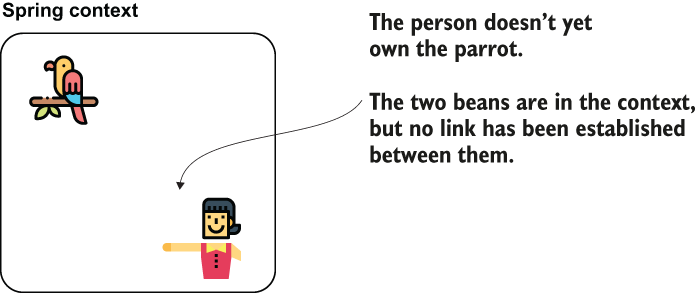

> **Hình 3.3** Chúng ta đã thêm hai bean vào context để tiếp tục cấu hình quan hệ giữa chúng.

### 3.1.1 Wiring các bean bằng cách gọi trực tiếp method giữa các method @Bean

Trong mục này, chúng ta thiết lập quan hệ giữa hai instance `Person` và `Parrot`. Cách đầu tiên (wiring) để đạt được điều này là gọi một method từ method khác trong class cấu hình. Bạn sẽ thấy cách này được dùng thường xuyên vì nó đơn giản. Trong listing tiếp theo, bạn thấy thay đổi nhỏ tôi phải làm trong class cấu hình để thiết lập liên kết giữa person và parrot (xem hình 3.4). Để giữ tất cả các bước tách biệt và giúp bạn hiểu code dễ hơn, tôi cũng đã tách thay đổi này vào project thứ hai: "sq-ch3-ex2".

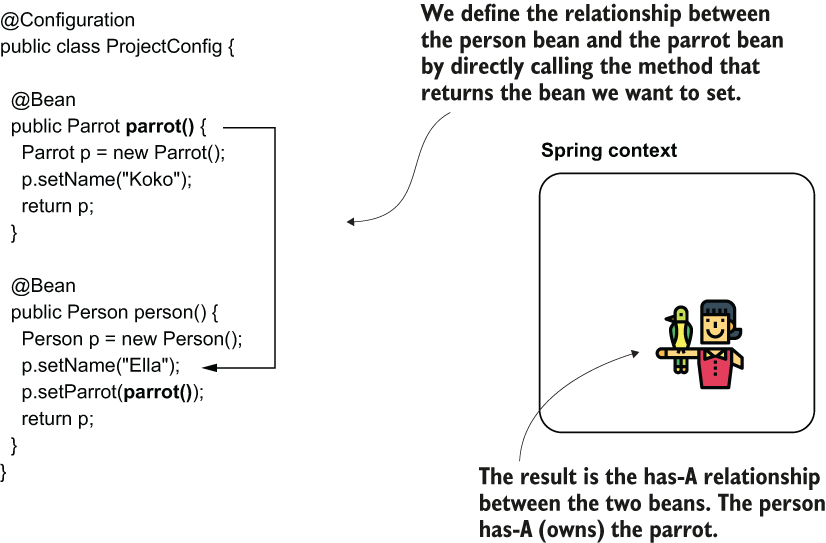

> **Hình 3.4** Chúng ta thiết lập quan hệ giữa các bean bằng wiring trực tiếp. Cách này ngụ ý gọi trực tiếp method trả về bean mà bạn muốn đặt. Bạn cần gọi method này từ method định nghĩa bean mà bạn đặt dependency cho nó.

**Listing 3.3** Tạo liên kết giữa các bean bằng lời gọi method trực tiếp

```java
@Configuration
public class ProjectConfig {

    @Bean
    public Parrot parrot() {
      Parrot p = new Parrot();
      p.setName("Koko");
        return p;
    }

    @Bean
    public Person person() {
      Person p = new Person();
        p.setName("Ella");
        p.setParrot(parrot());          ❶
        return p;
    }
}
```

❶ Đặt tham chiếu của bean parrot vào thuộc tính parrot của person

Chạy lại cùng ứng dụng, bạn sẽ thấy đầu ra trong console đã thay đổi. Giờ bạn thấy (xem đoạn tiếp theo) dòng thứ hai cho biết Ella (người trong Spring context) sở hữu Koko (con vẹt trong Spring context):

```text
Person's name: Ella
Person's parrot: Parrot : Koko              ❶
```

❶ Giờ chúng ta thấy quan hệ giữa person và parrot đã được thiết lập.

Mỗi khi tôi dạy cách này trong lớp, tôi biết một số người có câu hỏi: điều này chẳng phải nghĩa là chúng ta tạo hai instance của `Parrot` (hình 3.5), một instance Spring tạo và thêm vào context và một instance khác khi method `person()` gọi trực tiếp method `parrot()`? Không, thực tế chúng ta chỉ có một instance parrot trong toàn bộ ứng dụng này.

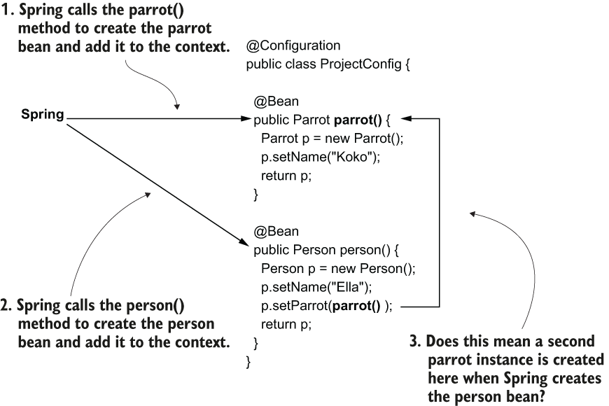

> **Hình 3.5** Spring tạo một instance parrot khi nó gọi method đầu tiên được đánh dấu @Bean là parrot(). Sau đó, Spring tạo một instance person khi gọi method thứ hai được đánh dấu @Bean là person(). Method thứ hai, person(), gọi trực tiếp method đầu tiên, parrot(). Điều này có nghĩa là hai instance kiểu parrot được tạo?

Thoạt nhìn có vẻ lạ, nhưng Spring đủ thông minh để hiểu rằng bằng cách gọi method `parrot()`, bạn muốn tham chiếu đến bean parrot trong context của nó. Khi chúng ta dùng annotation `@Bean` để định nghĩa bean vào Spring context, Spring kiểm soát cách các method được gọi và có thể áp dụng logic phía trên lời gọi method (bạn sẽ học thêm về cách Spring chặn các method trong chương 6). Hiện tại, hãy nhớ rằng khi method `person()` gọi method `parrot()`, Spring sẽ áp dụng logic như mô tả tiếp theo.

Nếu bean parrot đã tồn tại trong context, thì thay vì gọi method `parrot()`, Spring sẽ lấy trực tiếp instance từ context của nó. Nếu bean parrot chưa tồn tại trong context, Spring gọi method `parrot()` và trả về bean (hình 3.6).

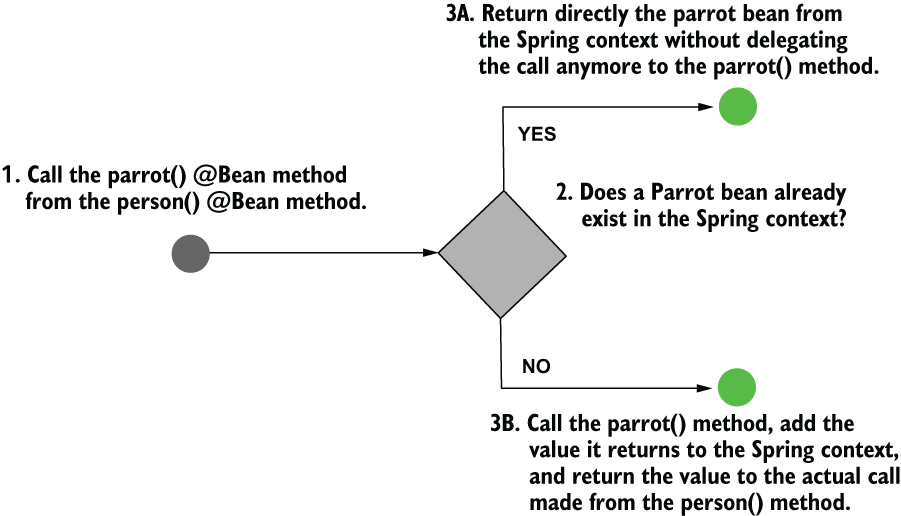

> **Hình 3.6** Khi hai method được đánh dấu @Bean gọi lẫn nhau, Spring biết bạn muốn tạo liên kết giữa các bean. Nếu bean đã tồn tại trong context (3A), Spring trả về bean hiện có mà không chuyển tiếp lời gọi đến method @Bean. Nếu bean chưa tồn tại (3B), Spring tạo bean và trả về tham chiếu của nó.

Thực ra khá dễ để kiểm chứng hành vi này. Chỉ cần thêm một constructor không tham số vào class `Parrot` và in một thông báo ra console từ đó. Thông báo sẽ được in ra console bao nhiêu lần? Nếu hành vi đúng, bạn sẽ chỉ thấy thông báo một lần. Hãy làm thí nghiệm này. Trong đoạn code tiếp theo, tôi đã thay đổi class `Parrot` để thêm constructor không tham số:

```java
public class Parrot {

    private String name;

    public Parrot() {
        System.out.println("Parrot created");
    }

    // Omitted getters and setters

    @Override
    public String toString() {
        return "Parrot : " + name;
    }
}
```

Chạy lại ứng dụng. Đầu ra đã thay đổi (xem đoạn code tiếp theo), và giờ thông báo "Parrot created" cũng xuất hiện. Bạn sẽ thấy nó chỉ xuất hiện một lần, điều này chứng minh rằng Spring quản lý việc tạo bean và chỉ gọi method `parrot()` một lần:

```text
Parrot created
Person's name: Ella
Person's parrot: Parrot : Koko
```

### 3.1.2 Wiring các bean bằng tham số của method được đánh dấu @Bean

Trong mục này, tôi sẽ chỉ cho bạn một cách thay thế cho việc gọi trực tiếp method `@Bean`. Thay vì gọi trực tiếp method định nghĩa bean mà chúng ta muốn tham chiếu, chúng ta thêm một tham số vào method với kiểu đối tượng tương ứng, và chúng ta dựa vào Spring để cung cấp giá trị thông qua tham số đó (hình 3.7). Cách này linh hoạt hơn một chút so với cách chúng ta bàn trong mục 3.1.1. Với cách này, không quan trọng bean chúng ta muốn tham chiếu được định nghĩa bằng method được đánh dấu `@Bean` hay bằng stereotype annotation như `@Component` (đã bàn ở chương 2). Tuy nhiên, theo kinh nghiệm của tôi, không hẳn sự linh hoạt này khiến các lập trình viên dùng cách này; chủ yếu là sở thích của mỗi lập trình viên quyết định họ dùng cách nào khi làm việc với bean. Tôi sẽ không nói cách nào tốt hơn cách nào, nhưng bạn sẽ gặp cả hai cách trong thực tế, nên bạn cần hiểu và có thể dùng chúng.

Để minh họa cách này, trong đó chúng ta dùng tham số thay vì gọi trực tiếp method `@Bean`, chúng ta sẽ lấy code đã phát triển trong project "sq-ch3-ex2" và thay đổi nó để thiết lập liên kết giữa hai instance trong context. Tôi sẽ tách ví dụ mới vào project tên là "sq-ch3-ex3".

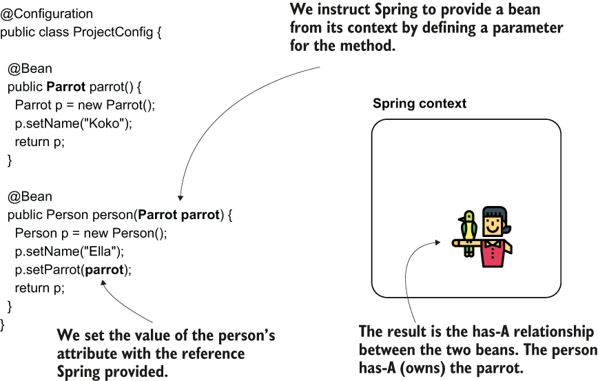

> **Hình 3.7** Bằng cách định nghĩa một tham số cho method, chúng ta chỉ thị Spring cung cấp cho chúng ta một bean có kiểu của tham số đó từ context của nó. Sau đó chúng ta có thể dùng bean được cung cấp (parrot) khi tạo bean thứ hai (person). Bằng cách này chúng ta thiết lập quan hệ has-A giữa hai bean.

Trong listing tiếp theo, bạn thấy định nghĩa của class cấu hình. Hãy nhìn vào method `person()`. Giờ nó nhận một tham số kiểu `Parrot`, và tôi đặt tham chiếu của tham số đó vào thuộc tính của person được trả về. Khi gọi method, Spring biết nó phải tìm một bean parrot trong context và inject giá trị của nó vào tham số của method `person()`.

**Listing 3.4** Inject các dependency của bean bằng cách dùng tham số của method

```java
@Configuration
public class ProjectConfig {

    @Bean
    public Parrot parrot() {
      Parrot p = new Parrot();
      p.setName("Koko");
        return p;
    }

    @Bean
    public Person person(Parrot parrot) {                  ❶
      Person p = new Person();
      p.setName("Ella");
        p.setParrot(parrot);
        return p;
    }
}
```

❶ Spring inject bean parrot vào tham số này.

Trong đoạn trước, tôi dùng từ "inject". Ở đây tôi muốn nói đến thứ mà từ giờ chúng ta sẽ gọi là dependency injection (DI). Như tên gọi gợi ý, DI là một kỹ thuật trong đó framework đặt một giá trị vào một field hoặc tham số cụ thể. Trong trường hợp của chúng ta, Spring đặt một giá trị cụ thể vào tham số của method `person()` khi gọi nó và giải quyết một dependency của method này. DI là một ứng dụng của nguyên lý IoC, và IoC ngụ ý rằng framework kiểm soát ứng dụng khi thực thi. Tôi lặp lại hình 3.8, mà bạn cũng đã thấy ở chương 1 (hình 1.4), ở đây để ôn lại cho thảo luận của chúng ta về IoC.

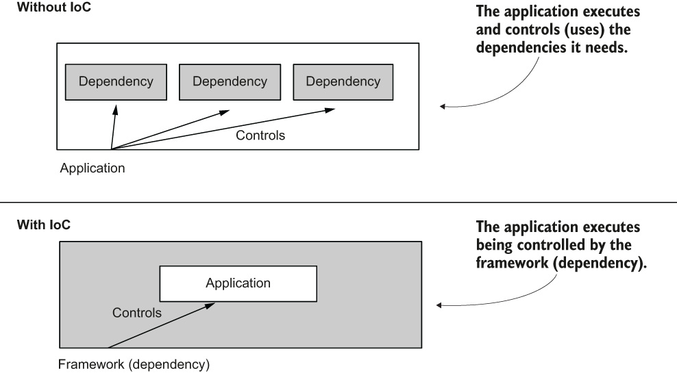

> **Hình 3.8** Một ứng dụng không dùng nguyên lý IoC kiểm soát việc thực thi và sử dụng nhiều dependency khác nhau. Một ứng dụng dùng nguyên lý IoC cho phép một dependency kiểm soát việc thực thi của nó. DI là một ví dụ của sự kiểm soát như vậy. Framework (một dependency) đặt một giá trị vào một field của một đối tượng trong ứng dụng.

Bạn sẽ thường dùng DI (và không chỉ trong Spring) vì đó là cách rất thoải mái để quản lý các object instance được tạo và giúp chúng ta giảm thiểu code phải viết khi phát triển ứng dụng.

Khi chạy ứng dụng, đầu ra trong console của bạn sẽ tương tự đoạn code tiếp theo. Bạn thấy con vẹt Koko thực sự được liên kết với người Ella:

```text
Parrot created
Person's name: Ella
Person's parrot: Parrot : Koko
```

## 3.2 Sử dụng annotation @Autowired để inject bean

Trong mục này, chúng ta bàn về một cách tiếp cận khác được dùng để tạo liên kết giữa các bean trong Spring context. Bạn sẽ thường gặp kỹ thuật này, liên quan đến một annotation tên là `@Autowired`, khi bạn có thể thay đổi class mà bạn định nghĩa bean cho nó (khi class này không thuộc một dependency). Dùng annotation `@Autowired`, chúng ta đánh dấu thuộc tính của đối tượng nơi chúng ta muốn Spring inject một giá trị từ context, và chúng ta đánh dấu ý định này trực tiếp trong class định nghĩa đối tượng cần dependency. Cách này giúp dễ thấy quan hệ giữa hai đối tượng hơn các cách thay thế chúng ta đã bàn trong mục 3.1. Như bạn sẽ thấy, có ba cách chúng ta có thể dùng annotation `@Autowired`:

- Inject giá trị vào field của class, cách bạn thường thấy trong các ví dụ và proof of concept
- Inject giá trị thông qua các tham số constructor của class, cách bạn sẽ dùng nhiều nhất trong thực tế
- Inject giá trị thông qua setter, cách bạn sẽ hiếm khi dùng trong code sẵn sàng cho production

Hãy bàn chi tiết hơn về các cách này và viết một ví dụ cho mỗi cách.

### 3.2.1 Dùng @Autowired để inject giá trị qua field của class

Trong mục này, chúng ta bắt đầu bằng việc bàn về cách đơn giản nhất trong ba khả năng dùng `@Autowired`, cũng là cách các lập trình viên thường dùng trong ví dụ: dùng annotation phía trên field (hình 3.9). Như bạn sẽ học, dù cách này rất đơn giản, nó có những "tội lỗi" riêng, đó là lý do chúng ta tránh dùng nó khi viết code production. Tuy nhiên, bạn sẽ thấy nó thường được dùng trong ví dụ, proof of concept, và khi viết test, như chúng ta sẽ bàn trong chương 15, nên bạn cần biết cách dùng cách này.

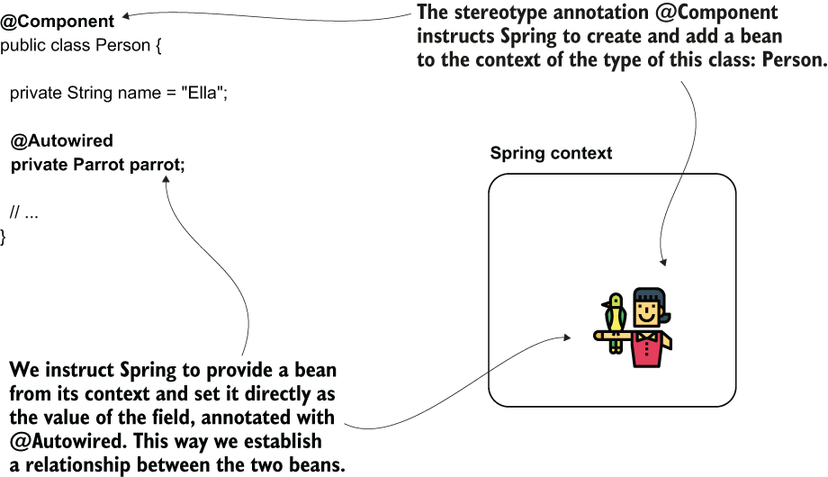

> **Hình 3.9** Dùng annotation @Autowired phía trên field, chúng ta chỉ thị Spring cung cấp một giá trị cho field đó từ context của nó. Spring tạo hai bean, person và parrot, và inject đối tượng parrot vào field của bean kiểu Person.

Hãy phát triển một project ("sq-ch3-ex4"), trong đó chúng ta đánh dấu field parrot của class `Person` bằng annotation `@Autowired` để nói cho Spring biết chúng ta muốn inject một giá trị vào đó từ context của nó. Hãy bắt đầu với các class định nghĩa hai đối tượng: `Person` và `Parrot`. Bạn thấy định nghĩa của class `Parrot` trong đoạn code tiếp theo:

```java
@Component
public class Parrot {

    private String name = "Koko";

    // Omitted getters and setters

    @Override
    public String toString() {
      return "Parrot : " + name;
    }
}
```

Chúng ta dùng stereotype annotation `@Component` ở đây, mà bạn đã học ở chương 2 (mục 2.2.2). Chúng ta dùng stereotype annotation như một cách thay thế cho việc tạo bean bằng class cấu hình. Khi đánh dấu một class bằng `@Component`, Spring biết nó phải tạo một instance của class đó và thêm vào context. Đoạn code tiếp theo cho thấy định nghĩa của class `Person`:

```java
@Component
public class Person {

    private String name = "Ella";

    @Autowired                           ❶
    private Parrot parrot;

    // Omitted getters and setters
}
```

❶ Đánh dấu field bằng `@Autowired`, chúng ta chỉ thị Spring inject một giá trị phù hợp từ context của nó.

> **LƯU Ý** Tôi đã dùng stereotype annotation để thêm các bean vào Spring context cho ví dụ này. Tôi có thể định nghĩa các bean bằng `@Bean`, nhưng thường thì trong thực tế, bạn sẽ gặp `@Autowired` được dùng cùng với stereotype annotation, nên hãy tập trung vào cách hữu ích nhất cho bạn.

Để tiếp tục ví dụ, chúng ta định nghĩa một class cấu hình. Tôi sẽ đặt tên class cấu hình là `ProjectConfig`. Phía trên class này, tôi sẽ dùng annotation `@ComponentScan` để nói cho Spring biết nơi tìm các class tôi đã đánh dấu `@Component`, như bạn đã học ở chương 2 (mục 2.2.2). Đoạn code tiếp theo cho thấy định nghĩa của class cấu hình:

```java
@Configuration
@ComponentScan(basePackages = "beans")
public class ProjectConfig {

}
```

Sau đó tôi sẽ dùng class main, theo cùng cách tôi đã dùng trong các ví dụ trước của chương này, để chứng minh Spring đã inject đúng tham chiếu của bean parrot:

```java
public class Main {

      public static void main(String[] args) {
          var context = new AnnotationConfigApplicationContext
                                (ProjectConfig.class);

          Person p = context.getBean(Person.class);

          System.out.println("Person's name: " + p.getName());
          System.out.println("Person's parrot: " + p.getParrot());
      }
}
```

Điều này sẽ in ra console của ứng dụng thứ gì đó tương tự đầu ra trình bày tiếp theo. Dòng thứ hai của đầu ra chứng minh rằng con vẹt (trong trường hợp của tôi, tên Koko) thuộc về bean person (tên Ella):

```text
Person's name: Ella
Person's parrot: Parrot : Koko
```

Tại sao cách này không được mong muốn trong code production? Dùng nó không hoàn toàn sai, nhưng bạn muốn đảm bảo ứng dụng của mình dễ bảo trì và dễ kiểm thử trong code production. Bằng cách inject giá trị trực tiếp vào field:

- bạn không có tùy chọn đặt field là `final` (xem đoạn code tiếp theo), và bằng cách này, đảm bảo không ai có thể thay đổi giá trị của nó sau khi khởi tạo:

```java
@Component
public class Person {

      private String name = "Ella";

      @Autowired
         private final Parrot parrot;              ❶

     }
```

❶ Đoạn này không biên dịch được. Bạn không thể định nghĩa một field `final` mà không có giá trị khởi tạo.

- việc tự quản lý giá trị khi khởi tạo trở nên khó khăn hơn.

Như bạn sẽ học ở chương 15, đôi khi bạn cần tạo các instance của đối tượng và dễ dàng quản lý các dependency của unit test.

### 3.2.2 Dùng @Autowired để inject giá trị qua constructor

Lựa chọn thứ hai bạn có để inject giá trị vào các thuộc tính của đối tượng khi Spring tạo bean là dùng constructor của class định nghĩa instance (hình 3.10). Cách này được dùng nhiều nhất trong code production và là cách tôi khuyến nghị. Nó cho phép bạn định nghĩa các field là `final`, đảm bảo không ai có thể thay đổi giá trị của chúng sau khi Spring khởi tạo. Khả năng đặt giá trị khi gọi constructor cũng giúp bạn khi viết các unit test cụ thể mà bạn không muốn dựa vào Spring để inject field cho bạn (nhưng sẽ nói thêm về chủ đề này sau).

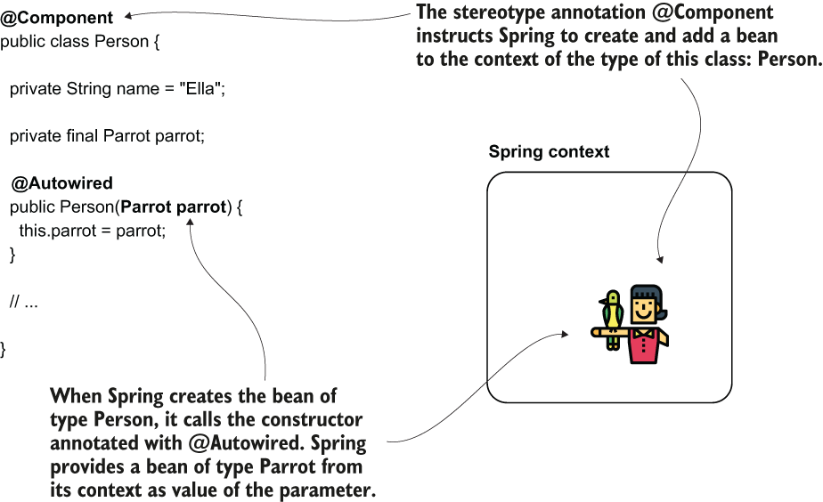

> **Hình 3.10** Khi bạn định nghĩa một tham số của constructor, Spring cung cấp một bean từ context của nó làm giá trị cho tham số đó khi gọi constructor.

Chúng ta có thể nhanh chóng thay đổi phần triển khai của project trong mục 3.2.1 để dùng inject qua constructor thay vì inject qua field. Bạn chỉ cần thay đổi class `Person`, như trình bày trong listing sau. Bạn cần định nghĩa một constructor cho class và đánh dấu nó bằng `@Autowired`. Giờ chúng ta cũng có thể đặt field parrot là `final`. Bạn không cần thay đổi gì trong class cấu hình.

**Listing 3.5** Inject giá trị qua constructor

```java
@Component
public class Person {

    private String name = "Ella";

    private final Parrot parrot;             ❶

    @Autowired                               ❷
    public Person(Parrot parrot) {
      this.parrot = parrot;
    }
    // Omitted getters and setters

}
```

❶ Giờ chúng ta có thể đặt field là `final` để đảm bảo giá trị của nó không thể bị thay đổi sau khi khởi tạo.

❷ Chúng ta dùng annotation `@Autowired` phía trên constructor.

Để giữ tất cả các bước và thay đổi, tôi đã tách ví dụ này vào project "sq-ch3-ex5". Bạn có thể khởi động ứng dụng ngay và thấy nó hiển thị cùng kết quả như trong ví dụ ở mục 3.2.1. Như bạn thấy trong đoạn code tiếp theo, person sở hữu parrot, nên Spring đã thiết lập đúng liên kết giữa hai instance:

```text
Person's name: Ella
Person's parrot: Parrot : Koko
```

> **LƯU Ý** Bắt đầu từ Spring phiên bản 4.3, khi bạn chỉ có một constructor trong class, bạn có thể bỏ qua việc viết annotation `@Autowired`.

### 3.2.3 Dùng dependency injection qua setter

Bạn sẽ không thường thấy các lập trình viên áp dụng cách dùng setter cho dependency injection. Cách này có nhiều nhược điểm hơn ưu điểm: khó đọc hơn, không cho phép bạn đặt field là `final`, và không giúp bạn kiểm thử dễ hơn. Dù vậy, tôi muốn đề cập đến khả năng này. Bạn có thể gặp nó vào lúc nào đó, và tôi không muốn khi ấy bạn thắc mắc về sự tồn tại của nó. Dù không phải thứ tôi khuyến nghị, tôi đã thấy cách này được dùng trong một vài ứng dụng cũ.

Trong project "sq-ch3-ex6", bạn sẽ thấy một ví dụ về dùng setter injection. Bạn sẽ thấy tôi chỉ cần thay đổi class `Person` để triển khai điều này. Trong đoạn code tiếp theo, tôi dùng annotation `@Autowired` trên setter:

```java
@Component
public class Person {

    private String name = "Ella";

    private Parrot parrot;

    // Omitted getters and setters

    @Autowired
    public void setParrot(Parrot parrot) {
        this.parrot = parrot;
    }
}
```

Khi chạy ứng dụng, bạn sẽ nhận cùng đầu ra như các ví dụ đã bàn trước đó trong mục này.

## 3.3 Xử lý circular dependency

Thật thoải mái khi để Spring xây dựng và đặt các dependency cho các đối tượng của ứng dụng. Để Spring làm việc này cho bạn giúp bạn khỏi phải viết hàng loạt dòng code và làm ứng dụng dễ đọc, dễ hiểu hơn. Nhưng Spring cũng có thể bị bối rối trong một số trường hợp. Một tình huống thường gặp trong thực tế là vô tình tạo ra circular dependency (phụ thuộc vòng).

Circular dependency (hình 3.11) là tình huống trong đó, để tạo một bean (gọi là Bean A), Spring cần inject một bean khác chưa tồn tại (Bean B). Nhưng Bean B cũng yêu cầu một dependency đến Bean A. Vậy, để tạo Bean B, Spring cần có Bean A trước. Spring giờ rơi vào deadlock. Nó không thể tạo Bean A vì cần Bean B, và không thể tạo Bean B vì cần Bean A.

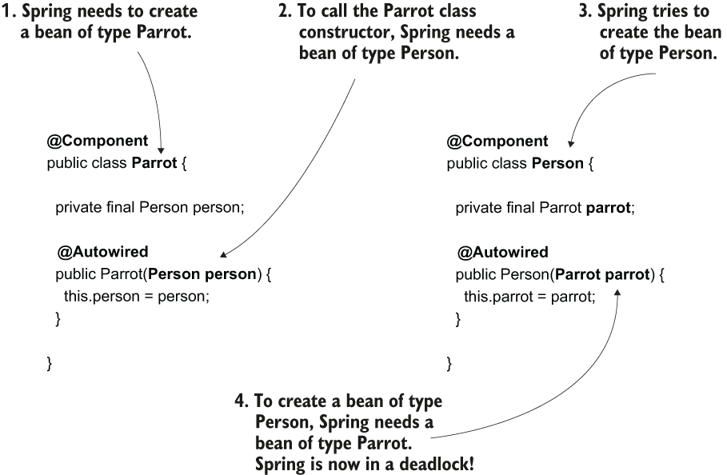

> **Hình 3.11** Một circular dependency. Spring cần tạo một bean kiểu Parrot. Nhưng vì Parrot có dependency là Person, Spring cần tạo Person trước. Tuy nhiên, để tạo Person, Spring lại cần đã xây dựng xong Parrot. Spring giờ rơi vào deadlock. Nó không thể tạo Parrot vì cần Person, và không thể tạo Person vì cần Parrot.

Circular dependency rất dễ tránh. Bạn chỉ cần đảm bảo không định nghĩa các đối tượng mà việc tạo chúng phụ thuộc lẫn nhau. Có các dependency từ đối tượng này sang đối tượng kia như vậy là thiết kế class tệ. Trong trường hợp đó, bạn cần viết lại code.

Tôi không nghĩ mình biết lập trình viên Spring nào chưa từng ít nhất một lần tạo ra circular dependency trong ứng dụng. Bạn cần nhận thức về tình huống này để khi gặp nó, bạn biết nguyên nhân và giải quyết nhanh.

Trong project "sq-ch3-ex7", bạn sẽ thấy một ví dụ về circular dependency. Như trình bày trong các đoạn code tiếp theo, tôi làm cho việc khởi tạo bean `Parrot` phụ thuộc vào bean `Person` và ngược lại.

Class `Person`:

```java
@Component
public class Person {

    private final Parrot parrot;

    @Autowired
    public Person(Parrot parrot) {             ❶
        this.parrot = parrot;
    }

    // Omitted code

}
```

❶ Để tạo instance `Person`, Spring cần có bean `Parrot`.

Class `Parrot`:

```java
public class Parrot {

    private String name = "Koko";

    private final Person person;

    @Autowired
    public Parrot(Person person) {             ❶
      this.person = person;
    }

    // Omitted code
}
```

❶ Để tạo instance `Parrot`, Spring cần có bean `Person`.

Chạy ứng dụng với cấu hình như vậy sẽ dẫn đến một exception như trong đoạn tiếp theo:

```text
Caused by: org.springframework.beans.factory.BeanCurrentlyInCreationException: Error creating bean with name 'parrot': Requested bean is currently in creation: Is there an unresolvable circular reference?
        at org.springframework.beans.factory.support.DefaultSingletonBeanRegistry.beforeSingletonCreation(...)
```

Với exception này, Spring cố nói cho bạn biết vấn đề nó gặp phải. Thông báo exception khá rõ ràng: Spring đang gặp circular dependency và các class gây ra tình huống này. Mỗi khi bạn thấy exception như vậy, bạn cần đến các class được chỉ ra trong exception và loại bỏ circular dependency.

## 3.4 Chọn từ nhiều bean trong Spring context

Trong mục này, chúng ta bàn về tình huống Spring cần inject một giá trị vào một tham số hoặc field của class nhưng có nhiều bean cùng kiểu để chọn. Giả sử bạn có ba bean `Parrot` trong Spring context. Bạn cấu hình Spring inject một giá trị kiểu `Parrot` vào một tham số. Spring sẽ hành xử thế nào? Framework sẽ chọn bean nào trong số các bean cùng kiểu để inject trong tình huống như vậy?

Tùy vào cách triển khai, bạn có các trường hợp sau:

1. Định danh của tham số khớp với tên của một trong các bean trong context (hãy nhớ, tên này giống tên của method được đánh dấu `@Bean` trả về giá trị của nó). Trong trường hợp này, Spring sẽ chọn bean có tên giống tham số.
2. Định danh của tham số không khớp với bất kỳ tên bean nào trong context. Khi đó bạn có các lựa chọn sau:
   1. Bạn đã đánh dấu một trong các bean là primary (như chúng ta đã bàn ở chương 2, bằng annotation `@Primary`). Trong trường hợp này, Spring sẽ chọn bean primary để inject.
   2. Bạn có thể chọn tường minh một bean cụ thể bằng annotation `@Qualifier`, mà chúng ta bàn trong chương này.
   3. Nếu không bean nào là primary và bạn không dùng `@Qualifier`, ứng dụng sẽ thất bại với một exception, phàn nàn rằng context chứa nhiều bean cùng kiểu và Spring không biết chọn bean nào.

Hãy thử tiếp trong project "sq-ch3-ex8" một tình huống mà chúng ta có nhiều hơn một instance của một kiểu trong Spring context. Listing tiếp theo cho bạn thấy một class cấu hình định nghĩa hai instance `Parrot` và dùng inject qua tham số method.

**Listing 3.6** Dùng inject qua tham số cho nhiều hơn một bean

```java
@Configuration
public class ProjectConfig {

    @Bean
    public Parrot parrot1() {
      Parrot p = new Parrot();
        p.setName("Koko");
        return p;
    }

    @Bean
    public Parrot parrot2() {
        Parrot p = new Parrot();
        p.setName("Miki");
        return p;
    }

    @Bean
    public Person person(Parrot parrot2) {                ❶
      Person p = new Person();
        p.setName("Ella");
        p.setParrot(parrot2);
        return p;
    }
}
```

❶ Tên của tham số khớp với tên của bean đại diện cho con vẹt Miki.

Chạy ứng dụng với cấu hình này, bạn sẽ thấy đầu ra console tương tự đoạn code tiếp theo. Hãy quan sát rằng Spring đã liên kết bean person với con vẹt tên Miki vì bean đại diện cho con vẹt này có tên `parrot2` (hình 3.12):

```text
Parrot created
Person's name: Ella
Person's parrot: Parrot : Miki
```

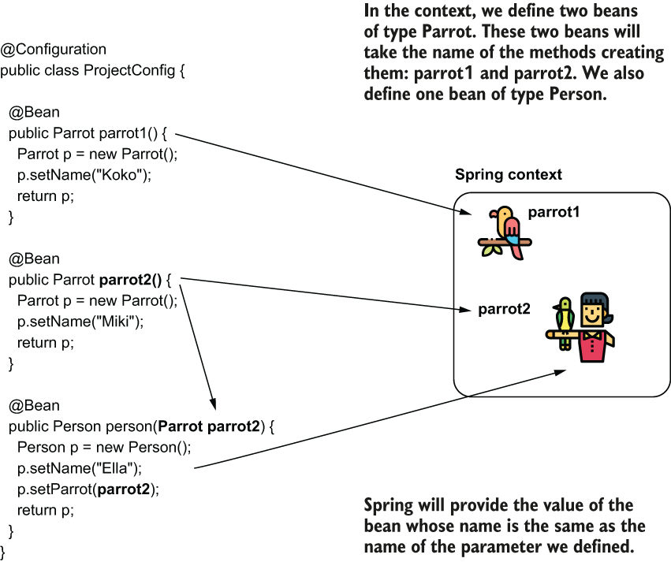

> **Hình 3.12** Một cách để chỉ thị Spring cung cấp cho bạn một instance cụ thể từ context, khi context chứa nhiều hơn một instance cùng kiểu, là dựa vào tên của instance này. Chỉ cần đặt tên tham số giống tên instance mà bạn muốn Spring cung cấp.

Trong thực tế, tôi thích tránh dựa vào tên của tham số, thứ có thể dễ dàng bị refactor và thay đổi nhầm bởi một lập trình viên khác. Để yên tâm hơn, tôi thường chọn cách rõ ràng hơn để thể hiện ý định inject một bean cụ thể: dùng annotation `@Qualifier`. Một lần nữa, theo kinh nghiệm của tôi, tôi thấy các lập trình viên tranh luận ủng hộ và phản đối việc dùng annotation `@Qualifier`. Tôi cảm thấy dùng nó trong trường hợp này tốt hơn vì nó định nghĩa rõ ràng ý định của bạn. Các lập trình viên khác cho rằng thêm annotation này tạo ra code không cần thiết (boilerplate).

Listing sau đưa ra một ví dụ dùng annotation `@Qualifier`. Hãy quan sát rằng thay vì có một định danh cụ thể cho tham số, giờ tôi chỉ định bean muốn inject bằng thuộc tính `value` của annotation `@Qualifier`.

**Listing 3.7** Dùng annotation @Qualifier

```java
@Configuration
public class ProjectConfig {

  @Bean
  public Parrot parrot1() {
      Parrot p = new Parrot();
      p.setName("Koko");
      return p;
  }

  @Bean
  public Parrot parrot2() {
    Parrot p = new Parrot();
      p.setName("Miki");
      return p;
  }

  @Bean
  public Person person(
      @Qualifier("parrot2") Parrot parrot) {                  ❶

      Person p = new Person();
      p.setName("Ella");
          p.setParrot(parrot);
          return p;
      }
}
```

❶ Dùng annotation `@Qualifier`, bạn đánh dấu rõ ràng ý định inject một bean cụ thể từ context.

Chạy lại ứng dụng, ứng dụng in cùng kết quả ra console:

```text
Parrot created
Person's name: Ella
Person's parrot: Parrot : Miki
```

Tình huống tương tự cũng có thể xảy ra khi dùng annotation `@Autowired`. Để cho bạn thấy trường hợp này, tôi đã tạo một project khác, "sq-ch3-ex9". Trong project này, chúng ta định nghĩa hai bean kiểu `Parrot` (bằng annotation `@Bean`) và một instance `Person` (bằng stereotype annotation). Tôi sẽ cấu hình Spring inject một trong hai bean parrot vào bean kiểu `Person`.

Như trình bày trong đoạn code tiếp theo, tôi không thêm annotation `@Component` vào class `Parrot` vì tôi định nghĩa hai bean kiểu `Parrot` bằng annotation `@Bean` trong class cấu hình:

```java
public class Parrot {

      private String name;

      // Omitted getters, setters, and toString()
}
```

Chúng ta định nghĩa một bean kiểu `Person` bằng stereotype annotation `@Component`. Hãy quan sát định danh tôi đặt cho tham số của constructor trong đoạn code tiếp theo. Lý do tôi đặt định danh "parrot2" là vì đây là tên tôi cũng sẽ cấu hình cho bean trong context mà tôi muốn Spring inject vào tham số đó:

```java
@Component
public class Person {

      private String name = "Ella";

      private final Parrot parrot;

      public Person(Parrot parrot2) {
          this.parrot = parrot2;
      }

      // Omitted getters and setters

}
```

Tôi định nghĩa hai bean kiểu `Parrot` bằng annotation `@Bean` trong class cấu hình. Đừng quên chúng ta vẫn phải thêm `@ComponentScan` để nói cho Spring biết nơi tìm các class được đánh dấu bằng stereotype annotation. Trong trường hợp của chúng ta, chúng ta đã đánh dấu class `Person` bằng stereotype annotation `@Component`. Listing tiếp theo cho thấy định nghĩa của class cấu hình.

**Listing 3.8** Định nghĩa các bean kiểu Parrot trong class cấu hình

```java
@Configuration
@ComponentScan(basePackages = "beans")
public class ProjectConfig {

    @Bean
    public Parrot parrot1() {
      Parrot p = new Parrot();
        p.setName("Koko");
        return p;
    }

    @Bean
    public Parrot parrot2() {              ❶
        Parrot p = new Parrot();
        p.setName("Miki");
        return p;
    }
}
```

❶ Với thiết lập hiện tại, bean tên `parrot2` là bean mà Spring inject vào bean `Person`.

Điều gì xảy ra nếu bạn chạy một method main như trong đoạn code tiếp theo? Person của chúng ta sở hữu con vẹt nào? Vì tên của tham số constructor khớp với một trong các tên bean trong Spring context (`parrot2`), Spring inject bean đó (hình 3.13), nên tên con vẹt mà ứng dụng in ra console là Miki:

```java
public class Main {

    public static void main(String[] args) {
        var context = new
            AnnotationConfigApplicationContext(ProjectConfig.class);

        Person p = context.getBean(Person.class);

        System.out.println("Person's name: " + p.getName());
        System.out.println("Person's parrot: " + p.getParrot());
    }
}
```

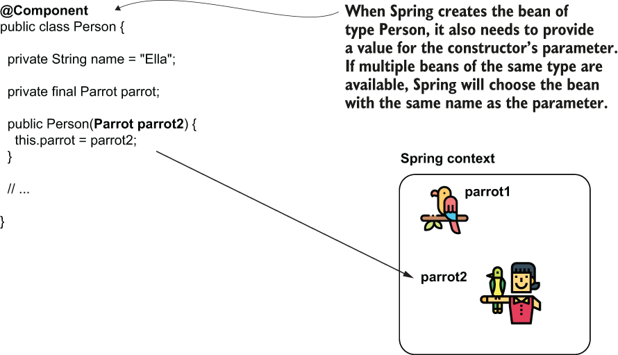

> **Hình 3.13** Khi Spring context chứa nhiều bean cùng kiểu, Spring sẽ chọn bean có tên khớp với tên của tham số.

Chạy ứng dụng này, console hiển thị đầu ra sau:

```text
Person's name: Ella
Person's parrot: Parrot : Miki
```

Như chúng ta đã bàn với tham số của method được đánh dấu `@Bean`, tôi khuyên không nên dựa vào tên của biến. Thay vào đó, tôi thích dùng annotation `@Qualifier` để thể hiện rõ ý định: tôi inject một bean cụ thể từ context. Bằng cách này, chúng ta giảm thiểu khả năng ai đó refactor tên biến và do đó ảnh hưởng đến cách ứng dụng hoạt động. Hãy xem thay đổi tôi đã làm với class `Person` trong đoạn code tiếp theo. Dùng annotation `@Qualifier`, tôi chỉ định tên của bean mà tôi muốn Spring inject từ context, và tôi không dựa vào định danh của tham số constructor (xem thay đổi trong project tên là "sq-ch3-ex10"):

```java
@Component
public class Person {

    private String name = "Ella";

    private final Parrot parrot;

    public Person(@Qualifier("parrot2") Parrot parrot) {
        this.parrot = parrot;
    }

 // Omitted getters and setters

}
```

Hành vi của ứng dụng không thay đổi, và đầu ra vẫn như cũ. Cách này làm code của bạn ít bị lỗi hơn.

## Tóm tắt

- Spring context là nơi trong bộ nhớ của ứng dụng mà framework dùng để giữ các đối tượng nó quản lý. Bạn cần thêm vào Spring context bất kỳ đối tượng nào cần được bổ sung một tính năng mà framework cung cấp.
- Khi triển khai một ứng dụng, bạn cần tham chiếu từ đối tượng này sang đối tượng khác. Bằng cách này, một đối tượng có thể ủy quyền các hành động cho các đối tượng khác khi thực thi trách nhiệm của mình. Để triển khai hành vi này, bạn cần thiết lập quan hệ giữa các bean trong Spring context.
- Bạn có thể thiết lập quan hệ giữa hai bean bằng một trong ba cách:
  - Tham chiếu trực tiếp đến method được đánh dấu `@Bean` tạo ra một bean từ method tạo ra bean kia. Spring biết bạn tham chiếu đến bean trong context, và nếu bean đã tồn tại, nó không gọi lại cùng method để tạo instance khác. Thay vào đó, nó trả về tham chiếu đến bean hiện có trong context.
  - Định nghĩa một tham số cho method được đánh dấu `@Bean`. Khi Spring thấy method `@Bean` có tham số, nó tìm một bean có kiểu của tham số đó trong context và cung cấp bean đó làm giá trị cho tham số.
  - Dùng annotation `@Autowired` theo ba cách:
    - Đánh dấu field trong class nơi bạn muốn chỉ thị Spring inject bean từ context. Bạn sẽ thấy cách này thường được dùng trong ví dụ và proof of concept.
    - Đánh dấu constructor mà bạn muốn Spring gọi để tạo bean. Spring sẽ inject các bean khác từ context vào các tham số của constructor. Bạn sẽ thấy cách này được dùng nhiều nhất trong code thực tế.
    - Đánh dấu setter của thuộc tính nơi bạn muốn Spring inject bean từ context. Bạn sẽ không thấy cách này được dùng thường xuyên trong code sẵn sàng cho production.
- Mỗi khi bạn cho phép Spring cung cấp một giá trị hoặc tham chiếu thông qua một thuộc tính của class hoặc một tham số của method hay constructor, chúng ta nói Spring dùng DI, một kỹ thuật được hỗ trợ bởi nguyên lý IoC.
- Việc tạo hai bean phụ thuộc lẫn nhau sinh ra circular dependency. Spring không thể tạo các bean có circular dependency, và việc thực thi thất bại với một exception. Khi cấu hình các bean, hãy đảm bảo bạn tránh circular dependency.
- Khi Spring có nhiều hơn một bean cùng kiểu trong context, nó không thể quyết định bean nào trong số đó cần được inject. Bạn có thể nói cho Spring biết instance nào nó cần inject bằng cách
  - dùng annotation `@Primary`, đánh dấu một trong các bean là mặc định cho dependency injection, hoặc
  - đặt tên cho các bean và inject chúng theo tên bằng annotation `@Qualifier`.
