# 4 Spring context: Sử dụng abstraction

**Chương này bao gồm**

- Dùng interface để định nghĩa contract
- Dùng abstraction cho các bean trong Spring context
- Dùng dependency injection với abstraction

Trong chương này, chúng ta thảo luận về việc sử dụng abstraction với các bean của Spring. Chủ đề này rất quan trọng bởi vì trong các dự án thực tế, chúng ta thường dùng abstraction để tách rời (decouple) các implementation. Như bạn sẽ học trong chương này, bằng cách decoupling các implementation, chúng ta đảm bảo ứng dụng của mình dễ bảo trì và dễ kiểm thử.

Chúng ta sẽ bắt đầu bằng việc ôn lại cách dùng interface để định nghĩa contract trong mục 4.1. Để tiếp cận chủ đề này, chúng ta bắt đầu bằng cách thảo luận về trách nhiệm của các đối tượng và tìm hiểu xem chúng phù hợp thế nào trong một thiết kế class tiêu chuẩn của ứng dụng. Chúng ta sẽ dùng kỹ năng lập trình của mình để cài đặt một kịch bản nhỏ, trong đó không dùng Spring, mà tập trung vào việc triển khai một yêu cầu và dùng abstraction để tách rời các đối tượng phụ thuộc lẫn nhau của ứng dụng.

Sau đó, chúng ta thảo luận về hành vi của Spring khi dùng DI với abstraction trong mục 4.2. Chúng ta sẽ bắt đầu từ phần cài đặt đã làm ở mục 4.1 và thêm Spring vào các dependency của ứng dụng. Tiếp theo, chúng ta dùng Spring context để triển khai dependency injection. Với ví dụ này, chúng ta tiến gần hơn tới những gì bạn sẽ gặp trong các implementation sẵn sàng cho môi trường production: các đối tượng với những trách nhiệm điển hình cho các kịch bản thực tế, cùng abstraction được dùng với DI và Spring context.

## 4.1 Dùng interface để định nghĩa contract

Trong mục này, chúng ta thảo luận về việc dùng interface để định nghĩa contract (hợp đồng). Trong Java, interface là một cấu trúc trừu tượng mà bạn dùng để khai báo một trách nhiệm cụ thể. Một đối tượng triển khai interface đó phải định nghĩa trách nhiệm này. Nhiều đối tượng cùng triển khai một interface có thể định nghĩa trách nhiệm mà interface đó khai báo theo những cách khác nhau. Có thể nói rằng interface chỉ ra "điều gì cần xảy ra" (what), còn mỗi đối tượng triển khai interface chỉ ra "nó phải xảy ra như thế nào" (how).

Hồi tôi còn nhỏ, bố tôi cho tôi một chiếc radio cũ để tháo ra nghịch (tôi khá là hào hứng với chuyện tháo tung mọi thứ). Nhìn vào nó, tôi nhận ra mình cần thứ gì đó để vặn các con ốc của vỏ máy. Sau một hồi suy nghĩ, tôi quyết định có thể dùng một con dao cho việc này, nên tôi xin bố một con dao. Bố hỏi: "Con cần dao để làm gì?" Tôi nói tôi cần nó để mở vỏ máy. "Ồ!" bố nói. "Con nên dùng tua-vít thì hơn; đây này!" Lúc đó, tôi học được rằng luôn khôn ngoan hơn khi hỏi xin thứ mình cần thay vì xin một giải pháp khi bạn chẳng biết mình đang làm gì. Interface chính là cách các đối tượng hỏi xin thứ chúng cần.

### 4.1.1 Dùng interface để tách rời các implementation

Mục này thảo luận contract là gì và cách bạn định nghĩa chúng trong một ứng dụng Java bằng interface. Tôi sẽ bắt đầu với một phép so sánh, rồi dùng một vài hình ảnh minh họa để giải thích khái niệm và khi nào việc dùng interface là hữu ích. Sau đó chúng ta sẽ tiếp tục với yêu cầu của một bài toán ở mục 4.1.2 và giải quyết kịch bản này mà không dùng framework ở mục 4.1.3. Xa hơn nữa, trong mục 4.2, chúng ta thêm Spring vào công thức, và bạn sẽ học cách dependency injection trong Spring hoạt động khi dùng contract để tách rời các chức năng.

Một phép so sánh: Giả sử bạn dùng một ứng dụng gọi xe vì bạn cần đi đâu đó. Khi đặt một chuyến đi, bạn thường không quan tâm chiếc xe trông thế nào hay tài xế là ai. Bạn chỉ cần đến được nơi cần đến. Với tôi, tôi chẳng bận tâm là một chiếc ô tô hay một con tàu vũ trụ đến đón mình, miễn là tôi tới đích đúng giờ. Ứng dụng gọi xe chính là một interface. Khách hàng không yêu cầu một chiếc xe hay một tài xế, mà yêu cầu một chuyến đi. Bất kỳ tài xế nào có xe và có thể cung cấp dịch vụ đều có thể đáp ứng yêu cầu của khách hàng. Khách hàng và tài xế được tách rời thông qua ứng dụng (interface); khách hàng không biết tài xế là ai hay chiếc xe nào sẽ đến đón trước khi có xe phản hồi yêu cầu của họ, và tài xế cũng không cần biết mình phục vụ cho ai. Từ phép so sánh này, bạn có thể suy ra vai trò của interface trong mối quan hệ với các đối tượng trong Java.

Một ví dụ cài đặt: Giả sử bạn cài đặt một đối tượng cần in ra chi tiết các gói hàng sẽ được giao cho một ứng dụng vận chuyển. Các chi tiết được in ra phải được sắp xếp theo địa chỉ nhận hàng. Đối tượng đảm nhiệm việc in chi tiết cần ủy quyền cho một đối tượng khác trách nhiệm sắp xếp các gói hàng theo địa chỉ giao hàng (hình 4.1).

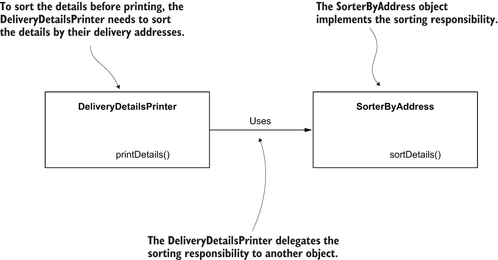

> **Hình 4.1** Đối tượng `DeliveryDetailsPrinter` ủy quyền trách nhiệm sắp xếp các chi tiết giao hàng theo địa chỉ giao hàng cho một đối tượng khác tên là `SorterByAddress`.

Như hình 4.1 cho thấy, `DeliveryDetailsPrinter` ủy quyền trực tiếp trách nhiệm sắp xếp cho đối tượng `SorterByAddress`. Nếu giữ nguyên thiết kế class này, sau này chúng ta có thể gặp khó khăn nếu cần thay đổi chức năng đó. Hãy tưởng tượng sau này bạn cần thay đổi thứ tự in chi tiết, và thứ tự mới là theo tên người gửi. Bạn sẽ cần thay thế đối tượng `SorterByAddress` bằng một đối tượng khác triển khai trách nhiệm mới, nhưng bạn cũng sẽ phải thay đổi cả đối tượng `DeliveryDetailsPrinter` đang sử dụng trách nhiệm sắp xếp đó (hình 4.2).

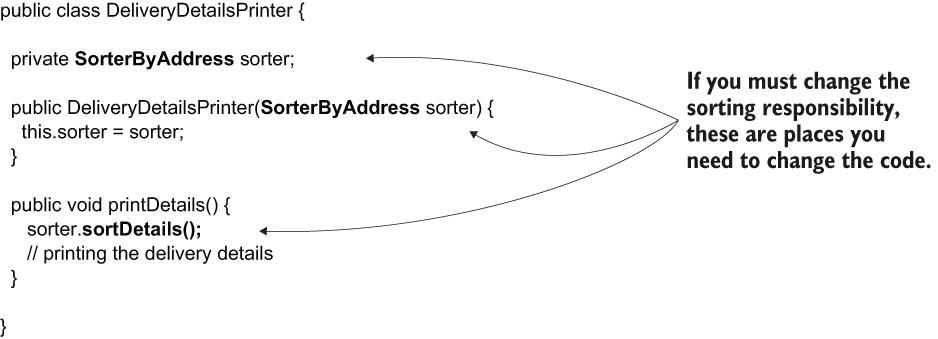

> **Hình 4.2** Vì hai đối tượng được ghép nối chặt (strongly coupled), nếu muốn thay đổi trách nhiệm sắp xếp, bạn cũng phải thay đổi đối tượng sử dụng trách nhiệm này. Một thiết kế tốt hơn sẽ cho phép bạn thay đổi trách nhiệm sắp xếp mà không cần thay đổi đối tượng sử dụng trách nhiệm đó.

Làm thế nào để cải thiện thiết kế này? Khi thay đổi trách nhiệm của một đối tượng, chúng ta muốn tránh việc phải thay đổi các đối tượng khác đang sử dụng trách nhiệm bị thay đổi đó. Vấn đề của thiết kế này nảy sinh vì đối tượng `DeliveryDetailsPrinter` chỉ định cả *cái nó cần* (what) lẫn *cách nó cần* (how). Như đã thảo luận ở trên, một đối tượng chỉ cần chỉ định cái nó cần và hoàn toàn không cần biết cái đó được triển khai như thế nào. Dĩ nhiên, chúng ta làm điều này bằng cách dùng interface. Trong hình 4.3, tôi đưa vào một interface tên là `Sorter` để tách rời hai đối tượng. Thay vì khai báo một `SorterByAddress`, đối tượng `DeliveryDetailsPrinter` chỉ nói rằng nó cần một `Sorter`. Giờ đây bạn có thể có bao nhiêu đối tượng tùy thích để giải quyết cái *what* mà `DeliveryDetailsPrinter` yêu cầu. Bất kỳ đối tượng nào triển khai interface `Sorter` đều có thể thỏa mãn dependency của đối tượng `DeliveryDetailsPrinter` vào bất kỳ lúc nào. Hình 4.3 là biểu diễn trực quan của sự phụ thuộc giữa đối tượng `DeliveryDetailsPrinter` và đối tượng `SorterByAddress` sau khi chúng ta tách rời chúng bằng một interface.

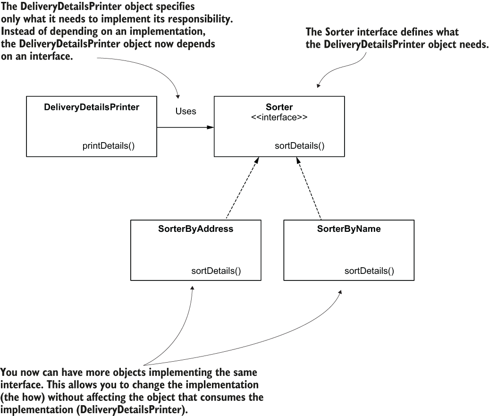

> **Hình 4.3** Dùng interface để tách rời các trách nhiệm. Thay vì phụ thuộc trực tiếp vào một implementation, đối tượng `DeliveryDetailsPrinter` phụ thuộc vào một interface (một contract). `DeliveryDetailsPrinter` có thể dùng bất kỳ đối tượng nào triển khai interface này thay vì bị gắn chặt với một implementation cụ thể.

Trong đoạn mã sau, bạn thấy định nghĩa của interface `Sorter`:

```java
public interface Sorter {
   void sortDetails();
}
```

Hãy nhìn hình 4.4 và so sánh với hình 4.2. Vì đối tượng `DeliveryDetailsPrinter` phụ thuộc vào interface thay vì phụ thuộc trực tiếp vào implementation, bạn không cần thay đổi nó thêm nữa nếu thay đổi cách sắp xếp chi tiết giao hàng.

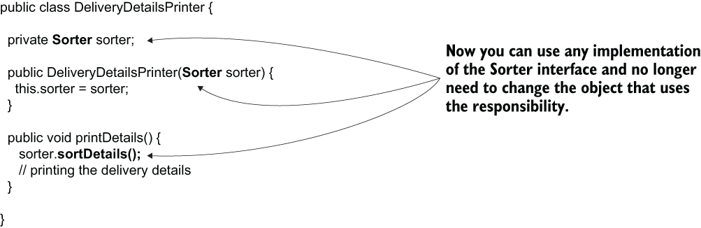

> **Hình 4.4** Đối tượng `DeliveryDetailsPrinter` phụ thuộc vào interface `Sorter`. Bạn có thể thay đổi implementation của interface `Sorter` mà không phải thay đổi thêm gì ở đối tượng sử dụng trách nhiệm này (`DeliveryDetailsPrinter`).

Với phần giới thiệu lý thuyết này, giờ bạn đã hiểu tại sao chúng ta dùng interface để tách rời các đối tượng phụ thuộc lẫn nhau trong thiết kế class. Tiếp theo, chúng ta triển khai một yêu cầu cho một kịch bản. Chúng ta sẽ triển khai yêu cầu này bằng Java thuần, không dùng framework nào, và tập trung vào trách nhiệm của các đối tượng cũng như việc dùng interface để tách rời chúng. Cuối mục này, chúng ta sẽ có một dự án định nghĩa một số đối tượng phối hợp với nhau để triển khai một use case.

Trong mục 4.2, chúng ta sẽ thay đổi dự án và thêm Spring vào để quản lý các đối tượng cũng như mối quan hệ giữa chúng bằng dependency injection. Bằng cách tiếp cận từng bước như vậy, bạn sẽ dễ dàng quan sát hơn những thay đổi cần thiết để thêm Spring vào một ứng dụng, cũng như những lợi ích đi kèm với thay đổi đó.

### 4.1.2 Yêu cầu của kịch bản

Cho đến giờ, chúng ta đã dùng những ví dụ đơn giản và chọn những đối tượng đơn giản (như `Parrot`). Dù chúng không gần với những gì một ứng dụng sẵn sàng cho production sử dụng, chúng giúp bạn tập trung vào các cú pháp cần học. Giờ là lúc bạn tiến thêm một bước và dùng những gì đã học ở các chương trước với một ví dụ gần hơn với những gì diễn ra trong thế giới thực.

Giả sử bạn đang cài đặt một ứng dụng mà một nhóm dùng để quản lý các công việc (task) của họ. Một trong các tính năng của ứng dụng là cho phép người dùng để lại bình luận (comment) cho các công việc. Khi một người dùng đăng một bình luận, bình luận đó được lưu trữ ở đâu đó (ví dụ, trong một database), và ứng dụng gửi một email tới một địa chỉ cụ thể được cấu hình trong ứng dụng.

Chúng ta cần thiết kế các đối tượng và tìm ra những trách nhiệm cùng abstraction phù hợp để triển khai tính năng này.

### 4.1.3 Triển khai yêu cầu mà không dùng framework

Trong mục này, chúng ta tập trung vào việc triển khai yêu cầu đã mô tả ở mục 4.1.1. Bạn sẽ làm điều này bằng cách dùng những gì đã học về interface cho tới giờ. Trước tiên, chúng ta cần xác định các đối tượng (trách nhiệm) cần triển khai.

Trong các ứng dụng thực tế tiêu chuẩn, chúng ta thường gọi các đối tượng triển khai use case là service, và đó là điều chúng ta sẽ làm ở đây. Chúng ta sẽ cần một service triển khai use case "đăng bình luận". Hãy đặt tên đối tượng này là `CommentService`. Tôi thích đặt tên cho các class service kết thúc bằng "service" để vai trò của chúng trong dự án được nổi bật. Để biết thêm chi tiết về các thực hành đặt tên tốt, tôi khuyên bạn đọc chương 2 của cuốn *Clean Code: A Handbook of Agile Software Craftsmanship* của Robert C. Martin (Pearson, 2008).

Khi phân tích lại yêu cầu, chúng ta nhận thấy use case này gồm hai hành động: lưu trữ bình luận và gửi bình luận qua mail. Vì chúng khá khác nhau, chúng ta coi hai hành động này là hai trách nhiệm khác nhau, và do đó cần triển khai hai đối tượng khác nhau.

Khi có một đối tượng làm việc trực tiếp với database, chúng ta thường gọi đối tượng đó là repository. Đôi khi bạn cũng thấy những đối tượng như vậy được gọi là data access object (DAO). Hãy đặt tên đối tượng triển khai trách nhiệm lưu trữ bình luận là `CommentRepository`.

Cuối cùng, trong một ứng dụng thực tế, khi triển khai các đối tượng có trách nhiệm thiết lập giao tiếp với thứ gì đó bên ngoài ứng dụng, chúng ta gọi các đối tượng này là proxy, vậy nên hãy đặt tên đối tượng có trách nhiệm gửi email là `CommentNotificationProxy`. Hình 4.5 cho thấy mối quan hệ giữa ba trách nhiệm này.

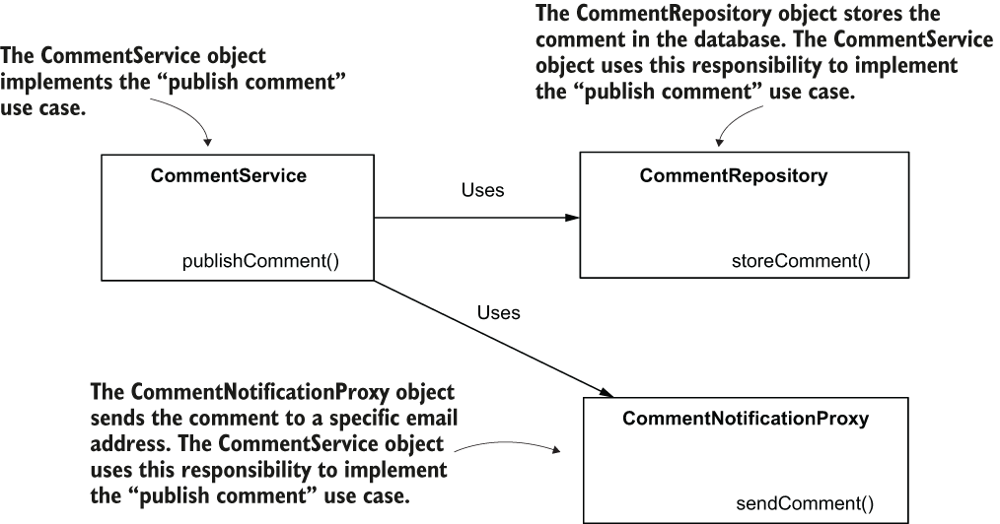

> **Hình 4.5** Đối tượng `CommentService` triển khai use case "đăng bình luận". Để làm điều này, nó cần ủy quyền cho các trách nhiệm được triển khai bởi các đối tượng `CommentRepository` và `CommentNotificationProxy`.

Nhưng khoan đã! Chẳng phải chúng ta đã nói không nên ghép nối trực tiếp giữa các implementation sao? Chúng ta cần đảm bảo tách rời các implementation bằng cách dùng interface. Rốt cuộc thì hiện tại `CommentRepository` có thể dùng một database để lưu trữ bình luận. Nhưng trong tương lai, có thể nó cần được thay đổi để dùng một công nghệ khác hoặc một dịch vụ bên ngoài. Điều tương tự cũng đúng với đối tượng `CommentNotificationProxy`. Hiện giờ nó gửi thông báo qua email, nhưng có thể trong một phiên bản tương lai, thông báo bình luận cần được gửi qua một kênh khác. Chúng ta chắc chắn muốn đảm bảo tách rời `CommentService` khỏi các implementation của những dependency của nó, để khi cần thay đổi các dependency, chúng ta không phải thay đổi cả đối tượng sử dụng chúng.

Hình 4.6 cho thấy cách tách rời thiết kế class này bằng abstraction. Thay vì thiết kế `CommentRepository` và `CommentNotificationProxy` là các class, chúng ta thiết kế chúng là các interface mà ta có thể triển khai để định nghĩa chức năng.

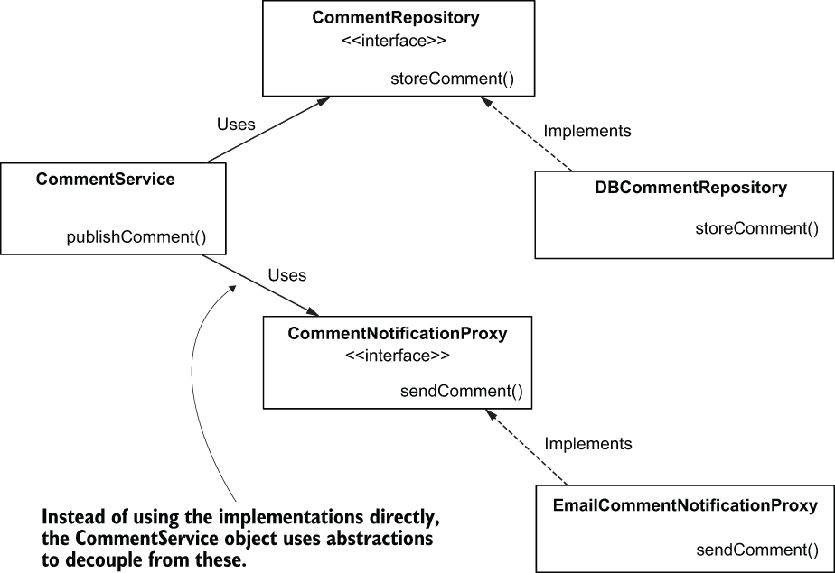

> **Hình 4.6** Đối tượng `CommentService` phụ thuộc vào các abstraction do các interface `CommentRepository` và `CommentNotificationProxy` cung cấp. Các class `DBCommentRepository` và `EmailCommentNotificationProxy` triển khai các interface này. Thiết kế này tách rời implementation của use case "đăng bình luận" khỏi các dependency của nó và giúp ứng dụng dễ thay đổi hơn cho các phát triển trong tương lai.

Giờ chúng ta đã có bức tranh rõ ràng về những gì muốn triển khai, hãy bắt tay vào viết code. Hiện tại, chúng ta tạo một dự án Maven thuần, không thêm bất kỳ dependency bên ngoài nào vào file `pom.xml`. Tôi sẽ đặt tên dự án này là "sq-ch4-ex1", và tổ chức nó như trình bày trong hình 4.7, tách các trách nhiệm khác nhau vào các package riêng.

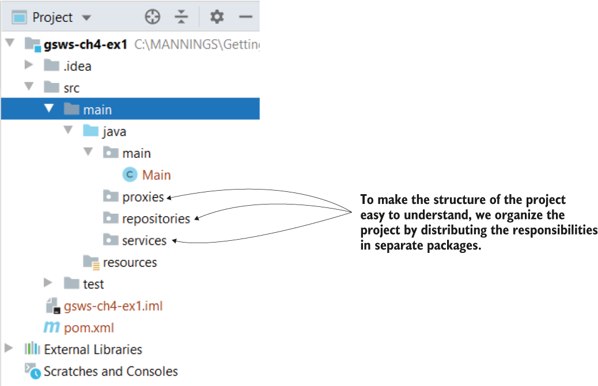

> **Hình 4.7** Cấu trúc dự án. Chúng ta khai báo một package riêng cho mỗi trách nhiệm để cấu trúc dự án dễ đọc và dễ hiểu.

Một điều tôi chưa đề cập trước đó (để bạn tập trung vào các trách nhiệm chính của ứng dụng) là chúng ta cũng sẽ phải biểu diễn bình luận bằng cách nào đó. Chúng ta chỉ cần viết một class POJO nhỏ để định nghĩa bình luận. Chúng ta bắt đầu việc triển khai use case bằng cách viết class POJO này. Trách nhiệm của loại đối tượng này đơn giản là mô hình hóa dữ liệu mà ứng dụng sử dụng, và chúng ta gọi nó là model. Tôi sẽ xét một bình luận có hai thuộc tính: nội dung (text) và tác giả (author). Hãy tạo một package `model`, trong đó chúng ta định nghĩa một class `Comment`. Listing sau trình bày định nghĩa của class này.

> **LƯU Ý** POJO là một đối tượng đơn giản không có dependency, chỉ được mô tả bởi các thuộc tính và method của nó. Trong trường hợp của chúng ta, class `Comment` định nghĩa một POJO mô tả chi tiết của một bình luận qua hai thuộc tính: `author` và `text`.

**Listing 4.1** Định nghĩa bình luận

```java
public class Comment {

    private String author;
    private String text;

    // Omitted getters and setters
}
```

Giờ chúng ta có thể định nghĩa các trách nhiệm của repository và proxy. Trong listing tiếp theo, bạn thấy định nghĩa của interface `CommentRepository`. Contract mà interface này định nghĩa khai báo method `storeComment(Comment comment)`, thứ mà đối tượng `CommentService` cần để triển khai use case. Chúng ta lưu interface này và class triển khai nó trong package `repositories` của dự án.

**Listing 4.2** Định nghĩa interface `CommentRepository`

```java
public interface CommentRepository {

    void storeComment(Comment comment);
}
```

Interface chỉ đưa ra cái *what* mà đối tượng `CommentService` cần để triển khai use case: lưu một bình luận. Khi bạn định nghĩa một đối tượng triển khai contract này, nó cần ghi đè (override) method `storeComment(Comment comment)` để định nghĩa cái *how*. Trong listing tiếp theo, bạn thấy định nghĩa của class `DBCommentRepository`. Chúng ta chưa biết cách kết nối tới database, nên chúng ta chỉ in một dòng chữ ra console để mô phỏng hành động này. Sau này, bắt đầu từ chương 12, bạn cũng sẽ học cách kết nối ứng dụng của mình với database.

**Listing 4.3** Triển khai interface `CommentRepository`

```java
public class DBCommentRepository implements CommentRepository {

    @Override
    public void storeComment(Comment comment) {
      System.out.println("Storing comment: " + comment.getText());
    }
}
```

Tương tự, chúng ta định nghĩa một interface cho trách nhiệm thứ hai mà đối tượng `CommentService` cần: `CommentNotificationProxy`. Chúng ta định nghĩa interface này và class triển khai nó trong package `proxies` của dự án. Listing sau trình bày interface này.

**Listing 4.4** Định nghĩa interface `CommentNotificationProxy`

```java
public interface CommentNotificationProxy {

    void sendComment(Comment comment);
}
```

Trong listing tiếp theo, bạn thấy implementation cho interface này, thứ chúng ta sẽ dùng trong phần minh họa.

**Listing 4.5** Implementation của interface `CommentNotificationProxy`

```java
public class EmailCommentNotificationProxy
  implements CommentNotificationProxy {

    @Override
    public void sendComment(Comment comment) {
      System.out.println("Sending notification for comment: "
                           + comment.getText());
    }
}
```

Giờ chúng ta có thể cài đặt chính đối tượng `CommentService` cùng với hai dependency của nó (`CommentRepository` và `CommentNotificationProxy`). Trong package `service`, chúng ta viết class `CommentService` như trình bày trong listing sau.

**Listing 4.6** Cài đặt đối tượng `CommentService`

```java
public class CommentService {

    private final CommentRepository commentRepository;                      ❶
    private final CommentNotificationProxy commentNotificationProxy;        ❶

    public CommentService(                                                  ❷
             CommentRepository commentRepository,
               CommentNotificationProxy commentNotificationProxy) {

        this.commentRepository = commentRepository;
        this.commentNotificationProxy = commentNotificationProxy;
    }

    public void publishComment(Comment comment) {                           ❸
        commentRepository.storeComment(comment);
        commentNotificationProxy.sendComment(comment);
    }
}
```

❶ Chúng ta định nghĩa hai dependency là các thuộc tính của class.  
❷ Chúng ta cung cấp các dependency khi đối tượng được tạo, thông qua các tham số của constructor.  
❸ Chúng ta triển khai use case, ủy quyền các trách nhiệm "lưu bình luận" và "gửi thông báo" cho các dependency.

Giờ hãy viết một class `Main`, như trình bày trong listing tiếp theo, và kiểm thử toàn bộ thiết kế class.

**Listing 4.7** Gọi use case trong class `Main`

```java
public class Main {

    public static void main(String[] args) {
      var commentRepository =
          new DBCommentRepository();                        ❶
        var commentNotificationProxy =                      ❶
          new EmailCommentNotificationProxy();              ❶

        var commentService =
          new CommentService(                               ❷
              commentRepository, commentNotificationProxy);
        var comment = new Comment();                         ❸
        comment.setAuthor("Laurentiu");                      ❸
        comment.setText("Demo comment");                     ❹

        commentService.publishComment(comment);              ❹
    }
}
```

❶ Tạo các instance cho các dependency  
❷ Tạo instance của class service và cung cấp các dependency  
❸ Tạo một instance bình luận để gửi làm tham số cho use case đăng bình luận  
❹ Gọi use case đăng bình luận

Khi chạy ứng dụng này, bạn sẽ thấy hai dòng trên console được in ra bởi các đối tượng `CommentRepository` và `CommentNotificationProxy`. Đoạn mã sau trình bày kết quả này:

```text
Storing comment: Demo comment
Sending notification for comment: Demo comment
```

## 4.2 Dùng dependency injection với abstraction

Trong mục này, chúng ta áp dụng Spring framework lên thiết kế class đã cài đặt ở mục 4.1. Với ví dụ này, chúng ta có thể thảo luận cách Spring quản lý dependency injection khi dùng abstraction. Chủ đề này rất quan trọng bởi vì trong hầu hết các dự án, bạn sẽ triển khai các dependency giữa các đối tượng bằng abstraction. Trong chương 3, chúng ta đã thảo luận về dependency injection, và chúng ta đã dùng các class cụ thể để khai báo các biến mà chúng ta muốn Spring gán giá trị của các bean từ context của nó. Nhưng như bạn sẽ học trong chương này, Spring cũng hiểu cả abstraction.

Chúng ta sẽ bắt đầu bằng cách thêm dependency Spring vào dự án, rồi quyết định xem đối tượng nào của ứng dụng cần được Spring quản lý. Bạn sẽ học cách quyết định những đối tượng nào bạn cần cho Spring biết.

Sau đó, chúng ta sẽ điều chỉnh dự án đã cài đặt ở mục 4.1 để dùng Spring và các khả năng dependency injection của nó. Chúng ta sẽ tập trung thảo luận các tình huống khác nhau có thể xuất hiện khi dùng dependency injection với abstraction. Cuối mục này, chúng ta sẽ thảo luận thêm về các stereotype annotation. Bạn sẽ thấy `@Component` không phải là stereotype annotation duy nhất bạn có thể dùng, và khi nào bạn nên dùng các annotation khác.

### 4.2.1 Quyết định đối tượng nào nên là một phần của Spring context

Khi thảo luận về Spring ở chương 2 và 3, chúng ta tập trung vào cú pháp, và chúng ta chưa có một use case nào phản ánh những gì bạn có thể gặp trong một kịch bản thực tế. Đó cũng là lý do chúng ta chưa thảo luận xem bạn có cần thêm một đối tượng vào Spring context hay không. Dựa trên những gì đã thảo luận, bạn có thể nghĩ rằng cần thêm tất cả các đối tượng của ứng dụng vào Spring context, nhưng không phải vậy.

Hãy nhớ, bạn đã học rằng lý do chính để thêm một đối tượng vào Spring context là cho phép Spring kiểm soát nó và bổ sung thêm cho nó những chức năng mà framework cung cấp. Vì vậy, quyết định này nên dễ dàng và dựa trên câu hỏi: "Đối tượng này có cần được framework quản lý không?"

Không khó để trả lời câu hỏi này cho kịch bản của chúng ta, vì tính năng Spring duy nhất chúng ta dùng là DI. Trong trường hợp này, chúng ta cần thêm đối tượng vào Spring context nếu nó có một dependency cần được inject từ context, hoặc chính nó là một dependency. Nhìn vào phần cài đặt, bạn sẽ thấy đối tượng duy nhất không có dependency và cũng không phải là một dependency là `Comment`. Các đối tượng khác trong thiết kế class của chúng ta như sau:

- `CommentService`—Có hai dependency, `CommentRepository` và `CommentNotificationProxy`
- `DBCommentRepository`—Triển khai interface `CommentRepository` và là một dependency của `CommentService`
- `EmailCommentNotificationProxy`—Triển khai interface `CommentNotificationProxy` và là một dependency của `CommentService`

Nhưng tại sao không thêm cả các instance `Comment`? Tôi thường được hỏi câu này khi dạy các khóa học Spring. Thêm các đối tượng vào Spring context mà không cần framework quản lý chúng chỉ làm tăng độ phức tạp không cần thiết cho ứng dụng của bạn, khiến ứng dụng vừa khó bảo trì hơn vừa kém hiệu năng hơn. Khi thêm một đối tượng vào Spring context, bạn cho phép framework quản lý nó với một số chức năng cụ thể mà framework cung cấp. Nếu bạn thêm đối tượng để Spring quản lý mà không nhận được lợi ích gì từ framework, bạn chỉ đang làm phức tạp hóa (over-engineer) phần cài đặt của mình.

Trong chương 2, chúng ta đã thảo luận rằng dùng stereotype annotation (`@Component`) là cách thoải mái nhất để thêm bean vào Spring context khi các class thuộc về dự án của bạn và bạn có thể thay đổi chúng. Chúng ta cũng sẽ dùng cách tiếp cận này ở đây.

Hãy để ý rằng hai interface trong hình 4.8 vẫn có màu trắng (chúng ta không đánh dấu chúng bằng `@Component`). Tôi thường thấy các học viên bối rối không biết nên dùng stereotype annotation ở đâu khi họ cũng dùng interface trong phần cài đặt. Chúng ta dùng stereotype annotation cho những class mà Spring cần tạo instance và thêm các instance đó vào context của nó. Việc thêm stereotype annotation lên interface hay abstract class là vô nghĩa vì chúng không thể được khởi tạo. Về mặt cú pháp, bạn có thể làm vậy, nhưng nó không có ích.

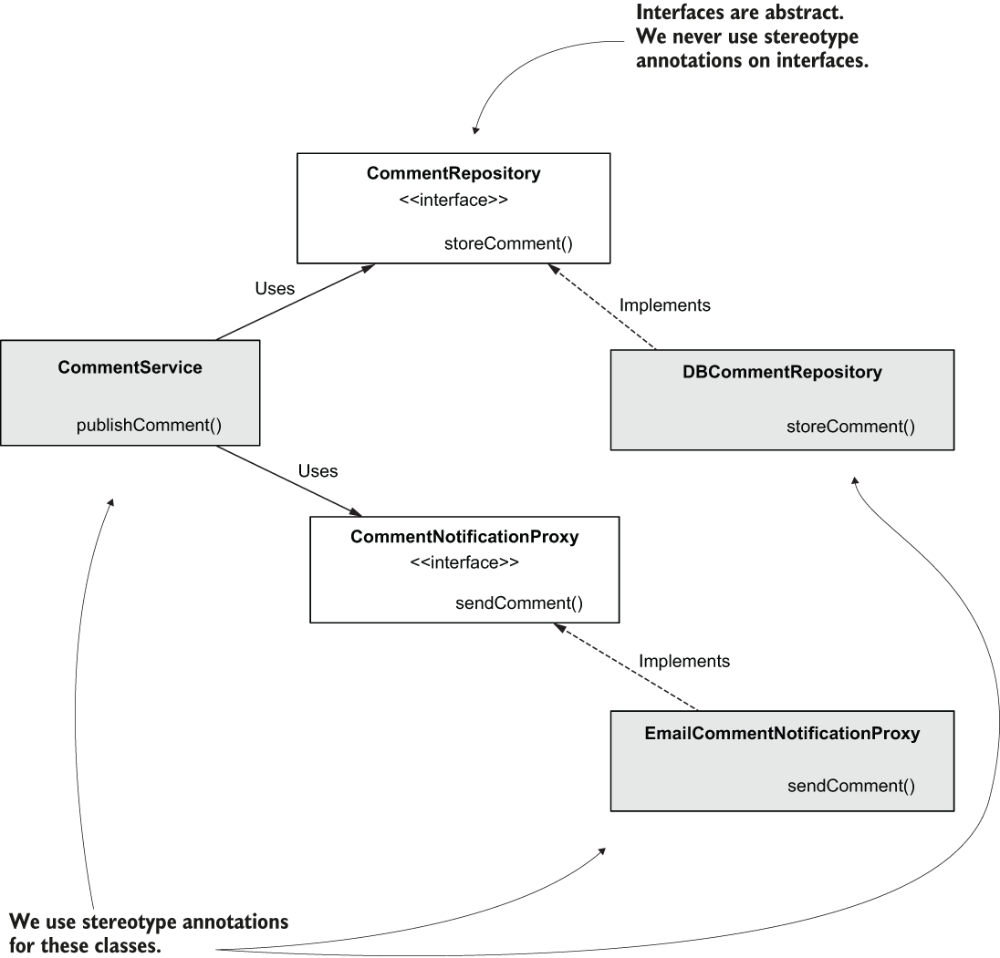

> **Hình 4.8** Các class chúng ta sẽ đánh dấu bằng stereotype annotation `@Component` được tô màu xám. Khi context được nạp, Spring tạo các instance của những class này và thêm chúng vào context của nó.

Hãy thay đổi code và thêm annotation `@Component` vào các class này. Trong listing sau, bạn thấy thay đổi cho class `DBCommentRepository`.

**Listing 4.8** Thêm `@Component` vào class `DBCommentRepository`

```java
@Component                                                                ❶
public class DBCommentRepository implements CommentRepository {

    @Override
    public void storeComment(Comment comment) {
        System.out.println("Storing comment: " + comment.getText());
    }
}
```

❶ Đánh dấu class bằng `@Component` chỉ thị cho Spring khởi tạo class và thêm một instance làm bean vào context của nó.

Trong listing tiếp theo, bạn thấy các thay đổi cho class `EmailCommentNotificationProxy`.

**Listing 4.9** Thêm `@Component` vào class `EmailCommentNotificationProxy`

```java
@Component
public class EmailCommentNotificationProxy
    implements CommentNotificationProxy {

    @Override
    public void sendComment(Comment comment) {
      System.out.println(
         "Sending notification for comment: " +
            comment.getText());
    }
}
```

Trong listing tiếp theo, chúng ta cũng thay đổi class `CommentService` bằng cách chú thích nó với `@Component`. Class `CommentService` khai báo các dependency tới hai component còn lại thông qua các interface `CommentRepository` và `CommentNotificationProxy`. Spring thấy các thuộc tính được định nghĩa với kiểu interface và đủ thông minh để tìm trong context của nó những bean được tạo từ các class triển khai những interface này. Như đã thảo luận ở chương 2, vì chúng ta chỉ có một constructor trong class, annotation `@Autowired` là tùy chọn.

**Listing 4.10** Biến class `CommentService` thành một component

```java
@Component                                                              ❶
public class CommentService {

    private final CommentRepository commentRepository;

    private final CommentNotificationProxy commentNotificationProxy;

                                                                        ❷
    public CommentService(                                              ❸
        CommentRepository commentRepository,
        CommentNotificationProxy commentNotificationProxy) {
        this.commentRepository = commentRepository;
        this.commentNotificationProxy = commentNotificationProxy;
    }

    public void publishComment(Comment comment) {
      commentRepository.storeComment(comment);
        commentNotificationProxy.sendComment(comment);
    }
}
```

❶ Spring tạo một bean của class này và thêm nó vào context của nó.  
❷ Chúng ta sẽ phải dùng `@Autowired` nếu class có nhiều hơn một constructor.  
❸ Spring dùng constructor này để tạo bean và inject các tham chiếu từ context của nó vào các tham số khi tạo instance.

Chúng ta chỉ cần cho Spring biết nơi tìm các class được chú thích bằng stereotype annotation và kiểm thử ứng dụng. Listing tiếp theo trình bày class cấu hình của dự án, nơi chúng ta dùng annotation `@ComponentScan` để chỉ cho Spring nơi tìm các class được chú thích bằng `@Component`. Chúng ta đã thảo luận về `@ComponentScan` ở chương 2.

**Listing 4.11** Dùng `@ComponentScan` trong class cấu hình

```java
@Configuration                 ❶
@ComponentScan(        ❷
   basePackages = {"proxies", "services", "repositories"}
)
public class ProjectConfiguration {
}
```

❶ Annotation `@Configuration` đánh dấu class cấu hình.  
❷ Chúng ta dùng annotation `@ComponentScan` để chỉ cho Spring biết cần tìm các class được chú thích bằng stereotype annotation trong những package nào. Hãy để ý rằng package `model` không được chỉ định vì nó không chứa class nào được chú thích bằng stereotype annotation.

> **LƯU Ý** Trong ví dụ này, tôi dùng thuộc tính `basePackages` của annotation `@ComponentScan`. Spring cũng cung cấp tính năng chỉ định trực tiếp các class (bằng cách dùng thuộc tính `basePackageClasses` của cùng annotation đó). Ưu điểm của việc định nghĩa các package là bạn chỉ phải nêu tên package. Trong trường hợp package chứa 20 class component, bạn chỉ viết một dòng (tên package) thay vì 20 dòng. Nhược điểm là nếu một lập trình viên đổi tên package, họ có thể không nhận ra rằng họ cũng phải thay đổi giá trị của annotation `@ComponentScan`. Khi nêu trực tiếp các class, bạn có thể phải viết nhiều hơn, nhưng khi ai đó thay đổi code, họ lập tức thấy rằng họ cũng cần thay đổi annotation `@ComponentScan`; nếu không, ứng dụng sẽ không biên dịch được. Trong một ứng dụng production, bạn có thể gặp cả hai cách tiếp cận, và theo kinh nghiệm của tôi, không cách nào tốt hơn cách nào.

Để kiểm thử thiết lập của chúng ta, hãy tạo một method `main` mới, như trình bày trong listing sau. Chúng ta sẽ khởi động Spring context, lấy bean kiểu `CommentService` ra khỏi nó, và gọi method `publishComment(Comment comment)`.

**Listing 4.12** Class `Main`

```java
public class Main {

    public static void main(String[] args) {
        var context =
         new AnnotationConfigApplicationContext(
           ProjectConfiguration.class);

        var comment = new Comment();
        comment.setAuthor("Laurentiu");
        comment.setText("Demo comment");

        var commentService = context.getBean(CommentService.class);
        commentService.publishComment(comment);
    }
}
```

Khi chạy ứng dụng, bạn sẽ thấy kết quả trình bày trong đoạn mã sau, chứng tỏ rằng hai dependency đã được đối tượng `CommentService` truy cập và gọi đúng cách:

```text
Storing comment: Demo comment
Sending notification for comment: Demo comment
```

Đây là một ví dụ nhỏ, và có thể trông như Spring không cải thiện trải nghiệm được bao nhiêu, nhưng hãy nhìn lại. Bằng cách dùng tính năng DI, chúng ta không tự tạo instance của đối tượng `CommentService` và các dependency của nó, và chúng ta không cần thiết lập mối quan hệ giữa chúng một cách tường minh. Trong một kịch bản thực tế, nơi bạn có nhiều hơn ba class, việc để Spring quản lý các đối tượng và các dependency giữa chúng thực sự tạo ra khác biệt. Nó loại bỏ những đoạn code có thể suy ra được (mà các lập trình viên còn gọi là boilerplate code), cho phép bạn tập trung vào những gì ứng dụng làm. Và hãy nhớ rằng việc thêm các instance này vào context cho phép Spring kiểm soát và bổ sung cho chúng những tính năng mà chúng ta sẽ thảo luận ở các chương tiếp theo.

> **Các cách khác nhau để dùng dependency injection với abstraction**
>
> Trong chương 3, bạn đã học nhiều cách để dùng auto-wiring. Chúng ta đã thảo luận annotation `@Autowired`, qua đó bạn có thể thực hiện field injection, constructor injection hoặc setter injection. Chúng ta cũng đã thảo luận việc dùng auto-wiring trong class cấu hình thông qua các tham số của các method được chú thích bằng `@Bean` (thứ Spring dùng để tạo bean trong context).
>
> Dĩ nhiên, trong mục hiện tại, tôi đã bắt đầu với cách tiếp cận được dùng nhiều nhất trong các ví dụ thực tế: constructor injection. Nhưng tôi cho rằng việc bạn biết đến những cách tiếp cận khác mà bạn cũng có thể gặp là điều thiết yếu. Trong sidebar này, tôi muốn nhấn mạnh rằng DI với abstraction (như bạn đã thấy trong mục này) hoạt động y hệt với mọi kiểu DI bạn đã học ở chương 3. Để chứng minh điều đó, hãy thử thay đổi dự án "sq-ch4-ex2" và trước tiên cho nó dùng field dependency injection với `@Autowired`. Sau đó chúng ta có thể thay đổi dự án một lần nữa và kiểm tra xem DI với abstraction hoạt động thế nào nếu chúng ta dùng các method `@Bean` trong class cấu hình.
>
> Để lưu giữ tất cả các bước chúng ta làm, tôi sẽ tạo một dự án mới tên là "sq-ch4-ex3" cho phần minh họa đầu tiên. May mắn là thứ duy nhất chúng ta cần thay đổi là class `CommentService`. Chúng ta bỏ constructor và đánh dấu các field của class bằng annotation `@Autowired`, như trình bày trong đoạn mã sau:
>
> ```java
> @Component
> public class CommentService {
>
>     @Autowired                                                                    ❶
>     private CommentRepository commentRepository;                                  ❶
>     @Autowired                                                                    ❶
>     private CommentNotificationProxy commentNotificationProxy;                    ❶
>
>     public void publishComment(Comment comment) {
>         commentRepository.storeComment(comment);
>         commentNotificationProxy.sendComment(comment);
>     }
> }
> ```
>
> ❶ Các field không còn là `final` nữa, và chúng được đánh dấu bằng `@Autowired`. Spring dùng constructor mặc định để tạo instance của class rồi inject hai dependency từ context của nó.
>
> Như bạn hẳn đã đoán được, bạn cũng có thể dùng auto-wiring thông qua các tham số của những method được chú thích `@Bean` với abstraction. Tôi đã tách các ví dụ này vào dự án "sq-ch4-ex4". Trong dự án này, tôi bỏ hoàn toàn stereotype annotation (`@Component`) của class `CommentService` và hai dependency của nó.
>
> Tiếp theo, tôi thay đổi class cấu hình để tạo các bean này và thiết lập mối quan hệ giữa chúng. Đoạn mã sau cho thấy diện mạo mới của class cấu hình:
>
> ```java
> @Configuration                                                                ❶
> public class ProjectConfiguration {
>
>     @Bean                                                                     ❷
>     public CommentRepository commentRepository() {
>         return new DBCommentRepository();
>     }
>
>     @Bean                                                                     ❷
>     public CommentNotificationProxy commentNotificationProxy() {
>       return new EmailCommentNotificationProxy();
>     }
>
>     @Bean
>     public CommentService commentService(
>         CommentRepository commentRepository,                                 ❸
>         CommentNotificationProxy commentNotificationProxy) {
>         return new CommentService(commentRepository, commentNotificationProxy);
>     }
> }
> ```
>
> ❶ Vì chúng ta không dùng stereotype annotation, chúng ta không cần dùng annotation `@ComponentScan` nữa.  
> ❷ Chúng ta tạo một bean cho mỗi dependency trong hai dependency.  
> ❸ Chúng ta dùng các tham số của method `@Bean` (giờ được định nghĩa với kiểu interface) để chỉ thị cho Spring cung cấp các tham chiếu tới những bean trong context của nó tương thích với kiểu của các tham số.

### 4.2.2 Chọn cái gì để auto-wire từ nhiều implementation của một abstraction

Cho tới giờ, chúng ta đã tập trung vào hành vi của Spring khi dùng DI với abstraction. Nhưng chúng ta đã dùng một ví dụ trong đó chúng ta đảm bảo chỉ thêm một instance cho mỗi loại abstraction mà chúng ta yêu cầu inject.

Hãy tiến thêm một bước và thảo luận điều gì xảy ra nếu Spring context chứa nhiều instance khớp với một abstraction được yêu cầu. Kịch bản này có thể xảy ra trong các dự án thực tế, và bạn cần biết cách xử lý các trường hợp này để ứng dụng hoạt động như mong đợi.

Giả sử chúng ta có hai bean được tạo từ hai class khác nhau cùng triển khai interface `CommentNotificationProxy` (hình 4.9). May mắn cho chúng ta, Spring dùng một cơ chế để quyết định chọn bean nào mà chúng ta đã thảo luận ở chương 3. Trong chương 3, bạn đã học rằng nếu có nhiều hơn một bean cùng kiểu tồn tại trong Spring context, bạn cần chỉ cho Spring biết inject bean nào trong số đó. Bạn cũng đã học các cách tiếp cận sau:

- Dùng annotation `@Primary` để đánh dấu một trong các bean làm implementation mặc định
- Dùng annotation `@Qualifier` để đặt tên cho một bean rồi tham chiếu tới nó theo tên khi DI

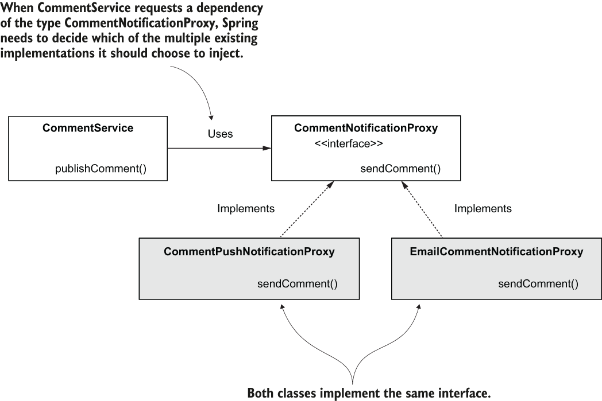

> **Hình 4.9** Đôi khi, trong các kịch bản thực tế, chúng ta có nhiều implementation của cùng một interface. Khi dùng dependency injection trên interface, bạn cần chỉ thị cho Spring biết nó nên inject implementation nào.

Giờ chúng ta muốn chứng minh rằng hai cách tiếp cận này cũng hoạt động với abstraction. Hãy thêm một class mới, `CommentPushNotificationProxy` (triển khai interface `CommentNotificationProxy`), vào ứng dụng và kiểm tra lần lượt từng cách tiếp cận, như trình bày trong listing sau. Để giữ các ví dụ tách biệt, tôi đã tạo một dự án mới tên là "sq-ch4-ex5". Tôi bắt đầu ví dụ này với code trong dự án "sq-ch4-ex2".

**Listing 4.13** Một implementation mới của interface `CommentNotificationProxy`

```java
@Component
public class CommentPushNotificationProxy
     implements CommentNotificationProxy {                 ❶

     @Override
     public void sendComment(Comment comment) {
       System.out.println(
         "Sending push notification for comment: "
              + comment.getText());
     }
}
```

❶ Class này triển khai interface `CommentNotificationProxy`

Nếu bạn chạy ứng dụng này như hiện tại, bạn sẽ nhận được một exception vì Spring không biết chọn bean nào trong hai bean trong context của nó để inject. Tôi đã trích phần thú vị nhất của thông báo exception trong đoạn mã tiếp theo. Exception nêu rõ vấn đề mà Spring gặp phải. Như bạn thấy, đó là một `NoUniqueBeanDefinitionException` với thông báo "expected single matching but found 2." Đây là cách framework cho chúng ta biết nó cần được hướng dẫn về việc nên inject bean nào trong số các bean hiện có từ context:

```text
Caused by: org.springframework.beans.factory.NoUniqueBeanDefinitionException:
No qualifying bean of type 'proxies.CommentNotificationProxy' available: expected single matching bean but found 2:
commentPushNotificationProxy,emailCommentNotificationProxy
```

#### Đánh dấu một implementation làm mặc định cho injection với @Primary

Giải pháp đầu tiên là dùng `@Primary`. Điều duy nhất bạn cần làm là thêm `@Primary` bên cạnh annotation `@Component` để đánh dấu implementation do class này cung cấp làm implementation mặc định, như trình bày trong listing sau.

**Listing 4.14** Dùng `@Primary` để đánh dấu implementation làm mặc định

```java
@Component
@Primary                                                 ❶
public class CommentPushNotificationProxy
    implements CommentNotificationProxy {

    @Override
    public void sendComment(Comment comment) {
      System.out.println(
        "Sending push notification for comment: "
             + comment.getText());
    }
}
```

❶ Dùng `@Primary`, chúng ta đánh dấu implementation này làm mặc định cho dependency injection.

Chỉ với thay đổi nhỏ này, ứng dụng của bạn có một kết quả thân thiện hơn, như trình bày trong đoạn mã tiếp theo. Hãy để ý rằng Spring quả thực đã inject implementation do class mới tạo cung cấp:

```text
Storing comment: Demo comment
Sending push notification for comment: Demo comment                       ❶
```

❶ Spring đã inject implementation mới vì chúng ta đánh dấu nó là primary.

Câu hỏi tôi thường nghe vào lúc này là: "Giờ chúng ta có hai implementation, nhưng Spring sẽ luôn chỉ inject một trong số chúng? Vậy có cả hai class để làm gì trong trường hợp này?"

Hãy thảo luận xem làm thế nào bạn có thể rơi vào tình huống như vậy trong một kịch bản thực tế. Như bạn đã biết, các ứng dụng rất phức tạp và dùng rất nhiều dependency. Có thể, tại một thời điểm nào đó, bạn dùng một dependency cung cấp một implementation cho một interface cụ thể (hình 4.10), nhưng implementation được cung cấp không phù hợp với ứng dụng của bạn, và bạn chọn định nghĩa implementation tùy chỉnh của riêng mình. Khi đó, `@Primary` là giải pháp đơn giản nhất cho bạn.

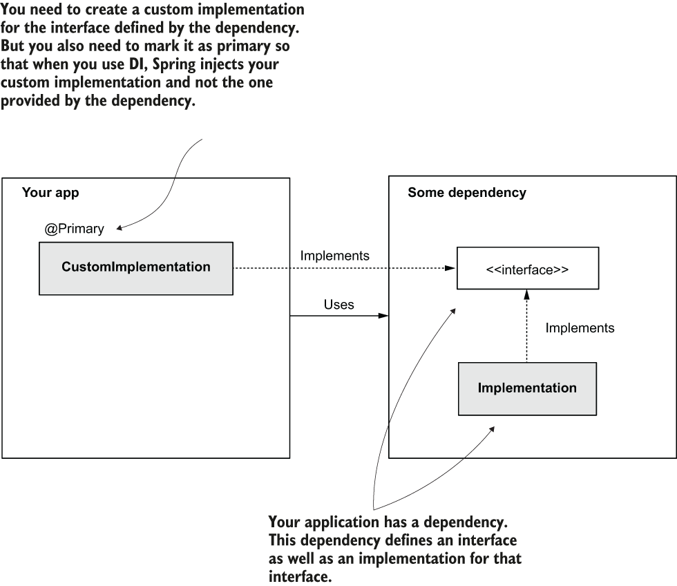

> **Hình 4.10** Đôi khi bạn dùng các dependency đã cung cấp sẵn implementation cho những interface cụ thể. Khi bạn cần có implementation tùy chỉnh của các interface đó, bạn có thể dùng `@Primary` để đánh dấu implementation của mình làm mặc định cho DI. Bằng cách này, Spring biết inject implementation mà bạn định nghĩa chứ không phải implementation do dependency cung cấp.

#### Đặt tên implementation cho dependency injection với @Qualifier

Đôi khi, trong các ứng dụng production, bạn cần định nghĩa nhiều implementation của cùng một interface, và các đối tượng khác nhau dùng các implementation này. Hãy tưởng tượng chúng ta cần có hai implementation cho việc thông báo bình luận: qua email hoặc qua push notification (hình 4.11). Chúng vẫn là các implementation của cùng một interface, nhưng chúng phụ thuộc vào các đối tượng khác nhau trong ứng dụng.

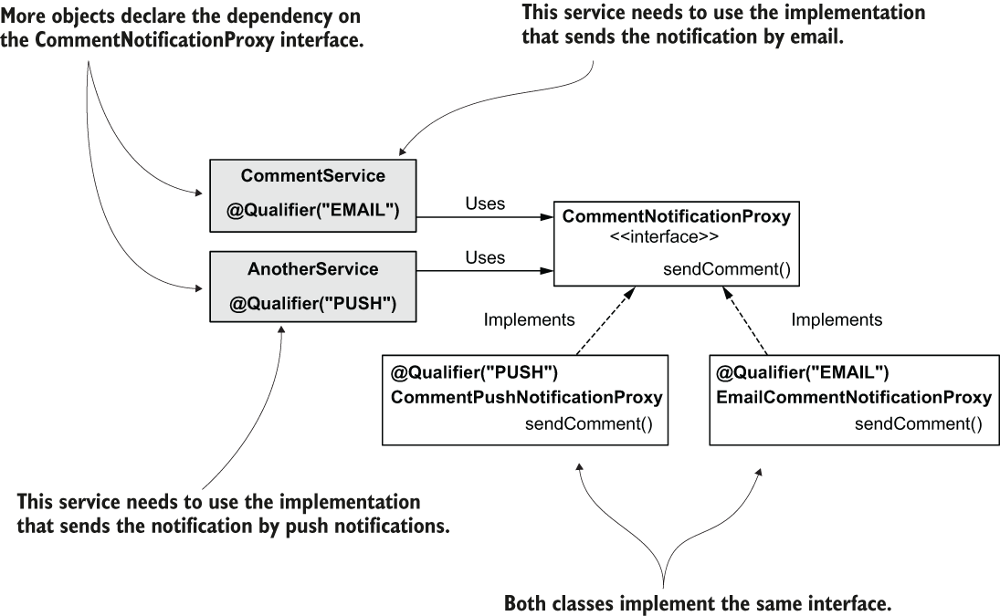

> **Hình 4.11** Nếu các đối tượng khác nhau cần dùng các implementation khác nhau của cùng một contract, chúng ta có thể dùng `@Qualifier` để đặt tên cho chúng và cho Spring biết cần inject cái gì và ở đâu.

Hãy thay đổi code để kiểm tra cách tiếp cận này. Bạn có thể tìm thấy phần cài đặt này trong dự án "sq-ch4-ex6". Các đoạn mã sau cho bạn thấy cách dùng annotation `@Qualifier` để đặt tên cho các implementation cụ thể.

Class `CommentPushNotification`:

```java
@Component
@Qualifier("PUSH")                                         ❶
public class CommentPushNotificationProxy
    implements CommentNotificationProxy {
    // Omitted code
}
```

❶ Dùng `@Qualifier`, chúng ta đặt tên implementation này là "PUSH".

Class `EmailCommentNotificationProxy`:

```java
@Component
@Qualifier("EMAIL")                                        ❶
public class EmailCommentNotificationProxy
    implements CommentNotificationProxy {
    // Omitted code
}
```

❶ Dùng `@Qualifier`, chúng ta đặt tên implementation này là "EMAIL".

Khi bạn muốn Spring inject một trong hai implementation này, bạn chỉ cần chỉ định tên của implementation bằng cách dùng lại annotation `@Qualifier`. Trong listing tiếp theo, bạn sẽ thấy cách inject một implementation cụ thể làm dependency của đối tượng `CommentService`.

**Listing 4.15** Chỉ định implementation mà Spring cần inject bằng `@Qualifier`

```java
@Component
public class CommentService {

    private final CommentRepository commentRepository;

    private final CommentNotificationProxy commentNotificationProxy;

    public CommentService(                                  ❶
        CommentRepository commentRepository,
        @Qualifier("PUSH") CommentNotificationProxy commentNotificationProxy) {

        this.commentRepository = commentRepository;
        this.commentNotificationProxy = commentNotificationProxy;
    }

    // Omitted code
}
```

❶ Với mỗi tham số mà chúng ta muốn dùng một implementation cụ thể, chúng ta chú thích tham số đó bằng `@Qualifier`.

Spring inject dependency mà bạn đã chỉ định bằng `@Qualifier` khi bạn chạy ứng dụng. Hãy quan sát kết quả trên console:

```text
Storing comment: Demo comment
Sending push notification for comment: Demo comment                        ❶
```

❶ Hãy để ý rằng Spring đã inject implementation cho push notification.

## 4.3 Tập trung vào trách nhiệm của đối tượng với các stereotype annotation

Cho tới giờ, khi thảo luận về stereotype annotation, chúng ta mới chỉ dùng `@Component` trong các ví dụ. Nhưng với các implementation thực tế, bạn sẽ thấy các lập trình viên đôi khi dùng các annotation khác cho cùng mục đích. Trong mục này, tôi sẽ chỉ cho bạn cách dùng thêm hai stereotype annotation nữa: `@Service` và `@Repository`.

Trong các dự án thực tế, một thực hành phổ biến là định nghĩa mục đích của component một cách tường minh bằng stereotype annotation. Dùng `@Component` là chung chung và không cho bạn biết chi tiết gì về trách nhiệm của đối tượng bạn đang cài đặt. Nhưng các lập trình viên thường dùng các đối tượng với một số trách nhiệm đã biết. Hai trong số các trách nhiệm chúng ta đã thảo luận ở mục 4.1 là service và repository.

Các service là những đối tượng có trách nhiệm triển khai các use case, trong khi các repository là những đối tượng quản lý việc lưu trữ bền vững (persistence) dữ liệu. Vì những trách nhiệm này rất phổ biến trong các dự án, và chúng quan trọng trong thiết kế class, việc có một cách đánh dấu riêng biệt cho chúng giúp lập trình viên hiểu rõ hơn thiết kế của ứng dụng.

Spring cung cấp cho chúng ta annotation `@Service` để đánh dấu một component đảm nhận trách nhiệm của một service, và annotation `@Repository` để đánh dấu một component triển khai trách nhiệm repository (hình 4.12). Cả ba (`@Component`, `@Service` và `@Repository`) đều là stereotype annotation và chỉ thị cho Spring tạo và thêm một instance của class được chú thích vào context của nó.

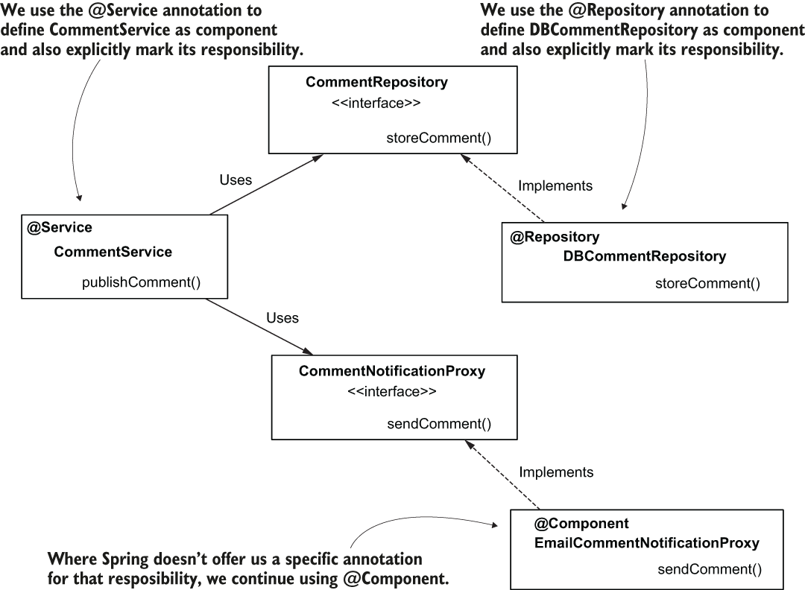

> **Hình 4.12** Chúng ta dùng các annotation `@Service` và `@Repository` để đánh dấu tường minh trách nhiệm của các component trong thiết kế class. Ở những nơi Spring không cung cấp annotation cụ thể cho trách nhiệm đó, chúng ta tiếp tục dùng `@Component`.

Trong các ví dụ của chương này, bạn sẽ đánh dấu class `CommentService` bằng `@Service` thay vì `@Component`. Bằng cách này, bạn đánh dấu tường minh trách nhiệm của đối tượng và làm cho khía cạnh này dễ thấy hơn với bất kỳ lập trình viên nào đọc class. Đoạn mã tiếp theo cho thấy class này được chú thích bằng stereotype annotation `@Service`:

```java
@Service                              ❶
public class CommentService {
    // Omitted code
}
```

❶ Chúng ta dùng `@Service` để định nghĩa đối tượng này là một component có trách nhiệm của service.

Tương tự, bạn đánh dấu tường minh trách nhiệm của class repository bằng annotation `@Repository`:

```java
@Repository                                                               ❶
public class DBCommentRepository implements CommentRepository {
  // Omitted code
}
```

❶ Chúng ta dùng `@Repository` để định nghĩa đối tượng này là một component có trách nhiệm của repository.

Bạn có thể tìm thấy ví dụ này ("sq-ch4-ex7") trong các dự án đi kèm với sách.

## Tóm tắt

- Tách rời các implementation thông qua abstraction là một thực hành tốt khi triển khai một thiết kế class. Việc tách rời các đối tượng giúp các implementation dễ thay đổi mà không ảnh hưởng tới quá nhiều phần của ứng dụng. Khía cạnh này giúp ứng dụng của bạn dễ mở rộng và bảo trì hơn.
- Trong Java, chúng ta dùng interface để tách rời các implementation. Chúng ta cũng nói rằng chúng ta định nghĩa contract giữa các implementation thông qua interface.
- Khi dùng abstraction với dependency injection, Spring biết tìm một bean được tạo từ một implementation của abstraction được yêu cầu.
- Bạn dùng stereotype annotation trên những class mà Spring cần tạo instance và thêm các instance đó làm bean vào context của nó. Bạn không bao giờ dùng stereotype annotation trên interface.
- Khi Spring context có nhiều bean được tạo từ nhiều implementation của cùng một abstraction, để chỉ thị cho Spring biết inject bean nào, bạn có thể
  - dùng annotation `@Primary` để đánh dấu một trong số chúng làm mặc định, hoặc
  - dùng annotation `@Qualifier` để đặt tên cho bean rồi chỉ thị cho Spring inject bean đó theo tên.
- Khi chúng ta có các component với trách nhiệm service, chúng ta dùng stereotype annotation `@Service` thay vì `@Component`. Tương tự, khi một component có trách nhiệm repository, chúng ta dùng stereotype annotation `@Repository` thay vì `@Component`. Bằng cách này, chúng ta đánh dấu tường minh trách nhiệm của component và làm cho thiết kế class dễ đọc, dễ hiểu hơn.
