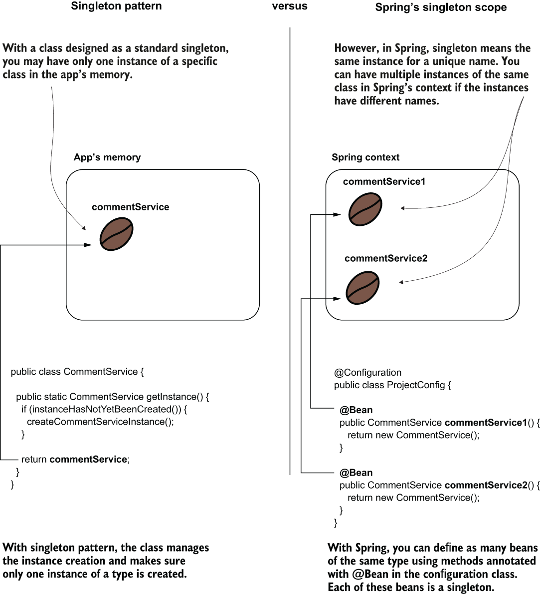
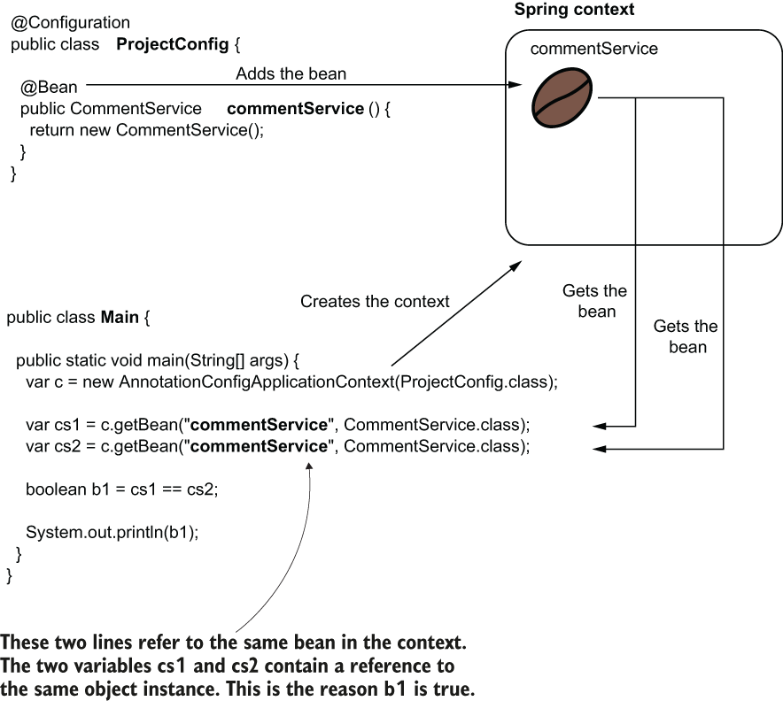
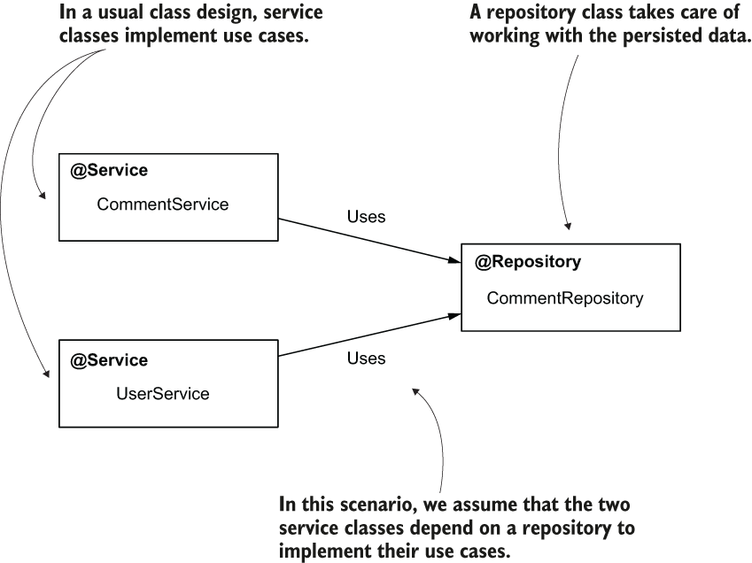
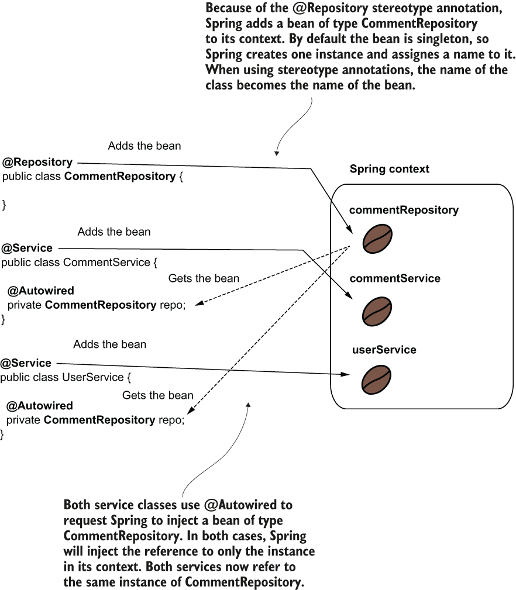
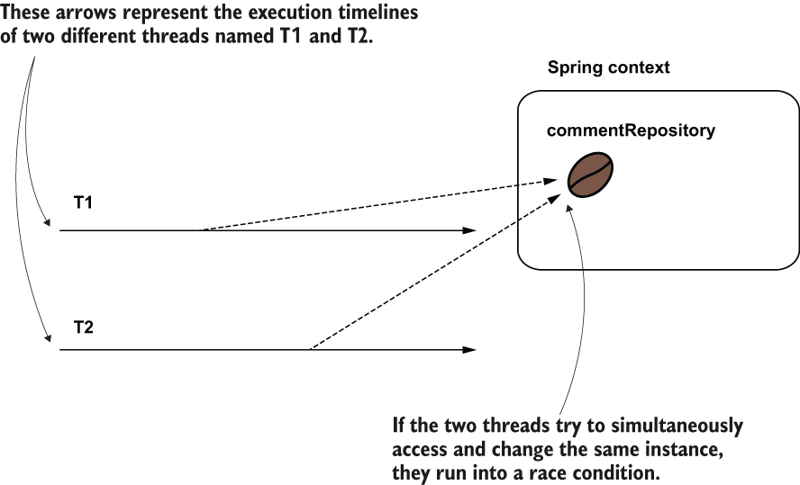
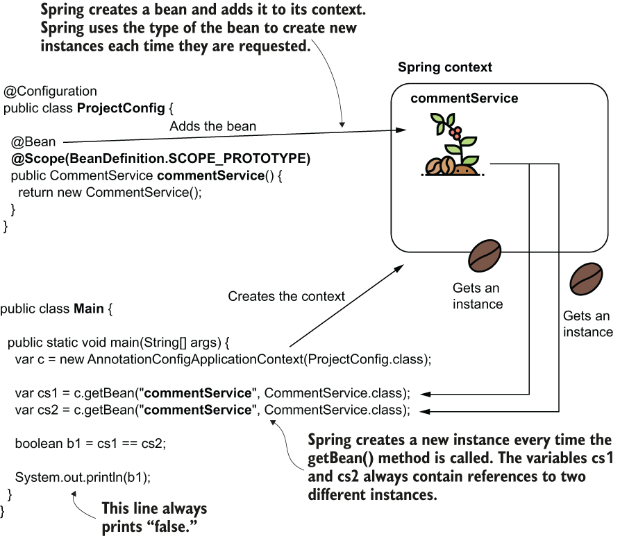
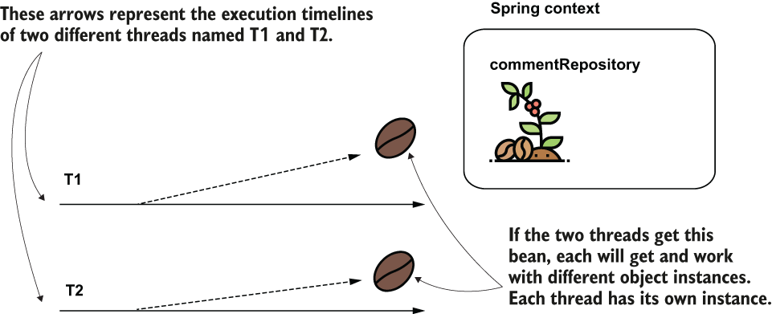
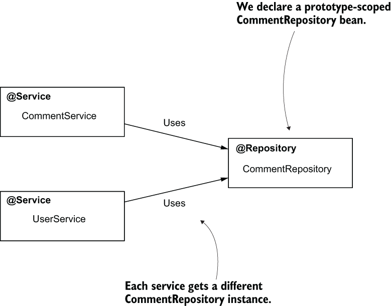
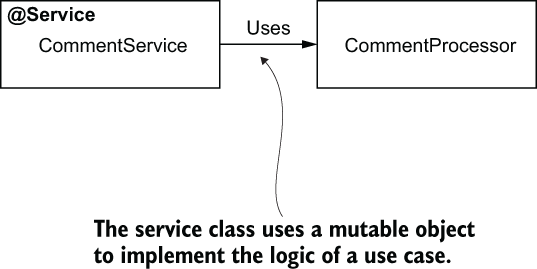
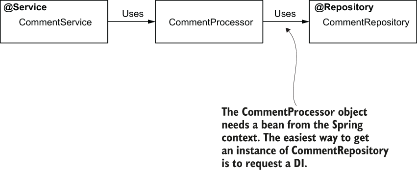

# 5 Spring context: Bean scope và vòng đời

**Chương này bao gồm**

- Sử dụng singleton bean scope
- Sử dụng khởi tạo eager và lazy cho singleton bean
- Sử dụng prototype bean scope

Đến giờ chúng ta đã bàn về một số điều thiết yếu liên quan đến các object instance được Spring quản lý (bean). Chúng ta đã đề cập các cú pháp quan trọng bạn cần biết để tạo bean, và đã bàn về việc thiết lập quan hệ giữa các bean (bao gồm cả sự cần thiết của việc dùng abstraction). Nhưng chúng ta chưa tập trung vào việc Spring tạo bean như thế nào và khi nào. Từ góc độ này, chúng ta mới chỉ dựa vào các cách tiếp cận mặc định của framework.

Tôi chọn không bàn về khía cạnh này sớm hơn trong sách vì tôi muốn bạn tập trung vào các cú pháp bạn sẽ cần ngay trong project của mình. Tuy nhiên, các tình huống trong ứng dụng production rất phức tạp, và đôi khi chỉ dựa vào hành vi mặc định của framework là không đủ. Vì lý do này, trong chương này chúng ta cần đi sâu hơn một chút vào cách Spring quản lý các bean trong context của nó.

Spring có nhiều cách tiếp cận khác nhau để tạo bean và quản lý vòng đời của chúng, và trong thế giới Spring chúng ta gọi các cách tiếp cận này là scope. Trong chương này, chúng ta bàn về hai scope bạn sẽ thường gặp trong các ứng dụng Spring: singleton và prototype.

> **LƯU Ý** Sau này, trong chương 9, chúng ta sẽ bàn thêm ba bean scope nữa áp dụng cho ứng dụng web: request, session và application.

Singleton là scope mặc định của bean trong Spring, và đó là thứ chúng ta đã dùng cho đến giờ. Trong mục 5.1, chúng ta bàn về singleton bean scope. Trước hết chúng ta sẽ xem Spring quản lý singleton bean như thế nào, rồi bàn về những điều thiết yếu bạn cần biết khi dùng singleton scope trong ứng dụng thực tế.

Trong mục 5.2, chúng ta tiếp tục bằng việc bàn về prototype bean scope. Trọng tâm sẽ là prototype scope khác singleton như thế nào và các tình huống thực tế mà bạn cần áp dụng cái này hay cái kia.

## 5.1 Sử dụng singleton bean scope

Singleton bean scope định nghĩa cách tiếp cận mặc định của Spring để quản lý các bean trong context. Đây cũng là bean scope bạn sẽ gặp nhiều nhất trong các ứng dụng production.

Trong mục 5.1.1, chúng ta bắt đầu thảo luận bằng việc học cách Spring tạo và quản lý singleton bean, điều thiết yếu để hiểu bạn nên dùng chúng ở đâu. Với mục đích này, chúng ta sẽ lấy hai ví dụ dùng các cách khác nhau mà bạn có thể dùng để định nghĩa bean (đã học ở chương 2) và phân tích hành vi của Spring với các bean này. Sau đó chúng ta sẽ bàn (trong mục 5.1.2) về các khía cạnh quan trọng của việc dùng singleton bean trong các tình huống thực tế. Chúng ta kết thúc mục này bằng việc bàn về hai cách khởi tạo singleton bean (eager và lazy) và nơi bạn nên dùng chúng trong các ứng dụng production.

### 5.1.1 Singleton bean hoạt động như thế nào

Hãy bắt đầu với hành vi của Spring khi quản lý các bean có scope singleton. Bạn cần biết điều gì sẽ xảy ra khi dùng scope này, đặc biệt vì singleton là bean scope mặc định (và được dùng nhiều nhất) trong Spring. Trong mục này, tôi sẽ mô tả mối liên hệ giữa code bạn viết và Spring context để hành vi của Spring trở nên dễ hiểu. Sau đó chúng ta sẽ kiểm chứng hành vi này bằng vài ví dụ.

Spring tạo một singleton bean khi nó nạp context và gán cho bean một tên (đôi khi còn gọi là bean ID). Chúng ta gọi scope này là singleton vì bạn luôn nhận được cùng một instance khi tham chiếu đến một bean cụ thể. Nhưng hãy cẩn thận! Bạn có thể có nhiều instance cùng kiểu trong Spring context nếu chúng có tên khác nhau. Tôi nhấn mạnh khía cạnh này vì có thể bạn đã biết và từng dùng design pattern "singleton" trước đây. Nếu bạn không biết singleton design pattern, bạn sẽ không bị nhầm lẫn và có thể bỏ qua đoạn tiếp theo.

Nhưng nếu bạn biết singleton pattern là gì, cách nó hoạt động trong Spring có thể trông lạ với bạn, vì trong pattern đó bạn chỉ có một instance của một kiểu trong ứng dụng. Với Spring, khái niệm singleton cho phép nhiều instance cùng kiểu, và singleton có nghĩa là duy nhất theo tên chứ không phải duy nhất trong ứng dụng (hình 5.1).



> **Hình 5.1** Khi ai đó nói đến một singleton class trong ứng dụng, họ muốn nói đến một class chỉ cung cấp một instance duy nhất cho ứng dụng và quản lý việc tạo instance đó. Tuy nhiên, trong Spring, singleton không có nghĩa là context chỉ có một instance của kiểu đó. Nó chỉ có nghĩa là một tên được gán cho instance, và cùng một instance sẽ luôn được tham chiếu thông qua tên đó.

**KHAI BÁO BEAN CÓ SCOPE SINGLETON BẰNG @BEAN**

Hãy minh họa hành vi của singleton bean bằng một ví dụ dùng annotation `@Bean` để thêm một instance vào Spring context, rồi đơn giản tham chiếu đến nó nhiều lần trong class main. Chúng ta làm vậy để chứng minh rằng chúng ta nhận được cùng một instance mỗi lần tham chiếu đến bean.

Hình 5.2 là biểu diễn trực quan của context bên cạnh đoạn code cấu hình nó. Hạt cà phê (coffee bean) trong hình đại diện cho instance mà Spring thêm vào context. Hãy quan sát rằng context chỉ chứa một instance (hạt cà phê) với một tên gắn kèm. Như đã bàn ở chương 2, khi dùng cách annotation `@Bean` để thêm bean vào context, tên của method được đánh dấu `@Bean` trở thành tên của bean.



> **Hình 5.2** Một singleton bean. Ứng dụng khởi tạo context khi bắt đầu và thêm một bean. Trong trường hợp này, chúng ta dùng cách annotation @Bean để khai báo bean. Tên của method trở thành định danh của bean. Ở bất cứ đâu bạn dùng định danh đó, bạn nhận được tham chiếu đến cùng một instance.

Trong ví dụ này, tôi dùng cách annotation `@Bean` để thêm bean vào Spring context. Nhưng tôi không muốn bạn nghĩ rằng singleton bean chỉ có thể được tạo bằng annotation `@Bean`. Kết quả sẽ giống hệt nếu chúng ta dùng stereotype annotation (như `@Component`) để thêm bean vào context. Chúng ta sẽ chứng minh điều này với ví dụ tiếp theo.

Ngoài ra, hãy lưu ý rằng tôi đã dùng tường minh tên bean khi lấy bean từ Spring context trong minh họa này. Bạn đã học ở chương 2 rằng khi chỉ có một bean của một loại trong Spring context, bạn không cần dùng tên của nó nữa. Bạn có thể lấy bean đó theo kiểu. Trong ví dụ này, tôi dùng tên chỉ để nhấn mạnh rằng chúng ta tham chiếu đến cùng một bean. Như đã bàn ở chương 2, tôi có thể chỉ tham chiếu theo kiểu, và trong cả hai trường hợp lấy bean từ context chúng ta đều nhận được tham chiếu đến cùng một (và duy nhất) instance của `CommentService` trong context.

Hãy viết code và chạy nó để kết thúc ví dụ này. Bạn có thể tìm thấy ví dụ này trong project tên là "sq-ch5-ex1". Chúng ta cần định nghĩa một class `CommentService` rỗng, như trong đoạn code tiếp theo. Sau đó bạn viết class cấu hình và class main, như trình bày trong hình 5.2:

```java
public class CommentService {
}
```

Trong listing tiếp theo, bạn thấy định nghĩa class cấu hình, dùng một method được đánh dấu `@Bean` để thêm một instance kiểu `CommentService` vào Spring context.

**Listing 5.1** Thêm một bean vào Spring context

```java
@Configuration
public class ProjectConfig {

    @Bean                                                    ❶
    public CommentService commentService() {
        return new CommentService();
    }
}
```

❶ Thêm bean `CommentService` vào Spring context

Trong listing tiếp theo, bạn thấy class `Main` chúng ta dùng để kiểm chứng hành vi của Spring với singleton bean. Chúng ta lấy tham chiếu đến bean `CommentService` hai lần, và mong đợi nhận được cùng một tham chiếu mỗi lần.

**Listing 5.2** Class Main dùng để kiểm chứng hành vi của Spring với singleton bean

```java
public class Main {

    public static void main(String[] args) {
        var c = new AnnotationConfigApplicationContext(ProjectConfig.class);

        var cs1 = c.getBean("commentService", CommentService.class);
        var cs2 = c.getBean("commentService", CommentService.class);

        boolean b1 = cs1 == cs2;               ❶

        System.out.println(b1);
    }
}
```

❶ Vì hai biến giữ cùng một tham chiếu, kết quả của phép toán này là `true`.

Chạy ứng dụng sẽ in "true" ra console vì, là một singleton bean, Spring trả về cùng một tham chiếu mỗi lần.

**KHAI BÁO SINGLETON BEAN BẰNG STEREOTYPE ANNOTATION**

Như đã đề cập, hành vi của Spring với singleton bean không có gì khác khi dùng stereotype annotation so với khi bạn khai báo chúng bằng annotation `@Bean`. Nhưng trong mục này, tôi muốn củng cố phát biểu này bằng một ví dụ.

Xét một tình huống thiết kế class trong đó hai class service phụ thuộc vào một repository. Giả sử chúng ta có cả `CommentService` và `UserService` đều phụ thuộc vào một repository tên là `CommentRepository`, như trình bày trong hình 5.3.



> **Hình 5.3** Một tình huống thiết kế class. Hai class service phụ thuộc vào một repository để triển khai các use case của chúng. Khi được thiết kế là singleton bean, Spring context sẽ có một instance của mỗi class này.

Lý do các class này phụ thuộc lẫn nhau không quan trọng, và các service của chúng ta sẽ không làm gì cả (đây chỉ là một tình huống giả định). Chúng ta giả sử thiết kế class này là một phần của một ứng dụng phức tạp hơn, và chúng ta tập trung vào mối quan hệ giữa các bean và cách Spring thiết lập các liên kết trong context. Hình 5.4 là biểu diễn trực quan của context bên cạnh đoạn code cấu hình nó.



> **Hình 5.4** Các bean cũng có scope singleton khi dùng stereotype annotation để tạo chúng. Khi dùng @Autowired để yêu cầu Spring inject một tham chiếu bean, framework inject tham chiếu đến singleton bean vào tất cả những nơi được yêu cầu.

Hãy chứng minh hành vi này bằng cách tạo ba class và so sánh các tham chiếu mà Spring inject vào các service bean. Spring inject cùng một tham chiếu vào cả hai service bean. Trong đoạn code sau, bạn thấy định nghĩa của class `CommentRepository` (project "sq-ch5-ex2"):

```java
@Repository
public class CommentRepository {
}
```

Đoạn code tiếp theo trình bày định nghĩa của class `CommentService`. Hãy quan sát rằng tôi dùng `@Autowired` để chỉ thị Spring inject một instance kiểu `CommentRepository` vào một thuộc tính khai báo trong class. Tôi cũng định nghĩa một method getter mà tôi dự định dùng sau này để chứng minh Spring inject cùng một tham chiếu đối tượng vào cả hai service bean:

```java
@Service
public class CommentService {

    @Autowired
    private CommentRepository commentRepository;

    public CommentRepository getCommentRepository() {
      return commentRepository;
    }
}
```

Theo cùng logic với `CommentService`, class `UserService` được định nghĩa trong đoạn code tiếp theo:

```java
@Service
public class UserService {

    @Autowired
    private CommentRepository commentRepository;

    public CommentRepository getCommentRepository() {
        return commentRepository;
    }
}
```

Không giống ví dụ đầu tiên trong mục này, class cấu hình vẫn rỗng trong project này. Chúng ta chỉ cần nói cho Spring biết nơi tìm các class được đánh dấu bằng stereotype annotation. Như đã bàn ở chương 2, để nói cho Spring biết nơi tìm các class được đánh dấu bằng stereotype annotation, chúng ta dùng annotation `@ComponentScan`. Định nghĩa của class cấu hình nằm trong đoạn code tiếp theo:

```java
@Configuration
@ComponentScan(basePackages = {"services", "repositories"})
public class ProjectConfig {

}
```

Trong class `Main`, chúng ta lấy tham chiếu của hai service, và so sánh các dependency của chúng để chứng minh rằng Spring đã inject cùng một instance vào cả hai. Listing sau trình bày class main.

**Listing 5.3** Kiểm chứng hành vi của Spring khi inject singleton bean trong class Main

```java
public class Main {

    public static void main(String[] args) {
      var c = new AnnotationConfigApplicationContext(                      ❶
          ProjectConfig.class);

        var s1 = c.getBean(CommentService.class);                          ❷
        var s2 = c.getBean(UserService.class);                             ❷

        boolean b =                                                        ❸
          s1.getCommentRepository() == s2.getCommentRepository();

        System.out.println(b);                                             ❹
    }
}
```

❶ Tạo Spring context dựa trên class cấu hình

❷ Lấy tham chiếu của hai service bean trong Spring context

❸ So sánh các tham chiếu của dependency repository mà Spring đã inject

❹ Vì dependency (`CommentRepository`) là singleton, cả hai service chứa cùng một tham chiếu, nên dòng này luôn in "true".

### 5.1.2 Singleton bean trong các tình huống thực tế

Đến giờ chúng ta đã bàn về cách Spring quản lý singleton bean. Đã đến lúc cũng bàn về những điều bạn cần lưu ý khi làm việc với singleton bean. Hãy bắt đầu bằng việc xem xét một số tình huống mà bạn nên hoặc không nên dùng singleton bean.

Vì singleton bean scope giả định rằng nhiều thành phần của ứng dụng có thể chia sẻ một object instance, điều quan trọng nhất cần cân nhắc là các bean này phải bất biến (immutable). Thường thì một ứng dụng thực tế thực thi các hành động trên nhiều thread (ví dụ, bất kỳ ứng dụng web nào). Trong tình huống như vậy, nhiều thread chia sẻ cùng một object instance. Nếu các thread này thay đổi instance, bạn gặp phải tình huống race condition (hình 5.5).



> **Hình 5.5** Khi nhiều thread truy cập một singleton bean, chúng truy cập cùng một instance. Nếu các thread này cố thay đổi instance đồng thời, chúng rơi vào race condition. Race condition gây ra kết quả không mong đợi hoặc exception khi thực thi nếu bean không được thiết kế cho xử lý đồng thời.

Race condition là tình huống có thể xảy ra trong các kiến trúc đa luồng khi nhiều thread cố thay đổi một tài nguyên dùng chung. Trong trường hợp race condition, lập trình viên cần đồng bộ hóa các thread đúng cách để tránh kết quả thực thi không mong đợi hoặc lỗi.

Nếu bạn muốn singleton bean khả biến (mutable, có thuộc tính thay đổi), bạn cần tự làm cho các bean này an toàn khi truy cập đồng thời (chủ yếu bằng cách dùng đồng bộ hóa thread). Nhưng singleton bean không được thiết kế để đồng bộ hóa. Chúng thường được dùng để định nghĩa thiết kế class xương sống của ứng dụng và ủy quyền trách nhiệm cho nhau. Về mặt kỹ thuật, đồng bộ hóa là khả thi, nhưng đó không phải thực hành tốt. Đồng bộ hóa thread trên một instance dùng chung có thể ảnh hưởng nghiêm trọng đến hiệu năng của ứng dụng. Trong hầu hết các trường hợp, bạn sẽ tìm được cách khác để giải quyết cùng vấn đề và tránh xử lý đồng thời trên thread.

Bạn có nhớ cuộc thảo luận ở chương 3, khi tôi nói với bạn rằng DI qua constructor là thực hành tốt và được ưu tiên hơn inject qua field? Một trong những ưu điểm của inject qua constructor là nó cho phép bạn làm instance bất biến (định nghĩa các field của bean là `final`). Trong ví dụ trước, chúng ta có thể cải thiện định nghĩa của class `CommentService` bằng cách thay inject qua field bằng inject qua constructor. Một thiết kế tốt hơn của class sẽ trông như đoạn code sau:

```java
@Service
public class CommentService {
          private final CommentRepository commentRepository;                       ❶

          public CommentService(CommentRepository commentRepository) {
            this.commentRepository = commentRepository;
          }

          public CommentRepository getCommentRepository() {
              return commentRepository;
          }
      }
```

❶ Đặt field là `final` nhấn mạnh rằng field này không được thiết kế để thay đổi.

> **Việc dùng bean quy về ba điểm**
>
> - Chỉ biến một đối tượng thành bean trong Spring context nếu bạn cần Spring quản lý nó để framework có thể bổ sung cho bean đó một khả năng cụ thể. Nếu đối tượng không cần bất kỳ khả năng nào mà framework cung cấp, bạn không cần biến nó thành bean.
> - Nếu bạn cần biến một đối tượng thành bean trong Spring context, nó chỉ nên là singleton nếu nó bất biến. Tránh thiết kế singleton bean khả biến.
> - Nếu một bean cần khả biến, một lựa chọn có thể là dùng prototype scope, điều chúng ta sẽ bàn trong mục 5.2.

### 5.1.3 Sử dụng khởi tạo eager và lazy

Trong hầu hết các trường hợp, Spring tạo tất cả singleton bean khi nó khởi tạo context; đây là hành vi mặc định của Spring. Chúng ta mới chỉ dùng hành vi mặc định này, còn được gọi là khởi tạo eager (eager instantiation). Trong mục này, chúng ta bàn về một cách tiếp cận khác của framework, khởi tạo lazy (lazy instantiation), và so sánh hai cách tiếp cận này. Với khởi tạo lazy, Spring không tạo các singleton instance khi nó tạo context. Thay vào đó, nó tạo mỗi instance vào lần đầu tiên có ai đó tham chiếu đến bean. Hãy lấy một ví dụ để quan sát sự khác biệt giữa hai cách tiếp cận, rồi bàn về ưu và nhược điểm của việc dùng chúng trong ứng dụng production.

Trong tình huống ban đầu, chúng ta chỉ cần một bean để kiểm chứng khởi tạo mặc định (eager) (project "sq-ch5-ex3"). Tôi sẽ giữ cách đặt tên chúng ta vẫn dùng, và tôi sẽ đặt tên class này là `CommentService`. Bạn biến class này thành bean, bằng cách annotation `@Bean` hoặc stereotype annotation, như tôi làm trong đoạn code tiếp theo. Nhưng dù cách nào, hãy chắc chắn thêm một dòng xuất ra console trong constructor của class. Bằng cách này, chúng ta sẽ dễ dàng quan sát framework có gọi nó hay không:

```java
@Service
public class CommentService {

    public CommentService() {
        System.out.println("CommentService instance created!");
    }
}
```

Nếu bạn dùng stereotype annotation, đừng quên thêm annotation `@ComponentScan` vào class cấu hình. Class cấu hình của tôi trong đoạn code tiếp theo:

```java
@Configuration
@ComponentScan(basePackages = {"services"})
public class ProjectConfig {

}
```

Trong class `Main`, chúng ta chỉ khởi tạo Spring context. Một khía cạnh quan trọng cần quan sát là không ai dùng bean `CommentService`. Tuy nhiên, Spring vẫn sẽ tạo và lưu instance trong context. Chúng ta biết Spring tạo instance vì chúng ta sẽ thấy dòng xuất từ constructor của class bean `CommentService` khi chạy ứng dụng. Đoạn code tiếp theo trình bày class `Main`:

```java
public class Main {

    public static void main(String[] args) {                            ❶
        var c = new AnnotationConfigApplicationContext(ProjectConfig.class);
    }
}
```

❶ Ứng dụng này tạo Spring context, nhưng không dùng bean `CommentService` ở bất cứ đâu.

Ngay cả khi ứng dụng không dùng bean ở bất cứ đâu, khi chạy ứng dụng bạn sẽ thấy dòng xuất sau trong console:

```text
CommentService instance created!
```

Giờ hãy thay đổi ví dụ (project "sq-ch5-ex4") bằng cách thêm annotation `@Lazy` phía trên class (với cách stereotype annotation) hoặc phía trên method `@Bean` (với cách method `@Bean`). Bạn sẽ thấy dòng xuất không còn xuất hiện trong console khi chạy ứng dụng, vì chúng ta đã chỉ thị Spring chỉ tạo bean khi có ai đó dùng nó. Và, trong ví dụ của chúng ta, không ai dùng bean `CommentService`.

```java
@Service
@Lazy                                   ❶
public class CommentService {

    public CommentService() {
        System.out.println("CommentService instance created!");
    }
}
```

❶ Annotation `@Lazy` nói cho Spring biết rằng nó chỉ cần tạo bean khi có ai đó tham chiếu đến bean lần đầu tiên.

Thay đổi class `Main` và thêm một tham chiếu đến bean `CommentService`, như trình bày trong đoạn code tiếp theo:

```java
public class Main {

    public static void main(String[] args) {
        var c = new AnnotationConfigApplicationContext(ProjectConfig.class);

        System.out.println("Before retrieving the CommentService");
        var service = c.getBean(CommentService.class);                        ❶
        System.out.println("After retrieving the CommentService");
    }
}
```

❶ Ở dòng này, nơi Spring cần cung cấp một tham chiếu đến bean `CommentService`, Spring cũng tạo instance.

Chạy lại ứng dụng, và bạn sẽ lại thấy dòng xuất trong console. Framework chỉ tạo bean nếu nó được dùng:

```text
Before retrieving the CommentService
CommentService instance created!
After retrieving the CommentService
```

Khi nào bạn nên dùng khởi tạo eager và khi nào nên dùng lazy? Trong hầu hết các trường hợp, sẽ thoải mái hơn khi để framework tạo tất cả các instance ngay từ đầu khi context được khởi tạo (eager); bằng cách này, khi một instance ủy quyền cho instance khác, bean thứ hai đã tồn tại trong mọi tình huống.

Trong khởi tạo lazy, framework phải kiểm tra trước xem instance có tồn tại không và tạo nó nếu chưa có, nên từ góc độ hiệu năng, tốt hơn là đã có sẵn các instance trong context (eager) vì điều đó tiết kiệm được một số bước kiểm tra mà framework cần làm khi một bean ủy quyền cho bean khác. Một ưu điểm khác của khởi tạo eager là khi có gì đó sai và framework không thể tạo một bean, chúng ta có thể nhận ra vấn đề này ngay khi khởi động ứng dụng. Với khởi tạo lazy, người ta chỉ nhận ra vấn đề khi ứng dụng đang chạy và đến đúng điểm mà bean cần được tạo.

Nhưng khởi tạo lazy không hoàn toàn xấu. Cách đây một thời gian, tôi làm việc trên một ứng dụng monolithic rất lớn. Ứng dụng này được cài đặt ở nhiều nơi khác nhau, nơi các khách hàng dùng nó với những phạm vi khác nhau. Trong hầu hết các trường hợp, một khách hàng cụ thể không dùng phần lớn chức năng, nên việc khởi tạo các bean cùng với Spring context chiếm nhiều bộ nhớ một cách không cần thiết. Với ứng dụng đó, các lập trình viên thiết kế hầu hết các bean để được khởi tạo lazy, nhờ đó ứng dụng chỉ tạo những instance cần thiết.

Lời khuyên của tôi là hãy đi theo mặc định, tức là khởi tạo eager. Cách này nhìn chung mang lại nhiều lợi ích hơn. Nếu bạn rơi vào tình huống như tôi đã trình bày với ứng dụng monolithic, trước hết hãy xem bạn có thể làm gì với thiết kế của ứng dụng. Thường thì nhu cầu dùng khởi tạo lazy là dấu hiệu cho thấy có gì đó chưa ổn trong thiết kế của ứng dụng. Ví dụ, trong câu chuyện của tôi, sẽ tốt hơn nếu ứng dụng được thiết kế theo hướng module hóa hoặc thành các microservice. Kiến trúc như vậy sẽ giúp các lập trình viên chỉ deploy những gì khách hàng cụ thể cần, và khi đó việc khởi tạo lazy các bean sẽ không cần thiết. Nhưng trong thực tế, không phải mọi thứ đều khả thi do các yếu tố khác như chi phí hay thời gian. Nếu bạn không thể xử lý nguyên nhân gốc của vấn đề, đôi khi bạn ít nhất có thể xử lý một số triệu chứng.

## 5.2 Sử dụng prototype bean scope

Trong mục này, chúng ta bàn về bean scope thứ hai mà Spring cung cấp: prototype. Trong một số trường hợp, mà chúng ta sẽ phân tích trong mục này, bạn sẽ chọn bean có scope prototype thay vì singleton. Chúng ta sẽ bàn về hành vi của framework với các bean được khai báo là prototype trong mục 5.2.1. Sau đó bạn sẽ học cách đổi scope của bean thành prototype, và chúng ta sẽ thử với vài ví dụ. Cuối cùng, trong mục 5.2.2, chúng ta sẽ bàn về các tình huống thực tế bạn cần biết khi dùng prototype scope.

### 5.2.1 Prototype bean hoạt động như thế nào

Hãy tìm hiểu hành vi của Spring khi quản lý prototype bean trước khi bàn về nơi bạn sẽ dùng chúng trong ứng dụng. Như bạn sẽ thấy, ý tưởng rất đơn giản. Mỗi lần bạn yêu cầu một tham chiếu đến một bean có scope prototype, Spring tạo một object instance mới. Với prototype bean, Spring không trực tiếp tạo và quản lý một object instance. Framework quản lý kiểu của đối tượng và tạo một instance mới mỗi lần có ai đó yêu cầu tham chiếu đến bean. Trong hình 5.6, tôi biểu diễn bean như một cây cà phê (mỗi lần bạn yêu cầu một bean, bạn nhận một instance mới). Chúng ta vẫn dùng thuật ngữ bean, nhưng tôi dùng cây cà phê vì tôi muốn giúp bạn nhanh chóng hiểu và ghi nhớ hành vi của Spring với prototype bean.



> **Hình 5.6** Chúng ta dùng annotation @Scope để đổi bean scope thành prototype. Bean giờ được biểu diễn như một cây cà phê vì bạn nhận một object instance mới mỗi lần tham chiếu đến nó. Vì lý do này, các biến cs1 và cs2 sẽ luôn chứa các tham chiếu khác nhau, nên đầu ra của code luôn là "false".

Như bạn thấy trong hình 5.6, chúng ta cần dùng một annotation mới tên là `@Scope` để đổi scope của bean. Khi bạn tạo bean bằng cách annotation `@Bean`, `@Scope` đi cùng `@Bean` phía trên method khai báo bean. Khi khai báo bean bằng stereotype annotation, bạn dùng annotation `@Scope` cùng với stereotype annotation phía trên class khai báo bean.

Với prototype bean, chúng ta không còn vấn đề xử lý đồng thời nữa vì mỗi thread yêu cầu bean nhận một instance khác nhau, nên định nghĩa prototype bean khả biến không phải là vấn đề (hình 5.7).



> **Hình 5.7** Khi nhiều thread yêu cầu một prototype bean nhất định, mỗi thread nhận một instance khác nhau. Bằng cách này, các thread không thể rơi vào race condition.

**KHAI BÁO BEAN CÓ SCOPE PROTOTYPE BẰNG @BEAN**

Để củng cố thảo luận, hãy viết một project ("sq-ch5-ex5") và chứng minh hành vi của Spring khi quản lý prototype bean. Chúng ta tạo một bean tên là `CommentService` và khai báo nó là prototype để chứng minh chúng ta nhận một instance mới mỗi lần yêu cầu bean đó. Đoạn code tiếp theo trình bày class `CommentService`:

```java
public class CommentService {
}
```

Chúng ta định nghĩa một bean với class `CommentService` trong class cấu hình, như trình bày trong listing sau.

**Listing 5.4** Khai báo prototype bean trong class cấu hình

```java
@Configuration
public class ProjectConfig {

    @Bean
    @Scope(BeanDefinition.SCOPE_PROTOTYPE)                ❶
    public CommentService commentService() {
         return new CommentService();
     }
}
```

❶ Đặt bean này có scope prototype

Để chứng minh rằng mỗi lần yêu cầu bean chúng ta nhận một instance mới, chúng ta tạo một class `Main` và yêu cầu bean hai lần từ context. Chúng ta quan sát thấy các tham chiếu nhận được là khác nhau. Bạn tìm thấy định nghĩa của class `Main` trong listing sau.

**Listing 5.5** Kiểm chứng hành vi của Spring với prototype bean trong class Main

```java
public class Main {

     public static void main(String[] args) {
       var c = new AnnotationConfigApplicationContext(ProjectConfig.class);

         var cs1 = c.getBean("commentService", CommentService.class);
         var cs2 = c.getBean("commentService", CommentService.class);

         boolean b1 = cs1 == cs2;         ❶

         System.out.println(b1);          ❷
     }
}
```

❶ Hai biến `cs1` và `cs2` chứa tham chiếu đến các instance khác nhau.

❷ Dòng này luôn in "false" ra console.

Khi bạn chạy ứng dụng, bạn sẽ thấy nó luôn hiển thị "false" trong console. Đầu ra này chứng minh rằng hai instance nhận được khi gọi method `getBean()` là khác nhau.

**KHAI BÁO BEAN CÓ SCOPE PROTOTYPE BẰNG STEREOTYPE ANNOTATION**

Hãy cũng tạo một project ("sq-ch5-ex6") để quan sát hành vi khi auto-wiring các bean có scope prototype. Chúng ta sẽ định nghĩa một prototype bean `CommentRepository`, và inject bean này bằng `@Autowired` vào hai service bean khác. Chúng ta sẽ thấy mỗi service bean có tham chiếu đến một instance `CommentRepository` khác nhau. Tình huống này tương tự ví dụ chúng ta dùng trong mục 5.1 cho các bean có scope singleton, nhưng giờ bean `CommentRepository` là prototype. Hình 5.8 mô tả quan hệ giữa các bean.



> **Hình 5.8** Mỗi class service yêu cầu một instance của CommentRepository. Vì CommentRepository là prototype bean, mỗi service nhận một instance CommentRepository khác nhau.

Đoạn code tiếp theo đưa ra định nghĩa của class `CommentRepository`. Hãy quan sát annotation `@Scope` được dùng phía trên class để đổi scope của bean thành prototype:

```java
@Repository
@Scope(BeanDefinition.SCOPE_PROTOTYPE)
public class CommentRepository {
}
```

Hai class service yêu cầu một instance kiểu `CommentRepository` bằng annotation `@Autowired`. Đoạn code tiếp theo trình bày class `CommentService`:

```java
@Service
public class CommentService {

  @Autowired
  private CommentRepository commentRepository;

  public CommentRepository getCommentRepository() {
        return commentRepository;
    }
}
```

Tương tự đoạn code trên, class `UserService` cũng yêu cầu một instance của bean `CommentRepository`. Trong class cấu hình, chúng ta cần dùng annotation `@ComponentScan` để nói cho Spring biết nơi tìm các class được đánh dấu bằng stereotype annotation:

```java
@Configuration
@ComponentScan(basePackages = {"services", "repositories"})
public class ProjectConfig {

}
```

Chúng ta thêm class `Main` vào project và kiểm tra cách Spring inject bean `CommentRepository`. Class `Main` được trình bày trong listing sau.

**Listing 5.6** Kiểm chứng hành vi của Spring khi inject prototype bean trong class Main

```java
public class Main {

    public static void main(String[] args) {
      var c = new AnnotationConfigApplicationContext(ProjectConfig.class);

        var s1 = c.getBean(CommentService.class);             ❶
        var s2 = c.getBean(UserService.class);                ❶

        boolean b =                                           ❷
          s1.getCommentRepository() == s2.getCommentRepository();

        System.out.println(b);
    }
}
```

❶ Lấy tham chiếu từ context cho các service bean

❷ So sánh các tham chiếu của các instance `CommentRepository` được inject. Vì `CommentRepository` là prototype bean, kết quả so sánh luôn là false.

### 5.2.2 Prototype bean trong các tình huống thực tế

Đến giờ chúng ta đã bàn về cách Spring quản lý prototype bean bằng cách tập trung vào hành vi. Trong mục này, chúng ta tập trung nhiều hơn vào các use case và nơi bạn nên dùng bean có scope prototype trong ứng dụng production. Giống như chúng ta đã làm với singleton trong mục 5.1.2, chúng ta sẽ xem xét các đặc tính đã bàn và phân tích prototype bean phù hợp với tình huống nào và bạn nên tránh chúng ở đâu (bằng cách dùng singleton bean).

Bạn sẽ không gặp prototype bean thường xuyên như singleton bean. Nhưng có một mẫu tốt bạn có thể dùng để quyết định một bean có nên là prototype hay không. Hãy nhớ rằng singleton bean không phải là bạn tốt của các đối tượng khả biến. Giả sử bạn thiết kế một đối tượng tên là `CommentProcessor` để xử lý các bình luận và kiểm tra tính hợp lệ của chúng. Một service dùng đối tượng `CommentProcessor` để triển khai một use case. Nhưng đối tượng `CommentProcessor` lưu bình luận cần xử lý dưới dạng một thuộc tính, và các method của nó thay đổi thuộc tính này (hình 5.9).



> **Hình 5.9** Một class service dùng một đối tượng khả biến để triển khai logic của một use case.

Listing tiếp theo cho thấy phần triển khai của bean `CommentProcessor`.

**Listing 5.7** Một đối tượng khả biến; một ứng viên tiềm năng cho prototype scope

```java
public class CommentProcessor {
  private Comment comment;

     public void setComment(Comment comment) {
       this.comment = comment;
     }

     public void getComment() {
   return this.comment;
}

public void processComment() {      ❶
  // changing the comment attribute
}

public void validateComment() {                ❶
    // validating and changing the comment attribute
}
}
```

❶ Hai method này thay đổi giá trị của thuộc tính `Comment`.

Listing tiếp theo trình bày service dùng class `CommentProcessor` để triển khai một use case. Method của service tạo một instance của `CommentProcessor` bằng constructor của class, rồi dùng instance đó trong logic của method.

**Listing 5.8** Một service dùng đối tượng khả biến để triển khai use case

```java
@Service
public class CommentService {

    public void sendComment(Comment c) {
      CommentProcessor p = new CommentProcessor();                 ❶

        p.setComment(c);                                           ❷
        p.processComment(c);                                       ❷
        p.validateComment(c);                                      ❷

        c = p.getComment();                                        ❸
        // do something further
    }
}
```

❶ Tạo một instance `CommentProcessor`

❷ Dùng instance `CommentProcessor` để thay đổi instance `Comment`

❸ Lấy instance `Comment` đã được sửa đổi và dùng tiếp

Đối tượng `CommentProcessor` thậm chí không phải là một bean trong Spring context. Nó có cần là bean không? Điều cực kỳ quan trọng là bạn tự hỏi câu này trước khi quyết định biến bất kỳ đối tượng nào thành bean. Hãy nhớ rằng một đối tượng chỉ cần là bean trong context nếu Spring cần quản lý nó để bổ sung cho đối tượng một khả năng nào đó mà framework cung cấp. Nếu chúng ta để nguyên tình huống như thế này, đối tượng `CommentProcessor` hoàn toàn không cần là bean.

Nhưng giả sử thêm rằng bean `CommentProcessor` cần dùng một đối tượng `CommentRepository` để lưu trữ dữ liệu, và `CommentRepository` là một bean trong Spring context (hình 5.10).



> **Hình 5.10** Nếu đối tượng CommentProcessor cần dùng một instance của CommentRepository, cách dễ nhất để có instance là yêu cầu DI. Nhưng để làm điều này, Spring cần biết về CommentProcessor, nên đối tượng CommentProcessor cần là một bean trong context.

Trong tình huống này, `CommentProcessor` cần trở thành bean để hưởng lợi từ khả năng DI mà Spring cung cấp. Nhìn chung, trong bất kỳ trường hợp nào chúng ta muốn Spring bổ sung cho đối tượng một khả năng cụ thể, nó cần là bean.

Chúng ta biến `CommentProcessor` thành bean trong Spring context. Nhưng nó có thể có scope singleton không? Không. Nếu chúng ta định nghĩa bean này là singleton và nhiều thread dùng nó đồng thời, chúng ta rơi vào race condition (như đã bàn trong mục 5.1.2). Chúng ta sẽ không chắc bình luận nào do thread nào cung cấp được xử lý và bình luận có được xử lý đúng không. Trong tình huống này, chúng ta muốn mỗi lời gọi method nhận một instance khác nhau của đối tượng `CommentProcessor`. Chúng ta có thể đổi class `CommentProcessor` thành prototype bean, như trình bày trong đoạn code tiếp theo:

```java
@Component
@Scope(BeanDefinition.SCOPE_PROTOTYPE)
public class CommentProcessor {

      @Autowired
      private CommentRepository commentRepository;
   // Omitted code
}
```

Giờ bạn có thể lấy một instance của `CommentProcessor` từ Spring context. Nhưng hãy cẩn thận! Bạn cần instance này cho mỗi lời gọi method `sendComment()`, nên yêu cầu lấy bean phải nằm bên trong chính method đó. Để đạt được kết quả như vậy, bạn có thể inject trực tiếp Spring context (`ApplicationContext`) vào bean `CommentService` bằng `@Autowired`. Trong method `sendComment()`, bạn lấy instance `CommentProcessor` bằng `getBean()` từ application context, như trình bày trong listing tiếp theo.

**Listing 5.9** Dùng CommentProcessor như prototype bean

```java
@Service
public class CommentService {

    @Autowired
    private ApplicationContext context;

    public void sendComment(Comment c) {
      CommentProcessor p =
        context.getBean(CommentProcessor.class);                    ❶

        p.setComment(c);
        p.processComment(c);
        p.validateComment(c);

        c = p.getComment();
        // do something further
    }
}
```

❶ Một instance `CommentProcessor` mới luôn được cung cấp ở đây.

Đừng mắc sai lầm inject trực tiếp `CommentProcessor` vào bean `CommentService`. Bean `CommentService` là singleton, nghĩa là Spring chỉ tạo một instance của class này. Hệ quả là Spring cũng chỉ inject các dependency của class này một lần duy nhất khi nó tạo chính bean `CommentService`. Trong trường hợp này, bạn sẽ chỉ có một instance của `CommentProcessor`. Mỗi lời gọi method `sendComment()` sẽ dùng instance duy nhất này, nên với nhiều thread bạn sẽ gặp cùng vấn đề race condition như với singleton bean. Listing tiếp theo trình bày cách tiếp cận này. Hãy dùng nó như một bài tập để thử và chứng minh hành vi này.

**Listing 5.10** Inject một prototype vào một singleton

```java
@Service
public class CommentService {

    @Autowired
    private CommentProcessor p;                ❶

    public void sendComment(Comment c) {

        p.setComment(c);
        p.processComment(c);
        p.validateComment(c);

        c = p.getComment();
        // do something further
    }
}
```

❶ Spring inject bean này khi tạo bean `CommentService`. Nhưng vì `CommentService` là singleton, Spring cũng sẽ chỉ tạo và inject `CommentProcessor` một lần duy nhất.

Tôi kết thúc mục này bằng cách đưa ra ý kiến của mình về việc dùng prototype bean. Nhìn chung tôi thích tránh dùng chúng, và tránh các instance khả biến nói chung, trong các ứng dụng tôi phát triển. Nhưng đôi khi bạn cần refactor hoặc làm việc với các ứng dụng cũ. Trong trường hợp của tôi, tôi đã đối mặt với tình huống như vậy khi làm việc trong một dự án refactor ứng dụng để thêm Spring vào một ứng dụng cũ. Ứng dụng đó dùng các đối tượng khả biến ở nhiều nơi, và refactor tất cả những chỗ này trong thời gian ngắn là bất khả thi. Chúng tôi cần dùng prototype bean, điều này cho phép nhóm refactor từng trường hợp một cách tuần tự.

Để tóm lược, hãy so sánh nhanh giữa singleton và prototype scope. Bảng 5.1 trình bày các đặc tính của chúng cạnh nhau.

**Bảng 5.1** So sánh nhanh giữa singleton và prototype bean scope

| Singleton | Prototype |
|---|---|
| 1. Framework gắn một tên với một object instance thực tế. | 1. Một tên được gắn với một kiểu. |
| 2. Mỗi lần bạn tham chiếu đến một tên bean, bạn nhận được cùng một object instance. | 2. Mỗi lần bạn tham chiếu đến một tên bean, bạn nhận được một instance mới. |
| 3. Bạn có thể cấu hình Spring tạo các instance khi context được nạp hoặc khi được tham chiếu lần đầu. | 3. Framework luôn tạo các object instance cho prototype scope khi bạn tham chiếu đến bean. |
| 4. Singleton là bean scope mặc định trong Spring. | 4. Bạn cần đánh dấu tường minh một bean là prototype. |
| 5. Không khuyến khích singleton bean có thuộc tính khả biến. | 5. Prototype bean có thể có thuộc tính khả biến. |

## Tóm tắt

- Trong Spring, scope của bean định nghĩa cách framework quản lý các object instance.
- Spring cung cấp hai bean scope: singleton và prototype.
  - Với singleton, Spring quản lý trực tiếp các object instance trong context. Mỗi instance có một tên duy nhất, và dùng tên đó bạn luôn tham chiếu đến instance cụ thể đó. Singleton là mặc định của Spring.
  - Với prototype, Spring chỉ xem xét kiểu của đối tượng. Mỗi kiểu có một tên duy nhất gắn với nó. Spring tạo một instance mới của kiểu đó mỗi lần bạn tham chiếu đến tên bean.
- Bạn có thể cấu hình Spring tạo singleton bean hoặc khi context được khởi tạo (eager) hoặc khi bean được tham chiếu lần đầu (lazy). Mặc định, bean được khởi tạo eager.
- Trong ứng dụng, chúng ta thường dùng singleton bean nhất. Vì bất kỳ ai tham chiếu đến cùng một tên đều nhận cùng một object instance, nhiều thread khác nhau có thể truy cập và dùng instance này. Vì lý do này, nên để instance bất biến. Tuy nhiên, nếu bạn muốn có các thao tác thay đổi trên thuộc tính của bean, trách nhiệm của bạn là lo việc đồng bộ hóa thread.
- Nếu bạn cần có một đối tượng khả biến làm bean, dùng prototype scope có thể là một lựa chọn tốt.
- Hãy cẩn thận khi inject một bean có scope prototype vào một bean có scope singleton. Khi bạn làm điều gì đó như vậy, bạn cần nhận thức rằng instance singleton luôn dùng cùng một instance prototype, được Spring inject khi tạo instance singleton. Đây thường là một thiết kế tệ vì mục đích của việc đặt bean là prototype là để có một instance khác nhau cho mỗi lần dùng.
