# 6 Sử dụng aspect với Spring AOP

**Chương này bao gồm**

- Aspect-oriented programming (AOP)
- Sử dụng aspect
- Sử dụng chuỗi thực thi aspect (aspect execution chain)

Cho đến giờ, chúng ta đã thảo luận về Spring context, và tính năng duy nhất của Spring mà chúng ta đã dùng là DI, vốn được hỗ trợ bởi nguyên lý IoC. Với DI, framework quản lý các đối tượng bạn định nghĩa, và bạn có thể yêu cầu sử dụng những đối tượng này ở nơi bạn cần. Như đã thảo luận trong các chương từ 2 đến 5, để yêu cầu tham chiếu tới một bean, trong hầu hết các trường hợp, bạn dùng annotation `@Autowired`. Khi bạn yêu cầu một đối tượng như vậy từ Spring context, chúng ta nói rằng Spring "inject" (tiêm) đối tượng đó vào nơi bạn yêu cầu. Trong chương này, bạn sẽ học cách sử dụng một kỹ thuật mạnh mẽ khác cũng được hỗ trợ bởi nguyên lý IoC: aspect.

Aspect là cách framework chặn (intercept) các lời gọi method và có thể thay đổi quá trình thực thi của các method đó. Bạn có thể tác động đến việc thực thi của những lời gọi method cụ thể mà bạn chọn. Kỹ thuật này giúp bạn tách một phần logic ra khỏi method đang thực thi. Trong một số tình huống nhất định, việc tách rời (decoupling) một phần mã giúp method đó dễ hiểu hơn (hình 6.1). Nó cho phép lập trình viên chỉ tập trung vào những chi tiết liên quan khi đọc logic của method. Trong chương này, chúng ta sẽ thảo luận cách triển khai aspect và khi nào bạn nên dùng chúng. Aspect là một công cụ mạnh mẽ, và như chú của Peter Parker từng nói: "Sức mạnh càng lớn, trách nhiệm càng cao!" Nếu bạn không dùng aspect một cách cẩn thận, bạn có thể tạo ra một ứng dụng khó bảo trì hơn, hoàn toàn trái ngược với điều bạn muốn đạt được. Cách tiếp cận này được gọi là aspect-oriented programming (AOP – lập trình hướng khía cạnh).

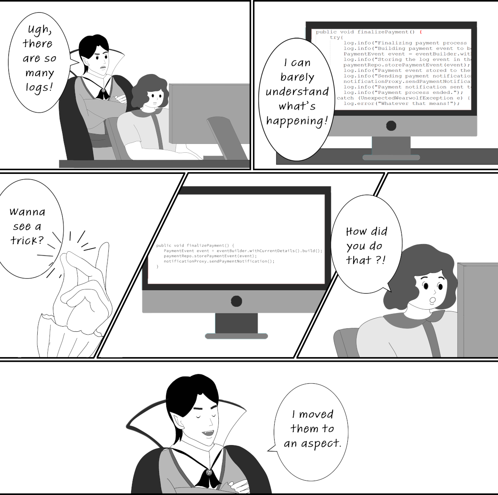

> **Hình 6.1** Đôi khi việc đặt một số phần mã ở cùng chỗ với logic nghiệp vụ là không phù hợp, vì nó khiến ứng dụng khó hiểu hơn. Một giải pháp là dùng aspect để đưa phần mã đó ra khỏi phần triển khai logic nghiệp vụ. Trong cảnh này, Jane, lập trình viên, đang nản lòng vì các dòng log được viết lẫn với mã nghiệp vụ. Bá tước Dracula cho cô ấy thấy phép màu của aspect bằng cách tách các dòng log ra thành một aspect.

Một lý do quan trọng khác để học aspect là Spring dùng chúng để triển khai rất nhiều tính năng cốt lõi mà nó cung cấp. Hiểu cách framework hoạt động có thể giúp bạn tiết kiệm nhiều giờ gỡ lỗi (debug) về sau khi gặp một vấn đề cụ thể. Một ví dụ tiêu biểu về tính năng của Spring sử dụng aspect là tính giao dịch (transactionality), mà chúng ta sẽ thảo luận trong chương 13. Tính giao dịch là một trong những tính năng chính mà hầu hết các ứng dụng ngày nay sử dụng để giữ tính nhất quán của dữ liệu được lưu trữ. Một tính năng quan trọng khác dựa trên aspect là cấu hình bảo mật (security), giúp ứng dụng của bạn bảo vệ dữ liệu và đảm bảo dữ liệu không bị những cá nhân không mong muốn xem hoặc thay đổi. Để hiểu đúng những gì xảy ra trong các ứng dụng sử dụng những chức năng này, trước tiên bạn cần học về aspect.

Chúng ta sẽ bắt đầu với phần giới thiệu lý thuyết về aspect trong mục 6.1. Bạn sẽ học cách aspect hoạt động. Khi đã hiểu những điều cơ bản này, trong mục 6.2, bạn sẽ học cách triển khai một aspect. Chúng ta sẽ bắt đầu với một kịch bản, và phát triển một ví dụ mà chúng ta sẽ dùng để thảo luận các cú pháp thực tế nhất khi sử dụng aspect. Trong mục 6.3, bạn sẽ học điều gì xảy ra khi bạn định nghĩa nhiều aspect cùng chặn một method và cách xử lý những tình huống như vậy.

## 6.1 Cách aspect hoạt động trong Spring

Trong mục này, bạn sẽ học cách aspect hoạt động và những thuật ngữ thiết yếu mà bạn sẽ gặp khi sử dụng aspect. Bằng cách học triển khai aspect, bạn sẽ có thể dùng những kỹ thuật mới để làm ứng dụng của mình dễ bảo trì hơn. Hơn nữa, bạn cũng sẽ hiểu cách một số tính năng của Spring được "cắm" vào ứng dụng. Chúng ta sẽ thảo luận những điều này trước rồi đi thẳng vào một ví dụ triển khai trong mục 6.2. Nhưng sẽ hữu ích nếu bạn có hình dung về thứ chúng ta sẽ triển khai trước khi bắt tay vào viết mã.

Một aspect đơn giản là một đoạn logic mà framework thực thi khi bạn gọi những method cụ thể do bạn chọn. Khi thiết kế một aspect, bạn định nghĩa những điều sau:

- Đoạn mã nào bạn muốn Spring thực thi khi bạn gọi những method cụ thể. Đây được gọi là aspect.
- Khi nào ứng dụng nên thực thi logic này của aspect (ví dụ: trước hoặc sau lời gọi method, hay thay cho lời gọi method). Đây được gọi là advice.
- Những method nào framework cần chặn và thực thi aspect cho chúng. Đây được gọi là pointcut.

Trong thuật ngữ về aspect, bạn cũng sẽ gặp khái niệm join point, định nghĩa sự kiện kích hoạt việc thực thi một aspect. Nhưng với Spring, sự kiện này luôn luôn là một lời gọi method.

Cũng như trong trường hợp dependency injection, để sử dụng aspect, bạn cần framework quản lý các đối tượng mà bạn muốn áp dụng aspect lên. Bạn sẽ dùng những cách tiếp cận đã học trong chương 2 để thêm bean vào Spring context, cho phép framework kiểm soát chúng và áp dụng các aspect bạn định nghĩa. Bean khai báo method bị aspect chặn được gọi là target object (đối tượng đích). Hình 6.2 tóm tắt các thuật ngữ này.

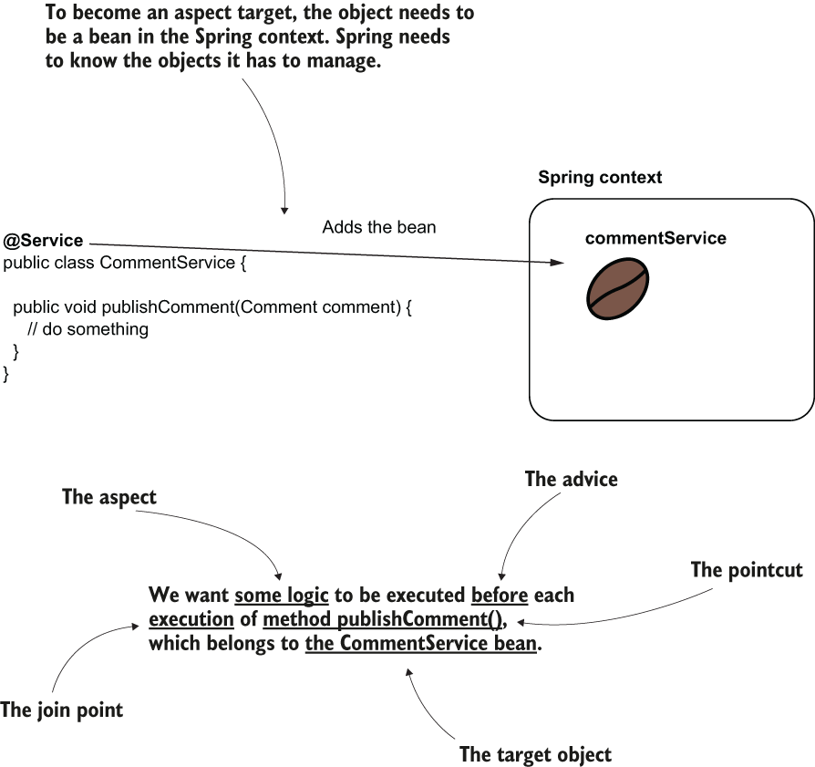

> **Hình 6.2** Thuật ngữ về aspect. Spring thực thi một logic nào đó (aspect) khi ai đó gọi một method cụ thể (pointcut). Chúng ta cần chỉ định khi nào logic đó được thực thi so với pointcut (ví dụ: trước). "Khi nào" chính là advice. Để Spring chặn được method, đối tượng định nghĩa method bị chặn cần phải là một bean trong Spring context. Vì vậy, bean này trở thành target object của aspect.

Nhưng làm thế nào Spring chặn từng lời gọi method và áp dụng logic của aspect? Như đã thảo luận ở đầu mục này, đối tượng cần phải là một bean trong Spring context. Nhưng vì bạn đã biến đối tượng đó thành mục tiêu (target) của aspect, Spring sẽ không trực tiếp trả cho bạn tham chiếu tới instance của bean khi bạn yêu cầu nó từ context. Thay vào đó, Spring trả cho bạn một đối tượng gọi logic của aspect thay vì method thật. Chúng ta nói rằng Spring trả cho bạn một đối tượng proxy thay vì bean thật. Giờ đây bạn sẽ nhận được proxy thay vì bean mỗi khi lấy bean từ context, dù bạn trực tiếp dùng method `getBean()` của context hay dùng DI (hình 6.3). Cách tiếp cận này được gọi là weaving (dệt).

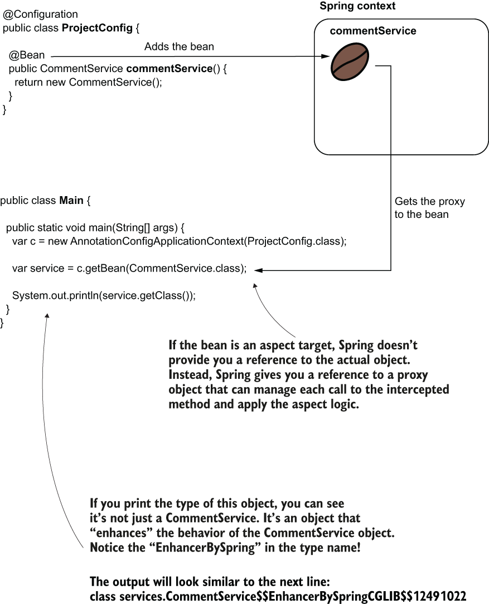

> **Hình 6.3** Weaving một aspect. Thay vì trả cho bạn tham chiếu tới bean thật, Spring trả cho bạn tham chiếu tới một đối tượng proxy, chặn các lời gọi method và quản lý logic của aspect.

Trong hình 6.4, bạn thấy sự so sánh giữa việc gọi method khi nó không bị aspect chặn và khi có một aspect chặn lời gọi method. Bạn nhận thấy rằng gọi một method được áp dụng aspect có nghĩa là bạn gọi method đó thông qua đối tượng proxy do Spring cung cấp. Proxy áp dụng logic của aspect rồi ủy quyền lời gọi cho method thật.

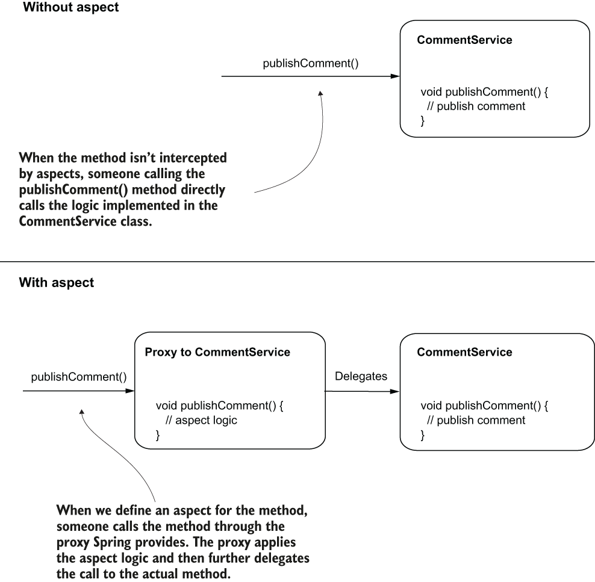

> **Hình 6.4** Khi một method không được áp dụng aspect, lời gọi đi thẳng tới method đó. Khi chúng ta định nghĩa một aspect cho một method, lời gọi đi qua đối tượng proxy. Đối tượng proxy áp dụng logic được định nghĩa bởi aspect rồi ủy quyền lời gọi cho method thật.

Giờ đây khi bạn đã có bức tranh tổng thể về aspect và cách Spring quản lý chúng, chúng ta sẽ đi xa hơn và thảo luận các cú pháp bạn cần để triển khai aspect với Spring. Trong mục 6.2, tôi mô tả một kịch bản, rồi chúng ta sẽ triển khai các yêu cầu của kịch bản đó bằng aspect.

## 6.2 Triển khai aspect với Spring AOP

Trong mục này, bạn sẽ học những cú pháp aspect quan trọng nhất được dùng trong các ví dụ thực tế. Chúng ta sẽ xem xét một kịch bản và triển khai các yêu cầu của nó bằng aspect. Đến cuối mục này, bạn sẽ có thể áp dụng các cú pháp aspect để giải quyết những vấn đề thường gặp nhất trong các tình huống thực tế.

Giả sử bạn có một ứng dụng triển khai nhiều use case trong các class service của nó. Một số quy định mới yêu cầu ứng dụng của bạn phải lưu lại thời điểm bắt đầu và kết thúc cho mỗi lần thực thi use case. Trong nhóm của mình, bạn đã nhận trách nhiệm triển khai một chức năng ghi log tất cả các sự kiện khi một use case bắt đầu và kết thúc.

Trong mục 6.2.1, chúng ta sẽ dùng một aspect để giải quyết kịch bản này theo cách đơn giản nhất có thể. Qua đó, bạn sẽ học được những gì cần thiết để triển khai một aspect. Xa hơn trong chương này, tôi sẽ dần dần bổ sung thêm chi tiết về việc sử dụng aspect. Trong mục 6.2.2, chúng ta sẽ thảo luận cách một aspect sử dụng hoặc thậm chí thay đổi các tham số của method bị chặn hoặc giá trị mà method trả về. Trong mục 6.2.3, bạn sẽ học cách dùng annotation để đánh dấu những method bạn muốn chặn cho một mục đích cụ thể. Các lập trình viên thường dùng annotation để đánh dấu method mà một aspect cần chặn. Nhiều tính năng trong Spring sử dụng annotation, như bạn sẽ học trong các chương tiếp theo. Mục 6.2.4 sẽ cung cấp cho bạn thêm những lựa chọn thay thế về advice annotation mà bạn có thể dùng với các aspect của Spring.

### 6.2.1 Triển khai một aspect đơn giản

Trong mục này, chúng ta thảo luận việc triển khai một aspect đơn giản để giải quyết kịch bản của mình. Chúng ta sẽ tạo một project mới và định nghĩa một class service chứa một method mà chúng ta sẽ dùng để kiểm thử phần triển khai và chứng minh rằng aspect chúng ta định nghĩa cuối cùng hoạt động như mong muốn.

Bạn tìm thấy ví dụ này trong project có tên "sq-ch6-ex1". Ngoài dependency `spring-context`, với ví dụ này chúng ta còn cần dependency `spring-aspects`. Hãy nhớ cập nhật file `pom.xml` và thêm các dependency cần thiết, như trình bày trong đoạn mã sau:

```xml
<dependency>
   <groupId>org.springframework</groupId>
   <artifactId>spring-context</artifactId>
   <version>5.2.8.RELEASE</version>
</dependency>
<dependency>                               ❶
   <groupId>org.springframework</groupId>
   <artifactId>spring-aspects</artifactId>
   <version>5.2.8.RELEASE</version>
</dependency>
```

❶ Chúng ta cần dependency này để triển khai các aspect.

Để ví dụ ngắn gọn hơn và giúp bạn tập trung vào cú pháp liên quan đến aspect, chúng ta sẽ chỉ xét một đối tượng service có tên `CommentService` và một use case mà nó định nghĩa, tên là `publishComment(Comment comment)`. Method này, được định nghĩa trong class `CommentService`, nhận một tham số kiểu `Comment`. `Comment` là một class model và được trình bày trong đoạn mã sau:

```java
public class Comment {

   private String text;
   private String author;

   // Omitted getters and setters
}
```

> **LƯU Ý** Hãy nhớ lại từ chương 4 rằng class model là class mô hình hóa dữ liệu được ứng dụng xử lý. Trong trường hợp của chúng ta, class `Comment` mô tả một bình luận với các thuộc tính của nó: text và author. Một class service triển khai các use case của ứng dụng. Trong chương 4, chúng ta đã thảo luận thêm về những trách nhiệm này và đã dùng chúng trong các ví dụ.

Trong listing 6.1, bạn tìm thấy định nghĩa của class `CommentService`. Chúng ta đánh dấu class `CommentService` bằng stereotype annotation `@Service` để biến nó thành một bean trong Spring context. Class `CommentService` định nghĩa method `publishComment(Comment comment)`, đại diện cho use case trong kịch bản của chúng ta.

Bạn cũng nhận thấy trong ví dụ này, thay vì dùng `System.out`, tôi dùng một đối tượng kiểu `Logger` để ghi thông điệp ra console. Trong các ứng dụng thực tế, bạn không dùng `System.out` để ghi thông điệp ra console. Bạn thường sẽ dùng một logging framework, thứ mang lại cho bạn nhiều linh hoạt hơn trong việc tùy chỉnh các tính năng logging và chuẩn hóa các thông điệp log. Một số lựa chọn tốt cho logging framework là:

- Log4j (https://logging.apache.org/log4j/2.x/)
- Logback (http://logback.qos.ch/)
- Java Logging API, đi kèm với JDK (http://mng.bz/v4Xq)

Các logging framework tương thích với mọi ứng dụng Java, dù có dùng Spring hay không. Vì chúng không liên quan đến Spring, tôi đã không dùng chúng trong các ví dụ để tránh làm bạn phân tâm. Nhưng giờ chúng ta đã đi đủ xa với Spring để có thể bắt đầu dùng những framework bổ sung này trong các ví dụ, giúp bạn làm quen với những cú pháp gần hơn với các ứng dụng sẵn sàng cho môi trường production.

**Listing 6.1** Class service được dùng trong các ví dụ

```java
@Service                                                                   ❶
public class CommentService {

    private Logger logger =                                                ❷
      Logger.getLogger(CommentService.class.getName());

    public void publishComment(Comment comment) {             ❸
      logger.info("Publishing comment:" + comment.getText());
    }
}
```

❶ Chúng ta dùng stereotype annotation để biến class này thành một bean trong Spring context.  
❷ Để ghi log một thông điệp ra console của ứng dụng mỗi khi ai đó gọi use case, chúng ta dùng một đối tượng logger.  
❸ Method này định nghĩa use case cho phần minh họa của chúng ta.

Trong ví dụ này, tôi dùng các tính năng logging của JDK để tránh thêm dependency khác vào project. Khi khai báo một đối tượng logger, bạn cần đặt cho nó một cái tên làm tham số. Tên này sau đó xuất hiện trong các log và giúp bạn dễ dàng nhận ra nguồn gốc của thông điệp log. Thông thường, chúng ta dùng tên class, như tôi đã làm trong ví dụ: `CommentService.class.getName()`.

Chúng ta cũng cần thêm một class cấu hình để báo cho Spring biết nơi tìm các class được đánh dấu bằng stereotype annotation. Trong trường hợp của tôi, tôi đã đặt class service vào package tên là `"services"`, và đây là điều tôi cần chỉ định bằng annotation `@ComponentScan`, như bạn thấy trong đoạn mã sau:

```java
@Configuration
@ComponentScan(basePackages = "services")                   ❶
public class ProjectConfig {

}
```

❶ Chúng ta dùng `@ComponentScan` để báo cho Spring biết nơi tìm kiếm các class được đánh dấu bằng stereotype annotation.

Hãy viết class `Main` gọi method `publishComment()` trong class service và quan sát hành vi hiện tại, như trình bày trong listing sau.

**Listing 6.2** Class Main chúng ta dùng để kiểm thử hành vi của ứng dụng

```java
public class Main {

    public static void main(String[] args) {
      var c = new AnnotationConfigApplicationContext(ProjectConfig.class);

        var service = c.getBean(CommentService.class);                   ❶

        Comment comment = new Comment();                                 ❷
        comment.setText("Demo comment");
        comment.setAuthor("Natasha");

        service.publishComment(comment);                                 ❸
     }
}
```

❶ Lấy bean `CommentService` từ context  
❷ Tạo một instance `Comment` để truyền làm tham số cho method `publishComment()`  
❸ Gọi method `publishComment()`

Nếu chạy ứng dụng, bạn sẽ thấy trong console một kết quả tương tự như đoạn sau:

```text
Sep 26, 2020 12:39:53 PM services.CommentService publishComment
INFO: Publishing comment:Demo comment
```

Bạn sẽ thấy kết quả được tạo ra bởi method `publishComment()`. Đây là hình hài của ứng dụng trước khi chúng ta giải quyết ví dụ đã thảo luận. Hãy nhớ, chúng ta cần in thông điệp ra console trước và sau lời gọi method của service. Bây giờ hãy nâng cấp project với một class aspect chặn lời gọi method và thêm một dòng kết quả trước và sau lời gọi.

Để tạo một aspect, bạn làm theo các bước sau (hình 6.5):

1. Kích hoạt cơ chế aspect trong ứng dụng Spring của bạn bằng cách đánh dấu class cấu hình với annotation `@EnableAspectJAutoProxy`.
2. Tạo một class mới và đánh dấu nó bằng annotation `@Aspect`. Dùng `@Bean` hoặc stereotype annotation, thêm một bean cho class này vào Spring context.
3. Định nghĩa một method sẽ triển khai logic của aspect và báo cho Spring biết khi nào và những method nào cần chặn bằng một advice annotation.
4. Triển khai logic của aspect.

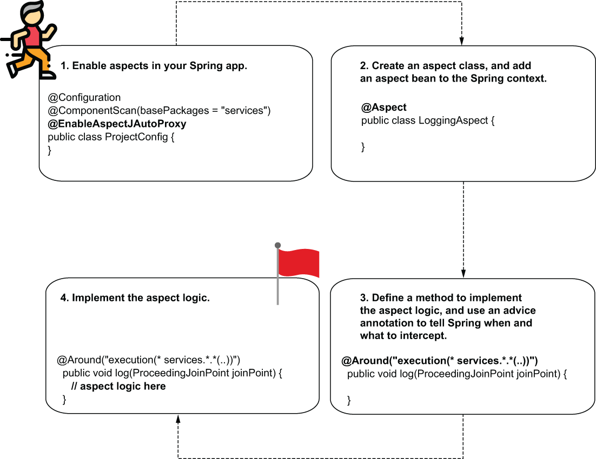

> **Hình 6.5** Để triển khai một aspect, bạn làm theo bốn bước đơn giản. Đầu tiên, bạn cần kích hoạt tính năng aspect trong ứng dụng. Sau đó bạn tạo một class aspect, định nghĩa một method, và chỉ dẫn cho Spring khi nào và chặn cái gì. Cuối cùng, bạn triển khai logic của aspect.

**BƯỚC 1: KÍCH HOẠT CƠ CHẾ ASPECT CHO ỨNG DỤNG CỦA BẠN**

Ở bước đầu tiên, bạn cần báo cho Spring biết rằng bạn sẽ dùng aspect trong ứng dụng. Bất cứ khi nào bạn dùng một cơ chế cụ thể do Spring cung cấp, bạn phải kích hoạt nó một cách tường minh bằng cách đánh dấu class cấu hình với một annotation nhất định. Trong hầu hết các trường hợp, tên của những annotation này bắt đầu bằng "Enable". Bạn sẽ học thêm nhiều annotation như vậy để kích hoạt các tính năng khác nhau của Spring khi đọc tiếp cuốn sách. Trong ví dụ này, chúng ta cần dùng annotation `@EnableAspectJAutoProxy` để kích hoạt các tính năng aspect. Class cấu hình cần trông giống như trong listing sau.

**Listing 6.3** Kích hoạt cơ chế aspect trong một ứng dụng Spring

```java
@Configuration
@ComponentScan(basePackages = "services")
@EnableAspectJAutoProxy                                    ❶
public class ProjectConfig {
}
```

❶ Kích hoạt cơ chế aspect trong ứng dụng Spring của chúng ta

**BƯỚC 2: TẠO MỘT CLASS ĐỊNH NGHĨA ASPECT, VÀ THÊM MỘT INSTANCE CỦA CLASS NÀY VÀO SPRING CONTEXT**

Chúng ta cần tạo một bean mới trong Spring context để định nghĩa aspect. Đối tượng này chứa các method sẽ chặn những lời gọi method cụ thể và bổ sung cho chúng logic cụ thể. Trong listing tiếp theo, bạn tìm thấy định nghĩa của class mới này.

**Listing 6.4** Định nghĩa một class aspect

```java
@Aspect
public class LoggingAspect {
  public void log() {
    // To implement later
  }
}
```

Bạn có thể dùng bất kỳ cách tiếp cận nào đã học trong chương 2 để thêm một instance của class này vào Spring context. Nếu bạn quyết định dùng annotation `@Bean`, bạn phải thay đổi class cấu hình như trình bày trong đoạn mã sau. Tất nhiên, bạn cũng có thể dùng stereotype annotation nếu muốn:

```java
@Configuration
@ComponentScan(basePackages = "services")
@EnableAspectJAutoProxy
public class ProjectConfig {

    @Bean                                     ❶
    public LoggingAspect aspect() {
      return new LoggingAspect();
    }
}
```

❶ Thêm một instance của class `LoggingAspect` vào Spring context

Hãy nhớ, bạn cần biến đối tượng này thành một bean trong Spring context vì Spring cần biết về mọi đối tượng mà nó phải quản lý. Đây là lý do tôi đã nhấn mạnh rất nhiều về các cách tiếp cận quản lý Spring context trong các chương từ 2 đến 5. Bạn sẽ dùng những kỹ năng này gần như ở mọi nơi khi phát triển một ứng dụng Spring.

Ngoài ra, annotation `@Aspect` không phải là một stereotype annotation. Với `@Aspect`, bạn báo cho Spring biết rằng class này triển khai định nghĩa của một aspect, nhưng Spring sẽ không đồng thời tạo bean cho class này. Bạn cần dùng một cách tường minh một trong các cú pháp đã học ở chương 2 để tạo bean cho class của mình và cho phép Spring quản lý nó theo cách đó. Một sai lầm phổ biến là quên rằng việc đánh dấu class bằng `@Aspect` không đồng thời thêm một bean vào context, và tôi đã chứng kiến nhiều sự bực bội gây ra bởi việc quên điều này.

**BƯỚC 3: DÙNG MỘT ADVICE ANNOTATION ĐỂ BÁO CHO SPRING BIẾT KHI NÀO VÀ NHỮNG LỜI GỌI METHOD NÀO CẦN CHẶN**

Giờ đây khi đã định nghĩa class aspect, chúng ta chọn advice và đánh dấu method tương ứng. Trong listing tiếp theo, bạn thấy cách tôi đánh dấu method bằng annotation `@Around`.

**Listing 6.5** Dùng một advice annotation để weave aspect vào các method cụ thể

```java
@Aspect
public class LoggingAspect {

    @Around("execution(* services.*.*(..))")                             ❶
    public void log(ProceedingJoinPoint joinPoint) {
      joinPoint.proceed();                                               ❷
    }
}
```

❶ Định nghĩa những method nào bị chặn  
❷ Ủy quyền cho method thật bị chặn

Ngoài việc dùng annotation `@Around`, bạn cũng nhận thấy tôi đã viết một biểu thức chuỗi khác thường làm giá trị của annotation, và tôi đã thêm một tham số vào method của aspect. Chúng là gì vậy?

Hãy xét từng cái một. Biểu thức kỳ lạ được dùng làm tham số cho annotation `@Around` báo cho Spring biết những lời gọi method nào cần chặn. Đừng e ngại biểu thức này! Ngôn ngữ biểu thức này được gọi là ngôn ngữ AspectJ pointcut, và bạn không cần học thuộc lòng nó để sử dụng. Trong thực tế, bạn không dùng những biểu thức phức tạp. Khi cần viết một biểu thức như vậy, tôi luôn tham khảo tài liệu (http://mng.bz/4K9g).

Về lý thuyết, bạn có thể viết những biểu thức AspectJ pointcut rất phức tạp để xác định một tập hợp cụ thể các lời gọi method cần chặn. Ngôn ngữ này thực sự mạnh mẽ. Nhưng như chúng ta sẽ thảo luận ở phần sau của chương này, tốt hơn hết là luôn tránh viết những biểu thức phức tạp. Trong hầu hết các trường hợp, bạn có thể tìm được những lựa chọn thay thế đơn giản hơn.

Hãy nhìn vào biểu thức tôi đã dùng (hình 6.6). Nó có nghĩa là Spring chặn bất kỳ method nào được định nghĩa trong một class thuộc package `services`, bất kể kiểu trả về của method, class mà nó thuộc về, tên method, hay các tham số mà method nhận.

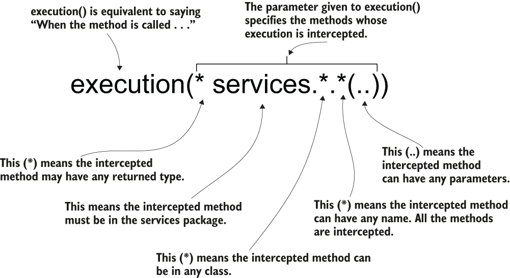

> **Hình 6.6** Biểu thức AspectJ pointcut được dùng trong ví dụ. Nó báo cho Spring chặn các lời gọi tới tất cả các method trong package services, bất kể kiểu trả về, class chúng thuộc về, tên, hay các tham số chúng nhận.

Nhìn lại lần nữa, biểu thức này có vẻ không phức tạp lắm, phải không? Tôi biết những biểu thức AspectJ pointcut này thường làm người mới bắt đầu e sợ, nhưng tin tôi đi, bạn không cần trở thành chuyên gia AspectJ để dùng những biểu thức này trong các ứng dụng Spring.

Bây giờ hãy xem phần tử thứ hai tôi đã thêm vào method: tham số `ProceedingJoinPoint`, đại diện cho method bị chặn. Việc chính bạn làm với tham số này là báo cho aspect biết khi nào nó nên ủy quyền tiếp cho method thật.

**BƯỚC 4: TRIỂN KHAI LOGIC CỦA ASPECT**

Trong listing 6.6, tôi đã thêm logic cho aspect của chúng ta. Bây giờ aspect

1. Chặn method
2. Hiển thị gì đó ra console trước khi gọi method bị chặn
3. Gọi method bị chặn
4. Hiển thị gì đó ra console sau khi gọi method bị chặn

Hình 6.7 trình bày trực quan hành vi của aspect.

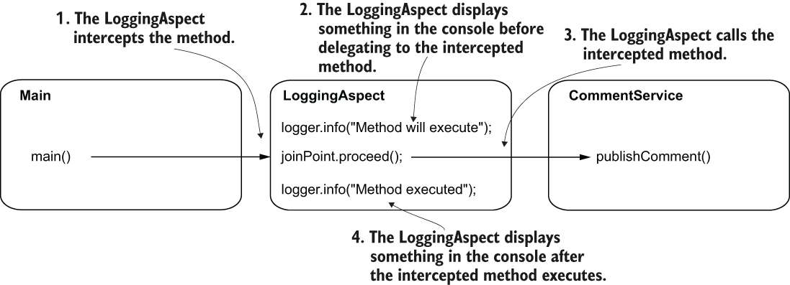

> **Hình 6.7** Hành vi của aspect. `LoggingAspect` bao bọc việc thực thi method bằng cách hiển thị gì đó trước và sau lời gọi method. Bằng cách này, bạn quan sát được một triển khai đơn giản của aspect.

**Listing 6.6** Triển khai logic của aspect

```java
@Aspect
public class LoggingAspect {

    private Logger logger = Logger.getLogger(LoggingAspect.class.getName());

    @Around("execution(* services.*.*(..))")
    public void log(ProceedingJoinPoint joinPoint) throws Throwable {
      logger.info("Method will execute");                               ❶
      joinPoint.proceed();                                              ❷
      logger.info("Method executed");                                   ❸
    }
}
```

❶ In một thông điệp ra console trước khi method bị chặn thực thi  
❷ Gọi method bị chặn  
❸ In một thông điệp ra console sau khi method bị chặn thực thi

Method `proceed()` của tham số `ProceedingJoinPoint` gọi method bị chặn, `publishComment()`, của bean `CommentService`. Nếu bạn không gọi `proceed()`, aspect sẽ không bao giờ ủy quyền tiếp cho method bị chặn (hình 6.8).

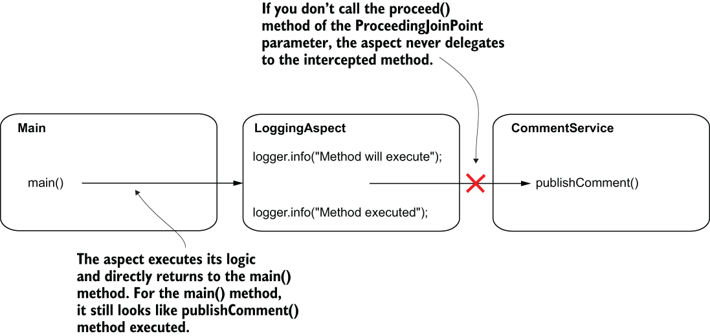

> **Hình 6.8** Nếu bạn không gọi method `proceed()` của tham số `ProceedingJoinPoint` trong aspect, aspect sẽ không bao giờ ủy quyền tiếp cho method bị chặn. Trong trường hợp này, aspect đơn giản là thực thi thay cho method bị chặn. Bên gọi method không biết rằng method thật không bao giờ được thực thi.

Bạn thậm chí có thể triển khai logic mà trong đó method thật không còn được gọi nữa. Ví dụ, một aspect áp dụng một số quy tắc phân quyền (authorization) sẽ quyết định có ủy quyền tiếp cho method mà ứng dụng bảo vệ hay không. Nếu các quy tắc phân quyền không được thỏa mãn, aspect sẽ không ủy quyền cho method bị chặn mà nó bảo vệ (hình 6.9).

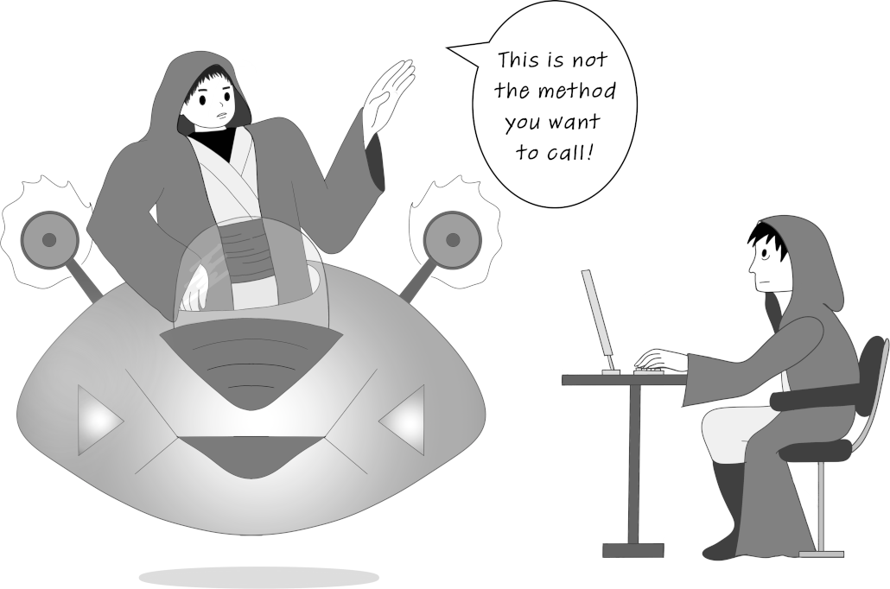

> **Hình 6.9** Một aspect có thể quyết định hoàn toàn không ủy quyền cho method mà nó chặn. Hành vi này trông giống như aspect đang dùng một "thủ thuật tâm trí" với bên gọi method. Bên gọi cuối cùng thực thi một logic khác với logic mà nó thực sự đã gọi.

Ngoài ra, hãy để ý rằng method `proceed()` ném ra một `Throwable`. Method `proceed()` được thiết kế để ném ra bất kỳ exception nào đến từ method bị chặn. Trong ví dụ này, tôi chọn cách dễ dàng là lan truyền nó tiếp, nhưng bạn có thể dùng một khối try-catch-finally để xử lý throwable này nếu cần.

Hãy chạy lại ứng dụng ("sq-ch6-ex1"). Trong kết quả console, bạn sẽ thấy các log từ cả aspect lẫn method bị chặn. Kết quả bạn thấy sẽ tương tự như đoạn sau:

```text
Sep 27, 2020 1:11:11 PM aspects.LoggingAspect log
INFO: Method will execute                                                   ❶
Sep 27, 2020 1:11:11 PM services.CommentService publishComment
INFO: Publishing comment:Demo comment                                       ❷
Sep 27, 2020 1:11:11 PM aspects.LoggingAspect log
INFO: Method executed                                                       ❸
```

❶ Dòng này được in ra từ aspect.  
❷ Dòng này được in ra từ method thật.  
❸ Dòng này được in ra từ aspect.

### 6.2.2 Thay đổi các tham số của method bị chặn và giá trị trả về

Tôi đã nói với bạn rằng aspect thực sự mạnh mẽ. Chúng không chỉ có thể chặn một method và thay đổi quá trình thực thi của nó, mà còn có thể chặn các tham số được dùng để gọi method và có thể thay đổi chúng hoặc thay đổi giá trị mà method bị chặn trả về. Trong mục này, chúng ta sẽ thay đổi ví dụ đang làm để chứng minh cách một aspect có thể tác động lên các tham số và giá trị trả về của method bị chặn. Biết cách làm điều này cho bạn thêm nhiều cơ hội trong những gì bạn có thể triển khai bằng aspect.

Giả sử bạn muốn ghi log các tham số được dùng để gọi method của service và những gì method trả về. Để minh họa cách triển khai một kịch bản như vậy, tôi tách ví dụ này thành một project riêng có tên "sq-ch6-ex2". Vì chúng ta cũng đề cập đến những gì method trả về, tôi đã thay đổi method của service và cho nó trả về một giá trị, như trình bày trong đoạn mã sau:

```java
@Service
public class CommentService {

    private Logger logger = Logger.getLogger(CommentService.class.getName());

    public String publishComment(Comment comment) {
      logger.info("Publishing comment:" + comment.getText());
      return "SUCCESS";                                                     ❶
    }
}
```

❶ Để minh họa, giờ đây method trả về một giá trị.

Aspect có thể dễ dàng tìm được tên của method bị chặn và các tham số của method. Hãy nhớ rằng tham số `ProceedingJoinPoint` của method aspect đại diện cho method bị chặn. Bạn có thể dùng tham số này để lấy bất kỳ thông tin nào liên quan đến method bị chặn (tham số, tên method, target object, v.v.). Đoạn mã sau cho bạn thấy cách lấy tên method và các tham số được dùng để gọi method trước khi chặn lời gọi:

```java
String methodName = joinPoint.getSignature().getName();
Object [] arguments = joinPoint.getArgs();
```

Bây giờ chúng ta có thể thay đổi aspect để ghi log cả những chi tiết này. Trong listing tiếp theo, bạn tìm thấy thay đổi cần thực hiện với method của aspect.

**Listing 6.7** Lấy tên method và các tham số trong logic của aspect

```java
@Aspect
public class LoggingAspect {

    private Logger logger = Logger.getLogger(LoggingAspect.class.getName());

    @Around("execution(* services.*.*(..))")
    public Object log(ProceedingJoinPoint joinPoint) throws Throwable {
      String methodName =                                                 ❶
        joinPoint.getSignature().getName();
      Object [] arguments = joinPoint.getArgs();

        logger.info("Method " + methodName +                              ❷
            " with parameters " + Arrays.asList(arguments) +
            " will execute");

        Object returnedByMethod = joinPoint.proceed();                    ❸

        logger.info("Method executed and returned " + returnedByMethod);

        return returnedByMethod;                                          ❹
    }
}
```

❶ Lấy tên và các tham số của method bị chặn  
❷ Ghi log tên và các tham số của method bị chặn  
❸ Gọi method bị chặn  
❹ Trả về giá trị mà method bị chặn đã trả về

Hình 6.10 giúp bạn dễ hình dung luồng xử lý hơn. Hãy quan sát cách aspect chặn lời gọi và có thể truy cập các tham số cũng như giá trị trả về.

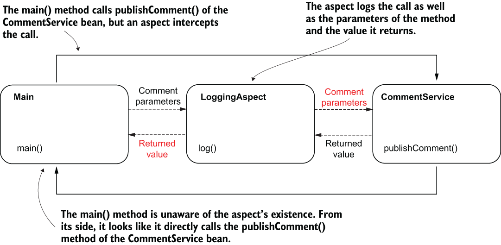

> **Hình 6.10** Aspect chặn lời gọi method, nên nó có thể truy cập các tham số và giá trị mà method bị chặn trả về sau khi thực thi. Đối với method `main()`, trông như thể nó gọi trực tiếp method `publishComment()` của bean `CommentService`. Bên gọi không biết rằng một aspect đã chặn lời gọi.

Tôi đã thay đổi method `main()` để in ra giá trị được trả về bởi `publishComment()`, như trình bày trong listing sau.

**Listing 6.8** In giá trị trả về để quan sát hành vi của aspect

```java
public class Main {

    private static Logger logger = Logger.getLogger(Main.class.getName());

    public static void main(String[] args) {
      var c = new AnnotationConfigApplicationContext(ProjectConfig.class);

        var service = c.getBean(CommentService.class);

        Comment comment = new Comment();
        comment.setText("Demo comment");
        comment.setAuthor("Natasha");

        String value = service.publishComment(comment);

        logger.info(value);            ❶
    }
}
```

❶ In giá trị được trả về bởi method `publishComment()`

Khi chạy ứng dụng, trong console bạn thấy các giá trị được ghi log từ aspect và giá trị trả về được ghi log bởi method `main()`:

```text
Sep 28, 2020 10:49:39 AM aspects.LoggingAspect log
INFO: Method publishComment with parameters [Comment{text='Demo comment
➥ author='Natasha'}] will execute                                        ❶
Sep 28, 2020 10:49:39 AM services.CommentService publishComment
INFO: Publishing comment:Demo comment                                     ❷
Sep 28, 2020 10:49:39 AM aspects.LoggingAspect log
INFO: Method executed and returned SUCCESS                                ❸
Sep 28, 2020 10:49:39 AM main.Main main
INFO: SUCCESS                                                             ❹
```

❶ Các tham số được in ra bởi aspect  
❷ Thông điệp được in ra bởi method bị chặn  
❸ Giá trị trả về được in ra bởi aspect  
❹ Giá trị trả về được in ra trong main

Nhưng aspect còn mạnh mẽ hơn thế. Chúng có thể thay đổi quá trình thực thi của method bị chặn bằng cách

- Thay đổi giá trị của các tham số được gửi tới method
- Thay đổi giá trị trả về mà bên gọi nhận được
- Ném một exception tới bên gọi, hoặc bắt và xử lý một exception do method bị chặn ném ra

Bạn có thể cực kỳ linh hoạt trong việc thay đổi lời gọi của một method bị chặn. Bạn thậm chí có thể thay đổi hoàn toàn hành vi của nó (hình 6.11). Nhưng hãy cẩn thận! Khi bạn thay đổi logic thông qua một aspect, bạn làm cho một phần logic trở nên "trong suốt" (không nhìn thấy được). Hãy đảm bảo bạn không che giấu những thứ không hiển nhiên. Toàn bộ ý tưởng của việc tách rời một phần logic là để tránh lặp mã và che đi những gì không liên quan, để lập trình viên có thể dễ dàng tập trung vào mã logic nghiệp vụ. Khi cân nhắc viết một aspect, hãy đặt mình vào vị trí của lập trình viên. Người cần hiểu mã nên dễ dàng nhận ra điều gì đang xảy ra.

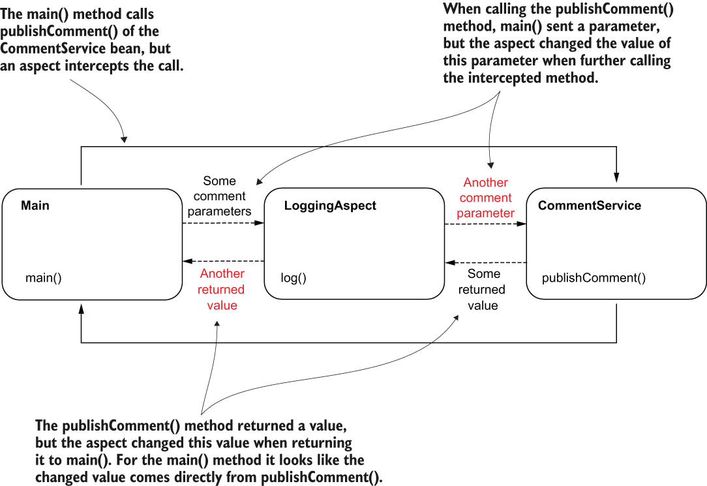

> **Hình 6.11** Một aspect có thể thay đổi các tham số được dùng để gọi method bị chặn và giá trị trả về mà bên gọi method bị chặn nhận được. Cách tiếp cận này mạnh mẽ và mang lại khả năng kiểm soát linh hoạt đối với method bị chặn.

Trong project "sq-ch6-ex3", chúng ta minh họa cách aspect có thể thay đổi lời gọi bằng cách thay đổi các tham số hoặc giá trị được trả về bởi method bị chặn. Listing sau cho thấy rằng khi bạn gọi method `proceed()` mà không gửi tham số nào, aspect gửi các tham số gốc tới method bị chặn. Nhưng bạn có thể chọn cung cấp một tham số khi gọi method `proceed()`. Tham số này là một mảng các đối tượng mà aspect gửi tới method bị chặn thay cho các giá trị tham số gốc. Aspect ghi log giá trị được trả về bởi method bị chặn, nhưng nó trả về cho bên gọi một giá trị khác.

**Listing 6.9** Thay đổi các tham số và giá trị trả về

```java
@Aspect
public class LoggingAspect {

  private Logger logger =
  Logger.getLogger(LoggingAspect.class.getName());

  @Around("execution(* services.*.*(..))")
  public Object log(ProceedingJoinPoint joinPoint) throws Throwable {
     String methodName = joinPoint.getSignature().getName();
     Object [] arguments = joinPoint.getArgs();

     logger.info("Method " + methodName +
         " with parameters " + Arrays.asList(arguments) +
          " will execute");
        Comment comment = new Comment();
        comment.setText("Some other text!");
        Object [] newArguments = {comment};

        Object returnedByMethod = joinPoint.proceed(newArguments);        ❶

        logger.info("Method executed and returned " + returnedByMethod);

        return "FAILED";                                                  ❷
    }
}
```

❶ Chúng ta gửi một instance comment khác làm giá trị cho tham số của method.  
❷ Chúng ta ghi log giá trị được trả về bởi method bị chặn, nhưng trả về cho bên gọi một giá trị khác.

Chạy ứng dụng sẽ tạo ra kết quả như trong đoạn sau. Các giá trị tham số mà method `publishComment()` nhận được khác với những giá trị được gửi khi gọi method. Method `publishComment()` trả về một giá trị, nhưng `main()` nhận được một giá trị khác:

```text
Sep 29, 2020 10:43:51 AM aspects.LoggingAspect log
INFO: Method publishComment with parameters [Comment{text='Demo comment
➥ author='Natasha'}] will execute                                 ❶
Sep 29, 2020 10:43:51 AM services.CommentService publishComment
INFO: Publishing comment:Some other text!                                 ❷
Sep 29, 2020 10:43:51 AM aspects.LoggingAspect log
INFO: Method executed and returned SUCCESS                                ❸
Sep 29, 2020 10:43:51 AM main.Main main
INFO: FAILED                                                              ❹
```

❶ Method `publishComment()` được gọi với một comment có text là "Demo comment".  
❷ Method `publishComment()` nhận được một comment có text là "Some other text!"  
❸ Method `publishComment()` trả về "SUCCESS".  
❹ Giá trị trả về mà `main()` nhận được là "FAILED".

> **LƯU Ý** Tôi biết mình đang lặp lại, nhưng điểm này khá quan trọng. Hãy cẩn thận khi dùng aspect! Bạn chỉ nên dùng chúng để che đi những dòng mã không liên quan và có thể dễ dàng suy ra được. Aspect mạnh mẽ đến mức chúng có thể đưa bạn đến "mặt tối" của việc che giấu mã quan trọng và khiến ứng dụng khó bảo trì hơn. Hãy dùng aspect một cách thận trọng!

Được rồi, nhưng liệu chúng ta có bao giờ muốn có một aspect thay đổi các tham số của method bị chặn không? Hay giá trị trả về của nó? Có. Đôi khi cách tiếp cận như vậy tỏ ra hữu ích. Tôi giải thích tất cả những cách tiếp cận này vì trong các chương tiếp theo, chúng ta sẽ dùng một số tính năng của Spring dựa trên aspect. Ví dụ, trong chương 13, chúng ta sẽ thảo luận về transaction. Transaction trong Spring dựa trên aspect. Khi đến chủ đề đó, bạn sẽ thấy việc hiểu aspect rất hữu ích.

Bằng cách hiểu cách aspect hoạt động trước, bạn có được một lợi thế đáng kể trong việc hiểu Spring. Tôi thường thấy các lập trình viên bắt đầu dùng một framework mà không hiểu điều gì nằm sau những chức năng họ sử dụng. Không có gì ngạc nhiên khi trong nhiều trường hợp, những lập trình viên này đưa bug hoặc lỗ hổng bảo mật vào ứng dụng của họ, hoặc khiến ứng dụng kém hiệu năng và khó bảo trì hơn. Lời khuyên của tôi là hãy luôn tìm hiểu cách mọi thứ hoạt động trước khi sử dụng chúng.

### 6.2.3 Chặn các method được đánh dấu bằng annotation

Trong mục này, chúng ta thảo luận một cách tiếp cận quan trọng, thường được dùng trong các ứng dụng Spring, để đánh dấu những method cần được aspect chặn: sử dụng annotation. Bạn có để ý chúng ta đã dùng bao nhiêu annotation trong các ví dụ rồi không? Annotation rất tiện dùng, và kể từ khi xuất hiện với Java 5, chúng đã trở thành cách tiếp cận tiêu chuẩn trên thực tế (de facto) để cấu hình những ứng dụng dùng các framework cụ thể. Có lẽ ngày nay không có framework Java nào không dùng annotation. Bạn cũng có thể dùng chúng để đánh dấu những method bạn muốn một aspect chặn, với một cú pháp tiện lợi cho phép bạn tránh phải viết những biểu thức AspectJ pointcut phức tạp.

Chúng ta sẽ tạo một ví dụ riêng để học cách tiếp cận này, tương tự những ví dụ đã thảo luận trong chương này. Trong class `CommentService`, chúng ta sẽ thêm ba method: `publishComment()`, `deleteComment()`, và `editComment()`. Bạn tìm thấy ví dụ này trong project "sq-ch6-ex4". Chúng ta muốn định nghĩa một annotation tùy chỉnh và chỉ ghi log việc thực thi của những method mà chúng ta đánh dấu bằng annotation tùy chỉnh đó. Để đạt được mục tiêu này, bạn cần làm những việc sau:

1. Định nghĩa một annotation tùy chỉnh và làm cho nó có thể truy cập được lúc runtime. Chúng ta sẽ gọi annotation này là `@ToLog`.
2. Dùng một biểu thức AspectJ pointcut khác cho method của aspect để báo cho aspect chặn những method được đánh dấu bằng annotation tùy chỉnh.

Hình 6.12 biểu diễn trực quan các bước này.

Chúng ta không cần thay đổi logic của aspect. Với ví dụ này, aspect của chúng ta làm điều tương tự như các ví dụ trước: ghi log việc thực thi của method bị chặn.

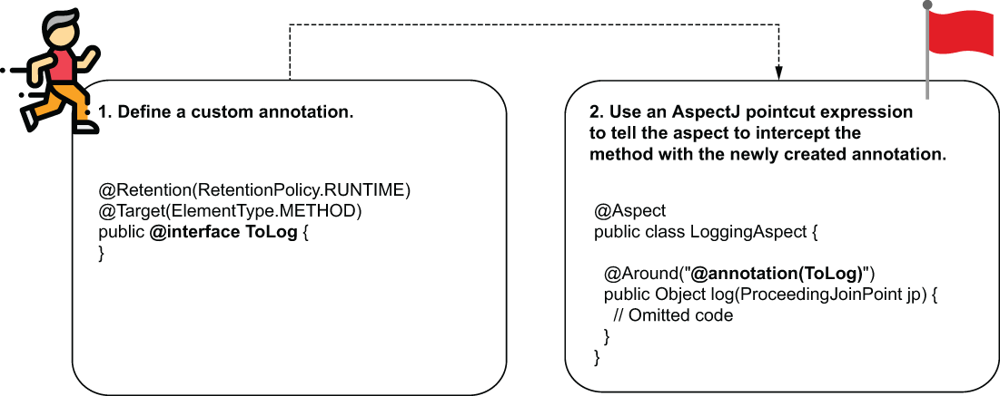

> **Hình 6.12** Các bước để chặn những method được đánh dấu bằng annotation. Bạn cần tạo một annotation tùy chỉnh mà bạn muốn dùng để đánh dấu những method aspect cần chặn. Sau đó bạn dùng một biểu thức AspectJ pointcut khác để cấu hình aspect chặn những method được đánh dấu bằng annotation tùy chỉnh bạn đã tạo.

Trong đoạn mã sau, bạn tìm thấy khai báo của annotation tùy chỉnh. Việc định nghĩa chính sách lưu giữ (retention policy) bằng `@Retention(RetentionPolicy.RUNTIME)` là rất quan trọng. Theo mặc định, trong Java, annotation không thể bị chặn lúc runtime. Bạn cần chỉ định một cách tường minh rằng ai đó có thể chặn annotation bằng cách đặt retention policy là `RUNTIME`. Annotation `@Target` chỉ định những phần tử ngôn ngữ nào chúng ta có thể dùng annotation này cho. Theo mặc định, bạn có thể đánh dấu bất kỳ phần tử ngôn ngữ nào, nhưng luôn là ý hay khi giới hạn annotation chỉ cho những gì bạn tạo ra nó—trong trường hợp của chúng ta là các method:

```java
@Retention(RetentionPolicy.RUNTIME)                      ❶
@Target(ElementType.METHOD)                              ❷
public @interface ToLog {
}
```

❶ Cho phép annotation này bị chặn lúc runtime  
❷ Giới hạn annotation này chỉ được dùng với method

Trong listing sau, bạn tìm thấy định nghĩa của class `CommentService`, giờ đây định nghĩa ba method. Chúng ta chỉ đánh dấu method `deleteComment()`, nên chúng ta kỳ vọng aspect sẽ chỉ chặn method này.

**Listing 6.10** Class CommentService định nghĩa ba method

```java
@Service
public class CommentService {

    private Logger logger = Logger.getLogger(CommentService.class.getName());

    public void publishComment(Comment comment) {
      logger.info("Publishing comment:" + comment.getText());
    }

    @ToLog                                                       ❶
    public void deleteComment(Comment comment) {
        logger.info("Deleting comment:" + comment.getText());
    }

    public void editComment(Comment comment) {
        logger.info("Editing comment:" + comment.getText());
    }
}
```

❶ Chúng ta dùng annotation tùy chỉnh cho những method mà chúng ta muốn aspect chặn

Để weave aspect vào những method được đánh dấu bằng annotation tùy chỉnh (hình 6.13), chúng ta dùng biểu thức AspectJ pointcut sau: `@annotation(ToLog)`. Biểu thức này tham chiếu đến bất kỳ method nào được đánh dấu bằng annotation có tên `@ToLog` (trong trường hợp này là annotation tùy chỉnh của chúng ta). Trong listing tiếp theo, bạn thấy class aspect, giờ đây dùng biểu thức pointcut mới để weave logic của aspect vào các method bị chặn. Khá đơn giản, phải không?

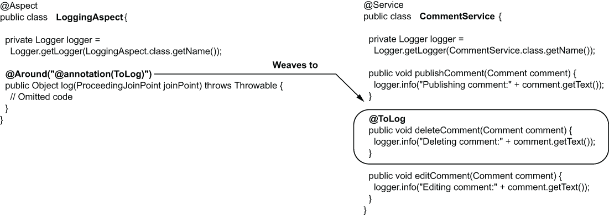

> **Hình 6.13** Dùng một biểu thức AspectJ pointcut, chúng ta weave logic của aspect vào bất kỳ method nào được đánh dấu bằng annotation tùy chỉnh mà chúng ta đã định nghĩa. Đây là cách tiện lợi để đánh dấu những method mà một logic aspect cụ thể áp dụng vào.

**Listing 6.11** Thay đổi biểu thức pointcut để weave aspect vào các method được đánh dấu bằng annotation

```java
@Aspect
public class LoggingAspect {

    private Logger logger = Logger.getLogger(LoggingAspect.class.getName());

    @Around("@annotation(ToLog)")                                          ❶
    public Object log(ProceedingJoinPoint joinPoint) throws Throwable {
        // Omitted code
    }
}
```

❶ Weave aspect vào các method được đánh dấu bằng `@ToLog`

Khi bạn chạy ứng dụng, chỉ method được đánh dấu bằng annotation (`deleteComment()` trong trường hợp của chúng ta) bị chặn, và aspect ghi log việc thực thi của method này ra console. Bạn sẽ thấy trong console một kết quả tương tự như đoạn sau:

```text
Sep 29, 2020 2:22:42 PM services.CommentService publishComment
INFO: Publishing comment:Demo comment
Sep 29, 2020 2:22:42 PM aspects.LoggingAspect log
INFO: Method deleteComment with parameters [Comment{text='Demo comment
➥ author='Natasha'}] will execute                                        ❶
Sep 29, 2020 2:22:42 PM services.CommentService deleteComment
INFO: Deleting comment:Demo comment
Sep 29, 2020 2:22:42 PM aspects.LoggingAspect log
INFO: Method executed and returned null
Sep 29, 2020 2:22:42 PM services.CommentService editComment
INFO: Editing comment:Demo comment
```

❶ Aspect chỉ chặn method `deleteComment()`, method mà chúng ta đã đánh dấu bằng annotation tùy chỉnh `@ToLog`.

### 6.2.4 Các advice annotation khác bạn có thể dùng

Trong mục này, chúng ta thảo luận các advice annotation thay thế cho aspect trong Spring. Cho đến giờ trong chương này, chúng ta đã dùng advice annotation `@Around`. Đây quả thực là advice annotation được dùng nhiều nhất trong các ứng dụng Spring vì bạn có thể bao quát mọi trường hợp triển khai: bạn có thể làm những việc trước, sau, hoặc thậm chí thay cho method bị chặn. Bạn có thể thay đổi logic theo bất kỳ cách nào bạn muốn từ aspect.

Nhưng không phải lúc nào bạn cũng cần toàn bộ sự linh hoạt này. Một ý hay là tìm cách đơn giản nhất để triển khai những gì bạn cần. Bất kỳ triển khai ứng dụng nào cũng nên được định hình bởi sự đơn giản. Bằng cách tránh sự phức tạp, bạn làm ứng dụng dễ bảo trì hơn. Với các kịch bản đơn giản, Spring cung cấp bốn advice annotation thay thế, kém mạnh mẽ hơn `@Around`. Bạn nên dùng chúng khi khả năng của chúng là đủ, để giữ cho phần triển khai đơn giản.

Ngoài `@Around`, Spring cung cấp các advice annotation sau:

- `@Before`—Gọi method định nghĩa logic của aspect trước khi method bị chặn thực thi.
- `@AfterReturning`—Gọi method định nghĩa logic của aspect sau khi method trả về thành công, và cung cấp giá trị trả về làm tham số cho method của aspect. Method của aspect không được gọi nếu method bị chặn ném ra exception.
- `@AfterThrowing`—Gọi method định nghĩa logic của aspect nếu method bị chặn ném ra exception, và cung cấp instance của exception làm tham số cho method của aspect.
- `@After`—Gọi method định nghĩa logic của aspect chỉ sau khi method bị chặn thực thi, bất kể method trả về thành công hay ném ra exception.

Bạn dùng những advice annotation này giống như với `@Around`. Bạn cung cấp cho chúng một biểu thức AspectJ pointcut để weave logic của aspect vào những lần thực thi method cụ thể. Các method của aspect không nhận tham số `ProceedingJoinPoint`, và chúng không thể quyết định khi nào ủy quyền cho method bị chặn. Sự kiện này đã diễn ra dựa trên mục đích của annotation (ví dụ, với `@Before`, lời gọi method bị chặn sẽ luôn diễn ra sau khi logic của aspect thực thi).

Bạn tìm thấy một ví dụ dùng `@AfterReturning` trong project có tên "sq-ch6-ex5". Trong đoạn mã sau, bạn thấy annotation `@AfterReturning` được sử dụng. Hãy để ý rằng chúng ta dùng nó giống như cách đã làm với `@Around`.

```java
@Aspect
public class LoggingAspect {

    private Logger logger = Logger.getLogger(LoggingAspect.class.getName());

    @AfterReturning(value = "@annotation(ToLog)",                         ❶
                    returning = "returnedValue")                          ❷
    public void log(Object returnedValue) {                               ❸
      logger.info("Method executed and returned " + returnedValue);
    }
}
```

❶ Biểu thức AspectJ pointcut chỉ định những method nào mà logic aspect này được weave vào.  
❷ Tùy chọn, khi dùng `@AfterReturning`, bạn có thể lấy giá trị được trả về bởi method bị chặn. Trong trường hợp này, chúng ta thêm thuộc tính "returning" với giá trị tương ứng với tên tham số của method nơi giá trị này sẽ được cung cấp.  
❸ Tên tham số phải giống với giá trị của thuộc tính "returning" của annotation, hoặc bỏ đi nếu chúng ta không cần dùng giá trị trả về.

## 6.3 Chuỗi thực thi aspect

Trong tất cả các ví dụ cho đến giờ, chúng ta đã thảo luận điều gì xảy ra khi một aspect chặn một method. Trong ứng dụng thực tế, một method thường bị chặn bởi nhiều hơn một aspect. Ví dụ, chúng ta có một method mà chúng ta muốn ghi log việc thực thi và áp dụng một số ràng buộc bảo mật. Chúng ta thường có các aspect đảm nhận những trách nhiệm như vậy, nên trong kịch bản này, chúng ta có hai aspect cùng tác động lên việc thực thi của cùng một method. Không có gì sai khi có bao nhiêu aspect tùy ý chúng ta cần, nhưng khi điều này xảy ra, chúng ta cần tự hỏi những câu hỏi sau:

- Spring thực thi các aspect này theo thứ tự nào?
- Thứ tự thực thi có quan trọng không?

Trong mục này, chúng ta sẽ phân tích một ví dụ để trả lời hai câu hỏi này.

Giả sử, với một method, chúng ta cần áp dụng một số hạn chế bảo mật cũng như ghi log các lần thực thi của nó. Chúng ta có hai aspect đảm nhận các trách nhiệm này:

- `SecurityAspect`—Áp dụng các hạn chế bảo mật. Aspect này chặn method, xác thực lời gọi, và trong một số điều kiện không chuyển tiếp lời gọi cho method bị chặn (chi tiết về cách `SecurityAspect` hoạt động không quan trọng với cuộc thảo luận hiện tại; chỉ cần nhớ rằng đôi khi aspect này không gọi method bị chặn).
- `LoggingAspect`—Ghi log điểm bắt đầu và kết thúc của việc thực thi method bị chặn.

Khi bạn có nhiều aspect được weave vào cùng một method, chúng cần thực thi lần lượt cái này sau cái kia. Một cách là để `SecurityAspect` thực thi trước rồi ủy quyền cho `LoggingAspect`, và aspect này tiếp tục ủy quyền cho method bị chặn. Lựa chọn thứ hai là để `LoggingAspect` thực thi trước rồi ủy quyền cho `SecurityAspect`, và aspect này cuối cùng ủy quyền tiếp cho method bị chặn. Theo cách này, các aspect tạo thành một chuỗi thực thi (execution chain).

Thứ tự thực thi của các aspect rất quan trọng vì thực thi các aspect theo thứ tự khác nhau có thể cho ra kết quả khác nhau. Lấy ví dụ của chúng ta: chúng ta biết rằng `SecurityAspect` không ủy quyền việc thực thi trong mọi trường hợp, nên nếu chọn aspect này thực thi trước, đôi khi `LoggingAspect` sẽ không thực thi. Nếu chúng ta kỳ vọng `LoggingAspect` ghi log cả những lần thực thi thất bại do hạn chế bảo mật, thì đây không phải là hướng đi chúng ta cần (hình 6.14).

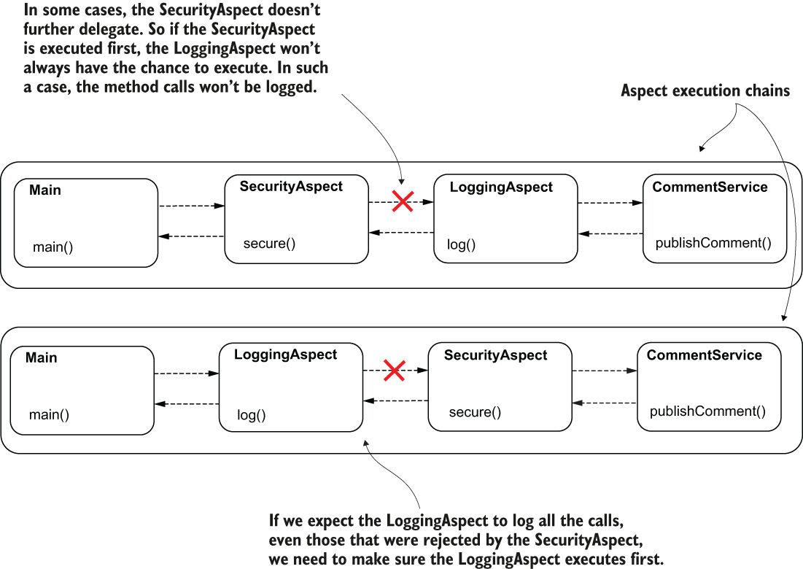

> **Hình 6.14** Thứ tự thực thi aspect rất quan trọng. Tùy thuộc vào yêu cầu của ứng dụng, bạn cần chọn một thứ tự cụ thể cho các aspect thực thi. Trong kịch bản này, `LoggingAspect` không thể ghi log tất cả các lần thực thi method nếu `SecurityAspect` thực thi trước.

Được rồi, thứ tự thực thi của các aspect đôi khi là quan trọng. Nhưng liệu chúng ta có thể định nghĩa thứ tự này không? Theo mặc định, Spring không đảm bảo thứ tự mà hai aspect trong cùng một chuỗi thực thi được gọi. Nếu thứ tự thực thi không quan trọng, bạn chỉ cần định nghĩa các aspect và để framework thực thi chúng theo bất kỳ thứ tự nào. Nếu bạn cần định nghĩa thứ tự thực thi của các aspect, bạn có thể dùng annotation `@Order`. Annotation này nhận một số thứ tự (một con số) đại diện cho vị trí trong chuỗi thực thi của một aspect cụ thể. Số càng nhỏ, aspect đó càng thực thi sớm. Nếu hai giá trị giống nhau, thứ tự thực thi lại không được xác định. Hãy thử annotation `@Order` trong một ví dụ.

Trong project có tên "sq-ch6-ex6", tôi định nghĩa hai aspect chặn method `publishComment()` của một bean `CommentService`. Trong listing tiếp theo, bạn tìm thấy aspect có tên `LoggingAspect`. Ban đầu chúng ta không định nghĩa thứ tự nào cho các aspect.

**Listing 6.12** Triển khai class LoggingAspect

```java
@Aspect
public class LoggingAspect {

   private Logger logger =
     Logger.getLogger(LoggingAspect.class.getName());

    @Around(value = "@annotation(ToLog)")
    public Object log(ProceedingJoinPoint joinPoint) throws Throwable {
      logger.info("Logging Aspect: Calling the intercepted method");

        Object returnedValue = joinPoint.proceed();                 ❶

        logger.info("Logging Aspect: Method executed and returned " +
                     returnedValue);

        return returnedValue;
    }
}
```

❶ Method `proceed()` ở đây ủy quyền tiếp trong chuỗi thực thi aspect. Nó có thể gọi aspect tiếp theo hoặc method bị chặn

Aspect thứ hai chúng ta định nghĩa cho ví dụ có tên `SecurityAspect`, như trình bày trong listing sau. Để giữ ví dụ đơn giản và cho phép bạn tập trung vào cuộc thảo luận, aspect này không làm gì đặc biệt. Giống như `LoggingAspect`, nó in một thông điệp ra console, để chúng ta dễ dàng quan sát khi nào nó được thực thi.

**Listing 6.13** Triển khai class SecurityAspect

```java
@Aspect
public class SecurityAspect {

    private Logger logger =
        Logger.getLogger(SecurityAspect.class.getName());

    @Around(value = "@annotation(ToLog)")
    public Object secure(ProceedingJoinPoint joinPoint) throws Throwable {
        logger.info("Security Aspect: Calling the intercepted method");

        Object returnedValue = joinPoint.proceed();                        ❶

        logger.info("Security Aspect: Method executed and returned " +
                     returnedValue);

        return returnedValue;
    }
}
```

❶ Method `proceed()` ở đây ủy quyền tiếp trong chuỗi thực thi aspect. Nó có thể gọi aspect tiếp theo hoặc method bị chặn.

Class `CommentService` tương tự như class chúng ta đã định nghĩa trong các ví dụ trước. Nhưng để bạn đọc thoải mái hơn, bạn cũng có thể tìm thấy nó trong listing sau.

**Listing 6.14** Triển khai class CommentService

```java
@Service
public class CommentService {

    private Logger logger =
      Logger.getLogger(CommentService.class.getName());

    @ToLog
    public String publishComment(Comment comment) {
      logger.info("Publishing comment:" + comment.getText());
        return "SUCCESS";
    }

}
```

Ngoài ra, hãy nhớ rằng cả hai aspect cần phải là bean trong Spring context. Với ví dụ này, tôi chọn dùng cách tiếp cận `@Bean` để thêm các bean vào context. Class cấu hình của tôi được trình bày tiếp theo.

**Listing 6.15** Khai báo các bean aspect trong class cấu hình

```java
@Configuration
@ComponentScan(basePackages = "services")
@EnableAspectJAutoProxy
public class ProjectConfig {

    @Bean                                             ❶
    public LoggingAspect loggingAspect() {
      return new LoggingAspect();
    }

    @Bean                                    ❶
    public SecurityAspect securityAspect() {
        return new SecurityAspect();
    }
}
```

❶ Cả hai aspect cần được thêm làm bean trong Spring context.

Method `main()` gọi method `publishComment()` của bean `CommentService`. Trong trường hợp của tôi, kết quả sau khi thực thi trông như đoạn mã sau:

```text
Sep 29, 2020 6:04:22 PM aspects.LoggingAspect log                       ❶
INFO: Logging Aspect: Calling the intercepted method                    ❶
Sep 29, 2020 6:04:22 PM aspects.SecurityAspect secure                   ❷
INFO: Security Aspect: Calling the intercepted method                   ❷
Sep 29, 2020 6:04:22 PM services.CommentService publishComment          ❸
INFO: Publishing comment:Demo comment                                   ❸
Sep 29, 2020 6:04:22 PM aspects.SecurityAspect secure                   ❹
INFO: Security Aspect: Method executed and returned SUCCESS             ❹
Sep 29, 2020 6:04:22 PM aspects.LoggingAspect log                       ❺
INFO: Logging Aspect: Method executed and returned SUCCESS              ❺
```

❶ `LoggingAspect` được gọi đầu tiên và ủy quyền cho `SecurityAspect`.  
❷ `SecurityAspect` được gọi thứ hai và ủy quyền cho method bị chặn.  
❸ Method bị chặn thực thi.  
❹ Method bị chặn trả về cho `SecurityAspect`.  
❺ `SecurityAspect` trả về cho `LoggingAspect`.

Hình 6.15 giúp bạn hình dung chuỗi thực thi và hiểu các log trong console.

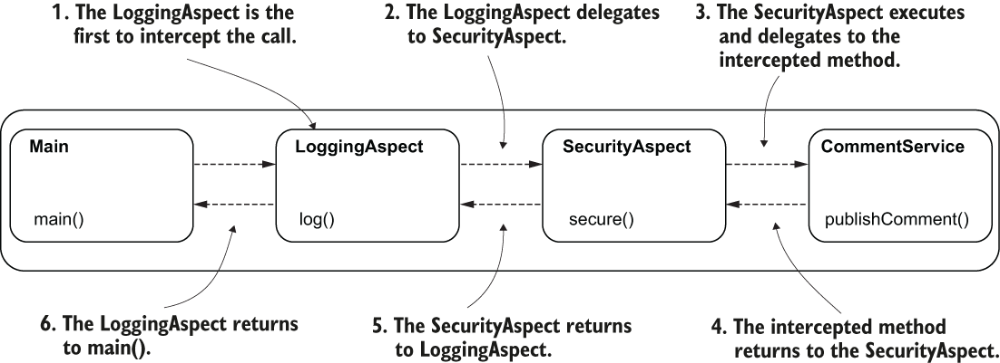

> **Hình 6.15** Luồng thực thi. `LoggingAspect` là aspect đầu tiên chặn lời gọi method. `LoggingAspect` ủy quyền tiếp trong chuỗi thực thi cho `SecurityAspect`, và aspect này tiếp tục ủy quyền lời gọi cho method bị chặn. Method bị chặn trả về cho `SecurityAspect`, và aspect này trả về tiếp cho `LoggingAspect`.

Để đảo ngược thứ tự thực thi của `LoggingAspect` và `SecurityAspect`, chúng ta dùng annotation `@Order`. Hãy quan sát trong đoạn mã sau cách tôi dùng annotation `@Order` để chỉ định vị trí thực thi cho `SecurityAspect` (xem ví dụ này trong project "sq-ch6-ex7"):

```java
@Aspect
@Order(1)                                  ❶
public class SecurityAspect {
     // Omitted code
}
```

❶ Gán một vị trí trong thứ tự thực thi cho aspect

Với `LoggingAspect`, tôi dùng `@Order` để đặt aspect này ở một vị trí thứ tự cao hơn, như trình bày trong đoạn sau:

```java
@Aspect
@Order(2)                             ❶
public class LoggingAspect {
  // Omitted code
}
```

❶ Đặt `LoggingAspect` ở vị trí thực thi thứ hai

Hãy chạy lại ứng dụng và quan sát rằng thứ tự thực thi của các aspect đã thay đổi. Log giờ đây sẽ trông như đoạn sau:

```text
Sep 29, 2020 6:38:20 PM aspects.SecurityAspect secure                   ❶
INFO: Security Aspect: Calling the intercepted method                   ❶
Sep 29, 2020 6:38:20 PM aspects.LoggingAspect log                       ❷
INFO: Logging Aspect: Calling the intercepted method                    ❷
Sep 29, 2020 6:38:20 PM services.CommentService publishComment          ❸
INFO: Publishing comment:Demo comment                                   ❸
Sep 29, 2020 6:38:20 PM aspects.LoggingAspect log                       ❹
INFO: Logging Aspect: Method executed and returned SUCCESS              ❹
Sep 29, 2020 6:38:20 PM aspects.SecurityAspect secure                   ❺
INFO: Security Aspect: Method executed and returned SUCCESS             ❺
```

❶ `SecurityAspect` là aspect đầu tiên chặn lời gọi method và ủy quyền tiếp trong chuỗi thực thi cho `LoggingAspect`.  
❷ `LoggingAspect` thực thi và ủy quyền tiếp cho method bị chặn.  
❸ Method bị chặn thực thi và trả về cho `LoggingAspect`.  
❹ `LoggingAspect` thực thi và trả về cho `SecurityAspect`.  
❺ `SecurityAspect` trả về cho method `main()`, nơi thực hiện lời gọi ban đầu.

Hình 6.16 giúp bạn hình dung chuỗi thực thi và hiểu các log trong console.

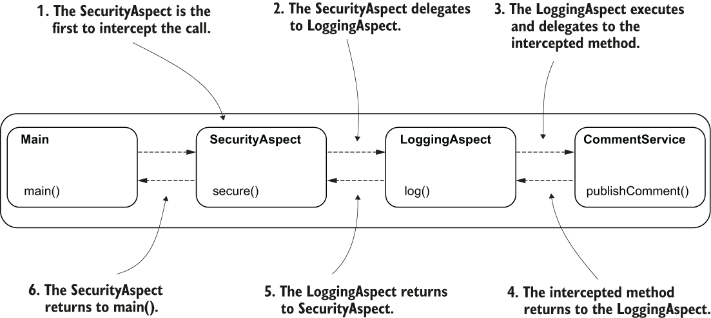

> **Hình 6.16** Luồng thực thi sau khi thay đổi thứ tự của các aspect. `SecurityAspect` là aspect đầu tiên chặn lời gọi method và ủy quyền tiếp trong chuỗi thực thi cho `LoggingAspect`, và aspect này tiếp tục ủy quyền lời gọi cho method bị chặn. Method bị chặn trả về cho `LoggingAspect`, và aspect này trả về tiếp cho `SecurityAspect`.

## Tóm tắt

- Aspect là một đối tượng chặn lời gọi method và có thể thực thi logic trước, sau, và thậm chí thay cho việc thực thi method bị chặn. Điều này giúp bạn tách rời một phần mã khỏi phần triển khai nghiệp vụ và làm ứng dụng dễ bảo trì hơn.
- Dùng aspect, bạn có thể viết logic thực thi cùng với việc thực thi của một method trong khi hoàn toàn tách rời khỏi method đó. Bằng cách này, người đọc mã chỉ thấy những gì liên quan đến phần triển khai nghiệp vụ.
- Tuy nhiên, aspect có thể là một công cụ nguy hiểm. Việc thiết kế quá mức (overengineering) mã của bạn bằng aspect sẽ khiến ứng dụng khó bảo trì hơn. Bạn không cần dùng aspect ở mọi nơi. Khi dùng chúng, hãy đảm bảo chúng thực sự giúp ích cho phần triển khai của bạn.
- Aspect hỗ trợ nhiều tính năng thiết yếu của Spring như transaction và bảo mật các method.
- Để định nghĩa một aspect trong Spring, bạn đánh dấu class triển khai logic của aspect bằng annotation `@Aspect`. Nhưng hãy nhớ rằng Spring cần quản lý một instance của class này, nên bạn cũng cần thêm một bean thuộc kiểu của nó vào Spring context.
- Để báo cho Spring biết những method nào một aspect cần chặn, bạn dùng các biểu thức AspectJ pointcut. Bạn viết những biểu thức này làm giá trị cho các advice annotation. Spring cung cấp cho bạn năm advice annotation: `@Around`, `@Before`, `@After`, `@AfterThrowing`, và `@AfterReturning`. Trong hầu hết các trường hợp, chúng ta dùng `@Around`, cũng là annotation mạnh mẽ nhất.
- Nhiều aspect có thể chặn cùng một lời gọi method. Trong trường hợp này, bạn nên định nghĩa thứ tự thực thi cho các aspect bằng annotation `@Order`.
