# 7 Tìm hiểu Spring Boot và Spring MVC

**Chương này bao gồm**

- Triển khai web app đầu tiên của bạn
- Sử dụng Spring Boot trong việc phát triển ứng dụng Spring
- Tìm hiểu kiến trúc Spring MVC

Giờ đây khi bạn đã nắm được tất cả những kiến thức cơ bản cần thiết về Spring, hãy tập trung vào web app và cách bạn dùng Spring để triển khai chúng. Bạn có thể dùng mọi tính năng của Spring mà chúng ta đã thảo luận để triển khai bất kỳ loại ứng dụng nào. Nhưng thông thường với Spring, các ứng dụng bạn triển khai là web app. Trong các chương từ 1 đến 6, chúng ta đã thảo luận về Spring context và aspect, những thứ bắt buộc phải hiểu để nắm được nội dung tiếp theo trong sách (bao gồm cả những gì bạn sẽ thấy trong chương này). Nếu bạn nhảy thẳng đến chương này mà chưa biết cách làm việc với Spring context và aspect, bạn có thể thấy nội dung thảo luận của chúng ta khó hiểu. Tôi thực sự khuyên bạn hãy chắc chắn mình đã biết những điều cơ bản về việc sử dụng framework trước khi đi tiếp.

Spring làm cho việc phát triển web app trở nên đơn giản. Chúng ta sẽ bắt đầu chương này bằng việc thảo luận web app là gì và chúng hoạt động như thế nào.

Để triển khai web app, chúng ta sẽ dùng một dự án trong hệ sinh thái Spring có tên là Spring Boot. Trong mục 7.2, chúng ta sẽ thảo luận về Spring Boot và lý do nó thiết yếu trong việc triển khai ứng dụng. Trong mục 7.3, chúng ta sẽ thảo luận kiến trúc chuẩn của một Spring web app đơn giản, và chúng ta sẽ triển khai một web app bằng Spring Boot. Đến cuối chương này, bạn sẽ hiểu cách một web app hoạt động và có thể triển khai một web app cơ bản với Spring.

Mục đích chính của chương này là giúp bạn hiểu nền tảng hỗ trợ cho việc triển khai web app. Trong chương 8 và 9, chúng ta sẽ triển khai những tính năng chính mà bạn thấy ở hầu hết các web app trong môi trường production. Nhưng mọi thứ chúng ta thảo luận trong các chương tiếp theo đó đều dựa trên nền tảng của chương này.

## 7.1 Web app là gì?

Trong mục này, chúng ta xem xét web app là gì. Tôi chắc rằng bạn dùng web app hằng ngày. Có lẽ bạn vừa để lại vài tab đang mở trong trình duyệt web trước khi bắt đầu đọc chương này. Thậm chí có thể bạn không đọc cuốn sách này trên giấy mà đang dùng web app Manning liveBook để đọc nó.

Bất kỳ ứng dụng nào bạn truy cập thông qua trình duyệt web đều là web app. Nhiều năm trước, chúng ta dùng các ứng dụng desktop cài trên máy tính cho hầu như mọi việc mình làm (hình 7.1). Theo thời gian, hầu hết các ứng dụng này trở nên có thể truy cập được qua trình duyệt web. Truy cập một ứng dụng trong trình duyệt khiến việc sử dụng nó thoải mái hơn. Bạn không phải cài đặt gì cả, và bạn có thể dùng nó từ bất kỳ thiết bị nào có kết nối internet, chẳng hạn máy tính bảng hay điện thoại thông minh.

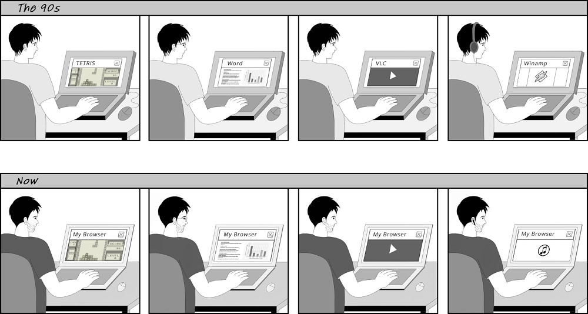

> **Hình 7.1** Thời thế thay đổi. Vào những năm 1990, chúng ta dùng ứng dụng desktop cho mọi thứ. Ngày nay, hầu như mọi ứng dụng chúng ta dùng đều là web app. Là lập trình viên, việc học cách triển khai web app là thiết yếu đối với bạn.

Trong mục này, tôi muốn đảm bảo bạn có một cái nhìn tổng quan rõ ràng về những gì chúng ta sắp triển khai. Web app là gì, và chúng ta cần gì để xây dựng và chạy một ứng dụng như vậy? Một khi bạn đã có hình dung rõ ràng về web app, chúng ta sẽ tiếp tục triển khai một web app bằng Spring.

### 7.1.1 Tổng quan chung về web app

Trong mục này, chúng ta nhìn ở mức tổng quát xem web app là gì từ góc độ kỹ thuật. Cái nhìn tổng quan này cho phép chúng ta thảo luận chi tiết hơn về các lựa chọn để tạo ra web app.

Trước hết, một web app gồm hai phần:

- *Phía client* là phần mà người dùng tương tác trực tiếp. Trình duyệt web đại diện cho phía client của một web app. Trình duyệt gửi request đến một web server, nhận response từ đó, và cung cấp cách để người dùng tương tác với ứng dụng. Chúng ta cũng gọi phía client của web app là frontend.
- *Phía server* nhận request từ client và gửi dữ liệu trở lại trong response. Phía server triển khai logic xử lý, và đôi khi lưu trữ, dữ liệu mà client yêu cầu trước khi gửi response. Chúng ta cũng gọi phía server của web app là backend.

Hình 7.2 trình bày bức tranh tổng thể của một web app.

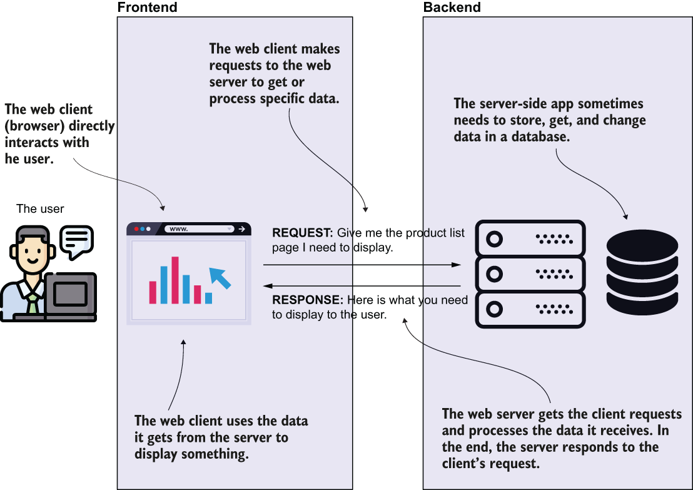

> **Hình 7.2** Bức tranh tổng thể của một web app. Người dùng tương tác với ứng dụng thông qua frontend của nó. Frontend giao tiếp với backend để thực thi logic theo yêu cầu của người dùng và lấy dữ liệu để hiển thị. Backend thực thi logic nghiệp vụ và đôi khi lưu trữ dữ liệu trong database hoặc giao tiếp với các dịch vụ bên ngoài khác.

Khi thảo luận về web app, chúng ta thường nói đến một client và một server, nhưng điều quan trọng cần nhớ là backend phục vụ nhiều client đồng thời. Rất nhiều người có thể dùng cùng một ứng dụng vào cùng một thời điểm trên các nền tảng khác nhau. Người dùng có thể truy cập ứng dụng thông qua trình duyệt trên máy tính, điện thoại, máy tính bảng, v.v. (hình 7.3).

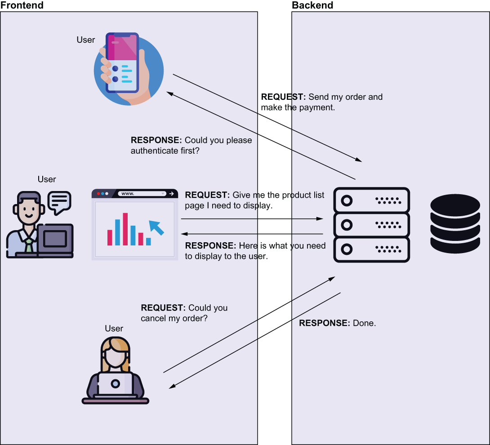

> **Hình 7.3** Khi thảo luận về web app, chúng ta nói đến client như thể chỉ có một instance, nhưng hãy nhớ rằng nhiều người dùng truy cập trình duyệt và dùng cùng một web app đồng thời. Mỗi người dùng tạo ra các request riêng cho những hành động cụ thể mà họ cần thực thi. Điều này quan trọng vì nó có nghĩa là một số thao tác trên backend được thực thi đồng thời. Nếu bạn viết code truy cập và thay đổi cùng một tài nguyên, ứng dụng của bạn có thể hoạt động sai do các tình huống race condition.

### 7.1.2 Các cách khác nhau để triển khai web app với Spring

Trong mục này, chúng ta thảo luận hai thiết kế chính mà bạn có thể dùng để triển khai một ứng dụng web. Chúng ta sẽ triển khai ứng dụng theo cả hai cách này trong các chương từ 8 đến 10, và chúng ta sẽ thảo luận chi tiết triển khai khi đi sâu vào việc hiện thực từng cách. Nhưng hiện tại, tôi muốn bạn nhận thức được các lựa chọn của mình và có hiểu biết chung về những lựa chọn này. Điều quan trọng là biết bạn có thể tạo web app theo những cách nào để tránh bị nhầm lẫn về sau khi triển khai các ví dụ.

Chúng ta phân loại các cách tiếp cận để tạo web app như sau:

1. *Ứng dụng mà backend cung cấp view đã được chuẩn bị đầy đủ để đáp lại request của client.* Trong các ứng dụng này, trình duyệt trực tiếp diễn giải dữ liệu nhận được từ backend và hiển thị thông tin đó cho người dùng. Chúng ta thảo luận cách tiếp cận này và triển khai một ứng dụng đơn giản để chứng minh nó trong chương này. Sau đó chúng ta tiếp tục thảo luận với những chi tiết phức tạp hơn liên quan đến ứng dụng production trong chương 8 và 9.
2. *Ứng dụng sử dụng tách biệt frontend-backend.* Với các ứng dụng này, backend chỉ phục vụ dữ liệu thô. Trình duyệt không trực tiếp hiển thị dữ liệu trong response của backend. Trình duyệt chạy một ứng dụng frontend riêng biệt, ứng dụng này nhận các response của backend, xử lý dữ liệu và chỉ dẫn cho trình duyệt biết cần hiển thị gì. Chúng ta thảo luận cách tiếp cận này và triển khai các ví dụ về nó trong chương 9.

Hình 7.4 trình bày cách tiếp cận thứ nhất, trong đó ứng dụng không sử dụng tách biệt frontend-backend. Với các ứng dụng này, hầu như mọi thứ diễn ra ở phía backend. Backend nhận các request đại diện cho hành động của người dùng và thực thi một số logic. Cuối cùng, server phản hồi bằng những gì trình duyệt cần hiển thị. Backend phản hồi với dữ liệu ở các định dạng mà trình duyệt có thể diễn giải và hiển thị, chẳng hạn HTML, CSS, hình ảnh, v.v. Nó cũng có thể gửi các script viết bằng những ngôn ngữ mà trình duyệt có thể hiểu và thực thi (chẳng hạn JavaScript).

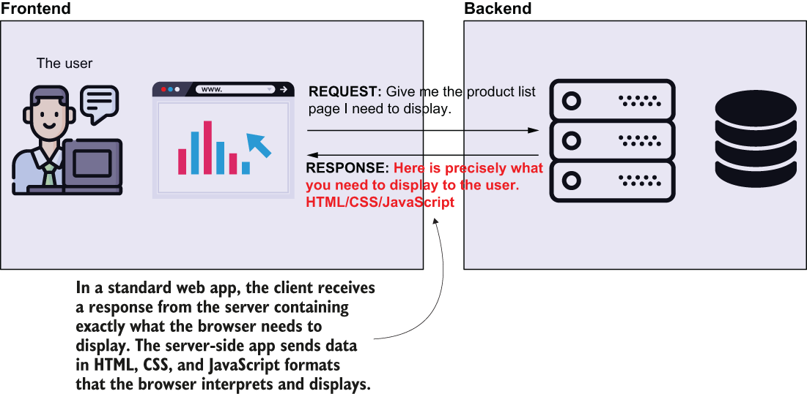

> **Hình 7.4** Khi một web app không có tách biệt frontend-backend, trình duyệt hiển thị chính xác những gì nó nhận được từ server. Server nhận request từ trình duyệt, thực thi một số logic rồi phản hồi. Trong response, backend cung cấp nội dung được định dạng dưới dạng HTML, CSS và các dạng khác mà trình duyệt diễn giải để hiển thị.

Hình 7.5 cho thấy một ứng dụng sử dụng tách biệt frontend-backend. Hãy so sánh response của server trong hình 7.5 với response mà server gửi lại trong hình 7.4. Thay vì bảo trình duyệt chính xác cần hiển thị gì, giờ đây server chỉ gửi dữ liệu thô. Trình duyệt chạy một ứng dụng frontend độc lập mà nó tải về từ server ở request ban đầu. Ứng dụng frontend này nhận response thô của server, diễn giải nó và quyết định cách hiển thị thông tin. Chúng ta sẽ thảo luận thêm chi tiết về cách tiếp cận này trong chương 9.

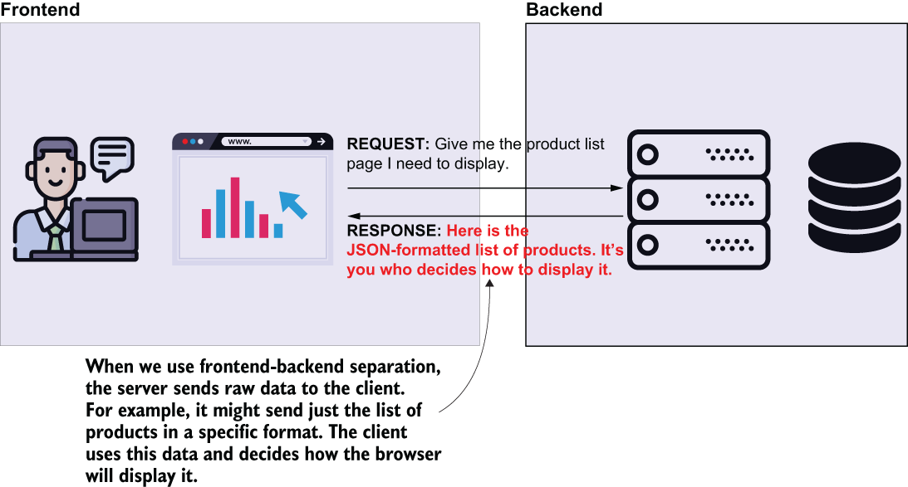

> **Hình 7.5** Sử dụng tách biệt frontend-backend. Server không phản hồi bằng chính xác dữ liệu mà trình duyệt cần hiển thị. Backend gửi dữ liệu cho client nhưng không cho trình duyệt biết cách hiển thị dữ liệu đó hay phải làm gì với nó. Giờ đây backend chỉ gửi dữ liệu thô (thường ở định dạng dễ phân tích như JSON hoặc XML). Trình duyệt thực thi một ứng dụng frontend nhận response thô của server và xử lý nó để hiển thị dữ liệu.

Bạn sẽ gặp cả hai cách tiếp cận này trong các ứng dụng production. Đôi khi các lập trình viên gọi cách tiếp cận tách biệt frontend-backend là cách tiếp cận hiện đại. Việc tách biệt frontend và backend giúp việc phát triển dễ quản lý hơn đối với các ứng dụng lớn. Các đội khác nhau nhận trách nhiệm triển khai backend và frontend, cho phép nhiều lập trình viên hơn cộng tác để phát triển ứng dụng. Ngoài ra, việc deploy frontend và backend có thể được quản lý độc lập. Với một ứng dụng lớn, sự linh hoạt này cũng là một lợi ích đáng kể.

Cách tiếp cận còn lại, không sử dụng tách biệt frontend-backend, chủ yếu dành cho các ứng dụng nhỏ. Sau khi thảo luận chi tiết cả hai cách tiếp cận, tôi sẽ chỉ cho bạn ưu điểm của cả hai phương pháp, và bạn sẽ biết khi nào nên chọn cách tiếp cận nào dựa trên nhu cầu ứng dụng của mình.

### 7.1.3 Sử dụng servlet container trong phát triển web app

Trong mục này, chúng ta phân tích sâu hơn về việc bạn cần gì và tại sao để xây dựng một web app với Spring. Cho đến giờ chúng ta đã thấy rằng một web app có frontend và backend. Nhưng chúng ta chưa thảo luận rõ ràng về việc triển khai web app với Spring. Dĩ nhiên, mục đích của chúng ta là học Spring và triển khai ứng dụng bằng nó, nên chúng ta phải tiến thêm một bước và tìm hiểu xem cần gì để triển khai web app với framework này.

Một trong những điều quan trọng nhất cần xem xét là giao tiếp giữa client và server. Trình duyệt web dùng một giao thức có tên Hypertext Transfer Protocol (HTTP) để giao tiếp với server qua mạng. Giao thức này mô tả chính xác cách client và server trao đổi dữ liệu qua mạng. Nhưng trừ khi bạn đam mê về mạng máy tính, bạn không cần hiểu chi tiết cách HTTP hoạt động để viết web app. Là một lập trình viên phần mềm, bạn được kỳ vọng biết rằng các thành phần của web app dùng giao thức này để trao đổi dữ liệu theo kiểu request-response. Client gửi request đến server, và server phản hồi. Client chờ response sau mỗi request nó gửi đi. Trong phụ lục C, bạn sẽ tìm thấy mọi chi tiết cần biết về HTTP để hiểu nội dung thảo luận trong các chương từ 7 đến 9.

Nhưng điều đó có nghĩa là ứng dụng của bạn cần biết cách xử lý các thông điệp HTTP? Ồ, bạn có thể tự triển khai khả năng này nếu muốn, nhưng trừ khi bạn muốn tìm chút niềm vui khi viết những chức năng cấp thấp, bạn sẽ dùng một thành phần đã được thiết kế sẵn để hiểu HTTP.

Thực tế, thứ bạn cần không chỉ là một thứ hiểu HTTP, mà là một thứ có thể dịch HTTP request và response cho một ứng dụng Java. Thứ đó chính là servlet container (đôi khi được gọi là web server): một trình phiên dịch các thông điệp HTTP cho ứng dụng Java của bạn. Bằng cách này, ứng dụng Java của bạn không cần lo việc triển khai tầng giao tiếp. Một trong những triển khai servlet container được ưa chuộng nhất là Tomcat, đây cũng là dependency mà chúng ta sẽ dùng cho các ví dụ trong sách này.

> **LƯU Ý** Chúng ta dùng Tomcat cho các ví dụ trong sách này, nhưng bạn có thể dùng các lựa chọn thay thế cho ứng dụng Spring của mình. Danh sách các giải pháp được dùng trong ứng dụng thực tế rất dài. Trong số đó, bạn có thể thấy Jetty (https://www.eclipse.org/jetty/), JBoss (https://www.jboss.org/) và Payara (https://www.payara.fish/).

Hình 7.6 là biểu diễn trực quan của một servlet container (Tomcat) trong kiến trúc ứng dụng của chúng ta.

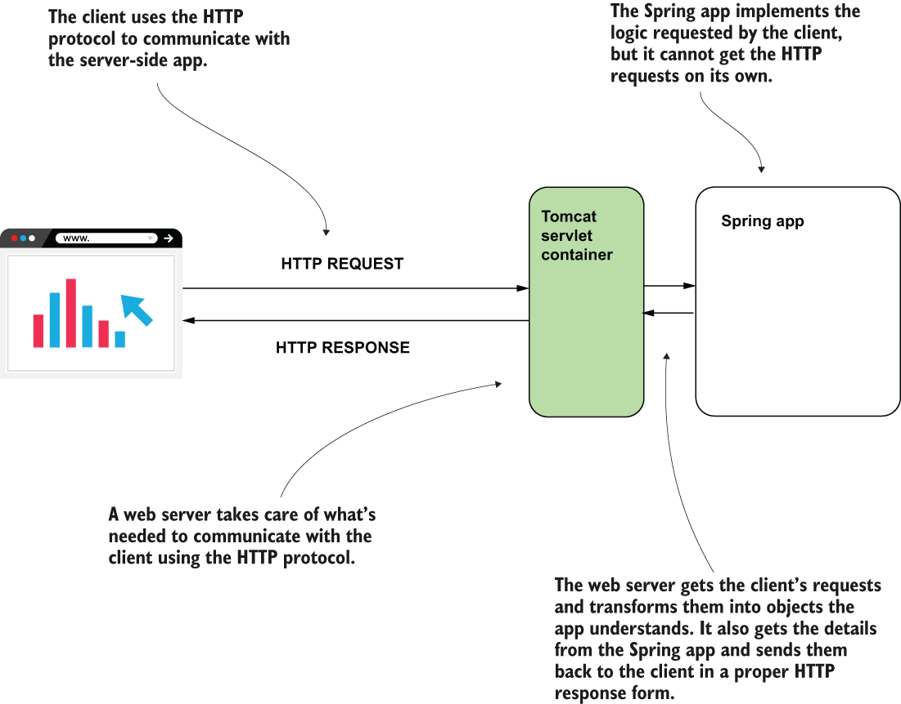

> **Hình 7.6** Một servlet container (ví dụ Tomcat) "nói" được HTTP. Nó dịch HTTP request cho ứng dụng Spring của chúng ta và dịch response của ứng dụng thành HTTP response. Bằng cách này, chúng ta không cần quan tâm đến giao thức được dùng để giao tiếp trên mạng, vì chúng ta đơn giản viết mọi thứ dưới dạng các đối tượng và method Java.

Nhưng nếu đó là tất cả những gì một servlet container làm, tại sao lại gọi nó là "servlet" container? Servlet là gì? Servlet chẳng qua là một đối tượng Java tương tác trực tiếp với servlet container. Khi servlet container nhận được một HTTP request, nó gọi một method của đối tượng servlet và cung cấp request đó làm tham số. Cùng method đó cũng nhận một tham số đại diện cho HTTP response, được servlet dùng để thiết lập response gửi lại cho client đã tạo ra request.

Cách đây một thời gian, servlet là thành phần quan trọng nhất của một web app backend từ góc nhìn của lập trình viên. Giả sử một lập trình viên phải triển khai một trang mới có thể truy cập tại một đường dẫn cụ thể trong URL (ví dụ /home/profile/edit, v.v.) cho một web app. Lập trình viên cần tạo một instance servlet mới, cấu hình nó trong servlet container và gán nó cho một đường dẫn cụ thể (hình 7.7). Servlet chứa logic gắn với request của người dùng và khả năng chuẩn bị response, bao gồm cả thông tin cho trình duyệt về cách hiển thị response. Với bất kỳ đường dẫn nào mà web client có thể gọi, lập trình viên cần thêm instance vào servlet container và cấu hình nó. Vì một thành phần như vậy quản lý các instance servlet mà bạn thêm vào context của nó, chúng ta gọi nó là servlet container. Về cơ bản, nó có một context chứa các instance servlet mà nó kiểm soát, giống như Spring làm với các bean của mình. Vì lý do này, chúng ta gọi một thành phần như Tomcat là servlet container.

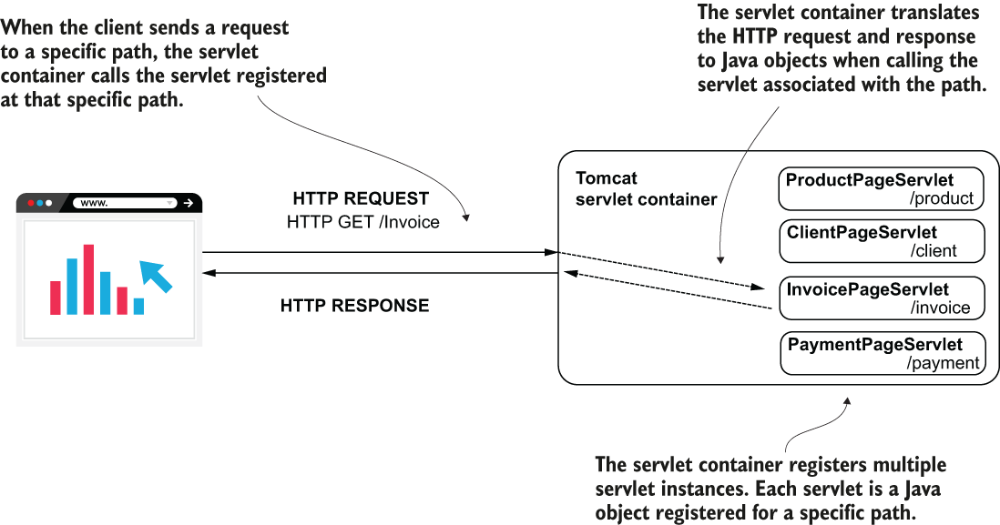

> **Hình 7.7** Servlet container (Tomcat) đăng ký nhiều instance servlet. Mỗi servlet được gắn với một đường dẫn. Khi client gửi request, Tomcat gọi một method của servlet gắn với đường dẫn mà client yêu cầu. Servlet lấy các giá trị trong request và xây dựng response mà Tomcat gửi lại cho client.

Như bạn sẽ học trong chương này, chúng ta thường không tự tạo các instance servlet. Chúng ta sẽ dùng một servlet với các ứng dụng Spring mà ta phát triển bằng Spring, nhưng bạn sẽ không cần tự viết nó, nên bạn không phải tập trung vào việc học cách triển khai servlet. Nhưng bạn cần nhớ rằng servlet là điểm vào cho logic của ứng dụng. Nó là thành phần mà servlet container (Tomcat, trong trường hợp của chúng ta) tương tác trực tiếp. Đó là cách dữ liệu request đi vào ứng dụng của bạn và cách response đi qua Tomcat trở lại client (hình 7.8).

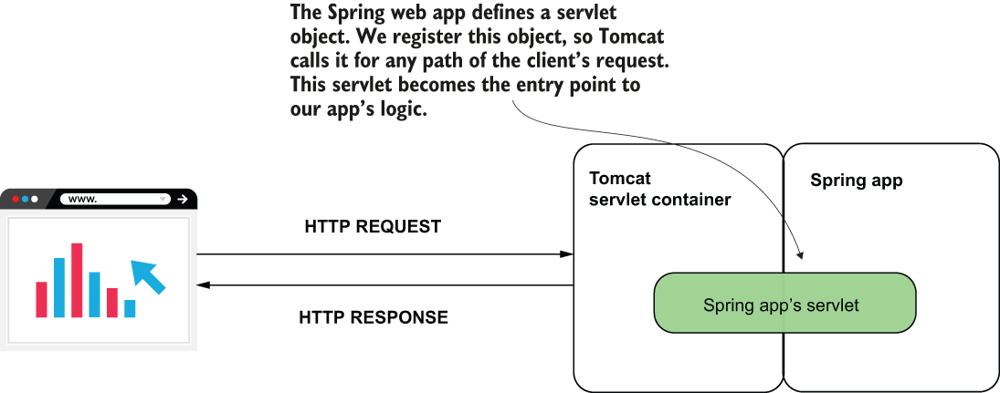

> **Hình 7.8** Ứng dụng Spring định nghĩa một đối tượng servlet và đăng ký nó vào servlet container. Giờ đây cả Spring lẫn servlet container đều biết đối tượng này và có thể quản lý nó. Servlet container gọi đối tượng này cho bất kỳ request nào của client, cho phép servlet quản lý request và response.

## 7.2 Điều kỳ diệu của Spring Boot

Để tạo một Spring web app, chúng ta cần cấu hình một servlet container, tạo một instance servlet, rồi đảm bảo cấu hình đúng instance servlet này sao cho Tomcat gọi nó cho bất kỳ request nào của client. Thật đau đầu khi phải viết nhiều cấu hình đến vậy! Nhiều năm trước, khi tôi dạy Spring 3 (phiên bản Spring mới nhất vào thời điểm đó) và chúng tôi cấu hình web app, đây là phần mà cả học viên lẫn tôi đều ghét nhất. May mắn thay, thời thế đã thay đổi, và ngày nay tôi không phải làm phiền bạn bằng việc dạy những cấu hình như thế.

Trong mục này, chúng ta sẽ thảo luận về Spring Boot, một công cụ để triển khai các ứng dụng Spring hiện đại. Spring Boot hiện là một trong những dự án được đánh giá cao nhất trong hệ sinh thái Spring. Nó giúp bạn tạo ứng dụng Spring hiệu quả hơn và tập trung vào code nghiệp vụ bạn viết bằng cách loại bỏ một phần lớn code mà bạn từng phải viết cho cấu hình. Đặc biệt trong thế giới của kiến trúc hướng dịch vụ (SOA) và microservice, nơi bạn tạo ứng dụng thường xuyên hơn (được thảo luận trong phụ lục A), việc tránh được nỗi khổ viết cấu hình là rất hữu ích.

Dưới đây là những gì tôi coi là các tính năng quan trọng nhất của Spring Boot và những gì chúng mang lại:

- *Đơn giản hóa việc tạo dự án*—Bạn có thể dùng một dịch vụ khởi tạo dự án để có được một ứng dụng khung trống nhưng đã được cấu hình.
- *Dependency starter*—Spring Boot nhóm một số dependency nhất định được dùng cho một mục đích cụ thể vào các dependency starter. Bạn không cần tìm hiểu tất cả các dependency bắt buộc phải thêm vào dự án cho một mục đích cụ thể, cũng không cần biết nên dùng phiên bản nào để tương thích.
- *Autoconfiguration dựa trên dependency*—Dựa trên các dependency bạn đã thêm vào dự án, Spring Boot định nghĩa một số cấu hình mặc định. Thay vì tự viết tất cả cấu hình, bạn chỉ cần thay đổi những cấu hình do Spring Boot cung cấp mà không phù hợp với nhu cầu của bạn. Việc thay đổi cấu hình có lẽ cần ít code hơn (nếu có).

Hãy thảo luận sâu hơn về những tính năng thiết yếu này của Spring Boot và áp dụng chúng. Ví dụ đầu tiên chính là Spring web app đầu tiên mà chúng ta viết.

### 7.2.1 Sử dụng dịch vụ khởi tạo dự án để tạo dự án Spring Boot

Trong mục này, chúng ta thảo luận về việc dùng một dịch vụ khởi tạo dự án để tạo dự án Spring Boot. Một số người không coi trọng dịch vụ khởi tạo dự án lắm, nhưng tôi không thể diễn tả hết mình biết ơn thế nào vì tính năng này tồn tại. Là lập trình viên, bạn không tạo nhiều dự án mỗi ngày, nên bạn không thấy được lợi thế lớn của tính năng này. Với cả học viên lẫn giảng viên, những người viết rất nhiều dự án Spring Boot mỗi ngày, tính năng này tiết kiệm cho bạn hàng giờ làm việc cho những thao tác lặp đi lặp lại, vụn vặt mà bạn phải làm nếu bắt đầu một dự án từ con số không. Để học cách nó có thể giúp bạn, hãy dùng một dịch vụ khởi tạo dự án để tạo một dự án tên là "sq-ch7-ex1".

Một số IDE tích hợp trực tiếp với dịch vụ khởi tạo dự án, và một số thì không. Ví dụ, trong IntelliJ Ultimate hoặc STS, bạn sẽ thấy tính năng này khi tạo dự án mới (hình 7.9)—nhưng nếu bạn dùng IntelliJ Community thì không có.

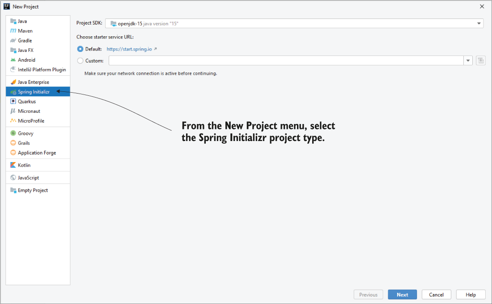

> **Hình 7.9** Một số IDE tích hợp trực tiếp với dịch vụ khởi tạo dự án. Ví dụ, trong IntelliJ Ultimate, bạn có thể chọn Spring Initializr từ menu New Project để tạo một ứng dụng Spring Boot bằng dịch vụ khởi tạo dự án.

Nếu IDE của bạn hỗ trợ tính năng này, bạn có lẽ sẽ thấy nó có tên Spring Initializr trong menu tạo dự án. Nhưng nếu IDE của bạn không hỗ trợ tích hợp trực tiếp với dịch vụ khởi tạo dự án Spring Boot, bạn có thể dùng tính năng này bằng cách truy cập trực tiếp http://start.spring.io trong trình duyệt. Dịch vụ này sẽ giúp bạn tạo một dự án mà bạn có thể import vào bất kỳ IDE nào. Hãy dùng cách tiếp cận này để tạo dự án đầu tiên của chúng ta.

Danh sách sau tóm tắt các bước chúng ta sẽ thực hiện để tạo dự án Spring Boot bằng start.spring.io (hình 7.10):

1. Truy cập start.spring.io trong trình duyệt web.
2. Chọn các thuộc tính của dự án (ngôn ngữ, phiên bản, công cụ build, v.v.).
3. Chọn các dependency cần thiết mà bạn muốn thêm vào dự án.
4. Dùng nút Generate để tải về dự án đã được nén.
5. Giải nén dự án và mở nó trong IDE của bạn.

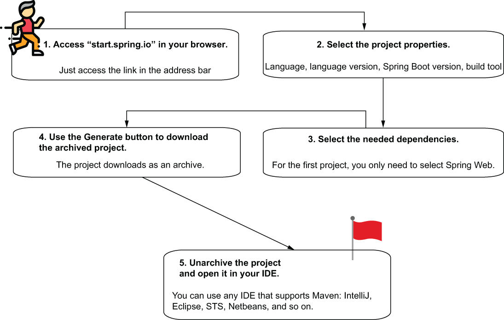

> **Hình 7.10** Các bước để tạo dự án Spring Boot bằng start.spring.io. Truy cập start.spring.io trong trình duyệt, chọn các thuộc tính và các dependency cần thiết, rồi tải về dự án đã nén. Sau đó mở dự án trong trình duyệt của bạn.

Khi bạn truy cập start.spring.io trong trình duyệt web, bạn sẽ thấy một giao diện tương tự như trong hình 7.11. Bạn phải chỉ định một số thuộc tính của dự án, như công cụ build bạn muốn dùng giữa Maven và Gradle và phiên bản Java bạn muốn sử dụng. Spring Boot thậm chí còn cho bạn khả năng đổi cú pháp của ứng dụng sang Kotlin hoặc Groovy.

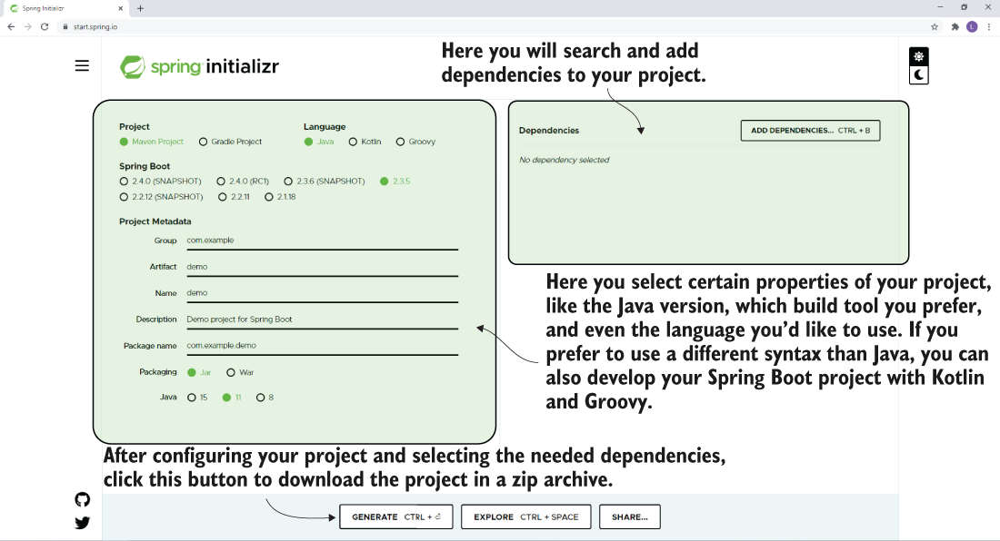

> **Hình 7.11** Giao diện start.spring.io. Sau khi truy cập start.spring.io, bạn có thể chỉ định các cấu hình chính của dự án, chọn các dependency và tải về dự án đã nén.

Spring Boot cho chúng ta nhiều lựa chọn, nhưng chúng ta sẽ tiếp tục dùng Maven và Java 11 xuyên suốt cuốn sách để giữ các ví dụ nhất quán. Hình 7.12 cho bạn thấy một ví dụ về việc điền các trường để tạo một dự án Spring Boot mới cho ví dụ của chúng ta. Trong ví dụ này, chúng ta chỉ cần thêm một dependency tên là Spring Web. Dependency này thêm mọi thứ mà dự án của chúng ta cần để trở thành một Spring web app.

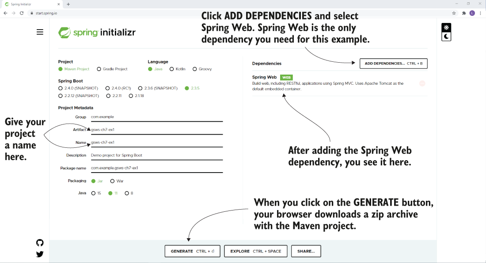

> **Hình 7.12** Với ví dụ của chúng ta, chúng ta cần thêm dependency Spring Web. Bạn có thể thêm nó bằng nút Add Dependencies ở phía trên bên phải cửa sổ. Bạn cũng cần đặt tên cho dự án của mình.

Khi bạn nhấn nút Generate, trình duyệt tải về một file nén zip chứa dự án Spring Boot. Bây giờ chúng ta thảo luận những điều chính mà Spring Initializr đã cấu hình vào dự án Maven của bạn (hình 7.13):

- Class main của ứng dụng Spring
- POM parent của Spring Boot
- Các dependency
- Plugin Maven của Spring Boot
- File properties

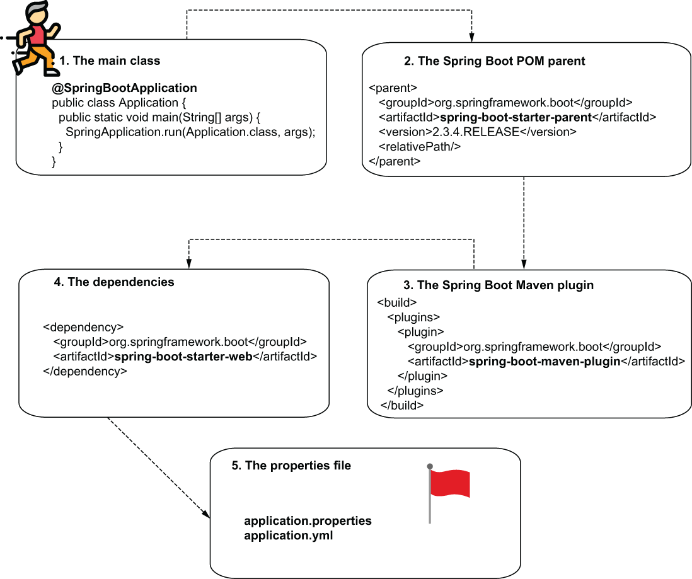

> **Hình 7.13** Khi tạo dự án Spring Boot bằng Spring Initializr, nó thực hiện một số cấu hình cho dự án mà bạn không thấy trong một dự án Maven thuần túy.

Bạn cần nhận thức được dự án của mình trông như thế nào. Vì lý do này, chúng ta sẽ thảo luận từng cấu hình.

**CLASS MAIN CỦA ỨNG DỤNG DO START.SPRING.IO TẠO RA**

Điều đầu tiên cần xem là class main của ứng dụng. Giải nén file đã tải về và mở nó trong IDE của bạn. Bạn có thể thấy rằng Spring Initializr đã thêm class `Main` vào ứng dụng và cả một số cấu hình trong file `pom.xml`. Class `Main` của một ứng dụng Spring Boot được đánh dấu bằng annotation `@SpringBootApplication`, và nó trông tương tự đoạn code sau:

```java
@SpringBootApplication               ❶
public class Main {

  public static void main(String[] args) {
    SpringApplication.run(Main.class, args);
  }
}
```

❶ Annotation này định nghĩa class `Main` của một ứng dụng Spring Boot.

Spring Initializr đã sinh ra toàn bộ code này. Trong sách này, chúng ta sẽ chỉ tập trung vào những gì liên quan đến các ví dụ của mình. Chẳng hạn, tôi sẽ không đi vào chi tiết method `SpringApplication.run()` làm gì và Spring Boot sử dụng chính xác annotation `@SpringBootApplication` như thế nào. Những chi tiết này không liên quan đến những gì bạn đang học lúc này. Spring Boot là chủ đề của cả một cuốn sách. Nhưng đến một lúc nào đó bạn chắc chắn sẽ muốn hiểu chi tiết cách các ứng dụng Spring Boot hoạt động, và cho việc này tôi khuyên bạn đọc *Spring Boot in Action* của Craig Walls (Manning, 2015) và *Spring Boot: Up and Running* của Mark Heckler (O'Reilly Media, 2021).

**MAVEN PARENT CỦA SPRING BOOT DO START.SPRING.IO CẤU HÌNH**

Thứ hai, chúng ta xem file `pom.xml`. Nếu bạn mở file `pom.xml` của dự án, bạn sẽ thấy dịch vụ khởi tạo dự án cũng đã thêm một số chi tiết ở đây. Một trong những chi tiết quan trọng nhất bạn sẽ thấy là node parent của Spring Boot, trông tương tự đoạn code sau:

```xml
<parent>
   <groupId>org.springframework.boot</groupId>
   <artifactId>spring-boot-starter-parent</artifactId>
   <version>2.3.4.RELEASE</version>
   <relativePath/>
</parent>
```

Một trong những điều thiết yếu mà parent này làm là cung cấp cho bạn các phiên bản tương thích cho những dependency bạn sẽ thêm vào dự án. Bạn sẽ thấy rằng trong hầu hết các trường hợp chúng ta không chỉ định phiên bản cho một dependency mình dùng. Chúng ta để (và điều này được khuyến nghị) Spring Boot chọn phiên bản của dependency để đảm bảo chúng ta không gặp phải tình trạng không tương thích.

**PLUGIN MAVEN CỦA SPRING BOOT DO START.SPRING.IO CẤU HÌNH**

Tiếp theo chúng ta xem plugin Maven của Spring Boot được start.spring.io cấu hình khi tạo dự án. Bạn cũng thấy plugin này được cấu hình trong file `pom.xml`. Đoạn code sau cho thấy khai báo plugin, thường nằm ở cuối file `pom.xml` bên trong các thẻ `<build> <plugins> ... </plugins></build>`. Plugin này chịu trách nhiệm thêm một phần các cấu hình mặc định mà bạn sẽ thấy trong dự án của mình:

```xml
<build>
   <plugins>
      <plugin>
         <groupId>org.springframework.boot</groupId>
         <artifactId>spring-boot-maven-plugin</artifactId>
      </plugin>
   </plugins>
</build>
```

**CÁC DEPENDENCY MAVEN DO START.SPRING.IO THÊM VÀO KHI TẠO DỰ ÁN**

Cũng trong file `pom.xml`, bạn thấy dependency mà bạn đã thêm khi tạo dự án trong start.spring.io, Spring Web. Bạn sẽ thấy dependency này được cung cấp như trong đoạn code sau. Nó là một dependency starter có tên `spring-boot-starter-web`. Chúng ta thảo luận chi tiết dependency starter là gì trong mục 7.2.2. Hiện tại, hãy biết rằng nó không chỉ định phiên bản.

Với tất cả các ví dụ đã viết, chúng ta cũng đã chỉ định phiên bản cho từng dependency. Lý do bạn không chỉ định phiên bản lúc này là để Spring Boot chọn phiên bản phù hợp cho bạn. Như chúng ta đã thảo luận ở đầu mục này, đây là lý do chúng ta cần Spring Boot parent trong file `pom.xml`:

```xml
<dependency>
   <groupId>org.springframework.boot</groupId>
   <artifactId>spring-boot-starter-web</artifactId>
</dependency>
```

**FILE APPLICATION PROPERTIES**

Điều thiết yếu cuối cùng mà Spring Initializr đã thêm vào dự án của bạn là một file tên là "application.properties". Bạn thấy file này trong thư mục resources của dự án Maven. Ban đầu, file này trống, và với ví dụ đầu tiên này chúng ta sẽ giữ nguyên như vậy. Về sau, chúng ta sẽ thảo luận về việc dùng file này để cấu hình các giá trị thuộc tính mà ứng dụng cần trong quá trình thực thi.

### 7.2.2 Sử dụng dependency starter để đơn giản hóa việc quản lý dependency

Giờ đây khi bạn đã học cách dùng dịch vụ khởi tạo dự án Spring Boot và có cái nhìn tổng quan tốt hơn về dự án Spring Boot mình vừa tạo, hãy tập trung vào lợi thế thiết yếu thứ hai mà Spring Boot mang lại: dependency starter. Dependency starter tiết kiệm cho bạn rất nhiều thời gian, và chúng là một tính năng vô giá mà Spring Boot cung cấp.

Một dependency starter là một nhóm các dependency mà bạn thêm vào để cấu hình ứng dụng cho một mục đích cụ thể. Trong file `pom.xml` của dự án, starter trông giống như một dependency bình thường, như trình bày trong đoạn code sau. Hãy để ý tên của dependency: tên một starter thường bắt đầu bằng "spring-boot-starter-" theo sau là một tên phù hợp mô tả các tính năng mà nó thêm vào ứng dụng:

```xml
<dependency>
   <groupId>org.springframework.boot</groupId>
   <artifactId>spring-boot-starter-web</artifactId>
</dependency>
```

Giả sử bạn muốn thêm các tính năng web vào ứng dụng của mình. Trước đây, để cấu hình một Spring web app, bạn phải tự thêm tất cả các dependency cần thiết vào file `pom.xml` và đảm bảo các phiên bản của chúng tương thích với nhau. Cấu hình tất cả các dependency bạn cần không phải là việc dễ dàng. Lo liệu sự tương thích phiên bản còn phức tạp hơn nữa.

Với dependency starter, chúng ta không yêu cầu các dependency một cách trực tiếp. Chúng ta yêu cầu các tính năng (hình 7.14). Bạn thêm một dependency starter cho một tính năng cụ thể mà bạn cần, chẳng hạn chức năng web, database hoặc bảo mật. Spring Boot đảm bảo thêm đúng các dependency vào ứng dụng của bạn với phiên bản tương thích phù hợp cho tính năng bạn yêu cầu. Chúng ta có thể nói rằng dependency starter là các nhóm dependency tương thích hướng theo tính năng.

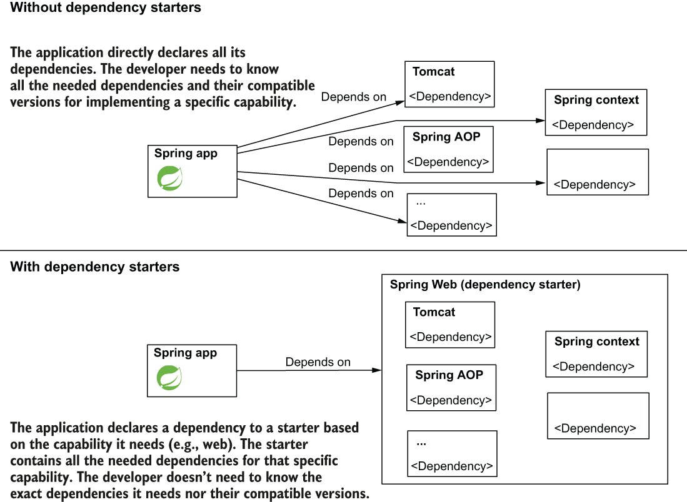

> **Hình 7.14** Sử dụng dependency starter. Thay vì tham chiếu riêng lẻ đến từng dependency cụ thể, giờ đây ứng dụng chỉ phụ thuộc vào một starter. Starter chứa tất cả các dependency cần thiết để triển khai một tính năng cụ thể. Starter cũng đảm bảo các dependency này tương thích với nhau.

Hãy nhìn vào file `pom.xml` của bạn. Bạn chỉ thêm dependency `spring-boot-starter-web`, không có Spring context, không có AOP, không có Tomcat! Nhưng nếu bạn nhìn vào thư mục "External Libraries" của ứng dụng, bạn sẽ thấy các file JAR cho tất cả những thứ này. Spring Boot biết bạn sẽ cần chúng và đã tải chúng về với những phiên bản cụ thể mà nó biết là tương thích.

### 7.2.3 Sử dụng autoconfiguration theo quy ước dựa trên dependency

Spring Boot cũng cung cấp autoconfiguration cho ứng dụng của bạn. Chúng ta nói rằng nó áp dụng nguyên tắc convention-over-configuration (quy ước hơn cấu hình). Trong mục này, chúng ta thảo luận convention-over-configuration là gì và Spring Boot giúp chúng ta như thế nào bằng cách áp dụng nguyên tắc này. Trong tất cả các tính năng của Spring Boot đã thảo luận trước đó trong chương này, autoconfiguration có lẽ là tính năng được đánh giá cao nhất và được biết đến nhiều nhất.

Chỉ cần khởi động ứng dụng, và bạn sẽ hiểu tại sao. Vâng, tôi biết, bạn thậm chí còn chưa viết gì cả—chỉ mới tải dự án về và mở nó trong IDE. Nhưng bạn có thể khởi động ứng dụng, và bạn sẽ thấy ứng dụng của mình khởi động một instance Tomcat, mặc định có thể truy cập trên port 8080. Trong console, bạn thấy nội dung tương tự đoạn sau:

```text
Tomcat started on port(s): 8080 (http) with context path ''                ❶
Started Main in 1.684 seconds (JVM running for 2.306)
```

❶ Spring Boot đã cấu hình Tomcat và mặc định khởi động nó trên port 8080.

Dựa trên các dependency bạn đã thêm, Spring Boot nhận ra bạn mong đợi gì từ ứng dụng và cung cấp cho bạn một số cấu hình mặc định. Spring Boot cung cấp cho bạn những cấu hình thường được dùng cho các tính năng mà bạn yêu cầu khi thêm các dependency.

Ví dụ, Spring biết khi bạn thêm dependency web là bạn cần một servlet container, và cấu hình cho bạn một instance Tomcat vì trong hầu hết các trường hợp, lập trình viên dùng triển khai này. Với Spring Boot, Tomcat là quy ước cho servlet container.

Quy ước đại diện cho cách được dùng nhiều nhất để cấu hình ứng dụng cho một mục đích cụ thể. Spring Boot cấu hình ứng dụng theo quy ước sao cho giờ đây bạn chỉ cần thay đổi những chỗ mà ứng dụng của bạn cần cấu hình đặc thù hơn. Với cách tiếp cận này, bạn sẽ viết ít code cấu hình hơn (nếu có).

## 7.3 Triển khai web app với Spring MVC

Trong mục này, chúng ta sẽ triển khai web page đầu tiên trong một Spring web app. Đúng là chúng ta đã có một dự án Spring Boot với các cấu hình mặc định, nhưng ứng dụng này mới chỉ khởi động một Tomcat server. Những cấu hình này chưa biến ứng dụng của chúng ta thành web app! Chúng ta vẫn phải triển khai các trang mà ai đó có thể truy cập bằng trình duyệt web. Chúng ta tiếp tục triển khai dự án "sq-ch7-ex1" để thêm một web page với nội dung tĩnh. Với những thay đổi này, bạn sẽ học cách triển khai một web page và cách ứng dụng Spring của bạn hoạt động phía sau hậu trường.

Để thêm một web page vào ứng dụng, bạn thực hiện hai bước (hình 7.15):

1. Viết một tài liệu HTML với nội dung bạn muốn trình duyệt hiển thị.
2. Viết một controller với một action cho web page đã tạo ở bước 1.

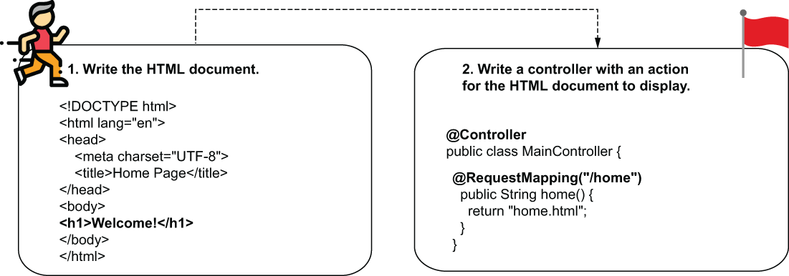

> **Hình 7.15** Các bước để thêm một web page tĩnh vào ứng dụng của bạn. Thêm tài liệu HTML chứa thông tin mà trình duyệt sẽ hiển thị, rồi viết một controller với một action được gán cho nó.

Trong dự án "sq-ch7-ex1", trước tiên chúng ta bắt đầu thêm một web page tĩnh với nội dung mà ta muốn hiển thị trong trình duyệt. Web page này chỉ là một tài liệu HTML, và với ví dụ của chúng ta, trang chỉ hiển thị một đoạn văn bản ngắn trong một tiêu đề. Listing sau cho bạn thấy nội dung của file này nên trông như thế nào. Bạn cần thêm file này vào thư mục "resources/static" của dự án Maven. Thư mục này là nơi mặc định mà ứng dụng Spring Boot mong đợi tìm thấy các trang cần render.

**Listing 7.1** Nội dung của file HTML

```html
<!DOCTYPE html>
<html lang="en">
<head>
     <meta charset="UTF-8">
     <title>Home Page</title>
</head>
<body>
    <h1>Welcome!</h1>               ❶
</body>
</html>
```

❶ Trong một tài liệu HTML chuẩn, chúng ta hiển thị một văn bản tiêu đề.

Bước thứ hai bạn thực hiện là viết một controller với một method liên kết HTTP request với trang mà bạn muốn ứng dụng cung cấp trong response. Controller là một thành phần của web app chứa các method (thường được gọi là action) được thực thi cho một HTTP request cụ thể. Cuối cùng, action của controller trả về một tham chiếu đến web page mà ứng dụng trả về trong response. Chúng ta sẽ giữ ví dụ đầu tiên này đơn giản, và hiện tại chúng ta sẽ không để controller thực thi bất kỳ logic cụ thể nào cho request. Chúng ta chỉ cấu hình một action để trả về trong response nội dung của tài liệu `home.html` mà ta đã tạo và lưu trong thư mục "resources/static" ở bước đầu tiên.

Để đánh dấu một class là controller, bạn chỉ cần dùng annotation `@Controller`, một stereotype annotation (giống như `@Component` và `@Service`, đã thảo luận trong chương 4). Điều này có nghĩa là Spring cũng sẽ thêm một bean của class này vào context của nó để quản lý. Bên trong class này, bạn có thể định nghĩa các action của controller, là những method gắn với các HTTP request cụ thể.

Giả sử bạn muốn trình duyệt hiển thị nội dung của trang này khi người dùng truy cập đường dẫn `/home`. Để đạt được kết quả này, bạn đánh dấu method action bằng annotation `@RequestMapping`, chỉ định đường dẫn làm giá trị của annotation: `@RequestMapping("/home")`. Method cần trả về, dưới dạng một chuỗi, tên của tài liệu mà bạn muốn ứng dụng gửi làm response. Listing sau cho thấy class controller và action mà nó triển khai.

**Listing 7.2** Định nghĩa của class controller

```java
@Controller                                       ❶
public class MainController {

    @RequestMapping("/home")                      ❷
    public String home() {
        return "home.html";                       ❸
    }
}
```

❶ Chúng ta đánh dấu class bằng stereotype annotation `@Controller`.

❷ Chúng ta dùng annotation `@RequestMapping` để gắn action với một đường dẫn HTTP request.

❸ Chúng ta trả về tên tài liệu HTML chứa các chi tiết mà ta muốn trình duyệt hiển thị.

Tôi biết bây giờ bạn có rất nhiều câu hỏi! Tất cả học viên của tôi đều như vậy ở thời điểm này khi tôi dạy Spring trên lớp—những câu hỏi như sau:

1. Method này có thể làm gì khác ngoài việc trả về tên file HTML không?
2. Nó có thể nhận tham số không?
3. Tôi thấy các ví dụ trên web dùng những annotation khác ngoài `@RequestMapping`; chúng có tốt hơn không?
4. Trang HTML có thể chứa nội dung động không?

Chúng ta sẽ trả lời tất cả những câu hỏi này bằng các ví dụ trong chương 8. Nhưng hiện tại, tôi đề nghị bạn tập trung vào ứng dụng đơn giản này để hiểu những gì chúng ta vừa viết. Trước hết, bạn cần biết cách Spring quản lý request và gọi action controller mà chúng ta đã triển khai. Hiểu đúng cách framework quản lý web request là một kỹ năng giá trị, giúp bạn về sau học các chi tiết nhanh hơn và triển khai bất kỳ tính năng nào bạn cần trong một web app.

Bây giờ chúng ta khởi động ứng dụng, phân tích hành vi của nó, và thảo luận, kèm hình minh họa, cơ chế phía sau ứng dụng làm cho kết quả này trở nên khả thi. Khi khởi động ứng dụng, bạn sẽ thấy log. Nó cho bạn biết Tomcat đã khởi động và port mà nó sử dụng trong console của ứng dụng. Nếu bạn dùng mặc định (bạn không cấu hình thứ gì không được giải thích trong chương này), Tomcat dùng port 8080.

```text
Tomcat started on port(s): 8080 (http) with context path ''
```

Mở một cửa sổ trình duyệt trên cùng máy tính nơi bạn chạy ứng dụng và gõ địa chỉ sau vào thanh địa chỉ: http://localhost:8080/home (hình 7.16). Đừng quên gõ đường dẫn `/home` mà bạn đã ánh xạ với action của controller; nếu không, bạn sẽ gặp lỗi và một HTTP response với status "404 Not Found".

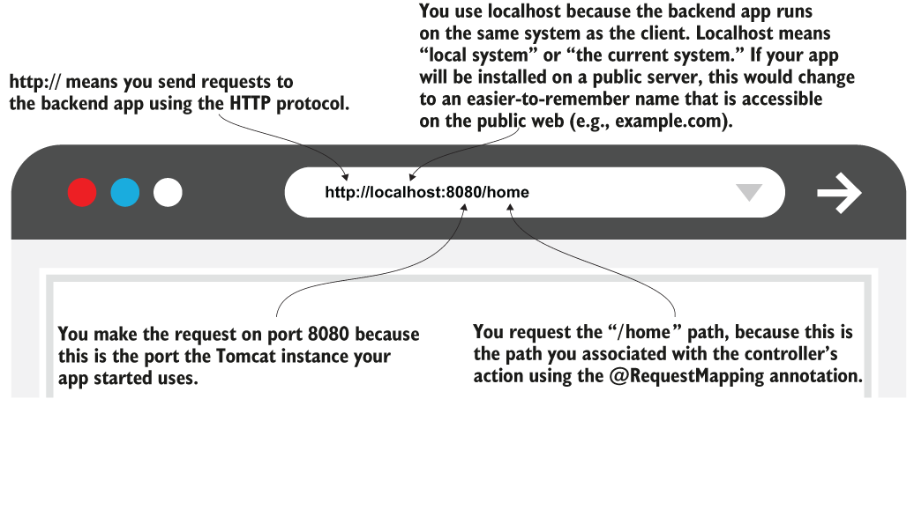

> **Hình 7.16** Kiểm thử phần triển khai. Dùng trình duyệt, gửi một request đến ứng dụng backend. Bạn cần dùng port mà Tomcat đã mở và đường dẫn bạn đã chỉ định bằng annotation `@RequestMapping`.

Hình 7.17 cho bạn thấy kết quả của việc truy cập web page trong trình duyệt.

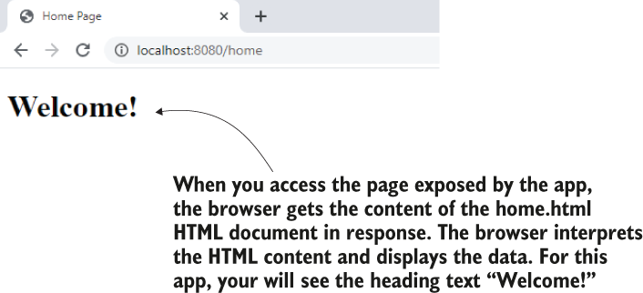

> **Hình 7.17** Khi truy cập trang trong trình duyệt, bạn sẽ thấy văn bản tiêu đề "Welcome!" Trình duyệt diễn giải và hiển thị HTML nhận được trong response từ backend.

Giờ đây khi bạn đã thấy hành vi của ứng dụng, hãy thảo luận cơ chế phía sau nó. Spring có một tập các thành phần tương tác với nhau để tạo ra kết quả mà bạn quan sát được. Hình 7.18 trình bày các thành phần này và luồng mà chúng quản lý một HTTP request.

1. Client tạo một HTTP request.
2. Tomcat nhận HTTP request của client. Tomcat phải gọi một thành phần servlet cho HTTP request đó. Trong trường hợp của Spring MVC, Tomcat gọi một servlet mà Spring Boot đã cấu hình. Chúng ta gọi servlet này là dispatcher servlet.
3. Dispatcher servlet là điểm vào của Spring web app. (Nó chính là servlet mà chúng ta đã thảo luận trong hình 7.8 ở phần trước của chương này; nó cũng xuất hiện trong hình 7.18.) Tomcat gọi dispatcher servlet cho bất kỳ HTTP request nào nó nhận được. Trách nhiệm của nó là quản lý request tiếp theo bên trong ứng dụng Spring. Nó phải tìm ra action controller nào cần gọi cho request và cần gửi gì trở lại cho client trong response. Servlet này cũng được gọi là "front controller".
4. Điều đầu tiên dispatcher servlet cần làm là tìm một action controller để gọi cho request. Để tìm ra action controller nào cần gọi, dispatcher servlet ủy quyền cho một thành phần có tên handler mapping. Handler mapping tìm action controller mà bạn đã gắn với request bằng annotation `@RequestMapping`.
5. Sau khi tìm ra action controller nào cần gọi, dispatcher servlet gọi action controller cụ thể đó. Nếu handler mapping không tìm thấy action nào gắn với request, ứng dụng phản hồi cho client với HTTP status "404 Not Found". Controller trả về cho dispatcher servlet tên trang mà nó cần render cho response. Chúng ta cũng gọi trang HTML này là "view".
6. Vào lúc này, dispatcher servlet cần tìm view có tên nhận được từ controller để lấy nội dung của nó và gửi làm response. Dispatcher servlet ủy quyền trách nhiệm lấy nội dung view cho một thành phần có tên "View Resolver".
7. Dispatcher servlet trả về view đã render trong HTTP response.

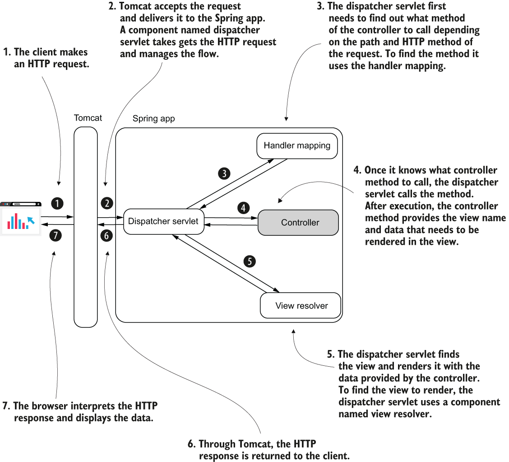

> **Hình 7.18** Kiến trúc Spring MVC. Trong sơ đồ, bạn thấy các thành phần chính của Spring MVC. Những thành phần này và cách chúng cộng tác chịu trách nhiệm cho hành vi của một web app. Controller (được tô màu khác) là thành phần duy nhất bạn triển khai. Spring Boot cấu hình các thành phần còn lại.

> **LƯU Ý** Trong chương này, tôi đã mô tả handler mapping là thành phần tìm action controller theo đường dẫn HTTP request. Handler mapping cũng tìm kiếm theo một thứ gọi là HTTP method, mà tôi tạm bỏ qua trong phần giải thích để bạn có thể tập trung vào luồng xử lý dễ dàng hơn. Chúng ta sẽ thảo luận chi tiết hơn về HTTP method trong chương 8.

Spring (cùng với Spring Boot) đơn giản hóa đáng kể việc phát triển một web app bằng cách sắp xếp thiết lập này. Bạn chỉ cần viết các action controller và ánh xạ chúng với các request bằng annotation. Một phần lớn logic được ẩn trong framework, và điều này giúp bạn viết ứng dụng nhanh hơn và gọn gàng hơn.

Trong chương 8, chúng ta tiếp tục với nhiều chi tiết hơn về những gì bạn có thể làm với một class controller. Các ứng dụng thực tế thường phức tạp hơn việc chỉ trả về nội dung của một trang HTML tĩnh. Trong hầu hết các trường hợp, trang hiển thị các chi tiết động được ứng dụng xử lý trước khi render HTTP response. Nhưng hãy dành một chút thời gian lúc này để xem lại những gì bạn đã học trong chương này. Hiểu cách các Spring web app hoạt động là thiết yếu cho các thảo luận trong những chương tiếp theo và chắc chắn là cần thiết để trở thành một lập trình viên Spring chuyên nghiệp. "Đừng vội học chi tiết trước khi hiểu đúng những điều cơ bản" là một nguyên tắc kinh nghiệm mà tôi áp dụng khi học bất kỳ công nghệ nào.

## Tóm tắt

- Ngày nay người ta dùng web app thường xuyên hơn ứng dụng desktop. Vì lý do này, bạn phải hiểu cách web app hoạt động và học cách triển khai chúng.
- Web app là một ứng dụng mà người dùng tương tác thông qua trình duyệt web. Một web app có phía client và phía server, nơi dữ liệu được xử lý và lưu trữ. Phía client (frontend) gửi request đến phía server (backend). Backend thực thi hành động mà frontend yêu cầu và phản hồi trở lại.
- Spring cung cấp cho bạn khả năng triển khai web app. Để tránh viết nhiều cấu hình, bạn có thể dùng Spring Boot: một dự án trong hệ sinh thái Spring áp dụng nguyên tắc convention-over-configuration, cung cấp cho bạn các cấu hình mặc định cho những tính năng mà ứng dụng của bạn cần.
- Spring Boot cũng giúp bạn cấu hình các dependency dễ dàng hơn thông qua các dependency starter mà nó cung cấp. Một dependency starter là một nhóm các dependency với các phiên bản tương thích để cung cấp cho ứng dụng của bạn một tính năng cụ thể.
- Để nhận các HTTP request và trả về các response, một web app backend viết bằng Java cần một servlet container (ví dụ Tomcat): phần mềm có khả năng dịch HTTP request và response cho ứng dụng Java. Với servlet container, bạn không cần triển khai việc giao tiếp qua mạng bằng giao thức HTTP.
- Bạn có thể dễ dàng tạo dự án web app của mình dưới dạng một dự án Spring Boot, dự án này tự động cấu hình một servlet container và đi kèm những tính năng bạn cần để viết các use case cho web app của mình. Spring Boot cũng cấu hình một tập các thành phần chặn và quản lý các HTTP request. Những thành phần này là một phần của thiết kế class mà chúng ta gọi là Spring MVC.
- Vì Spring Boot tự động cấu hình các thành phần Spring MVC và servlet container, bạn chỉ cần viết tài liệu HTML chứa dữ liệu mà ứng dụng gửi làm response và một class controller cho một luồng HTTP request-response tối thiểu.
- Bạn dùng annotation để cấu hình controller và các action của controller. Để đánh dấu một class là controller của Spring MVC, dùng stereotype annotation `@Controller`. Để gán một action của controller cho một HTTP request cụ thể, dùng annotation `@RequestMapping`.
