# 8 Triển khai ứng dụng web với Spring Boot và Spring MVC

**Chương này bao gồm**

- Dùng template engine để triển khai view động
- Gửi dữ liệu từ client đến server thông qua HTTP request
- Dùng các HTTP method GET và POST cho HTTP request của bạn

Trong chương 7, chúng ta đã có tiến bộ trong việc hiểu cách dùng Spring để viết ứng dụng web. Chúng ta đã bàn về các thành phần của một ứng dụng web, các dependency mà ứng dụng web cần, và kiến trúc Spring MVC. Chúng ta thậm chí đã viết một ứng dụng web đầu tiên để chứng minh tất cả các thành phần này hoạt động cùng nhau.

Trong chương này, chúng ta sẽ tiến thêm một bước và triển khai một số khả năng bạn sẽ thấy trong bất kỳ ứng dụng web hiện đại nào. Chúng ta bắt đầu bằng việc triển khai các trang có nội dung thay đổi tùy theo cách ứng dụng xử lý dữ liệu cho các request cụ thể. Ngày nay chúng ta hiếm khi thấy các trang tĩnh trên website. Có lẽ bạn nghĩ, "Phải có cách nào đó để quyết định nội dung nào sẽ được thêm vào trang trước khi gửi HTTP response về trình duyệt." Có nhiều cách để bạn làm điều này!

Trong mục 8.1, chúng ta sẽ triển khai view động bằng template engine. Template engine là một dependency cho phép bạn dễ dàng lấy và hiển thị dữ liệu biến đổi mà controller gửi. Chúng ta sẽ minh họa cách template engine hoạt động trong một ví dụ sau khi ôn lại luồng Spring MVC.

Trong mục 8.2, bạn sẽ học cách gửi dữ liệu từ client đến server thông qua HTTP request. Chúng ta sẽ dùng dữ liệu đó trong method của controller và tạo nội dung động trên view.

Trong mục 8.3, chúng ta bàn về các HTTP method, và bạn sẽ học rằng đường dẫn request là không đủ để xác định một request của client. Cùng với đường dẫn request, client dùng một HTTP method được biểu diễn bằng một động từ (GET, POST, PUT, DELETE, PATCH, v.v.), thể hiện ý định của client. Trong ví dụ, chúng ta sẽ triển khai một HTML form mà ai đó có thể dùng để gửi các giá trị mà backend phải xử lý. Sau này, trong chương 12 và 13, bạn sẽ học cách lưu trữ dữ liệu như vậy vào database, và ứng dụng của bạn sẽ ngày càng gần với hình hài của một sản phẩm sẵn sàng cho production.

## 8.1 Triển khai ứng dụng web với view động

Giả sử bạn triển khai trang giỏ hàng của một cửa hàng trực tuyến. Trang này không nên hiển thị cùng dữ liệu cho tất cả mọi người. Nó thậm chí không hiển thị cùng thông tin mỗi lần cho cùng một người dùng. Trang này hiển thị chính xác các sản phẩm mà một người dùng cụ thể đã thêm vào giỏ hàng của họ. Trong hình 8.1, bạn thấy một ví dụ về view động được trình bày với chức năng giỏ hàng của website Manning. Hãy quan sát cách các request đến cùng một trang manning.com/cart nhận được dữ liệu khác nhau trong response. Thông tin hiển thị là khác nhau, dù trang là như nhau. Trang có nội dung động!

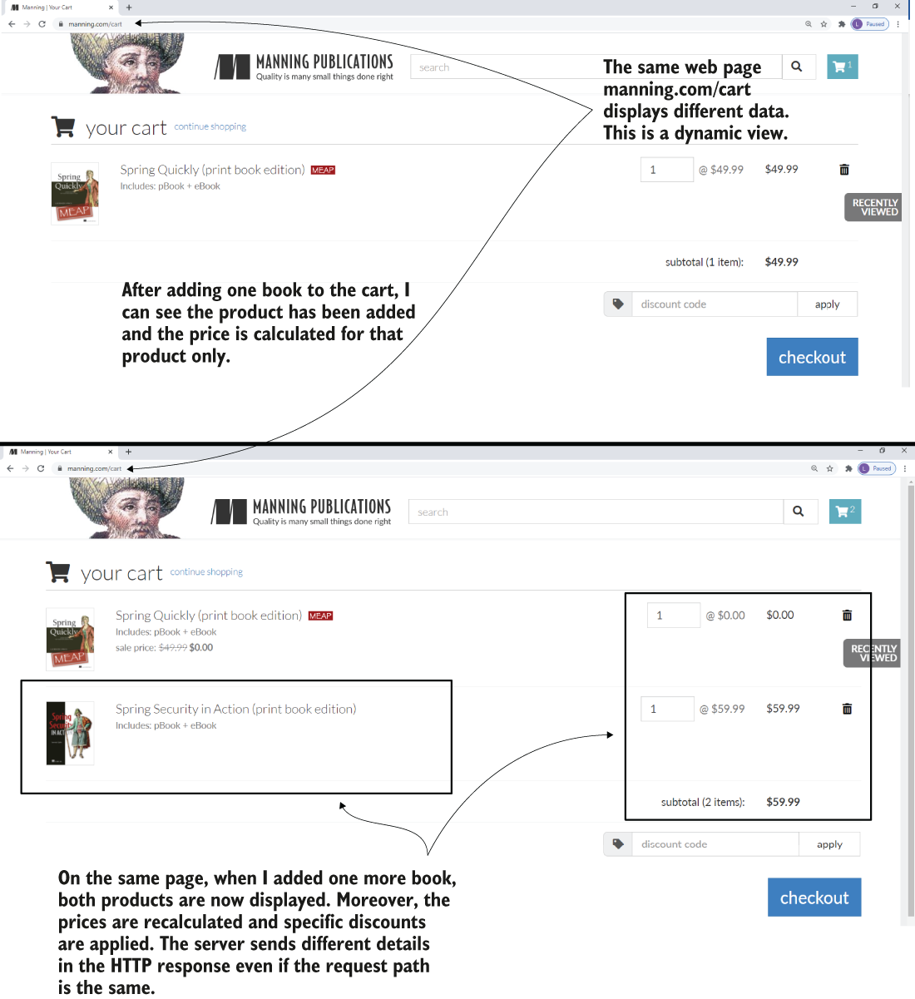

> **Hình 8.1** Một view động được trình bày với chức năng giỏ hàng của Manning. Dù trang được yêu cầu là như nhau, nội dung của trang lại khác nhau. Backend gửi dữ liệu khác nhau trong response trước và sau khi thêm một sản phẩm nữa vào giỏ hàng.

Trong mục này, chúng ta triển khai một ứng dụng web với view động. Hầu hết ứng dụng ngày nay cần hiển thị dữ liệu động cho người dùng. Bây giờ, với một request của người dùng được thể hiện qua HTTP request do trình duyệt gửi, ứng dụng web nhận một số dữ liệu, xử lý nó, rồi gửi lại một HTTP response mà trình duyệt cần hiển thị (hình 8.2). Chúng ta sẽ ôn lại luồng Spring MVC rồi làm một ví dụ để minh họa cách view có thể nhận các giá trị động từ controller.

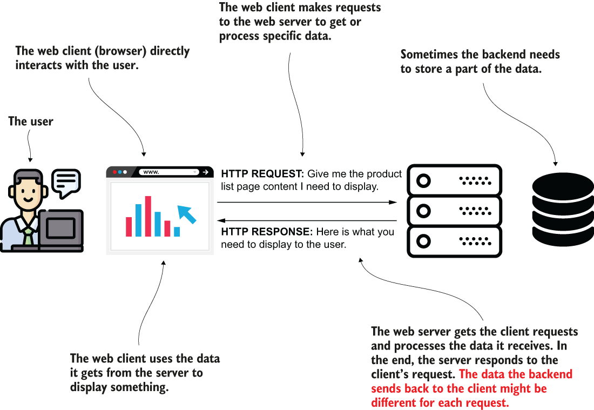

> **Hình 8.2** Client gửi dữ liệu qua HTTP request. Backend xử lý dữ liệu này và xây dựng một response để gửi lại client. Tùy vào cách backend xử lý dữ liệu, các request khác nhau có thể dẫn đến dữ liệu khác được hiển thị cho người dùng.

Trong ví dụ chúng ta triển khai ở cuối chương 7, nội dung của trình duyệt là như nhau cho mọi HTTP request đến trang của chúng ta. Hãy nhớ luồng Spring MVC (hình 8.3):

1. Client gửi một HTTP request đến web server.
2. Dispatcher servlet dùng handler mapping để tìm ra action nào của controller cần gọi.
3. Dispatcher servlet gọi action của controller.
4. Sau khi thực thi action gắn với HTTP request, controller trả về tên view mà dispatcher servlet cần render vào HTTP response.
5. Response được gửi lại client.

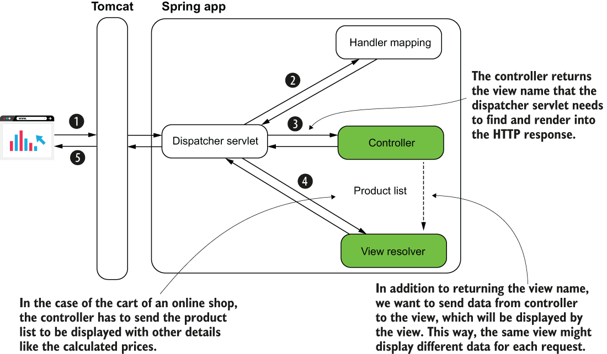

> **Hình 8.3** Luồng Spring MVC. Để định nghĩa một view động, controller cần gửi dữ liệu đến view. Dữ liệu controller gửi có thể khác nhau với mỗi request. Ví dụ, trong chức năng giỏ hàng của một cửa hàng trực tuyến, ban đầu controller gửi danh sách một sản phẩm đến view. Sau khi người dùng thêm nhiều sản phẩm hơn, danh sách mà controller gửi chứa tất cả sản phẩm trong giỏ hàng. Cùng một view hiển thị thông tin khác nhau cho các request này.

Bước số 4 là nơi chúng ta cần thay đổi. Chúng ta muốn controller không chỉ trả về tên view mà bằng cách nào đó cũng gửi dữ liệu đến view. View sẽ kết hợp dữ liệu này để định nghĩa HTTP response. Bằng cách này, nếu server gửi một danh sách gồm một sản phẩm, và trang hiển thị danh sách đó, trang sẽ hiển thị một sản phẩm. Nếu controller gửi hai sản phẩm cho cùng view, giờ dữ liệu hiển thị sẽ khác vì trang sẽ hiển thị hai sản phẩm (hành vi bạn đã quan sát trong hình 8.1).

Hãy để tôi chỉ cho bạn cách gửi dữ liệu từ controller đến view trong một project ngay bây giờ. Bạn có thể tìm thấy ví dụ này trong project "sq-ch8-ex1". Ví dụ này đơn giản để bạn tập trung vào cú pháp. Nhưng bạn có thể dùng cách này để gửi bất kỳ dữ liệu nào từ controller đến view.

Hiện tại, giả sử chúng ta muốn gửi một cái tên và in nó với một màu cụ thể. Trong tình huống thực tế, có thể bạn cần in tên người dùng ở đâu đó trên trang. Bạn làm thế nào? Làm sao bạn lấy dữ liệu có thể khác nhau giữa các request và in nó lên trang? Chúng ta sẽ tạo một project Spring Boot ("sq-ch8-ex1") và thêm một template engine vào các dependency trong file pom.xml. Chúng ta sẽ dùng một template engine tên là Thymeleaf. Template engine là một dependency cho phép chúng ta dễ dàng gửi dữ liệu từ controller đến view và hiển thị dữ liệu này theo một cách cụ thể. Tôi chọn Thymeleaf vì nó ít phức tạp hơn các template engine khác, và tôi thấy nó dễ hiểu và dễ học hơn. Như bạn sẽ thấy trong ví dụ, các template dùng với Thymeleaf là các file HTML tĩnh đơn giản. Đoạn code tiếp theo cho thấy dependency bạn cần thêm vào file pom.xml:

```xml
<dependency>
   <groupId>org.springframework.boot</groupId>
   <artifactId>spring-boot-starter-thymeleaf</artifactId>                  ❶
</dependency>
<dependency>
   <groupId>org.springframework.boot</groupId>
   <artifactId>spring-boot-starter-web</artifactId>                        ❷
</dependency>
```

❶ Dependency starter cần thêm để dùng Thymeleaf làm template engine

❷ Dù bạn đang xây dựng ứng dụng web, bạn vẫn cần thêm dependency starter cho ứng dụng web.

Trong listing 8.1, bạn thấy định nghĩa của controller. Chúng ta đánh dấu method để ánh xạ action vào một đường dẫn request cụ thể bằng `@RequestMapping`, như bạn đã học ở chương 7. Giờ chúng ta cũng định nghĩa một tham số cho method. Tham số kiểu `Model` này lưu dữ liệu mà chúng ta muốn controller gửi đến view. Trong instance `Model` này, chúng ta thêm các giá trị muốn gửi đến view và định danh mỗi giá trị bằng một tên duy nhất (còn gọi là key). Để thêm một giá trị mới mà controller gửi đến view, chúng ta gọi method `addAttribute()`. Tham số đầu tiên của method `addAttribute()` là key; tham số thứ hai là giá trị bạn gửi đến view.

**Listing 8.1** Class controller định nghĩa action của trang

```java
@Controller                                               ❶
public class MainController {
    @RequestMapping("/home")                                ❷
    public String home(Model page) {                        ❸
      page.addAttribute("username", "Katy");                ❹
      page.addAttribute("color", "red");                    ❹
      return "home.html";                                   ❺
    }
}
```

❶ Stereotype annotation `@Controller` đánh dấu class này là controller của Spring MVC và thêm một bean kiểu này vào Spring context.

❷ Chúng ta gán action của controller vào một đường dẫn HTTP request.

❸ Method action định nghĩa một tham số kiểu `Model` lưu dữ liệu mà controller gửi đến view.

❹ Chúng ta thêm dữ liệu muốn controller gửi đến view.

❺ Action của controller trả về view sẽ được render vào HTTP response.

> **LƯU Ý** Học viên đôi khi hỏi tôi tại sao họ gặp lỗi nếu gõ trực tiếp "localhost:8080" vào thanh địa chỉ của trình duyệt mà không có đường dẫn như "/home". Đúng là sẽ có lỗi xuất hiện. Lỗi này là trang mặc định mà một ứng dụng Spring Boot hiển thị khi bạn nhận HTTP response có status 404 (Not Found). Khi bạn gọi trực tiếp "localhost:8080", bạn tham chiếu đến đường dẫn "/". Vì bạn không gán action controller nào cho đường dẫn này, việc nhận HTTP 404 là bình thường. Nếu bạn muốn thấy gì đó khác, hãy gán một action của controller cho cả đường dẫn này bằng annotation `@RequestMapping`.

Để định nghĩa view, bạn cần thêm một file "home.html" mới vào thư mục "resources/templates" của project Spring Boot. Hãy chú ý sự khác biệt nhỏ: trong chương 7, chúng ta thêm file HTML vào thư mục "resources/static" vì chúng ta tạo một view tĩnh. Giờ chúng ta đang dùng template engine để tạo view động, bạn cần thêm file HTML vào thư mục "resources/templates" thay vào đó.

Listing 8.2 cho thấy nội dung của file "home.html" tôi đã thêm vào project. Điều quan trọng đầu tiên cần chú ý trong nội dung file là thẻ `<html>` nơi tôi đã thêm thuộc tính `xmlns:th="http://www.thymeleaf.org"`. Định nghĩa này tương đương với một import trong Java. Nó cho phép chúng ta dùng tiền tố "th" để tham chiếu đến các tính năng cụ thể mà Thymeleaf cung cấp trong view.

Xa hơn một chút trong view, bạn thấy hai chỗ tôi dùng tiền tố "th" này để tham chiếu đến dữ liệu controller gửi cho view. Với cú pháp `${attribute_key}`, bạn tham chiếu đến bất kỳ thuộc tính nào bạn gửi từ controller thông qua instance `Model`. Ví dụ, tôi dùng `${username}` để lấy giá trị của thuộc tính "username" và `${color}` để lấy giá trị của thuộc tính "color".

**Listing 8.2** File home.html đại diện cho view động của ứng dụng

```html
<!DOCTYPE html>
<html lang="en" xmlns:th="http://www.thymeleaf.org">                        ❶

   <head>
     <meta charset="UTF-8">
     <title>Home Page</title>
   </head>

   <body>
     <h1>Welcome
     <span th:style="'color:' + ${color}"                                   ❷
           th:text="${username}"></span>!</h1>                              ❷
   </body>

</html>
```

❶ Định nghĩa tiền tố "th" của Thymeleaf

❷ Dùng tiền tố "th" để sử dụng các giá trị do controller gửi

Để kiểm tra mọi thứ hoạt động, hãy khởi động ứng dụng và truy cập trang web trong trình duyệt. Trang của bạn sẽ trông như trong hình 8.4.

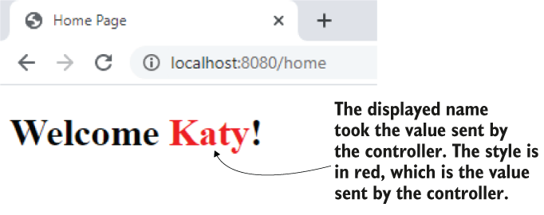

> **Hình 8.4** Kết quả. Chạy ứng dụng và truy cập trang trong trình duyệt, bạn quan sát thấy view dùng các giá trị mà controller gửi.

Giờ đây, bất cứ thứ gì controller gửi, view đều dùng.

### 8.1.1 Nhận dữ liệu trên HTTP request

Trong mục này, chúng ta bàn về cách client gửi dữ liệu đến server thông qua HTTP request. Trong ứng dụng, chúng ta thường cần cho client khả năng gửi thông tin đến server. Dữ liệu này được xử lý rồi hiển thị trên view, như bạn đã học trong mục 8.1. Dưới đây là một số ví dụ về use case mà client phải gửi dữ liệu đến server:

- Bạn triển khai chức năng đặt hàng của một cửa hàng trực tuyến. Client cần gửi đến server các sản phẩm mà người dùng đặt. Sau đó, server lo phần xử lý đơn hàng.
- Bạn triển khai một diễn đàn web nơi bạn cho phép người dùng thêm và sửa bài viết mới. Client gửi chi tiết bài viết đến server, server lưu hoặc thay đổi các chi tiết đó trong database.
- Bạn triển khai chức năng đăng nhập của một ứng dụng. Người dùng nhập thông tin đăng nhập, cần được xác thực. Client gửi thông tin đăng nhập đến server, và server xác thực thông tin này.
- Bạn triển khai trang liên hệ của một ứng dụng web. Trang hiển thị một form nơi người dùng có thể viết tiêu đề và nội dung tin nhắn. Các chi tiết này cần được gửi trong một email đến một địa chỉ cụ thể. Client gửi các giá trị này đến server, và server lo việc xử lý chúng và gửi email đến địa chỉ mong muốn.

Trong hầu hết các trường hợp, để gửi dữ liệu qua HTTP request bạn dùng một trong các cách sau:

- HTTP request parameter là cách đơn giản để gửi các giá trị từ client đến server theo định dạng cặp key-value. Để gửi HTTP request parameter, bạn nối chúng vào URI trong một biểu thức query của request. Chúng còn được gọi là query parameter. Bạn chỉ nên dùng cách này để gửi lượng dữ liệu nhỏ.
- HTTP request header tương tự request parameter ở chỗ request header được gửi qua HTTP header. Khác biệt lớn là chúng không xuất hiện trong URI, nhưng bạn vẫn không thể gửi lượng dữ liệu lớn bằng HTTP header.
- Path variable gửi dữ liệu thông qua chính đường dẫn request. Giống như cách request parameter: bạn dùng path variable để gửi lượng dữ liệu nhỏ. Nhưng chúng ta nên dùng path variable khi giá trị bạn gửi là bắt buộc.
- HTTP request body chủ yếu được dùng để gửi lượng dữ liệu lớn hơn (được định dạng dưới dạng chuỗi, nhưng đôi khi thậm chí là dữ liệu nhị phân như một file). Chúng ta sẽ bàn về cách này trong chương 10, nơi bạn sẽ học cách triển khai REST endpoint.

### 8.1.2 Dùng request parameter để gửi dữ liệu từ client đến server

Trong mục này, chúng ta triển khai một ví dụ để minh họa việc dùng HTTP request parameter, cách đơn giản để gửi dữ liệu từ client đến backend. Bạn thường gặp cách này trong các ứng dụng production. Bạn dùng request parameter trong các tình huống sau:

- Lượng dữ liệu bạn gửi không lớn. Bạn đặt request parameter bằng các biến query (như trong ví dụ của mục này). Cách này giới hạn bạn ở khoảng 2.000 ký tự.
- Bạn cần gửi dữ liệu tùy chọn. Request parameter là cách sạch sẽ để xử lý một giá trị mà client có thể không gửi. Server có thể đoán trước việc không nhận được giá trị cho một số request parameter cụ thể.

Một use case thường gặp của request parameter là định nghĩa các tiêu chí tìm kiếm và lọc (hình 8.5). Giả sử ứng dụng của bạn hiển thị chi tiết sản phẩm trong một bảng. Mỗi sản phẩm được xác định bằng tên, giá và thương hiệu. Bạn muốn cho phép người dùng tìm kiếm sản phẩm theo bất kỳ tiêu chí nào trong số này. Người dùng có thể quyết định tìm theo giá hoặc theo tên và thương hiệu. Mọi tổ hợp đều có thể. Với tình huống như vậy, request parameter là lựa chọn đúng để triển khai. Ứng dụng gửi mỗi giá trị này (tên, giá và thương hiệu) trong các request parameter tùy chọn. Client chỉ cần gửi những giá trị mà người dùng quyết định dùng để tìm kiếm.

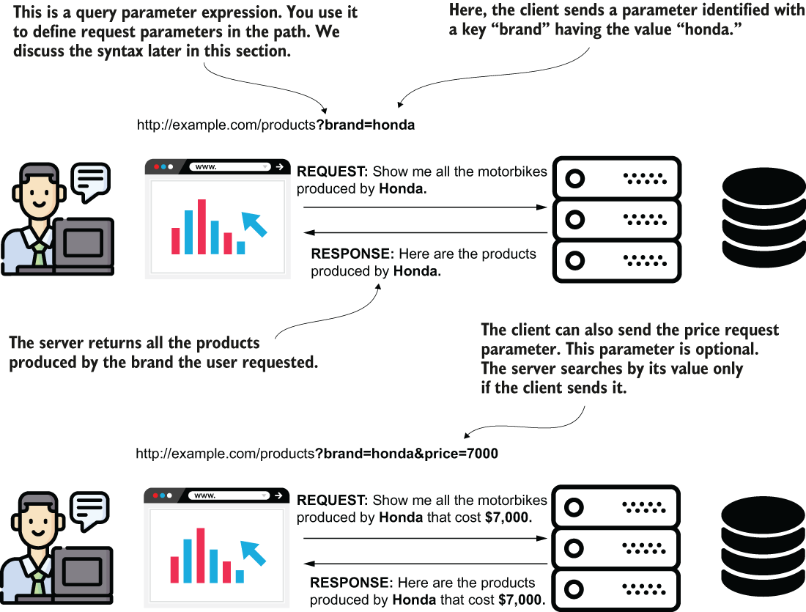

> **Hình 8.5** Request parameter có thể là tùy chọn. Một tình huống phổ biến để dùng request parameter là triển khai chức năng tìm kiếm với các tiêu chí tìm kiếm tùy chọn. Client chỉ gửi một số request parameter, và server biết chỉ dùng những giá trị nó nhận được. Bạn triển khai server sao cho nó cân nhắc việc có thể không nhận được giá trị cho một số tham số.

Hãy dùng request parameter bằng cách thay đổi ví dụ chúng ta đã bàn trong mục 8.1 để nhận từ client màu hiển thị tên người dùng. Listing 8.3 cho bạn thấy cách thay đổi class controller để nhận giá trị màu của client trong một request parameter. Tôi tách ví dụ này thành project tên là "sq-ch8-ex2" để bạn phân tích các thay đổi dễ dàng hơn. Để lấy giá trị từ request parameter, bạn cần thêm một tham số nữa vào method action của controller và đánh dấu tham số đó bằng annotation `@RequestParam`. Annotation `@RequestParam` nói cho Spring biết nó cần lấy giá trị từ HTTP request parameter có cùng tên với tên tham số của method.

**Listing 8.3** Nhận giá trị qua request parameter

```java
@Controller
public class MainController {

    @RequestMapping("/home")
    public String home(
        @RequestParam String color,                              ❶
        Model page) {                                            ❷
      page.addAttribute("username", "Katy");
      page.addAttribute("color", color);                         ❸
        return "home.html";
    }
}
```

❶ Chúng ta định nghĩa một tham số mới cho method action của controller và đánh dấu nó bằng `@RequestParam`.

❷ Chúng ta cũng thêm tham số `Model` dùng để gửi dữ liệu từ controller đến view.

❸ Controller chuyển màu do client gửi đến view.

Hình 8.6 cho thấy giá trị của tham số color đi từ client đến action của controller trên backend để được view sử dụng như thế nào.

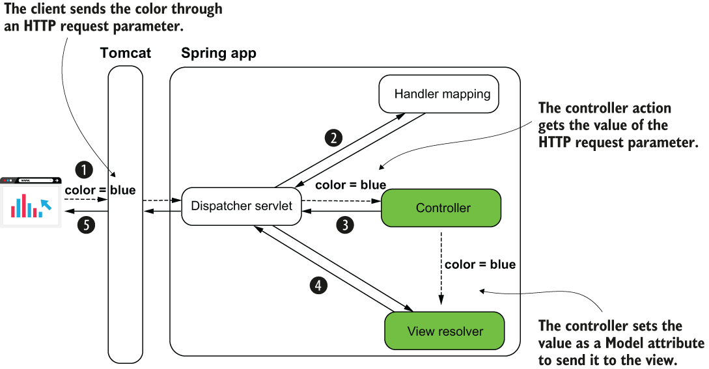

> **Hình 8.6** Giá trị do client gửi nhìn từ góc độ Spring MVC. Action của controller nhận các request parameter mà client gửi và có thể dùng chúng. Trong ví dụ của chúng ta, giá trị được đặt vào Model và chuyển đến view.

Chạy ứng dụng và truy cập đường dẫn /home. Để đặt giá trị cho request parameter, bạn cần dùng cú pháp của đoạn tiếp theo:

```text
http://localhost:8080/home?color=blue
```

Khi đặt HTTP request parameter, bạn mở rộng đường dẫn bằng ký hiệu `?` theo sau là các cặp tham số key=value được phân cách bằng ký hiệu `&`. Ví dụ, nếu tôi muốn gửi cả tên dưới dạng request parameter, tôi viết:

```text
http://localhost:8080/home?color=blue&name=Jane
```

Bạn có thể thêm một tham số mới vào action của controller để nhận cả tham số này. Đoạn code tiếp theo cho thấy thay đổi này. Bạn cũng có thể tìm thấy ví dụ này trong project "sq-ch8-ex3":

```java
@Controller
public class MainController {

    @RequestMapping("/home")
    public String home(
        @RequestParam(required = false) String name,                   ❶
        @RequestParam(required = false) String color,
        Model page) {
      page.addAttribute("username", name);                             ❷
      page.addAttribute("color", color);
      return "home.html";
    }
}
```

❶ Nhận request parameter mới "name"

❷ Gửi giá trị của tham số "name" đến view

Trong nhóm key=value (ví dụ, color=blue), "key" là tên của request parameter, và giá trị của nó được viết ngay sau ký hiệu `=`.

Hình 8.7 tóm tắt trực quan cú pháp cho request parameter.

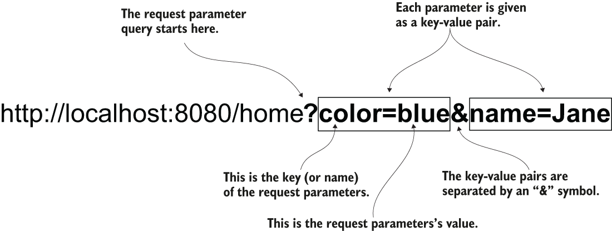

> **Hình 8.7** Gửi dữ liệu qua request parameter. Mỗi request parameter là một cặp key-value. Bạn cung cấp các request parameter cùng với đường dẫn trong một query bắt đầu bằng dấu chấm hỏi. Nếu bạn đặt nhiều hơn một request parameter, bạn phân cách mỗi cặp key-value bằng ký hiệu "và" (&).

> **LƯU Ý** Mặc định, request parameter là bắt buộc. Nếu client không cung cấp giá trị cho nó, server gửi lại một response với status HTTP "400 Bad Request". Nếu bạn muốn giá trị là tùy chọn, bạn cần chỉ định tường minh điều này trên annotation bằng thuộc tính optional: `@RequestParam(optional=true)`.

### 8.1.3 Dùng path variable để gửi dữ liệu từ client đến server

Hãy bàn về việc dùng path variable và so sánh với cách bạn đã học trong mục 8.2.1 để gửi dữ liệu từ client đến server. Dùng path variable cũng là một cách gửi dữ liệu từ client đến server. Nhưng thay vì dùng HTTP request parameter, bạn đặt trực tiếp các giá trị biến vào đường dẫn, như trình bày trong các đoạn tiếp theo.

Dùng request parameter:

```text
http://localhost:8080/home?color=blue
```

Dùng path variable:

```text
http://localhost:8080/home/blue
```

Bạn không còn định danh giá trị bằng key nữa. Bạn chỉ lấy giá trị đó từ một vị trí chính xác trong đường dẫn. Ở phía server, bạn trích xuất giá trị đó từ đường dẫn tại vị trí cụ thể. Bạn có thể có nhiều hơn một giá trị được cung cấp dưới dạng path variable, nhưng nhìn chung tốt hơn là tránh dùng nhiều hơn vài giá trị. Bạn sẽ thấy đường dẫn trở nên khó đọc hơn nếu bạn dùng nhiều hơn hai path variable. Tôi thích dùng request parameter cho nhiều hơn hai giá trị thay vì path variable, như bạn đã học trong mục 8.2.1. Ngoài ra, bạn không nên dùng path variable cho các giá trị tùy chọn. Tôi khuyên bạn chỉ dùng path variable cho các tham số bắt buộc. Nếu bạn có các giá trị tùy chọn cần gửi trong HTTP request, bạn nên dùng request parameter, như chúng ta đã bàn trong mục 8.2.1. Bảng 8.1 so sánh hai cách request parameter và path variable.

**Bảng 8.1** So sánh nhanh hai cách request parameter và path variable

| Request parameter | Path variable |
|---|---|
| 1. Có thể dùng với các giá trị tùy chọn. | 1. Không nên dùng với các giá trị tùy chọn. |
| 2. Khuyến nghị tránh số lượng lớn tham số. Nếu bạn cần dùng nhiều hơn ba, tôi khuyên bạn dùng request body, như bạn sẽ học trong chương 10. Tránh gửi nhiều hơn ba query parameter để dễ đọc. | 2. Luôn tránh gửi nhiều hơn ba path variable. Càng tốt hơn nếu bạn giữ tối đa hai. |
| 3. Một số lập trình viên cho rằng biểu thức query khó đọc hơn biểu thức đường dẫn. | 3. Dễ đọc hơn biểu thức query. Với website công khai, các công cụ tìm kiếm (ví dụ Google) cũng dễ lập chỉ mục các trang hơn. Ưu điểm này có thể giúp website dễ được tìm thấy hơn qua công cụ tìm kiếm. |

Khi trang bạn viết chỉ phụ thuộc vào một hoặc hai giá trị là cốt lõi của kết quả cuối, tốt hơn là viết chúng trực tiếp vào đường dẫn để request dễ đọc hơn. URL cũng dễ tìm hơn khi bạn đánh dấu (bookmark) nó trong trình duyệt và dễ lập chỉ mục hơn với công cụ tìm kiếm (nếu điều đó quan trọng với ứng dụng của bạn).

Hãy viết một ví dụ để minh họa cú pháp bạn cần viết trong controller để nhận giá trị dưới dạng path variable. Tôi đã thay đổi các ví dụ chúng ta triển khai trong mục 8.2.1 nhưng tách code sang một project khác, "sq-ch8-ex4", để bạn dễ kiểm tra hơn.

Để tham chiếu đến một path variable trong action của controller, bạn chỉ cần đặt tên cho nó và thêm vào đường dẫn giữa cặp dấu ngoặc nhọn, như trình bày trong listing sau. Sau đó bạn dùng annotation `@PathVariable` để đánh dấu tham số của action controller nhằm nhận giá trị của path variable. Listing 8.4 cho bạn thấy cách thay đổi action của controller để nhận giá trị màu bằng path variable (phần còn lại của ví dụ giống "sq-ch8-ex2", mà chúng ta đã bàn trong mục 8.1.1).

**Listing 8.4** Dùng path variable để nhận giá trị từ client

```java
@Controller
public class MainController {

    @RequestMapping("/home/{color}")               ❶
    public String home(
        @PathVariable String color,    ❷
        Model page) {
      page.addAttribute("username", "Katy");
      page.addAttribute("color", color);
      return "home.html";
    }
}
```

❶ Để định nghĩa một path variable, bạn gán tên cho nó và đặt trong đường dẫn giữa cặp dấu ngoặc nhọn.

❷ Bạn đánh dấu tham số nơi bạn muốn nhận giá trị path variable bằng annotation `@PathVariable`. Tên của tham số phải giống tên của biến trong đường dẫn.

Chạy ứng dụng và truy cập trang trong trình duyệt với các giá trị màu khác nhau.

```text
http://localhost:8080/home/blue
http://localhost:8080/home/red
http://localhost:8080/home/green
```

Mỗi request tô màu tên hiển thị trên trang bằng màu đã cho. Hình 8.8 biểu diễn trực quan mối liên hệ giữa code và đường dẫn request.

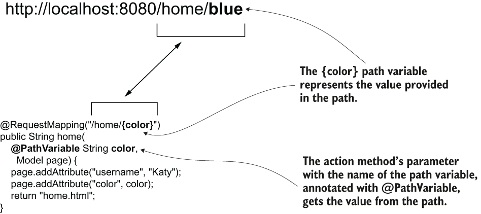

> **Hình 8.8** Dùng path variable. Để lấy giá trị từ path variable, bạn đặt tên cho biến giữa cặp dấu ngoặc nhọn khi định nghĩa đường dẫn trên action của controller. Bạn dùng một tham số được đánh dấu @PathVariable để nhận giá trị của path variable.

## 8.2 Dùng các HTTP method GET và POST

Trong mục này, chúng ta bàn về các HTTP method và cách client dùng chúng để thể hiện hành động nào (tạo, thay đổi, truy xuất, xóa) nó sẽ áp dụng lên tài nguyên được yêu cầu. Một đường dẫn và một động từ xác định một HTTP request. Đến giờ chúng ta mới chỉ đề cập đến đường dẫn, và, mà không để ý, chúng ta đã dùng HTTP method GET. Mục đích của nó là định nghĩa hành động mà client yêu cầu. Ví dụ, bằng cách dùng GET, chúng ta biểu diễn một hành động chỉ truy xuất dữ liệu. Đó là cách để client nói rằng nó muốn lấy thứ gì đó từ server, nhưng lời gọi sẽ không thay đổi dữ liệu. Nhưng bạn sẽ cần nhiều hơn thế. Một ứng dụng cũng cần thay đổi, thêm hoặc xóa dữ liệu.

> **LƯU Ý** Hãy cẩn thận! Bạn có thể dùng một HTTP method trái với mục đích thiết kế của nó, nhưng điều này là sai. Ví dụ, bạn có thể dùng HTTP GET và triển khai một chức năng thay đổi dữ liệu. Về mặt kỹ thuật, điều này khả thi, nhưng đó là một lựa chọn rất, rất tệ. Đừng bao giờ dùng một HTTP method trái với mục đích thiết kế của nó.

Chúng ta đã dựa vào đường dẫn request để đến một action cụ thể của controller, nhưng trong tình huống phức tạp hơn bạn có thể gán cùng một đường dẫn cho nhiều action của controller miễn là bạn dùng các HTTP method khác nhau. Chúng ta sẽ làm một ví dụ để áp dụng trường hợp như vậy.

HTTP method được định nghĩa bằng một động từ và biểu diễn ý định của client. Nếu request của client chỉ truy xuất dữ liệu, chúng ta triển khai endpoint với HTTP GET. Nhưng nếu request của client bằng cách nào đó thay đổi dữ liệu ở phía server, chúng ta dùng các động từ khác để biểu diễn rõ ràng ý định của client.

Bảng 8.2 trình bày các HTTP method thiết yếu bạn sẽ dùng trong ứng dụng và cần học.

**Bảng 8.2** Các HTTP method cơ bản bạn sẽ thường gặp trong ứng dụng web

| HTTP method | Mô tả |
|---|---|
| GET | Request của client chỉ truy xuất dữ liệu. |
| POST | Request của client gửi dữ liệu mới để server thêm vào. |
| PUT | Request của client thay đổi một bản ghi dữ liệu ở phía server. |
| PATCH | Request của client thay đổi một phần bản ghi dữ liệu ở phía server. |
| DELETE | Request của client xóa dữ liệu ở phía server. |

Hình 8.9 trình bày trực quan các HTTP method thiết yếu để giúp bạn ghi nhớ chúng.

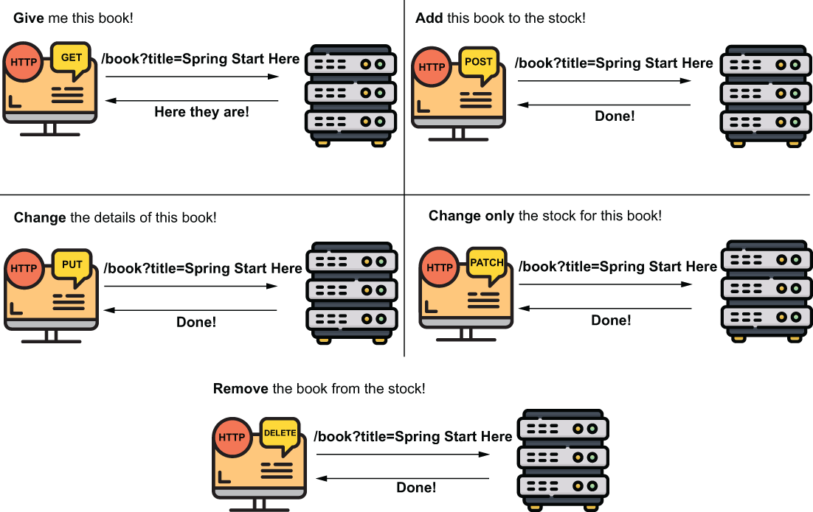

> **Hình 8.9** Các HTTP method cơ bản. Bạn dùng GET để truy xuất dữ liệu, POST để thêm dữ liệu, PUT để thay đổi một bản ghi, PATCH để thay đổi một phần của bản ghi, và DELETE để xóa dữ liệu. Client phải dùng HTTP method phù hợp để thể hiện hành động được thực thi bởi một request cụ thể.

> **LƯU Ý** Dù việc phân biệt giữa thay thế hoàn toàn một bản ghi (PUT) và chỉ thay đổi một phần của nó (PATCH) là thực hành tốt trong ứng dụng production, sự phân biệt này không phải lúc nào cũng được thực hiện.

Giờ hãy triển khai một ví dụ dùng nhiều hơn chỉ HTTP GET. Tình huống như sau: Chúng ta phải tạo một ứng dụng lưu danh sách sản phẩm. Mỗi sản phẩm có tên và giá. Ứng dụng web hiển thị danh sách tất cả sản phẩm và cho phép người dùng thêm một sản phẩm nữa thông qua HTML form.

Hãy quan sát hai use case được mô tả bởi tình huống này. Người dùng cần làm những việc sau:

- Xem tất cả sản phẩm trong danh sách; ở đây, chúng ta sẽ tiếp tục dùng HTTP GET.
- Thêm sản phẩm vào danh sách; ở đây, chúng ta sẽ dùng HTTP POST.

Chúng ta tạo một project mới, "sq-ch8-ex5", với các dependency (trong file pom.xml) cho web và Thymeleaf, như mô tả trong đoạn code tiếp theo:

```xml
<dependency>
   <groupId>org.springframework.boot</groupId>
   <artifactId>spring-boot-starter-thymeleaf</artifactId>
</dependency>
<dependency>
   <groupId>org.springframework.boot</groupId>
   <artifactId>spring-boot-starter-web</artifactId>
</dependency>
```

Trong project, chúng ta tạo một class `Product` để mô tả một sản phẩm với các thuộc tính name và price. Class `Product` là một class model, như chúng ta đã bàn trong chương 5, nên chúng ta sẽ tạo nó trong package tên là "model". Listing sau trình bày class `Product`.

**Listing 8.5** Class Product mô tả một sản phẩm với name và price là các thuộc tính

```java
public class Product {

    private String name;
    private double price;

    // Omitted getters and setters
}
```

Giờ chúng ta đã có cách biểu diễn một sản phẩm, hãy tạo danh sách nơi ứng dụng lưu các sản phẩm. Ứng dụng web sẽ hiển thị sản phẩm trong danh sách này lên trang web, và trong danh sách này người dùng có thể thêm nhiều sản phẩm hơn. Chúng ta sẽ triển khai hai use case (lấy danh sách sản phẩm để hiển thị và thêm sản phẩm mới) dưới dạng các method trong một class service. Hãy tạo một class service mới tên là `ProductService` trong package tên là "service".

Listing tiếp theo trình bày class service, class này khởi tạo một danh sách và định nghĩa hai method để thêm sản phẩm mới và lấy danh sách.

**Listing 8.6** Class ProductService triển khai các use case của ứng dụng

```java
@Service
public class ProductService {
     private List<Product> products = new ArrayList<>();

     public void addProduct(Product p) {
         products.add(p);
     }

     public List<Product> findAll() {
         return products;
     }

}
```

> **LƯU Ý** Thiết kế này là một sự đơn giản hóa để bạn tập trung vào thảo luận về HTTP method. Hãy nhớ rằng scope mặc định của một Spring bean là singleton, như chúng ta đã bàn trong chương 5, và một ứng dụng web ngụ ý nhiều thread (một cho mỗi request). Thay đổi một danh sách được định nghĩa là thuộc tính của bean sẽ gây ra tình huống race condition trong ứng dụng thực tế khi nhiều client thêm sản phẩm đồng thời. Hiện tại, chúng ta giữ sự đơn giản hóa này, vì trong các chương tiếp theo chúng ta sẽ thay danh sách bằng database, nên vấn đề này sẽ không còn xảy ra. Nhưng hãy nhớ rằng đây là cách tiếp cận tệ, và, như chúng ta đã bàn trong chương 5, bạn không nên dùng thứ tương tự trong ứng dụng sẵn sàng cho production. Singleton bean không thread-safe!

Chương 12 bàn về data source; chúng ta sẽ dùng database để lưu dữ liệu gần hơn với hình hài của một ứng dụng production. Nhưng hiện tại, tốt hơn là tập trung vào chủ đề đang bàn, HTTP method, và xây dựng các ví dụ một cách tuần tự.

Một controller sẽ gọi các use case do service triển khai. Controller nhận dữ liệu về sản phẩm mới từ client và thêm vào danh sách bằng cách gọi service, và controller lấy danh sách sản phẩm rồi gửi đến view. Bạn đã học cách triển khai các khả năng này ở phần đầu chương. Trước hết, hãy tạo một class `ProductController` trong package tên là "controllers" và cho phép controller này inject service bean. Listing sau cho bạn thấy định nghĩa của controller.

**Listing 8.7** Class ProductController dùng service để gọi các use case

```java
@Controller
public class ProductsController {

    private final ProductService productService;

    public ProductsController(
      ProductService productService) {                 ❶
        this.productService = productService;
    }

}
```

❶ Chúng ta dùng DI qua tham số constructor của controller để lấy service bean từ Spring context.

Giờ chúng ta hiện thực use case đầu tiên: hiển thị danh sách sản phẩm trên một trang. Chức năng này khá đơn giản. Chúng ta dùng tham số `Model` để gửi dữ liệu từ controller đến view, như bạn đã học trong mục 8.1. Listing sau trình bày phần triển khai action của controller.

**Listing 8.8** Gửi danh sách sản phẩm đến view

```java
@Controller
public class ProductsController {

    private final ProductService productService;

    public ProductsController(ProductService productService) {
        this.productService = productService;
    }

    @RequestMapping("/products")                              ❶
    public String viewProducts(Model model) {                 ❷
      var products = productService.findAll();                ❸
        model.addAttribute("products", products);             ❹

        return "products.html";                               ❺
    }
}
```

❶ Chúng ta ánh xạ action của controller vào đường dẫn /products. Mặc định, annotation `@RequestMapping` dùng HTTP method GET.

❷ Chúng ta định nghĩa một tham số `Model` dùng để gửi dữ liệu đến view.

❸ Chúng ta lấy danh sách sản phẩm từ service.

❹ Chúng ta gửi danh sách sản phẩm đến view.

❺ Chúng ta trả về tên view, view này sẽ được dispatcher servlet lấy và render.

Để hiển thị các sản phẩm trong view, chúng ta định nghĩa trang products.html trong thư mục "resources/templates" của project, như bạn đã học trong mục 8.1. Listing sau cho bạn thấy nội dung của file "products.html", file này nhận danh sách sản phẩm mà controller gửi và hiển thị trong một bảng HTML.

**Listing 8.9** Hiển thị các sản phẩm trên trang

```html
<!DOCTYPE html>
<html lang="en" xmlns:th="http://www.thymeleaf.org">                          ❶
    <head>
           <meta charset="UTF-8">
         <title>Home Page</title>
     </head>
     <body>
         <h1>Products</h1>

           <h2>View products</h2>

           <table>
               <tr>                                                           ❷
                     <th>PRODUCT NAME</th>                                    ❷
                     <th>PRODUCT PRICE</th>                                   ❷
                </tr>                                                         ❷
                <tr th:each="p: ${products}" >                                ❸
                     <td th:text="${p.name}"></td>                            ❹
                    <td th:text="${p.price}"></td>                            ❹
                </tr>
         </table>
     </body>
</html>
```

❶ Chúng ta định nghĩa tiền tố "th" để dùng các khả năng của Thymeleaf.

❷ Chúng ta định nghĩa một tiêu đề tĩnh cho bảng.

❸ Chúng ta dùng tính năng `th:each` của Thymeleaf để lặp qua collection và hiển thị một hàng bảng cho mỗi sản phẩm trong danh sách.

❹ Chúng ta hiển thị tên và giá của mỗi sản phẩm trên một hàng.

Hình 8.10 trình bày luồng khi gọi đường dẫn /products với HTTP GET trên sơ đồ Spring MVC:

1. Client gửi một HTTP request cho đường dẫn /products.
2. Dispatcher servlet dùng handler mapping để tìm action của controller cần gọi cho đường dẫn /products.
3. Dispatcher servlet gọi action của controller.
4. Controller yêu cầu danh sách sản phẩm từ service và gửi nó để được render cùng view.
5. View được render thành một HTTP response.
6. HTTP response được gửi lại client.

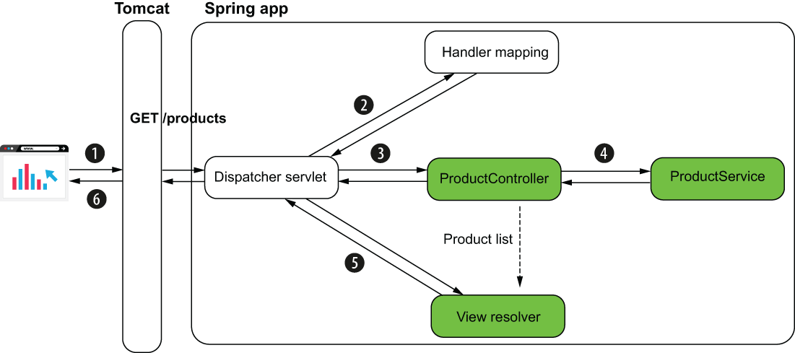

> **Hình 8.10** Khi gọi /products với HTTP GET, controller lấy danh sách sản phẩm từ service và gửi đến view. HTTP response chứa bảng HTML với các sản phẩm trong danh sách.

Nhưng chúng ta vẫn cần triển khai use case thứ hai trước khi kiểm tra chức năng của ứng dụng. Chúng ta sẽ chỉ thấy một bảng trống nếu không có tùy chọn thêm sản phẩm vào danh sách. Hãy thay đổi controller và thêm một action để cho phép thêm sản phẩm vào danh sách sản phẩm. Listing 8.10 trình bày định nghĩa của action này.

**Listing 8.10** Triển khai method action để thêm sản phẩm

```java
@Controller
public class ProductsController {

    // Omitted code

    @RequestMapping(path = "/products",
                    method = RequestMethod.POST)                  ❶
    public String addProduct(
          @RequestParam String name,                              ❷
          @RequestParam double price,                             ❷
          Model model
    ) {
        Product p = new Product();                                ❸
        p.setName(name);                                          ❸
        p.setPrice(price);                                        ❸
        productService.addProduct(p);                             ❸

        var products = productService.findAll();                  ❹
        model.addAttribute("products", products);                 ❹

        return "products.html";                                   ❺
    }
}
```

❶ Chúng ta ánh xạ action của controller vào đường dẫn /products. Chúng ta dùng thuộc tính `method` của annotation `@RequestMapping` để đổi HTTP method thành POST.

❷ Chúng ta nhận tên và giá cho sản phẩm cần thêm bằng request parameter.

❸ Chúng ta tạo một instance `Product` mới và thêm vào danh sách bằng cách gọi method use case của service.

❹ Chúng ta lấy danh sách sản phẩm và gửi đến view.

❺ Chúng ta trả về tên view sẽ được render.

Chúng ta đã dùng thuộc tính `method` của annotation `@RequestMapping` để chỉ định HTTP method. Nếu bạn không đặt method, mặc định `@RequestMapping` dùng HTTP GET. Nhưng vì cả đường dẫn lẫn method đều thiết yếu với bất kỳ lời gọi HTTP nào, chúng ta muốn luôn xác nhận cả hai. Vì lý do này, các lập trình viên thường dùng các annotation chuyên biệt cho từng HTTP method thay vì `@RequestMapping`. Trong ứng dụng, bạn sẽ thường thấy các lập trình viên dùng `@GetMapping` để ánh xạ một request GET vào action, `@PostMapping` cho request dùng HTTP POST, v.v. Chúng ta cũng sẽ thay đổi ví dụ để dùng các annotation chuyên biệt này cho HTTP method. Listing sau trình bày toàn bộ nội dung của class controller, bao gồm các thay đổi trên các annotation ánh xạ của các action.

**Listing 8.11** Class ProductController

```java
@Controller
public class ProductsController {

   private final ProductService productService;

   public ProductsController(ProductService productService) {
     this.productService = productService;
   }

   @GetMapping("/products")                                   ❶
   public String viewProducts(Model model) {
     var products = productService.findAll();
       model.addAttribute("products", products);

       return "products.html";
   }

   @PostMapping("/products")                                  ❷
   public String addProduct(
         @RequestParam String name,
         @RequestParam double price,
         Model model
   ) {
       Product p = new Product();
       p.setName(name);
       p.setPrice(price);
       productService.addProduct(p);

       var products = productService.findAll();
       model.addAttribute("products", products);

       return "products.html";
        }
    }
```

❶ `@GetMapping` ánh xạ HTTP GET request với một đường dẫn cụ thể vào action của controller.

❷ `@PostMapping` ánh xạ HTTP POST request với một đường dẫn cụ thể vào action của controller.

Chúng ta cũng có thể thay đổi view để cho phép người dùng gọi action HTTP POST của controller và thêm sản phẩm vào danh sách. Chúng ta sẽ dùng một HTML form để thực hiện HTTP request này. Listing sau trình bày các thay đổi chúng ta cần làm trên trang products.html (view của chúng ta) để thêm HTML form. Kết quả của trang được thiết kế với listing 8.12 được hiển thị trong hình 8.11.

**Listing 8.12** Thêm HTML form vào view để thêm sản phẩm vào danh sách

```html
<!DOCTYPE html>
<html lang="en" xmlns:th="http://www.thymeleaf.org">
     <head>
        <meta charset="UTF-8">
        <title>Home Page</title>
     </head>
     <body>

        <!-- Omitted code -->

        <h2>Add a product</h2>
        <form action="/products" method="post">                   ❶
          Name: <input
                    type="text"
                    name="name"><br />                            ❷
          Price: <input
                    type="number"
                    step="any"
                    name="price"><br />                           ❸
          <button type="submit">Add product</button>              ❹
         </form>
     </body>
</html>
```

❶ Khi được submit, HTML form thực hiện một request POST đến đường dẫn /products.

❷ Một thành phần input cho phép người dùng đặt tên sản phẩm. Giá trị trong thành phần này được gửi dưới dạng request parameter với key "name".

❸ Một thành phần input cho phép người dùng đặt giá sản phẩm. Giá trị trong thành phần này được gửi dưới dạng request parameter với key "price".

❹ Người dùng dùng nút submit để gửi form.

Chạy và kiểm tra ứng dụng. Bạn truy cập trang trong trình duyệt tại http://localhost:8080/products, và bạn sẽ có thể thêm sản phẩm mới và xem những sản phẩm đã thêm. Hình 8.11 cho thấy kết quả.

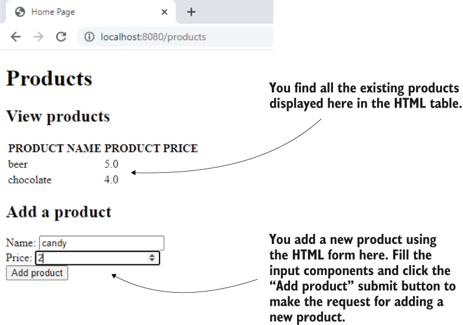

> **Hình 8.11** Kết quả cuối cùng. Người dùng thấy các sản phẩm trong bảng HTML trên trang và có thể thêm sản phẩm mới qua HTML form.

Trong ví dụ của chúng ta, tôi dùng annotation `@RequestParameter`, mà bạn đã học trong mục 8.2.1. Tôi dùng annotation này ở đây để làm rõ cách client gửi dữ liệu. Nhưng đôi khi Spring cho phép bạn bỏ bớt code. Ví dụ, bạn có thể dùng trực tiếp một `Product` làm tham số của action controller, như trình bày trong listing 8.13. Vì tên của các request parameter giống tên các thuộc tính của class `Product`, Spring biết cách khớp chúng và tự động tạo đối tượng. Với người đã biết Spring, điều này rất tuyệt vì nó giúp bạn khỏi phải viết thêm các dòng code. Nhưng người mới bắt đầu có thể bối rối vì tất cả các chi tiết này. Giả sử bạn thấy một ví dụ trong một bài viết dùng cú pháp này. Có thể không rõ instance `Product` từ đâu ra. Nếu bạn vừa mới bắt đầu học Spring và rơi vào tình huống như vậy, lời khuyên của tôi là hãy nhận thức rằng Spring có xu hướng có rất nhiều cú pháp để ẩn càng nhiều code càng tốt. Bất cứ khi nào bạn thấy một cú pháp mà bạn không hiểu rõ trong một ví dụ hay bài viết, hãy thử tìm chi tiết đặc tả của framework.

Thay đổi nhỏ này được tách vào một project tên là "sq-ch8-ex6" nếu bạn muốn kiểm tra và so sánh với project "sq-ch8-ex5".

**Listing 8.13** Dùng trực tiếp model làm tham số của action controller

```java
@Controller
public class ProductsController {

    // Omitted code

  @PostMapping("/products")
  public String addProduct(
         Product p,                      ❶
         Model model
    ) {
      productService.addProduct(p);

        var products = productService.findAll();
        model.addAttribute("products", products);

        return "products.html";
    }
}
```

❶ Bạn có thể dùng trực tiếp class model làm tham số của action controller. Spring biết cách tạo instance dựa trên các thuộc tính của request. Class model cần có constructor mặc định để cho phép Spring tạo instance trước khi gọi method action.

## Tóm tắt

- Các ứng dụng web ngày nay có các trang động (còn gọi là view động). Một trang động có thể hiển thị nội dung khác nhau cho các request khác nhau.
- Để biết cần hiển thị gì, view động nhận dữ liệu biến đổi từ controller.
- Một cách dễ dàng để triển khai trang động trong ứng dụng Spring là dùng template engine như Thymeleaf. Các lựa chọn thay thế cho Thymeleaf là Mustache, FreeMarker và Java Server Pages (JSP).
- Template engine là một dependency cung cấp cho ứng dụng của bạn khả năng dễ dàng lấy dữ liệu mà controller gửi và hiển thị nó trên view.
- Client có thể gửi dữ liệu đến server thông qua request parameter hoặc path variable. Action của controller nhận các chi tiết client gửi trong các tham số được đánh dấu `@RequestParam` hoặc `@PathVariable`.
- Request parameter có thể là tùy chọn.
- Bạn chỉ nên dùng path variable cho dữ liệu bắt buộc mà client gửi.
- Một đường dẫn và một HTTP method xác định một HTTP request. HTTP method được biểu diễn bằng một động từ xác định ý định của client. Các HTTP method thiết yếu bạn sẽ thường thấy trong ứng dụng production là GET, POST, PUT, PATCH và DELETE.
  - GET thể hiện ý định của client là truy xuất dữ liệu mà không thay đổi dữ liệu trên backend.
  - POST thể hiện ý định của client là thêm dữ liệu mới ở phía server.
  - PUT thể hiện ý định của client là thay đổi hoàn toàn một bản ghi dữ liệu trên backend.
  - PATCH thể hiện ý định của client là thay đổi một phần của bản ghi dữ liệu trên backend.
  - DELETE thể hiện ý định của client là xóa dữ liệu trên backend.
- Thông qua quy trình HTML form của trình duyệt một cách trực tiếp, bạn chỉ có thể dùng HTTP GET và HTTP POST. Để dùng các HTTP method khác như DELETE hay PUT, bạn cần triển khai lời gọi bằng một ngôn ngữ phía client như JavaScript.
