# 9 Sử dụng các web scope của Spring

**Chương này bao gồm**

- Sử dụng các web scope của Spring
- Triển khai chức năng đăng nhập đơn giản cho ứng dụng web
- Chuyển hướng (redirect) từ trang này sang trang khác trong ứng dụng web

Trong chương 5, chúng ta đã bàn về các bean scope của Spring. Bạn đã học rằng Spring quản lý vòng đời của bean theo cách khác nhau tùy vào cách bạn khai báo bean trong Spring context. Trong chương này, chúng ta sẽ thêm một số cách mới mà Spring quản lý các bean trong context. Bạn sẽ học rằng Spring có những cách tùy chỉnh để quản lý instance cho ứng dụng web bằng cách dùng HTTP request làm điểm tham chiếu. Spring khá tuyệt, phải không?

Trong bất kỳ ứng dụng Spring nào, bạn có thể chọn khai báo một bean là một trong các loại sau:

- Singleton: Bean scope mặc định trong Spring, với scope này framework định danh duy nhất mỗi instance bằng một tên trong context
- Prototype: Bean scope trong Spring, với scope này framework chỉ quản lý kiểu và tạo một instance mới của class đó mỗi khi có ai đó yêu cầu (trực tiếp từ context hoặc qua wiring hay auto-wiring).

Trong chương này, bạn sẽ học rằng trong ứng dụng web bạn có thể dùng các bean scope khác chỉ liên quan đến ứng dụng web. Chúng ta gọi chúng là web scope:

- Request scope: Spring tạo một instance của class bean cho mỗi HTTP request. Instance chỉ tồn tại cho HTTP request cụ thể đó.
- Session scope: Spring tạo một instance và giữ instance đó trong bộ nhớ của server trong suốt HTTP session. Spring liên kết instance trong context với session của client.
- Application scope: Instance là duy nhất trong context của ứng dụng, và nó có sẵn trong suốt thời gian ứng dụng chạy.

Để dạy bạn cách các web scope này hoạt động trong ứng dụng Spring, chúng ta sẽ làm một ví dụ triển khai chức năng đăng nhập. Hầu hết ứng dụng web ngày nay cho phép người dùng đăng nhập và truy cập tài khoản, nên ví dụ này cũng có ý nghĩa từ góc độ thực tế.

Trong mục 9.1, chúng ta sẽ dùng một bean có scope request để nhận thông tin đăng nhập của người dùng và đảm bảo ứng dụng chỉ dùng chúng cho request đăng nhập. Sau đó, trong mục 9.2, chúng ta sẽ dùng một bean có scope session để lưu tất cả các chi tiết liên quan mà chúng ta cần giữ cho người dùng đã đăng nhập, chừng nào người dùng còn đăng nhập. Trong mục 9.3, chúng ta sẽ dùng bean có scope application để thêm khả năng đếm số lần đăng nhập. Hình 9.1 cho bạn thấy các bước chúng ta thực hiện để triển khai ứng dụng này.

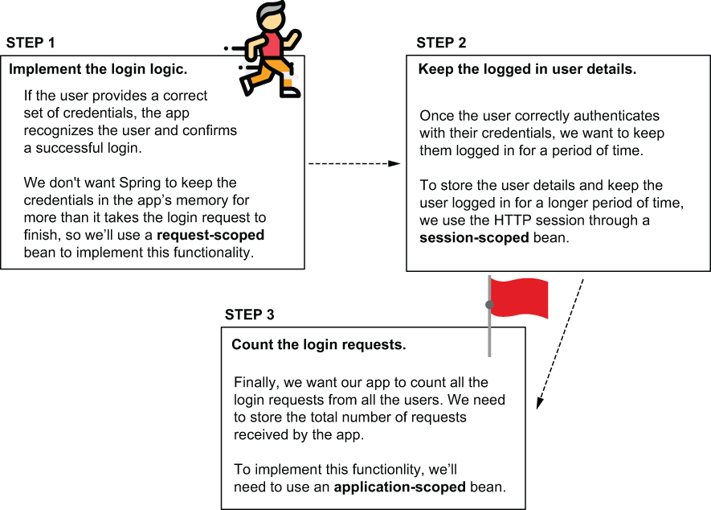

> **Hình 9.1** Chúng ta sẽ triển khai chức năng đăng nhập theo ba bước. Với mỗi bước, chúng ta cần dùng một bean scope khác nhau. Trong mục 9.1, chúng ta dùng bean có scope request để triển khai logic đăng nhập mà không có nguy cơ lưu thông tin đăng nhập lâu hơn request đăng nhập. Sau đó chúng ta quyết định cần lưu những chi tiết nào cho người dùng đã xác thực trong một bean có scope session. Cuối cùng, chúng ta triển khai tính năng đếm tất cả các request đăng nhập, và dùng bean có scope application để giữ con số này.

## 9.1 Sử dụng request scope trong ứng dụng web Spring

Trong mục này, bạn sẽ học cách dùng bean có scope request trong ứng dụng web Spring. Như bạn đã học ở chương 7 và 8, ứng dụng web tập trung vào HTTP request và response. Vì lý do này, và thường trong ứng dụng web, một số chức năng dễ quản lý hơn nếu Spring cung cấp cho bạn cách quản lý vòng đời bean gắn với HTTP request.

Bean có scope request là một đối tượng được Spring quản lý, mà framework tạo một instance mới cho mỗi HTTP request. Ứng dụng chỉ có thể dùng instance đó cho request đã tạo ra nó. Bất kỳ HTTP request mới nào (từ cùng client hoặc client khác) đều tạo và dùng một instance khác của cùng class (hình 9.2).

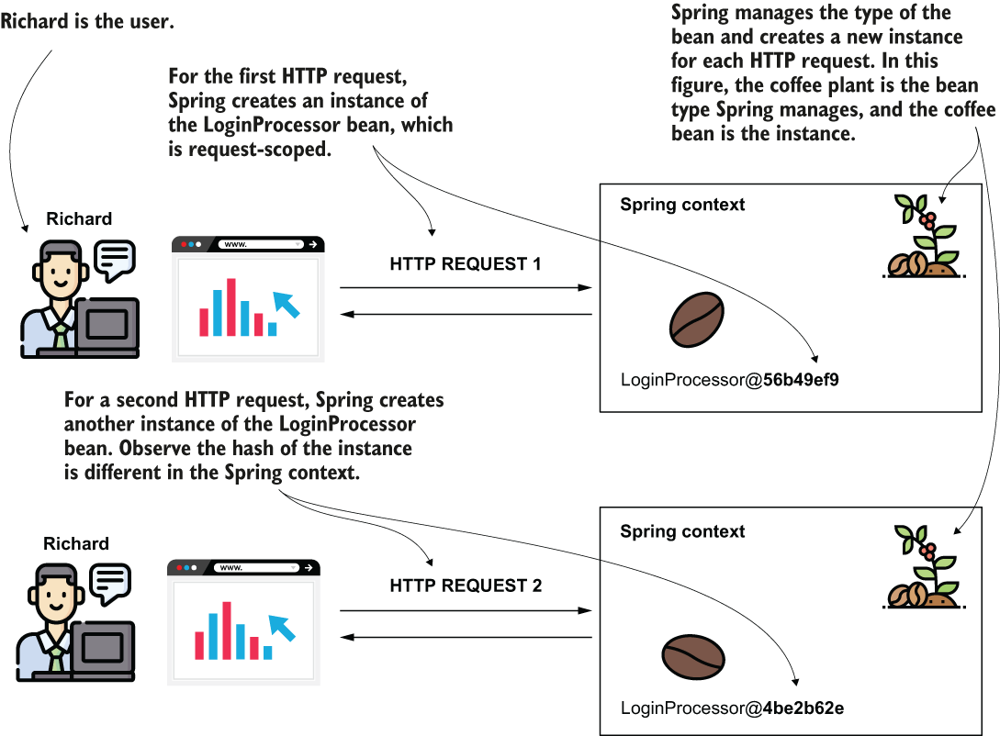

> **Hình 9.2** Với mỗi HTTP request, Spring cung cấp một instance mới cho bean có scope request. Khi dùng bean có scope request, bạn có thể chắc chắn dữ liệu bạn thêm vào bean chỉ có sẵn trên HTTP request đã tạo ra bean. Spring quản lý kiểu bean (cây cà phê) và dùng nó để lấy các instance (hạt cà phê) cho mỗi request mới.

Hãy minh họa việc dùng bean có scope request bằng một ví dụ. Chúng ta sẽ triển khai chức năng đăng nhập của một ứng dụng web, và dùng một bean có scope request để quản lý thông tin đăng nhập của người dùng cho logic đăng nhập.

> **Các khía cạnh chính của bean có scope request**
>
> Trước khi đi sâu vào triển khai một ứng dụng Spring dùng bean có scope request, tôi muốn liệt kê ngắn gọn ở đây các khía cạnh chính khi dùng bean scope này. Các khía cạnh này sẽ giúp bạn phân tích liệu bean có scope request có phải là cách tiếp cận đúng trong tình huống thực tế hay không. Hãy ghi nhớ các khía cạnh rất quan trọng của bean có scope request, được giải thích trong bảng sau.
>
> | Thực tế | Hệ quả | Cần cân nhắc | Cần tránh |
> |---|---|---|---|
> | Spring tạo một instance mới cho mỗi HTTP request từ bất kỳ client nào. | Spring tạo rất nhiều instance của bean này trong bộ nhớ của ứng dụng trong quá trình thực thi. | Số lượng instance thường không phải vấn đề lớn vì các instance này tồn tại ngắn. Ứng dụng không cần chúng lâu hơn thời gian HTTP request cần để hoàn thành. Khi HTTP request hoàn thành, ứng dụng giải phóng các instance, và chúng được thu gom rác (garbage-collected). | Tuy nhiên, hãy đảm bảo bạn không triển khai logic tốn thời gian mà Spring cần thực thi để tạo instance (như lấy dữ liệu từ database hoặc thực hiện lời gọi mạng). Tránh viết logic trong constructor hoặc method `@PostConstruct` cho bean có scope request. |
> | Chỉ một request có thể dùng một instance của bean có scope request. | Các instance của bean có scope request không dễ gặp các vấn đề liên quan đến đa luồng vì chỉ một thread (thread của request) có thể truy cập chúng. | Bạn có thể dùng các thuộc tính của instance để lưu dữ liệu mà request dùng. | Đừng dùng các kỹ thuật đồng bộ hóa cho các thuộc tính của các bean này. Những kỹ thuật này sẽ thừa thãi, và chúng chỉ ảnh hưởng đến hiệu năng của ứng dụng. |

> **LƯU Ý** Một ví dụ đăng nhập như thế này rất tốt cho mục đích giảng dạy. Tuy nhiên, trong ứng dụng sẵn sàng cho production, tốt hơn là tránh tự triển khai các cơ chế xác thực (authentication) và phân quyền (authorization). Trong ứng dụng Spring thực tế, chúng ta dùng Spring Security để triển khai mọi thứ liên quan đến xác thực và phân quyền. Dùng Spring Security (cũng là một phần của hệ sinh thái Spring) đơn giản hóa việc triển khai và đảm bảo bạn không (vô tình) đưa vào các lỗ hổng khi viết logic bảo mật ở cấp ứng dụng. Tôi khuyên bạn cũng đọc *Spring Security in Action* (Manning, 2020), một cuốn sách khác tôi là tác giả, mô tả chi tiết cách dùng Spring Security để bảo vệ ứng dụng Spring của bạn.

Để mọi thứ đơn giản, chúng ta sẽ xét một bộ thông tin đăng nhập được "nướng" sẵn vào ứng dụng. Trong ứng dụng thực tế, ứng dụng lưu người dùng trong database. Nó cũng mã hóa mật khẩu để bảo vệ chúng. Hiện tại, chúng ta chỉ tập trung vào mục đích của chương này: bàn về các web bean scope của Spring. Sau này, trong chương 11 và 12, bạn sẽ học thêm về việc lưu dữ liệu trong database.

Hãy tạo một project Spring Boot và thêm các dependency cần thiết. Bạn sẽ tìm thấy ví dụ này trong project "sq-ch9-ex1". Bạn có thể thêm các dependency trực tiếp khi tạo project (ví dụ, dùng start.spring.io) hoặc sau đó trong pom.xml. Với ví dụ này, chúng ta sẽ dùng dependency web và Thymeleaf làm template engine (như chúng ta đã làm ở chương 8). Đoạn code tiếp theo cho thấy các dependency bạn cần có trong file pom.xml:

```xml
<dependency>
    <groupId>org.springframework.boot</groupId>
    <artifactId>spring-boot-starter-thymeleaf</artifactId>
</dependency>
<dependency>
   <groupId>org.springframework.boot</groupId>
    <artifactId>spring-boot-starter-web</artifactId>
</dependency>
```

Chúng ta sẽ tạo một trang chứa form đăng nhập yêu cầu tên người dùng và mật khẩu. Ứng dụng so sánh tên người dùng và mật khẩu với một bộ thông tin đăng nhập mà nó biết (trong trường hợp của tôi, người dùng "natalie" với mật khẩu "password"). Nếu chúng ta cung cấp đúng thông tin đăng nhập (khớp với thông tin ứng dụng biết), thì trang hiển thị thông báo "You are now logged in" bên dưới form đăng nhập. Nếu thông tin đăng nhập chúng ta cung cấp không đúng, thì ứng dụng hiển thị thông báo: "Login failed."

Như bạn đã học ở chương 7 và 8, chúng ta cần triển khai một trang (đại diện cho view) và một class controller. Controller gửi thông báo cần hiển thị đến view tùy theo kết quả đăng nhập (hình 9.3).

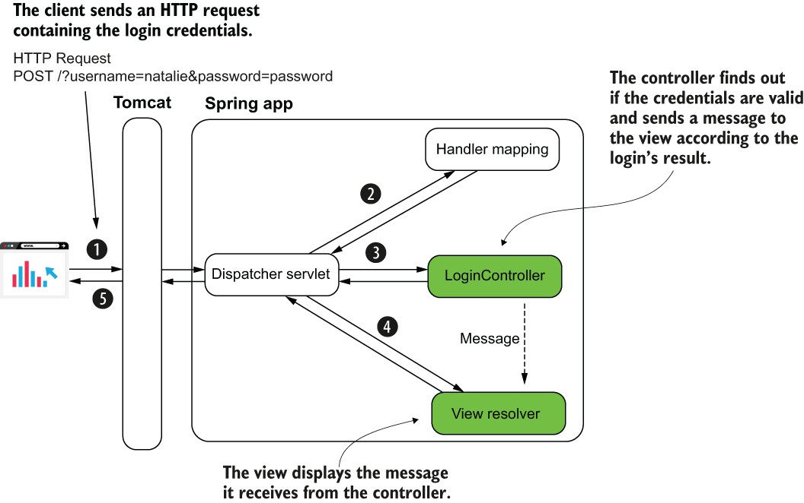

> **Hình 9.3** Chúng ta cần triển khai controller và view. Trong controller, chúng ta triển khai một action tìm ra thông tin đăng nhập gửi trong request đăng nhập có hợp lệ không. Controller gửi một thông báo đến view, và view hiển thị thông báo này.

Listing 9.1 cho thấy trang HTML đăng nhập định nghĩa view trong ứng dụng. Như bạn đã học ở chương 8, bạn phải lưu trang trong thư mục resources/templates của project Spring Boot. Hãy đặt tên trang là "login.html". Để hiển thị thông báo với kết quả của logic, chúng ta cần gửi một tham số từ controller đến view. Tôi đặt tên tham số này là "message", như bạn thấy trong listing sau, nơi tôi dùng cú pháp `${message}` để hiển thị nó trong một đoạn văn bên dưới form đăng nhập.

**Listing 9.1** Định nghĩa trang đăng nhập login.html

```html
<!DOCTYPE html>
<html lang="en" xmlns:th="http://www.thymeleaf.org">                      ❶
<head>
  <meta charset="UTF-8">
  <title>Login</title>
</head>
<body>
  <form action="/" method="post">                                         ❷
      Username: <input type="text" name="username" /><br />               ❸
      Password: <input type="password" name="password" /><br />           ❸
     <button type="submit">Log in</button>                                ❹
  </form>

  <p th:text="${message}"></p>                                            ❺
</body>
</html>
```

❶ Chúng ta định nghĩa tiền tố "th" của Thymeleaf để dùng các khả năng của template engine.

❷ Chúng ta định nghĩa một HTML form để gửi thông tin đăng nhập đến server.

❸ Các trường input được dùng để nhập thông tin đăng nhập, tên người dùng và mật khẩu.

❹ Khi người dùng nhấp nút Submit, client thực hiện một HTTP POST request với thông tin đăng nhập.

❺ Chúng ta hiển thị một thông báo với kết quả của request đăng nhập bên dưới HTML form.

Một action của controller cần nhận HTTP request (từ dispatcher servlet, như bạn đã học ở chương 7 và 8), nên hãy định nghĩa controller và action nhận HTTP request cho trang chúng ta đã tạo trong listing 9.1. Trong listing 9.2, bạn thấy định nghĩa của class controller. Chúng ta ánh xạ action của controller vào đường dẫn gốc ("/") của ứng dụng web. Tôi sẽ đặt tên controller là `LoginController`.

**Listing 9.2** Action của controller được ánh xạ vào đường dẫn gốc

```java
@Controller                                   ❶
public class LoginController {

    @GetMapping("/")                          ❷
    public String loginGet() {
        return "login.html";                  ❸
    }
}
```

❶ Chúng ta dùng stereotype annotation `@Controller` để định nghĩa class là một controller của Spring MVC.

❷ Chúng ta ánh xạ action của controller vào đường dẫn gốc ("/") của ứng dụng.

❸ Chúng ta trả về tên view mà chúng ta muốn ứng dụng render.

Giờ chúng ta đã có trang đăng nhập, chúng ta muốn triển khai logic đăng nhập. Khi người dùng nhấp nút Submit, chúng ta muốn trang hiển thị thông báo phù hợp bên dưới form đăng nhập. Nếu người dùng gửi đúng bộ thông tin đăng nhập, thông báo là "You are now logged in"; nếu không, thông báo hiển thị sẽ là "Login failed" (hình 9.4).

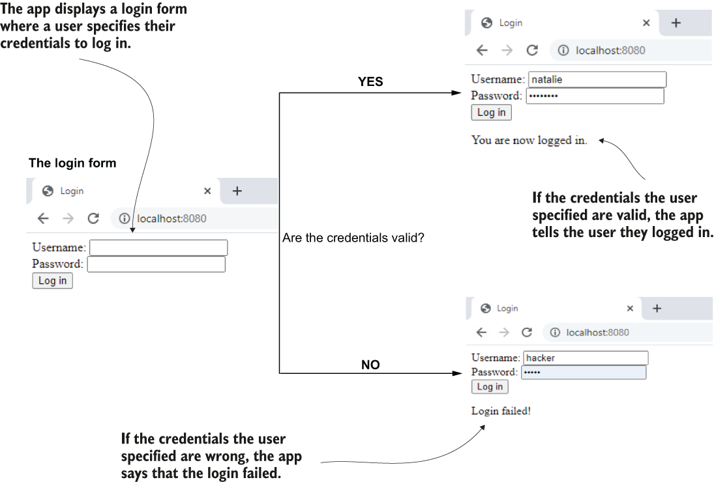

> **Hình 9.4** Chức năng chúng ta triển khai trong mục này. Trang hiển thị form đăng nhập cho người dùng. Sau đó người dùng cung cấp thông tin đăng nhập hợp lệ, và ứng dụng hiển thị thông báo họ đã đăng nhập thành công. Nếu người dùng cung cấp thông tin đăng nhập sai, ứng dụng nói với người dùng rằng đăng nhập thất bại.

Để xử lý HTTP POST request mà HTML form tạo ra khi người dùng nhấp nút Submit, chúng ta cần thêm một action nữa vào `LoginController`. Action này nhận các request parameter của client (tên người dùng và mật khẩu) và gửi một thông báo đến view tùy theo kết quả đăng nhập. Listing 9.3 cho bạn thấy định nghĩa của action controller, mà chúng ta sẽ ánh xạ vào HTTP POST request đăng nhập.

Lưu ý rằng chúng ta chưa triển khai logic đăng nhập. Trong listing tiếp theo, chúng ta nhận request và gửi một thông báo trong response tùy theo một biến đại diện cho kết quả của request. Nhưng biến này (trong listing 9.3 tên là `loggedIn`) luôn là "false". Trong các listing tiếp theo của mục này, chúng ta hoàn thiện action này bằng cách thêm một lời gọi đến logic đăng nhập. Logic đăng nhập này sẽ trả về kết quả đăng nhập dựa trên thông tin đăng nhập mà client gửi trong request.

**Listing 9.3** Action đăng nhập của controller

```java
@Controller
public class LoginController {

   @GetMapping("/")
   public String loginGet() {
     return "login.html";
   }
     @PostMapping("/")                                                     ❶
     public String loginPost(
             @RequestParam String username,                                ❷
             @RequestParam String password,                                ❷
             Model model                                                   ❸
     ) {
         boolean loggedIn = false;                                         ❹

         if (loggedIn) {                                                   ❺
             model.addAttribute("message", "You are now logged in.");      ❺
         } else {                                                          ❺
             model.addAttribute("message", "Login failed!");               ❺
         }                                                                 ❺

         return "login.html";                                              ❻
     }
}
```

❶ Chúng ta ánh xạ action của controller vào HTTP POST request của trang đăng nhập.

❷ Chúng ta nhận thông tin đăng nhập từ các HTTP request parameter.

❸ Chúng ta khai báo một tham số `Model` để gửi giá trị thông báo đến view.

❹ Khi chúng ta triển khai logic đăng nhập sau này, biến này sẽ lưu kết quả của request đăng nhập.

❺ Tùy vào kết quả đăng nhập, chúng ta gửi một thông báo cụ thể đến view.

❻ Chúng ta trả về tên view, vẫn là login.html, nên chúng ta vẫn ở cùng trang.

Hình 9.5 mô tả trực quan mối liên hệ giữa class controller và view chúng ta đã triển khai.

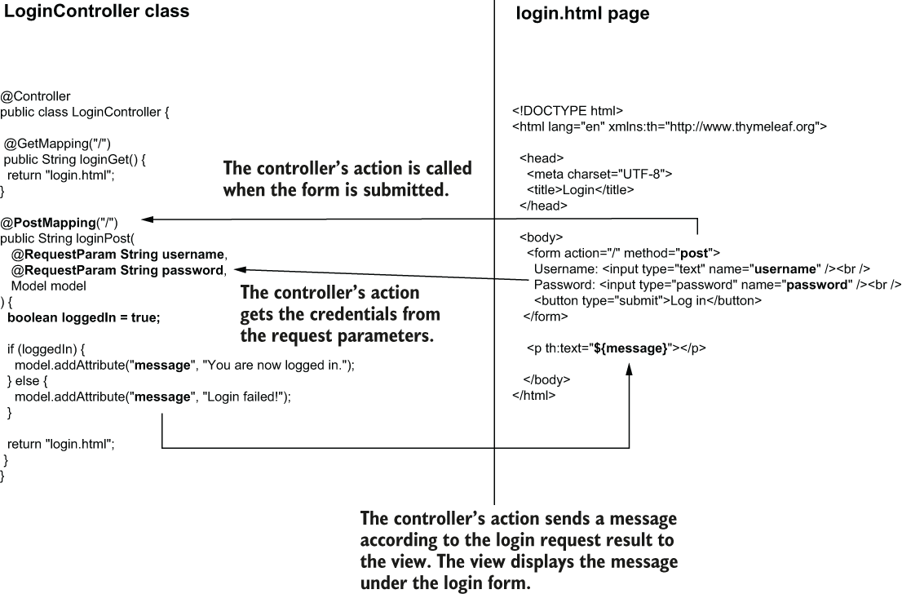

> **Hình 9.5** Dispatcher servlet gọi action của controller khi ai đó submit HTML form đăng nhập. Action của controller nhận thông tin đăng nhập từ các HTTP request parameter. Tùy theo kết quả đăng nhập, controller gửi một thông báo đến view, và view hiển thị thông báo này bên dưới HTML form.

Giờ chúng ta có controller và view, nhưng request scope ở đâu trong tất cả những thứ này? Class duy nhất chúng ta viết là `LoginController`, và chúng ta để nó là singleton, scope mặc định của Spring. Chúng ta không cần đổi scope cho `LoginController` chừng nào nó không lưu chi tiết nào trong các thuộc tính của mình. Nhưng hãy nhớ, chúng ta cần triển khai logic đăng nhập. Logic đăng nhập phụ thuộc vào thông tin đăng nhập của người dùng, và chúng ta phải cân nhắc hai điều về thông tin đăng nhập này:

1. Thông tin đăng nhập là chi tiết nhạy cảm, và bạn không muốn lưu chúng trong bộ nhớ của ứng dụng lâu hơn request đăng nhập.
2. Nhiều người dùng với thông tin đăng nhập khác nhau có thể cố đăng nhập đồng thời.

Xét hai điểm này, chúng ta cần đảm bảo rằng nếu dùng một bean để triển khai logic đăng nhập, mỗi instance là duy nhất cho mỗi HTTP request. Chúng ta cần dùng một bean có scope request. Chúng ta sẽ mở rộng ứng dụng như trình bày trong hình 9.5. Chúng ta thêm một bean có scope request `LoginProcessor`, bean này nhận thông tin đăng nhập trên request và xác thực chúng (hình 9.6).

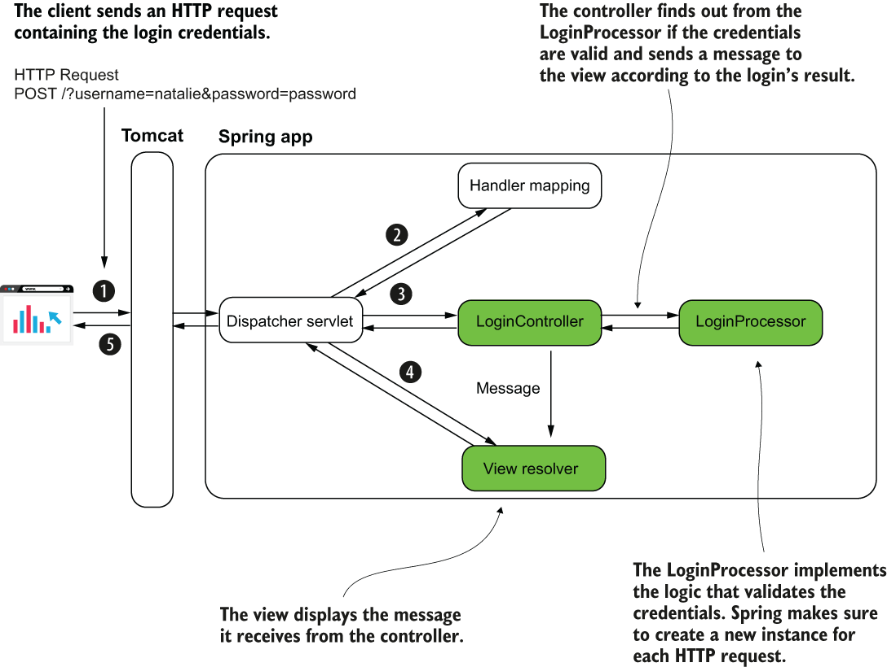

> **Hình 9.6** Bean LoginProcessor có scope request. Spring đảm bảo tạo một instance mới cho mỗi HTTP request. Bean triển khai logic đăng nhập. Controller gọi một method mà nó triển khai. Method trả về true nếu thông tin đăng nhập hợp lệ và false nếu không. Dựa trên giá trị mà LoginProcessor trả về, LoginController gửi thông báo phù hợp đến view.

Listing 9.4 cho thấy phần triển khai của class `LoginProcessor`. Để đổi scope của bean, chúng ta dùng annotation `@RequestScope`. Dĩ nhiên, chúng ta vẫn cần biến class này thành bean trong Spring context bằng cách dùng annotation `@Bean` trong class cấu hình hoặc một stereotype annotation. Tôi chọn đánh dấu class bằng stereotype annotation `@Component`.

**Listing 9.4** Bean LoginProcessor có scope request triển khai logic đăng nhập

```java
@Component                                                 ❶
@RequestScope                                              ❷
public class LoginProcessor {

     private String username;                              ❸
     private String password;                              ❸

     public boolean login() {                              ❹
       String username = this.getUsername();
       String password = this.getPassword();

       if ("natalie".equals(username) && "password".equals(password)) {
          return true;
        } else {
          return false;
        }
    }

    // omitted getters and setters
}
```

❶ Chúng ta đánh dấu class bằng stereotype annotation để nói cho Spring biết đây là một bean.

❷ Chúng ta dùng annotation `@RequestScope` để đổi scope của bean thành request scope. Bằng cách này, Spring tạo một instance mới của class cho mỗi HTTP request.

❸ Bean lưu thông tin đăng nhập dưới dạng thuộc tính.

❹ Bean định nghĩa một method để triển khai logic đăng nhập.

Bạn có thể chạy ứng dụng và truy cập trang đăng nhập bằng địa chỉ localhost:8080 trên thanh địa chỉ của trình duyệt. Hình 9.7 cho bạn thấy hành vi của ứng dụng sau khi truy cập trang và khi dùng thông tin đăng nhập hợp lệ và sai.

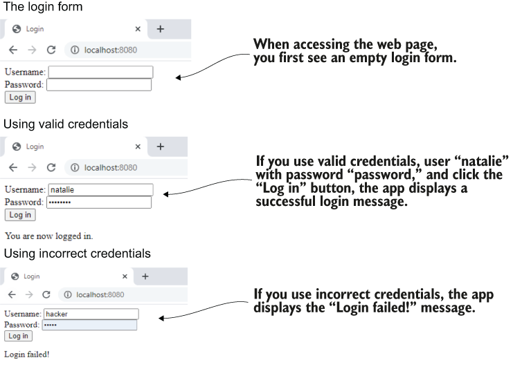

> **Hình 9.7** Khi truy cập trang trong trình duyệt, ứng dụng hiển thị form đăng nhập. Bạn có thể dùng thông tin đăng nhập hợp lệ, và ứng dụng hiển thị thông báo đăng nhập thành công. Nếu bạn dùng thông tin đăng nhập sai, ứng dụng hiển thị thông báo "Login failed!".

## 9.2 Sử dụng session scope trong ứng dụng web Spring

Trong mục này, chúng ta bàn về bean có scope session. Khi bạn vào một ứng dụng web và đăng nhập, bạn mong đợi sau đó có thể lướt qua các trang của ứng dụng, và ứng dụng vẫn nhớ bạn đã đăng nhập. Bean có scope session là một đối tượng được Spring quản lý, mà Spring tạo một instance và liên kết nó với HTTP session. Khi một client gửi request đến server, server dành một chỗ trong bộ nhớ cho request này, trong suốt thời gian session của họ. Spring tạo một instance của bean có scope session khi HTTP session được tạo cho một client cụ thể. Instance đó có thể được tái sử dụng cho cùng client chừng nào HTTP session của họ còn hoạt động. Dữ liệu bạn lưu trong thuộc tính của bean có scope session có sẵn cho tất cả các request của client trong suốt một HTTP session. Cách lưu dữ liệu này cho phép bạn lưu thông tin về những gì người dùng làm khi họ lướt qua các trang của ứng dụng.

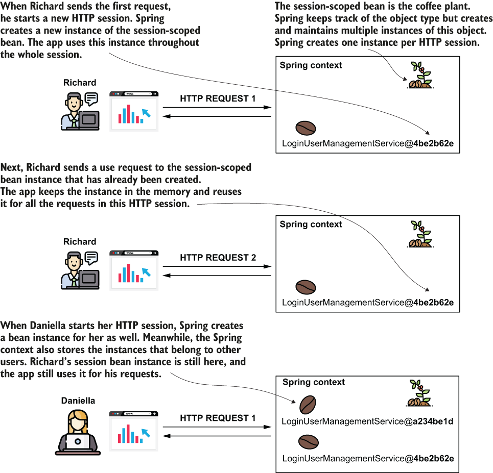

> **Hình 9.8** Bean có scope session được dùng để giữ một bean trong context trong suốt HTTP session đầy đủ của client. Spring tạo một instance của bean có scope session cho mỗi HTTP session mà client mở. Client truy cập cùng instance cho tất cả các request gửi qua cùng HTTP session. Mỗi người dùng có session riêng và truy cập các instance khác nhau của bean có scope session.

Hãy dành thời gian so sánh hình 9.8, trình bày bean có scope session, với hình 9.2, trình bày bean có scope request. Hình 9.9 cũng tóm tắt sự so sánh giữa hai cách tiếp cận. Trong khi với bean có scope request Spring tạo một instance mới cho mỗi HTTP request, với bean có scope session, Spring chỉ tạo một instance cho mỗi HTTP session. Bean có scope session cho phép chúng ta lưu dữ liệu được chia sẻ bởi nhiều request của cùng một client.

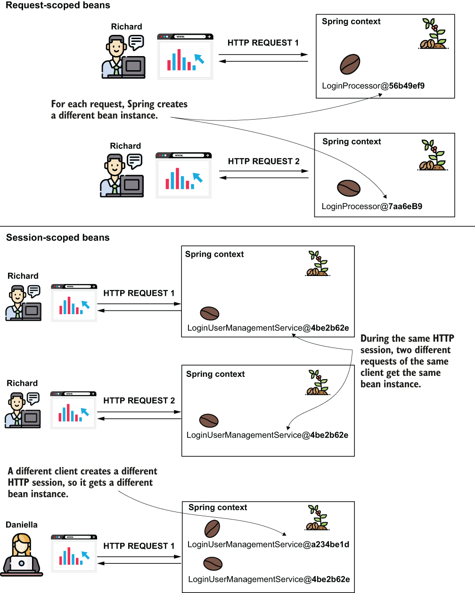

> **Hình 9.9** So sánh giữa bean có scope request và bean có scope session để giúp bạn hình dung sự khác biệt giữa hai web bean scope này. Bạn dùng bean có scope request khi muốn Spring tạo instance mới cho mỗi request. Bạn dùng bean có scope session khi muốn giữ bean (cùng với mọi chi tiết nó giữ) trong suốt HTTP session của client.

Một vài tính năng bạn có thể triển khai bằng bean có scope session bao gồm các ví dụ sau:

- Đăng nhập: Giữ chi tiết của người dùng đã xác thực khi họ truy cập các phần khác nhau của ứng dụng và gửi nhiều request
- Giỏ hàng trực tuyến: Người dùng truy cập nhiều nơi trong ứng dụng, tìm kiếm sản phẩm để thêm vào giỏ hàng. Giỏ hàng nhớ tất cả các sản phẩm mà client đã thêm.

> **Các khía cạnh chính của bean có scope session**
>
> Giống như chúng ta đã làm với bean có scope request, hãy phân tích các đặc điểm chính của bean có scope session mà bạn cần cân nhắc khi lên kế hoạch dùng chúng trong ứng dụng production.
>
> | Thực tế | Hệ quả | Cần cân nhắc | Cần tránh |
> |---|---|---|---|
> | Các instance của bean có scope session được giữ trong suốt HTTP session. | Chúng có vòng đời dài hơn, và ít bị thu gom rác hơn so với bean có scope request. | Ứng dụng giữ dữ liệu bạn lưu trong bean có scope session trong khoảng thời gian dài hơn. | Tránh giữ quá nhiều dữ liệu trong session. Nó có thể trở thành vấn đề hiệu năng. Hơn nữa, không bao giờ lưu các chi tiết nhạy cảm (như mật khẩu, khóa riêng, hay bất kỳ chi tiết bí mật nào khác) trong thuộc tính của session bean. |
> | Nhiều request có thể chia sẻ instance của bean có scope session. | Nếu cùng một client gửi nhiều request đồng thời thay đổi dữ liệu trên instance, bạn có thể gặp các vấn đề liên quan đến đa luồng như race condition. | Khi bạn biết kịch bản như vậy có thể xảy ra, bạn có thể cần dùng các kỹ thuật đồng bộ hóa để tránh xử lý đồng thời. Tuy nhiên, nhìn chung tôi khuyên bạn xem có thể tránh được điều này không và chỉ giữ đồng bộ hóa như phương án cuối cùng khi không thể tránh. | |
> | Bean có scope session là một cách chia sẻ dữ liệu giữa các request bằng cách giữ dữ liệu ở phía server. | Logic bạn triển khai có thể ngụ ý các request trở nên phụ thuộc lẫn nhau. | Khi giữ các chi tiết có trạng thái (stateful) trong bộ nhớ của một ứng dụng, bạn làm client phụ thuộc vào instance ứng dụng cụ thể đó. Trước khi quyết định triển khai tính năng nào đó bằng bean có scope session, hãy cân nhắc các lựa chọn thay thế, như lưu dữ liệu bạn muốn chia sẻ trong database thay vì session. Bằng cách này, bạn có thể để các HTTP request độc lập với nhau. | |

Chúng ta tiếp tục dùng bean có scope session để làm ứng dụng nhận biết một người dùng đã đăng nhập và nhận diện họ là người dùng đã đăng nhập khi họ truy cập các trang khác nhau của ứng dụng. Bằng cách này, ví dụ dạy bạn tất cả các chi tiết liên quan bạn cần biết khi làm việc với ứng dụng production.

Hãy thay đổi ứng dụng chúng ta đã triển khai trong mục 9.1 để hiển thị một trang mà chỉ người dùng đã đăng nhập mới có thể truy cập. Khi người dùng đăng nhập, ứng dụng chuyển hướng họ đến trang này, trang này hiển thị thông báo chào mừng chứa tên người dùng đã đăng nhập và cho người dùng tùy chọn đăng xuất bằng cách nhấp vào một liên kết.

Đây là các bước chúng ta cần thực hiện để triển khai thay đổi này (hình 9.10):

1. Tạo một bean có scope session để giữ chi tiết của người dùng đã đăng nhập.
2. Tạo trang mà người dùng chỉ có thể truy cập sau khi đăng nhập.
3. Đảm bảo người dùng không thể truy cập trang được tạo ở bước 1 mà không đăng nhập trước.
4. Chuyển hướng người dùng từ trang đăng nhập đến trang chính sau khi xác thực thành công.

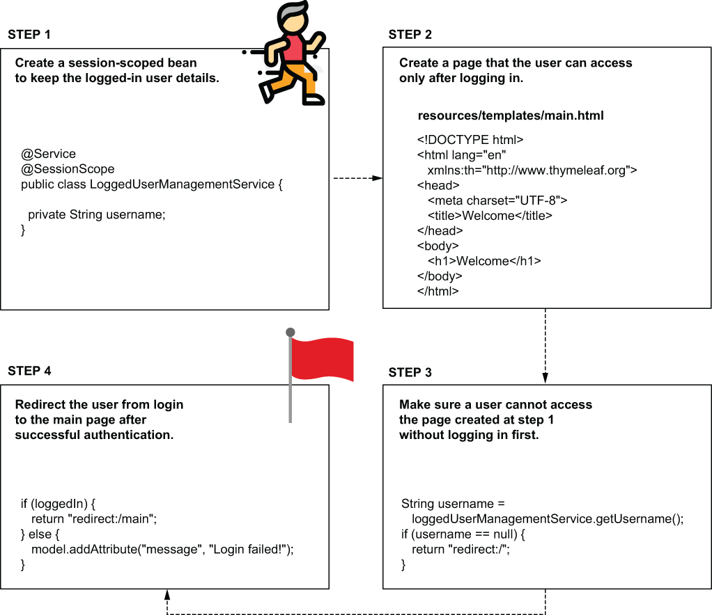

> **Hình 9.10** Chúng ta dùng một session bean để triển khai một phần của ứng dụng mà chỉ người dùng đã đăng nhập mới có thể truy cập. Khi người dùng xác thực, ứng dụng chuyển hướng họ đến một trang mà họ chỉ có thể truy cập sau khi đã xác thực. Nếu người dùng cố truy cập trang này trước khi xác thực, ứng dụng chuyển hướng họ đến form đăng nhập.

Tôi đã tách các thay đổi cho ví dụ này vào project "sq-ch9-ex2".

May mắn thay, tạo một bean có scope session trong Spring đơn giản như dùng annotation `@SessionScope` với class bean. Hãy tạo một class mới, `LoggedUserManagementService`, và đặt nó có scope session, như trình bày trong listing sau.

**Listing 9.5** Định nghĩa một bean có scope session để giữ chi tiết người dùng đã đăng nhập

```java
@Service                                                 ❶
@SessionScope                                            ❷
public class LoggedUserManagementService {
    private String username;

    // Omitted getters and setters
}
```

❶ Chúng ta thêm stereotype annotation `@Service` để chỉ thị Spring quản lý class này như một bean trong context.

❷ Chúng ta dùng annotation `@SessionScope` để đổi scope của bean thành session.

Mỗi khi người dùng đăng nhập thành công, chúng ta lưu tên của họ vào thuộc tính username của bean này. Chúng ta auto-wire bean `LoggedUserManagementService` vào class `LoginProcessor`, class chúng ta đã triển khai trong mục 9.1 để xử lý logic xác thực, như trình bày trong listing sau.

**Listing 9.6** Dùng bean LoggedUserManagementService trong logic đăng nhập

```java
@Component
@RequestScope
public class LoginProcessor {

    private final LoggedUserManagementService loggedUserManagementService;

    private String username;
    private String password;

    public LoginProcessor(                                               ❶
        LoggedUserManagementService loggedUserManagementService) {
        this.loggedUserManagementService = loggedUserManagementService;
    }

    public boolean login() {
        String username = this.getUsername();
        String password = this.getPassword();

        boolean loginResult = false;
        if ("natalie".equals(username) && "password".equals(password)) {
            loginResult = true;
            loggedUserManagementService.setUsername(username);           ❷
        }

        return loginResult;
    }
    // Omitted getters and setters
}
```

❶ Chúng ta auto-wire bean `LoggedUserManagementService`.

❷ Chúng ta lưu tên người dùng vào bean `LoggedUserManagementService`.

Hãy quan sát rằng bean `LoginProcessor` vẫn có scope request. Chúng ta vẫn dùng Spring để tạo instance này cho mỗi request đăng nhập. Chúng ta chỉ cần giá trị của các thuộc tính username và password trong suốt request để thực thi logic xác thực.

Vì bean `LoggedUserManagementService` có scope session, giá trị username giờ sẽ có thể truy cập trong suốt toàn bộ HTTP session. Bạn có thể dùng giá trị này để biết có ai đó đã đăng nhập không, và là ai. Bạn không phải lo về trường hợp nhiều người dùng đăng nhập; application framework đảm bảo liên kết mỗi HTTP request với đúng session. Hình 9.11 mô tả trực quan luồng đăng nhập.

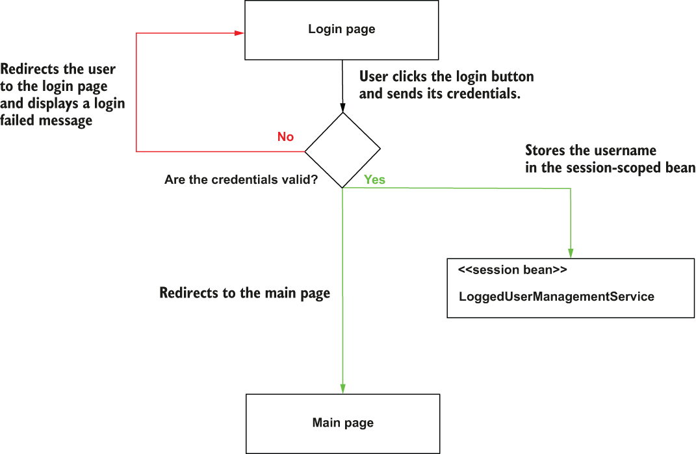

> **Hình 9.11** Luồng đăng nhập được triển khai trong ví dụ. Khi người dùng gửi thông tin đăng nhập, quá trình đăng nhập bắt đầu. Nếu thông tin đăng nhập của người dùng đúng, tên người dùng được lưu vào bean có scope session, và ứng dụng chuyển hướng người dùng đến trang chính. Nếu thông tin đăng nhập không hợp lệ, ứng dụng chuyển hướng người dùng về trang đăng nhập và hiển thị thông báo đăng nhập thất bại.

Giờ chúng ta tạo một trang mới và đảm bảo người dùng chỉ có thể truy cập nó nếu họ đã đăng nhập. Chúng ta định nghĩa một controller mới (gọi là `MainController`) cho trang mới. Chúng ta sẽ định nghĩa một action và ánh xạ nó vào đường dẫn /main. Để đảm bảo người dùng chỉ có thể truy cập đường dẫn này nếu đã đăng nhập, chúng ta kiểm tra xem bean `LoggedUserManagementService` có lưu username nào không. Nếu không, chúng ta chuyển hướng người dùng đến trang đăng nhập. Để chuyển hướng người dùng đến trang khác, action của controller cần trả về chuỗi "redirect:" theo sau là đường dẫn mà action muốn chuyển hướng người dùng đến. Hình 9.12 trình bày trực quan logic phía sau trang chính.

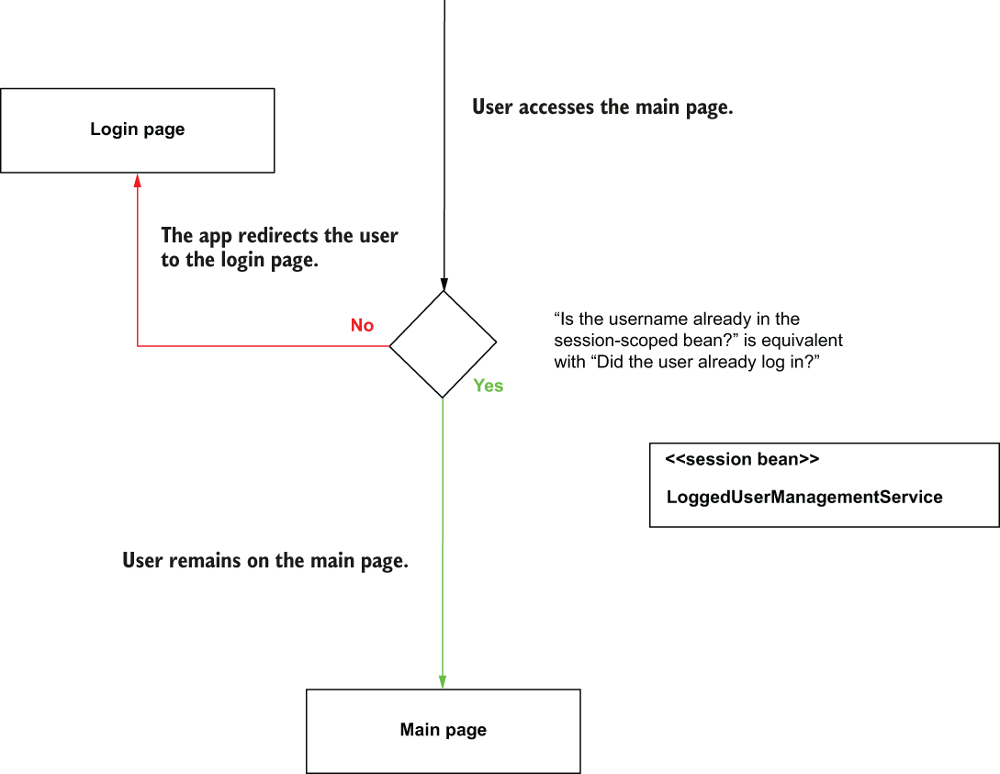

> **Hình 9.12** Ai đó chỉ có thể truy cập trang chính sau khi đã xác thực. Khi ứng dụng xác thực người dùng, nó lưu tên người dùng vào bean có scope session. Bằng cách này, ứng dụng biết người dùng đã đăng nhập. Khi ai đó truy cập trang chính, và tên người dùng không có trong bean có scope session (họ chưa xác thực), ứng dụng chuyển hướng họ đến trang đăng nhập.

Listing sau cho thấy class `MainController`.

**Listing 9.7** Class MainController

```java
@Controller
public class MainController {

     private final LoggedUserManagementService loggedUserManagementService;

     public MainController(                                         ❶
       LoggedUserManagementService loggedUserManagementService) {
       this.loggedUserManagementService = loggedUserManagementService;
     }
    @GetMapping("/main")
    public String home() {
        String username =                                                   ❷
          loggedUserManagementService.getUsername();

        if (username == null) {                                             ❸
          return "redirect:/";
        }

        return "main.html";                                                 ❹
    }
}
```

❶ Chúng ta auto-wire bean `LoggedUserManagementService` để biết người dùng đã đăng nhập chưa.

❷ Chúng ta lấy giá trị username, giá trị này phải khác `null` nếu có ai đó đã đăng nhập.

❸ Nếu người dùng chưa đăng nhập, chúng ta chuyển hướng người dùng đến trang đăng nhập.

❹ Nếu người dùng đã đăng nhập, chúng ta trả về view cho trang chính.

Bạn cần thêm main.html định nghĩa view vào thư mục "resources/templates" của project Spring Boot. Listing sau cho thấy nội dung của trang main.html.

**Listing 9.8** Nội dung của trang main.html

```html
<!DOCTYPE html>
<html lang="en" xmlns:th="http://www.thymeleaf.org">
<head>
    <meta charset="UTF-8">
    <title>Welcome</title>
</head>
<body>
    <h1>Welcome</h1>
</body>
</html>
```

Cho phép người dùng đăng xuất cũng dễ. Bạn chỉ cần đặt username trong session bean `LoggedUserManagementService` thành `null`. Hãy tạo một liên kết đăng xuất trên trang và cũng thêm tên người dùng đã đăng nhập vào thông báo chào mừng. Listing sau cho thấy các thay đổi trên trang main.html định nghĩa view của chúng ta.

**Listing 9.9** Thêm liên kết đăng xuất vào trang main.html

```html
<!DOCTYPE html>
<html lang="en" xmlns:th="http://www.thymeleaf.org">
<head>
    <meta charset="UTF-8">
    <title>Login</title>
</head>
<body>
    <h1>Welcome, <span th:text="${username}"></span></h1>                  ❶
    <a href="/main?logout">Log out</a>                                     ❷
</body>
</html>
```

❶ Chúng ta lấy username từ controller và hiển thị nó trên trang trong thông báo chào mừng.

❷ Chúng ta thêm một liên kết trên trang để đặt một HTTP request parameter tên là "logout". Khi controller nhận tham số này, nó sẽ xóa giá trị username khỏi session.

Các thay đổi trên trang main.html này cũng đòi hỏi một số thay đổi trong controller để chức năng hoàn chỉnh. Listing tiếp theo cho thấy cách nhận request parameter logout trong action của controller và gửi username đến view nơi nó được hiển thị trên trang.

**Listing 9.10** Đăng xuất người dùng dựa trên request parameter logout

```java
@Controller
public class MainController {

  // Omitted code

  @GetMapping("/main")
  public String home(
      @RequestParam(required = false) String logout,                           ❶
         Model model                                                           ❷
  ) {
    if (logout != null) {                                                      ❸
      loggedUserManagementService.setUsername(null);
    }

     String username = loggedUserManagementService.getUsername();

     if (username == null) {
       return "redirect:/";
     }
        model.addAttribute("username" , username);                       ❹
        return "main.html";
    }
}
```

❶ Chúng ta nhận request parameter logout nếu có.

❷ Chúng ta thêm một tham số `Model` để gửi username đến view.

❸ Nếu tham số logout có mặt, chúng ta xóa username khỏi bean `LoggedUserManagementService`.

❹ Chúng ta gửi username đến view.

Để hoàn thiện ứng dụng, chúng ta muốn thay đổi `LoginController` để chuyển hướng người dùng đến trang chính sau khi họ xác thực. Để đạt được kết quả này, chúng ta cần thay đổi action của `LoginController`, như trình bày trong listing sau.

**Listing 9.11** Chuyển hướng người dùng đến trang chính sau khi đăng nhập

```java
@Controller
public class LoginController {

    // Omitted code

    @PostMapping("/")
    public String loginPost(
        @RequestParam String username,
        @RequestParam String password,
        Model model
    ) {
      loginProcessor.setUsername(username);
      loginProcessor.setPassword(password);
      boolean loggedIn = loginProcessor.login();

        if (loggedIn) {                          ❶
          return "redirect:/main";
        }

        model.addAttribute("message", "Login failed!");
        return "login.html";
    }
}
```

❶ Khi người dùng xác thực thành công, ứng dụng chuyển hướng họ đến trang chính.

Giờ bạn có thể khởi động ứng dụng và kiểm tra đăng nhập. Khi bạn cung cấp đúng thông tin đăng nhập, ứng dụng chuyển hướng bạn đến trang chính (hình 9.13). Nhấp vào liên kết Logout, và ứng dụng chuyển hướng bạn về trang đăng nhập. Nếu bạn cố truy cập trang chính mà không xác thực, ứng dụng chuyển hướng bạn đến đăng nhập.

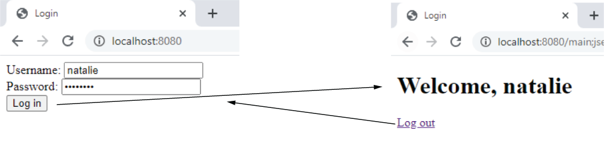

> **Hình 9.13** Luồng giữa hai trang. Khi người dùng đăng nhập, ứng dụng chuyển hướng họ đến trang chính. Người dùng có thể nhấp vào liên kết đăng xuất, và ứng dụng chuyển hướng họ về form đăng nhập.

## 9.3 Sử dụng application scope trong ứng dụng web Spring

Trong mục này, chúng ta bàn về application scope. Tôi muốn đề cập đến sự tồn tại của nó, cho bạn biết cách nó hoạt động, và nhấn mạnh rằng tốt hơn là không dùng nó trong ứng dụng production. Tất cả các request của client đều chia sẻ một bean có scope application (hình 9.14).

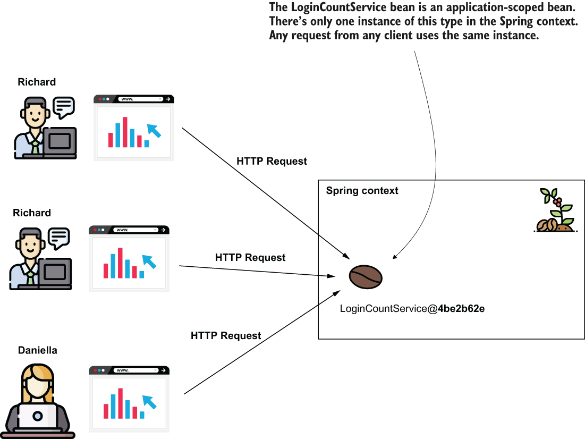

> **Hình 9.14** Hiểu application scope trong ứng dụng web Spring. Instance của bean có scope application được chia sẻ bởi tất cả các HTTP request từ tất cả client. Spring context chỉ cung cấp một instance của kiểu bean, được dùng bởi bất kỳ ai cần nó.

Application scope gần với cách singleton hoạt động. Khác biệt là bạn không thể có nhiều instance cùng kiểu trong context, và chúng ta luôn dùng HTTP request làm điểm tham chiếu khi bàn về vòng đời của các web scope (bao gồm cả application scope). Chúng ta gặp cùng các vấn đề xử lý đồng thời đã bàn ở chương 5 với singleton bean đối với bean có scope application: tốt hơn là có các thuộc tính bất biến cho singleton bean. Lời khuyên tương tự áp dụng cho bean có scope application. Nhưng nếu bạn làm các thuộc tính bất biến, thì bạn có thể dùng trực tiếp singleton bean thay thế.

Nhìn chung, tôi khuyên các lập trình viên tránh dùng bean có scope application. Tốt hơn là dùng trực tiếp một tầng lưu trữ, như database (bạn sẽ học ở chương 11).

Luôn tốt nhất là xem một ví dụ để hiểu trường hợp này. Hãy thay đổi ứng dụng chúng ta đã làm trong chương này và thêm tính năng đếm số lần thử đăng nhập. Bạn sẽ tìm thấy ví dụ này trong project "sq-ch9-ex3".

Vì chúng ta phải đếm số lần thử đăng nhập từ tất cả người dùng, chúng ta sẽ lưu số đếm trong một bean có scope application. Hãy tạo một bean có scope application `LoginCountService` lưu số đếm trong một thuộc tính. Listing sau cho thấy định nghĩa của class này.

**Listing 9.12** Class LoginCountService đếm số lần thử đăng nhập

```java
@Service
@ApplicationScope                          ❶
public class LoginCountService {

    private int count;

    public void increment() {
      count++;
    }

    public int getCount() {
        return count;
    }
}
```

❶ Annotation `@ApplicationScope` đổi scope của bean này thành application scope.

`LoginProcessor` sau đó có thể auto-wire bean này và gọi method `increment()` cho mỗi lần thử đăng nhập mới, như trình bày trong listing sau.

**Listing 9.13** Tăng số đếm đăng nhập cho mỗi request đăng nhập

```java
@Component
@RequestScope
public class LoginProcessor {

    private final LoggedUserManagementService loggedUserManagementService;
    private final LoginCountService loginCountService;

    private String username;
    private String password;

    public LoginProcessor(                                            ❶
        LoggedUserManagementService loggedUserManagementService,
        LoginCountService loginCountService) {
        this.loggedUserManagementService = loggedUserManagementService;
        this.loginCountService = loginCountService;
    }

    public boolean login() {
      loginCountService.increment();                                  ❷

        String username = this.getUsername();
        String password = this.getPassword();
        boolean loginResult = false;
        if ("natalie".equals(username) && "password".equals(password)) {
          loginResult = true;
            loggedUserManagementService.setUsername(username);
        }

        return loginResult;
    }

    // Omitted code
}
```

❶ Chúng ta inject bean `LoginCountService` qua các tham số của constructor.

❷ Chúng ta tăng số đếm cho mỗi lần thử đăng nhập.

Điều cuối cùng bạn cần làm là hiển thị giá trị này. Như bạn đã học trong các ví dụ chúng ta đã làm, bắt đầu từ chương 7, bạn có thể dùng tham số `Model` trong action của controller để gửi giá trị đếm đến view. Sau đó bạn có thể dùng Thymeleaf để hiển thị giá trị trong view. Listing sau cho bạn thấy cách gửi giá trị từ controller đến view.

**Listing 9.14** Gửi giá trị đếm từ controller để hiển thị trên trang chính

```java
@Controller
public class MainController {

    // Omitted code

    @GetMapping("/main")
    public String home(
        @RequestParam(required = false) String logout,
        Model model
    ) {
        if (logout != null) {
          loggedUserManagementService.setUsername(null);
        }

        String username = loggedUserManagementService.getUsername();
        int count = loginCountService.getCount();                ❶

        if (username == null) {
          return "redirect:/";
         }

         model.addAttribute("username" , username);
         model.addAttribute("loginCount", count);               ❷

         return "main.html";
     }
}
```

❶ Lấy số đếm từ bean có scope application

❷ Gửi giá trị đếm đến view

Listing sau cho bạn thấy cách hiển thị giá trị đếm trên trang.

**Listing 9.15** Hiển thị giá trị đếm trên trang chính

```html
<!DOCTYPE html>
<html lang="en" xmlns:th="http://www.thymeleaf.org">
<head>
    <meta charset="UTF-8">
    <title>Login</title>
</head>
<body>
    <h1>Welcome, <span th:text="${username}"></span>!</h1>
    <h2>
           Your login number is
           <span th:text="${loginCount}"></span>            ❶
         </h2>
         <a href="/main?logout">Log out</a>
</body>
</html>
```

❶ Hiển thị số đếm trên trang

Khi bạn chạy ứng dụng, bạn thấy tổng số lần thử đăng nhập trên trang chính, như trình bày trong hình 9.15.

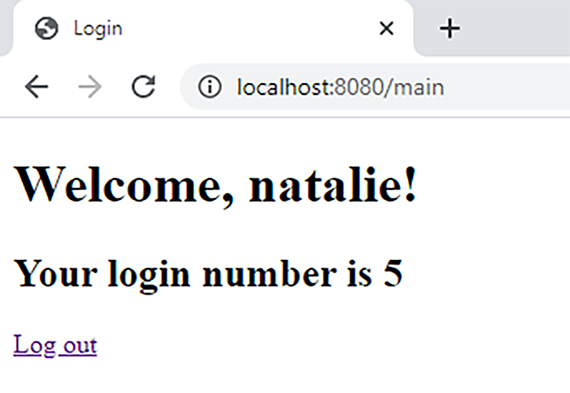

> **Hình 9.15** Kết quả của ứng dụng là một trang web hiển thị tổng số lần đăng nhập của tất cả người dùng. Trang chính này hiển thị tổng số lần thử đăng nhập.

## Tóm tắt

- Ngoài các bean scope singleton và prototype (đã bàn trong các chương 2 đến 5), bạn có thể hưởng lợi từ việc dùng thêm ba bean scope nữa trong ứng dụng web Spring. Các scope này chỉ có ý nghĩa trong ứng dụng web, và đó là lý do chúng ta gọi chúng là web scope:
  - Request scope: Spring tạo một instance của bean cho mỗi HTTP request.
  - Session scope: Spring tạo một instance của bean cho mỗi HTTP session của client. Nhiều request từ cùng client có thể chia sẻ cùng instance.
  - Application scope: Chỉ có một instance cho toàn bộ ứng dụng đối với bean cụ thể đó. Mọi request từ bất kỳ client nào đều có thể truy cập instance này.
- Spring đảm bảo instance của bean có scope request chỉ có thể được truy cập bởi một HTTP request. Vì lý do này, bạn có thể dùng các thuộc tính của instance mà không lo về các vấn đề liên quan đến xử lý đồng thời. Ngoài ra, bạn không cần lo chúng có thể làm đầy bộ nhớ của ứng dụng. Vì tồn tại ngắn, các instance có thể được thu gom rác khi HTTP request kết thúc.
- Spring tạo instance của bean có scope request cho mỗi HTTP request. Điều này khá thường xuyên. Bạn tốt nhất không nên làm việc tạo instance trở nên khó khăn bằng cách triển khai logic trong constructor hoặc method `@PostConstruct`.
- Spring liên kết instance của bean có scope session với HTTP session của client. Bằng cách này, instance của bean có scope session có thể được dùng để chia sẻ dữ liệu giữa nhiều HTTP request từ cùng client.
- Ngay cả từ cùng client, client có thể gửi các HTTP request đồng thời. Nếu các request này thay đổi dữ liệu trong instance có scope session, chúng có thể rơi vào các kịch bản race condition. Bạn cần cân nhắc các tình huống như vậy và hoặc tránh chúng hoặc đồng bộ hóa code để hỗ trợ xử lý đồng thời.
- Tôi khuyên tránh dùng instance của bean có scope application. Với instance của bean có scope application được chia sẻ bởi tất cả các request của ứng dụng web, bất kỳ thao tác ghi nào thường cần đồng bộ hóa, tạo ra điểm nghẽn và ảnh hưởng nghiêm trọng đến hiệu năng của ứng dụng. Hơn nữa, các bean này tồn tại trong bộ nhớ ứng dụng chừng nào ứng dụng còn chạy, nên chúng không thể được thu gom rác. Cách tốt hơn là lưu trực tiếp dữ liệu vào database, như bạn sẽ học ở chương 11.
- Cả bean có scope session và application đều ngụ ý làm các request kém độc lập hơn. Chúng ta nói ứng dụng quản lý trạng thái mà các request cần (hoặc ứng dụng là stateful). Một ứng dụng stateful ngụ ý các vấn đề kiến trúc khác nhau mà tốt nhất nên tránh. Dĩ nhiên, mô tả các vấn đề này vượt ngoài mục đích của cuốn sách, nhưng cũng tốt khi cho bạn biết rằng tốt hơn là cân nhắc một lựa chọn thay thế.
