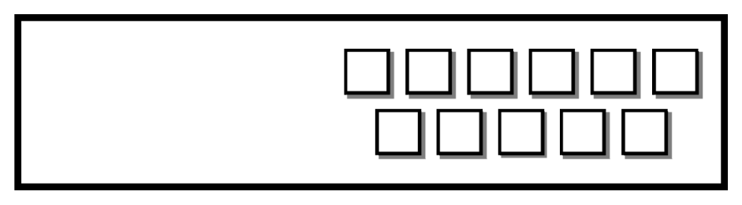
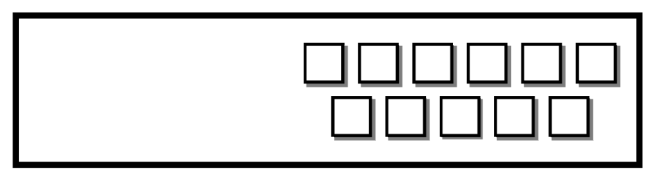
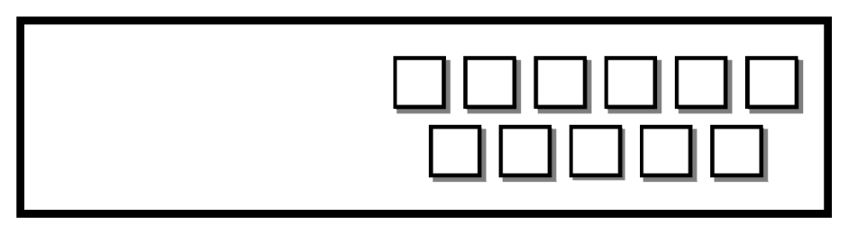

# Chương 3. Ngôn ngữ lập trình C (The C Programming Language)

> Bản dịch tiếng Việt từ *System Programming Coursebook* (University of Illinois, CS 241) — B. Venkatesh, L. Angrave et al. Tài liệu gốc được phát hành theo giấy phép [CC BY 4.0](https://creativecommons.org/licenses/by/4.0/); bản dịch giữ nguyên giấy phép này. Nguồn: https://github.com/illinois-cs241/coursebook

> Nếu bạn muốn dạy về hệ thống, đừng gom lập trình viên lại, phân loại issue rồi tạo PR. Thay vào đó, hãy dạy họ khao khát biển C mênh mông và bất tận.
>
> — Antoine de Saint-Exupéry (có chỉnh sửa)

Lưu ý: Chương này dài và đi vào rất nhiều chi tiết. Bạn cứ thoải mái lướt qua những phần mà mình đã có kinh nghiệm.

C là ngôn ngữ lập trình mặc định trên thực tế (de-facto) để làm lập trình hệ thống một cách nghiêm túc. Tại sao? Hầu hết các kernel (nhân hệ điều hành) đều cho phép truy cập API của mình thông qua C. Kernel Linux [7] và kernel XNU [4] — nền tảng của macOS — đều được viết bằng C và có API (Application Programming Interface — giao diện lập trình ứng dụng) bằng C. Kernel Windows dùng C++, nhưng làm lập trình hệ thống trên Windows khó hơn nhiều đối với người mới học lập trình hệ thống. C không có các lớp trừu tượng như class hay RAII (Resource Acquisition Is Initialization) để dọn dẹp bộ nhớ. C cũng cho bạn nhiều cơ hội hơn để "tự bắn vào chân mình", nhưng đổi lại nó cho phép bạn làm mọi thứ ở mức chi tiết hơn rất nhiều.

## 3.1 Lịch sử của C (History of C)

C được Dennis Ritchie và Ken Thompson phát triển tại Bell Labs vào năm 1973 [8]. Hồi đó, chúng ta đã có những viên ngọc trong làng ngôn ngữ lập trình như Fortran, ALGOL và LISP. Mục tiêu của C gồm hai phần. Thứ nhất, nó được tạo ra để nhắm đến những máy tính phổ biến nhất thời bấy giờ, chẳng hạn như PDP-7. Thứ hai, nó cố gắng loại bỏ một số cấu trúc mức thấp (quản lý register (thanh ghi), và viết assembly cho các lệnh nhảy), đồng thời tạo ra một ngôn ngữ đủ sức biểu đạt chương trình theo lối thủ tục (procedural — trái với lối toán học như LISP) bằng mã nguồn dễ đọc. Tất cả những điều đó mà vẫn giữ được khả năng giao tiếp với hệ điều hành. Nghe có vẻ là một kỳ công khó khăn. Ban đầu, nó chỉ được dùng nội bộ tại Bell Labs cùng với hệ điều hành UNIX.

Lần chuẩn hóa "thực sự" đầu tiên là với cuốn sách của Brian Kernighan và Dennis Ritchie [6]. Cho đến ngày nay nó vẫn được xem rộng rãi là tập hợp chỉ dẫn C khả chuyển (portable) duy nhất. Cuốn K&R được biết đến như chuẩn mực trên thực tế để học C. Đã có nhiều chuẩn C khác nhau, từ ANSI đến ISO, dù ISO về cơ bản đã thắng thế với tư cách đặc tả ngôn ngữ. Chúng ta sẽ tập trung chủ yếu vào thư viện C của POSIX, vốn mở rộng ISO. Bây giờ, để nói thẳng vấn đề mà ai cũng thấy: kernel Linux không tuân thủ POSIX. Chủ yếu là vì các nhà phát triển Linux không muốn trả phí để được chứng nhận tuân thủ. Cũng là vì họ không muốn tuân thủ đầy đủ vô số chuẩn khác nhau, bởi điều đó đồng nghĩa với chi phí phát triển tăng lên để duy trì sự tuân thủ.

Chúng ta sẽ hướng đến việc dùng C99, vì đó là chuẩn mà hầu hết máy tính đều nhận ra, nhưng đôi khi cũng dùng một vài tính năng mới hơn của C11. Chúng ta cũng sẽ nói về một số tính năng "ngoài lề" như `getline`, vì chúng được dùng rất rộng rãi với thư viện GNU C. Chúng ta sẽ bắt đầu bằng một cái nhìn tổng quan khá toàn diện về ngôn ngữ cùng các phương tiện của nó. Bạn cứ thoải mái lướt qua nếu đã từng làm việc với một ngôn ngữ dựa trên C.

### 3.1.1 Đặc điểm (Features)

- **Tốc độ.** Có rất ít thứ ngăn cách giữa chương trình và hệ thống.

- **Đơn giản.** C và thư viện chuẩn của nó tạo thành một tập hợp đơn giản các hàm khả chuyển.

- **Quản lý bộ nhớ thủ công.** C cho chương trình khả năng tự quản lý bộ nhớ của mình. Tuy nhiên, đây có thể là một nhược điểm nếu chương trình có lỗi về bộ nhớ.

- **Phổ biến khắp nơi.** Thông qua các giao diện gọi hàm ngoại (foreign function interface — FFI) và các kiểu binding ngôn ngữ khác nhau, hầu hết các ngôn ngữ khác đều có thể gọi hàm C và ngược lại. Thư viện chuẩn cũng có mặt ở mọi nơi. C đã vượt qua thử thách của thời gian với tư cách một ngôn ngữ phổ biến, và có vẻ nó sẽ chẳng đi đâu cả.

## 3.2 Khóa học cấp tốc nhập môn C (Crash course introduction to C)

Cách kinh điển để bắt đầu học C là bắt đầu với chương trình "hello world". Ví dụ nguyên bản mà Kernighan và Ritchie đề xuất từ ngày xưa vẫn không hề thay đổi.

```c
#include <stdio.h>
int main(void) {
  printf("Hello World\n");
  return 0;
}
```

1. Chỉ thị `#include` lấy file `stdio.h` (viết tắt của standard input and output — nhập và xuất chuẩn) nằm ở đâu đó trong hệ điều hành của bạn, sao chép nội dung văn bản của nó và thay thế vào chỗ có `#include`.

2. `int main(void)` là một khai báo hàm. Từ đầu tiên `int` cho trình biên dịch (compiler) biết kiểu trả về của hàm. Phần đứng trước dấu ngoặc đơn (`main`) là tên hàm. Trong C, không thể có hai hàm trùng tên trong cùng một chương trình được biên dịch, mặc dù các thư viện chia sẻ có thể làm được. Sau đó là danh sách tham số. Khi chúng ta cung cấp danh sách tham số cho hàm thông thường là `(void)`, điều đó có nghĩa là trình biên dịch phải báo lỗi nếu hàm được gọi với số đối số khác không. Với hàm thông thường, khai báo kiểu `void func()` có nghĩa là hàm có thể được gọi như `func(1, 2, 3)`, vì không có gì giới hạn cả. `main` là một hàm đặc biệt. Có nhiều cách khai báo `main` nhưng các dạng chuẩn là `int main(void)`, `int main()` và `int main(int argc, char *argv[])`.

3. `printf("Hello World");` là một lời gọi hàm. `printf` được định nghĩa như một phần của `stdio.h`. Hàm này đã được biên dịch và nằm ở một nơi khác trên máy của chúng ta — vị trí của thư viện chuẩn C. Chỉ cần nhớ include header và gọi hàm với các tham số phù hợp (một string literal — hằng chuỗi — `"Hello World"`). Nếu không có ký tự xuống dòng, buffer (bộ đệm) sẽ không được xả (flush) — tức là thao tác ghi sẽ không hoàn tất ngay lập tức.

4. `return 0`. `main` phải trả về một số nguyên. Theo quy ước, `return 0` nghĩa là thành công và bất cứ giá trị nào khác nghĩa là thất bại. Đây là một số mã thoát (exit code / status) có ý nghĩa đặc biệt: http://tldp.org/LDP/abs/html/exitcodes.html. Nói chung, hãy xem 0 là thành công.

```bash
$ gcc main.c -o main
$ ./main
Hello World
$
```

1. `gcc` là viết tắt của GNU Compiler Collection, bộ sưu tập có sẵn rất nhiều trình biên dịch để dùng. Trình biên dịch suy ra từ phần mở rộng rằng bạn đang muốn biên dịch một file `.c`.

2. `./main` bảo shell của bạn thực thi chương trình tên `main` trong thư mục hiện tại. Chương trình sau đó in ra "hello world".

Nếu lập trình hệ thống mà dễ như viết hello world thì công việc của chúng ta đã nhàn hơn nhiều.

### 3.2.1 Bộ tiền xử lý (Preprocessor)

Bộ tiền xử lý (preprocessor) là gì? Tiền xử lý là một thao tác sao chép–dán mà trình biên dịch thực hiện trước khi thực sự biên dịch chương trình. Sau đây là một ví dụ về phép thay thế

```c
// Before preprocessing
#define MAX_LENGTH 10
char buffer[MAX_LENGTH]

// After preprocessing
char buffer[10]
```

Tuy nhiên, bộ tiền xử lý cũng có những tác dụng phụ. Một vấn đề là bộ tiền xử lý cần có khả năng tách token đúng cách, nghĩa là việc cố định nghĩa lại các thành phần nội tại của ngôn ngữ C bằng bộ tiền xử lý có thể là bất khả thi. Một vấn đề khác là các macro không thể lồng nhau vô hạn — có một độ sâu giới hạn mà tại đó chúng phải dừng lại. Macro cũng chỉ là phép thay thế văn bản đơn thuần, không mang ngữ nghĩa. Ví dụ, hãy xem điều gì có thể xảy ra nếu một macro cố thực hiện phép sửa đổi inline.

```c
#define min(a,b) a < b ? a : b
int main() {
  int x = 4;
  if(min(x++, 5)) printf("%d is six", x);
  return 0;
}
```

Macro chỉ là phép thay thế văn bản đơn thuần, nên ví dụ trên được khai triển thành

```c
x++ < 100 ? x++ : 100
```

Trong trường hợp này, kết quả in ra không hiển nhiên, nhưng nó sẽ là 6. Bạn thử tìm hiểu xem tại sao? Ngoài ra, hãy xét trường hợp biên khi độ ưu tiên của toán tử tham gia vào cuộc chơi.

```c
int x = 99;
int r = 10 + min(99, 100); // r is 100!
// This is what it is expanded to
int r = 10 + 99 < 100 ? 99 : 100
// Which means
int r = (10 + 99) < 100 ? 99 : 100
```

Cũng có những vấn đề về logic liên quan đến tính linh hoạt của một số tham số. Một nguồn gây nhầm lẫn phổ biến là với mảng tĩnh và toán tử `sizeof`.

```c
#define ARRAY_LENGTH(A) (sizeof((A)) / sizeof((A)[0]))
int static_array[10]; // ARRAY_LENGTH(static_array) = 10
int* dynamic_array = malloc(10); // ARRAY_LENGTH(dynamic_array) = 2 or 1 consistently
```

Macro này sai ở đâu? Ồ, nó hoạt động đúng nếu truyền vào một mảng tĩnh, vì `sizeof` của một mảng tĩnh trả về số byte mà mảng đó chiếm, và chia nó cho `sizeof(an_element)` sẽ cho ra số phần tử. Nhưng nếu truyền vào một pointer (con trỏ) tới một vùng nhớ, lấy `sizeof` của con trỏ rồi chia cho kích thước phần tử đầu tiên sẽ không phải lúc nào cũng cho ta kích thước của mảng.

## 3.3 Các phương tiện của ngôn ngữ (Language Facilities)

### 3.3.1 Từ khóa (Keywords)

C có một loạt từ khóa. Sau đây là một số cấu trúc mà bạn nên nắm sơ qua, tính đến C99.

1. `break` là từ khóa được dùng trong câu lệnh `case` hoặc các câu lệnh lặp. Khi dùng trong câu lệnh `case`, chương trình nhảy đến cuối khối.

   ```c
   switch(1) {
     case 1: /* Goes to this switch */
       puts("1");
       break; /* Jumps to the end of the block */
     case 2: /* Ignores this program */
       puts("2");
       break;
   } /* Continues here */
   ```

   Trong ngữ cảnh vòng lặp, dùng `break` sẽ thoát khỏi vòng lặp trong cùng. Vòng lặp có thể là cấu trúc `for`, `while` hoặc `do-while`

   ```c
   while(1) {
     while(2) {
       break; /* Breaks out of while(2) */
     } /* Jumps here */
     break; /* Breaks out of while(1) */
   } /* Continues here */
   ```

2. `const` là một cấu trúc ở cấp độ ngôn ngữ, cho trình biên dịch biết rằng dữ liệu này phải giữ nguyên không đổi. Nếu ai đó cố thay đổi một biến `const`, chương trình sẽ không biên dịch được. `const` hoạt động hơi khác một chút khi đặt trước kiểu: trình biên dịch sắp xếp lại kiểu đầu tiên và `const`. Sau đó trình biên dịch dùng quy tắc kết hợp trái, nghĩa là bất cứ thứ gì nằm bên trái dấu con trỏ là hằng. Điều này được gọi là const-correctness.

   ```c
   const int i = 0; // Same as "int const i = 0"
   char *str = ...; // Mutable pointer to a mutable string
   const char *const_str = ...; // Mutable pointer to a constant string
   char const *const_str2 = ...; // Same as above
   const char *const const_ptr_str = ...;
   // Constant pointer to a constant string
   ```

   Nhưng điều quan trọng cần biết là đây chỉ là một ràng buộc do trình biên dịch áp đặt. Có những cách để lách qua nó, và chương trình vẫn chạy tốt với hành vi được xác định. Trong lập trình hệ thống, loại bộ nhớ duy nhất bạn không thể ghi vào là bộ nhớ được hệ thống bảo vệ chống ghi.

   ```c
   const int i = 0; // Same as "int const i = 0"
   (*((int *)&i)) = 1; // i == 1 now
   const char *ptr = "hi";
   *ptr = '\0'; // Will cause a Segmentation Violation
   ```

3. `continue` là câu lệnh điều khiển luồng chỉ tồn tại trong các cấu trúc lặp. `continue` sẽ bỏ qua phần còn lại của thân vòng lặp và đặt bộ đếm chương trình (program counter) quay lại điểm bắt đầu của vòng lặp.

   ```c
   int i = 10;
   while(i--) {
     if(1) continue; /* This gets triggered */
     *((int *)NULL) = 0;
   } /* Then reaches the end of the while loop */
   ```

4. `do {} while();` là một cấu trúc lặp khác. Các vòng lặp này thực thi thân vòng lặp trước rồi mới kiểm tra điều kiện ở cuối vòng lặp. Nếu điều kiện bằng không, câu lệnh tiếp theo được thực thi — bộ đếm chương trình được đặt tới lệnh đầu tiên sau vòng lặp. Ngược lại, thân vòng lặp được thực thi.

   ```c
   int i = 1;
   do {
     printf("%d\n", i--);
   } while (i > 10) /* Only executed once */
   ```

5. `enum` dùng để khai báo một kiểu liệt kê (enumeration). Kiểu liệt kê là một kiểu có thể nhận nhiều giá trị, nhưng hữu hạn. Nếu bạn có một `enum` mà không chỉ định giá trị số nào, trình biên dịch C sẽ sinh ra một số duy nhất cho mỗi phần tử (trong phạm vi `enum` hiện tại) và dùng số đó để so sánh. Cú pháp khai báo một thể hiện của `enum` là `enum <type> varname`. Lợi ích kèm theo là trình biên dịch có thể kiểm tra kiểu của các biểu thức này để đảm bảo bạn chỉ so sánh những kiểu giống nhau.

   ```c
   enum day{ monday, tuesday, wednesday,
     thursday, friday, saturday, sunday};

   void process_day(enum day foo) {
     switch(foo) {
       case monday:
         printf("Go home!\n"); break;
       // ...
     }
   }
   ```

   Hoàn toàn có thể gán các giá trị `enum` khác nhau hoặc trùng nhau. Nếu bạn tự gán số, thì không nên trông cậy vào trình biên dịch để có cách đánh số nhất quán. Nếu bạn định dùng lớp trừu tượng này, hãy cố gắng đừng phá vỡ nó.

   ```c
   enum day{
     monday = 0,
     tuesday = 0,
     wednesday = 0,
     thursday = 1,
     friday = 10,
     saturday = 10,
     sunday = 0};

   void process_day(enum day foo) {
     switch(foo) {
       case monday:
         printf("Go home!\n"); break;
       // ...
     }
   }
   ```

6. `extern` là từ khóa đặc biệt cho trình biên dịch biết rằng biến này có thể được định nghĩa trong một object file khác hoặc trong một thư viện, nhờ đó chương trình vẫn biên dịch được dù thiếu biến, vì chương trình sẽ tham chiếu tới một biến trong hệ thống hoặc trong một file khác.

   ```c
   // file1.c
   extern int panic;

   void foo() {
     if (panic) {
       printf("NONONONONO");
     } else {
       printf("This is fine");
     }
   }

   //file2.c

   int panic = 1;
   ```

7. `for` là từ khóa cho phép bạn lặp với một điều kiện khởi tạo, một bất biến vòng lặp (loop invariant) và một điều kiện cập nhật. Nó được thiết kế để tương đương với vòng lặp `while`, nhưng với cú pháp khác.

   ```c
   for (initialization; check; update) {
     //...
   }

   // Typically
   int i;
   for (i = 0; i < 10; i++) {
     //...
   }
   ```

   Theo chuẩn C89, không thể khai báo biến bên trong khối khởi tạo của vòng lặp `for`. Lý do là trong chuẩn đã có bất đồng về cách áp dụng quy tắc phạm vi (scope) cho biến được định nghĩa trong vòng lặp. Điều này đã được giải quyết trong các chuẩn mới hơn, nên ngày nay mọi người có thể dùng vòng lặp `for` quen thuộc mà họ yêu thích

   ```c
   for(int i = 0; i < 10; ++i) {
   ```

   Thứ tự đánh giá của vòng lặp `for` như sau

   (a) Thực hiện câu lệnh khởi tạo.

   (b) Kiểm tra bất biến. Nếu sai, kết thúc vòng lặp và thực thi câu lệnh kế tiếp. Nếu đúng, đi tiếp vào thân vòng lặp.

   (c) Thực hiện thân vòng lặp.

   (d) Thực hiện câu lệnh cập nhật.

   (e) Nhảy về bước kiểm tra bất biến.

8. `goto` là từ khóa cho phép bạn thực hiện các bước nhảy có điều kiện. Đừng dùng `goto` trong chương trình của bạn. Lý do là nó làm mã của bạn khó hiểu hơn gấp vô số lần khi bị xâu chuỗi thành nhiều mắt xích — thứ được gọi là "mã spaghetti". Tuy nhiên, trong một số ngữ cảnh thì dùng nó là chấp nhận được, ví dụ mã kiểm tra lỗi trong kernel Linux. Từ khóa này thường được dùng trong ngữ cảnh kernel, khi việc thêm một stack frame nữa chỉ để dọn dẹp không phải là ý hay. Ví dụ kinh điển về dọn dẹp trong kernel như sau.

   ```c
   void setup(void) {
   Doe *deer;
   Ray *drop;
   Mi *myself;

   if (!setupdoe(deer)) {
     goto finish;
   }

   if (!setupray(drop)) {
     goto cleanupdoe;
   }

   if (!setupmi(myself)) {
     goto cleanupray;
   }

   perform_action(deer, drop, myself);

   cleanupray:
   cleanup(drop);
   cleanupdoe:
   cleanup(deer);
   finish:
   return;
   }
   ```

9. `if` `else` `else-if` là các từ khóa điều khiển luồng. Có vài cách dùng chúng: (1) một `if` trần, (2) một `if` với `else`, (3) một `if` với `else-if`, (4) một `if` với `else if` và `else`. Lưu ý rằng một `else` được ghép với `if` gần nhất. Một lỗi tinh vi liên quan đến việc ghép sai cặp `if` và `else` là vấn đề "dangling else" (else lơ lửng). Các câu lệnh luôn được thực thi từ `if` tới `else`. Nếu bất kỳ điều kiện trung gian nào đúng, khối `if` thực hiện hành động tương ứng rồi đi đến cuối khối đó.

   ```c
   // (1)

   if (connect(...))
     return -1;

   // (2)
   if (connect(...)) {
     exit(-1);
   } else {
     printf("Connected!");
   }

   // (3)
   if (connect(...)) {
     exit(-1);
   } else if (bind(..)) {
     exit(-2);
   }

   // (1)
   if (connect(...)) {
     exit(-1);
   } else if (bind(..)) {
     exit(-2);
   } else {
     printf("Successfully bound!");
   }
   ```

10. `inline` là từ khóa dành cho trình biên dịch, cho biết rằng có thể bỏ qua thủ tục gọi hàm của C và "dán" mã vào nơi gọi. Thay vì gọi hàm, trình biên dịch được gợi ý thay thế trực tiếp thân hàm vào hàm gọi. Không phải lúc nào cũng nên chỉ định điều này một cách tường minh, vì trình biên dịch thường đủ thông minh để biết khi nào nên inline một hàm cho bạn.

    ```c
    inline int max(int a, int b) {
      return a < b ? a : b;
    }

    int main() {
      printf("Max %d", max(a, b));
      // printf("Max %d", a < b ? a : b);
    }
    ```

11. `restrict` là từ khóa cho trình biên dịch biết rằng vùng nhớ cụ thể này không được chồng lấn với mọi vùng nhớ khác. Mục đích của nó là báo cho người dùng chương trình biết rằng nếu các vùng nhớ chồng lấn thì đó là undefined behavior (hành vi không xác định). Lưu ý rằng `memcpy` có hành vi không xác định khi các vùng nhớ chồng lấn. Nếu trong chương trình của bạn có khả năng xảy ra điều đó, hãy cân nhắc dùng `memmove`.

    ```c
    memcpy(void * restrict dest, const void* restrict src, size_t bytes);

    void add_array(int *a, int * restrict c) {
      *a += *c;
    }
    int *a = malloc(3*sizeof(*a));
    *a = 1; *a = 2; *a = 3;
    add_array(a + 1, a) // Well defined
    add_array(a, a) // Undefined
    ```

12. `return` là toán tử điều khiển luồng dùng để thoát khỏi hàm hiện tại. Nếu hàm là `void` thì nó chỉ đơn giản thoát khỏi hàm. Ngược lại, theo sau nó là một tham số nữa đóng vai trò giá trị trả về.

    ```c
    void process() {
      if (connect(...)) {
        return -1;
      } else if (bind(...)) {
        return -2
      }
      return 0;
    }
    ```

13. `signed` là một từ bổ nghĩa (modifier) hiếm khi được dùng, nhưng nó buộc một kiểu phải có dấu thay vì không dấu. Lý do nó hiếm khi được dùng là vì các kiểu mặc định đã có dấu và cần từ bổ nghĩa `unsigned` để trở thành không dấu; nhưng nó có thể hữu ích trong trường hợp bạn muốn trình biên dịch mặc định chọn kiểu có dấu, như dưới đây.

    ```c
    int count_bits_and_sign(signed representation) {
      //...
    }
    ```

14. `sizeof` là toán tử được đánh giá tại thời điểm biên dịch, cho ra số byte mà biểu thức chiếm. Khi trình biên dịch suy ra kiểu, đoạn mã sau đây được biến đổi như sau.

    ```c
    char a = 0;
    printf("%zu", sizeof(a++));
    ```

    ```c
    char a = 0;
    printf("%zu", 1);
    ```

    Sau đó trình biên dịch được phép xử lý tiếp. Trình biên dịch phải có định nghĩa đầy đủ của kiểu tại thời điểm biên dịch — không phải thời điểm liên kết (link time) — nếu không bạn có thể gặp một lỗi kỳ lạ. Hãy xét ví dụ sau

    ```c
    // file.c
    struct person;

    printf("%zu", sizeof(person));

    // file2.c

    struct person {
      // Declarations
    }
    ```

    Đoạn mã này sẽ không biên dịch được vì `sizeof` không thể biên dịch `file.c` nếu không biết khai báo đầy đủ của struct `person`. Đó thường là lý do các lập trình viên hoặc đặt khai báo đầy đủ trong file header, hoặc trừu tượng hóa việc tạo và tương tác để người dùng không thể truy cập vào phần bên trong struct của chúng ta. Ngoài ra, nếu trình biên dịch biết độ dài đầy đủ của một đối tượng mảng, nó sẽ dùng giá trị đó trong biểu thức thay vì để mảng suy biến (decay) thành con trỏ.

    ```c
    char str1[] = "will be 11";
    char* str2 = "will be 8";
    sizeof(str1) //11 because it is an array
    sizeof(str2) //8 because it is a pointer
    ```

    Hãy cẩn thận khi dùng `sizeof` để lấy độ dài của một chuỗi!

15. `static` là từ chỉ định kiểu (type specifier) với ba ý nghĩa.

    (a) Khi dùng với biến toàn cục hoặc khai báo hàm, nó có nghĩa là phạm vi của biến hoặc hàm chỉ giới hạn trong file đó.

    (b) Khi dùng với biến trong hàm, nó khai báo rằng biến có cấp phát tĩnh — nghĩa là biến được cấp phát một lần khi chương trình khởi động chứ không phải mỗi lần hàm được chạy, và thời gian sống của nó được kéo dài bằng thời gian sống của chương trình.

    ```c
    // visible to this file only
    static int i = 0;

    static int _perform_calculation(void) {
      // ...
    }

    char *print_time(void) {
      static char buffer[200]; // Shared every time a function is called
      // ...
    }
    ```

16. `struct` là từ khóa cho phép bạn ghép nhiều kiểu lại với nhau thành một cấu trúc mới. Struct trong C là các vùng nhớ liên tục mà ta có thể truy cập từng phần tử cụ thể như thể chúng là các biến riêng biệt. Lưu ý rằng có thể có phần đệm (padding) giữa các phần tử, để mỗi biến được căn chỉnh bộ nhớ (memory-aligned — bắt đầu tại một địa chỉ bộ nhớ là bội số của kích thước của nó).

    ```c
    struct hostname {
      const char *port;
      const char *name;
      const char *resource;
    }; // You need the semicolon at the end
    // Assign each individually
    struct hostname facebook;
    facebook.port = "80";
    facebook.name = "www.google.com";
    facebook.resource = "/";
    // You can use static initialization in later versions of c
    struct hostname google = {"80", "www.google.com", "/"};
    ```

17. `switch` `case` `default` — về bản chất, switch là các câu lệnh nhảy được "tô vẽ" thêm. Nghĩa là bạn lấy một byte hoặc một số nguyên và luồng điều khiển của chương trình nhảy đến vị trí tương ứng. Lưu ý rằng các `case` khác nhau của một câu lệnh switch "rơi xuyên" (fall through). Điều đó có nghĩa là nếu việc thực thi bắt đầu ở một `case`, luồng điều khiển sẽ tiếp tục qua tất cả các `case` tiếp theo, cho đến khi gặp câu lệnh `break`.

    ```c
    switch(/* char or int */) {
      case INT1: puts("1");
      case INT2: puts("2");
      case INT3: puts("3");
    }
    ```

    Nếu ta đưa vào giá trị 2 thì

    ```c
    switch(2) {
      case 1: puts("1"); /* Doesn't run this */
      case 2: puts("2"); /* Runs this */
      case 3: puts("3"); /* Also runs this */
    }
    ```

    Một trong những ví dụ nổi tiếng hơn về điều này là Duff's device, cho phép trải vòng lặp (loop unrolling). Bạn không cần hiểu đoạn mã này cho mục đích của môn học, nhưng xem cho vui cũng thú vị [2].

    ```c
    send(to, from, count)
    register short *to, *from;
    register count;
    {
      register n=(count+7)/8;
      switch(count%8){
      case 0: do{ *to = *from++;
      case 7:      *to = *from++;
      case 6:      *to = *from++;
      case 5:      *to = *from++;
      case 4:      *to = *from++;
      case 3:      *to = *from++;
      case 2:      *to = *from++;
      case 1:      *to = *from++;
        }while(--n>0);
      }
    }
    ```

    Đoạn mã này làm nổi bật rằng câu lệnh switch chính là câu lệnh goto, và bạn có thể đặt bất kỳ mã nào ở đầu bên kia của một `case`. Phần lớn thời gian điều đó chẳng có nghĩa lý gì, đôi khi nó lại quá hợp lý.

18. `typedef` khai báo một bí danh (alias) cho một kiểu. Thường dùng với struct để giảm bớt sự rườm rà khi phải viết `struct` như một phần của kiểu.

    ```c
    typedef float real;
    real gravity = 10;
    // Also typedef gives us an abstraction over the underlying type used.
    // In the future, we only need to change this typedef if we
    // wanted our physics library to use doubles instead of floats.

    typedef struct link link_t;
    //With structs, include the keyword 'struct' as part of the original types
    ```

    Trong môn học này, chúng ta thường xuyên typedef các hàm. Ví dụ, một typedef cho hàm có thể như sau

    ```c
    typedef int (*comparator)(void*,void*);

    int greater_than(void* a, void* b){
        return a > b;
    }
    comparator gt = greater_than;
    ```

    Khai báo này định nghĩa một kiểu hàm `comparator` nhận hai tham số `void*` và trả về một số nguyên.

19. `union` là một từ chỉ định kiểu mới. Union là một vùng nhớ mà nhiều biến cùng chiếm giữ. Nó được dùng để duy trì tính nhất quán trong khi vẫn có sự linh hoạt chuyển đổi giữa các kiểu mà không cần viết hàm để theo dõi các bit. Hãy xét ví dụ trong đó ta có các giá trị pixel khác nhau.

    ```c
    union pixel {
      struct values {
        char red;
        char blue;
        char green;
        char alpha;
      } values;
      uint32_t encoded;
    }; // Ending semicolon needed
    union pixel a;
    // When modifying or reading
    a.values.red;
    a.values.blue = 0x0;

    // When writing to a file
    fprintf(picture, "%d", a.encoded);
    ```

20. `unsigned` là từ bổ nghĩa kiểu, buộc các biến mà nó bổ nghĩa có hành vi không dấu. `unsigned` chỉ có thể dùng với các kiểu số nguyên nguyên thủy (như `int` và `long`). Có rất nhiều hành vi gắn với số học không dấu. Phần lớn trường hợp, trừ khi mã của bạn có dịch bit, bạn không nhất thiết phải biết sự khác biệt về hành vi giữa số học không dấu và có dấu.

21. `void` là từ khóa mang hai nghĩa. Khi dùng trong định nghĩa hàm hoặc tham số, nó có nghĩa tương ứng là hàm không trả về giá trị nào hoặc không nhận tham số nào. Dòng sau khai báo một hàm không nhận tham số và không trả về gì.

    ```c
    void foo(void);
    ```

    Cách dùng còn lại của `void` là khi bạn định nghĩa một lvalue. Một con trỏ `void *` đơn thuần là một địa chỉ bộ nhớ. Nó được quy định là kiểu không đầy đủ (incomplete type), nghĩa là bạn không thể giải tham chiếu (dereference) nó, nhưng nó có thể được nâng kiểu (promote) bất cứ lúc nào sang bất kỳ kiểu nào khác. Số học con trỏ với con trỏ này là hành vi không xác định.

    ```c
    int *array = void_ptr; // No cast needed
    ```

22. `volatile` là từ khóa dành cho trình biên dịch. Nó có nghĩa là trình biên dịch không được tối ưu hóa loại bỏ giá trị của biến. Hãy xét hàm đơn giản sau.

    ```c
    int flag = 1;
    pass_flag(&flag);
    while(flag) {
        // Do things unrelated to flag
    }
    ```

    Vì phần bên trong vòng lặp `while` không liên quan gì đến `flag`, trình biên dịch có thể tối ưu nó thành như sau, mặc dù một hàm nào đó có thể thay đổi dữ liệu này.

    ```c
    while(1) {
        // Do things unrelated to flag
    }
    ```

    Nếu bạn dùng từ khóa `volatile`, trình biên dịch bị buộc phải giữ biến đó lại và thực hiện phép kiểm tra. Điều này hữu ích trong trường hợp bạn viết chương trình đa tiến trình hoặc đa luồng, để một chuỗi thực thi có thể tác động đến việc chạy của một chuỗi thực thi khác.

23. `while` biểu diễn vòng lặp while truyền thống. Có một điều kiện ở đầu vòng lặp, được kiểm tra trước mỗi lần thực thi thân vòng lặp. Nếu điều kiện cho giá trị khác không, thân vòng lặp sẽ được chạy.

### 3.3.2 Các kiểu dữ liệu của C (C data types)

C có nhiều kiểu dữ liệu. Như bạn có thể nhận ra, tất cả chúng đều là số nguyên hoặc số dấu phẩy động, và các kiểu khác chỉ là biến thể của hai loại này.

1. `char` biểu diễn chính xác một byte dữ liệu. Số bit trong một byte có thể khác nhau. `unsigned char` và `signed char` có nghĩa hoàn toàn giống nhau. Kiểu này phải được căn chỉnh theo một ranh giới (nghĩa là bạn không thể dùng các bit nằm giữa hai địa chỉ). Các kiểu còn lại sẽ giả định một byte có 8 bit.

2. `short` (`short int`) phải có ít nhất hai byte. Kiểu này được căn chỉnh theo ranh giới hai byte, nghĩa là địa chỉ phải chia hết cho hai.

3. `int` phải có ít nhất hai byte. Cũng được căn chỉnh theo ranh giới hai byte [5, tr. 34]. Trên hầu hết máy tính, kiểu này sẽ là 4 byte.

4. `long` (`long int`) phải có ít nhất bốn byte, được căn chỉnh theo ranh giới bốn byte. Trên một số máy, kiểu này có thể là 8 byte.

5. `long long` phải có ít nhất tám byte, căn chỉnh theo ranh giới tám byte.

6. `float` biểu diễn số dấu phẩy động độ chính xác đơn IEEE-754, được IEEE quy định chặt chẽ [1]. Trên hầu hết máy tính, kiểu này là bốn byte, căn chỉnh theo ranh giới bốn byte.

7. `double` biểu diễn số dấu phẩy động độ chính xác kép IEEE-754 được quy định bởi cùng chuẩn đó, và được căn chỉnh theo ranh giới tám byte gần nhất.

Nếu bạn muốn một kiểu số nguyên có độ rộng cố định để mã khả chuyển hơn, bạn có thể dùng các kiểu được định nghĩa trong `stdint.h`, có dạng `[u]intwidth_t`, trong đó `u` (tùy chọn) biểu thị tính có dấu/không dấu, và `width` là một trong các giá trị 8, 16, 32 và 64.

### 3.3.3 Toán tử (Operators)

Toán tử là các cấu trúc ngôn ngữ trong C được định nghĩa như một phần của ngữ pháp ngôn ngữ. Các toán tử sau được liệt kê theo thứ tự ưu tiên.

- `[]` là toán tử chỉ số (subscript). `a[n] == *(a + n)` trong đó `n` là kiểu số và `a` là kiểu con trỏ.

- `->` là toán tử giải tham chiếu cấu trúc (hay toán tử mũi tên). Nếu bạn có con trỏ tới một struct `*p`, bạn có thể dùng toán tử này để truy cập một phần tử của nó: `p->element`.

- `.` là toán tử tham chiếu cấu trúc. Nếu bạn có một đối tượng `a` thì bạn có thể truy cập một phần tử bằng `a.element`.

- `+/-a` là toán tử cộng và trừ một ngôi. Chúng lần lượt giữ nguyên hoặc đảo dấu của kiểu số nguyên hoặc số thực bên dưới.

- `*a` là toán tử giải tham chiếu (dereference). Nếu bạn có con trỏ `*p`, bạn có thể dùng toán tử này để truy cập phần tử nằm tại địa chỉ bộ nhớ đó. Nếu bạn đọc, giá trị trả về sẽ có kích thước bằng kiểu bên dưới. Nếu bạn ghi, giá trị sẽ được ghi với một độ dời (offset).

- `&a` là toán tử lấy địa chỉ (address-of). Nó nhận một phần tử và trả về địa chỉ của phần tử đó.

- `++` là toán tử tăng. Bạn có thể dùng nó ở dạng tiền tố hoặc hậu tố, nghĩa là biến được tăng có thể đứng trước hoặc sau toán tử. `a = 0; ++a === 1` và `a = 1; a++ === 0`.

- `--` là toán tử giảm. Nó có cùng ngữ nghĩa với toán tử tăng, chỉ khác là nó giảm giá trị của biến đi một.

- `sizeof` là toán tử sizeof, được đánh giá tại thời điểm biên dịch. Toán tử này cũng đã được nhắc đến trong phần từ khóa.

- `a <mop> b` với `<mop>` thuộc `{+, -, *, %, /}` là các toán tử số học hai ngôi. Nếu cả hai toán hạng đều là kiểu số, thì các phép toán lần lượt là cộng, trừ, nhân, chia lấy dư và chia. Nếu toán hạng bên trái là con trỏ và toán hạng bên phải là kiểu số nguyên, thì chỉ có thể dùng cộng hoặc trừ và các quy tắc của số học con trỏ được áp dụng.

- `>>`/`<<` là các toán tử dịch bit. Toán hạng bên phải phải là kiểu số nguyên mà tính có dấu của nó bị bỏ qua, trừ khi nó là số âm có dấu, trong trường hợp đó hành vi là không xác định. Toán hạng bên trái quyết định phần lớn ngữ nghĩa. Nếu dịch trái, luôn có các bit 0 được đưa vào bên phải. Nếu dịch phải, có vài trường hợp khác nhau

  - Nếu toán hạng bên trái có dấu, thì số nguyên được mở rộng dấu (sign-extended). Điều này có nghĩa là nếu số đó có bit dấu được bật, thì mọi phép dịch phải sẽ đưa các bit 1 vào bên trái. Nếu số đó không có bit dấu, mọi phép dịch phải sẽ đưa các bit 0 vào bên trái.
  - Nếu toán hạng là không dấu, các bit 0 sẽ được đưa vào bên trái trong cả hai trường hợp.

  ```c
  unsigned short uns = -127; // 1111111110000001
  short sig = 1; // 0000000000000001
  uns << 2; // 1111111000000100
  sig << 2; // 0000000000000100
  uns >> 2; // 1111111111100000
  sig >> 2; // 0000000000000000
  ```

  Lưu ý rằng dịch một số bit bằng kích thước word (ví dụ dịch 64 bit trên kiến trúc 64-bit) dẫn đến hành vi không xác định.

- `<=`/`>=` là các toán tử quan hệ nhỏ hơn hoặc bằng / lớn hơn hoặc bằng. Chúng hoạt động đúng như tên gọi.

- `<`/`>` là các toán tử quan hệ nhỏ hơn / lớn hơn. Chúng cũng hoạt động đúng như tên gọi.

- `==`/`!=` là các toán tử quan hệ bằng / khác. Một lần nữa, chúng hoạt động đúng như tên gọi.

- `&&` là toán tử AND logic. Nếu toán hạng thứ nhất bằng không, toán hạng thứ hai sẽ không được đánh giá và biểu thức có giá trị 0. Ngược lại, nó cho ra giá trị 1–0 của toán hạng thứ hai.

- `||` là toán tử OR logic. Nếu toán hạng thứ nhất khác không, thì toán hạng thứ hai sẽ không được đánh giá và biểu thức có giá trị 1. Ngược lại, nó cho ra giá trị 1–0 của toán hạng thứ hai.

- `!` là toán tử NOT logic. Nếu toán hạng bằng không, toán tử này trả về 1. Ngược lại, nó trả về 0.

- `&` là toán tử AND theo bit. Nếu một bit được bật ở cả hai toán hạng, nó được bật ở kết quả. Ngược lại thì không.

- `|` là toán tử OR theo bit. Nếu một bit được bật ở một trong hai toán hạng, nó được bật ở kết quả. Ngược lại thì không.

- `~` là toán tử NOT theo bit. Nếu một bit được bật ở đầu vào, nó sẽ không được bật ở đầu ra và ngược lại.

- `?:` là toán tử ba ngôi / toán tử điều kiện. Bạn đặt một điều kiện boolean trước dấu `?`, và nếu nó cho giá trị khác không thì phần tử đứng trước dấu hai chấm được trả về, ngược lại là phần tử đứng sau. `1 ? a : b === a` và `0 ? a : b === b`.

- `a, b` là toán tử dấu phẩy. `a` được đánh giá, sau đó `b` được đánh giá và `b` được trả về. Trong một chuỗi nhiều câu lệnh phân cách bởi dấu phẩy, tất cả các câu lệnh được đánh giá từ trái sang phải, và biểu thức ngoài cùng bên phải được trả về.

## 3.4 C và Linux (The C and Linux)

Cho đến giờ, chúng ta đã đi qua những điều cơ bản của ngôn ngữ C. Bây giờ chúng ta sẽ chuyển sự chú ý sang C và các hàm thuộc họ POSIX mà ta có thể dùng để tương tác với hệ điều hành. Chúng ta sẽ nói về các hàm khả chuyển, ví dụ `fwrite`, `printf`. Chúng ta sẽ đánh giá phần bên trong của chúng và soi xét chúng dưới mô hình POSIX, cụ thể hơn là GNU/Linux. Có một số điều trong triết lý đó giúp phần còn lại dễ nắm bắt hơn, nên chúng tôi đặt chúng ở đây.

### 3.4.1 Mọi thứ đều là file (Everything is a file)

Một câu thần chú của POSIX là "mọi thứ đều là file". Mặc dù gần đây điều đó đã trở nên lỗi thời, và hơn nữa là sai, nhưng đó vẫn là quy ước mà chúng ta dùng ngày nay. Phát biểu này có nghĩa là mọi thứ đều là một file descriptor (bộ mô tả tệp), tức là một số nguyên. Ví dụ, đây là một đối tượng file, một socket mạng và một đối tượng kernel. Tất cả chúng đều là tham chiếu tới các bản ghi trong bảng file descriptor của kernel.

```c
int file_fd = open(...);
int network_fd = socket(...);
int kernel_fd = epoll_create1(...);
```

Và các thao tác trên những đối tượng này được thực hiện thông qua system call (lời gọi hệ thống). Một điều cuối cùng cần lưu ý trước khi đi tiếp là các file descriptor chỉ đơn thuần là con trỏ. Hãy hình dung rằng mỗi file descriptor trong ví dụ thực ra tham chiếu tới một mục trong một bảng các đối tượng mà hệ điều hành chọn lựa (tức là bảng file descriptor). Các đối tượng có thể được cấp phát và giải phóng, đóng và mở, v.v. Chương trình tương tác với những đối tượng này bằng API được quy định thông qua các system call và các hàm thư viện.

### 3.4.2 System Call (System Calls)

Trước khi đi sâu vào các hàm C thông dụng, chúng ta cần biết system call là gì. Nếu bạn là sinh viên và đã hoàn thành HW0, cứ thoải mái lướt qua mục này.

System call là một thao tác do kernel thực hiện. Đầu tiên, hệ điều hành chuẩn bị một system call. Tiếp theo, kernel thực thi system call đó trong khả năng tốt nhất của nó trong không gian kernel, và đây là một thao tác đặc quyền. Trong ví dụ trước, chúng ta đã có được một đối tượng file descriptor. Giờ ta cũng có thể ghi vài byte vào đối tượng file descriptor đại diện cho một file, và hệ điều hành sẽ cố hết sức để các byte đó được ghi xuống đĩa.

```c
write(file_fd, "Hello!", 6);
```

Khi nói kernel "cố hết sức", điều đó bao gồm cả khả năng thao tác có thể thất bại vì nhiều lý do. Một vài lý do là: file không còn hợp lệ, ổ cứng bị hỏng, hệ thống bị ngắt, v.v. Cách mà lập trình viên giao tiếp với hệ thống bên ngoài chính là qua system call. Một điều quan trọng cần lưu ý là system call rất tốn kém. Chi phí của chúng tính theo thời gian và chu kỳ CPU gần đây đã giảm, nhưng hãy cố gắng dùng chúng càng tiết kiệm càng tốt.

### 3.4.3 System Call trong C (C System Calls)

Nhiều hàm C sẽ được thảo luận trong các mục tiếp theo là những lớp trừu tượng gọi đúng system call bên dưới, tùy theo nền tảng hiện tại. Chẳng hạn, phần cài đặt trên Windows của chúng có thể hoàn toàn khác so với các hệ điều hành khác. Dù vậy, chúng ta sẽ nghiên cứu chúng trong bối cảnh cài đặt trên Linux.

## 3.5 Các hàm C thông dụng (Common C Functions)

Để tìm thêm thông tin về bất kỳ hàm nào, hãy dùng man page. Lưu ý rằng man page được tổ chức thành các mục (section). Mục 2 là các system call. Mục 3 là các thư viện C. Trên web, hãy Google `man 7 open`. Trong shell, dùng `man -S2 open` hoặc `man -S3 printf`

### 3.5.1 Xử lý lỗi (Handling Errors)

Trước khi đi vào chi tiết ngóc ngách của tất cả các hàm, hãy biết rằng hầu hết các hàm trong C xử lý lỗi theo hướng giá trị trả về. Điều này trái ngược với các ngôn ngữ như C++ hay Java, nơi lỗi được xử lý bằng exception (ngoại lệ). Có một số lập luận chống lại exception.

1. Exception làm luồng điều khiển khó hiểu hơn.

2. Các ngôn ngữ hướng exception cần lưu stack trace và duy trì các bảng nhảy (jump table).

3. Exception có thể là những đối tượng phức tạp.

Cũng có một vài lập luận ủng hộ exception

1. Exception có thể xuất phát từ nhiều tầng sâu bên dưới.

2. Exception giúp giảm trạng thái toàn cục.

3. Exception phân biệt logic nghiệp vụ với luồng thông thường.

Dù ưu/nhược điểm là gì, chúng ta dùng cách thứ nhất vì tính tương thích ngược với các ngôn ngữ như FORTRAN [3, tr. 84]. Mỗi thread (luồng) sẽ có một bản sao `errno` riêng vì nó được lưu ở đỉnh stack của mỗi thread — sẽ nói thêm về thread sau. Ta gọi một hàm có thể trả về lỗi, và nếu hàm đó trả về lỗi theo như man page mô tả, thì lập trình viên có trách nhiệm kiểm tra `errno`.

```c
#include <errno.h>

FILE *f = fopen("/does/not/exist.txt", "r");
if (NULL == f) {
    fprintf(stderr, "Errno is %d\n", errno);
    fprintf(stderr, "Description is %s\n", strerror(errno));
}
```

Có một hàm tắt là `perror` in ra mô tả bằng tiếng Anh của `errno`. Ngoài ra, một hàm cũng có thể trả về mã lỗi ngay trong chính giá trị trả về.

```c
int s = getnameinfo(...);
if (0 != s) {
    fprintf(stderr, "getnameinfo: %s\n", gai_strerror(s));
}
```

Hãy nhớ kiểm tra man page để biết đặc điểm của mã trả về.

### 3.5.2 Nhập / Xuất (Input / Output)

Trong mục này, chúng ta sẽ đi qua tất cả các hàm nhập xuất cơ bản trong thư viện chuẩn, kèm tham chiếu tới các system call. Mỗi process (tiến trình) khi bắt đầu thực thi đều có ba luồng (stream) dữ liệu: standard input — đầu vào chuẩn (cho đầu vào chương trình), standard output — đầu ra chuẩn (cho đầu ra chương trình), và standard error — đầu ra lỗi chuẩn (cho thông báo lỗi và gỡ lỗi). Thông thường, standard input lấy nguồn từ terminal mà chương trình đang chạy, và standard output cũng chính là terminal đó. Tuy nhiên, lập trình viên có thể dùng chuyển hướng (redirection) để chương trình gửi đầu ra và/hoặc nhận đầu vào từ một file hoặc chương trình khác.

Chúng được chỉ định lần lượt bằng file descriptor 0 và 1. Số 2 dành cho standard error, mà theo quy ước của thư viện là không có bộ đệm (unbuffered — tức là các thao tác IO được thực hiện ngay lập tức).

#### Các stream hướng stdout

Standard output hay các stream hướng stdout là các stream mà lựa chọn duy nhất là ghi ra stdout. `printf` là hàm quen thuộc nhất với hầu hết mọi người trong nhóm này. Tham số đầu tiên là chuỗi định dạng (format string) chứa các chỗ giữ chỗ (placeholder) cho dữ liệu cần in. Các ký hiệu định dạng thông dụng như sau

1. `%s` xem đối số là một con trỏ chuỗi C, tiếp tục in mọi ký tự cho tới khi gặp ký tự NULL

2. `%d` in đối số dưới dạng số nguyên

3. `%p` in đối số dưới dạng địa chỉ bộ nhớ.

Vì lý do hiệu năng, `printf` đệm dữ liệu cho đến khi bộ đệm của nó đầy hoặc có ký tự xuống dòng được in. Đây là một ví dụ in ra màn hình.

```c
char *name = ... ; int score = ...;
printf("Hello %s, your result is %d\n", name, score);
printf("Debug: The string and int are stored at: %p and %p\n",
    name, &score );
// name already is a char pointer and points to the start of the array.
// We need "&" to get the address of the int variable
```

Từ mục trước, `printf` gọi system call `write`. `printf` là một hàm thư viện C, trong khi `write` là một system call.

Ngữ nghĩa đệm của `printf` hơi phức tạp. ISO định nghĩa ba loại stream [5, tr. 278]

- Không đệm (unbuffered): nội dung của stream đến đích sớm nhất có thể.

- Đệm theo dòng (line buffered): nội dung của stream đến đích ngay khi có một ký tự xuống dòng.

- Đệm toàn phần (fully buffered): nội dung của stream đến đích ngay khi bộ đệm đầy.

Standard error được định nghĩa là "không đệm toàn phần" [5, tr. 279]. Standard output và input chỉ được định nghĩa là đệm toàn phần khi và chỉ khi đích của stream không phải là một thiết bị tương tác. Thông thường, standard error sẽ không đệm; standard input và output sẽ đệm theo dòng nếu đầu ra là terminal, ngược lại sẽ đệm toàn phần. Điều này liên quan đến `printf` vì `printf` chỉ dùng lớp trừu tượng do giao diện `FILE` cung cấp và dùng ngữ nghĩa trên để quyết định khi nào ghi. Ta có thể ép buộc ghi bằng cách gọi `fflush()` trên stream.

Để in chuỗi và ký tự đơn, dùng `puts(char *name )` và `putchar(char c )`

```c
puts("Current selection: ");
putchar('1');
```

#### Các stream khác

Để in ra các file stream khác, dùng `fprintf( _file_ , "Hello %s, score: %d", name, score);` trong đó `_file_` hoặc là stream được định nghĩa sẵn (`stdout` hay `stderr`), hoặc là một con trỏ `FILE` được trả về bởi `fopen` hoặc `fdopen`. Có một hàm tương đương `printf` làm việc với file descriptor, gọi là `dprintf`. Chỉ cần dùng `dprintf(int fd, char* format_string, ...);`.

Để in dữ liệu vào một chuỗi C, dùng `sprintf` hoặc tốt hơn là `snprintf`. `snprintf` trả về số ký tự đã ghi, không tính byte kết thúc. Ta dùng `sprintf` khi kích thước của chuỗi được in nhỏ hơn bộ đệm được cung cấp — hãy nghĩ đến việc in một số nguyên: nó không bao giờ vượt quá 11 ký tự kể cả byte NUL. Nếu `printf` phải xử lý đầu vào có độ dài thay đổi, dùng `snprintf` sẽ an toàn hơn, như trong đoạn mã sau.

```c
// Fixed
char int_string[20];
sprintf(int_string, "%d", integer);

// Variable length
char result[200];
int len = snprintf(result, sizeof(result), "%s:%d", name, score);
```

### 3.5.3 Các hàm hướng stdin (stdin oriented functions)

Standard input hay các hàm hướng stdin đọc trực tiếp từ stdin. Hầu hết các hàm này đã bị loại bỏ (deprecated) vì được thiết kế tồi. Các hàm này xem stdin như một file mà từ đó ta có thể đọc các byte. Một trong những "tội đồ" khét tiếng nhất là `gets`. `gets` bị loại bỏ trong chuẩn C99 và đã bị xóa khỏi chuẩn C mới nhất (C11). Lý do nó bị loại bỏ là không có cách nào kiểm soát độ dài được đọc, do đó bộ đệm có thể dễ dàng bị tràn. Khi điều này được thực hiện với ý đồ xấu nhằm chiếm quyền điều khiển luồng chương trình, nó được gọi là buffer overflow (tràn bộ đệm).

Chương trình nên dùng `fgets` hoặc `getline` thay thế. Đây là một ví dụ nhanh về việc đọc tối đa 10 ký tự từ standard input.

```c
char *fgets (char *str, int num, FILE *stream);

ssize_t getline(char **lineptr, size_t *n, FILE *stream);

// Example, the following will not read more than 9 chars
char buffer[10];
char *result = fgets(buffer, sizeof(buffer), stdin);
```

Lưu ý rằng, khác với `gets`, `fgets` sao chép cả ký tự xuống dòng vào bộ đệm. Mặt khác, một trong những ưu điểm của `getline` là nó sẽ tự động cấp phát và cấp phát lại một bộ đệm trên heap với kích thước đủ lớn.

```c
// ssize_t getline(char **lineptr, size_t *n, FILE *stream);

/* set buffer and size to 0; they will be changed by getline */
char *buffer = NULL;
size_t size = 0;

ssize_t chars = getline(&buffer, &size, stdin);

// Discard newline character if it is present,
if (chars > 0 && buffer[chars-1] == '\n')
buffer[chars-1] = '\0';

// Read another line.
// The existing buffer will be re-used, or, if necessary,
// It will be `free`'d and a new larger buffer will `malloc`'d
chars = getline(&buffer, &size, stdin);

// Later... don't forget to free the buffer!
free(buffer);
```

Ngoài các hàm trên, chúng ta có `perror` với ý nghĩa kép. Giả sử một lời gọi hàm thất bại theo quy ước `errno`. `perror(const char* message)` sẽ in phiên bản tiếng Anh của lỗi ra `stderr`.

```c
int main(){
  int ret = open("IDoNotExist.txt", O_RDONLY);
  if(ret < 0){
    perror("Opening IDoNotExist:");
  }
  //...
  return 0;
}
```

Để một hàm thư viện vừa đọc vừa phân tích (parse) đầu vào, dùng `scanf` (hoặc `fscanf` hay `sscanf`) để lấy đầu vào lần lượt từ stream đầu vào mặc định, từ một file stream bất kỳ, hoặc từ một chuỗi C. Tất cả các hàm này đều trả về số mục đã phân tích được. Nên kiểm tra xem con số đó có bằng số lượng mong đợi hay không. Ngoài ra, cũng giống `printf`, các hàm `scanf` đòi hỏi con trỏ hợp lệ. Không chỉ trỏ tới bộ nhớ hợp lệ, chúng còn phải ghi được. Truyền vào một giá trị con trỏ sai là một nguồn lỗi phổ biến. Ví dụ,

```c
int *data = malloc(sizeof(int));
char *line = "v 10";
char type;
// Good practice: Check scanf parsed the line and read two values:
int ok = 2 == sscanf(line, "%c %d", &type, &data); // pointer error
```

Ta muốn ghi giá trị ký tự vào `c` và giá trị số nguyên vào vùng nhớ đã `malloc`. Tuy nhiên, ta đã truyền địa chỉ của con trỏ `data`, chứ không phải nơi con trỏ đang trỏ tới! Vì vậy `sscanf` sẽ thay đổi chính con trỏ. Con trỏ giờ sẽ trỏ tới địa chỉ 10, nên đoạn mã này về sau sẽ thất bại khi `free(data)` được gọi.

Bây giờ, `scanf` sẽ tiếp tục đọc ký tự cho tới khi chuỗi kết thúc. Để ngăn `scanf` gây tràn bộ đệm, hãy dùng một ký hiệu định dạng. Nhớ truyền vào giá trị nhỏ hơn kích thước bộ đệm một đơn vị.

```c
char buffer[10];
scanf("%9s", buffer); // reads up to 9 characters from input (leave room for the 10th byte to be the terminating byte)
```

Một điều cuối cùng cần lưu ý: nếu system call đã tốn kém, thì họ hàm `scanf` còn tốn kém hơn nhiều vì lý do tương thích. Vì nó phải có khả năng xử lý đúng tất cả các ký hiệu định dạng của `printf`, mã của nó không hiệu quả (TODO: cần trích dẫn). Với các chương trình đòi hỏi hiệu năng cao, ta nên tự viết phần phân tích. Nếu chỉ là chương trình hay script dùng một lần, cứ thoải mái dùng `scanf`.

### 3.5.4 string.h

Các hàm trong `string.h` là một loạt hàm xử lý việc thao tác và kiểm tra các vùng nhớ. Hầu hết chúng làm việc với chuỗi C. Một chuỗi C là một dãy byte được kết thúc bởi ký tự NUL, tức byte `0x00`. Thông tin thêm về tất cả các hàm này: https://linux.die.net/man/3/string. Bất kỳ hành vi nào không có trong tài liệu, chẳng hạn kết quả của `strlen(NULL)`, đều được xem là hành vi không xác định.

- `int strlen(const char *s)` trả về độ dài của chuỗi.

- `int strcmp(const char *s1, const char *s2)` trả về một số nguyên xác định thứ tự từ điển của hai chuỗi. Nếu `s1` đứng trước `s2` trong từ điển thì trả về -1. Nếu hai chuỗi bằng nhau thì 0. Ngược lại là 1.

- `char *strcpy(char *dest, const char *src)` sao chép chuỗi tại `src` sang `dest`. Hàm này giả định `dest` có đủ chỗ cho `src`, nếu không sẽ là hành vi không xác định

- `char *strcat(char *dest, const char *src)` nối chuỗi tại `src` vào cuối chuỗi đích. Hàm này giả định có đủ chỗ cho `src` ở cuối chuỗi đích, kể cả byte NUL

- `char *strdup(const char *dest)` trả về một bản sao của chuỗi được cấp phát bằng `malloc`.

- `char *strchr(const char *haystack, int needle)` trả về con trỏ tới lần xuất hiện đầu tiên của `needle` trong `haystack`. Nếu không tìm thấy, trả về `NULL`.

- `char *strstr(const char *haystack, const char *needle)` giống như trên nhưng lần này tìm một chuỗi!

- `char *strtok(const char *str, const char *delims)`

  Một hàm nguy hiểm nhưng hữu ích, `strtok` nhận một chuỗi và tách nó thành các token, nghĩa là nó sẽ biến đổi chuỗi thành các chuỗi riêng biệt. Hàm này có rất nhiều quy định nên hãy đọc man page; một ví dụ mang tính minh họa ở dưới đây.

  ```c
  #include <stdio.h>
  #include <string.h>

  int main(){
    char* upped = strdup("strtok,is,tricky,!!");
    char* start = strtok(upped, ",");
    do{
      printf("%s\n", start);
    }while((start = strtok(NULL, ",")));
    return 0;
  }
  ```

  Kết quả

  ```text
  strtok
  is
  tricky
  !!
  ```

  Tại sao nó "khó nhằn"? Điều gì xảy ra khi `upped` được đổi thành như sau?

  ```c
  char* upped = strdup("strtok,is,tricky,,,!!");
  ```

- Để phân tích số nguyên, dùng `long int strtol(const char *nptr, char **endptr, int base);` hoặc `long long int strtoll(const char *nptr, char **endptr, int base);`.

  Những hàm này nhận con trỏ tới chuỗi của bạn `*nptr`, một cơ số (`base` — tức nhị phân, bát phân, thập phân, thập lục phân, v.v.) và một con trỏ tùy chọn `endptr`, rồi trả về giá trị đã phân tích.

  ```c
  int main(){
    const char *nptr = "1A2436";
    char* endptr;
    long int result = strtol(nptr, &endptr, 16);
    return 0;
  }
  ```

  Nhưng hãy cẩn thận! Xử lý lỗi ở đây khá rắc rối vì hàm sẽ không trả về mã lỗi. Nếu được truyền một chuỗi số không hợp lệ, nó sẽ trả về 0. Bên gọi phải cẩn thận phân biệt giữa giá trị 0 hợp lệ và lỗi. Việc này thường cần đến một "bước đệm" `errno` như dưới đây.

  ```c
  int main(){
    const char *input = "0"; // or "!##@" or ""
    char* endptr;
    int saved_errno = errno;
    errno = 0
    long int parsed = strtol(input, &endptr, 10);
    if(parsed == 0 && errno != 0){
      // Definitely an error
    }
    errno = saved_errno;
    return 0;
  }
  ```

- `void *memcpy(void *dest, const void *src, size_t n)` chuyển `n` byte bắt đầu từ `src` sang `dest`. Hãy cẩn thận, có hành vi không xác định khi các vùng nhớ chồng lấn. Đây là một trong những ví dụ kinh điển kiểu "Trên máy tôi chạy được mà!", vì nhiều khi Valgrind không phát hiện ra được bởi trông nó có vẻ chạy đúng trên máy bạn. Hãy cân nhắc phiên bản an toàn hơn là `memmove`.

- `void *memmove(void *dest, const void *src, size_t n)` làm điều tương tự như trên, nhưng nếu các vùng nhớ chồng lấn thì đảm bảo tất cả các byte sẽ được sao chép đúng. Cả `memcpy` và `memmove` đều nằm trong `string.h`?

## 3.6 Mô hình bộ nhớ của C (C Memory Model)

Mô hình bộ nhớ của C có lẽ khác với hầu hết những gì bạn từng thấy. Thay vì cấp phát một đối tượng với sự an toàn về kiểu, chúng ta hoặc dùng biến tự động (automatic variable), hoặc yêu cầu một dãy byte bằng `malloc` hay một hàm cùng họ, rồi sau đó `free` nó.

### 3.6.1 Struct (Structs)

Ở mức thấp, struct là một vùng nhớ liên tục, không hơn không kém. Cũng như mảng, struct có đủ chỗ để chứa tất cả các thành viên của nó. Nhưng khác với mảng, nó có thể lưu các kiểu khác nhau. Hãy xét struct `contact` được khai báo ở trên.

```c
struct contact {
  char firstname[20];
  char lastname[20];
  unsigned int phone;
};

struct contact person;
```

Chúng ta sẽ thường dùng typedef sau, để có thể dùng tên struct như một kiểu đầy đủ.

```c
typedef struct contact contact;
contact person;

typedef struct optional_name {
  ...
} contact;
```

Nếu bạn biên dịch đoạn mã mà không có bất kỳ tối ưu hóa hay sắp xếp lại nào, bạn có thể mong đợi địa chỉ của từng biến trông như thế này.

```c
&person         // 0x100
&person.firstname // 0x100 = 0x100+0x00
&person.lastname // 0x114 = 0x100+0x14
&person.phone   // 0x128 = 0x100+0x28
```

Tất cả những gì trình biên dịch làm là nói "hãy dành ra chừng này chỗ". Mỗi khi có thao tác đọc hoặc ghi trong mã, trình biên dịch sẽ tính toán độ dời (offset) của biến. Độ dời là nơi biến bắt đầu. Biến `phone` bắt đầu ở byte thứ 0x128 và kéo dài `sizeof(int)` byte với trình biên dịch này. Tuy nhiên, độ dời không quyết định nơi biến kết thúc. Hãy xét mẹo sau đây, thường thấy trong rất nhiều mã kernel.

```c
typedef struct {
  int length;
  char c_str[0];
} string;

const char* to_convert = "person";
int length = strlen(to_convert);

// Let's convert to a c string
string* person;
person = malloc(sizeof(string) + length+1);
```

Hiện tại, bộ nhớ của chúng ta trông như hình dưới đây. Chưa có gì trong các ô đó



*Hình 3.1: Struct trỏ tới 11 ô trống*

Vậy điều gì xảy ra khi ta gán `length`? Bốn ô đầu tiên được điền bằng giá trị của biến `length`. Phần còn lại của không gian được giữ nguyên. Ta sẽ giả định máy của mình là big endian. Điều này có nghĩa là byte có trọng số thấp nhất nằm ở cuối.

```c
person->length = length;
```



*Hình 3.2: Struct trỏ tới 11 ô, 4 ô chứa 0006, 7 ô chứa rác*

Bây giờ, ta có thể ghi một chuỗi vào cuối struct bằng lời gọi sau.

```c
strcpy(person->c_str, to_convert);
```



*Hình 3.3: Struct trỏ tới 11 ô, 4 ô chứa 0006, 7 ô chứa chuỗi "person"*

Ta thậm chí có thể kiểm tra lại để chắc chắn rằng hai chuỗi bằng nhau.

```c
strcmp(person->c_str, "person") == 0 //The strings are equal!
```

Điều mà mảng độ dài không đó làm là trỏ tới cuối struct; điều này có nghĩa là trình biên dịch sẽ chừa chỗ cho tất cả các phần tử, được tính toán theo kích thước của chúng trên hệ điều hành (int, char, v.v.). Mảng độ dài không sẽ không chiếm byte nào cả. Vì struct là các vùng nhớ liên tục, ta có thể cấp phát nhiều chỗ hơn cần thiết và dùng phần dư đó làm nơi lưu thêm các byte. Dù trông giống một trò ảo thuật, đây là một tối ưu hóa quan trọng, vì để có một chuỗi độ dài thay đổi theo bất kỳ cách nào khác, ta sẽ cần hai lời gọi cấp phát bộ nhớ khác nhau. Điều này rất kém hiệu quả đối với một việc phổ biến trong lập trình như thao tác chuỗi.

### 3.6.2 Chuỗi trong C (Strings in C)

Trong C, vì lý do lịch sử, chúng ta có chuỗi kết thúc bằng Null (null terminated) thay vì chuỗi có tiền tố độ dài (length prefixed). Đối với lập trình viên hằng ngày, hãy nhớ kết thúc chuỗi của bạn bằng NUL! Một chuỗi trong C được định nghĩa là một dãy byte kết thúc bởi `'\0'`, tức byte NUL.

### 3.6.3 Nơi chứa chuỗi (Places for strings)

Mỗi khi bạn định nghĩa một string literal (hằng chuỗi) — dạng `char* str = "constant"` — chuỗi đó được lưu trong phân đoạn dữ liệu (data section). Tùy theo kiến trúc của bạn, vùng đó là chỉ đọc, nghĩa là mọi nỗ lực sửa đổi chuỗi sẽ gây ra SEGFAULT. Ta cũng có thể khai báo chuỗi nằm trong phân đoạn dữ liệu ghi được hoặc trên stack. Để làm vậy, hãy chỉ định độ dài cho chuỗi hoặc dùng cặp ngoặc vuông thay vì con trỏ `char str[] = "mutable"`, rồi đặt nó ở phạm vi toàn cục hoặc phạm vi hàm để tương ứng nằm trong phân đoạn dữ liệu hoặc trên stack. Còn nếu cấp phát bằng `malloc`, ta có thể thay đổi chuỗi đó thành bất cứ gì mình muốn. Quên kết thúc chuỗi bằng NUL gây ảnh hưởng lớn tới chuỗi! Kiểm tra biên rất quan trọng. Lỗi Heartbleed được nhắc đến trước đó trong sách một phần là do điều này.

Chuỗi trong C được biểu diễn dưới dạng các ký tự trong bộ nhớ. Phần cuối của chuỗi bao gồm một byte NUL (0). Vì vậy `"ABC"` cần bốn (4) byte. Cách duy nhất để biết độ dài của một chuỗi C là tiếp tục đọc bộ nhớ cho đến khi tìm thấy byte NUL. Ký tự trong C luôn luôn chính xác là một byte.

#### String literal là hằng

Một string literal về bản chất là hằng. Bất kỳ thao tác ghi nào cũng sẽ khiến hệ điều hành sinh ra SEGFAULT.

```c
char array[] = "Hi!"; // array contains a mutable copy
strcpy(array, "OK");

char *ptr = "Can't change me"; // ptr points to some immutable memory
strcpy(ptr, "Will not work");
```

String literal là các mảng ký tự được lưu trong phân đoạn mã (code segment) của chương trình, vốn là bất biến. Hai string literal có thể dùng chung cùng một vùng nhớ. Ví dụ như sau.

```c
char *str1 = "Mark Twain likes books";
char *str2 = "Mark Twain likes books";
```

Các chuỗi mà `str1` và `str2` trỏ tới thực ra có thể nằm ở cùng một vị trí trong bộ nhớ.

Tuy nhiên, mảng char chứa giá trị literal đã được sao chép từ phân đoạn mã vào stack hoặc bộ nhớ tĩnh. Hai mảng char sau đây nằm ở các vị trí bộ nhớ khác nhau.

```c
char arr1[] = "Mark Twain also likes to write";
char arr2[] = "Mark Twain also likes to write";
```

Dưới đây là một số cách phổ biến để khởi tạo chuỗi. Chúng nằm ở đâu trong bộ nhớ?

```c
char *str = "ABC";
char str[] = "ABC";
char str[]={'A','B','C','\0'};
```

```c
char ary[] = "Hello";
char *ptr = "Hello";
```

Ta cũng có thể dễ dàng in ra con trỏ và nội dung của một chuỗi C. Đây là đoạn mã mẫu minh họa điều đó.

```c
char ary[] = "Hello";
char *ptr = "Hello";
// Print out address and contents
printf("%p : %s\n", ary, ary);
printf("%p : %s\n", ptr, ptr);
```

Như đã nói ở trên, mảng char có thể thay đổi, nên ta có thể thay đổi nội dung của nó. Hãy cẩn thận ghi trong phạm vi biên của mảng. C không kiểm tra biên tại thời điểm biên dịch, nhưng các thao tác đọc/ghi không hợp lệ có thể làm chương trình của bạn sập.

```c
strcpy(ary, "World"); // OK
strcpy(ptr, "World"); // NOT OK - Segmentation fault (crashes by default; unless SIGSEGV is blocked)
```

Tuy nhiên, khác với mảng, ta có thể đổi `ptr` để trỏ tới một vùng nhớ khác,

```c
ptr = "World"; // OK!
ptr = ary; // OK!
ary = "World"; // NO won't compile
// ary is doomed to always refer to the original array.
printf("%p : %s\n", ptr, ptr);
strcpy(ptr, "World"); // OK because now ptr is pointing to mutable memory (the array)
```

Khác với con trỏ, vốn giữ địa chỉ của các biến trên heap hoặc stack, mảng char (string literal) trỏ tới bộ nhớ chỉ đọc nằm trong phân đoạn dữ liệu của chương trình. Điều này có nghĩa là con trỏ linh hoạt hơn mảng, mặc dù tên của một mảng chính là con trỏ tới địa chỉ bắt đầu của nó.

Trong trường hợp phổ biến hơn, con trỏ sẽ trỏ tới bộ nhớ heap, khi đó vùng nhớ mà con trỏ tham chiếu có thể được sửa đổi.

## 3.7 Con trỏ (Pointers)

Con trỏ (pointer) là các biến chứa địa chỉ. Những địa chỉ này có giá trị số, nhưng thông thường, lập trình viên quan tâm đến giá trị của nội dung nằm tại địa chỉ bộ nhớ đó. Trong mục này, chúng tôi sẽ cố gắng đưa bạn qua một phần giới thiệu cơ bản về con trỏ.

### 3.7.1 Cơ bản về con trỏ (Pointer Basics)

#### Khai báo con trỏ

Một con trỏ tham chiếu tới một địa chỉ bộ nhớ. Kiểu của con trỏ rất hữu ích — nó cho trình biên dịch biết cần đọc/ghi bao nhiêu byte và quy định ngữ nghĩa cho số học con trỏ (cộng và trừ).

```c
int *ptr1;
char *ptr2;
```

Do cú pháp của C, `int*` hay bất kỳ con trỏ nào thực ra không phải là một kiểu riêng. Bạn phải đặt dấu sao trước mỗi biến con trỏ. Một cái bẫy thường gặp là đoạn sau

```c
int* ptr3, ptr4;
```

sẽ chỉ khai báo `*ptr3` là con trỏ. `ptr4` thực ra sẽ là một biến `int` thông thường. Để sửa khai báo này, hãy đảm bảo dấu `*` đứng ngay trước con trỏ.

```c
int *ptr3, *ptr4;
```

Hãy nhớ điều này cả với struct. Nếu khai báo mà không có typedef, thì con trỏ đứng sau kiểu.

```c
struct person *ptr3;
```

#### Đọc / ghi bằng con trỏ

Giả sử `int *ptr` đã được khai báo. Để tiện thảo luận, giả định rằng `ptr` chứa địa chỉ bộ nhớ `0x1000`. Để ghi vào con trỏ, nó phải được giải tham chiếu (dereference) và được gán một giá trị.

```c
*ptr = 0; // Writes some memory.
```

Điều C làm là lấy kiểu của con trỏ, ở đây là `int`, và ghi `sizeof(int)` byte tính từ đầu con trỏ, nghĩa là các byte `0x1000`, `0x1001`, `0x1002`, `0x1003` đều sẽ bằng không. Số byte được ghi phụ thuộc vào kiểu của con trỏ. Với mọi kiểu nguyên thủy đều như vậy, nhưng struct thì hơi khác một chút.

Đọc hoạt động gần giống vậy, chỉ khác là bạn đặt biến vào vị trí cần giá trị.

```c
int double = *ptr * 2
```

Đọc và ghi với các kiểu không nguyên thủy trở nên rắc rối. Đơn vị biên dịch (compilation unit) — thường là file hoặc header — cần có sẵn kích thước của cấu trúc dữ liệu. Điều này có nghĩa là các cấu trúc dữ liệu mờ (opaque) không thể được sao chép. Đây là một ví dụ về gán qua con trỏ struct:

```c
#include <stdio.h>

typedef struct {
  int a1;
  int a2;
} pair;

int main() {
  pair obj;
  pair zeros;
  zeros.a1 = 0;
  zeros.a2 = 0;
  pair *ptr = &obj;
  obj.a1 = 1;
  obj.a2 = 2;
  *ptr = zeros;
  printf("a1: %d, a2: %d\n", ptr->a1, ptr->a2);
  return 0;
}
```

Còn về việc đọc con trỏ tới cấu trúc, đừng làm trực tiếp. Thay vào đó, lập trình viên tạo ra các lớp trừu tượng để tạo, sao chép và hủy struct. Nếu điều này nghe quen quen, thì đó chính là điều C++ ban đầu định làm, trước khi ủy ban chuẩn hóa "đi quá xa".

### 3.7.2 Số học con trỏ (Pointer Arithmetic)

Ngoài việc cộng vào một số nguyên, con trỏ cũng có thể được cộng thêm. Tuy nhiên, kiểu của con trỏ được dùng để xác định tăng con trỏ bao nhiêu. Một con trỏ được dịch đi một khoảng bằng giá trị được cộng nhân với kích thước của kiểu bên dưới. Với con trỏ `char`, điều này rất đơn giản vì ký tự luôn là một byte.

```c
char *ptr = "Hello"; // ptr holds the memory location of 'H'
ptr += 2; // ptr now points to the first 'l'
```

Nếu một `int` là 4 byte thì `ptr+1` trỏ tới 4 byte sau bất cứ thứ gì `ptr` đang trỏ tới.

```c
char *ptr = "ABCDEFGH";
int *bna = (int *) ptr;
bna +=1; // Would cause iterate by one integer space (i.e 4 bytes on some systems)
ptr = (char *) bna;
printf("%s", ptr);
```

Hãy để ý rằng chỉ có 'EFGH' được in ra. Tại sao vậy? Như đã đề cập ở trên, khi thực hiện 'bna+=1' ta đang tăng con trỏ **số nguyên** lên 1 (tương ứng 4 byte trên hầu hết hệ thống), tức tương đương 4 ký tự (mỗi ký tự chỉ 1 byte). Vì số học con trỏ trong C luôn tự động được nhân theo kích thước của kiểu được trỏ tới, chuẩn POSIX cấm số học trên con trỏ void. Dù vậy, các trình biên dịch thường sẽ xem kiểu bên dưới là `char`. Đây là một "bản dịch máy": hai phép toán số học con trỏ sau là tương đương

```c
int *ptr1 = ...;

// 1
int *offset = ptr1 + 4;

// 2
char *temp_ptr1 = (char*) ptr1;
int *offset = (int*)(temp_ptr1 + sizeof(int)*4);
```

Mỗi khi thực hiện số học con trỏ, hãy hít một hơi thật sâu và chắc chắn rằng bạn đang dịch đi đúng số byte mà bạn nghĩ.

### 3.7.3 Vậy con trỏ void là gì? (So what is a void pointer?)

Con trỏ void là con trỏ không có kiểu. Con trỏ void được dùng khi kiểu dữ liệu chưa biết, hoặc khi giao tiếp giữa mã C với các ngôn ngữ lập trình khác mà không có API. Bạn có thể xem nó như một con trỏ thô, hay một địa chỉ bộ nhớ. `malloc` mặc định trả về một con trỏ void, có thể được nâng kiểu an toàn sang bất kỳ kiểu nào khác.

```c
void *give_me_space = malloc(10);
char *string = give_me_space;
```

C tự động nâng `void*` lên kiểu thích hợp. `gcc` và `clang` không hoàn toàn tuân thủ ISO C, nghĩa là chúng sẽ cho phép số học trên con trỏ void. Chúng sẽ xem nó như con trỏ `char`. Đừng làm vậy vì nó không khả chuyển — không có gì đảm bảo nó hoạt động với mọi trình biên dịch!

## 3.8 Các lỗi thường gặp (Common Bugs)

### 3.8.1 Byte NUL (Nul Bytes)

Đoạn mã này sai ở đâu?

```c
void mystrcpy(char*dest, char* src) {
  // void means no return value
  while( *src ) {dest = src; src ++; dest++; }
}
```

Trong đoạn mã trên, nó chỉ đơn giản đổi con trỏ `dest` để trỏ tới chuỗi nguồn. Ngoài ra, byte NUL không được sao chép. Đây là phiên bản tốt hơn —

```c
while( *src ) {*dest = *src; src ++; dest++; }
*dest = *src;
```

Lưu ý rằng cũng thường thấy kiểu cài đặt sau, làm mọi thứ bên trong biểu thức kiểm tra, kể cả sao chép byte NUL. Tuy nhiên, đây là phong cách tồi, vì thực hiện nhiều thao tác trên cùng một dòng.

```c
while( (*dest++ = *src++ )) {};
```

### 3.8.2 Giải phóng hai lần (Double Frees)

Lỗi double free là khi chương trình vô tình cố giải phóng cùng một vùng cấp phát hai lần.

```c
int *p = malloc(sizeof(int));
free(p);

*p = 123; // Oops! - Dangling pointer! Writing to memory we don't own anymore

free(p); // Oops! - Double free!
```

Cách sửa, trước hết, là viết chương trình đúng! Thứ hai, một thói quen tốt là đặt con trỏ về `NULL` ngay khi vùng nhớ đã được giải phóng. Điều này đảm bảo con trỏ không thể bị dùng sai mà chương trình không sập.

```c
p = NULL; // No dangling pointers
```

### 3.8.3 Trả về con trỏ tới biến tự động (Returning pointers to automatic variables)

```c
int *f() {
  int result = 42;
  static int imok;
  return &imok; // OK - static variables are not on the stack
  return &result; // Not OK
}
```

Biến tự động (automatic variable) chỉ gắn với bộ nhớ stack trong thời gian sống của hàm. Sau khi hàm trả về, tiếp tục dùng vùng nhớ đó là một lỗi.

### 3.8.4 Cấp phát bộ nhớ không đủ (Insufficient memory allocation)

```c
struct User {
  char name[100];
};
typedef struct User user_t;

user_t *user = (user_t *) malloc(sizeof(user));
```

Trong ví dụ trên, ta cần cấp phát đủ byte cho struct. Thay vào đó, ta lại cấp phát đủ byte để chứa một con trỏ. Một khi bắt đầu dùng con trỏ `user`, ta sẽ làm hỏng bộ nhớ. Mã đúng như dưới đây.

```c
struct User {
  char name[100];
};
typedef struct User user_t;

user_t * user = (user_t *) malloc(sizeof(user_t));
```

### 3.8.5 Tràn / thiếu bộ đệm (Buffer overflow/ underflow)

Một ví dụ nổi tiếng: Heartbleed thực hiện `memcpy` vào một bộ đệm có kích thước không đủ. Một ví dụ đơn giản: tự cài đặt `strcpy` và quên cộng thêm một vào `strlen` khi xác định kích thước bộ nhớ cần thiết.

```c
#define N (10)
int i = N, array[N];
for( ; i >= 0; i--) array[i] = i;
```

C không kiểm tra con trỏ có hợp lệ hay không. Ví dụ trên ghi vào `array[10]`, nằm ngoài biên của mảng. Điều này có thể gây hỏng bộ nhớ vì vị trí bộ nhớ đó có lẽ đang được dùng cho việc khác. Trong thực tế, lỗi này có thể khó phát hiện hơn vì tràn/thiếu bộ đệm có thể xảy ra bên trong một lời gọi thư viện. Đây là người bạn cũ `gets` của chúng ta.

```c
gets(array); // Let's hope the input is shorter than my array!
```

### 3.8.6 Chuỗi cần strlen(s)+1 byte (Strings require strlen(s)+1 bytes)

Mọi chuỗi đều phải có một byte NUL sau ký tự cuối cùng. Để lưu chuỗi "Hi" cần 3 byte: `[H] [i] [\0]`.

```c
char *strdup(const char *input) {/* return a copy of 'input' */
  char *copy;
  copy = malloc(sizeof(char*)); /* nope! this allocates space for a pointer, not a string */
  copy = malloc(strlen(input)); /* Almost...but what about the null terminator? */
  copy = malloc(strlen(input) + 1); /* That's right. */
  strcpy(copy, input); /* strcpy will provide the null terminator */
  return copy;
}
```

### 3.8.7 Dùng biến chưa khởi tạo (Using uninitialized variables)

```c
int myfunction() {
  int x;
  int y = x + 2;
  ...
```

Biến tự động chứa rác hoặc mẫu bit tình cờ có sẵn trong bộ nhớ hay register. Giả định rằng nó luôn được khởi tạo bằng không là một lỗi.

### 3.8.8 Giả định bộ nhớ chưa khởi tạo sẽ bằng không (Assuming Uninitialized memory will be zeroed)

```c
void myfunct() {
  char array[10];
  char *p = malloc(10);
```

Biến tự động (biến tạm) và các vùng cấp phát trên heap có thể chứa các byte ngẫu nhiên hoặc rác.

## 3.9 Lỗi logic và luồng chương trình (Logic and Program flow mistakes)

Đây là tập hợp những lỗi có thể khiến chương trình vẫn biên dịch được nhưng thực hiện chức năng ngoài ý muốn.

### 3.9.1 Gán và so sánh bằng (Equal vs. Equality)

Một điều gây bối rối trong C là toán tử gán cũng trả về giá trị được gán. Phần lớn thời gian giá trị này bị bỏ qua. Ta có thể dùng nó để khởi tạo nhiều thứ trên cùng một dòng.

```c
int p1, p2;
p1 = p2 = 0;
```

Càng bối rối hơn, nếu ta quên một dấu bằng trong toán tử so sánh bằng, ta sẽ vô tình gán giá trị cho biến đó. Phần lớn thời gian đây không phải điều ta muốn.

```c
int answer = 3; // Will print out the answer.
if (answer = 42) {printf("The answer is %d", answer);}
```

Cách sửa nhanh là tập thói quen đặt hằng số lên trước. Lỗi này đủ phổ biến trong các điều kiện của vòng lặp `while`. Hầu hết các trình biên dịch hiện đại không cho phép gán biến trong điều kiện mà không có dấu ngoặc đơn.

```c
if (42 = answer) {printf("The answer is %d", answer);}
```

Có những trường hợp ta thực sự muốn làm vậy. Một ví dụ phổ biến là `getline`.

```c
while ((nread = getline(&line, &len, stream)) != -1)
```

Đoạn mã này gọi `getline` và gán giá trị trả về, tức số byte đã đọc, cho `nread`. Cũng trên cùng dòng đó, nó kiểm tra giá trị này có bằng -1 hay không và nếu có thì kết thúc vòng lặp. Luôn là thói quen tốt khi đặt dấu ngoặc đơn quanh bất kỳ phép gán nào trong điều kiện.

### 3.9.2 Hàm chưa khai báo hoặc khai báo nguyên mẫu sai (Undeclared or incorrectly prototyped functions)

Một số đoạn mã có thể làm như sau.

```c
time_t start = time();
```

Hàm hệ thống `time` thực ra nhận một tham số: con trỏ tới vùng nhớ có thể nhận cấu trúc `time_t`, hoặc `NULL`. Trình biên dịch không bắt được lỗi này vì lập trình viên đã bỏ qua nguyên mẫu hàm hợp lệ bằng cách không include `time.h`.

Càng bối rối hơn, đoạn mã này có thể biên dịch được, chạy tốt hàng chục năm rồi mới sập. Lý do là `time` sẽ được tìm thấy tại thời điểm liên kết chứ không phải thời điểm biên dịch, trong thư viện chuẩn C vốn gần như chắc chắn đã có sẵn trong bộ nhớ. Vì không có tham số nào được truyền vào, ta chỉ đang hy vọng rằng các đối số trên stack (thứ rác bất kỳ) đã được đặt về không; bởi nếu không, `time` sẽ cố ghi kết quả của hàm vào chỗ rác đó và làm chương trình SEGFAULT.

### 3.9.3 Dấu chấm phẩy thừa (Extra Semicolons)

Lỗi này khá đơn giản: đừng đặt dấu chấm phẩy khi không cần.

```c
for(int i = 0; i < 5; i++) ; printf("Printed once");
while(x < 10); x++ ; // X is never incremented
```

Tuy nhiên, đoạn mã sau hoàn toàn ổn.

```c
for(int i = 0; i < 5; i++){
  printf("%d\n", i);;;;;;;;;;;;;
}
```

Kiểu mã này ổn vì ngôn ngữ C dùng dấu chấm phẩy (`;`) để phân tách các câu lệnh. Nếu không có câu lệnh nào giữa các dấu chấm phẩy, thì không có gì để làm và trình biên dịch chuyển sang câu lệnh kế tiếp. Để tránh nhiều nhầm lẫn, hãy luôn dùng dấu ngoặc nhọn. Nó làm tăng số dòng mã, mà đó là một thước đo năng suất tuyệt vời.

## 3.10 Chủ đề (Topics)

- Cách biểu diễn chuỗi C

- Chuỗi C dưới dạng con trỏ

- `char p[]` so với `char* p`

- Các hàm chuỗi C đơn giản (`strcmp`, `strcat`, `strcpy`)

- `sizeof char`

- `sizeof x` so với `x*`

- Thời gian sống của bộ nhớ heap

- Các lời gọi cấp phát heap

- Giải tham chiếu con trỏ

- Toán tử lấy địa chỉ

- Số học con trỏ

- Nhân bản chuỗi

- Cắt ngắn chuỗi

- Lỗi double-free

- String literal

- Định dạng khi in.

- Lỗi truy cập bộ nhớ ngoài biên

- Bộ nhớ tĩnh

- Nhập / xuất file. POSIX so với thư viện C

- Nhập xuất trong C: `fprintf` và `printf`

- Nhập xuất file theo POSIX (`read`, `write`, `open`)

- Đệm của stdout

## 3.11 Câu hỏi / Bài tập (Questions/Exercises)

- Đoạn mã sau in ra gì?

  ```c
  int main(){
  fprintf(stderr, "Hello ");
  fprintf(stdout, "It's a small ");
  fprintf(stderr, "World\n");
  fprintf(stdout, "place\n");
  return 0;
  }
  ```

- Hai khai báo sau khác nhau ở điểm nào? `sizeof` trả về gì cho từng khai báo?

  ```c
  char str1[] = "first one";
  char *str2 = "another one";
  ```

- Chuỗi trong C là gì?

- Hãy viết một `my_strcmp` đơn giản. Còn `my_strcat`, `my_strcpy` hay `my_strdup` thì sao? Thưởng thêm: viết các hàm này sao cho chỉ duyệt qua chuỗi một lần.

- Mỗi dòng sau thường trả về gì?

  ```c
  int *ptr;
  sizeof(ptr);
  sizeof(*ptr);
  ```

- `malloc` là gì? Nó khác `calloc` như thế nào? Sau khi bộ nhớ đã được cấp phát, ta có thể dùng `realloc` như thế nào?

- Toán tử `&` là gì? Còn `*` thì sao?

- Số học con trỏ. Giả sử các địa chỉ sau. Các phép dịch dưới đây cho kết quả gì?

  ```c
  char** ptr = malloc(10); //0x100
  ptr[0] = malloc(20); //0x200
  ptr[1] = malloc(20); //0x300
  ```

  - `ptr + 2`
  - `ptr + 4`
  - `ptr[0] + 4`
  - `ptr[1] + 2000`
  - `*((int)(ptr + 1)) + 3`

- Làm thế nào để ngăn lỗi double free?

- Ký hiệu định dạng của `printf` để in một chuỗi, một `int`, hay một `char` là gì?

- Đoạn mã sau có hợp lệ không? Tại sao? `output` nằm ở đâu?

  ```c
  char *foo(int var){
  static char output[20];
  snprintf(output, 20, "%d", var);
  return output;
  }
  ```

- Viết một hàm nhận vào một đường dẫn dưới dạng chuỗi, mở file đó, in nội dung file mỗi lần 40 byte, nhưng cứ mỗi lần in thứ hai thì đảo ngược chuỗi (thử dùng API POSIX cho việc này).

- Mô hình file descriptor của POSIX và `FILE*` của C khác nhau ở những điểm nào (tức là dùng những lời gọi hàm nào, và cái nào có bộ đệm)? POSIX có dùng `FILE*` của C bên trong hay ngược lại?

## 3.12 Hỏi nhanh: Số học con trỏ (Rapid Fire: Pointer Arithmetic)

Số học con trỏ rất quan trọng! Hãy hít một hơi thật sâu và tính xem mỗi phép toán dịch con trỏ đi bao nhiêu byte. Sau đây là phần hỏi nhanh. Chúng ta sẽ dùng các định nghĩa sau:

```c
int *int_; // sizeof(int) == 4;
long *long_; // sizeof(long) == 8;
char *char_;
int *short_; //sizeof(short) == 2;
int **int_ptr; // sizeof(int*) == 8;
```

Các phép cộng sau dịch con trỏ đi bao nhiêu byte?

1. `int_ + 1`

2. `long_ + 7`

3. `short_ - 6`

4. `short_ - sizeof(long)`

5. `long_ - sizeof(long) + sizeof(int_)`

6. `long_ - sizeof(long) / sizeof(int)`

7. `(char*)(int_ptr + sizeof(long)) + sizeof(int_)`

### 3.12.1 Đáp án phần hỏi nhanh (Rapid Fire Solutions)

1. 4

2. 56

3. -12

4. -16

5. 0

6. -16

7. 72

## Tài liệu tham khảo (Bibliography)

[1] Ieee standard for floating-point arithmetic. IEEE Std 754-2008, pages 1–70, Aug 2008. doi: 10.1109/IEEESTD.2008.4610935.

[2] Tom Duff. Tom duff on duff's device. URL https://www.lysator.liu.se/c/duffs-device.html.

[3] Fortran 72. FORTRAN IV PROGRAMMER'S REFERENCE MANUAL. Manual, DIGITAL EQUIPMENT CORPORATION, Maynard, MASSACHUSETTS, May 1972. URL http://www.bitsavers.org/www.computer.museum.uq.edu.au/pdf/DEC-10-AFDO-D%20decsystem10%20FORTRAN%20IV%20Programmer%27s%20Reference%20Manual.pdf.

[4] Apple Inc. Xnu kernel. https://github.com/apple/darwin-xnu, 2017.

[5] ISO 1124:2005. ISO C Standard. Standard, International Organization for Standardization, Geneva, CH, March 2005. URL http://www.open-std.org/jtc1/sc22/wg14/www/docs/n1124.pdf.

[6] B.W. Kernighan and D.M. Ritchie. The C Programming Language. Prentice-Hall software series. Prentice Hall, 1988. ISBN 9780131103627. URL https://books.google.com/books?id=161QAAAAMAAJ.

[7] Robert Love. Linux Kernel Development. Addison-Wesley Professional, 3rd edition, 2010. ISBN 0672329468, 9780672329463.

[8] Dennis M. Ritchie. The development of the c language. SIGPLAN Not., 28(3):201–208, March 1993. ISSN 0362-1340. doi: 10.1145/155360.155580. URL http://doi.acm.org/10.1145/155360.155580.
