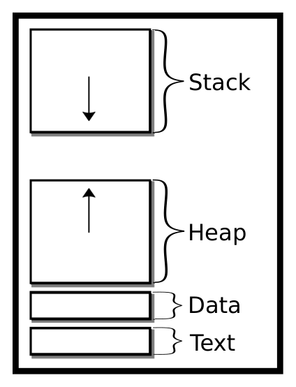
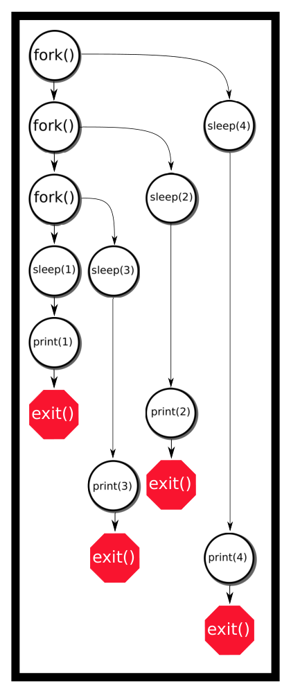
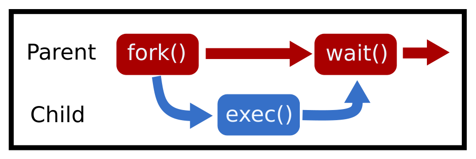

# Chương 4. Tiến trình (Processes)

> Bản dịch tiếng Việt từ *System Programming Coursebook* (University of Illinois, CS 241) — B. Venkatesh, L. Angrave et al. Tài liệu gốc được phát hành theo giấy phép [CC BY 4.0](https://creativecommons.org/licenses/by/4.0/); bản dịch giữ nguyên giấy phép này. Nguồn: https://github.com/illinois-cs241/coursebook

> Ai mà cần cách ly tiến trình cơ chứ?
>
> — Intel Marketing, nói về Meltdown và Spectre

Để hiểu process (tiến trình) là gì, bạn cần hiểu hệ điều hành là gì. Hệ điều hành là một chương trình cung cấp giao diện giữa phần cứng và phần mềm của người dùng, đồng thời cung cấp một bộ công cụ mà phần mềm có thể sử dụng. Hệ điều hành quản lý phần cứng và cho các chương trình người dùng một cách thức thống nhất để tương tác với phần cứng, miễn là hệ điều hành đó cài đặt được lên phần cứng ấy. Dù ý tưởng này nghe có vẻ là giải pháp tối hậu, chúng ta biết rằng có rất nhiều hệ điều hành khác nhau, mỗi hệ có những đặc thù và chuẩn riêng. Để giải quyết chuyện đó, có thêm một tầng trừu tượng nữa: POSIX, hay *portable operating systems interface* (giao diện hệ điều hành khả chuyển). Đây là một chuẩn (hay giờ là nhiều chuẩn) mà một hệ điều hành phải hiện thực để được coi là tương thích POSIX – hầu hết các hệ thống chúng ta sẽ nghiên cứu đều *gần như* tương thích POSIX, phần nhiều là vì những lý do chính trị.

Trước khi nói về các hệ thống POSIX, ta nên hiểu khái niệm kernel (nhân hệ điều hành) nói chung. Trong một hệ điều hành (OS), có hai không gian: kernel space (không gian nhân) và user space (không gian người dùng). Kernel space là một chế độ hoạt động đầy quyền năng, cho phép hệ thống tương tác với phần cứng và có khả năng phá hỏng máy của bạn. User space là nơi hầu hết ứng dụng chạy, vì chúng không cần mức quyền năng đó cho mọi thao tác. Khi một chương trình user space cần thêm quyền năng, nó tương tác với phần cứng thông qua một system call (lời gọi hệ thống) do kernel thực hiện. Điều này thêm một lớp bảo mật để các chương trình người dùng thông thường không thể phá hủy toàn bộ hệ điều hành của bạn. Trong phạm vi môn học này, chúng ta sẽ nói về các hệ điều hành một máy, nhiều người dùng. Đó là loại hệ thống có một đồng hồ trung tâm trên một máy tính xách tay hay máy để bàn tiêu chuẩn. Các OS khác nới lỏng yêu cầu về đồng hồ trung tâm (hệ phân tán) hoặc tính "tiêu chuẩn" của phần cứng (hệ thống nhúng). Còn có những bất biến khác đảm bảo các sự kiện xảy ra vào những thời điểm nhất định.

Hệ điều hành được tạo thành từ nhiều mảnh khác nhau. Có thể có một chương trình chạy để xử lý các kết nối USB mới cắm vào, một chương trình khác để duy trì kết nối mạng, v.v. Quan trọng nhất là kernel – dù nó có thể là một tập các process – trái tim của hệ điều hành. Kernel có nhiều nhiệm vụ quan trọng. Nhiệm vụ đầu tiên là khởi động (booting).

1. Phần cứng máy tính thực thi mã từ bộ nhớ chỉ đọc, gọi là firmware.

2. Firmware thực thi một bootloader, thường tuân theo Extensible Firmware Interface (EFI) – một giao diện giữa firmware hệ thống và hệ điều hành.

3. Trình quản lý khởi động (boot manager) của bootloader nạp kernel của hệ điều hành, dựa trên các thiết lập khởi động.

4. Kernel của bạn thực thi `init` để tự bootstrap từ con số không.

5. Kernel thực thi các script khởi động, như bật mạng và xử lý USB.

6. Kernel thực thi các script userland, như khởi động màn hình desktop, và bạn được dùng máy tính của mình!

Khi một chương trình đang thực thi trong user space, kernel cung cấp một số dịch vụ quan trọng cho các chương trình ở user space.

- Lập lịch (scheduling) các process và thread (luồng)

- Xử lý các nguyên thủy đồng bộ hóa (futex, mutex, semaphore, v.v.)

- Cung cấp các system call như `write` hay `read`

- Quản lý virtual memory (bộ nhớ ảo) và các thiết bị nhị phân cấp thấp như driver USB

- Quản lý các filesystem (hệ thống tệp)

- Xử lý truyền thông qua mạng

- Xử lý truyền thông giữa các process

- Liên kết động các thư viện

- Và danh sách còn dài nữa.

Kernel tạo ra process đầu tiên `init.d` (một lựa chọn thay thế là `system.d`). `init.d` khởi động các chương trình như giao diện đồ họa, terminal, v.v. – theo mặc định, đây là process duy nhất được hệ thống tạo ra một cách tường minh. Mọi process khác đều được sinh ra bằng các system call `fork` và `exec` từ process đơn lẻ đó.

## 4.1 File descriptor (File Descriptors)

Dù đã được nhắc đến ở chương trước, chúng tôi sẽ nhắc lại nhanh về file descriptor (bộ mô tả tệp). Một zine của Julia Evans cung cấp thêm chi tiết [8].

Kernel theo dõi các file descriptor và những gì chúng trỏ tới. Sau này ta sẽ học hai điều: file descriptor trỏ tới nhiều thứ hơn chứ không chỉ file, và hệ điều hành theo dõi chúng.

Lưu ý rằng file descriptor có thể được dùng lại giữa các process, nhưng bên trong một process thì chúng là duy nhất. File descriptor có thể có khái niệm vị trí. Những file descriptor như vậy được gọi là seekable stream (luồng có thể dịch chuyển vị trí). Một chương trình có thể đọc trọn vẹn một file trên đĩa vì OS theo dõi vị trí trong file – một thuộc tính cũng thuộc về process của bạn.

Các file descriptor khác trỏ tới socket mạng và nhiều loại thông tin khác, là những unseekable stream (luồng không thể dịch chuyển vị trí).

## 4.2 Tiến trình (Processes)

Một process là một thể hiện (instance) của một chương trình máy tính có thể đang chạy. Process có nhiều tài nguyên trong tay. Khi bắt đầu, mỗi chương trình được cấp một process, nhưng mỗi chương trình có thể tạo thêm nhiều process. Một chương trình gồm những thứ sau:

- Một định dạng nhị phân: Thứ này cho hệ điều hành biết về các section bit khác nhau trong file nhị phân – phần nào thực thi được, phần nào là hằng số, cần bao gồm những thư viện nào, v.v.

- Một tập các lệnh máy (machine instruction)

- Một con số cho biết bắt đầu từ lệnh nào

- Các hằng số

- Các thư viện cần liên kết và chỗ nào cần điền địa chỉ của các thư viện đó

Process rất mạnh mẽ, nhưng chúng bị cách ly!

Nghĩa là theo mặc định, không process nào có thể giao tiếp với process khác.

Điều này quan trọng vì trong các hệ thống phức tạp (như các máy trạm Engineering Workstations của University of Illinois), nhiều khả năng các process khác nhau sẽ có đặc quyền khác nhau. Chắc chắn không ai muốn một người dùng bình thường có thể đánh sập cả hệ thống, dù là cố ý hay vô tình sửa đổi một process. Như hầu hết các bạn giờ đã nhận ra, nếu bạn nhét đoạn mã sau vào một chương trình, các biến là không được chia sẻ giữa hai lần chạy song song của chương trình.

```c
int secrets;
secrets++;
printf("%d\n", secrets);
```

Trên hai terminal khác nhau, cả hai đều sẽ in ra 1 chứ không phải 2. Kể cả khi ta đổi mã để cố tác động đến các thể hiện process khác, cũng không có cách nào thay đổi trạng thái của process khác một cách vô ý. Tuy nhiên, có những cách *có chủ đích* khác để thay đổi trạng thái chương trình của các process khác.

## 4.3 Nội dung của tiến trình (Process Contents)

### 4.3.1 Bố cục bộ nhớ (Memory Layout)

Khi một process khởi động, nó được cấp address space (không gian địa chỉ) của riêng mình. Mỗi process có những thứ sau.

- **Một Stack.** Stack là nơi lưu các biến được cấp phát tự động và địa chỉ trả về của các lời gọi hàm. Mỗi lần khai báo một biến mới, chương trình dịch con trỏ stack (stack pointer) xuống để dành chỗ cho biến. Đoạn stack này ghi được nhưng không thực thi được. Hành vi này được điều khiển bởi bit no-execute (NX), đôi khi gọi là bit W^X (write XOR execute), giúp ngăn mã độc – chẳng hạn shellcode – chạy trên stack.

  Nếu stack lớn lên quá xa – nghĩa là vượt qua một ranh giới định trước hoặc giao với heap – chương trình sẽ gặp lỗi tràn stack (stack overflow), nhiều khả năng dẫn đến SEGFAULT. Theo mặc định, stack được cấp phát tĩnh; chỉ có một lượng không gian nhất định mà ta có thể ghi vào.

- **Một Heap.** Heap là một vùng bộ nhớ liên tục, có thể mở rộng [5]. Nếu chương trình muốn cấp phát một đối tượng có thời gian sống được kiểm soát thủ công hoặc có kích thước không xác định được lúc biên dịch, nó sẽ muốn tạo một biến trên heap.

  Heap bắt đầu ở đỉnh của text segment và lớn dần lên trên, nghĩa là `malloc` có thể đẩy ranh giới của heap – gọi là program break – lên trên.

  Ta sẽ tìm hiểu sâu hơn trong chương về cấp phát bộ nhớ. Vùng này cũng ghi được nhưng không thực thi được. Ta có thể cạn bộ nhớ heap nếu hệ thống bị hạn chế tài nguyên hoặc chương trình hết địa chỉ – một hiện tượng phổ biến hơn trên hệ thống 32-bit.

- **Một Data Segment.** Đoạn này gồm hai phần: initialized data segment (đoạn dữ liệu đã khởi tạo) và uninitialized segment (đoạn chưa khởi tạo). Hơn nữa, initialized data segment lại được chia thành một phần chỉ đọc và một phần ghi được.

  - **Initialized Data Segment.** Phần này chứa mọi biến toàn cục của chương trình và bất kỳ biến static nào khác. Section này bắt đầu ở cuối text segment và có kích thước không đổi ngay từ đầu vì số lượng biến toàn cục đã biết lúc biên dịch. Cuối data segment được gọi là program break và có thể mở rộng bằng `brk` / `sbrk`.

    Section này ghi được [10, tr. 124]. Đáng chú ý nhất, section này chứa các biến được khởi tạo bằng một bộ khởi tạo tĩnh, như sau:

    ```c
    int global = 1;
    ```

  - **Uninitialized Data Segment / BSS.** BSS là tên của một toán tử assembler cũ, viết tắt của Block Started by Symbol.

    Phần này chứa mọi biến toàn cục và các biến có thời gian sống static khác được ngầm gán bằng 0. Ví dụ:

    ```c
    int assumed_to_be_zero;
    ```

    Biến này sẽ được gán bằng 0; nếu không, ta sẽ có một rủi ro bảo mật liên quan đến việc cách ly với các process khác.

    Chúng được đặt vào một section riêng để tăng tốc thời gian khởi động process.

    Section này bắt đầu ở cuối data segment và cũng có kích thước tĩnh vì số lượng biến toàn cục đã biết lúc biên dịch.

    Hiện nay, cả initialized data segment và BSS được gộp chung và gọi là data segment [10, tr. 124], dù mục đích của chúng có phần khác nhau.

- **Một Text Segment.** Đây là nơi lưu toàn bộ lệnh thực thi; nó đọc được (con trỏ hàm) nhưng không ghi được.

  Program counter (bộ đếm chương trình) di chuyển qua đoạn này, thực thi lần lượt từng lệnh.

  Điều quan trọng cần lưu ý là theo mặc định, đây là section thực thi được duy nhất của chương trình.

  Nếu một chương trình sửa mã của chính nó trong lúc đang chạy, chương trình nhiều khả năng sẽ SEGFAULT.

  Có những cách lách qua chuyện này, nhưng ta sẽ không tìm hiểu trong môn học này.

  Tại sao nó không phải lúc nào cũng bắt đầu từ 0? Đó là vì một tính năng bảo mật gọi là address space layout randomization (ASLR – ngẫu nhiên hóa bố cục không gian địa chỉ).

  Lý do và lời giải thích về nó nằm ngoài phạm vi môn học, nhưng biết đến sự tồn tại của nó cũng là điều tốt.

  Dù vậy, địa chỉ này có thể được làm cho cố định nếu chương trình được biên dịch với cờ DEBUG.



*Hình 4.1: Không gian địa chỉ của tiến trình*

### 4.3.2 Các nội dung khác (Other Contents)

Để theo dõi tất cả các process này, hệ điều hành cấp cho mỗi process một con số gọi là process ID (PID). Process cũng được cấp PID của process cha của nó, gọi là parent process ID (PPID). Mọi process đều có cha, và cha đó có thể là `init.d`.

Process còn có thể chứa những thông tin sau:

- Running State (trạng thái chạy) – Process đang sẵn sàng, đang chạy, bị dừng, đã kết thúc, v.v. (sẽ nói kỹ hơn trong chương về Lập lịch).

- File Descriptors – Một danh sách ánh xạ từ số nguyên tới các thiết bị thực (file, ổ USB, socket)

- Permissions (quyền) – Process đang chạy dưới người dùng nào và thuộc nhóm nào. Khi đó process chỉ có thể thực hiện các thao tác dựa trên quyền được cấp cho người dùng hoặc nhóm đó, chẳng hạn truy cập file. Có những mẹo để một chương trình nhận một người dùng khác với người đã khởi chạy nó, ví dụ `sudo` lấy một chương trình mà người dùng khởi chạy và thực thi nó với tư cách root. Cụ thể hơn, một process có real user ID (định danh chủ sở hữu của process), effective user ID (dùng cho người dùng không đặc quyền khi cố truy cập các file chỉ superuser mới truy cập được), và saved user ID (dùng khi người dùng đặc quyền thực hiện các hành động không đặc quyền).

- Arguments (đối số) – một danh sách các chuỗi cho chương trình biết cần chạy với những tham số nào.

- Environment Variables (biến môi trường) – một danh sách các chuỗi cặp khóa–giá trị dạng `NAME=VALUE` mà ta có thể sửa đổi. Chúng thường được dùng để chỉ định đường dẫn tới thư viện và file nhị phân, các thiết lập cấu hình chương trình, v.v.

Theo đặc tả POSIX, một process chỉ cần một thread và một address space, nhưng hầu hết các nhà phát triển kernel và người dùng đều biết chỉ chừng đó thôi là chưa đủ [6].

## 4.4 Giới thiệu về fork (Intro to Fork)

### 4.4.1 Lời cảnh báo (A word of warning)

Fork process là một công cụ mạnh mẽ và nguy hiểm. Nếu bạn mắc lỗi dẫn đến một fork bomb, bạn có thể đánh sập cả hệ thống. Để giảm khả năng này, hãy giới hạn số process tối đa của bạn ở một con số nhỏ, ví dụ 40, bằng cách gõ `ulimit -u 40` trên dòng lệnh. Lưu ý, giới hạn này chỉ áp dụng cho người dùng, nghĩa là nếu bạn gây fork bomb thì bạn sẽ không thể kill hết các process đã tạo ra, vì gọi `killall` đòi hỏi shell của bạn phải `fork()`. Khá là xui xẻo. Một giải pháp là sinh trước một thể hiện shell khác dưới một người dùng khác (ví dụ root) và kill các process từ đó.

Cách khác là dùng lệnh built-in `exec` để kill toàn bộ process của người dùng (bạn chỉ có một lần thử cho việc này).

Cuối cùng, bạn có thể khởi động lại hệ thống, nhưng với hàm `exec` bạn chỉ có duy nhất một cơ hội.

Khi kiểm thử mã `fork()`, hãy đảm bảo bạn có quyền root và/hoặc quyền truy cập vật lý vào máy liên quan. Nếu buộc phải làm việc với mã `fork()` từ xa, hãy nhớ rằng `kill -9 -1` sẽ cứu bạn trong trường hợp khẩn cấp. Fork có thể cực kỳ nguy hiểm nếu bạn không chuẩn bị trước. Bạn đã được cảnh báo.

### 4.4.2 Chức năng của fork (Fork Functionality)

System call `fork` nhân bản process hiện tại để tạo ra một process mới, gọi là child process (process con). Việc này diễn ra bằng cách sao chép trạng thái của process hiện có, với vài khác biệt nhỏ.

- Process con thực thi dòng tiếp theo sau `fork()`, giống như process cha.

- Chỉ nói thêm, trong các hệ UNIX cũ, toàn bộ address space của process cha được sao chép trực tiếp bất kể tài nguyên có bị sửa đổi hay không. Hành vi hiện nay là kernel thực hiện copy-on-write (sao chép khi ghi), tiết kiệm rất nhiều tài nguyên mà vẫn hiệu quả về thời gian [7, mục Copy-on-write].

Đây là một ví dụ đơn giản:

```c
printf("I'm printed once!\n");
fork();
// Now two processes running if fork succeeded
// and each process will print out the next line.
printf("This line twice!\n");
```

Đây là một ví dụ đơn giản về việc nhân bản address space này. Chương trình sau có thể in ra 42 hai lần – nhưng `fork()` nằm *sau* `printf` cơ mà!? Tại sao?

```c
#include <unistd.h> /*fork declared here*/
#include <stdio.h> /* printf declared here*/
int main() {
  int answer = 84 >> 1;
  printf("Answer: %d", answer);
  fork();
  return 0;
}
```

Dòng `printf` chỉ được thực thi một lần, tuy nhiên hãy để ý rằng nội dung in ra chưa được flush ra standard out. Không có ký tự xuống dòng nào được in, ta không gọi `fflush` hay đổi chế độ đệm. Vì vậy văn bản đầu ra vẫn nằm trong bộ nhớ của process, chờ được gửi đi. Khi `fork()` được thực thi, toàn bộ bộ nhớ của process được sao chép, kể cả bộ đệm. Do đó, process con khởi đầu với một bộ đệm đầu ra không rỗng, và bộ đệm này *có thể* được flush khi chương trình thoát. Ta nói *có thể* vì nội dung cũng có thể không được ghi ra nếu chương trình thoát không đúng cách.

Để viết mã khác nhau cho process cha và process con, hãy kiểm tra giá trị trả về của `fork()`. Nếu `fork()` trả về -1, tức là đã có gì đó sai trong quá trình tạo process con mới. Ta nên kiểm tra giá trị lưu trong `errno` để xác định loại lỗi đã xảy ra. Các lỗi phổ biến gồm `EAGAIN` và `ENOENT`, về cơ bản nghĩa là "thử lại – tài nguyên tạm thời không khả dụng" và "không có file hay thư mục như vậy".

Tương tự, giá trị trả về 0 cho biết ta đang hoạt động trong ngữ cảnh của process con, còn một số nguyên dương cho thấy ta đang ở ngữ cảnh của process cha.

Giá trị dương mà `fork()` trả về chính là process id (pid) của process con.

Một cách để nhớ giá trị trả về của fork biểu diễn cái gì: process con có thể tìm được cha của nó – process gốc đã được nhân bản – bằng cách gọi `getppid()`, nên không cần thêm thông tin trả về nào từ `fork()`. Tuy nhiên, process cha có thể có nhiều process con, và do đó cần được thông báo tường minh về PID của các con.

Theo chuẩn POSIX, mỗi process chỉ có duy nhất một process cha.

Process cha chỉ có thể biết PID của process con mới từ giá trị trả về của fork:

```c
pid_t id = fork();
if (id == -1) exit(1); // fork failed
if (id > 0) {
  // Original parent
  // A child process with id 'id'
  // Use waitpid to wait for the child to finish
} else { // returned zero
  // Child Process
}
```

Dưới đây là một ví dụ hơi ngớ ngẩn. Nó sẽ in ra gì? Hãy thử chạy chương trình này với nhiều đối số.

```c
#include <unistd.h>
#include <stdio.h>
int main(int argc, char **argv) {
  pid_t id;
  int status;
  while (--argc && (id=fork())) {
    waitpid(id,&status,0); /* Wait for child*/
  }
  printf("%d:%s\n", argc, argv[argc]);
  return 0;
}
```

Một ví dụ nữa ở dưới đây. Đó là thuật toán sleepsort song song tuyệt vời, có vẻ $O(N)$ – kẻ chiến thắng ngớ ngẩn của ngày hôm nay. Được công bố lần đầu trên 4chan năm 2011. Một phiên bản của thuật toán sắp xếp tệ hại nhưng thú vị này được trình bày dưới đây. Thuật toán sắp xếp này có thể không tạo ra kết quả đúng.

```c
int main(int c, char **v) {
  while (--c > 1 && !fork());
  int val = atoi(v[c]);
  sleep(val);
  printf("%d\n", val);
  return 0;
}
```

Hãy tưởng tượng ta chạy chương trình này như sau

```bash
$ ./ssort 1 3 2 4
```



*Hình 4.2: Diễn biến thời gian khi sắp xếp 1, 3, 2, 4*

Thuật toán này thực ra không phải $O(N)$, vì cách bộ lập lịch (scheduler) của hệ thống hoạt động. Về bản chất, chương trình này thuê ngoài việc sắp xếp thực sự cho hệ điều hành.

### 4.4.3 Fork Bomb

'Fork bomb' là thứ chúng tôi đã cảnh báo bạn trước đó. Nó xảy ra khi có nỗ lực tạo ra một số lượng vô hạn process. Điều này thường khiến hệ thống gần như đứng im, khi nó cố gắng phân bổ thời gian CPU và bộ nhớ cho một lượng lớn process đang sẵn sàng chạy. Quản trị viên hệ thống không ưa chúng và có thể đặt giới hạn trên cho số process mỗi người dùng được có, hoặc thu hồi quyền đăng nhập, vì chúng gây ra những xáo động trong Thần Lực đối với chương trình của những người dùng khác. Một chương trình có thể giới hạn số process con được tạo ra bằng `setrlimit()`.

Fork bomb không nhất thiết là độc hại – đôi khi chúng xảy ra do lỗi lập trình. Dưới đây là một ví dụ đơn giản mang tính độc hại.

```c
while (1) fork();
```

Rất dễ gây ra fork bomb nếu bạn bất cẩn khi gọi fork, nhất là trong vòng lặp. Bạn có nhận ra fork bomb ở đây không?

```c
#include <unistd.h>
#define HELLO_NUMBER 10

int main(){
  pid_t children[HELLO_NUMBER];
  int i;
  for(i = 0; i < HELLO_NUMBER; i++){
    pid_t child = fork();
    if(child == -1) {
      break;
    }
    if(child == 0) {
      // Child
      execlp("ehco", "echo", "hello", NULL);
    }
    else{
      // Parent
      children[i] = child;
    }
  }

  int j;
  for(j = 0; j < i; j++){
    waitpid(children[j], NULL, 0);
  }
  return 0;
}
```

Ta đã viết sai chính tả `ehco`, nên lời gọi exec thất bại. Điều này nghĩa là gì? Thay vì tạo 10 process, ta đã tạo ra 1024 process, fork bomb chính máy của mình. Làm sao để ngăn chặn điều này? Thêm một `exit` ngay sau exec, để nếu exec thất bại, ta sẽ không rơi vào cảnh gọi fork một số lần không giới hạn. Còn nhiều cách khác nữa. Chuyện gì xảy ra nếu ta xóa file nhị phân echo? Nếu chính file nhị phân đó tạo ra fork bomb thì sao?

### 4.4.4 Tín hiệu (Signals)

Ta sẽ chưa tìm hiểu trọn vẹn về signal (tín hiệu) cho đến cuối khóa học, nhưng cần đề cập ngay bây giờ vì nhiều ngữ nghĩa liên quan đến fork và các lời gọi hàm khác có nói đến signal là gì.

Có thể xem signal như một ngắt mềm (software interrupt). Nghĩa là một process nhận được signal sẽ dừng thực thi chương trình hiện tại và khiến chương trình phản ứng với signal đó.

Có nhiều signal được hệ điều hành định nghĩa, hai trong số đó có thể bạn đã biết: `SIGSEGV` và `SIGINT`. Cái đầu do truy cập bộ nhớ bất hợp lệ gây ra, còn cái sau được gửi bởi một người dùng muốn kết thúc chương trình. Trong mỗi trường hợp, chương trình nhảy từ dòng đang được thực thi sang signal handler (hàm xử lý tín hiệu). Nếu chương trình không cung cấp signal handler, một handler mặc định sẽ được thực thi – chẳng hạn kết thúc chương trình, hoặc bỏ qua signal.

Đây là ví dụ về một signal handler đơn giản do người dùng định nghĩa:

```c
void handler(int signum) {
  write(1, "signaled!", 9);
  // we don't need the signum because we are only catching SIGINT
  // if you want to use the same piece of code for multiple
  // signals, check the signum
}
int main() {
  signal(SIGINT, handler);
  while(1) ;
  return 0;
}
```

Một signal có bốn giai đoạn trong vòng đời của nó: trạng thái generated (được sinh ra), pending (đang chờ), blocked (bị chặn), và received (được nhận). Chúng lần lượt chỉ thời điểm một process sinh ra signal, kernel sắp chuyển giao signal, signal bị chặn, và khi kernel chuyển giao signal; mỗi giai đoạn đều cần một chút thời gian để hoàn tất. Đọc thêm ở phần giới thiệu của chương Signals.

Thuật ngữ này quan trọng vì fork và exec đòi hỏi những thao tác khác nhau tùy vào trạng thái mà signal đang ở.

Cần lưu ý, dùng signal trong logic chương trình – tức là gửi signal để thực hiện một thao tác nào đó – nhìn chung là một thực hành lập trình kém. Lý do: signal không có khung thời gian chuyển giao và không có gì đảm bảo chúng sẽ được chuyển giao. Có nhiều cách tốt hơn để giao tiếp giữa hai process.

Nếu bạn muốn đọc thêm, cứ thoải mái nhảy tới chương về POSIX signal và đọc qua. Chương đó không dài và cho bạn biết đại khái mọi điều về cách xử lý signal trong process.

### 4.4.5 Chi tiết về fork theo POSIX (POSIX Fork Details)

POSIX xác định các chuẩn cho fork [4]. Bạn có thể đọc tài liệu trích dẫn ở trên, nhưng lưu ý rằng nó có thể khá dài dòng. Đây là tóm tắt những gì có liên quan:

1. Fork sẽ trả về một số nguyên không âm khi thành công.

2. Process con sẽ thừa kế mọi file descriptor đang mở của process cha. Nghĩa là nếu process cha đã đọc được nửa file rồi mới fork, process con sẽ bắt đầu ở offset đó. Một thao tác đọc ở phía process con sẽ dịch offset của process cha đi một lượng tương ứng. Mọi cờ khác cũng được mang theo.

3. Các pending signal (signal đang chờ) không được thừa kế. Nghĩa là nếu process cha có một signal đang chờ và tạo ra process con, process con sẽ không nhận signal đó trừ khi một process khác gửi signal cho nó.

4. Process sẽ được tạo với một thread (sẽ nói thêm sau. Quan điểm chung là không nên tạo process và thread cùng lúc).

5. Vì ta có copy on write (COW), các địa chỉ bộ nhớ chỉ đọc được chia sẻ giữa các process.

6. Nếu chương trình thiết lập những vùng bộ nhớ nhất định, chúng có thể được chia sẻ giữa các process.

7. Signal handler được thừa kế nhưng có thể thay đổi.

8. Thư mục làm việc hiện tại của process (thường viết tắt là CWD) được thừa kế nhưng có thể thay đổi.

9. Biến môi trường được thừa kế nhưng có thể thay đổi.

Các khác biệt chính giữa process cha và process con gồm:

- Process id do `getpid()` trả về. Parent process id do `getppid()` trả về.

- Process cha được thông báo qua một signal, `SIGCHLD`, khi process con kết thúc, nhưng không có chiều ngược lại.

- Process con không thừa kế các pending signal hay timer alarm (báo thức hẹn giờ). Xem danh sách đầy đủ trong trang man của fork.

- Process con có tập biến môi trường của riêng nó.

### 4.4.6 Fork và FILE (Fork and FILEs)

Có một số trường hợp biên rắc rối khi dùng `FILE` cùng với fork. Trước hết, ta phải phân biệt về mặt kỹ thuật. Một *file description* là struct mà một file descriptor trỏ tới. File descriptor có thể trỏ tới nhiều loại struct khác nhau, nhưng trong phạm vi của ta, chúng sẽ trỏ tới một struct biểu diễn một file trên filesystem. File description này chứa các phần tử như đường dẫn, descriptor đã đọc đến đâu trong file, v.v. Một file descriptor trỏ tới một file description. Điều này quan trọng vì khi một process được fork, chỉ file descriptor được nhân bản, chứ không phải description. Đoạn mã sau chỉ có một description.

```c
int file = open(...);
if(!fork) {
  read(file, ...);
} else {
  read(file, ...);
}
```

Một process sẽ đọc một phần của file, process kia sẽ đọc một phần khác của file. Trong ví dụ sau, có hai description do hai file handle khác nhau tạo ra.

```c
if(!fork) {
  int file = open(...);
  read(file, ...);
} else {
  int file = open(...);
  read(file, ...);
}
```

Hãy xét ví dụ dẫn nhập của chúng ta.

```text
$ cat test.txt
A
B
C
```

Hãy nhìn đoạn mã này, nó làm gì?

```c
size_t buffer_cap = 0;
char * buffer = NULL;
ssize_t nread;
FILE * file = fopen("test.txt", "r");
int count = 0;
while((nread = getline(&buffer, &buffer_cap, file) != -1) {
  printf("%s", buffer);
  if(fork() == 0) {
    exit(0);
  }
  wait(NULL);
}
```

Ý nghĩ ban đầu có thể là nó in file ra từng dòng một, kèm thêm chút fork thừa thãi. Thực ra đó là undefined behavior (hành vi không xác định), vì ta chưa chuẩn bị các file descriptor. Nói ngắn gọn, đây là những gì cần làm để tránh tình huống như ví dụ này.

1. Với tư cách lập trình viên, bạn cần đảm bảo mọi file descriptor của mình đã được chuẩn bị trước khi fork.

2. Nếu đó là một file descriptor hoặc một `FILE*` không đệm, nó đã được chuẩn bị sẵn.

3. Nếu `FILE*` được mở để đọc và đã được đọc hết, nó đã được chuẩn bị sẵn.

4. Nếu không, `FILE*` phải được `fflush` hoặc đóng lại thì mới được coi là đã chuẩn bị.

5. Nếu file descriptor đã được chuẩn bị, nó phải ở trạng thái không hoạt động trong process cha nếu process con đang dùng nó, hoặc ngược lại. Một process được coi là đang dùng nó nếu process đó đọc hoặc ghi, hoặc nếu process đó vì lý do nào đó gọi `exit`. Nếu một process dùng nó trong khi process kia cũng đang dùng, hành vi của toàn bộ ứng dụng là không xác định.

Vậy ta sửa đoạn mã thế nào? Ta sẽ phải flush file trước khi fork và kiềm chế không dùng nó cho đến sau lời gọi wait – chi tiết hơn về việc này ở mục tiếp theo.

```c
size_t buffer_cap = 0;
char * buffer = NULL;
ssize_t nread;
FILE * file = fopen("test.txt", "r");
int count = 0;
while((nread = getline(&buffer, &buffer_cap, file) != -1) {
  printf("%s", buffer);
  fflush(file);
  if(fork() == 0) {
    exit(0);
  }
  wait(NULL);
}
```

Nếu process cha và process con cần thực hiện công việc bất đồng bộ và cần giữ file handle mở thì sao? Do thứ tự sự kiện, ta cần đảm bảo process cha biết rằng process con đã xong bằng cách dùng wait. Ta sẽ nói về Inter-Process Communication (giao tiếp liên tiến trình) trong một chương sau, nhưng bây giờ ta có thể dùng phương pháp double fork (fork hai lần).

```c
//...
fflush(file);
pid_t child = fork();
if(child == 0) {
  fclose(file);
  if (fork() == 0) {
    // Do asynchronous work
    // Safe exit, this child doesn't know about
    // the file descriptor
    exit(0);
  }
  exit(0);
}
waitpid(child, NULL, 0);
```

Nếu bạn quan tâm cách này hoạt động ra sao, hãy xem phụ lục để đọc mô tả về bài toán Fork-file.

## 4.5 Chờ và thực thi (Waiting and Executing)

Nếu process cha muốn chờ process con kết thúc, nó phải dùng `waitpid` (hoặc `wait`); cả hai đều chờ một process con thay đổi trạng thái process, có thể là một trong các trạng thái sau:

1. Process con đã kết thúc

2. Process con bị dừng bởi một signal

3. Process con được tiếp tục bởi một signal

Lưu ý rằng `waitpid` có thể được đặt ở chế độ không chặn (non-blocking), nghĩa là nó sẽ trả về ngay lập tức, cho chương trình biết process con đã thoát hay chưa.

```c
pid_t child_id = fork();
if (child_id == -1) {perror("fork"); exit(EXIT_FAILURE);}
if (child_id > 0) {
  // We have a child! Get their exit code
  int status;
  waitpid( child_id, &status, 0 );
  // code not shown to get exit status from child
} else { // In child ...
  // start calculation
  exit(123);
}
```

`wait` là phiên bản đơn giản hơn của `waitpid`. `wait` nhận một con trỏ tới số nguyên và chờ bất kỳ process con nào. Sau khi process con đầu tiên thay đổi trạng thái, `wait` trả về. Đây là hành vi của `waitpid`:

1. Chương trình có thể chờ một process cụ thể, hoặc có thể truyền vào các giá trị đặc biệt cho pid để làm những việc khác nhau (xem các trang man).

2. Tham số cuối cùng của `waitpid` là tham số tùy chọn. Các tùy chọn được liệt kê dưới đây:

3. `WNOHANG` – Trả về ngay, cho biết process được tìm đã thoát hay chưa

4. `WNOWAIT` – Chờ, nhưng để process con vẫn có thể được wait bởi một lời gọi wait khác

5. `WEXITED` – Chờ các process con đã thoát

6. `WSTOPPED` – Chờ các process con bị dừng

7. `WCONTINUED` – Chờ các process con được tiếp tục

Exit status (mã thoát), hay giá trị được lưu vào con trỏ số nguyên đối với cả hai lời gọi trên, được giải thích dưới đây.

### 4.5.1 Mã thoát (Exit statuses)

Để tìm giá trị trả về của `main()` (hoặc giá trị được truyền vào `exit()`), hãy dùng các macro Wait – thông thường một chương trình sẽ dùng `WIFEXITED` và `WEXITSTATUS`. Xem trang man của wait/waitpid để biết thêm thông tin.

```c
int status;
pid_t child = fork();
if (child == -1) {
  return 1; //Failed
}
if (child > 0) {
  // Parent, wait for child to finish
  pid_t pid = waitpid(child, &status, 0);
  if (pid != -1 && WIFEXITED(status)) {
    int exit_status = WEXITSTATUS(status);
    printf("Process %d returned %d" , pid, exit_status);
  }
} else {
  // Child, do something interesting
  execl("/bin/ls", "/bin/ls", ".", (char *) NULL); // "ls ."
}
```

Một process chỉ có thể có 256 giá trị trả về; các bit còn lại là thông tin bổ sung, và thông tin đó được trích ra bằng phép dịch bit. Tuy nhiên, kernel có cách nội bộ riêng để theo dõi các process bị signal, đã thoát, hay bị dừng. API này được trừu tượng hóa để các nhà phát triển kernel được tự do thay đổi nó tùy ý. Hãy nhớ: các macro này chỉ có ý nghĩa khi tiền điều kiện được thỏa mãn. Ví dụ, exit status của một process sẽ không được xác định nếu process đó không bị signal. Các macro sẽ không kiểm tra giúp chương trình, nên lập trình viên phải tự đảm bảo logic là đúng. Như trong ví dụ ở trên, chương trình nên dùng `WIFSTOPPED` để kiểm tra xem process có bị dừng hay không, rồi dùng `WSTOPSIG` để tìm signal đã dừng nó. Do đó, không cần phải ghi nhớ những gì sau đây. Đây là cái nhìn tổng quan ở mức cao về cách thông tin được lưu bên trong các biến status. Từ file `sys/wait.h` của một kernel Berkeley Standard Distribution (BSD) cũ [1]:

```c
/* If WIFEXITED(STATUS), the low-order 8 bits of the status. */
#define _WSTATUS(x) (_W_INT(x) & 0177)
#define _WSTOPPED 0177 /* _WSTATUS if process is stopped */
#define WIFSTOPPED(x) (_WSTATUS(x) == _WSTOPPED)
#define WSTOPSIG(x) (_W_INT(x) >> 8)
#define WIFSIGNALED(x) (_WSTATUS(x) != _WSTOPPED && _WSTATUS(x) != 0)
#define WTERMSIG(x) (_WSTATUS(x))
#define WIFEXITED(x) (_WSTATUS(x) == 0)
```

Có một quy ước về exit code. Nếu process thoát bình thường và mọi thứ đều thành công, thì nên trả về 0. Ngoài điều đó ra, không có nhiều quy ước được chấp nhận rộng rãi. Nếu một chương trình quy định các mã trả về mang ý nghĩa cho những điều kiện nhất định, nó có thể khai thác 256 mã lỗi một cách có ý nghĩa hơn. Ví dụ, một chương trình có thể trả về 1 nếu chương trình đã đi đến giai đoạn 1 (như ghi vào một file), 2 nếu nó làm việc gì đó khác, v.v. Thông thường, các chương trình UNIX không được thiết kế theo chính sách này, để cho đơn giản.

### 4.5.2 Zombie và mồ côi (Zombies and Orphans)

Wait các process con của mình là một thực hành tốt. Nếu process cha không wait các con, chúng trở thành cái gọi là zombie. Zombie được tạo ra khi một process con kết thúc rồi chiếm một chỗ trong bảng process của kernel dành cho process của bạn. Bảng process theo dõi những thông tin sau về một process: PID, trạng thái, và nó đã bị kill như thế nào. Cách duy nhất để loại bỏ zombie là wait các process con của bạn. Nếu một process cha chạy lâu dài không bao giờ wait các con, nó có thể mất khả năng fork.

Dù vậy, một chương trình không phải lúc nào cũng cần wait các con của mình! Process cha của bạn có thể tiếp tục thực thi mã mà không phải chờ process con. Nếu process cha chết mà không wait các con, nó có thể khiến các con của mình trở thành mồ côi (orphan). Khi một process cha hoàn tất, mọi process con của nó sẽ được gán cho `init` – process đầu tiên, có PID là 1. Do đó, những process con này sẽ thấy `getppid()` trả về giá trị 1. Các process mồ côi này rốt cuộc sẽ kết thúc và trong chốc lát trở thành zombie. Process `init` tự động wait tất cả các con của nó, nhờ đó loại bỏ những zombie này khỏi hệ thống.

### 4.5.3 Nâng cao: Chờ bất đồng bộ (Advanced: Asynchronously Waiting)

Cảnh báo: Mục này dùng signal, thứ mới chỉ được giới thiệu một phần. Process cha nhận signal `SIGCHLD` khi một process con hoàn tất, nên signal handler có thể wait process đó. Một phiên bản hơi đơn giản hóa được trình bày dưới đây.

```c
pid_t child;

void cleanup(int signal) {
  int status;
  waitpid(child, &status, 0);
  write(1,"cleanup!\n",9);
}
int main() {
  // Register signal handler BEFORE the child can finish
  signal(SIGCHLD, cleanup); // or better - sigaction
  child = fork();
  if (child == -1) {exit(EXIT_FAILURE);}

  if (child == 0) {
    // Do background stuff e.g. call exec
  } else { /* I'm the parent! */
    sleep(4); // so we can see the cleanup
    puts("Parent is done");
  }
  return 0;
}
```

Tuy nhiên, ví dụ trên bỏ sót vài điểm tinh tế.

1. Có thể có nhiều hơn một process con đã kết thúc nhưng process cha chỉ nhận được một signal `SIGCHLD` (signal không được xếp hàng đợi)

2. Signal `SIGCHLD` có thể được gửi vì những lý do khác (ví dụ một process con tạm thời bị dừng)

3. Nó dùng hàm `signal` đã lỗi thời, thay vì `sigaction` khả chuyển hơn.

Một đoạn mã vững chắc hơn để thu dọn zombie được trình bày dưới đây.

```c
void cleanup(int signal) {
  int status;
  while (waitpid((pid_t) (-1), 0, WNOHANG) > 0) {
  }
}
```

## 4.6 exec

Để process con thực thi một chương trình khác, hãy dùng một trong các hàm `exec` sau khi fork. Họ hàm `exec` thay thế process image (ảnh tiến trình) bằng ảnh của chương trình được chỉ định. Nghĩa là mọi dòng mã sau lời gọi exec đều được thay bằng mã của chương trình được thực thi. Bất kỳ công việc nào khác mà chương trình muốn process con làm đều phải được làm trước lời gọi exec. Cách đặt tên của chúng có thể được rút gọn để dễ nhớ.

1. e – Một mảng con trỏ tới các biến môi trường được truyền tường minh cho process image mới.

2. l – Các đối số dòng lệnh được truyền riêng lẻ (dạng danh sách – list) cho hàm.

3. p – Dùng biến môi trường `PATH` để tìm file có tên trong đối số file cần thực thi.

4. v – Các đối số dòng lệnh được truyền cho hàm dưới dạng một mảng (vector) con trỏ.

Lưu ý rằng nếu thông tin được truyền qua mảng, phần tử cuối cùng phải được theo sau bởi một phần tử `NULL` để kết thúc mảng.

Dưới đây là một ví dụ về đoạn mã này. Đoạn mã này thực thi `ls`

```c
#include <unistd.h>
#include <sys/types.h>
#include <sys/wait.h>
#include <stdlib.h>
#include <stdio.h>

int main(int argc, char**argv) {
  pid_t child = fork();
  if (child == -1) return EXIT_FAILURE;
  if (child) {
    int status;
    waitpid(child , &status ,0);
    return EXIT_SUCCESS;

  } else {
    // Other versions of exec pass in arguments as arrays
    // Remember first arg is the program name
    // Last arg must be a char pointer to NULL

    execl("/bin/ls", "/bin/ls", "-alh", (char *) NULL);

    // If we get to this line, something went wrong!
    perror("exec failed!");
  }
}
```

Hãy thử giải mã ví dụ sau

```c
#include <unistd.h>
#include <fcntl.h> // O_CREAT, O_APPEND etc. defined here

int main() {
  close(1); // close standard out
  open("log.txt", O_RDWR | O_CREAT | O_APPEND, S_IRUSR | S_IWUSR);
  puts("Captain's log");
  chdir("/usr/include");
  // execl( executable, arguments for executable including program name and NULL at the end)

  execl("/bin/ls", /* Remaining items sent to ls*/ "/bin/ls", ".",
      (char *) NULL); // "ls ."
  perror("exec failed");
  return 0;
}
```

Ví dụ này ghi "Captain's Log" vào một file rồi in toàn bộ nội dung trong `/usr/include` vào cùng file đó. Không có kiểm tra lỗi trong đoạn mã trên (ta giả định `close`, `open`, `chdir`, v.v. hoạt động như mong đợi).

1. `open` – sẽ dùng file descriptor thấp nhất còn trống (tức là 1); vì vậy standard out (stdout) giờ được chuyển hướng vào file log.

2. `chdir` – Đổi thư mục hiện tại thành `/usr/include`

3. `execl` – Thay thế ảnh chương trình bằng `/bin/ls` và gọi phương thức `main()` của nó

4. `perror` – Ta không mong đợi đi đến đây – nếu đến được đây thì exec đã thất bại.

5. Ta cần dòng "return 0;" vì trình biên dịch sẽ phàn nàn nếu thiếu nó.

### 4.6.1 Chi tiết về exec theo POSIX (POSIX Exec Details)

POSIX mô tả chi tiết toàn bộ ngữ nghĩa mà exec cần bao quát [3]. Lưu ý những điều sau

1. File descriptor được giữ nguyên sau exec. Nghĩa là nếu một chương trình mở một file và không đóng nó, file vẫn mở trong process con. Đây là một vấn đề vì thường process con không biết gì về những file descriptor đó. Dù vậy, chúng vẫn chiếm một chỗ trong bảng file descriptor và có thể ngăn các process khác truy cập file. Ngoại lệ duy nhất là khi file descriptor có cờ Close-On-Exec (`O_CLOEXEC`) được đặt – ta sẽ bàn về việc đặt cờ sau.

2. Nhiều ngữ nghĩa về signal. Process được exec giữ nguyên signal mask (mặt nạ tín hiệu) và tập pending signal, nhưng không giữ các signal handler vì đó là một chương trình khác.

3. Biến môi trường được giữ nguyên, trừ khi dùng phiên bản exec có environ

4. Hệ điều hành có thể mở 0, 1, 2 – stdin, stdout, stderr – nếu chúng bị đóng sau exec; nhưng đa phần chúng được để nguyên trạng thái đóng.

5. Process được exec chạy với cùng PID và có cùng process cha và cùng process group với process trước đó.

6. Process được exec chạy dưới cùng người dùng và nhóm, với cùng thư mục làm việc

### 4.6.2 Lối tắt (Shortcuts)

`system` đóng gói sẵn đoạn mã ở trên [9, tr. 371]. Sau đây là một đoạn mã cho thấy cách dùng `system`.

```c
#include <unistd.h>
#include <stdlib.h>

int main(int argc, char**argv) {
  system("ls"); // execl("/bin/sh", "/bin/sh", "-c", "\\"ls\\"")
  return 0;
}
```

Lời gọi `system` sẽ fork, thực thi lệnh được truyền qua tham số, và process cha ban đầu sẽ chờ việc này kết thúc. Điều này cũng có nghĩa `system` là một lời gọi chặn (blocking). Process cha không thể tiếp tục cho đến khi process do `system` khởi động thoát. Ngoài ra, `system` thực sự tạo ra một shell rồi đưa chuỗi cho shell đó, tốn kém hơn so với dùng exec trực tiếp. Shell chuẩn sẽ dùng biến môi trường `PATH` để tìm tên file khớp với lệnh. Dùng `system` thường là đủ cho nhiều bài toán "chạy-lệnh-này" đơn giản, nhưng có thể nhanh chóng trở nên hạn chế với những bài toán phức tạp hoặc tinh tế hơn, và nó che giấu cơ chế của mẫu fork-exec-wait, nên chúng tôi khuyến khích bạn học và dùng fork, exec và waitpid thay vì thế. Nó cũng thường là một rủi ro bảo mật khổng lồ. Bằng cách cho ai đó truy cập vào một phiên bản shell của môi trường, chương trình có thể gặp đủ loại rắc rối:

```c
int main(int argc, char**argv) {
  char *to_exec = asprintf("ls %s", argv[1]);
  system(to_exec);
}
```

Truyền vào thứ gì đó kiểu như `argv[1] = "; sudo su"` là một rủi ro bảo mật khổng lồ gọi là leo thang đặc quyền (privilege escalation).

## 4.7 Mẫu fork-exec-wait (The fork-exec-wait Pattern)

Một mẫu lập trình phổ biến là gọi fork, tiếp theo là exec và wait. Process gốc gọi fork để tạo ra một process con. Process con sau đó dùng exec để bắt đầu thực thi một chương trình mới. Trong khi đó, process cha dùng wait (hoặc waitpid) để chờ process con kết thúc.



*Hình 4.3: Sơ đồ fork, exec, wait*

```c
#include <unistd.h>

int main() {
  pid_t pid = fork();
  if (pid < 0) {// fork failure
    exit(1);
  } else if (pid > 0) {
    int status;
    waitpid(pid, &status, 0);
  } else {
    execl("/bin/ls", "/bin/ls", NULL);
    exit(1); // For safety.
  }
}
```

Tại sao không thực thi `ls` trực tiếp? Lý do là giờ ta có một chương trình giám sát – process cha của ta – có thể làm những việc khác. Nó có thể tiếp tục và thực thi một hàm khác, hoặc cũng có thể sửa đổi trạng thái của hệ thống hay đọc đầu ra của lời gọi hàm.

### 4.7.1 Biến môi trường (Environment Variables)

Biến môi trường là các biến mà hệ thống lưu giữ cho mọi process sử dụng. Hệ thống của bạn đã thiết lập sẵn chúng ngay lúc này! Trong Bash, một số biến đã được định nghĩa

```bash
$ echo $HOME
/home/user
$ echo $PATH
/usr/local/sbin:/usr/bin:...
```

Làm sao một chương trình thay đổi những biến này trong C? Nó có thể gọi lần lượt các hàm `getenv` và `setenv`.

```c
char* home = getenv("HOME"); // Will return /home/user
setenv("HOME", "/home/user", 1 /*set overwrite to true*/ );
```

Biến môi trường quan trọng vì chúng được thừa kế giữa các process và có thể được dùng để chỉ định một tập hành vi chuẩn [2], dù bạn không cần ghi nhớ các tùy chọn. Một mối quan tâm khác liên quan đến bảo mật là biến môi trường không thể bị một process bên ngoài đọc, trong khi `argv` thì có thể.

## 4.8 Đọc thêm (Further Reading)

Hãy đọc các trang man và các nhóm POSIX ở trên! Đây là vài câu hỏi định hướng. Lưu ý rằng chúng tôi không kỳ vọng bạn ghi nhớ trang man.

- Một lý do khiến fork có thể thất bại là gì?

- fork có sao chép toàn bộ các page (trang) sang process con không?

- File descriptor có được nhân bản giữa process cha và process con không?

- File description có được nhân bản giữa process cha và process con không?

- Các lời gọi exec kết thúc bằng chữ e khác gì?

- Khác biệt giữa l và v trong một lời gọi exec là gì? Còn p thì sao?

- Khi nào exec báo lỗi? Chuyện gì xảy ra khi đó?

- wait có chỉ thông báo khi một process con đã thoát không?

- Truyền giá trị âm vào wait có phải là lỗi không?

- Làm sao trích thông tin ra từ status?

- Tại sao wait có thể thất bại?

- Chuyện gì xảy ra khi process cha không wait các con của nó?

- fork

- exec

- wait

### 4.8.1 Chủ đề (Topics)

- Dùng đúng fork, exec và waitpid

- Dùng exec với một đường dẫn

- Hiểu fork, exec và waitpid làm gì. Ví dụ: cách dùng giá trị trả về của chúng.

- `SIGKILL` so với `SIGSTOP` so với `SIGINT`.

- Signal nào được gửi khi nhấn CTRL-C tại terminal?

- Dùng `kill` từ shell hoặc lời gọi POSIX `kill`.

- Cách ly bộ nhớ giữa các process.

- Bố cục bộ nhớ của process (heap, stack, v.v. nằm ở đâu; các địa chỉ bộ nhớ không hợp lệ).

- Fork bomb, zombie và orphan là gì? Cách tạo ra/loại bỏ chúng.

- `getpid` so với `getppid`

- Cách dùng các macro exit status của WAIT như `WIFEXITED`, v.v.

## 4.9 Câu hỏi/Bài tập (Questions/Exercises)

- Khác biệt giữa các exec có p và không có p là gì? Hệ điều hành làm gì?

- Làm sao một chương trình truyền đối số dòng lệnh vào `execl*`? Còn `execv*` thì sao? Theo quy ước, đối số dòng lệnh đầu tiên nên là gì?

- Làm sao một chương trình biết exec hay fork đã thất bại?

- Con trỏ `int *status` truyền vào wait là gì? Khi nào wait thất bại?

- Một số khác biệt giữa `SIGKILL`, `SIGSTOP`, `SIGCONT`, `SIGINT` là gì? Hành vi mặc định của chúng là gì? Chương trình có thể thiết lập signal handler cho những signal nào?

- Signal nào được gửi khi bạn nhấn CTRL-C?

- Terminal của tôi gắn với PID = 1337 và đã trở nên không phản hồi. Hãy viết cho tôi lệnh terminal và mã C để gửi `SIGQUIT` cho nó.

- Một process có thể thay đổi bộ nhớ của process khác bằng các cách thông thường không? Tại sao?

- Heap, stack, data segment và text segment nằm ở đâu? Chương trình có thể ghi vào những segment nào? Địa chỉ bộ nhớ không hợp lệ là gì?

- Viết một fork bomb bằng C (làm ơn đừng chạy nó).

- Orphan là gì? Nó trở thành zombie như thế nào? Process cha nên làm gì để tránh điều này?

- Bạn có ghét khi bố mẹ bảo rằng bạn không được làm gì đó không? Hãy viết một chương trình gửi `SIGSTOP` cho process cha.

- Viết một hàm fork-exec-wait một file thực thi, và dùng các macro wait để cho tôi biết process đã thoát bình thường hay bị signal. Nếu process thoát bình thường, hãy in điều đó cùng với giá trị trả về. Nếu không, hãy in số hiệu signal đã khiến process kết thúc.

## Tài liệu tham khảo (Bibliography)

[1] Source to sys/wait.h. URL http://unix.superglobalmegacorp.com/Net2/newsrc/sys/wait.h.html.

[2] Environment variables, Jul 2018. URL https://pubs.opengroup.org/onlinepubs/9699919799/basedefs/V1_chap08.html.

[3] exec, Jul 2018. URL https://pubs.opengroup.org/onlinepubs/9699919799/functions/exec.html.

[4] fork, Jul 2018. URL https://pubs.opengroup.org/onlinepubs/9699919799/functions/fork.html.

[5] Overview of malloc, Mar 2018. URL https://sourceware.org/glibc/wiki/MallocInternals.

[6] Definitions, Jul 2018. URL http://pubs.opengroup.org/onlinepubs/9699919799/basedefs/V1_chap03.html#tag_03_210.

[7] Daniel Bovet and Marco Cesati. *Understanding The Linux Kernel*. Oreilly & Associates Inc, 2005. ISBN 0596005652.

[8] Julia Evans. File descriptors, Apr 2018. URL https://drawings.jvns.ca/file-descriptors/.

[9] Larry Jones. Wg14 n1539 committee draft iso/iec 9899: 201x, 2010.

[10] Peter Van der Linden. *Expert C programming: deep C secrets*. Prentice Hall Professional, 1994.
