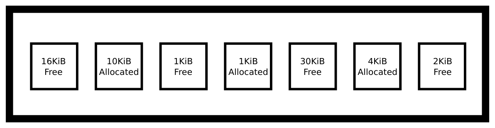
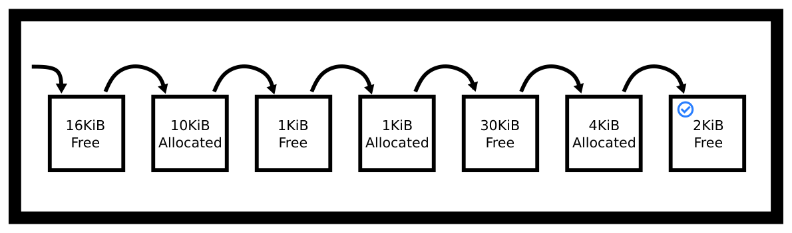
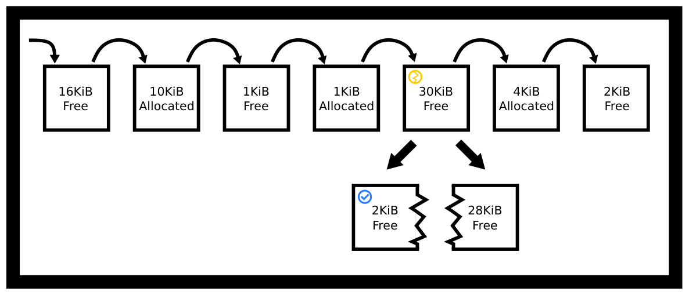
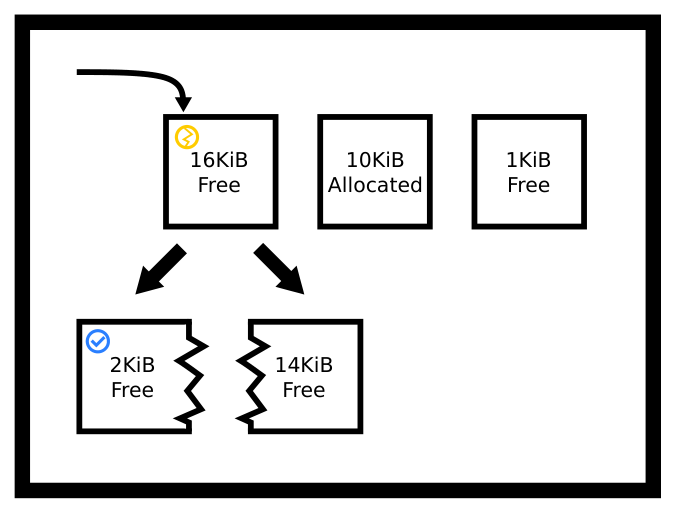
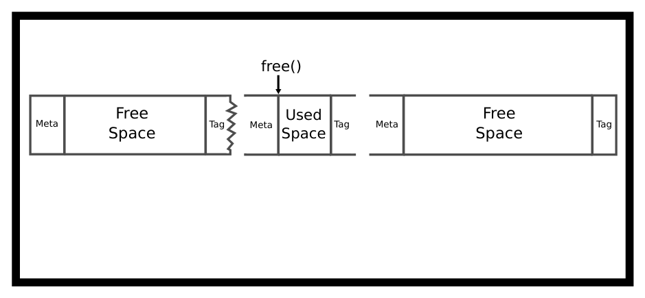
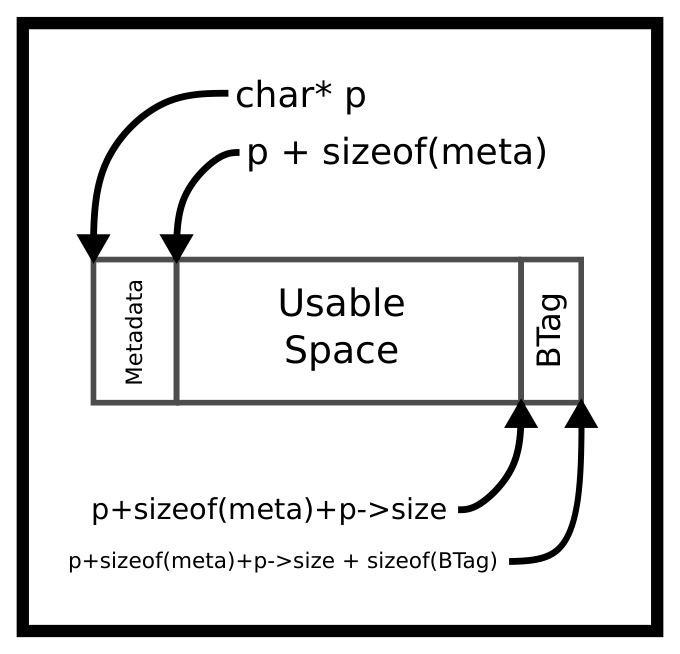
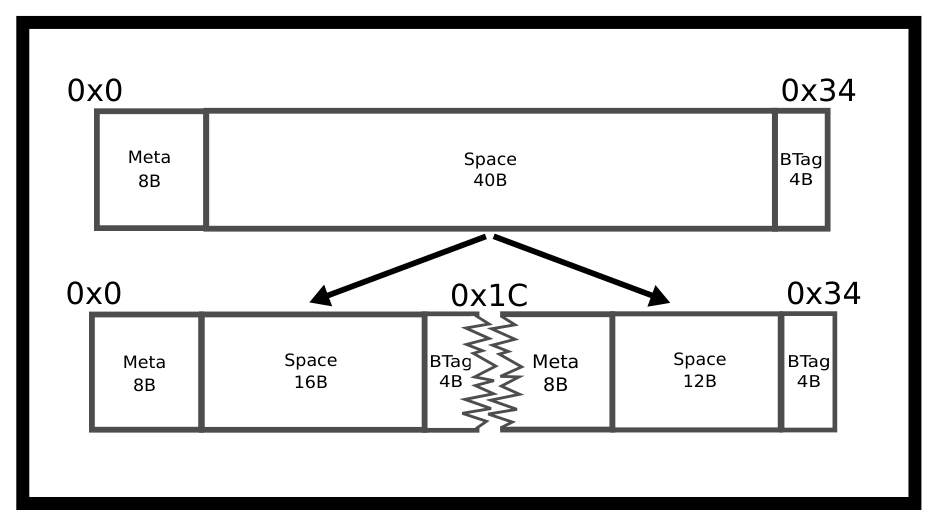
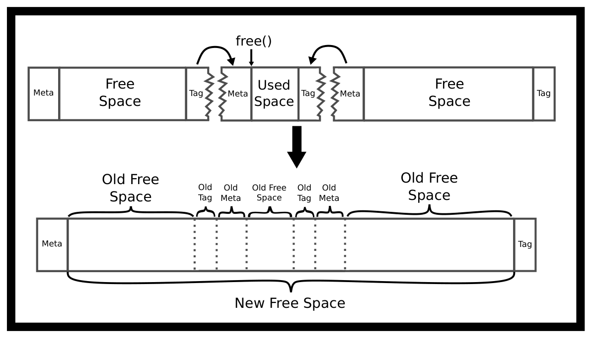
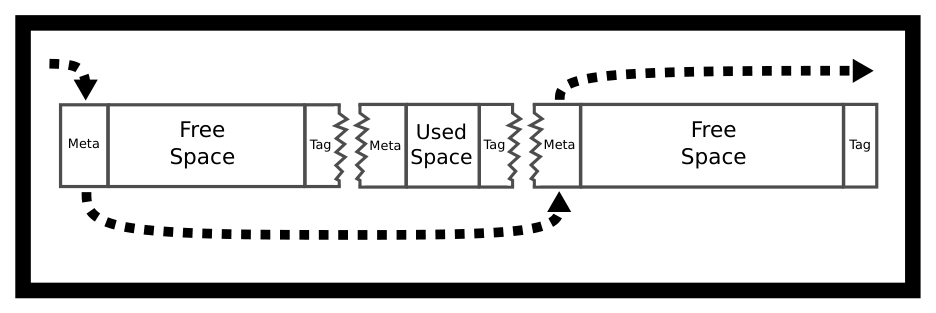
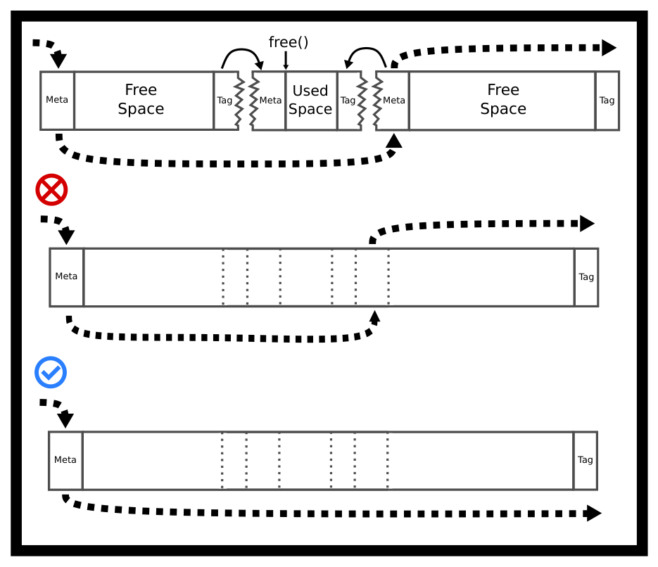

# Chương 5. Bộ cấp phát bộ nhớ (Memory Allocators)

> Bản dịch tiếng Việt từ *System Programming Coursebook* (University of Illinois, CS 241) — B. Venkatesh, L. Angrave et al. Tài liệu gốc được phát hành theo giấy phép [CC BY 4.0](https://creativecommons.org/licenses/by/4.0/); bản dịch giữ nguyên giấy phép này. Nguồn: https://github.com/illinois-cs241/coursebook

> *Bộ nhớ, bộ nhớ ở khắp mọi nơi, mà chẳng cấp phát nổi một lần.*
>
> — Một heap bị phân mảnh

## 5.1 Giới thiệu (Introduction)

Cấp phát bộ nhớ rất quan trọng! Cấp phát và giải phóng bộ nhớ heap là một trong những thao tác phổ biến nhất trong bất kỳ ứng dụng nào. Ở cấp hệ thống, heap là một dãy địa chỉ liên tục mà chương trình có thể mở rộng hoặc thu hẹp và sử dụng tùy ý [2]. Trong POSIX, điểm cuối này được gọi là system break (điểm ngắt hệ thống). Chúng ta dùng `sbrk` để di chuyển system break. Hầu hết các chương trình không tương tác trực tiếp với lời gọi này; chúng dùng một hệ thống cấp phát bộ nhớ bao quanh nó để lo việc chia nhỏ bộ nhớ thành từng khối và theo dõi phần nào đã được cấp phát, phần nào đã được giải phóng.

Chúng ta sẽ chủ yếu tìm hiểu các bộ cấp phát (allocator) đơn giản. Chỉ cần biết rằng còn có những cách khác để chia bộ nhớ, chẳng hạn dùng `mmap`, hoặc các sơ đồ và phương pháp cấp phát khác như jemalloc.

## 5.2 API cấp phát bộ nhớ của C (C Memory Allocation API)

- `malloc(size_t bytes)` là một lời gọi thư viện C, dùng để dành riêng một khối bộ nhớ liên tục mà nội dung có thể chưa được khởi tạo [4, tr. 348]. Khác với bộ nhớ trên stack, vùng nhớ này vẫn được giữ cấp phát cho đến khi `free` được gọi với cùng con trỏ đó. `malloc` chỉ có thể hoặc trả về một con trỏ tới ít nhất lượng không gian trống đã yêu cầu, hoặc trả về `NULL`. Điều đó có nghĩa là `malloc` có thể trả về `NULL` ngay cả khi vẫn còn một ít không gian. Chương trình vững chắc nên kiểm tra giá trị trả về. Nếu code của bạn giả định `malloc` luôn thành công mà thực tế không phải vậy, chương trình của bạn nhiều khả năng sẽ sập (segfault) khi cố ghi vào địa chỉ 0. Ngoài ra, vì lý do hiệu năng, `malloc` để lại dữ liệu rác trong bộ nhớ — hãy kiểm tra code để chắc chắn mọi giá trị trong chương trình đều được khởi tạo.

- `realloc(void *space, size_t bytes)` cho phép chương trình thay đổi kích thước một vùng nhớ đã được cấp phát trước đó trên heap (qua `malloc`, `calloc` hoặc `realloc`) [4, tr. 349]. Cách dùng phổ biến nhất của `realloc` là thay đổi kích thước vùng nhớ chứa một mảng các giá trị. Có hai điểm dễ mắc bẫy với `realloc`. Một, nó có thể trả về một con trỏ mới. Hai, nó có thể thất bại. Dưới đây là một phiên bản `realloc` ngây thơ nhưng dễ đọc, kèm ví dụ sử dụng.

```c
void * realloc(void * ptr, size_t newsize) {
  // Simple implementation always reserves more memory
  // and has no error checking
  void *result = malloc(newsize);
  size_t oldsize = ... //(depends on allocator's internal data structure)
  if (ptr) memcpy(result, ptr, newsize < oldsize ? newsize : oldsize);
  free(ptr);
  return result;
}

int main() {
  // 1
  int *array = malloc(sizeof(int) * 2);
  array[0] = 10; array[1] = 20;
  // Oops need a bigger array - so use realloc..
  array = realloc(array, 3 * sizeof(int));
  array[2] = 30;

}
```

Đoạn code trên rất mong manh. Nếu `realloc` thất bại thì chương trình sẽ rò rỉ bộ nhớ (memory leak). Code vững chắc phải kiểm tra giá trị trả về và chỉ gán lại con trỏ ban đầu khi giá trị đó khác `NULL`.

```c
int main() {
  // 1
  int *array = malloc(sizeof(int) * 2);
  array[0] = 10; array[1] = 20;
  void *tmp = realloc(array, 3 * sizeof(int));
  if (tmp == NULL) {
    // Nothing to do here.
  } else if (tmp == array) {
    // realloc returned same space
    array[2] = 30;
  } else {
    // realloc returned different space
    array = tmp;
    array[2] = 30;
  }

}
```

- `calloc(size_t nmemb, size_t size)` khởi tạo nội dung bộ nhớ về không và nhận hai đối số: số phần tử và kích thước tính bằng byte của mỗi phần tử. Một thảo luận nâng cao về những hạn chế này có trong bài viết này. Lập trình viên thường dùng `calloc` thay vì gọi `memset` một cách tường minh sau `malloc` để đặt nội dung bộ nhớ về không, bởi vì `calloc` đã tính đến một số cân nhắc về hiệu năng. Lưu ý `calloc(x,y)` giống hệt `calloc(y,x)`, nhưng bạn nên tuân theo quy ước trong tài liệu hướng dẫn (manual). Dưới đây là một cài đặt ngây thơ của `calloc`.

```c
void *calloc(size_t n, size_t size) {
  size_t total = n * size; // Does not check for overflow!
  void *result = malloc(total);

  if (!result) return NULL;

  // If we're using new memory pages
  // allocated from the system by calling sbrk
  // then they will be zero so zero-ing out is unnecessary,
  // We will be non-robust and memset either way.
  return memset(result, 0, total);
}
```

- `free` nhận một con trỏ tới điểm đầu của một vùng nhớ và làm cho vùng nhớ đó sẵn sàng để dùng lại trong các lời gọi tiếp theo tới các hàm cấp phát khác. Điều này quan trọng vì chúng ta không muốn mỗi process trong không gian địa chỉ của mình chiếm một lượng bộ nhớ khổng lồ. Khi đã dùng xong bộ nhớ, chúng ta ngừng dùng nó bằng `free`. Dưới đây là một cách dùng đơn giản.

```c
int *ptr = malloc(sizeof(*ptr));
do_something(ptr);
free(ptr);
```

  Nếu chương trình dùng một vùng nhớ sau khi nó đã được giải phóng — đó là hành vi không xác định (undefined behavior).

### 5.2.1 Heap và sbrk (Heaps and sbrk)

Heap là một phần của bộ nhớ process và có kích thước thay đổi. Việc cấp phát bộ nhớ heap được thư viện C thực hiện khi chương trình gọi `malloc` (`calloc`, `realloc`) và `free`. Bằng cách gọi `sbrk`, thư viện C có thể tăng kích thước heap khi chương trình của bạn cần thêm bộ nhớ heap. Vì heap và stack đều cần lớn lên, chúng ta đặt chúng ở hai đầu đối diện của không gian địa chỉ. Stack không lớn lên theo kiểu heap; các phần stack mới được cấp phát cho các thread mới. Với các kiến trúc thông dụng, heap lớn lên theo hướng địa chỉ tăng còn stack lớn lên theo hướng địa chỉ giảm.

Ngày nay, các bộ cấp phát bộ nhớ của hệ điều hành hiện đại không còn cần `sbrk` nữa. Thay vào đó, chúng có thể yêu cầu các vùng bộ nhớ ảo độc lập và duy trì nhiều vùng bộ nhớ cùng lúc. Chẳng hạn, các yêu cầu cỡ gibibyte có thể được đặt ở một vùng nhớ khác với các yêu cầu cấp phát nhỏ. Tuy nhiên, chi tiết này là một sự phức tạp không mong muốn.

Các chương trình thường không cần gọi `brk` hay `sbrk`, mặc dù gọi `sbrk(0)` có thể khá thú vị vì nó cho chương trình biết heap của bạn hiện kết thúc ở đâu. Thay vào đó, chương trình dùng `malloc`, `calloc`, `realloc` và `free` — các hàm thuộc thư viện C. Cài đặt bên trong của các hàm này có thể gọi `sbrk` khi cần thêm bộ nhớ heap.

```c
void *top_of_heap = sbrk(0);
malloc(16384);
void *top_of_heap2 = sbrk(0);
printf("The top of heap went from %p to %p \n", top_of_heap, top_of_heap2);
// Example output: The top of heap went from 0x4000 to 0xa000
```

Lưu ý rằng phần bộ nhớ mới nhận được từ hệ điều hành phải được xóa về không. Nếu hệ điều hành để nguyên nội dung RAM vật lý, một process có thể biết được nội dung bộ nhớ của một process khác từng dùng vùng nhớ đó trước đây. Đó sẽ là một lỗ hổng rò rỉ bảo mật. Đáng tiếc, điều này có nghĩa là với các yêu cầu `malloc` trước khi có bất kỳ vùng nhớ nào được giải phóng, nội dung thường là không. Đây là điều đáng tiếc vì nhiều lập trình viên viết nhầm những chương trình C giả định rằng bộ nhớ được cấp phát luôn bằng không.

```c
char* ptr = malloc(300);
// contents is probably zero because we get brand new memory
// so beginner programs appear to work!
// strcpy(ptr, "Some data"); // work with the data
free(ptr);
// later
char *ptr2 = malloc(300); // Contents might now contain existing data and is probably not zero
```

## 5.3 Nhập môn cấp phát (Intro to Allocating)

Hãy thử viết `malloc`. Đây là nỗ lực đầu tiên của chúng ta — phiên bản ngây thơ.

```c
void* malloc(size_t size)
{
    // Ask the system for more bytes by extending the heap space.
    // sbrk returns -1 on failure
    void *p = sbrk(size);
    if(p == (void *) -1) return NULL; // No space left
    return p;
}
void free() {/* Do nothing */}
```

Trên đây là cài đặt đơn giản nhất của `malloc`, tuy nhiên nó có vài nhược điểm.

- System call chậm hơn so với lời gọi thư viện. Chúng ta nên dành sẵn một lượng lớn bộ nhớ và chỉ thỉnh thoảng mới xin thêm từ hệ thống.

- Không tái sử dụng bộ nhớ đã giải phóng. Chương trình của chúng ta không bao giờ dùng lại bộ nhớ heap — nó cứ liên tục đòi một heap lớn hơn.

Nếu bộ cấp phát này được dùng trong một chương trình thông thường, process sẽ nhanh chóng cạn kiệt toàn bộ bộ nhớ khả dụng. Thay vào đó, chúng ta cần một bộ cấp phát có thể dùng không gian heap một cách hiệu quả và chỉ xin thêm bộ nhớ khi cần thiết. Tuy nhiên, một số chương trình vẫn dùng kiểu bộ cấp phát này. Hãy xét một trò chơi điện tử cấp phát các đối tượng để nạp cảnh tiếp theo. Làm như trên rồi vứt bỏ toàn bộ khối bộ nhớ sẽ nhanh hơn đáng kể so với việc thực hiện các chiến lược đặt chỗ (placement strategy) dưới đây.

### 5.3.1 Các chiến lược đặt chỗ (Placement Strategies)

Trong quá trình chương trình chạy, bộ nhớ được cấp phát và giải phóng, nên sẽ xuất hiện những khoảng trống trong bộ nhớ heap có thể được tái sử dụng cho các yêu cầu bộ nhớ sau này. Bộ cấp phát bộ nhớ cần theo dõi phần nào của heap hiện đang được cấp phát và phần nào đang sẵn sàng. Giả sử kích thước heap hiện tại của chúng ta là 64K. Giả sử heap của chúng ta trông như bảng sau.



*Hình 5.1: Các khối heap trống*

Nếu một yêu cầu `malloc` mới cỡ 2KiB được thực hiện (`malloc(2048)`), `malloc` nên dành chỗ ở đâu? Nó có thể dùng khoảng trống (hole) 2KiB cuối cùng — tình cờ vừa khít một cách hoàn hảo! Hoặc nó có thể tách một trong hai khoảng trống còn lại. Những lựa chọn này thể hiện các chiến lược đặt chỗ khác nhau. Dù chọn khoảng trống nào, bộ cấp phát cũng sẽ cần tách khoảng trống đó thành hai phần: phần không gian mới cấp phát sẽ được trả về cho chương trình, và một khoảng trống nhỏ hơn nếu còn dư chỗ. Chiến lược vừa khít nhất (perfect-fit) tìm khoảng trống nhỏ nhất có kích thước đủ lớn (ít nhất 2KiB):



*Hình 5.2: Best fit tìm được khối vừa khít*

Chiến lược worst-fit tìm khoảng trống lớn nhất có kích thước đủ lớn, do đó tách khoảng trống 30KiB thành hai:



*Hình 5.3: Worst fit tìm khối tệ nhất*

Chiến lược first-fit tìm khoảng trống đầu tiên có kích thước đủ lớn, do đó tách khoảng trống 16KiB thành hai. Chúng ta thậm chí không cần duyệt qua toàn bộ heap!



*Hình 5.4: First fit tìm khối phù hợp đầu tiên*

Một điều cần ghi nhớ là các chiến lược đặt chỗ này không nhất thiết phải tách khối. Chẳng hạn, bộ cấp phát first fit của chúng ta có thể trả về nguyên khối ban đầu mà không tách. Lưu ý rằng điều này dẫn đến khoảng 14KiB không gian không được dùng bởi cả người dùng lẫn bộ cấp phát. Chúng ta gọi đó là phân mảnh trong (internal fragmentation).

Ngược lại, phân mảnh ngoài (external fragmentation) là tình huống dù chúng ta có đủ bộ nhớ trong heap, nó có thể bị chia cắt theo cách khiến không có khối liên tục nào với kích thước đó. Trong ví dụ trước, trong 64KiB bộ nhớ heap, 17KiB đã được cấp phát và 47KiB còn trống. Tuy nhiên, khối khả dụng lớn nhất chỉ là 30KiB vì phần bộ nhớ heap chưa cấp phát của chúng ta bị phân mảnh thành các mảnh nhỏ hơn.

### 5.3.2 Ưu và nhược điểm của các chiến lược đặt chỗ (Placement Strategy Pros and Cons)

Những thách thức khi viết một bộ cấp phát heap là:

- Cần giảm thiểu phân mảnh (tức là tối đa hóa mức sử dụng bộ nhớ)

- Cần hiệu năng cao

- Cài đặt rắc rối — rất nhiều thao tác con trỏ với danh sách liên kết và số học con trỏ.

- Cả phân mảnh lẫn hiệu năng đều phụ thuộc vào hồ sơ cấp phát (allocation profile) của ứng dụng, thứ có thể đánh giá được nhưng không dự đoán được; và trên thực tế, trong những điều kiện sử dụng cụ thể, một bộ cấp phát chuyên dụng thường có thể vượt trội hơn một cài đặt đa dụng.

- Bộ cấp phát không biết trước các yêu cầu cấp phát bộ nhớ của chương trình. Mà kể cả có biết trước, đây chính là bài toán cái túi (Knapsack problem), vốn được biết là NP-hard!

Các chiến lược khác nhau ảnh hưởng đến sự phân mảnh của bộ nhớ heap theo những cách không hiển nhiên, chỉ được phát hiện qua phân tích toán học hoặc mô phỏng cẩn thận trong điều kiện thực tế (ví dụ mô phỏng các yêu cầu cấp phát bộ nhớ của một cơ sở dữ liệu hay một web server).

Trước hết, chúng ta xét một cách tiếp cận thiên về toán học hơn, theo kiểu "một lần" (one-shot), với từng thuật toán này [3]. Bài báo mô tả một kịch bản trong đó bạn có một số lượng thùng (bin) nhất định và một số lượng cấp phát nhất định, và bạn cố gắng xếp các cấp phát vào càng ít thùng càng tốt, tức là dùng càng ít bộ nhớ càng tốt. Bài báo thảo luận các hệ quả lý thuyết và đưa ra một giới hạn đẹp cho tỷ lệ về lâu dài giữa mức sử dụng bộ nhớ lý tưởng và mức sử dụng bộ nhớ thực tế. Với những ai quan tâm, bài báo kết luận rằng tỷ số giữa mức dùng bộ nhớ thực tế và mức dùng bộ nhớ lý tưởng khi số thùng tăng lên — các thùng có thể theo phân bố bất kỳ — vào khoảng 1,7 với First-Fit và bị chặn dưới bởi 1,7 với best fit. Vấn đề của phân tích này là rất ít ứng dụng thực tế cần kiểu cấp phát một lần như vậy. Việc cấp phát đối tượng trong trò chơi điện tử thường sẽ dành riêng một heap con (subheap) khác nhau cho mỗi màn chơi và lấp đầy heap con đó nếu chúng cần một sơ đồ cấp phát bộ nhớ nhanh mà có thể vứt bỏ.

Trên thực tế, chúng ta sẽ dùng kết quả từ một khảo sát nghiêm ngặt hơn được thực hiện năm 2005 [7]. Khảo sát này lưu ý rõ rằng cấp phát bộ nhớ là một mục tiêu di động. Một sơ đồ cấp phát tốt cho chương trình này có thể không tốt cho chương trình khác. Các chương trình không tuân theo phân bố cấp phát một cách đồng đều. Khảo sát bàn về tất cả các sơ đồ cấp phát mà chúng ta đã giới thiệu cùng một vài sơ đồ khác nữa. Dưới đây là một số kết luận được tóm tắt:

1. Best fit có thể gặp vấn đề khi khối được chọn có kích thước gần đúng, và phần không gian còn lại sau khi tách quá nhỏ đến mức chương trình có lẽ sẽ không dùng đến. Một cách khắc phục là đặt một ngưỡng cho việc tách khối. Kiểu tách nhỏ này không được quan sát thấy thường xuyên với tải làm việc thông thường. Ngoài ra, hành vi trong trường hợp xấu nhất của Best-Fit là tệ, nhưng nó thường không xảy ra [tr. 43].

2. Khảo sát cũng nói về một phân biệt quan trọng của First-Fit. Có nhiều cách hiểu về "đầu tiên". "Đầu tiên" có thể được sắp theo thời điểm `free`, hoặc có thể sắp theo địa chỉ đầu khối, hoặc sắp theo thời điểm free gần nhất — "đầu tiên" là khối ít được dùng gần đây nhất. Khảo sát không đi quá sâu vào hiệu năng của từng loại nhưng có ghi nhận rằng danh sách sắp theo địa chỉ và danh sách Least Recently Used (LRU) cho hiệu năng tốt hơn so với kiểu ưu tiên khối được dùng gần đây nhất.

3. Khảo sát kết luận bằng việc trước hết nói rằng, dưới tải làm việc ngẫu nhiên mô phỏng (giả định phân bố đều ngẫu nhiên), best fit và first fit hoạt động tốt như nhau. Ngay cả trên thực tế, cả best fit lẫn first fit sắp theo địa chỉ đều hoạt động gần như tốt ngang nhau khi có ngưỡng tách khối và gộp khối (coalescing). Nguyên nhân vì sao thì chưa hoàn toàn được biết rõ.

Một số ghi chú bổ sung của chúng tôi:

1. Best fit có thể tốn ít thời gian hơn một lượt quét toàn bộ heap. Khi tìm thấy một khối có kích thước hoàn hảo, hoặc hoàn hảo trong phạm vi một ngưỡng, khối đó có thể được trả về ngay, tùy thuộc vào chính sách xử lý trường hợp biên mà bạn chọn.

2. Worst fit cũng tương tự. Heap của bạn có thể được biểu diễn bằng cấu trúc dữ liệu max-heap, và mỗi lời gọi cấp phát chỉ cần lấy phần tử trên đỉnh ra, tái tổ chức heap (re-heapify), và có thể chèn lại một khối bộ nhớ đã tách. Tuy nhiên, dùng Fibonacci heap có thể cực kỳ kém hiệu quả.

3. First-Fit cần có một thứ tự khối. Phần lớn thời gian lập trình viên sẽ mặc định chọn danh sách liên kết, và đó là một lựa chọn ổn. Không có nhiều cải tiến bạn có thể làm với chính sách danh sách liên kết kiểu ít dùng gần đây nhất (LRU) hay dùng gần đây nhất (MRU), nhưng với danh sách liên kết sắp theo địa chỉ, bạn có thể tăng tốc việc chèn từ $O(n)$ lên $O(\log n)$ bằng cách dùng một skip list ngẫu nhiên kết hợp với danh sách liên kết đơn của mình. Thao tác chèn sẽ dùng skip list như các lối tắt để tìm đúng vị trí chèn khối, còn thao tác xóa sẽ đi qua danh sách như bình thường.

4. Còn nhiều chiến lược đặt chỗ mà chúng ta chưa bàn tới; một trong số đó là next-fit, tức là first fit nhưng bắt đầu tìm từ khối kế tiếp khối vừa được chọn. Cách này thêm vào một sự "ngẫu nhiên có tính tất định" — xin thứ lỗi cho cách nói nghịch hợp này. Bạn sẽ không bị đòi hỏi phải biết thuật toán này; chỉ cần biết rằng khi bạn cài đặt một bộ cấp phát bộ nhớ trong bài tập lớn (machine problem), còn có nhiều chiến lược hơn thế nữa.

## 5.4 Hướng dẫn xây dựng bộ cấp phát bộ nhớ (Memory Allocator Tutorial)

Một bộ cấp phát bộ nhớ cần theo dõi những byte nào hiện đang được cấp phát và những byte nào sẵn sàng để dùng. Mục này giới thiệu các chi tiết về cài đặt và khái niệm khi xây dựng một bộ cấp phát, hay chính là đoạn code thực sự cài đặt `malloc` và `free`.

Về mặt khái niệm, chúng ta đang nghĩ đến việc tạo ra các danh sách liên kết và danh sách các khối! Mời bạn thưởng thức hình vẽ ASCII sau đây. `bt` là viết tắt của boundary tag (thẻ biên).



*Hình 5.5: Ba khối bộ nhớ liền kề*

Chúng ta sẽ có các con trỏ ngầm (implicit pointer) tới khối kế tiếp, nghĩa là có thể đi từ khối này sang khối khác bằng phép cộng. Điều này trái ngược với việc có một trường metadata `*next` tường minh trong khối meta của chúng ta.



*Hình 5.6: Phép cộng địa chỉ trong malloc*

Ta có thể lấy được khối kế tiếp bằng cách tìm điểm cuối của khối hiện tại. Đó chính là ý nghĩa của "implicit list" (danh sách ngầm).

Khoảng cách thực tế có thể khác. Metadata có thể chứa nhiều thứ khác nhau. Một cài đặt metadata tối thiểu chỉ đơn giản chứa kích thước của khối.

Vì chúng ta ghi các số nguyên và con trỏ vào vùng bộ nhớ mà mình đã kiểm soát, nên sau đó có thể nhảy một cách nhất quán từ địa chỉ này sang địa chỉ kế. Thông tin nội bộ này là một dạng chi phí phụ trội (overhead). Nghĩa là ngay cả khi chúng ta đã xin từ hệ thống 1024 KiB bộ nhớ liên tục, một yêu cầu cấp phát đúng kích thước đó vẫn sẽ thất bại.

Bộ nhớ heap của chúng ta là một danh sách các khối, mỗi khối hoặc đã được cấp phát hoặc chưa. Do đó về mặt khái niệm có một danh sách các khối rỗng (free list), nhưng nó tồn tại ngầm dưới dạng thông tin kích thước khối mà chúng ta lưu như một phần của mỗi khối. Hãy nghĩ về nó qua một cài đặt đơn giản.

```c
typedef struct {
  size_t block_size;
  char data[0];
} block;
block *p = sbrk(100);
p->size = 100 - sizeof(*p) - sizeof(BTag);
// Other block allocations
```

Chúng ta có thể đi từ khối này sang khối kế tiếp bằng cách cộng thêm kích thước của khối.

```c
p + sizeof(metadata) + p->block_size + sizeof(BTag)
```

Hãy chắc chắn bạn ép kiểu (cast) đúng! Nếu không, chương trình sẽ dịch chuyển đi một lượng byte khổng lồ.

Chương trình gọi không bao giờ nhìn thấy các giá trị này. Chúng là nội bộ của cài đặt bộ cấp phát bộ nhớ. Ví dụ, giả sử bộ cấp phát của bạn được yêu cầu dành 80 byte (`malloc(80)`) và cần 8 byte dữ liệu header nội bộ. Bộ cấp phát sẽ cần tìm một vùng chưa cấp phát có ít nhất 88 byte. Sau khi cập nhật dữ liệu heap, nó sẽ trả về một con trỏ tới khối. Tuy nhiên, con trỏ trả về phải trỏ tới phần không gian sử dụng được, chứ không phải phần dữ liệu nội bộ! Thay vào đó, chúng ta sẽ trả về địa chỉ đầu khối + 8 byte. Khi cài đặt, hãy nhớ rằng số học con trỏ phụ thuộc vào kiểu. Ví dụ, `p += 8` cộng thêm `8 * sizeof(p)`, không nhất thiết là 8 byte!

### 5.4.1 Cài đặt một bộ cấp phát bộ nhớ (Implementing a Memory Allocator)

Cài đặt đơn giản nhất dùng First-Fit. Bắt đầu từ khối đầu tiên (giả sử nó tồn tại) và lặp cho đến khi tìm thấy một khối biểu diễn vùng chưa cấp phát có kích thước đủ lớn, hoặc đã kiểm tra hết mọi khối. Nếu không tìm thấy khối phù hợp, đã đến lúc gọi `sbrk()` lần nữa để mở rộng kích thước heap cho đủ. Trong môn học này, chúng ta sẽ cố gắng phục vụ mọi yêu cầu bộ nhớ cho đến khi hệ điều hành báo rằng chúng ta sắp hết không gian heap. Các ứng dụng khác có thể tự giới hạn ở một kích thước heap nhất định và khiến các yêu cầu thỉnh thoảng thất bại. Ngoài ra, một cài đặt nhanh có thể mở rộng heap một lượng đáng kể để chúng ta sớm không phải xin thêm bộ nhớ heap nữa.

Khi tìm thấy một khối rỗng, nó có thể lớn hơn không gian ta cần. Nếu vậy, chúng ta sẽ tạo hai mục trong implicit list của mình. Mục thứ nhất là khối đã cấp phát, mục thứ hai là phần không gian còn lại. Có nhiều cách để làm điều này nếu chương trình muốn giữ overhead nhỏ. Chúng tôi khuyên trước hết hãy ưu tiên tính dễ đọc.

```c
typedef struct {
  size_t block_size;
  int is_free;
  char data[0];
} block;
block *p = sbrk(100);
p->size = 100 - sizeof(*p) - sizeof(boundary_tag);
// Other block allocations
```

Nếu chương trình muốn một số bit nhất định lưu các mẩu thông tin khác nhau, hãy dùng bit field!

```c
typedef struct {
  unsigned int block_size : 7;
  unsigned int is_free : 1;
} size_free;

typedef struct {
  size_free info;
  char data[0];
} block;
```

Trình biên dịch sẽ lo việc dịch bit. Sau khi thiết lập xong các trường, mọi việc chỉ còn là lặp qua từng khối và kiểm tra các trường thích hợp.

Dưới đây là hình minh họa những gì xảy ra. Giả sử chúng ta có một khối như hình, và muốn tách khi yêu cầu cấp phát là, chẳng hạn, 16 byte. Phép tách chúng ta phải thực hiện sẽ như sau.



*Hình 5.7: Tách khối trong malloc*

Đây là trước khi xét đến các vấn đề căn chỉnh (alignment).

### 5.4.2 Các cân nhắc về căn chỉnh và làm tròn lên (Alignment and rounding up considerations)

Nhiều kiến trúc yêu cầu các kiểu nguyên thủy nhiều byte phải được căn chỉnh (align) theo một bội số nào đó của 2 (4, 16, v.v.). Chẳng hạn, thường gặp yêu cầu các kiểu 4 byte phải được căn theo biên 4 byte và các kiểu 8 byte theo biên 8 byte. Nếu các kiểu nguyên thủy nhiều byte được lưu ở một biên không hợp lý, hiệu năng có thể bị ảnh hưởng đáng kể vì có thể cần thêm một lần đọc bộ nhớ. Trên một số kiến trúc, hình phạt còn nặng hơn — chương trình sẽ sập với lỗi bus error. Phần lớn các bạn đã trải nghiệm điều này trong môn kiến trúc máy tính nếu không có cơ chế bảo vệ bộ nhớ.

Vì `malloc` không biết người dùng sẽ dùng vùng nhớ được cấp phát như thế nào, con trỏ trả về cho chương trình cần được căn chỉnh cho trường hợp xấu nhất, và điều này phụ thuộc vào kiến trúc.

Theo tài liệu của glibc, `malloc` của glibc dùng heuristic sau [1]:

> Khối mà `malloc` trả cho bạn được đảm bảo căn chỉnh sao cho có thể chứa bất kỳ kiểu dữ liệu nào. Trên các hệ thống GNU, địa chỉ luôn là bội số của tám trên hầu hết các hệ thống và bội số của 16 trên các hệ thống 64-bit. Ví dụ, nếu bạn cần tính xem cần bao nhiêu đơn vị 16 byte, đừng quên làm tròn lên.

Đây là phép toán tương ứng trong C.

```c
int s = (requested_bytes + tag_overhead_bytes + 15) / 16
```

Hằng số cộng thêm đảm bảo các đơn vị chưa đầy sẽ được làm tròn lên. Lưu ý, code thực tế nhiều khả năng dùng các ký hiệu kích thước, ví dụ `sizeof(x) - 1`, thay vì viết cứng hằng số 15. Nếu bạn muốn tìm hiểu thêm, đây là một bài viết rất hay về căn chỉnh bộ nhớ.

Một hệ quả phụ nữa là phân mảnh trong xảy ra khi khối được cấp lớn hơn kích thước yêu cầu cấp phát. Giả sử chúng ta có một khối rỗng kích thước 16B (không tính metadata). Nếu người dùng cấp phát 7 byte, bộ cấp phát có thể muốn làm tròn lên 16B và trả về toàn bộ khối. Điều này trở nên nguy hiểm khi cài đặt gộp khối và tách khối. Nếu bộ cấp phát không cài đặt cả hai thao tác đó, nó có thể rốt cuộc trả về một khối 64B cho một yêu cầu cấp phát 7B! Đó là một overhead rất lớn cho lần cấp phát này, đúng thứ mà chúng ta đang cố tránh.

### 5.4.3 Cài đặt free (Implementing free)

Khi `free` được gọi, chúng ta cần áp dụng lại độ dời (offset) để quay về điểm đầu "thật" của khối — nơi ta đã lưu thông tin kích thước. Một cài đặt ngây thơ sẽ chỉ đơn giản đánh dấu khối là không dùng. Nếu chúng ta lưu trạng thái cấp phát của khối trong một bitfield, thì cần xóa bit đó:

```c
p->info.is_free = 0;
```

Tuy nhiên, chúng ta còn một chút việc phải làm nữa. Nếu khối hiện tại và khối kế tiếp (nếu tồn tại) đều rỗng, ta cần gộp (coalesce) chúng thành một khối duy nhất. Tương tự, chúng ta cũng cần kiểm tra khối liền trước. Nếu nó tồn tại và biểu diễn một vùng nhớ chưa cấp phát, thì ta cần gộp các khối thành một khối lớn duy nhất.

Để có thể gộp một khối rỗng với khối rỗng liền trước, chúng ta cũng cần tìm được khối liền trước, nên ta lưu kích thước khối ở cả cuối khối nữa. Chúng được gọi là "boundary tag" [5]. Đây là giải pháp của Knuth cho bài toán gộp khối theo cả hai chiều. Vì các khối nằm liền kề nhau, điểm cuối của khối này nằm ngay cạnh điểm đầu của khối kế tiếp. Do đó khối hiện tại (trừ khối đầu tiên) có thể nhìn lùi lại vài byte để tra kích thước của khối liền trước. Với thông tin này, bộ cấp phát giờ có thể nhảy ngược lại!

Lấy ví dụ một phép gộp hai phía (double coalesce). Nếu muốn giải phóng khối ở giữa, chúng ta cần biến các khối xung quanh thành một khối lớn.



*Hình 5.8: Gộp hai phía khi free*

### 5.4.4 Hiệu năng (Performance)

Với mô tả trên, hoàn toàn có thể xây dựng một bộ cấp phát bộ nhớ. Ưu điểm chính của nó là tính đơn giản — ít nhất là đơn giản so với các bộ cấp phát khác! Cấp phát bộ nhớ là một thao tác có thời gian tuyến tính trong trường hợp xấu nhất — tìm kiếm trong danh sách liên kết một khối rỗng đủ lớn. Giải phóng bộ nhớ có thời gian hằng số. Không bao giờ cần gộp quá 3 khối thành một khối duy nhất, và nếu dùng sơ đồ khối được dùng gần đây nhất thì chỉ cần cập nhật một mục trong danh sách liên kết.

Với bộ cấp phát này, ta có thể thử nghiệm các chiến lược đặt chỗ khác nhau. Chẳng hạn, bộ cấp phát có thể bắt đầu tìm kiếm từ khối được giải phóng gần nhất. Nếu bộ cấp phát lưu các con trỏ tới khối, nó cần cập nhật các con trỏ đó để chúng luôn hợp lệ.

### 5.4.5 Bộ cấp phát dùng explicit free list (Explicit Free Lists Allocators)

Có thể đạt hiệu năng tốt hơn bằng cách cài đặt một danh sách liên kết đôi tường minh (explicit doubly-linked list) gồm các nút rỗng. Khi đó, ta có thể đi ngay tới khối rỗng kế tiếp và khối rỗng liền trước. Điều này có thể giảm thời gian tìm kiếm vì danh sách liên kết chỉ gồm các khối chưa cấp phát. Ưu điểm thứ hai là giờ chúng ta có phần nào quyền kiểm soát thứ tự của danh sách liên kết. Chẳng hạn, khi một khối được giải phóng, ta có thể chọn chèn nó vào đầu danh sách liên kết thay vì luôn đặt giữa hai khối láng giềng. Ta có thể cập nhật struct của mình như sau:

```c
typedef struct {
  size_t info;
  struct block *next;
  char data[0];
} block;
```

Dưới đây là hình dạng của nó cùng với implicit linked list của chúng ta:



*Hình 5.9: Danh sách rỗng (free list)*

Chúng ta lưu các con trỏ của danh sách liên kết ở đâu? Một mẹo đơn giản là nhận ra rằng bản thân khối đó không được sử dụng, nên có thể lưu các con trỏ next và previous ngay bên trong khối; tuy nhiên bạn phải đảm bảo các khối rỗng luôn đủ lớn để chứa hai con trỏ. Chúng ta vẫn cần cài đặt boundary tag để có thể giải phóng khối đúng cách và gộp chúng với hai khối láng giềng. Do đó, explicit free list đòi hỏi nhiều code và độ phức tạp hơn. Với danh sách liên kết tường minh, thuật toán "Find-First" nhanh và đơn giản được dùng để tìm liên kết đầu tiên đủ lớn. Tuy nhiên, vì thứ tự liên kết có thể thay đổi, điều này tương ứng với các chiến lược đặt chỗ khác nhau. Nếu các liên kết được duy trì theo thứ tự từ lớn nhất đến nhỏ nhất, ta sẽ có chiến lược đặt chỗ "Worst-Fit".

Tuy vậy vẫn có các trường hợp biên; hãy nghĩ xem bạn duy trì free list của mình thế nào khi đồng thời gộp hai phía. Chúng tôi đính kèm một hình minh họa một lỗi thường gặp.



*Hình 5.10: Gộp khối đúng và sai với free list*

Chúng tôi khuyên rằng khi cài đặt `malloc`, bạn nên vẽ ra tất cả các trường hợp về mặt khái niệm rồi mới viết code.

#### Chính sách chèn vào danh sách liên kết tường minh (Explicit linked list insertion policy)

Khối vừa được giải phóng có thể dễ dàng chèn vào hai vị trí khả dĩ: ở đầu danh sách hoặc theo thứ tự địa chỉ. Chèn ở đầu tạo ra chính sách LIFO (last-in, first-out — vào sau, ra trước). Các vùng được giải phóng gần đây nhất sẽ được tái sử dụng. Các nghiên cứu cho thấy phân mảnh khi đó tệ hơn so với dùng thứ tự địa chỉ [7].

Chèn theo thứ tự địa chỉ ("chính sách sắp theo địa chỉ" — address ordered policy) chèn các khối đã giải phóng sao cho các khối được duyệt theo thứ tự địa chỉ tăng dần. Chính sách này cần nhiều thời gian hơn để giải phóng một khối vì phải dùng boundary tag (dữ liệu kích thước) để tìm khối chưa cấp phát kế tiếp và liền trước. Tuy nhiên, phân mảnh sẽ ít hơn.

## 5.5 Nghiên cứu tình huống: Buddy Allocator, một ví dụ về segregated list (Case Study: Buddy Allocator, an example of a segregated list)

Bộ cấp phát phân tách (segregated allocator) là bộ cấp phát chia heap thành các vùng khác nhau, được xử lý bởi các bộ cấp phát con khác nhau tùy theo kích thước của yêu cầu cấp phát. Các kích thước được gom nhóm theo lũy thừa của hai; mỗi kích thước được một bộ cấp phát con riêng xử lý và mỗi kích thước duy trì free list của riêng nó.

Một bộ cấp phát nổi tiếng thuộc loại này là buddy allocator [6, tr. 85]. Chúng ta sẽ bàn về buddy allocator nhị phân, vốn chia các cấp phát thành các khối kích thước $2^n$; $n = 1, 2, 3, \ldots$ nhân với một đơn vị cơ sở nào đó tính bằng byte; nhưng cũng tồn tại các biến thể khác như chia theo Fibonacci, trong đó kích thước cấp phát được làm tròn lên số Fibonacci kế tiếp. Ý tưởng cơ bản rất đơn giản: nếu không có khối rỗng kích thước $2^n$, đi lên cấp kế tiếp, lấy khối ở đó và tách đôi. Nếu hai khối láng giềng cùng kích thước đều trở nên chưa cấp phát, chúng có thể gộp lại thành một khối lớn duy nhất có kích thước gấp đôi.

Buddy allocator nhanh vì các khối láng giềng để gộp có thể được tính ra từ địa chỉ của khối vừa giải phóng, thay vì phải duyệt qua các thẻ kích thước. Hiệu năng tối đa thường đòi hỏi một lượng nhỏ code assembler để dùng một lệnh CPU chuyên biệt tìm bit khác không thấp nhất.

Nhược điểm chính của buddy allocator là chúng chịu phân mảnh trong, vì các cấp phát được làm tròn lên kích thước khối gần nhất. Ví dụ, một cấp phát 68 byte sẽ cần một khối 128 byte.

## 5.6 Nghiên cứu tình huống: SLUB Allocator, cấp phát slab (Case Study: SLUB Allocator, Slab allocation)

SLUB allocator là một slab allocator phục vụ những nhu cầu khác biệt của kernel Linux. Hãy tưởng tượng bạn đang tạo một bộ cấp phát cho kernel; yêu cầu của bạn là gì? Đây là một danh sách ngắn giả định.

1. Trước hết và trên hết, bạn muốn lượng bộ nhớ chiếm dụng (memory footprint) thấp để kernel có thể cài được trên mọi loại phần cứng: nhúng, máy để bàn, siêu máy tính, v.v.

2. Tiếp theo, bạn muốn bộ nhớ thực tế càng liên tục càng tốt để tận dụng cache. Mỗi lần thực hiện một system call, các trang của kernel cần được nạp vào bộ nhớ. Điều đó có nghĩa nếu chúng đều liên tục, bộ xử lý sẽ có thể cache chúng hiệu quả hơn.

3. Cuối cùng, bạn muốn các cấp phát phải nhanh.

Và thế là có SLUB allocator, `kmalloc`. SLUB allocator là bộ cấp phát dạng segregated list với rất ít tách khối và gộp khối. Điểm khác biệt ở đây là segregated list tập trung vào các kích thước cấp phát thực tế hơn, thay vì các lũy thừa của hai. SLUB cũng chú trọng lượng bộ nhớ chiếm dụng tổng thể thấp trong khi vẫn giữ các trang trong cache. Có các khối với nhiều kích thước khác nhau, và kernel làm tròn mỗi yêu cầu cấp phát lên kích thước khối nhỏ nhất thỏa mãn nó. Một trong những khác biệt lớn giữa bộ cấp phát này và các bộ cấp phát khác là nó thường tuân theo kích thước trang. Chúng ta sẽ nói về bộ nhớ ảo và trang ở một chương khác, nhưng kernel sẽ làm việc trực tiếp với các trang bộ nhớ theo từng khoảng 4 KiB hay 4096 byte.

## 5.7 Đọc thêm (Further Reading)

Các câu hỏi định hướng

- Bộ nhớ cấp phát bởi `malloc` có được khởi tạo không? Còn bộ nhớ từ `calloc` hay `realloc` thì sao?

- `realloc` nhận đối số là số phần tử hay lượng không gian (tính bằng byte)?

- Vì sao các hàm cấp phát có thể báo lỗi?

Hãy xem man page hoặc phụ lục của sách, mục 17.18.1!

- Slab Allocation

- Buddy Memory Allocation

## 5.8 Chủ đề (Topics)

- Best Fit

- Worst Fit

- First Fit

- Buddy Allocator

- Phân mảnh trong (Internal Fragmentation)

- Phân mảnh ngoài (External Fragmentation)

- `sbrk`

- Căn chỉnh tự nhiên (Natural Alignment)

- Boundary Tag

- Gộp khối (Coalescing)

- Tách khối (Splitting)

- Cấp phát slab / Memory Pool (Slab Allocation/Memory Pool)

## 5.9 Câu hỏi/Bài tập (Questions/Exercises)

- Phân mảnh trong là gì? Khi nào nó trở thành vấn đề?

- Phân mảnh ngoài là gì? Khi nào nó trở thành vấn đề?

- Chiến lược đặt chỗ Best Fit là gì? Nó thế nào đối với phân mảnh ngoài? Độ phức tạp thời gian?

- Chiến lược đặt chỗ Worst Fit là gì? Nó có khá hơn chút nào về phân mảnh ngoài không? Độ phức tạp thời gian?

- Chiến lược đặt chỗ First Fit là gì? Nó khá hơn một chút về phân mảnh, đúng không? Độ phức tạp thời gian kỳ vọng?

- Giả sử chúng ta dùng một buddy allocator với một slab mới 64kb. Nó cấp phát 1.5kb như thế nào?

- Khi nào thì cài đặt `malloc` 5 dòng bằng `sbrk` có chỗ dùng?

- Căn chỉnh tự nhiên là gì?

- Gộp khối/Tách khối là gì? Chúng làm tăng/giảm phân mảnh ra sao? Khi nào bạn có thể gộp hoặc tách?

- Boundary tag hoạt động như thế nào? Có thể dùng chúng để gộp hoặc tách ra sao?

## Tài liệu tham khảo (Bibliography)

- [1] Virtual memory allocation and paging, May 2001. URL https://ftp.gnu.org/old-gnu/Manuals/glibc-2.2.3/html_chapter/libc_3.html.

- [2] Overview of malloc, Mar 2018. URL https://sourceware.org/glibc/wiki/MallocInternals.

- [3] M. R. Garey, R. L. Graham, and J. D. Ullman. Worst-case analysis of memory allocation algorithms. In *Proceedings of the Fourth Annual ACM Symposium on Theory of Computing*, STOC '72, pages 143–150, New York, NY, USA, 1972. ACM. doi: 10.1145/800152.804907. URL http://doi.acm.org/10.1145/800152.804907.

- [4] Larry Jones. Wg14 n1539 committee draft iso/iec 9899: 201x, 2010.

- [5] D.E. Knuth. *The Art of Computer Programming: Fundamental Algorithms*. Number v. 1-2 in Addison-Wesley series in computer science and information processing. Addison-Wesley, 1973. ISBN 9780201038217. URL https://books.google.com/books?id=dC05RwAACAAJ.

- [6] C.P. Rangan, V. Raman, and R. Ramanujam. *Foundations of Software Technology and Theoretical Computer Science: 19th Conference, Chennai, India, December 13-15, 1999 Proceedings*. FOUNDATIONS OF SOFTWARE TECHNOLOGY AND THEORETICAL COMPUTER SCIENCE. Springer, 1999. ISBN 9783540668367. URL https://books.google.com/books?id=0uHME7EfjQEC.

- [7] Paul R. Wilson, Mark S. Johnstone, Michael Neely, and David Boles. Dynamic storage allocation: A survey and critical review. In Henry G. Baker, editor, *Memory Management*, pages 1–116, Berlin, Heidelberg, 1995. Springer Berlin Heidelberg. ISBN 978-3-540-45511-0.
