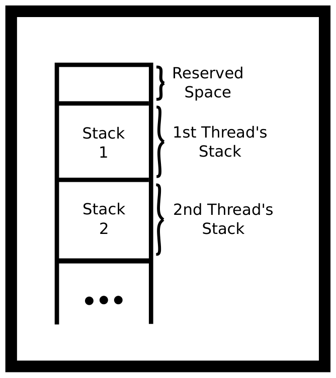
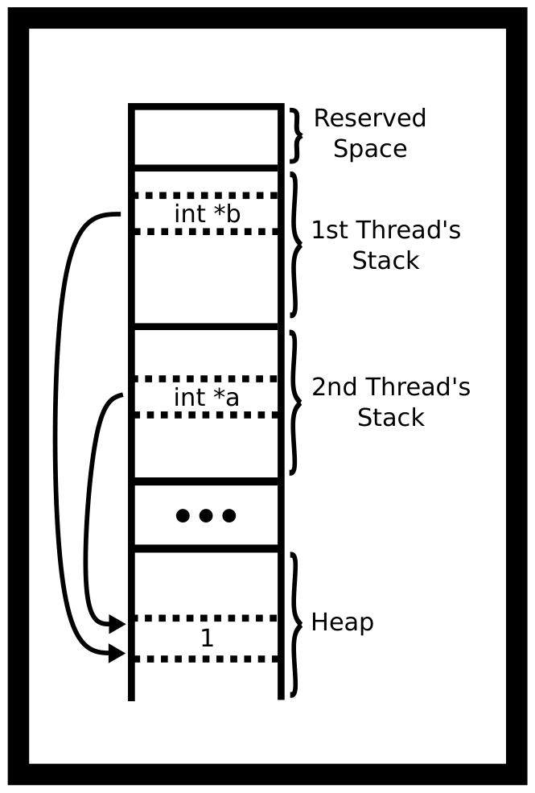
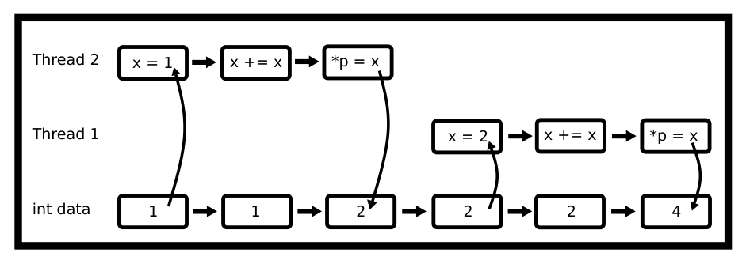
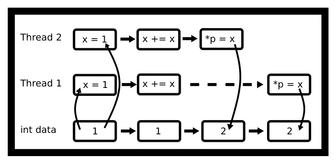

# Chương 6. Luồng (Threads)

> Bản dịch tiếng Việt từ *System Programming Coursebook* (University of Illinois, CS 241) — B. Venkatesh, L. Angrave et al. Tài liệu gốc được phát hành theo giấy phép [CC BY 4.0](https://creativecommons.org/licenses/by/4.0/); bản dịch giữ nguyên giấy phép này. Nguồn: https://github.com/illinois-cs241/coursebook

> *Nếu bạn nghĩ trước đây chương trình của mình đã hay crash, hãy chờ xem chúng crash nhanh gấp mười lần.*

Thread (luồng) là cách nói ngắn của "thread-of-execution" (luồng thực thi). Nó biểu diễn chuỗi các lệnh mà CPU đang có và sẽ thực thi. Để nhớ cách quay về từ các lời gọi hàm, cũng như để lưu giá trị của các biến tự động (automatic variable) và tham số, một thread dùng một stack (ngăn xếp). Nghe hơi lạ, nhưng một thread chính là một process (tiến trình), nghĩa là việc tạo một thread tương tự như `fork`, chỉ khác là không có sao chép — tức không có copy on write. Điều này cho phép một process chia sẻ cùng address space (không gian địa chỉ), các biến, heap, file descriptor (bộ mô tả tệp), v.v. System call (lời gọi hệ thống) thực sự để tạo một thread cũng tương tự `fork`. Đó là `clone`. Chúng tôi sẽ không đi vào chi tiết, nhưng bạn có thể đọc man page, lưu ý rằng nội dung đó nằm ngoài phạm vi trực tiếp của khoá học này. LWP — Lightweight Process (tiến trình nhẹ) — hay thread được ưa chuộng hơn fork trong rất nhiều tình huống vì chi phí tạo ra chúng thấp hơn nhiều. Nhưng trong một số trường hợp — đáng chú ý là Python dùng cách này — multiprocessing (đa tiến trình) mới là cách để làm code của bạn chạy nhanh hơn.

## 6.1 Tiến trình và luồng (Processes vs threads)

Tạo các process riêng biệt là hữu ích khi

- Khi cần bảo mật cao hơn. Ví dụ, trình duyệt Chrome dùng các process khác nhau cho các tab khác nhau.
- Khi chạy một chương trình đã có sẵn và hoàn chỉnh thì cần một process mới, ví dụ khởi chạy `gcc`.
- Khi bạn đang vướng phải các synchronization primitive (nguyên thuỷ đồng bộ hoá) và mỗi process thao tác trên một thứ gì đó trong hệ thống.
- Khi bạn có quá nhiều thread — kernel (nhân hệ điều hành) cố gắng lập lịch tất cả các thread gần nhau, điều này có thể gây hại nhiều hơn lợi.
- Khi bạn không muốn bận tâm về race condition (tình huống tranh chấp).
- Nếu một thread bị block trong một tác vụ (chẳng hạn IO) thì mọi thread đều bị block. Process không có hạn chế đó.
- Khi lượng giao tiếp đủ ít để chỉ cần dùng IPC đơn giản.

Mặt khác, tạo thread hữu ích hơn khi

- Bạn muốn tận dụng sức mạnh của hệ thống đa lõi để thực hiện một tác vụ
- Khi bạn không chịu nổi chi phí (overhead) của process
- Khi bạn muốn việc giao tiếp giữa các process được đơn giản hoá
- Khi bạn muốn các thread là một phần của cùng một process

## 6.2 Bên trong luồng (Thread Internals)

Hàm main và các hàm khác của bạn có các biến tự động. Chúng ta sẽ lưu chúng trong bộ nhớ bằng một stack và theo dõi kích thước của stack bằng một pointer (con trỏ) đơn giản ("stack pointer" — con trỏ ngăn xếp). Nếu thread gọi một hàm khác, ta dịch stack pointer xuống dưới để có thêm chỗ cho các tham số và biến tự động. Khi hàm đó trả về, ta có thể dịch stack pointer trở lại giá trị trước đó. Ta giữ một bản sao của giá trị stack pointer cũ — ngay trên stack! Đây là lý do việc trả về từ một hàm rất nhanh. Việc "giải phóng" bộ nhớ dùng cho các biến tự động rất dễ vì chương trình chỉ cần thay đổi stack pointer.

Trong một chương trình đa luồng, có nhiều stack nhưng chỉ có một address space. Thư viện pthread cấp phát một ít không gian stack và dùng lời gọi `clone` để khởi động thread tại địa chỉ stack đó.



*Hình 6.1: Minh hoạ stack của các thread*

Một chương trình có thể có nhiều hơn một thread chạy bên trong một process. Chương trình được thread đầu tiên miễn phí! Nó chạy đoạn code bạn viết trong `main`. Nếu chương trình cần thêm thread, nó có thể gọi `pthread_create` để tạo một thread mới bằng thư viện pthread. Bạn sẽ cần truyền vào một pointer tới một hàm để thread biết phải bắt đầu từ đâu.

Tất cả các thread đều sống trong cùng một virtual memory (bộ nhớ ảo) vì chúng là một phần của cùng một process. Do đó tất cả đều có thể nhìn thấy heap, các biến toàn cục và mã chương trình.



*Hình 6.2: Các thread trỏ tới cùng một vị trí trên heap*

Như vậy, một chương trình có thể có hai (hoặc nhiều) CPU cùng làm việc trên chương trình của bạn tại cùng một thời điểm và bên trong cùng một process. Việc gán thread cho CPU nào là do hệ điều hành quyết định. Nếu một chương trình có nhiều thread đang hoạt động hơn số CPU, kernel sẽ gán thread cho một CPU trong một khoảng thời gian ngắn hoặc cho tới khi nó hết việc để làm, rồi sẽ tự động chuyển CPU sang làm việc với một thread khác. Ví dụ, một CPU có thể đang xử lý AI của trò chơi trong khi một thread khác đang tính toán đầu ra đồ hoạ.

## 6.3 Cách dùng đơn giản (Simple Usage)

Để dùng pthread, hãy include `pthread.h` rồi biên dịch và liên kết với tuỳ chọn `-pthread` hoặc `-lpthread` của trình biên dịch. Tuỳ chọn này báo cho trình biên dịch biết chương trình của bạn cần hỗ trợ đa luồng. Để tạo một thread, dùng hàm `pthread_create`. Hàm này nhận bốn đối số:

```c
int pthread_create(pthread_t *thread, const pthread_attr_t *attr,
void *(*start_routine) (void *), void *arg);
```

- Đối số thứ nhất là một pointer tới biến sẽ lưu id của thread mới được tạo.
- Đối số thứ hai là một pointer tới các thuộc tính (attributes) mà ta có thể dùng để tinh chỉnh một số tính năng nâng cao của pthread.
- Đối số thứ ba là một pointer tới hàm mà ta muốn chạy.
- Đối số thứ tư là một pointer sẽ được truyền cho hàm của ta.

Đối số `void *(*start_routine) (void *)` thật khó đọc! Nó có nghĩa là một pointer tới hàm nhận vào một pointer `void *` và trả về một pointer `void *`. Nó trông giống một khai báo hàm, chỉ khác là tên hàm được bọc trong `(* .... )`.

```c
#include <stdio.h>
#include <pthread.h>

void *busy(void *ptr) {
  // ptr will point to "Hi"
  puts("Hello World");
  return NULL;
}
int main() {
  pthread_t id;
  pthread_create(&id, NULL, busy, "Hi");
  void *result;
  pthread_join(id, &result);
}
```

Trong ví dụ trên, `result` sẽ là `NULL` vì hàm `busy` trả về `NULL`. Ta cần truyền địa chỉ của `result` vì `pthread_join` sẽ ghi vào nội dung của pointer của ta.

Trong man page có cảnh báo rằng lập trình viên nên coi `pthread_t` là một kiểu mờ (opaque type) và không nhìn vào bên trong nó. Dù vậy, chúng ta vẫn thường xuyên phớt lờ điều đó.

## 6.4 Các hàm Pthread (Pthread Functions)

Dưới đây là một số hàm pthread thông dụng.

- `pthread_create`. Tạo một thread mới. Mỗi thread có một stack mới. Nếu một chương trình gọi `pthread_create` hai lần, process của bạn sẽ chứa ba stack — một cho mỗi thread. Thread đầu tiên được tạo khi process khởi động, hai thread còn lại được tạo sau các lời gọi create. Thực ra có thể có nhiều stack hơn thế, nhưng hãy giữ mọi thứ đơn giản. Ý quan trọng là mỗi thread cần một stack vì stack chứa các biến tự động và giá trị cũ của thanh ghi PC của CPU, để nó có thể quay lại thực thi hàm gọi sau khi hàm được gọi kết thúc.

- `pthread_cancel` dừng một thread. Lưu ý rằng thread vẫn có thể tiếp tục chạy. Chẳng hạn, nó có thể bị kết thúc khi thread thực hiện một lời gọi hệ điều hành (ví dụ `write`). Trong thực tế, `pthread_cancel` hiếm khi được dùng vì thread sẽ không dọn dẹp các tài nguyên đang mở như file. Một cách cài đặt thay thế là dùng một biến boolean (`int`) mà giá trị của nó được dùng để báo cho các thread khác rằng chúng nên kết thúc và dọn dẹp.

- `pthread_exit(void *)` dừng thread đang gọi, nghĩa là thread không bao giờ quay trở lại sau khi gọi `pthread_exit`. Thư viện pthread sẽ tự động kết thúc process nếu không còn thread nào khác đang chạy. `pthread_exit(...)` tương đương với việc return từ hàm của thread; cả hai đều kết thúc thread và đồng thời đặt giá trị trả về (pointer `void *`) cho thread. Gọi `pthread_exit` trong thread chính là một cách phổ biến để các chương trình đơn giản đảm bảo mọi thread đều hoàn thành. Ví dụ, trong chương trình sau, các thread `myfunc` có lẽ sẽ không kịp khởi động. Ngược lại, `exit()` thoát toàn bộ process và đặt giá trị thoát của process. Điều này tương đương với `return ();` trong hàm main. Mọi thread bên trong process đều bị dừng. Lưu ý phiên bản `pthread_exit` tạo ra các thread zombie; tuy nhiên, đây không phải là process chạy lâu dài nên ta không quan tâm.

```c
int main() {
  pthread_t tid1, tid2;
  pthread_create(&tid1, NULL, myfunc, "Jabberwocky");
  pthread_create(&tid2, NULL, myfunc, "Vorpel");
  if (keep_threads_going) {
    pthread_exit(NULL);
  } else {
    exit(42); //or return 42;
  }

    // No code is run after exit
}
```

- `pthread_join()` chờ một thread kết thúc và ghi nhận giá trị trả về của nó. Các thread đã kết thúc sẽ vẫn tiếp tục tiêu tốn tài nguyên. Cuối cùng, nếu tạo đủ nhiều thread, `pthread_create` sẽ thất bại. Trong thực tế, đây chỉ là vấn đề với các process chạy lâu dài, còn với các process đơn giản, tồn tại ngắn thì không, vì mọi tài nguyên của thread đều được tự động giải phóng khi process thoát. Điều này tương đương với việc biến các tiến trình con của bạn thành zombie, nên hãy lưu ý điều này với các process chạy lâu dài. Trong ví dụ về exit, ta cũng có thể chờ tất cả các thread.

```c
// ...
void* result;
pthread_join(tid1, &result);
pthread_join(tid2, &result);
return 42;
// ...
```

Có nhiều cách để thoát khỏi thread. Dưới đây là một danh sách chưa đầy đủ.

- Return từ hàm của thread
- Gọi `pthread_exit`
- Huỷ thread bằng `pthread_cancel`
- Kết thúc process thông qua một signal (tín hiệu).
- Gọi `exit()` hoặc `abort()`
- Return từ `main`
- Thực thi một chương trình khác
- Rút phích cắm máy tính của bạn
- Một số undefined behavior (hành vi không xác định) có thể kết thúc các thread của bạn — đó là hành vi không xác định mà

## 6.5 Race Conditions (Tình huống tranh chấp)

Race condition xảy ra bất cứ khi nào kết quả của một chương trình được quyết định bởi trình tự các sự kiện do bộ xử lý quyết định. Điều này có nghĩa là việc thực thi code là không đơn định (non-deterministic). Tức là cùng một chương trình có thể chạy nhiều lần và tuỳ vào cách kernel lập lịch các thread mà có thể cho ra kết quả không chính xác. Dưới đây là race condition kinh điển.

```c
void *thread_main(void *p) {
  int *p_int = (int*) p;
  int x = *p_int;
  x += x;
  *p_int = x;
  return NULL;
}

int main() {
  int data = 1;
  pthread_t one, two;
  pthread_create(&one, NULL, thread_main, &data);
  pthread_create(&two, NULL, thread_main, &data);
  pthread_join(one, NULL);
  pthread_join(two, NULL);
  printf("%d\n", data);
  return 0;
}
```

Phân tích mã assembly, có nhiều lần truy cập khác nhau trong đoạn code. Ta sẽ giả sử `data` được lưu trong thanh ghi `eax`. Đoạn code để tăng giá trị, khi không tối ưu hoá, là như sau (giả sử `int_ptr` chứa `eax`).

```asm
mov eax, DWORD PTR [rbp-4] ;Loads int_ptr
add eax, eax               ;Does the addition
mov DWORD PTR [rbp-4], eax ;Stores it back
```

Hãy xét mẫu truy cập sau.



*Hình 6.3: Truy cập của các thread — không phải race condition*

Mẫu truy cập này sẽ khiến biến `data` bằng 4. Vấn đề nảy sinh khi các lệnh được thực thi song song.



*Hình 6.4: Truy cập của các thread — race condition*

Mẫu truy cập này sẽ khiến biến `data` bằng 2. Đây là undefined behavior và là một race condition. Điều ta muốn là tại mỗi thời điểm chỉ có một thread được truy cập vào phần code đó.

Nhưng khi biên dịch với `-O2`, đầu ra assembly chỉ là một lệnh duy nhất.

```asm
shl dword ptr [rdi] # Optimized way of doing the add
```

Vậy chẳng phải điều đó đã khắc phục được vấn đề rồi sao? Đó là một lệnh assembly duy nhất nên không thể xen kẽ được? Nó không khắc phục được vấn đề rằng bản thân phần cứng cũng có thể gặp race condition, vì chúng ta — với tư cách lập trình viên — đã không bảo phần cứng kiểm tra điều đó. Cách dễ nhất là thêm tiền tố `lock` [1, tr. 1120].

Nhưng ta đâu muốn lập trình bằng assembly! Ta cần tìm ra một giải pháp phần mềm cho vấn đề này.

#### Một ngày ở trường đua (A day at the races)

Đây là một race condition nhỏ khác. Đoạn code sau lẽ ra phải khởi động mười thread với các số nguyên từ 0 đến 9 (bao gồm cả hai đầu). Tuy nhiên, khi chạy nó lại in ra `1 7 8 8 8 8 8 8 8 10`! Hoặc hiếm khi nó in ra đúng thứ ta mong đợi. Bạn có thấy tại sao không?

```c
#include <pthread.h>
void* myfunc(void* ptr) {
  int i = *((int *) ptr);
  printf("%d ", i);
  return NULL;
}

int main() {
  // Each thread gets a different value of i to process
  int i;
  pthread_t tid;
  for(i =0; i < 10; i++) {
    pthread_create(&tid, NULL, myfunc, &i); // ERROR
  }
  pthread_exit(NULL);
}
```

Đoạn code trên mắc phải một race condition — giá trị của `i` đang thay đổi. Các thread mới khởi động muộn hơn; trong đầu ra ví dụ, thread cuối cùng khởi động sau khi vòng lặp đã kết thúc. Để khắc phục race condition này, ta sẽ cấp cho mỗi thread một pointer tới vùng dữ liệu riêng của nó. Ví dụ, với mỗi thread ta có thể muốn lưu id, một giá trị khởi đầu và một giá trị đầu ra. Thay vào đó, ở đây ta sẽ coi `i` như một pointer và ép kiểu nó theo giá trị.

```c
void* myfunc(void* ptr) {
  int data = ((int) ptr);
  printf("%d ", data);
  return NULL;
}

int main() {
  // Each thread gets a different value of i to process
  int i;
  pthread_t tid;
  for(i =0; i < 10; i++) {
    pthread_create(&tid, NULL, myfunc, (void *)i);
  }
  pthread_exit(NULL);
}
```

Race condition không chỉ nằm trong code của ta. Chúng có thể nằm trong code được cung cấp sẵn. Một số hàm như `asctime`, `getenv`, `strtok`, `strerror` không thread-safe (an toàn với đa luồng). Hãy xem một hàm đơn giản cũng không "thread-safe". Bộ đệm kết quả có thể được lưu trong bộ nhớ toàn cục. Điều này ổn trong một chương trình đơn luồng. Ta không muốn trả về một pointer tới một địa chỉ không hợp lệ trên stack, nhưng chỉ có duy nhất một bộ đệm kết quả trong toàn bộ bộ nhớ. Nếu hai thread cùng dùng nó tại cùng một thời điểm, thread này sẽ làm hỏng dữ liệu của thread kia.

```c
char *to_message(int num) {
  static char result [256];
  if (num < 10) sprintf(result, "%d : blah blah" , num);
  else strcpy(result, "Unknown");
  return result;
}
```

Có những cách giải quyết như dùng các khoá đồng bộ hoá (synchronization lock), nhưng trước hết hãy giải quyết bằng thiết kế. Bạn sẽ sửa hàm trên như thế nào? Bạn có thể thay đổi bất kỳ tham số nào và bất kỳ kiểu trả về nào. Đây là một lời giải hợp lệ.

```c
int to_message_r(int num, char *buf, size_t nbytes) {
  size_t written;
  if (num < 10) {
    written = snprintf(buf, nbtytes, "%d : blah blah" , num);
  } else {
    strncpy(buf, "Unknown", nbytes);
    buf[nbytes] = '\0';
    written = strlen(buf) + 1;
  }
  return written <= nbytes;
}
```

Thay vì để hàm chịu trách nhiệm về bộ nhớ, ta đã chuyển trách nhiệm đó cho bên gọi! Rất nhiều chương trình — và hy vọng là cả chương trình của bạn — chỉ cần lượng giao tiếp tối thiểu. Thường thì một lời gọi `malloc` tốn ít công hơn là khoá một mutex hay gửi một thông điệp tới thread khác.

### 6.5.1 Đừng để các dòng chảy giao nhau (Don't Cross the Streams)

Một chương trình có thể fork bên trong một process có nhiều thread! Tuy nhiên, process con chỉ có duy nhất một thread, là bản sao của thread đã gọi `fork`. Ta có thể thấy điều này qua một ví dụ đơn giản, trong đó các thread nền không bao giờ in ra thông điệp thứ hai trong process con.

```c
#include <pthread.h>
#include <stdio.h>
#include <unistd.h>

static pid_t child = -2;

void *sleepnprint(void *arg) {
  printf("%d:%s starting up...\n", getpid(), (char *) arg);

    while (child == -2) {sleep(1);} /* Later we will use condition
        variables */

    printf("%d:%s finishing...\n",getpid(), (char*)arg);

    return NULL;
}
int main() {
  pthread_t tid1, tid2;
  pthread_create(&tid1,NULL, sleepnprint, "New Thread One");
  pthread_create(&tid2,NULL, sleepnprint, "New Thread Two");

    child = fork();
    printf("%d:%s\n",getpid(), "fork()ing complete");
    sleep(3);

    printf("%d:%s\n",getpid(), "Main thread finished");

    pthread_exit(NULL);
    return 0; /* Never executes */
}
```

```text
8970:New Thread One starting up...
8970:fork()ing complete
8973:fork()ing complete
8970:New Thread Two starting up...
8970:New Thread Two finishing...
8970:New Thread One finishing...
8970:Main thread finished
8973:Main thread finished
```

Trong thực tế, tạo thread trước khi fork có thể dẫn tới những lỗi bất ngờ vì (như minh hoạ ở trên) các thread khác bị kết thúc ngay lập tức khi fork. Một thread khác có thể đã khoá một mutex, chẳng hạn bằng cách gọi `malloc`, và không bao giờ mở khoá lại. Người dùng nâng cao có thể thấy `pthread_atfork` hữu ích, tuy nhiên chúng tôi khuyên chương trình nên tránh tạo thread trước khi fork trừ khi bạn hiểu đầy đủ những hạn chế và khó khăn của cách làm này.

### 6.5.2 Bài toán song song hiển nhiên (Embarrassingly Parallel Problems)

Việc nghiên cứu các thuật toán song song đã bùng nổ trong vài năm qua. Một embarrassingly parallel problem (bài toán song song hiển nhiên) là bất kỳ bài toán nào chỉ cần rất ít công sức để chuyển sang dạng song song. Nhiều bài toán trong số đó đi kèm một vài khái niệm đồng bộ hoá, nhưng không phải lúc nào cũng vậy. Bạn đã biết một thuật toán có thể song song hoá rồi: Merge Sort!

```c
void merge_sort(int *arr, size_t len){
  if(len > 1){
    // Merge Sort the left half
    // Merge Sort the right half
    // Merge the two halves
  }
```

Với hiểu biết mới về thread, tất cả những gì bạn cần làm là tạo một thread cho nửa bên trái và một thread cho nửa bên phải. Với điều kiện CPU của bạn có nhiều lõi thật, bạn sẽ thấy tốc độ tăng theo định luật Amdahl. Việc phân tích độ phức tạp thời gian ở đây cũng trở nên thú vị. Thuật toán song song chạy trong thời gian $O(\log^3(n))$ vì phép phân tích giả định rằng ta có rất nhiều lõi.

Tuy nhiên trong thực tế, ta thường thực hiện hai thay đổi. Một là, khi mảng đủ nhỏ, ta bỏ thuật toán Merge Sort song song và dùng thuật toán sắp xếp thông thường vốn chạy nhanh trên các mảng nhỏ; thường thì ở mức này, cache coherency (tính nhất quán của cache) mới là yếu tố quyết định. Điều thứ hai ta biết là CPU không có vô hạn lõi. Để khắc phục, ta thường duy trì một worker pool (nhóm thread làm việc). Bạn sẽ không thấy tốc độ tăng ngay lập tức vì những thứ như cache coherency và việc lập lịch thêm các thread. Nhưng với những đoạn code lớn hơn, bạn sẽ bắt đầu thấy tốc độ được cải thiện.

Một embarrassingly parallel problem khác là parallel map (ánh xạ song song). Giả sử ta muốn áp dụng một hàm lên toàn bộ một mảng, từng phần tử một.

```c
int *map(int (*func)(int), int *arr, size_t len){
  int *ret = malloc(len*sizeof(*arr));
  for(size_t i = 0; i < len; ++i) {
    ret[i] = func(arr[i]);
  }
  return ret;
}
```

Vì không phần tử nào phụ thuộc vào phần tử nào khác, bạn sẽ song song hoá việc này như thế nào? Theo bạn, cách tốt nhất để chia công việc giữa các thread là gì?

Hãy xem phần lập lịch thread (thread scheduling) trong phụ lục để biết thêm các cách lập lịch khác.

### 6.5.3 Các bài toán khác (Other Problems)

Từ Wikipedia

- Phục vụ các file tĩnh trên web server cho nhiều người dùng cùng lúc.
- Tập Mandelbrot, nhiễu Perlin và các hình ảnh tương tự, trong đó mỗi điểm được tính toán độc lập.
- Kết xuất (rendering) đồ hoạ máy tính. Trong hoạt hình máy tính, mỗi khung hình có thể được kết xuất độc lập (xem parallel rendering).
- Tìm kiếm vét cạn (brute-force) trong mật mã học.
- Các ví dụ thực tế đáng chú ý gồm distributed.net và các hệ thống proof-of-work dùng trong tiền mã hoá.
- Tìm kiếm BLAST trong tin sinh học với nhiều truy vấn (nhưng không phải với từng truy vấn lớn riêng lẻ).
- Các hệ thống nhận diện khuôn mặt quy mô lớn so sánh hàng nghìn khuôn mặt thu được tuỳ ý (ví dụ từ video an ninh hoặc giám sát qua camera truyền hình mạch kín) với một số lượng lớn tương tự các khuôn mặt đã lưu trước đó (ví dụ một bộ sưu tập ảnh tội phạm hoặc danh sách theo dõi tương tự).
- Mô phỏng máy tính so sánh nhiều kịch bản độc lập, chẳng hạn các mô hình khí hậu.
- Các meta-heuristic tính toán tiến hoá như thuật toán di truyền.
- Tính toán tổ hợp (ensemble) trong dự báo thời tiết bằng phương pháp số.
- Mô phỏng và tái dựng sự kiện trong vật lý hạt.
- Thuật toán marching squares.
- Bước sàng (sieving) của sàng bậc hai (quadratic sieve) và sàng trường số (number field sieve).
- Bước phát triển cây của kỹ thuật học máy random forest.
- Biến đổi Fourier rời rạc, trong đó mỗi hoạ ba (harmonic) được tính độc lập.

### 6.5.4 Nâng cao: Tiến trình nhẹ? (Advanced: Lightweight Processes?)

Ở đầu chương, chúng tôi đã đề cập rằng thread là process. Chúng tôi muốn nói gì qua điều đó? Bạn có thể tạo một thread giống như tạo một process. Hãy xem đoạn code ví dụ dưới đây.

```c
// 8 KiB stacks
#define STACK_SIZE (8 * 1024 * 1024)

int thread_start(void *arg) {
  // Just like the pthread function
  puts("Hello Clone!")
  // This share the same heap and address space!
  return 0;
}

int main() {
  // Allocate stack space for the child
  char *child_stack = malloc(STACK_SIZE);
  // Remember stacks work by growing down, so we need
  // to give the top of the stack
  char *stack_top = stack + STACK_SIZE;

  // clone create thread
  pid_t pid = clone(thread_start, stack_top, SIGCHLD, NULL);
  if (pid == -1) {
    perror("clone");
    exit(1);
  }
  printf("Child pid %ld\n", (long) pid);

  // Wait like any child
  if (waitpid(pid, NULL, 0) == -1) {
    perror("waitpid");
    exit(1);
  }

  return 0;
}
```

Trông khá đơn giản phải không? Vậy sao không dùng chức năng này? Thứ nhất, có kha khá code rườm rà (boilerplate). Thêm nữa, pthread là một phần của chuẩn POSIX và có chức năng được định nghĩa rõ ràng. Pthread cho phép chương trình đặt nhiều thuộc tính khác nhau — một số giống với các tuỳ chọn trong `clone` — để tuỳ biến thread của bạn. Nhưng như đã nói ở trên, với mỗi tầng trừu tượng thêm vào vì lý do khả chuyển (portability), ta lại mất đi một phần chức năng. `clone` có thể làm được một số điều thú vị như giữ nguyên một số phần của heap trong khi tạo bản sao của các trang (page) khác. Chương trình có quyền kiểm soát tinh hơn đối với việc lập lịch vì nó là một process với cùng các ánh xạ bộ nhớ.

Trong khoá học này, bạn không bao giờ nên dùng `clone`. Nhưng trong tương lai, hãy biết rằng nó là một lựa chọn thay thế hoàn toàn khả thi cho `fork`. Bạn phải cẩn thận và nghiên cứu kỹ các trường hợp biên.

### 6.5.5 Đọc thêm (Further Reading)

Các câu hỏi định hướng

- Đối số thứ nhất của `pthread_create` là gì?
- Start routine trong `pthread_create` là gì? Còn `arg` thì sao?
- Tại sao `pthread_create` có thể thất bại?
- Kể vài thứ mà các thread trong một process dùng chung? Kể vài thứ mà các thread có riêng?
- Một thread có thể tự định danh duy nhất cho mình bằng cách nào?
- Nêu vài ví dụ về hàm thư viện không thread-safe? Tại sao chúng có thể không thread-safe?
- Chương trình có thể dừng một thread bằng cách nào?
- Chương trình có thể lấy lại "giá trị trả về" của một thread bằng cách nào?
- man page
- Tài liệu tham khảo pthread (pthread reference guide)
- Đoạn code mẫu ngắn gọn của bên thứ ba giải thích create, join và exit

## 6.6 Chủ đề (Topics)

- Vòng đời của pthread
- Mỗi thread có một stack
- Thu nhận giá trị trả về từ một thread
- Dùng `pthread_join`
- Dùng `pthread_create`
- Dùng `pthread_exit`
- Process sẽ thoát trong những điều kiện nào

## 6.7 Câu hỏi (Questions)

- Điều gì xảy ra khi một pthread được tạo?
- Stack của mỗi thread nằm ở đâu?
- Chương trình lấy giá trị trả về từ một `pthread_t` như thế nào? Thread có những cách nào để đặt giá trị trả về đó? Điều gì xảy ra nếu chương trình bỏ qua giá trị trả về?
- Tại sao `pthread_join` lại quan trọng (hãy nghĩ về không gian stack, thanh ghi, giá trị trả về)?
- `pthread_exit` làm gì nếu nó không phải là thread cuối cùng? Những hàm nào khác được gọi sau khi gọi `pthread_exit`?
- Hãy nêu ba điều kiện khiến một process đa luồng thoát. Còn điều kiện nào khác không?
- Embarrassingly parallel problem là gì?

## Tài liệu tham khảo (Bibliography)

[1] Part Guide. Intel® 64 and IA-32 architectures software developer's manual. Volume 3B: System programming guide, Part 2, 2011.
