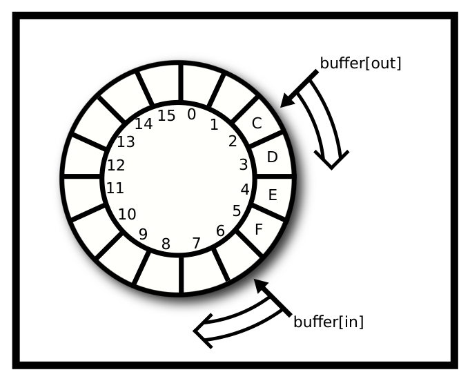

# Chương 7. Đồng bộ hoá (Synchronization)

> Bản dịch tiếng Việt từ *System Programming Coursebook* (University of Illinois, CS 241) — B. Venkatesh, L. Angrave et al. Tài liệu gốc được phát hành theo giấy phép [CC BY 4.0](https://creativecommons.org/licenses/by/4.0/); bản dịch giữ nguyên giấy phép này. Nguồn: https://github.com/illinois-cs241/coursebook

> *Khi lập trình đa luồng bắt đầu trở nên thú vị*

Đồng bộ hoá (synchronization) là việc phối hợp nhiều tác vụ khác nhau sao cho tất cả đều kết thúc ở trạng thái đúng. Trong C, chúng ta có một loạt cơ chế để kiểm soát những gì các thread (luồng) được phép thực hiện tại một trạng thái nhất định. Phần lớn thời gian, các thread có thể tiến hành công việc mà không cần giao tiếp với nhau, nhưng thỉnh thoảng hai hay nhiều thread có thể muốn truy cập vào một critical section (vùng găng). Critical section là một đoạn mã mà chỉ một thread được phép thực thi tại một thời điểm nếu muốn chương trình hoạt động đúng. Nếu hai thread (hoặc process) cùng thực thi mã bên trong critical section tại cùng một thời điểm, chương trình có thể không còn hành xử đúng nữa.

Như đã nói ở chương trước, race condition (tình huống đua/tranh chấp) xảy ra khi một thao tác chạm vào một vùng nhớ tại cùng thời điểm với một thread khác. Nếu vị trí bộ nhớ đó chỉ có một thread truy cập được, chẳng hạn biến tự động `i` bên dưới, thì không thể có race condition và không có critical section nào gắn với `i`. Tuy nhiên, biến `sum` là biến toàn cục và được hai thread truy cập. Hoàn toàn có thể xảy ra chuyện hai thread cùng cố tăng biến này tại cùng một thời điểm.

```c
#include <stdio.h>
#include <pthread.h>

int sum = 0; //shared

void *countgold(void *param) {
  int i; //local to each thread
  for (i = 0; i < 10000000; i++) {
    sum += 1;
  }
  return NULL;
}

int main() {
  pthread_t tid1, tid2;
  pthread_create(&tid1, NULL, countgold, NULL);
  pthread_create(&tid2, NULL, countgold, NULL);

  //Wait for both threads to finish:
  pthread_join(tid1, NULL);
  pthread_join(tid2, NULL);

  printf("ARRRRG sum is %d\n", sum);
  return 0;
}
```

Kết quả điển hình của đoạn mã trên là `ARGGGH sum is <một số nhỏ hơn mong đợi>` vì có race condition. Đoạn mã cho phép hai thread đọc và ghi `sum` cùng lúc. Ví dụ, cả hai thread cùng sao chép giá trị hiện tại của `sum` vào CPU đang chạy mỗi thread (giả sử là 123). Cả hai thread cộng một vào bản sao của riêng mình. Cả hai thread ghi giá trị (124) trở lại. Nếu hai thread truy cập `sum` ở những thời điểm khác nhau thì kết quả đếm đã là 125. Dưới đây là một vài thứ tự thực thi có thể xảy ra.

**Mẫu được phép (Permissible Pattern)**

*Bảng 7.1: Mẫu truy cập tốt của thread*

| Thread 1 | Thread 2 |
|---|---|
| Load Addr, Add 1 (i=1 cục bộ) | ... |
| Store (i=1 toàn cục) | ... |
| ... | Load Addr, Add 1 (i=2 cục bộ) |
| ... | Store (i=2 toàn cục) |

**Chồng lấn một phần (Partial Overlap)**

*Bảng 7.2: Mẫu truy cập xấu của thread*

| Thread 1 | Thread 2 |
|---|---|
| Load Addr, Add 1 (i=1 cục bộ) | ... |
| Store (i=1 toàn cục) | Load Addr, Add 1 (i=1 cục bộ) |
| ... | Store (i=1 toàn cục) |

**Chồng lấn hoàn toàn (Full Overlap)**

*Bảng 7.3: Mẫu truy cập tồi tệ của thread*

| Thread 1 | Thread 2 |
|---|---|
| Load Addr, Add 1 (i=1 cục bộ) | Load Addr, Add 1 (i=1 cục bộ) |
| Store (i=1 toàn cục) | Store (i=1 toàn cục) |

Chúng ta muốn có mẫu đầu tiên, trong đó đoạn mã được thực thi loại trừ lẫn nhau. Điều này dẫn chúng ta đến primitive (nguyên thuỷ) đồng bộ hoá đầu tiên: mutex.

## 7.1 Mutex

Để đảm bảo chỉ một thread tại một thời điểm có thể truy cập một biến toàn cục, hãy dùng mutex – viết tắt của Mutual Exclusion (loại trừ lẫn nhau). Nếu một thread hiện đang ở trong critical section, chúng ta muốn thread khác phải chờ cho đến khi thread thứ nhất hoàn tất. Mutex không phải là một primitive theo đúng nghĩa đen, dù nó là một trong những thứ nhỏ nhất có API đa luồng hữu ích. Mutex cũng không phải là một cấu trúc dữ liệu. Nó là một kiểu dữ liệu trừu tượng. Có nhiều cách để cài đặt mutex, và chúng tôi sẽ đưa ra một vài cách trong chương này. Trước mắt, hãy dùng "hộp đen" mà thư viện pthread cung cấp. Đây là cách khai báo một mutex.

```c
pthread_mutex_t m = PTHREAD_MUTEX_INITIALIZER; // global variable
pthread_mutex_lock(&m); // start of Critical Section
// Critical section
pthread_mutex_unlock(&m); //end of Critical Section
```

### 7.1.1 Vòng đời của mutex (Mutex Lifetime)

Có vài cách khởi tạo một mutex. Chương trình có thể dùng macro `PTHREAD_MUTEX_INITIALIZER` chỉ cho các biến toàn cục ('static'). `m = PTHREAD_MUTEX_INITIALIZER` tương đương về chức năng với dạng tổng quát hơn `pthread_mutex_init(m,NULL)`. Phiên bản init có các tuỳ chọn để đánh đổi hiệu năng lấy khả năng kiểm tra lỗi bổ sung và các tuỳ chọn chia sẻ nâng cao. Phiên bản init cũng đảm bảo mutex được khởi tạo đúng ngay sau lời gọi, còn các mutex toàn cục thì được khởi tạo ở lần lock đầu tiên. Chương trình cũng có thể gọi hàm init bên trong chương trình cho một mutex nằm trên heap.

```c
pthread_mutex_t *lock = malloc(sizeof(pthread_mutex_t));
pthread_mutex_init(lock, NULL);
//later
pthread_mutex_destroy(lock);
free(lock);
```

Khi đã dùng xong mutex, chúng ta cũng nên gọi `pthread_mutex_destroy(m)`. Lưu ý, chương trình chỉ có thể huỷ (destroy) một mutex đang ở trạng thái mở khoá; huỷ một mutex đang bị khoá là undefined behavior (hành vi không xác định). Những điều cần ghi nhớ về init và destroy: chương trình không cần huỷ một mutex được tạo bằng bộ khởi tạo toàn cục.

1. Nhiều thread cùng init/destroy là undefined behavior
2. Huỷ một mutex đang bị khoá là undefined behavior
3. Hãy giữ nguyên tắc: một và chỉ một thread khởi tạo mutex.
4. Sao chép các byte của mutex sang một vị trí bộ nhớ mới rồi dùng bản sao đó là điều không được hỗ trợ. Để tham chiếu đến một mutex, chương trình phải có con trỏ tới địa chỉ bộ nhớ đó.

### 7.1.2 Cách dùng mutex (Mutex Usages)

Dùng mutex như thế nào? Đây là một ví dụ hoàn chỉnh theo tinh thần của đoạn mã trước.

```c
#include <stdio.h>
#include <pthread.h>

// Create a mutex this ready to be locked!
pthread_mutex_t m = PTHREAD_MUTEX_INITIALIZER;

int sum = 0;

void *countgold(void *param) {
  int i;

  //Same thread that locks the mutex must unlock it
  //Critical section is 'sum += 1'
  //However locking and unlocking a million times
  //has significant overhead

  pthread_mutex_lock(&m);

  // Other threads that call lock will have to wait until we call unlock

  for (i = 0; i < 10000000; i++) {
    sum += 1;
  }
  pthread_mutex_unlock(&m);
  return NULL;
}

int main() {
  pthread_t tid1, tid2;
  pthread_create(&tid1, NULL, countgold, NULL);
  pthread_create(&tid2, NULL, countgold, NULL);

  pthread_join(tid1, NULL);
  pthread_join(tid2, NULL);

  printf("ARRRRG sum is %d\n", sum);
  return 0;
}
```

Trong đoạn mã trên, thread lấy khoá của "kho đếm vàng" trước khi bước vào. Critical section thực ra chỉ là `sum+=1`, nên phiên bản sau đây cũng đúng.

```c
for (i = 0; i < 10000000; i++) {
  pthread_mutex_lock(&m);
  sum += 1;
  pthread_mutex_unlock(&m);
}
return NULL;
}
```

Quá trình này chạy chậm hơn vì chúng ta lock và unlock mutex một triệu lần, một việc tốn kém – ít nhất là so với việc tăng một biến. Trong ví dụ đơn giản này, chúng ta thậm chí không cần thread – có thể cộng hai lần là xong! Một ví dụ đa luồng nhanh hơn sẽ là cộng một triệu bằng một biến tự động (cục bộ) rồi mới cộng nó vào tổng dùng chung sau khi vòng lặp tính toán kết thúc:

```c
int local = 0;
for (i = 0; i < 10000000; i++) {
  local += 1;
}

pthread_mutex_lock(&m);
sum += local;
pthread_mutex_unlock(&m);

return NULL;
}
```

Nếu bạn biết công thức tổng Gauss, bạn có thể tránh hoàn toàn race condition, nhưng ví dụ này chỉ để minh hoạ.

Bắt đầu với những "cạm bẫy" (gotcha). Thứ nhất, mutex trong C không khoá biến. Mutex là một cấu trúc dữ liệu đơn giản. Nó làm việc với mã, không phải với dữ liệu. Nếu một mutex bị khoá, các thread khác vẫn tiếp tục chạy. Chỉ khi một thread cố lock một mutex đã bị khoá thì thread đó mới phải chờ. Ngay khi thread ban đầu unlock mutex, thread thứ hai (đang chờ) sẽ giành được khoá và có thể tiếp tục. Đoạn mã sau tạo ra một mutex mà thực chất chẳng làm gì cả.

```c
int a;
pthread_mutex_t m1 = PTHREAD_MUTEX_INITIALIZER,
m2 = = PTHREAD_MUTEX_INITIALIZER;
// later
// Thread 1
pthread_mutex_lock(&m1);
a++;
pthread_mutex_unlock(&m1);

// Thread 2
pthread_mutex_lock(&m2);
a++;
pthread_mutex_unlock(&m2);
```

Dưới đây là một số cạm bẫy khác, không theo thứ tự nào cả

1. Đừng "bắt chéo dòng"! Nếu dùng thread, đừng `fork` ở giữa chương trình. Điều này có nghĩa là bất kỳ lúc nào sau khi các mutex của bạn đã được khởi tạo.
2. Thread nào khoá mutex thì chỉ thread đó mới có thể mở khoá nó.
3. Mỗi chương trình có thể có nhiều mutex. Một thiết kế thread-safe (an toàn với đa luồng) có thể gồm một khoá cho mỗi cấu trúc dữ liệu, một khoá cho mỗi heap, hoặc một khoá cho mỗi nhóm cấu trúc dữ liệu. Nếu chương trình chỉ có một khoá duy nhất thì có thể xảy ra tranh chấp (contention) đáng kể cho khoá đó. Nếu hai thread cập nhật hai bộ đếm khác nhau thì không nhất thiết phải dùng chung một khoá.
4. Khoá chỉ là công cụ. Chúng không tự phát hiện critical section!
5. Luôn có một chi phí nhỏ khi gọi `pthread_mutex_lock` và `pthread_mutex_unlock`. Tuy nhiên, đó là cái giá phải trả để chương trình hoạt động đúng!
6. Không mở khoá mutex do trả về sớm trong một tình huống lỗi
7. Rò rỉ tài nguyên (không gọi `pthread_mutex_destroy`)
8. Dùng một mutex chưa được khởi tạo hoặc dùng một mutex đã bị huỷ
9. Khoá một mutex hai lần trên cùng một thread mà không mở khoá trước
10. Deadlock (bế tắc)

### 7.1.3 Cài đặt mutex (Mutex Implementation)

Vậy là chúng ta có một cấu trúc dữ liệu thú vị. Cài đặt nó thế nào? Một cài đặt ngây thơ và sai được trình bày bên dưới. Hàm unlock chỉ đơn giản mở khoá mutex rồi trả về. Hàm lock trước tiên kiểm tra xem khoá đã bị khoá chưa. Nếu hiện đang bị khoá, nó sẽ kiểm tra đi kiểm tra lại cho đến khi một thread khác mở khoá mutex. Tạm thời, chúng ta bỏ qua tình huống các thread khác có thể mở khoá một khoá mà chúng không sở hữu và tập trung vào khía cạnh loại trừ lẫn nhau.

```c
// Version 1 (Incorrect!)

void lock(mutex_t *m) {
  while(m->locked) {/*Locked? Never-mind - loop and check again!*/ }

  m->locked = 1;
}

void unlock(mutex_t *m) {
  m->locked = 0;
}
```

Phiên bản 1 dùng 'busy-waiting' (chờ bận), lãng phí tài nguyên CPU một cách không cần thiết. Tuy nhiên, còn có một vấn đề nghiêm trọng hơn. Chúng ta có race condition! Nếu hai thread cùng gọi lock đồng thời, có thể cả hai thread đều đọc `m_locked` là 0. Do đó cả hai thread đều tin rằng mình có quyền truy cập độc quyền vào khoá và cả hai đều tiếp tục.

Chúng ta có thể thử giảm chút chi phí CPU bằng cách gọi `pthread_yield()` bên trong vòng lặp – `pthread_yield` gợi ý cho hệ điều hành rằng thread này không dùng CPU trong một khoảng thời gian ngắn, để CPU có thể được giao cho các thread đang chờ chạy. Nhưng race condition vẫn còn đó. Chúng ta cần một cài đặt tốt hơn. Chúng ta sẽ bàn về điều này sau, trong phần về critical section của chương này. Còn bây giờ, hãy nói về semaphore.

### 7.1.4 Nâng cao: Cài đặt mutex bằng phần cứng (Advanced: Implementing a Mutex with hardware)

Chúng ta có thể dùng C11 Atomics để làm việc này một cách hoàn hảo! Một lời giải hoàn chỉnh được trình bày chi tiết ở đây. Đây là một mutex kiểu spinlock; các cài đặt dùng futex có thể tìm thấy trên mạng.

Trước hết là cấu trúc dữ liệu và mã khởi tạo.

```c
typedef struct mutex_{
  // We need some variable to see if the lock is locked
  atomic_int_least8_t lock;
  // A mutex needs to keep track of its owner so
  // Another thread can't unlock it
  pthread_t owner;
} mutex;

#define UNLOCKED 0
#define LOCKED 1
#define UNASSIGNED_OWNER 0

int mutex_init(mutex* mtx){
  // Some simple error checking
  if(!mtx){
    return 0;
  }
  // Not thread-safe the user has to take care of this
  atomic_init(&mtx->lock, UNLOCKED);
  mtx->owner = UNASSIGNED_OWNER;
  return 1;
}
```

Đây là mã khởi tạo, không có gì cầu kỳ. Chúng ta đặt trạng thái của mutex là mở khoá và đặt owner (chủ sở hữu) về trạng thái chưa gán.

```c
int mutex_lock(mutex* mtx){
  int_least8_t zero = UNLOCKED;
  while(!atomic_compare_exchange_weak_explicit
  (&mtx->lock,
  &zero,
  LOCKED,
  memory_order_seq_cst,
  memory_order_seq_cst)){
    zero = UNLOCKED;
    sched_yield(); // Use system calls for scheduling speed
  }
  // We have the lock now
  mtx->owner = pthread_self();
  return 1;
}
```

Đoạn mã này làm gì? Nó khởi tạo một biến mà chúng ta sẽ giữ làm trạng thái mở khoá. Atomic Compare and Exchange (so sánh và hoán đổi nguyên tử) là một lệnh được hầu hết các kiến trúc hiện đại hỗ trợ (trên x86 là `lock cmpxchg`). Mã giả của thao tác này trông như sau

```c
int atomic_compare_exchange_pseudo(int* addr1, int* addr2, int val){
  if(*addr1 == *addr2){
    *addr1 = val;
    return 1;
  }else{
    *addr2 = *addr1;
    return 0;
  }
}
```

Chỉ khác là toàn bộ được thực hiện một cách nguyên tử (atomic), nghĩa là trong một thao tác không thể bị ngắt. Phần "weak" nghĩa là gì? Các lệnh atomic dễ gặp thất bại giả (spurious failure), nghĩa là có hai phiên bản của các hàm atomic này: strong và weak; strong đảm bảo kết quả thành công hay thất bại là thật, còn weak có thể báo thất bại ngay cả khi thao tác thực ra đã thành công. Đây cũng chính là kiểu thất bại giả mà bạn sẽ thấy ở condition variable (biến điều kiện) bên dưới. Chúng ta dùng weak vì weak nhanh hơn, và chúng ta đang ở trong một vòng lặp! Nghĩa là chúng ta chấp nhận nó thất bại thường xuyên hơn một chút vì đằng nào chúng ta cũng sẽ quay vòng lại.

Bên trong vòng lặp while, chúng ta đã không giành được khoá! Chúng ta đặt lại `zero` về trạng thái mở khoá và ngủ một lát. Khi tỉnh dậy, chúng ta thử giành khoá lần nữa. Một khi hoán đổi thành công, chúng ta đã ở trong critical section! Chúng ta đặt owner của mutex là thread hiện tại để phục vụ phương thức unlock rồi trả về thành công.

Làm sao điều này đảm bảo loại trừ lẫn nhau? Khi làm việc với atomics, chúng ta thường không chắc! Nhưng trong ví dụ đơn giản này thì có thể, vì thread nào "kỳ vọng" thành công rằng khoá đang là UNLOCKED (0) và hoán đổi được nó sang trạng thái LOCKED (1) sẽ được coi là người thắng. Cài đặt unlock thế nào?

```c
int mutex_unlock(mutex* mtx){
  if(unlikely(pthread_self() != mtx->owner)){
    return 0; // Can't unlock a mutex if the thread isn't the owner
  }
  int_least8_t one = 1;
  //Critical section ends after this atomic
  mtx->owner = UNASSIGNED_OWNER;
  if(!atomic_compare_exchange_strong_explicit(
  &mtx->lock,
  &one,
  UNLOCKED,
  memory_order_seq_cst,
  memory_order_seq_cst)){
    //The mutex was never locked in the first place
    return 0;
  }
  return 1;
}
```

Để thoả mãn API, một thread không thể unlock mutex trừ khi chính nó là chủ sở hữu. Sau đó chúng ta bỏ gán owner của mutex, vì critical section kết thúc sau thao tác atomic. Chúng ta muốn hoán đổi kiểu strong vì không muốn bị chặn. Chúng ta kỳ vọng mutex đang bị khoá và hoán đổi nó sang mở khoá. Nếu hoán đổi thành công, chúng ta đã mở khoá mutex. Nếu không, nghĩa là mutex đang UNLOCKED và chúng ta đã cố chuyển từ UNLOCKED sang UNLOCKED, vẫn giữ nguyên hành vi của unlock.

Còn chuyện memory order (thứ tự bộ nhớ) là gì? Trước đó chúng ta có nói về memory fence (hàng rào bộ nhớ) – chính là nó đây! Chúng tôi sẽ không đi vào chi tiết vì nó nằm ngoài phạm vi khoá học này, dù vẫn trong phạm vi của bài viết này. Chúng ta cần tính nhất quán để đảm bảo không có thao tác load hay store nào bị sắp xếp lại ra trước hoặc sau. Chương trình cần tạo các chuỗi phụ thuộc (dependency chain) để có thứ tự hiệu quả hơn.

### 7.1.5 Semaphore

Semaphore là một primitive đồng bộ hoá khác. Nó được khởi tạo với một giá trị nào đó. Các thread có thể gọi `sem_wait` hoặc `sem_post` để giảm hoặc tăng giá trị này. Nếu giá trị về 0 và có lời gọi wait, thread sẽ bị chặn cho đến khi có lời gọi post.

Dùng semaphore cũng dễ như dùng mutex. Trước tiên, quyết định giá trị khởi đầu, ví dụ số ô còn trống trong một mảng. Không giống mutex của pthread, không có đường tắt nào để tạo semaphore – hãy dùng `sem_init`.

```c
#include <semaphore.h>

sem_t s;
int main() {
  sem_init(&s, 0, 10); // returns -1 (=FAILED) on OS X
  sem_wait(&s); // Could do this 10 times without blocking
  sem_post(&s); // Announce that we've finished (and one more resource item is available; increment count)
  sem_destroy(&s); // release resources of the semaphore
}
```

Khi dùng semaphore, wait và post có thể được gọi từ các thread khác nhau! Không giống mutex, việc tăng và giảm có thể đến từ các thread khác nhau.

Điều này đặc biệt hữu ích nếu bạn muốn dùng semaphore để cài đặt mutex. Một mutex là một semaphore luôn wait trước khi post. Một số giáo trình gọi mutex là binary semaphore (semaphore nhị phân). Bạn phải cẩn thận đừng bao giờ cộng thêm quá một vào semaphore, nếu không lớp trừu tượng mutex của bạn sẽ hỏng. Đó thường là lý do người ta dùng mutex để cài đặt semaphore và ngược lại.

- Khởi tạo semaphore với giá trị đếm là một.
- Thay `pthread_mutex_lock` bằng `sem_wait`
- Thay `pthread_mutex_unlock` bằng `sem_post`

```c
sem_t s;
sem_init(&s, 0, 1);

sem_wait(&s);
// Critical Section
sem_post(&s);
```

Nhưng hãy cẩn thận, hai thứ không giống nhau! Mutex xử lý tốt cái mà chúng ta gọi là lock inversion (đảo ngược khoá). Nghĩa là đoạn mã sau sẽ "gãy" (báo lỗi) với một mutex truyền thống, nhưng lại tạo ra race condition với các thread.

```c
// Thread 1
sem_wait(&s);
// Critical Section
sem_post(&s);

// Thread 2
// Some threads want to see the world burn
sem_post(&s);

// Thread 3
sem_wait(&s);
// Not thread-safe!
sem_post(&s);
```

Nếu thay bằng mutex lock, chiêu này sẽ không còn tác dụng.

```c
// Thread 1
mutex_lock(&s);
// Critical Section
mutex_unlock(&s);

// Thread 2
// Foiled!
mutex_unlock(&s);

// Thread 3
mutex_lock(&s);
// Now it's thread-safe
mutex_unlock(&s);
```

Ngoài ra, binary semaphore khác với mutex ở chỗ với semaphore, một thread có thể "mở khoá" từ một thread khác.

#### Tính an toàn với tín hiệu (Signal Safety)

Thêm nữa, `sem_post` là một trong số ít hàm có thể dùng đúng đắn bên trong một signal handler (hàm xử lý tín hiệu); `pthread_mutex_unlock` thì không. Chúng ta có thể giải phóng một thread đang chờ, và thread đó giờ có thể thực hiện mọi lời gọi mà chúng ta không được phép gọi bên trong chính signal handler, ví dụ `printf`. Đây là đoạn mã tận dụng điều này;

```c
#include <stdio.h>
#include <pthread.h>
#include <signal.h>
#include <semaphore.h>
#include <unistd.h>

sem_t s;

void handler(int signal) {
  sem_post(&s); /* Release the Kraken! */
}

void *singsong(void *param) {
  sem_wait(&s);
  printf("Waiting until a signal releases...\n");
}

int main() {
  int ok = sem_init(&s, 0, 0 /* Initial value of zero*/);
  if (ok == -1) {
    perror("Could not create unnamed semaphore");
    return 1;
  }
  signal(SIGINT, handler); // Too simple! See Signals chapter

  pthread_t tid;
  pthread_create(&tid, NULL, singsong, NULL);
  pthread_exit(NULL); /* Process will exit when there are no more threads */
}
```

Các công dụng khác của semaphore là theo dõi số ô trống trong mảng. Chúng ta sẽ bàn về điều này trong phần cấu trúc dữ liệu thread-safe.

## 7.2 Biến điều kiện (Condition Variables)

Condition variable (biến điều kiện) cho phép một tập các thread ngủ cho đến khi được đánh thức. API cho phép đánh thức một hoặc tất cả các thread. Nếu chương trình chỉ đánh thức một thread, hệ điều hành sẽ quyết định thread nào được đánh thức. Các thread không đánh thức nhau trực tiếp, chẳng hạn theo id. Thay vào đó, một thread "signal" (báo hiệu) cho condition variable, và condition variable sẽ đánh thức một (hoặc tất cả) các thread đang ngủ bên trong nó.

Condition variable cũng được dùng cùng với một mutex và một vòng lặp, để khi được đánh thức, thread phải kiểm tra lại điều kiện bên trong critical section. Nếu một thread cần được đánh thức bên ngoài critical section, POSIX có những cách khác để làm điều đó. Các thread đang ngủ bên trong một condition variable được đánh thức bằng cách gọi `pthread_cond_broadcast` (đánh thức tất cả) hoặc `pthread_cond_signal` (đánh thức một). Lưu ý rằng dù tên hàm như vậy, việc này chẳng liên quan gì đến POSIX signal!

Thỉnh thoảng, một thread đang chờ có vẻ như tỉnh dậy mà không có lý do. Đây gọi là spurious wakeup (đánh thức giả). Nếu bạn đã đọc phần cài đặt mutex bằng phần cứng, điều này tương tự với thất bại giả của atomic cùng tên.

Tại sao spurious wakeup lại xảy ra? Vì hiệu năng. Trên các hệ thống nhiều CPU, có khả năng một race condition khiến một yêu cầu đánh thức (signal) không được ghi nhận. Kernel (nhân hệ điều hành) có thể không phát hiện được lời gọi đánh thức bị mất này, nhưng có thể phát hiện khi nào nó có khả năng xảy ra. Để tránh mất signal, thread được đánh thức để mã chương trình có thể kiểm tra lại điều kiện. Nếu bạn muốn biết tại sao, hãy xem phần phụ lục.

## 7.3 Cấu trúc dữ liệu thread-safe (Thread-Safe Data Structures)

Đương nhiên, chúng ta cũng muốn các cấu trúc dữ liệu của mình là thread-safe! Chúng ta có thể dùng mutex và các primitive đồng bộ hoá để đạt được điều đó. Trước hết, vài định nghĩa. Tính nguyên tử (atomicity) là khi một thao tác là thread-safe. Chúng ta có các lệnh atomic trong phần cứng thông qua tiền tố lock

```asm
lock ...
```

Nhưng tính nguyên tử cũng áp dụng cho các thao tác ở cấp cao hơn. Chúng ta nói một thao tác trên cấu trúc dữ liệu là atomic nếu nó xảy ra toàn bộ cùng một lúc và thành công, hoặc hoàn toàn không xảy ra.

Vì vậy, chúng ta có thể dùng các primitive đồng bộ hoá để làm cho cấu trúc dữ liệu trở nên thread-safe. Phần lớn chúng ta sẽ dùng mutex vì chúng mang nhiều ý nghĩa ngữ nghĩa hơn binary semaphore. Lưu ý, đây chỉ là phần giới thiệu. Viết các cấu trúc dữ liệu thread-safe hiệu năng cao cần cả một cuốn sách riêng! Lấy ví dụ stack không thread-safe sau đây.

```c
// A simple fixed-sized stack (version 1)
#define STACK_SIZE 20
int count;
double values[STACK_SIZE];

void push(double v) {
  values[count++] = v;
}

double pop() {
  return values[--count];
}

int is_empty() {
  return count == 0;
}
```

Phiên bản 1 của stack không thread-safe vì nếu hai thread cùng gọi push hoặc pop tại cùng thời điểm thì kết quả hoặc stack có thể trở nên không nhất quán. Ví dụ, hãy tưởng tượng hai thread cùng gọi pop tại cùng thời điểm: cả hai thread có thể đọc cùng một giá trị, cả hai có thể đọc cùng giá trị `count` ban đầu.

Để biến nó thành một cấu trúc dữ liệu thread-safe, chúng ta cần xác định các critical section trong mã, nghĩa là cần hỏi (những) đoạn mã nào chỉ được phép có một thread tại một thời điểm. Trong ví dụ trên, các hàm push, pop và is_empty truy cập cùng vùng nhớ và tất cả đều là critical section của stack. Trong khi push (và pop) đang thực thi, cấu trúc dữ liệu ở trạng thái không nhất quán, ví dụ `count` có thể chưa được ghi, nên nó có thể vẫn chứa giá trị ban đầu. Bằng cách bọc các phương thức này bằng một mutex, chúng ta có thể đảm bảo chỉ một thread tại một thời điểm có thể cập nhật (hoặc đọc) stack. Một "lời giải" ứng viên được trình bày bên dưới. Nó có đúng không? Nếu không, nó sẽ hỏng như thế nào?

```c
// An attempt at a thread-safe stack (version 2)
#define STACK_SIZE 20
int count;
double values[STACK_SIZE];

pthread_mutex_t m1 = PTHREAD_MUTEX_INITIALIZER;
pthread_mutex_t m2 = PTHREAD_MUTEX_INITIALIZER;

void push(double v) {
  pthread_mutex_lock(&m1);
  values[count++] = v;
  pthread_mutex_unlock(&m1);
}

double pop() {
  pthread_mutex_lock(&m2);
  double v = values[--count];
  pthread_mutex_unlock(&m2);

  return v;
}

int is_empty() {
  pthread_mutex_lock(&m1);
  return count == 0;
  pthread_mutex_unlock(&m1);
}
```

Phiên bản 2 chứa ít nhất một lỗi. Hãy dành chút thời gian xem bạn có tìm được (các) lỗi và suy ra (các) hệ quả không.

Nếu ba thread cùng gọi `push()` tại cùng thời điểm, khoá `m1` đảm bảo chỉ một thread tại một thời điểm thao tác trên stack khi push hoặc is_empty – Hai thread còn lại sẽ phải chờ cho đến khi thread thứ nhất hoàn tất. Lập luận tương tự áp dụng cho các lời gọi pop đồng thời. Tuy nhiên, phiên bản 2 không ngăn push và pop chạy cùng lúc vì push và pop dùng hai mutex khác nhau. Cách sửa trong trường hợp này rất đơn giản – dùng cùng một mutex cho cả hàm push lẫn pop.

Đoạn mã còn một lỗi thứ hai. `is_empty` trả về ngay sau phép so sánh và để mutex ở trạng thái không được mở khoá. Tuy nhiên, lỗi này sẽ không được phát hiện ngay lập tức. Ví dụ, giả sử một thread gọi is_empty và sau đó một thread thứ hai gọi push. Thread này sẽ dừng lại một cách bí ẩn. Dùng trình gỡ lỗi, bạn có thể phát hiện thread bị kẹt ở phương thức `lock()` bên trong hàm push vì khoá chưa bao giờ được mở bởi lời gọi is_empty trước đó. Như vậy, một sơ suất ở một thread dẫn đến vấn đề xảy ra muộn hơn rất nhiều ở một thread bất kỳ khác. Hãy thử khắc phục những vấn đề này

```c
// An attempt at a thread-safe stack (version 3)
int count;
double values[count];
pthread_mutex_t m = PTHREAD_MUTEX_INITIALIZER;

void push(double v) {
  pthread_mutex_lock(&m);
  values[count++] = v;
  pthread_mutex_unlock(&m);
}
double pop() {
  pthread_mutex_lock(&m);
  double v = values[--count];
  pthread_mutex_unlock(&m);
  return v;
}
int is_empty() {
  pthread_mutex_lock(&m);
  int result = count == 0;
  pthread_mutex_unlock(&m);
  return result;
}
```

Phiên bản 3 là thread-safe. Chúng ta đã đảm bảo loại trừ lẫn nhau cho mọi critical section. Có vài điều cần lưu ý.

- `is_empty` là thread-safe nhưng kết quả của nó có thể đã lỗi thời. Stack có thể không còn trống nữa vào lúc thread nhận được kết quả! Đây thường là lý do tại sao trong các cấu trúc dữ liệu thread-safe, các hàm trả về kích thước bị loại bỏ hoặc không được khuyến khích dùng (deprecated).
- Không có bảo vệ chống underflow (pop trên stack rỗng) hay overflow (push vào stack đã đầy)

Điểm cuối cùng có thể được khắc phục bằng counting semaphore (semaphore đếm). Cài đặt này giả định chỉ có một stack. Một phiên bản tổng quát hơn có thể đưa mutex vào trong cấu trúc bộ nhớ và dùng `pthread_mutex_init` để khởi tạo mutex. Ví dụ,

```c
// Support for multiple stacks (each one has a mutex)
typedef struct stack {
  int count;
  pthread_mutex_t m;
  double *values;
} stack_t;

stack_t* stack_create(int capacity) {
  stack_t *result = malloc(sizeof(stack_t));
  result->count = 0;
  result->values = malloc(sizeof(double) * capacity);
  pthread_mutex_init(&result->m, NULL);
  return result;
}
void stack_destroy(stack_t *s) {
  free(s->values);
  pthread_mutex_destroy(&s->m);
  free(s);
}

// Warning no underflow or overflow checks!

void push(stack_t *s, double v) {
  pthread_mutex_lock(&s->m);
  s->values[(s->count)++] = v;
  pthread_mutex_unlock(&s->m);
}

double pop(stack_t *s) {
  pthread_mutex_lock(&s->m);
  double v = s->values[--(s->count)];
  pthread_mutex_unlock(&s->m);
  return v;
}

int is_empty(stack_t *s) {
  pthread_mutex_lock(&s->m);
  int result = s->count == 0;
  pthread_mutex_unlock(&s->m);
  return result;
}

int main() {
  stack_t *s1 = stack_create(10 /* Max capacity*/);
  stack_t *s2 = stack_create(10);
  push(s1, 3.141);
  push(s2, pop(s1));
  stack_destroy(s2);
  stack_destroy(s1);
}
```

Trước khi khắc phục các vấn đề bằng semaphore, chúng ta sẽ khắc phục chúng bằng condition variable như thế nào? Hãy tự thử trước khi xem mã ở phần trước. Chúng ta cần chờ trong push và pop nếu stack tương ứng đã đầy hoặc rỗng. Lời giải thử:

```c
// Assume cv is a condition variable
// correctly initialized

void push(stack_t *s, double v) {
  pthread_mutex_lock(&s->m);
  if(s->count == 0) pthread_cond_wait(&s->cv, &s->m);
  s->values[(s->count)++] = v;
  pthread_mutex_unlock(&s->m);
}

double pop(stack_t *s) {
  pthread_mutex_lock(&s->m);
  if(s->count == 0) pthread_cond_wait(&s->cv, &s->m);
  double v = s->values[--(s->count)];
  pthread_mutex_unlock(&s->m);
  return v;
}
```

Lời giải trên có hoạt động không? Hãy dành một giây để tìm lỗi trước khi xem đáp án.

Vậy bạn đã bắt được hết chưa?

1. Lỗi đầu tiên khá đơn giản. Trong push, phép kiểm tra phải so với tổng dung lượng, chứ không phải so với 0.
2. Chúng ta chỉ dùng câu lệnh if để kiểm tra. `wait()` có thể tỉnh dậy giả (spurious wakeup).
3. Chúng ta không bao giờ signal cho bất kỳ thread nào! Các thread có thể bị kẹt chờ vô hạn.

Hãy sửa những lỗi đó. Lời giải này có hoạt động không?

```c
void push(stack_t *s, double v) {
  pthread_mutex_lock(&s->m);
  while(s->count == capacity) pthread_cond_wait(&s->cv, &s->m);
  s->values[(s->count)++] = v;
  pthread_mutex_unlock(&s->m);
  pthread_cond_signal(&s->cv);
}

double pop(stack_t *s) {
  pthread_mutex_lock(&s->m);
  while(s->count == 0) pthread_cond_wait(&s->cv, &s->m);
  double v = s->values[--(s->count)];
  pthread_cond_broadcast(&s->cv);
  pthread_mutex_unlock(&s->m);
  return v;
}
```

Lời giải này cũng không hoạt động! Vấn đề nằm ở signal. Bạn thấy tại sao không? Bạn sẽ làm gì để sửa nó?

Bây giờ, chúng ta dùng counting semaphore để ngăn overflow và underflow như thế nào? Hãy bàn về điều đó trong phần tiếp theo.

### 7.3.1 Dùng semaphore (Using Semaphores)

Hãy dùng một counting semaphore để theo dõi số ô còn trống và một semaphore khác để theo dõi số phần tử trong stack. Chúng ta gọi hai semaphore này là `sremain` và `sitems`. Hãy nhớ `sem_wait` sẽ chờ nếu giá trị đếm của semaphore đã bị giảm về 0 (bởi một thread khác gọi `sem_post`).

```c
// Sketch #1

sem_t sitems;
sem_t sremain;
void stack_init(){
  sem_init(&sitems, 0, 0);
  sem_init(&sremain, 0, 10);
}


double pop() {
  // Wait until there's at least one item
  sem_wait(&sitems);
  ...

void push(double v) {
  // Wait until there's at least one space
  sem_wait(&sremain);
  ...
}
```

Bản phác thảo #2 gọi post quá sớm. Một thread khác đang chờ trong push có thể cố ghi vào một stack đã đầy một cách sai lầm. Tương tự, một thread đang chờ trong `pop()` được phép tiếp tục quá sớm.

```c
// Sketch #2 (Error!)
double pop() {
  // Wait until there's at least one item
  sem_wait(&sitems);
  sem_post(&sremain); // error! wakes up pushing() thread too early
  return values[--count];
}
void push(double v) {
  // Wait until there's at least one space
  sem_wait(&sremain);
  sem_post(&sitems); // error! wakes up a popping() thread too early
  values[count++] = v;
}
```

Bản phác thảo 3 cài đặt đúng logic semaphore, nhưng bạn có tìm ra lỗi không?

```c
// Sketch #3 (Error!)
double pop() {
  // Wait until there's at least one item
  sem_wait(&sitems);
  double v= values[--count];
  sem_post(&sremain);
  return v;
}

void push(double v) {
  // Wait until there's at least one space
  sem_wait(&sremain);
  values[count++] = v;
  sem_post(&sitems);
}
```

Bản phác thảo 3 thực thi đúng các điều kiện bộ đệm đầy và bộ đệm rỗng bằng semaphore. Tuy nhiên, không có loại trừ lẫn nhau. Hai thread có thể cùng ở trong critical section tại cùng thời điểm, điều này sẽ làm hỏng cấu trúc dữ liệu hoặc ít nhất là dẫn đến mất dữ liệu. Cách sửa là bọc một mutex quanh critical section:

```c
// Simple single stack - see the above example on how to convert this into multiple stacks.
// Also a robust POSIX implementation would check for EINTR and error codes of sem_wait.

// PTHREAD_MUTEX_INITIALIZER for statics (use pthread_mutex_init() for stack/heap memory)
#define SPACES 10
pthread_mutex_t m= PTHREAD_MUTEX_INITIALIZER;
int count = 0;
double values[SPACES];
sem_t sitems, sremain;

void init() {
  sem_init(&sitems, 0, 0);
  sem_init(&sremains, 0, SPACES); // 10 spaces
}

double pop() {
  // Wait until there's at least one item
  sem_wait(&sitems);

  pthread_mutex_lock(&m); // CRITICAL SECTION
  double v= values[--count];
  pthread_mutex_unlock(&m);

  sem_post(&sremain); // Hey world, there's at least one space
  return v;
}

void push(double v) {
  // Wait until there's at least one space
  sem_wait(&sremain);

  pthread_mutex_lock(&m); // CRITICAL SECTION
  values[count++] = v;
  pthread_mutex_unlock(&m);

  sem_post(&sitems); // Hey world, there's at least one item
}
// Note a robust solution will need to check sem_wait's result for EINTR (more about this later)
```

Điều gì xảy ra khi chúng ta bắt đầu đảo thứ tự lock và wait?

```c
double pop() {
  pthread_mutex_lock(&m);
  sem_wait(&sitems);

  double v= values[--count];
  pthread_mutex_unlock(&m);

  sem_post(&sremain);
  return v;
}

void push(double v) {
  sem_wait(&sremain);

  pthread_mutex_lock(&m);
  values[count++] = v;
  pthread_mutex_unlock(&m);

  sem_post(&sitems);
}
```

Thay vì đưa ra đáp án, chúng tôi để bạn tự suy nghĩ. Đây có phải là một cách lock và unlock hợp lệ không? Có chuỗi thao tác nào có thể gây ra race condition không? Còn deadlock thì sao? Nếu có, hãy chỉ ra. Nếu không, hãy đưa ra một chứng minh ngắn gọn tại sao điều đó không xảy ra.

## 7.4 Lời giải phần mềm cho bài toán vùng găng (Software Solutions to the Critical Section)

Như đã bàn, có những phần quan trọng trong mã của chúng ta chỉ có thể được thực thi bởi một thread tại một thời điểm. Chúng ta mô tả yêu cầu này là 'mutual exclusion' (loại trừ lẫn nhau). Chỉ một thread (hoặc process) được phép truy cập tài nguyên dùng chung. Trong các chương trình đa luồng, chúng ta có thể bọc critical section bằng các lời gọi lock và unlock của mutex:

```c
pthread_mutex_lock() // one thread allowed at a time! (others will have to wait here)
// ... Do Critical Section stuff here!
pthread_mutex_unlock() // let other waiting threads continue
```

Chúng ta sẽ cài đặt các lời gọi lock và unlock này như thế nào? Liệu có thể tạo ra một thuật toán thuần phần mềm đảm bảo loại trừ lẫn nhau không? Đây là nỗ lực trước đó của chúng ta.

```c
pthread_mutex_lock(p_mutex_t *m) {
  while(m->lock) ;
  m->lock = 1;
}
pthread_mutex_unlock(p_mutex_t *m) {
  m->lock = 0;
}
```

Như đã đề cập trước đó, cài đặt này không thoả mãn Mutual Exclusion, ngay cả khi đã bỏ qua chuyện các thread có thể mở khoá khoá của thread khác. Hãy xem xét kỹ "cài đặt" này từ góc nhìn của hai thread chạy gần như cùng lúc.

Để đơn giản hoá thảo luận, chúng ta chỉ xét hai thread. Lưu ý rằng các lập luận này đúng cho cả thread lẫn process, và tài liệu kinh điển của ngành Khoa học máy tính bàn về những bài toán này dưới dạng hai process cần truy cập độc quyền vào một critical section hoặc tài nguyên dùng chung. Việc giương cờ (raising a flag) biểu thị ý định của một thread/process muốn vào critical section.

Có ba tính chất mong muốn chính mà chúng ta cần ở một lời giải cho bài toán critical section.

1. **Mutual Exclusion** (loại trừ lẫn nhau). Thread/process có quyền truy cập độc quyền. Các thread/process khác phải chờ cho đến khi nó rời khỏi critical section.
2. **Bounded Wait** (chờ có giới hạn). Một thread/process không thể bị thread khác vượt mặt vô số lần.
3. **Progress** (tiến triển). Nếu không có thread/process nào trong critical section, thread/process phải có thể tiến vào mà không phải chờ.

Với những ý tưởng này trong đầu, hãy xem xét một lời giải ứng viên khác chỉ dùng cờ lượt (turn-based flag) khi cả hai thread cùng yêu cầu truy cập tại cùng một thời điểm.

### 7.4.1 Các lời giải ngây thơ (Naive Solutions)

Hãy nhớ rằng mã giả được phác thảo bên dưới là một phần của một chương trình lớn hơn. Thread hoặc process thường sẽ cần vào critical section nhiều lần trong suốt vòng đời của process. Vì vậy, hãy hình dung mỗi ví dụ được bọc trong một vòng lặp, trong đó thread hoặc process làm việc khác trong một khoảng thời gian ngẫu nhiên.

Lời giải ứng viên mô tả bên dưới có gì sai không?

```text
// Candidate #1
wait until your flag is lowered
raise my flag
// Do Critical Section stuff
lower my flag
```

Đáp án: lời giải ứng viên #1 cũng mắc race condition vì cả hai thread/process có thể đọc thấy cờ của bên kia đang hạ và cùng tiếp tục.

Điều này gợi ý chúng ta nên giương cờ trước khi kiểm tra cờ của thread kia, tức là lời giải ứng viên #2 bên dưới.

```text
// Candidate #2
raise my flag
wait until your flag is lowered
// Do Critical Section stuff
lower my flag
```

Ứng viên #2 thoả mãn mutual exclusion. Không thể có hai thread cùng ở trong critical section tại cùng thời điểm. Tuy nhiên, đoạn mã này bị deadlock! Giả sử hai thread muốn vào critical section cùng lúc.

*Bảng 7.4: Phân tích lời giải ứng viên #2*

| Thời điểm | Thread 1 | Thread 2 |
|---|---|---|
| 1 | Giương cờ | |
| 2 | | Giương cờ |
| 3 | Chờ | Chờ |

Cả hai process giờ đều chờ bên kia hạ cờ. Không bên nào vào được critical section vì cả hai giờ bị kẹt mãi mãi! Điều này gợi ý chúng ta nên dùng một biến lượt (turn) để cố gắng phân định ai được đi tiếp.

### 7.4.2 Các lời giải dựa trên lượt (Turn-based solutions)

Lời giải ứng viên #3 sau đây dùng một biến lượt để lịch sự cho phép một thread rồi đến thread kia tiếp tục

```text
// Candidate #3
wait until my turn is myid
// Do Critical Section stuff
turn = yourid
```

Ứng viên #3 thoả mãn mutual exclusion. Mỗi thread hoặc process có quyền truy cập độc quyền vào critical section. Tuy nhiên, cả hai thread/process phải tuân theo cách tiếp cận luân phiên nghiêm ngặt để dùng critical section. Chúng bị ép vào một mẫu truy cập critical section xen kẽ. Nếu thread 1 muốn đọc một bảng băm mỗi mili-giây, nhưng thread khác chỉ ghi vào bảng băm mỗi giây một lần, thì thread đọc sẽ phải chờ thêm 999ms trước khi có thể đọc lại từ bảng băm. "Lời giải" này không hiệu quả vì các thread của chúng ta phải có thể tiến triển và vào critical section nếu hiện không có thread nào khác ở trong critical section.

### 7.4.3 Các lời giải kết hợp lượt và cờ (Turn and Flag solutions)

Đoạn sau có phải là lời giải đúng cho bài toán vùng găng (CSP) không?

```text
\\ Candidate #4
raise my flag
if your flag is raised, wait until my turn
// Do Critical Section stuff
turn = yourid
lower my flag
```

Phân tích những lời giải này rất khó. Ngay cả các bài báo được bình duyệt về chính chủ đề này cũng chứa những lời giải sai! Thoạt nhìn, nó có vẻ thoả mãn Mutual Exclusion, Bounded Wait và Progress. Cờ lượt chỉ được dùng trong trường hợp hoà, nên Progress và Bounded Wait được đảm bảo, và mutual exclusion có vẻ cũng được thoả mãn. Có lẽ bạn có thể tìm ra một phản ví dụ?

Ứng viên #4 thất bại vì một thread không chờ cho đến khi thread kia hạ cờ. Sau một chút suy nghĩ hoặc cảm hứng, ta có thể dựng nên kịch bản sau để chứng minh Mutual Exclusion không được thoả mãn.

Hãy tưởng tượng thread thứ nhất chạy đoạn mã này hai lần. Cờ lượt giờ trỏ về thread thứ hai. Trong khi thread thứ nhất vẫn đang ở trong critical section, thread thứ hai đến. Thread thứ hai có thể tiếp tục ngay vào critical section!

*Bảng 7.5: Lời giải ứng viên #4*

| Thời điểm | Turn | Thread #1 | Thread #2 |
|---|---|---|---|
| 1 | 2 | Giương cờ của tôi | |
| 2 | 2 | Nếu cờ của bạn đang giương, chờ đến lượt tôi | Giương cờ của tôi |
| 3 | 2 | // Làm việc trong critical section | Nếu cờ của bạn đang giương, chờ đến lượt tôi (ĐÚNG!) |
| 4 | 2 | // Làm việc trong critical section | Làm việc trong critical section – ỐI! |

## 7.5 Các lời giải đúng (Working Solutions)

Lời giải đầu tiên cho bài toán là lời giải của Dekker. Thuật toán Dekker (1962) là lời giải đúng có chứng minh đầu tiên. Tuy vậy, nó nằm trong một bài viết chưa xuất bản, nên mãi sau này mới được phát hiện [1] (đây là bản chuyển ngữ tiếng Anh phát hành năm 1965). Một phiên bản của thuật toán được trình bày bên dưới.

```text
raise my flag
while (your flag is raised) :
   if it is your turn to win :
     lower my flag
     wait while your turn
     raise my flag
// Do Critical Section stuff
set your turn to win
lower my flag
```

Hãy để ý cờ của process luôn được giương trong suốt critical section, bất kể vòng lặp được lặp không lần, một lần hay nhiều lần. Hơn nữa, cờ có thể được hiểu là ý định vào critical section ngay lập tức. Chỉ khi process kia cũng đã giương cờ thì một process mới nhường, hạ cờ ý định của mình xuống và chờ. Hãy kiểm tra các điều kiện.

1. **Mutual Exclusion.** Hãy thử phác thảo một chứng minh đơn giản. Bất biến vòng lặp là: tại thời điểm bắt đầu kiểm tra điều kiện, cờ của bạn phải đang giương – điều này có được bằng cách xét mọi trường hợp. Vì cách duy nhất để một thread rời khỏi vòng lặp là điều kiện trở thành sai, cờ phải được giương trong suốt critical section. Vì vòng lặp ngăn một thread thoát ra trong khi cờ của thread kia đang giương, và một thread luôn giương cờ khi ở trong critical section, thread kia không thể vào critical section cùng lúc.
2. **Bounded Wait.** Giả sử critical section kết thúc trong thời gian hữu hạn, một thread sau khi đã rời critical section không thể lấy lại critical section ngay. Lý do là biến turn được đặt về thread kia, nghĩa là thread đó giờ có ưu tiên. Điều đó có nghĩa là một thread không thể bị thread khác vượt mặt vô hạn lần.
3. **Progress.** Nếu thread kia không ở trong critical section, thread này chỉ việc tiếp tục sau một phép kiểm tra đơn giản. Chúng ta không đưa ra phát biểu nào về việc các thread bị bộ lập lịch của hệ thống dừng ngẫu nhiên. Đây là một kịch bản lý tưởng hoá, trong đó các thread sẽ tiếp tục thực thi các lệnh.

### 7.5.1 Lời giải của Peterson (Peterson's Solution)

Peterson công bố lời giải mới lạ và đơn giản đến bất ngờ của mình vào năm 1981 [2]. Một phiên bản thuật toán của ông được trình bày bên dưới, dùng một biến dùng chung `turn`.

```text
// Candidate #5
raise my flag
turn = other_thread_id
while (your flag is up and turn is other_thread_id)
    loop
// Do Critical Section stuff
lower my flag
```

Lời giải này thoả mãn Mutual Exclusion, Bounded Wait và Progress. Nếu thread #2 đã đặt turn là 2 và hiện đang ở trong critical section. Thread #1 đến, đặt turn về 1 và giờ chờ cho đến khi thread 2 hạ cờ.

1. **Mutual Exclusion.** Hãy lại thử phác thảo một chứng minh đơn giản. Một thread không vào được critical section cho đến khi biến turn là của mình hoặc cờ của thread kia không giương. Nếu cờ của thread kia không giương, nó không đang cố vào critical section. Đó là hành động đầu tiên thread thực hiện và là hành động cuối cùng thread thu hồi. Nếu biến turn được đặt về thread này, nghĩa là thread kia đã nhường quyền điều khiển cho thread này. Vì cờ của tôi đang giương và biến turn đã được đặt, thread kia phải chờ trong vòng lặp cho đến khi thread hiện tại xong việc.
2. **Bounded Wait.** Sau khi một thread hạ cờ, thread đang chờ trong vòng lặp while sẽ thoát ra vì điều kiện thứ nhất bị phá vỡ. Điều này có nghĩa là các thread không thể luôn luôn thắng.
3. **Progress.** Nếu không có thread nào khác tranh chấp, cờ của các thread khác không giương. Nghĩa là một thread có thể đi qua vòng lặp while và làm việc trong critical section.

Đáng tiếc, ngày nay chúng ta không thể cài đặt một mutex phần mềm theo cùng cách này vì các lệnh được thực thi không theo thứ tự (out-of-order). Hãy xem phụ lục để biết lời giải cho vấn đề này.

## 7.6 Cài đặt counting semaphore (Implementing Counting Semaphore)

Giờ đã có lời giải cho bài toán critical section, chúng ta có thể cài đặt một mutex một cách hợp lý. Chúng ta sẽ cài đặt các primitive đồng bộ hoá khác như thế nào? Hãy bắt đầu với semaphore. Để cài đặt một semaphore dùng CPU hiệu quả, chúng ta giả định đã cài đặt được condition variable. Cài đặt một condition variable với không gian $O(1)$ chỉ bằng một mutex là không đơn giản, hay ít nhất một condition variable dùng $O(1)$ bộ nhớ heap là không đơn giản. Chúng ta không muốn gọi `malloc` trong khi cài đặt một primitive, nếu không có thể bị deadlock!

- Chúng ta có thể cài đặt một counting semaphore bằng condition variable.
- Mỗi semaphore cần một biến đếm, một condition variable và một mutex

```c
typedef struct sem_t {
  ssize_t count;
  pthread_mutex_t m;
  pthread_condition_t cv;
} sem_t;
```

Cài đặt `sem_init` để khởi tạo mutex và condition variable

```c
int sem_init(sem_t *s, int pshared, int value) {
  if (pshared) {
    errno = ENOSYS /* 'Not implemented'*/;
    return -1;
  }

  s->count = value;
  pthread_mutex_init(&s->m, NULL);
  pthread_cond_init(&s->cv, NULL);
  return 0;
}
```

Cài đặt `sem_post` của chúng ta cần tăng biến đếm. Chúng ta cũng sẽ đánh thức bất kỳ thread nào đang ngủ bên trong condition variable. Hãy để ý chúng ta lock và unlock mutex để chỉ một thread có thể ở trong critical section tại một thời điểm.

```c
void sem_post(sem_t *s) {
  pthread_mutex_lock(&s->m);
  s->count++;
  pthread_cond_signal(&s->cv);
  /* A woken thread must acquire the lock, so it will also have to wait until we call unlock*/

  pthread_mutex_unlock(&s->m);
}
```

Cài đặt `sem_wait` của chúng ta có thể cần ngủ nếu biến đếm của semaphore bằng 0. Giống như `sem_post`, chúng ta bọc critical section bằng khoá, để chỉ một thread có thể thực thi mã của chúng ta tại một thời điểm. Hãy để ý nếu thread thực sự cần chờ thì mutex sẽ được mở khoá, cho phép một thread khác vào `sem_post` và đánh thức chúng ta dậy!

Cũng để ý rằng ngay cả khi một thread được đánh thức, trước khi trả về từ `pthread_cond_wait` nó phải giành lại khoá, nên nó sẽ phải chờ cho đến khi `sem_post` hoàn tất.

```c
void sem_wait(sem_t *s) {
  pthread_mutex_lock(&s->m);
  while (s->count == 0) {
    pthread_cond_wait(&s->cv, &s->m); /*unlock mutex, wait, relock mutex*/
  }
  s->count--;
  pthread_mutex_unlock(&s->m);
}
```

Đó là một cài đặt hoàn chỉnh của counting semaphore. Hãy để ý rằng chúng ta gọi signal trong `sem_post` ở mọi lần. Trên thực tế, điều này có nghĩa là `sem_post` sẽ gọi `pthread_cond_signal` một cách không cần thiết ngay cả khi không có thread nào đang chờ. Một cài đặt hiệu quả hơn sẽ chỉ gọi `pthread_cond_signal` khi cần thiết, tức là

```c
/* Did we increment from zero to one- time to signal a thread sleeping inside sem_post */
if (s->count == 1) /* Wake up one waiting thread!*/
pthread_cond_signal(&s->cv);
```

### 7.6.1 Các cân nhắc khác về semaphore (Other semaphore considerations)

- Một cài đặt semaphore dùng trong sản phẩm thực tế có thể bao gồm một hàng đợi để đảm bảo công bằng và ưu tiên. Nghĩa là, chúng ta đánh thức thread có ưu tiên cao nhất và/hoặc thread đã ngủ lâu nhất.
- Một cách dùng nâng cao của `sem_init` cho phép semaphore được chia sẻ giữa các process. Cài đặt của chúng ta chỉ hoạt động cho các thread trong cùng một process. Chúng ta có thể khắc phục bằng cách thiết lập các thuộc tính của condition variable và mutex.

Cài đặt một condition variable bằng mutex khá phức tạp, nên chúng tôi để nó trong phụ lục.

## 7.7 Rào chắn (Barriers)

Giả sử chúng ta muốn thực hiện một phép tính đa luồng có hai giai đoạn, nhưng không muốn chuyển sang giai đoạn thứ hai cho đến khi giai đoạn thứ nhất hoàn tất. Chúng ta có thể dùng một phương pháp đồng bộ hoá gọi là barrier (rào chắn). Khi một thread đến barrier, nó sẽ chờ ở barrier cho đến khi tất cả các thread đều đến barrier, rồi tất cả cùng tiếp tục.

Hãy hình dung như khi đi leo núi cùng vài người bạn. Bạn ghi nhớ trong đầu số bạn bè trong nhóm và thoả thuận sẽ chờ nhau trên đỉnh mỗi ngọn đồi. Giả sử bạn là người đầu tiên lên đến đỉnh ngọn đồi thứ nhất. Bạn sẽ chờ ở đó để đợi các bạn của mình. Từng người một, họ sẽ lên đến đỉnh, nhưng không ai đi tiếp cho đến khi người cuối cùng trong nhóm đến nơi. Khi họ đến, tất cả các bạn cùng đi tiếp.

Pthreads có hàm `pthread_barrier_wait()` cài đặt điều này. Bạn cần khai báo một biến `pthread_barrier_t` và khởi tạo nó bằng `pthread_barrier_init()`. `pthread_barrier_init()` nhận số thread sẽ tham gia vào barrier làm đối số. Đây là một chương trình mẫu dùng barrier.

```c
#define _GNU_SOURCE
#include <stdio.h>
#include <stdlib.h>
#include <unistd.h>
#include <pthread.h>
#include <time.h>

#define THREAD_COUNT 4

pthread_barrier_t mybarrier;

void* threadFn(void *id_ptr) {
  int thread_id = *(int*)id_ptr;
  int wait_sec = 1 + rand() % 5;
  printf("thread %d: Wait for %d seconds.\n", thread_id, wait_sec);
  sleep(wait_sec);
  printf("thread %d: I'm ready...\n", thread_id);

  pthread_barrier_wait(&mybarrier);

  printf("thread %d: going!\n", thread_id);
  return NULL;
}

int main() {
  int i;
  pthread_t ids[THREAD_COUNT];
  int short_ids[THREAD_COUNT];

  srand(time(NULL));
  pthread_barrier_init(&mybarrier, NULL, THREAD_COUNT + 1);

  for (i=0; i < THREAD_COUNT; i++) {
    short_ids[i] = i;
    pthread_create(&ids[i], NULL, threadFn, &short_ids[i]);
  }

  printf("main() is ready.\n");

  pthread_barrier_wait(&mybarrier);

  printf("main() is going!\n");

  for (i=0; i < THREAD_COUNT; i++) {
    pthread_join(ids[i], NULL);
  }

  pthread_barrier_destroy(&mybarrier);

  return 0;
}
```

Bây giờ hãy tự cài đặt barrier của riêng mình và dùng nó để giữ tất cả các thread đồng bộ trong một phép tính lớn. Đây là luồng suy nghĩ của chúng ta,

1. Các thread thực hiện phép tính thứ nhất (dùng và thay đổi các giá trị trong `data`)
2. Barrier! Chờ tất cả các thread hoàn tất phép tính thứ nhất trước khi tiếp tục
3. Các thread thực hiện phép tính thứ hai (dùng và thay đổi các giá trị trong `data`)

Hàm thread có bốn phần chính –

```c
// double data[256][8192]

void *calc(void *arg) {
  /* Do my part of the first calculation */
  /* Is this the last thread to finish? If so wake up all the other threads! */
  /* Otherwise wait until the other threads have finished part one */
  /* Do my part of the second calculation */
}
```

Thread chính sẽ tạo 16 thread, và chúng ta sẽ chia mỗi phép tính thành 16 phần riêng biệt. Mỗi thread được giao một giá trị duy nhất (0,1,2,..15) để nó có thể làm việc trên khối của riêng mình. Vì kiểu `(void*)` có thể chứa các số nguyên nhỏ, chúng ta sẽ truyền giá trị của `i` bằng cách ép kiểu nó thành con trỏ void.

```c
#define N (16)
double data[256][8192] ;
int main() {
  pthread_t ids[N];
  for(int i = 0; i < N; i++) {
    pthread_create(&ids[i], NULL, calc, (void *) i);
  }
  //...
}
```

Lưu ý, chúng ta sẽ không bao giờ giải tham chiếu (dereference) giá trị con trỏ này như một vị trí bộ nhớ thực sự.

Chúng ta sẽ ép kiểu nó thẳng trở lại thành số nguyên.

```c
void *calc(void *ptr) {
  // Thread 0 will work on rows 0..15, thread 1 on rows 16..31
  int x, y, start = N * (int) ptr;
  int end = start + N;
  for(x = start; x < end; x++) {
    for (y = 0; y < 8192; y++) {
      /* do calc #1 */
    }
  }
}
```

Sau khi phép tính 1 hoàn tất, chúng ta cần chờ các thread chậm hơn, trừ khi chúng ta là thread cuối cùng! Vì vậy, hãy theo dõi số thread đã đến "điểm kiểm tra" barrier của chúng ta.

```c
// Global:
int remain = N;

// After calc #1 code:
remain--; // We finished
if (remain == 0) {/*I'm last! - Time for everyone to wake up! */ }
else {
  while (remain != 0) {/* spin spin spin*/ }
}
```

Tuy nhiên, đoạn mã này có vài khiếm khuyết. Một là hai thread có thể cùng cố giảm `remain`. Hai là vòng lặp là một vòng lặp bận (busy loop). Chúng ta có thể làm tốt hơn! Hãy dùng một condition variable, rồi dùng các hàm broadcast/signal để đánh thức các thread đang ngủ.

Nhắc lại, condition variable giống như một ngôi nhà! Các thread đến đó để ngủ (`pthread_cond_wait`). Một thread có thể chọn đánh thức một thread (`pthread_cond_signal`) hoặc tất cả (`pthread_cond_broadcast`). Nếu hiện không có thread nào đang chờ thì hai lời gọi này không có tác dụng gì.

Phiên bản dùng condition variable thường tương tự với lời giải sai dùng vòng lặp bận – như chúng ta sẽ thấy ngay sau đây. Trước tiên, hãy thêm các biến toàn cục mutex và condition, và đừng quên khởi tạo chúng trong `main`.

```c
//global variables
pthread_mutex_t m;
pthread_cond_t cv;

int main() {
  pthread_mutex_init(&m, NULL);
  pthread_cond_init(&cv, NULL);
```

Chúng ta sẽ dùng mutex để đảm bảo chỉ một thread sửa `remain` tại một thời điểm. Thread đến cuối cùng cần đánh thức tất cả các thread đang ngủ – nên chúng ta sẽ dùng `pthread_cond_broadcast(cv)` chứ không phải `pthread_cond_signal`

```c
pthread_mutex_lock(&m);
remain--;
if (remain == 0) {
  pthread_cond_broadcast(&cv);
}
else {
  while(remain != 0) {
    pthread_cond_wait(&cv, &m);
  }
}
pthread_mutex_unlock(&m);
```

Khi một thread vào `pthread_cond_wait`, nó giải phóng mutex và ngủ. Sau đó, thread sẽ được đánh thức. Một khi chúng ta đưa một thread trở lại từ giấc ngủ, trước khi trả về nó phải chờ cho đến khi khoá được mutex. Hãy để ý rằng ngay cả khi một thread đang ngủ tỉnh dậy sớm, nó sẽ kiểm tra điều kiện của vòng lặp while và vào lại wait nếu cần.

Barrier ở trên không tái sử dụng được. Nghĩa là nếu chúng ta nhét nó vào một vòng lặp tính toán bất kỳ thì rất có khả năng đoạn mã sẽ gặp tình huống barrier hoặc bị deadlock hoặc một thread chạy vượt trước một vòng lặp. Tại sao vậy? Vì "thread tham vọng".

Chúng ta giả định rằng một thread nhanh hơn nhiều so với tất cả các thread khác. Với API barrier, thread này lẽ ra phải chờ, nhưng có thể nó không chờ. Để cụ thể, hãy xem đoạn mã này

```c
void barrier_wait(barrier *b) {
  pthread_mutex_lock(&b->m);
  // If it is 0 before decrement, we should be on
  // another iteration right?
  if (b->remain == 0) b->remain = NUM_THREADS;
  b->remain--;
  if (b->remain == 0) {
    pthread_cond_broadcast(&cv);
  }
  else {
    while(b->remain != 0) {
      pthread_cond_wait(&cv, &m);
    }
  }
  pthread_mutex_unlock(&b->m);
}

for (/* ... */) {
  // Some calc
  barrier_wait(b);
}
```

Điều gì xảy ra nếu một thread trở nên "tham vọng"? Thì,

1. Nhiều thread khác chờ trên condition variable
2. Thread cuối cùng broadcast.
3. Một thread duy nhất thoát khỏi vòng lặp while.
4. Thread duy nhất này thực hiện phép tính của mình trước khi bất kỳ thread nào khác kịp tỉnh dậy
5. Nó đặt lại số thread còn lại và quay về ngủ.

Tất cả các thread khác lẽ ra phải tỉnh dậy thì không bao giờ tỉnh, và cài đặt của chúng ta bị deadlock. Bạn sẽ giải quyết vấn đề này như thế nào? Gợi ý: nếu nhiều thread gọi `barrier_wait` trong một vòng lặp thì ta có thể đảm bảo rằng chúng đang ở cùng một vòng lặp.

### 7.7.1 Bài toán người đọc–người ghi (Reader Writer Problem)

Hãy tưởng tượng bạn có một cấu trúc dữ liệu ánh xạ khoá–giá trị được nhiều thread sử dụng. Nhiều thread phải có thể tra cứu (đọc) giá trị cùng lúc, miễn là cấu trúc dữ liệu không đang bị ghi. Những người ghi thì không hoà đồng như vậy. Để tránh hỏng dữ liệu, chỉ một thread tại một thời điểm được phép sửa (ghi) cấu trúc dữ liệu, và không có người đọc nào được đọc vào lúc đó.

Đây là một ví dụ của bài toán Reader Writer (người đọc–người ghi). Cụ thể, làm sao chúng ta đồng bộ hoá hiệu quả nhiều người đọc và người ghi sao cho nhiều người đọc có thể cùng đọc, nhưng một người ghi có được quyền truy cập độc quyền?

Một nỗ lực sai được trình bày bên dưới (`lock` là cách viết tắt của `pthread_mutex_lock`):

### 7.7.2 Nỗ lực #1 (Attempt #1)

```c
void read() {
  lock(&m)
  // do read stuff
  unlock(&m)
}

void write() {
  lock(&m)
  // do write stuff
  unlock(&m)
}
```

Ít nhất nỗ lực đầu tiên của chúng ta không bị hỏng dữ liệu. Người đọc phải chờ trong khi người ghi đang ghi và ngược lại! Tuy nhiên, người đọc cũng phải chờ những người đọc khác. Hãy thử một cài đặt khác.

### 7.7.3 Nỗ lực #2 (Attempt #2)

```c
void read() {
  while(writing) {/*spin*/}
  reading = 1
  // do read stuff
  reading = 0
}

void write() {
  while(reading || writing) {/*spin*/}
  writing = 1
  // do write stuff
  writing = 0
}
```

Nỗ lực thứ hai của chúng ta bị race condition. Hãy tưởng tượng hai thread cùng gọi read và write, hoặc cùng gọi write tại cùng thời điểm. Cả hai thread đều có thể tiếp tục! Thứ hai, chúng ta có thể có nhiều người đọc và nhiều người ghi, nên hãy theo dõi tổng số người đọc hoặc người ghi. Điều này đưa chúng ta đến nỗ lực #3.

### 7.7.4 Nỗ lực #3 (Attempt #3)

Hãy nhớ rằng `pthread_cond_wait` thực hiện ba hành động. Thứ nhất, nó mở khoá mutex một cách nguyên tử rồi ngủ (cho đến khi được đánh thức bởi `pthread_cond_signal` hoặc `pthread_cond_broadcast`). Thứ ba, thread được đánh thức phải giành lại khoá mutex trước khi trả về. Do đó chỉ một thread thực sự có thể chạy bên trong critical section được xác định bởi các phương thức lock và `unlock()`.

Cài đặt #3 bên dưới đảm bảo người đọc sẽ vào `cond_wait` nếu có bất kỳ người ghi nào đang ghi.

```c
read() {
  lock(&m)
  while (writing)
  cond_wait(&cv, &m)
  reading++;

  /* Read here! */

  reading--
  cond_signal(&cv)
  unlock(&m)
}
```

Tuy nhiên, chỉ một người đọc tại một thời điểm có thể đọc vì ứng viên #3 không mở khoá mutex. Một phiên bản tốt hơn mở khoá trước khi đọc.

```c
read() {
  lock(&m);
  while (writing)
  cond_wait(&cv, &m)
  reading++;
  unlock(&m)

  /* Read here! */

  lock(&m)
  reading--
  cond_signal(&cv)
  unlock(&m)
}
```

Điều này có nghĩa là một người ghi và một người đọc có thể cùng đọc và ghi tại cùng thời điểm không? Không! Trước hết, hãy nhớ `cond_wait` yêu cầu thread giành lại khoá mutex trước khi trả về. Do đó chỉ một thread có thể đang thực thi mã bên trong critical section (đánh dấu bằng `**`) tại một thời điểm!

```c
read() {
  lock(&m);
  ** while (writing)
  **     cond_wait(&cv, &m)
  ** reading++;
  unlock(&m)
  /* Read here! */
  lock(&m)
  ** reading--
  ** cond_signal(&cv)
  unlock(&m)
}
```

Người ghi phải chờ tất cả mọi người. Loại trừ lẫn nhau được đảm bảo bởi khoá.

```c
write() {
  lock(&m);
  ** while (reading || writing)
  **     cond_wait(&cv, &m);
  ** writing++;
  **
  ** /* Write here! */
  ** writing--;
  ** cond_signal(&cv);
  unlock(&m);
}
```

Ứng viên #3 ở trên cũng dùng `pthread_cond_signal`. Lời gọi này chỉ đánh thức một thread. Nếu nhiều người đọc đang chờ người ghi hoàn tất, chỉ một người đọc đang ngủ được đánh thức khỏi giấc ngủ. Người đọc và người ghi nên dùng `cond_broadcast` để tất cả các thread đều tỉnh dậy và kiểm tra điều kiện vòng lặp while của mình.

### 7.7.5 Người ghi bị bỏ đói (Starving writers)

Ứng viên #3 ở trên bị starvation (đói tài nguyên). Nếu người đọc liên tục đến thì người ghi sẽ không bao giờ có thể tiếp tục (biến đếm 'reading' không bao giờ giảm về 0). Điều này được gọi là starvation và sẽ được phát hiện dưới tải nặng. Cách khắc phục của chúng ta là cài đặt bounded-wait cho người ghi. Nếu một người ghi đến, nó vẫn cần chờ những người đọc hiện có, tuy nhiên những người đọc đến sau phải được đặt vào một "chuồng chờ" (holding pen) và chờ người ghi hoàn tất. "Chuồng chờ" có thể được cài đặt bằng một biến và một condition variable để chúng ta có thể đánh thức các thread một khi người ghi đã xong.

Kế hoạch là khi một người ghi đến, và trước khi chờ những người đọc hiện tại hoàn tất, ta đăng ký ý định ghi bằng cách tăng biến đếm 'writer'

```c
write() {
  lock()
  writer++

  while (reading || writing)
  cond_wait
  unlock()
  ...
}
```

Và những người đọc mới đến sẽ không được phép tiếp tục khi `writer` khác 0. Hãy để ý 'writer' cho biết một người ghi đã đến, trong khi các biến đếm 'reading' và 'writing' cho biết có một người đọc hoặc người ghi đang hoạt động.

```c
read() {
  lock()
  // readers that arrive *after* the writer arrived will have to wait here!
  while(writer)
  cond_wait(&cv,&m)

  // readers that arrive while there is an active writer
  // will also wait.
  while (writing)
  cond_wait(&cv,&m)
  reading++
  unlock
  ...
}
```

### 7.7.6 Nỗ lực #4 (Attempt #4)

Dưới đây là lời giải đúng đầu tiên của chúng ta cho bài toán Reader-Writer. Lưu ý nếu bạn tiếp tục đọc về "bài toán Reader Writer" thì bạn sẽ phát hiện rằng chúng ta đã giải "bài toán Reader Writer thứ hai" bằng cách ưu tiên người ghi truy cập khoá. Lời giải này chưa tối ưu. Tuy nhiên, nó thoả mãn bài toán ban đầu của chúng ta: N người đọc hoạt động đồng thời, một người ghi hoạt động, và tránh bỏ đói người ghi nếu có một dòng người đọc liên tục.

Bạn có thể chỉ ra cải tiến nào không? Ví dụ, bạn sẽ cải tiến đoạn mã như thế nào để chúng ta chỉ đánh thức các người đọc hoặc một người ghi?

```c
int writers; // Number writer threads that want to enter the critical section (some or all of these may be blocked)
int writing; // Number of threads that are actually writing inside the C.S. (can only be zero or one)
int reading; // Number of threads that are actually reading inside the C.S.
// if writing !=0 then reading must be zero (and vice versa)

reader() {
  lock(&m)
  while (writers)
  cond_wait(&turn, &m)
  // No need to wait while(writing here) because we can only exit the above loop
  // when writing is zero
  reading++
  unlock(&m)

  // perform reading here

  lock(&m)
  reading--
  cond_broadcast(&turn)
  unlock(&m)
}

writer() {
  lock(&m)
  writers++
  while (reading || writing)
  cond_wait(&turn, &m)
  writing++
  unlock(&m)
  // perform writing here
  lock(&m)
  writing--
  writers--
  cond_broadcast(&turn)
  unlock(&m)
}
```

## 7.8 Bộ đệm vòng (Ring Buffer)

Ring buffer (bộ đệm vòng) là một cơ chế lưu trữ đơn giản, thường có kích thước cố định, trong đó một vùng nhớ liên tục được coi như có dạng vòng tròn, và hai bộ đếm chỉ số theo dõi vị trí đầu và cuối hiện tại của hàng đợi. Vì chỉ số mảng không có tính vòng tròn, các bộ đếm chỉ số phải quay về 0 khi vượt quá cuối mảng. Khi dữ liệu được thêm vào (enqueue) ở đầu hàng đợi hoặc bị lấy ra (dequeue) từ đuôi hàng đợi, các phần tử hiện có trong bộ đệm tạo thành một "đoàn tàu" trông như đang chạy vòng quanh đường ray



*Hình 7.1: Minh hoạ bộ đệm vòng*

Một cài đặt đơn giản (đơn luồng) được trình bày bên dưới. Lưu ý, enqueue và dequeue không bảo vệ chống underflow hay overflow. Có thể thêm một phần tử khi hàng đợi đã đầy và có thể lấy một phần tử khi hàng đợi rỗng. Nếu chúng ta thêm 20 số nguyên (1, 2, 3, ..., 20) vào hàng đợi và không dequeue phần tử nào, thì các giá trị 17, 18, 19, 20 sẽ ghi đè lên 1, 2, 3, 4. Chúng ta sẽ không sửa vấn đề này ngay bây giờ; thay vào đó, khi tạo phiên bản đa luồng, chúng ta sẽ đảm bảo các thread đang enqueue và dequeue bị chặn khi ring buffer lần lượt đầy hoặc rỗng.

```c
void *buffer[16];
unsigned int in = 0, out = 0;

void enqueue(void *value) {/* Add one item to the front of the queue*/
  buffer[in] = value;
  in++; /* Advance the index for next time */
  if (in == 16) in = 0; /* Wrap around! */
}

void *dequeue() {/* Remove one item to the end of the queue.*/
  void *result = buffer[out];
  out++;
  if (out == 16) out = 0;
  return result;
}
```

### 7.8.1 Cạm bẫy với ring buffer (Ring Buffer Gotchas)

Thật hấp dẫn khi viết phương thức enqueue hoặc dequeue dưới dạng gọn sau đây.

```c
// N is the capacity of the buffer
void enqueue(void *value)
b[ (in++) % N ] = value;
}
```

Phương thức này trông có vẻ hoạt động nhưng chứa một lỗi tinh vi. Với hơn bốn tỷ thao tác enqueue, giá trị int của `in` sẽ tràn và quay về 0! Do đó, bạn có thể rốt cuộc ghi vào `b[0]` chẳng hạn!

Một dạng gọn đúng dùng mặt nạ bit (bit masking), với điều kiện N là luỹ thừa của hai (16, 32, 64, ...)

```c
b[ (in++) & (N-1) ] = value;
```

Bộ đệm này vẫn chưa ngăn được ghi đè. Để làm điều đó, chúng ta sẽ chuyển sang nỗ lực đa luồng, trong đó một thread sẽ bị chặn cho đến khi có chỗ trống hoặc có ít nhất một phần tử để lấy ra.

### 7.8.2 Tính đúng đắn trong đa luồng (Multithreaded Correctness)

Đoạn mã sau là một cài đặt sai. Điều gì sẽ xảy ra? enqueue và/hoặc dequeue có bị chặn không? Loại trừ lẫn nhau có được thoả mãn không? Bộ đệm có thể bị underflow không? Bộ đệm có thể bị overflow không? Để dễ đọc, `pthread_mutex` được viết tắt thành `p_m` và chúng ta giả định `sem_wait` không thể bị ngắt.

```c
#define N 16
void *b[N]
int in = 0, out = 0
p_m_t lock
sem_t s1,s2
void init() {
  p_m_init(&lock, NULL)
  sem_init(&s1, 0, 16)
  sem_init(&s2, 0, 0)
}

enqueue(void *value) {
  p_m_lock(&lock)

  // Hint: Wait while zero. Decrement and return
  sem_wait( &s1 )

  b[ (in++) & (N-1) ] = value

  // Hint: Increment. Will wake up a waiting thread
  sem_post(&s1)
  p_m_unlock(&lock)
}
void *dequeue(){
  p_m_lock(&lock)
  sem_wait(&s2)
  void *result = b[(out++) & (N-1) ]
  sem_post(&s2)
  p_m_unlock(&lock)
  return result
}
```

### 7.8.3 Phân tích (Analysis)

Trước khi đọc tiếp, hãy xem bạn tìm được bao nhiêu lỗi. Sau đó xác định điều gì sẽ xảy ra nếu các thread gọi các phương thức enqueue và dequeue.

- Phương thức enqueue wait và post trên cùng một semaphore (`s1`), và tương tự với dequeue và (`s2`), tức là chúng ta giảm giá trị rồi ngay lập tức tăng giá trị, nên đến cuối hàm giá trị của semaphore không thay đổi!
- Giá trị khởi đầu của `s1` là 16, nên semaphore sẽ không bao giờ bị giảm về 0 – enqueue sẽ không bị chặn nếu ring buffer đầy – nên overflow có thể xảy ra.
- Giá trị khởi đầu của `s2` là 0, nên các lời gọi dequeue sẽ luôn bị chặn và không bao giờ trả về!
- Thứ tự của mutex lock và `sem_wait` cần được hoán đổi; tuy nhiên, ví dụ này hỏng đến mức lỗi này chẳng có tác dụng gì!

### 7.8.4 Một phân tích khác (Another Analysis)

Đoạn mã sau là một cài đặt sai. Điều gì sẽ xảy ra? enqueue và/hoặc dequeue có bị chặn không? Loại trừ lẫn nhau có được thoả mãn không? Bộ đệm có thể bị underflow không? Bộ đệm có thể bị overflow không? Để dễ đọc, `pthread_mutex` được viết tắt thành `p_m` và chúng ta giả định `sem_wait` không thể bị ngắt.

```c
void *b[16]
int in = 0, out = 0
p_m_t lock
sem_t s1, s2
void init() {
  sem_init(&s1,0,16)
  sem_init(&s2,0,0)
}

enqueue(void *value){
  sem_wait(&s2)
  p_m_lock(&lock)

  b[ (in++) & (N-1) ] = value

  p_m_unlock(&lock)
  sem_post(&s1)
}

void *dequeue(){
  sem_wait(&s1)
  p_m_lock(&lock)
  void *result = b[(out++) & (N-1)]
  p_m_unlock(&lock)
  sem_post(&s2)

  return result;
}
```

Đây là một vài vấn đề mà chúng tôi hy vọng bạn đã tìm ra.

- Giá trị khởi đầu của `s2` là 0. Do đó enqueue sẽ bị chặn ngay ở lời gọi `sem_wait` đầu tiên dù bộ đệm đang rỗng!
- Giá trị khởi đầu của `s1` là 16. Do đó dequeue sẽ không bị chặn ở lời gọi `sem_wait` đầu tiên dù bộ đệm đang rỗng – Underflow! Phương thức dequeue sẽ trả về dữ liệu không hợp lệ.
- Đoạn mã không thoả mãn Mutual Exclusion. Hai thread có thể sửa `in` hoặc `out` cùng lúc! Đoạn mã có vẻ dùng mutex lock. Đáng tiếc, khoá chưa bao giờ được khởi tạo bằng `pthread_mutex_init()` hay `PTHREAD_MUTEX_INITIALIZER` – nên khoá có thể không hoạt động (`pthread_mutex_lock` có thể đơn giản là không làm gì)

### 7.8.5 Cài đặt đúng của ring buffer (Correct implementation of a ring buffer)

Vì mutex lock được lưu trong bộ nhớ toàn cục (static), nó có thể được khởi tạo bằng `PTHREAD_MUTEX_INITIALIZER`. Nếu chúng ta cấp phát không gian cho mutex trên heap thì đã phải dùng `pthread_mutex_init(ptr, NULL)`

```c
#include <pthread.h>
#include <semaphore.h>
// N must be 2^i
#define N (16)

void *b[N]
int in = 0, out = 0
p_m_t lock = PTHREAD_MUTEX_INITIALIZER
sem_t countsem, spacesem

void init() {
  sem_init(&countsem, 0, 0)
  sem_init(&spacesem, 0, 16)
}
```

Phương thức enqueue được trình bày bên dưới. Hãy chắc chắn để ý những điều sau.

1. Khoá chỉ được giữ trong critical section (truy cập cấu trúc dữ liệu).
2. Một cài đặt hoàn chỉnh sẽ cần đề phòng việc `sem_wait` trả về sớm do POSIX signal.

```c
enqueue(void *value){
  // wait if there is no space left:
  sem_wait( &spacesem )

  p_m_lock(&lock)
  b[ (in++) & (N-1) ] = value
  p_m_unlock(&lock)

  // increment the count of the number of items
  sem_post(&countsem)
}
```

Cài đặt dequeue được trình bày bên dưới. Hãy để ý tính đối xứng của các lời gọi đồng bộ hoá so với enqueue. Trong cả hai trường hợp, các hàm trước tiên chờ nếu số chỗ trống hoặc số phần tử bằng 0.

```c
void *dequeue(){
  // Wait if there are no items in the buffer
  sem_wait(&countsem)

  p_m_lock(&lock)
  void *result = b[(out++) & (N-1)]
  p_m_unlock(&lock)

  // Increment the count of the number of spaces
  sem_post(&spacesem)

  return result
}
```

Vài điều đáng suy ngẫm:

- Điều gì sẽ xảy ra nếu thứ tự của các lời gọi `pthread_mutex_unlock` và `sem_post` bị hoán đổi?
- Điều gì sẽ xảy ra nếu thứ tự của các lời gọi `sem_wait` và `pthread_mutex_lock` bị hoán đổi?

## 7.9 Mở rộng: Đồng bộ hoá giữa các process (Extra: Process Synchronization)

Bạn nghĩ rằng vì đang dùng các process khác nhau nên không cần đồng bộ hoá? Hãy nghĩ lại! Bạn có thể không có race condition bên trong một process, nhưng nếu process của bạn cần tương tác với hệ thống xung quanh thì sao? Hãy xét một ví dụ dẫn nhập

```c
void write_string(const char *data) {
  int fd = open("my_file.txt", O_WRONLY);
  write(fd, data, strlen(data));
  close(fd);
}

int main() {
  if(!fork()) {
    write_string("key1: value1");
    wait(NULL);
  } else {
    write_string("key2: value2");
  }
  return 0;
}
```

Nếu không có system call nào thất bại thì chúng ta sẽ nhận được thứ gì đó trông như thế này, giả sử file ban đầu rỗng.

```text
key1: value1
key2: value2
```

```text
key2: value2
key1: value1
```

### 7.9.1 Bị ngắt (Interruption)

Nhưng có một điểm tinh tế ẩn giấu. Hầu hết các system call đều có thể bị ngắt, nghĩa là hệ điều hành có thể dừng một system call đang thực hiện vì nó cần dừng process. Vậy giả sử `fork`, `wait`, `open` và `close` không thất bại – chúng thường chạy đến khi hoàn tất – điều gì xảy ra nếu `write` thất bại? Nếu `write` thất bại và không byte nào được ghi, chúng ta có thể nhận được thứ gì đó như `key1: value1` hoặc `key2: value2`. Đây là mất dữ liệu, là sai, nhưng sẽ không làm hỏng file. Điều gì xảy ra nếu `write` bị ngắt sau khi mới ghi được một phần? Chúng ta sẽ gặp đủ thứ điên rồ. Ví dụ,

```text
key2: key1: value1
```

### 7.9.2 Giải pháp (Solution)

Chương trình có thể tạo một mutex trước khi `fork` – tuy nhiên process con và process cha sẽ không chia sẻ bộ nhớ ảo, và mỗi bên sẽ có một mutex độc lập với bên kia. Ghi chú nâng cao: có các tuỳ chọn nâng cao dùng shared memory (bộ nhớ chia sẻ) cho phép con và cha chia sẻ một mutex nếu nó được tạo với đúng tuỳ chọn và dùng một đoạn bộ nhớ chia sẻ. Xem ví dụ trên stackoverflow.

Vậy chúng ta nên làm gì? Chúng ta nên dùng một mutex chia sẻ! Hãy xét đoạn mã sau.

```c
pthread_mutex_t * mutex = NULL;
pthread_mutexattr_t attr;

void write_string(const char *data) {
  pthread_mutex_lock(mutex);
  int fd = open("my_file.txt", O_WRONLY);
  int bytes_to_write = strlen(data), written = 0;
  while(written < bytes_to_write) {
    written += write(fd, data + written, bytes_to_write - written);
  }
  close(fd);
  pthread_mutex_unlock(mutex);
}

int main() {
  pthread_mutexattr_init(&attr);
  pthread_mutexattr_setpshared(&attr, PTHREAD_PROCESS_SHARED);
  pmutex = mmap (NULL, sizeof(pthread_mutex_t),
  PROT_READ|PROT_WRITE, MAP_SHARED|MAP_ANON, -1, 0);
  pthread_mutex_init(pmutex, &attrmutex);
  if(!fork()) {
    write_string("key1: value1");
    wait(NULL);
    pthread_mutex_destroy(pmutex);
    pthread_mutexattr_destroy(&attrmutex);
    munmap((void *)pmutex, sizeof(*pmutex));
  } else {
    write_string("key2: value2");
  }
  return 0;
}
```

Điều đoạn mã làm trong `main` là khởi tạo một mutex chia sẻ giữa các process bằng một đoạn bộ nhớ chia sẻ. Bạn sẽ tìm hiểu lời gọi `mmap` này làm gì sau – tạm thời hãy giả định nó tạo ra vùng nhớ được chia sẻ giữa các process. Chúng ta có thể khởi tạo một `pthread_mutex_t` trong đoạn bộ nhớ đặc biệt đó và dùng nó như bình thường. Để đối phó với việc `write` thất bại, chúng ta đã đặt lời gọi `write` bên trong một vòng lặp while tiếp tục ghi chừng nào còn byte cần ghi. Giờ nếu tất cả các system call khác hoạt động bình thường thì sẽ không còn race condition nữa.

Hầu hết các chương trình cố tránh hoàn toàn vấn đề này bằng cách ghi vào các file riêng biệt, nhưng thật tốt khi biết rằng có mutex hoạt động xuyên process, và chúng rất hữu ích. Chương trình có thể dùng tất cả các primitive đã được nhắc đến trước đó! Barrier, semaphore và condition variable đều có thể được khởi tạo trên một đoạn bộ nhớ chia sẻ và dùng theo cách tương tự các phiên bản đa luồng của chúng.

- Bạn không phải lo về việc các địa chỉ bộ nhớ tuỳ ý trở thành ứng viên cho race condition. Chỉ những vùng được ánh xạ (map) một cách cụ thể mới có nguy cơ.
- Bạn có được sự cô lập tốt đẹp của process, nên nếu một process thất bại thì hệ thống vẫn có thể giữ được nguyên vẹn.
- Khi bạn có rất nhiều thread, việc tạo một process có thể giảm tải cho hệ thống

Còn có những cách đồng bộ hoá khác nữa; hãy xem goroutine hoặc các cơ chế đồng bộ hoá bậc cao hơn trong phụ lục.

## 7.10 Tài nguyên bên ngoài (External Resources)

Các câu hỏi định hướng cho các trang man

- Recursive mutex (mutex đệ quy) khác mutex mặc định như thế nào?
- Mutex trylock khác mutex lock như thế nào?
- Tại sao một lời gọi mutex lock có thể thất bại? Cho một ví dụ.
- Điều gì xảy ra nếu một thread cố huỷ một mutex đang bị khoá?
- Một thread có thể sao chép các byte bên dưới của một mutex thay vì dùng con trỏ không?
- Vòng đời của một semaphore là gì?
- Trang man của `pthread_mutex_lock`
- Trang man của `pthread_mutex_init`
- `sem_init`
- `sem_wait`
- `sem_post`
- `sem_destroy`

## 7.11 Chủ đề (Topics)

- Các thao tác atomic
- Critical Section
- Bài toán Producer Consumer (nhà sản xuất–người tiêu thụ)
- Dùng condition variable
- Dùng counting semaphore
- Cài đặt barrier
- Cài đặt ring buffer
- Dùng `pthread_mutex`
- Cài đặt producer consumer
- Phân tích mã đa luồng

## 7.12 Câu hỏi (Questions)

- Thao tác atomic là gì?
- Tại sao đoạn sau không hoạt động trong mã song song

```c
//In the global section
size_t a;
//In pthread function
for(int i = 0; i < 100000000; i++) a++;
```

  Còn đoạn này thì hoạt động?

```c
//In the global section
atomic_size_t a;
//In pthread function
for(int i = 0; i < 100000000; i++) atomic_fetch_add(a, 1);
```

- Các thao tác atomic có nhược điểm gì? Cái nào nhanh hơn: giữ một biến cục bộ hay nhiều thao tác atomic?
- Critical section là gì?
- Một khi đã xác định được critical section, một cách để đảm bảo chỉ một thread ở trong đoạn đó tại một thời điểm là gì?
- Hãy xác định critical section ở đây

```c
struct linked_list;
struct node;
void add_linked_list(linked_list *ll, void* elem){
  node* packaged = new_node(elem);
  if(ll->head){
    ll->head =
  }else{
    packaged->next = ll->head;
    ll->head = packaged;
    ll->size++;
  }
}

void* pop_elem(linked_list *ll, size_t index){
  if(index >= ll->size) return NULL;

  node *i, *prev;
  for(i = ll->head; i && index; i = i->next, index--){
    prev = i;
  }

  //i points to the element we need to pop, prev before
  if(prev->next) prev->next = prev->next->next;
  ll->size--;
  void* elem = i->elem;
  destroy_node(i);
  return elem;
}
```

- Bạn có thể thu hẹp critical section đến mức nào?
- Bài toán producer consumer là gì? Đoạn mã ở trên có thể được dùng như một bài toán producer consumer trong mục trên như thế nào? Bài toán producer consumer liên quan đến bài toán reader writer như thế nào?
- Condition variable là gì? Tại sao dùng nó lại có lợi thế hơn so với một vòng lặp while?
- Tại sao đoạn mã này nguy hiểm?

```c
if(not_ready){
  pthread_cond_wait(&cv, &mtx);
}
```

- Counting semaphore là gì? Hãy đưa ra một phép so sánh với lọ bánh quy / hộp pizza / một món ăn có số lượng giới hạn.
- Thread barrier là gì?
- Dùng counting semaphore để cài đặt một barrier.
- Viết một hàng đợi Producer/Consumer. Còn một stack producer consumer thì sao?
- Hãy đưa ra một cài đặt reader-writer lock bằng condition variable; tạo một struct với bất cứ thứ gì bạn cần, nó phải hỗ trợ được các hàm sau

```c
typedef struct {


} rw_lock_t;

void reader_lock(rw_lock_t* lck) {

}

void writer_lock(rw_lock_t* lck) {

}

void reader_unlock(rw_lock_t* lck) {

}

void writer_unlock(rw_lock_t* lck) {

}
```

  Đặc tả duy nhất là giữa `reader_lock` và `reader_unlock`, không người ghi nào được ghi. Giữa các writer lock, chỉ một người ghi được ghi tại một thời điểm.

- Viết mã cài đặt producer consumer CHỈ dùng ba counting semaphore. Giả sử có thể có nhiều hơn một thread gọi enqueue và dequeue. Xác định giá trị khởi đầu của mỗi semaphore.
- Viết mã cài đặt producer consumer dùng condition variable và một mutex. Giả sử có thể có nhiều hơn một thread gọi enqueue và dequeue.
- Dùng CV để cài đặt các hàm chặn (blocking) `add(unsigned int)` và `subtract(unsigned int)` sao cho không bao giờ cho phép giá trị toàn cục lớn hơn 100.
- Dùng CV để cài đặt một barrier cho 15 thread.
- Đoạn mã sau làm gì?

```c
void main() {
  pthread_mutex_t mutex;
  pthread_cond_t cond;

  pthread_mutex_init(&mutex, NULL);
  pthread_cond_init(&cond, NULL);

  pthread_cond_broadcast(&cond);
  pthread_cond_wait(&cond,&mutex);

  return 0;
}
```

- Đoạn mã sau có đúng không? Nếu không, bạn có thể sửa nó không?

```c
extern int money;
void deposit(int amount) {
  pthread_mutex_lock(&m);
  money += amount;
  pthread_mutex_unlock(&m);
}

void withdraw(int amount) {
  if (money < amount) {
    pthread_cond_wait(&cv);
  }

  pthread_mutex_lock(&m);
  money -= amount;
  pthread_mutex_unlock(&m);
}
```

- Phác thảo cách dùng một binary semaphore làm mutex. Hãy nhớ rằng ngoài loại trừ lẫn nhau, một mutex chỉ có thể được mở khoá bởi chính thread đã khoá nó.

```c
sem_t sem;

void lock() {

}

void unlock() {

}
```

- Có bao nhiêu phát biểu sau đây là đúng?
  - Có thể có nhiều người đọc đang hoạt động
  - Có thể có nhiều người ghi đang hoạt động
  - Khi có một người ghi đang hoạt động, số người đọc đang hoạt động phải bằng 0
  - Nếu có một người đọc đang hoạt động, số người ghi đang hoạt động phải bằng 0
  - Người ghi phải chờ cho đến khi những người đọc đang hoạt động hiện tại hoàn tất

## Tài liệu tham khảo (Bibliography)

[1] T.J. Dekker and Edsgar Dijkstra. Over de sequentialiteit van procesbeschrijvingen, 1965. URL http://www.cs.utexas.edu/users/EWD/transcriptions/EWD00xx/EWD35.html.

[2] Gary L. Peterson. Myths about the mutual exclusion problem. Inf. Process. Lett., 12:115–116, 1981.
