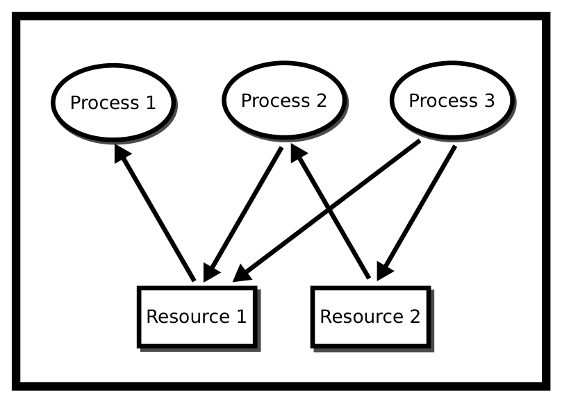
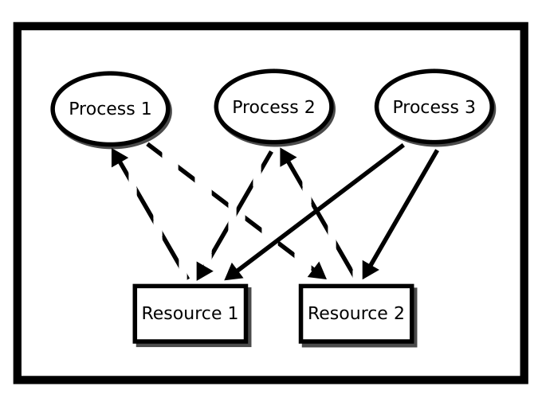
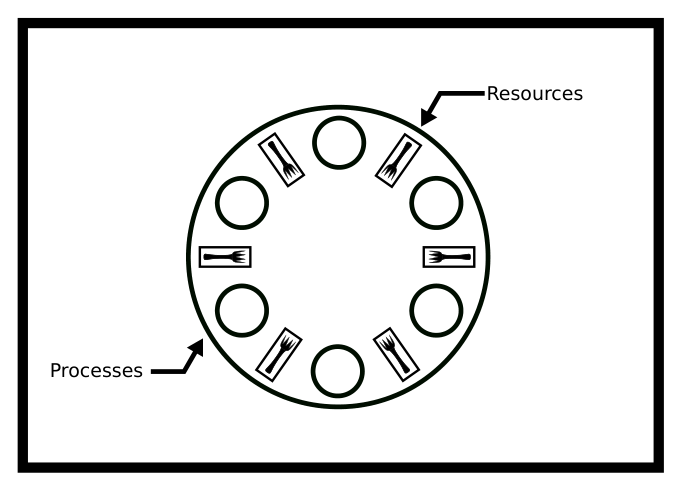
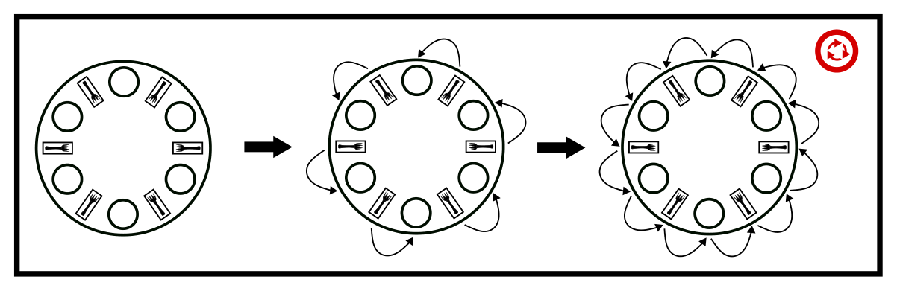
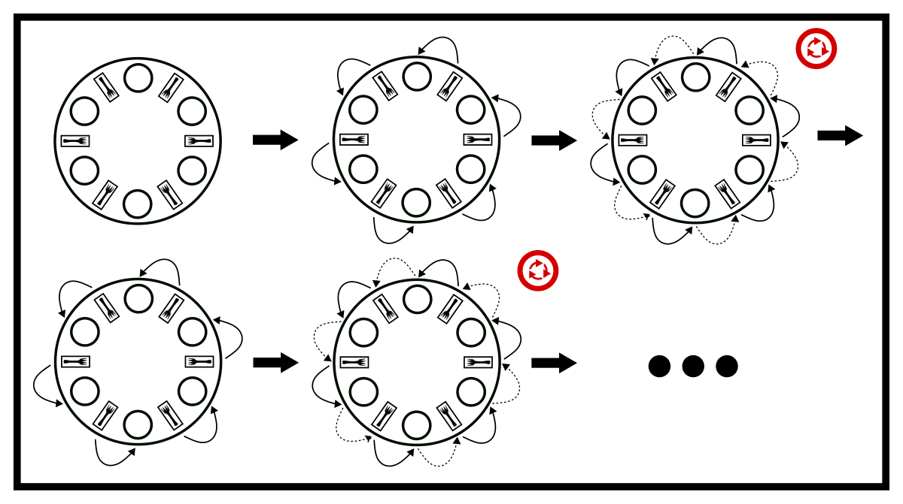
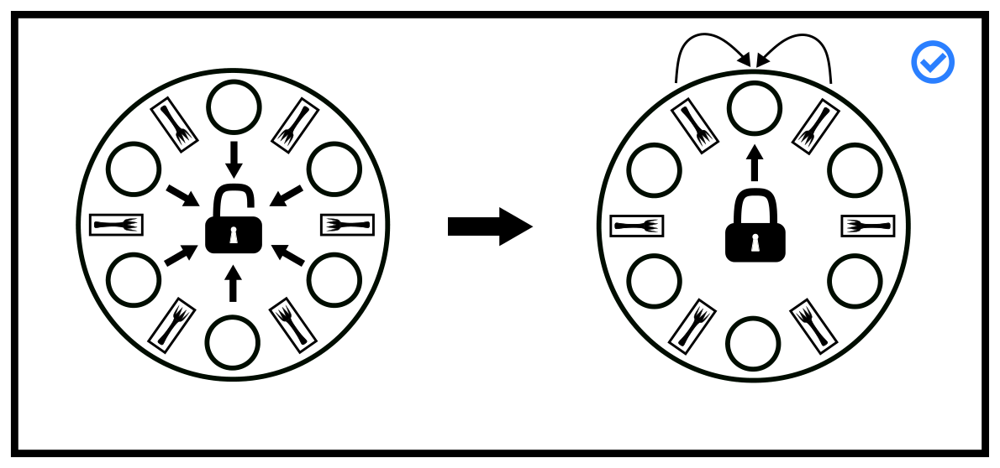
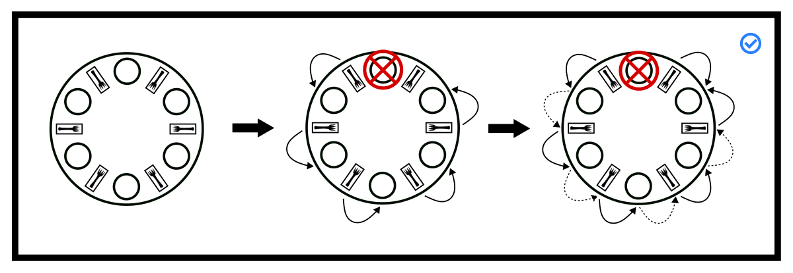
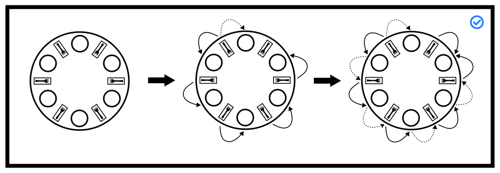

# Chương 8. Deadlock (Bế tắc)

> Bản dịch tiếng Việt từ *System Programming Coursebook* (University of Illinois, CS 241) — B. Venkatesh, L. Angrave et al. Tài liệu gốc được phát hành theo giấy phép [CC BY 4.0](https://creativecommons.org/licenses/by/4.0/); bản dịch giữ nguyên giấy phép này. Nguồn: https://github.com/illinois-cs241/coursebook

> *(Đề từ của chương là điệp khúc bài hát "You Can't Always Get What You Want" — ý nói: bạn không phải lúc nào cũng có được điều mình muốn, nhưng nếu cố gắng, đôi khi bạn sẽ có được điều mình cần.)*
>
> — Các triết gia Jagger & Richards

Deadlock (bế tắc) được định nghĩa là tình trạng một hệ thống không thể tạo ra bất kỳ tiến triển nào (forward progress). Trong phần còn lại của chương, chúng ta định nghĩa một *hệ thống* là một tập các quy tắc mà theo đó một tập các process (tiến trình) có thể chuyển từ trạng thái này sang trạng thái khác, trong đó một trạng thái hoặc là đang làm việc, hoặc là đang chờ một tài nguyên cụ thể. *Tiến triển* được định nghĩa là khi có ít nhất một process đang làm việc, hoặc khi ta có thể trao cho một process đang chờ tài nguyên chính tài nguyên đó. Trong rất nhiều hệ thống, deadlock được "tránh" bằng cách phớt lờ toàn bộ khái niệm này [4, tr. 237]. Bạn đã nghe câu "tắt đi rồi bật lại" chưa? Với những sản phẩm mà rủi ro thấp (hệ điều hành cho người dùng phổ thông, điện thoại), cho phép deadlock xảy ra có thể lại hiệu quả hơn. Nhưng trong những trường hợp mà "thất bại không phải là một lựa chọn" – như Apollo 13 – bạn cần một hệ thống có khả năng theo dõi, phá vỡ hoặc ngăn chặn deadlock. Apollo 13 không thất bại vì deadlock, nhưng phải khởi động lại hệ thống ngay lúc phóng thì chẳng hay ho gì.

Các hệ điều hành trọng yếu (mission-critical) cần sự đảm bảo này một cách hình thức, bởi đánh cược với mạng sống con người không phải là ý hay. Vậy chúng ta làm điều đó thế nào? Chúng ta mô hình hóa bài toán. Dù có một câu nói quen thuộc trong thống kê rằng mọi mô hình đều sai, mô hình càng sát với hệ thống thực thì khả năng phương pháp hoạt động được càng cao.

## 8.1 Đồ thị cấp phát tài nguyên (Resource Allocation Graphs)



*Hình 8.1: Đồ thị cấp phát tài nguyên*

Một cách làm như vậy là mô hình hóa hệ thống bằng đồ thị cấp phát tài nguyên (resource allocation graph – RAG). Đồ thị cấp phát tài nguyên theo dõi tài nguyên nào đang được process nào nắm giữ, và process nào đang chờ một tài nguyên thuộc một loại cụ thể. Đây là một công cụ đơn giản nhưng mạnh mẽ để minh họa cách các process tương tác với nhau có thể rơi vào deadlock. Nếu một process đang sử dụng một tài nguyên, ta vẽ một mũi tên từ nút tài nguyên đến nút process. Nếu một process đang yêu cầu một tài nguyên, ta vẽ một mũi tên từ nút process đến nút tài nguyên. Nếu trong đồ thị cấp phát tài nguyên có một chu trình (cycle) và mỗi tài nguyên trong chu trình đó chỉ cung cấp duy nhất một thể hiện (instance), thì các process sẽ deadlock. Ví dụ, nếu process 1 giữ tài nguyên A, process 2 giữ tài nguyên B, process 1 đang chờ B và process 2 đang chờ A, thì process 1 và 2 sẽ bị deadlock (Hình 8.1). Chúng ta sẽ phân biệt rõ rằng, theo định nghĩa, hệ thống ở trong trạng thái deadlock nếu tất cả các "công nhân" đều không thể thực hiện thao tác nào khác ngoài việc chờ. Ta có thể phát hiện deadlock bằng cách duyệt đồ thị và tìm chu trình bằng một thuật toán duyệt đồ thị, chẳng hạn tìm kiếm theo chiều sâu (Depth First Search – DFS). Đồ thị này được xem là đồ thị có hướng, và ta có thể coi cả process lẫn tài nguyên đều là các nút.

```c
typedef struct {
    int node_id; // Node in this particular graph
    Graph **reachable_nodes; // List of nodes that can be reached from this node
    int size_reachable_nodes; // Size of the List
} Graph;

// isCyclic() traverses a graph using DFS and detects whether it has a cycle
// isCyclic() uses a recursive approach
// G points to a node in a graph, which can be either a resource or a process
// is_visited is an array indexed with node_id and initialized with zeros (false) to record whether a particular node has been visited
int isCyclic(Graph *G, int* is_visited) {
    if (this graph has been visited) {
        // Oh! the cycle is found
        return true;
    } else {
        1. Mark this node as visited
        2. Traverse through all nodes in the reachable_nodes
        3. Call isCyclic() for each node
        4. Evaluate the return value of isCyclic()
    }
    // Nope, this graph is acyclic
    return false;
}
```



*Hình 8.2: Deadlock dựa trên đồ thị*

## 8.2 Các điều kiện Coffman (Coffman Conditions)

Chắc chắn chu trình trong RAG xảy ra thường xuyên trong một hệ điều hành, vậy tại sao hệ điều hành không dừng hẳn lại? Bạn có thể không thấy deadlock bởi hệ điều hành có thể chiếm quyền (preempt) một số process và phá vỡ chu trình, nhưng vẫn có khả năng ba process cô đơn của bạn rơi vào deadlock.

Có bốn điều kiện cần và đủ cho deadlock – nghĩa là nếu các điều kiện này được thỏa mãn thì có xác suất khác không rằng hệ thống sẽ deadlock ở bất kỳ vòng lặp nào. Chúng được gọi là các điều kiện Coffman (Coffman Conditions) [1].

- **Mutual Exclusion** (loại trừ lẫn nhau): Không có hai process nào có thể lấy được cùng một tài nguyên tại cùng một thời điểm.
- **Circular Wait** (chờ vòng tròn): Tồn tại một chu trình trong đồ thị cấp phát tài nguyên, hay nói cách khác, tồn tại một tập các process {P1, P2, ...} sao cho P1 đang chờ tài nguyên do P2 giữ, P2 lại đang chờ P3, ..., và cứ thế cho đến process đang chờ P1.
- **Hold and Wait** (giữ và chờ): Một khi đã lấy được một tài nguyên, process giữ tài nguyên đó ở trạng thái khóa.
- **No Pre-emption** (không chiếm quyền): Không gì có thể buộc process từ bỏ một tài nguyên.

> **Chứng minh:** Deadlock có thể xảy ra khi và chỉ khi bốn điều kiện Coffman được thỏa mãn.
>
> $\rightarrow$ Nếu hệ thống bị deadlock thì bốn điều kiện Coffman hiện diện.
>
> - Để phản chứng, giả sử không có circular wait. Khi đó đồ thị cấp phát tài nguyên không có chu trình, nghĩa là có ít nhất một process không phải chờ bất kỳ tài nguyên nào được giải phóng. Vì hệ thống có thể tiến triển, hệ thống không bị deadlock.
> - Để phản chứng, giả sử không có mutual exclusion. Khi đó không process nào phải chờ process khác để lấy tài nguyên. Điều này phá vỡ circular wait và lập luận ở trên chứng minh tính đúng đắn.
> - Để phản chứng, giả sử các process không hold and wait nhưng hệ thống vẫn deadlock. Vì ta có circular wait từ điều kiện thứ nhất, ít nhất một process phải đang chờ một process khác. Nếu vậy mà các process lại không hold and wait, thì phải có một process buông một tài nguyên ra. Vì hệ thống đã tiến triển, nó không thể bị deadlock.
> - Để phản chứng, giả sử ta có preemption (chiếm quyền) nhưng hệ thống không thể thoát khỏi deadlock. Hãy để một process, hoặc tạo ra một process, nhận ra circular wait – vốn phải hiện diện theo lập luận ở trên – và phá vỡ một trong các mắt xích. Theo nhánh thứ nhất, hệ thống hẳn đã không deadlock.
>
> $\leftarrow$ Nếu bốn điều kiện hiện diện thì hệ thống bị deadlock. Chúng ta sẽ chứng minh rằng nếu hệ thống không bị deadlock thì bốn điều kiện không hiện diện. Dù chứng minh này không hình thức, hãy xây dựng một hệ thống với ba yêu cầu, không tính circular wait. Giả sử có một tập process $P = \{p_1, p_2, \ldots, p_n\}$ và một tập tài nguyên $R = \{r_1, r_2, \ldots, r_m\}$. Để đơn giản, mỗi process chỉ có thể yêu cầu một tài nguyên tại một thời điểm, nhưng chứng minh có thể tổng quát hóa cho nhiều tài nguyên. Giả sử hệ thống ở một trạng thái nào đó tại thời điểm $t$. Giả sử trạng thái của hệ thống là một bộ $(h_t, w_t)$, trong đó có hai hàm: $h_t : R \rightarrow P \cup \{\text{unassigned}\}$ ánh xạ mỗi tài nguyên đến process sở hữu nó (đây là một hàm, nghĩa là ta có mutual exclusion) hoặc đến trạng thái chưa được gán (unassigned); và $w_t : P \rightarrow R \cup \{\text{satisfied}\}$ ánh xạ yêu cầu của mỗi process đến một tài nguyên, hoặc đến trạng thái đã được thỏa mãn (satisfied). Nếu process đã được thỏa mãn, ta coi công việc là tầm thường và process thoát ra, giải phóng mọi tài nguyên – điều này cũng có thể tổng quát hóa. Gọi $L_t \subseteq P \times R$ là tập các danh sách yêu cầu mà một process dùng để giải phóng một tài nguyên tại một thời điểm bất kỳ. Hệ thống tiến hóa theo các bước sau tại mỗi thời điểm.
>
> - Giải phóng mọi tài nguyên trong $L_t$.
> - Tìm một process đang yêu cầu một tài nguyên.
> - Nếu tài nguyên đó khả dụng, trao nó cho process, sinh ra $(h_{t+1}, w_{t+1})$ mới và thoát khỏi vòng lặp hiện tại.
> - Nếu không, tìm một process khác và thử lại thủ tục cấp phát tài nguyên ở bước trước.
>
> Nếu đã xét hết mọi process, tất cả đều đang yêu cầu một tài nguyên và không process nào có thể được cấp tài nguyên, ta coi hệ thống bị deadlock. Một cách hình thức hơn, hệ thống này bị deadlock nghĩa là $\exists t_0, \forall t \geq t_0, \forall p \in P, w_t(p) \neq \text{satisfied}$ và $\exists q, q \neq p \rightarrow h_t(w_t(p)) = q$ (đây là điều ta cần chứng minh).
>
> Mutual exclusion và no pre-emption đã được mã hóa sẵn trong hệ thống. Circular wait kéo theo điều kiện thứ hai: tài nguyên (mà một process chờ) được sở hữu bởi một process khác, process đó lại chờ tài nguyên được sở hữu bởi một process khác nữa, nghĩa là ở trạng thái này $\forall p \in P, \exists q \neq p \rightarrow h_t(w_t(p)) = q$. Circular wait cũng kéo theo rằng ở trạng thái hiện tại, không process nào được thỏa mãn, nghĩa là ở trạng thái này $\forall p \in P, w_t(p) \neq \text{satisfied}$. Hold and wait đơn giản chứng minh điều kiện rằng từ thời điểm này trở đi, hệ thống sẽ không thay đổi – đó là tất cả các điều kiện ta cần chỉ ra. $\square$

Nếu một hệ thống phá vỡ bất kỳ điều kiện nào trong số đó, nó không thể có deadlock! Hãy xét tình huống hai sinh viên đều cần cả bút lẫn giấy để viết, mà mỗi thứ chỉ có một. Phá vỡ mutual exclusion nghĩa là hai sinh viên dùng chung bút và giấy. Phá vỡ circular wait có thể là hai sinh viên thỏa thuận lấy bút trước rồi mới lấy giấy. Chứng minh bằng phản chứng: giả sử deadlock xảy ra dưới quy tắc và các điều kiện đó. Không mất tính tổng quát, điều đó có nghĩa là một sinh viên phải đang chờ bút trong khi giữ giấy, và sinh viên kia cũng đang chờ bút trong khi giữ giấy. Ta đã tự mâu thuẫn, vì có một sinh viên đã lấy giấy mà không lấy bút, nên deadlock không thể xảy ra. Phá vỡ hold and wait có thể là hai sinh viên thử lấy bút rồi lấy giấy, và nếu một sinh viên không lấy được giấy thì bỏ bút xuống. Cách này đưa vào một vấn đề mới gọi là livelock, sẽ được bàn đến sau. Phá vỡ preemption nghĩa là nếu hai sinh viên rơi vào deadlock, giáo viên có thể bước vào và phá vỡ deadlock bằng cách trao cho một sinh viên món đồ đang bị giữ, hoặc bảo cả hai đặt đồ xuống.

Livelock có liên quan đến deadlock. Hãy xét lời giải phá vỡ hold-and-wait ở trên. Dù tránh được deadlock, nếu triết gia cứ nhặt lên cùng một dụng cụ hết lần này đến lần khác theo cùng một khuôn mẫu thì sẽ chẳng có việc gì được hoàn thành. Livelock nhìn chung khó phát hiện hơn vì với hệ điều hành bên ngoài, các process thường trông như vẫn đang làm việc, trong khi với deadlock, hệ điều hành thường biết khi hai process đang chờ một tài nguyên toàn hệ thống. Một vấn đề khác là có điều kiện cần cho livelock (tức là deadlock không xảy ra) nhưng không có điều kiện đủ – nghĩa là không có tập quy tắc nào mà theo đó livelock bắt buộc phải xảy ra. Bạn phải chứng minh hình thức trong một hệ thống bằng cái gọi là bất biến (invariant). Ta phải liệt kê từng bước của hệ thống, và nếu mỗi bước cuối cùng – sau một số hữu hạn bước – đều dẫn đến tiến triển, thì hệ thống không thể livelock. Thậm chí còn có những hệ thống tốt hơn chứng minh được chờ có giới hạn (bounded wait): hệ thống chỉ có thể bị livelock trong tối đa $n$ chu kỳ, điều có thể quan trọng với những thứ như sàn giao dịch chứng khoán.

## 8.3 Các hướng tiếp cận giải quyết Livelock và Deadlock (Approaches to Solving Livelock and Deadlock)

Phớt lờ deadlock là cách tiếp cận hiển nhiên nhất. Khá hài hước, cách tiếp cận này được đặt tên là thuật toán Đà điểu (Ostrich Algorithm). Dù không có nguồn gốc rõ ràng, ý tưởng của thuật toán đến từ hình ảnh con đà điểu vùi đầu vào cát. Khi hệ điều hành phát hiện deadlock, nó không làm gì khác thường cả, và deadlock thường tự biến mất. Hệ điều hành chiếm quyền (preempt) các process khi dừng chúng để chuyển ngữ cảnh (context switch). Hệ điều hành có thể ngắt bất kỳ system call (lời gọi hệ thống) nào, và nhờ đó có khả năng phá vỡ kịch bản deadlock. Hệ điều hành cũng đặt một số file ở chế độ chỉ đọc, khiến tài nguyên đó trở nên chia sẻ được. Điều mà thuật toán này muốn nói là: nếu có một kẻ đối địch cố tình viết một chương trình – hay tương đương, một người dùng viết chương trình kém – thì hệ điều hành sẽ deadlock. Trong đời sống thường ngày, như vậy thường là ổn. Khi không ổn, ta có thể quay sang phương pháp sau.

Phát hiện deadlock (deadlock detection) cho phép hệ thống đi vào trạng thái deadlock. Sau khi đi vào, hệ thống dùng thông tin có được để phá vỡ deadlock. Ví dụ, xét nhiều process cùng truy cập các file. Hệ điều hành có thể theo dõi tất cả các file/tài nguyên thông qua file descriptor (bộ mô tả tệp) ở một mức nào đó, hoặc trừu tượng hóa qua một API hoặc trực tiếp. Nếu hệ điều hành phát hiện một chu trình có hướng trong bảng file descriptor của hệ điều hành, nó có thể phá vỡ sự nắm giữ của một process – chẳng hạn thông qua lập lịch – và để hệ thống tiếp tục. Lý do đây là lựa chọn phổ biến trong lĩnh vực này là không có cách nào biết được một chương trình sẽ chọn những tài nguyên nào nếu không chạy chương trình đó. Đây là một mở rộng của định lý Rice [3], phát biểu rằng ta không thể biết bất kỳ đặc tính ngữ nghĩa nào mà không chạy chương trình (ngữ nghĩa ở đây là những thứ như chương trình cố mở file nào). Vậy nên về mặt lý thuyết, cách này là hợp lý. Vấn đề nảy sinh sau đó là ta có thể rơi vào kịch bản livelock nếu cứ chiếm quyền một tập tài nguyên hết lần này đến lần khác. Cách vượt qua điều này chủ yếu mang tính xác suất. Hệ điều hành chọn ngẫu nhiên một tài nguyên để phá vỡ hold-and-wait. Giờ đây, dù người dùng có thể viết ra một chương trình mà việc phá vỡ hold and wait trên từng tài nguyên sẽ dẫn đến livelock, điều này không xảy ra thường xuyên trên các máy chạy chương trình trong thực tế, hoặc livelock nếu có xảy ra thì chỉ kéo dài vài chu kỳ. Những hệ thống như vậy phù hợp với các sản phẩm cần duy trì trạng thái không deadlock nhưng có thể chấp nhận một xác suất nhỏ bị livelock trong thời gian ngắn.

Ngoài ra, chúng ta có thuật toán Chủ ngân hàng (Banker's Algorithm), với tiền đề cơ bản là ngân hàng không bao giờ cạn tiền, nhờ đó ngăn được livelock. Bạn có thể xem phụ lục để biết thêm chi tiết.

## 8.4 Dining Philosophers (Bài toán các triết gia ăn tối)

Bài toán Dining Philosophers (các triết gia ăn tối) là một bài toán đồng bộ hóa kinh điển. Hãy tưởng tượng chúng ta mời $n$ (giả sử là 6) triết gia đến dùng bữa. Ta xếp họ ngồi quanh một chiếc bàn có 6 chiếc đũa, mỗi chiếc nằm giữa hai triết gia. Mỗi triết gia luân phiên giữa muốn ăn và muốn suy nghĩ. Để ăn, triết gia phải nhặt lên hai chiếc đũa ở hai bên vị trí của mình. Bài toán gốc yêu cầu mỗi triết gia phải có hai chiếc nĩa, nhưng người ta có thể ăn chỉ với một chiếc nĩa nên ta loại trừ cách đặt vấn đề đó. Tuy nhiên, những chiếc đũa này được dùng chung với người ngồi cạnh.



*Hình 8.3: Dining Philosophers*

Liệu có thể thiết kế một lời giải hiệu quả sao cho tất cả các triết gia đều được ăn? Hay sẽ có triết gia bị bỏ đói (starve), không bao giờ lấy được chiếc đũa thứ hai? Hay tất cả sẽ rơi vào deadlock? Ví dụ, hãy tưởng tượng mỗi vị khách nhặt chiếc đũa bên trái mình lên rồi chờ chiếc đũa bên phải được rảnh. Ối – các triết gia của chúng ta đã deadlock! Về cơ bản, các triết gia đều giống hệt nhau, nghĩa là mỗi triết gia có cùng một tập chỉ thị dựa trên các triết gia khác, tức là bạn không thể bảo mọi triết gia ở vị trí chẵn làm một việc còn mọi triết gia ở vị trí lẻ làm việc khác.

### 8.4.1 Các lời giải thất bại (Failed Solutions)

```c
void* philosopher(void* forks){
  info phil_info = forks;
  pthread_mutex_t* left_fork = phil_info->left_fork;
  pthread_mutex_t* right_fork = phil_info->right_fork;
  while(phil_info->simulation){
    pthread_mutex_lock(left_fork);
    pthread_mutex_lock(right_fork);
    eat(left_fork, right_fork);
    pthread_mutex_unlock(left_fork);
    pthread_mutex_unlock(right_fork);
  }
}
```

Trông có vẻ ổn, nhưng... Chuyện gì xảy ra nếu mọi người đều nhặt nĩa bên trái lên và chờ nĩa bên phải? Chúng ta đã làm chương trình deadlock. Điều quan trọng cần lưu ý là deadlock không phải lúc nào cũng xảy ra, và xác suất lời giải này deadlock giảm dần khi số triết gia tăng lên. Điều quan trọng là rốt cuộc lời giải này *sẽ* deadlock, khiến các thread bị đói (starve) – và đó là điều tệ. Dưới đây là một đồ thị cấp phát tài nguyên đơn giản cho thấy hệ thống có thể deadlock như thế nào.



*Hình 8.4: Chu trình trái–phải của các triết gia ăn tối*

Vậy là bây giờ bạn đang nghĩ đến việc phá vỡ một trong các điều kiện Coffman. Hãy phá vỡ Hold and Wait!

```c
void* philosopher(void* forks){
  info phil_info = forks;
  pthread_mutex_t* left_fork = phil_info->left_fork;
  pthread_mutex_t* right_fork = phil_info->right_fork;
  while(phil_info->simulation){
    int left_succeed = pthread_mutex_trylock(left_fork);
    if (!left_succeed) {
      sleep();
      continue;
    }
    int right_succeed = pthread_mutex_trylock(right_fork);
    if (!right_succeed) {
      pthread_mutex_unlock(left_fork);
      sleep();
      continue;
    }
    eat(left_fork, right_fork);
    pthread_mutex_unlock(left_fork);
    pthread_mutex_unlock(right_fork);
  }
}
```

Giờ triết gia của chúng ta nhặt nĩa bên trái lên và thử lấy nĩa bên phải. Nếu nĩa phải rảnh, họ ăn. Nếu không, họ đặt nĩa trái xuống và thử lại. Không còn deadlock! Nhưng, có một vấn đề. Chuyện gì xảy ra nếu tất cả các triết gia cùng lúc nhặt nĩa trái lên, thử lấy nĩa phải, đặt nĩa trái xuống, nhặt nĩa trái lên, thử lấy nĩa phải, và cứ thế mãi. Dưới đây là diễn biến theo thời gian của hệ thống.



*Hình 8.5: Thất bại do livelock*

Chúng ta giờ đã làm lời giải của mình livelock! Các triết gia tội nghiệp vẫn đang đói, vậy hãy cho họ vài lời giải tử tế.

## 8.5 Các lời giải khả thi (Viable Solutions)

Lời giải trọng tài (arbitrator) ngây thơ có một trọng tài duy nhất – ví dụ một mutex. Mỗi triết gia xin phép trọng tài để được ăn, hoặc trylock mutex của trọng tài. Lời giải này cho phép mỗi lần chỉ một triết gia được ăn. Khi họ ăn xong, một triết gia khác có thể xin phép ăn. Cách này ngăn deadlock vì không có circular wait! Không triết gia nào phải chờ bất kỳ triết gia nào khác. Lời giải trọng tài nâng cao là cài đặt một lớp (class) xác định xem những chiếc nĩa của triết gia có đang trong tay trọng tài hay không. Nếu có, trọng tài trao chúng cho triết gia, để anh ta ăn, rồi thu nĩa lại. Cách này có thêm lợi ích là nhiều triết gia có thể ăn cùng lúc.

Có rất nhiều vấn đề với các lời giải này. Một là chúng chậm và có một điểm hỏng đơn (single point of failure). Giả sử mọi triết gia đều thiện chí, trọng tài cần phải công bằng. Trong các hệ thống thực tế, trọng tài có xu hướng trao nĩa cho cùng những process nhất định vì lập lịch hoặc tính giả ngẫu nhiên. Một điều quan trọng khác cần lưu ý là cách này ngăn deadlock cho toàn bộ hệ thống. Nhưng trong mô hình các triết gia ăn tối của chúng ta, triết gia phải tự mình nhả khóa. Khi đó, bạn có thể xét trường hợp triết gia ác ý (giả sử là Descartes, vì những Ác quỷ của ông) có thể giữ trọng tài mãi mãi. Anh ta sẽ tiến triển, và hệ thống cũng sẽ tiến triển, nhưng không có cách nào đảm bảo *mỗi* process đều tiến triển nếu không giả định điều gì đó về các process hoặc không có preemption thực sự – nghĩa là một quyền lực cao hơn (giả sử là Steve Jobs) buộc họ phải ngừng ăn.

> **Chứng minh:** Lời giải trọng tài không deadlock
>
> Chứng minh này đơn giản hết mức có thể. Mỗi lần chỉ có một triết gia được yêu cầu tài nguyên. Không có cách nào tạo ra chu trình trong đồ thị cấp phát tài nguyên khi chỉ có một triết gia hành động theo kiểu nhặt nĩa trái rồi nĩa phải – đó là điều ta cần chỉ ra. $\square$



*Hình 8.6: Sơ đồ trọng tài*

### 8.5.1 Rời khỏi bàn – Lời giải của Stallings (Leaving the Table)

Tại sao lời giải đầu tiên deadlock? Chà, có $n$ triết gia và $n$ chiếc đũa. Nếu chỉ có 1 triết gia ở bàn thì sao? Có thể deadlock không? Không. Thế 2 triết gia? 3? Bạn thấy hướng đi rồi đấy. Lời giải của Stallings [5, tr. 280] loại bớt triết gia khỏi bàn cho đến khi deadlock không còn khả năng xảy ra – hãy nghĩ xem con số kỳ diệu của số triết gia ở bàn là bao nhiêu. Cách thực hiện điều này trong hệ thống thực là thông qua semaphore và chỉ cho một số lượng nhất định triết gia đi qua. Cách này có lợi ích là nhiều triết gia có thể cùng ăn.

Trong trường hợp các triết gia không ác ý, lời giải này đòi hỏi rất nhiều lần chuyển ngữ cảnh tốn thời gian. Cũng không có cách đáng tin cậy nào để biết trước số lượng tài nguyên. Trong bài toán các triết gia ăn tối, điều này được giải quyết vì mọi thứ đều đã biết, nhưng khi cố đặc tả một hệ điều hành mà hệ thống không biết file nào sẽ được process nào mở, ta có thể đi đến một lời giải sai. Và một lần nữa, vì semaphore là cấu trúc của hệ thống, chúng tuân theo đồng hồ định thời của hệ thống, nghĩa là cùng những process đó có xu hướng được đưa trở lại hàng đợi. Giờ nếu một triết gia trở nên ác ý, vấn đề trở thành không có preemption. Một triết gia có thể ăn bao lâu tùy thích và hệ thống vẫn tiếp tục hoạt động, nhưng điều đó có nghĩa là tính công bằng của lời giải này có thể thấp trong trường hợp xấu nhất. Cách này hoạt động tốt nhất khi kết hợp với timeout hoặc chuyển ngữ cảnh cưỡng bức để đảm bảo thời gian chờ có giới hạn.

> **Chứng minh:** Lời giải của Stallings không deadlock. Hãy đánh số các triết gia $\{p_0, p_1, \ldots, p_{n-1}\}$ và các tài nguyên $\{r_0, r_1, \ldots, r_{n-1}\}$. Triết gia $p_i$ cần tài nguyên $r_{(i-1) \bmod n}$ và $r_{(i+1) \bmod n}$. Không mất tính tổng quát, hãy đưa $p_i$ ra khỏi bức tranh. Trước đó, mỗi tài nguyên có đúng hai triết gia có thể dùng nó. Giờ các tài nguyên $r_{(i-1) \bmod n}$ và $r_{(i+1) \bmod n}$ chỉ còn một triết gia chờ mỗi tài nguyên. Kể cả khi hold and wait, no preemption và mutual exclusion đều hiện diện, các tài nguyên này không bao giờ có thể rơi vào trạng thái một triết gia yêu cầu chúng trong khi một triết gia khác đang giữ, vì chỉ có một triết gia có thể yêu cầu chúng. Vì không có cách nào khác để sinh ra chu trình, circular wait không thể xảy ra. Vì circular wait không thể xảy ra, deadlock không thể xảy ra. $\square$

Dưới đây là hình minh họa trường hợp xấu nhất. Hệ thống sắp deadlock, nhưng cách tiếp cận này giải quyết được.



*Hình 8.7: Lời giải Stallings – suýt deadlock*

### 8.5.2 Thứ tự bộ phận – Lời giải của Dijkstra (Partial Ordering)

Đây là lời giải của Dijkstra [2, tr. 20]. Ông chính là người đã đề xuất bài toán này trong một kỳ thi. Tại sao lời giải đầu tiên deadlock? Dijkstra cho rằng triết gia cuối cùng nhặt nĩa trái lên (khiến lời giải deadlock) nên nhặt nĩa phải thay vào đó. Ông thực hiện điều này bằng cách đánh số các nĩa từ 1..n và bảo mỗi triết gia nhặt chiếc nĩa có số nhỏ hơn trước. Hãy chạy lại tình huống deadlock. Mọi người đều thử nhặt chiếc nĩa có số nhỏ hơn trước. Triết gia 1 lấy nĩa 1, triết gia 2 lấy nĩa 2, và cứ thế cho đến triết gia $n$. Người này phải chọn giữa nĩa 1 và nĩa $n$. Nĩa 1 đã bị triết gia 1 cầm, nên anh ta không thể nhặt chiếc nĩa đó, nghĩa là anh ta sẽ không nhặt nĩa $n$. Chúng ta đã phá vỡ circular wait! Nghĩa là deadlock không thể xảy ra.

Một số vấn đề là một thực thể hoặc cần biết trước tập hữu hạn các tài nguyên, hoặc phải có khả năng tạo ra một thứ tự bộ phận (partial order) nhất quán sao cho circular wait không thể xảy ra. Điều này cũng hàm ý cần có một thực thể nào đó – hệ điều hành hoặc một process khác – quyết định con số, và mọi triết gia đều phải thống nhất về con số đó khi có tài nguyên mới xuất hiện. Như ta đã thấy ở các lời giải trước, cách này dựa vào chuyển ngữ cảnh. Nó ưu tiên những triết gia đã được ăn rồi, nhưng có thể làm công bằng hơn bằng cách đưa vào các khoảng ngủ và chờ ngẫu nhiên.

> **Chứng minh:** Lời giải của Dijkstra không deadlock
>
> Chứng minh tương tự chứng minh trước. Hãy đánh số các triết gia $\{p_0, p_1, \ldots, p_{n-1}\}$ và các tài nguyên $\{r_0, r_1, \ldots, r_{n-1}\}$. Triết gia $p_i$ cần tài nguyên $r_{(i-1) \bmod n}$ và $r_{(i+1) \bmod n}$. Mỗi triết gia sẽ lấy $r_{(i-1) \bmod n}$ rồi đến $r_{(i+1) \bmod n}$, nhưng triết gia cuối cùng sẽ lấy theo thứ tự ngược lại. Kể cả khi hold and wait, no preemption và mutual exclusion đều hiện diện. Vì triết gia cuối cùng sẽ lấy $r_{n-1}$ rồi đến $r_0$, có hai trường hợp: hoặc triết gia đó có được khóa thứ nhất, hoặc không.
>
> Nếu triết gia cuối $p_{n-1}$ giữ khóa thứ nhất, nghĩa là triết gia trước đó $p_{n-2}$ đang chờ $r_{n-1}$, nghĩa là $r_{n-2}$ đang rảnh. Vì không có gì khác chặn lại, triết gia trước đó nữa $p_{n-3}$ sẽ lấy được khóa thứ nhất của mình. Đây chính là quy về chứng minh của Stallings ở trên, vì giờ ta có $n$ tài nguyên nhưng chỉ $n-1$ triết gia, nghĩa là không thể deadlock.
>
> Nếu triết gia đó không có được khóa thứ nhất, thì ta cũng quy về chứng minh của Stallings ở trên, vì giờ có $n-1$ triết gia tranh giành $n$ tài nguyên. Vì không thể đi đến deadlock trong cả hai trường hợp, lời giải này không thể deadlock – đó là điều ta cần chỉ ra. $\square$



*Hình 8.8: Lời giải Stallings – deadlock một phần*

Còn một vài lời giải khác (nĩa sạch/nĩa bẩn và mô hình actor) trong phụ lục.

## 8.6 Chủ đề (Topics)

- Các điều kiện Coffman
- Đồ thị cấp phát tài nguyên
- Dining Philosophers
- Các lời giải DP thất bại
- Các lời giải DP bị livelock
- Các lời giải DP hoạt động được: lợi ích/hạn chế
- Deadlock kiểu Ron Swanson

## 8.7 Câu hỏi (Questions)

- Các điều kiện Coffman là gì?
- Mỗi điều kiện Coffman có nghĩa là gì? Hãy định nghĩa từng điều kiện.
- Hãy đưa ra một ví dụ đời thực về việc lần lượt phá vỡ từng điều kiện Coffman. Một tình huống để cân nhắc: các họa sĩ, sơn, cọ vẽ, v.v. Bạn sẽ đảm bảo công việc được hoàn thành như thế nào?
- Điều kiện Coffman nào không được thỏa mãn trong đoạn mã sau?

  ```c
  // Get both locks or none
  pthread_mutex_lock(a);
  if(pthread_mutex_trylock( b )) {/* failure */
    pthread_mutex_unlock( a );
  }
  ```

- Các lời gọi sau được thực hiện

  ```c
  // Thread 1
  pthread_mutex_lock(m1) // success
  pthread_mutex_lock(m2) // blocks

  // Thread 2
  pthread_mutex_lock(m2) // success
  pthread_mutex_lock(m1) // blocks
  ```

  Chuyện gì xảy ra và tại sao? Chuyện gì xảy ra nếu một thread thứ ba gọi `pthread_mutex_lock(m1)`?

- Có bao nhiêu process bị chặn? Như thường lệ, giả sử một process có thể hoàn thành nếu nó lấy được tất cả các tài nguyên được liệt kê dưới đây.
  - P1 lấy được R1
  - P2 lấy được R2
  - P1 lấy được R3
  - P2 chờ R3
  - P3 lấy được R5
  - P1 chờ R4
  - P3 chờ R1
  - P4 chờ R5
  - P5 chờ R1

Hãy vẽ đồ thị tài nguyên!

## Tài liệu tham khảo (Bibliography)

[1] Edward G Coffman, Melanie Elphick, and Arie Shoshani. System deadlocks. *ACM Computing Surveys (CSUR)*, 3(2):67–78, 1971.

[2] Edsger W. Dijkstra. Hierarchical ordering of sequential processes. published as [? ]WD:EWD310pub, n.d. URL http://www.cs.utexas.edu/users/EWD/ewd03xx/EWD310.PDF.

[3] H. G. Rice. Classes of recursively enumerable sets and their decision problems. *Transactions of the American Mathematical Society*, 74(2):358–366, 1953. ISSN 00029947. URL http://www.jstor.org/stable/1990888.

[4] A. Silberschatz, P.B. Galvin, and G. Gagne. *OPERATING SYSTEM PRINCIPLES, 7TH ED.* Wiley student edition. Wiley India Pvt. Limited, 2006. ISBN 9788126509621. URL https://books.google.com/books?id=WjvX0HmVTlMC.

[5] William Stallings. *Operating Systems: Internals and Design Principles 7th Ed. by Stallings (International Economy Edition)*. PE, 2011. ISBN 9332518807. URL https://www.amazon.com/Operating-Systems-Internals-Principles-International/dp/9332518807?SubscriptionId=0JYN1NVW651KCA56C102&tag=techkie-20&linkCode=xm2&camp=2025&creative=165953&creativeASIN=9332518807.
