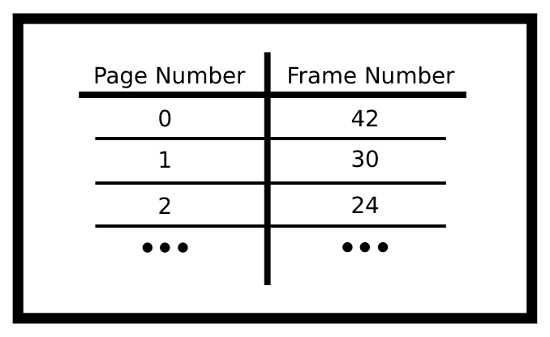
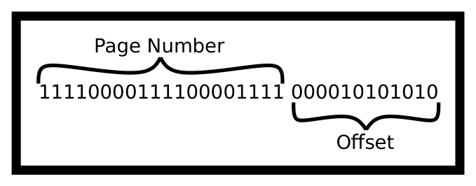
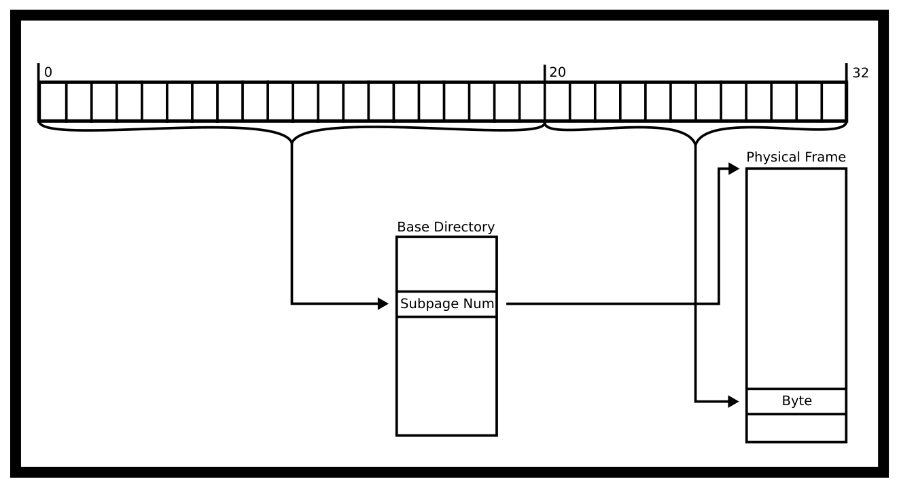
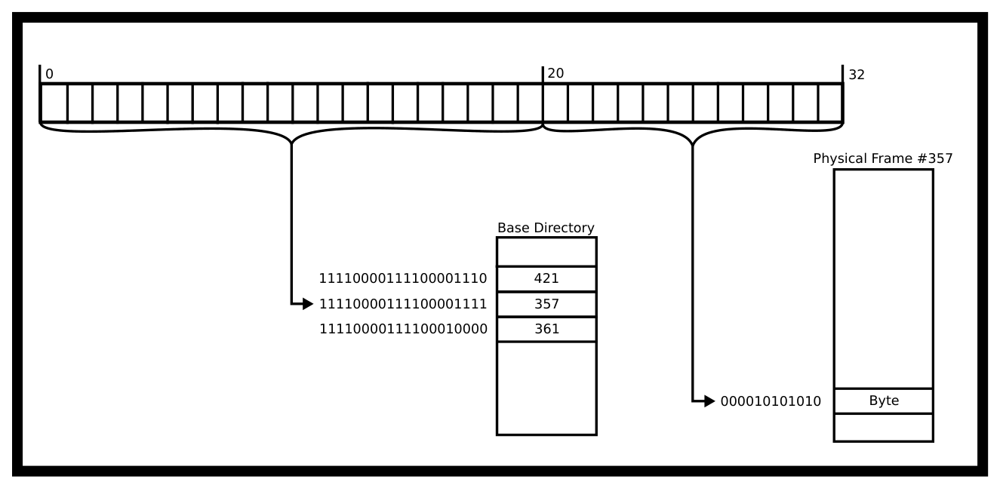
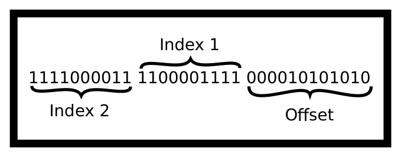
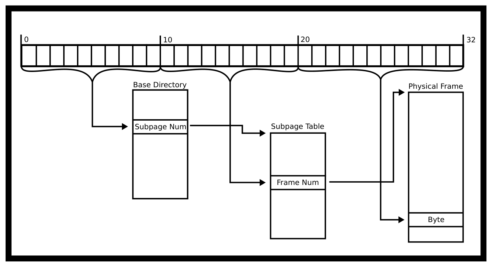
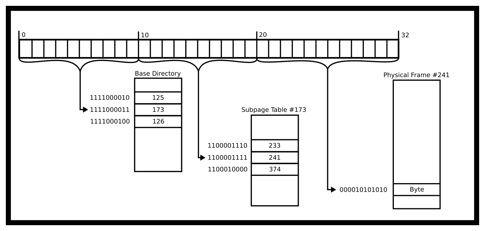
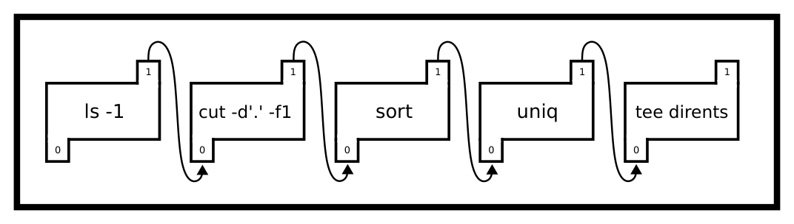

# Chương 9. Bộ nhớ ảo và Giao tiếp liên tiến trình (Virtual Memory and Interprocess Communication)

> Bản dịch tiếng Việt từ *System Programming Coursebook* (University of Illinois, CS 241) — B. Venkatesh, L. Angrave et al. Tài liệu gốc được phát hành theo giấy phép [CC BY 4.0](https://creativecommons.org/licenses/by/4.0/); bản dịch giữ nguyên giấy phép này. Nguồn: https://github.com/illinois-cs241/coursebook

> Abbott: Giờ thì anh hiểu rồi đấy.  
> Costello: Tôi ném bóng cho Naturally ("Đương Nhiên").  
> Abbott: Không phải! Anh ném cho Who ("Ai") chứ!  
> Costello: Naturally ("Đương nhiên").  
> Abbott: Đấy, đúng rồi — cứ nói như thế.  
> Costello: Thì tôi nói thế mà.  
>
> — Abbott và Costello bàn về giao tiếp hiệu quả

Trong các hệ thống nhúng đơn giản và các máy tính đời đầu, process (tiến trình) truy cập bộ nhớ một cách trực tiếp – "Địa chỉ 1234" ứng với một byte cụ thể được lưu ở một vị trí cụ thể trong bộ nhớ vật lý. Chẳng hạn, máy IBM 709 phải đọc và ghi trực tiếp lên băng từ mà không có bất kỳ tầng trừu tượng nào [3, tr. 65]. Ngay cả ở những hệ thống ra đời sau đó, việc áp dụng bộ nhớ ảo vẫn rất khó khăn vì bộ nhớ ảo đòi hỏi phải thay đổi toàn bộ chu trình nạp lệnh (fetch cycle) thông qua phần cứng – một thay đổi mà nhiều nhà sản xuất khi ấy vẫn cho là tốn kém. Trên PDP-10, người ta dùng một cách giải quyết tình thế là dùng các register (thanh ghi) khác nhau cho mỗi process, rồi bộ nhớ ảo mới được bổ sung sau [1]. Trong các hệ thống hiện đại, điều này không còn đúng nữa. Thay vào đó, mỗi process được cô lập, và có một quá trình dịch giữa địa chỉ của một lệnh CPU hay một mẩu dữ liệu cụ thể của process với byte thực sự trong bộ nhớ vật lý ("RAM"). Địa chỉ bộ nhớ không còn ánh xạ thẳng tới địa chỉ vật lý nữa. Process chạy bên trong virtual memory (bộ nhớ ảo). Bộ nhớ ảo giữ cho các process được an toàn vì một process không thể trực tiếp đọc hay sửa bộ nhớ của process khác. Bộ nhớ ảo cũng cho phép hệ thống cấp phát và cấp phát lại các phần bộ nhớ cho các process khác nhau một cách hiệu quả. Quá trình dịch địa chỉ bộ nhớ hiện đại diễn ra như sau.

1. Một process đưa ra một yêu cầu truy cập bộ nhớ.

2. Mạch điện trước hết kiểm tra Translation Lookaside Buffer (TLB) xem page (trang) chứa địa chỉ đó đã được cache vào bộ nhớ hay chưa. Nếu tìm thấy, nó nhảy thẳng tới giai đoạn đọc/ghi; nếu không, yêu cầu được chuyển tới MMU.

3. Memory Management Unit (MMU – đơn vị quản lý bộ nhớ) thực hiện việc dịch địa chỉ. Nếu dịch thành công, page được lấy từ RAM – về mặt khái niệm, không phải cả page đều được nạp lên. Kết quả được cache vào TLB.

4. CPU thực hiện thao tác bằng cách đọc từ địa chỉ vật lý hoặc ghi vào địa chỉ đó.

## 9.1 Dịch địa chỉ (Translating Addresses)

Memory Management Unit là một phần của CPU, và nó chuyển đổi một địa chỉ bộ nhớ ảo thành một địa chỉ vật lý. Trước hết, chúng ta sẽ nói về khái niệm trừu tượng "bộ nhớ ảo" là gì và cách dịch địa chỉ.

Để minh họa, hãy xét một máy 32-bit, nghĩa là pointer (con trỏ) dài 32 bit. Chúng có thể đánh địa chỉ $2^{32}$ vị trí khác nhau, tức 4GB bộ nhớ nếu mỗi địa chỉ ứng với một byte. Hãy tưởng tượng ta có một bảng lớn cho mọi địa chỉ có thể có, trong đó ta lưu địa chỉ 'thật', tức địa chỉ vật lý. Mỗi địa chỉ vật lý cần 4 byte – để chứa 32 bit. Đương nhiên, sơ đồ này sẽ cần 16 tỷ byte để lưu tất cả các mục. Rõ ràng đến đau lòng là sơ đồ tra cứu của chúng ta sẽ ngốn hết toàn bộ bộ nhớ mà ta có thể mua cho chiếc máy 4GB của mình. Bảng tra cứu phải nhỏ hơn bộ nhớ ta có, nếu không sẽ chẳng còn chỗ cho chương trình thực sự và dữ liệu của hệ điều hành. Giải pháp là chia bộ nhớ thành các vùng nhỏ gọi là 'page' (trang) và 'frame' (khung trang), rồi dùng một bảng tra cứu cho mỗi page.

### 9.1.1 Thuật ngữ

Page là một khối bộ nhớ ảo. Kích thước khối điển hình trên Linux là 4KiB, tức $2^{12}$ địa chỉ, dù bạn có thể gặp những ví dụ dùng khối lớn hơn. Vì thế, thay vì nói về từng byte riêng lẻ, ta có thể nói về các khối 4KiB, mỗi khối như vậy được gọi là một page. Ta cũng có thể đánh số các page ("Page 0", "Page 1", v.v.). Hãy làm một phép tính mẫu xem có bao nhiêu page, giả sử kích thước page là 4KiB.

Với máy 32-bit,

$$2^{32} \text{ địa chỉ} \,/\, 2^{12} \text{ (địa chỉ/page)} = 2^{20} \text{ page.}$$

Với máy 64-bit,

$$2^{64} \text{ địa chỉ} \,/\, 2^{12} \text{ (địa chỉ/page)} = 2^{52} \text{ page} \approx 10^{15} \text{ page.}$$

Ta cũng gọi frame – đôi khi gọi là 'page frame' – là một khối bộ nhớ vật lý hay RAM (Random Access Memory). Một frame có cùng số byte với một page ảo, tức 4KiB trên máy của chúng ta. Nó lưu các byte mà ta quan tâm. Để truy cập một byte cụ thể trong frame, MMU đi từ đầu frame rồi cộng thêm offset (độ dời) – sẽ bàn sau.

Page table (bảng trang) là một ánh xạ từ một con số sang một frame cụ thể. Ví dụ Page 1 có thể được ánh xạ tới frame 45, page 2 được ánh xạ tới frame 30. Các frame khác có thể hiện chưa được dùng, hoặc được gán cho các process khác đang chạy, hoặc được hệ điều hành dùng nội bộ. Đúng như tên gọi, hãy hình dung page table như một cái bảng.



*Hình 9.1: Bảng frame tường minh (Explicit Frame Table)*

Trong thực tế, ta sẽ bỏ cột đầu tiên vì nó luôn tuần tự 0, 1, 2, v.v., và thay vào đó dùng độ dời tính từ đầu bảng làm số thứ tự của mục.

Giờ đi vào các phép tính thực sự. Ta giả sử máy 32-bit có page 4KiB. Đương nhiên, để đánh địa chỉ mọi mục có thể có, có $2^{20}$ frame. Vì có $2^{20}$ frame khả dĩ, ta cần 20 bit để đánh số tất cả các frame, nghĩa là Frame Number (số frame) phải dài 2,5 byte. Trong thực tế, ta sẽ làm tròn lên 4 byte và làm điều gì đó thú vị với những bit còn lại. Với 4 byte mỗi mục × $2^{20}$ mục = 4 MiB bộ nhớ vật lý cần thiết để chứa toàn bộ page table của một process.

Hãy nhớ page table của ta ánh xạ page sang frame, nhưng mỗi frame là một khối các địa chỉ liên tiếp. Làm sao ta tính được byte cụ thể nào cần dùng bên trong một frame? Giải pháp là dùng lại trực tiếp các bit thấp nhất của địa chỉ bộ nhớ ảo. Ví dụ, giả sử process của ta đang đọc địa chỉ sau: VirtualAddress = 11110000111100001111000010101010 (nhị phân)

Để lấy ví dụ, giả sử ta có địa chỉ ảo ở trên. Ta sẽ tách nó ra như thế nào theo sơ đồ một page table ánh xạ sang frame?



*Hình 9.2: Tách địa chỉ (Splitting Address)*

Ta có thể hình dung các bước giải tham chiếu (dereference) như một quá trình. Nhìn chung, nó trông như sau.



*Hình 9.3: Giải tham chiếu một cấp (One level dereference)*

Cách đọc từ một địa chỉ cụ thể ở trên được minh họa dưới đây.



*Hình 9.4: Ví dụ giải tham chiếu một cấp (One level dereference example)*

Và nếu ta đang đọc từ đó, hãy 'trả về' giá trị ấy. Nghe có vẻ là một giải pháp hoàn hảo. Lấy từng địa chỉ và ánh xạ nó sang một địa chỉ ảo theo thứ tự tuần tự. Process sẽ tin rằng địa chỉ trông liên tục, nhưng 20 bit cao được dùng để tìm ra page_num, từ đó ta tìm được số frame, tìm frame, cộng thêm offset – suy ra từ 12 bit cuối – rồi thực hiện đọc hay ghi.

Cũng có những cách tách khác. Trên máy có kích thước page 256 byte, 8 bit thấp nhất (10101010) sẽ được dùng làm offset. Các bit cao còn lại sẽ là số page (111100001111000011110000). Offset này được coi như một số nhị phân và được cộng vào địa chỉ đầu frame khi ta lấy được frame.

Chúng ta gặp vấn đề với hệ điều hành 64-bit. Với máy 64-bit dùng page 4KiB, mỗi mục cần 52 bit. Nghĩa là với $2^{52}$ mục, ta cần khoảng $2^{55}$ byte (xấp xỉ 40 petabyte). Vậy nên page table của ta quá lớn. Trong kiến trúc 64-bit, các địa chỉ bộ nhớ rất thưa, nên ta cần một cơ chế để giảm kích thước page table, bởi hầu hết các mục sẽ chẳng bao giờ được dùng. Ta sẽ bàn về điều này dưới đây. Còn một thuật ngữ cuối cùng cần đề cập.

### 9.1.2 Page table nhiều cấp (Multi-level page tables)

Page nhiều cấp là một giải pháp cho vấn đề kích thước page table trên kiến trúc 64-bit. Ta sẽ xem cách cài đặt đơn giản nhất – page table hai cấp. Mỗi bảng là một danh sách các pointer trỏ tới các bảng ở cấp tiếp theo; một số bảng con có thể được bỏ trống. Dưới đây là một ví dụ về page table hai cấp cho kiến trúc 32-bit.



*Hình 9.5: Tách địa chỉ thành ba phần (Three Way Address Split)*

Vậy trực giác của việc giải tham chiếu một địa chỉ là gì? Trước hết, MMU lấy page table cấp cao nhất và tìm mục thứ Index1. Mục đó chứa một con số dẫn MMU tới bảng con thích hợp. Rồi đi tới mục thứ Index2 của bảng đó. Mục này chứa một số frame. Đây chính là khối RAM 4KiB quen thuộc mà ta đã nói tới ở trên. Sau đó, MMU cộng thêm offset và thực hiện đọc hay ghi.

#### Minh họa việc giải tham chiếu

Gộp trong một sơ đồ, việc giải tham chiếu trông như hình dưới đây.



*Hình 9.6: Giải tham chiếu page table đầy đủ (Full page table dereference)*

Theo ví dụ của chúng ta, đây là hình ảnh của việc giải tham chiếu.



*Hình 9.7: Ví dụ giải tham chiếu page table đầy đủ (Full page example dereference)*

#### Những cân nhắc về kích thước

Giờ là vài phép tính về kích thước. Mỗi chỉ số page_table_num rộng 10 bit vì chỉ có $2^{10}$ bảng con khả dĩ, nên ta cần 10 bit để lưu mỗi chỉ số thư mục (directory index). Để tiện lập luận, ta làm tròn lên 2 byte. Nếu mỗi mục trong bảng cấp cao nhất dùng 2 byte và chỉ có $2^{10}$ mục, ta chỉ cần 2KiB để lưu toàn bộ page table cấp một này. Mỗi bảng con sẽ trỏ tới các frame vật lý, và mỗi mục của chúng cần đủ 4 byte để có thể đánh địa chỉ mọi frame như đã nói ở trên. Tuy nhiên, với những process chỉ cần rất ít bộ nhớ, ta chỉ cần chỉ định các mục cho vùng địa chỉ thấp dành cho heap và mã chương trình, và vùng địa chỉ cao dành cho stack.

Như vậy, tổng chi phí bộ nhớ cho page table nhiều cấp của ta đã giảm từ 4MiB ở cách cài đặt một cấp xuống còn ba page table, tức 2KiB cho bảng cấp cao nhất và 4KiB cho mỗi bảng trong hai bảng cấp trung gian, tổng cộng 10KiB. Lý do như sau. Ta cần ít nhất một frame cho thư mục cấp cao và hai frame cho hai bảng con. Một bảng con là cần thiết cho vùng địa chỉ thấp – mã chương trình, hằng số và có thể một heap nhỏ xíu. Bảng con còn lại dành cho vùng địa chỉ cao được dùng bởi môi trường và stack. Trong thực tế, các chương trình thật có lẽ sẽ cần nhiều mục bảng con hơn, vì mỗi bảng con chỉ có thể tham chiếu tới 1024*4KiB = 4MiB không gian địa chỉ. Điểm chính vẫn đứng vững. Ta đã giảm đáng kể chi phí bộ nhớ cần thiết để thực hiện tra cứu page table.

### 9.1.3 Nhược điểm của page table (Page Table Disadvantages)

Page table có rất nhiều vấn đề – một trong những vấn đề lớn là chúng chậm. Với page table một cấp, máy của ta giờ chậm gấp đôi! Cần tới hai lần truy cập bộ nhớ. Với page table hai cấp, truy cập bộ nhớ giờ chậm gấp ba – cần ba lần truy cập bộ nhớ.

Để khắc phục chi phí này, MMU có một cache (bộ nhớ đệm) kết hợp (associative cache) lưu các kết quả tra cứu từ page ảo sang frame được dùng gần đây. Cache này gọi là TLB ("translation lookaside buffer"). Mỗi khi một địa chỉ ảo cần được dịch sang một vị trí bộ nhớ vật lý, TLB được truy vấn song song với page table. Với hầu hết các truy cập bộ nhớ của hầu hết chương trình, có xác suất đáng kể là TLB đã cache sẵn kết quả. Tuy nhiên, nếu chương trình có tính nhất quán cache (cache coherence) kém, địa chỉ sẽ không có trong TLB, nghĩa là MMU phải dùng cách dịch bằng page table chậm hơn nhiều.

### 9.1.4 Thuật toán của MMU (MMU Algorithm)

Có một dạng giả mã (pseudocode) gắn với MMU. Ta giả sử đây là cho page table một cấp.

1. Nhận địa chỉ

2. Thử dịch địa chỉ theo sơ đồ đã được lập trình

3. Nếu dịch thất bại, báo địa chỉ không hợp lệ

4. Ngược lại,
   - (a) Nếu TLB chứa sẵn thông tin bộ nhớ vật lý, lấy frame vật lý từ TLB và thực hiện đọc/ghi.
   - (b) Nếu page tồn tại trong bộ nhớ, kiểm tra xem process có quyền thực hiện thao tác trên page đó không, nghĩa là process có quyền truy cập page, và nó đang đọc từ page/ghi vào page mà nó được phép làm vậy.
     - i. Nếu có, thực hiện giải tham chiếu, cung cấp địa chỉ, cache kết quả vào TLB
     - ii. Ngược lại, kích hoạt một interrupt (ngắt) phần cứng. Kernel (nhân hệ điều hành) nhiều khả năng sẽ gửi `SIGSEGV` hay Segmentation Violation.
   - (c) Nếu page không tồn tại trong bộ nhớ, sinh ra một Interrupt.
     - i. Kernel có thể nhận ra page này hoặc chưa được cấp phát, hoặc đang nằm trên đĩa. Nếu khớp với ánh xạ, cấp phát page và thử lại thao tác.
     - ii. Ngược lại, đây là truy cập không hợp lệ và kernel nhiều khả năng sẽ gửi `SIGSEGV` tới process.

Bạn sẽ sửa thuật toán này thế nào cho page table nhiều cấp?

### 9.1.5 Frame và bảo vệ page (Frames and Page Protections)

Frame có thể được chia sẻ giữa các process, và đây là lúc trái tim của chương này xuất hiện. Ta có thể dùng các bảng này để giao tiếp với các process. Ngoài việc lưu số frame, page table còn có thể được dùng để lưu thông tin process được ghi hay chỉ được đọc một frame cụ thể. Các frame chỉ đọc khi đó có thể được chia sẻ an toàn giữa nhiều process. Ví dụ, mã lệnh của thư viện C có thể được chia sẻ giữa mọi process nạp động mã đó vào bộ nhớ của process. Mỗi process chỉ có thể đọc vùng nhớ đó. Nghĩa là nếu một chương trình cố ghi vào một page chỉ đọc trong bộ nhớ, nó sẽ SEGFAULT. Đó là lý do đôi khi truy cập bộ nhớ gây SEGFAULT còn đôi khi không, tất cả phụ thuộc vào việc phần cứng của bạn có nói rằng chương trình được phép truy cập hay không.

Ngoài ra, các process có thể chia sẻ một page với process con bằng system call (lời gọi hệ thống) `mmap`. `mmap` là một lời gọi thú vị vì thay vì gắn mỗi địa chỉ ảo với một frame vật lý, nó gắn địa chỉ đó với một thứ khác. Cần phân biệt rõ rằng ta đang nói về `mmap` chứ không phải memory-mapped IO nói chung. System call `mmap` không thể được dùng một cách đáng tin cậy để làm các thao tác memory-mapped khác như giao tiếp với GPU hay ghi điểm ảnh lên màn hình – điều này chủ yếu phụ thuộc vào phần cứng.

#### Các bit trên page

Điều này phụ thuộc rất nhiều vào chipset. Chúng tôi sẽ nêu vài bit từng phổ biến trong lịch sử các chipset.

1. Bit read-only (chỉ đọc) đánh dấu page là chỉ đọc. Mọi nỗ lực ghi vào page sẽ gây page fault (lỗi trang). Page fault đó sau đó sẽ được Kernel xử lý. Hai ví dụ về page chỉ đọc là việc chia sẻ thư viện chuẩn C giữa nhiều process – vì lý do bảo mật, bạn không muốn cho phép một process sửa thư viện – và Copy-On-Write, khi chi phí sao chép một page có thể được hoãn lại cho đến khi lần ghi đầu tiên xảy ra.

2. Bit execution (thực thi) xác định các byte trong page có thể được thực thi như lệnh CPU hay không. Bộ xử lý có thể gộp các bit này làm một và coi một page hoặc là ghi được hoặc là thực thi được. Bit này hữu ích vì nó ngăn các tấn công stack overflow hay code injection (chèn mã) khi ghi dữ liệu người dùng vào heap hay stack, bởi những vùng đó không phải chỉ đọc và do đó không thực thi được. Đọc thêm: tài liệu nền (background)

3. Bit dirty (bẩn) cho phép tối ưu hiệu năng. Một page chỉ được đọc có thể bị loại bỏ mà không cần đồng bộ ra đĩa, vì page chưa thay đổi. Tuy nhiên, nếu page đã bị ghi sau khi được nạp vào (paged in), bit dirty của nó sẽ được bật, cho biết page phải được ghi trở lại backing store (kho lưu trữ nền). Chiến lược này đòi hỏi backing store giữ lại một bản sao của page sau khi nó được nạp vào bộ nhớ. Khi không dùng bit dirty, backing store chỉ cần lớn bằng tổng kích thước tức thời của mọi page đã bị đẩy ra (paged out) tại bất kỳ thời điểm nào. Khi dùng bit dirty, tại mọi thời điểm sẽ có một số page tồn tại đồng thời cả trong bộ nhớ vật lý lẫn backing store.

4. Còn rất nhiều bit khác. Hãy xem kiến trúc yêu thích của bạn và tìm hiểu xem còn những bit nào khác đi kèm!

### 9.1.6 Page fault (Page Faults)

Page fault có thể xảy ra khi một process truy cập một địa chỉ trong một frame không có trong bộ nhớ. Có ba loại Page Fault

1. **Minor** (nhẹ) Nếu chưa có ánh xạ cho page, nhưng đó là địa chỉ hợp lệ. Đây có thể là bộ nhớ được xin bằng `sbrk(2)` nhưng chưa được ghi, nghĩa là hệ điều hành có thể chờ tới lần ghi đầu tiên rồi mới cấp phát chỗ – nếu nó bị đọc, hệ điều hành có thể đi tắt bằng cách trả về 0. HĐH đơn giản tạo page, nạp vào bộ nhớ và đi tiếp.

2. **Major** (nặng) Nếu ánh xạ tới page chỉ nằm trên đĩa. Hệ điều hành sẽ hoán đổi (swap) page đó vào bộ nhớ và hoán đổi một page khác ra. Nếu điều này xảy ra đủ thường xuyên, chương trình của bạn được gọi là làm thrash MMU.

3. **Invalid** (không hợp lệ) Khi chương trình cố ghi vào một địa chỉ bộ nhớ không ghi được hoặc đọc từ một địa chỉ bộ nhớ không đọc được. MMU sinh ra một invalid fault và HĐH thường sẽ sinh `SIGSEGV`, tức segmentation violation, nghĩa là chương trình đã ghi ra ngoài segment (đoạn) mà nó được phép ghi.

### 9.1.7 Liên hệ trở lại với IPC (Link Back to IPC)

Điều này thì liên quan gì tới IPC? Trước đây, bạn biết rằng các process được cô lập. Một là, bạn chưa biết sự cô lập đó được ánh xạ như thế nào. Hai là, bạn có thể chưa biết cách phá vỡ sự cô lập này. Để phá vỡ bất kỳ sự cô lập nào ở mức bộ nhớ, bạn có hai con đường. Một là nhờ kernel cung cấp một loại giao diện nào đó. Hai là nhờ kernel ánh xạ hai page bộ nhớ vào cùng một vùng bộ nhớ ảo và tự mình xử lý toàn bộ việc đồng bộ hóa.

## 9.2 mmap

`mmap` là một mẹo của bộ nhớ ảo: thay vì ánh xạ một page tới một frame, frame đó có thể được "hậu thuẫn" (backed) bởi một file trên đĩa, hoặc frame có thể được chia sẻ giữa các process. Ta có thể dùng nó để đọc một file trên đĩa một cách hiệu quả hoặc đồng bộ các thay đổi vào file. Một trong những tối ưu lớn là file có thể được cấp phát vào bộ nhớ một cách lười biếng (lazily). Hãy xem đoạn mã sau làm ví dụ.

```c
int fd = open(...); //File is 2 Pages
char* addr = mmap(..fd..);
addr[0] = 'l';
```

Kernel thấy rằng chương trình muốn mmap file vào bộ nhớ, nên nó sẽ dành ra một khoảng trong không gian địa chỉ của bạn có độ dài bằng file. Điều đó có nghĩa là khi chương trình ghi vào `addr[0]`, nó ghi vào byte đầu tiên của file. Kernel cũng có thể làm vài tối ưu. Thay vì nạp cả file vào bộ nhớ, nó có thể chỉ nạp từng page một. Một chương trình có thể chỉ truy cập 3 hay 4 page, khiến việc nạp cả file trở thành lãng phí thời gian. Page fault mạnh mẽ như vậy là vì chúng để hệ điều hành nắm quyền kiểm soát thời điểm một file được dùng.

### 9.2.1 Định nghĩa mmap

`mmap` làm nhiều hơn việc lấy một file và ánh xạ nó vào bộ nhớ. Nó là giao diện tổng quát để tạo shared memory (bộ nhớ chia sẻ) giữa các process. Hiện tại nó chỉ hỗ trợ file thông thường và POSIX shmem [2]. Đương nhiên, bạn có thể đọc tất cả về nó trong tài liệu tham khảo ở trên, vốn tham chiếu tới chuẩn POSIX hiện hành của nhóm làm việc. Vài tùy chọn đáng chú ý khác trong trang man sẽ được nêu sau đây.

Tùy chọn đầu tiên là đối số flags của mmap có thể nhận nhiều giá trị.

1. `PROT_READ` Nghĩa là process có thể đọc vùng nhớ. Tuy nhiên, đây không phải flag duy nhất cấp quyền đọc cho process! File descriptor (bộ mô tả tệp) bên dưới, trong trường hợp này, phải được mở với quyền đọc.

2. `PROT_WRITE` Nghĩa là process có thể ghi vào vùng nhớ. Flag này phải được cung cấp thì process mới ghi được vào ánh xạ. Nếu flag này được cung cấp và `PROT_NONE` cũng được cung cấp, cái sau thắng và không thể ghi. File descriptor bên dưới, trong trường hợp này, phải được mở với quyền ghi, hoặc phải cung cấp một ánh xạ riêng tư (private mapping) như nói bên dưới

3. `PROT_EXEC` Nghĩa là process có thể thực thi vùng nhớ này. Dù tài liệu POSIX không nói rõ, flag này không nên đi kèm WRITE hay NONE vì như vậy sẽ không hợp lệ theo bit NX, hoặc không thể thực thi được (tương ứng)

4. `PROT_NONE` Nghĩa là process không thể làm gì với ánh xạ. Điều này có thể hữu ích nếu bạn cài đặt guard page (trang bảo vệ) vì lý do bảo mật. Nếu bạn bao quanh dữ liệu quan trọng bằng thật nhiều page không thể truy cập, điều đó làm giảm khả năng thành công của nhiều loại tấn công.

5. `MAP_SHARED` Ánh xạ này sẽ được đồng bộ với đối tượng file bên dưới. File descriptor trong trường hợp này phải được mở với quyền ghi.

6. `MAP_PRIVATE` Ánh xạ này chỉ hiển thị với chính process đó. Hữu ích để không làm thrash hệ điều hành.

Hãy nhớ rằng khi một chương trình đã xong việc với mmap, chương trình phải `munmap` để báo cho hệ điều hành biết nó không còn dùng các page đã cấp phát nữa, để HĐH có thể ghi chúng trở lại đĩa và thu hồi các địa chỉ phòng khi cần một mmap khác. Có các lời gọi đi kèm như `msync` nhận một vùng bộ nhớ đã mmap và đồng bộ các thay đổi trở lại hệ thống tệp, dù ta sẽ không đi sâu vào nó. Các tham số khác của mmap được mô tả trong phần hướng dẫn có chú giải dưới đây.

### 9.2.2 Hướng dẫn mmap có chú giải (Annotated mmap Walkthrough)

Dưới đây là hướng dẫn có chú giải cho đoạn mã ví dụ trong trang man. Tiện ích dòng lệnh của ta sẽ nhận một file, một offset và một độ dài cần in ra. Ta có thể giả định rằng chúng được khởi tạo đúng và offset + length nhỏ hơn độ dài file.

```c
off_t offset;
size_t length;
```

Ta sẽ giả định mọi system call đều thành công. Trước hết, ta phải mở file và lấy kích thước.

```c
struct stat sb;
int fd = open(argv[1], O_RDONLY);
fstat(fd, &sb);
```

Sau đó, ta cần đưa vào một biến nữa gọi là page_offset. mmap không cho phép chương trình truyền vào giá trị offset tùy ý, nó phải là bội số của kích thước page. Trong trường hợp của ta, ta sẽ làm tròn xuống.

```c
off_t page_offset = offset & ~(sysconf(_SC_PAGE_SIZE) - 1);
```

Rồi ta gọi mmap; đây là thứ tự các đối số.

1. `NULL`, cho mmap biết ta không cần bắt đầu từ một địa chỉ cụ thể nào

2. `length + offset - page_offset`, mmap "phần còn lại" của file vào bộ nhớ (bắt đầu từ offset)

3. `PROT_READ`, ta muốn đọc file

4. `MAP_PRIVATE`, báo cho HĐH rằng ta không muốn chia sẻ ánh xạ của mình

5. `fd`, descriptor của đối tượng mà ta tham chiếu tới

6. `pa_offset`, offset đã căn theo page để bắt đầu từ đó

```c
char * addr = mmap(NULL, length + offset - page_offset,
    PROT_READ,
 MAP_PRIVATE, fd, page_offset);
```

Giờ ta có thể tương tác với địa chỉ này như thể một buffer (bộ đệm) bình thường. Sau đó, ta phải bỏ ánh xạ file và đóng file descriptor để đảm bảo các tài nguyên hệ thống khác được giải phóng.

```c
write(1, addr + offset - page_offset, length);
munmap(addr, length + offset - pa_offset);
close(fd);
```

Hãy xem toàn bộ mã nguồn trong trang man.

### 9.2.3 Giao tiếp bằng MMAP (MMAP Communication)

Vậy ta sẽ dùng mmap để giao tiếp giữa các process như thế nào? Về mặt khái niệm, nó giống như dùng thread (luồng). Hãy đi qua một ví dụ được chia nhỏ. Trước hết, ta cần cấp phát một khoảng bộ nhớ. Ta có thể làm vậy bằng lời gọi mmap. Ta cũng sẽ cấp phát chỗ cho 100 số nguyên

```c
int size = 100 * sizeof(int);
void *addr = mmap(0, size, PROT_READ | PROT_WRITE, MAP_SHARED |
    MAP_ANONYMOUS, -1, 0);
int *shared = addr;
```

Sau đó, ta cần fork và thực hiện giao tiếp. Process cha sẽ lưu vài giá trị, và process con sẽ đọc các giá trị đó.

```c
pid_t mychild = fork();
if (mychild > 0) {
 shared[0] = 10;
 shared[1] = 20;
} else {
 sleep(1); // Check the synchronization chapter for a better way
 printf("%d\n", shared[1] + shared[0]);
}
```

Lưu ý, không có gì đảm bảo các giá trị sẽ được truyền đi vì process dùng sleep chứ không phải mutex. Hầu hết thời gian thì cách này chạy được.

```c
#include <stdio.h>
#include <stdlib.h>
#include <sys/types.h>
#include <sys/stat.h>
#include <sys/mman.h> /* mmap() is defined in this header */
#include <fcntl.h>
#include <unistd.h>
#include <errno.h>
#include <string.h>

int main() {

  int size = 100 * sizeof(int);
  void *addr = mmap(0, size, PROT_READ | PROT_WRITE, MAP_SHARED
      | MAP_ANONYMOUS, -1, 0);

  printf("Mapped at %p\n", addr);

  int *shared = addr;
  pid_t mychild = fork();
  if (mychild > 0) {
  shared[0] = 10;
  shared[1] = 20;
  } else {
  sleep(1); // We will talk about synchronization later
  printf("%d\n", shared[1] + shared[0]);
  }

 munmap(addr,size);
 return 0;
}
```

Đoạn mã này cấp phát chỗ cho 100 số nguyên và tạo một vùng bộ nhớ được chia sẻ giữa mọi process. Sau đó mã fork. Process cha ghi hai số nguyên vào hai ô đầu tiên. Để tránh data race, process con ngủ một giây rồi in ra các giá trị đã lưu. Đây là cách chưa hoàn hảo để chống data race. Ta có thể dùng một mutex liên process như đã nhắc trong phần đồng bộ hóa. Nhưng với ví dụ đơn giản này, nó hoạt động tốt. Lưu ý mỗi process nên gọi munmap khi dùng xong vùng bộ nhớ.

Chia sẻ bộ nhớ ẩn danh (anonymous memory) là một hình thức giao tiếp liên tiến trình hiệu quả vì không có chi phí sao chép, system call hay truy cập đĩa – hai process chia sẻ cùng một frame vật lý của bộ nhớ chính. Mặt khác, shared memory, giống như trong ngữ cảnh đa luồng, tạo chỗ cho data race. Các process chia sẻ bộ nhớ ghi được có thể cần dùng các nguyên thủy đồng bộ như mutex để ngăn điều đó xảy ra.

## 9.3 Pipe (Pipes)

Bạn đã thấy cách IPC bằng bộ nhớ ảo, nhưng còn có những phiên bản IPC chuẩn hơn do kernel cung cấp. Một trong những tiện ích lớn là POSIX pipe (ống dẫn). Một pipe đơn giản nhận vào một luồng byte và nhả ra một dãy byte.

Một trong những điểm khởi đầu lớn của pipe là từ thời PDP-10 xa xưa. Vào thời đó, ghi ra đĩa hay thậm chí ra terminal của bạn rất chậm vì có thể phải in ra giấy. Các lập trình viên Unix vẫn muốn tạo ra những chương trình nhỏ, khả chuyển, làm tốt một việc và có thể ghép nối với nhau. Do đó, pipe được phát minh để lấy đầu ra của một chương trình đưa vào đầu vào của chương trình khác, dù ngày nay chúng còn nhiều công dụng khác – bạn có thể đọc thêm trên trang Wikipedia. Hãy xét khi bạn gõ lệnh sau vào terminal.

```bash
$ ls -1 | cut -d'.' -f1 | sort | uniq | tee dirents
```

Đoạn lệnh sau làm gì? Trước hết, nó liệt kê thư mục hiện tại. `-1` nghĩa là in mỗi mục trên một dòng. Lệnh `cut` sau đó lấy mọi thứ đứng trước dấu chấm đầu tiên. `sort` sắp xếp mọi dòng đầu vào, `uniq` đảm bảo mọi dòng là duy nhất. Cuối cùng, `tee` ghi nội dung ra file dir_contents và ra terminal để bạn xem. Phần quan trọng là bash tạo ra 5 process riêng biệt và nối standard out/stdin của chúng bằng pipe; chuỗi nối trông đại khái như sau.



*Hình 9.8: Chuyển hướng file descriptor giữa các process qua pipe (Pipe Process Filedescriptor redirection)*

Các con số trong hình là file descriptor của mỗi process và mũi tên biểu diễn việc chuyển hướng, tức đầu ra của pipe đi đâu. POSIX pipe gần giống với ống dẫn ngoài đời thật – chương trình có thể nhét byte vào một đầu và chúng sẽ xuất hiện ở đầu kia theo đúng thứ tự. Tuy nhiên, khác với ống thật, dòng chảy luôn theo một chiều: một file descriptor dùng để đọc và cái kia dùng để ghi. System call `pipe` được dùng để tạo một pipe. Các file descriptor này có thể dùng với `read` và `write`. Một cách dùng pipe phổ biến là tạo pipe trước khi fork để giao tiếp với process con

```c
int filedes[2];
pipe (filedes);
pid_t child = fork();
if (child > 0) {/* I must be the parent */
 char buffer[80];
 int bytesread = read(filedes[0], buffer, sizeof(buffer));
 // do something with the bytes read
} else {
 write(filedes[1], "done", 4);
}
```

Có hai file descriptor mà pipe tạo ra. `filedes[0]` chứa đầu đọc. `filedes[1]` chứa đầu ghi. Cách mà các trợ giảng thân thiện của bạn ghi nhớ là: người ta biết đọc trước khi biết viết, hay đọc đến trước ghi. Bạn cứ việc rên rỉ bao nhiêu tùy thích, nhưng nó hữu ích để nhớ đâu là đầu đọc và đâu là đầu ghi.

Người ta có thể dùng pipe bên trong cùng một process, nhưng thường chẳng có thêm lợi ích gì. Đây là một chương trình ví dụ gửi thông điệp cho chính nó.

```c
#include <unistd.h>
#include <stdlib.h>
#include <stdio.h>

int main() {
 int fh[2];
 pipe(fh);
 FILE *reader = fdopen(fh[0], "r");
 FILE *writer = fdopen(fh[1], "w");
 // Hurrah now I can use printf
 printf("Writing...\n");
 fprintf(writer,"%d %d %d\n", 10, 20, 30);
 fflush(writer);

 printf("Reading...\n");
 int results[3];
 int ok = fscanf(reader,"%d %d %d", results, results + 1,
     results + 2);
 printf("%d values parsed: %d %d %d\n", ok, results[0],
     results[1], results[2]);

 return 0;
}
```

Vấn đề khi dùng pipe theo cách này là việc ghi vào pipe có thể block (chặn), nghĩa là pipe chỉ có sức chứa đệm hữu hạn. Kích thước tối đa của buffer phụ thuộc hệ thống; giá trị điển hình từ 4KiB tới 128KiB, dù chúng có thể được thay đổi.

```c
int main() {
 int fh[2];
 pipe(fh);
 int b = 0;
 #define MESG "..............................."
 while(1) {
 printf("%d\n",b);
 write(fh[1], MESG, sizeof(MESG))
 b+=sizeof(MESG);
 }
 return 0;
}
```

### 9.3.1 Những cạm bẫy của pipe (Pipe Gotchas)

Đây là một ví dụ hoàn chỉnh nhưng không chạy! Process con đọc từng byte một từ pipe và in ra – nhưng ta chẳng bao giờ thấy thông điệp! Bạn có thấy tại sao không?

```c
#include <stdio.h>
#include <stdlib.h>
#include <unistd.h>
#include <signal.h>

int main() {
 int fd[2];
 pipe(fd);
 //You must read from fd[0] and write from fd[1]
 printf("Reading from %d, writing to %d\n", fd[0], fd[1]);

 pid_t p = fork();
 if (p > 0) {
 /* I have a child, therefore I am the parent */
 write(fd[1],"Hi Child!",9);

 /*don't forget your child*/
 wait(NULL);
 } else {
 char buf;
 int bytesread;
 // read one byte at a time.
 while ((bytesread = read(fd[0], &buf, 1)) > 0) {
 putchar(buf);
 }
 }
 return 0;
}
```

Process cha gửi các byte H, i, (dấu cách), C...! vào pipe. Process con bắt đầu đọc pipe từng byte một. Trong trường hợp trên, process con sẽ đọc và in từng ký tự. Tuy nhiên, nó không bao giờ thoát khỏi vòng lặp while! Khi không còn ký tự nào để đọc, nó chỉ đơn giản block và chờ thêm, trừ khi tất cả các bên ghi đóng đầu ghi của mình. Một giải pháp khác là thoát vòng lặp bằng cách kiểm tra một dấu hiệu kết thúc thông điệp,

```c
while ((bytesread = read(fd[0], &buf, 1)) > 0) {
 putchar(buf);
 if (buf == '!') break; /* End of message */
}
```

Ta biết rằng khi một process cố đọc từ một pipe mà vẫn còn bên ghi, process sẽ block. Nếu pipe không còn bên ghi nào, `read` trả về 0. Nếu một process cố ghi khi vẫn còn bên đọc, lần ghi sẽ thành công, hoặc thất bại – một phần hay toàn bộ – nếu pipe đầy. Điều gì xảy ra khi một process cố ghi mà không còn bên đọc nào?

> Nếu mọi file descriptor tham chiếu tới đầu đọc của pipe đã bị đóng, thì `write(2)` sẽ khiến tín hiệu `SIGPIPE` được sinh ra cho process gọi.

Mẹo: Lưu ý chỉ bên ghi (chứ không phải bên đọc) mới có thể dùng tín hiệu này. Để báo cho bên đọc rằng bên ghi đang đóng đầu pipe của mình, chương trình có thể ghi một byte đặc biệt của riêng bạn (ví dụ `0xff`) hoặc một thông điệp ("Bye!")

Đây là một ví dụ bắt tín hiệu này nhưng thất bại! Bạn có thấy tại sao không?

```c
#include <stdio.h>
#include <stdio.h>
#include <unistd.h>
#include <signal.h>

void no_one_listening(int signal) {
 write(1, "No one is listening!\n", 21);
}

int main() {
 signal(SIGPIPE, no_one_listening);
 int filedes[2];

 pipe(filedes);
 pid_t child = fork();
 if (child > 0) {
 /* This process is the parent. Close the listening end of the pipe */
 close(filedes[0]);
 } else {
 /* Child writes messages to the pipe */
 write(filedes[1], "One", 3);
 sleep(2);
 // Will this write generate SIGPIPE ?
 write(filedes[1], "Two", 3);
 write(1, "Done\n", 5);
 }
 return 0;
}
```

Sai lầm trong đoạn mã trên là vẫn còn một bên đọc cho pipe! Process con vẫn còn mở file descriptor thứ nhất của pipe, và bạn còn nhớ đặc tả chứ? Mọi bên đọc phải được đóng

Khi fork, thông lệ phổ biến là đóng đầu không cần thiết (không dùng) của mỗi pipe trong cả process con lẫn process cha. Ví dụ, process cha có thể đóng đầu đọc và process con có thể đóng đầu ghi.

Bổ sung cuối cùng là chương trình có thể thiết lập để file descriptor trả về lỗi khi không còn ai lắng nghe thay vì nhận `SIGPIPE`, vì mặc định `SIGPIPE` kết thúc chương trình của bạn. Lý do đây là hành vi mặc định là nó làm cho ví dụ pipe ở trên chạy được. Hãy xét cách dùng `cat` vô ích này

```bash
$ cat /dev/urandom | head -n 20
```

Lệnh này lấy 20 dòng đầu vào từ urandom. `head` sẽ kết thúc sau khi đọc được 20 ký tự xuống dòng. Còn `cat` thì sao? `cat` cần nhận một `SIGPIPE` báo rằng chương trình đã cố ghi vào một pipe mà không ai lắng nghe.

### 9.3.2 Những điều khác về pipe (Other pipe facts)

Pipe bị đầy khi bên ghi ghi quá nhiều vào pipe mà bên đọc chưa đọc gì. Khi pipe đầy, mọi lần ghi đều thất bại cho tới khi có một lần đọc xảy ra. Ngay cả khi đó, một lần ghi có thể thất bại một phần nếu pipe còn chút chỗ trống nhưng không đủ cho cả thông điệp. Thường có hai cách để tránh điều này. Hoặc tăng kích thước pipe. Hoặc, phổ biến hơn, sửa thiết kế chương trình sao cho pipe liên tục được đọc.

Như đã gợi ý ở trên, các lần ghi vào pipe là atomic (nguyên tử) cho tới kích thước của pipe. Nghĩa là nếu hai process cố ghi vào cùng một pipe, kernel có các mutex nội bộ gắn với pipe mà nó sẽ khóa, thực hiện ghi, rồi trả về. Điểm cần lưu ý duy nhất là khi pipe sắp đầy. Nếu hai process đang cố ghi và pipe chỉ có thể đáp ứng một lần ghi một phần, lần ghi vào pipe đó không atomic – hãy cẩn thận với điều này!

Unnamed pipe (pipe không tên) sống trong bộ nhớ và là một hình thức giao tiếp liên tiến trình (IPC) đơn giản và hiệu quả, hữu ích cho việc truyền dữ liệu dạng luồng và các thông điệp đơn giản. Khi mọi process đã đóng, tài nguyên của pipe được giải phóng.

Cũng là thiết kế phổ biến khi pipe chỉ đi một chiều – nghĩa là một process nên làm việc ghi và một process làm việc đọc. Nếu không, process con sẽ cố đọc dữ liệu của chính nó vốn dành cho process cha (và ngược lại)!

### 9.3.3 Pipe và dup (Pipes and Dup)

Thường thì bạn sẽ muốn dùng `pipe2` kết hợp với `dup`. Hãy lấy ví dụ chương trình đơn giản sau trên dòng lệnh.

```bash
$ ls -1 | cut -f1 -d.
```

Lệnh này lấy đầu ra của `ls -1`, vốn liệt kê nội dung thư mục hiện tại mỗi mục một dòng, và chuyển qua pipe cho `cut`. Cut nhận một dấu phân cách, ở đây là dấu chấm, và một vị trí trường, ở đây là 1, rồi in ra trên mỗi dòng trường thứ n theo dấu phân cách. Ở mức cao, lệnh này lấy tên file không kèm phần mở rộng trong thư mục hiện tại.

Bên dưới, đây là cách bash làm điều đó nội bộ.

```c
#define _GNU_SOURCE

#include <stdio.h>
#include <fcntl.h>
#include <unistd.h>
#include <stdlib.h>

int main() {

 int pipe_fds[2];
 // Call with the O_CLOEXEC flag to prevent any commands from blocking
 pipe2(pipe_fds, O_CLOEXEC);

 // Remember for pipe_fds, the program read then write (reading is 0 and writing is 1)

 if(!fork()) {
 // Child

 // Make the stdout of the process, the write end
 dup2(pipe_fds[1], 1);

 // Exec! Don't forget the cast
 execlp("ls", "ls", "-1", (char*)NULL);
 exit(-1);
 }

 // Same here, except the stdin of the process is the read end
 dup2(pipe_fds[0], 0);

 // Same deal here
 execlp("cut", "cut", "-f1", "-d.", (char*)NULL);
 exit(-1);

 return 0;
}
```

Kết quả của hai chương trình phải giống nhau. Hãy nhớ, khi gặp những ví dụ nối pipe các process phức tạp hơn, chương trình cần đóng mọi đầu pipe không dùng, nếu không chương trình sẽ deadlock (bế tắc) trong khi chờ các process của bạn hoàn thành.

### 9.3.4 Tiện ích với pipe (Pipe Conveniences)

Nếu chương trình đã có sẵn một file descriptor, nó có thể tự 'bọc' descriptor đó thành một con trỏ `FILE` bằng `fdopen`.

```c
#include <sys/types.h>
#include <sys/stat.h>
#include <fcntl.h>

int main() {
 char *name="Fred";
 int score = 123;
 int filedes = open("mydata.txt", "w", O_CREAT, S_IWUSR |
     S_IRUSR);

  FILE *f = fdopen(filedes, "w");
  fprintf(f, "Name:%s Score:%d\n", name, score);
  fclose(f);
```

Để ghi file, điều này là không cần thiết. Hãy dùng `fopen`, vốn làm việc tương tự `open` cộng với `fdopen`. Tuy nhiên với pipe, ta đã có sẵn file descriptor, nên đây là lúc tuyệt vời để dùng `fdopen`

Đây là một ví dụ hoàn chỉnh dùng pipe mà gần như chạy được! Bạn có phát hiện ra lỗi không? Gợi ý: Process cha không bao giờ in ra gì cả!

```c
#include <unistd.h>
#include <stdlib.h>
#include <stdio.h>

int main() {
 int fh[2];
 pipe(fh);
 FILE *reader = fdopen(fh[0], "r");
 FILE *writer = fdopen(fh[1], "w");
 pid_t p = fork();
 if (p > 0) {
 int score;
 fscanf(reader, "Score %d", &score);
 printf("The child says the score is %d\n", score);
 } else {
 fprintf(writer, "Score %d", 10 + 10);
 fflush(writer);
 }
 return 0;
}
```

Lưu ý tài nguyên unnamed pipe sẽ biến mất khi cả process con và process cha đã thoát. Trong ví dụ trên, process con sẽ gửi các byte và process cha sẽ nhận các byte từ pipe. Tuy nhiên, không có ký tự kết thúc dòng nào được gửi, nên `fscanf` sẽ tiếp tục đòi thêm byte vì nó đang chờ kết thúc dòng, tức là nó sẽ chờ mãi mãi! Cách sửa là đảm bảo ta gửi ký tự xuống dòng để `fscanf` trả về.

```text
change: fprintf(writer, "Score %d", 10 + 10);
to: fprintf(writer, "Score %d\n", 10 + 10);
```

Nếu bạn muốn các byte được gửi vào pipe ngay lập tức, bạn sẽ cần `fflush`! Hãy nhớ lại phần giới thiệu, nơi cho thấy sự khác biệt giữa đầu ra stdout ở terminal và không phải terminal.

Dù chúng tôi có hẳn một mục về nó, rất không nên dùng API file descriptor kiểu này (bọc thành `FILE`) cho các file không seek được (non-seekable). Lý do là tuy ta được các tiện ích, ta cũng nhận thêm những phiền toái như ví dụ về buffering đã nhắc, caching, v.v. Phương châm cơ bản của thư viện C là bất kỳ thiết bị nào mà chương trình có thể `fseek` hay di chuyển tới vị trí tùy ý một cách đúng đắn thì đều nên có thể `fdopen`. File thỏa mãn hành vi này, shared memory cũng vậy, terminal, v.v. Còn với pipe, socket, đối tượng epoll, v.v., đừng làm thế.

## 9.4 Named pipe (Named Pipes)

Một lựa chọn thay thế cho unnamed pipe là named pipe (pipe có tên) được tạo bằng `mkfifo`. Từ dòng lệnh: `mkfifo`. Từ C: `int mkfifo(const char *pathname, mode_t mode);`

Bạn đưa cho nó đường dẫn và chế độ hoạt động, thế là nó sẵn sàng! Named pipe hầu như không chiếm chỗ trên hệ thống tệp. Nghĩa là nội dung thực sự của pipe không được ghi ra file rồi đọc từ chính file đó. Điều hệ điều hành cho bạn biết khi bạn có một named pipe là nó sẽ tạo một unnamed pipe tham chiếu tới named pipe đó, và chỉ vậy thôi! Không có phép màu gì thêm. Đây là để thuận tiện lập trình khi các process được khởi chạy mà không fork, nghĩa là sẽ không có cách nào để đưa file descriptor của một unnamed pipe tới process con.

### 9.4.1 Named pipe bị treo (Hanging Named Pipes)

Named pipe `mkfifo` là một pipe mà chương trình gọi `open(2)` lên với quyền đọc và/hoặc ghi. Điều này hữu ích nếu bạn muốn có một pipe giữa hai process mà không cần process này phải fork process kia. Named pipe có vài cạm bẫy. Sẽ có thêm ở phần dưới, nhưng ta sẽ giới thiệu ở đây bằng một ví dụ đơn giản. Đọc và ghi trên Named Pipe sẽ treo cho tới khi có ít nhất một bên đọc và một bên ghi; hãy xem ví dụ này.

```bash
1$ mkfifo fifo
1$ echo Hello > fifo
# This will hang until the following command is run on another terminal or another process
2$ cat fifo
Hello
```

Bất kỳ lời gọi `open` nào trên named pipe đều bị kernel block cho tới khi một process khác gọi `open` theo chiều ngược lại. Nghĩa là, `echo` gọi `open(.., O_WRONLY)` nhưng bị block cho tới khi `cat` gọi `open(.., O_RDONLY)`, rồi các chương trình mới được phép tiếp tục.

### 9.4.2 Race condition với named pipe

Chương trình sau có gì sai?

```c
//Program 1

int main(){
 int fd = open("fifo", O_RDWR | O_TRUNC);
 write(fd, "Hello!", 6);
 close(fd);
 return 0;
}

//Program 2
int main() {
 char buffer[7];
 int fd = open("fifo", O_RDONLY);
 read(fd, buffer, 6);
 buffer[6] = '\0';
 printf("%s\n", buffer);
 return 0;
}
```

Chương trình này có thể không bao giờ in ra hello vì một race condition (tình huống tranh chấp). Vì chương trình ở process thứ nhất đã mở pipe với cả hai quyền, `open` sẽ không chờ bên đọc vì chương trình đã bảo với hệ điều hành rằng chính nó là bên đọc! Đôi khi nó có vẻ chạy được vì việc thực thi mã trông giống như sau.

*Bảng 9.1: Mẫu truy cập pipe ổn thỏa (Fine Pipe Access Pattern)*

| | Process 1 | Process 2 |
|---|---|---|
| Time 1 | `open(O_RDWR)` & `write()` | |
| Time 2 | | `open(O_RDONLY)` & `read()` |
| Time 3 | `close()` & `exit()` | |
| Time 4 | | `print()` & `exit()` |

Nhưng đây là một chuỗi thao tác không hợp lệ gây ra race condition.

*Bảng 9.2: Race condition với pipe (Pipe Race Condition)*

| | Process 1 | Process 2 |
|---|---|---|
| Time 1 | `open(O_RDWR)` & `write()` | |
| Time 2 | `close()` & `exit()` | |
| Time 3 | | `open(O_RDONLY)` (Block vô hạn) |

## 9.5 File (Files)

Trên Linux, có hai tầng trừu tượng đối với file. Thứ nhất là tầng trừu tượng mức fd của Linux.

- `open` nhận đường dẫn tới một file và tạo một mục file descriptor trong bảng của process. Nếu file không thể truy cập, nó báo lỗi.

- `read` nhận một số byte nhất định mà kernel đã nhận được và đọc chúng vào một buffer trong không gian người dùng. Nếu file không được mở ở chế độ đọc, thao tác này sẽ hỏng.

- `write` xuất một số byte nhất định ra một file descriptor. Nếu file không được mở ở chế độ ghi, thao tác này sẽ hỏng. Việc này có thể được đệm nội bộ.

- `close` gỡ một file descriptor khỏi danh sách file descriptor của process. Thao tác này luôn thành công với một file descriptor hợp lệ.

- `lseek` nhận một file descriptor và di chuyển nó tới một vị trí nhất định. Nó có thể thất bại nếu vị trí seek nằm ngoài phạm vi.

- `fcntl` là hàm "bao sân" cho file descriptor. Đặt khóa file, đọc, ghi, sửa quyền, v.v.

Giao diện Linux mạnh mẽ và biểu cảm, nhưng đôi khi ta cần tính khả chuyển, ví dụ khi viết cho Macintosh hay Windows. Đây là lúc tầng trừu tượng của C vào cuộc. Trên các hệ điều hành khác nhau, C dùng các hàm mức thấp để tạo một lớp bọc quanh file được dùng ở khắp nơi, nghĩa là C trên Linux dùng các lời gọi ở trên.

- `fopen` mở một file và trả về một đối tượng. Trả về null nếu chương trình không có quyền với file.

- `fread` đọc một số byte nhất định từ file. Một lỗi được trả về nếu đã ở cuối file, khi đó chương trình phải gọi `feof()` để kiểm tra xem chương trình có cố đọc quá cuối file hay không.

- `fgetc`/`fgets` Lấy một ký tự hoặc một chuỗi từ file

- `fscanf` Đọc theo chuỗi định dạng từ file

- `fwrite` Ghi một số đối tượng ra file

- `fprintf` Ghi một chuỗi đã định dạng ra file

- `fclose` Đóng một file handle

- `fflush` Lấy mọi thay đổi đang được đệm và đẩy chúng ra file

Nhưng chương trình không có được sự biểu cảm mà Linux cung cấp qua system call. Chương trình có thể chuyển đổi qua lại giữa chúng bằng `int fileno(FILE* stream)` và `FILE* fdopen(int fd...)`. Ngoài ra, file của C được đệm, nghĩa là nội dung của chúng có thể được ghi ra kho lưu trữ nền sau khi lời gọi trả về. Bạn có thể thay đổi điều đó bằng các tùy chọn của C.

**Nguy hiểm** Với tính khả chuyển, bạn mất đi một thứ quan trọng: khả năng nhận biết lỗi. Chương trình có thể `fopen` một file descriptor và nhận được đối tượng `FILE*` nhưng nó sẽ không giống một file, nghĩa là một số lời gọi sẽ thất bại hoặc hành xử kỳ lạ. API của C giảm bớt sự kỳ lạ này, nhưng ví dụ chương trình không thể `fseek` tới một phần của file, hay thực hiện bất kỳ thao tác nào với việc đệm của nó. Vấn đề là API sẽ không đưa ra nhiều cảnh báo vì C cần duy trì tương thích với các hệ điều hành khác. Để đơn giản, hãy dùng API file của C khi làm việc với file trên đĩa, nó sẽ chạy tốt. Nếu không, hãy chuẩn bị cho một hành trình gập ghềnh vì tính khả chuyển.

### 9.5.1 Xác định độ dài file (Determining File Length)

Với các file nhỏ hơn kích thước của một `long`, dùng `fseek` và `ftell` là cách đơn giản để làm việc này. Di chuyển tới cuối file và tìm vị trí hiện tại.

```c
fseek(f, 0, SEEK_END);
long pos = ftell(f);
```

Điều này cho ta biết vị trí hiện tại trong file tính theo byte – tức là độ dài của file!

`fseek` cũng có thể dùng để đặt vị trí tuyệt đối.

```c
fseek(f, 0, SEEK_SET); // Move to the start of the file
fseek(f, posn, SEEK_SET); // Move to 'posn' in the file.
```

Mọi lần đọc và ghi sau đó trong process cha hay process con sẽ tôn trọng vị trí này. Lưu ý việc ghi hay đọc file sẽ thay đổi vị trí hiện tại. Xem trang man của `fseek` và `ftell` để biết thêm thông tin.

### 9.5.2 Hãy dùng stat thay thế (Use stat instead)

Cách trên chỉ hoạt động trên một số kiến trúc và trình biên dịch. Điểm kỳ quặc là `long` chỉ cần lớn 4 byte, nghĩa là kích thước tối đa mà `ftell` có thể trả về là hơi dưới 2 gibibyte. Ngày nay, file của ta có thể lên tới hàng trăm gibibyte hay thậm chí terabyte trên hệ thống tệp phân tán. Vậy ta nên làm gì thay thế? Dùng `stat`! Ta sẽ đề cập `stat` ở phần sau, nhưng đây là đoạn mã cho chương trình biết kích thước file

```c
struct stat buf;
if(stat(filename, &buf) == -1){
 return -1;
}
return (ssize_t)buf.st_size;
```

`buf.st_size` có kiểu `off_t`, đủ lớn cho các file lớn.

### 9.5.3 Cạm bẫy với file (Gotchas with files)

Điều gì xảy ra khi các file stream bị đóng bởi hai process khác nhau? Việc đóng file stream là riêng của từng process. Các process khác có thể tiếp tục dùng file handle của mình. Hãy nhớ, mọi thứ được sao chép khi tạo process con, kể cả vị trí tương đối trong các file. Như bạn có thể đã quan sát thấy khi dùng fork, có một điểm kỳ quặc trong cách cài đặt file và cache của chúng trên Ubuntu: nó sẽ tua lại file descriptor sau khi file đã bị đóng. Do đó, hãy chắc chắn đóng file trước khi fork, hoặc ít nhất đừng gây ra tình trạng cache không nhất quán, vốn khó xử lý hơn nhiều.

## 9.6 Các lựa chọn IPC (IPC Alternatives)

Được rồi, giờ bạn đã có một danh sách công cụ trong hộp đồ nghề để xử lý việc giao tiếp giữa các process, vậy nên dùng cái nào?

Không có câu trả lời cứng nhắc, dù đây là câu hỏi thú vị nhất. Nhìn chung, ta giữ lại pipe vì lý do kế thừa. Nghĩa là ta chỉ dùng chúng để chuyển hướng stdin, stdout và stderr nhằm thu thập log và cho các chương trình tương tự. Bạn cũng có thể gặp các process cố giao tiếp bằng unnamed hay named pipe. Dù vậy, phần lớn thời gian bạn sẽ không trực tiếp xử lý tương tác này.

File được dùng gần như mọi lúc như một hình thức IPC. Hadoop là một ví dụ tuyệt vời, nơi các process ghi vào các bảng chỉ-thêm (append-only) rồi các process khác đọc từ những bảng đó. Ta thường dùng file trong vài trường hợp. Một là khi muốn lưu kết quả trung gian của một thao tác ra file để dùng sau. Hai là khi đặt nó vào bộ nhớ sẽ gây lỗi hết bộ nhớ. Trên Linux, các thao tác file nhìn chung khá rẻ, nên hầu hết lập trình viên dùng chúng cho lưu trữ trung gian cỡ lớn.

`mmap` được dùng cho hai kịch bản. Một là đọc tuyến tính hoặc gần tuyến tính qua file. Nghĩa là chương trình đọc file từ đầu tới cuối hoặc từ cuối lên đầu. Điểm mấu chốt là chương trình không nhảy lung tung quá nhiều. Nhảy lung tung quá nhiều gây thrashing và mất hết lợi ích của việc dùng `mmap`. Cách dùng còn lại của `mmap` là giao tiếp liên tiến trình trực tiếp qua bộ nhớ. Nghĩa là chương trình có thể lưu các cấu trúc trong một vùng bộ nhớ đã mmap và chia sẻ chúng giữa hai process. Python và Ruby dùng kiểu ánh xạ này thường xuyên để tận dụng ngữ nghĩa copy on write.

## 9.7 Chủ đề (Topics)

1. Virtual Memory (bộ nhớ ảo)

2. Page Table (bảng trang)

3. MMU/TLB

4. Dịch địa chỉ (Address Translation)

5. Page Fault (lỗi trang)

6. Frame/Page

7. Page table một cấp so với nhiều cấp

8. Tính offset cho page table nhiều cấp

9. Pipe

10. Đầu đọc và đầu ghi của pipe

11. Ghi vào pipe không có bên đọc

12. Đọc từ pipe không có bên ghi

13. Named pipe và Unnamed pipe

14. Kích thước buffer / Tính atomic

15. Các thuật toán lập lịch (Scheduling Algorithms)

16. Các thước đo hiệu quả (Measures of Efficiency)

## 9.8 Câu hỏi (Questions)

1. Bộ nhớ ảo là gì?

2. Những thứ sau là gì và mục đích của chúng là gì?
   - (a) Translation Lookaside Buffer
   - (b) Địa chỉ vật lý (Physical Address)
   - (c) Memory Management Unit. Page table nhiều cấp. Số frame. Số page và page offset.
   - (d) Bit dirty
   - (e) Bit NX

3. Page table là gì? Còn frame vật lý? Một page có luôn cần trỏ tới một frame vật lý không?

4. Page fault là gì? Có những loại nào? Khi nào nó dẫn tới SEGFAULT?

5. Ưu điểm của page table một cấp là gì? Nhược điểm? Còn bảng nhiều cấp thì sao?

6. Một bảng nhiều cấp trông như thế nào trong bộ nhớ?

7. Làm sao bạn xác định được bao nhiêu bit được dùng cho page offset?

8. Cho không gian địa chỉ 64-bit, page và frame 4kb, và page table 3 cấp, số page ảo 1 (Virtual page number 1), VPN2, VPN3 và offset mỗi phần có bao nhiêu bit?

9. Pipe là gì? Ta tạo pipe như thế nào?

10. Khi nào `SIGPIPE` được gửi tới một process?

11. Trong điều kiện nào việc gọi `read()` trên pipe sẽ block? Trong điều kiện nào `read()` lập tức trả về 0?

12. Khác biệt giữa named pipe và unnamed pipe là gì?

13. Pipe có thread-safe (an toàn với luồng) không?

14. Viết một hàm dùng `fseek` và `ftell` để thay ký tự ở giữa một file bằng ký tự 'X'

15. Viết một hàm tạo một pipe và dùng `write` để gửi 5 byte "HELLO" vào pipe. Trả về file descriptor đầu đọc của pipe.

16. Điều gì xảy ra khi bạn mmap một file?

17. Tại sao việc lấy kích thước file bằng `ftell` không được khuyến nghị? Thay vào đó bạn nên làm thế nào?

## Tài liệu tham khảo (Bibliography)

[1] Dec pdp-10 ka10 control panel. URL http://www.ricomputermuseum.org/Home/interesting_computer_items/dec-pdp-ka10.

[2] mmap, Jul 2018. URL http://pubs.opengroup.org/onlinepubs/9699919799/functions/mmap.html.

[3] International Business Machines Corporation (IBM). *IBM 709 Data Processing System Reference Manual*. International Business Machines Corporation (IBM). URL http://archive.computerhistory.org/resources/text/Fortran/102653991.05.01.acc.pdf.
