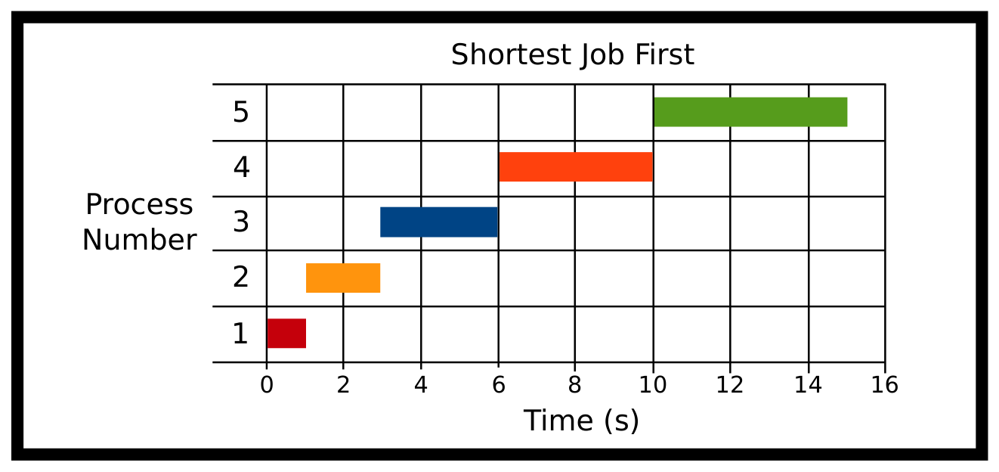
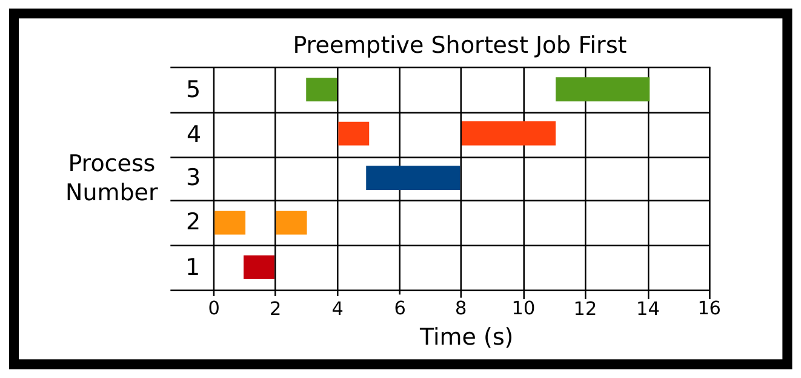
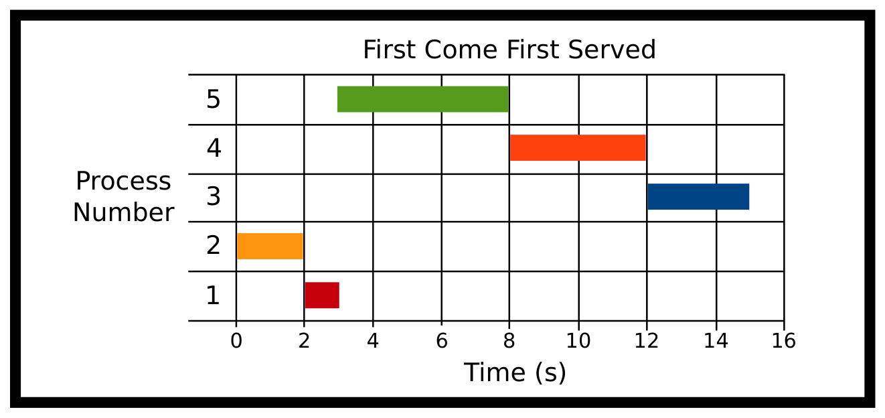
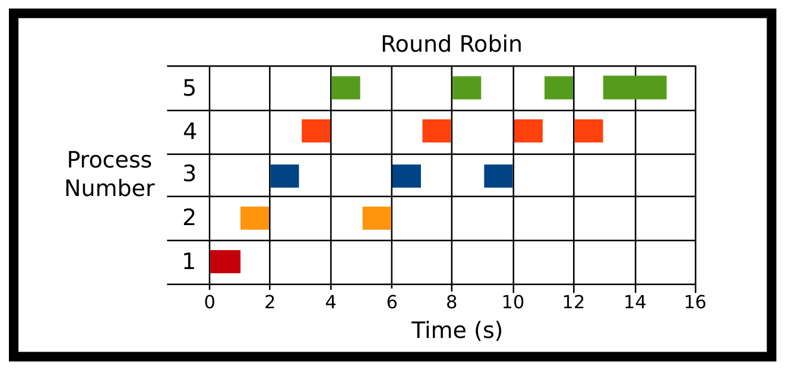

# Chương 10. Lập lịch (Scheduling)

> Bản dịch tiếng Việt từ *System Programming Coursebook* (University of Illinois, CS 241) — B. Venkatesh, L. Angrave et al. Tài liệu gốc được phát hành theo giấy phép [CC BY 4.0](https://creativecommons.org/licenses/by/4.0/); bản dịch giữ nguyên giấy phép này. Nguồn: https://github.com/illinois-cs241/coursebook

> *(Đề từ của chương là lời bài hát "I'm Late" trong phim* Alice in Wonderland *của Disney — lời than của chú Thỏ Trắng rằng mình đã quá muộn, không kịp dừng lại dù chỉ để chào hỏi.)*
>
> — *Alice in Wonderland* (Alice ở xứ sở thần tiên)

Lập lịch CPU (CPU scheduling) là bài toán lựa chọn một cách hiệu quả process (tiến trình) nào sẽ được chạy trên các lõi (core) CPU của hệ thống. Trong một hệ thống bận rộn, số process sẵn sàng chạy sẽ nhiều hơn số lõi CPU, vì vậy kernel (nhân hệ điều hành) phải đánh giá xem process nào nên được lập lịch để chạy và process nào nên được thực thi sau. Hệ thống cũng phải quyết định liệu có nên lấy một process cụ thể ra và tạm dừng việc thực thi của nó – cùng với mọi thread (luồng) liên quan – hay không. Sự cân bằng nằm ở chỗ dừng các process đủ thường xuyên để bạn có một máy tính phản hồi nhanh, nhưng cũng đủ thưa để bản thân các chương trình chỉ tốn rất ít thời gian cho việc context switch (chuyển ngữ cảnh). Đây là một sự cân bằng rất khó đạt được cho đúng.

Sự phức tạp bổ sung của đa luồng và nhiều lõi CPU được xem là gây xao nhãng cho phần trình bày ban đầu này, nên sẽ được bỏ qua ở đây. Một điểm dễ gây nhầm lẫn khác đối với người không nói tiếng Anh bản ngữ là nghĩa kép của từ "Time" (thời gian): từ "Time" có thể được dùng theo cả nghĩa thời điểm trên đồng hồ lẫn nghĩa khoảng thời gian trôi qua. Ví dụ: "The arrival time of the first process was 9:00am." (Thời điểm đến của process đầu tiên là 9:00 sáng) và "The running time of the algorithm is 3 seconds" (Thời gian chạy của thuật toán là 3 giây).

Một điều chúng tôi cần làm rõ là việc lập lịch mà chúng ta bàn đến chủ yếu là lập lịch ngắn hạn (short-term), hay lập lịch CPU. Nghĩa là chúng ta sẽ giả định rằng các process đã nằm trong bộ nhớ và sẵn sàng chạy. Các loại lập lịch khác là lập lịch dài hạn (long-term) và trung hạn (medium-term). Scheduler (bộ lập lịch) dài hạn đóng vai trò người gác cổng cho thế giới xử lý. Khi một process yêu cầu thực thi một process khác, nó có thể trả lời process đó là có, không, hoặc chờ. Scheduler trung hạn xử lý những tình huống đặc biệt khi cần chuyển một process từ trạng thái tạm dừng trong bộ nhớ sang trạng thái tạm dừng trên đĩa, khi có quá nhiều process hoặc khi biết rằng một số process chỉ dùng một lượng chu kỳ CPU không đáng kể. Hãy nghĩ về một process chỉ kiểm tra thứ gì đó mỗi giờ một lần.

## 10.1 Tổng quan về scheduler ở mức cao (High Level Scheduler Overview)

Scheduler là những phần mềm. Thực tế, bạn hoàn toàn có thể tự cài đặt scheduler! Nếu được cho một danh sách các lệnh cần `exec`, một chương trình có thể lập lịch chúng bằng `SIGSTOP` và `SIGCONT`. Những scheduler như vậy được gọi là scheduler ở không gian người dùng (user space scheduler). Hadoop và Celery của Python có thể thực hiện một dạng lập lịch ở không gian người dùng nào đó, hoặc làm việc trực tiếp với hệ điều hành.

Ở mức hệ điều hành, nhìn chung bạn sẽ có một lưu đồ kiểu như sau, được mô tả bằng lời trước ở bên dưới. Lưu ý: xin đừng cố học thuộc tất cả các trạng thái.

1. **New** (mới) là trạng thái khởi đầu. Một process đã được yêu cầu lập lịch. Mọi yêu cầu tạo process đều đến từ `fork` hoặc `clone`. Tại thời điểm này, hệ điều hành biết rằng nó cần tạo một process mới.

2. Process chuyển từ trạng thái new sang **ready** (sẵn sàng). Điều này có nghĩa là mọi struct cần thiết trong kernel đã được cấp phát. Từ đây, nó có thể chuyển sang trạng thái ready suspended (sẵn sàng nhưng bị treo) hoặc running (đang chạy).

3. **Running** (đang chạy) là trạng thái mà chúng ta hy vọng phần lớn process của mình đang ở trong đó, nghĩa là chúng đang làm việc hữu ích. Một process có thể bị preempt (bị chiếm quyền), bị block (bị chặn), hoặc kết thúc. Preemption đưa process trở về trạng thái ready. Nếu một process bị block, điều đó có nghĩa là nó có thể đang chờ một mutex lock, hoặc có thể đã gọi `sleep` – dù thế nào thì nó cũng đã tự nguyện từ bỏ quyền điều khiển.

4. Ở trạng thái **blocked** (bị chặn), hệ điều hành có thể chuyển process sang ready, hoặc process có thể đi vào một trạng thái sâu hơn gọi là blocked suspended (bị chặn và bị treo).

5. Có những trạng thái được gọi là "ngủ sâu" (deep slumber) là blocked suspended và blocked ready. Bạn không cần bận tâm đến chúng.

Chúng ta sẽ cố gắng chọn một cơ chế quyết định khi nào một process nên chuyển sang trạng thái running, và khi nào nên đưa nó trở lại trạng thái ready. Chúng ta sẽ không đề cập nhiều đến cách tính đến các trạng thái bị chặn tự nguyện, cũng như khi nào thì chuyển sang các trạng thái ngủ sâu.

## 10.2 Các phép đo (Measurements)

Lập lịch ảnh hưởng đến hiệu năng của hệ thống, cụ thể là latency (độ trễ) và throughput (thông lượng) của hệ thống. Throughput có thể được đo bằng một giá trị của hệ thống, ví dụ throughput I/O – số bit được ghi mỗi giây, hoặc số process nhỏ có thể hoàn thành trong một đơn vị thời gian. Latency có thể được đo bằng response time (thời gian phản hồi) – khoảng thời gian trôi qua trước khi một process có thể bắt đầu gửi phản hồi – hoặc wait time (thời gian chờ), hoặc turnaround time (thời gian hoàn thành) – khoảng thời gian trôi qua để hoàn tất một tác vụ. Các scheduler khác nhau đưa ra những sự đánh đổi tối ưu hoá khác nhau, có thể phù hợp với mục đích sử dụng mong muốn. Không có scheduler nào là tối ưu cho mọi môi trường và mọi mục tiêu. Ví dụ, Shortest Job First sẽ tối thiểu hoá tổng wait time trên tất cả các công việc, nhưng trong môi trường tương tác (giao diện người dùng – UI) thì tốt hơn là tối thiểu hoá response time với cái giá là hy sinh một phần throughput; trong khi đó FCFS có vẻ công bằng một cách trực quan và dễ cài đặt nhưng lại chịu ảnh hưởng của Convoy Effect (hiệu ứng đoàn xe). Arrival time (thời điểm đến) là thời điểm một process lần đầu tiên đến ready queue (hàng đợi sẵn sàng) và sẵn sàng bắt đầu thực thi. Nếu CPU đang rảnh, arrival time cũng chính là thời điểm bắt đầu thực thi.

### 10.2.1 Preemption là gì?

Không có preemption (chiếm quyền / ưu tiên trước), các process sẽ chạy cho đến khi chúng không thể sử dụng CPU thêm nữa. Ví dụ, các điều kiện sau sẽ đưa một process ra khỏi CPU và CPU trở nên sẵn sàng để được lập lịch cho các process khác: process kết thúc do một signal (tín hiệu), bị block khi chờ một concurrency primitive (primitive đồng thời), hoặc thoát bình thường. Do đó, một khi process đã được lập lịch, nó sẽ tiếp tục chạy ngay cả khi một process khác có độ ưu tiên cao xuất hiện trên ready queue.

Với preemption, các process hiện có có thể bị loại ra ngay lập tức nếu một process được ưu tiên hơn được thêm vào ready queue. Ví dụ, giả sử tại $t=0$ với scheduler Shortest Job First có hai process (P1, P2) với thời gian thực thi lần lượt là 10 và 20 ms. P1 được lập lịch. P1 ngay lập tức tạo ra một process mới P3 với thời gian thực thi 5 ms, và P3 được thêm vào ready queue. Không có preemption, P3 sẽ chạy sau đó 10 ms (sau khi P1 hoàn thành). Với preemption, P1 sẽ bị đẩy khỏi CPU ngay lập tức và được đặt trở lại ready queue, còn P3 sẽ được CPU thực thi thay thế.

Bất kỳ scheduler nào không dùng một dạng preemption nào đó đều có thể dẫn đến starvation (đói tài nguyên), bởi vì những process đến trước có thể không bao giờ được lập lịch để chạy (được gán CPU). Ví dụ với SJF, các công việc dài có thể không bao giờ được lập lịch nếu hệ thống liên tục có nhiều công việc ngắn cần lập lịch. Tất cả phụ thuộc vào loại scheduler.

### 10.2.2 Vì sao một process (hoặc thread) có thể được đặt vào ready queue?

Một process được đặt vào ready queue khi nó có thể sử dụng CPU. Một số ví dụ bao gồm:

- Một process đã bị block để chờ một thao tác đọc từ thiết bị lưu trữ hoặc socket hoàn tất, và giờ dữ liệu đã sẵn sàng.

- Một process mới đã được tạo và sẵn sàng bắt đầu.

- Một thread của process đã bị block trên một primitive đồng bộ hoá (condition variable, semaphore, mutex lock) nhưng giờ đã có thể tiếp tục.

- Một process đang bị block để chờ một system call (lời gọi hệ thống) hoàn tất, nhưng một signal đã được chuyển đến và signal handler (hàm xử lý tín hiệu) cần được chạy.

## 10.3 Các thước đo hiệu quả (Measures of Efficiency)

Trước hết là một số định nghĩa:

1. `start_time` là thời điểm bắt đầu theo đồng hồ thực (wall-clock) của process (CPU bắt đầu làm việc với nó)

2. `end_time` là thời điểm kết thúc theo đồng hồ thực của process (CPU hoàn tất process)

3. `run_time` là tổng lượng thời gian CPU cần thiết

4. `arrival_time` là thời điểm process đi vào scheduler (CPU có thể bắt đầu làm việc với nó)

Dưới đây là các thước đo hiệu quả và công thức toán học của chúng:

1. **Turnaround Time** (thời gian hoàn thành) là tổng thời gian từ khi process đến cho tới khi nó kết thúc: `end_time - arrival_time`

2. **Response Time** (thời gian phản hồi) là tổng độ trễ (thời gian) tính từ khi process đến cho tới khi CPU thực sự bắt đầu làm việc với nó: `start_time - arrival_time`

3. **Wait Time** (thời gian chờ) là tổng thời gian chờ, hay tổng thời gian một process nằm trên ready queue. Một sai lầm phổ biến là cho rằng đó chỉ là thời gian chờ ban đầu trong ready queue. Nếu một process thiên về tính toán CPU, không có I/O, cần 7 phút thời gian CPU để hoàn thành nhưng lại mất 9 phút theo đồng hồ thực mới xong, ta có thể kết luận rằng nó đã bị đặt trên ready queue trong 2 phút. Trong 2 phút đó, process đã sẵn sàng chạy nhưng không được gán CPU. Việc công việc phải chờ vào lúc nào không quan trọng, wait time vẫn là 2 phút: `end_time - arrival_time - run_time`

### 10.3.1 Hiệu ứng đoàn xe (Convoy Effect)

Convoy Effect là hiện tượng một process chiếm dụng rất nhiều thời gian CPU, khiến tất cả các process khác – vốn có thể chỉ cần ít tài nguyên hơn – phải nối đuôi theo sau nó như một đoàn xe (convoy).

Giả sử CPU hiện đang được gán cho một tác vụ thiên về tính toán CPU (CPU-intensive), và có một tập các process thiên về I/O (I/O-intensive) đang nằm trong ready queue. Các process này chỉ cần một lượng thời gian CPU rất nhỏ, nhưng chúng không thể tiến triển vì đang phải chờ tác vụ CPU-intensive kia bị đưa ra khỏi bộ xử lý. Các process này bị starvation cho đến khi process CPU-bound nhả CPU. Nhưng CPU sẽ hiếm khi được nhả ra. Ví dụ, trong trường hợp scheduler FCFS, chúng ta phải chờ cho đến khi process đó bị block do một yêu cầu I/O. Lúc này các process I/O-intensive cuối cùng cũng có thể thoả mãn nhu cầu CPU của mình – và chúng làm điều đó rất nhanh vì nhu cầu CPU của chúng nhỏ – rồi CPU lại được gán trở lại cho process CPU-intensive. Như vậy hiệu năng I/O của toàn hệ thống bị suy giảm thông qua một hệ quả gián tiếp của việc nhu cầu CPU của mọi process bị starvation.

Hiệu ứng này thường được bàn đến trong bối cảnh scheduler FCFS; tuy nhiên, scheduler Round Robin cũng có thể thể hiện Convoy Effect khi time quantum (lát thời gian) quá dài.

## 10.4 Các thuật toán lập lịch (Scheduling Algorithms)

Trừ khi có ghi chú khác, các ví dụ dưới đây dùng các process sau:

| Process | Thời gian chạy (runtime) |
|---|---|
| Process 1 | 1000 ms |
| Process 2 | 2000 ms |
| Process 3 | 3000 ms |
| Process 4 | 4000 ms |
| Process 5 | 5000 ms |

### 10.4.1 Shortest Job First (SJF) — công việc ngắn nhất trước

*Hình 10.1: Lập lịch Shortest Job First*

| Process | Thời điểm đến (arrival) |
|---|---|
| P1 | 0 ms |
| P2 | 0 ms |
| P3 | 0 ms |
| P4 | 0 ms |
| P5 | 0 ms |

Tất cả các process đều đến ngay từ đầu, và scheduler lập lịch cho công việc có tổng thời gian CPU ngắn nhất. Vấn đề rõ rành rành là scheduler này cần biết chương trình sẽ chạy trong bao lâu trước cả khi nó chạy chương trình đó.

**Ghi chú kỹ thuật:** Một cài đặt SJF thực tế sẽ không dùng tổng thời gian thực thi của process, mà dùng burst time (thời gian bùng nổ CPU) – số chu kỳ CPU cần thiết để hoàn thành một chương trình. Burst time kỳ vọng có thể được ước lượng bằng trung bình trượt có trọng số suy giảm theo hàm mũ (exponentially decaying weighted rolling average) dựa trên các burst time trước đó [1, Chương 6]. Trong phần trình bày này, chúng ta sẽ đơn giản hoá bằng cách dùng tổng thời gian chạy của process làm đại diện cho burst time.

**Ưu điểm**

1. Các công việc ngắn hơn có xu hướng được chạy trước

2. Tính trung bình, wait time và response time đều giảm

**Nhược điểm**

1. Đòi hỏi thuật toán phải "biết tuốt" (omniscient)

2. Cần ước lượng tính bùng nổ (burstiness) của một process, việc này khó hơn so với, chẳng hạn, trong mạng máy tính

### 10.4.2 Preemptive Shortest Job First (PSJF) — công việc ngắn nhất trước, có chiếm quyền

Preemptive Shortest Job First giống như Shortest Job First, nhưng nếu một công việc mới đến có thời gian chạy ngắn hơn tổng thời gian chạy của công việc hiện tại thì công việc mới sẽ được chạy thay thế. Nếu bằng nhau, như trong ví dụ của chúng ta, thuật toán có thể tuỳ ý chọn. Scheduler này dùng tổng thời gian chạy của process. Nếu scheduler muốn so sánh thời gian còn lại ngắn nhất, đó là một biến thể của PSJF gọi là Shortest Remaining Time First (SRTF).

*Hình 10.2: Lập lịch Preemptive Shortest Job First*

| Process | Thời điểm đến (arrival) |
|---|---|
| P2 | 0 ms |
| P1 | 1000 ms |
| P5 | 3000 ms |
| P4 | 4000 ms |
| P3 | 5000 ms |

Đây là những gì thuật toán của chúng ta làm. Nó chạy P2 vì đó là thứ duy nhất có thể chạy. Rồi P1 đến ở thời điểm 1000 ms; P2 chạy trong 2000 ms, nên scheduler dừng P2 theo kiểu preemptive và để P1 chạy một mạch cho đến hết. Điều này hoàn toàn tuỳ thuộc vào thuật toán vì các thời gian là bằng nhau. Sau đó P5 đến – vì không có process nào đang chạy, scheduler sẽ chạy process 5. P4 đến, và vì thời gian chạy bằng với P5, scheduler dừng P5 và chạy P4. Cuối cùng, P3 đến, chiếm quyền của P4 và chạy đến khi hoàn thành. Rồi P4 chạy, rồi P5 chạy.

**Ưu điểm**

1. Đảm bảo các công việc ngắn hơn được chạy trước

**Nhược điểm**

1. Lại cần biết trước thời gian chạy

2. Có context switch, và các công việc có thể bị ngắt giữa chừng

### 10.4.3 First Come First Served (FCFS) — đến trước phục vụ trước

*Hình 10.3: Lập lịch First Come First Served*

| Process | Thời điểm đến (arrival) |
|---|---|
| P2 | 0 ms |
| P1 | 1000 ms |
| P5 | 3000 ms |
| P4 | 4000 ms |
| P3 | 5000 ms |

Các process được lập lịch theo thứ tự đến. Một ưu điểm của FCFS là thuật toán lập lịch rất đơn giản: ready queue là một hàng đợi FIFO (first in first out – vào trước ra trước). FCFS chịu ảnh hưởng của Convoy Effect. Ở đây P2 đến, rồi P1 đến, rồi P5, rồi P4, rồi P3. Bạn có thể thấy Convoy Effect đối với P5.

**Ưu điểm**

- Thuật toán và cách cài đặt đơn giản

- Context switch xảy ra không thường xuyên khi có các process chạy lâu

- Không có starvation nếu mọi process đều được đảm bảo sẽ kết thúc

**Nhược điểm**

- Thuật toán và cách cài đặt đơn giản

- Context switch xảy ra không thường xuyên khi có các process chạy lâu

*(ND: bản gốc lặp lại nguyên văn hai mục đầu của phần Ưu điểm ở đây; bản dịch giữ nguyên để trung thành với nguồn.)*

### 10.4.4 Round Robin (RR) — xoay vòng

Các process được lập lịch theo thứ tự đến trong ready queue. Tuy nhiên, sau một bước thời gian nhỏ, process đang chạy sẽ bị buộc rời khỏi trạng thái running và đặt trở lại ready queue. Điều này đảm bảo các process chạy lâu không làm tất cả các process khác bị starvation. Khoảng thời gian tối đa mà một process có thể thực thi trước khi bị trả về ready queue được gọi là time quantum (lát thời gian). Khi time quantum tiến tới vô cùng, Round Robin sẽ tương đương với FCFS.

*Hình 10.4: Lập lịch Round Robin*

| Process | Thời điểm đến (arrival) |
|---|---|
| P1 | 0 ms |
| P2 | 0 ms |
| P3 | 0 ms |
| P4 | 0 ms |
| P5 | 0 ms |

Quantum = 1000 ms

Ở đây tất cả các process đến cùng lúc. P1 được chạy trong 1 quantum và hoàn thành. P2 chạy một quantum; sau đó nó bị dừng để nhường cho P3. Sau khi tất cả các process khác đều đã chạy một quantum, chúng ta quay vòng trở lại P2, cứ thế cho đến khi mọi process hoàn thành.

**Ưu điểm**

1. Đảm bảo một mức độ công bằng nhất định

**Nhược điểm**

1. Số lượng process lớn = rất nhiều lần chuyển đổi

### 10.4.5 Priority — theo độ ưu tiên

Các process được lập lịch theo thứ tự giá trị độ ưu tiên. Ví dụ, một process dẫn đường (navigation) có thể cần được thực thi hơn là một process ghi log.

Nếu bạn cần một cách mang tính toán học hơn để so sánh các thuật toán lập lịch, hãy xem phần phụ lục và mục "Conceptually Scheduling" (Lập lịch về mặt khái niệm).

## 10.5 Chủ đề (Topics)

- Các thuật toán lập lịch (Scheduling Algorithms)

- Các thước đo hiệu quả (Measures of Efficiency)

## 10.6 Câu hỏi (Questions)

- Lập lịch (scheduling) là gì?

- Xếp hàng đợi (queueing) là gì? Có những phương pháp xếp hàng đợi khác nhau nào?

- Turnaround time là gì? Response time? Wait time?

- Convoy Effect là gì?

- Những thuật toán nào có turnaround/response/wait time trung bình tốt nhất?

- Các thuật toán preemptive có response time trung bình tốt hơn so với các thuật toán non-preemptive không? Còn turnaround/wait time thì sao?

## Tài liệu tham khảo (Bibliography)

[1] A. Silberschatz, P.B. Galvin, and G. Gagne. *Operating System Concepts*. Wiley, 2005. ISBN 9780471694663. URL https://books.google.com/books?id=FH8fAQAAIAAJ.
